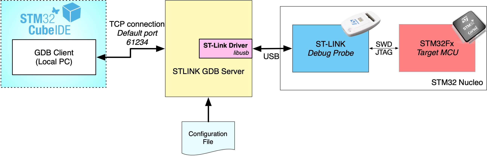
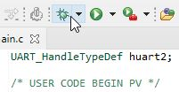
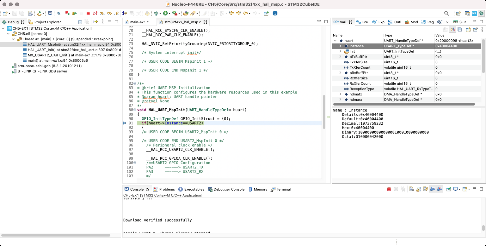
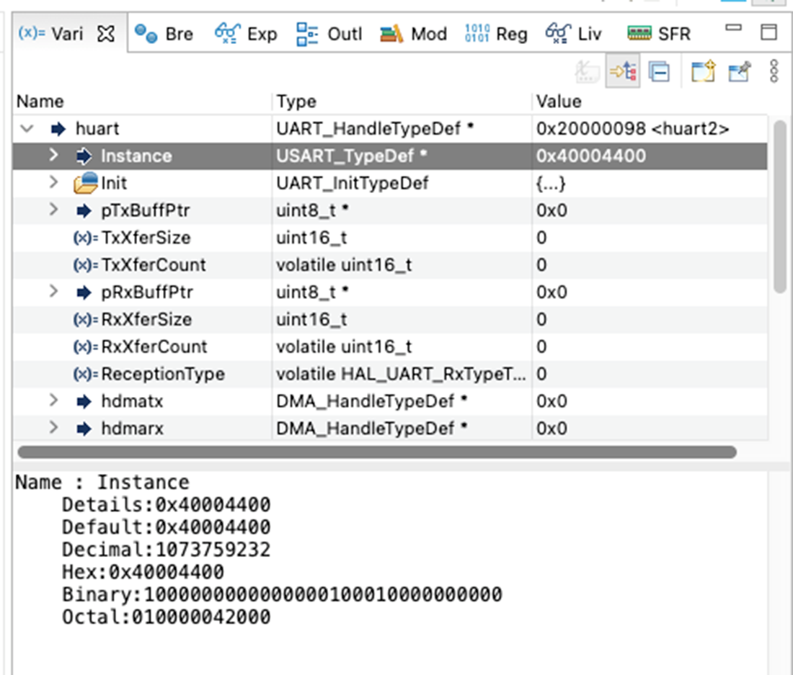
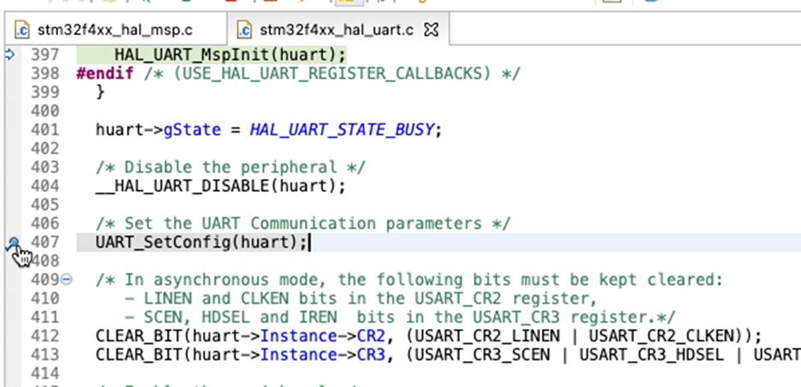
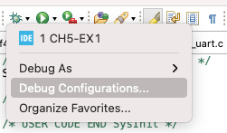
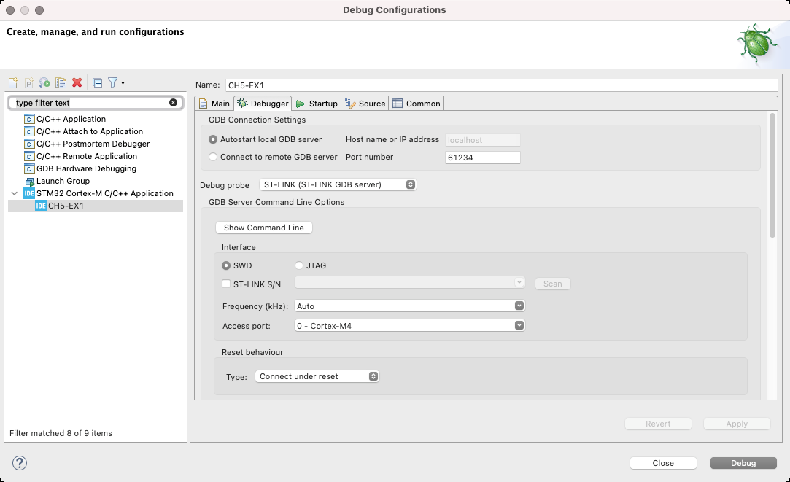
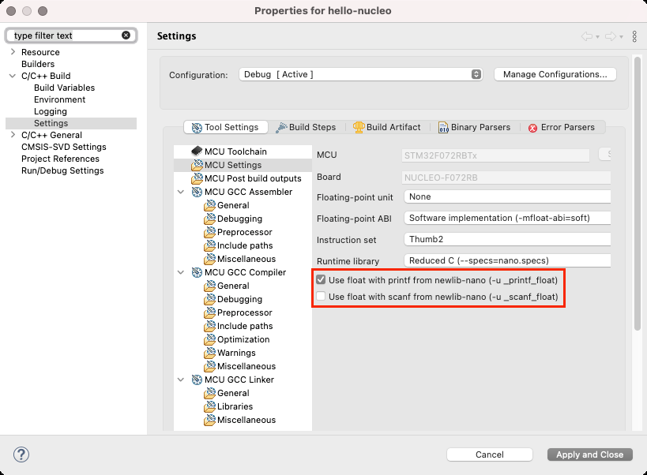

<!-- page: 147 -->

# 5. 调试入门

我的一位朋友曾对我说，编程的核心就是调试。这话确实不假。无论我们多么努力编写优秀的代码，迟早都要面对软件缺陷（硬件缺陷则是另一头可怕的怪兽）。而对于嵌入式软件而言，良好的调试能力是成为一名快乐的嵌入式开发者的关键。

在本章中，我们将开始使用 STM32CubeIDE 提供的最基本的调试功能。正如我们将看到的，STM32CubeIDE 提供了一套强大的调试工具，使我们能够轻松地调查缺陷和不期望的行为。此外，ST 在将调试工具集成到 Eclipse 中方面做得非常出色：使用这些工具简单且自然，无需像过去那样使用外部程序或额外的硬件工具。如今，你只需要一个廉价的 ST-LINK 调试探针和 STM32CubeIDE 即可。

本章是对调试过程的初步概览，即使对于像 STM32 这样相对简单的架构，要详尽描述调试过程也足以写成一本书。第 24 章将深入探讨其他调试工具，并重点介绍 Cortex-M 异常机制，这是该平台的一个显著特性。

## 5.1 调试会话背后的原理

在了解如何启动调试会话以及如何执行典型的调试操作（如添加断点、单步执行、步入等）之前，最好先快速了解一下涉及的软件和硬件工具。图 5.1 试图提供一个幕后调试设置的概览。

在基于 GCC 的开发环境中，执行调试操作的基本工具是 GNU 调试器（GDB）。GDB 是一个带有集成 shell 和相当多的命令及选项的命令行工具。GDB 的设计遵循与 GCC 相同的理念：它抽象了具体的目标架构（x86、MIPS、ARM 等）、具体的编程语言（C、C++ 等）以及具体的主机操作系统（Windows、Linux、MacOS 等）。

为了在如此不同的目标架构之间强制实现这种可移植性，GDB 在设计上强烈分离了前端部分（即真正的 GDB 内核，负责二进制文件操作、解释目标文件中的调试信息等）和后端部分（后者了解与目标硬件和软件架构相关的所有细节）。因此，人们常说 GDB 具有客户端和服务器部分，它们通过一个定义良好的协议经由网络连接进行通信。显然，这种连接可以在两台分离的机器之间建立，也可以在同一个机器上建立。

<!-- page: 148 -->



图 5.1：OpenOCD 如何与 Nucleo 板交互

对于像 Cortex-M 这样的嵌入式架构，通常 ARM-GCC 发行版中并不提供服务器部分。这是因为在调试会话中总是涉及一个专用的调试适配器，这是一块硬件，它将（从物理和逻辑角度）“高级”命令转换为 JTAG 或 SWD 信号和指令。对于所有 Nucleo 板，这个适配器就是集成的 ST-LINK 接口¹。

因此，ST 为 GDB 提供了一个专用的后端服务器，称为 ST-LINK GDB Server，它通过 USB 连接使用 libusb 或任何 API 兼容的库（允许用户空间应用程序接口 USB 设备）与 ST-LINK 适配器通信。得益于包含在 STM32CubeIDE 发行版中的一组配置文件，ST-LINK GDB Server 知道如何处理特定的目标微控制器（STM32F030、STM32F401 等）、其特定的调试访问端口（DAB）、特定的 FLASH 存储器²、总线架构等。

当调试会话开始时，会发生以下主要操作³：

1. STM32CubeIDE 在后台执行 ST-LINK GDB Server，并传递多个命令行参数，指定诸如 STM32CubeProgrammer 的路径、用于接受来自 GDB 客户端连接的 TCP/IP 端口、要使用的调试模式类型（SWD、JTAG）、调试端口速度等⁴。如果 ST-LINK GDB Server 能够正确地与 ST-LINK 探针和目标板通信，它就开始在指定的 TCP/IP 端口（默认为 61234 端口）上等待命令。
2. 然后，STM32CubeIDE 执行 GDB 客户端，使用上述 TCP/IP 端口连接到远程 GDB 服务器（即 ST-LINK GDB Server）。
3. 接着，STM32CubeIDE 将二进制文件加载到目标微控制器的 FLASH 存储器中，并启动固件执行。

¹Nucleo ST-LINK 调试器被设计为可以作为独立适配器用于调试外部设备（例如，配备 STM32 微控制器的由您设计的板子）。请查阅您的 Nucleo 板文档以进行相应配置。
²关于 STM32 平台的一个常见误解是所有 STM32 设备都有共同且标准化的方式来访问其内部 FLASH。事实并非如此，因为每个 STM32 系列在包括内部 FLASH 在内的外设方面都有特定的能力。这要求 ST-LINK GDB Server 提供驱动程序来处理所有 STM32 设备。
³请注意，以下步骤是对调试会话中实际执行的操作的非常简化的视图。省略了许多细节，因为详细描述需要对多个 Cortex-M 细节、多个 STM32 技术细节以及 GDB 框架有相当的了解。
⁴完整的命令行参数集在相关用户手册中有详细记录，可通过此地址获取：https://bit.ly/3EfV2aH

<!-- page: 149 -->

最后，Eclipse-CDT 包含所有必要的逻辑，以便在后台驱动 GDB，同时用户可以自由使用 GUI 执行典型的调试操作，而无需知道任何 GDB shell 命令。

## 5.2 使用 STM32CubeIDE 进行调试

Eclipse 提供了一个专门用于调试的独立透视图（Perspective）。它旨在提供调试过程中所需的大部分工具，并且可以根据需要添加额外的插件进行自定义（稍后会有更多介绍）。



图 5.2：在 Eclipse 中开始调试的调试图标

要开始一个新的调试会话，只需点击 Eclipse 工具栏上的调试图标，如图 5.2 所示。Eclipse 会询问您是否要切换到调试透视图。点击“是”按钮（强烈建议勾选“记住我的决定”复选框）。Eclipse 将切换到调试透视图，如图 5.3 所示。



图 5.3：调试透视图

让我们看看每个视图的用途。左上角的视图称为“调试”（Debug），它显示所有正在运行的调试活动。这是一个树形视图，当固件执行被暂停时，它会显示完整的调用栈，提供了一种在调用栈内快速导航的方式。

<!-- page: 150 -->



图 5.4：调试透视图中的变量检查面板

右上角的视图包含几个子面板。“变量”（Variables）面板提供了检查当前栈帧（即调用栈中选定的过程）中定义的变量内容的能力。使用鼠标右键点击被检查的变量，我们可以进一步自定义变量的显示方式。例如，我们可以将其数值表示从十进制（默认值）更改为十六进制或二进制形式。我们还可以将其强制转换为不同的数据类型（这在处理已知类型的原始数据量时非常有用——例如，来自流文件的一组字节）。我们还可以通过点击上下文菜单中的“查看内存...”（View Memory...）项，跳转到存储该变量的内存地址。“断点”（Breakpoint）面板列出了应用程序中使用的所有断点。断点是一种硬件原语，允许在程序计数器（PC）到达特定指令时停止固件的执行。当这种情况发生时，调试器停止，Eclipse 将显示暂停指令的上下文。每个 Cortex-M 基础 MCU 都有有限数量的硬件断点。表 5.1 总结了特定 Cortex-M 系列的最大断点数和观察点数⁵。

表 5.1：Cortex-M 内核中可用的断点/观察点

Cortex-M 断点 观察点 M0/0+ 4 2 M3/4/7/33 8 4

⁵实际上，观察点（watchpoint）是一种更高级的调试原语，允许对数据和外设寄存器定义条件断点，即只有当变量满足某个表达式时（例如 var == 10），MCU 才会停止执行。我们将在第 24 章中分析观察点。

<!-- page: 151 -->



图 5.5：如何在特定行号处添加断点

Eclipse 允许在调试透视图中央的编辑器视图中轻松地在代码内设置断点。要放置断点，只需双击编辑器左侧的灰色条纹，靠近我们希望暂停 MCU 执行的指令处。将出现一个蓝色圆点，如图 5.5 所示。

当程序计数器到达构成该行代码的第一条汇编指令时，执行将被暂停，Eclipse 将显示相应的代码行，如图 5.3 所示。一旦我们检查了代码，就有几个选项来恢复执行。表 5.2 解释了 Eclipse 调试工具栏上最相关图标的用法。

表 5.2：Eclipse 调试工具栏上最相关的图标

图标 描述


此图标用于忽略所有断点并继续执行，而不中断。


此图标用于对 MCU 进行软复位，而不停止调试并再次启动它。


此图标终止调试会话，开始构建项目并重新启动调试会话。


此图标在 MCU 到达断点或用户显式暂停后恢复调试会话。


此图标将代码执行暂停到下一个 C 语句。


此图标导致调试会话结束。GDB 被终止，目标板被暂停。


此图标是用于逐步调试的两个图标中的第一个。当我们逐行执行固件时，进入被调用的例程可能很重要。此图标允许这样做，否则下一个图标才是执行当前栈帧内下一条指令所需的。

<!-- page: 152 -->

表 5.2：Eclipse 调试工具栏上最相关的图标

图标 描述


此图标有一个——不幸的是——反直觉的名称。它被称为“单步跳过”（step over），其名称可能暗示“跳过下一条指令”（即越过）。但此图标是用于执行下一条指令的。它的名称来源于这样一个事实：与上一个图标不同，它执行被调用的例程而不进入其中。


点击此图标后，执行将恢复，MCU 将继续运行直到当前例程的退出（即返回）。执行将精确停止在调用函数中的下一条指令处。

最后，在右侧的视图中，你可以找到另外两个有趣的视图：SFR 和寄存器（Registers）。它们分别显示给定 STM32 MCU 中所有硬件寄存器的内容和所有 Cortex-M 内核寄存器的内容。它们在理解外设或 Cortex-M 内核的当前状态时非常有用。在第 24 章关于调试的内容中，我们将看到如何处理 Cortex-M 异常，并学习如何解释某些重要 Cortex-M 寄存器的内容。

### 5.2.1 调试配置

Eclipse 是一款通用且高度可配置的集成开发环境（IDE），允许创建多个调试配置，以轻松适应我们的开发场景。到目前为止，我们只是通过点击工具栏上对应的图标（参见图 5.2）来启动调试会话。然而，当我们第一次点击该图标时，实际上是要求 STM32CubeIDE 自动为我们配置调试操作。



图 5.6：调试上下文菜单

通过点击调试图标附近的向下箭头，我们可以访问调试上下文菜单（参见图 5.6）。选择“Debug Configurations…”（调试配置…），我们可以访问所有调试配置，如图 5.7 所示。

<!-- page: 153 -->



图 5.7：调试配置对话框

该视图分为两个主要窗格。左侧是一个包含多种配置类型的树形窗格。我们感兴趣的是 STM32 Cortex-M C/C++ Application（STM32 Cortex-M C/C++ 应用程序）。展开该条目后，可以看到为我们创建的调试配置（配置名称与项目名称对应）。右侧是一个包含多个选项卡的选项卡窗格。其中最值得注意的是 Main（主）、Debugger（调试器）和 Startup（启动）。

Main（主）选项卡主要包含项目名称以及要在目标微控制器（MCU）上加载以启动调试会话的二进制文件。Debugger（调试器）视图包含用于配置调试会话的几个相关选项。其中一些选项是高级主题，我们将在后续章节中讨论。在这里，我们将描述最重要的几个选项。

- GDB Connection Settings（GDB 连接设置）：这组设置与 GDB Server（GDB 服务器）的配置有关。我们可以选择连接本地服务器或远程服务器，以及其 IP 地址和端口号。强烈建议保持所有选项不变。
- Debug Probe（调试探针）：STM32CubeIDE 支持三种不同的调试探针（标准的 ST-LINK、SEGGER J-Link 和 OpenOCD）。本文假设使用集成在 Nucleo 开发板中的 ST-LINK 调试探针。然而，我们将在后续章节中讨论另外两种探针。
- Interface（接口）：通过这些设置，您可以选择使用哪个 MCU 调试端口。大多数 STM32 MCU 同时支持 JTAG 和 SWD 接口。在本书中，我们假设使用 SWD 接口。

<!-- page: 154 -->

Reset behavior（复位行为）部分需要更深入的说明。有时会出现无法使用 ST-LINK 对 MCU 进行闪存或调试的情况。另一个可识别的症状是 ST-LINK LD1 LED（在板子处于调试状态时交替闪烁红色和绿色的那个）停止闪烁，并且两个 LED 保持常亮。当这种情况发生时，意味着 ST-LINK 调试器无法访问目标 MCU 的调试端口（通过 SWD 接口），或者闪存被锁定，阻止调试器访问。

导致这种故障状态通常有两个原因：

- SWD 引脚被配置为通用输入/输出（general-purpose input/output）（GPIO）（如果我们在 CubeMX 中执行引脚配置复位，这种情况经常发生）。
- MCU 处于深度低功耗模式，该模式会关闭调试端口。
- 选项字节配置存在问题（可能闪存已被写保护或读保护级别 1 已开启）。

为了解决这个问题，我们必须强制 ST-LINK 调试器在保持其 nRST 引脚为低电平的同时连接到目标 MCU。此操作称为复位下连接（connection under reset），可以通过选择一种复位行为来执行，这些行为描述如下。

- Connect under reset (default)（复位下连接（默认））：ST-LINK 复位线被激活，ST-LINK 在复位激活期间以 SWD 或 JTAG 模式连接。然后复位线被去激活。
- Software system reset（软件系统复位）：通过软件写入 RCC 寄存器来激活系统复位。这会复位内核和外设，并且由于目标复位引脚被自身拉低，可以复位整个系统。
- Hardware reset（硬件复位）：ST-LINK 复位线被激活和去激活（复位线上的脉冲），然后 ST-LINK 以 SWD 或 JTAG 模式连接。
- Core reset（内核复位）：通过软件写入 Cortex-M 寄存器来激活内核复位（在 Cortex®‑M0/0+/33 内核上不可行）。这仅复位内核，不复位外设或复位引脚。
- None（无）：用于附加到已下载程序到设备中的运行目标。Startup（启动）选项卡中不得有任何文件程序命令。

Startup（启动）选项卡配置如何启动调试会话。Initialization Commands（初始化命令）编辑字段可以根据特殊需求更新为任何类型的 GDB 或 GDB 服务器监视器命令，以便在发送加载命令之前向 GDB 服务器发送一些命令。例如，当使用 ST-LINK GDB 服务器时，如果需要在加载前进行完整的 FLASH 存储器擦除，可以在此处输入 monitor flash mass_erase 命令。Load Image and Symbols（加载映像和符号）列表框必须包含要调试的文件。Runtime Options（运行时选项）部分包含复选框，用于设置起始地址和断点，并启用异常处理和恢复。Set breakpoint at（在...处设置断点）复选框默认启用，编辑字段显示 main。这意味着，默认情况下，当程序被调试时，会在 main() 例程处设置断点。这就是为什么每次调试会话开始时执行都会停在 main() 的原因。三个异常复选框用于在调试应用程序时更容易找到问题：

<!-- page: 155 -->

- Exception on divide by zero（除以零异常）：默认启用，以便在调试时更容易捕获除以零错误。
- Exception on unaligned access（非对齐访问异常）：可以启用，以便在存在非对齐内存访问时获取异常。
- Halt on exception（异常时暂停）：默认启用，以便在调试期间发生异常错误时程序执行暂停。

## 5.3 I/O 重定向 

在第 4 章中，我们讨论了使用标准 C I/O 原语（如 `printf()`/`scanf()`）在目标微控制器与外部世界之间交换数据的可能性。在调试过程中，通常无法使用断点，因为这会导致丢失相关事件。与此同时，在串行控制台⁶上打印几条消息对于理解固件⁷中出现的错误非常有帮助。最后，得益于 `printf()` 函数的字符串格式化功能，我们在打印简单整数时无需处理数据类型转换。

最简单且有效的解决方案是重新定义所需的系统调用（`_write()`、`_read()`、`_isatty()`、`_close()`、`_fstat()`），将 STDIN、STDOUT 和 STDERR 标准流重定向到 Nucleo USART2。可以通过以下方式轻松实现：

**Filename: CH5-EX1/Core/Src/retarget.c**

```c++
15 UART_HandleTypeDef *gHuart;
16
17 void RetargetInit(UART_HandleTypeDef *huart) {
18 gHuart = huart;
19
20 /* Disable I/O buffering for STDOUT stream, so that
21 * chars are sent out as soon as they are printed. */
22 setvbuf(stdout, NULL, _IONBF, 0);
23 }
24
25 int _isatty(int fd) {
26 if (fd >= STDIN_FILENO && fd <= STDERR_FILENO)
27 return 1;
28
29 errno = EBADF;
30 return 0;
31 }
32
33 int _write(int fd, char* ptr, int len) {
34 HAL_StatusTypeDef hstatus;
35
36 if (fd == STDOUT_FILENO || fd == STDERR_FILENO) {
37 hstatus = HAL_UART_Transmit(gHuart, (uint8_t *) ptr, len, HAL_MAX_DELAY);
38 if (hstatus == HAL_OK)
39 return len;
40 else
41 return EIO;
42 }
43 errno = EBADF;
44 return -1;
45 }
46
47 int _close(int fd) {
48 if (fd >= STDIN_FILENO && fd <= STDERR_FILENO)
49 return 0;
50
51 errno = EBADF;
52 return -1;
53 }
54
55 int _read(int fd, char* ptr, int len) {
56 HAL_StatusTypeDef hstatus;
57
58 if (fd == STDIN_FILENO) {
59 hstatus = HAL_UART_Receive(gHuart, (uint8_t *) ptr, 1, HAL_MAX_DELAY);
60 if (hstatus == HAL_OK)
61 return 1;
62 else
63 return EIO;
64 }
65 errno = EBADF;
66 return -1;
67 }
68
69 int _fstat(int fd, struct stat* st) {
70 if (fd >= STDIN_FILENO && fd <= STDERR_FILENO) {
71 st->st_mode = S_IFCHR;
72 return 0;
73 }
74
75 errno = EBADF;
76 return 0;
77 }
```

⁶要与串行控制台交互，您需要一个终端模拟器。有关更多信息，请遵循第 8 章中的说明。⁷为了完整性起见，CH5-EX1 中实现的解决方案速度并不快。原因有二。首先，它使用了 CubeHAL，而 CubeHAL 在实现时并未将代码速度作为基本要求。其次，它使用轮询模式驱动 UART：UART 本身并非高速外设，以轮询模式驱动它会使调用 `HAL_UART_Trasmit()` 的代码变得非常缓慢。即使打印几个字符的字符串也会显著拖慢代码速度。因此，请将 `retarget.c` 仅视为一个基础示例。应使用中断模式或 - 更好的是 - DMA 模式来编码。我们将在后文中学习这些高级主题。

<!-- page: 156 -->

除了 USART 外设的使用部分（我们将在第 8 章中学习），代码相当自解释。最相关的函数是 `_write()` 和 `_read()`，它们利用

<!-- page: 157 -->

`HAL_UART_*` 例程通过 UART 交换数据。

要在固件中重定向标准流，只需调用 `RetargetInit()` 初始化库，并传入 UART2 的 `UART_HandleTypeDef` 实例指针（第 46 行）。例如，以下代码展示了如何在固件中使用 `printf()`/`scanf()` 函数：

**Filename: CH5-EX1/Core/Src/main.c**

```c++
1 #include "main.h"
2 #include <retarget.h>
3 #include <stdio.h>
4
5 /* Private variables ---------------------------------------------------------*/
6 UART_HandleTypeDef huart2;
7
8 /* Private function prototypes -----------------------------------------------*/
9 void SystemClock_Config(void);
10 static void MX_GPIO_Init(void);
11 static void MX_USART2_UART_Init(void);
12
13 int main(void) {
14 uint8_t uTimes = 0;
15
16 /* Reset of all peripherals, Initializes the Flash interface and the Systick. */
17 HAL_Init();
18 /* Configure the system clock */
19 SystemClock_Config();
20
21 /* Initialize all configured peripherals */
22 MX_GPIO_Init();
23 MX_USART2_UART_Init();
24 /* Enables retarget of standard I/O over the USART2 */
25 RetargetInit(&huart2);
26
27 printf("How many times to print the message?: ");
28 scanf("%hhu", &uTimes);
29 printf("\r\n");
30
31 for(uint8_t i = 0; i < uTimes;) {
32 HAL_Delay(500);
33 printf("Hello, Nucleo: %u \r\n", ++i);
34 }
35 while(1);
36 }
```

请注意，本示例假设项目是按照第 3 章中所示的相同步骤生成的。如果现在并非所有内容都清晰明了，请不要担心：在阅读完第 8 章后，您将能够理解所执行的每一项操作。

<!-- page: 158 -->


### printf() and float datatypes.


如果您打算使用 printf()/scanf() 函数在串行控制台上打印/读取浮点数据类型（或者如果您打算使用 sprintf() 及类似例程），您需要显式启用 newlib-nano 中的浮点支持，newlib-nano 是嵌入式系统中更紧凑的 C 运行时库版本。为此，请前往 Project->Properties… 菜单，然后进入 C/C++ Build->Settings->MCU Settings，并根据您的功能需求勾选 Use float with printf from newlib-nano 和 Use float with scanf from newlib-nano，如图 5.8 所示。这将增加固件二进制文件的大小。



图 5.8：如何在 printf() 和 scanf() 中启用浮点支持

<!-- page: 159 -->

II 深入硬件抽象层

[原文提取异常，第159页]
