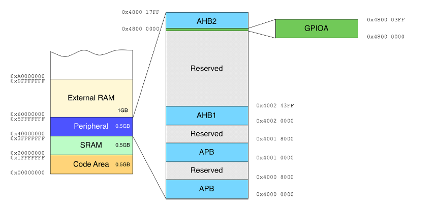
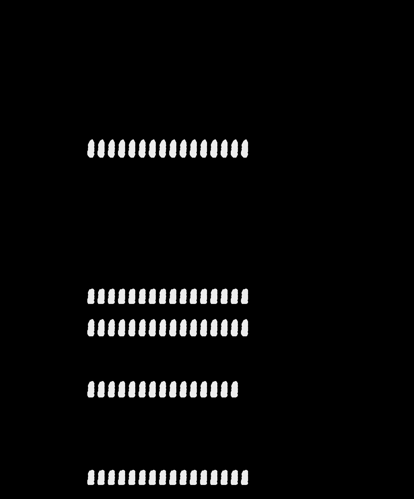
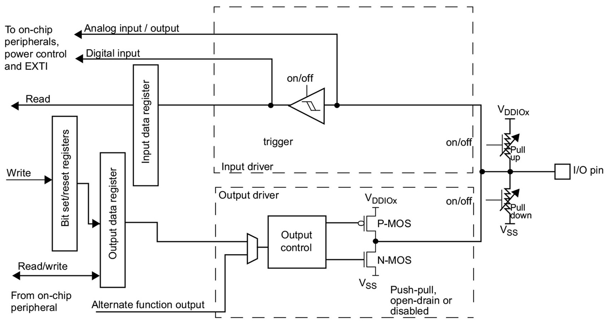
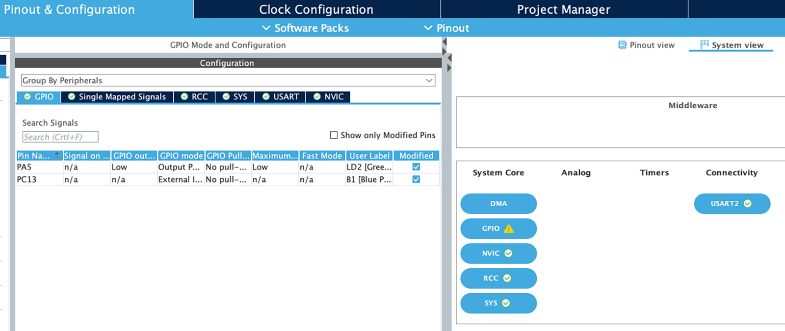
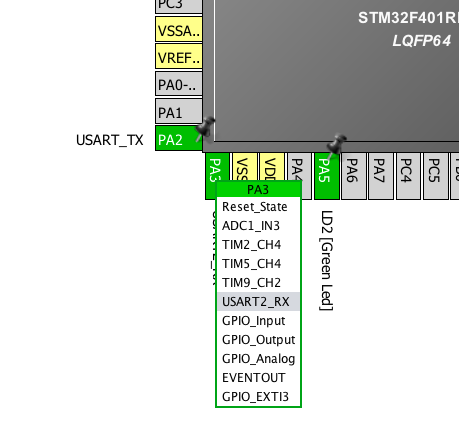
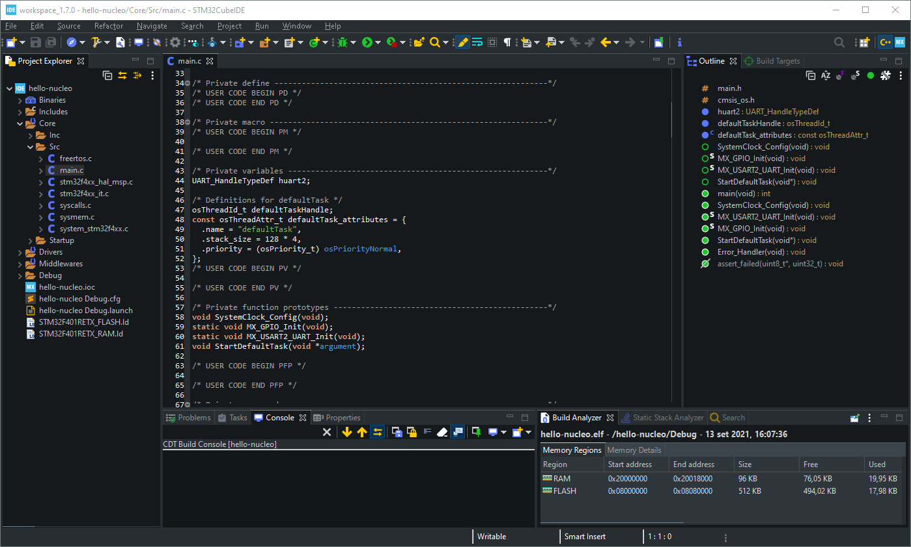

<!-- page: 160 -->

# 6. GPIO 管理

所有 STM32 微控制器都具有可变数量的通用可编程输入/输出（GPIO）。具体数量取决于：

- 所选的封装类型（如 LQFP48、BGA176 等）。
- 微控制器的系列（F0、F1 等）。
- 是否使用外部晶振用于 HSE 和 LSE。

GPIO 是 MCU 与外部世界通信的方式。每个电子板卡都使用可变数量的 I/O 来驱动外部外设（例如 LED）或通过多种类型的通信外设（UART、USB、SPI 等）交换数据。

本章通过查看 CubeHAL 中最简单的模块之一：HAL_GPIO，开始了我们在 CubeHAL 内部的旅程。我们已经在本书早期的示例中使用过该模块的几个函数，但现在正是理解如此简单且常用的外设所提供的所有可能性的合适时机。然而，在我们开始描述 HAL 功能之前，最好先快速了解一下 STM32 外设如何映射到逻辑地址，以及它们在 HAL 库中是如何表示的。

## 6.1 STM32 外设映射与 HAL 外设寄存器结构体

每个 STM32 外设都通过多个级别的总线与 MCU 内核互连，如图 6.1¹ 所示。

¹ 此处，为了简化主题，我们考虑的是最简单的 STM32 微控制器之一，即 STM32F072 的总线组织。例如，STM32F4 和 STM32F7 具有更先进的总线互连系统，这超出了本书的范围。请始终参考您的 MCU 参考手册。

<!-- page: 161 -->

<p align="center"></p>

<p align="center">图 6.1：STM32F072 微控制器的总线架构</p>

- 系统总线将 Cortex-M 内核的系统总线连接到总线矩阵（Bus Matrix），该矩阵管理内核和直接存储器访问（DMA）之间的仲裁。内核和 DMA 都作为主设备（master）运行。
- DMA 总线将 DMA 的 AHB（Advanced High-performance Bus，高性能总线）主接口连接到总线矩阵，该矩阵管理 CPU 和 DMA 对 SRAM、闪存内存和外设的访问。
- 总线矩阵管理内核系统总线和 DMA 主总线之间的访问仲裁。仲裁使用轮转（Round-Robin）算法。总线矩阵由两个主设备（CPU、DMA）和四个从设备（FLASH 内存接口、SRAM、带 AHB-APB 桥的 AHB1 以及 AHB2）组成。AHB 外设通过总线矩阵连接到系统总线，以允许 DMA 访问。
- AHB-APB 桥在 AHB 和高级外设总线（APB，Advanced Peripheral Bus）之间提供完全同步的连接，大多数外设都连接在 APB 总线上。

正如我们将在后续章节中看到的，这些总线中的每一条都连接到不同的时钟源，这些时钟源决定了连接到该总线的外设的最大速度²。

在第 1 章中，我们了解到外设被映射到 4GB 地址空间中的特定区域，从 0x4000 0000 开始，一直持续到 0x5FFF FFFF。该区域进一步划分为多个子区域，每个子区域映射到一个特定的外设，如图 6.2 所示。

² 对于你们中的一些人来说，上述描述可能不清楚且过于复杂。别担心，继续阅读本章的后续内容。当您到达专门介绍 DMA 的章节时，这些内容就会变得清晰。

<!-- page: 162 -->

<p align="center"></p>

<p align="center">图 6.2：STM32F072 微控制器的外设区域内存映射</p>

这种空间的组织方式，因此外设的映射方式，是特定 STM32 微控制器特有的。例如，在 STM32F072 微控制器中，AHB2 总线映射到从 0x4800 0000 到 0x4800 17FF 的区域。这意味着该区域宽度为 6144 字节。该区域进一步划分为多个子区域，每个子区域对应一个特定的外设。沿用前面的例子，GPIOA 外设（管理连接到 PORT-A 的所有引脚）映射从 0x4800 0000 到 0x4800 03FF，这意味着它占用 1 KB 的外设地址映射空间。这个内存映射空间反过来根据特定外设进行组织。表 6.1³ 显示了 GPIO 外设的内存布局。

<p align="center"></p>

<p align="center">图 6.3：GPIO MODER 寄存器内存布局</p>

³ 表 6.1 和图 6.1 均取自 ST STM32F072 参考手册 (https://bit.ly/2XzzJ3s)。

<!-- page: 163 -->

<p align="center"></p>

表 6.1：STM32F072 微控制器的 GPIO 外设内存映射

通过修改和读取这些映射区域中的每个寄存器来控制外设。例如，继续 GPIOA 外设的例子，要将 PA5 引脚配置为输出引脚，我们必须配置 MODER 寄存器，使得位 [11:10] 被配置为 01（对应通用输出模式），如图 6.3 所示。接下来，为了将引脚拉高，我们必须设置输出数据寄存器（ODR）中对应的位 [5]，根据表 6.1，该位映射到 GPIOA + 0x14 内存位置，即 0x4800 0000 + 0x14。

<!-- page: 164 -->

以下最小示例展示了如何使用指针访问 STM32F072 MCU 中映射的 GPIOA 外设内存。

> 译者注：原书此处写作 STM32F72，这是原书本身的笔误——本章示例面向的是 STM32F072，STM32 家族中并不存在 STM32F72 这一型号。此处按 STM32F072 更正。

```c
int main(void) {
  volatile uint32_t *GPIOA_MODER = 0x0, *GPIOA_ODR = 0x0;
  GPIOA_MODER = (uint32_t*)0x48000000;
  // Address of the GPIOA->MODER register
  GPIOA_ODR = (uint32_t*)(0x48000000 + 0x14); // Address of the GPIOA->ODR register
  // This ensures that the peripheral is enabled and connected to the AHB1 bus
  __HAL_RCC_GPIOA_CLK_ENABLE();
  *GPIOA_MODER = *GPIOA_MODER | 0x400; // Sets MODER[11:10] = 0x1
  *GPIOA_ODR = *GPIOA_ODR | 0x20;
  // Sets ODR[5] = 0x1, that is pulls PA5 high
  while(1);
}
```

再次澄清这一点很重要：每个 STM32 系列（F0、F1 等）以及给定系列中的每个成员（STM32F072、STM32F103 等）都提供其外设子集，这些外设映射到特定地址。此外，外设的实现方式在 STM32 系列之间也有所不同。

HAL 的角色之一是从特定的外设映射中抽象出来。这是通过为每个外设定义多个外设寄存器结构体来实现的（HAL 源码把这类结构体称作 handler，但它并非 UART 那种意义上的 HAL 句柄）。它不过是一个 C 结构体，其实例（指针）指向外设的真实地址。让我们看看其中一个。

在前面的章节中，我们使用以下代码配置了 PA5 引脚：

```c
/* Configure GPIO pin : PA5 */
GPIO_InitStruct.Pin = GPIO_PIN_5;
GPIO_InitStruct.Mode = GPIO_MODE_OUTPUT_PP;
HAL_GPIO_Init(GPIOA, &GPIO_InitStruct);
```

在这里，GPIOA 变量是一个类型为 GPIO_TypeDef 的指针，定义如下：

<!-- page: 165 -->

```c
typedef struct {
  volatile uint32_t MODER;
  volatile uint32_t OTYPER;
  volatile uint32_t OSPEEDR;
  volatile uint32_t PUPDR;
  volatile uint32_t IDR;
  volatile uint32_t ODR;
  volatile uint32_t BSRR;
  volatile uint32_t LCKR;
  volatile uint32_t AFR[2];
  volatile uint32_t BRR;
} GPIO_TypeDef;
```

GPIOA 指针被定义成指向⁴地址 0x4800 0000：

```c
GPIO_TypeDef *GPIOA = 0x48000000;

GPIOA->MODER |= 0x400;
GPIOA->ODR   |= 0x20;
```

## 6.2 GPIO 配置

如前所述，HAL（硬件抽象层）的设计旨在抽象具体的外设内存映射。同时，它也提供了一种更通用且用户友好的方式来配置外设，而不强制程序员必须详细了解如何配置其寄存器。

要配置一个 GPIO，我们使用 `HAL_GPIO_Init(GPIO_TypeDef *GPIOx, GPIO_InitTypeDef *GPIO_Init)` 函数。`GPIO_InitTypeDef` 是用于配置 GPIO 的 C 结构体，其定义如下：

```c
typedef struct {
  uint32_t Pin;
  uint32_t Mode;
  uint32_t Pull;
  uint32_t Speed;
  uint32_t Alternate;
} GPIO_InitTypeDef;
```

该结构体中每个字段的作用如下：

- Pin：要配置的 GPIO 引脚位掩码（从 0 开始编号，第 i 个引脚对应第 i 位）。例如，对于 PA5 引脚，其值为 `GPIO_PIN_5`⁵。我们可以使用同一个 `GPIO_InitTypeDef` 实例来一次性配置多个引脚，通过执行按位或运算（例如，`GPIO_PIN_1 | GPIO_PIN_5 | GPIO_PIN_6`）。

⁴这并不完全准确，因为 HAL 为了节省 RAM 空间，将 GPIOA 定义为一个宏（`#define GPIOA ((GPIO_TypeDef *) GPIOA_BASE)`）。

⁵请注意，`GPIO_PIN_x` 是一个位掩码，其中第 i 个引脚对应 `uint16_t` 数据类型的第 i 位。例如，`GPIO_PIN_5` 的值为 0x0020，即十进制的 32。

<!-- page: 166 -->

- Mode：这是引脚的工作模式，它可以取表 6.2 中的值之一。稍后将详细介绍此字段。
- Pull：根据表 6.3，指定所选引脚的上拉或下拉激活状态。
- Speed：定义 GPIO 的输出速度（输出边沿速度/驱动速度），它可以取特定 STM32 系列常量范围内的值。在每款 STM32 MCU 中，GPIO 都有一个最大翻转频率。请查阅您的 MCU 数据手册中“绝对最大额定值”段落下的“输入/输出交流特性”部分。
- Alternate：指定要关联到该引脚的外设。稍后将详细介绍。

表 6.2：GPIO 可用的 `GPIO_InitTypeDef.Mode`

引脚模式 | 描述
---|---
`GPIO_MODE_INPUT` | 输入模式（`Pull = GPIO_NOPULL` 时为浮空输入）⁶
`GPIO_MODE_OUTPUT_PP` | 输出推挽模式
`GPIO_MODE_OUTPUT_OD` | 输出开漏模式
`GPIO_MODE_AF_PP` | 复用功能推挽模式
`GPIO_MODE_AF_OD` | 复用功能开漏模式
`GPIO_MODE_ANALOG` | 模拟模式
`GPIO_MODE_IT_RISING` | 外部中断模式，上升沿触发检测
`GPIO_MODE_IT_FALLING` | 外部中断模式，下降沿触发检测
`GPIO_MODE_IT_RISING_FALLING` | 外部中断模式，上升/下降沿触发检测
`GPIO_MODE_EVT_RISING` | 外部事件模式，上升沿触发检测
`GPIO_MODE_EVT_FALLING` | 外部事件模式，下降沿触发检测
`GPIO_MODE_EVT_RISING_FALLING` | 外部事件模式，上升/下降沿触发检测

表 6.3：GPIO 可用的 `GPIO_InitTypeDef.Pull` 模式

引脚模式 | 描述
---|---
`GPIO_NOPULL` | 无上拉或下拉激活
`GPIO_PULLUP` | 上拉激活
`GPIO_PULLDOWN` | 下拉激活

### 6.2.1 GPIO 模式

STM32 MCU 提供了灵活的 GPIO 管理。图 6.4⁷ 展示了 STM32F072 微控制器单个 I/O 的硬件结构。

⁶在复位期间及复位刚结束时，复用功能不处于活动状态，所有 I/O 端口均配置为输入浮空模式。

⁷该图取自 ST STM32F072 参考手册 (https://bit.ly/2XzzJ3s)。

<!-- page: 167 -->

<p align="center"></p>

<p align="center">图 6.4：I/O 端口位的基本结构</p>

根据 GPIO `GPIO_InitTypeDef.Mode` 字段的不同，MCU 会改变 I/O 硬件的工作方式。让我们来看看主要模式。

当 I/O 配置为 `GPIO_MODE_INPUT` 时：

- 输出缓冲器被禁用。
- 施密特触发器输入被激活。
- 根据 `Pull` 字段的值，上拉和下拉电阻被激活。
- I/O 引脚上存在的数据在每个 AHB 时钟周期被采样到输入数据寄存器中。
- 对输入数据寄存器的读访问提供 I/O 状态。

当 I/O 端口编程为 `GPIO_MODE_ANALOG` 时：

- 输出缓冲器被禁用。
- 施密特触发器输入被去激活，从而对 I/O 引脚上的任何模拟值都不产生额外功耗。
- 弱上拉和下拉电阻被硬件禁用。
- 对输入数据寄存器的读访问获取值 0。

当 I/O 端口编程为输出时：

- 输出缓冲器按以下方式启用：

  - 如果模式是 `GPIO_MODE_OUTPUT_OD`：输出寄存器（ODR）中的 0 激活 N-MOS，而 1 使端口处于高阻态（Hi-Z）（P-MOS 永远不会被激活）；
  - 如果模式是 `GPIO_MODE_OUTPUT_PP`：ODR 中的 0 激活 N-MOS，而 1 激活 P-MOS。

<!-- page: 168 -->

- 施密特触发器输入被激活。
- 根据 `Pull` 字段的值，上拉和下拉电阻被激活。
- I/O 引脚上存在的数据在每个 AHB 时钟周期被采样到输入数据寄存器中。
- 对输入数据寄存器的读访问获取 I/O 状态。
- 对输出数据寄存器的读访问获取最后写入的值。

当 I/O 端口编程为复用功能时：

- 输出缓冲器可以配置为开漏或推挽模式。
- 输出缓冲器由来自外设的信号驱动（发送使能和数据）。
- 施密特触发器输入被激活。
- 弱上拉和下拉电阻取决于 `Pull` 字段的值。
- I/O 引脚上存在的数据在每个 AHB 时钟周期被采样到输入数据寄存器中。
- 对输入数据寄存器的读访问获取 I/O 状态。

GPIO 模式 `GPIO_MODE_EVT_*` 与睡眠模式相关。当 I/O 被配置为在这些模式之一中工作时，如果相应的 I/O 被触发，CPU 将被唤醒（当使用 WFE 指令置于睡眠模式时），而不会生成相应的中断（关于此主题的更多信息见第 19 章）。GPIO 模式 `GPIO_MODE_IT_*` 与中断管理相关，将在下一章中进行分析。

然而，请记住，这种实现方案可能会在 STM32 系列之间有所不同，特别是对于低功耗系列。始终参考您的 MCU 参考手册，其中准确描述了 I/O 模式及其对 MCU 工作和功耗的影响。

同样重要的是要指出，这种灵活性对于硬件设计也是一个优势。例如，如果您的应用程序需要上拉电阻，则无需在板上额外使用专用电阻，因为相应的 GPIO 可以通过设置 `GPIO_InitTypeDef.Mode = GPIO_MODE_OUTPUT_PP` 和 `GPIO_InitTypeDef.Pull = GPIO_PULLUP` 进行配置。这节省了 PCB 上的空间并简化了 BOM（物料清单）。

<p align="center"></p>

<p align="center">图 6.5：引脚配置对话框可用于配置 I/O 模式</p>

<!-- page: 169 -->

I/O 模式最终也可以使用 CubeMX 工具进行配置，如图 6.5 所示。在 Configuration 视图中，点击 GPIO 按钮即可进入引脚配置对话框。

### 6.2.2 GPIO 复用功能

大多数 GPIO 都具有“复用功能”（alternate functions），即它们可以作为至少一个内部外设的 I/O 引脚使用。然而，请记住，一个 I/O 引脚在同一时间只能关联到一个外设。

<p align="center"></p>

<p align="center">图 6.6：可以轻松使用 CubeMX 来发现 I/O 的复用功能</p>

要确定哪些外设可以绑定到某个 I/O 引脚，您可以查阅 MCU 数据手册，或者直接使用 CubeMX 工具。在引脚视图（Pin View）中点击某个引脚会弹出一个菜单。在此菜单中，我们可以设置所需的复用功能。例如，在图 6.6 中可以看到，PA3 可以用作 USART2_RX（即，它可以用作 USART/UART2 外设的 RX 引脚，这对于所有采用 LQFP64 封装的 STM32 MCU 都是可行的）。CubeMX 会自动为我们生成正确的初始化代码，如下所示：

```c
/* Configure GPIO pins : PA2 PA3 */
GPIO_InitStruct.Pin = GPIO_PIN_2|GPIO_PIN_3;
GPIO_InitStruct.Mode = GPIO_MODE_AF_PP;
GPIO_InitStruct.Pull = GPIO_NOPULL;
GPIO_InitStruct.Speed = GPIO_SPEED_LOW;
GPIO_InitStruct.Alternate = GPIO_AF1_USART2;
HAL_GPIO_Init(GPIOA, &GPIO_InitStruct);
```

<p align="center"></p>

使用 STM32F1 MCU 的读者会注意到，CubeF1 HAL 中缺少 GPIO_InitTypeDef.Alternate 字段。这是因为 STM32F1 MCU 定义引脚复用功能的方式灵活性较低。

<!-- page: 170 -->

与其他 STM32 微控制器在 GPIO 级别定义可能的复用功能（通过配置专用寄存器 GPIOx_AFRL 和 GPIOx_AFRH）不同，后者允许一个引脚关联多达十六种不同的复用功能（这仅发生在引脚数量较多的封装中），STM32F1 MCU 的 GPIO 重映射能力非常有限。例如，在 STM32F103RB MCU 中，只有 USART3 拥有两对可以交替用作外设 I/O 的引脚。通常，两个专用的外设寄存器 AFIO_MAPR 和 AFIO_MAPR2 会“重映射”这些外设的信号 I/O，从而实现此操作。

这基本上就是该字段在 CubeF1 HAL 中不可用的原因。

<p align="center"></p>

## 6.3 GPIO 的读写与控制

CubeHAL 提供了四个操作例程，用于读取、更改和锁定 I/O 的状态。要读取 I/O 的状态，我们可以使用以下函数：

```c
GPIO_PinState HAL_GPIO_ReadPin(GPIO_TypeDef* GPIOx, uint16_t GPIO_Pin)
```

该函数接受 GPIO 端口指针（`GPIO_TypeDef *GPIOx`）和引脚编号。当 I/O 为低电平时，它返回 GPIO_PIN_RESET；当为高电平时，返回 GPIO_PIN_SET。相反，要更改 I/O 状态，我们有以下函数：

```c
void HAL_GPIO_WritePin(GPIO_TypeDef* GPIOx, uint16_t GPIO_Pin, GPIO_PinState PinState)
```

该函数接受 GPIO 端口指针（`GPIO_TypeDef *GPIOx`）、引脚编号和期望的状态。如果我们只想简单地反转 I/O 状态，则可以使用这个便捷的例程：

```c
void HAL_GPIO_TogglePin(GPIO_TypeDef* GPIOx, uint16_t GPIO_Pin).
```

最后，GPIO 外设的一个特性是我们可以锁定 I/O 的配置。任何后续更改其配置的尝试都将失败，直到发生复位。要锁定引脚配置，我们可以使用此例程：

```c
HAL_StatusTypeDef HAL_GPIO_LockPin(GPIO_TypeDef* GPIOx, uint16_t GPIO_Pin).
```

## 6.4 GPIO 反初始化

可以将 GPIO 引脚设置为其默认复位状态（即输入浮空模式）。函数：

<!-- page: 171 -->

```c
void HAL_GPIO_DeInit(GPIO_TypeDef* GPIOx, uint32_t GPIO_Pin).
```

会自动为我们完成这项工作。

如果我们不再需要某个特定外设，或者为了避免 CPU 进入睡眠模式时浪费电力，这个函数会非常有用。

<!-- page: 172 -->

Eclipse 插曲

通过安装自定义主题，可以深度定制 Eclipse 界面。主题基本上允许更改 Eclipse 用户界面的外观。这似乎是一个非必要的功能，但如今许多程序员更喜欢定制他们喜爱的开发环境的颜色、字体类型和大小等。这是 TextMate、Sublime Text 或 Visual Studio Code 等极简但高度可定制的源代码编辑器成功的原因之一。

除了使用常规的 Eclipse 设置来定制界面外，Eclipse Marketplace 上还有几个可供 Eclipse 使用的主题包。作者更喜欢深色主题，而不是浅色主题。一个较新的主题包是包含在 DevStyle 主题包中的 Darkest Dark Theme。STM32CubeIDE 的界面会发生很大变化，用户体验类似于 Android Studio 的最新版本，如下面的截图所示。

<p align="center"></p>

https://marketplace.eclipse.org/content/darkest-dark-theme-devstyle
