<!-- page: 173 -->

# 7. 中断管理

硬件管理说到底就是与各种异步事件打交道。这类事件大多来自硬件外设，例如定时器到达设定的周期值，或者 UART 通知有数据到达。还有一些事件来自我们开发板之外的“外部世界”，例如用户按下了那个该死的开关，导致你的开发板挂起，而你不得不花上一整天去弄清楚究竟哪里出了问题。

所有微控制器都提供一种称为中断（interrupt）的功能。中断是一种异步事件，它会按照优先级中止当前代码的执行（中断越重要，其优先级越高；当它发生时，正在执行的较低优先级中断会被挂起）。用于处理中断的代码称为中断服务例程（Interrupt Service Routine, ISR）。

中断是多重程序设计（multiprogramming）得以实现的基础：硬件了解中断，并负责在切换到 ISR 之前保存当前的执行上下文（即堆栈帧、当前程序计数器（PC）以及其他少量内容）。实时操作系统（RTOS）利用中断来引入任务的概念：如果没有硬件的支持，就不可能拥有一个真正的抢占式系统，而抢占式系统允许在多个执行上下文之间切换，而不会不可挽回地丢失当前的执行流。

中断既可以由硬件外设产生，也可以由软件本身触发。这里需要先澄清 ARM 的术语：Cortex-M 把这两类事件统称为异常（Exception），其中来自外设的异步异常通常称为中断（Interrupt/IRQ），而由软件指令或内核错误引发的事件（例如访问非法的内存位置）是典型的异常。也就是说，中断只是异常的一个子集——所有中断都属于异常，但并非所有异常都是中断。

Cortex-M 处理器提供了一个专门用于异常管理的单元。这被称为嵌套向量中断控制器（NVIC），本章将讨论如何编程这一基本硬件组件。然而，在这里我们只讨论中断管理。异常处理将在第 24 章关于高级调试的内容中讨论。

## 7.1 NVIC 控制器

NVIC 是位于基于 Cortex-M 的微控制器内部的一个专用硬件单元，负责异常处理。图 7.1 展示了 NVIC 单元、处理器内核和外设之间的关系。在这里，我们需要区分两种类型的外设：那些位于 Cortex-M 内核外部但位于 STM32 MCU 内部的外设（例如，定时器、UART 等），以及那些完全位于 MCU 外部的外设。来自后一类外设的中断源是 MCU 的 I/O，这些 I/O 既可以配置为通用输入/输出（例如，连接到配置为输入引脚的轻触开关），也可以用于驱动外部高级外设（例如，配置为通过 RMII 接口与以太网物理层交换数据的 I/O）。一个名为外部中断/事件控制器（EXTI）的专用可编程控制器负责外部 I/O 信号与 NVIC 控制器之间的互连，我们将在下文看到。

<!-- page: 174 -->

<p align="center">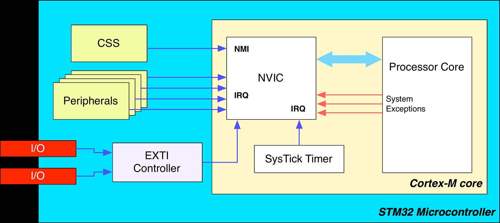</p>

<p align="center">图 7.1：NVIC 控制器、Cortex-M 内核和 STM32 外设之间的关系</p>

如前所述，ARM 把异常分为两类：源自 CPU 内核内部的系统异常（system exception），以及来自内核之外的外设所产生的硬件异常，后者也称为中断请求（Interrupt Request, IRQ）。需要注意，这里的“外部”是相对于 Cortex-M 内核而言的，并不限于 GPIO/EXTI。程序员使用特定的 ISR 来管理异常，这些 ISR 在更高层级编码（通常使用 C 语言）。处理器通过一个间接表知道在哪里找到这些例程，该表包含中断服务例程在内存中的地址。这个表通常称为向量表，每个 STM32 微控制器都定义了自己的向量表。让我们深入分析一下。

### 7.1.1 STM32 中的向量表

所有 Cortex-M 处理器都保留了一组固定的十五个异常，这些异常是所有 Cortex-M 系列共有的。然而，并非所有这些异常目前都已定义（它们在 ARM 官方文档中被标记为 RESERVED），并且只有子集在 Cortex-M0/0+ 内核中可用。我们在第 1 章中已经遇到过它们。为了方便起见，你可以在这里找到相同的表格（表 7.1）。快速浏览一下这些异常是个好主意（我们将在专门讨论高级调试的第 24 章中更好地研究故障异常）。

- Reset：此异常在 CPU 复位后立即触发。其处理程序是运行固件的真正入口点。在 STM32 应用程序中，一切从此异常开始。处理程序包含一些用汇编编码的函数，旨在初始化执行环境，例如主堆栈、`.bss` 段等。专门讨论启动过程的第 22 章将对此深入解释。
- NMI：这是一种特殊异常，其优先级仅次于 Reset 异常。与 Reset 异常一样，它不能被屏蔽，并且可以与关键且不可延迟的活动相关联。在所有 STM32 微控制器中，它与时钟安全系统（CSS）相关联。CSS 是一个自诊断外设，用于检测外部时钟（称为 HSE）的故障。如果发生这种情况，HSE 会自动禁用（这意味着内部 HSI 会自动启用），并触发 NMI 中断以通知软件 HSE 存在问题。有关此功能的更多信息，请参阅第 10 章。
- Hard Fault：这是通用的故障异常，属于 Cortex-M 内核的系统异常，而不是外设产生的 IRQ。当其他故障异常被禁用时，它充当所有类型异常的收集器（例如，在未启用 Bus Fault 异常的情况下，对非法内存位置的访问会引发 Hard Fault 异常）。

<!-- page: 175 -->

- Memory Management Fault¹：当执行代码尝试访问非法位置或违反内存保护单元（Memory Protection Unit, MPU）的规则时发生。更多相关内容见第 20 章。
- Bus Fault¹：当 AHB 接口从总线从设备（bus slave）接收到错误响应时发生（如果是取指操作，也称为预取中止 prefetch abort；如果是数据访问，也称为数据中止 data abort）。也可能由其他非法访问引起（例如，访问不存在的 SRAM 内存位置）。
- Usage Fault¹：当出现程序错误时发生，例如非法指令、对齐问题或尝试访问不存在的协处理器。
- SVCCall：这不是故障条件，而是在调用 Supervisor Call (SVC) 指令时触发。实时操作系统（Real Time Operating Systems）使用此机制来执行特权状态下的指令（需要执行特权操作的任务执行 SVC 指令，然后操作系统执行请求的操作——这与其它操作系统中的系统调用行为相同）。
- Debug Monitor¹：当处理器内核处于 Monitor Debug-Mode 时发生软件调试事件，会触发此异常。当使用基于软件的调试方案时，它也用作断点和观察点等调试事件的异常。
- PendSV：这是另一个与 RTOS 相关的异常。与 SVCall 异常不同（后者在执行 SVC 指令后立即执行），PendSV 可以被延迟。这允许 RTOS 完成优先级更高的任务。
- SysTick：此异常通常也与 RTOS 活动相关。每个 RTOS 都需要一个定时器来周期性地中断当前代码的执行并切换到另一个任务。所有 STM32 微控制器都提供一个 SysTick 定时器，它位于 Cortex-M 内核内部。虽然可以使用其他任何定时器来调度系统活动，但专用定时器的存在确保了在所有 STM32 系列之间的可移植性（由于与 MCU 内部芯片相关的优化原因，并非所有定时器都能作为外部外设可用）。此外，即使我们的固件没有使用 RTOS，也请记住 ST CubeHAL 使用 SysTick 定时器来执行内部时间相关活动（并且假设 SysTick 定时器被配置为每 1ms 生成一次中断）。

可以为特定 MCU 定义的其余异常与 IRQ 处理有关。Cortex-M0/0+ 内核允许最多 32 个外部中断，Cortex-M3/4/7 内核允许硅片制造商定义最多 240 个中断，而 Cortex-M33 内核允许最多 480 条 IRQ 线。

我们可以在哪里找到特定 STM32 微控制器的可用中断列表？该 MCU 的数据手册（datasheet）当然是关于可用中断的主要信息来源。然而，我们可以简单地参考 ST 在其 HAL 中提供的向量表。该表定义于我们 MCU 的启动文件中，即工程 `Core/Startup` 文件夹中以 `.s` 结尾的汇编文件（例如，对于 STM32F446RET MCU，文件名为 `startup_stm32f446retx.s`）。打开该文件，我们可以找到该 MCU 的完整向量表，大约从第 128 行开始（参见第 4 章中的示例）。

¹此异常在基于 Cortex-M0/0+ 的微控制器中不可用。

<!-- page: 176 -->

<p align="center">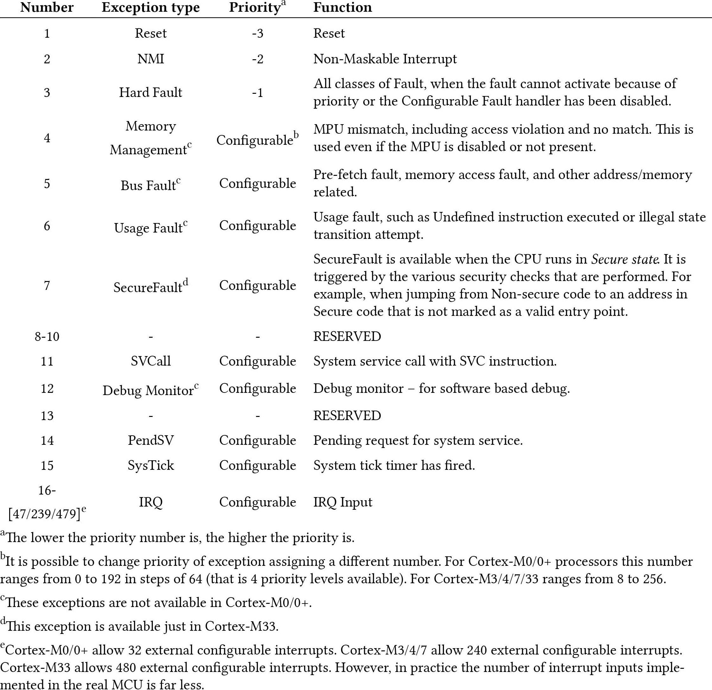</p>

表 7.1：Cortex-M 异常类型

尽管向量表包含处理例程的地址（实际上它是一个间接表），但 Cortex-M 内核需要一种在内存中找到向量表的方法。按照惯例，在所有基于 Cortex-M 的处理器中，向量表从硬件地址 0x0000 0000 开始。如果我们的固件设计为把向量表放在内部闪存（flash memory）中（这是相当常见的场景），那么在所有 STM32 MCU 中，向量表将从 0x0800 0000 地址开始放置。然而，我们在第 1 章中已经看到：当 CPU 启动时，0x0800 0000 地址会被自动别名映射到 0x0000 0000²。

<!-- page: 177 -->

图 7.2 展示了向量表在内存中的组织方式。此数组的第一个条目是 SRAM 中主堆栈指针（Main Stack Pointer, MSP）的地址。通常，此地址对应于 SRAM 的末尾，即其基地址 + 其大小（关于 STM32 应用的内存布局，更多见第 20 章）。从该表的第二个条目开始，我们可以找到所有异常和中断的处理程序。这意味着对于基于 Cortex-M0/0+ 的微控制器，向量表的长度等于 48；对于 Cortex-M3/4/7，长度等于 256。

<p align="center">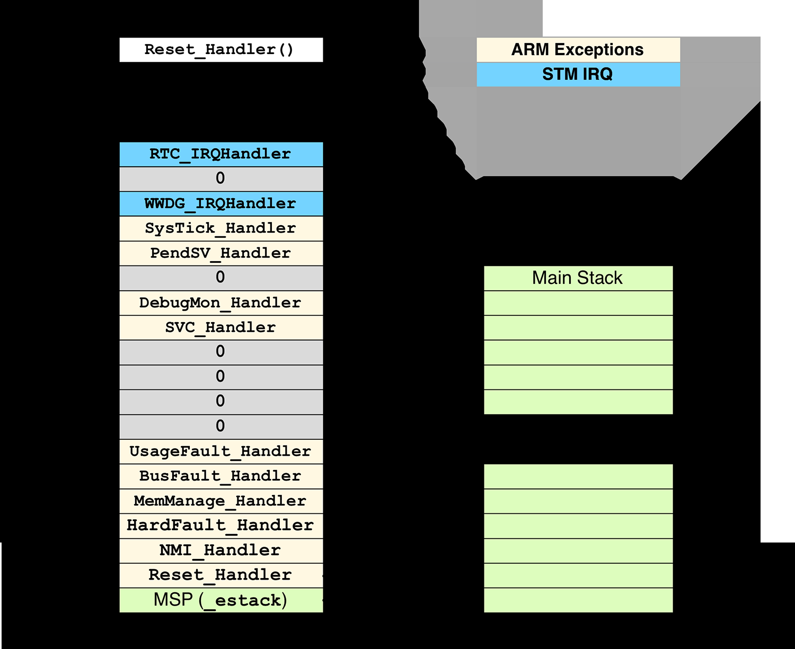</p>

<p align="center">图 7.2：基于 Cortex-M3/4/7 内核的 STM32 MCU 中向量表的最小布局</p>

关于向量表，澄清一些事情很重要。

1. 异常处理程序的名称只是一种约定，如果你喜欢不同的名称，完全可以自由地重命名它们。它们只是符号（就像程序中的变量和函数一样）。但是，请记住 CubeMX 软件被设计为使用这些名称生成 ISR，这是 ST 的约定。因此，你还需要重命名 ISR 名称。
2. 如前所述，向量表必须放置在闪存内存的开头，处理器期望在那里找到它。这是 GCC 链接器（Linker）的工作，它在生成绝对文件（即我们上传到闪存的二进制文件）期间，将向量表放置在闪存数据的开头。

²除了 Cortex-M0 之外，其余的 Cortex-M 内核允许重新定位向量表在内存中的位置。此外，还可以强制 MCU 从内部闪存以外的不同存储器启动。这些是高级主题，将在第 20 章关于内存布局以及另一章关于启动过程中涵盖。为了避免给经验不足的读者造成混淆，最好认为向量表的位置是固定的，并绑定到 0x0000 0000 地址。

<!-- page: 178 -->

在第 20 章中，我们将研究 `STM32XXxx_FLASH.ld` 文件的内容，该文件包含指示 GNU LD 执行此操作的指令。

## 7.2 启用中断

当 STM32 微控制器启动时，默认仅启用复位（Reset）、不可屏蔽中断（NMI）和硬故障（Hard Fault）异常。其余的异常和外设中断均处于禁用状态，必须根据请求进行启用。要启用一个 IRQ，CubeHAL 提供了以下函数：

```c
void HAL_NVIC_EnableIRQ(IRQn_Type IRQn);
```

其中，`IRQn_Type` 是为该特定微控制器定义的所有异常和中断的枚举。`IRQn_Type` 枚举是 ST 驱动 HAL 的一部分，它定义在 Eclipse 工程 `Drivers/CMSIS/Device/ST/STM32XXxx/Include` 目录下、针对给定 STM32 微控制器的特定头文件内。这些文件命名为 `stm32XXxx.h`。例如，对于 STM32F446RE 微控制器，正确的文件名是 `stm32f446xx.h`。

**Filename:** `Drivers/CMSIS/Device/ST/STM32XXxx/Include/stm32XXxx.h`

```c
66  typedef enum {
67    /****** Cortex-M4 Processor Exceptions Numbers ********************************/
68    NonMaskableInt_IRQn   = -14, /*!< 2 Non Maskable Interrupt */
69    MemoryManagement_IRQn = -12, /*!< 4 Cortex-M4 Memory Management Interrupt */
70    BusFault_IRQn         = -11, /*!< 5 Cortex-M4 Bus Fault Interrupt */
71    UsageFault_IRQn       = -10, /*!< 6 Cortex-M4 Usage Fault Interrupt */
72    SVCall_IRQn           = -5,  /*!< 11 Cortex-M4 SV Call Interrupt */
73    DebugMonitor_IRQn     = -4,  /*!< 12 Cortex-M4 Debug Monitor Interrupt */
74    PendSV_IRQn           = -2,  /*!< 14 Cortex-M4 Pend SV Interrupt */
75    SysTick_IRQn          = -1,  /*!< 15 Cortex-M4 System Tick Interrupt */
76    ...
```

用于禁用 IRQ 的对应函数是：

```c
void HAL_NVIC_DisableIRQ(IRQn_Type IRQn);
```

需要特别指出的是，上述两个函数是在 NVIC 控制器级别使能/禁用中断。查看图 7.1 可以看到，中断线是由挂在该线上的外设来置位（assert）的。例如，USART2 外设会置位 NVIC 内与 `USART2_IRQn` 相对应的那条中断线。这意味着单个外设必须被正确配置为以中断模式工作。正如我们将在本书其余部分所见，大多数 STM32 外设被设计为可以（除其他功能外）以中断模式工作。通过使用特定的 HAL 例程，我们可以使能外设级别的中断。例如，使用 `HAL_USART_Transmit_IT()` 会隐式地把 USART 外设配置为中断模式。显然，还需要通过调用 `HAL_NVIC_EnableIRQ()` 在 NVIC 级别使能相应的中断。

现在是一个开始尝试中断的好时机。

<!-- page: 179 -->

### 7.2.1 外部线和 NVIC

如我们在图 7.1 中看到的，STM32 微控制器提供可变数量的外部中断源，这些中断源通过 EXTI 控制器连接到 NVIC，而 EXTI 控制器又能够管理多条 EXTI 线。中断源和线的数量取决于特定的 STM32 系列。

GPIO 连接到 EXTI 线，并且可以为每个 MCU GPIO 单独使能中断，尽管其中大多数引脚共享同一条中断线。例如，对于 STM32F4 微控制器，多达 114 个 GPIO 连接到 16 条 EXTI 线。然而，其中只有 7 条线拥有独立的 IRQ。

<p align="center">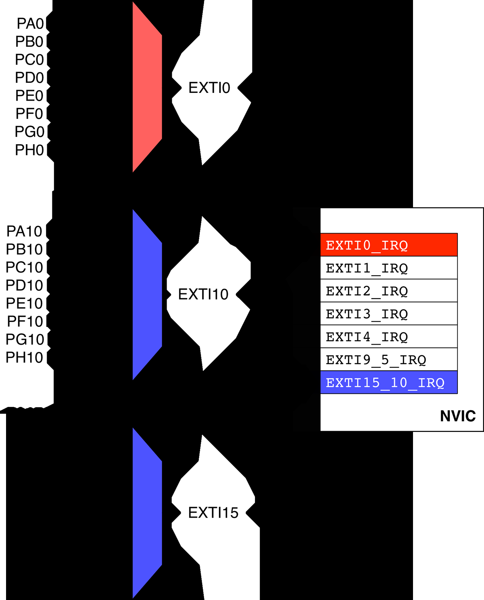</p>

<p align="center">图 7.3：STM32F4 微控制器中 GPIO、EXTI 线及相应 ISR 之间的关系</p>

图 7.3 展示了 STM32F4 微控制器中的 EXTI 线 0、10 和 15。所有 Px0 引脚都连接到 EXTI0，所有 Px10 引脚都连接到 EXTI10，所有 Px15 引脚都连接到 EXTI15。然而，EXTI 线 10 和 15 在 NVIC 内共享同一个 IRQ（因此由同一个 ISR 处理）³。

³有时，即使是在基于 Cortex-M3/4/7 的微控制器中（这些微控制器最多提供 240 条可配置请求线），不同的外设也会共享同一条请求线。例如，在 STM32F446RE 微控制器中，定时器 TIM6 与 DAC1 和 DAC2 的下溢错误中断共享其全局 IRQ。

<!-- page: 180 -->

**这意味着：**

- 只有一个 PxY 引脚可以作为中断源：例如，我们不能同时把 PA0 和 PB0 都配置为中断输入引脚。
- 对于在 NVIC 控制器内共享同一 IRQ 的 EXTI 线，我们必须编写相应的 ISR，以便区分究竟是哪条线产生了中断。

以下示例⁴展示了如何使用中断：每次按下连接在 PC13 引脚上的用户按钮时切换 LD2 LED。首先，我们把 GPIO PC13 配置为在电平由低变高时触发中断（第 79:82 行），这是通过把 `GPIO_InitStruct.Mode` 设置为 `GPIO_MODE_IT_RISING` 实现的（可用中断相关模式的完整列表见表 6.2）。接下来，我们使能与 Px13 引脚关联的 EXTI 线所对应的中断，即 `EXTI15_10_IRQn`。

⁴该示例旨在适用于 Nucleo-F446RE 板。如果您拥有不同的 Nucleo 板，请参阅本书中的其他示例。

**Filename:** `src/main-ex1.c`

```c
 64  int main(void) {
 65    GPIO_InitTypeDef GPIO_InitStruct = {0};
 66
 67    /* MCU Configuration----------------------------------------------------------*/
 68    /* Reset of all peripherals, Initializes the Flash interface and the Systick. */
 69    HAL_Init();
 70    /* Configure the system clock */
 71    SystemClock_Config();
 72
 73    /* GPIOA and GPIOC Configuration----------------------------------------------*/
 74    /* GPIO Ports Clock Enable */
 75    __HAL_RCC_GPIOC_CLK_ENABLE();
 76    __HAL_RCC_GPIOA_CLK_ENABLE();
 77
 78    /*Configure GPIO pin : PC13 */
 79    GPIO_InitStruct.Pin = GPIO_PIN_13;
 80    GPIO_InitStruct.Mode = GPIO_MODE_IT_RISING;
 81    GPIO_InitStruct.Pull = GPIO_PULLDOWN;
 82    HAL_GPIO_Init(GPIOC, &GPIO_InitStruct);
 83
 84    /*Configure GPIO pin : PA5 */
 85    GPIO_InitStruct.Pin = GPIO_PIN_5;
 86    GPIO_InitStruct.Mode = GPIO_MODE_OUTPUT_PP;
 87    GPIO_InitStruct.Pull = GPIO_NOPULL;
 88    GPIO_InitStruct.Speed = GPIO_SPEED_FREQ_LOW;
 89    HAL_GPIO_Init(GPIOA, &GPIO_InitStruct);
 90
 91    /* Configure GPIO pin Output Level */
 92    HAL_GPIO_WritePin(GPIOA, GPIO_PIN_5, GPIO_PIN_RESET);
 93
 94    /* EXTI interrupt init*/
 95    HAL_NVIC_EnableIRQ(EXTI15_10_IRQn);
 96
 97    while (1);
 98  }
 99
100  void EXTI15_10_IRQHandler(void) {
101    if(__HAL_GPIO_EXTI_GET_IT(GPIO_PIN_13) != RESET) {
102      __HAL_GPIO_EXTI_CLEAR_IT(GPIO_PIN_13);
103      HAL_GPIO_TogglePin(GPIOA, GPIO_PIN_5);
104    }
```

最后，我们需要定义函数 `void EXTI15_10_IRQHandler()`⁵，它是向量表中与 IRQ `EXTI15_10_IRQn`（对应 EXTI 线 10～15）相关联的中断服务例程（ISR）（第 100:104 行）。ISR 的内容相当简单：由于这一条 IRQ 覆盖了来自 EXTI10～EXTI15 五条线上的引脚，我们需要判断触发中断的究竟是不是 PC13。如果是，我们就翻转 PA5 的电平，并清除与 EXTI 线相关联的挂起位（这样做的原因将在后文解释）。

⁵ARM 架构的另一个特性是能够使用常规的 C 函数作为 ISR。当中断触发时，CPU 从线程模式（即主执行流）切换到处理程序模式。在此切换过程中，当前执行上下文通过名为入栈（stacking）的过程被保存。当 ISR 执行结束时，CPU 会自行负责恢复之前保存的上下文（出栈，unstacking）。此过程的详细解释超出了本书的范围。有关这些方面的更多信息，请参考 Joseph Yiu 的书籍之一。

幸运的是，ST HAL 提供了一种抽象机制，使我们无需处理所有这些细节，除非我们需要特别关注它们。前面的示例可以重写为以下形式：

**Filename:** `src/main-ex2.c`

```c
 64    GPIO_InitTypeDef GPIO_InitStruct = {0};
 65
 66    /* MCU Configuration----------------------------------------------------------*/
 67    /* Reset of all peripherals, Initializes the Flash interface and the Systick. */
 68    HAL_Init();
 69    /* Configure the system clock */
 70    SystemClock_Config();
 71
 72    /* GPIOA and GPIOC Configuration----------------------------------------------*/
 73    /* GPIO Ports Clock Enable */
 74    __HAL_RCC_GPIOC_CLK_ENABLE();
 75    __HAL_RCC_GPIOA_CLK_ENABLE();
 76
 77    /*Configure GPIO pin : PC13 */
 78    GPIO_InitStruct.Pin = GPIO_PIN_12 | GPIO_PIN_13;
 79    GPIO_InitStruct.Mode = GPIO_MODE_IT_RISING;
 80    GPIO_InitStruct.Pull = GPIO_PULLDOWN;
 81    HAL_GPIO_Init(GPIOC, &GPIO_InitStruct);
 82
 83    /*Configure GPIO pin : PA5 */
 84    GPIO_InitStruct.Pin = GPIO_PIN_5;
 85    GPIO_InitStruct.Mode = GPIO_MODE_OUTPUT_PP;
 86    GPIO_InitStruct.Pull = GPIO_NOPULL;
 87    GPIO_InitStruct.Speed = GPIO_SPEED_FREQ_LOW;
 88    HAL_GPIO_Init(GPIOA, &GPIO_InitStruct);
 89
 90    /* Configure GPIO pin Output Level */
 91    HAL_GPIO_WritePin(GPIOA, GPIO_PIN_5, GPIO_PIN_RESET);
 92
 93    /* EXTI interrupt init*/
 94    HAL_NVIC_EnableIRQ(EXTI15_10_IRQn);
 95
 96    while (1);
 97  }
 98
 99  void EXTI15_10_IRQHandler(void) {
100    HAL_GPIO_EXTI_IRQHandler(GPIO_PIN_12);
101    HAL_GPIO_EXTI_IRQHandler(GPIO_PIN_13);
102  }
103
104  void HAL_GPIO_EXTI_Callback(uint16_t GPIO_Pin) {
105    if(GPIO_Pin == GPIO_PIN_13)
106      HAL_GPIO_WritePin(GPIOA, GPIO_PIN_5, SET);
107    else if(GPIO_Pin == GPIO_PIN_12)
108      HAL_GPIO_WritePin(GPIOA, GPIO_PIN_5, RESET);
109  }
```

这次我们把 PC13 和 PC12 两个引脚都配置为中断源。当 `EXTI15_10_IRQHandler()` 这个 ISR 被调用时，它把控制权转交给 HAL 内部的 `HAL_GPIO_EXTI_IRQHandler()`。该函数替我们完成所有与中断相关的操作，并调用 `HAL_GPIO_EXTI_Callback()` 回调，同时传入产生该 IRQ 的具体 GPIO（请记住：PC12 连接到 `EXTI12`，PC13 连接到 `EXTI13`，而 `EXTI12` 与 `EXTI13` 共享同一个 NVIC 中断 `EXTI15_10_IRQn`）。图 7.4 清楚地展示了由 IRQ 触发的调用序列⁶。

⁶不要考虑那些与 CPU 周期相关的时间间隔，它们仅用于指示“后续”事件。

<!-- page: 183 -->

<p align="center">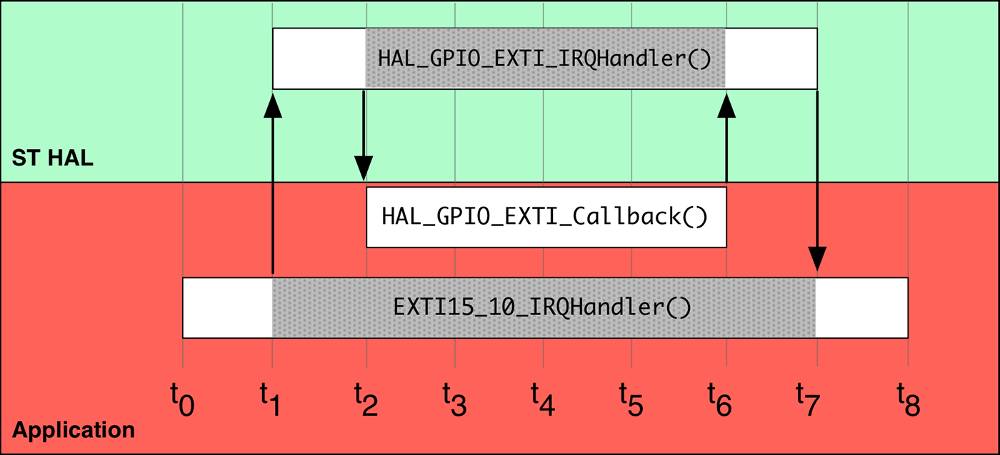</p>

<p align="center">图 7.4：HAL 如何处理 IRQ</p>

HAL 中几乎所有 IRQ 处理例程都使用这种机制。

### 7.2.2 使用 CubeMX 启用中断

CubeMX 可用于轻松启用 IRQ 并自动生成 ISR 代码。第一步是使用芯片视图（Chip view）启用相应的 EXTI 线，如图 7.5 所示。

<p align="center">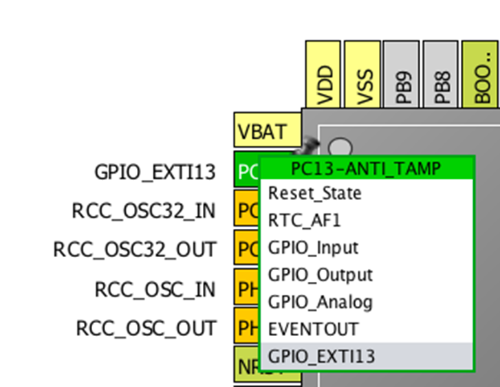</p>

<p align="center">图 7.5：如何使用 CubeMX 将 GPIO 绑定到 EXTI 线</p>

一旦我们启用了 IRQ，就需要指示 CubeMX 生成相应的 ISR。此配置通过系统视图（System view）完成，点击 NVIC 按钮。将出现一个可启用的 ISR 列表，如图 7.6 所示。

<!-- page: 184 -->

<p align="center">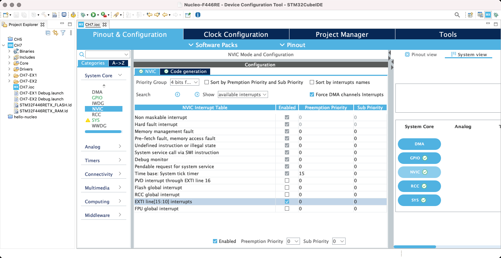</p>

<p align="center">图 7.6：NVIC 配置视图允许启用相应的 ISR</p>

CubeMX 会自动把使能的 ISR 添加到 `Core/Src/stm32XXxx_it.c` 文件中，并负责使能 IRQ。此外，它还会为我们添加需要调用的相应 HAL 处理例程，如下所示：

```c
/**
* @brief This function handles EXTI line[15:10] interrupts.
*/
void EXTI15_10_IRQHandler(void) {
  /* USER CODE BEGIN EXTI15_10_IRQn 0 */
  /* USER CODE END EXTI15_10_IRQn 0 */
  HAL_GPIO_EXTI_IRQHandler(GPIO_PIN_13);
  /* USER CODE BEGIN EXTI15_10_IRQn 1 */
  /* USER CODE END EXTI15_10_IRQn 1 */
}
```

我们只需在应用程序代码中添加相应的回调函数（例如 `HAL_GPIO_EXTI_Callback()` 例程）即可。

<!-- page: 185 -->

**各部分的归属关系**


在开始使用 ST HAL 时，由于其与 ARM CMSIS 包之间的关系，往往会产生许多混淆。`stm32XX_hal_cortex.c` 模块清楚地展示了 ST HAL 与 CMSIS 包之间的交互，因为它完全依赖官方的 ARM 包来处理底层的 Cortex-M NVIC 控制器。每个 `HAL_NVIC_xxx()` 函数都是对相应 CMSIS `NVIC_xxx()` 函数的封装。这意味着我们也可以使用 CMSIS API 来编程 NVIC 控制器。不过，由于本书讲的是 CubeHAL，我们将使用 ST API 来管理中断。

## 7.3 中断生命周期

一旦涉及中断，理解其生命周期就非常重要。虽然 Cortex-M 内核会自动为我们完成大部分工作，但我们必须注意一些可能在中断管理过程中引起混淆的方面。然而，本段是从“HAL 视角”来审视中断生命周期的。如果你有兴趣深入研究这个问题，Joseph Yiu⁷ 的书籍系列仍然是最好的资料来源。

中断可以：

1. 要么处于禁用状态（默认行为），要么处于使能状态——通过调用 `HAL_NVIC_EnableIRQ()` / `HAL_NVIC_DisableIRQ()` 来使能或禁用它；
2. 要么处于挂起状态（Pending，即有一个请求正在等待被服务），要么不处于挂起状态；
3. 要么处于活动状态（Active，即正在被服务），要么处于非活动状态（Inactive）。

我们在上一段中已经看到了第一种情况。现在重要的是研究当中断发生时发生了什么。

当中断触发时，它首先被标记为挂起（Pending），直到处理器能够为它服务。如果当前没有其他中断正在被处理，处理器会自动清除其挂起位，并几乎立即开始服务它。

<p align="center">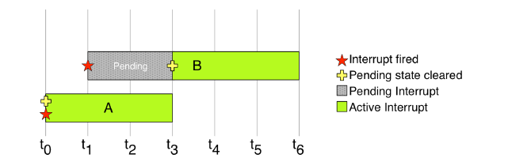</p>

<p align="center">图 7.7：挂起位与中断活动状态之间的关系</p>

⁷http://amzn.to/1P5sZwq

<!-- page: 186 -->

图 7.7 展示了其工作原理。中断 A 在时间 t0 触发，由于 CPU 没有正在服务另一个中断，其挂起位被清除，其执行立即开始⁸（中断变为活动状态）。在时间 t1，中断 B 触发，但在这里我们假设它的优先级低于 A。因此，它保持挂起状态，直到 A 的 ISR 完成其操作。当这种情况发生时，挂起位被自动清除，ISR 变为活动状态。

<p align="center">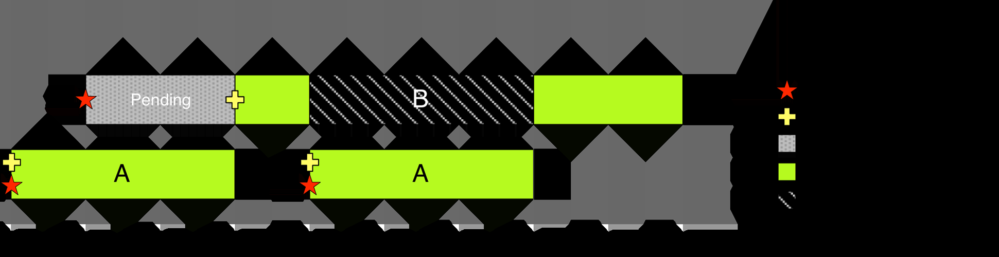</p>

<p align="center">图 7.8：活动状态与中断优先级之间的关系</p>

图 7.8 展示了另一个重要情况。在这里，中断 A 触发，CPU 可以立即服务它。中断 B 在 A 被服务期间触发，因此它保持挂起状态，直到 A 完成。当这种情况发生时，中断 B 的挂起位被清除，它变为活动状态。然而，过了一段时间，中断 A 再次触发，由于其优先级更高，中断 B 的执行被挂起（注意：此时 B 仍处于 Active 状态，只是暂停执行，并没有回到非活动状态），中断 A 立即开始执行。当 A 完成时，中断 B 恢复执行，直到完成其工作。

<p align="center"></p>

<p align="center">图 7.9：如何通过设置其挂起位来强制中断再次触发</p>

NVIC 为程序员提供了高度的灵活性。在中断执行期间，可以通过简单地再次设置其挂起位来强制中断再次触发，如图 7.9⁹ 所示。同样，当中断处于挂起状态时，可以通过清除其挂起位来取消中断的执行，如图 7.10 所示。

⁸这里需要理解的是，“立即”并不意味着中断执行没有任何延迟就开始。如果没有其他中断正在运行，Cortex-M3/4/7/33 内核会在 12 个 CPU 周期内开始服务该中断，Cortex-M0 需要 15 个周期，Cortex-M0+ 需要 16 个周期。

⁹为完整起见还需指出：Cortex-M 还支持一种称为尾链（tail chaining）的优化——当某个 ISR 执行结束时，如果已经有一个满足优先级条件的异常处于挂起状态，处理器不会先出栈回到被中断的线程、再重新入栈进入该异常，而是保持处理程序模式直接转入下一个 ISR，从而省去一次出栈/入栈，加快中断处理速度并降低功耗（入栈/出栈的定义见本章脚注 ⁵）。

<!-- page: 187 -->

<p align="center">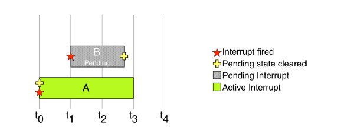</p>

<p align="center">图 7.10：在执行前清除其挂起位可以取消 IRQ 服务</p>

这里必须澄清一个重要方面：外设是如何向 NVIC 控制器提出中断请求的。当中断发生时，大多数 STM32 外设会置位（assert）一个连接到 NVIC 的专用信号，该信号以专用位的形式映射在外设的地址空间中。这个外设中断请求位会一直保持置位，直到被应用程序代码手动清除。例如，在示例 1 中，我们必须用宏 `__HAL_GPIO_EXTI_CLEAR_IT()` 显式清除 EXTI 线的 IRQ 挂起位。如果我们不清除（不撤销）该位，新的中断就会被不断触发，直到该位被清除。

<p align="center">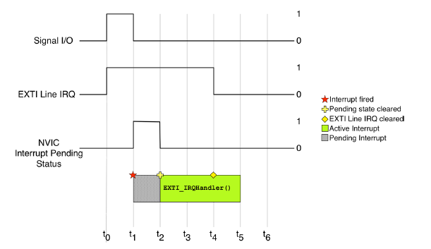</p>

<p align="center">图 7.11：外设 IRQ 与相应中断之间的关系</p>

图 7.11 清楚地展示了外设的 IRQ 挂起位与 NVIC 中该中断的挂起位（Pending）之间的关系。图中“信号 I/O”指的是驱动该 I/O 的外部外设（例如连接到引脚的轻触开关）。当信号电平发生变化时，连接到该 I/O 的 EXTI 线会产生一个 IRQ，并把对应的外设挂起位置位。作为响应，NVIC 才把该中断置为挂起并产生中断。当处理器开始服务该 ISR 时，NVIC 中该中断的挂起位被自动清除，但外设的 IRQ 挂起位会一直保持置位，直到被应用程序代码清除。

<!-- page: 188 -->

<p align="center">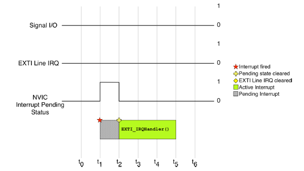</p>

<p align="center">图 7.12：当通过设置挂起位强制触发某个中断时，相应的外设 IRQ 位保持未置位状态</p>

图 7.12 展示了另一种情况。在这里，我们通过设置其挂起位来强制 ISR 的执行。由于这次外部外设没有参与，因此无需清除相应的 IRQ 挂起位。

由于外设是否具有 IRQ 挂起位取决于具体外设，因此最好始终使用 ST HAL 函数来管理中断，把所有底层细节交给 HAL 实现（除非我们需要完全掌控，但这并非本书的场景）。不过请记住：为了避免丢失重要的中断，一个良好的设计实践是在 ISR 一开始被服务时就清除外设的 IRQ 挂起位。处理器内核不会对中断排队——多个不同的 IRQ 当然可以同时处于挂起状态，但同一个 IRQ 的多次触发既不会被计数、也不会形成事件队列，因此如果我们在 ISR 结束时才清除外设挂起位，就可能丢失在此期间发生的后续触发。

要检查中断是否处于挂起状态（即已触发但未运行），我们可以使用 HAL 函数：

```c
uint32_t HAL_NVIC_GetPendingIRQ(IRQn_Type IRQn);
```

如果 IRQ 不处于挂起状态，则返回 0，否则返回 1。要设置 IRQ 的挂起位，我们可以使用 HAL 函数：

```c
void HAL_NVIC_SetPendingIRQ(IRQn_Type IRQn);
```

这会导致该中断被触发，就像由硬件产生的一样。Cortex-M 处理器的一个显著特点是：可以在一个中断的 ISR 内部用软件触发另一个中断。相反，要清除某个 IRQ 的挂起位，可以使用以下函数：

<!-- page: 189 -->

```c
void HAL_NVIC_ClearPendingIRQ(IRQn_Type IRQn);
```

同样地，也可以在某个 ISR 服务另一个 IRQ 期间，取消一个处于挂起状态的中断的执行（清除其挂起位）。

若要检查某个中断是否处于活动状态（Active，即该 IRQ 正在被服务），可以使用以下函数：

```c
uint32_t HAL_NVIC_GetActive(IRQn_Type IRQn);
```

如果该 IRQ 处于活动状态，则返回 1，否则返回 0。

## 7.4 中断优先级

ARM Cortex-M 架构的一个显著特性是能够为中断设置优先级（前三个具有固定优先级的系统异常除外，如表 7.1 所示）。中断优先级决定了以下两件事：

- 在发生并发中断时，哪些 ISR 将首先执行；
- 哪些例程可以被可选地抢占，以便开始执行具有更高优先级的 ISR。

NVIC 的优先级机制在 Cortex-M0/0+ 与 Cortex-M3/4/7/33 内核之间存在实质性差异。因此，我们将在两个独立的小节中分别进行说明。

### 7.4.1 Cortex-M0/0+

基于 Cortex-M0/0+ 的微控制器具有更简单的中断优先级机制。这意味着 STM32F0/G0/L0 微控制器（MCU）的行为与其他 STM32 微控制器不同。如果您需要在不同的 STM32 系列之间移植代码，必须特别注意这一点。

在 Cortex-M0/0+ 内核中，每个中断的优先级通过一个名为 `IPR` 的 8 位寄存器来定义。ARMv6-M 架构只规定该寄存器至少要实现 2 位优先位，具体实现多少位由芯片厂商决定。然而在实际应用中，实现这些内核的 STM32 MCU 只使用该寄存器的最高两位，其余所有位均视为零，因此总共只有 4 个优先级级别。

<p align="center"></p>

<p align="center">图 7.13：基于 Cortex-M0 的 STM32 MCU 上 <code>IPR</code> 寄存器的内容</p>

图 7.13 展示了 `IPR` 内容的解释方式。这意味着我们最多只有四个优先级级别：0x00、0x40、0x80、0xC0。数值越低，优先级越高——也就是说，优先级为 0x40 的 IRQ 比优先级为 0xC0 的 IRQ 具有更高的优先级。如果两个中断同时触发，优先级较高的那个将首先得到服务。如果处理器正在处理一个中断，而一个更高优先级的中断触发，则当前中断将被挂起，控制权转移到更高优先级的中断。当该中断处理完成后，如果在此期间没有发生其他更高优先级的中断，执行将返回到之前的中断。这种机制称为中断抢占。

<!-- page: 190 -->

<p align="center"></p>

<p align="center">图 7.14：并发执行情况下的中断抢占</p>

图 7.14 展示了中断抢占的一个示例。A 是一个在时间 t0 触发的低优先级 IRQ。其 ISR 开始执行，但在时间 t1，具有更高优先级（更低优先级级别）的 IRQ B 触发，导致 A 的 ISR 执行停止。当 B 完成其任务后，A 的 ISR 执行恢复，直到其完成。这种由中断优先级引起的“嵌套”机制导致了 NVIC 控制器的名称，即嵌套向量中断控制器（Nested Vectored Interrupt Controller）。

与 Cortex-M3/4/7/33 内核相比，Cortex-M0/0+ 有一个重要区别。中断优先级是静态的。这意味着一旦启用某个中断，其优先级就无法再更改，直到我们再次禁用该 IRQ。

CubeHAL 提供了以下函数来为 IRQ 分配优先级：

```c
void HAL_NVIC_SetPriority(IRQn_Type IRQn, uint32_t PreemptPriority, uint32_t SubPriority);
```

`HAL_NVIC_SetPriority()` 函数接受要配置的 IRQ，以及抢占优先级（Preempt Priority）`PreemptPriority`，也就是我们要赋给该 IRQ 的优先级级别。CMSIS API（以及构建在其上的 CubeHAL）约定：`PreemptPriority` 传入的是优先级“级别编号”，其取值范围由内核实际实现的优先级位数决定——Cortex-M0/0+ 只实现了 2 位优先级，因此在 STM32 上合法取值为 0～3（共 4 个级别）。该编号会在内部被自动左移到 `IPR` 的高位，这简化了向优先级位数不同的其他 MCU 移植代码的过程（这也是芯片厂商只使用 `IPR` 寄存器高位部分的原因）。

<!-- page: 191 -->

如您所见，`HAL_NVIC_SetPriority()` 函数还接受一个额外的参数 `SubPriority`（子优先级）。由于底层的 Cortex-M0/0+ 处理器不支持中断子优先级，该参数在 CubeF0 和 CubeL0 HAL 中会被直接忽略。在这里，ST 工程师选择沿用基于 Cortex-M3/4/7/33 处理器的其他 HAL 中相同的 API，可能就是为了简化在不同 STM32 MCU 之间移植代码。有趣的是，他们为读取 IRQ 优先级所定义的函数却是这样的：

```c
uint32_t HAL_NVIC_GetPriority(IRQn_Type IRQn);
```

这个函数的签名与基于 Cortex-M3/4/7/33 处理器的 HAL 中所定义的同名函数完全不同。

以下示例¹⁰展示了中断优先级机制是如何工作的。

¹⁰该示例旨在配合 Nucleo-F072RB 开发板使用。如果您使用的是其他型号的 Nucleo 开发板，请参阅本书中的其他示例。

**Filename:** `src/main-ex3.c`

```c
39  uint8_t blink = 0;
40
41  int main(void) {
42    GPIO_InitTypeDef GPIO_InitStruct;
43
44    HAL_Init();
45
46    /* GPIO Ports Clock Enable */
47    __HAL_RCC_GPIOC_CLK_ENABLE();
48    __HAL_RCC_GPIOB_CLK_ENABLE();
49    __HAL_RCC_GPIOA_CLK_ENABLE();
50
51    /*Configure GPIO pin : PC13 - USER BUTTON */
52    GPIO_InitStruct.Pin = GPIO_PIN_13 ;
53    GPIO_InitStruct.Mode = GPIO_MODE_IT_RISING;
54    GPIO_InitStruct.Pull = GPIO_PULLDOWN;
55    HAL_GPIO_Init(GPIOC, &GPIO_InitStruct);
56
57    /*Configure GPIO pin : PB2 */
58    GPIO_InitStruct.Pin = GPIO_PIN_2 ;
59    GPIO_InitStruct.Mode = GPIO_MODE_IT_FALLING;
60    GPIO_InitStruct.Pull = GPIO_PULLUP;
61    HAL_GPIO_Init(GPIOB, &GPIO_InitStruct);
62
63    /*Configure GPIO pin : PA5 - LD2 LED */
64    GPIO_InitStruct.Pin = GPIO_PIN_5;
65    GPIO_InitStruct.Mode = GPIO_MODE_OUTPUT_PP;
66    GPIO_InitStruct.Pull = GPIO_NOPULL;
67    GPIO_InitStruct.Speed = GPIO_SPEED_LOW;
68    HAL_GPIO_Init(GPIOA, &GPIO_InitStruct);
69
70    HAL_NVIC_SetPriority(EXTI4_15_IRQn, 0x1, 0);
71    HAL_NVIC_EnableIRQ(EXTI4_15_IRQn);
72
73    HAL_NVIC_SetPriority(EXTI2_3_IRQn, 0x0, 0);
74    HAL_NVIC_EnableIRQ(EXTI2_3_IRQn);
75
76    while(1);
77  }
78
79  void EXTI4_15_IRQHandler(void) {
80    HAL_GPIO_EXTI_IRQHandler(GPIO_PIN_13);
81  }
82
83  void EXTI2_3_IRQHandler(void) {
84    HAL_GPIO_EXTI_IRQHandler(GPIO_PIN_2);
85  }
86
87  void HAL_GPIO_EXTI_Callback(uint16_t GPIO_Pin) {
88    if(GPIO_Pin == GPIO_PIN_13) {
89      blink = 1;
90      while(blink) {
91        HAL_GPIO_TogglePin(GPIOA, GPIO_PIN_5);
92        for(volatile int i = 0; i < 100000; i++) {
93          /* Busy wait */
94        }
95      }
96    }
97    else {
98      blink = 0;
```

> 译者注：原书此处的代码清单在第 98 行处被截断，缺少 `blink = 0;` 之后用于闭合 `else` 分支和 `HAL_GPIO_EXTI_Callback()` 函数体的两个右花括号 `}`。此处依原书保留原样，未擅自增补。

如果前面的解释足够清楚，这段代码应该很容易理解。这里有两个分别与 EXTI 线 2 和 13 相关联的中断请求（IRQ）。相应的中断服务例程（ISR）会调用 HAL 函数 `HAL_GPIO_EXTI_IRQHandler()`，该函数进而调用 `HAL_GPIO_EXTI_Callback()` 回调，并传入参与中断的 GPIO。当用户按下连接在 PC13 上的按钮时，回调函数先把 `blink` 置 1，随后进入 `while(blink)` 循环，只要 `blink` 保持非零就持续快速翻转 LD2 LED。当 PB2 引脚被拉低时（请使用附录 C 中您 Nucleo 开发板的引脚图来确认 PB2 的位置），`EXTI2_3_IRQHandler()`¹¹ 被触发，这导致 `HAL_GPIO_EXTI_IRQHandler()` 把 `blink` 变量置 0，于是 `EXTI4_15_IRQHandler()` 可以结束。每个中断的优先级在第 70 行和第 73 行配置：如您所见，由于基于 Cortex-M0/0+ 的 MCU 中断优先级是静态的，我们必须在使能相应中断之前就设置好它。

¹¹请注意，对于 STM32F302 微控制器，与 EXTI 线 2 关联的中断请求的默认名称是 `EXTI2_TSC_IRQHandler`。如果您正在使用该微控制器，请参阅本书示例。

<!-- page: 193 -->

请注意，这是一种处理中断的非常糟糕的方式。在中断中锁定微控制器是一种糟糕的编程风格，也是嵌入式编程中所有问题的根源。不幸的是，考虑到本书在此处仍只涵盖少数主题，这是作者能想到的唯一示例。每个 ISR 的设计都应尽可能短，否则其他基本的 ISR 可能会被屏蔽很长时间，从而丢失来自其他外设的重要信息。

作为练习，尝试调整中断优先级，看看如果两个中断具有相同优先级时会发生什么。

可能会产生一个好问题：为什么不在第 87:89 行使用 `HAL_Delay()` 函数，而要用忙等待（busy-wait）？答案很简单，并且与中断优先级直接相关。`HAL_Delay()` 在执行忙等待的同时，等待 SysTick 定时器递增全局变量 `uwTick`（一个以 1 kHz 频率递增的无符号 32 位整数）。然而，正如我们将在第 11 章中看到的，SysTick 定时器被配置为以中断模式工作，并且其中断优先级由 CubeMX 设置——默认情况下设置为尽可能低的优先级（请查看 `Core/Inc/stm32XXxx_hal_conf.h` 文件中的宏 `TICK_INT_PRIORITY`）。把 `EXTI4_15_IRQn` 中断的优先级级别设置为 1，会导致 SysTick 定时器的 ISR 在 `blink` 变量变为 0、该 ISR 结束之前永远不会触发。

您可能注意到，即使导线没有接地，仅仅触摸导线也会触发中断。为什么会这样？导致中断“意外”触发的原因主要有两个。首先，现代微控制器会尽量减少使用内部上拉/下拉电阻带来的功耗损失，因此这些电阻的阻值选得很大（大约 50kΩ）。如果您代入分压公式算一下就会发现，当上拉/下拉电阻阻值很大时，很容易把 I/O 拉低或拉高。其次，这里我们没有对输入引脚做充分的去抖动（debouncing）。去抖动是指尽量削弱“不稳定”信号源（例如机械开关）产生的抖动影响的过程。通常用硬件¹²或软件来实现：软件方式是统计自输入状态首次变化以来经过的时间——在我们的场景中，如果输入保持低电平超过一段时间（通常 100ms 到 200ms 就足够了），就可以认为输入确实已经接地。正如我们将在第 11 章中看到的，我们还可以使用某个定时器配置为输入捕获模式的一个通道来检测 GPIO 何时改变状态，从而自动统计从第一个事件开始经过的时间。此外，定时器通道支持集成的可编程硬件滤波器，这使我们能够减少用于对 I/O 去抖动所需的外部元件数量。

¹²通常，在开关触点并联一个电容和一个电阻就足够了。例如，您可以查看 Nucleo 开发板的原理图，看看 ST 工程师如何对连接到 PC13 GPIO 的 USER 按钮进行去抖动。

<!-- page: 194 -->

### 7.4.2 Cortex-M3/4/7/33

Cortex-M3/4/7/33 中的中断优先级机制比基于 Cortex-M0/0+ 内核的微控制器中的机制更为先进。开发人员拥有更高的灵活性，但这往往也是新手感到头疼的根源之一。此外，ARM 和 ST 文档中呈现中断优先级的方式略显反直觉。

在 Cortex-M3/4/7/33 内核中，每个中断的优先级由 `IPR` 寄存器定义。在 ARMv7-M 架构中，这是一个 8 位寄存器，最多可实现 256 个优先级级别（取值 0～255）。然而在实际应用中，实现 Cortex-M3/4/7 内核的 STM32 MCU 只使用该寄存器的最高四位，而基于 Cortex-M33 内核的 STM32 MCU 只使用最高三位。

<p align="center">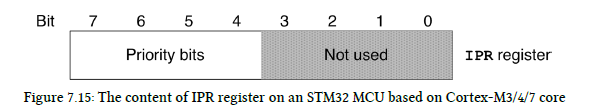</p>

<p align="center">图 7.15：基于 Cortex-M3/4/7 内核的 STM32 MCU 上 <code>IPR</code> 寄存器的内容</p>

图 7.15 清楚地展示了 `IPR` 内容的解释方式。这意味着我们最多可有十六个优先级级别：0x00、0x10、0x20、0x30、0x40、0x50、0x60、0x70、0x80、0x90、0xA0、0xB0、0xC0、0xD0、0xE0、0xF0。数值越小，优先级越高——也就是说，优先级为 0x10 的 IRQ 比优先级为 0xA0 的 IRQ 具有更高的优先级。如果两个中断同时触发，优先级更高的那个将首先得到服务。如果处理器正在服务一个中断，而一个更高优先级的中断触发，则当前中断会被挂起，控制权交给更高优先级的中断。当该中断完成后，执行会返回到先前被抢占的那个中断（前提是期间没有发生其他更高优先级的中断）。

到目前为止，该机制与 Cortex-M0/0+ 基本相同。复杂性源于 `IPR` 寄存器可以在逻辑上细分为两部分：一组定义抢占优先级（preemption priority）¹³ 的位和一组定义子优先级（sub-priority）的位。抢占优先级决定 ISR 之间的抢占关系：如果一个 ISR 的优先级高于另一个 ISR，当它触发时就会抢占后者正在执行的例程。子优先级决定在多个 ISR 同时处于挂起状态时哪一个先执行，但它不影响抢占。

¹³使中断优先级理解复杂化的事实是，在官方文档中，抢占优先级有时也被称为组优先级（group priority）。这导致了很多混淆，因为新手倾向于认为这些位定义了某种访问控制列表（ACL）权限。在这里，为了简化对此问题的理解，我们只讨论抢占优先级级别。

<!-- page: 195 -->

<p align="center"></p>

<p align="center">图 7.16：并发执行情况下的中断抢占</p>

图 7.16 展示了中断抢占的一个示例。A 是一个在时间 t0 触发的最低优先级的 IRQ。ISR 开始执行，但具有更高优先级（更低优先级级别）的 IRQ B 在时间 t1 触发，A ISR 的执行停止。过了一会儿，C IRQ 在时间 t2 触发，B ISR 停止，C ISR 开始执行。当 C 完成后，B ISR 的执行恢复，直到它完成。当这种情况发生时，A ISR 的执行恢复。这种由中断优先级引起的“嵌套”机制导致了 NVIC 控制器的名称，即嵌套向量中断控制器（Nested Vectored Interrupt Controller）。

<p align="center">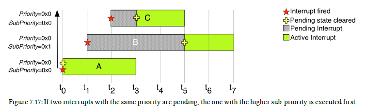</p>

<p align="center">图 7.17：如果两个具有相同优先级的中断处于挂起状态，具有更高子优先级的中断将首先执行</p>

图 7.17 展示了子优先级如何影响多个挂起 ISR 的执行。这里我们有三个中断，都具有相同的最高优先级。在时间 t0，IRQ A 触发并立即得到服务。在时间 t1，B IRQ 触发，但由于它具有与其他 IRQ 相同的优先级级别，它被保留在挂起状态。在时间 t2，C IRQ 也触发，但由于与之前相同的原因，它也被处理器保留在挂起状态。当 A ISR 完成时，C IRQ 首先得到服务，因为它的子优先级高于 B。只有当 C ISR 完成后，B IRQ 才能得到服务。

`IPR` 各位的逻辑细分方式由 `SCB->AIRCR` 寄存器定义，它是系统控制块（System Control Block, SCB）寄存器组中的一个寄存器。需要从一开始就强调：`IPR` 内容的解释方式对所有 ISR 都是全局的。一旦我们定义了优先级方案（在 HAL 中也称为优先级分组），该方案对系统中使用的所有中断都是通用的。

<!-- page: 196 -->

<p align="center">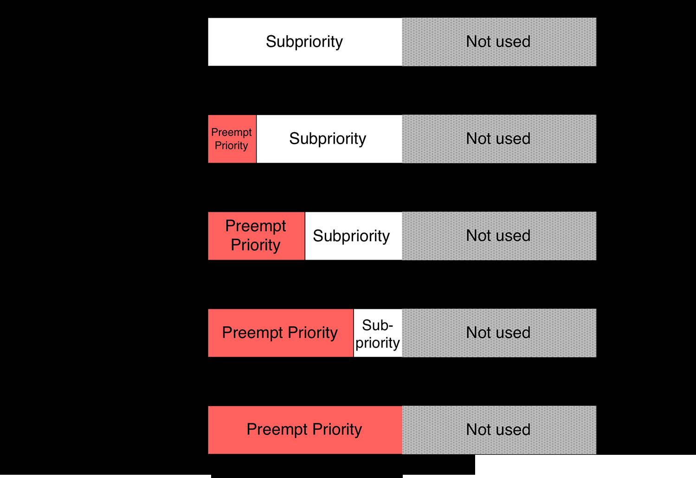</p>

<p align="center">图 7.18：<code>IPR</code> 位在抢占优先级和子优先级之间的细分</p>

图 7.18 展示了 `IPR` 寄存器的全部五种可能细分方式，而表 7.2 给出了每种细分方案所允许的最大抢占优先级级别数和子优先级级别数¹⁴。

表 7.2：优先级分组方案、各类优先级的位数与可用级别数

| NVIC 优先级分组 | 抢占优先级位数 | 抢占优先级级别数 | 子优先级位数 | 子优先级级别数 |
|---|---|---|---|---|
| `NVIC_PRIORITYGROUP_0` | 0 | 1 | 4 | 16 |
| `NVIC_PRIORITYGROUP_1` | 1 | 2 | 3 | 8 |
| `NVIC_PRIORITYGROUP_2` | 2 | 4 | 2 | 4 |
| `NVIC_PRIORITYGROUP_3` | 3 | 8 | 1 | 2 |
| `NVIC_PRIORITYGROUP_4` | 4 | 16 | 0 | 1 |

> 译者注：原书表格只给出“级别数”两列，并把“没有分配位”的情形记为 0。严格来说，某类优先级分配 0 位时仍有 1 个取值——例如在 `NVIC_PRIORITYGROUP_0` 下所有中断的抢占优先级相同，彼此之间无法抢占；而在 `NVIC_PRIORITYGROUP_4` 下只有一个子优先级级别。这里把“位数”与“由位数得到的级别数”分列，以便对照。硬件上这些位数取自 `IPR` 寄存器的最高若干位。

CubeHAL 提供了以下函数来为 IRQ 分配优先级：

```c
void HAL_NVIC_SetPriority(IRQn_Type IRQn, uint32_t PreemptPriority, uint32_t SubPriority);
```

HAL 库约定：`PreemptPriority` 与 `SubPriority` 传入的同样是优先级级别编号，其可用范围由优先级分组决定，具体可用级别数就是表 7.2 中对应的值——STM32 的 Cortex-M3/4/7 只实现了 4 位优先级，因此这两类优先级合起来共 16 个级别。例如在 `NVIC_PRIORITYGROUP_2` 下，抢占优先级只能取 0～3，子优先级也只能取 0～3；而在 `NVIC_PRIORITYGROUP_4` 下，抢占优先级可取 0～15，子优先级则只能取 0。该编号会在内部被自动左移到最高有效位，这简化了向优先级位数不同的其他 MCU 移植代码的过程（这也是芯片厂商只使用 `IPR` 寄存器高位部分的原因）。

相反，要定义优先级分组，即如何在抢占优先级和子优先级之间细分 `IPR` 寄存器，可以使用以下函数：

¹⁴如前所述，基于 Cortex-M33 内核的 STM32 MCU 仅使用 `IPR` 寄存器的最高三位。这意味着最多只有八个优先级级别，可用的优先级分组也只到 `NVIC_PRIORITYGROUP_3`。因此，`NVIC_PRIORITYGROUP_4` 完全不可用。

<!-- page: 197 -->

```c
void HAL_NVIC_SetPriorityGrouping(uint32_t PriorityGroup);
```

其中 `PriorityGroup` 参数取自表 7.2 中“NVIC 优先级分组”一列的宏之一。

以下示例¹⁵展示了中断优先级机制的工作原理。

¹⁵该示例旨在配合 Nucleo-F401RE 开发板使用。如果您使用的是其他型号的 Nucleo 开发板，请参阅本书中的其他示例。

**Filename:** `src/main-ex3.c`

```c
23  void SystemClock_Config(void);
24  uint8_t blink=0;
25
26  int main(void) {
27    GPIO_InitTypeDef GPIO_InitStruct = {0};
28
29    /* MCU Configuration----------------------------------------------------------*/
30    /* Reset of all peripherals, Initializes the Flash interface and the Systick. */
31    HAL_Init();
32    /* Configure the system clock */
33    SystemClock_Config();
34
35    /* GPIOA, GPIOB and GPIOC Configuration----------------------------------------------*/
36    /* GPIO Ports Clock Enable */
37    __HAL_RCC_GPIOA_CLK_ENABLE();
38    __HAL_RCC_GPIOC_CLK_ENABLE();
39    __HAL_RCC_GPIOB_CLK_ENABLE();
40
41    /*Configure GPIO pin : PC13 */
42    GPIO_InitStruct.Pin = GPIO_PIN_13;
43    GPIO_InitStruct.Mode = GPIO_MODE_IT_RISING;
44    GPIO_InitStruct.Pull = GPIO_PULLDOWN;
45    HAL_GPIO_Init(GPIOC, &GPIO_InitStruct);
46
47    /*Configure GPIO pin : PB2 */
48    GPIO_InitStruct.Pin = GPIO_PIN_2;
49    GPIO_InitStruct.Mode = GPIO_MODE_IT_FALLING;
50    GPIO_InitStruct.Pull = GPIO_PULLUP;
51    HAL_GPIO_Init(GPIOB, &GPIO_InitStruct);
52
53
54    /*Configure GPIO pin : PA5 */
55    GPIO_InitStruct.Pin = GPIO_PIN_5;
56    GPIO_InitStruct.Mode = GPIO_MODE_OUTPUT_PP;
57    GPIO_InitStruct.Pull = GPIO_NOPULL;
58    GPIO_InitStruct.Speed = GPIO_SPEED_FREQ_LOW;
59    HAL_GPIO_Init(GPIOA, &GPIO_InitStruct);
60
61    /* Configure GPIO pin Output Level */
62    HAL_GPIO_WritePin(GPIOA, GPIO_PIN_5, GPIO_PIN_RESET);
63
64    /* EXTI interrupt init*/
65    HAL_NVIC_SetPriority(EXTI15_10_IRQn, 0x1, 0x0);
66    HAL_NVIC_EnableIRQ(EXTI15_10_IRQn);
67
68    HAL_NVIC_SetPriority(EXTI2_IRQn, 0x0, 0x0);
69    HAL_NVIC_EnableIRQ(EXTI2_IRQn);
70
71    while (1);
72  }
73
74  void EXTI15_10_IRQHandler(void) {
75    HAL_GPIO_EXTI_IRQHandler(GPIO_PIN_13);
76  }
77
78  void EXTI2_IRQHandler(void) {
79    HAL_GPIO_EXTI_IRQHandler(GPIO_PIN_2);
80  }
81
82  void HAL_GPIO_EXTI_Callback(uint16_t GPIO_Pin) {
83    if (GPIO_Pin == GPIO_PIN_13) {
84      blink = 1;
85      while (blink) {
86        HAL_GPIO_TogglePin(GPIOA, GPIO_PIN_5);
87        for (volatile int i = 0; i < 100000; i++) {
88          /* Busy wait */
89        }
90      }
91    } else {
92      blink = 0;
93    }
94  }
```

如果前面的解释足够清楚，这段代码应该很容易理解。这里有两个分别与 EXTI 线 2 和 13 相关联的中断请求（IRQ）。对应的中断服务例程（ISR）会调用 HAL 函数 `HAL_GPIO_EXTI_IRQHandler()`，该函数进而调用 `HAL_GPIO_EXTI_Callback()` 回调，并传入参与中断的 GPIO。当用户按下连接在 PC13 上的按钮时，回调函数先把 `blink` 置 1，随后进入 `while(blink)` 循环，只要 `blink` 保持非零就持续快速翻转 LD2 LED。当 PB2 引脚被拉低时（请使用附录 C 中您 Nucleo 开发板的引脚图来确认其位置），`EXTI2_IRQHandler()` 被触发，这导致 `HAL_GPIO_EXTI_IRQHandler()` 把 `blink` 变量置 0，于是 `EXTI15_10_IRQHandler()` 可以结束。

<!-- page: 199 -->

请注意，这是一种处理中断的非常糟糕的方式。在中断中锁定微控制器（MCU）是一种糟糕的编程风格，也是嵌入式编程中所有问题的根源。不幸的是，考虑到本书在此处仍只涵盖少数主题，这是作者能想到的唯一示例。正如我们很快将看到的，每个 ISR 都必须设计得尽可能短，否则其他基本 ISR 可能会被屏蔽很长时间，从而丢失来自其他外设的重要信息。

作为练习，请尝试调整中断优先级，并观察如果两个中断具有相同优先级时会发生什么。

可能会产生一个问题：为什么不在第 87:89 行使用 `HAL_Delay()` 函数，而要用忙等待（busy-wait）？答案很简单，并且与中断优先级直接相关。`HAL_Delay()` 在执行忙等待的同时，等待 SysTick 定时器递增全局变量 `uwTick`（一个以 1 kHz 频率递增的无符号 32 位整数）。然而，正如我们将在第 11 章中看到的，SysTick 定时器被配置为以中断模式工作，并且其中断优先级由 CubeMX 设置——默认情况下设置为尽可能低的优先级（请查看 `Core/Inc/stm32XXxx_hal_conf.h` 文件中的宏 `TICK_INT_PRIORITY`）。把 `EXTI15_10_IRQn` 中断的优先级级别设置为 1，会导致 SysTick 定时器的 ISR 在 `blink` 变量变为 0、该 ISR 结束之前永远不会触发。

您可能注意到，即使导线没有接地，仅仅触摸导线也会触发中断。为什么会这样？导致中断“意外”触发的原因主要有两个。首先，现代微控制器会尽量减少使用内部上拉/下拉电阻带来的功耗损失，因此这些电阻的阻值选得非常高（大约 50kΩ）。如果您代入分压公式算一下就会发现，当上拉/下拉电阻阻值很大时，很容易把 I/O 拉低或拉高。其次，这里我们没有对输入引脚做充分的去抖动（debouncing）。去抖动是指尽量削弱“不稳定”信号源（例如机械开关）产生的抖动影响的过程。通常用硬件¹⁶或软件来实现：软件方式是统计自输入状态首次变化以来经过的时间——在我们的场景中，如果输入保持低电平超过一段时间（通常 100ms 到 200ms 就足够了），就可以认为输入确实已经接地。正如我们将在第 11 章中看到的，我们还可以使用某个定时器配置为输入捕获模式的一个通道来检测 GPIO 何时改变状态，从而自动统计从第一个事件开始经过的时间。此外，定时器通道支持集成的可编程硬件滤波器，这使我们能够减少用于对 I/O 去抖动所需的外部元件数量。

最后还要强调几点。首先，与基于 Cortex-M0/0+ 的微控制器不同，Cortex-M3/4/7/33 内核允许在中断已经使能的情况下动态修改其优先级。

¹⁶通常，在开关触点并联一个电容和一个电阻就足够了。例如，您可以查看 Nucleo 开发板的原理图，看看 ST 工程师如何对连接到 PC13 GPIO 的 USER 按钮进行去抖动。

<!-- page: 200 -->

其次，在动态降低优先级分组时必须格外小心。让我们考虑下面的例子。假设我们有三个中断服务例程（ISR），其优先级依次递减（优先级标在括号内）：A(0x0)、B(0x10)、C(0x20)。假设这些优先级是在优先级分组等于 `NVIC_PRIORITYGROUP_4` 时设定的。如果我们把分组降低到 `NVIC_PRIORITYGROUP_1`，那么当前的“抢占级别”就会被重新解释为“子优先级”。这将导致 ISR A、B、C 具有相同的抢占级别（即 0x0），因此谁也无法抢占谁。例如，从图 7.20 可以看出，当优先级分组从 4 降到 1 时，ISR C 的优先级发生了什么变化：当分组设为 4 时，C 的优先级只比最高优先级级别（0）低两级（次高级别是 0x10，即 B 的优先级），这意味着 C 可以被 A 和 B 抢占；而一旦把分组降到 1，C 的优先级就变成 0x0（只有 bit 7 还作为抢占优先级位），其余已实现的位（bit 6:4）都被 NVIC 控制器解释为子优先级。这可能导致以下场景：

1. 所有中断都无法相互抢占；
2. 如果触发 C 中断，且 CPU 未在处理另一个中断，则立即处理 C；
3. 如果 CPU 正在处理 ISR C，随后不久触发 A 和 B，CPU 将在完成 C 的处理后，先处理 A，然后处理 B；
4. 如果 CPU 正在处理另一个 ISR，若触发 C，随后不久触发 A 和 B，则首先处理 A，接着是 B，最后是 C。

<p align="center">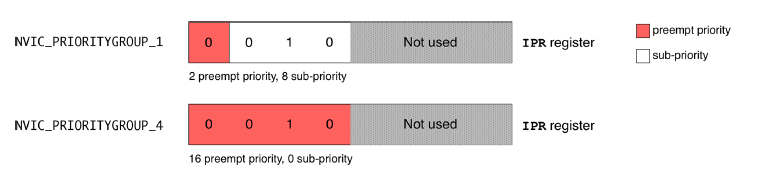</p>

<p align="center">图 7.20：当优先级分组从 4 降低到 1 时，ISR C 的优先级变化</p>

在彻底弄清中断优先级机制之前，你需要亲自做几次实验。因此，请尝试修改示例 3，让两个 IRQ 在改变优先级分组后具有相同的抢占优先级。

要获取中断的优先级，HAL 定义了以下函数：

```c
void HAL_NVIC_GetPriority(IRQn_Type IRQn, uint32_t PriorityGroup, uint32_t* pPreemptPriority, uint32_t* pSubPriority);
```

<!-- page: 201 -->

我必须承认，这个函数的签名有点令人费解，因为它与 `HAL_NVIC_SetPriority()` 不同：在这里我们必须指定 `PriorityGroup`，而 `HAL_NVIC_SetPriority()` 函数在内部计算它。我不知道 ST 为什么决定使用这种签名，我也看不出使其与 `HAL_NVIC_SetPriority()` 不同的理由。

可以使用以下函数获取当前的优先级分组：

```c
uint32_t HAL_NVIC_GetPriorityGrouping(void);
```

### 7.4.3 在 CubeMX 中设置中断优先级

CubeMX 也可以用于设置 IRQ 优先级和优先级分组方案。此配置通过 Configuration 视图完成，点击 NVIC 按钮。可启用的 ISR 列表将出现，如图 7.21 所示。

<p align="center">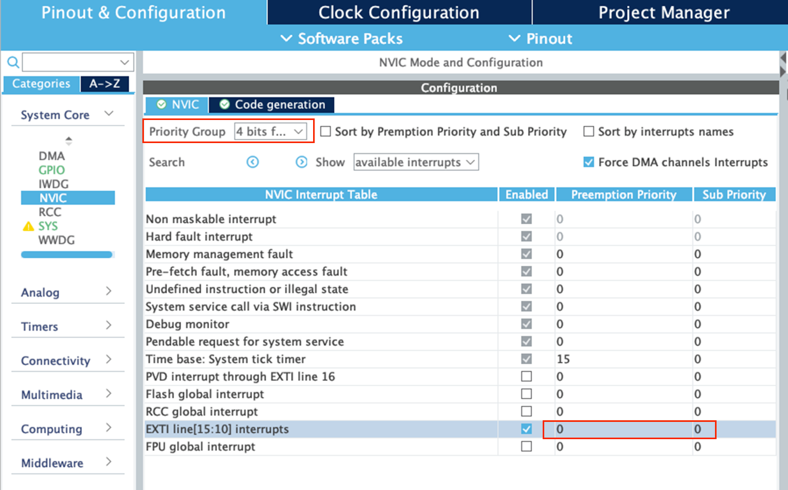</p>

<p align="center">图 7.21：NVIC 配置视图允许设置 ISR 优先级</p>

使用 Priority Group 组合框，我们可以设置优先级分组方案，然后为每个中断分配单独的优先级和子优先级。CubeMX 将自动生成相应的 C 代码，在 `MX_GPIO_Init()` 函数内部设置 IRQ 优先级。相反，全局优先级分组方案在 `HAL_MspInit()` 函数中配置。

## 7.5 中断重入性

让我们假设把示例 3 改成使用引脚 PC12 而不是 PB2。在这种情况下，由于 `EXTI12` 和 `EXTI13` 共享同一个 IRQ，我们的 Nucleo 将永远不会停止闪烁。原因在于 Cortex-M 处理器中优先级机制的实现方式——具有给定优先级的异常，不能被另一个具有相同优先级的异常抢占。也正因如此，异常和中断是不可重入（re-entrant）的，它们不能被递归调用¹⁷。需要注意：这里所说的“不可重入”与前面讲过的中断嵌套/抢占不是一回事——不同优先级的 ISR 之间仍然可以正常嵌套，只是同一个 ISR 不可能在它自己执行期间被再次调用。

<!-- page: 202 -->

不过，在大多数情况下，我们可以重新安排代码来绕开这一限制。在下面这个示例中，闪烁逻辑被放在 `main()` 函数里执行，ISR 只负责设置全局的 `blink` 变量。

```c
50    /*Configure GPIO pin : PC12 & PC13 */
51    GPIO_InitStruct.Pin = GPIO_PIN_12 | GPIO_PIN_13;
52    GPIO_InitStruct.Mode = GPIO_MODE_IT_RISING;
53    GPIO_InitStruct.Pull = GPIO_PULLDOWN;
54    HAL_GPIO_Init(GPIOC, &GPIO_InitStruct);
55
56    /*Configure GPIO pin : PA5 */
57    GPIO_InitStruct.Pin = GPIO_PIN_5;
58    GPIO_InitStruct.Mode = GPIO_MODE_OUTPUT_PP;
59    GPIO_InitStruct.Pull = GPIO_NOPULL;
60    GPIO_InitStruct.Speed = GPIO_SPEED_LOW;
61    HAL_GPIO_Init(GPIOA, &GPIO_InitStruct);
62
63    HAL_NVIC_SetPriorityGrouping(NVIC_PRIORITYGROUP_1);
64    HAL_NVIC_EnableIRQ(EXTI15_10_IRQn);
65    HAL_NVIC_SetPriority(EXTI15_10_IRQn, 0x0, 0);
66
67    while(1) {
68      if(blink) {
69        HAL_GPIO_TogglePin(GPIOA, GPIO_PIN_5);
70        for(int i = 0; i < 100000; i++);
71      }
72    }
73  }
74
75  void EXTI15_10_IRQHandler(void) {
76    HAL_GPIO_EXTI_IRQHandler(GPIO_PIN_12);
77    HAL_GPIO_EXTI_IRQHandler(GPIO_PIN_13);
78  }
79
80  void HAL_GPIO_EXTI_Callback(uint16_t GPIO_Pin) {
81    if(GPIO_Pin == GPIO_PIN_13)
82      blink = 1;
83    else
84      blink = 0;
85  }
```

¹⁷ Joseph Yiu 在他的书中展示了一种绕过此限制的方法。然而，除非你的应用程序确实需要中断重入性，否则我强烈反对使用这类取巧的技巧。

<!-- page: 203 -->

## 7.6 一次性屏蔽所有中断，或按优先级屏蔽

有时，我们需要确保某段代码不会被打断——即在它执行期间不允许中断或其他特权代码插进来，也就是要保证这段代码是线程安全的（thread-safe）。基于 Cortex-M 的处理器允许临时屏蔽所有中断和异常的执行，而无需逐个禁用它们。为此提供了两个特殊寄存器：`PRIMASK` 可以屏蔽除 NMI 和 HardFault 以外的所有异常（包括全部外设中断），`FAULTMASK` 则连 HardFault 也一并屏蔽（只有 NMI 不受影响）。

<p align="center">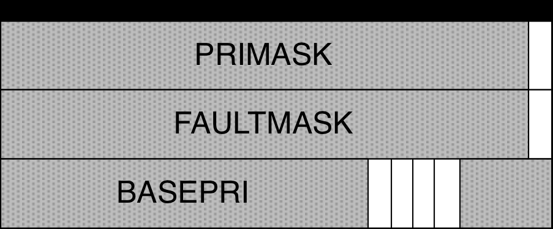</p>

<p align="center">图 7.22：<code>PRIMASK</code>、<code>FAULTMASK</code> 与 <code>BASEPRI</code> 寄存器</p>

尽管这些寄存器是 32 位宽，但 `PRIMASK` 和 `FAULTMASK` 只用到最低位（bit 0）来使能/禁用中断和异常（`BASEPRI` 是例外，它用 bit[7:0] 保存优先级阈值）。ARM 汇编指令 `CPSID i` 通过把 `PRIMASK` 置 1 来禁用所有中断，`CPSIE i` 则通过把 `PRIMASK` 清零来使能它们；指令 `CPSID f` 通过把 `FAULTMASK` 置 1 来禁用所有异常（NMI 除外），`CPSIE f` 则将其使能。

CMSIS-Core 包提供了几个宏来执行这些操作：`__disable_irq()` 和 `__enable_irq()` 会自动置位和清除 `PRIMASK`。任何关键任务都可以放在这两个宏之间，如下所示：

```c
...
__disable_irq();
/* All exceptions with configurable priority are temporarily disabled.
You can place critical code here */
...
__enable_irq();
```

然而，请记住，作为一般规则，中断只能被屏蔽很短的时间，否则您可能会丢失重要的中断。请记住，中断不会被排队。

另一个可用的宏是 `__set_PRIMASK(x)`，其中 `x` 是要写入 `PRIMASK` 的值（0 或 1）；宏 `__get_PRIMASK()` 返回 `PRIMASK` 的内容。宏 `__set_FAULTMASK(x)` 和 `__get_FAULTMASK()` 则用于操作 `FAULTMASK` 寄存器。

需要强调的是：一旦 `PRIMASK` 被重新清零，所有处于挂起状态的中断都会按照各自的优先级得到服务。`PRIMASK` 置位时，中断请求仍然会被置为挂起（挂起位被设置），只是 ISR 不会被执行——这也是我们说中断是被“屏蔽（masked）”而不是被“禁用（disabled）”的原因。只要 `PRIMASK` 一清零，中断就会立即开始得到服务。

<!-- page: 204 -->

Cortex-M3/4/7/33 内核允许按优先级选择性地屏蔽中断。`BASEPRI` 寄存器按优先级级别屏蔽异常或中断。`BASEPRI` 用到的优先位与 `IPR` 相同：在基于 Cortex-M3/4/7 内核的 STM32 中为其最高 4 位，在基于 Cortex-M33 的 STM32 中为最高 3 位。当 `BASEPRI` 为 0 时，该功能被禁用；当它被设为非零值时，它会屏蔽优先级级别数值大于等于该阈值（即优先级不高于该阈值）的所有异常（包括中断），而优先级数值更小（即优先级更高）的异常仍可被处理器接受。例如，如果把 `BASEPRI` 设为 0x60，那么所有优先级数值在 0x60～0xFF 之间的中断都会被屏蔽。请记住：在 Cortex-M 内核中，优先级数值越大，实际优先级越低。宏 `__set_BASEPRI(x)` 用于设置 `BASEPRI` 寄存器的内容。需要注意它与 `HAL_NVIC_SetPriority()` 的区别：`__set_BASEPRI()` 是 CMSIS 提供的 intrinsic，直接把 `x` 写入寄存器，**不会**像 HAL 那样自动把优先级“级别编号”左移到已实现的高位上。因此，如果我们想屏蔽所有优先级级别数值 ≥ 2 的中断（即除 0 级和 1 级之外的全部中断），就必须自己完成这个编码——向它传入 2 << (8 - __NVIC_PRIO_BITS)（在实现 4 位优先级的内核上等于 0x20）。也可以直接写成下面这行代码：

```c
__set_BASEPRI(2 << (8 - __NVIC_PRIO_BITS));
```

<!-- page: 205 -->

Eclipse 插曲

在编码时，生产力对每个开发人员都很重要。现代源代码编辑器允许定义自定义代码片段，即当输入特定“关键字”时由编辑器自动插入的源代码片段。Eclipse 将此功能称为“代码模板”，它们可以在输入关键字后立即通过发出 Ctrl+Space 来调用。例如，打开一个源文件并写入关键字“for”，然后立即按下 Ctrl+Space。会弹出一个上下文菜单，如下面的图片所示。

<p align="center">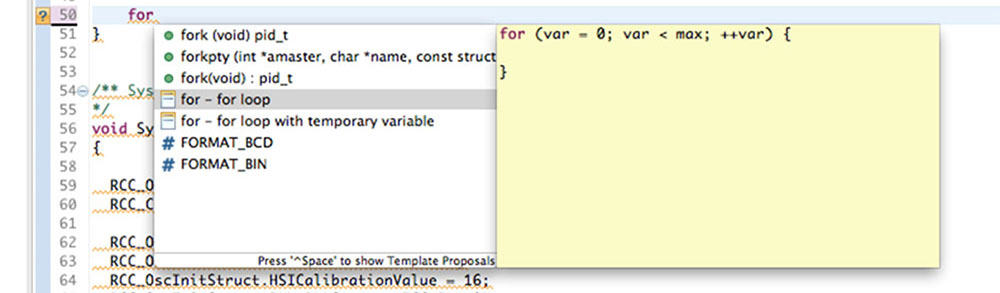</p>

通过选择条目“for - for loop”，Eclipse 会自动在代码中放置一个新的 for 循环。现在注意一件事：循环变量 var 被高亮显示，如下面的图片所示。

<p align="center">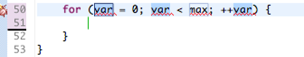</p>

如果您为循环变量写入新名称，Eclipse 会自动在所有三个位置更改其名称。Eclipse 定义了其代码模板集，但好消息是您可以定义自己的！进入 Eclipse 首选项，然后进入 C/C++->Editor->Templates。在这里您可以找到所有预定义的代码片段，并最终添加您自己的。

<p align="center">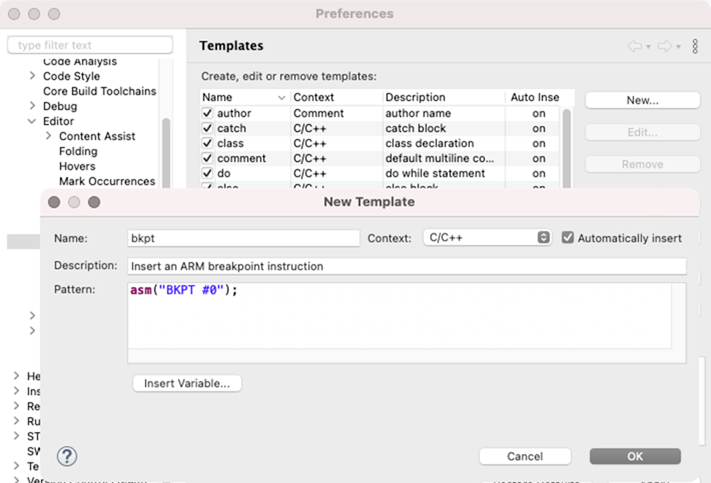</p>

例如，我们可以添加一个新的代码模板：当输入关键字 `bkpt` 时，插入软件断点指令 `asm("BKPT #0");`，如前一张图片所示。代码模板高度可定制，这得益于变量和其他模式构造的使用。更多信息请参阅 Eclipse 文档。

http://bit.ly/2c3Vm1K
