<!-- page: 235 -->

# 9. 直接存储器访问 (DMA) 管理

每个嵌入式应用都需要与外部世界交换数据或驱动外部外设。例如，我们的微控制器可能使用 UART 与 PCB 上的其他模块交换消息，或者使用可用的 SPI 接口之一将数据存储到外部闪存中。这涉及在内部 SRAM 或闪存与外设寄存器之间传输一定量的数据，并且需要一定数量的 CPU 周期来完成传输。这会导致计算能力（CPU 被占用在传输过程中）的损失、整体性能的降低，并最终导致重要异步事件的丢失。

直接存储器访问 (DMA) 控制器是一个专用的、可编程的硬件单元，它允许 MCU 外设在不经过 Cortex-M 内核干预的情况下访问内部存储器。CPU 完全从数据传输产生的开销中解放出来（除了与 DMA 配置相关的开销），并且可以并行执行其他活动¹。DMA 被设计为双向工作（即，它允许数据从存储器传输到外设，反之亦然），并且所有 STM32 微控制器都至少提供一个 DMA 控制器，但其中大多数实现了两个独立的 DMA。

DMA 是现代 MCU 的“高级”功能，初学者往往认为它太复杂而难以使用。相反，DMA 背后的基本概念基本上很简单，一旦你理解了它们，使用它就容易了。此外，好消息是，CubeHAL 被设计为抽象给定外设的大部分 DMA 配置步骤，留给用户负责提供仅少数基本配置。

本章将引导你了解与 DMA 使用相关的基本概念，并概述所有 STM32 系列中 DMA 的特性。一如既往，本章并不旨在详尽无遗，也不旨在取代官方 ST 文档²，而后者在阅读本章期间是一个很好的参考。然而，一旦你掌握了与 DMA 相关的基本概念，你就能够轻松地深入你的 MCU 数据手册。

## 9.1 DMA 简介

在我们分析 `HAL_DMA` 模块提供的功能之前，理解 DMA 控制器背后的一些基本概念很重要。接下来的段落试图总结在研究此外设期间需要记住的最重要方面。STM32 MCU 中的 DMA 实现随着更强大和更现代系列的出现而在过去几年中不断演进。最早且更便宜的 STM32 系列提供了最简单的 DMA 架构，具有相当

¹这并不完全正确，正如我们接下来将看到的。但在这里考虑该句子为真是可以的。

²ST 为每个 STM32 系列提供了关于 DMA 的专用应用笔记。例如，AN2548 (https://bit.ly/3kHEfFH) 讨论了 STM32F0/F1/F3/Gx/Lx MCU 中的 DMA，而 AN4031 (https://bit.ly/3kImCpn) 则完全关于 STM32F2/F4/F7 系列中的 DMA。

<!-- page: 236 -->

有限的混合 DMA 源的可能性。随着更强大的 F2/F4/F7 系列的出现，ST 引入了更灵活的 DMA 架构，增加了通信通道的数量，同时通过专用的“总线桥”直接将 DMA 连接到某些外设，从而避免了总线矩阵上的“流量”，提高了整体性能。最后，在最近的 STM32L4+/L5/Gx/H7 系列中，混合源和目的地的自由度达到了新的维度：得益于 DMAMUX 复用器，源和目的外设之间的互连不再由设计固定，并且有可能将外设互连成链，其中数据仅通过 DMA 交换，而没有 CPU 的干预。

如果你在没有充分准备的情况下开始处理这三种 STM32 DMA 架构，你很可能会完全困惑，尤其是被 ST 的术语所困扰。出于不明原因，ST 决定在三种不同的架构之间改变词汇，混淆了术语和定义。不幸的是，这种术语变化也反映在 CubeHAL 中，给程序员一种 DMA 架构之间差异很大的印象。相反，除了灵活性的增加之外，三种架构背后的概念（和技术细节）几乎相同。

接下来的段落将试图最小化细节水平，同时关注重要的事情。强烈建议手边保留你正在使用的 STM32 MCU 的参考手册。但相信我：如果你是这方面的新手，在深入非常具体的细节之前，先尝试理解整体情况。

### 9.1.1 对直接存储器访问（DMA）的需求及内部总线的作用

为什么直接存储器访问（DMA）是一个如此重要的特性？STM32 微控制器中的每个外设都需要与内部 Cortex-M 内核交换数据。其中一些外设会将这些数据转换为电气 I/O 信号，以便根据给定的通信协议与外部世界进行交换（例如 UART 或 SPI 接口的情况）。另一些外设的设计使得访问其位于外设存储器映射区域（从 0x4000 0000 到 0x5FFF FFFF）内的寄存器会导致其状态发生变化（例如，GPIOx->ODR 寄存器驱动连接到该端口的所有 I/O 的状态）。然而，请记住，从 CPU 的角度来看，这也意味着在 MCU 内核和外设之间进行存储器传输。

理论上，MCU 可以设计为每个外设都有自己独立的存储区域（专用存储器），并且这些存储器可以与 MCU 内核紧密耦合，以最小化与存储器传输相关的成本³。然而，这会使 MCU 架构变得复杂，需要更多的硅片和更多消耗电力的“有源组件”。因此，所有嵌入式微控制器采用的方法是使用内部 SRAM 存储器的一部分作为不同外设的临时存储区域。由用户决定为这些区域分配多少空间。例如，让我们考虑以下代码片段：

³这就是某些配备真正昂贵的超级计算机的向量处理器所采用的方式，但对于像 STM32 这样售价 32 美分的 CPU 来说并非如此。

<!-- page: 237 -->

```c
uint8_t buf[20];
...
HAL_UART_Receive(&huart2, buf, 20, HAL_MAX_DELAY);
```

在这里，我们将要从 UART2 接口读取二十个字节，因此我们在 SRAM 中分配了一个相同大小的数组（临时存储）。`HAL_UART_Receive()` 函数将访问 huart2.Instance->DR 数据寄存器二十次，以将字节从外设传输到内部存储器，此外它还会轮询 UART RXNE 标志以检测新数据何时准备好进行传输。在这些操作期间，CPU 将参与其中（见图 9.1），即使其角色“有限”于将数据从外设移动到 SRAM⁴。

<p align="center">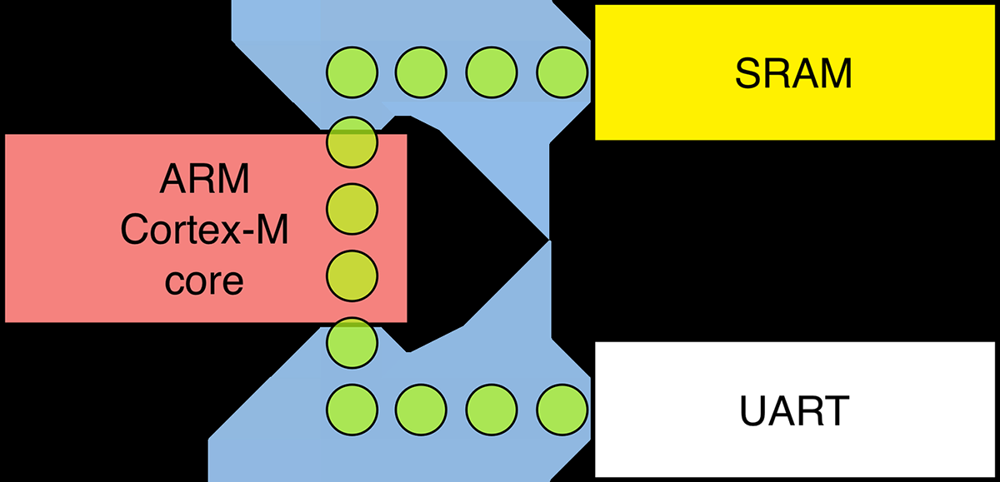</p>

<p align="center">图 9.1：从外设到 SRAM 传输期间的数据流</p>

虽然这种方法一方面简化了硬件设计，但另一方面引入了性能惩罚。Cortex-M 内核“负责”将数据从外设存储器加载到 SRAM，这是一个阻塞操作，它不仅阻止 CPU 执行其他活动，还要求 CPU 等待“较慢”的单元完成其工作（如我们将在第 10 章中看到的，一些 STM32 外设通过较慢的总线连接到 MCU 内核）。这就是高性能微控制器提供专门用于在外设和集中式缓冲存储（即 SRAM）之间传输数据的硬件单元的原因。

在深入探讨 DMA 的细节之前，最好先概览一下从外设到 SRAM 存储器以及反向传输过程中涉及的所有组件。我们已经在第 6 章中看到了 STM32F072 MCU 的总线架构，这是最简单的 STM32 微控制器之一。为了便于查阅，总线架构再次显示在图 9.2 中。它与其他性能更高的 STM32 系列有很大不同。我们将在本章稍后分析它们，因为在这个阶段保持简单是最好的。

该图向我们说明了一些重要的事情：

- Cortex-M 内核和 DMA1 控制器都通过一系列总线与其他 MCU 外设进行交互。如果这仍然不清楚，重要的是要指出，FLASH 和 SRAM 存储器都是 MCU 内核之外的组件，因此它们需要通过总线互连进行交互。

⁴请记住，使用中断模式下的 UART 并不会改变情况。一旦 UART 生成中断以向 MCU 内核发出新数据到达的信号，始终由 CPU 负责将数据逐字节从 UART 数据寄存器“移动”到 SRAM。这就是为什么从性能角度来看，UART 在轮询模式和中断模式下的管理没有区别的原因。

<!-- page: 238 -->

- Cortex-M 内核和 DMA1 控制器都是主设备。这意味着它们是可以在总线上启动事务的唯一单元。然而，对总线的访问必须受到调节，以便它们不能同时访问同一个从设备外设。
- 总线矩阵（Bus Matrix）管理 Cortex-M 内核和 DMA1 控制器之间的访问仲裁。仲裁使用轮转（Round-Robin）算法对总线的访问进行仲裁。总线矩阵由两个主设备（CPU、DMA）和四个从设备（FLASH 接口、SRAM、带 AHB-APB 桥的 AHB1 以及 AHB2）组成。总线矩阵还允许自动互连多个外设。
- 系统总线将 Cortex-M 内核连接到总线矩阵。
- DMA 总线将 DMA 的 AHB（Advanced High-performance Bus，高性能总线）主接口连接到总线矩阵。
- AHB-APB 桥在 AHB 和高级外设总线（APB，Advanced Peripheral Bus）之间提供完全同步的连接，大多数外设都连接在 APB 总线上。

<p align="center">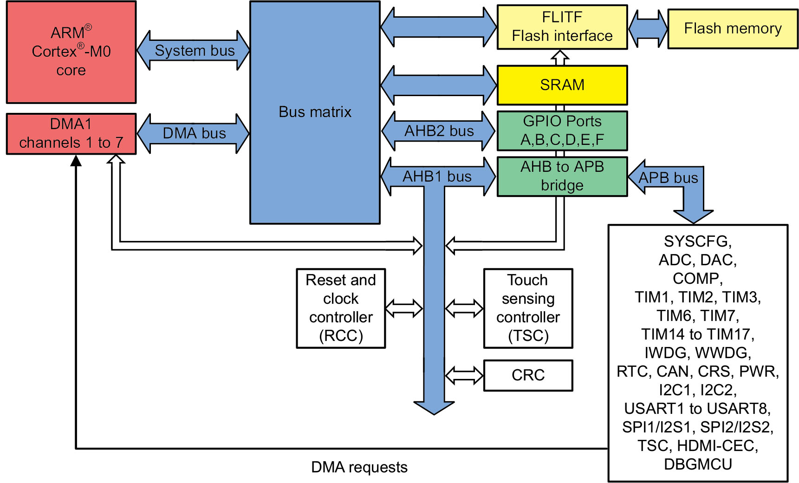</p>

<p align="center">图 9.2：STM32F072 微控制器的总线架构</p>

我们在图 9.2 中遗漏了另一件事：从外设块（白色矩形）指向 DMA1 控制器的 DMA 请求箭头。它具体是做什么用的？在第 7 章中，我们看到 NVIC 控制器通知 Cortex-M 内核来自外设的异步中断请求（IRQ）。当外设准备好执行某些操作时（例如，UART 准备好接收数据或定时器溢出），它会将一条专用的 IRQ 线置为有效。MCU 内核在给定数量的周期后执行相应的 ISR，其中包含处理 IRQ 所需的代码。不要忘记，外设是从设备单元：它们不能独立访问总线。

<!-- page: 239 -->

始终需要一个主设备来启动事务。但是，由于外设是从设备单元⁵，如果我们使用 DMA 将数据从外设传输到存储器，我们就有一种方式通知 DMA 外设已准备好交换数据。这就是为什么从外设到 DMA 控制器有专用数量的 DMA 请求线的原因。我们将在下一段中看到它们是如何组织的，以及我们如何对它们进行编程。

### 9.1.2 直接存储器访问 (DMA) 控制器

在每一个 STM32 微控制器中，DMA 控制器是一个硬件单元，它：

- 拥有两个主端口，分别称为外设端口和存储器端口，连接到 AHB 总线。其中一个端口能够连接从设备外设，另一个端口能够访问存储器控制器（SRAM、闪存、FSMC 等）；在某些 DMA 控制器中，外设端口也能够访问存储器控制器，从而实现存储器到存储器的传输；在大多数 STM32 微控制器中，存储器端口也能够连接外设控制器，从而实现外设到外设的传输；
- 拥有一个从端口，连接到 AHB 总线，用于由另一个主设备（即 CPU）对 DMA 控制器本身进行编程；
- 拥有若干独立且可编程的通道，每个通道在设计上连接或可连接到特定的外设请求线（如 `UART_TX`、`TIM_UP` 等）；
- 为通道定义不同的优先级（可以由软件编程指定，也可以在芯片设计时固定），以便仲裁对存储器的访问，赋予更快且更重要的外设更高的优先级；
- 允许数据双向流动，即从存储器到外设以及从外设到存储器：

每个 STM32 微控制器根据其系列和器件型号提供不同数量的 DMA 和通道。表 9.1 报告了本书中使用的配备所有 Nucleo 开发板的 STM32 微控制器的确切数量。

这些特性在所有 STM32 微控制器中普遍存在。然而，正如本节开头所述，DMA 控制器的架构在最早的 STM32 系列和最新的系列之间有所变化。这就是为什么我们要单独处理它们⁶。

⁵除了某些高性能外设，如 USB 和以太网，它们需要独立访问某些存储器缓冲区，以避免流向通信介质的重要数据丢失。

⁶然而，请记住，本书并不旨在成为每个 STM32 系列硬件细节的详尽来源。请始终手边备有您正在考虑的微控制器的参考手册，并仔细查看与 DMA 相关的章节。

<!-- page: 240 -->

<p align="center">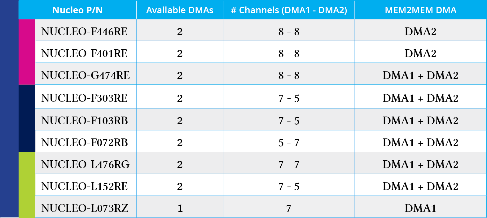</p>

表 9.1：本书中使用的 Nucleo 开发板中可用的 DMA/通道数量

#### 9.1.2.1 F0/F1/F3/L0/L1/L4 微控制器中的 DMA 实现

图 9.3 展示了 F0/F1/F3/L0/L1/L4 微控制器中 DMA1 控制器的表示。这些系列中的某些微控制器提供第二个 DMA 控制器，即 DMA2。DMA1 控制器提供七个可配置通道，而 DMA2 仅提供五个。通道用于在 4GB 地址空间中的两个存储器区域之间以给定的自由度交换数据。每个通道绑定到特定的请求线，该请求线触发两个存储器区域之间的传输。每个请求线连接可变数量的外设请求源：使用多路复用器将特定的外设请求源绑定到通道请求线。然而，通道在芯片设计期间绑定到一组固定的外设，并且同一通道中一次只能有一个外设处于活动状态。例如，表 9.2⁷ 展示了在 STM32F030 微控制器中通道如何绑定到外设。每个请求线也可以由“软件”触发。此功能用于执行存储器到存储器的传输。

⁷该表提取自 ST RM0360 参考手册 (https://bit.ly/1GfS3iC)

<!-- page: 241 -->

<p align="center">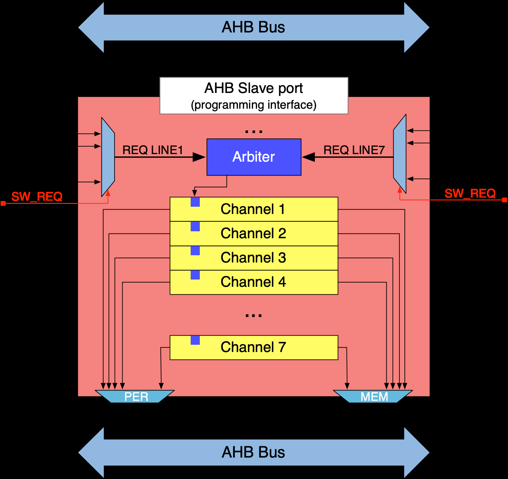</p>

<p align="center">图 9.3：F0/F1/F3/L0/L1/L4 微控制器中 DMA 结构的表示</p>

每个通道都有一个优先级，用于对 AHB 总线的访问进行仲裁。在像 STM32F1 这样的较旧微控制器中，优先级是固定的：通道 1 具有最高优先级，通道 7 具有最低优先级。在较新的微控制器中，可以使用四个等级来配置优先级。内部仲裁器根据各通道的优先级对来自各通道的请求进行仲裁。如果两个请求线激活请求且它们的通道具有相同的优先级，则编号较低的通道赢得竞争。

我们已经在图 9.2 中看到了 STM32F072 的总线架构。为了完整性，图 9.4⁸ 展示了具有相同 DMA 实现（例如 STM32F1）的更高性能微控制器的总线架构。如您所见，这两个系列具有相当不同的内部总线组织。您可以看到两个额外的总线，名为 ICode 和 DCode。为什么会有这种差异？

⁸该图取自 ST 的 RM0008 参考手册 (https://bit.ly/1TNekGo)

<!-- page: 242 -->

<p align="center">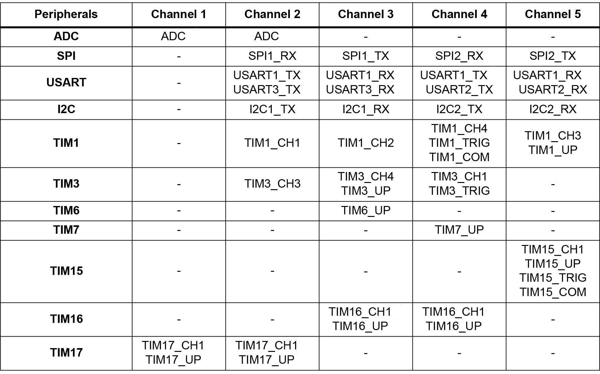</p>

表 9.2：在 STM32F030 微控制器中通道如何绑定到外设

大多数 STM32 微控制器共享相同的计算机架构，除了基于 Cortex-M0/0+ 内核的 STM32F0/G0/L0。事实上，它们是唯一基于冯·诺依曼架构的 Cortex-M 内核，而其他 Cortex-M 内核基于哈佛架构⁹。这两种架构之间的根本区别在于，Cortex-M0/0+ 内核使用一个公共总线访问闪存存储器、SRAM 和外设，而其他 Cortex-M 内核拥有两条独立的总线用于访问闪存（一条用于获取指令，称为指令总线，或简称为 I-Bus 甚至 I-Code；另一条用于访问常量数据，称为数据总线，或简称为 D-Bus 甚至 D-Code）以及一条专门用于访问 SRAM 和外设的线（也称为系统总线，或简称为 S-Bus）。这给我们的应用程序带来了什么优势？

⁹为了完整性，我们必须说它们基于修改的哈佛架构 (https://en.wikipedia.org/wiki/Modified_Harvard_architecture)，但让我们把这种区别留给计算机科学的历史学家。

<!-- page: 243 -->

<p align="center">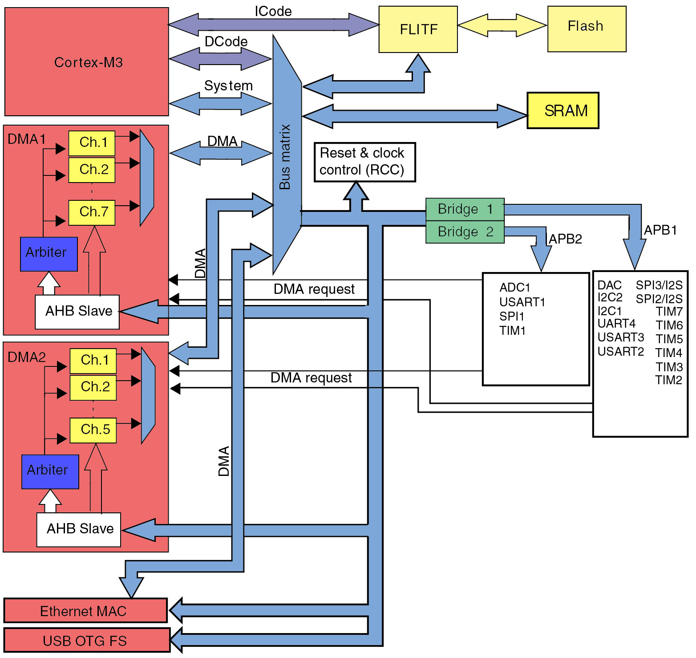</p>

<p align="center">图 9.4：Connectivity Line（互联型）系列的 STM32F1 微控制器中的总线架构</p>

在 Cortex-M0/0+ 内核中，DMA 和 Cortex 内核使用总线矩阵竞争对存储器和外设的访问。假设 CPU 正在对其内部寄存器（R0-R14）中包含的数据执行数学运算。如果 DMA 正在将数据传输到 SRAM，总线矩阵会仲裁来自 Cortex 内核对闪存存储器的访问，以加载下一条要执行的指令。因此，微控制器内核被阻塞，等待其轮次（稍后会有更多介绍）。在其他 Cortex-M 内核中，CPU 可以独立访问闪存存储器，从而提升整体性能。这是一个根本性的差异，它解释了 STM32F0 微控制器的价格：它们不仅可能拥有更少的 SRAM 和闪存并以较低频率运行，而且它们面临的是更简单且本质上性能较低的架构。

然而，重要的是要指出，总线矩阵实现了调度策略，以避免某个主设备（在 Value Line（超值型）微控制器中为 CPU 和 DMA，或在 Connectivity Line（互联型）微控制器中为 CPU、DMA、以太网和 USB）阻塞时间过长。每个 DMA 传输由四个阶段组成：采样和仲裁阶段、地址计算阶段、总线访问阶段以及最终的确认阶段（用于信号传输已完成）。每个阶段占用一个周期，除了总线访问阶段，它可以持续更多周期。然而，其最大持续时间固定，并且总线矩阵保证在确认

<!-- page: 244 -->

阶段结束时，另一个主设备将被调度以访问总线。正如我们将在下一段中看到的，STM32F2/F4/F7 系列允许在访问从设备时实现更高级的并行性。然而，这些方面的细节超出了本书的范围。强烈建议查看 ST 的 AN4031 (https://bit.ly/1n66sW7¹⁰) 以更好地理解它们。

最后，在特定条件下，直接存储器访问（DMA）还可以执行外设到外设的传输，我们将在下一节中看到。

<p align="center">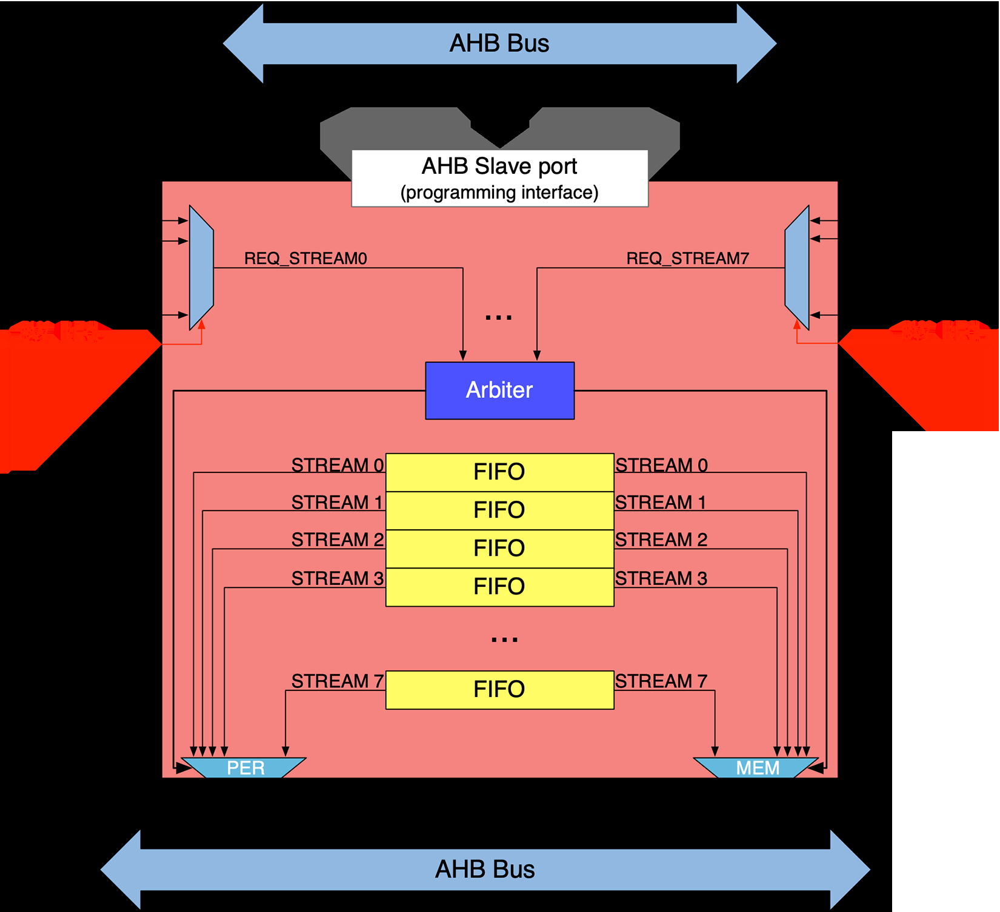</p>

<p align="center">图 9.5：STM32F2/F4/F7 微控制器中的 DMA 架构</p>

#### 9.1.2.2 F2/F4/F7 微控制器中的 DMA 实现

STM32F2/F4/F7 微控制器实现了更高级的 DMA 控制器，如图 9.5 所示。与旧款 STM32 微控制器中的 DMA 相比，它提供了更高的灵活性。然而，出于作者不明的原因，ST 团队决定在这些系列中更改与 DMA 相关的术语，并在 G0/G4/L4+/L5/H7 系列中再次改变主意。因此，特别是如果你阅读了上一段，从一开始就澄清以下几点非常重要：

¹⁰https://bit.ly/1n66sW7

<!-- page: 245 -->

- 术语“流”（streams）指的是存储器地址和外设地址之间的通信通道；因此，“流”是“通道”的同义词；
- 术语“通道”（channels）指的是请求线（在 ST 官方文档中也被称为请求流）。

在 F2/F4/F7 系列中，每个 DMA 都实现了 8 个不同的流。每个流专门用于管理来自一个或多个外设的存储器访问请求。每个流总共最多可以有 8 个通道（请求线）（但请记住，在一个流中，同一时间只能有一个通道/请求处于活动状态），并且它有一个仲裁器用于处理 DMA 请求之间的优先级，该仲裁器可由用户配置为四个等级。每个流也可以由“软件”触发。此功能用于执行存储器到存储器的传输，但如表 9.1 所示，它仅限于 DMA2。

流可以选择性地启用一个深度为 4 个字的 32 位先进先出（FIFO）缓冲区。FIFO 用于在把数据从源端传输到目的端之前临时存储数据，尤其是在传输两端的速度不同时。当两个端点的数据帧大小不同时，FIFO 缓冲区可以在执行传输的同时自动执行数据转换。支持的操作包括：

- 8 位 / 16 位 → 32 位 / 16 位（数据打包）
- 32 位 / 16 位 → 8 位 / 16 位（数据解包）

每个 STM32F2/F4/F7 微控制器提供两个 DMA 控制器，总共 16 个独立的流。与其他 STM32 微控制器一样，通道在芯片设计期间绑定到一组固定的外设。表 9.3 显示了 STM32F401RE 微控制器中 DMA1 的流/通道请求映射。STM32F2/F4/F7 微控制器嵌入了由以下部分组成的多主/多从架构：

<p align="center">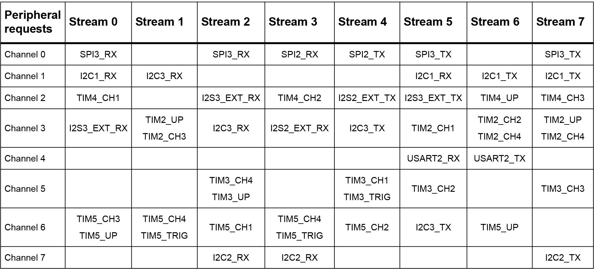</p>

表 9.3：STM32F401RE 微控制器中 DMA1 的流/通道请求映射

<!-- page: 246 -->

- 八个主设备：
  - Cortex 内核 I-bus
  - Cortex 内核 D-bus
  - Cortex 内核 S-bus
  - DMA1 存储器总线
  - DMA2 存储器总线
  - DMA2 外设总线
  - 以太网 DMA 总线（如果可用）
  - USB 高速 DMA 总线（如果可用）
- 八个从设备：
  - 内部闪存 I-Code 总线
  - 内部闪存 D-Code 总线
  - 主内部 SRAM1
  - 辅助内部 SRAM2（如果可用）
  - 辅助内部 SRAM3（如果可用）
  - 包括 AHB-APB 桥和 APB 外设的 AHB1 外设
  - AHB2 外设
  - AHB3 外设（FMC）（如果可用）

主设备和从设备通过多层总线矩阵连接，确保来自不同主设备的并发访问和高效操作，即使多个高速外设同时工作也是如此。此外，专用的 AHB-APB 桥允许主设备（因此也包括 DMA）直接访问某些外设，以避免通过总线矩阵。图 9.6¹¹ 展示了 STM32F405/415 和 STM32F407/417 系列中此架构的情况。

多层总线矩阵允许不同的主设备并发执行数据传输，只要它们寻址不同的从模块（但对于给定的 DMA，同一时间只能有一个“流”访问总线）。在 Cortex-M 哈佛架构和双 AHB 端口 DMA 的基础上，这种结构增强了数据传输的并行性，从而有助于减少执行时间，并优化 DMA 效率和功耗。

¹¹该图取自 ST 的 AN4031 应用笔记（http://bit.ly/1n66sW7）

<!-- page: 247 -->

<p align="center">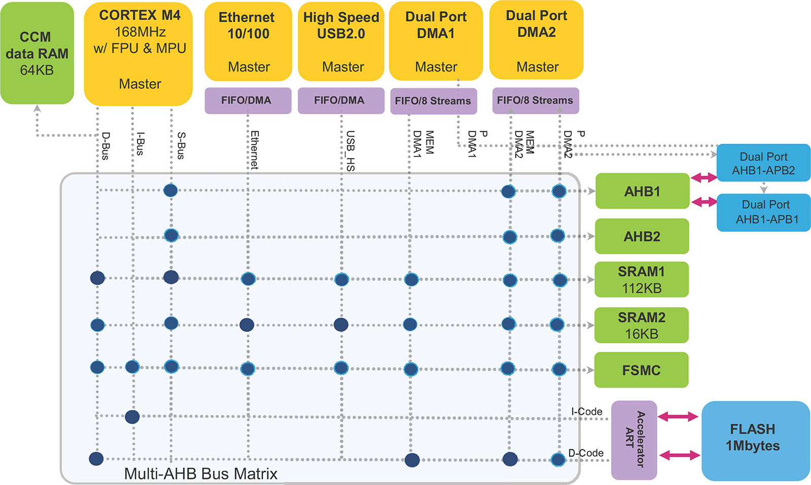</p>

<p align="center">图 9.6：STM32F405 微控制器中的多层总线矩阵</p>

#### 9.1.2.3 G0/G4/L4+/L5/H7 微控制器中的 DMA 实现

STM32G0/G4/L4+/L5/H7 微控制器中的 DMA 控制器架构与 STM32F0/F1/F3/L0/L1/L4 系列中的架构相似，但通过 DMA 请求复用器（DMAMUX）单元进行了增强。DMAMUX 可以把来自给定外设的任何 DMA 请求（DMA 模式下）完全可配置地路由到两个 DMA 控制器中的任意 DMA 通道。这意味着绑定到给定通道的外设请求不是由设计定义的，从而为程序员和硬件开发者在设计阶段提供了最大的灵活性。DMAMUX 不会在外设发送的 DMA 请求和配置的 DMA 通道接收的 DMA 请求之间增加任何时钟周期。它使用专用输入来同步 DMA 请求。DMAMUX 还能够从自身的触发输入或由软件生成请求。

<!-- page: 248 -->

<p align="center">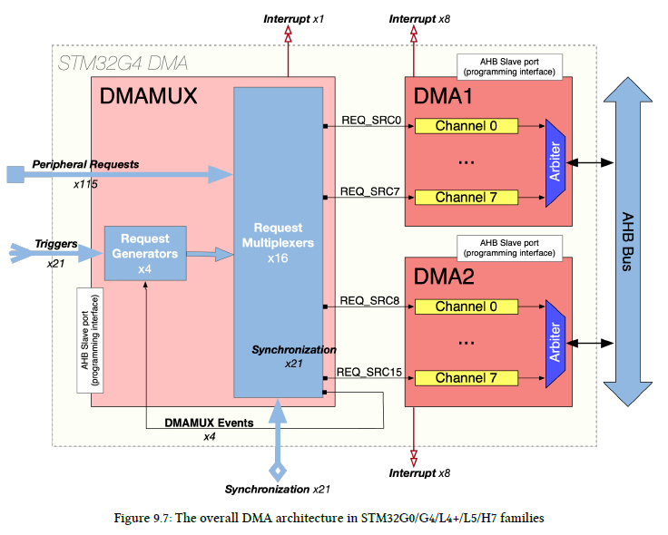</p>

<p align="center">图 9.7：STM32G0/G4/L4+/L5/H7 系列中的整体 DMA 架构</p>

图 9.7 展示了整体 DMA 架构。这是一个简化的图表，我们将在后面更详细地说明。在图表的右侧，你可以看到两个 DMA（DMA1, DMA2）。这两个 DMA 单元¹²的架构与图 9.3 中所示的架构相同，因此我们不会在这里详细阐述。与 F0/F1/F3/L0/L1/L4 系列的主要区别在于，这里的 DMA 请求源不是直接连接到各个外设，而是来自 DMAMUX 模块。顾名思义，DMAMUX 是一个作为复用器运行的模块。DMAMUX 的输出是请求线，这些请求线将触发源地址和目标地址之间的数据传输。DMAMUX 的输入由实际的外设请求线和一组不来自外设的请求组成，外加一组用于同步数据传输的线，我们将在后面看到。

¹²该图仅展示了 STM32G4 的 DMA 架构。然而，各系列之间的差异仅与外设请求、触发器和同步线的数量有关。

<!-- page: 249 -->

<p align="center">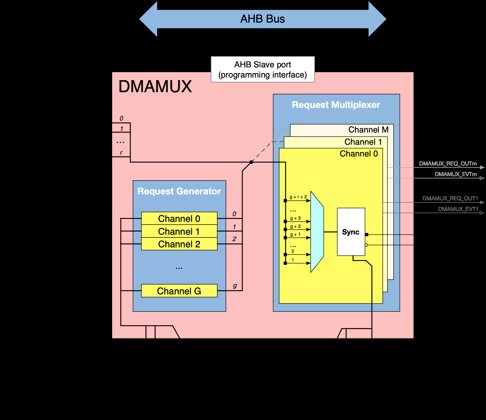</p>

<p align="center">图 9.8：DMAMUX 模块架构</p>

DMAMUX 架构稍微复杂一些，并在图 9.8 中更详细地展示。如你所见，请求复用器模块为两个 DMA 中的每个通道都有专用的子单元。根据具体系列，每个 DMA 单元提供 7 或 8 个通道。这意味着请求复用器集成了 14 或 16 个专用于各个通道的单元。每个通道单元都有一组请求线。这些请求线既来自外设，也来自我们将稍后详细说明的请求生成器模块。每个通道可以绑定到任何外设请求线，唯一的限制是一个请求线只能绑定到一个通道。

请求生成器单元可以被视为外设和 DMA 控制器之间的中介。它允许没有 DMA 功能的外设（如 RTC 闹钟或比较器）在事件发生时生成可编程数量的 DMA 请求。触发信号（主要来自 `EXTI_LINES` 和 LPTIM 定时器）、触发极性以及请求的数量

<!-- page: 250 -->

定义生成器通道的行为。在接收到触发事件后，相应的生成器通道开始在其输出端生成直接存储器访问（DMA）请求。每当由连接的 DMA 控制器处理 DMAMUX 生成的请求时，内置的 DMA 请求计数器（每个请求生成器通道一个计数器）就会递减。当计数器下溢时，请求生成器通道停止生成 DMA 请求，并且在下一次触发事件时，DMA 请求计数器会自动重新加载为其编程值。

为了执行外设到存储器或存储器到外设的传输，DMA 控制器通道每次都需要一条外设 DMA 请求线。每当发生请求时，DMA 通道就会从/向外设传输数据。这种模式称为无条件请求转发。除了无条件请求转发外，每个通道子模块中的同步单元允许软件实现条件请求转发：仅当检测到定义的条件时，路由才实际执行。DMA 传输可以与内部或外部信号同步。例如，用户软件可以使用同步单元来启动或调整数据传输吞吐量。DMA 请求可以通过以下任一方式转发：

- 每次在 GPIO 引脚上检测到边沿时（EXTI）；
- 响应来自定时器的周期性事件；
- 响应来自外设的异步事件；
- 响应来自另一个请求路由器的请求（请求链）；

除了 DMA 请求条件化之外，同步单元还允许生成事件（图 9.8 中的 `DMAMUX_EVTm` 线），这些事件可被其他 DMAMUX 子块（例如请求生成器或另一个 DMAMUX 请求多路复用器通道）使用。

## 9.2 HAL_DMA 模块

说了这么多，现在是时候开始编写代码了。

严格来说，编程 DMA 相当简单，特别是如果从理论角度清楚 DMA 如何工作。此外，CubeHAL 旨在抽象大部分底层硬件细节。

所有与 DMA 操作相关的 HAL 函数都设计为接受 C 结构体 `DMA_HandleTypeDef` 的实例作为第一个参数。由于前几段中所示的不同 DMA 实现，该结构与 CubeF2/F4/F7 HAL 和其他 CubeHAL 略有不同。因此，我们将单独介绍它们。

### 9.2.1 F0/F1/F3/L0/L1/L4 HAL 中的 DMA_HandleTypeDef

结构体 `DMA_HandleTypeDef` 用于配置给定的 DMA 通道，并在 CubeF0/F1/F3/L1 HAL 中定义如下¹³：

¹³请注意，这里并未列出所有结构体字段，仅列出了程序员需要填写的那些字段。

<!-- page: 251 -->

```c
typedef struct {
  DMA_Channel_TypeDef *Instance;   /* Register base address */
  DMA_InitTypeDef Init;            /* DMA communication parameters */
  HAL_LockTypeDef Lock;            /* DMA locking object */
  __IO HAL_DMA_StateTypeDef State; /* DMA transfer state */
  void *Parent;                    /* Parent object state */
  void (* XferCpltCallback)( struct __DMA_HandleTypeDef * hdma);
  void (* XferHalfCpltCallback)( struct __DMA_HandleTypeDef * hdma);
  void (* XferErrorCallback)( struct __DMA_HandleTypeDef * hdma);
  __IO uint32_t ErrorCode;         /* DMA Error code */
} DMA_HandleTypeDef;
```

让我们更深入地看看这个结构体中最重要的字段。

- `Instance`：是指向我们要使用的 DMA/通道对描述符的指针。例如，`DMA1_Channel5` 表示 DMA1 的第五个通道。请记住，在这些 STM32 系列中，通道在 MCU 设计期间就绑定到外设，因此请查阅您的 MCU 数据手册，以查看绑定到您想在 DMA 模式下使用的外设的通道。
- `Init`：是 C 结构体 `DMA_InitTypeDef` 的一个实例，用于配置 DMA/通道对。我们稍后会更深入地分析它。
- `Parent`：此指针由 HAL 使用，以跟踪与当前 DMA/通道关联的外设句柄。例如，如果我们正在 DMA 模式下使用 UART，此字段将指向 `UART_HandleTypeDef` 的一个实例。我们很快就会看到外设句柄是如何“链接”到此字段的。
- `XferCpltCallback`、`XferHalfCpltCallback`、`XferErrorCallback`、`XferAbortCallback`：这些是指向函数的指针，用作回调，以向用户代码发出信号，表明 DMA 传输已完成、半完成、发生错误或传输被中止。当 DMA 中断触发时，它们由函数 `HAL_DMA_IRQHandler()` 自动调用，正如我们接下来将看到的。

所有 DMA/通道配置活动都通过使用 C 结构体 `DMA_InitTypeDef` 的实例来执行，其定义如下：

```c
typedef struct {
  uint32_t Direction;
  uint32_t PeriphInc;
  uint32_t MemInc;
  uint32_t PeriphDataAlignment;
  uint32_t MemDataAlignment;
  uint32_t Mode;
  uint32_t Priority;
} DMA_InitTypeDef;
```

<!-- page: 252 -->

- `Direction`：它定义 DMA 传输方向，可以取表 9.4 中报告的任一值。
- `PeriphInc`：如前几段所述，DMA 控制器有一个外设端口，用于指定参与存储器传输的外设寄存器地址（例如，对于 UART 接口，其数据寄存器（DR）的地址）。由于 DMA 存储器传输通常涉及多个字节，因此可以编程 DMA 在每次传输字节时自动递增外设寄存器。当执行存储器到存储器传输以及外设可按字节、半字和字寻址时（如外部 SRAM 存储器），这一点同样适用。在这种情况下，该字段取值为 `DMA_PINC_ENABLE`，否则为 `DMA_PINC_DISABLE`。
- `MemInc`：此字段具有与 `PeriphInc` 字段相同的含义，但它涉及存储器端口。它可以取值为 `DMA_MINC_ENABLE`，以指示在每次传输字节后必须递增指定的存储器地址，或者取值为 `DMA_MINC_DISABLE`，以在每次传输后保持其不变。
- `PeriphDataAlignment`：外设和存储器的传输数据大小完全可以通过此字段和下一个字段进行编程。它可以取表 9.5 中的一个值。DMA 控制器被设计为在源和目的数据大小不同时自动执行数据对齐（打包/解包）。有关更多信息，请参阅您的 MCU 参考手册。
- `MemDataAlignment`：它指定存储器传输数据大小，可以取表 9.6 中的一个值。
- `Mode`：STM32 MCU 中的 DMA 控制器有两种工作模式：`DMA_NORMAL` 和 `DMA_CIRCULAR`。在正常模式下，DMA 将指定数量的数据从源端口发送到目的端口并停止活动。必须重新使能才能进行另一次传输。在循环模式下，在传输结束时，它自动重置传输计数器，并从源缓冲区的第一个字节开始再次传输（即，它将源缓冲区视为环形缓冲区）。这种模式也称为连续模式，并且是某些外设（例如高速 SPI 设备）实现高传输速度的唯一方式。
- `Priority`：DMA 控制器的一个重要功能是能够为每个通道分配优先级，以管理并发请求。此字段可以取表 9.7 中的一个值。当连接到具有相同优先级通道的外设同时发出请求时，编号较低的通道先触发。

表 9.4：可用的 DMA 传输方向

| DMA 传输方向 | 描述 |
| :--- | :--- |
| `DMA_PERIPH_TO_MEMORY` | 外设到存储器方向 |
| `DMA_MEMORY_TO_PERIPH` | 存储器到外设方向 |
| `DMA_MEMORY_TO_MEMORY` | 存储器到存储器方向 |

<!-- page: 253 -->

表 9.5：DMA 外设数据大小

| 外设数据大小 | 描述 |
| :--- | :--- |
| `DMA_PDATAALIGN_BYTE` | 外设数据对齐：字节 |
| `DMA_PDATAALIGN_HALFWORD` | 外设数据对齐：半字 |
| `DMA_PDATAALIGN_WORD` | 外设数据对齐：字 |

表 9.6：DMA 存储器数据大小

| 外设数据大小 | 描述 |
| :--- | :--- |
| `DMA_MDATAALIGN_BYTE` | 存储器数据对齐：字节 |
| `DMA_MDATAALIGN_HALFWORD` | 存储器数据对齐：半字 |
| `DMA_MDATAALIGN_WORD` | 存储器数据对齐：字 |

表 9.7：可用的 DMA 通道优先级

| DMA 通道优先级 | 描述 |
| :--- | :--- |
| `DMA_PRIORITY_LOW` | 优先级：低 |
| `DMA_PRIORITY_MEDIUM` | 优先级：中 |
| `DMA_PRIORITY_HIGH` | 优先级：高 |
| `DMA_PRIORITY_VERY_HIGH` | 优先级：非常高 |

为了根据 `DMA_HandleTypeDef` 和 `DMA_InitTypeDef` 结构体中指定的参数初始化 DMA，使用以下 HAL 函数：

```c
HAL_StatusTypeDef HAL_DMA_Init(DMA_HandleTypeDef *hdma);
```

### 9.2.2 G0/G4/L4+/L5/H7 HAL 中的 DMA 配置

到目前为止，我们已经看到，在 STM32G0/G4/L4+/L5/H7 微控制器中，DMA 是 F0/F1/F3/L0/L1/L4 系列中 DMA 的演进：DMAMUX 使得可以将外设请求源与每个 DMA 通道混合。因此，STM32G0/G4/L4+/L5/H7 微控制器的 `HAL_DMA` API 与之前看到的几乎相同，除了 DMAMUX 配置部分。

因此，从程序员的角度来看，`DMA_HandleTypeDef` 结构体并没有增加需要特别关注的字段。如果您查看其在 STM32G0/G4/L4+/L5/H7 HAL 中的定义，您会注意到额外的字段——然而，这些字段是由 `HAL_DMA_Init()` 例程自动填充的。这大大简化了不同 STM32 系列之间代码的移植。相反，DMAMUX 的配置需要使用专门的结构体和函数来完成。

要将 DMA 通道绑定到来自请求生成器模块的信号，我们必须执行两个不同的配置。首先，我们必须使用之前看到的 `DMA_HandleTypeDef` 结构体的实例来配置 DMA 通道。其次，我们必须使用以下结构体来配置请求生成器模块：

<!-- page: 254 -->

```c
typedef struct {
  uint32_t SignalID;      /*!< Specifies the ID of the signal used for DMAMUX request generator */
  uint32_t Polarity;      /*!< Specifies the polarity of the signal on which the request is generated */
  uint32_t RequestNumber; /*!< Specifies the number of DMA request that will be generated after a signal event */
} HAL_DMA_MuxRequestGeneratorConfigTypeDef;
```

- `SignalID`：指定用作请求生成器模块输入的信号 ID。它可以取表 9.8 中的值。
- `Polarity`：指定输入信号的极性，它可以取表 9.9 中的值
- `RequestNumber`：指定在发生信号事件后触发的请求数量。它可以取 1 到 32 的值。

表 9.8：请求生成器信号 ID

| 请求生成器信号 ID | 描述 |
| :--- | :--- |
| `HAL_DMAMUX1_REQ_GEN_EXTI0` | 请求生成器信号为 EXTI0 IT |
| … | … |
| `HAL_DMAMUX1_REQ_GEN_EXTI15` | 请求生成器信号为 EXTI15 IT |
| `HAL_DMAMUX1_REQ_GEN_DMAMUX1_CH0_EVT` | 请求生成器信号为 DMAMUX1 通道 0 事件 |
| … | … |
| `HAL_DMAMUX1_REQ_GEN_DMAMUX1_CH3_EVT` | 请求生成器信号为 DMAMUX1 通道 3 事件 |
| `HAL_DMAMUX1_REQ_GEN_LPTIM1_OUT` | 请求生成器信号为 LPTIM1 OUT |

表 9.9：请求生成器信号极性

| 请求生成器信号极性 | 描述 |
| :--- | :--- |
| `HAL_DMAMUX_REQ_GEN_NO_EVENT` | 停止请求生成器事件 |
| `HAL_DMAMUX_REQ_GEN_RISING` | 在上升沿事件时生成请求 |
| `HAL_DMAMUX_REQ_GEN_FALLING` | 在下降沿事件时生成请求 |
| `HAL_DMAMUX_REQ_GEN_RISING_FALLING` | 在上升沿和下降沿事件时生成请求 |

要使用上述设置配置请求生成器模块，我们需要使用函数：

```c
HAL_DMAEx_ConfigMuxRequestGenerator(DMA_HandleTypeDef *hdma,
  HAL_DMA_MuxRequestGeneratorConfigTypeDef *pRequestGeneratorConfig);
```

该函数接受指向对应于要绑定到请求生成器信号的 DMA 通道的 `DMA_HandleTypeDef` 实例的指针，以及指向 `HAL_DMA_MuxRequestGeneratorConfigTypeDef` 结构体实例的指针。

<!-- page: 255 -->

DMAMUX 允许通过将给定通道与同步信号关联来同步该通道。这是通过使用 `HAL_DMA_MuxSyncConfigTypeDef` 结构体完成的，其定义如下：

```c
typedef struct {
  uint32_t SyncSignalID;       /* Specifies the synchronization signal gating the DMA request in periodic mode. */
  uint32_t SyncPolarity;       /* Specifies the polarity of the signal on which the DMA request is synchronized. */
  FunctionalState SyncEnable;  /* Specifies if the synchronization shall be enabled or disabled. */
  FunctionalState EventEnable; /* Specifies if an event shall be generated once the RequestNumber is reached.*/
  uint32_t RequestNumber;      /* Specifies the number of DMA request that will be authorized after a sync event. */
} HAL_DMA_MuxSyncConfigTypeDef;
```

- `SyncSignalID`：指定用于启动 DMA 事务的同步信号，它可以取表 9.10 中的一个值。
- `SyncPolarity`：指定 DMA 请求所同步的信号的极性，它可以取表 9.11 中的一个值。
- `SyncEnable` 和 `EventEnable`：指定是否启用或禁用同步，它可以取 `ENABLE` 或 `DISABLE` 的值。
- `RequestNumber`：指定在同步事件后授权的 DMA 请求数量。

表 9.10：请求生成器信号 ID

| DMAMUX 同步信号 ID | 描述 |
| :--- | :--- |
| `HAL_DMAMUX1_SYNC_EXTI0` | 同步信号为 EXTI0 IT |
| … | … |
| `HAL_DMAMUX1_SYNC_EXTI15` | 同步信号为 EXTI15 IT |
| `HAL_DMAMUX1_SYNC_DMAMUX1_CH0_EVT` | 同步信号为 DMAMUX1 通道 0 事件 |
| … | … |
| `HAL_DMAMUX1_SYNC_DMAMUX1_CH3_EVT` | 同步信号为 DMAMUX1 通道 3 事件 |
| `HAL_DMAMUX1_SYNC_LPTIM1_OUT` | 同步信号为 LPTIM1 OUT |

表 9.11：DMAMUX 同步信号极性

| 请求生成器信号极性 | 描述 |
| :--- | :--- |
| `HAL_DMAMUX_SYNC_NO_EVENT` | 停止同步事件 |
| `HAL_DMAMUX_SYNC_RISING` | 与上升沿事件同步 |
| `HAL_DMAMUX_SYNC_FALLING` | 与下降沿事件同步 |
| `HAL_DMAMUX_SYNC_RISING_FALLING` | 与上升沿和下降沿事件同步 |

<!-- page: 256 -->

要配置通道同步，使用以下 HAL 函数：

```c
HAL_DMAEx_ConfigMuxSync(DMA_HandleTypeDef *hdma, HAL_DMA_MuxSyncConfigTypeDef *pSyncConfig);
```

该函数接受指向对应于要与外部源同步绑定的 DMA 通道的 `DMA_HandleTypeDef` 实例的指针，以及指向 `HAL_DMA_MuxSyncConfigTypeDef` 结构体的实例。

### 9.2.3 F2/F4/F7 HAL 中的 DMA_HandleTypeDef

到目前为止，我们已经看到，在 STM32F2/F4/F7 微控制器中，直接存储器访问（DMA）采用了略有不同的术语和组织方式。CubeHAL 也相应地反映了这些差异。结构体 `DMA_HandleTypeDef` 的定义方式如下：

```c
typedef struct {
  DMA_Stream_TypeDef *Instance;    /* Register base address */
  DMA_InitTypeDef Init;            /* DMA communication parameters */
  HAL_LockTypeDef Lock;            /* DMA locking object */
  __IO HAL_DMA_StateTypeDef State; /* DMA transfer state */
  void *Parent;                    /* Parent object state */
  void (* XferCpltCallback)( struct __DMA_HandleTypeDef * hdma);
  void (* XferHalfCpltCallback)( struct __DMA_HandleTypeDef * hdma);
  void (* XferM1CpltCallback)( struct __DMA_HandleTypeDef * hdma);
  void (* XferErrorCallback)( struct __DMA_HandleTypeDef * hdma);
  __IO uint32_t ErrorCode;         /* DMA Error code */
  uint32_t StreamBaseAddress;      /* DMA Stream Base Address */
  uint32_t StreamIndex;            /*!< DMA Stream Index */
} DMA_HandleTypeDef;
```

让我们更深入地查看该结构体中最重要的字段。

- `Instance`：这是指向我们要使用的流描述符的指针。例如，`DMA1_Stream6` 表示 DMA1 的第七个¹⁴流。请记住，流必须绑定到通道后才能使用。这通过 `Init` 字段实现，我们稍后会看到。还要记住，通道是在微控制器设计期间绑定到外设的，因此请查阅您的微控制器数据手册，以查看绑定到您想在 DMA 模式下使用的外设的通道。
- `Init`：这是 C 结构体 `DMA_InitTypeDef` 的一个实例，用于配置 DMA/通道/流三元组。我们稍后会深入研究它。
- `Parent`：该指针被硬件抽象层（HAL）用于跟踪与当前 DMA/通道关联的外设句柄。例如，如果我们正在以 DMA 模式使用 UART，则该字段将指向 `UART_HandleTypeDef` 的一个实例。我们很快就会看到外设句柄是如何“链接”到此字段的。

¹⁴流计数从零开始。

<!-- page: 257 -->

- `XferCpltCallback`、`XferHalfCpltCallback`、`XferM1CpltCallback`、`XferErrorCallback`：这些是指向函数的指针，用作回调，以向用户代码发出信号，表明 DMA 传输已完成、半完成、多缓冲传输中第一个缓冲区的传输已完成或发生了错误。当 DMA 中断触发时，它们由函数 `HAL_DMA_IRQHandler()` 自动调用，我们接下来会看到。

所有 DMA/通道配置活动都是通过使用 C 结构体 `DMA_InitTypeDef` 的一个实例来执行的，其定义方式如下：

```c
typedef struct {
  uint32_t Channel;
  uint32_t Direction;
  uint32_t PeriphInc;
  uint32_t MemInc;
  uint32_t PeriphDataAlignment;
  uint32_t MemDataAlignment;
  uint32_t Mode;
  uint32_t Priority;
  uint32_t FIFOMode;
  uint32_t FIFOThreshold;
  uint32_t MemBurst;
  uint32_t PeriphBurst;
} DMA_InitTypeDef;
```

- `Channel`：它指定用于给定流的 DMA 通道。它可以取 `DMA_CHANNEL_0`、`DMA_CHANNEL_1` 直到 `DMA_CHANNEL_7` 的值。请记住，外设是在微控制器设计期间绑定到流和通道的，因此请查阅您的微控制器数据手册，以查看绑定到您想在 DMA 模式下使用的外设的流。
- `Direction`：它定义 DMA 传输方向，可以取表 9.4 中报告的值之一。
- `PeriphInc`：如前几段所述，DMA 控制器有一个外设端口，用于指定参与存储器传输的外设寄存器地址（例如，对于 UART 接口，其数据寄存器（DR）的地址）。由于 DMA 存储器传输通常涉及多个字节，因此可以编程使 DMA 在传输每个字节时自动递增外设寄存器。当执行存储器到存储器传输时，或者当外设是按字节、半字和字寻址的（如外部 SRAM 存储器）时，这都是正确的。在这种情况下，该字段取值为 `DMA_PINC_ENABLE`，否则为 `DMA_PINC_DISABLE`。
- `MemInc`：该字段具有与 `PeriphInc` 字段相同的含义，但它涉及存储器端口。它可以取值为 `DMA_MINC_ENABLE`，以指示在传输每个字节后必须递增指定的存储器地址，或者取值为 `DMA_MINC_DISABLE`，以在每次传输后保持其不变。

<!-- page: 258 -->

- `PeriphDataAlignment`：外设和存储器的传输数据大小完全可以通过该字段和下一个字段进行编程。它可以取表 9.5 中的一个值。DMA 控制器被设计为在源和目的数据大小不同时自动执行数据对齐（打包/解包）。此主题超出了本书的范围。请参阅您的微控制器参考手册。
- `MemDataAlignment`：它指定存储器传输数据大小，可以取表 9.6 中的一个值。
- `Mode`：STM32 微控制器中的 DMA 控制器有两种工作模式：`DMA_NORMAL` 和 `DMA_CIRCULAR`。在正常模式下，DMA 将指定数量的数据从源端口发送到目的端口，然后停止活动。必须重新使能才能进行另一次传输。在循环模式下，在传输结束时，它自动重置传输计数器，并从源缓冲区的第一个字节开始再次传输（即，它将源缓冲区视为环形缓冲区）。这种模式也称为连续模式，并且是在某些外设（例如快速 SPI 设备）中实现高传输速度的唯一方式。
- `Priority`：DMA 控制器的一个重要功能是能够为每个流分配优先级，以管理并发请求。该字段可以取表 9.7 中的一个值。如果来自连接到相同优先级流的外设的请求同时发生，则编号较低的流先触发。
- `FIFOMode`：它使用 `DMA_FIFOMODE_ENABLE`/`DMA_FIFOMODE_DISABLE` 宏来启用/禁用 DMA FIFO 模式。在 STM32F2/F4/F7 微控制器中，每个流都有一个独立的 4 字（4 * 32 位）FIFO。FIFO 用于在传输到目的端之前临时存储来自源端的数据。当禁用 FIFO 时，使用直接模式（这是其他 STM32 微控制器中可用的“正常”模式）。FIFO 模式引入了几个优势：它减少了 SRAM 访问，从而为其他主设备访问总线矩阵提供更多时间，而无需额外的并发；它允许软件执行突发事务，以优化传输带宽（稍后会有更多介绍）；它允许打包/解包数据，以适应源和目的数据宽度，而无需额外的 DMA 访问。如果启用了 DMA FIFO，则可以使用数据打包/解包和/或突发模式。FIFO 根据阈值级别自动清空。该级别可在软件中配置为 1/4、1/2、3/4 或满。
- `FIFOThreshold`：它指定 FIFO 阈值级别，可以取表 9.12 中的一个值。
- `MemBurst`：在 DMA 流通过 AHB 总线传输一个字节序列之前，其访问由轮转调度策略管理。这会“减慢”传输操作，对于某些高速外设，这可能是一个瓶颈。突发传输允许 DMA 流重复传输数据，而无需经过传输每个数据片段所需的单独事务中的所有步骤。突发模式与 FIFO 协同工作，并且不涉及传输的字节数量。这基于 `MemDataAlignment` 字段的设置（当我们进行存储器到外设传输时）。`MemBurst` 指示流执行的传输节拍（beat）数量，每个节拍由字节、半字或字组成，具体取决于源端的配置。`MemBurst` 字段可以取表 9.13 中的一个值。

<!-- page: 259 -->

- `PeriphBurst`：该字段具有与前一个字段相同的含义，但它与外设到存储器传输相关。它可以取表 9.14 中的一个值。

表 9.12：可用的 FIFO 阈值级别

| DMA 通道优先级 | 描述 |
| :--- | :--- |
| `DMA_FIFO_THRESHOLD_1QUARTERFULL` | FIFO 阈值 1/4 满配置 |
| `DMA_FIFO_THRESHOLD_HALFFULL` | FIFO 阈值 1/2 满配置 |
| `DMA_FIFO_THRESHOLD_3QUARTERSFULL` | FIFO 阈值 3/4 满配置 |
| `DMA_FIFO_THRESHOLD_FULL` | FIFO 阈值满配置 |

表 9.13：可用的 DMA 存储器突发模式

| DMA 通道优先级 | 描述 |
| :--- | :--- |
| `DMA_MBURST_SINGLE` | 单次突发 |
| `DMA_MBURST_INC4` | 4 个传输节拍的突发 |
| `DMA_MBURST_INC8` | 8 个传输节拍的突发 |
| `DMA_MBURST_INC16` | 16 个传输节拍的突发 |

表 9.14：可用的 DMA 外设突发模式

| DMA 通道优先级 | 描述 |
| :--- | :--- |
| `DMA_PBURST_SINGLE` | 单次突发 |
| `DMA_PBURST_INC4` | 4 个传输节拍的突发 |
| `DMA_PBURST_INC8` | 8 个传输节拍的突发 |
| `DMA_PBURST_INC16` | 16 个传输节拍的突发 |

### 9.2.4 如何在轮询模式下执行 DMA 传输

一旦我们配置好了 DMA 通道/流，还需要做以下几件事：

- 设置存储器和外设端口的地址；
- 指定我们要传输的数据量；
- 使能 DMA；
- 在相应的外设上启用 DMA 模式。

HAL 通过使用以下函数抽象了前三点：

```c
HAL_StatusTypeDef HAL_DMA_Start(DMA_HandleTypeDef *hdma, uint32_t SrcAddress, uint32_t DstAddress, uint32_t DataLength);
```

而第四点取决于具体的外设，我们需要查阅特定 MCU 的数据手册。不过，正如我们稍后所见，HAL 也抽象了这一点（例如，在配置 UART 为 DMA 模式时，使用相应的 `HAL_UART_Transmit_DMA()` 函数）。

<!-- page: 260 -->

现在，我们应该已经具备了查看一个完全可用的应用程序所需的所有要素。在下一个示例中，我们将仅使用 DMA 模式通过 UART2 外设发送一个字符串。涉及的步骤如下：

- 使用 `HAL_UART` 模块配置 UART2，正如我们在上一章中所见。
- 配置 DMA1 通道（对于基于 STM32F4 的 Nucleo 开发板，则是 DMA1 通道/流组合）以执行存储器到外设的传输（参见表 9.15）
- 使能相应的通道以执行传输，并在 DMA 模式下启用 UART。

<p align="center">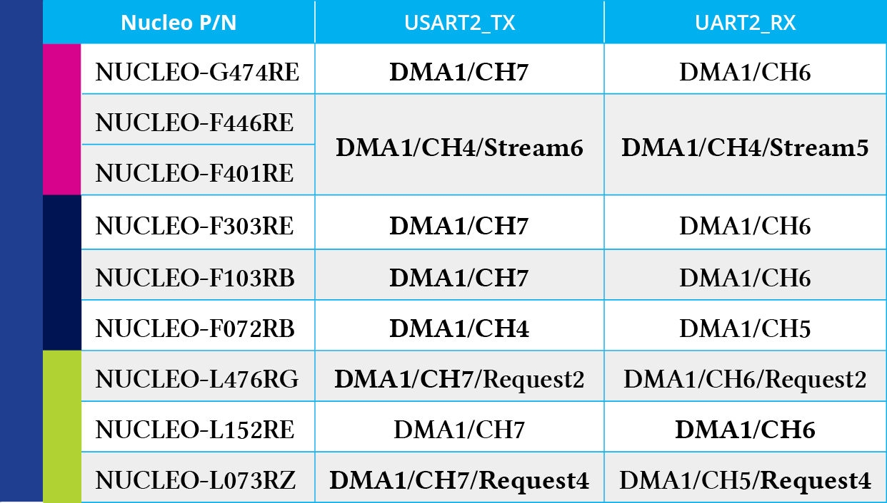</p>

表 9.15：书中使用的配备 Nucleo 开发板的 MCU 中 `USART_TX`/`USART_RX` DMA 通道的映射方式

以下示例旨在 Nucleo-F072 上运行（其他 Nucleo 开发板请参考书籍示例），展示了如何轻松实现这一点。

**Filename:** `Core/Src/main-ex1.c`

```c
31  UART_HandleTypeDef huart2;
32  DMA_HandleTypeDef hdma_usart2_tx;
33  char msg[] = "Hello STM32 Lovers! This message is transferred in DMA Mode.\r\n";
34
35  int main(void) {
36    /* Reset of all peripherals, Initializes the Flash interface and the Systick. */
37    HAL_Init();
38
39    /* Configure the system clock */
40    SystemClock_Config();
41
42    /* Initialize all configured peripherals */
43    MX_GPIO_Init();
44    MX_USART2_UART_Init();
45    MX_DMA_Init();
46
47    /* USART2_TX Init */
48    /* USART2 DMA Init */
49    hdma_usart2_tx.Instance = DMA1_Channel4;
50    hdma_usart2_tx.Init.Direction = DMA_MEMORY_TO_PERIPH;
51    hdma_usart2_tx.Init.PeriphInc = DMA_PINC_DISABLE;
52    hdma_usart2_tx.Init.MemInc = DMA_MINC_ENABLE;
53    hdma_usart2_tx.Init.PeriphDataAlignment = DMA_PDATAALIGN_BYTE;
54    hdma_usart2_tx.Init.MemDataAlignment = DMA_MDATAALIGN_BYTE;
55    hdma_usart2_tx.Init.Mode = DMA_NORMAL;
56    hdma_usart2_tx.Init.Priority = DMA_PRIORITY_LOW;
57    HAL_DMA_Init(&hdma_usart2_tx);
58
59    HAL_DMA_Start(&hdma_usart2_tx, (uint32_t)msg, (uint32_t)&huart2.Instance->TDR, strlen(msg)
60    );
61    //Enable UART in DMA mode
62    huart2.Instance->CR3 |= USART_CR3_DMAT;
63    //Wait for transfer complete
64    HAL_DMA_PollForTransfer(&hdma_usart2_tx, HAL_DMA_FULL_TRANSFER, HAL_MAX_DELAY);
65    //Disable UART DMA mode
66    huart2.Instance->CR3 &= ~USART_CR3_DMAT;
67    //Turn LD2 ON
68    HAL_GPIO_WritePin(LD2_GPIO_Port, LD2_Pin, GPIO_PIN_SET);
69
70    /* Infinite loop */
71    while (1);
72  }
```

<!-- page: 261 -->

首先，我们配置 `DMA1_Channel4` 以执行存储器到外设的传输。由于 USART 外设的发送数据寄存器 (TDR) 仅有一个字节宽，我们配置 DMA 使得外设地址不会自动递增 (`DMA_PINC_DISABLE`)，而我们希望源存储器地址在每发送一个字节时自动递增 (`DMA_MINC_ENABLE`)。配置完成后，我们调用 `HAL_DMA_Init()`，该函数根据 hdma_usart2_tx.Init 结构体中提供的信息执行 DMA 接口配置。接下来，在第 59 行，我们调用 `HAL_DMA_Start()` 例程，该例程配置源存储器地址（即 msg 数组的地址）、目标外设地址（即 `USART2->TDR` 寄存器的地址）以及我们要传输的数据量。此时 DMA 已准备就绪，我们通过设置 USART2 外设的相应位来启动传输，如第 62 行所示。最后，请注意，函数 `MX_DMA_Init()`（在第 45 行调用）使用宏 `__HAL_RCC_DMA1_CLK_ENABLE()` 来使能 DMA1 控制器（请记住，几乎每个 STM32 内部模块都必须使用 `__HAL_RCC_<PERIPHERAL>_CLK_ENABLE()` 宏来使能）。

由于我们不知道完成传输过程需要多长时间，因此我们使用以下函数：

<!-- page: 262 -->

```c
HAL_StatusTypeDef HAL_DMA_PollForTransfer(DMA_HandleTypeDef *hdma, uint32_t CompleteLevel, uint32_t Timeout);
```

该函数会自动等待传输完全完成。在 ST 官方文档中，这种以 DMA 模式发送数据的方式被称为“轮询模式”（polling mode）。一旦传输完成，我们将禁用 UART2 的 DMA 模式并点亮 LD2 LED。

### 9.2.5 如何在中断模式下执行 DMA 传输

从性能角度来看，除非我们的代码不需要等待传输完成，否则以轮询模式进行 DMA 传输是没有意义的。如果我们的目标是提高整体性能，那么就没有理由使用 DMA 控制器，然后消耗大量 CPU 周期来等待传输完成。因此，最佳选择是启用 DMA，并让它在传输完成时通知我们。DMA 能够生成与通道活动相关的中断（例如，在 STM32F072 微控制器中，DMA1 为通道 1 有一个中断请求，为通道 2 和 3 有一个中断请求，为通道 4 到 7 有一个中断请求）。此外，有三个独立的使能位可用于在传输一半、传输完成和传输错误时启用中断请求。

按照以下步骤可以在中断模式下启用 DMA：

- 定义三个作为回调例程的函数，并把它们赋给 `DMA_HandleTypeDef` 句柄中的函数指针 `XferCpltCallback`、`XferHalfCpltCallback` 和 `XferErrorCallback`（只定义我们感兴趣的函数是可以的，但必须将对应的指针设置为 NULL，否则可能会发生奇怪的故障）；
- 编写与正在使用的通道相关联的中断请求的中断服务例程（ISR），并调用 `HAL_DMA_IRQHandler()`，传入 `DMA_HandleTypeDef` 句柄的引用；
- 在 NVIC 控制器中启用相应的中断请求；
- 使用函数 `HAL_DMA_Start_IT()`，该函数会自动为您执行所有必要的设置步骤，传入与 `HAL_DMA_Start()` 相同的参数。

<p align="center"></p>

关于 `XferCpltCallback`、`XferHalfCpltCallback` 和 `XferErrorCallback` 回调，有一点很重要需要指出：只有当我们不使用 CubeHAL 中介而直接使用 DMA 时，才需要设置它们。让我们澄清这个概念。

假设我们正在以 DMA 模式使用 UART2。如果我们自己管理 DMA，那么定义这些回调例程并在每次传输发生时管理必要的 UART 中断相关配置是可以的。然而，如果我们使用 `HAL_UART_Transmit_DMA()`/`HAL_UART_Receive_DMA()` 例程，那么 HAL 已经正确定义了这些回调，我们不需要更改它们。相反，例如，为了捕获 UART 的 DMA 完成事件，我们需要定义函数 `HAL_UART_RxCpltCallback()`。始终查阅您打算以 DMA 模式使用的外设的 HAL 文档。

以下示例展示了如何在中断模式下进行 DMA 存储器到外设的传输。

<!-- page: 263 -->

**Filename:** `Core/Src/main-ex2.c`

```c
50  hdma_usart2_tx.Instance = DMA1_Channel4;
51  hdma_usart2_tx.Init.Direction = DMA_MEMORY_TO_PERIPH;
52  hdma_usart2_tx.Init.PeriphInc = DMA_PINC_DISABLE;
53  hdma_usart2_tx.Init.MemInc = DMA_MINC_ENABLE;
54  hdma_usart2_tx.Init.PeriphDataAlignment = DMA_PDATAALIGN_BYTE;
55  hdma_usart2_tx.Init.MemDataAlignment = DMA_MDATAALIGN_BYTE;
56  hdma_usart2_tx.Init.Mode = DMA_NORMAL;
57  hdma_usart2_tx.Init.Priority = DMA_PRIORITY_LOW;
58  hdma_usart2_tx.XferCpltCallback = &DMATransferComplete;
59  HAL_DMA_Init(&hdma_usart2_tx);
60
61  /* DMA interrupt init */
62  HAL_NVIC_SetPriority(DMA1_Channel4_5_IRQn, 0, 0);
63  HAL_NVIC_EnableIRQ(DMA1_Channel4_5_IRQn);
64
65  HAL_DMA_Start_IT(&hdma_usart2_tx, (uint32_t)msg,
66    (uint32_t)&huart2.Instance->TDR, strlen(msg));
67
68  //Enable UART in DMA mode
69  huart2.Instance->CR3 |= USART_CR3_DMAT;
70
71  /* Infinite loop */
72  while (1);
73  }
74
75  void DMATransferComplete(DMA_HandleTypeDef *hdma) {
76    if(hdma->Instance == DMA1_Channel4) {
77      //Disable UART DMA mode
78      huart2.Instance->CR3 &= ~USART_CR3_DMAT;
79      //Turn LD2 ON
80      HAL_GPIO_WritePin(LD2_GPIO_Port, LD2_Pin, GPIO_PIN_SET);
81    }
82  }
```

### 9.2.6 使用 HAL_UART 模块进行 DMA 模式传输

在第 8 章中，我们遗漏了如何以 DMA 模式使用 UART。我们在前面的段落中已经看到了如何做到这一点。然而，我们必须操作一些 USART 寄存器来启用外设的 DMA 模式。

`HAL_UART` 模块旨在抽象所有底层硬件细节。使用它所需的步骤如下：

- 配置硬连线到您将要使用的 UART 的 DMA 通道/流，如本章所述；

<!-- page: 264 -->

- 使用 `__HAL_LINKDMA()` 将 `UART_HandleTypeDef` 关联到 `DMA_HandleTypeDef`；
- 使能所使用通道/流对应的 DMA 中断，并在其 ISR 中调用 `HAL_DMA_IRQHandler()` 例程；
- 使能 UART 相关中断，并在其 ISR 中调用 `HAL_UART_IRQHandler()` 例程（这一点非常重要，不要跳过这一步¹⁵）；
- 使用 `HAL_UART_Transmit_DMA()` 和 `HAL_UART_Receive_DMA()` 函数通过 UART 交换数据，并实现 `HAL_UART_RxCpltCallback()` 以便在传输完成时得到通知。

以下代码展示了如何在 STM32F072 微控制器¹⁶中，以 DMA 模式从 UART2 接收三个字节：

```c
uint8_t dataArrived = 0;
uint8_t data[3];

int main(void) {
  HAL_Init();
  Nucleo_BSP_Init(); //Configure the UART2
  //Configure the DMA1 Channel 5, which is wired to the UART2_RX request line
  hdma_usart2_rx.Instance = DMA1_Channel5;
  hdma_usart2_rx.Init.Direction = DMA_PERIPH_TO_MEMORY;
  hdma_usart2_rx.Init.PeriphInc = DMA_PINC_DISABLE;
  hdma_usart2_rx.Init.MemInc = DMA_MINC_ENABLE;
  hdma_usart2_rx.Init.PeriphDataAlignment = DMA_PDATAALIGN_BYTE;
  hdma_usart2_rx.Init.MemDataAlignment = DMA_MDATAALIGN_BYTE;
  hdma_usart2_rx.Init.Mode = DMA_NORMAL;
  hdma_usart2_rx.Init.Priority = DMA_PRIORITY_LOW;
  HAL_DMA_Init(&hdma_usart2_rx);
  //Link the DMA descriptor to the UART2 one
  __HAL_LINKDMA(&huart, hdmarx, hdma_usart2_rx);
  /* DMA interrupt init */
  HAL_NVIC_SetPriority(DMA1_Channel4_5_IRQn, 0, 0);
  HAL_NVIC_EnableIRQ(DMA1_Channel4_5_IRQn);
  /* Peripheral interrupt init */
  HAL_NVIC_SetPriority(USART2_IRQn, 0, 0);
  HAL_NVIC_EnableIRQ(USART2_IRQn);
  //Receive three bytes from UART2 in DMA mode
  HAL_UART_Receive_DMA(&huart2, &data, 3);
  while(!dataArrived); //Wait for the arrival of data from UART

  /* Infinite loop */
  while (1);
}

//This callback is automatically called by the HAL when the DMA transfer is completed
void HAL_UART_RxCpltCallback(UART_HandleTypeDef *huart) {
  dataArrived = 1;
}

void DMA1_Channel4_5_IRQHandler(void) {
  HAL_DMA_IRQHandler(&hdma_usart2_rx); //This will automatically call the HAL_UART_RxCpltCallback()
}
```

¹⁵启用与 UART 相关的中断并调用 `HAL_UART_IRQHandler()` 例程至关重要，因为 HAL 的设计使得即使 UART 由 DMA 模式驱动，也可能引发与 UART 相关的错误（如奇偶校验错误、溢出错误等）。通过捕获错误状态，HAL 会暂停 DMA 传输并调用相应的错误回调，以向应用层发出错误状态信号。

¹⁶为其他 STM32 微控制器安排 DMA 初始化代码留作读者的练习。

<!-- page: 265 -->

`HAL_UART_RxCpltCallback()` 究竟是在哪里被调用的？在前面的段落中，我们看到 `DMA_HandleTypeDef` 包含一个指向函数的指针（名为 `XferCpltCallback`），该函数在 DMA 传输完成时由 `HAL_DMA_IRQHandler()` 例程调用。然而，当我们使用针对特定外设的 HAL 模块（本例中为 `HAL_UART`）时，我们不需要提供自己的回调：它们由 HAL 内部定义，HAL 使用它们来执行其活动。HAL 允许我们定义相应的回调函数（对于 DMA 模式下的 `UART_RX` 传输，即 `HAL_UART_RxCpltCallback()`），这些函数将由 HAL 自动调用，如图 9.7 所示。此规则适用于所有 HAL 模块。

<p align="center">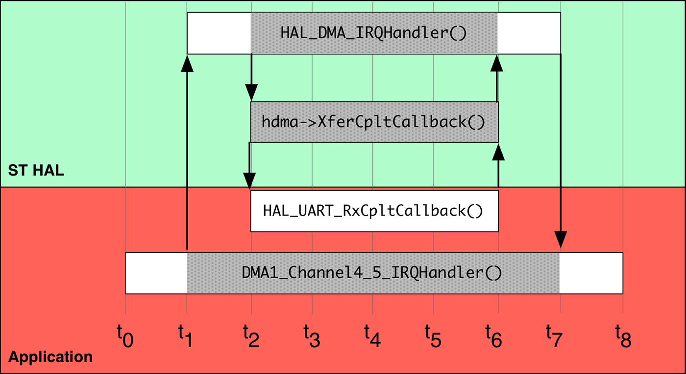</p>

<p align="center">图 9.7：由 `HAL_DMA_IRQHandler()` 生成的调用序列</p>

如您所见，一旦掌握了 DMA 控制器的工作原理，使用此传输模式来使用外设就变得很简单。

<!-- page: 266 -->

### 9.2.7 使用 CubeHAL 编程 DMAMUX

本书使用的九块 Nucleo 开发板中有一块配备了 STM32G4 微控制器，该微控制器提供了 DMAMUX 外设。这让我们有机会了解如何使用 CubeHAL 编程 DMAMUX，以及如何通过使用外部同步信号来同步请求传输。我们要在此分析的例子与之前的例子类似：USART2 以 DMA 模式用于传输一批字符。然而，这次传输是与 EXTI13 线同步的，该中断线连接到 PC13 GPIO，而在所有 Nucleo-64 开发板上，PC13 GPIO 都连接到了 USER 按钮。

**Filename:** `Core/Src/main-ex3.c`

```c
49  /* USART2_TX Init */
50  /* USART2 DMA Init */
51  hdma_usart2_tx.Instance = DMA1_Channel7;
52  hdma_usart2_tx.Init.Request = DMA_REQUEST_USART2_TX;
53  hdma_usart2_tx.Init.Direction = DMA_MEMORY_TO_PERIPH;
54  hdma_usart2_tx.Init.PeriphInc = DMA_PINC_DISABLE;
55  hdma_usart2_tx.Init.MemInc = DMA_MINC_ENABLE;
56  hdma_usart2_tx.Init.PeriphDataAlignment = DMA_PDATAALIGN_BYTE;
57  hdma_usart2_tx.Init.MemDataAlignment = DMA_MDATAALIGN_BYTE;
58  hdma_usart2_tx.Init.Mode = DMA_CIRCULAR;
59  hdma_usart2_tx.Init.Priority = DMA_PRIORITY_LOW;
60  HAL_DMA_Init(&hdma_usart2_tx);
61
62  pSyncConfig.SyncSignalID = HAL_DMAMUX1_SYNC_EXTI13;
63  pSyncConfig.SyncPolarity = HAL_DMAMUX_SYNC_FALLING;
64  pSyncConfig.SyncEnable = ENABLE;
65  pSyncConfig.EventEnable = ENABLE;
66  pSyncConfig.RequestNumber = strlen(msg);
67  HAL_DMAEx_ConfigMuxSync(&hdma_usart2_tx, &pSyncConfig);
68
69  __HAL_LINKDMA(&huart2,hdmatx,hdma_usart2_tx);
70
71  /* DMA interrupt init */
72  /* DMA1_Channel7_IRQn interrupt configuration */
73  HAL_NVIC_SetPriority(DMA1_Channel7_IRQn, 0, 0);
74  HAL_NVIC_EnableIRQ(DMA1_Channel7_IRQn);
75
76  HAL_UART_Transmit_DMA(&huart2, (uint8_t*)msg, strlen(msg));
77
78  /* Infinite loop */
79  while (1);
80  }
81
82  void HAL_UART_TxCpltCallback(UART_HandleTypeDef *huart) {
83    if(huart->Instance == USART2) {
84      //Turn LD2 ON
85      HAL_GPIO_TogglePin(LD2_GPIO_Port, LD2_Pin);
86    }
87  }
```

<!-- page: 267 -->

这段代码应该很容易理解。`USART2_TX` 请求源绑定到 `DMA1_Channel7`，但得益于 DMAMUX，它可以连接到任何 DMA 通道。这次 DMA 被配置为以循环模式工作（第 58 行），其原因稍后将会清楚。在第 62:67 行，该通道绑定到 EXTI13 同步信号：这意味着每当 PC13 引脚的电平从高电平变为低电平时，传输就会发生。最后，`EXTI15_10_IRQn` 和 `DMA1_Channel7_IRQn` 中断均被启用，并通过 `HAL_UART_Transmit_DMA()` 启动 DMA。

上述代码会导致每当按下 USER 按钮时，`UART2_TX` 请求信号就会被置为有效，因为 DMA 被配置为循环模式。相应的消息将打印在串行控制台上。请注意，DMA 的目标地址是一字节的 `USART2->TDR` 发送数据寄存器。为了允许 DMA 传输 msg 变量中包含的所有字符，pSyncConfig.RequestNumber 参数被设置为消息的长度。这将导致 DMA 自动触发 `strlen(msg)` 次。然而，这意味着字符串不能超过 32 个字符。

一旦所有字符的传输完成，`DMA1_Channel7` 中断将触发。这将导致第 86 行的 `HAL_UART_TxCpltCallback()` 被调用，从而翻转 LD2 LED 的状态。

### 9.2.8 HAL_DMA 和 HAL_DMA_Ex 模块中的其他函数

`HAL_DMA` 模块提供了其他有助于使用 DMA 控制器的函数。让我们简要了解一下它们。

```c
HAL_StatusTypeDef HAL_DMA_Abort(DMA_HandleTypeDef *hdma);
```

此函数用于禁用 DMA 流/通道。如果在数据传输正在进行时禁用流，当前数据仍会被传输，并且只有在该单个数据传输完成后，流才会被真正禁用。

一些 STM32 微控制器（MCU）可以执行多缓冲区 DMA 传输，这允许在传输过程中使用两个独立的缓冲区：当第一个缓冲区（名为 memory0）的末尾到达时，DMA 会自动“跳转”到第二个缓冲区（名为 memory1）。当 DMA 工作在循环模式时，这特别有用。函数：

```c
HAL_StatusTypeDef HAL_DMAEx_MultiBufferStart(DMA_HandleTypeDef *hdma, uint32_t SrcAddress, uint32_t DstAddress, uint32_t SecondMemAddress, uint32_t DataLength);
```

<!-- page: 268 -->

用于设置多缓冲区 DMA 传输。它仅在 F2/F4/F7 的 HAL 中可用。还有一个对应的 `HAL_DMAEx_MultiBufferStart_IT()` 函数，该函数还负责启用 DMA 中断。

函数：

```c
HAL_StatusTypeDef HAL_DMAEx_ChangeMemory(DMA_HandleTypeDef *hdma, uint32_t Address, HAL_DMA_MemoryTypeDef memory);
```

在多缓冲区 DMA 事务中动态更改 memory0 或 memory1 的地址。

## 9.3 使用 CubeMX 配置 DMA 请求

CubeMX 可以将设置通道/流请求所需的工作量降到最低。一旦您在引脚布局（Pinout）部分启用了某个外设，请进入系统视图（System view）部分并点击 DMA 按钮。DMA 模式和配置面板将出现，如图 9.8 所示。

<p align="center">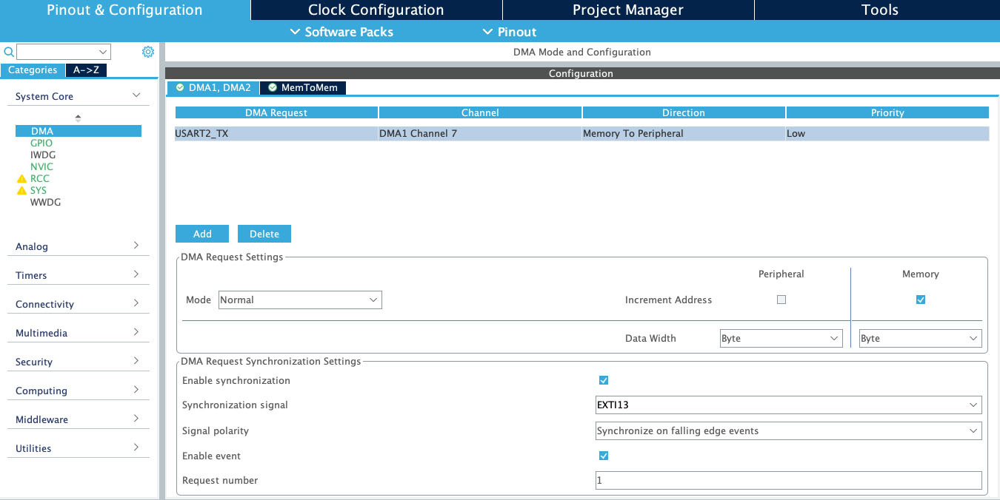</p>

<p align="center">图 9.8：CubeMX 中的 DMA 配置对话框</p>

该对话框包含两个选项卡。第一个选项卡与外设请求相关。例如，如果您想为 USART2 的发送模式（执行存储器到外设的传输）启用 DMA 请求，请点击“添加”（Add）按钮，并选择 `USART2_TX` 条目。CubeMX 会自动为您填充其余字段，并选择正确的通道。然后您可以为该请求分配优先级，并设置其他内容，如 DMA 模式、外设/存储器递增、与 DMAMUX 相关的设置等。同样，可以配置 DMA 通道/流以执行存储器到存储器的传输。

<!-- page: 269 -->

CubeMX 会在 `stm32XXxx_hal_msp.c` 文件中自动生成用于所使用请求/通道的正确初始化代码。

## 9.4 DMA 缓冲区的正确存储器分配

如果您查看本章中所有示例的源代码，您会发现 DMA 缓冲区（即用于执行存储器到外设和外设到存储器传输的源数组和目标数组）始终在全局作用域中分配。我们为什么要这样做？

这是所有初学者迟早都会犯的一个常见错误。当我们在局部作用域（即被调用例程的堆栈帧中）声明一个变量时，该变量将在该堆栈帧活动期间“存活”。当被调用的函数退出时，分配给该变量的堆栈区域会被重新分配用于其他用途（用于存储下一个被调用函数的参数或其他局部变量）。如果我们使用局部变量作为 DMA 传输的缓冲区（即向 DMA 存储器端口传递堆栈中存储器位置的地址），那么 DMA 很可能会访问包含其他数据的存储器区域，如果我们在执行外设到存储器传输，这将破坏该存储器区域，除非我们确定该函数的堆栈帧永远不会从堆栈中弹出（`main()` 函数内部声明的变量就属于这种情况）。

<p align="center">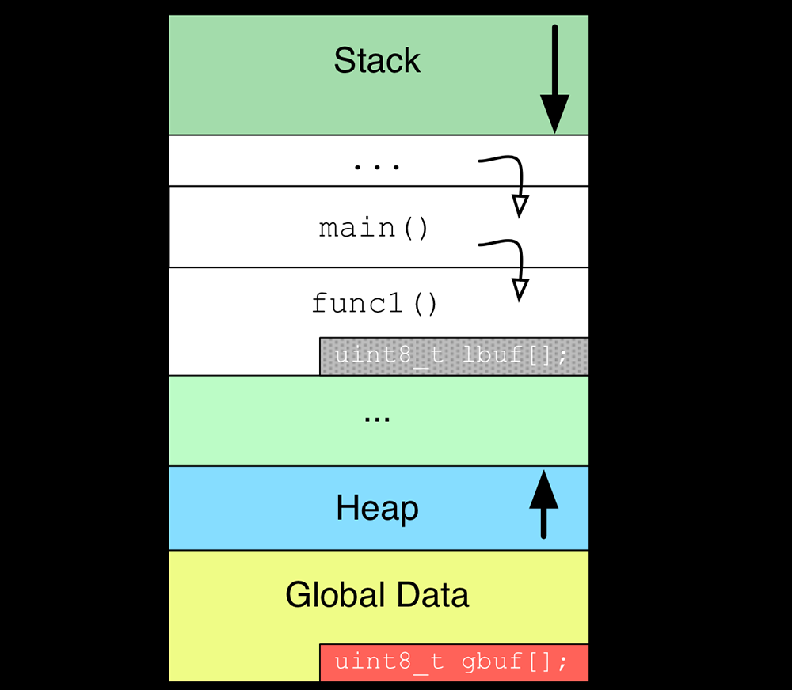</p>

<p align="center">图 9.9：局部分配变量与全局分配变量的区别</p>

图 9.9 清楚地展示了局部分配的变量（lbuf）和全局作用域分配的变量（gbuf）之间的区别。只要 `func1()` 在堆栈上，lbuf 就会保持活动状态。

如果您希望在应用程序中避免使用全局变量，另一个解决方案是将其声明为 static。正如我们将在第 20 章中发现的那样，static 变量会自动分配在 .data 区域（图 9.9 中的全局数据区域）中，即使它们的“可见性”仅限于局部作用域。

<!-- page: 270 -->

## 9.5 案例研究：DMA 存储器到存储器传输性能分析

DMA 控制器也可以用于执行存储器到存储器的传输¹⁷。例如，它可以用于将大型数据数组从闪存（flash memory）移动到 SRAM，或在 SRAM 中复制数组，或将存储器区域清零。C 库通常提供一组函数来完成此任务。`memcpy()` 和 `memset()` 是最常见的。在网上搜索，您可以找到许多对 `memcpy()`/`memset()` 例程和 DMA 传输进行性能比较的测试。这些测试中的大多数声称通常 DMA 比 Cortex-M 内核慢得多。这是真的吗？答案是：视情况而定。那么，既然您已经拥有这些例程，为什么还要使用 DMA 呢？

这些测试背后的故事要复杂得多，涉及多个因素，例如存储器对齐、所使用的 C 库以及正确的 DMA 设置。让我们考虑以下测试应用程序（该代码设计用于在 STM32F4 微控制器上运行），它分为几个阶段：

```c
12  DMA_HandleTypeDef hdma_memtomem_dma2_stream0;
13
14  const uint8_t flashData[] = {0xe7, 0x49, 0x9b, 0xdb, 0x30, 0x5a, ...};
15  uint8_t sramData[1000];
16
17  int main(void) {
18    HAL_Init();
19    Nucleo_BSP_Init();
20
21    hdma_memtomem_dma2_stream0.Instance = DMA2_Stream0;
22    hdma_memtomem_dma2_stream0.Init.Channel = DMA_CHANNEL_0;
23    hdma_memtomem_dma2_stream0.Init.Direction = DMA_MEMORY_TO_MEMORY;
24    hdma_memtomem_dma2_stream0.Init.PeriphInc = DMA_PINC_ENABLE;
25    hdma_memtomem_dma2_stream0.Init.MemInc = DMA_MINC_ENABLE;
26    hdma_memtomem_dma2_stream0.Init.PeriphDataAlignment = DMA_PDATAALIGN_BYTE;
27    hdma_memtomem_dma2_stream0.Init.MemDataAlignment = DMA_MDATAALIGN_BYTE;
28    hdma_memtomem_dma2_stream0.Init.Mode = DMA_NORMAL;
29    hdma_memtomem_dma2_stream0.Init.Priority = DMA_PRIORITY_LOW;
30    hdma_memtomem_dma2_stream0.Init.FIFOMode = DMA_FIFOMODE_ENABLE;
31    hdma_memtomem_dma2_stream0.Init.FIFOThreshold = DMA_FIFO_THRESHOLD_FULL;
32    hdma_memtomem_dma2_stream0.Init.MemBurst = DMA_MBURST_SINGLE;
33    hdma_memtomem_dma2_stream0.Init.PeriphBurst = DMA_MBURST_SINGLE;
34    HAL_DMA_Init(&hdma_memtomem_dma2_stream0);
35
36    GPIOC->ODR = 0x100;
37    HAL_DMA_Start(&hdma_memtomem_dma2_stream0, (uint32_t)&flashData, (uint32_t)sramData, 1000);
38    HAL_DMA_PollForTransfer(&hdma_memtomem_dma2_stream0, HAL_DMA_FULL_TRANSFER, HAL_MAX_DELAY);
39    GPIOC->ODR = 0x0;
40
41    while(HAL_GPIO_ReadPin(B1_GPIO_Port, B1_Pin));
42
43    hdma_memtomem_dma2_stream0.Init.PeriphDataAlignment = DMA_PDATAALIGN_WORD;
44    hdma_memtomem_dma2_stream0.Init.MemDataAlignment = DMA_MDATAALIGN_WORD;
45
46    HAL_DMA_Init(&hdma_memtomem_dma2_stream0);
47
48    GPIOC->ODR = 0x100;
49    HAL_DMA_Start(&hdma_memtomem_dma2_stream0, (uint32_t)&flashData, (uint32_t)sramData, 250);
50    HAL_DMA_PollForTransfer(&hdma_memtomem_dma2_stream0, HAL_DMA_FULL_TRANSFER, HAL_MAX_DELAY);
51    GPIOC->ODR = 0x0;
52
53    HAL_Delay(1000); /* This is a really primitive form of debouncing */
54
55    while(HAL_GPIO_ReadPin(B1_GPIO_Port, B1_Pin));
56
57    GPIOC->ODR = 0x100;
58    memcpy(sramData, flashData, 1000);
59    GPIOC->ODR = 0x0;
```

¹⁷请记住，在 STM32F2/F4/F7 微控制器中，只有 DMA2 可用于此类传输。

<!-- page: 271 -->

这里有两个相当大的数组。其中一个，flashData，由于 const 修饰符¹⁸而被分配在闪存（Flash）存储器中。我们希望将其内容复制到 sramData 数组中，顾名思义，该数组存储在 SRAM 中，并且我们想要测试使用 DMA 和 `memcpy()` 函数分别需要多长时间。

首先，我们开始测试 DMA。hdma_memtomem_dma2_stream0 句柄用于配置 DMA2 stream0/channel0 以执行存储器到存储器的传输。在第一阶段，我们将 DMA 流配置为执行字节对齐的存储器传输。一旦 DMA 配置完成，我们就启动传输。使用连接到 Nucleo PC8 引脚的示波器，我们可以测量传输所需的时间。按下 Nucleo USER 按钮（连接到 PC13）会触发另一个测试阶段。这次我们将 DMA 配置为执行字对齐的传输。最后，在第 58 行，我们测试使用 `memcpy()` 复制数组所需的时间。

¹⁸发生这种情况的原因将在第 20 章中解释。

<!-- page: 272 -->

<p align="center">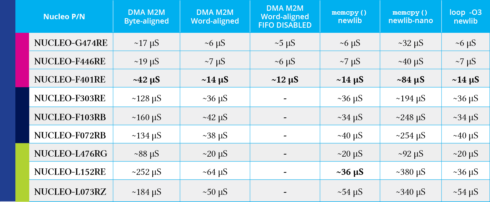</p>

表 9.16：M2M 传输测试结果

表 9.16 显示了在每个 Nucleo 开发板上获得的结果。让我们关注 Nucleo-F401RE 开发板。如您所见，DMA M2M 字节对齐传输耗时约 42μS，而 DMA M2M 字对齐传输耗时约 14 μS。这是一个巨大的加速，证明了使用正确的 DMA 配置可以为我们提供最佳的传输性能，因为我们在每次 DMA 传输中一次性移动 4 个字节。那么 `memcpy()` 呢？如您从表 9.16 中看到的，这取决于所使用的 C 库。我们使用的 GCC 工具链提供了两个 C 运行时库：一个名为 newlib，另一个名为 newlib-nano。前者是两者中最完整且速度优化最好的，而后者是缩减版本。newlib 库中的 `memcpy()` 旨在提供最快的复制速度，代价是代码大小。它自动检测字对齐传输，并在执行字对齐 M2M 传输时与 DMA 性能相当。因此，当执行字节对齐 M2M 传输时，它比 DMA 快得多，这就是为什么有人声称 `memcpy()` 总是比 DMA 快的原因。另一方面，Cortex-M 内核和 DMA 都需要使用相同的总线访问闪存和 SRAM 存储器。因此，没有理由认为微控制器内核应该比 DMA 快¹⁹。如您所见，当 DMA 流/通道禁用内部 FIFO 缓冲区时，实现了最快的传输速度（约 12 μS）。重要的是要指出，对于闪存存储器较小的 STM32 微控制器，newlib-nano 几乎是一个不可避免的选择，除非代码能够适应闪存空间。但同样，使用正确的 DMA 设置，我们可以达到 newlib 库中可用速度优化版本的相同性能。

我们需要分析的最后一件事是表 9.16 中的最后一列。它显示了使用像下面这样的简单循环进行存储器传输所需的时间：

¹⁹在这里，我明确排除了 Cortex-M 内核和 SRAM 之间的一些“特权路径”。这是 Core-Coupled Memory（CCM，内核耦合存储器）的作用，这是一种在某些 STM32 微控制器中可用的功能，我们将在第 20 章中更好地探索它。

<!-- page: 273 -->

```c
...
GPIOC->ODR = 0x100;
for(int i = 0; i < 1000; i++)
  sramData[i] = flashData[i];
GPIOC->ODR = 0x0;
...
```

如您所见，在最高优化级别（-O3）下，它花费的时间与 `memcpy()` 完全相同。为什么会这样？

```asm
...
GPIOC->ODR = 0x100;
8001968:	f44f 7380	mov.w	r3, #256	; 0x100
800196c:	6163		str	r3, [r4, #20]
800196e:	4807		ldr	r0, [pc, #28]	; (800198c <main+0x130>)
8001970:	4907		ldr	r1, [pc, #28]	; (8001990 <main+0x134>)
8001972:	f44f 727a	mov.w	r2, #1000	; 0x3e8
8001976:	f000 f92d	bl	8001bd4 <memcpy>
for(int i = 0; i < 1000; i++)
sramData[i] = flashData[i];
GPIOC->ODR = 0x0;
800197a:	6165		str	r5, [r4, #20]
...
```

查看上面生成的汇编代码，您可以看到编译器自动将循环转换为对 `memcpy()` 函数的调用。这清楚地解释了为什么它们具有相同的性能。

表 9.16 显示了另一个有趣的结果。对于 STM32F152RE 微控制器，newlib 中的 `memcpy()` 总是比 DMA M2M 快两倍。我不知道为什么会这样，但我进行了多次测试，并可以确认这一结果。

最后，这里未报告的其他测试表明，当数组元素超过 30-50 个时，使用 DMA 进行 M2M 传输才划算，否则 DMA 设置成本会超过其使用带来的好处。然而，重要的是要指出，使用 DMA M2M 传输的另一个优势是，当 DMA 执行传输时，CPU 可以自由地完成其他任务，即使其对总线的访问会减慢整体 DMA 性能。

如何切换到 newlib 运行时库？这可以在 STM32CubeIDE 中轻松完成，进入项目设置（Project->Properties 菜单），然后进入 C/C++ Build->Settings 部分，并在 Tools Setting 部分中选择 MCU Settings 条目。要选择 newlib 库，请在 Runtime library 组合框中选择 Standard C 条目。要选择 newlib-nano，请选择 Reduced C 条目（见图 9.10）。

<!-- page: 274 -->

<p align="center">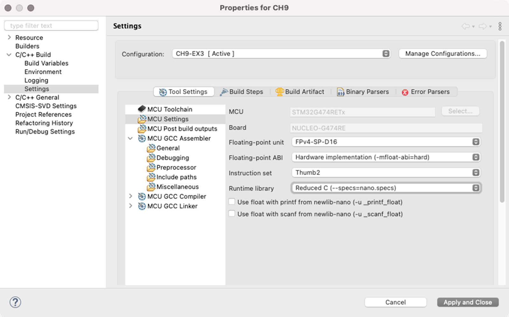</p>

<p align="center">图 9.10：如何选择 newlib/newlib-nano 运行时库</p>
