<!-- page: 373 -->

# 12. 模数转换

将模拟外设连接到微控制器是非常常见的做法。在数字时代，仍然有许多设备产生模拟信号：传感器、电位器、换能器和音频外设只是生成可变电压的模拟设备中的少数几个例子，这些电压通常在一个固定区间内变化。通过读取该电压，我们可以将其转换为便于固件处理的数值。例如，TMP36 是一种相当流行的温度传感器，它产生一个与电路工作电压（即比例输出）和环境温度成比例的可变电压。

所有 STM32 微控制器都至少提供一个模数转换器（Analog-to-Digital Converter, ADC），这是一种能够通过专用 I/O 获取多个输入电压并将其转换为数字的外设。输入电压会与一个众所周知的固定电压进行比较，该电压也称为参考电压。此参考电压可以源自 VDDA 域，或者在引脚数较多的 MCU 中，由外部固定参考电压发生器提供（这些 MCU 提供了一个名为 VREF+ 的专用引脚）。大多数 STM32 MCU 提供 12 位 ADC。其中一些来自 STM32F3 和 STM32H7 产品组合的 MCU 甚至提供 16 位 ADC。

与迄今为止看到的其他 STM32 外设不同，ADC 在不同的 STM32 系列之间，甚至在同一系列内部都可能存在很大差异。因此，我们将仅对此有用外设进行介绍，并由读者自行深入分析所使用的具体 MCU 中的 ADC。

在分析 STM32 微控制器中 ADC 提供的功能及相关 CubeHAL 之前，最好先简要介绍该外设的工作方式。

## 12.1 SAR ADC 简介

在几乎所有 STM32 微控制器中，ADC 都实现为 12 位逐次逼近寄存器（Successive Approximation Register，SAR）ADC¹。根据产品型号和所使用的封装，它可以具有可变数量的多路复用输入通道（在大多数高引脚数的 STM32 MCU 中通常超过十个通道），从而允许测量来自外部源的信号。此外，还提供了一些内部通道：一个用于内部温度传感器（VSENSE）的通道，一个用于内部参考电压（VREFINT）的通道，一个用于监控外部 VBAT 电源的通道，以及一个用于监控 LCD 电压的通道（在提供原生单色被动 LCD 控制器的 MCU 中，例如 STM32L053）。在较新的 STM32 系列（STM32F3/L4/L4+/L5/G0/G5/H7）中实现的 ADC 还能够转换全差分输入。表 12.1

¹ 在撰写本章时，STM32F37/38xx 和 STM32H7 系列提供的 ADC 是这一规则的唯一显著例外，因为它们提供了更精确的带有 Sigma-Delta(Σ-Δ) 调制器的 16 位 ADC。本书不会涵盖这种类型的 ADC。ST 提供了 AN4207 来涵盖此主题。然而，使用它的 HAL 例程具有相同的组织结构。

<!-- page: 374 -->

列出了本书中考虑的九个 Nucleo 板所配备的所有 STM32 MCU 的确切 ADC 外设数量及其相关的输入源。

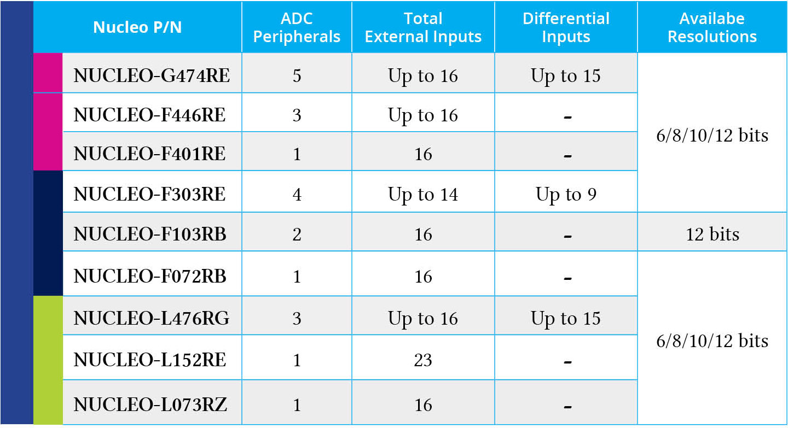

表 12.1：本书中使用的 Nucleo 板所配备的 STM32 MCU 中 ADC 外设的可用性

各个通道的 A/D 转换可以以单次、连续、扫描或不连续模式执行。ADC 的结果存储在一个左对齐或右对齐的 16 位数据寄存器中。此外，ADC 还实现了模拟看门狗功能，该功能允许应用程序检测输入电压是否超出用户定义的高阈值或低阈值：如果发生这种情况，将触发一个专用的 IRQ。

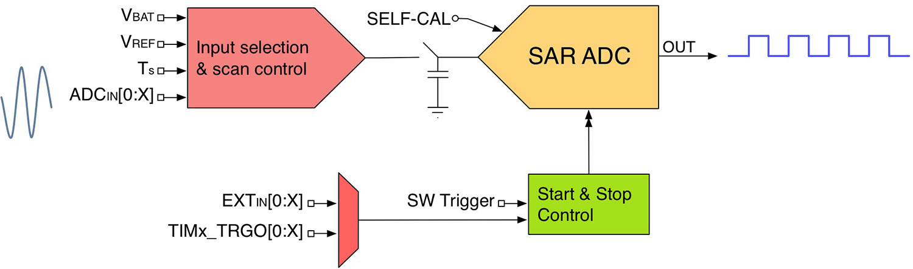

图 12.1：ADC 的简化结构

图 12.1 示意了 ADC 的结构²。输入选择和扫描控制单元负责选择 ADC 输入源。根据转换模式（单次、扫描或连续模式），该单元自动在输入通道之间切换，以便每个通道都可以被周期性采样。该单元的输出送入 ADC。

图 12.1 还显示了 ADC 的另一个重要部分：启动和停止控制单元。其作用是控制 A/D 转换过程，它可以由软件或可变数量的输入源触发。此外，它内部连接到某些定时器的 TRGO 线，以便在 DMA 模式下自动执行定时驱动的转换。我们将在后面分析 ADC 外设的这一重要

² 图 12.1 是 ADC 的简化表示。由于 ADC 实现在多个 STM32 系列之间可能存在很大差异，这里我们将考虑一个简化视图，清晰地描述 ADC 单元是如何设计的。

<!-- page: 375 -->

模式。

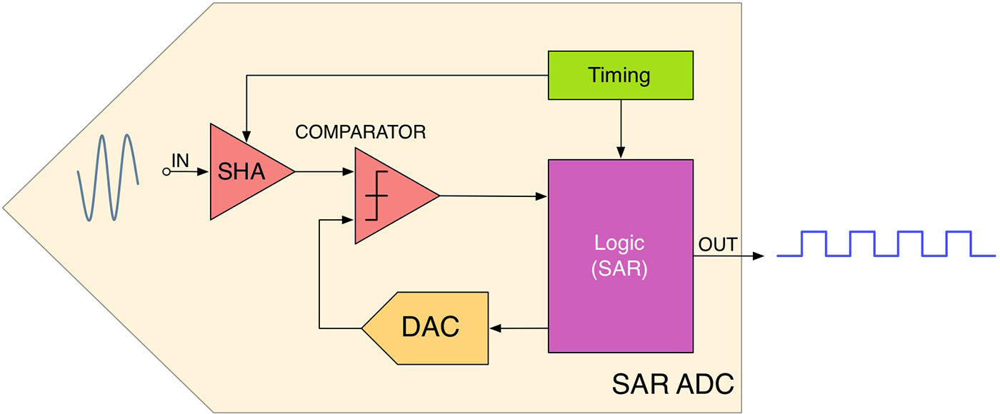

图 12.2：SAR ADC 的内部结构

图 12.2 显示了构成图 12.1 中所示 SAR ADC 单元的主要模块。输入信号通过 SHA 单元。正如你在图 12.1 中看到的，一个开关和一个电容器与 ADC 输入串联。该部分代表了图 12.2 中所示的采样保持（Sample-and-Hold, SHA）单元，这是所有 ADC 都具备的功能。该单元在转换周期内保持输入信号恒定起着重要作用。得益于一个内部定时单元，该单元由可配置的时钟调节（我们稍后会看到），SAR 通过闭合/打开图 12.1 中的“开关”不断连接/断开输入源。为了保持输入电压水平恒定，SHA 由一个电容器网络实现：这确保了源信号在 A/D 转换期间保持在一定水平，这是一个需要一定时间的过程，具体取决于所选的转换频率。

SHA 模块的输出送入一个比较器，该比较器将其与由内部 DAC 生成的另一个信号进行比较。比较结果被发送到逻辑单元，该单元根据定义明确的算法计算输入信号的数值表示。该算法是 SAR ADC 与其他 A/D 转换器的区别所在。

逐次逼近算法通过将输入信号的电压与内部 DAC 生成的电压进行比较来计算输入信号的电压，后者是 VREF 电压的一部分：如果输入信号高于此内部参考电压，则进一步增加该电压，直到输入信号低于它。最终结果将对应于一个从零到最大 12 位无符号整数（即 2¹² − 1 = 4095）范围内的数字。假设 VREF = 3300 mV，满量程 3300 mV 对应于 4095。因此，1 个 LSB 对应：

$$
1\ \mathrm{LSB}=\frac{3300\ \mathrm{mV}}{4095}\approx 0.8\ \mathrm{mV}
$$

例如，输入电压为 2.5 V 时，转换结果为：

$$
x=\frac{4095}{3300\ \mathrm{mV}}\times 2500\ \mathrm{mV}=3102
$$

SAR 算法的工作方式如下：

1. 输出数据寄存器被清零，最高有效位（MSB）被置为 1。这将对应于由内部 DAC 生成的一个明确定义的电压电平。

<!-- page: 376 -->

2. DAC 的输出与输入信号 `V_IN` 进行比较：
   1. 如果 `V_IN` 较高，则该位保持为 1。
   2. 如果 `V_IN` 较低，则该位被重置为 0。
   3. 算法继续处理数据寄存器中的下一个最高有效位，直到所有位都被置为 1 或 0。

图 12.3 展示了 4 位 ADC 内部 SAR 逻辑单元执行的转换过程。让我们考虑红色高亮显示的路径，并假设 VIN = 2700 mV 且 VREF = 3300 mV。算法首先将最高有效位置为 1，这对应于 1000₂ = 8₁₀。这意味着：

$$
x=\frac{3300\ \mathrm{mV}}{2^4-1}\times 8=1760\ \mathrm{mV}
$$

由于 VIN 高于 1760 mV，第 4 位保持为 1，算法转向下一个最高有效位。此时数据寄存器等于 1100₂ = 12₁₀，DAC 生成 2640 mV 的输出。由于 VIN 仍然高于此值，第 3 位再次保持为 1。寄存器随后被设置为 1110₂ = 14₁₀，这导致内部电压等于 3080 mV。这次 VIN 较低，因此第二位被重置为零。算法现在将第 1 位置为 1，这导致内部电压等于 2860 mV。此值仍然高于 VIN，算法将最后一位重置为零。因此，ADC 检测到输入电压接近 2640 mV。显然，ADC 提供的分辨率越高，转换值就越接近 VIN。

如您所见，SAR 算法本质上是在二叉树中进行搜索。该算法的巨大优势在于转换在 N 个周期内完成，其中 N 对应于 ADC 的分辨率。因此，12 位 ADC 需要十二个周期来完成一次转换。但一个周期可以持续多久？每秒的周期数，即 ADC 频率，是 ADC 的性能评估参数。SAR ADC 可以非常快，特别是当 ADC 分辨率降低时（更少的采样位对应于每次转换更少的周期）。然而，模拟信号源的阻抗，或源与 MCU 引脚之间的串联电阻（RIN），由于流入引脚的电流，会在其上引起电压降。

<!-- page: 377 -->

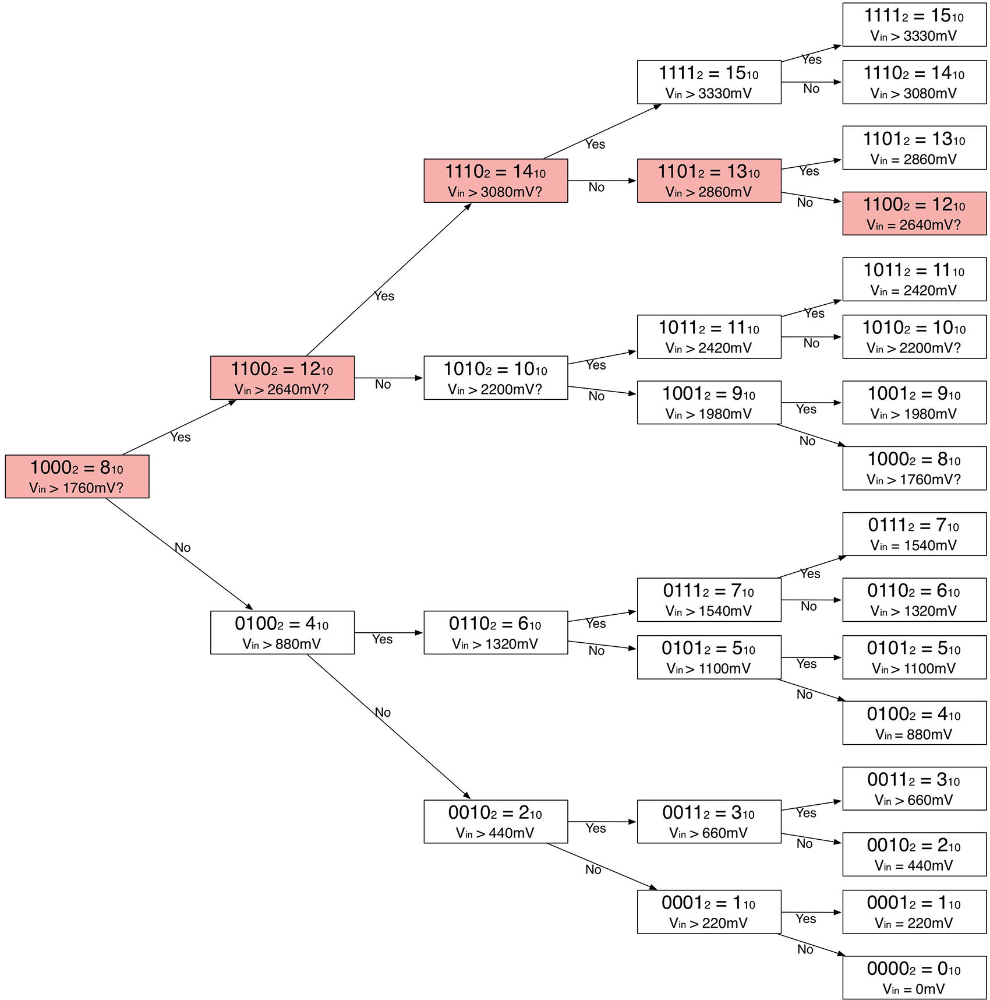

图 12.3：SAR ADC 执行的转换过程

内部电容网络（记为 `C_ADC`）的充电由图 12.1 中的开关控制，该开关具有等于 `R_ADC` 的电阻。加上源电阻后，即 `R_TOT = R_ADC + R_IN`，完全充电保持电容所需的时间会增加。图 12.4 显示了模拟信号源电阻的影响。`C_ADC` 的有效充电由 `R_TOT` 控制，因此充电时间常数为 `t_C = (R_ADC + R_IN) × C_ADC`。如果采样时间小于通过 `R_TOT` 完全充电 `C_ADC` 所需的时间（`t_S < t_C`），则 ADC 转换得到的数字值会小于实际值。通常，需要等待 `t_C` 的若干倍才能达到合理的精度。

<!-- page: 378 -->

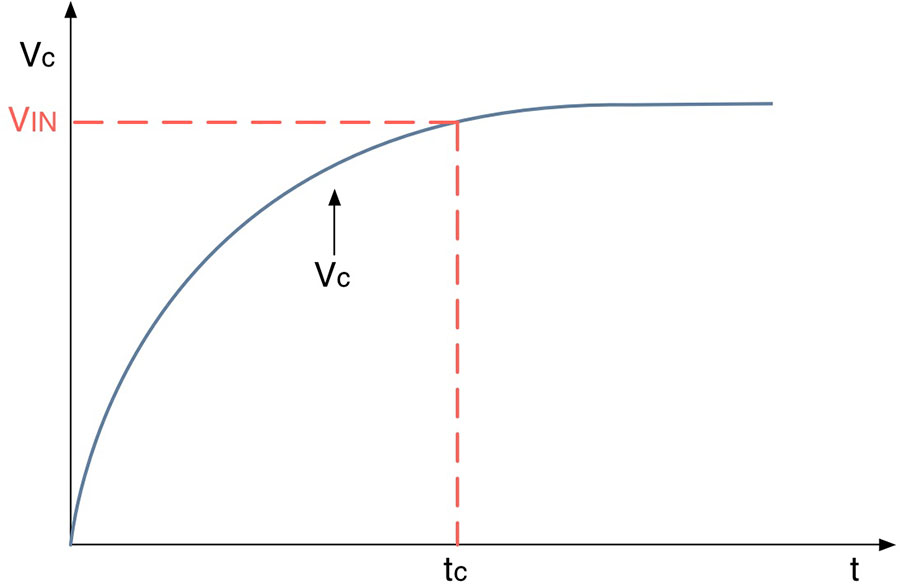

图 12.4：ADC 电阻对模拟信号源的影响

对于高速 A/D 转换，在板级设计时考虑 PCB 布局的影响和适当的去耦非常重要。ST 提供了一份编写良好的应用笔记 AN2834³⁴，其中提供了多个重要提示，以充分利用集成在 STM32 微控制器中的 ADC。

## 12.2 HAL_ADC 模块

在简要介绍了 STM32 微控制器中 ADC 外设提供的最重要功能之后，现在是深入研究相关 CubeHAL API 的合适时机。

为了操作 ADC 外设，HAL 定义了 C 结构体 ADC_HandleTypeDef，其定义方式如下：

```c
typedef struct {
  ADC_TypeDef *Instance; /* Pointer to ADC descriptor */
  ADC_InitTypeDef Init; /* ADC initialization parameters */
  __IO uint32_t NbrOfCurrentConversionRank; /* ADC number of current conversion rank */
  DMA_HandleTypeDef *DMA_Handle; /* Pointer to the DMA handle */
  HAL_LockTypeDef Lock; /* ADC locking object */
  __IO uint32_t State; /* ADC communication state */
  __IO uint32_t ErrorCode; /* Error code */
} ADC_HandleTypeDef;
```

让我们分析这个结构体最重要的字段。

- Instance：是指向我们要使用的 ADC 描述符的指针。例如，ADC1 是第一个 ADC 外设的描述符。
- Init：是 C 结构体 ADC_InitTypeDef 的一个实例，用于配置 ADC。我们稍后会更深入地研究它。
- `NbrOfCurrentConversionRank`：对应于规则转换组中当前正在转换的通道序号（rank）。我们很快会对此作进一步说明。

³ https://bit.ly/1rHj9ZN ⁴ STM32F37x/38x 系列的等效应用笔记是 AN4207(https://bit.ly/3AXmbxj)。

<!-- page: 379 -->

- `DMA_Handle`：这是指向配置为以直接存储器访问（DMA）模式执行 A/D 转换的 DMA 句柄的指针。它由 `__HAL_LINKDMA()` 宏自动配置。

ADC 配置通过使用 C 结构体 `ADC_InitTypeDef` 的实例来完成，其定义方式如下⁵：

```c
typedef struct {
  uint32_t ClockPrescaler; /* Selects the ADC clock frequency */
  uint32_t Resolution; /* Configures the ADC resolution mode */
  uint32_t ScanConvMode; /* The scan sequence direction. */
  uint32_t ContinuousConvMode; /* Specifies whether the conversion is performed in Continuous or Single mode */
  uint32_t DataAlign; /* Specifies whether the ADC data alignment is left or right */
  uint32_t NbrOfConversion; /* Specifies the number of ranks converted within the regular group sequencer */
  uint32_t NbrOfDiscConversion; /* Specifies the number of discontinuous conversions in the main sequence of the regular group */
  uint32_t DiscontinuousConvMode; /* Specifies whether the regular-group sequence is complete or discontinuous */
  uint32_t ExternalTrigConv; /* Selects the external event used to trigger conversion */
  uint32_t ExternalTrigConvEdge; /* Selects the external trigger edge and enables it */
  uint32_t DMAContinuousRequests; /* Specifies whether DMA requests are performed once or continuously */
  uint32_t EOCSelection; /* Specifies the EOC flag used for conversion polling and interruption */
} ADC_InitTypeDef;
```

让我们分析该结构体中最相关的字段。

- `ClockPrescaler`：定义 ADC 模拟部分的时钟（ADCCLK）频率。在前一段中，我们看到 ADC 有一个内部定时单元，用于控制输入开关的切换频率（参见图 12.2）。ADCCLK 确立了该定时单元的速度，并影响每秒的采样次数，因为它定义了每个转换周期所用的时间。该时钟由外设时钟经过可编程预分频器分频后生成，允许 ADC 以 `f_PCLK/2`、`f_PCLK/4`、`f_PCLK/6` 或 `f_PCLK/8` 的频率工作（具体 MCU 的 ADCCLK 最大值及其预分频器请参考数据手册）。在某些 STM32 MCU 中，ADCCLK 也可以从 HSI 振荡器派生。该字段的值会影响 MCU 中所有实现的 ADC 的 ADCCLK 频率。

⁵ ADC_InitTypeDef 结构体与 CubeF0 和 CubeL0 HAL 中定义的略有不同。这是因为这些系列的 ADC 不提供定义自定义输入采样序列（通过分配通道序号）的能力。此外，这些系列的 ADC 提供对输入信号进行采样的能力，并且在 CubeL0 HAL 中，可以启用这些 MCU 中 ADC 提供的专用低功耗功能。更多信息，请参考 CubeHAL 源代码。

<!-- page: 380 -->

- Resolution：除了 STM32F1 MCU（其 ADC 不允许选择采样分辨率，参见表 12.1）外，使用此字段可以定义 A/D 转换分辨率。它可以取表 12.2 中的值。分辨率越高，每秒可能完成的转换次数越少。如果速度对你的应用不重要，强烈建议将 ADC 分辨率设置为最大位数，并将转换速度设置为最小值。
- ScanConvMode：此字段可以取 ENABLE 或 DISABLE 值，用于启用/禁用扫描转换模式。稍后会有更多介绍。
- ContinuousConvMode：指定转换是在单次模式还是连续模式下执行，它可以取 ENABLE 或 DISABLE 值。稍后会有更多介绍。
- NbrOfConversion：指定在扫描模式下将被转换的规则组通道数。此数量应等于配置的通道数。
- DataAlign：指定转换结果的数据对齐方式。ADC 数据寄存器实现为半字寄存器。由于仅使用 12 位来存储转换结果，此参数确立了这些位在寄存器内的对齐方式。它可以取 ADC_DATAALIGN_LEFT 或 ADC_DATAALIGN_RIGHT 值。
- ExternalTrigConvEdge：选择用于驱动转换的外部触发源（使用定时器）。
- EOCSelection：根据转换模式（单次或连续转换），ADC 会相应地设置转换结束（EOC）标志。此字段用于 ADC 轮询或中断 API 以确定转换何时完成，它可以取 ADC_EOC_SEQ_CONV（用于连续转换）和 ADC_EOC_SINGLE_CONV（用于单次转换）值。

表 12.2：ADC 可用的分辨率选项

| ADC 分辨率 | 描述 |
|:-----------|:-----|
| `ADC_RESOLUTION_12B` | ADC 12 位分辨率 |
| `ADC_RESOLUTION_10B` | ADC 10 位分辨率 |
| `ADC_RESOLUTION_8B` | ADC 8 位分辨率 |
| `ADC_RESOLUTION_6B` | ADC 6 位分辨率 |

在我们开始进行实际示例之前，我们必须分析另外两个主题：如何配置输入通道以及如何对其输入信号进行采样。

### 12.2.1 转换模式

STM32 微控制器中实现的 ADC 提供了几种转换模式，以应对不同的应用场景。接下来我们将简要介绍其中最相关的几种模式：ST 发布的 AN3116⁶ 文档描述了 ADC 提供的所有可能的转换模式。

#### 12.2.1.1 单通道单次转换模式

这是最简单的 ADC 模式。在此模式下，ADC 对单个通道执行单次转换（单次采样），如图 12.5 所示，并在转换完成后停止。

⁶ https://bit.ly/39EFUpk

<!-- page: 381 -->

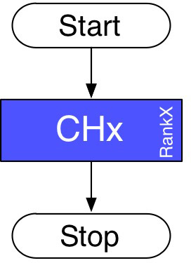

图 12.5：单通道单次转换模式

#### 12.2.1.2 扫描单次转换模式

此模式在某些 ST 文档中也被称为多通道单次模式，用于在独立模式下依次转换多个通道。利用序号（rank），您可以使用此 ADC 模式配置多达 16 个通道的任意顺序，每个通道可以具有不同的采样时间，并且顺序可自定义。例如，您可以执行图 12.6 中所示的序列。这样，在转换过程中无需停止 ADC 来重新配置下一个通道的不同采样时间。此模式节省了额外的 CPU 负载和大量的软件开发工作。扫描转换以 DMA 模式执行。

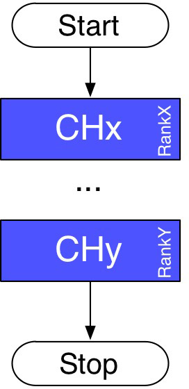

图 12.6：扫描单次转换模式

例如，当系统启动依赖于某些参数时，可以使用此模式，例如在机械臂系统中需要知道机械臂尖端的坐标。在这种情况下，您必须在通电时读取机械臂系统中每个关节的位置，以确定机械臂尖端的坐标。此模式也可用于对多个信号电平（电压、压力、温度等）进行单次测量，以决定系统是否可以启动，从而保护人员和设备。

#### 12.2.1.3 单通道连续转换模式

此模式会在规则组转换中连续、无限地转换单个通道。连续模式允许 ADC 在后台运行，在无需 CPU 干预的情况下持续转换通道。此外，还可以使用 DMA 循环模式来降低 CPU 负载。

<!-- page: 382 -->

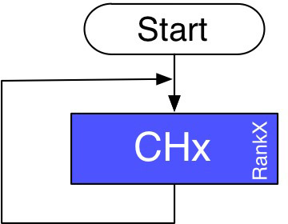

图 12.7：单通道连续转换

例如，可以实现此 ADC 模式来监控电池电压、使用 PID 进行烤箱温度的测量和调节等。

#### 12.2.1.4 扫描连续转换模式

此模式也被称为多通道连续模式，可用于在独立模式下依次转换多个通道。利用序号（rank），您可以配置多达 16 个通道的任意顺序，每个通道可以具有不同的采样时间和不同的顺序。此模式与多通道单次转换模式类似，不同之处在于它在序列中的最后一个通道转换结束后不会停止，而是从第一个通道重新开始转换序列，并无限继续。扫描转换以 DMA 模式执行。

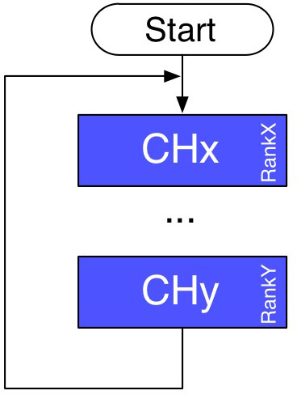

图 12.8：扫描连续转换模式

例如，此模式可用于监控多电池充电器中的多个电压和温度。在充电过程中读取每个电池的电压和温度。当电压或温度达到最大水平时，应将相应的电池从充电器断开。

#### 12.2.1.5 注入转换模式

此模式旨在用于转换由外部事件或软件触发的情况。注入组优先于规则通道组。它会中断规则通道组中当前通道的转换。

<!-- page: 383 -->

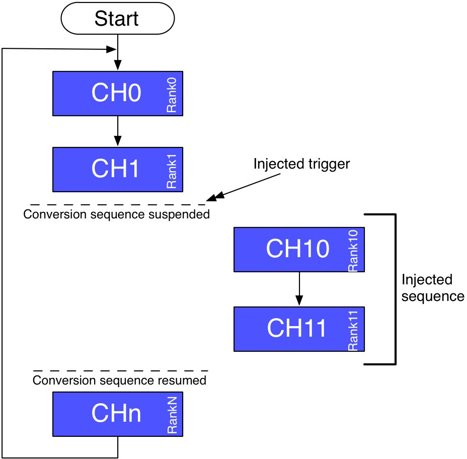

图 12.9：注入转换模式

例如，此模式可用于将通道转换与事件同步。这在电机控制应用中很有用，因为晶体管开关会产生噪声，影响 ADC 测量并导致错误的转换。使用定时器，可以实现注入转换模式，从而将 ADC 测量延迟到晶体管开关之后。

#### 12.2.1.6 双模式

双模式适用于具有两个 ADC 的 STM32 微控制器：ADC1 为主，ADC2 为从。ADC1 和 ADC2 的触发源在规则组和注入组转换期间在内部同步。ADC1 和 ADC2 协同工作。在某些器件中，最多有 3 个 ADC：ADC1、ADC2 和 ADC3。在这种情况下，ADC3 始终独立工作，不与其他 ADC 同步。

双模式的工作方式是，当转换结束时，ADC1 和 ADC2 的结果同时保存在 ADC1 的 32 位数据寄存器中。通过分离这两个结果，我们可以同时获取来自两个独立通道的数据。

有关双模式的更多信息，请参阅 ST 发布的 AN3116⁷。

### 12.2.2 通道选择

根据所使用的 STM32 系列和封装，STM32 微控制器中的 ADC 可以转换来自可变数量通道的信号。在 F0 和 L0 系列中，通道的分配是固定的：第一个始终是 IN0，第二个是 IN1，依此类推。用户只能决定某个通道是否启用。这意味着在扫描模式下，第一个被采样的通道将始终是 IN0，第二个是 IN1，依此类推。其他

⁷ https://bit.ly/39EFUpk

<!-- page: 384 -->

STM32 微控制器则提供了“组”的概念。一个组由一系列转换组成，这些转换可以在任何通道上以任意顺序执行。虽然输入通道是固定的，并绑定到特定的微控制器引脚（即 IN0 是第一个通道，IN1 是第二个通道，依此类推），但可以在逻辑上重新排序以形成自定义的采样序列。通道的重新排序是通过为它们分配一个从 1 到 16 的索引来完成的。在 CubeHAL 中，这个索引被称为 rank（序号）。

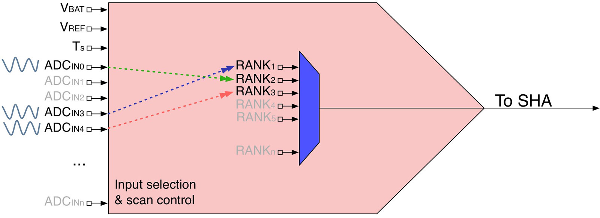

图 12.10：如何使用 rank 重新排序输入通道

图 12.10 展示了这一概念。尽管 IN4 通道是固定的（例如，在 STM32F401RE 微控制器中，它连接到 PA4 引脚），但可以在逻辑上将其分配给 rank 1，使其成为第一个被采样的通道。提供此功能的微控制器还允许单独选择每个通道的采样速度，这与 F0/L0 微控制器不同，后者的配置是 ADC 全局的。

通道和 rank 的配置通过使用 C 结构体 `ADC_ChannelConfTypeDef` 的实例来完成，其定义如下：

```c
typedef struct {
  uint32_t Channel; /* Specifies the channel to configure into ADC rank */
  uint32_t Rank; /* Specifies the rank ID */
  uint32_t SamplingTime; /* Sampling time value for the selected channel */
  uint32_t Offset; /* Reserved for future use, can be set to 0 */
} ADC_ChannelConfTypeDef;
```

- Channel：指定通道 ID。它可以取值为 ADC_CHANNEL_0、ADC_CHANNEL_1…ADC_CHANNEL_N，具体取决于实际可用的通道数量。
- Rank：对应于与通道关联的 rank（序号）。它可以取 1 到 16 之间的值，这是用户可定义 rank 的最大数量。
- SamplingTime：指定要为所选通道设置的采样时间值，它对应于 ADC 周期的数量。这个数字不能任意设定，而是属于选定值列表的一部分。正如我们稍后所见，CubeMX 通过提供针对您正在考虑的特定微控制器的允许值列表，提供了很大的帮助。

每个 ADC 存在两个组：

<!-- page: 385 -->

- 一个规则组（regular group），由最多 16 个通道组成，对应于扫描转换期间被采样通道的序列。
- 一个注入组（injected group），由最多 4 个通道组成，对应于执行注入转换时注入通道的序列。

CubeHAL 及其非线性演变


使用 CubeHAL 时，尤其是初学者按照本书示例学习时，将针对某个 STM32 系列编写的代码移植到另一系列，必须格外小心。例如，考虑 ADC_ChannelConfTypeDef.Rank 字段，在许多 STM32 微控制器中它可以取 1..16 的值。对于这些微控制器，使用十进制数字表示 rank 是没问题的。但对于较新的 STM32 微控制器，该值是一个计算结果，需要遵循精确的方案。例如，对于 G474RE 微控制器，必须使用 CubeHAL_LL 宏 LL_ADC_REG_RANK_1 来指定 rank，否则配置将完全损坏。ST 应该增加在 CubeHAL 内部标准化多项工作的力度。除非完全确定，否则在重用其他代码之前，始终建议先使用 CubeMX 生成初始化代码。作者在迁移本章示例时，花了一整晚和第二天才意识到这一至关重要的事情。悲惨的故事。

### 12.2.3 ADC 分辨率和转换速度

通过降低 ADC 分辨率⁸，可以执行更快的转换。事实上，采样时间由固定数量的周期（通常为 3）加上取决于 A/D 分辨率的可变数量周期定义。每种分辨率的最小转换时间如下：

- 12 位：3 + 12 = 15 个 ADCCLK 周期
- 10 位：3 + 10 = 13 个 ADCCLK 周期
- 8 位：3 + 8 = 11 个 ADCCLK 周期
- 6 位：3 + 6 = 9 个 ADCCLK 周期

通过降低分辨率，可以增加每秒最大采样数，在某些 STM32 微控制器中甚至可以达到 15Msps 以上。请记住，ADCCLK 派生自外设时钟：这意味着 SYSCLK 和 PCLK 速度会影响每秒最大采样数。

⁸ 这在 STM32F1 微控制器中是不可能的。

<!-- page: 386 -->

### 12.2.4 轮询模式下的 A/D 转换

与大多数 STM32 外设一样，ADC 可以以三种模式驱动：轮询（polling）、中断和直接存储器访问（DMA）模式。正如我们稍后所见，定时器最终可以驱动最后这种模式，从而使 A/D 转换以固定间隔发生。当我们需要以特定频率采样信号时（例如在音频应用中），这非常有用。

一旦通过向 `HAL_ADC_Init()` 例程传递 `ADC_InitTypeDef` 结构体的实例来配置 ADC 控制器，我们就可以使用 `HAL_ADC_Start()` 函数启动该外设。根据所选的转换模式，ADC 将连续转换每个选定的输入，或者仅转换一次：在这种情况下，若要再次转换选定的输入，我们需要在再次调用 `HAL_ADC_Start()` 之前调用 `HAL_ADC_Stop()` 函数。

在轮询模式下，我们使用函数

```c
HAL_StatusTypeDef HAL_ADC_PollForConversion(ADC_HandleTypeDef *hadc, uint32_t Timeout);
```

来确定 A/D 转换何时完成，并且结果可用在 ADC 数据寄存器中。该函数接受指向 ADC 句柄描述符的指针和一个 Timeout 值，该值表示我们愿意等待的最大时间（以毫秒为单位）。或者，我们可以传递 `HAL_MAX_DELAY` 以无限期等待。

要获取结果，我们可以使用函数：

```c
uint32_t HAL_ADC_GetValue(ADC_HandleTypeDef *hadc);
```

我们现在终于准备好分析一个完整的示例了。我们将首先查看用于执行轮询模式转换的 API。正如您将看到的，与之前在其他外设中所见相比，这里没有什么新内容。

我们要研究的示例做了一件简单的事情：它使用所有 STM32 微控制器中可用的内部温度传感器作为 ADC 的源。温度传感器连接到一个内部 ADC 输入。确切的输入编号取决于具体的微控制器系列和封装。例如，在 STM32F401RE 微控制器中，温度传感器连接到 ADC1 外设的 IN18。然而，HAL 已将这一细节抽象掉。在我们分析实际代码之前，最好先快速查看一下温度传感器的电气特性，这些特性记录在您所考虑的微控制器的数据手册中。

<!-- page: 387 -->

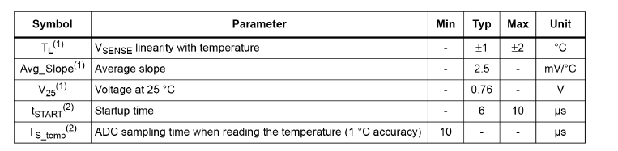

表 12.3：STM32F401RE 微控制器中温度传感器的电气特性

表 12.3 显示了 STM32F401RE 微控制器中温度传感器的特性。它具有 1°C⁹ 的典型精度和 2.5 mV/°C 的平均斜率。此外，温度传感器结的工作原理使得在 25°C 时电压降为 760 mV。这意味着，为了计算检测到的温度，我们可以使用以下公式：

$$
\mathrm{Temp}(^{\circ}\mathrm{C})=\frac{V_{\mathrm{SENSE}}-V_{25}}{\mathrm{Avg\_Slope}}+25 \tag{1}
$$

以下代码展示了如何在 STM32F401RE 微控制器中执行内部温度传感器输出的 A/D 转换。

**Filename:** `Core/Src/main-ex1.c`

```c
/* Private variables ---------------------------------------------------------*/
ADC_HandleTypeDef hadc1;
UART_HandleTypeDef huart2;
char msg[30];
uint16_t rawValue;
float temp;

int main(void) {
  /* Reset of all peripherals, Initializes the Flash interface and the Systick. */
  HAL_Init();

  /* Configure the system clock */
  SystemClock_Config();

  /* Initialize all configured peripherals */
  MX_GPIO_Init();
  MX_USART2_UART_Init();
  MX_ADC1_Init();

  /* Starts the ADC */
  HAL_ADC_Start(&hadc1);

  while (1) {
    HAL_ADC_PollForConversion(&hadc1, HAL_MAX_DELAY);
    rawValue = HAL_ADC_GetValue(&hadc1);
    temp = ((float)rawValue) / 4095 * 3300;
    temp = ((temp - 760.0) / 2.5) + 25;
    sprintf(msg, "ADC rawValue: %hu\r\n", rawValue);
    HAL_UART_Transmit(&huart2, (uint8_t *)msg, strlen(msg), HAL_MAX_DELAY);
    sprintf(msg, "Temperature: %f\r\n", temp);
    HAL_UART_Transmit(&huart2, (uint8_t *)msg, strlen(msg), HAL_MAX_DELAY);
  }
}

static void MX_ADC1_Init(void) {
  ADC_ChannelConfTypeDef sConfig = {0};
  /** Configure the global features of the ADC (Clock, Resolution,
   * Data Alignment and number of conversion) */
  hadc1.Instance = ADC1;
  hadc1.Init.ClockPrescaler = ADC_CLOCK_SYNC_PCLK_DIV2;
  hadc1.Init.Resolution = ADC_RESOLUTION_12B;
  hadc1.Init.ScanConvMode = DISABLE;
  hadc1.Init.ContinuousConvMode = ENABLE;
  hadc1.Init.DiscontinuousConvMode = DISABLE;
  hadc1.Init.ExternalTrigConvEdge = ADC_EXTERNALTRIGCONVEDGE_NONE;
  hadc1.Init.ExternalTrigConv = ADC_SOFTWARE_START;
  hadc1.Init.DataAlign = ADC_DATAALIGN_RIGHT;
  hadc1.Init.NbrOfConversion = 1;
  hadc1.Init.DMAContinuousRequests = DISABLE;
  hadc1.Init.EOCSelection = ADC_EOC_SEQ_CONV;
  HAL_ADC_Init(&hadc1);
  /** Configure for the selected ADC regular channel its corresponding
   * rank in the sequencer and its sample time. */
  sConfig.Channel = ADC_CHANNEL_TEMPSENSOR;
  sConfig.Rank = 1;
  sConfig.SamplingTime = ADC_SAMPLETIME_480CYCLES;
  HAL_ADC_ConfigChannel(&hadc1, &sConfig);
}
```

⁹ STM32 内部温度传感器在 IC 生产期间经过工厂校准。通常会在 30°C 和 110°C 下采样两个温度。它们分别称为 TS_CAL1 和 TS_CAL2。检测到的温度存储在非易失性系统内存中。确切的内存地址记录在特定的数据手册中。利用这些数据，可以对检测到的温度进行线性化，从而使误差回到 1°C 的典型精度值内。ST 提供了一份专门针对此主题的应用笔记：AN3964(https://bit.ly/1XfbuO6)。但是，请记住，内部温度传感器测量的是 IC（因此也是 PCB）的温度。根据特定的 STM32 系列、微控制器运行频率、执行的操作、启用的外设、电源部分等，检测到的温度可能远高于实际环境温度。例如，本作者验证了一个以 200 MHz 运行的 STM32F7 微控制器，在 20°C 的室温下，其工作温度约为 45°C。

<!-- page: 388 -->
下面先分析 `MX_ADC1_Init()` 函数，该函数用于初始化 ADC1 外设

<!-- page: 389 -->

在第 74 行，ADC 被配置为 ADCCLK（即 ADC 模拟部分的时钟）频率为 PCLK2 频率的一半¹⁰，对于以最大速度运行的 STM32F401RE 而言，该频率为 84MHz。接下来，ADC 分辨率被配置为最大值：12 位。扫描转换模式被禁用（第 76 行），而连续转换模式被启用（第 77 行），这样我们就可以反复轮询转换结果，而无需停止并重新启动 ADC。因此，在第 84 行，EOC 标志被设置为 ADC_EOC_SEQ_CONV。请注意，第 82 行的参数 NbrOfConversion 在这种情况下完全无意义且冗余，因为单次转换模式自动假定采样通道数为 1。

第 [89:92] 行配置了温度传感器通道并为其分配了优先级 1：即使我们没有执行扫描转换，也需要为使用的通道指定优先级。采样时间被设置为 480 个周期：这意味着，鉴于时钟速度为 84MHz，且考虑到 ADCCLK 被设置为 PCLK 速度的一半，A/D 转换每 10μs¹¹ 执行一次。


> **注意**
>
> 为什么选择该转换速度？原因来自表 12.3，该表指出 ADC 采样时间 `T_S_temp` 等于 10 μs 时，精度为 1°C。例如，如果你将速度增加到 3 个周期，通过将 `SamplingTime` 字段设置为 `ADC_SAMPLETIME_3CYCLES`，你会发现转换结果经常完全错误。

在同一张表中，你还可以找到另一个有趣的数据：温度传感器启动时间（即传感器启用后输出电压稳定所需的时间）在 6 到 10μs 之间。然而，我们不需要关心这方面的问题，因为 HAL_ADC_ConfigChannel() 例程被设计为正确处理启动时间。这意味着，该函数将执行 10μs 的忙等待（busy-wait），以允许温度传感器稳定。

下面关注 `main()` 例程。一旦 ADC1 外设启动（第 51 行），我们就开始一个无限循环，循环轮询 ADC 以进行 A/D 转换。完成后，我们可以获取转换值并应用公式 [1] 来计算摄氏温度。最终，结果在 UART2 接口上打印出来。

> **仔细阅读**
>
> 为了正常工作，此示例需要 newlib-nano 支持浮点数据类型。请遵循第 5 章中关于 I/O 重定向（I/O retargeting）一节的说明。


¹⁰ 请注意，在撰写本章时（2021 年 9 月），CubeMX 不允许将最大 ADC 频率设置为 PCLK2 频率的一半，声称这在 F401RE P/N 中是不可能的。这对作者来说似乎并不正确，因为在旧版本的 CubeMX 中这是完全可能的，同时，ST 官方数据手册明确指出 ADC 能够以 PCLK2 时钟速度的一半运行。 ¹¹该数字来源于以下事实：以 48MHz 运行的 ADCCLK 接口每 1μs 执行 48 个周期。因此，480 个周期除以 48 周期/μs 得到 10μs。

<!-- page: 390 -->

CubeF1 HAL 中的 HAL_ADC 模块与其他 HAL 略有不同。要启动由软件驱动的转换，要求在 ADC 初始化期间指定参数 hadc.Init.ExternalTrigConv = ADC_SOFTWARE_START。这与其他 HAL 的做法完全不同，也不清楚为什么 ST 开发人员采用了这种不同的方法。此外，即使 CubeMX 在生成相应的初始化代码时，也提供了不同的配置以考虑这一特殊性。有关完整的配置过程，请参阅书籍示例。


### 12.2.5 中断模式下的 A/D 转换

在中断模式下执行 A/D 转换与之前看到的内容没有太大区别。通常，我们需要定义连接到 ADC 全局中断的 ISR，分配所需的中断优先级，并启用相应的 IRQ。与其他所有 HAL 外设一样，我们需要从 ADC ISR 中调用 HAL_ADC_IRQHandler()，并实现回调例程 HAL_ADC_ConvCpltCallback()，该例程在转换结束时由 HAL 自动调用。最后，通过使用 HAL_ADC_Start_IT() 函数启动 ADC，所有与 ADC 相关的中断都被启用。

以下示例仅展示了如何在中断模式下执行转换。ADC 的初始化代码与上一个示例中使用的相同。

```c
int main(void) {
  HAL_Init();
  Nucleo_BSP_Init();

  /* Initialize all configured peripherals */
  MX_ADC1_Init();
  HAL_NVIC_SetPriority(ADC_IRQn, 0, 0);
  HAL_NVIC_EnableIRQ(ADC_IRQn);
  HAL_ADC_Start_IT(&hadc1);

  while (1);
}

void ADC_IRQHandler(void) {
  HAL_ADC_IRQHandler(&hadc1);
}

void HAL_ADC_ConvCpltCallback(ADC_HandleTypeDef *hadc) {
  char msg[30];
  uint16_t rawValue;
  float temp;

  rawValue = HAL_ADC_GetValue(&hadc1);
  temp = ((float)rawValue) / 4095 * 3300;
  temp = ((temp - 760.0) / 2.5) + 25;
  sprintf(msg, "rawValue: %hu\r\n", rawValue);
  HAL_UART_Transmit(&huart2, (uint8_t *)msg, strlen(msg), HAL_MAX_DELAY);
  sprintf(msg, "Temperature: %f\r\n", temp);
  HAL_UART_Transmit(&huart2, (uint8_t *)msg, strlen(msg), HAL_MAX_DELAY);
}
```

<!-- page: 391 -->

### 12.2.6 DMA 模式下的 A/D 转换

驱动 ADC 外设最有趣的模式是 DMA 模式。该模式允许在没有 CPU 干预的情况下执行转换，并且通过使用循环模式的 DMA，我们可以轻松配置 ADC 以执行连续转换。此外，正如我们接下来将要发现的，这种模式非常适合使用定时器来驱动转换，从而以固定的采样率对输入信号进行采样。当我们要使用扫描模式执行多通道转换时，也必须使用 DMA 模式来驱动 ADC 外设。

要在 DMA 模式下执行 A/D 转换，通常涉及以下步骤：

- 根据所需的转换模式（单次扫描、连续扫描等）配置 ADC 外设。
- 配置与所用 ADC 控制器对应的 DMA 通道/流。
- 使用 __HAL_LINKDMA() 宏将 DMA 句柄描述符链接到 ADC 句柄。
- 启用 DMA 以及与所用 DMA 流关联的中断（IRQ）。
- 使用 HAL_ADC_Start_DMA() 启动 DMA 模式下的 ADC，并传递用于存储从 ADC 获取的数据的数组引用。
- 通过定义 HAL_ADC_ConvCpltCallback()¹² 回调函数，准备好捕获 EOC 事件。

以下示例旨在 STM32F401RE 微控制器上运行，展示了如何使用 DMA 模式执行单次扫描转换。我们要分析的首先分析 ADC 外设和 DMA 控制器的配置。

¹² HAL_ADC 模块还提供了 HAL_ADC_ConvHalfCpltCallback() 回调函数，该函数在扫描转换序列完成一半时被调用。

<!-- page: 392 -->

**Filename:** `Core/Src/main-ex2.c`

```c
static void MX_ADC1_Init(void) {
  ADC_ChannelConfTypeDef sConfig = {0};

  /** Configure the global features of the ADC (Clock, Resolution,
   * Data Alignment and number of conversion) */
  hadc1.Instance = ADC1;
  hadc1.Init.ClockPrescaler = ADC_CLOCK_SYNC_PCLK_DIV8;
  hadc1.Init.Resolution = ADC_RESOLUTION_12B;
  hadc1.Init.ScanConvMode = ENABLE;
  hadc1.Init.ContinuousConvMode = DISABLE;
  hadc1.Init.DiscontinuousConvMode = DISABLE;
  hadc1.Init.ExternalTrigConvEdge = ADC_EXTERNALTRIGCONVEDGE_NONE;
  hadc1.Init.ExternalTrigConv = ADC_SOFTWARE_START;
  hadc1.Init.DataAlign = ADC_DATAALIGN_RIGHT;
  hadc1.Init.NbrOfConversion = 3;
  hadc1.Init.DMAContinuousRequests = DISABLE;
  hadc1.Init.EOCSelection = ADC_EOC_SEQ_CONV;
  HAL_ADC_Init(&hadc1);

  /** Configure for the selected ADC regular channel its corresponding
   * rank in the sequencer and its sample time. */
  sConfig.Channel = ADC_CHANNEL_TEMPSENSOR;
  sConfig.Rank = 1;
  sConfig.SamplingTime = ADC_SAMPLETIME_480CYCLES;
  HAL_ADC_ConfigChannel(&hadc1, &sConfig);

  sConfig.Rank = 2;
  HAL_ADC_ConfigChannel(&hadc1, &sConfig);

  sConfig.Rank = 3;
  HAL_ADC_ConfigChannel(&hadc1, &sConfig);

  /* ADC1 DMA Init */
  hdma_adc1.Instance = DMA2_Stream0;
  hdma_adc1.Init.Channel = DMA_CHANNEL_0;
  hdma_adc1.Init.Direction = DMA_PERIPH_TO_MEMORY;
  hdma_adc1.Init.PeriphInc = DMA_PINC_DISABLE;
  hdma_adc1.Init.MemInc = DMA_MINC_ENABLE;
  hdma_adc1.Init.PeriphDataAlignment = DMA_PDATAALIGN_HALFWORD;
  hdma_adc1.Init.MemDataAlignment = DMA_MDATAALIGN_HALFWORD;
  hdma_adc1.Init.Mode = DMA_NORMAL;
  hdma_adc1.Init.Priority = DMA_PRIORITY_LOW;
  hdma_adc1.Init.FIFOMode = DMA_FIFOMODE_DISABLE;
  if (HAL_DMA_Init(&hdma_adc1) != HAL_OK);

  __HAL_LINKDMA(&hadc1, DMA_Handle, hdma_adc1);
}

static void MX_DMA_Init(void) {
  /* DMA controller clock enable */
  __HAL_RCC_DMA2_CLK_ENABLE();

  /* DMA interrupt init */
  /* DMA2_Stream0_IRQn interrupt configuration */
  HAL_NVIC_SetPriority(DMA2_Stream0_IRQn, 1, 0);
  HAL_NVIC_EnableIRQ(DMA2_Stream0_IRQn);
}

void DMA2_Stream0_IRQHandler(void) {
  HAL_DMA_IRQHandler(&hdma_adc1);
}
```

<!-- page: 393 -->

MX_ADC1_Init() 配置 ADC 以执行三个通道的单次扫描。ADCCLK 被设置为最低值（第 86 行），并启用了扫描模式（第 88 行）。如您所见，我们配置 ADC 使其始终从内部温度传感器进行转换：这并没有太大用处，但不幸的是 Nucleo 开发板没有嵌入可供实验的模拟外设。初始化代码继续配置 DMA2 Stream0/Channel0，以便在 ADC 完成转换时执行外设到内存的传输。显然，转换序列由分配给通道的序号指定。由于 ADC 数据寄存器宽度为 16 位，我们配置 DMA 以执行半字传输（第 [118:119] 行）。最后，函数 MX_DMA_Init() 启用连接到 DMA2_Stream0 的中断（IRQ），其中断服务程序（ISR）将调用 HAL_DMA_IRQHandler() 例程。这将导致当扫描转换结束时，HAL 自动调用 HAL_ADC_ConvCpltCallback() 函数。该回调函数设置一个全局变量，用于指示转换结束。

**Filename:** `Core/Src/main-ex2.c`

```c
char msg[30];
uint16_t rawValues[3];
float temp;
volatile uint8_t convCompleted = 0;

int main(void) {
  /* Reset of all peripherals, Initializes the Flash interface and the Systick. */
  HAL_Init();

  /* Configure the system clock */
  SystemClock_Config();

  /* Initialize all configured peripherals */
  MX_DMA_Init();
  MX_ADC1_Init();
  MX_GPIO_Init();
  MX_USART2_UART_Init();

  /* Starts the ADC in DMA mode */
  HAL_ADC_Start_DMA(&hadc1, (uint32_t *)rawValues, 3);

  while (!convCompleted);

  HAL_ADC_Stop_DMA(&hadc1);

  for (uint8_t i = 0; i < hadc1.Init.NbrOfConversion; i++) {
    temp = ((float)rawValues[i]) / 4095 * 3300;
    temp = ((temp - 760.0) / 2.5) + 25;

    sprintf(msg, "rawValue %d: %hu\r\n", i, rawValues[i]);
    HAL_UART_Transmit(&huart2, (uint8_t *)msg, strlen(msg), HAL_MAX_DELAY);

    sprintf(msg, "Temperature %d: %f\r\n", i, temp);
    HAL_UART_Transmit(&huart2, (uint8_t *)msg, strlen(msg), HAL_MAX_DELAY);
  }

  while (1);
}

void HAL_ADC_ConvCpltCallback(ADC_HandleTypeDef *hadc) {
  convCompleted = 1;
}
```

<!-- page: 394 -->

上述代码行展示了 main() 函数。在第 56 行，通过传递指向 rawValues 数组的指针和转换次数来以 DMA 模式启动 ADC：这必须对应于第 94 行的 hadc1.Init.NbrOfConversion 字段（因此也对应于配置的通道序号数量）。最后，当 convCompleted 变量被 HAL_ADC_ConvCpltCallback() 例程（第 [76:78] 行）设置为 1 时，rawValues 数组的内容被转换，结果打印在 UART2 接口上。请注意，在第 60 行调用了 HAL_ADC_Stop_DMA()：执行此操作不是为了停止转换（转换在三个采样后会自动停止），而是为了允许后续在 DMA 模式下使用 ADC 外设（否则转换将无法启动）。


基于 STM32L0 的开发板用户会发现一个略有不同的示例。在 STM32L0 微控制器中，序号固定分配给 ADC 通道，并且序列反映通道编号方案。因此，序列中的序号数量由启用的通道数量定义，每个通道的序号由通道号定义（通道 0 固定在序号 0，通道 1 固定在序号 1，等等）。这意味着温度传感器通道不能分配给超过 1 个序号。

<!-- page: 395 -->

因此，对于 STM32L073RZ 示例，本例及下一个示例将仅循环使用一个通道。


#### 12.2.6.1 在 DMA 模式下对同一通道进行多次转换

要在 DMA 模式下对同一通道（或同一通道序列）执行指定次数的转换，您需要执行以下操作：

- 将 hadc.Init.ContinuousConvMode 字段设置为 ENABLE。
- 分配大小足够的缓冲区。
- 将所需的采集次数传递给 HAL_ADC_Start_DMA()。

#### 12.2.6.2 DMA 模式下的多次非连续转换

要在 DMA 模式下执行多次转换，您需要执行以下步骤：

- 将 hadc.Init.DMAContinuousRequests 字段设置为 ENABLE。
- 调用 HAL_ADC_Start_DMA()，以 DMA 模式启动转换。

如果将 hadc.Init.DMAContinuousRequests 字段设置为 DISABLE，则需要在每个转换序列结束时调用 HAL_ADC_Stop_DMA()，并在再次调用 HAL_ADC_Start_DMA() 之前执行此操作。否则，转换将不会启动。

#### 12.2.6.3 DMA 模式下的连续转换

要在 DMA 模式下执行连续转换，您需要执行以下步骤：

- 将 hadc.Init.ContinuousConvMode 字段设置为 ENABLE。
- 将 hadc.Init.DMAContinuousRequests 字段设置为 ENABLE，否则在首次扫描序列完成后，ADC 不会重新触发 DMA 请求。
- 将 DMA 流/通道配置为 DMA_CIRCULAR 模式。

### 12.2.7 错误管理

ADC 外设具备在转换丢失时通知开发人员的能力。当连续模式或扫描模式转换正在进行，且 ADC 数据寄存器在读取之前被后续事务覆盖时，就会发生这种错误情况。此时，ADC_SR 寄存器中的一个特殊位会被置位，并产生 ADC 中断。

我们可以通过实现以下回调函数来捕获过载（overrun）错误：

<!-- page: 396 -->

```c
void HAL_ADC_ErrorCallback(ADC_HandleTypeDef *hadc);
```

当发生过载（overrun）错误时，DMA 传输将被禁用，且不再接受 DMA 请求。在这种情况下，如果发出 DMA 请求，正在进行的常规转换将被中止，后续的常规触发将被忽略。随后，必须清除 OVR 标志位以及所用 DMA 流的 DMAEN 位，并重新初始化 DMA 和 ADC，以便将所需转换通道的数据传送到正确的内存位置（当调用 HAL_ADC_Start_DMA() 例程时，HAL 会自动执行所有这些操作）。

我们可以通过启用前一个示例中的连续转换模式，并将 hadc.Init.DMAContinuousRequests 字段设置为 ENABLE 来模拟过载（overrun）错误¹³：如果启用了 ADC 中断，并且从中断中调用了 HAL_ADC_IRQHandler()，那么您将能够捕获过载（overrun）错误。


过载（overrun）错误不仅与 ADC 接口的错误配置有关。即使 ADC 工作在 DMA 循环模式下，也可能产生该错误。在我之前基于 STM32F4 微控制器所做的一款自定义设计中，多个外设大量使用了 DMA，我发现当 DMA 执行其他并发传输时，可能会发生过载（overrun）错误。尽管总线仲裁本应避免出现竞态条件，尤其是在优先级设置正确的情况下，但我仍在一些无法复现的场景中遇到了此错误。通过正确处理过载（overrun）错误，我得以在发生该情况时重新启动转换。不用说，在我意识到 DMA 转换意外停止的根本原因之前，我花了数天时间尝试调试该问题。

### 12.2.8 定时器触发的转换

ADC 外设可配置为由定时器通过 TRGO 触发线驱动。用于执行此操作的定时器在芯片设计阶段即已硬连线固定。例如，在 STM32F401RE 微控制器中，ADC1 外设可使用 TIM2 定时器进行同步。该功能对于以特定频率执行 ADC 转换极为有用。例如，我们可以以 20kHz 频率对麦克风生成的音频波形进行采样。随后，结果数据可存储到持久性存储器中。

ADC 转换可以由定时器驱动，既支持中断模式，也支持直接存储器访问（DMA）模式。前者适用于以低频率仅采样单个通道的场景。后者则是高频扫描模式转换的必需方式。要启用定时器驱动的转换，您可以按照以下步骤操作：

- 根据所需的采样频率，配置通过 TRGO 线连接到 ADC 的定时器。

¹³ 在某些 STM32 微控制器中，还需要通过将 hadc.Init.Overrun 设置为 ADC_OVR_DATA_OVERWRITTEN 来显式启用溢出检测。请查阅您所考虑的微控制器系列的硬件抽象层源代码。

<!-- page: 397 -->

- 配置定时器的 TRGO 线，使其在每次生成更新事件时都触发（`TIM_TRGO_UPDATE`）¹⁴。
- 配置 ADC，使所选定时器的 TRGO 线触发转换，并确保禁用连续转换模式（因为是由 TRGO 线触发转换的）。此外，如果希望无限期地每次执行 N 次转换，请将 hadc.Init.DMAContinuousRequests 字段设置为 ENABLE，并将 DMA 设置为循环模式；如果希望在执行 N 次转换后停止，请将 hadc.Init.DMAContinuousRequests 字段设置为 DISABLE。
- 务必将 hadc.Init.ContinuousConvMode 字段设置为 DISABLE，否则 ADC 将在不等待定时器触发的情况下自行执行转换。
- 启动定时器。
- 以中断模式或 DMA 模式启动 ADC。

以下示例展示了如何在 STM32F401RE 微控制器中使用 TIM2 定时器，每 1 秒触发一次转换。

**Filename:** `Core/Src/main-ex3.c`

```c
/** Configure the global features of the ADC (Clock, Resolution,
 * Data Alignment and number of conversion) */
hadc1.Instance = ADC1;
hadc1.Init.ClockPrescaler = ADC_CLOCK_SYNC_PCLK_DIV8;
hadc1.Init.Resolution = ADC_RESOLUTION_12B;
hadc1.Init.ScanConvMode = DISABLE;
hadc1.Init.ContinuousConvMode = DISABLE;
hadc1.Init.DiscontinuousConvMode = DISABLE;
hadc1.Init.ExternalTrigConvEdge = ADC_EXTERNALTRIGCONVEDGE_RISING;
hadc1.Init.ExternalTrigConv = ADC_EXTERNALTRIG2_T2_TRGO;
hadc1.Init.DataAlign = ADC_DATAALIGN_RIGHT;
hadc1.Init.NbrOfConversion = 3;
hadc1.Init.DMAContinuousRequests = ENABLE;
hadc1.Init.EOCSelection = ADC_EOC_SEQ_CONV;
HAL_ADC_Init(&hadc1);

/** Configure for the selected ADC regular channel its corresponding
 * rank in the sequencer and its sample time. */
sConfig.Channel = ADC_CHANNEL_TEMPSENSOR;
sConfig.Rank = 1;
sConfig.SamplingTime = ADC_SAMPLETIME_480CYCLES;
HAL_ADC_ConfigChannel(&hadc1, &sConfig);

sConfig.Rank = 2;
HAL_ADC_ConfigChannel(&hadc1, &sConfig);

sConfig.Rank = 3;
HAL_ADC_ConfigChannel(&hadc1, &sConfig);

/* ADC1 DMA Init */
hdma_adc1.Instance = DMA2_Stream0;
hdma_adc1.Init.Channel = DMA_CHANNEL_0;
hdma_adc1.Init.Direction = DMA_PERIPH_TO_MEMORY;
hdma_adc1.Init.PeriphInc = DMA_PINC_DISABLE;
hdma_adc1.Init.MemInc = DMA_MINC_ENABLE;
hdma_adc1.Init.PeriphDataAlignment = DMA_PDATAALIGN_HALFWORD;
hdma_adc1.Init.MemDataAlignment = DMA_MDATAALIGN_HALFWORD;
hdma_adc1.Init.Mode = DMA_CIRCULAR;
hdma_adc1.Init.Priority = DMA_PRIORITY_LOW;
hdma_adc1.Init.FIFOMode = DMA_FIFOMODE_DISABLE;
HAL_DMA_Init(&hdma_adc1);

__HAL_LINKDMA(&hadc1, DMA_Handle, hdma_adc1);
}

static void MX_TIM2_Init(void) {
  TIM_ClockConfigTypeDef sClockSourceConfig = {0};
  TIM_MasterConfigTypeDef sMasterConfig = {0};

  htim2.Instance = TIM2;
  htim2.Init.Prescaler = 47999;
  htim2.Init.Period = 1999;
  htim2.Init.CounterMode = TIM_COUNTERMODE_UP;
  htim2.Init.ClockDivision = TIM_CLOCKDIVISION_DIV1;
  htim2.Init.AutoReloadPreload = TIM_AUTORELOAD_PRELOAD_DISABLE;
  HAL_TIM_Base_Init(&htim2);

  sClockSourceConfig.ClockSource = TIM_CLOCKSOURCE_INTERNAL;
  HAL_TIM_ConfigClockSource(&htim2, &sClockSourceConfig);

  sMasterConfig.MasterOutputTrigger = TIM_TRGO_UPDATE;
  sMasterConfig.MasterSlaveMode = TIM_MASTERSLAVEMODE_DISABLE;
  HAL_TIMEx_MasterConfigSynchronization(&htim2, &sMasterConfig);
}
```

<!-- page: 398 -->

让我们从分析 `MX_TIM2_Init()` 函数开始。首先，它配置 TIM2 定时器，使其在运行于 84 MHz 的 Nucleo-F401RE 上每 1 秒溢出一次（第 [136:137] 行）。接下来，定时器被配置为在溢出时置位 TRGO 线（第 146 行）。另一方面，ADC 被配置为从同一通道（连接到温度传感器的通道）执行三次转换。ADC 还被配置为由 TIM2 的 TRGO 线触发（第 [93:94] 行），并且由 DMA 请求连续触发转换（第 97 行）。

<!-- page: 399 -->

DMA 相应地被配置为工作在循环模式（第 122 行）。

**Filename:** `Core/Src/main-ex3.c`

```c
int main(void) {
  /* Reset of all peripherals, Initializes the Flash interface and the Systick. */
  HAL_Init();

  /* Configure the system clock */
  SystemClock_Config();

  /* Initialize all configured peripherals */
  MX_DMA_Init();
  MX_ADC1_Init();
  MX_GPIO_Init();
  MX_USART2_UART_Init();
  MX_TIM2_Init();

  HAL_TIM_Base_Start(&htim2);
  HAL_ADC_Start_DMA(&hadc1, (uint32_t *)rawValues, 3);

  while (1) {
    while (!convCompleted);

    for (uint8_t i = 0; i < hadc1.Init.NbrOfConversion; i++) {
      temp = ((float)rawValues[i]) / 4095 * 3300;
      temp = ((temp - 760.0) / 2.5) + 25;

      sprintf(msg, "rawValue %d: %hu\r\n", i, rawValues[i]);
      HAL_UART_Transmit(&huart2, (uint8_t *)msg, strlen(msg), HAL_MAX_DELAY);

      sprintf(msg, "Temperature %d: %f\r\n", i, temp);
      HAL_UART_Transmit(&huart2, (uint8_t *)msg, strlen(msg), HAL_MAX_DELAY);
    }

    convCompleted = 0;
  }
}

void HAL_ADC_ConvCpltCallback(ADC_HandleTypeDef *hadc) {
  convCompleted = 1;
}
```


上述代码展示了 `main()` 函数的内容，应该很容易理解。定时器在第 56 行启动，ADC 以 DMA 模式启动以执行三次 ADC 采集。如果你运行该示例，可以看到每三秒 DMA 完成一次传输，并且 `convCompleted` 变量被置位：这导致每三秒在 UART2 接口上打印三次转换结果。

<!-- page: 400 -->

### 12.2.9 由外部事件触发的转换

在某些 STM32 微控制器中，可以配置 EXTI 线来触发 A/D 转换。例如，在 STM32F401RE 微控制器中，EXTI 线 11 可以为此类用途启用。这意味着连接到该线的任何微控制器引脚（PA11、PB11 等）都是触发转换的有效源。请注意，不能同时使用 EXTI 线和定时器作为触发源。

### 12.2.10 ADC 校准

某些 STM32 系列（如 STM32F1/F3/L0/L4/G4 系列）实现的 ADC 外设提供自动校准程序，该程序驱动所有校准序列，包括 ADC 的电源开启/关闭序列。在程序期间，ADC 计算一个校准因子，该因子为 7 位宽，并在内部应用于 ADC，直到下一次 ADC 电源关闭。在校准程序期间，应用程序不得使用 ADC，并且必须等待校准完成。校准是任何 ADC 操作的前提。它消除了可能因工艺或带隙变化而从芯片到芯片变化的偏移误差。用于单端输入转换的校准因子与用于差分输入转换的因子不同。

HAL_ADC_Ex 模块提供了三个用于处理 ADC 校准的有用函数。

```c
HAL_ADCEx_Calibration_Start(ADC_HandleTypeDef *hadc, uint32_t SingleDiff);
```

自动执行校准程序。必须在 HAL_ADC_Init() 之后立即调用，并且在使用任何 HAL_ADC_Start_XXX() 例程之前调用。传递参数 ADC_SINGLE_ENDED 将执行单端校准，而传递 ADC_DIFFERENTIAL_ENDED 则执行差分输入校准。

函数

```c
uint32_t HAL_ADCEx_Calibration_GetValue(ADC_HandleTypeDef *hadc, uint32_t SingleDiff);
```

用于检索计算出的校准值，而

```c
HAL_StatusTypeDef HAL_ADCEx_Calibration_SetValue(ADC_HandleTypeDef *hadc,
  uint32_t SingleDiff, uint32_t CalibrationFactor);
```

用于设置自定义导出的校准值。有关更多信息，请参阅你所考虑的微控制器的参考手册。

<!-- page: 401 -->

## 12.3 使用 CubeMX 配置 ADC 外设

CubeMX 允许通过几个步骤轻松配置 ADC 外设。第一步是在 IP Tree 视图中启用所需的 ADC 通道，如图 12.11 所示。

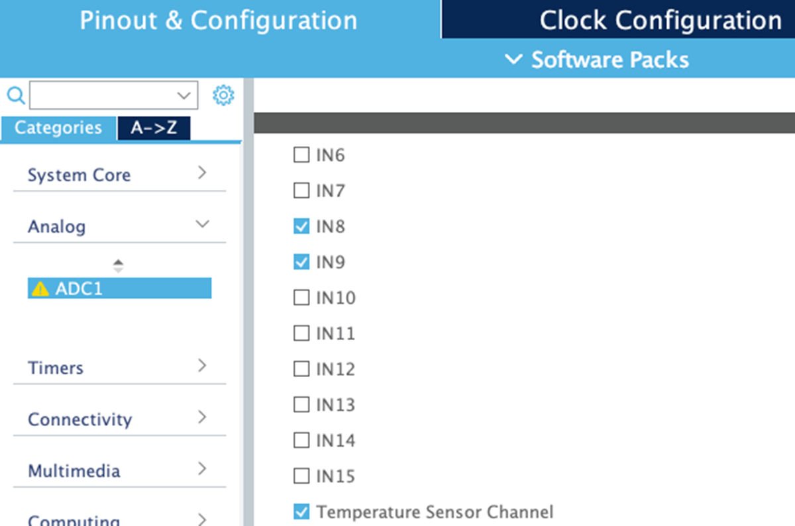

图 12.11：IP Tree 视图窗格允许选择 ADC 的输入通道

启用输入后，我们可以从 Configuration 视图中配置 ADC 外设，如图 12.12 所示。

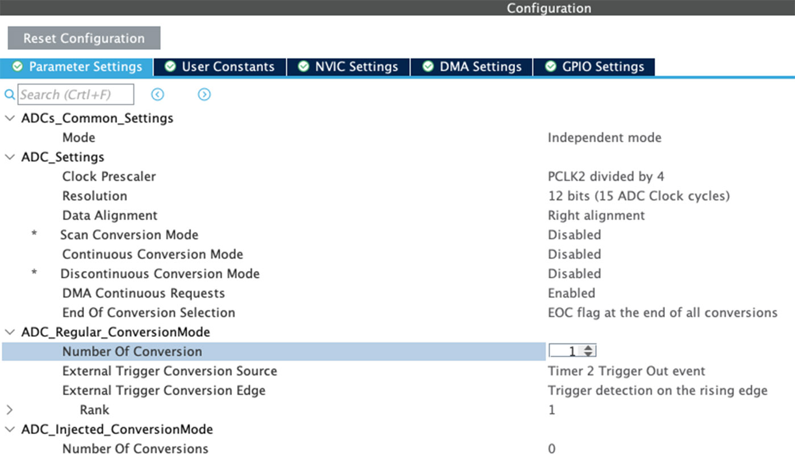

图 12.12：CubeMX 中的 ADC 配置视图

这些字段反映了迄今为止看到的 ADC 配置参数。只有一部分容易让新手用户感到困惑：通道配置的方式。事实上，我们首先需要设置 Number of Conversion 字段来配置使用的通道数量。接下来，（这非常重要）我们需要在配置对话框的其他位置点击，以便 Rank 字段的数量根据指定的通道数量增加

<!-- page: 402 -->

在提供常规组和注入组概念的那些微控制器中，我们可以独立地为每个通道选择采样速度。CubeMX 将自动生成所有初始化代码。


如本章前面所述，CubeF1 HAL 中的 HAL_ADC 模块与其他 HAL 不同。要启动由软件驱动的转换，要求在 ADC 初始化期间指定参数 hadc.Init.ExternalTrigConv = ADC_SOFTWARE_START。CubeMX 反映了这种不同的配置，但理解如何正确配置外设很棘手。因此，要启用软件驱动的转换，必须将 External Trigger Conversion Edge 参数设置为 Trigger detection on the rising edge。这使得 External Trigger Conversion Source 字段可用，并且你必须选择 Software trigger 条目。否则，你将无法执行转换。


