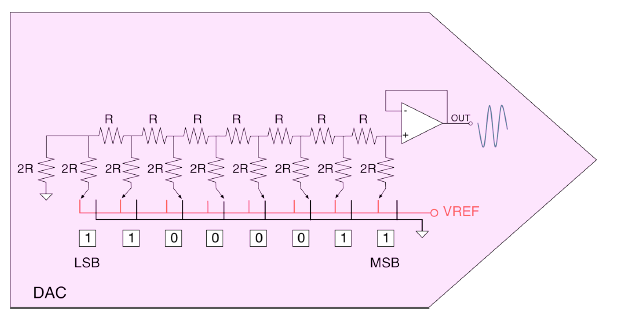
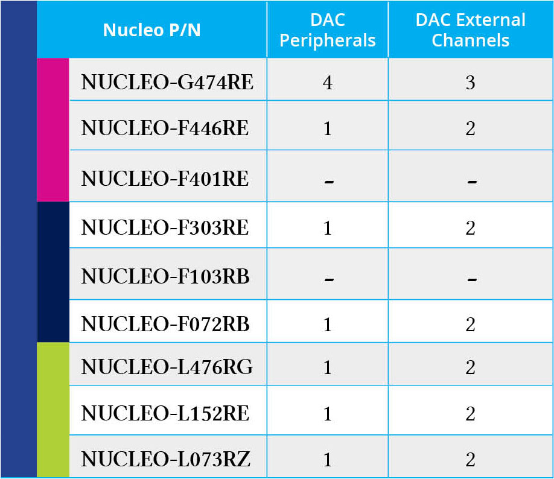
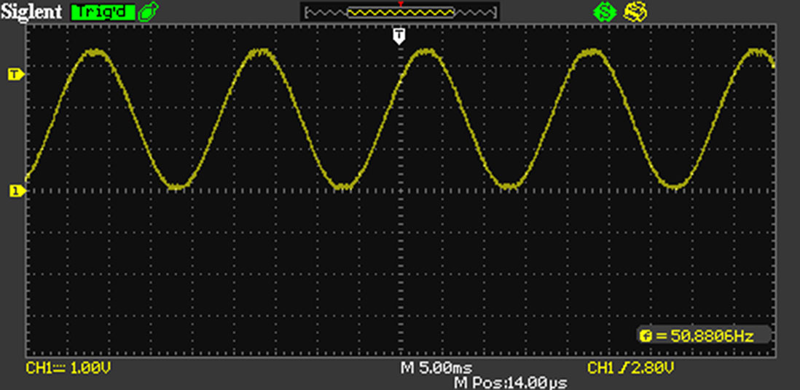
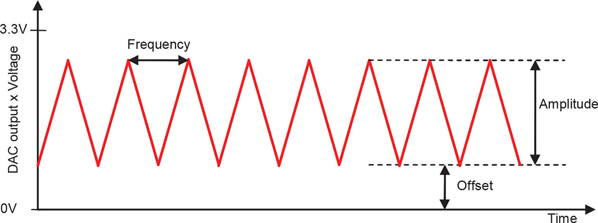
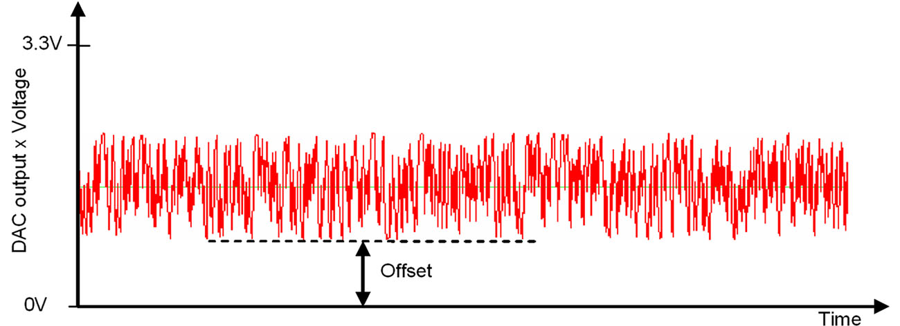

<!-- page: 403 -->

# 13. 数模转换

在上一章中，我们将注意力集中在 ADC 外设上，介绍了这一重要外设在 STM32 微控制器中普遍具备的相关特性。该过程的逆过程由数模转换器（Digital-to-Analog Converter，DAC）实现。

根据所使用的系列和封装，STM32 微控制器通常只提供带有一个或两个专用输出的 DAC。少数 STM32F3 系列型号实现了两个 DAC（第一个具有两个输出，另一个只有一个输出）。一些较新的 STM32G4 系列 MCU 甚至提供多达 5 个独立 DAC 模块，但只有前两个模块具有输出 I/O；其他模块只能向内部外设（如 OPAMP、比较器和 ADC，前提是相应器件支持这些外设）提供信号。

DAC 通道可以配置为 8 位或 12 位模式，两个通道的转换可以独立执行，也可以同时执行。后一种模式在需要生成两个独立但同步的信号时非常有用（例如音频应用）。与 ADC 外设一样，DAC 也可以由专用定时器触发，以指定频率生成模拟信号。

本章简要介绍 DAC 外设最重要的特性；读者仍需深入了解所使用的特定 STM32 微控制器所支持的 DAC 功能。下面先简要解释 DAC 控制器的工作原理。

## 13.1 DAC 外设简介

DAC 将数字量转换为模拟信号，输出信号与提供的参考电压 VREF 成正比（见图 13.1）。DAC 有许多类别，包括脉冲宽度调制型 DAC（PWM）、插值型 DAC、Sigma-Delta DAC 和高速 DAC。我们在第 11 章中分析了如何使用 STM32 定时器生成 PWM 信号，并通过 RC 低通滤波器利用该信号生成输出正弦波。


图 13.1：DAC 的一般结构

<!-- page: 404 -->

STM32 微控制器中可用的 DAC 外设基于通用的 R-2R 电阻梯形网络。电阻梯形网络由重复的电阻单元组成，是一种使用高精度电阻构成的重复网络来实现数模转换的廉价而简单的方法。该网络在参考电压与地之间充当可编程分压器。



图 13.2：R-2R 网络如何用于将数字量转换为模拟信号

图 13.2 展示了一个 8 位 R-2R 电阻梯形网络。DAC 的每一位都由数字逻辑门驱动。理想情况下，这些门在 V = 0（逻辑 0）和 V = VREF（逻辑 1）之间切换输入位。R-2R 网络对这些数字位进行加权，使其对输出电压 VOUT 的贡献不同。根据哪些位被置为 1、哪些位被置为 0，输出电压将在 0 与 VREF 减去最小步长之间取相应的阶梯值（最小步长对应最低有效位为 0 的情况）。

对于具有 N 位、逻辑电平为 0 V/VREF 的 R-2R DAC，给定数值 D 时，输出电压 VOUT 为：

$$
V_{\mathrm{OUT}}=\frac{V_{\mathrm{REF}}\times D}{2^N}\tag{1}
$$

例如，当 N = 12（因此 2^N = 4096）且 VREF = 3.3 V（STM32 MCU 中典型的模拟电源电压）时，VOUT 将在 0 V（VAL = 0 = 00000000₂）与最大值（VAL = 4095 = 11111111₂）之间变化：

$$
V_{\mathrm{OUT}}=\frac{3.3\times4095}{4096}\approx3.29\ \mathrm{V}
$$

步长（对应 VAL = 1）为：

$$
\Delta V_{\mathrm{OUT}}=\frac{3.3\times1}{4096}\approx0.0002\ \mathrm{V}
$$

<!-- page: 405 -->

然而，始终请记住，DAC 输出的精度和稳定性会受到 VDDA 电源域质量和 PCB 布局的严重影响。

在 STM32 微控制器中，DAC 模块的分辨率为 12 位，但也可以配置为 8 位模式。在 12 位模式下，数据可以左对齐或右对齐。根据产品型号和所用封装，DAC 具有两个输出通道，每个通道都有自己的转换器。在双 DAC 通道模式下，当两个通道组合起来进行同步更新时，转换可以独立执行，也可以同时执行。为了获得更高的分辨率，器件还提供输入参考引脚 VREF+（与其他模拟外设共享）。与 ADC 外设一样，DAC 也可以与 DMA 控制器配合，以固定频率生成可变输出电压。这在音频应用中非常有用；当需要以给定载波频率生成模拟信号时，同样适用。正如本章后面将看到的，STM32 DAC 还能够生成噪声波形和三角波形。

最后，STM32 MCU 中实现的 DAC 为每个通道集成了一个输出缓冲器（见图 13.2），可用于降低输出阻抗并直接驱动外部负载，无需额外添加外部运算放大器。每个 DAC 通道的输出缓冲器都可以启用或禁用。

表 13.1 列出了本书所讨论的 9 块 Nucleo 开发板所搭载的 STM32 MCU 中，DAC 外设的确切数量及其相关输出通道数量。



表 13.1：配备 Nucleo 开发板的 STM32 MCU 中 DAC 外设的可用性

## 13.2 HAL_DAC 模块

简要介绍 STM32 微控制器中 DAC 外设提供的最重要功能后，现在可以深入讨论相关的 CubeHAL API。

为了操作 DAC 外设，HAL 定义了 C 结构体 `DAC_HandleTypeDef`，其定义如下：

<!-- page: 406 -->

```c
typedef struct {
    DAC_TypeDef              *Instance;       /* Pointer to DAC descriptor */
    __IO HAL_DAC_StateTypeDef State;          /* DAC communication state */
    HAL_LockTypeDef          Lock;            /* DAC locking object */
    DMA_HandleTypeDef        *DMA_Handle1;    /* Pointer DMA handler for channel 1 */
    DMA_HandleTypeDef        *DMA_Handle2;    /* Pointer DMA handler for channel 2 */
    __IO uint32_t             ErrorCode;      /* DAC Error code */
} DAC_HandleTypeDef;
```

下面分析该结构体中最重要的字段。

- `Instance`：指向要使用的 DAC 外设描述符。例如，`DAC1` 是第一个 DAC 外设的描述符。
- `DMA_Handle{1,2}`：指向配置为在 DMA 模式下执行数模转换的 DMA 句柄。具有两个输出通道的 DAC 有两个独立的 DMA 句柄，分别用于各通道的转换。

如您所见，`DAC_HandleTypeDef` 结构体与前面使用的其他处理器描述符有所不同。它没有专用的 `Init` 参数供 `HAL_DAC_Init()` 函数配置 DAC。这是因为 DAC 的实际配置是在通道级别完成的，需要使用 `DAC_ChannelConfTypeDef` 结构体，其定义如下：

```c
typedef struct {
    uint32_t DAC_Trigger;        /* Specifies the external trigger for the selected
                                    DAC channel */
    uint32_t DAC_OutputBuffer;   /* Specifies whether the DAC channel output buffer
                                    is enabled or disabled */
} DAC_ChannelConfTypeDef;
```

- `DAC_Trigger`：指定用于触发 DAC 转换的源。使用 `HAL_DAC_SetValue()` 手动驱动 DAC 时，可取值 `DAC_TRIGGER_NONE`；在 DMA 模式下驱动 DAC 且没有定时器为转换提供“时钟”时，可取值 `DAC_TRIGGER_SOFTWARE`；`DAC_TRIGGER_Tx_TRGO` 表示由专用定时器驱动转换。
- `DAC_OutputBuffer`：指定是否启用专用输出缓冲器。

要配置 DAC 通道，可以使用以下函数：

```c
HAL_StatusTypeDef HAL_DAC_ConfigChannel(DAC_HandleTypeDef* hdac,
                                        DAC_ChannelConfTypeDef* sConfig,
                                        uint32_t Channel);
```

<!-- page: 407 -->

该函数接受指向 `DAC_HandleTypeDef` 结构体实例的指针、指向前述 `DAC_ChannelConfTypeDef` 结构体实例的指针，以及用于配置通道的宏：第一个通道使用 `DAC_CHANNEL_1`，第二个通道使用 `DAC_CHANNEL_2`。

在一些较新的 STM32 微控制器（如 STM32L476 或 STM32G474）中，DAC 还提供额外的低功耗功能。例如，可以启用采样保持电路，使 DAC 断电后仍能保持输出电压稳定。这在电池供电的应用中非常有用。在这些 MCU 中，`DAC_ChannelConfTypeDef` 结构体的定义会有所不同，以便配置这些额外功能。请参阅所使用 MCU 的 HAL 源代码。

### 13.2.1 手动驱动 DAC

DAC 外设既可以手动驱动，也可以使用 DMA 和触发源（例如专用定时器）驱动。下面分析第一种方法，它适用于不需要高频转换的情况。

第一步是调用以下函数启动外设：

```c
HAL_StatusTypeDef HAL_DAC_Start(DAC_HandleTypeDef* hdac, uint32_t Channel);
```

该函数接受指向 `DAC_HandleTypeDef` 结构体实例的指针，以及要激活的通道（`DAC_CHANNEL_1` 或 `DAC_CHANNEL_2`）。

启用 DAC 通道后，可以调用以下函数执行转换：

```c
HAL_StatusTypeDef HAL_DAC_SetValue(DAC_HandleTypeDef* hdac, uint32_t Channel,
                                    uint32_t Alignment, uint32_t Data);
```

其中，`Alignment` 参数可以取值 `DAC_ALIGN_8B_R`，以 8 位模式驱动 DAC；也可以取值 `DAC_ALIGN_12B_L` 或 `DAC_ALIGN_12B_R`，以 12 位模式驱动 DAC，分别传递左对齐或右对齐的输出值。

以下示例面向 Nucleo-F072RB，展示如何手动驱动 DAC 外设。该示例利用了这样一个事实：在大多数提供 DAC 外设的 Nucleo 开发板上，其中一个输出通道对应 PA5，而 PA5 连接到 LD2 LED。因此，可以使用 DAC 使 LD2 淡入和淡出。

<!-- page: 408 -->

**文件名：** `Core/Src/main-ex1.c`

```c
DAC_HandleTypeDef hdac;

/* Private function prototypes -----------------------------------------------*/
static void MX_DAC_Init(void);

int main(void) {
    HAL_Init();
    Nucleo_BSP_Init();

    /* Initialize all configured peripherals */
    MX_DAC_Init();

    HAL_DAC_Init(&hdac);
    HAL_DAC_Start(&hdac, DAC_CHANNEL_2);

    while(1) {
        int i = 2000;
        while(i < 4000) {
            HAL_DAC_SetValue(&hdac, DAC_CHANNEL_2, DAC_ALIGN_12B_R, i);
            HAL_Delay(1);
            i+=4;
        }

        while(i > 2000) {
            HAL_DAC_SetValue(&hdac, DAC_CHANNEL_2, DAC_ALIGN_12B_R, i);
            HAL_Delay(1);
            i-=4;
        }
    }
}

/* DAC init function */
void MX_DAC_Init(void) {
    DAC_ChannelConfTypeDef sConfig;
    GPIO_InitTypeDef GPIO_InitStruct;

    __HAL_RCC_DAC1_CLK_ENABLE();

    /* DAC Initialization */
    hdac.Instance = DAC;
    HAL_DAC_Init(&hdac);

    /**DAC channel OUT2 config */
    sConfig.DAC_Trigger = DAC_TRIGGER_NONE;
    sConfig.DAC_OutputBuffer = DAC_OUTPUTBUFFER_ENABLE;
    HAL_DAC_ConfigChannel(&hdac, &sConfig, DAC_CHANNEL_2);

    /* DAC GPIO Configuration
       PA5 ------> DAC_OUT2
    */
    GPIO_InitStruct.Pin = GPIO_PIN_5;
    GPIO_InitStruct.Mode = GPIO_MODE_ANALOG;
    GPIO_InitStruct.Pull = GPIO_NOPULL;
    HAL_GPIO_Init(GPIOA, &GPIO_InitStruct);
}
```

<!-- page: 409 -->

代码很直接。第 [40:62] 行配置 DAC，使通道 2 用作输出通道。因此，PA5 被配置为模拟输出（第 [58:61] 行）。请注意，由于这里将手动驱动 DAC 转换，通道触发源被设置为 `DAC_TRIGGER_NONE`（第 51 行）。最后，`main()` 只是一个无限循环，不断增加和减小输出电压，从而使 LD2 淡入和淡出。

### 13.2.2 使用定时器以 DMA 模式驱动 DAC

DAC 外设最常见的用途是以给定频率生成模拟波形（例如音频应用中的波形）。在这种情况下，使用 DMA 和定时器触发转换，是驱动 DAC 的最佳方式。

要启动 DAC 并在 DMA 模式下执行传输，需要配置相应的 DMA 通道/流对，并使用以下函数：

```c
HAL_StatusTypeDef HAL_DAC_Start_DMA(DAC_HandleTypeDef* hdac, uint32_t Channel,
                                    uint32_t* pData, uint32_t Length,
                                    uint32_t Alignment);
```

该函数接受指向 `DAC_HandleTypeDef` 结构体实例的指针、要激活的通道（`DAC_CHANNEL_1` 或 `DAC_CHANNEL_2`）、要在 DMA 模式下传输的数值数组指针、数组长度，以及内存中输出值的对齐方式。对齐方式可以取 `DAC_ALIGN_8B_R`，以 8 位模式驱动 DAC；也可以取 `DAC_ALIGN_12B_L` 或 `DAC_ALIGN_12B_R`，以 12 位模式驱动 DAC，分别对应左对齐或右对齐的输出值。

例如，可以轻松使用 DAC 生成正弦波。第 11 章分析了如何使用定时器的 PWM 模式生成正弦波。如果 MCU 提供 DAC，同样的操作可以更容易地完成。此外，根据具体应用，启用输出缓冲器后可以完全避免使用外部无源元件。

要生成以给定频率运行的正弦波，必须将一个完整周期划分为若干步。通常，超过 200 步就能较好地近似输出波形。这意味着，如果要生成 50 Hz 的正弦波，就需要以如下频率执行转换：

$$
f_{\mathrm{sinewave}}=50\,\mathrm{Hz}\times200=10\,\mathrm{kHz}\tag{2}
$$

<!-- page: 410 -->

由于 STM32 DAC 的分辨率为 12 位，需要使用以下公式将对应最大输出电压的值 4095 分配到 200 个步长中：

$$
DAC_{\mathrm{Output}}=\left(\sin\left(x\cdot\frac{2\pi}{n_s}\right)+1\right)\left(\frac{4096}{2}\right)\tag{3}
$$

其中，n_s 是采样数，在本例中为 200。

使用上述公式，可以生成一个初始化向量，在 DMA 模式下馈送 DAC。与 ADC 外设一样，可以使用配置为以公式 [2] 所示频率触发 TRGO 线的定时器。下面的示例展示如何在 STM32F072 MCU 中使用 DAC 生成 50 Hz 正弦波。

**文件名：** `Core/Src/main-ex2.c`

```c
#define PI     3.14159
#define SAMPLES 200

/* Private variables ---------------------------------------------------------*/
DAC_HandleTypeDef hdac;
TIM_HandleTypeDef htim6;
DMA_HandleTypeDef hdma_dac_ch1;

/* Private function prototypes -----------------------------------------------*/
static void MX_DAC_Init(void);
static void MX_TIM6_Init(void);

int main(void) {
    uint16_t IV[SAMPLES], value;

    HAL_Init();
    Nucleo_BSP_Init();

    /* Initialize all configured peripherals */
    MX_TIM6_Init();
    MX_DAC_Init();

    for (uint16_t i = 0; i < SAMPLES; i ++) {
        value = (uint16_t) rint((sinf((( 2*PI)/SAMPLES)*i)+1)*2048);
        IV[i] = value < 4096 ? value : 4095;
    }

    HAL_DAC_Init(&hdac);
    HAL_TIM_Base_Start(&htim6);
    HAL_DAC_Start_DMA(&hdac, DAC_CHANNEL_1, (uint32_t*)IV, SAMPLES, DAC_ALIGN_12B_R);

    while(1);
}
```

<!-- page: 411 -->

```c
/* DAC init function */
void MX_DAC_Init(void) {
    DAC_ChannelConfTypeDef sConfig;
    GPIO_InitTypeDef GPIO_InitStruct;

    __HAL_RCC_DAC1_CLK_ENABLE();

    /**DAC Initialization */
    hdac.Instance = DAC;
    HAL_DAC_Init(&hdac);

    /**DAC channel OUT1 config */
    sConfig.DAC_Trigger = DAC_TRIGGER_T6_TRGO;
    sConfig.DAC_OutputBuffer = DAC_OUTPUTBUFFER_ENABLE;
    HAL_DAC_ConfigChannel(&hdac, &sConfig, DAC_CHANNEL_1);

    /**DAC GPIO Configuration
       PA4 ------> DAC_OUT1
    */
    GPIO_InitStruct.Pin = GPIO_PIN_4;
    GPIO_InitStruct.Mode = GPIO_MODE_ANALOG;
    GPIO_InitStruct.Pull = GPIO_NOPULL;
    HAL_GPIO_Init(GPIOA, &GPIO_InitStruct);

    /* Peripheral DMA init */
    hdma_dac_ch1.Instance = DMA1_Channel3;
    hdma_dac_ch1.Init.Direction = DMA_MEMORY_TO_PERIPH;
    hdma_dac_ch1.Init.PeriphInc = DMA_PINC_DISABLE;
    hdma_dac_ch1.Init.MemInc = DMA_MINC_ENABLE;
    hdma_dac_ch1.Init.PeriphDataAlignment = DMA_PDATAALIGN_HALFWORD;
    hdma_dac_ch1.Init.MemDataAlignment = DMA_MDATAALIGN_HALFWORD;
    hdma_dac_ch1.Init.Mode = DMA_CIRCULAR;
    hdma_dac_ch1.Init.Priority = DMA_PRIORITY_LOW;
    HAL_DMA_Init(&hdma_dac_ch1);

    __HAL_LINKDMA(&hdac,DMA_Handle1,hdma_dac_ch1);
}

/* TIM6 init function */
void MX_TIM6_Init(void) {
    TIM_MasterConfigTypeDef sMasterConfig;

    __HAL_RCC_TIM6_CLK_ENABLE();

    htim6.Instance = TIM6;
```

<!-- page: 412 -->

```c
    htim6.Init.Prescaler = 0;
    htim6.Init.CounterMode = TIM_COUNTERMODE_UP;
    htim6.Init.Period = 4799;
    HAL_TIM_Base_Init(&htim6);

    sMasterConfig.MasterOutputTrigger = TIM_TRGO_UPDATE;
    sMasterConfig.MasterSlaveMode = TIM_MASTERSLAVEMODE_DISABLE;
    HAL_TIMEx_MasterConfigSynchronization(&htim6, &sMasterConfig);
}
```

函数 `MX_DAC_Init()` 配置 DAC，使第一个通道在 TIM6 的 TRGO 线生成时执行转换。此外，DMA 也进行了相应配置，并设置为循环模式，以便持续将初始化向量的内容传输到 DAC 数据寄存器。函数 `MX_TIM6_Init()` 设置 TIM6，使其以 10 kHz 的频率溢出，从而触发内部连接到 DAC 的 TRGO 线。最后，第 [29:32] 行根据公式 [3] 生成初始化向量。TIM6 启动后，DAC 以 DMA 模式启动，并使用该向量为 DAC 提供数据。




图 13.3：使用 DAC 外设生成的输出正弦波

将示波器探头连接到 Nucleo 开发板的 PA4 引脚，即可看到 DAC 生成的输出正弦波（见图 13.3）。

如果希望知道 DMA 模式下的一次 DAC 转换何时完成，可以实现以下回调函数：

```c
void HAL_DACEx_ConvCpltCallbackChX(DAC_HandleTypeDef* hdac);
```

该函数由 `HAL_DMA_IRQHandler()` 例程自动调用；该例程由与 DAC 外设关联的 DMA 通道 ISR 调用。函数名末尾的 X 必须根据所使用的通道替换为 1 或 2。

> **仔细阅读**
>
> 请注意，在 STM32G4 系列中，DAC 外设寄存器必须按字（32 位）访问。因此，Nucleo-G474RE 开发板用户会发现，`IV` 数组和 `value` 变量被定义为 `uint32_t`。

<!-- page: 413 -->

### 13.2.3 三角波生成

在许多音频应用中，生成三角波非常有用。虽然完全可以使用前面介绍的 DMA 技术生成三角波，但 STM32 DAC 允许在硬件层面生成三角波形。



图 13.4：使用 DAC 生成的三角波

图 13.4 展示了定义三角波形状的三个参数。下面分别进行分析。

- **幅度（Amplitude）**：取值范围为 0 到 0xFFF，决定波形的最大高度。它与偏移量（offset）直接相关，后文会看到这一点。幅度不能任意取值，而必须属于固定值列表；完整的可接受值列表请查阅 HAL 源代码。
- **偏移量（Offset）**：最小输出值，代表波形的最低点。偏移量与幅度之和不能超过最大值 0xFFF。因此，波形的最大高度将由 `amplitude - offset` 的差值决定。
- **频率（Frequency）**：波形的频率，由连接到 DAC 的定时器更新频率决定。定时器更新频率由下面的公式 [4] 决定。例如，要生成幅度为 2047、频率为 50 Hz 的三角波，运行频率为 48 MHz 的定时器的预分频器需要配置为 234。

$$
f_{\mathrm{UEV}}=2\cdot\mathrm{amplitude}\cdot f_{\mathrm{wave}}\tag{4}
$$

要生成三角波形，可以使用以下函数：

```c
HAL_StatusTypeDef HAL_DACEx_TriangleWaveGenerate(DAC_HandleTypeDef* hdac,
                                                  uint32_t Channel,
                                                  uint32_t Amplitude);
```

该函数接受要使用的 DAC 通道和所需的幅度。波形偏移量则使用 `HAL_DAC_SetValue()` 例程配置。生成三角波的完整步骤如下：

<!-- page: 414 -->

- 配置用于生成波形的 DAC 通道。
- 配置与 DAC 关联的定时器，并根据公式 [4] 配置其预分频器。
- 使用 `HAL_DAC_Start()` 函数启动 DAC。
- 使用 `HAL_DAC_SetValue()` 例程配置所需的偏移量。
- 调用 `HAL_DACEx_TriangleWaveGenerate()` 函数启动三角波生成。

### 13.2.4 噪声波生成

STM32 DAC 还能够使用伪随机数生成器生成噪声波形（见图 13.5）。这在某些应用领域非常有用，例如音频应用和射频（RF）系统；此外，它还可以用于提高 ADC 外设[^1]的精度。

要生成可变幅度的伪噪声，DAC 中提供了一个 LFSR（线性反馈移位寄存器）。该寄存器预加载值 0xAAA，可以被部分或完全屏蔽。随后，该值与 DAC 数据寄存器的内容相加（不发生溢出），所得结果用作输出值。



图 13.5：使用 DAC 生成的噪声波形

要生成噪声波形，可以使用以下 HAL 例程：

```c
HAL_StatusTypeDef HAL_DACEx_NoiseWaveGenerate(DAC_HandleTypeDef* hdac,
                                               uint32_t Channel,
                                               uint32_t Amplitude);
```

该函数接受用于生成波形的通道和幅度值；幅度值会与 LFSR 的内容相加，以生成伪随机波形。与三角波生成类似，可以使用定时器触发转换，这意味着波形频率由定时器的溢出频率决定。

ST 提供了专门讨论这一主题的 [AN2668](https://bit.ly/25lJoqx)。
