<!-- page: 415 -->

# 14. I²C

如今，即使是最简单的 PCB 也包含两个或更多数字集成电路（IC），除了主微控制器外，这些 IC 被指定用于特定任务。ADC 和 DAC、EEPROM 存储器、传感器、逻辑 I/O 端口、RTC 时钟、RF 电路以及专用 LCD 控制器，仅仅是那些专门执行单一任务的 IC 的一小部分列表。现代数字电子设计的关键在于正确选择（并编程）功能强大、专用且通常廉价的 IC，以便在最终的 PCB 上进行组合。

根据这些 IC 的特性，它们通常被设计为按照定义明确的通信协议与可编程设备（通常是微控制器，但不限于此）交换消息和数据。板内通信最常用的两种协议是 I²C 和 SPI，两者都起源于 20 世纪 80 年代初，但在电子行业中仍然广泛使用，尤其是在通信速度不是严格要求且仅限于 PCB 边界内的情况下¹。

几乎所有 STM32 微控制器都提供能够使用 I²C 和 SPI 协议进行通信的专用硬件外设。本章是专门介绍此主题的两章中的第一章，它简要介绍了 I²C 协议以及用于编程该外设的相关 CubeHAL API。如果对深入了解 I²C 协议感兴趣，NXP 的 UM10204² 提供了完整且最新的规范。

## 14.1 I²C 规范简介

集成电路间总线（Inter-Integrated Circuit，简称 I²C - 发音为 I-squared-C 或极少见的 I-two-C）是由飞利浦（现为 NXP Semiconductors）半导体部门于 1982 年开发的硬件规范和协议。它是一种多从机³、半双工、单端、面向 8 位的串行总线规范，仅使用两根线将一定数量的从设备互连到主机。直到 2006 年 10 月，基于 I²C 的设备开发需要向飞利浦支付版税，但这一限制已被取代⁴。

¹虽然存在使用 I²C 和 SPI 协议通过外部导线（通常长度约为一米）交换消息的应用，但这些规范并非旨在保证在潜在嘈杂介质上通信的鲁棒性。因此，其应用仅限于单个 PCB。 ²https://bit.ly/3E18iPF ³I²C 也可以是多主机协议，意味着同一总线上可以存在两个或更多主机，但一次只能有一个主机获得总线控制权，并且由主机负责仲裁对总线的访问。在实践中，在嵌入式系统中很少使用 I²C 的多主机模式。本书不涵盖多主机模式。 ⁴如果您希望为您的设备获得官方授权的 I²C 地址池，您仍然需要向 NXP 支付版税，但我认为本书的读者不属于这种情况。

<!-- page: 416 -->

<p align="center">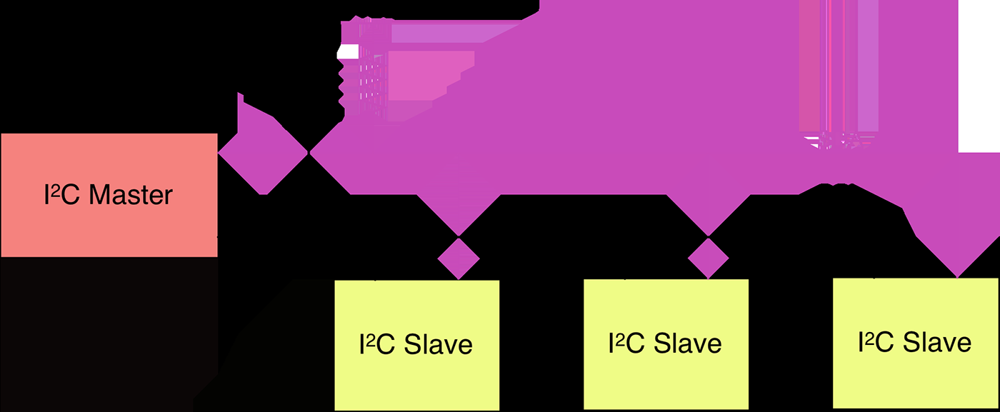</p>

<p align="center">图 14.1：I²C 总线的图形表示</p>

构成 I²C 总线的两根线是双向开漏线，分别称为串行数据线（SDA）和串行时钟线（SCL）（见图 14.1）。I²C 协议规定这两根线需要通过电阻上拉。这些电阻的取值与总线电容和传输速度直接相关。德州仪器（Texas Instruments）的这份文档⁵提供了计算电阻值所需的数学公式。然而，使用接近 4.7 kΩ 的电阻值是非常常见的。


像 STM32 这样的现代微控制器允许将 GPIO 线配置为开漏上拉，从而启用内部上拉电阻。在网上经常可以看到这样的说法：你可以使用内部上拉电阻来拉高 I²C 线，从而避免使用专用电阻。然而，在所有 STM32 设备中，内部上拉电阻的值接近（甚至高于）20 kΩ，以避免不必要的电源泄漏。如此高的阻值会增加总线达到 HIGH 状态所需的时间，从而降低传输速度。如果速度对你的应用不重要，并且（非常重要）你在 MCU 和 IC 之间没有使用长走线（小于 2 cm），那么对于许多应用来说，使用内部上拉电阻是可以的。但是，如果你在 PCB 上有足够的空间放置几个电阻，则强烈建议使用外部专用电阻。

<p align="center"></p>

> **仔细阅读**
>
> STM32F1 微控制器不提供上拉 SDA 和 SCL 线的功能。它们的 GPIO 必须配置为开漏，并且需要两个外部电阻来上拉 I²C 线。

<p align="center"></p>

由于 I²C 是基于仅两根线的协议，因此应该有一种方法来寻址同一总线上的单个从设备。为此，I²C 定义每个从设备为给定总线提供唯一的从机

⁵https://bit.ly/29URjoy

<!-- page: 417 -->

地址⁶。地址可以是 7 位或 10 位宽（这种选项相当少见）。

I²C 总线速度由协议规范明确定义，尽管发现能够以自定义（且往往模糊）速度通信的芯片并不罕见。常见的 I²C 总线速度是 100 kHz⁷，也称为标准模式，以及 400 kHz，称为快速模式。标准的近期修订版可以运行在更快的速度（1 MHz，称为快速模式增强版（fast mode plus）；3.4 MHz，称为高速模式；以及 5 MHz，称为超快速模式）。

I²C 协议足够简单，以至于如果 MCU 没有提供专用 I²C 外设，它可以“模拟”一个专用 I²C 外设：这种技术称为位操作（bit-banging），常用于低成本 8 位架构中，这些架构有时不提供专用 I²C 接口以减少引脚数量和/或 IC 成本。

### 14.1.1 I²C 协议

在 I²C 协议中，所有事务（transaction）始终由主设备（master）发起并完成。这是该通信协议中在编程（尤其是调试）I²C 设备时需要牢记的少数规则之一。通过 I²C 总线交换的所有消息都被拆分为两种类型的帧：地址帧，其中主设备指示消息发送的目标从设备（slave）；以及一个或多个数据帧，这些是主设备与从设备之间传递的 8 位数据消息。数据在 SCL 线变低后放置在 SDA 线上，并在 SCL 线变高后被采样。时钟边沿与数据读写之间的时间由总线上的设备定义，并且因芯片而异。

如前所述，SDA 和 SCL 均为双向线，通过恒流源或上拉电阻连接到正电源电压（参见图 14.1）。当总线空闲时，两条线均为高电平。连接到总线的设备的输出级必须具有开漏（open-drain）或开集（open-collector）特性，以执行线与（wired-AND）功能。总线电容限制了连接到总线的接口数量。对于单主设备应用，如果总线上没有会拉伸时钟的设备（稍后详述），主设备的 SCL 输出可以采用推挽（push-pull）驱动器设计。

我们现在将分析 I²C 通信的基本步骤。

<p align="center">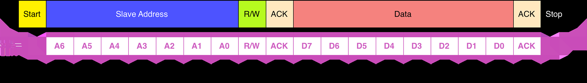</p>

<p align="center">图 14.2：基本 I²C 消息的结构</p>

⁶这构成了 I²C 协议最实际的限制之一。事实上，IC 制造商很少分配足够的引脚来配置在特定板上使用的完整从设备地址（如果运气好，最多只有三个引脚专门用于此功能，仅提供八种从设备地址选择）。在设计包含多个 I²C 设备的电路板时，请注意它们的地址，如果发生冲突，则需要使用两个或更多 I²C 外设来驱动它们。⁷存在仅以较低速度通信的 IC，但现在已不常见。

<!-- page: 418 -->

#### 14.1.1.1 START 和 STOP 条件

所有事务以 START 开始，并以 STOP 结束（参见图 14.2）。当 SCL 为高电平时，SDA 线上从高到低的跳变定义 START 条件。当 SCL 为高电平时，SDA 线上从低到高的跳变定义 STOP 条件。

START 和 STOP 条件始终由主设备生成。在 START 条件之后，总线被视为忙碌。在 STOP 条件之后的一段时间，总线再次被视为空闲。如果生成重复 START（也称为 RESTART 条件）而不是 STOP 条件，总线将保持忙碌（稍后详述）。在这种情况下，START 和 RESTART 条件在功能上是相同的。

#### 14.1.1.2 字节格式

在 SDA 线上传输的每个传输单元（word）必须为 8 位，地址帧也是如此，我们稍后会看到。每次传输可以传输的字节数没有限制。每个字节后必须跟随一个应答（Acknowledge, ACK）位。数据以最高有效位（Most Significant Bit, MSB）优先传输（参见图 14.2）。如果从设备在执行其他功能（例如服务内部中断）之前无法接收或传输另一个完整字节的数据，它可以保持时钟线 SCL 为低电平，以强制主设备进入等待状态。当从设备准备好接收另一个字节的数据并释放时钟线 SCL 时，数据传输继续。

#### 14.1.1.3 地址帧

地址帧始终位于任何新通信序列的最前面。对于 7 位地址，地址以最高有效位（MSB）优先移出，随后是一个 R/W 位，指示这是读（1）还是写（0）操作（参见图 14.2）。

<p align="center">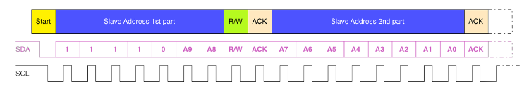</p>

<p align="center">图 14.3：使用 10 位寻址时的消息结构</p>

在 10 位寻址系统（参见图 14.3）中，需要两个帧来传输从设备地址。第一个帧由代码 1111 0XXD2 组成，其中 XX 是 10 位从设备地址的两个最高有效位，D 是如上所述的 R/W 位。第一个帧的 ACK 位将由所有匹配地址前两位的从设备置位。与正常的 7 位传输一样，立即开始另一次传输，该传输包含地址的位 [7:0]。此时，被寻址的从设备应响应一个 ACK 位。如果没有，故障模式与 7 位系统相同。

请注意，10 位地址设备可以与 7 位地址设备共存，因为地址的前导部分 11110 不是任何有效 7 位地址的一部分。

<!-- page: 419 -->

#### 14.1.1.4 应答 (ACK) 和非应答 (NACK)

ACK 发生在每个字节之后。ACK 位允许接收方⁸向发送方⁸信号该字节已成功接收，并且可以发送另一个字节。主设备生成 SCL 线上的所有时钟脉冲，包括 ACK 的第九个时钟脉冲。

ACK 信号定义如下：发送方在应答时钟脉冲期间释放 SDA 线，以便接收方可以将 SDA 线拉低，并且在该时钟脉冲的高电平期间保持稳定的低电平。如果 SDA 在此第九个时钟脉冲期间保持高电平，则定义为非应答（Not Acknowledge, NACK）信号。主设备随后可以生成 STOP 条件以中止传输，或生成 RESTART 条件以开始新的传输。导致生成 NACK 的五个条件如下：

1. 总线上没有具有所传输地址的接收方，因此没有设备响应应答。
2. 接收方无法接收或传输，因为它正在执行某些实时功能，尚未准备好与主设备开始通信。
3. 在传输过程中，接收方接收到它不理解的数据或命令。
4. 在传输过程中，接收方无法再接收任何数据字节。
5. 主设备作为接收方时，必须向从设备发送方指示传输结束。


ACK/NACK 位的有效性源于 I²C 协议的开漏特性。开漏意味着参与事务的主设备和从设备都可以将相应的信号线拉低，但不能驱动其为高电平。如果发送方和接收方之一释放了一条线，而另一方未将其拉低，则该线会自动被相应的电阻拉高。I²C 协议的开漏特性还确保了不会出现总线竞争，即一个设备试图将线驱动为高电平，而另一个设备试图将其拉低，从而消除了驱动器的潜在损坏或系统中过大的功率耗散。

#### 14.1.1.5 数据帧

在地址帧发送完毕后，数据即可开始传输。主设备（Master）只需以固定间隔继续在 SCL 上产生时钟脉冲，而数据则由主设备或从设备（Slave）放置在 SDA 线上，具体取决于 R/W 位指示的是读操作还是写操作。通常，第一个或前两个字节包含要写入/读取的从设备寄存器地址。例如，对于 I²C EEPROM，地址帧之后的前两个字节代表参与此次事务的内存位置地址。根据 R/W 位，后续字节由主设备填充（如果 R/W 位为 1）或由从设备填充（如果 R/W 位为 0）。数据帧的数量是任意的，大多数从设备会

⁸请注意，这里我们泛指接收器和发送器，因为 ACK/NACK 位可以由主设备和从设备两者设置。

<!-- page: 420 -->

自动递增内部寄存器，这意味着后续的读取或写入将来自下一个顺序的寄存器。这种模式也被称为顺序模式或突发模式（参见图 14.4），它是一种提高传输速度的方式。

<p align="center">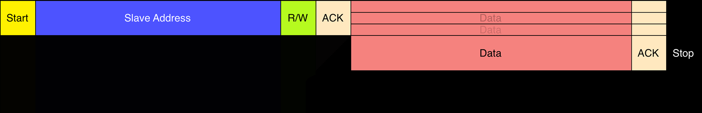</p>

<p align="center">图 14.4：突发模式下的传输，其中在一次事务中交换多个字节</p>

#### 14.1.1.6 组合事务

I²C 协议本质上具有简单的通信模式：

- 主设备在总线上发送参与事务的从设备地址；
- R/W 位（从设备地址字节的最低有效位）确定数据流向（从主设备到从设备 - W - 或从从设备到主设备 - R）；
- 根据传输方向，由两个对等体之一发送若干字节，每个字节之间穿插一个 ACK 位，直到发生 STOP 条件为止。

这种通信方案存在一个巨大的陷阱：如果我们想向从设备询问特定信息，需要使用两个独立的事务。让我们考虑这个例子。假设我们有一个 I²C EEPROM。通常，这类设备有多个可寻址的内存位置（一个 64Kbits 的 EEPROM 的可寻址范围是 0 - 0x1FFF⁹）。要检索某个内存位置的内容，主设备应执行以下步骤：

- 以写模式启动事务（从设备地址的最后一位设为 0），通过在 I²C 总线上发送从设备地址，使 EEPROM 开始采样总线上的消息；
- 发送两个字节，代表我们要读取的内存位置；
- 通过发送 STOP 条件结束事务；
- 以读模式启动新事务（从设备地址的最后一位设为 1），通过在 I²C 总线上发送从设备地址；
- 读取从设备发送的 n 个字节（通常在随机模式下读取内存时为一个字节，在顺序模式下读取时为一个以上字节），然后通过 STOP 条件结束事务。

⁹这些值源于 64Kbits 等于 65536 位，但每个内存位置宽度为 8 位，因此 65536/8 = 8192 = 0x2000。由于内存位置从 0 开始，因此最后一个位置的地址为 0x1FFF。

<!-- page: 421 -->

<p align="center">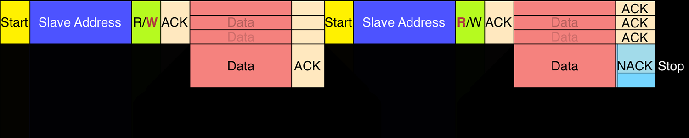</p>

<p align="center">图 14.5：组合事务的结构</p>

为了支持这种常见的通信方案，I²C 协议定义了组合事务，即在传输若干字节后，数据流向发生反转（通常是从从设备到主设备，或反之）。图 14.5 示意了这种与从设备通信的方式。主设备以写模式开始发送从设备地址（注意图 14.5 中红色加粗的 W），然后发送我们要读取的寄存器地址。接着发送一个新的 START 条件，而不终止事务：这个额外的 START 条件也被称为重复 START 条件（或 RESTART）。主设备再次发送从设备地址，但这次事务以读模式启动（注意图 14.5 中加粗的 R）。从设备现在传输所需寄存器的内容，主设备确认发送的每个字节。主设备通过发出 NACK（这一点很重要，我们稍后会看到）和 STOP 条件来结束事务。

#### 14.1.1.7 时钟拉伸

有时，主设备的数据速率会超过从设备提供该数据的能力。这是因为数据尚未就绪（例如，从设备尚未完成模数转换），或者是因为之前的操作尚未完成（例如，EEPROM 尚未完成对非易失性内存的写入，需要在处理其他请求之前先完成该操作）。

在这种情况下，一些从设备会执行所谓的时钟拉伸（Clock Stretching）。在时钟拉伸中，从设备通过将 SCL 线保持为低电平（LOW）来暂停事务。直到该线再次被释放为高电平（HIGH），事务才能继续。时钟拉伸是可选的，大多数从设备不包含 SCL 驱动器，因此无法拉伸时钟（主要是为了简化 I²C 接口的硬件布局）。正如我们稍后将发现的，配置为 I²C 从设备模式的 STM32 MCU 可以选择性地实现时钟拉伸模式。

### 14.1.2 STM32 微控制器中 I²C 外设的可用性

根据所使用的系列类型和封装，STM32 微控制器最多可提供四个独立的 I²C 外设。表 14.1 总结了本书中考虑的九块 Nucleo 开发板所搭载的 STM32 微控制器中 I²C 外设的可用性情况。

<!-- page: 422 -->

<p align="center">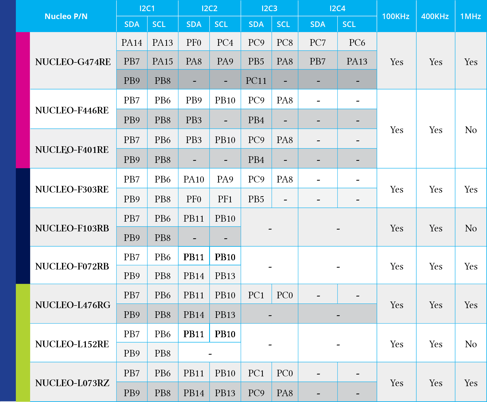</p>

表 14.1：九块 Nucleo 开发板所搭载微控制器中 I²C 外设的实际可用性

对于每一个 I²C 外设和给定的 STM32 微控制器，表 14.1 显示了 SDA 和 SCL 线对应的引脚。此外，较深色的行显示了在电路板布局期间可以使用的备用引脚。例如，对于 STM32F401RE 微控制器，我们可以看到 I²C1 外设映射到 PB7 和 PB6，但 PB9 和 PB8 也可以用作备用引脚。请注意，I²C1 外设在所有采用 LQFP-64 封装的 STM32 微控制器中使用相同的 I/O 引脚。这是 STM32 微控制器提供的引脚对引脚兼容性的一个关键示例。

我们现在准备看看如何使用 CubeHAL API 来编程此外设。

## 14.2 HAL_I2C 模块

为了编程 I²C 外设，CubeHAL 定义了 C 结构体 I2C_HandleTypeDef，其定义方式如下：

<!-- page: 423 -->

```c
typedef struct {
    I2C_TypeDef *Instance; /* I²C registers base address */
    I2C_InitTypeDef Init; /* I²C communication parameters */
    uint8_t *pBuffPtr; /* Pointer to I²C transfer buffer */
    uint16_t XferSize; /* I²C transfer size */
    __IO uint16_t XferCount; /* I²C transfer counter */
    DMA_HandleTypeDef *hdmatx; /* I²C Tx DMA handle parameters */
    DMA_HandleTypeDef *hdmarx; /* I²C Rx DMA handle parameters */
    HAL_LockTypeDef Lock; /* I²C locking object */
    __IO HAL_I2C_StateTypeDef State; /* I²C communication state */
    __IO HAL_I2C_ModeTypeDef Mode; /* I²C communication mode */
    __IO uint32_t ErrorCode; /* I²C Error code */
} I2C_HandleTypeDef;
```

让我们分析这个 C 结构体中最重要的字段。

- Instance：指向我们要使用的 I²C 外设描述符的指针。例如，I2C1 是第一个 I²C 外设的描述符。
- Init：C 结构体 I2C_InitTypeDef 的一个实例，用于配置外设。我们稍后会更深入地研究它。
- pBuffPtr：指向内部缓冲区的指针，该缓冲区用于临时存储传输到 I²C 外设和从 I²C 外设传输的数据。当 I²C 以中断模式工作时使用此缓冲区，并且不应从用户代码中修改它。
- hdmatx, hdmarx：指向 DMA_HandleTypeDef 结构体实例的指针，当 I²C 外设以 DMA 模式工作时使用。

I²C 外设的设置通过使用 C 结构体 I2C_InitTypeDef 的一个实例来完成，其定义方式如下：

```c
typedef struct {
    uint32_t ClockSpeed; /* Specifies the clock frequency */
    uint32_t DutyCycle; /* Specifies the I²C fast mode duty cycle. */
    uint32_t OwnAddress1; /* Specifies the first device own address. */
    uint32_t OwnAddress2; /* Specifies the second device own address if dual addressing
                             mode is selected */
    uint32_t AddressingMode; /* Specifies if 7-bit or 10-bit addressing mode is selected. */
    uint32_t DualAddressMode; /* Specifies if dual addressing mode is selected. */
    uint32_t GeneralCallMode; /* Specifies if general call mode is selected. */
    uint32_t NoStretchMode; /* Specifies if nostretch mode is selected. */
} I2C_InitTypeDef;
```

以下是这个 C 结构体中最相关字段的功能。

- ClockSpeed：此字段指定 I²C 接口的速度，它应对应于 I²C 规范中定义的总线速度（标准模式、快速模式等）。然而，

<!-- page: 424 -->

该字段的确切值也是 DutyCycle 字段的函数，正如我们接下来将看到的。对于支持高达快速模式的 STM32 微控制器，该字段的最大值为 400000（400 kHz）。较新的 STM32 系列还支持快速模式加（1 MHz）。在这些其他微控制器中，ClockSpeed 字段被另一个名为 Timing 的字段取代。Timing 字段的配置值计算方式不同，我们在这里不涵盖它。ST 提供了一份专门的应用笔记（AN4235¹⁰），解释了如何根据所需的 I²C 总线速度计算该字段的确切值。然而，CubeMX 能够为您生成正确的配置值。

<p align="center">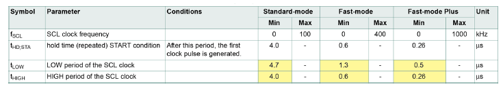</p>

表 14.2：标准、快速和快速模式加 I²C 总线设备的 SDA 和 SCL 总线线特性

- DutyCycle：此字段仅在那些不支持快速模式加通信速度的微控制器中可用，它指定 I²C SCL 线的 tLOW 和 tHIGH 之间的比率。它可以取 I2C_DUTYCYCLE_2 和 I2C_DUTYCYCLE_16_9 的值，分别表示占空比为 2:1 和 16:9。通过选择给定的时钟占空比，我们可以“预分频”外设时钟以实现所需的 I²C 时钟速度。为了更好地理解此配置参数的作用，我们需要回顾 I²C 总线的一些基本概念。在第 11 章中，我们看到占空比是一个时间周期（例如，10 μs）中信号处于活动状态的百分比。对于每种 I²C 总线速度，I²C 规范精确定义了最小的 tLOW 和 tHIGH 值。表 14.2 摘自 NXP 的 UM10204¹¹，显示了给定通信速度下的 tLOW 和 tHIGH 值（表 14.2 中的值已用黄色高亮显示）。这两个值的比率是占空比，它与通信速度无关。例如，100 kHz 的周期对应于 10 μs，但表 14.2 中的 tHIGH + tLOW 小于 10 μs（4 μs + 4.7 μs = 8.7μs）。因此，只要满足 tLOW 和 tHIGH 的最小定时要求（分别为 4.7 μs 和 4 μs），实际值的比率可以变化。这些比率的意义在于说明 I²C 模式之间的 I²C 定时约束是不同的。它们不是 STM32 I²C 外设必须保持的强制比率。例如，tHIGH = 4 μs 和 tLOW = 6μs 将是 0.67 的比率，这仍然与标准模式（100 kHz）的定时兼容（因为 tHIGH = 4 μs 和 tLOW > 4.7 μs，且它们的和等于 10 μs）。STM32 微控制器中的 I²C 外设定义了以下占空比（比率）。对于标准模式，比率固定为 1:1。这意味着 tLOW = tHIGH = 5μs。对于快速模式，我们可以使用两个比率：2:1 或 16:9。2:1 比率意味着通过 tLOW = 2.66 μs 和 tHIGH = 1.33 μs 获得 4 μs（=400 kHz），且这两个值都高于表 14.2 中报告的数值（0.6μs 和 1.3μs）。16:9 比率意味着通过 tLOW = 2.56 μs 和 tHIGH = 1.44 μs 获得 4 μs，且这两个值仍然高于表 14.2 中报告的数值。何时使用 2:1 比率而不是 16:9 比率，反之

¹⁰https://bit.ly/2bxBoP1 ¹¹https://bit.ly/3E18iPF

<!-- page: 425 -->

- 是否通用？这取决于外设时钟（PCLK1）的频率。2:1 的比例意味着通过将时钟源除以三（1+2）来实现 400 kHz。这意味着 PCLK1 必须是 1.2 MHz 的整数倍（400 kHz * 3）。使用 16:9 的比例意味着我们将 PCLK1 除以 25。这意味着当 PCLK1 是 10 MHz 的整数倍（400 kHz * 25）时，我们可以获得最大的 I²C 总线频率。因此，占空比的正确选择取决于 APB1 总线的有效速度以及期望的（最大）I²C SCL 频率。需要强调的是，即使 SCL 频率低于 400 kHz（例如，在使用 16:9 的比例且 PCLK1 频率为 8 MHz 时，我们可以达到等于 360 kHz 的最大通信速度），我们仍然满足 I²C 快速模式规范的要求（400 kHz 是一个上限）。
- OwnAddress1, OwnAddress2：STM32 微控制器中的 I²C 外设可用于开发主设备和从设备 I²C 器件。在开发 I²C 从设备时，OwnAddress1 字段允许指定 I²C 从地址：外设会自动检测 I²C 总线上的给定地址，并自动触发所有相关事件（例如，它可以生成相应的中断，以便固件代码可以在总线上启动新的事务）。I²C 外设支持 7 位或 10 位寻址，以及 7 位双地址模式：在这种情况下，我们可以指定两个不同的 7 位从地址，从而使设备能够响应发送到这两个地址的请求。
- AddressingMode：此字段可以取值为 I2C_ADDRESSINGMODE_7BIT 或 I2C_ADDRESSINGMODE_10BIT，分别指定 7 位或 10 位寻址模式。
- DualAddressMode：此字段可以取值为 I2C_DUALADDRESS_ENABLE 或 I2C_DUALADDRESS_DISABLE，以启用/禁用 7 位双地址模式。
- GeneralCallMode：通用呼叫（General Call）是 I²C 协议中的一种广播寻址方式。使用特殊的 I²C 从地址 0x00 向同一总线上的所有设备发送消息。通用呼叫是一个可选功能，通过将此字段设置为 I2C_GENERALCALL_ENABLE 值，当匹配到通用呼叫地址时，I²C 外设将生成事件。本书不会讨论此模式。
- NoStretchMode：此字段可以取值为 I2C_NOSTRETCH_ENABLE 或 I2C_NOSTRETCH_DISABLE，用于禁用/启用可选的时钟拉伸模式（请注意，将其设置为 I2C_NOSTRETCH_ENABLE 会禁用时钟拉伸模式）。有关此可选 I²C 模式的更多信息，请参阅 NXP 的 UM10204¹² 以及您的微控制器的参考手册。

通常，要配置 I²C 外设，我们使用以下函数：

```c
HAL_StatusTypeDef HAL_I2C_Init(I2C_HandleTypeDef *hi2c);
```

该函数接受指向之前看到的 I2C_HandleTypeDef 实例的指针。

¹²https://bit.ly/3E18iPF

<!-- page: 426 -->

### 14.2.1 在主模式下使用 I²C 外设

我们现在将分析 CubeHAL 提供的主要例程，以在主模式下使用 I²C 外设。要在 I²C 总线上执行写模式事务，CubeHAL 提供了以下函数：

```c
HAL_StatusTypeDef HAL_I2C_Master_Transmit(I2C_HandleTypeDef *hi2c, uint16_t DevAddress,
uint8_t *pData, uint16_t Size, uint32_t Timeout);
```

其中：

- hi2c：它是指向之前看到的 I2C_HandleTypeDef 结构体实例的指针，用于标识 I²C 外设；
- DevAddress：它是从设备的地址，根据特定的 IC，可以是 7 位或 10 位长；
- pData：它是指向一个数组的指针，其长度等于 Size 参数，包含我们要传输的字节序列；
- Timeout：表示我们愿意等待传输完成的最大时间，以毫秒为单位。如果传输未在指定的超时时间内完成，函数将中止并返回 HAL_TIMEOUT 值；否则，如果没有发生其他错误，它返回 HAL_OK 值。此外，我们可以传递等于 HAL_MAX_DELAY (0xFFFFFFFF) 的超时值，以无限期地等待传输完成。

要执行读模式事务，我们可以使用以下函数：

```c
HAL_StatusTypeDef HAL_I2C_Master_Receive(I2C_HandleTypeDef *hi2c, uint16_t DevAddress,
uint8_t *pData, uint16_t Size, uint32_t Timeout);
```

上述两个函数都在轮询模式下执行事务。对于基于中断的事务，我们可以使用以下函数：

```c
HAL_StatusTypeDef HAL_I2C_Master_Transmit_IT(I2C_HandleTypeDef *hi2c, uint16_t DevAddress,
uint8_t *pData, uint16_t Size);
HAL_StatusTypeDef HAL_I2C_Master_Receive_IT(I2C_HandleTypeDef *hi2c, uint16_t DevAddress,
uint8_t *pData, uint16_t Size);
```

这些函数的工作方式与前面章节中看到的其他例程相同（例如，与 UART 中断模式传输相关的那些例程）。要正确使用它们，我们需要启用相应的 ISR 并调用 HAL_I2C_EV_IRQHandler() 例程，该例程进而调用 HAL_I2C_MasterTxCpltCallback(I2C_HandleTypeDef *hi2c) 以指示写模式传输完成，或调用 HAL_I2C_MasterRxCpltCallback(I2C_HandleTypeDef *hi2c)

<!-- page: 427 -->

以指示读模式传输结束。除了 STM32F0 和 STM32L0 系列外，所有 STM32 微控制器中的 I²C 外设都使用独立的中断来指示错误条件（请查看与您微控制器相关的向量表）。因此，在相应的 ISR 中，我们需要调用 HAL_I2C_ER_IRQHandler()，该函数在发生错误时进而调用 HAL_I2C_ErrorCallback(I2C_HandleTypeDef *hi2c)。存在十个由 CubeHAL 调用的不同回调。表 14.3 列出了所有这些回调，以及调用该回调的 ISR。

表 14.3：当 I²C 外设在中断或 DMA 模式下工作时，CubeHAL 可用的回调

| 回调 | 调用 ISR | 描述 |
| :--- | :--- | :--- |
| HAL_I2C_MasterTxCpltCallback() | I2Cx_EV_IRQHandler() | 指示从主设备到从设备的传输已完成（外设工作在主模式）。 |
| HAL_I2C_MasterRxCpltCallback() | I2Cx_EV_IRQHandler() | 指示从从设备到主设备的传输已完成（外设工作在主模式）。 |
| HAL_I2C_SlaveTxCpltCallback() | I2Cx_EV_IRQHandler() | 指示从从设备到主设备的传输已完成（外设在从模式下工作）。 |
| HAL_I2C_SlaveRxCpltCallback() | I2Cx_EV_IRQHandler() | 指示从主设备到从设备的传输已完成（外设在从模式下工作）。 |
| HAL_I2C_MemTxCpltCallback() | I2Cx_EV_IRQHandler() | 指示从主设备到外部存储器的传输已完成（仅在使用 HAL_I2C_Mem_xxx() 例程且外设工作在主模式时调用）。 |
| HAL_I2C_MemRxCpltCallback() | I2Cx_EV_IRQHandler() | 指示从外部存储器到主设备的传输已完成（仅在使用 HAL_I2C_Mem_xxx() 例程且外设工作在主模式时调用）。 |
| HAL_I2C_AddrCallback() | I2Cx_EV_IRQHandler() | 指示主设备已在总线上放置外设从地址（外设在从模式下工作）。 |
| HAL_I2C_ListenCpltCallback() | I2Cx_EV_IRQHandler() | 指示监听模式已完成（这发生在发出 STOP 条件且外设在从模式下工作时 - 稍后会有更多介绍）。 |
| HAL_I2C_ErrorCallback() | I2Cx_ER_IRQHandler() | 指示发生了错误条件（外设在主模式和从模式下均工作）。 |
| HAL_I2C_AbortCpltCallback() | I2Cx_ER_IRQHandler() | 指示已发出 STOP 条件且 I²C 事务已被中止（外设在主模式和从模式下均工作）。 |

<!-- page: 428 -->

最后，以下函数：

```c
HAL_StatusTypeDef HAL_I2C_Master_Transmit_DMA(I2C_HandleTypeDef *hi2c,uint16_t DevAddress,
uint8_t *pData, uint16_t Size);
HAL_StatusTypeDef HAL_I2C_Master_Receive_DMA(I2C_HandleTypeDef *hi2c, uint16_t DevAddress,
uint8_t *pData, uint16_t Size);
```

允许使用直接存储器访问（DMA）执行 I²C 事务。

为了构建完整且可运行的示例，我们需要一个能够通过 I²C 总线进行交互的外部设备，因为 Nucleo 开发板本身不提供此类外设。因此，我们将使用外部 EEPROM 存储器：24LCxx 系列。这是一个流行的串行 EEPROM 系列，在电子行业中已成为一种标准。它们价格低廉（通常只需几美分），提供多种封装形式（从传统的 THT P-DIP 封装到现代紧凑的 WLCP 封装），数据保持时间超过 200 年，且单个页面可擦除超过一百万次。此外，许多硅片制造商都提供兼容版本（ST 也提供其自己的 24LCxx 兼容 EEPROM 系列）。这些存储器的普及程度堪比 555 定时器，我敢打赌它们将在技术创新中存续多年。

<p align="center">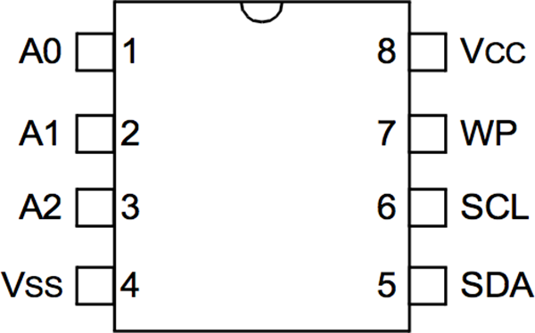</p>

<p align="center">图 14.6：采用 PDIP-8 封装的 24LCxx EEPROM 引脚图</p>

我们的示例将基于 24LC64 型号，这是一款 64Kbits 的 EEPROM（这意味着存储器能够存储 8KB，或者换句话说，8192 字节）。PDIP-8 版本的引脚图如图 14.6 所示。A0、A1 和 A2 用于设置 I²C 地址的最低有效位（LSB），如图 14.7 所示：如果其中一个引脚接地，则对应的位被设置为 0；如果连接到 VDD，则位被设置为 1。如果这三个引脚都接地，则 I²C 地址对应于 0xA0。

<p align="center">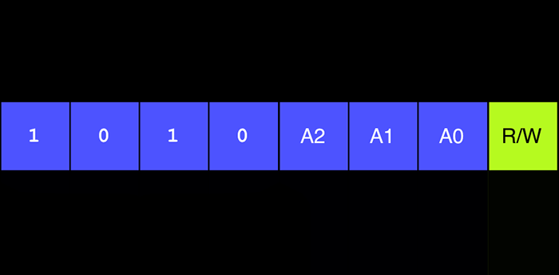</p>

<p align="center">图 14.7：24LCxx I²C 地址的组成方式。</p>

WP 引脚是写保护引脚：如果接地，我们可以写入单个存储单元。相反，如果连接到 VDD，写操作将无效。由于 I2C1 外设

<!-- page: 429 -->

在所有 Nucleo 开发板上都映射到相同的引脚，图 14.8 展示了在本书中考虑的九种 Nucleo 开发板上将 24LCxx EEPROM 连接到 Arduino 接口的正确方式。

<p align="center"></p>

> **仔细阅读**
>
> 
>
> STM32F1 微控制器不提供上拉 SDA 和 SCL 线的功能。其 GPIO 必须配置为开漏模式。因此，您需要添加两个额外的电阻来上拉 I²C 线。4 kΩ 到 10 kΩ 之间是经过验证的有效值。

<p align="center"></p>

如前所述，64Kbits 的 EEPROM 有 8192 个地址，范围从 0x0000 到 0x1FFF。单个字节写入是通过在 I²C 总线上发送 EEPROM 地址、内存地址的高字节、低字节以及要存储在该单元中的值来完成的，并以 STOP 条件结束事务。

<p align="center">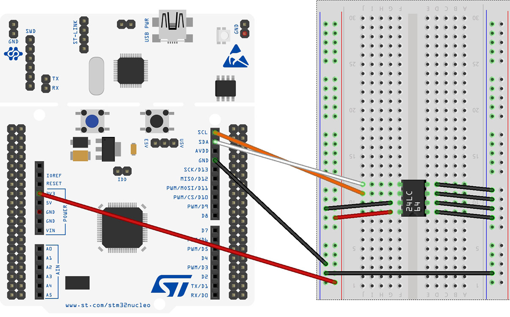</p>

<p align="center">图 14.8：如何将 Nucleo 连接到 24LCxx EEPROM</p>

假设我们要将值 0x4C 存储在内存位置 0x320 中，那么图 14.9 展示了正确的事务序列。地址 0x320 分为两部分：等于 0x3 的高位部分首先传输，等于 0x20 的低位部分紧随其后发送。然后发送要存储的数据。我们也可以在同一个事务中发送多个字节：内部地址计数器会在每发送一个字节后自动递增。这允许我们减少事务时间并提高总吞吐量。

I²C EEPROM 在最后一个发送字节后设置的 ACK 位并不意味着数据已有效存储在内存中。发送的数据存储在临时缓冲区中，因为 EEPROM 位置存储器是按页擦除的，而不是单独擦除的。整个页面（由 32 字节组成）在每次写操作时都会刷新，传输的字节仅在该操作结束时存储。在擦除期间，发送到 EEPROM 的任何命令都将被

<!-- page: 430 -->

忽略。为了检测写操作何时完成，我们需要使用应答轮询。这涉及主设备发送 START 条件，随后发送从设备地址以及写命令的控制字节（R/W 位设置为 0）。如果设备仍忙于写周期，则不会返回 ACK。如果没有返回 ACK，必须重新发送 START 位和控制字节。如果周期完成，设备将返回 ACK，主设备随后可以继续下一个读或写命令。

<p align="center"></p>

<p align="center">图 14.9：如何使用 24LCxx EEPROM 执行写操作</p>

读操作的发起方式与写操作相同，区别在于控制字节的 R/W 位设置为 1。有三种基本的读操作类型：当前地址读、随机读和顺序读。在本书中，我们将只关注随机读模式，留给读者深入理解其他模式。

随机读操作允许主设备以随机方式访问任何内存位置。要执行这种类型的读操作，必须首先发送内存地址。这是通过将内存地址作为写操作的一部分（R/W 位设置为 ‘0’）发送给 24LCxx 来实现的。一旦发送了内存地址，主设备在 ACK¹³ 之后生成 RESTART 条件（重复 START）。这终止了写操作，但在内部地址计数器设置之前不会终止。然后主设备再次发出从设备地址，但这次将 R/W 位设置为 1。24LCxx 随后发出 ACK 并传输 8 位数据字。主设备不应答传输并生成 STOP 条件，这导致 EEPROM 停止传输（见图 14.10）。在随机读命令之后，内部地址计数器将指向刚刚读取的地址之后的地址位置。

<p align="center"></p>

<p align="center">图 14.10：如何使用 24LCxx EEPROM 执行随机读操作</p>

我们终于准备好安排一个完整的示例了。我们将创建两个简单的函数，命名为 Read_From_24LCxx() 和 Write_To_24LCxx()，允许使用 CubeHAL 从 24LCxx 存储器中写入/读取数据。然后我们将通过简单地将一个字符串存储在 EEPROM 中，然后将其读回来，来测试这些例程：如果原始字符串等于从 EEPROM 读取的字符串，则 Nucleo LD2 LED 开始闪烁。

¹³24LCxx EEPROM 存储器被设计为即使我们通过发出 STOP 条件结束事务，然后立即以读模式开始新事务，也能以相同的方式工作。这种灵活性将允许我们构建本章的第一个示例，我们稍后会看到。

<!-- page: 431 -->

**文件名：** `src/main-ex1.c`

```c
int main(void) {
    const char wmsg[] = "We love STM32!";
    char rmsg[20] = {0};

    HAL_Init();
    Nucleo_BSP_Init();

    MX_I2C1_Init();

    Write_To_24LCxx(&hi2c1, 0xA0, 0x1AAA, (uint8_t*)wmsg, strlen(wmsg)+1);
    Read_From_24LCxx(&hi2c1, 0xA0, 0x1AAA, (uint8_t*)rmsg, strlen(wmsg)+1);

    if(strcmp(wmsg, rmsg) == 0) {
        while(1) {
            HAL_GPIO_TogglePin(LD2_GPIO_Port, LD2_Pin);
            HAL_Delay(100);
        }
    }

    while(1);
}

/* I2C1 init function */
static void MX_I2C1_Init(void) {
    GPIO_InitTypeDef GPIO_InitStruct;

    /* Peripheral clock enable */
    __HAL_RCC_I2C1_CLK_ENABLE();

    hi2c1.Instance = I2C1;
    hi2c1.Init.ClockSpeed = 100000;
    hi2c1.Init.DutyCycle = I2C_DUTYCYCLE_2;
    hi2c1.Init.OwnAddress1 = 0x0;
    hi2c1.Init.AddressingMode = I2C_ADDRESSINGMODE_7BIT;
    hi2c1.Init.DualAddressMode = I2C_DUALADDRESS_DISABLE;
    hi2c1.Init.OwnAddress2 = 0;
    hi2c1.Init.GeneralCallMode = I2C_GENERALCALL_DISABLE;
    hi2c1.Init.NoStretchMode = I2C_NOSTRETCH_DISABLE;

    GPIO_InitStruct.Pin = GPIO_PIN_8|GPIO_PIN_9;
    GPIO_InitStruct.Mode = GPIO_MODE_AF_OD;
    GPIO_InitStruct.Pull = GPIO_PULLUP;
    GPIO_InitStruct.Speed = GPIO_SPEED_FREQ_VERY_HIGH;
    GPIO_InitStruct.Alternate = GPIO_AF4_I2C1;
    HAL_GPIO_Init(GPIOB, &GPIO_InitStruct);
    HAL_I2C_Init(&hi2c1);
}
```

让我们从 MX_I2C1_Init() 例程开始分析上述代码片段。它首先启用 I2C1 外设时钟，以便我们可以对其寄存器进行编程。然后，我们设置总线速度（在我们的情况下为 100 kHz——在这种情况下，占空比设置被忽略，因为当总线运行速度小于或等于 100 kHz 时，占空比固定为 1:1）。接着，我们配置 PB8 和 PB9 引脚，使它们分别作为 SCL 和 SDA 线工作。

main() 例程很简单：它将字符串 "We love STM32!" 存储在 0x1AAA 内存位置；然后从 EEPROM 中读回该字符串，并与原始字符串进行比较。我们需要解释一下为什么我们要存储和读取一个长度等于 strlen(wmsg)+1 的缓冲区。这是因为 C 语言的 strlen() 例程返回的字符串长度不包含字符串终止符（'\0'）。如果不存储该字符，然后从 EEPROM 中读回它，第 26 行的 strcmp() 将无法计算字符串的确切长度。

**文件名：** `src/main-ex1.c`

```c
HAL_StatusTypeDef Read_From_24LCxx(I2C_HandleTypeDef *hi2c, uint16_t DevAddress,
                                   uint16_t MemAddress, uint8_t *pData, uint16_t len) {
    HAL_StatusTypeDef returnValue;
    uint8_t addr[2];

    /* We compute the MSB and LSB parts of the memory address */
    addr[0] = (uint8_t) ((MemAddress & 0xFF00) >> 8);
    addr[1] = (uint8_t) (MemAddress & 0xFF);

    /* First we send the memory location address where start reading data */
    returnValue = HAL_I2C_Master_Transmit(hi2c, DevAddress, addr, 2, HAL_MAX_DELAY);
    if(returnValue != HAL_OK)
        return returnValue;

    /* Next we can retrieve the data from EEPROM */
    returnValue = HAL_I2C_Master_Receive(hi2c, DevAddress, pData, len, HAL_MAX_DELAY);
    return returnValue;
}

HAL_StatusTypeDef Write_To_24LCxx(I2C_HandleTypeDef *hi2c, uint16_t DevAddress,
                                  uint16_t MemAddress, uint8_t *pData, uint16_t len) {
    HAL_StatusTypeDef returnValue;
    uint8_t *data;

    /* First we allocate a temporary buffer to store the destination memory
     * address and the data to store */
    data = (uint8_t*)malloc(sizeof(uint8_t)*(len+2));

    /* We compute the MSB and LSB parts of the memory address */
    data[0] = (uint8_t) ((MemAddress & 0xFF00) >> 8);
    data[1] = (uint8_t) (MemAddress & 0xFF);

    /* And copy the content of the pData array in the temporary buffer */
    memcpy(data+2, pData, len);

    /* We are now ready to transfer the buffer over the I2C bus */
    returnValue = HAL_I2C_Master_Transmit(hi2c, DevAddress, data, len + 2, HAL_MAX_DELAY);
    if(returnValue != HAL_OK)
        return returnValue;

    free(data);

    /* We wait until the EEPROM effectively stores data in memory */
    while(HAL_I2C_Master_Transmit(hi2c, DevAddress, 0, 0, HAL_MAX_DELAY) != HAL_OK);

    return HAL_OK;
}
```

我们现在可以将注意力集中在用于操作 24LCxx EEPROM 的两个例程上。它们都设计为接受以下参数：

- EEPROM 存储器的 I²C 从机地址 (DevAddress)；
- 开始存储/读取数据的内存地址 (MemAddress)；
- 用于与 EEPROM 交换数据的内存缓冲区指针 (pData)；
- 要存储/读取的数据量 (len)；

Read_From_24LCxx() 函数首先计算内存地址的两个部分（最高有效字节 MSB 和最低有效字节 LSB）。然后，它使用 HAL_I2C_Master_Transmit() 例程（第 73 行）通过 I²C 总线发送这两个部分。如前所述，24LCxx 存储器被设计为将内部地址计数器设置为传入的地址。因此，我们可以启动一个新的读模式事务，以从 EEPROM 中检索所需的数据量（第 78 行）。

Write_To_24LCxx() 函数执行类似的操作，但方式不同。它必须遵循图 14.9 中描述的 24LCxx 协议，该协议与图 14.8 中的协议略有不同。这意味着我们不能使用两个独立的事务分别传输内存地址和要存储的数据，而必须执行单一的 I²C 事务。为此，我们使用一个临时的动态缓冲区（第 90 行），其中包含内存地址的两个部分以及要存储在 EEPROM 中的数据。然后，我们可以执行一次 I²C 总线事务（第 98 行），并等待 EEPROM 完成内存传输（第 107 行）。

#### 14.2.1.1 I/O 内存操作

24LCxx EEPROM 所使用的协议实际上是所有具有可寻址寄存器（memory-addressable registers）以进行读取和写入的 I²C 设备的通用协议。例如，许多 I²C 传感器，如 HTS221

<!-- page: 434 -->

由 ST 生产，也采用相同的协议。因此，ST 工程师已经在 CubeHAL 中实现了特定的例程，它们比 Read_From_24LCxx() 和 Write_To_24LCxx() 执行相同任务时更高效、更快速。这些函数为：

```c
HAL_StatusTypeDef HAL_I2C_Mem_Write(I2C_HandleTypeDef *hi2c, uint16_t DevAddress,
                                    uint16_t MemAddress, uint16_t MemAddSize,
                                    uint8_t *pData, uint16_t Size, uint32_t Timeout);
HAL_StatusTypeDef HAL_I2C_Mem_Read(I2C_HandleTypeDef *hi2c, uint16_t DevAddress,
                                   uint16_t MemAddress, uint16_t MemAddSize,
                                   uint8_t *pData, uint16_t Size, uint32_t Timeout);
```

允许从可寻址 I²C 设备中存储和检索数据，只有一个显著的区别：HAL_I2C_Mem_Write() 函数并非设计为等待写周期完成，正如我们在上一个示例的第 107 行所做的那样。但是，即使对于此操作，HAL 也提供了一个专用且更具可移植性的例程：

```c
HAL_StatusTypeDef HAL_I2C_IsDeviceReady(I2C_HandleTypeDef *hi2c, uint16_t DevAddress,
                                         uint32_t Trials, uint32_t Timeout);
```

该函数接受在返回错误状态之前的最大尝试次数（Trials），但如果我们将 HAL_MAX_DELAY 作为 Timeout 值传递给函数，则可以将 Trials 参数设置为 1。当轮询的 I²C 设备就绪时，函数返回 HAL_OK。否则，它返回 HAL_BUSY 值。

因此，之前看到的 main() 函数可以重新排列为以下形式：

```c
int main(void) {
    char wmsg[] ="We love STM32!";
    char rmsg[20];

    HAL_Init();
    Nucleo_BSP_Init();

    MX_I2C1_Init();

    HAL_I2C_Mem_Write(&hi2c1, 0xA0, 0x1AAA, I2C_MEMADD_SIZE_16BIT, (uint8_t*)wmsg,
                      strlen(wmsg)+1, HAL_MAX_DELAY);
    while(HAL_I2C_IsDeviceReady(&hi2c1, 0xA0, 1, HAL_MAX_DELAY) != HAL_OK);

    HAL_I2C_Mem_Read(&hi2c1, 0xA0, 0x1AAA, I2C_MEMADD_SIZE_16BIT, (uint8_t*)rmsg,
                     strlen(wmsg)+1, HAL_MAX_DELAY);

    if(strcmp(wmsg, rmsg) == 0) {
        while(1) {
            HAL_GPIO_TogglePin(LD2_GPIO_Port, LD2_Pin);
            HAL_Delay(100);
        }
    }

    while(1);
}
```

上述 API 工作在轮询模式下，但 CubeHAL 还提供了相应的例程以在中断和直接存储器访问（DMA）模式下执行事务。通常，这些其他 API 具有相似的函数签名，只有一点需要注意：用于指示传输结束的回调函数是 HAL_I2C_MemTxCpltCallback() 和 HAL_I2C_MemRxCpltCallback()，如表 14.3 所示。

#### 14.2.1.2 组合事务

在 24LCxx EEPROM 内存中执行读操作的传输序列是一个组合事务。在反转 I²C 传输方向（从写变为读）之前，会使用一个 RESTART 条件。在第一个示例中，我们能够在 Read_From_24LCxx() 中使用两个分离的事务，因为 24LCxx EEPROM 被设计为以相同方式工作。这得益于内部地址计数器：第一个事务将地址计数器设置为所需的位置；第二个事务以读模式执行，从该位置开始从 EEPROM 中检索数据。然而，这不仅降低了可能达到的最大吞吐量，更重要的是，这通常导致代码缺乏可移植性：存在许多严格遵循 I²C 协议并根据规范使用 RESTART 条件实现组合事务的 I²C 设备（因此它们不容忍中间的 STOP 条件）。

CubeHAL 提供了两个专用例程来处理组合事务，或者如 Cube HAL 中称为的顺序传输（sequential transmissions）：

```c
HAL_I2C_Master_Sequential_Transmit_IT(I2C_HandleTypeDef *hi2c, uint16_t DevAddress,
                                      uint8_t *pData, uint16_t Size,uint32_t XferOptions);
HAL_I2C_Master_Sequential_Receive_IT(I2C_HandleTypeDef *hi2c, uint16_t DevAddress,
                                     uint8_t *pData, uint16_t Size, uint32_t XferOptions);
```

与之前看到的其他例程相比，这里唯一需要强调的相关参数是 XferOptions。它可以取表 14.4 中报告的值之一，并用于在单个事务中驱动 START/RESTART/STOP 条件的生成。这两个函数都以这种方式工作。假设我们要从 24LCxx EEPROM 中读取 n 个字节。根据 I²C 协议，我们必须执行以下操作（参见图 14.10）：

1. 我们必须通过发出 START 条件后跟从机地址来开始一个新的写模式事务；
2. 然后传输两个字节，包含内存地址的 MSB 和 LSB 部分；
3. 接着发出 RESTART 条件，并传输从机设备地址，最后一位设置为 1 以指示读事务。
4. 从机设备开始逐字节发送数据，直到我们通过发出 NACK 或 STOP 条件结束事务。

<!-- page: 436 -->

表 14.4：用于驱动 START/RESTART/STOP 条件生成的 XferOptions 参数值

| 传输选项 | 描述 |
| :--- | :--- |
| I2C_FIRST_FRAME | 仅生成 START 条件，传输结束时不生成最终的 STOP 条件。 |
| I2C_NEXT_FRAME | 如果传输方向改变，则在发送数据前生成 RESTART；如果方向未改变，则仅处理要传输的新数据。两种情况下都不生成最终的 STOP 条件。 |
| I2C_LAST_FRAME | 如果传输方向改变，则在发送数据前生成 RESTART；如果方向未改变，则仅处理新数据。两种情况下都会生成最终的 STOP 条件。 |
| I2C_FIRST_AND_LAST_FRAME | 不用于顺序传输；两个例程的工作方式与 HAL_I2C_Master_Transmit_IT() 和 HAL_I2C_Master_Receive_IT() 相同。 |

使用顺序传输例程，我们可以按以下方式操作：

1. 我们调用 HAL_I2C_Master_Sequential_Transmit_IT() 例程，传入从机地址和构成内存位置地址的两个字节；我们通过传入值 I2C_FIRST_FRAME 来调用该函数，以便它在两个字节发送后生成 START 条件而不发出 STOP 条件；
2. 然后我们调用 HAL_I2C_Master_Sequential_Receive_IT() 例程，传入从机地址、用于存储读取字节的缓冲区指针、要从 EEPROM 读取的字节数以及值 I2C_LAST_FRAME，以便该函数生成 RESTART 条件，并在传输结束时通过发出 STOP 条件终止事务。

#### 14.2.1.3 关于 STM32F0/L0/L4 系列时钟配置的说明

在 STM32F0/L0 系列中，可以为 I2C1 外设选择不同的时钟源。这是因为在这些系列中，I2C1 外设能够在某些低功耗模式下工作，从而允许在 I²C 工作于从机模式且配置的从机地址被放置在总线上时唤醒微控制器（MCU）。有关此功能的更多信息，请参阅 CubeMX 中的时钟视图。

在 STM32L4/5 微控制器中，可以为所有 I²C 外设选择时钟源。

### 14.2.2 在从机模式下使用 I²C 外设

如今，市场上有许多板级系统（System-on-Board，SoB）模块。这些通常是已经焊接了多个集成电路（IC）的小型印刷电路板（PCB），并专门用于执行某些特定功能。GPRS 和 GPS 模块或多传感器板就是 SoB 模块的例子。这些模块随后被

<!-- page: 437 -->

焊接到主板上，这是因为它们在侧面暴露了可焊接的焊盘，也被称为城堡孔（castellated vias/castellations）。图 14.11 展示了 ST 公司的 STEVAL-STLCS01V1¹⁴ 传感器开发套件模块，这是一个集成且可编程的模块，包含一个 STM32L476、三个高集成度传感器（6 轴数字电子罗盘和 3 轴数字陀螺仪、气压计、麦克风）以及一个蓝牙低功耗（BLE）网络处理器 BlueNRG-MS。

<p align="center">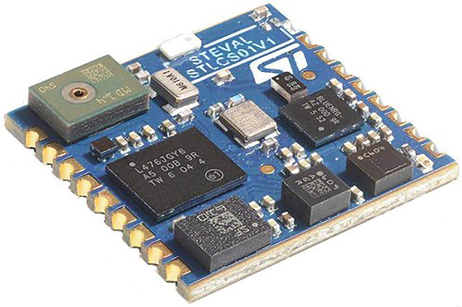</p>

<p align="center">图 14.11：ST 公司的 STEVAL-STLCS01V1 传感器开发套件</p>

这些板上的微控制器通常预编程了固件，专门用于执行既定任务。主机板还包含另一个可编程 IC，可能是另一个微控制器或类似设备。主板使用众所周知的通信协议与 SoB 进行交互，通常是 UART、CAN 总线、SPI 或 I²C 总线。因此，将 STM32 设备编程为在 I²C 从机模式下工作是非常常见的。

CubeHAL 提供了开发 I²C 从机应用所需的所有粘合代码。从机例程与用于编程 I²C 外设为主机模式的例程相同。例如，当 I²C 外设用于从机模式时，以下例程用于在中断模式下发送/接收数据：

```c
HAL_StatusTypeDef HAL_I2C_Slave_Transmit_IT(I2C_HandleTypeDef *hi2c, uint8_t *pData,
                                             uint16_t Size);
HAL_StatusTypeDef HAL_I2C_Slave_Receive_IT(I2C_HandleTypeDef *hi2c, uint8_t *pData,
                                            uint16_t Size);
```

同样，在数据传输/接收结束时调用的回调例程如下：

```c
void HAL_I2C_SlaveTxCpltCallback(I2C_HandleTypeDef *hi2c);
void HAL_I2C_SlaveRxCpltCallback(I2C_HandleTypeDef *hi2c);
```

我们现在将分析一个完整的示例，展示如何使用 CubeHAL 开发 I²C 从机应用。我们将实现一种具有 I²C 接口的数字温度传感器，类似于市场上大多数数字温度传感器（例如 TI 的流行型号 TMP275 和 ST 的 HT221）。这个“传感器”将仅提供三个寄存器：

¹⁴https://bit.ly/3vCGKND

<!-- page: 438 -->

- 一个 WHO_AM_I 寄存器，用于主机代码检查 I²C 接口是否正常工作；该寄存器返回固定值 0xBC。
- 两个与温度相关的寄存器，名为 TEMP_OUT_INT 和 TEMP_OUT_FRAC，分别包含采集温度的整数部分和小数部分；例如，如果检测到的温度等于 27.34°C，则 TEMP_OUT_INT 寄存器将包含值 27，而 TEMP_OUT_FRAC 包含值 34。

<p align="center"></p>

<p align="center">图 14.12：用于读取我们从机设备内部寄存器的 I²C 协议</p>

我们的传感器将被设计为响应一个非常简单的协议，该协议基于组合事务，如图 14.12 所示。如您所见，与 24LCxx EEPROM 在随机读模式下访问内存时使用的协议相比，唯一显著的区别是内存寄存器的大小，在本例中仅为一个字节。

该示例提供了“从机”和“主机”两种实现：在项目级别定义的宏 SLAVE_BOARD 控制这两部分的编译。该示例需要两块 Nucleo 板¹⁵。

**文件名：** `src/main-ex2.c`

```c
#ifdef SLAVE_BOARD
static void MX_ADC1_Init(void);
#endif

static void MX_I2C1_Init(void);

volatile uint8_t transferDirection, transferRequested;

#define TEMP_OUT_INT_REGISTER 0x0
#define TEMP_OUT_FRAC_REGISTER 0x1
#define WHO_AM_I_REGISTER 0xF
#define WHO_AM_I_VALUE 0xBC
#define TRANSFER_DIR_WRITE 0x1
#define TRANSFER_DIR_READ 0x0
#define I2C_SLAVE_ADDR 0x33

int main(void) {
    char uartBuf[30];
    uint8_t i2cBuf[2];
    float ftemp;
    int8_t t_frac, t_int;

    HAL_Init();
```

¹⁵不幸的是，当我开始设计这个示例时，我以为可以使用一块板，将关联于一个 I²C 外设的引脚连接到另一个 I²C 外设的引脚（例如，I2C1 引脚直接连接到 I2C3 引脚）。但是，经过大量尝试后，我得出的结论是 STM32 中的 I²C 外设并不是“真正异步”的，并且不可能同时使用两个 I²C 外设。因此，要运行此示例，您需要两块 Nucleo 板，或者一块 Nucleo 板和另一个开发套件：在这种情况下，您需要相应地重新安排主机部分。

<!-- page: 439 -->

```c
    Nucleo_BSP_Init();

    MX_I2C1_Init();

#ifdef SLAVE_BOARD
    uint16_t rawValue;
    uint32_t lastConversion;

    MX_ADC1_Init();
    HAL_ADCEx_Calibration_Start(&hadc1);
    HAL_ADC_Start(&hadc1);

    while(1) {
        HAL_I2C_EnableListen_IT(&hi2c1);
        while(!transferRequested) {
            if(HAL_GetTick() - lastConversion > 1000L) {
                HAL_ADC_PollForConversion(&hadc1, HAL_MAX_DELAY);

                rawValue = HAL_ADC_GetValue(&hadc1);
                ftemp = ((float)rawValue) / 4095 * 3300;
                ftemp = ((ftemp - 1430.0) / 4.3) + 25;

                t_int = ftemp;
                t_frac = (ftemp - t_int)*100;

                sprintf(uartBuf, "Temperature: %.2f\r\n", ftemp);
                HAL_UART_Transmit(&huart2, (uint8_t*)uartBuf, strlen(uartBuf), HAL_MAX_DELAY);

                sprintf(uartBuf, "t_int: %d - t_frac: %d\r\n", t_int, t_frac);
                HAL_UART_Transmit(&huart2, (uint8_t*)uartBuf, strlen(uartBuf), HAL_MAX_DELAY);

                lastConversion = HAL_GetTick();
            }
        }

        transferRequested = 0;

        if(transferDirection == TRANSFER_DIR_WRITE) {
            /* Master is sending register address */
            HAL_I2C_Slave_Sequential_Receive_IT(&hi2c1, i2cBuf, 1, I2C_FIRST_FRAME);
            while (HAL_I2C_GetState(&hi2c1) != HAL_I2C_STATE_LISTEN);

            switch(i2cBuf[0]) {
                case WHO_AM_I_REGISTER:
                    i2cBuf[0] = WHO_AM_I_VALUE;
                    break;
                case TEMP_OUT_INT_REGISTER:
```

<!-- page: 440 -->

```c
                    i2cBuf[0] = t_int;
                    break;
                case TEMP_OUT_FRAC_REGISTER:
                    i2cBuf[0] = t_frac;
                    break;
                default:
                    i2cBuf[0] = 0xFF;
            }

            HAL_I2C_Slave_Sequential_Transmit_IT(&hi2c1, i2cBuf, 1, I2C_LAST_FRAME);
            while (HAL_I2C_GetState(&hi2c1) != HAL_I2C_STATE_READY);
        }
    }
```

main() 函数中最相关的部分从第 46 行开始。HAL_I2C_EnableListen_IT() 例程启用所有与 I²C 外设相关的中断。这意味着当主机放置从机设备地址（由宏 I2C_SLAVE_ADDR 定义）时，将触发一个新的中断。因此，HAL_I2C_EV_IRQHandler() 例程将自动调用 HAL_I2C_AddrCallback() 函数，我们将在后面分析该函数。

随后，main() 函数开始每秒执行一次内部温度传感器的 A/D 转换，并将获取的温度（存储在 ftemp 变量中）拆分为两个 8 位整数 t_int 和 t_frac：它们分别代表温度的整数部分和小数部分。一旦 transferRequested 变量变为 1，主函数就会暂时停止 A/D 转换：这个全局变量由 HAL_I2C_AddrCallback() 函数设置，同时还会设置 transferDirection 变量，后者包含 I²C 事务的传输方向（读/写）。

如果主设备以写模式启动新事务，则意味着它正在传输寄存器地址。随后在第 72 行调用 HAL_I2C_Slave_Sequential_Receive_IT() 函数：这将导致从主设备接收寄存器地址。由于该函数以中断模式工作，我们需要一种方法来等待传输完成。HAL_I2C_GetState() 返回硬件抽象层（HAL）的内部状态，在传输完成之前，该状态等于 HAL_I2C_STATE_BUSY_RX_LISTEN。当传输完成时，状态恢复为 HAL_I2C_STATE_LISTEN，此时我们可以继续向主设备传输所需寄存器的内容。

这在第 89 行执行，此处调用了 HAL_I2C_Slave_Sequential_Transmit_IT() 函数：该函数反转传输方向，并向主设备发送所需寄存器的内容。棘手的部分体现在第 90 行。在这里，我们执行忙等待（busy spin），直到 I²C 外设状态等于 HAL_I2C_STATE_READY。为什么我们不检查外设状态是否等于 HAL_I2C_STATE_LISTEN，就像我们在第 73 行所做的那样？要理解这一点，我们需要记住组合事务的一个重要特性。当事务反转传输方向时，主设备开始确认（acknowledge）发送的每一个字节。请记住，只有主设备知道事务持续多久，并由它决定何时停止事务。在组合事务中，主设备通过发出 NACK（非确认）来结束从从设备到主设备的传输，这会导致从设备发出 STOP（停止）条件。从 I²C 外设的角度来看，STOP 条件会导致外设

<!-- page: 441 -->

退出监听模式（从技术角度来说，它会产生一个中止条件——如果你实现了 HAL_I2C_AbortCpltCallback() 回调，你可以跟踪这一事件的发生），这就是为什么我们需要检查 HAL_I2C_STATE_READY 状态，并在第 46 行再次将外设置于监听模式的原因。

**文件名：** `src/main-ex2.c`

```c
#else //Master board
    i2cBuf[0] = WHO_AM_I_REGISTER;
    HAL_I2C_Master_Sequential_Transmit_IT(&hi2c1, I2C_SLAVE_ADDR, i2cBuf,
                                           1, I2C_FIRST_FRAME);
    while (HAL_I2C_GetState(&hi2c1) != HAL_I2C_STATE_READY);

    HAL_I2C_Master_Sequential_Receive_IT(&hi2c1, I2C_SLAVE_ADDR, i2cBuf,
                                           1, I2C_LAST_FRAME);
    while (HAL_I2C_GetState(&hi2c1) != HAL_I2C_STATE_READY);

    sprintf(uartBuf, "WHO AM I: %x\r\n", i2cBuf[0]);
    HAL_UART_Transmit(&huart2, (uint8_t*) uartBuf, strlen(uartBuf), HAL_MAX_DELAY);

    i2cBuf[0] = TEMP_OUT_INT_REGISTER;
    HAL_I2C_Master_Sequential_Transmit_IT(&hi2c1, I2C_SLAVE_ADDR, i2cBuf,
                                           1, I2C_FIRST_FRAME);
    while (HAL_I2C_GetState(&hi2c1) != HAL_I2C_STATE_READY);

    HAL_I2C_Master_Sequential_Receive_IT(&hi2c1, I2C_SLAVE_ADDR, (uint8_t*)&t_int,
                                          1, I2C_LAST_FRAME);
    while (HAL_I2C_GetState(&hi2c1) != HAL_I2C_STATE_READY);

    i2cBuf[0] = TEMP_OUT_FRAC_REGISTER;
    HAL_I2C_Master_Sequential_Transmit_IT(&hi2c1, I2C_SLAVE_ADDR, i2cBuf,
                                           1, I2C_FIRST_FRAME);
    while (HAL_I2C_GetState(&hi2c1) != HAL_I2C_STATE_READY);

    HAL_I2C_Master_Sequential_Receive_IT(&hi2c1, I2C_SLAVE_ADDR, (uint8_t*)&t_frac,
                                          1, I2C_LAST_FRAME);
    while (HAL_I2C_GetState(&hi2c1) != HAL_I2C_STATE_READY);

    ftemp = ((float)t_frac)/100.0;
    ftemp += (float)t_int;

    sprintf(uartBuf, "Temperature: %.2f\r\n", ftemp);
    HAL_UART_Transmit(&huart2, (uint8_t*) uartBuf, strlen(uartBuf), HAL_MAX_DELAY);

#endif

    while (1);
}
```

<!-- page: 442 -->

最后，重要的是要强调，“从设备部分”的实现仍然不够健壮。事实上，我们应该处理所有可能发生的错误情况。例如，主设备可能在两个事务中间关闭连接。这会使示例变得非常复杂，因此留给读者作为练习。

示例的“主设备部分”从第 94 行开始。代码很直接。这里我们使用 HAL_I2C_Master_Sequential_Transmit_IT() 函数启动组合事务，并使用 HAL_I2C_Master_Sequential_Receive_IT() 从从设备获取所需寄存器的内容。然后，温度的整数部分和小数部分再次组合成一个浮点数，获取的温度通过 UART2 打印输出。

**文件名：** `src/main-ex2.c`

```c
void I2C1_EV_IRQHandler(void) {
    HAL_I2C_EV_IRQHandler(&hi2c1);
}

void I2C1_ER_IRQHandler(void) {
    HAL_I2C_ER_IRQHandler(&hi2c1);
}

void HAL_I2C_AddrCallback(I2C_HandleTypeDef *hi2c, uint8_t TransferDirection,
                          uint16_t AddrMatchCode) {
    UNUSED(AddrMatchCode);

    if(hi2c->Instance == I2C1) {
        transferRequested = 1;
        transferDirection = TransferDirection;
    }
}
```

我们需要分析的最后一部分是由中断服务程序（ISR）处理程序组成的。如前所述，ISR I2C1_EV_IRQHandler() 调用了 HAL_I2C_EV_IRQHandler()。这导致每当主设备在总线上传输从设备地址时，都会调用 HAL_I2C_AddrCallback() 函数。当被调用时，该回调将接收指向代表特定 I²C 描述符的 I2C_HandleTypeDef 的指针、传输方向（TransferDirection）以及匹配的 I²C 地址（AddrMatchCode）：这是必需的，因为工作在从设备模式的 STM32 I²C 外设可以响应两个不同的地址，因此我们可以编写根据主设备发出的 I²C 地址进行条件判断的代码。

## 14.3 使用 CubeMX 配置 I²C 外设

一如既往，CubeMX 将配置 I²C 外设所需的工作量降至最低。一旦在引脚布局视图（Pinout view）的分类列表窗格中启用了该外设，我们就可以在配置窗格中设置所有参数，如图 14.13 所示。

<!-- page: 443 -->

<p align="center">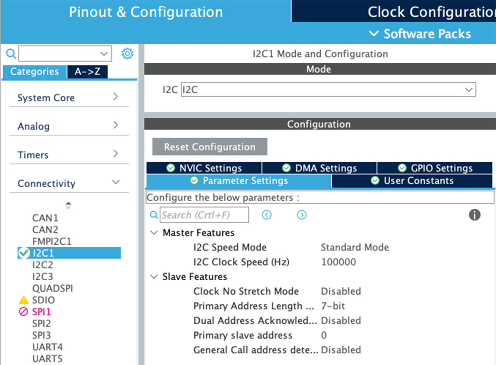</p>

<p align="center">图 14.13：用于设置 I²C 外设的 CubeMX 配置视图</p>

> **仔细阅读**
>
> 
>
> 在具有 LQFP-64 封装的 STM32 微控制器中启用 I²C1 外设时，CubeMX 默认会启用 PB7 和 PB6 引脚作为外设 I/O（分别为 SDA 和 SCL）。这些引脚并非 Nucleo 开发板上连接到 Arduino 接口的引脚，因此您需要点击 PB9 和 PB8 这两个替代引脚，然后从下拉菜单中选择相应的功能，如下图所示。

<p align="center">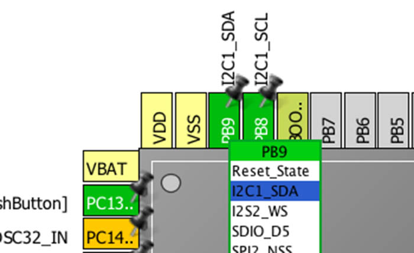</p>

<p align="center">图 14.14：如何在 Nucleo-64 开发板上选择正确的 I2C1 引脚</p>
