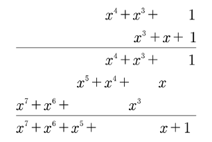
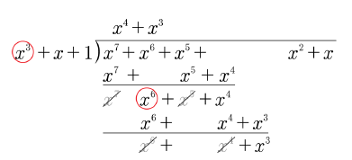
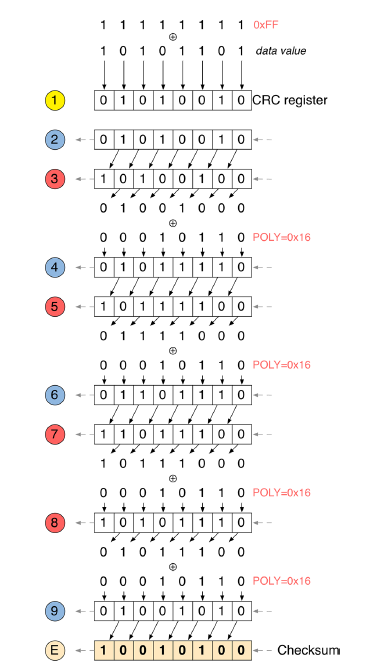
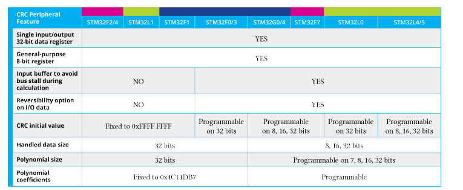

<!-- page: 455 -->

# 16. 循环冗余校验

在数字系统中，数据损坏是完全可能发生的，尤其是在数据通过通信介质传输时。在数字电子学中，消息是一串比特流，其值要么为 0，要么为 1；当其中一个或多个比特在传输过程中意外改变时，消息即被视为损坏。因此，消息交换时总会附带一些额外数据，用于检测原始消息是否已损坏。在第 8 章中，我们分析了与数据传输相关的一种早期错误检测形式：奇偶校验位是附加在消息中的一个额外比特，用于跟踪值为 1 的比特数量是奇数还是偶数（具体取决于奇偶校验的类型）。然而，如果同时有两个或更多比特发生改变，该方法将无法检测到错误。

循环冗余校验（CRC）是一种广泛用于检测数字数据在传输和存储过程中错误的技术。在 CRC 方法中，若干校验位（称为校验和¹）会被附加到待传输的消息上。接收方可以判断校验位是否与数据一致，从而以一定的概率断定传输过程中是否发生了错误。如果是，接收方可以要求发送方重新传输该消息。该技术也应用于某些数据存储设备，例如硬盘驱动器。在这种情况下，磁盘上的每个数据块都会包含特定的校验位，当检测到错误时，硬件可能会自动发起对该数据块的重新读取，或者将错误报告给软件。需要强调的是，CRC 是一种识别损坏消息的有效方法，但并非用于在发生错误时进行纠错

检测到。

由于循环冗余校验（CRC）方法被许多通信外设和协议（如以太网、MODBUS 等）所采用，因此微控制器中通常都配备了能够计算字节流 CRC 校验和的专用硬件外设，从而将 CPU 从在软件中执行此操作的任务中解放出来。所有 STM32 微控制器都提供专用的 CRC 外设，本章将简要介绍如何使用相应的 CubeHAL 模块。

一如既往，在深入实现细节之前，我们首先简要介绍 CRC 技术背后的数学原理²。

## 16.1 CRC 计算简介

CRC 技术基于多项式算术的已知特性。要计算比特流的校验和，可将消息视为一个多项式，并用另一个固定的多项式（称为生成多项式）对其进行除法运算。该运算的余数即为校验和，

¹校验和通常被称为CRC。这种说法并不完全准确，因为CRC是一种特定的差错检测方法，它使用一种定义明确的算法以及一串校验位来检测消息是否已损坏。然而，将校验和称为CRC或CRC码的做法非常普遍。²关于CRC算法的优秀论述见Ross N. Williams撰写的这份在线文档（http://www.zlib.net/crc_v3.txt）

<!-- page: 456 -->

添加到原始消息中。接收方将使用它，并结合生成多项式，来检查消息是否正确。

在实践中，所有 CRC 方法都使用 GF（2ⁿ）中的多项式。GF（pⁿ）代表伽罗瓦域，也称为有限域，即元素数量有限的域。与任何域一样，伽罗瓦域是一个集合，在其上定义了乘法、加法、减法和除法运算，并满足某些基本规则。有限域最常见的例子是模 p 的整数，其中 p 是一个质数。在我们的情况下，p 等于 2，这意味着 GF（2ⁿ）域仅包含两个元素，当 n=1 时：0 和 1。

在 GF（2ⁿ）中，加法和减法是按模 2 进行的，即它们对应于异或逻辑运算。

⊕ 0 1 0 0 1 1 1 0

而乘法则对应于与逻辑运算。

∧0 1 0 0 0 1 0 1

GF（2ⁿ）中的多项式是单变量 x 的多项式，其系数为 0 或 1。CRC 技术将数据消息的位解释为 GF（2ⁿ）中多项式的系数，其次数等于 n −1，其中 n 是消息的长度。例如，假设消息为 111001102，其长度等于 8，这对应于多项式：

x7 · 1 + x6 · 1 + x5 · 1 + x4 · 0 + x3 · 0 + x2 · 1 + x1 · 1 + x0 · 0 = x7 + x6 + x5 + x2 + x

如前所述，在 GF（2ⁿ）中，加法和减法对应于异或逻辑运算。这意味着多项式 x4 + x3 + 1 和 x3 + x + 1 的和等于 x4 + x³。显然，这两个多项式的差也是相同的。

GF（2ⁿ）中多项式的乘法，通常与十进制整数乘法类似，只是跟踪的是 x 的幂次而不是十进制位。例如，将上述两个多项式相乘，我们得到：

³相反，在常规代数中，加法将等于 x4 + 2x3 + x + 2。

<!-- page: 457 -->



如你所见，第一个多项式中的每一项都与第二个多项式中的每一项相乘，然后按照 GF（2ⁿ）中的加法规则将它们相加。

在 GF（2ⁿ）中，一个多项式除以另一个多项式类似于整数的长除法（带余数），区别在于没有借位或进位。例如，让我们用多项式 x3 + x + 1 去除多项式 x7 + x6 + x5 + x2 + x。


首先，用被除数的第一项除以除数的最高次项（即 x 的最高次幂，在本例中为 x3）。然后，将除数乘以刚刚得到的结果（即最终商的第一项）。


现在，按照 GF（2ⁿ）中的减法规则，从原始被除数的相应项中减去刚刚得到的乘积。


重复上述步骤，但这次使用刚刚写出的两项作为被除数。

<!-- page: 458 -->



该过程持续进行，直到所得到的被除数的次数低于除数的次数。至此，我们便得到了除法的余数，该余数即为需要附加到原始消息末尾的校验和。


接收方有两种方式来评估传输的正确性。它可以计算所接收数据前 n 个位的校验和，并验证其是否与最后接收到的 r 个位一致。或者，按照通常的做法，接收方可以将所有接收到的位除以生成多项式，并检查 r 位余数是否为 0。

然而，CRC 计算的具体算法通常与常规多项式除法有所不同。此外，生成多项式可能会定义特定的初始和最终条件，我们很快就会看到这一点。这意味着生成多项式不能随意更改，而是从一组⁴经过充分研究的多项式库中选取。例如，被广泛采用的 CRC-32 多项式具有以下形式：

x26 + x23 + x22 + x16 + x12 + x11 + x10 + x8 + x7 + x5 + x4 + x2 + x + 1

该值可以用二进制序列 000001001100000100011101101101112 表示，也可以用十六进制数 0x04C1 1DB7 表示。许多传输和存储协议都采用了该值，例如以太网、串行 ATA、MPEG-2、BZip2 和 PNG。

### 16.1.1 STM32F1/F2/F4/L1 微控制器中的 CRC 计算

多项式长除法适合进行手动计算。然而，另一种更高效的 CRC 算法是结合按位消息异或（XOR）技术的多项式除法，

⁴http://bit.ly/293h2Hd

<!-- page: 459 -->

该算法适合使用专用硬件电路实现：移位寄存器。

STM32 微控制器中的 CRC 计算过程与由 CRC-32 多项式定义的算法相关，该多项式如下⁵：

- 将 CRC 寄存器初始化为 0xFFFF FFFF 与数据值进行异或（XOR）的结果。
- 逐位移入输入流。如果弹出的最高有效位（MSB）为 ‘1’，则将 CRC 寄存器值与生成多项式进行异或。
- 当所有输入位处理完毕后，CRC 移位寄存器中包含 CRC 值。

假设数据值为 10100101₂ (0xAD)，CRC 多项式为 00010110₂ (0x16)，STM32 微控制器实现的算法工作方式如下（图 16.1 示意了此过程）：

1. 通过 0xFF 与 0xAD 进行异或计算 CRC 寄存器的初始内容。
2. 由于最高有效位（MSB）为 0，CRC 寄存器仅执行左移。
3. 现在 CRC 寄存器的最高有效位为 1。因此，首先左移寄存器，然后与 CRC 多项式 (0x16) 进行异或。
4. 由于最高有效位为 0，CRC 寄存器仅执行左移。
5. 现在 CRC 寄存器的最高有效位为 1。因此，首先左移寄存器，然后与 CRC 多项式 (0x16) 进行异或。
6. 由于最高有效位为 0，CRC 寄存器仅执行左移。
7. 现在 CRC 寄存器的最高有效位为 1。因此，首先左移寄存器，然后与 CRC 多项式 (0x16) 进行异或。
8. 现在 CRC 寄存器的最高有效位为 1。因此，首先左移寄存器，然后与 CRC 多项式 (0x16) 进行异或。
9. 最后，最高有效位再次为 0。因此，对 CRC 寄存器执行左移。最终值代表需要前置到消息中的校验和。

上述算法只是 STM32 微控制器中实际实现算法的简化版。事实上，它因两个主要原因而有所不同：

- CRC 多项式是固定的，对应于 CRC-32 (0x04C1 1DB7)。
- 单个输入/输出数据寄存器宽度为 32 位，且 CRC 校验和是针对整个 32 位寄存器计算的，而不是逐字节计算⁶。

这极大地限制了该外设的实际可用性。

⁵如我们接下来将看到的，STM32F0/F3/F7/L0/L4 微控制器使用一种略有不同且功能更强大的 CRC 外设，不受限于 CRC-32 多项式。 ⁶这与在多个库和在线计算器中实现的算法相比是一个重要区别，后者通常通过将字拆分为子字节来执行 CRC 计算。请参考此帖子(http://bit.ly/29303sh)以及 ST 官方论坛上 clive1 用户（STM32 相关子论坛中最活跃且经验丰富的用户）的另一帖子(http://bit.ly/293067u)。

<!-- page: 460 -->



图 16.1：STM32 中如何计算 CRC 校验和

### 16.1.2 STM32F0/F3/F7/L0/L4/L5/G0/G4 微控制器中的 CRC 外设

在前一段中，我们看到某些 STM32 微控制器提供的 STM32 外设仅限于使用 CRC-32 以太网多项式计算 CRC。此外，每次计算处理的数据大小为 32 位。

在较新的 STM32 系列中，这一限制已被取代。事实上，STM32F0/F3/F7/L0/L4/L5/G0/G4 微控制器提供了更先进的 CRC 外设，如表 16.1 所示。

<!-- page: 461 -->



表 16.1：STM32 微控制器中 CRC 外设的实际实现

在这些微控制器中，CRC 外设默认设计为与 STM32F1/F2/F4/L1 微控制器提供的较简单的 CRC 外设兼容。这意味着，在没有显式配置的情况下，为 STM32F1/F2/F4/L1 微控制器设计的代码可以在 STM32F0/F3/F7/L0/L4 微控制器上运行，且无需任何更改。

## 16.2 HAL_CRC 模块

CubeHAL 提供了一个专用模块来操作 CRC 外设寄存器：HAL_CRC。通过使用 CRC_HandleTypeDef 结构体的实例来引用 CRC 外设。在提供最简单 CRC 外设的 STM32F1/F2/F4/L1 微控制器中，该结构体定义如下：

```text
typedef struct {
CRC_TypeDef
*Instance;
/* CRC registers base address
*/
HAL_LockTypeDef
Lock;
/* CRC locking object */
__IO HAL_CRC_StateTypeDef
State;
/* CRC communication state */
} CRC_HandleTypeDef;
```

唯一相关的字段是 Instance，它是指向 CRC 外设描述符的指针（其基地址由 CRC 宏定义）。

相反，在 STM32F0/F3/F7/L0/L4 微控制器中，CRC_HandleTypeDef 结构体定义如下：

<!-- page: 462 -->

```text
typedef struct {
CRC_TypeDef
*Instance;
/* Register base address
*/
CRC_InitTypeDef
Init;
/* CRC configuration parameters */
HAL_LockTypeDef
Lock;
/* CRC Locking object
*/
__IO HAL_CRC_StateTypeDef
State;
/* CRC communication state
*/
uint32_t InputDataFormat;
/* Specifies input data format. */
} CRC_HandleTypeDef;
```

唯一相关的区别在于存在 Init 字段，该字段用于配置 CRC 外设（我们稍后会看到），以及 InputDataFormat 字段，该字段指定输入数据的大小：它可以取表 16.2 中的值。

表 16.2：CRC 外设的输入数据格式

数据格式 描述

CRC_INPUTDATA_FORMAT_BYTES 输入数据是字节流（8 位数据） CRC_INPUTDATA_FORMAT_HALFWORDS 输入数据是半字流（16 位数据） CRC_INPUTDATA_FORMAT_WORDS 输入数据是字流（32 位数据）

### 要配置这些微控制器中的 CRC 外设，我们使用 CRC_InitTypeDef 结构体的一个实例，其定义方式如下：

```text
typedef struct {
uint8_t DefaultPolynomialUse;
/* Indicates if default polynomial is used */
uint8_t DefaultInitValueUse;
/* Indicates if default init value is used */
uint32_t GeneratingPolynomial;
/* Set CRC generating polynomial */
uint32_t CRCLength;
/* Indicates CRC length */
uint32_t InitValue;
/* Set the initial value to start CRC computation */
uint32_t InputDataInversionMode;
/* Specifies input data inversion mode */
uint32_t OutputDataInversionMode; /* Specifies output data (i.e. CRC) inversion mode */
} CRC_InitTypeDef;
```

### 让我们分析该结构体的字段：

- DefaultPolynomialUse：此字段指示使用的是默认多项式（即 CRC-32）还是自定义多项式。它可以取值为 DEFAULT_POLYNOMIAL_ENABLE 或 DEFAULT_POLYNOMIAL_DISABLE。在后一种情况下，必须设置 GeneratingPolynomial 和 CRCLength 字段。
- DefaultInitValueUse：此字段指示使用的是默认 CRC 初始值（即 0xFFFFFFFF）还是自定义初始值。它可以取值为 DEFAULT_INIT_VALUE_ENABLE 或 DEFAULT_INIT_VALUE_DISABLE。在后一种情况下，必须设置 InitValue 字段。
- GeneratingPolynomial：设置 CRC 生成多项式。对于等于 7、8、16 或 32 的多项式阶数，其值为 7、8、16 或 32 位长。此字段以常规表示法写入，例如，对于 7 阶多项式，X7 + X6 + X5 + X2 + 1 被写为 0x65。
- CRCLength：此字段指示 CRC 的长度，它可以取表 16.3 中的值。

<!-- page: 463 -->

- InitValue：设置用于开始 CRC 计算的自定义初始值。
- InputDataInversionMode：指定输入数据是否需要反转。它可以取表 16.4 中的值。
- OutputDataInversionMode：指定输出数据（计算得到的 CRC）是否需要反转。它可以取值为 CRC_OUTPUTDATA_INVERSION_DISABLE 和 CRC_OUTPUTDATA_INVERSION_ENABLE。在后一种情况下，操作在位级别进行：例如，输出数据 0x11223344 被转换为 0x22CC4488。

表 16.3：CRC 长度

CRC 长度 描述

```text
CRC_POLYLENGTH_32B
32-bit CRC
CRC_POLYLENGTH_16B
16-bit CRC
CRC_POLYLENGTH_8B
8-bit CRC
CRC_POLYLENGTH_7B
7-bit CRC
```

表 16.4：输入数据反转模式

反转模式 描述

```text
CRC_INPUTDATA_INVERSION_NONE
No input data inversion
CRC_INPUTDATA_INVERSION_BYTE
Byte-wise inversion, 0x1A2B 3C4D becomes 0x58D4 3CB2
CRC_INPUTDATA_INVERSION_HALFWORD
Halfword-wise inversion, 0x1A2B 3C4D becomes 0xD458 B23C
CRC_INPUTDATA_INVERSION_WORD
Word-wise inversion, 0x1A2B 3C4D becomes 0xB23C D458
```

一旦定义了 CRC_InitTypeDef 结构体的一个实例，并且其字段被正确填充，我们通过调用以下函数来配置 CRC 外设：

```text
HAL_StatusTypeDef HAL_CRC_Init(CRC_HandleTypeDef *hcrc);
```

要计算数据缓冲区的 CRC 校验和，我们使用以下函数：

```text
uint32_t HAL_CRC_Calculate(CRC_HandleTypeDef *hcrc, uint32_t pBuffer[],
uint32_t BufferLength);
```

该函数接受指向 uint32_t 数组的指针及其长度。如果我们在 STM32F0/F3/F7/L0/L4 微控制器上工作，此函数将默认 CRC 初始值设置为 0xFFFFFFFF，或者设置为指定的值。相反，如果需要从之前计算得到的 CRC 作为初始值开始计算 CRC，则可以使用以下函数：

```text
uint32_t HAL_CRC_Accumulate(CRC_HandleTypeDef *hcrc, uint32_t pBuffer[],
uint32_t BufferLength);
```

当使用大小小于源数据块的临时缓冲区来计算大块数据的 CRC 校验和时，这特别有用。
