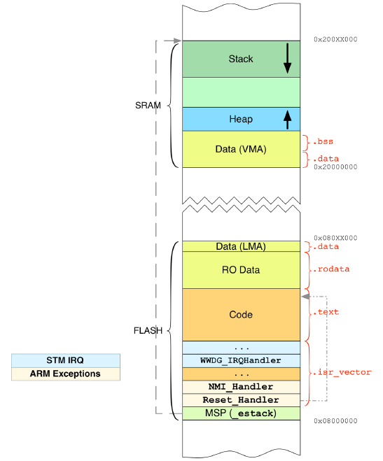
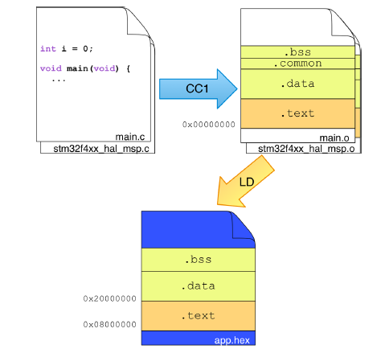
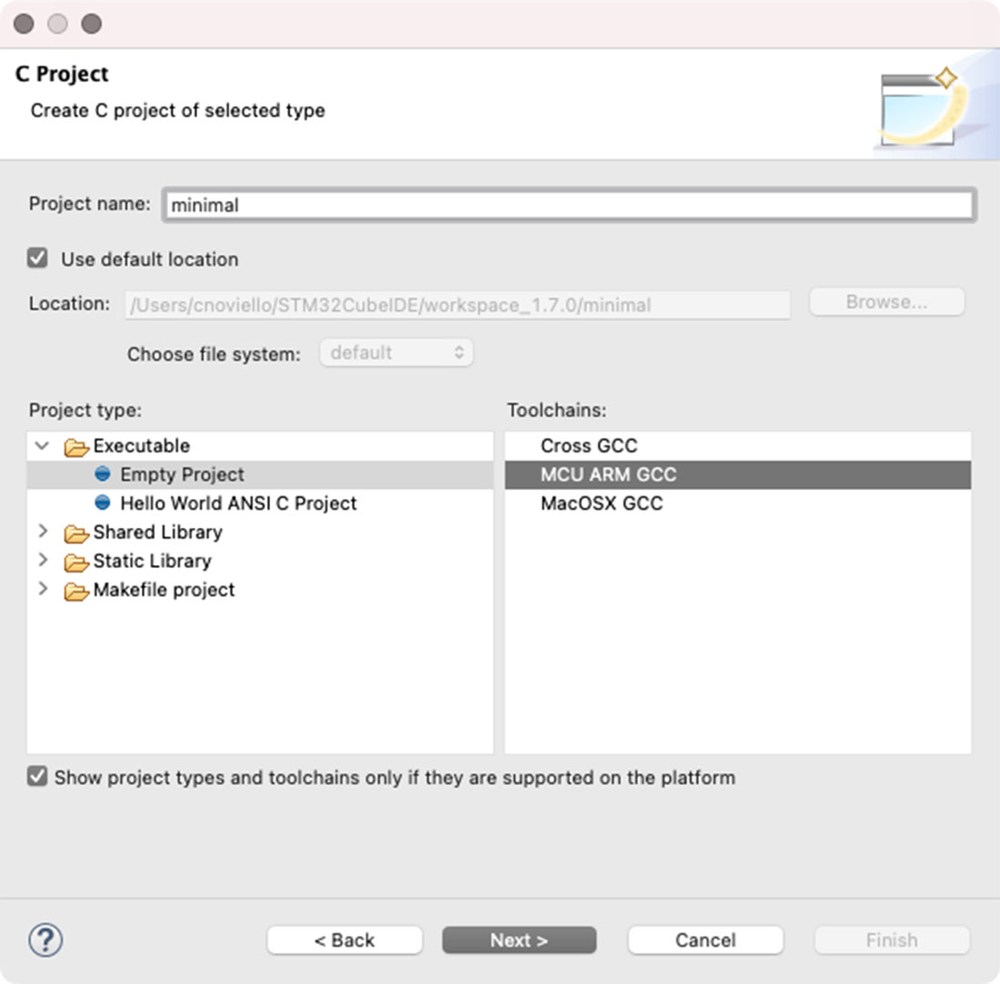
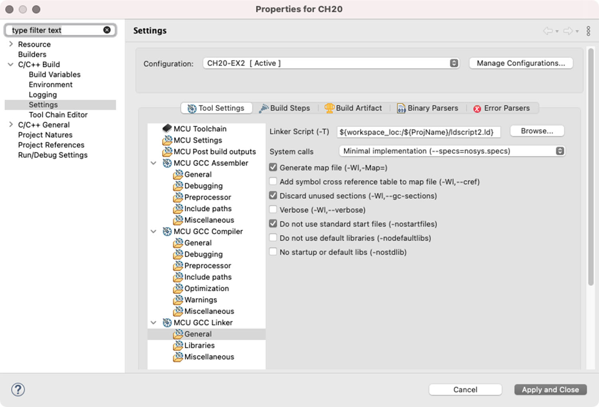
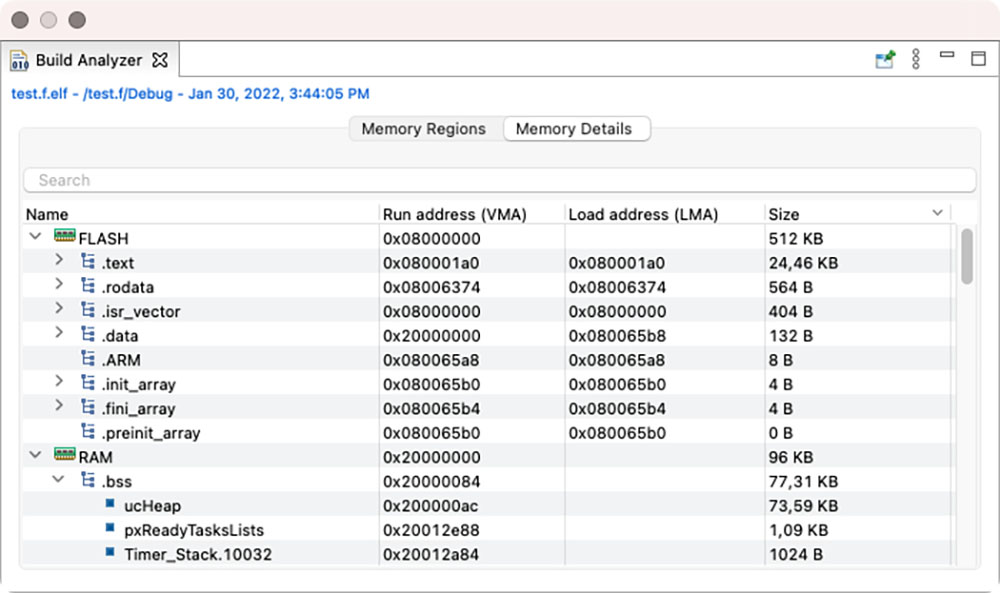
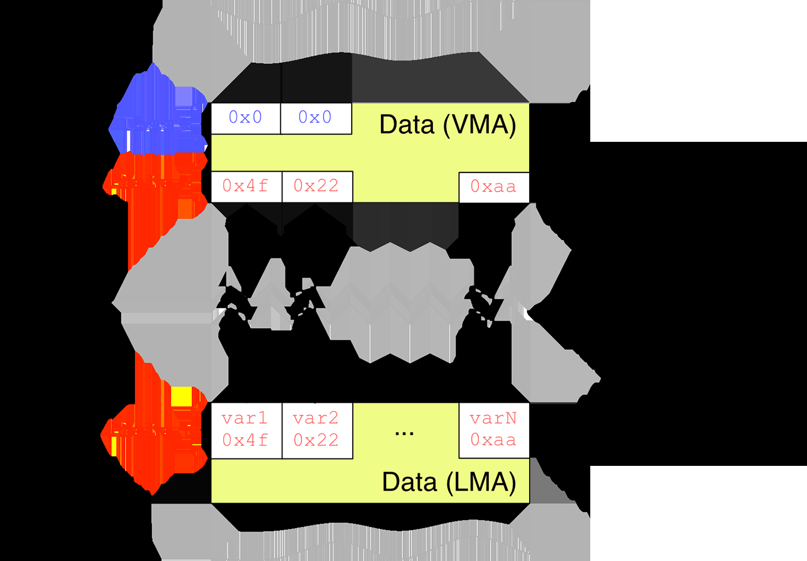
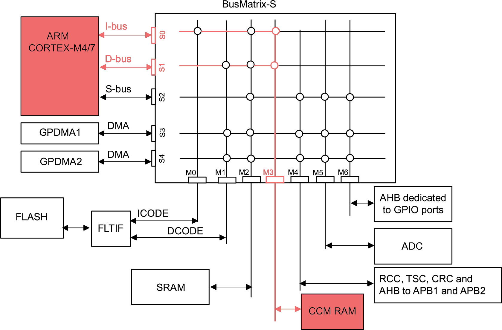
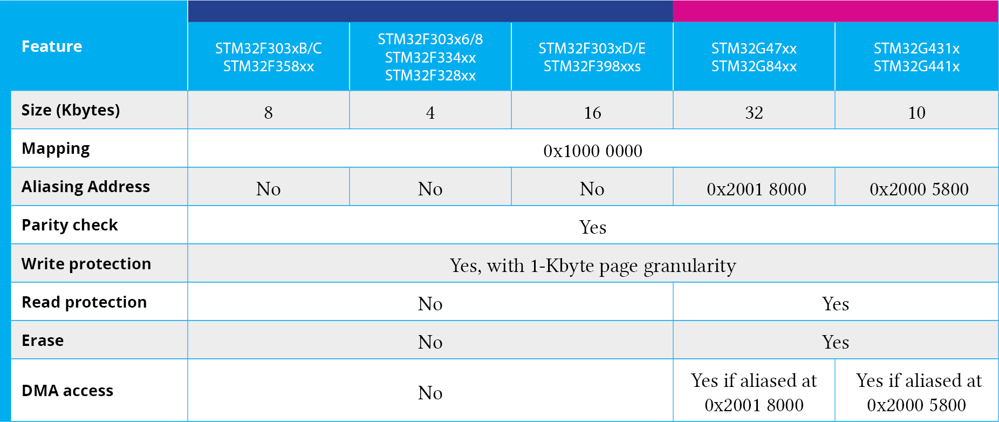

<!-- page: 520 -->

# 20. 内存布局

每次我们使用 GCC ARM 工具链编译固件时，都会发生一系列非平凡的事情。编译器将 C 源代码转换为 ARM 汇编，并对其进行组织，以便烧录到特定的
STM32 微控制器上。每种微处理器架构都定义了一个执行模型，该模型需要与 C
编程语言的执行模型进行“匹配”。这意味着在引导（bootstrap）期间会执行多项操作，其任务是为我们的应用程序准备执行环境：创建栈和堆、初始化数据内存、初始化向量表，这些都只是启动期间执行的活动的一部分。此外，一些
STM32 微控制器提供额外的内存，或者允许使用 FSMC 控制器连接外部内存，这些内存可以在固件生命周期中分配给特定任务。

本章旨在阐明许多 STM32 开发者共同关心的问题。当 MCU 复位时发生了什么？为什么提供 main () 函数是强制性的？MCU
复位后，需要多长时间才开始执行程序？如何将变量存储在闪存（flash）而不是 SRAM 中？如何使用 STM32 的 CCM 内存？

## 20.1 STM32 内存布局模型

在第 1 章中，我们分析了 STM32 微控制器的典型内存布局。图 1.4 显示，前 1GB 地址空间在闪存（FLASH）和 SRAM
内存之间划分。这些内存区域又进一步细分为若干子区域。让我们以图 20.1 为参考，分析它们在典型 STM32 应用中的组织方式。

### 20.1.1 闪存内存的典型组织

在 STM32 微控制器中，内部闪存内存从地址 0x0800 0000¹ 开始映射。在第 7 章中，我们了解到闪存内存的最初几个字节专门用于主栈指针（Main
Stack Pointer, MSP）。MSP 包含栈在 SRAM 中起始位置的地址。Cortex-M 架构允许在 SRAM 内存中放置栈，同时也允许放置在其他内部内存（例如某些
STM32 MCU 中可用的 CCM RAM）或外部内存（连接到 FSMC 控制器）中。这解释了为什么需要 MSP。Cortex-M 架构定义 MSP
之后的内存位置专门用于向量表（vector table），这是一系列指向 ISR 例程的 32 位地址。如表 7.1 所示，该表的长度取决于 Cortex-M
架构。

¹请记住，正如我们接下来将看到的，Cortex-M 架构将 0x0000 0000 地址定义为开始放置 MSP 和向量表的内存位置。这意味着闪存起始地址（0x0800
0000）被别名（aliased）为 0x0000 0000。

<!-- page: 521 -->

除了这些架构约束（我们将在本章后面看到如何“放宽”这些约束）之外，编译器可以自由地根据编程语言执行模型来安排其余的闪存内存。在典型的
ARM-GCC C 应用程序中，通常其余的闪存内存用于存储程序代码、只读数据（也称为 const 数据，因为声明为 const
的变量会自动放置在此内存中）以及初始化数据，即 SRAM 中变量的初始值。

<p align="center"></p>

<p align="center">图 20.1：闪存和 SRAM 内存的典型布局</p>

从编译器的角度来看，这些节（sections）在应用程序二进制文件中传统上以不同的名称命名。例如，包含汇编代码的节名为 .text，包含
const 变量和字符串的节名为 .rodata，而用于已初始化数据的节名为 .data。这些名称在其他计算机架构（如 x86 和
MIPS）中也很常见。另一些名称则是“微控制器世界”特有的。例如，.isr_vector 节专门用于在基于 Cortex-M 的 MCU
中存储向量表。然而，这些节的数量和命名是明确定义的，并且遵循一个更通用的规范，称为 ARM 嵌入式

<!-- page: 522 -->

应用程序二进制接口（Embedded Application Binary Interface, EABI）。该规范规定了 ELF² 二进制文件必须提供多少个节以及什么类型的节，以便所有固件应用程序都能在给定的
Cortex-M 架构上正确加载和执行。

### 20.1.2 SRAM 内存的典型组织

内部 SRAM 存储器从地址 0x2000 0000 开始映射，并且也组织为若干子区域。一个从 SRAM 末尾开始并向下增长（即其基地址具有最高的
SRAM 地址）的可变大小区域专门用于栈。这是因为 Cortex-M 内核使用一种称为满递减栈（full-descending stack）的栈内存模型。主栈指针（Main
Stack Pointer, MSP）在编译时计算，并存储在 0x0800 0000 闪存存储器位置，如前所述。一旦我们调用一个函数，一个新的栈帧（stack
frame）就会被推入栈。这意味着指向当前栈帧的指针（SP）在每次函数调用时会自动递减（这意味着 ARM 汇编 push 指令会自动递减它）。

SRAM 还用于存储变量数据，该区域通常从 SRAM 的开头（0x2000 0000）开始。该区域又进一步分为已初始化和未初始化数据。为了理解其中的区别，让我们考虑以下代码片段：

```c
...
uint8_t var1 = 0xEF;
uint8_t var2;
...
```

var1 和 var2 是两个全局变量。var1 是一个已初始化变量（我们在编译时固定其起始值），而 var2 的值是未初始化的：在 MCU
复位后的最初几条指令中，一组专用例程通过设置 var2 为零并将 var1 设置为存储在闪存存储器中 .data 节内的值来初始化它们。我们将在本章后面研究这些操作。

最后，SRAM 内存可能包含另一个增长区域：堆（heap）。它存储在执行固件期间动态分配的变量（通过使用 C malloc ()
例程或类似例程）。该区域可以根据使用的分配器进一步组织为若干子区域（在下一章中，我们将看到 FreeRTOS
如何提供多个分配器来处理动态内存分配）。堆向上增长（即其区域内的基地址是最低的），并且具有固定的最大大小。

由于每个 STM32 MCU 都有自己特定数量的 SRAM 和闪存，并且每个程序都有可变数量的指令和变量，因此这些节在内存中的尺寸和位置在不同的
MCU 之间有所不同。在我们看到如何指示编译器为特定 MCU 生成二进制文件之前，我们必须理解生成目标文件期间涉及的所有步骤和工具。

²ELF 是 Executable and Linkable Format（可执行和可链接格式）的缩写，它是可执行文件、目标代码、共享库和核心转储的通用标准文件格式。它是类
UNIX 系统（Linux 和 MacOS 也使用此格式）和基于 ARM 环境的典型文件格式。

<!-- page: 523 -->

### 20.1.3 理解编译和链接过程

从 C 源代码的编译到生成最终用于烧录到我们微控制器（MCU）的二进制映像的过程，涉及 GCC 工具链提供的多个步骤和工具。图 20.2
试图概述这一过程。一切始于 C 源文件。它们通常包含以下程序结构。

<p align="center"></p>

<p align="center">图 20.2：从源文件到最终二进制映像的编译过程</p>

- 全局变量：这些变量可以进一步分为未初始化和已初始化变量；全局变量也可以定义为静态（static），即其可见性仅限于当前源文件。
- 局部变量：这些变量可以分为简单的局部变量（也称为自动变量）和静态局部变量（即那些生命周期贯穿整个程序运行期间的变量）。
- 常量数据：这些可以进一步分为常量数据类型（例如 `const int c = 5`）和字符串常量（例如 `"Hello World!"`）。
- 例程：这些构成了程序，它们将被翻译为汇编指令。
- 外部资源：这些既包括全局变量（声明为 `extern`），也包括在其他源文件中定义的例程。链接器的工作是“链接”指向这些在其他源文件中定义的符号的引用，并合并来自相应二进制文件的节（section）。

一旦源文件被编译，上述程序结构就被映射到二进制文件中的特定节中。表 20.1 总结了其中最重要的部分。

<!-- page: 524 -->

表 20.1：程序结构与二进制文件节的映射

| 语言结构             | 二进制文件节 | 运行时内存区域    |
|:---------------------|:-------------|:------------------|
| 全局未初始化变量     | .common      | 数据 (SRAM)       |
| 全局已初始化变量     | .data        | 数据 (SRAM+Flash) |
| 全局静态未初始化变量 | .bss         | 数据 (SRAM)       |
| 全局静态已初始化变量 | .data        | 数据 (SRAM+Flash) |
| 局部变量             | <无特定节>   | 栈或堆 (SRAM)     |
| 局部静态未初始化变量 | .bss         | 数据 (SRAM)       |
| 局部静态已初始化变量 | .data        | 数据 (SRAM+Flash) |
| 常量数据类型         | .rodata      | 代码 (Flash)      |
| 常量字符串           | .rodata.1    | 代码 (Flash)      |
| 例程                 | .text        | 代码 (Flash)      |

对于组成我们应用程序的每个源文件 (.c)，编译器将生成一个对应的目标文件 (.o)，其中包含表 20.1
中的节³。目标文件是一种遵循公认标准的二进制文件类型。现有的二进制文件格式标准很多（PE、COFF、ELF 等）。GCC ARM 使用的是
ELF32，这是一个非常流行的开放标准，由于其在基于 Linux 的操作系统中的使用而广受欢迎，并且即使像 ST-LINK GDB Server 和
STM32CubeProgrammer 这样的其他工具也广泛支持它。然而，以 .o⁴ 结尾的文件是一种特殊类型的目标文件。这些也被称为可重定位文件（relocatable
files）。这个名字源于该类型文件中包含的所有内存地址都是相对于同一文件的，并从 0x0000 0000 地址开始。这意味着 .text
节也将从该地址开始，我们知道这与 STM32 MCU⁵ 中闪存内存的起始地址（0x0800 0000）是矛盾的。

从一系列可重定位文件（加上一些我们稍后会看到的配置文件）开始，链接器将组装它们的内容以形成一个合并后的目标文件，该文件将代表我们要烧录到
MCU 上的固件。在这个称为链接（linking）的过程中，链接器将所有相对地址重定位到实际的内存地址。这种类型的文件也被称为绝对目标文件（absolute
file），因为所有地址都是绝对的，并且特定于给定的 STM32 MCU⁶。

链接器如何知道将绝对目标文件中包含的节放置在内存中的哪个位置？这要归功于链接脚本（那些在根 STM32CubeIDE 项目文件夹中以 .ld
结尾的文件 - 例如，对于 STM32F072RB MCU 的 STM32F072RBTX_FLASH.ld），我们可以根据实际的内存布局来安排绝对目标文件的内容。

³ 重要的是要强调，目标文件包含更多的节。其中大多数与调试有关，并包含相关信息，如原始源代码、源文件中包含的所有符号（即使那些已被编译器优化的符号）等。然而，为了本次讨论的目的，最好将它们排除在外。⁴
请注意，从编译器的角度来看，文件扩展名只是一种约定。⁵ 想要深入研究此问题的读者可以查看 GCC ARM 工具链中提供的 readelf 工具。⁶
这里，故事再次变得更加复杂。首先，链接器可以从多个外部静态链接库（那些以 .a 结尾的库）中组装其他部分。这些库，也称为归档文件（archive
files），只不过是多个可重定位文件的合并。在链接过程中，只有我们应用程序中使用的程序结构才会与最终固件合并。另一个值得注意的重要方面是，这个过程对于每个微处理器平台（如
x86
等）基本上都是一样的，也被称为静态链接。功能更强的体系结构还会使用更高级的链接机制，即动态链接；它将链接推迟到程序加载到操作系统进程时进行。这允许大幅减小可执行文件的大小，并在不重新编译整个应用程序的情况下更新依赖库。在动态链接中，库被称为共享对象（或共享库，或在
Windows 中的 DLL），在现代操作系统中，通过使用 mmap () 或类似的系统调用，可以在使用这些库的进程之间共享来自这些库的相同
.text 节。这允许减少磁盘空间以及进程占用的 SRAM（想想在现代 PC 上运行的多个进程之间应该“复制”的大量系统库）。

<!-- page: 525 -->

由于如果我们之前没有掌握几个概念，研究这些脚本文件的内容可能真的很难，最好先从构建一个最精简的 STM32 应用程序开始，逐步理解这些概念。

## 20.2 极简 STM32 应用程序

迄今为止看到的大多数应用程序看起来都非常简单。然而，无论是从内存组织的角度，还是从微控制器启动时执行的操作来看，它们在底层已经执行了大量操作。因此，我们将构建一个真正的基础应用程序。

第一步是使用 STM32CubeIDE 创建一个空项目。转到 File->New->C/C++ Project 菜单。在下一个对话框中选择 C Managed Build 类型，并点击
Next。在下一个对话框中，在 Project type 树视图中选择 Executable->Empty Project，并在 Toolchains 部分选择 MCU ARM GCC，如图
20.3 所示。选择一个 Project name 并点击 Next。跳过下一个向导步骤，进入 Select default target for the project。通过点击
Select 按钮选择开发板上的微控制器，然后点击 Finish。

<p align="center"></p>

<p align="center">图 20.3：用于生成极简 STM32 应用程序的项目设置</p>

现在创建一个名为 main.c 的新 C 文件（File->New->Source File），并在其中放置以下代码⁷。

⁷此代码专为 Nucleo-F401RE 设计。其他 Nucleo 开发板请参考本书示例。

<!-- page: 526 -->

**文件名：** `/main-ex1.c`

```c
1   typedef unsigned long uint32_t;
2
3   /* Memory and peripheral start addresses (common to all STM32 MCUs) */
4   #define FLASH_BASE      0x08000000
5   #define SRAM_BASE       0x20000000
6   #define PERIPH_BASE     0x40000000
7
8   /* Work out end of RAM address as initial stack pointer
9    * (specific of a given STM32 MCU */
10  #define SRAM_SIZE       96*1024       // STM32F401RE has 96 KB of RAM
11  #define SRAM_END        (SRAM_BASE + SRAM_SIZE)
12
13  /* RCC peripheral addresses applicable to GPIOA
14   * (specific of a given STM32 MCU */
15  #define RCC_BASE        (PERIPH_BASE + 0x23800)
16  #define RCC_APB1ENR     ((uint32_t*)(RCC_BASE + 0x30))
17
18  /* GPIOA peripheral addresses
19   * (specific of a given STM32 MCU */
20  #define GPIOA_BASE      (PERIPH_BASE + 0x20000)
21  #define GPIOA_MODER     ((uint32_t*)(GPIOA_BASE + 0x00))
22  #define GPIOA_ODR       ((uint32_t*)(GPIOA_BASE + 0x14))
23
24  /* User functions */
25  int main(void);
26  void delay(uint32_t count);
27
28  /* Minimal vector table */
29  uint32_t *vector_table[] __attribute__((section(".isr_vector"))) = {
30    (uint32_t *)SRAM_END,     // initial stack pointer
31    (uint32_t *)main          // main as Reset_Handler
32  };
33
34  int main() {
35    /* Enable clock on GPIOA peripheral */
36    *RCC_APB1ENR = 0x1;
37    /* Configure the PA5 as output pull-up */
38    *GPIOA_MODER |= 0x400;    // Sets MODER[11:10] = 0x1
39
40    while(1) {
41      *GPIOA_ODR = 0x20;
42      delay(200000);
43      *GPIOA_ODR = 0x0;
44      delay(200000);
45    }
46  }
47
48  void delay(uint32_t count) {
49    while(count--);
50  }
```

<!-- page: 527 -->

前 21 行仅包含定义最常见 STM32 外设地址的宏。其中一些是通用的，另一些则是特定于给定微控制器的。在第 26
行，我们定义了向量表。由于是“极简”的，它仅包含两项内容：SRAM 中主栈指针（Main Stack Pointer, MSP）的地址（请记住，这是向量表的第一项，且必须放置在
0x0800 0000 地址处）以及指向 Reset 异常处理程序的指针。我们具体在做什么？

在第 7 章中，我们提到当微控制器复位时，NVIC 控制器会在几个周期后生成一个 Reset 异常。这意味着相应的
ISR（中断服务程序）是我们应用程序的真正入口点，固件的执行从那里开始。在这里，我们将 main () 函数定义为 Reset 异常的处理程序。GCC
扩展的 `__attribute__((section(".isr_vector")))` 属性告诉编译器将 vector_table 数组放置在名为 .isr_vector
的节中，该节进而包含在目标文件 main.o 中。最后，main () 例程除了经典的 LED 闪烁应用程序外不包含其他内容。

准备好 C 源文件后，我们可以继续处理 GNU LD 链接器脚本。创建一个名为 LinkerScript.ld 的新文件（File->New->Other… 然后选择
General->File），并在其中放入以下内容。

<p align="center"></p>

<p align="center">图 20.4：用于设置 LD 配置脚本的项目设置</p>

<!-- page: 528 -->

**文件名：** `ldscript.ld`

```ld
1   /* memory layout for an STM32F401RE */
2
3   MEMORY
4   {
5     FLASH (rx)  : ORIGIN = 0x08000000, LENGTH = 512K
6     SRAM (xrw)  : ORIGIN = 0x20000000, LENGTH = 96K
7   }
8
9   ENTRY(main)
10
11  /* output sections */
12  SECTIONS
13  {
14    /* Program code into FLASH */
15    .text : ALIGN(4)
16    {
17      *(.isr_vector)     /* Vector table */
18      *(.text)           /* Program code */
19      KEEP(*(.isr_vector))
20    } >FLASH
21
22    /* Initialized global and static variables (which
23       we don't have any in this example) into SRAM */
24    .data :
25    {
26      *(.data)
27    } >SRAM
28  }
```

让我们看看这个文件的内容。第 [3:7] 行包含闪存和 SRAM 存储器的定义。每个区域可以有多个属性（w=可写，r=可读，x=可执行）。我们还指定了它们的起始地址和长度（在上面的示例中，它们与
STM32F401RE 微控制器相关）。第 9 行指定 main () 函数作为我们应用程序的入口点⁸。第 [12:28] 行定义了 .text 和 .data
节的内容。.text 节首先由向量表组成，然后由程序代码组成。通过 ALIGN (4) 指令，我们表示该节是按字（4 字节）对齐的，而 >FLASH 指令指定
.text 节将放置在闪存存储器中。KEEP (*(.isr_vector)) 告诉 LD 在最终绝对目标文件中保留向量表，否则该节可能会被对最终文件执行优化的其他工具“剥离”。最后，.data
节也被定义（即使在此示例中不包含任何内容），并放置在 SRAM 存储器中。

STM32CubeIDE 生成的项目已经配置为向 GNU LD 传递一个名为 LinkerScript.ld 的脚本文件。如果需要更改文件名，请转到 Project
Properties-

⁸ENTRY () 指令在嵌入式应用程序中没有意义，因为实际的入口点对应于 Reset 异常的处理程序。然而，它可能对调试器和模拟器具有信息价值，因此你会在
ST 官方的 LD 链接器脚本中找到它。

<!-- page: 529 -->

STM32CubeIDE 生成的项目已配置为向 GNU LD 传递名为 `LinkerScript.ld` 的脚本文件。如需更改文件名，请进入
`Project Properties -> C/C++ Build -> Settings -> MCU GCC Linker -> General`。其中的 `Linker Script (-T)` 项设置为
`${workspace_loc:/${ProjName}/LinkerScript.ld}`，如图 20.4 所示。

此外，为使本章示例能正常编译，还必须如图 20.4 所示启用 `Do not use standard start files (-nostartfiles)`
选项。这样可避免链接器向最终二进制文件加入 C 运行时（CRT）初始化例程 `_mainCRTStartup()`；该例程需要更完整的链接脚本才能在启动时完成初始化。

恭喜：几乎不可能拥有比这更小的 STM32 应用程序⁹。

### 20.2.1 ELF 二进制文件检查

可以使用 GNU MCU 工具链¹⁰提供的一系列工具来检查 ELF 二进制文件。objdump 和 readelf
是最常用的两个。描述它们的使用方法超出了本书的范围；不过，强烈建议花些时间尝试它们的命令行选项。理解二进制文件是如何构建的，可以极大地提升对底层机制的认知。例如，使用
-h 参数运行 objdump 会显示固件二进制文件¹¹中包含的所有节（section）的内容。

```console
# ~/gcc-arm/bin/arm-none-eabi-objdump -h CH20.elf
CH20.elf:     file format elf32-littlearm

Sections:
Idx Name          Size      VMA       LMA       File off  Algn
  0 .text         00000008  08000000  08000000  00008000  2**2
                  CONTENTS, ALLOC, LOAD, READONLY, DATA
  1 .text.main    00000040  08000008  08000008  00008008  2**2
                  CONTENTS, ALLOC, LOAD, READONLY, CODE
  2 .text.delay   00000020  08000048  08000048  00008048  2**2
                  CONTENTS, ALLOC, LOAD, READONLY, CODE
  3 .comment      00000070  00000000  00000000  0000b1d2  2**0
                  CONTENTS, READONLY
  4 .ARM.attributes 00000033 00000000  00000000  0000b242  2**0
                  CONTENTS, READONLY
```

查看上述输出，我们可以看到二进制文件中各节的一些特性。每个节都有一个以字节为单位的大小，以及两个地址：虚拟内存地址（VMA）和加载内存地址（LMA）。在
STM32 微控制器等嵌入式系统中，VMA 是固件开始执行时该节所处的地址，LMA 则是该节加载时所在的地址。在大多数情况下，两者相同；对于
.data 节，它们则不同，下一节将对此说明。

每个节都有几个属性，它们告诉加载器（在我们的例子中，例如，加载器是 GDB 与 ST-LINK GDB Server 的组合，或者是
STM32CubeProgrammer 工具）如何处理给定的节。让我们看看它们的含义：

⁹当然，用汇编来编写还能进一步节省一些空间，不过这本书可不是写给“受虐狂”的 ;-D

¹⁰https://bit.ly/3AiMj4e

¹¹运行该命令时，您会看到更多与调试相关的节。这里没有显示它们，因为调试信息已通过 `arm-none-eabi-strip` 命令从文件中“剥离”。

<!-- page: 530 -->

- CONTENTS：此属性告诉加载器，二进制文件中的该节包含要加载到最终 LMA 地址的数据。正如我们接下来将看到的，.bss 节在二进制文件中没有内容。
- ALLOC：这表示在 LMA 内存（可以是闪存和 SRAM 内存）中分配相应的空间。分配空间的大小由 Size 列给出。
- LOAD：这表示将二进制文件中该节包含的数据加载到最终的 LMA 内存中。
- READONLY：这表示该节的内容是只读的。
- CODE：这表示该节的内容是二进制代码。

从之前的输出中还可以看到，二进制文件为源代码中的每个可调用单元（函数/例程）（callable）保留一个专用节（main () 对应
.text.main，delay () 对应 .text.delay）。我们必须通过以下方式修改链接器脚本，告诉链接器将所有 .text 节合并为单一节：

```ld
.text : ALIGN(4)
{
  *(.isr_vector)     /* Vector table */
  *(.text)           /* Program code */
  *(.text*)          /* Merge all .text.* sections inside the .text section */
  KEEP(*(.isr_vector))
} >FLASH
```

正如我们稍后将会看到的，为源代码中的每个函数分配独立节，使我们能够将某些函数选择性地放置在不同的存储器中（例如，某些 STM32
微控制器中的快速 CCM 存储器）。

最后，File off 列指定了节在二进制文件中的偏移量，而 Algn 列指示内存中的数据对齐方式，这里是 4 字节。

<p align="center">STM32CubeIDE 构建分析器</p>


[!]STM32CubeIDE 提供了一个非常有用的工具，用于可视化检查 ELF 二进制文件。它被称为构建分析器（Build Analyzer），可以通过前往
Window->Show view->Build Analyzer 作为可选视图使用。此视图提供两个选项卡。第二个选项卡，称为 Memory Detail，包含基于 ELF
文件的详细程序信息。不同的链接器节名称以地址和大小信息呈现。每个节都可以展开和折叠。当展开一个节时，会列出该节中的函数/数据。每个呈现的函数/数据都包含地址和大小信息。有关构建分析器的更多信息，请参阅专门介绍高级调试的章节。

<!-- page: 531 -->

<p align="center"></p>

<p align="center">构建分析器视图</p>

### 20.2.2 .data 和 .bss 节的初始化

让我们对前面的示例做一个小的修改。

```c
36  volatile uint32_t dataVar = 0x3f;
37
38  int main() {
39    /* enable clock on GPIOA and GPIOC peripherals */
40    *RCC_APB1ENR = 0x1 | 0x4;
41    *GPIOA_MODER |= 0x400;    // Sets MODER[11:10] = 0x1
42
43    while(dataVar == 0x3f) { // This is always true
44      *GPIOA_ODR = 0x20;
45      delay(200000);
46      *GPIOA_ODR = 0x0;
47      delay(200000);
48    }
49  }
```

这次我们使用一个全局初始化变量 dataVar 来控制 LED 闪烁循环。该变量被声明为
volatile，仅仅是为了避免编译器对其进行优化（不过，在编译此示例时，请在项目设置中禁用所有优化 [-ON]
）。查看代码，我们可以得出结论，它执行的操作与前面的示例相同。然而，如果你尝试将程序烧录到 Nucleo 开发板上，你会发现 LD2 LED
不会闪烁。这是为什么？

为了理解正在发生的事情，我们需要回顾一些 C 编程语言的知识。考虑以下代码片段：

<!-- page: 532 -->

```c
...
uint32_t globalVar = 0x3f;
void foo() {
  volatile uint32_t localVar = 0x4f;
  while(localVar--);
}
```

这里有两个变量：一个定义在全局作用域，另一个是局部变量。localVar 变量被初始化为值 0x4f。这具体是什么时候发生的？初始化是在调用
foo () 例程时执行的，如下面的汇编代码所示：

```asm
1   void foo() {
2     0:   b480       push    {r7}          ;Save the current FP
3     2:   b083       sub     sp, #12       ;Allocate 12 bytes on the stack
4     4:   af00       add     r7, sp, #0    ;Save the new FP
5     volatile uint32_t localVar = 0x4f;
6     6:   234f       movs    r3, #79       ;Place 0x4f in r3
7     8:   607b       str     r3, [r7, #4]  ;Store r3 (that is 0x4f) in the 4-th byte
8
9     while(localVar--);
10    a:   bf00       nop
11    c:   687b       ldr     r3, [r7, #4]
12    e:   1e5a       subs    r2, r3, #1
13   10:   607a       str     r2, [r7, #4]
14   12:   2b00       cmp     r3, #0
15   14:   d1fa       bne.n   c <foo+0xc>
16  }
```

地址 0x0 处的指令将当前的帧指针（Frame Pointer, FP）¹² 保存到栈中。第 [2:4] 行是函数序言（prolog）。每个例程负责分配自己的栈帧并保存一些
CPU 内部寄存器。这也称为调用约定（calling convention），其执行方式由特定标准定义（对于基于 ARM 的处理器，由 ARM
体系结构过程调用标准（AAPCS）定义）。我们在这里不会深入讨论这个问题，因为我们将在第 24 章中更好地分析 ARM 调用约定。

我们感兴趣的指令位于第 [5:6] 行。在这里，我们将值 0x4f（即十进制的 79）存储在通用寄存器 R3 中，然后将其内容写入栈中的第二个
32 位字，这对应于 localVar 变量 ¹³。

汇编代码的剩余部分包含 while (localVar--) 和函数尾声（epilog）（此处未显示），后者负责在返回调用者函数之前恢复状态。

¹² 帧指针是一个特殊的指针，用于将函数参数与局部变量分隔开。有关此寄存器的更多详细信息，请参见此处 (https://bit.ly/1ngLrop)。
¹³ 重要的是要澄清，上述汇编代码是在禁用所有优化的情况下生成的。

<!-- page: 533 -->

因此，调用约定定义了局部变量在函数调用时自动初始化。那么全局变量呢？由于它们不参与调用过程，因此需要在 MCU
复位时由某些特定代码进行初始化（请记住，SRAM 是易失性的，复位后其内容未定义）。这意味着我们必须提供一个特定的初始化函数。

以下例程可用于简单地将包含初始化值的闪存区域的内容复制到专门用于全局初始化变量的 SRAM 区域。

```c
void __initialize_data (unsigned int* flash_begin, unsigned int* data_begin,
                        unsigned int* data_end) {
  unsigned int *p = data_begin;
  while (p < data_end)
    *p++ = *flash_begin++;
}
```

<p align="center"></p>

<p align="center">图 20.3：将已初始化数据从闪存复制到 SRAM 内存的过程</p>

在使用这个例程之前，还需要定义其他几件事。首先，需要指示链接器（LD）将 .data 节中包含的每个变量的初始化值存储在闪存内存的特定区域中，这将对应于
LMA 内存地址。其次，我们需要一种方法将 .data 节在 SRAM 中的起始和结束位置（我们将分别称为 _sdata 和 _
edata）以及初始化值在闪存内存中存储的起始位置（我们将称为 _sidata）传递给 __initialize_data ()
函数（重要的是要强调，当我们把一个变量初始化为给定值时，我们需要将该值存储在闪存的某个地方，并使用它来初始化对应于该变量的
SRAM 位置）。图 20.3 示意了这一过程。

<!-- page: 534 -->

再次说明，所有这些操作都可以通过链接脚本完成，我们可以按以下方式修改它：

```ld
25  /* Used by the startup to initialize data */
26  _sidata = LOADADDR(.data);
27
28  .data : ALIGN(4)
29  {
30    . = ALIGN(4);
31    _sdata = .;            /* create a global symbol at data start */
32
33    *(.data)
34    *(.data*)
35
36    . = ALIGN(4);
37    _edata = .;            /* define a global symbol at data end */
38  } >SRAM AT>FLASH
```

第 26 行的指令定义了符号 _sidata，它包含 .data 节的 LMA 地址（即保存初始化值的闪存存储器起始地址）。第 [30:31]
行的指令使用了一个特殊运算符，即“.”运算符。它称为位置计数器（location
counter），用于跟踪生成每个节时所达到的内存位置。位置计数器会分别计算每个内存区域（SRAM、闪存等）中的位置。例如，在上面的代码中，.data
节是加载到 SRAM 中的第一个节，因此它从 0x2000 0000 开始。当执行两条指令 *(.data) 和 *(.data*) 时，位置计数器会增加文件中所有
.data 节的大小。通过指令 . = ALIGN (4);，我们只是强制位置计数器进行字对齐。因此，_sdata 的值为 0x2000 0000，而 _edata 等于
.data 节的大小（在本例中，.data 节只包含变量 dataVar，因此大小为 0x2000 0004）。最后，指令 >SRAM AT>FLASH 告诉链接器，.data 节的
VMA 地址绑定到 SRAM 地址空间（因此为 0x2000 0000），而 LMA 地址（即存储初始化值的位置）映射在闪存存储器空间中。

得益于这种新的内存布局配置，我们现在可以按以下方式安排 main.c 文件：

<!-- page: 535 -->

**文件名：** `main-ex2.c`

```c
22  void _start (void);
23  int main(void);
24  void delay(uint32_t count);
25
26  /* Minimal vector table */
27  uint32_t *vector_table[] __attribute__((section(".isr_vector"))) = {
28    (uint32_t *)SRAM_END,     // initial stack pointer
29    (uint32_t *)_start        // main as Reset_Handler
30  };
31
32  // Begin address for the initialisation values of the .data section.
33  // defined in linker script
34  extern uint32_t _sidata;
35  // Begin address for the .data section; defined in linker script
36  extern uint32_t _sdata;
37  // End address for the .data section; defined in linker script
38  extern uint32_t _edata;
39
40
41  volatile uint32_t dataVar = 0x3f;
42
43  inline void
44  __initialize_data (uint32_t* flash_begin, uint32_t* data_begin,
45                     uint32_t* data_end) {
46    uint32_t *p = data_begin;
47    while (p < data_end)
48      *p++ = *flash_begin++;
49  }
50
51  void __attribute__ ((noreturn,weak))
52  _start (void) {
53    __initialize_data(&_sidata, &_sdata, &_edata);
54    main();
55
56    for(;;);
57  }
58
59  int main() {
60
61    /* enable clock on GPIOA and GPIOC peripherals */
62    *RCC_APB1ENR = 0x1 | 0x4;
63    *GPIOA_MODER |= 0x400;    // Sets MODER[11:10] = 0x1
64
65    while(dataVar == 0x3f) {
66      *GPIOA_ODR = 0x20;
67      delay(200000);
68      *GPIOA_ODR = 0x0;
69      delay(200000);
70    }
71  }
```

入口点现在是 _start () 例程，它被用作复位（Reset）异常的处理程序。当微控制器复位时，该函数会被自动调用，进而调用 __
initialize_data () 函数，并传入由链接器在链接过程中计算出的参数 _sidata、_sdata 和 _edata。随后，_start () 调用 main ()
例程，此时 main () 能够按预期工作。

使用 objdump 工具，我们可以检查 ELF 文件中各节（section）的组织方式。

```console
# ~/gcc-arm/bin/arm-none-eabi-objdump -h CH20.elf
CH20.elf:     file format elf32-littlearm

Sections:
Idx Name          Size      VMA       LMA       File off  Algn
  0 .text         000000c0  08000000  08000000  00008000  2**2
                  CONTENTS, ALLOC, LOAD, READONLY, CODE
  1 .data         00000004  20000000  080000c0  00010000  2**2
                  CONTENTS, ALLOC, LOAD, DATA
  2 .comment      00000070  00000000  00000000  00010004  2**0
                  CONTENTS, READONLY
  3 .ARM.attributes 00000033 00000000  00000000  00010074  2**0
                  CONTENTS, READONLY
```

如您所见，工具确认 .data 节的大小为 4 字节，VMA 地址为 0x2000 0000，LMA 地址为 0x0800 00c0，这对应于 .text 节的末尾。

同样的情况也适用于 .bss 节，该节用于未初始化变量。根据 ANSI C 标准，该节的内容必须初始化为 0。然而，.bss
节并没有一个包含全零的对应闪存区域，而是由启动代码负责初始化该区域。以下链接脚本片段展示了 .bss 节的定义¹⁴：

¹⁴请注意，链接脚本中节的顺序反映了它们在内存中的顺序。如果我们有两个节，分别命名为 A 和 B，且都加载到 SRAM 中，如果节 A 定义在节
B 之前，那么 A 将被放置在 SRAM 中 B 之前的位置。

<!-- page: 537 -->

```ld
30  /* Uninitialized data section */
31  .bss (NOLOAD): ALIGN(4)
32  {
33    /* This is used by the startup in order to initialize the .bss section */
34    _sbss = .;              /* define a global symbol at bss start */
35    *(.bss .bss*)
36    *(COMMON)
37
38    . = ALIGN(4);
39    _ebss = .;              /* define a global symbol at bss end */
40  } >SRAM
```

以下例程始终由 `_start()` 调用，用于将 SRAM 中的 `.bss` 区域清零：

```c
void __initialize_bss (unsigned int* bss_begin, unsigned int* bss_end) {
  unsigned int *p = bss_begin;
  while (p < bss_end)
    *p++ = 0;
}
```

以如下方式修改 `main()` 例程，可以检查所有功能是否正常工作：

**文件名：** `main-ex3.c`

```c
76  volatile uint32_t dataVar = 0x3f;
77  volatile uint32_t bssVar;
78
79  int main() {
80
81    /* enable clock on GPIOA and GPIOC peripherals */
82    *RCC_APB1ENR = 0x1 | 0x4;
83    *GPIOA_MODER |= 0x400;    // Sets MODER[11:10] = 0x1
84
85    while(bssVar == 0) {
86      *GPIOA_ODR = 0x20;
87      delay(200000);
88      *GPIOA_ODR = 0x0;
89      delay(200000);
90    }
91  }
```

再次通过对最终二进制文件调用 `objdump` 工具，我们可以看到 `.bss` 节的排列情况：

```console
# ~/gcc-arm/bin/arm-none-eabi-objdump -h CH20.elf
CH20.elf:     file format elf32-littlearm

Sections:
Idx Name          Size      VMA       LMA       File off  Algn
  0 .text         000000e8  08000000  08000000  00008000  2**2
                  CONTENTS, ALLOC, LOAD, READONLY, CODE
  1 .data         00000004  20000000  080000e8  00010000  2**2
                  CONTENTS, ALLOC, LOAD, DATA
  2 .bss          00000004  20000004  20000004  00010004  2**2
                  ALLOC
  3 .comment      00000070  00000000  00000000  00010004  2**0
                  CONTENTS, READONLY
  4 .ARM.attributes 00000033 00000000  00000000  00010074  2**0
                  CONTENTS, READONLY
```

上述输出显示该节的大小为 4 字节，但它不占用最终二进制文件中的空间，因为该节仅具有 ALLOC 属性。

#### 20.2.2.1 关于 COMMON 节

在之前的链接脚本中，我们在定义 .bss 节时使用了特殊指令 *(COMMON)。这只是告诉链接器（LD）将 COMMON 节的内容合并到 .bss 节中。但
COMMON 节究竟是什么？为了更好地理解其作用，我们需要回顾一下 C 语言中一些鲜为人知的特性。假设我们有两个源文件，它们都定义了同名的两个全局已初始化变量：

File A.c

```c
int globalVar[3] = {0x1, 0x2, 0x3};
...
```

File B.c

```c
int globalVar[3] = {0x1, 0x2, 0x3};
...
```

当我们尝试通过链接这两个可重定位文件（.o）来生成最终应用程序时，会得到以下错误：

```console
B.o:(.data+0x0): multiple definition of 'globalVar'
A.o:(.data+0x0): first defined here
collect2: error: ld returned 1 exit status
```

发生这种情况的原因显而易见：我们在两个不同的源文件中定义了同一个全局变量。但如果我们将这两个符号声明为未初始化的全局变量呢？

File A.c

<!-- page: 539 -->

```c
int globalVar[3];
...
```

File B.c

```c
int globalVar[6];
...
```

如果您尝试生成最终的二进制文件，会发现链接器没有产生错误。为什么链接器会对这两个符号的定义提出警告？因为 C
标准并没有禁止这样做。但是，如果语言本质上允许多次定义全局未初始化变量，那么将分配多少内存？（即，globalVar 将是包含 3 个还是
6 个元素的数组？）。这一方面留给编译器实现。较新版本的 GCC 将所有未初始化的全局变量（未声明为 static 的）放置在统一的 COMMON
节中，并且给定符号的内存量将取最大值（在我们的例子中，数组将有容纳 6 个 int 类型元素的空间 - 即 12 字节）。

因此，总结一下，静态全局未初始化变量是局部于某个可重定位文件的，因此进入其 .bss 节；全局未初始化变量是全局于整个应用程序的，并进入
COMMON 节。之前的链接脚本将这两种类型的全局未初始化变量都放置在 .bss 节中，该节将在运行时由 __initialize_bss () 例程清零。

可以通过在 GCC 命令中指定选项 -fno-common 来覆盖此行为。GCC 会将全局未初始化变量分配在 .data 节中，并将其初始化为零。这意味着，如果我们声明一个包含
1000 个元素的未初始化全局数组，.data 节将包含一千个 0 值：这将浪费大量闪存空间。因此，对于嵌入式应用，最好避免使用该命令行选项。

### 20.2.3 .rodata 节

程序通常会使用常量数据。字符串和数值常量只是两个例子，但大型数据数组也可以初始化为常量（例如，用于生成网页的 HTML 文件可以使用
xxd 等 UNIX 命令转换为数组）。由于常量数据是不可变的，可以将其放置在内部闪存（Flash）存储器中（或者放置在通过 Quad-SPI
接口连接到微控制器的外部闪存存储器中），以节省 SRAM 空间。这可以通过在链接器脚本中定义 .rodata 节来轻松实现：

<!-- page: 540 -->

```ld
/* Constant data goes into flash */
.rodata : ALIGN(4)
{
  *(.rodata)       /* .rodata sections (constants) */
  *(.rodata*)      /* .rodata* sections (strings, etc.) */
} >FLASH
```

例如，考虑以下 C 代码：

**文件名：** `main-ex4.c`

```c
76  const char msg[] = "Hello World!";
77  const float vals[] = {3.14, 0.43, 1.414};
78
79  int main() {
80    /* enable clock on GPIOA and GPIOC peripherals */
81    *RCC_APB1ENR = 0x1 | 0x4;
82    *GPIOA_MODER |= 0x400;    // Sets MODER[11:10] = 0x1
83
84    while(vals[0] >= 3.14) {
85      *GPIOA_ODR = 0x20;
86      delay(200000);
87      *GPIOA_ODR = 0x0;
88      delay(200000);
89    }
90  }
```

我们可以看到，字符串 `msg` 和数组 `vals` 都被放置在闪存存储器中，如下所示的 `objdump` 工具输出：

```console
# ~/gcc-arm/bin/arm-none-eabi-objdump -h CH20.elf
CH20.elf:     file format elf32-littlearm

Sections:
Idx Name          Size      VMA       LMA       File off  Algn
  0 .text         00000590  08000000  08000000  00008000  2**3
                  CONTENTS, ALLOC, LOAD, READONLY, CODE
  1 .rodata       00000024  08000590  08000590  00008590  2**2
                  CONTENTS, ALLOC, LOAD, READONLY, DATA
  2 .comment      00000070  00000000  00000000  000085b4  2**0
                  CONTENTS, READONLY
  3 .ARM.attributes 00000033 00000000  00000000  00008624  2**0
                  CONTENTS, READONLY
```

<!-- page: 541 -->


> **提示：指向常量数据的指针**
>
> 请注意，以下两种字符串声明方式并不相同：
>
> ```c
> char *msg = "Hello World!";
> ...
> ```
>
> ```c
> char msg[] = "Hello World!";
> ...
> ```
>
> 前一种方式声明的是一个指向常量数组的指针，因此会在 `.data` 节中分配一个字，用于存储字符串 `"Hello World!"`
> 在闪存存储器中的位置；后一种方式则正确地定义了字符数组。请记住，在 C 语言中，数组不是指针。

### 20.2.4 栈和堆区域

我们在图 20.1 中已经看到，堆（heap）和栈（stack）是 SRAM 存储器中的两个动态区域，它们向相反方向增长。栈是一种向下增长的结构，从
SRAM 的末尾增长到 `.bss` 节的末尾，或者在使用堆时增长到堆的末尾。堆则向相反方向增长。虽然栈是 C
语言中必需的结构，但堆仅在需要动态内存分配时使用。在某些应用领域（如汽车领域），不使用动态分配，或者至少强烈建议不要使用，因为其中存在风险。合理的堆管理会引入大量性能开销，并且可能造成内存泄漏和内存碎片。

然而，如果应用程序需要动态分配部分内存，可以考虑使用 C 库中的经典 `malloc()`¹⁵ 例程。让我们考虑以下示例：

**文件名：** `main-ex5.c`

```c
107 int main() {
108   /* enable clock on GPIOA and GPIOC peripherals */
109   *RCC_APB1ENR = 0x1 | 0x4;
110   *GPIOA_MODER |= 0x400;    // Sets MODER[11:10] = 0x1
111
112   char *heapMsg = (char*)malloc(sizeof(char)*strlen(msg));
113   strcpy(heapMsg, msg);
114
115   while(strcmp(heapMsg, msg) == 0) {
116     *GPIOA_ODR = 0x20;
117     delay(200000);
118     *GPIOA_ODR = 0x0;
119     delay(200000);
120   }
121 }
```

¹⁵不过还有其他更好的替代方案。我们将在下一章中探讨它们。

上述代码很简单。heapMsg 是一个指向由 malloc () 函数动态分配的内存区域的指针。我们简单地复制 msg
字符串的内容，并检查两个字符串是否相等。如果是，LD2 LED 开始闪烁。

如果您尝试编译上述代码，您将看到以下链接错误：

```console
Invoking: Cross ARM C++ Linker
arm-none-eabi-g++ ... ./src/ch10/main-ex5.o
/../../../../arm-none-eabi/lib/armv7e-m/libg_nano.a(lib_a-sbrkr.o): In function `_sbrk_r':
sbrkr.c:(.text._sbrk_r+0xc): undefined reference to `_sbrk'
collect2: error: ld returned 1 exit status
```

发生了什么？malloc () 函数依赖于 _sbrk () 例程，这是一个依赖于操作系统和架构的特性。newlib 将提供此函数的责任留给了用户。_
sbrk () 是一个例程，它接受要在堆内存中分配的字节数，并返回指向该连续内存“块”起始位置的指针。_sbrk () 函数背后的算法相当简单：

1. 首先，它需要检查是否有足够的空间来分配所需的内存量。为了完成此任务，我们需要一种方法向 _sbrk () 例程提供最大堆大小。
2. 如果堆有足够的空间来分配所需的内存，它会增加当前堆大小并返回指向新内存块起始位置的指针。
3. 如果堆没有足够的空间（堆溢出），则 _sbrk () 失败，由用户提供错误反馈。

以下代码显示了 _sbrk () 例程的一种可能实现。让我们分析其代码。

**文件名：** `main-ex5.c`

```c
81  void *_sbrk(int incr) {
82    extern uint32_t _end_static; /* Defined by the linker */
83    extern uint32_t _Heap_Limit;
84
85    static uint32_t *heap_end;
86    uint32_t *prev_heap_end;
87
88    if (heap_end == 0) {
89      heap_end = &_end_static;
90    }
91    prev_heap_end = heap_end;
92
93  #ifdef __ARM_ARCH_6M__ //If we are on a Cortex-M0/0+ MCU
94    incr = (incr + 0x3) & (0xFFFFFFFC); /* This ensure that memory chunks are
95                                            always multiple of 4 */
96  #endif
97    if (heap_end + incr > &_Heap_Limit) {
98      asm("BKPT");
99    }
100
101   heap_end += incr;
102   return (void*) prev_heap_end;
```

_end_static 和 _Heap_Limit 由链接器提供，它们分别对应于 .bss 节的末尾和堆区域的最高内存地址（即，_Heap_Limit - _end_static
是堆的大小）。我们稍后会看到它们如何在链接器脚本中定义。heap_end 是一个静态分配的变量，用于跟踪堆内第一个空闲内存位置。由于它是一个未初始化的静态局部变量，根据表
20.1，它被放置在 .bss 节中，因此在运行时被清零。因此，第一次调用 _sbrk () 时它等于零，因此被初始化为 _end_static 变量的值。第
97 行的 if 语句确保堆内存中有足够的空间。如果没有，则调用 ARM 汇编 BKPT 指令，导致调试器停止执行¹⁶。棘手的部分是第 [93:96]
行的指令。预处理器宏检查 ARM 架构是否为 ARMv6-M，即基于 Cortex-M0/0+ 处理器的架构。事实上，这些处理器不允许非对齐内存访问。第
95 行的指令确保分配的内存总是 4 字节的倍数。

我们剩下要分析的是链接器脚本。我们感兴趣的部分从第 51 行开始。

**文件名：** `ldscript5.ld`

```ld
51  _end_static = _ebss;
52  _Heap_Size = 0x190;
53  _Heap_Limit = _end_static + _Heap_Size;
```

_end_static 只不过是 _ebss 内存位置的别名，即 .bss 节的末尾。_Heap_Size 由我们固定，它确立了堆（400 字节）的大小。最后，_
Heap_Limit 包含的只不过是堆内存的最终地址。

¹⁶ 在这里，我们可以使用另一种方式来指示堆溢出。例如，可以调用一个全局 error () 函数，并在其中采取适当的措施。然而，这通常是一种编程风格，因此请根据需要自由安排该代码。

<!-- page: 544 -->


> **提示：链接器脚本符号说明**
>
> 本章在 C 源代码中大量使用链接器脚本定义的符号。对于每个符号，都定义了对应的 `extern uint32_t _symbol`
> 变量；每次需要访问该符号的内容时，均使用 `&_symbol` 语法。这一点容易引起混淆。
>
> 链接器脚本中符号的处理方式与 C 语言不同。在 C 语言中，符号由名称、内存位置和值组成；链接器脚本中的符号只由名称和内存位置组成。因此，符号是内存位置的容器，如同没有值的指针。以下代码没有意义：
>
> ```c
> extern uint32_t _symbol;
> uint32_t symbol_value = _symbol;
> ```
>
> 当 `_symbol` 是内存位置时，这种处理方式容易理解；但它是常量值时则容易出错。例如，在 C 中获取 `_Heap_Size` 的值应写为：
>
> ```c
> unsigned int heapSize = (unsigned int)&_Heap_Size;
> ```
>
> `_Heap_Size` 仍以地址形式表示堆大小（即 `0x00000190`），但它不是有效的 STM32 地址。还可以使用带 `-t` 参数的 `objdump`
> 检查最终二进制文件的符号表来验证这一点。

### 20.2.5 在编译时检查堆和栈的大小

微控制器具有有限的内存资源。特别是对于 Value-lines STM32 微控制器，很容易超过最大 SRAM
内存。我们也可以使用链接器脚本添加一种关于最大内存使用的“静态”检查。以下链接器脚本部分有助于确保我们没有使用过多的 SRAM：

```ld
_Min_Stack_Size = 0x200;
/* User_heap_stack section, used to check that there is enough RAM left */
._user_heap_stack :
{
  . = ALIGN(4);
  . = . + _Heap_Size;
  . = . + _Min_Stack_Size;
  . = ALIGN(4);
} >SRAM
```

使用上述代码，我们在最终的二进制文件中定义了一个“虚拟”节。使用位置计数器运算符（“.”），我们增加该节的大小，使其尺寸等于

<!-- page: 545 -->

最大堆大小和“估计”的最小栈大小。如果 .data、.bss、栈和堆区域的总和大于 SRAM 大小，链接器将发出错误，如下所示：

```console
arm-none-eabi-g++ ... ./src/ch10/main-ex5.o
../../../../arm-none-eabi/bin/ld: nucleo-f401RE.elf section `._user_heap_stack' will not fit in region `SRAM'
../../../../arm-none-eabi/bin/ld: region `SRAM' overflowed by 9520 bytes
collect2: error: ld returned 1 exit status
make: *** [nucleo-f401RE.elf] Error 1
```

重要的是要强调，这是一种静态检查，与固件在运行时的活动无关。检测栈溢出需要不同的策略，并且很难为嵌入式系统找到完整的解决方案。我们将在第
22 章中分析这个主题。

### 20.2.6 与工具链脚本文件的差异

每次我们创建一个全新的项目时，CubeMX 会自动向项目中添加一个适合给定 STM32 微控制器的链接器脚本。例如，文件
STM32F401RETX_FLASH.ld 包含所有用于为 STM32F401RE 微控制器创建完整工作固件的链接器指令。

通过查看自动生成的链接器脚本，你可以看到很多与我们在本章中使用的链接器脚本相似之处，后者经过简化以避免让初学者读者感到困惑。乍一看，生成的文件可能显得更复杂，并且包含更多晦涩的节。本节主要补充说明实际应用中还需要注意的几个细节。让我们看看以下代码。

**文件名：** `STM32F401RETX_FLASH.ld`

```ld
36  /* Entry Point */
37  ENTRY(Reset_Handler)
38
39  /* Highest address of the user mode stack */
40  _estack = ORIGIN(RAM) + LENGTH(RAM); /* end of "RAM" Ram type memory */
41
42  _Min_Heap_Size = 0x200 ; /* required amount of heap */
43  _Min_Stack_Size = 0x400 ; /* required amount of stack */
44
45  /* Memories definition */
46  MEMORY
47  {
48    RAM (xrw)  : ORIGIN = 0x20000000, LENGTH = 96K
49    FLASH (rx) : ORIGIN = 0x8000000, LENGTH = 512K
50  }
51
52  /* Sections */
53  SECTIONS
54  {
55    /* The startup code into "FLASH" Rom type memory */
56    .isr_vector :
57    {
58      . = ALIGN(4);
59      KEEP(*(.isr_vector)) /* Startup code */
60      . = ALIGN(4);
61    } >FLASH
62
63    /* The program code and other data into "FLASH" Rom type memory */
64    .text :
65    {
66      . = ALIGN(4);
67      *(.text)             /* .text sections (code) */
68      *(.text*)            /* .text* sections (code) */
69      *(.glue_7)           /* glue arm to thumb code */
70      *(.glue_7t)          /* glue thumb to arm code */
71      *(.eh_frame)
72
73      KEEP (*(.init))
74      KEEP (*(.fini))
75
76      . = ALIGN(4);
77      _etext = .;          /* define a global symbols at end of code */
78    } >FLASH
79
80    /* Constant data into "FLASH" Rom type memory */
81    .rodata :
82    {
83      . = ALIGN(4);
84      *(.rodata)           /* .rodata sections (constants, strings, etc.) */
85      *(.rodata*)          /* .rodata* sections (constants, strings, etc.) */
86      . = ALIGN(4);
87    } >FLASH
```

上述链接器脚本与 STM32F401RE 微控制器相关，但其内容与大多数 STM32 微控制器相同。前几行只不过是我们之前看到的内容。Reset_Handler
汇编例程（定义在 Core/Startup/startup_stm32f401retx.s
文件中）被配置为整个应用程序的入口点。通过查看汇编代码，你可以很容易地看到它所做的只不过是之前看到的 __initialize_data ()
和 __initialize_bss () 函数。接下来，链接器脚本定义了栈和堆的边界和尺寸，以及 RAM 和 FLASH 的大小及其基地址。接下来，定义了
.isr_vector 节，它专门用于向量表。下一个节是 .text 节，它包含这些额外的节：

- **`.glue_7` 和 `.glue_7t`**：这两个节由 GCC 自动生成，引用所谓的 ARM interwork 代码。这段看似“晦涩”的代码是一个前导部分（称为“glue”），在
  ARM `BX` 或 `BLX` 汇编指令之后立即调用；这些指令用于在 ARM 模式和 Thumb/Thumb-2 模式之间切换 Cortex-M 内核。如第 1
  章所述，Cortex-M 内核允许在运行时在 ARM 指令集和尺寸更优的 Thumb 指令集之间切换。这些额外操作由编译器自动添加到二进制文件中。默认情况下，常规
  STM32CubeIDE 应用程序不使用指令模式切换；由于默认设置了 `--gc-sections` 选项（参见图 20.4），链接器会丢弃这些节。

- **`.eh_frame`**：此节与 C++ 在抛出异常后执行栈展开（stack unwinding）操作有关。如果应用程序不使用任何 C++ 代码，且设置了
  `--gc-sections` 选项，则该节会被静默丢弃。

- **`.init` 和 `.fini`**：这些节包含由 C 运行时库添加的初始化和反初始化代码。除非在项目设置中设置 `-nodefaultlibs` 和
  `-nostdlib` 选项（图 20.4），从而不使用任何 C 标准库函数，否则这些节将确保 C 运行时库被正确初始化。

让我们继续分析自动生成的链接脚本。

**文件名：** `STM32F401RETX_FLASH.ld`

```ld
89  .ARM.extab : {
90    . = ALIGN(4);
91    *(.ARM.extab* .gnu.linkonce.armextab.*)
92    . = ALIGN(4);
93  } >FLASH
94
95  .ARM : {
96    . = ALIGN(4);
97    __exidx_start = .;
98    *(.ARM.exidx*)
99    __exidx_end = .;
100   . = ALIGN(4);
101 } >FLASH
102
103 .preinit_array :
104 {
105   . = ALIGN(4);
106   PROVIDE_HIDDEN (__preinit_array_start = .);
107   KEEP (*(.preinit_array*))
108   PROVIDE_HIDDEN (__preinit_array_end = .);
109   . = ALIGN(4);
110 } >FLASH
111
112 .init_array :
113 {
114   . = ALIGN(4);
115   PROVIDE_HIDDEN (__init_array_start = .);
116   KEEP (*(SORT(.init_array.*)))
117   KEEP (*(.init_array*))
118   PROVIDE_HIDDEN (__init_array_end = .);
119   . = ALIGN(4);
120 } >FLASH
121
122 .fini_array :
123 {
124   . = ALIGN(4);
125   PROVIDE_HIDDEN (__fini_array_start = .);
126   KEEP (*(SORT(.fini_array.*)))
127   KEEP (*(.fini_array*))
128   PROVIDE_HIDDEN (__fini_array_end = .);
129   . = ALIGN(4);
130 } >FLASH
```

`.ARM.extab` 和 `.ARM` 节同样与 C++ 中的栈展开有关，更多信息可参阅 ELF for the ARM Architecture¹⁷ 规范。相反，
`.preinit_array`、`.init_array` 和 `.fini_array` 节与 C++ 对象实例化有关。要理解这些节的用途，请考虑以下 C++ 应用程序：

```cpp
1   class MyClass {
2     int i;
3
4   public:
5     MyClass() {
6       i = 100;
7     }
8
9     void increment() {
10      i++;
11    }
12  };
13
14  MyClass instance;
15
16  int main() {
17    instance.increment();
18    for (;;);
19  }
```

让我们把注意力集中在第 14 行。在这里，我们定义了一个 `MyClass` 类的实例。该实例被定义为全局变量。但是，声明类的实例意味着其构造函数会被自动调用。因此，当我们在第
17 行调用 `increment()` 方法时，实例属性 `i` 将等于
101。但是，谁负责调用实例的构造函数？当实例在局部创建时（即在全局函数或另一个方法中创建），由该可调用单元执行类初始化；但当它发生在全局作用域时，则由其他初始化例程负责。通常，编译器会自动生成一个函数指针数组，其中包含所有全局和静态分配对象的初始化例程。这些数组通常称为
`__init_array` 和 `__fini_array`（后者包含对对象析构函数的调用）。

¹⁷https://bit.ly/3FoZRz4

让我们继续分析自动生成的链接脚本。

**文件名：** `STM32F401RETX_FLASH.ld`

```ld
132 /* Used by the startup to initialize data */
133 _sidata = LOADADDR(.data);
134
135 /* Initialized data sections into "RAM" Ram type memory */
136 .data :
137 {
138   . = ALIGN(4);
139   _sdata = .;             /* create a global symbol at data start */
140   *(.data)                /* .data sections */
141   *(.data*)               /* .data* sections */
142   *(.RamFunc)             /* .RamFunc sections */
143   *(.RamFunc*)            /* .RamFunc* sections */
144
145   . = ALIGN(4);
146   _edata = .;             /* define a global symbol at data end */
147
148 } >RAM AT> FLASH
149
150 /* Uninitialized data section into "RAM" Ram type memory */
151 . = ALIGN(4);
152 .bss :
153 {
154   /* This is used by the startup in order to initialize the .bss section */
155   _sbss = .;              /* define a global symbol at bss start */
156   __bss_start__ = _sbss;
157   *(.bss)
158   *(.bss*)
159   *(COMMON)
160
161   . = ALIGN(4);
162   _ebss = .;              /* define a global symbol at bss end */
163   __bss_end__ = _ebss;
164 } >RAM
165
166 /* User_heap_stack section, used to check that there is enough "RAM" Ram type memory left */
167 ._user_heap_stack :
168 {
169   . = ALIGN(8);
170   PROVIDE ( end = . );
171   PROVIDE ( _end = . );
172   . = . + _Min_Heap_Size;
173   . = . + _Min_Stack_Size;
174   . = ALIGN(8);
175 } >RAM
```

链接脚本文件的其余部分与前一段中看到的几乎相同。定义了 .data 和 .bss 节。这里的差异很小。.RamFunc 是一个专门用于存储在 RAM
而非 FLASH 中的函数的节。我们将在下一章中分析这种可能性。.bss 节仅定义了两个额外的符号： __bss_start__ 和 __bss_end__
，它们分别是 _sbss 和 _ebss 的别名。这两个符号是 C 运行时的最新版本所需；该运行时由定义在 .text.init 节中的 _mainCRTStartup
() 例程实现。

## 20.3 如何使用 CCM 存储器

STM32F3 系列中的某些微控制器以及 STM32G4 系列中的所有微控制器都提供了一种名为核心耦合存储器（Core Coupled Memory, CCM）的额外
SRAM 存储器。与常规 SRAM 不同，该存储器与 Cortex-M 内核紧密耦合。一条直接路径将 D-Bus 和 I-Bus 都连接到该存储器区域（参见图
20.5¹⁸），从而实现 0 等待状态执行。虽然完全可以将数据（如查找表和初始化向量）存储在此存储器中，但该区域的最佳用途是存储关键的、计算密集型例程，这些例程可能需要实时执行。因此，具有
CCM 存储器的 MCU 被认为实现了例程加速（routine booster）技术。

¹⁸该图改编自 ST 的 AN4296 文档中的图 (https://bit.ly/1QSctkT)。

<!-- page: 551 -->

<p align="center"></p>

<p align="center">图 20.5：具有 CCM 存储器的 STM32F3 MCU 中 Cortex-M 内核与 CCM SRAM 之间的直接连接</p>

> **仔细阅读：为什么使用 CCM 存储代码而不是数据？**


>
> 在网上经常可以看到这样的说法：CCM 存储器可用于存储关键数据。这保证了内核对其的快速访问。虽然这在理论上是正确的，但并不带来实际优势。所有具有
> CCM 存储器的 STM32 MCU 都提供了 SRAM，这些 SRAM 可以以最大系统时钟频率访问且无等待状态¹⁹。此外，在 STM32F3 MCU 中，SRAM 可被
> CPU 和 DMA 访问，而 CCM 仅可被 Cortex 内核访问。相反，当代码位于 CCM SRAM 中且数据存储在常规 SRAM 中时，Cortex
> 内核处于最优的哈佛架构配置，因为这使得 I-Bus（访问 CCM）和 D-Bus（并行访问 SRAM）都能实现 0 等待状态访问²⁰。
>
> 然而，如果您的应用对确定性性能要求不高，且需要额外的 SRAM 存储空间，那么 CCM 是数据存储器的良好备用资源。

¹⁹一些 STM32 MCU 提供两个 SRAM 存储器，其中一个允许 0 等待访问。请务必查阅您 MCU 的数据手册。 ²⁰请记住，为了实现 SRAM
的完全并行访问，没有其他主设备（例如 DMA）必须通过 BusMatrix 争用对 SRAM 的访问。

<!-- page: 552 -->

<p align="center"></p>

<p align="center">表 20.2：STM32F3 和 STM32G4 系列中的 CCM 实现</p>

表 20.2 展示了 STM32F3/G4 微控制器中 CCM 存储器的主要特性。在所有具有此额外存储器的 STM32 MCU 中，CCM SRAM 从 0x1000 0000
地址开始映射，除了 STM32G4 MCU，其中 CCM 也被别名映射在 SRAM 结束后的位置，以便轻松扩展。此外，这简化了在 CCM
存储器中放置栈的操作。同样，要使用 CCM 存储器，我们需要在链接器脚本中定义该存储器区域，方式如下²¹：

```ld
/* memory layout for an STM32F303RE */
MEMORY
{
  FLASH (rx) : ORIGIN = 0x08000000, LENGTH = 64K
  SRAM (xrw) : ORIGIN = 0x20000000, LENGTH = 12K
  CCM (xrw)  : ORIGIN = 0x10000000, LENGTH = 16K
}
```

显然，LENGTH 属性必须反映特定 STM32 MCU 的 CCM 存储器大小。一旦定义了该区域，我们就需要在链接器脚本中创建一个特定的节：

```ld
.ccm : ALIGN(4) {
  *(.ccm .ccm*)
} >CCM
```

要将特定例程放置到 CCM 存储器中，我们可以使用 GCC 扩展的 __attribute__ 属性，正如之前处理 .isr_vector 节时那样：

²¹该存储器配置指的是 Nucleo-F303，它与 Nucleo-G474 一起提供 CCM 存储器。

<!-- page: 553 -->

```c
void __attribute__((section(".ccm"))) routine() {
  ...
}
```

相反，如果想在 CCM 存储器中存储数据，也必须像处理常规 SRAM 中的 `.bss` 和 `.data` 区域那样对其进行初始化。在这种情况下，需要更复杂的链接器脚本：

```ld
/* Used by the startup to initialize data in CCM */
_siccm = LOADADDR(.ccm.data);

/* Initialized data section in CCM */
.ccm.data : ALIGN(4) {
  _sccmd = .;
  *(.ccm.data .ccm.data*)
  . = ALIGN(4);
  _eccmd = .;
} >CCM AT>FLASH

/* Uninitialized data section in CCM */
.ccm.bss (NOLOAD) : ALIGN(4) {
  _sccmb = .;
  *(ccm.bss ccm.bss*)
  . = ALIGN(4);
  _eccmb = .;
} >CCM
```

这里定义了两个节：`.ccm.data` 用于在 CCM 中存储全局已初始化数据；`.ccm.bss` 用于存储全局未初始化数据。与常规 SRAM 一样，需要在
`_start()` 例程中调用 `__initialize_data()` 和 `__initialize_bss()` 例程：

```c
...
__initialize_data(&_siccm, &_sccmd, &_eccmd);
__initialize_bss(&_sccmb, &_eccmb);
...
```

然后，为了将数据放置在 CCM 中，必须使用 GCC 扩展的 `__attribute__` 属性指示编译器：

```c
uint8_t initdata[] __attribute__((section(".ccm.data"))) = {0x1, 0x2, 0x3, 0x4};
uint8_t uninitdata __attribute__((section(".ccm.bss")));
```

### 20.3.1 将向量表重定位到 CCM 内存

CCM 内存也可以用于存储 ISR 例程，方法是将整个向量表重定位到 CCM 内存中。这对于需要在尽可能短的时间内处理的中断特别有用。然而，重定位向量表需要额外的步骤，因为
Cortex-M 架构的设计使得向量表从 0x0000 0004 地址开始（这对应于内部闪存内存的 0x0800 0004 地址）。需要遵循的步骤如下：

- 使用 GCC 扩展的 `__attribute__((section(".isr_vector_ccm")))` 属性定义要放置在 CCM RAM 中的向量表；
- 为需要处理的异常和中断定义相应的处理程序，并使用 GCC 扩展的 `__attribute__((section(".ccm")))` 属性将其置于相应的节中；
- 定义一个最小向量表，由 MSP 指针和 Reset 异常处理程序的地址组成，并将其放置在从 0x0800 0000 地址开始的闪存内存中；
- 通过 Reset 异常重定位向量表，方法是将 .ccm 节的内容从闪存内存复制到 SRAM 中。

让我们开始定义要放置在 CCM RAM 中的向量表。在这里，我们定义一个名为 ccm_vector.c 的文件，其内容如下：

**文件名：** `ccm_vector.c`

```c
1   #include <stdint.h>
2   #include <stm32f3xx_hal.h>
3
4   /* GPIOA peripheral addresses */
5   #define GPIOA_ODR ((uint32_t*)(GPIOA_BASE + 0x14))
6
7   extern const uint32_t _estack;
8
9   void SysTick_Handler(void);
10
11  uint32_t *ccm_vector_table[] __attribute__((section(".isr_vector_ccm"))) = {
12    (uint32_t *)&_estack,          // initial stack pointer
13    (uint32_t *) 0,                // Reset_Handler not relocatable
14    (uint32_t *) 0,
15    (uint32_t *) 0,
16    (uint32_t *) 0,
17    (uint32_t *) 0,
18    (uint32_t *) 0,
19    (uint32_t *) 0,
20    (uint32_t *) 0,
21    (uint32_t *) 0,
22    (uint32_t *) 0,
23    (uint32_t *) 0,
24    (uint32_t *) 0,
25    (uint32_t *) 0,
26    (uint32_t *) 0,
27    (uint32_t *) SysTick_Handler
28  };
29
30  void __attribute__((section(".ccm"))) SysTick_Handler(void) {
31    *GPIOA_ODR = *GPIOA_ODR ? 0x0 : 0x20; //Causes LD2 LED to blink
32  }
```

该源文件仅包含向量表，它被放置在 .isr_vector_ccm 节中，以及 SysTick 异常的处理程序，它被放置在 .ccm
节中。接下来，我们需要按以下方式安排链接器脚本：

**文件名：** `ldscript6.ld`

```ld
75  /* Used by the startup to load ISR in CCM from FLASH */
76  _slccm = LOADADDR(.ccm);
77
78  .ccm : ALIGN(4)
79  {
80    _sccm = .;
81    *(.isr_vector_ccm)
82    *(.ccm)
83    KEEP(*(.isr_vector_ccm .ccm))
84
85    . = ALIGN(4);
86    _eccm = .;
87  } >CCM AT>FLASH
88
89  /* Size of the .ccm section */
90  _ccmsize = _eccm - _sccm;
```

链接器脚本与之前看到的内容没有不同。我们定义了 .ccm 节，并指示链接器首先将 .isr_vector_ccm 节的内容放置在其中，然后放置
.ccm 节的内容，在我们的情况下，后者仅包含 SysTick_Handler 例程。我们还指示链接器将 .ccm 节的内容存储在闪存内存中（使用指令
CCM AT>FLASH），而 .ccm 节的 VMA 地址绑定到 CCM 内存地址范围（即，起始地址为 0x1000 0000）。

最后，我们需要手动将 .ccm 节的内容从闪存内存复制到 CCM 内存，并重定位向量表。这项工作再次由 Reset_Handler 异常处理程序完成。

<!-- page: 556 -->

**文件名：** `main-ex6.c`

```c
67  /* Minimal vector table */
68  uint32_t *vector_table[] __attribute__((section(".isr_vector"))) = {
69    (uint32_t *)&_estack,          // initial stack pointer
70    (uint32_t *)_start             // main as Reset_Handler
71  };
72
73  void __attribute__ ((noreturn,weak))
74  _start (void) {
75    /* Copy the .ccm section from the FLASH memory (_slccm) into CCM memory */
76    memcpy(&_sccm, &_slccm, (size_t)&_ccmsize);
77
78    SCB->VTOR = (uint32_t)&_sccm; /* Relocate vector table to 0x1000 0000 */
79    SYSCFG->RCR = 0xF;            /* Enable write protection for CCM memory */
80
81    __initialize_data(&_sidata, &_sdata, &_edata);
82    __initialize_bss(&_sbss, &_ebss);
83    main();
84
85    for(;;);
86  }
87
88  int main() {
89    /* enable clock on GPIOA peripheral */
90    *RCC_APB1ENR |= 0x1 << 17;
91    *GPIOA_MODER |= 0x400;        // Sets MODER[11:10] = 0x1
92
93    SysTick_Config(4000000);      //Underflows every 0.5s
94  }
95
96  void delay(uint32_t count) {
97    while(count--);
98  }
```

第 [68:72] 行定义了 CPU 复位时使用的最小向量表。它仅由主栈指针（MSP）和 Reset_Handler 异常的地址组成，后者由 `_start()`
例程表示。当 MCU 复位时，我们在第 77 行将 `.ccm` 节的内容从闪存存储器（基地址存储在 `_slccm` 变量中）复制到 CCM 存储器，然后通过将
`ccm_vector_table` 数组在 CCM 存储器中的位置分配给系统控制块（SCB）中的 VTOR 寄存器来重定位整个向量表（第 81 行）。接下来，我们启用整个
CCM 存储器的写保护，以避免可能损坏代码的非预期写入。

<!-- page: 557 -->


[!]CCM RAM 被划分为 1Kb 的页。系统配置控制器（SYSCFG）的 RCR 寄存器中的每一位都用于基于单个页设置写保护（位 1 设置第一页的保护，位
2 设置第二页的保护，依此类推）。在这里，我们对 STM32F303 MCU 的整个 CCM 内存进行写保护，该 MCU 的 CCM 内存由四个 1Kb 页组成。

[!]重要的是要指出，如果我们禁用整个 CCM 内存的写入，我们就不能在其中放置全局变量或静态分配的变量，否则会发生故障。另一方面，将代码和数据都放置在
CCM 内存中会使我们失去 CCM 内存带来的好处，因为 D-Bus 和 I-Bus 总线会同时访问同一内存（查看图 20.5 可以看到，CCM 内存仅连接到
BusMatrix 的一个主端口 - 端口 M3；因此，D-Bus 和 I-Bus 的访问由 BusMatrix 协调）。


[!]向量表重定位不仅限于 CCM 内存。正如我们将在第 22 章中看到的，当 MCU 从内部闪存以外的不同源启动时，也会使用这种技术。在这种情况下，向量表通常放置在
SRAM 中，并且必须重定位。


向量表重定位是 Cortex-M0 微控制器中不可用的功能，但在 Cortex-M0+ 中可用。正如我们将在第 22 章中看到的，存在一种试图解决此限制的程序。

## 20.4 如何在基于 Cortex-M0+/3/4/7 的 STM32 微控制器中使用 MPU

除了 Cortex-M0 内核外，所有基于 Cortex-M 的微控制器都可以选择性地提供内存保护单元（Memory Protection Unit,
MPU）。好消息是，所有基于这些内核的 STM32 微控制器都提供了 MPU。不应将 MPU 与内存管理单元（Memory Management Unit,
MMU）混淆，后者是一种高级硬件组件，存在于性能更高的微处理器（如 Cortex-A）中，主要用于将虚拟内存地址转换为物理地址。

MPU 用于保护最多八个内存区域，编号从 0 到 7。如果主区域至少为 256 字节，这些区域可以拥有八个子区域。所有子区域的大小相同，并可根据子区域编号启用或禁用。MPU
用于使嵌入式系统更加健壮和安全，在某些应用领域（例如汽车和航空航天领域）其使用是强制性的。MPU 可用于：

- 禁止用户应用程序破坏关键任务（如操作系统内核）所使用的数据。

<!-- page: 558 -->

- 将 SRAM 内存区域定义为不可执行，以防止代码注入攻击。
- 更改内存访问属性。

如果 CPU 内核违反了给定内存区域的访问定义（例如，尝试从不可执行区域执行代码），则会引发 HardFault 异常（或者如我们将在第 24
章中看到的更具体的 MemManage（内存管理）异常）。

MPU 区域可以覆盖整个 4GB 地址空间，并且它们也可以重叠。区域特性由两个参数定义：区域类型及其属性。有三种内存类型：

- 普通内存（Normal memory）：允许 CPU 以高效的方式排列字节、半字和字²²的加载和存储（编译器不感知内存区域类型）。对于普通内存区域，CPU
  不一定按照程序中列出的顺序执行加载/存储。SRAM 和闪存（flash）内存是普通内存的两个例子。
- 设备内存（Device memory）：在设备区域内，加载和存储严格按照顺序执行。这是为了确保寄存器按正确的顺序设置，否则将影响设备行为。
- 强有序内存（Strongly ordered memory）：所有操作始终按照程序列出的顺序执行，CPU
  在下一条程序流指令执行之前，会等待加载/存储指令执行结束（有效的总线访问）。这可能会导致性能下降。

表 20.3：内存区域属性

| 区域属性 | 描述                                                          |
|:---------|:--------------------------------------------------------------|
| XN       | 永不执行 (Execute never)                                      |
| AP       | 访问权限 (Access permission)（见表 20.4）                     |
| TEX      | 类型扩展字段 (Type Extension field)（在 Cortex-M0+ 中不可用） |
| S        | 可共享 (Shareable)                                            |
| C        | 可缓存 (Cacheable)                                            |
| B        | 可缓冲 (Bufferable)                                           |
| SRD      | 子区域禁用/启用 (Subregion disable/enable)                    |
| SIZE     | 内存区域大小 (Size of the memory region)                      |

每个内存区域有八个属性，如表 20.3 所示：

- 永不执行 (Execute never, XN)：标记有此属性的内存区域不允许执行程序代码。
- 访问权限 (Access Permission, AP)：定义对内存区域的访问权限。权限同时针对特权代码（例如，RTOS 内核）和非特权代码（例如，单个线程）进行设置。表
  20.4 列出了所有可能的组合。

²²请记住，Cortex-M0/0+ 内核只能执行字对齐访问。

<!-- page: 559 -->

- TEX、C 和 B：这些字段用于定义区域的缓存属性，并在一定程度上定义其可共享性。它们根据表 20.5 进行编码。请注意，在 Cortex-M0+
  内核中，TEX 字段始终为 0。这是因为 Cortex-M0+ 内核支持一级缓存策略。
- S：此字段配置可共享内存区域。内存系统提供多总线主设备系统中总线主设备之间的数据同步，例如具有 DMA
  控制器的处理器。强有序内存始终是可共享的。如果多个总线主设备可以访问非共享内存区域，软件必须确保总线主设备之间的数据一致性。此字段在
  ARMv6-M 架构中不受支持，因此在 Cortex-M0+ 处理器中始终设置为 0。
- SRD：定义特定子区域是启用还是禁用。禁用子区域意味着另一个与禁用范围重叠的区域将匹配。如果没有其他启用的区域与禁用的子区域重叠，MPU
  会发出故障。
- SIZE：指定内存区域大小。大小不能任意，但可以取自一组已知的区域大小池（具体取决于特定的 STM32 系列）。

表 20.4：对区域的访问权限

| 特权访问 | 非特权访问 | 描述                               |
|:---------|:-----------|:-----------------------------------|
| 无访问   | 无访问     | 对该区域的所有访问都会产生权限故障 |
| RW       | 无访问     | 仅特权软件可访问                   |
| RW       | RO         | 非特权软件的写入会产生权限故障     |
| RW       | RW         | 对该区域的完全访问                 |
| 不可预测 | 不可预测   | 保留 (RESERVED)                    |
| RO       | 无访问     | 仅特权软件可读                     |
| RO       | RO         | 只读，特权或非特权软件均可读       |

STM32F7 微控制器提供集成的 L1 缓存，我们将在下一章中看到。对于这些微控制器，以下额外的内存属性可用：

- 可缓存/不可缓存 (Cacheable/non-cacheable)：意味着专用区域可以被缓存或不被缓存。
- 写通且无写分配 (Write through with no write allocate)：命中时写入缓存和主内存，未命中时更新主内存中的块而不将该块调入缓存。
- 写回且无写分配 (Write-back with no write allocate)：命中时写入缓存并设置块的脏位，主内存不更新。未命中时更新主内存中的块而不将该块调入缓存。
- 写回且读/写分配 (Write-back with write and read allocate)：命中时写入缓存并设置块的脏位，主内存不更新。未命中时更新主内存中的块并将该块调入缓存。

<!-- page: 560 -->

表 20.5：区域缓存属性和可共享性

| TEX | C | B | 内存类型                  | 描述                                                  | 可共享             |
|:----|:--|:--|:--------------------------|:------------------------------------------------------|:-------------------|
| 000 | 0 | 0 | 强有序 (Strongly Ordered) | 强有序 (Strongly Ordered)                             | 是                 |
| 000 | 0 | 1 | 设备 (Device)             | 共享设备 (Shared Device)                              | 是                 |
| 000 | 1 | 0 | 普通 (Normal)             | 写通，无写分配 (Write through, no write allocate)     | 取决于 S 位        |
| 000 | 1 | 1 | 普通 (Normal)             | 写回，无写分配 (Write-back, no write allocate)        | 取决于 S 位        |
| 001 | 0 | 0 | 普通 (Normal)             | 不可缓存 (Non-cacheable)                              | 取决于 S 位        |
| 001 | 0 | 1 | 保留 (Reserved)           | 保留 (Reserved)                                       | 保留 (Reserved)    |
| 001 | 1 | 0 | 未定义 (Undefined)        | 未定义 (Undefined)                                    | 未定义 (Undefined) |
| 001 | 1 | 1 | 普通 (Normal)             | 写回，读/写分配 (Write-back, write and read allocate) | 取决于 S 位        |
| 010 | 0 | 0 | 设备 (Device)             | 非共享设备 (Non-shareable device)                     | 否                 |
| 010 | 0 | 1 | 保留 (RESERVED)           | 保留 (RESERVED)                                       | 保留 (RESERVED)    |

表 20.6 列出了 STM32 微控制器中找到的内存的类型和属性。如我们将在下一章中看到的，STM32F7 微控制器中的集成 L1 缓存还允许将通过
FMC 控制器访问的外部内存定义为可缓存区域。这是该系列微控制器提供的巨大性能提升。

表 20.6：典型 STM32 内存的内存属性

| 内存                 | 内存类型 | 内存属性                            |
|:---------------------|:---------|:------------------------------------|
| ROM, 闪存 (程序内存) | 普通内存 | 非共享，写通 C=1, B=0, TEX=0, S=0   |
| 内部 SRAM            | 普通内存 | 共享，写通 C=1, B=0, TEX=0, S=1/S=0 |
| 外部 RAM (通过 FMC)  | 普通内存 | 共享，写回 C=1, B=1, TEX=0, S=1/S=0 |
| 外设                 | 设备     | 共享设备 C=0, B=1, TEX=0, S=1/S=0   |

表 20.7 展示了 Cortex-M0+/3/4/7 内核中 MPU 功能的比较。MPU 旁路是 MPU 提供的一项功能，当处理器运行 NMI 或 HardFault
异常时，可以绕过对区域的访问权限。例如，MPU 可以用作检测栈限制的机制，通过在栈底部分配一小块 SRAM
空间并将其设为不可访问。当达到栈限制时，HardFault 处理程序可以绕过 MPU 限制并利用保留的 SRAM 空间进行故障处理。

表 20.7：不同 Cortex-M 内核之间 MPU 功能的比较

| MPU 功能                  | Cortex®-M0+    | Cortex®-M3/M4       | Cortex®-M7          |
|---------------------------|----------------|---------------------|---------------------|
| 区域数量                  | 8              | 8                   | 8                   |
| 区域地址                  | 是             | 是                  | 是                  |
| 区域大小                  | 256 字节～4 GB | 32 字节～4 GB       | 32 字节～4 GB       |
| 区域内存属性              | S、C、B、XN    | TEX、S、C、B、XN    | TEX、S、C、B、XN    |
| 区域访问权限              | 是             | 是                  | 是                  |
| 子区域禁用                | 是             | 是                  | 是                  |
| NMI/HardFault 的 MPU 旁路 | 是             | 是                  | 是                  |
| 故障异常                  | 仅 HardFault   | HardFault/MemManage | HardFault/MemManage |

### 20.4.1 使用 CubeHAL 编程 MPU

CubeHAL 提供了编程 MPU 所需的所有硬件抽象层。函数

```c
void HAL_MPU_ConfigRegion(MPU_Region_InitTypeDef *MPU_Init);
```

用于配置内存区域。所有区域设置都通过 `MPU_Region_InitTypeDef` 结构体的实例指定，其定义如下：

```c
typedef struct {
  uint8_t  Enable;           /* Specifies the status of the region. */
  uint8_t  Number;           /* Specifies the number of the region to protect. */
  uint32_t BaseAddress;      /* Specifies the base address of the region to protect. */
  uint8_t  Size;             /* Specifies the size of the region to protect. */
  uint8_t  SubRegionDisable; /* Specifies the number of the subregion protection
                                to disable. */
  uint8_t  TypeExtField;     /* Specifies the TEX field level. */
  uint8_t  AccessPermission; /* Specifies the region access permission type. */
  uint8_t  DisableExec;      /* Specifies the instruction access status. */
  uint8_t  IsShareable;      /* Specifies the shareability status of the
                                protected region. */
  uint8_t  IsCacheable;      /* Specifies the cacheable status of the region protected. */
  uint8_t  IsBufferable;     /* Specifies the bufferable status of the protected region. */
} MPU_Region_InitTypeDef;
```

让我们分析此结构体中最相关的字段。

- Enable：指定区域的状态，它可以取 MPU_REGION_ENABLE 和 MPU_REGION_DISABLE 的值。
- Number：它是区域 ID，可以从 0 到 7。
- BaseAddress：对应于区域的基地址。在 Cortex-M0+ 中，此地址必须按字对齐。
- Size：指定区域的大小，对应于从 2⁵ 到 2³² 的所有 2 的幂。CubeHAL 定义了一组 27 个宏，范围从 MPU_REGION_SIZE_32B 到
  MPU_REGION_SIZE_4GB。请查看文件 stm32XXxx_hal_cortex.h 以获取完整列表。
- AccessPermission：指定区域权限属性，它可以取表 20.8 中列出的值。

<!-- page: 562 -->

- DisableExec：指定是否可以在区域内执行代码。它可以取 MPU_INSTRUCTION_ACCESS_ENABLE 和 MPU_INSTRUCTION_ACCESS_DISABLE 的值。
- IsShareable：指定区域是否具有可共享属性，它可以取 MPU_ACCESS_SHAREABLE 和 MPU_ACCESS_NOT_SHAREABLE 的值。
- IsCacheable：指定区域是否具有可缓存属性，它可以取 MPU_ACCESS_CACHEABLE 和 MPU_ACCESS_NOT_CACHEABLE 的值。
- IsBufferable：指定区域是否具有可缓冲属性，它可以取 MPU_ACCESS_BUFFERABLE 和 MPU_ACCESS_NOT_BUFFERABLE 的值。

表 20.8：用于定义区域访问权限的 CubeHAL 宏

| 访问权限                 | 描述                               |
|--------------------------|------------------------------------|
| `MPU_REGION_NO_ACCESS`   | 对该区域的所有访问都会产生权限故障 |
| `MPU_REGION_PRIV_RW`     | 仅允许特权软件访问                 |
| `MPU_REGION_PRIV_RW_URO` | 非特权软件的写入操作会产生权限故障 |
| `MPU_REGION_FULL_ACCESS` | 对区域完全访问                     |
| `MPU_REGION_PRIV_RO`     | 仅允许特权软件读取                 |
| `MPU_REGION_PRIV_RO_URO` | 仅读取，可由特权或非特权软件执行   |

在配置任何内存区域之前（或在更改其属性之前），必须禁用 MPU。要执行此操作，HAL 提供了以下函数：

```c
void HAL_MPU_Disable(void);
```

而要启用 MPU，我们使用以下函数：

```c
void HAL_MPU_Enable(uint32_t MPU_Control);
```

MPU_Control 参数指定在 HardFault、NMI、FAULTMASK 以及对默认内存的特权访问期间 MPU 的控制模式。它可以取表 20.9
中列出的值之一。需要注意的是，一旦启用 MPU，MemManage（内存管理）异常会自动启用。

表 20.9：用于定义 HardFault、NMI 和 FAULTMASK 期间 MPU 控制的 CubeHAL 宏

| 访问权限                 | 描述                                                                                                                                        |
|--------------------------|---------------------------------------------------------------------------------------------------------------------------------------------|
| `MPU_HFNMI_PRIVDEF_NONE` | 特权访问使用默认内存映射，并充当背景区域（也称为“区域 -1”，其中“-1”是区域 ID）。因此，非特权代码禁止访问整个 4 GB，除非在明确允许的区域中。 |
| `MPU_HARDFAULT_NMI`      | 当 HardFault 和 NMI 异常发生时，MPU 被禁用。                                                                                                |
| `MPU_PRIVILEGED_DEFAULT` | 背景区域被禁用，任何未被已启用区域覆盖的访问都会导致故障。                                                                                  |
| `MPU_HFNMI_PRIVDEF`      | 当 HardFault 和 NMI 异常发生时，MPU 保持启用。                                                                                              |

<!-- page: 563 -->

```c
1   MPU_Region_InitTypeDef MPU_InitStruct;
2
3   /* Disable MPU */
4   HAL_MPU_Disable();
5
6   /* Configure RAM region as Region N°0, 8kB of size and R/W region */
7   MPU_InitStruct.Enable = MPU_REGION_ENABLE;
8   MPU_InitStruct.BaseAddress = 0x20000A00;
9   MPU_InitStruct.Size = MPU_REGION_SIZE_32B;
10  MPU_InitStruct.AccessPermission = MPU_REGION_PRIV_RO_URO;
11  MPU_InitStruct.IsBufferable = MPU_ACCESS_NOT_BUFFERABLE;
12  MPU_InitStruct.IsCacheable = MPU_ACCESS_CACHEABLE;
13  MPU_InitStruct.IsShareable = MPU_ACCESS_SHAREABLE;
14  MPU_InitStruct.Number = MPU_REGION_NUMBER0;
15  MPU_InitStruct.TypeExtField = MPU_TEX_LEVEL0;
16  MPU_InitStruct.SubRegionDisable = 0x00;
17  MPU_InitStruct.DisableExec = MPU_INSTRUCTION_ACCESS_DISABLE;
18  HAL_MPU_ConfigRegion(&MPU_InitStruct);
19
20  /* Defines a pointer to the first word of protected region */
21  volatile uint32_t *p = (uint32_t*)0x20000A00;
22  *p = 0xDDEEFF00;
23
24  /* Re-enable the MPU and enable the background region */
25  HAL_MPU_Enable(MPU_PRIVILEGED_DEFAULT);
26
27  if(*p != 0xDDEEFF00)
28    asm("BKPT #0");
29
30  *p = 0xAABBCCDD; //This will generate a MemManage fault
```

上述代码片段展示了如何定义一个位于 SRAM 存储器中的区域，并阻止特权代码和非特权代码以写入方式访问该区域。该区域从地址
0x2000 0A00 开始，长度为 32 字节。代码中定义了指向该区域起始位置的指针（第 21 行），并修改了第一个字的内容（第 22 行）。MPU
被启用，且该区域的属性阻止代码修改其内容。第 27 行的 if 语句不会匹配，因为该区域的第一个字实际包含的值是 0xDDEEFF00。然而，第
30 行的指令将产生 MemManage（内存管理）异常，原因是该区域具有只读属性。
