<!-- page: 564 -->

# 21. Flash 存储器管理

Flash 存储器是一种通常无需特别关注的外设。一旦确定 Flash 有足够的空间来存储固件，我们就会使用调试器或专用的烧录工具上传二进制镜像。然后，我们就完全把它忘记了。

然而，所有 STM32 微控制器中的内部 Flash 存储器都像其他外设一样，可以直接通过配置专用寄存器进行操作。配置相应寄存器后，固件即可直接对其编程。因此，可以使用板载代码升级固件，或在不借助 I²C EEPROM、SPI Flash 等专用外部器件的情况下保存配置数据。

本章展示了如何使用 CubeHAL 中专用的 HAL_FLASH 模块来编程 STM32 内部 Flash 存储器。它描述了在典型的 STM32 微控制器中 Flash 通常是如何组织的，简要说明了各个系列之间的差异，以及直接从同一微控制器编程该存储器特定区域所涉及的步骤。

最后，描述了 ART™ 加速器的作用，以及这项 ST 专有技术在 STM32F7 微控制器中的演变。

## 21.1 STM32 Flash 存储器简介

与其他嵌入式架构¹不同，所有 STM32 微控制器都提供专用的 Flash 存储器来存储程序代码和常量数据。目前共有十一种容量规格，范围从 16 KB 到 2 MB。STM32 MCU 部件号（Part Number）的最后一位数字表示 Flash 存储器容量，如表 21.1 所示。例如，STM32F401RE MCU 具有 512 KB 的 Flash 存储器。

表 21.1：根据 STM32 部件号中的最后一位数字确定的 Flash 存储器容量

| P/N 最后一位数字 | Flash 存储器容量（KB） |
| --- | --- |
| 4 | 16 |
| 6 | 32 |
| 8 | 64 |
| B | 128 |
| Z | 192 |
| C | 256 |
| D | 384 |
| E | 512 |
| F | 768 |
| G | 1024 |
| H | 1536 |
| I | 2048 |

¹这在 Cortex-A 微处理器或 FPGA 中尤为如此，在这些架构中，非易失性存储器由通过专用总线连接到 CPU 的外部 Flash 存储器提供。

<!-- page: 565 -->

根据 STM32 系列、具体器件型号（sales type）及所用封装，STM32 MCU 的 Flash 存储器可以组织为：

- 一个或两个 Bank：大多数 STM32 微控制器仅提供一个 Flash 存储器 Bank，而性能最高的型号则提供多达两个 Bank。多 Bank 架构允许双 Bank 同时操作：当在一个 Bank 中进行编程或擦除时，可以在另一个 Bank 中进行读取操作。这种方法为双 Bank 操作提供了更高的灵活性，特别是对于高性能应用。在一些较新的 STM32 MCU 中，多 Bank 是一个可编程特性，可以可选地启用，并且可以根据需要配置 Bank 的大小。
- 每个 Bank 又划分为扇区：每个 Flash 存储器 Bank 被划分为若干子块，称为扇区。一些 STM32 MCU 提供的 Flash 存储器中所有扇区大小相同（通常等于 1 KB 或 2 KB）。另一些则提供多个大小不同的扇区（通常前几个扇区的大小小于其余扇区）。
- 每个扇区可以划分为页：在一些 STM32 MCU 中，扇区进一步划分为若干更小的页。有时，这种情况仅发生在第一个扇区，这使得可以擦除然后仅编程扇区的一部分。

表 21.2² 展示了某些 STM32F0 微控制器中 Flash 存储器的组织方式。如您所见，它们最多可提供十七个扇区，每个扇区又划分为四个页。此外，一个称为信息块（Information Block）的专用区域被映射到另一个地址范围：这种非易失性存储器用于存储特殊的配置寄存器（称为选项字节，Option bytes）以及一些工厂预编程的引导加载程序，我们将在下一章中研究这些内容。在更强大的 STM32 MCU 中，信息块区域还包含一次性可编程（OTP）存储器（范围从 512 到 1024 字节）：这是一种非易失性存储器，可用于存储设备的相关配置参数。

为什么要采用这样的存储器组织？在回答这个问题之前，我们需要介绍一些关于 Flash 存储器技术的基本概念。不深入细节，主要有两大类 Flash 存储器：NAND 和 NOR。

NAND Flash 的物理结构更紧凑，因此相同硅片面积可以容纳更多存储单元。与 NOR Flash 相比，NAND 存储器具有更大的存储密度和更低的每比特成本（请记住，在电子学中，除了研发成本外，IC 的生产成本主要取决于芯片尺寸）。NAND 存储器的擦写耐久性最高可达 NOR Flash 的十倍。NAND 更适合存储视频、音频等大型文件。USB 闪存盘（U 盘）、SD 卡和 MMC 卡都是 NAND 类型的。

²该表提取自 ST RM0360 参考手册 (https://bit.ly/1GfS3iC)

<!-- page: 566 -->

<p align="center">
  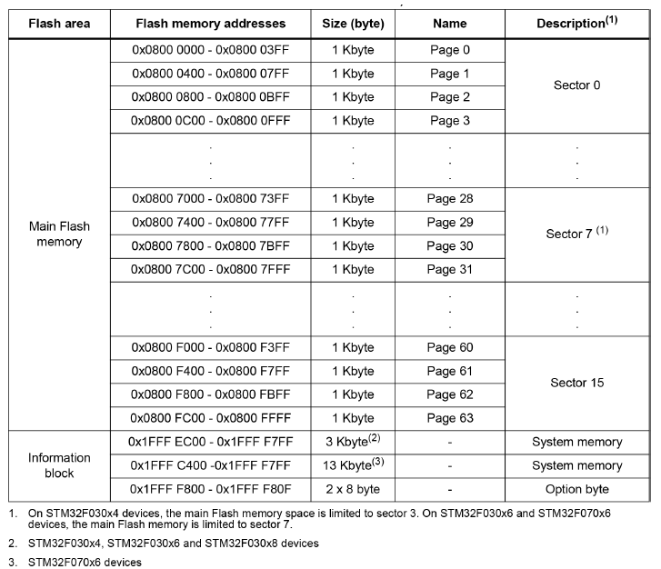
</p>

<p align="center">表 21.2：F030x4、F030x6、F070x6 和 F030x8 器件中的 Flash 存储器组织</p>

NAND Flash 不提供随机访问的外部地址总线，因此数据必须按块读取，其中每个块包含数百到数千位，类似于某种顺序数据访问。这使得 NAND Flash 技术不适合嵌入式微控制器，因为大多数微处理器和微控制器需要字节级的随机访问。

关于 Flash 存储器技术，一件重要的事情是，在任何类型的 Flash 器件中，写操作只能对空白或已擦除的存储单元执行。因此，大多数情况下必须先擦除，再写入。虽然对于 NAND Flash 器件来说，擦除操作很直接，但在 NOR Flash 中，擦除前必须将目标块中的所有字节写入全零。相反，NOR Flash 存储器提供完整的地址总线和数据总线，以便随机访问其中任意存储单元（可按字节寻址）。 <!-- page: 567 --> 因此，NOR Flash 适合存储很少需要更新的代码和常量数据。

NOR Flash 通常可承受 10,000 至 100,000 次擦除周期。与 NAND Flash 相比，NOR Flash 存储器在擦除操作和写操作上更慢。这意味着 NAND Flash 具有更快的擦除和写入时间。此外，NAND 具有更小的擦除单位。因此，需要更少的擦除次数，这使得它们更适合存储文件系统。NOR Flash 读取数据的速度略快于 NAND。

NOR Flash 器件被划分为擦除单位，也称为块、页或扇区。这种划分是必要的，以降低价格并克服物理限制。如前所述，只有当特定块为空/已擦除时，才能向该块写入信息。在大多数 NOR Flash 中，擦除后单元的值为“1”，写入操作可将其改为“0”。因此，擦除后，一个字（word）大小的存储位置会被设为 0xFFFF FFFF。然而，存在一些 NOR Flash 存储器，其中擦除后单元默认值为“0”，我们可以通过写操作将其设置为“1”。

将 Flash 存储器划分为多个块给我们带来了间接的好处：我们可以擦除然后重新编程 Flash 存储器的一小部分。当我们使用 Flash 存储器来存储非易失性配置参数，而不使用专用的外部 EEPROM 存储器³时，这特别有用。

为了完全避免对非易失性存储器（Non-Volatile Memory, NVM）的意外写入，所有 STM32 微控制器中的 Flash 存储器均受写保护，并且可通过特定的解锁序列解除该保护：在选项字节（Option Bytes）区域中提供了两个专用的密钥寄存器，通过向其中写入特定值即可禁用 Flash 写保护。在某些 STM32 微控制器中，必须针对每个扇区单独禁用写保护。根据 STM32 系列的不同，写入可按 8 位、16 位、32 位或 64 位宽度进行。

为了保护知识产权，可以对 Flash 存储器设置读保护，以限制经由调试接口的外部访问（显然，Cortex-M 内核和 DMA 控制器的读访问仍然允许）。这可以防止恶意用户读取并导出 Flash 内容，以进行反汇编或在假冒设备上复制⁴。我们稍后将分析此主题。

根据 STM32 系列的不同，Flash 存储器的编程/擦除操作可以采用不同的并行度，从而在一次操作中处理更多字节。要使用更高的编程并行度，必须满足特定条件。通常，需要达到特定的 `VDD` 电压才能实现最大并行度。请务必查阅您的微控制器的参考手册以了解更多信息。

## 21.2 HAL_FLASH 模块

正如之前所述，与其他所有 STM32 外设一样，Flash 存储器也提供了多个用于操作其设置的寄存器。HAL_FLASH 模块以及相关的 HAL_FLASHEx 模块，允许轻松擦除和重新编程 NVM 存储器，而无需过多关注其实现细节。接下来的小节将介绍这些模块中最相关的函数。

³STM32L 系列中的许多 STM32 微控制器提供了专用的 True EEPROM 存储器，类似于其他低成本 8 位微控制器（例如 Atmel AVR 微控制器）。⁴然而，请记住，存在一些公司能够使用先进的硬件技术绕过读保护（这通常涉及使用激光重写选项字节区域内的读保护位——这并不便宜，但这是可能的 ;-) ）

<!-- page: 568 -->

### 21.2.1 Flash 存储器解锁

Flash 存储器默认处于写保护状态，以防止由电气干扰或程序故障引起的意外写入。要启用写模式，必须执行一系列操作，且这些操作因特定的 STM32 系列而异。为了完成此任务，CubeHAL 提供了以下函数：

```c
HAL_StatusTypeDef HAL_FLASH_Unlock(void);
```

该函数屏蔽了特定 Flash 存储器架构的实现细节。解除 Flash 存储器的写入/擦除保护后，即可执行擦除或写入操作。重新加锁可通过以下函数完成：

```c
HAL_StatusTypeDef HAL_FLASH_Lock(void);
```

系统复位时会自动设置写保护。然而，强烈建议在完成所有写入操作后显式地重新锁定存储器。这可以防止因固件故障或电源不稳定导致的任何意外写入。

### 21.2.2 Flash 存储器擦除

在更改 Flash 存储位置的内容之前，我们需要将其位重置为默认值（根据 NOR Flash 类型不同，默认为“0”或“1”）。这是通过以扇区/页为粒度执行的擦除操作完成的。或者，可以对整个 Bank 执行 Mass Erase（整 Bank 擦除）：在提供两个 Bank 的 STM32 微控制器上，我们可以一次擦除一个 Bank。

在大多数 STM32 微控制器中，擦除操作后，Flash 存储器块（扇区或页）中的各个单元被设置为“1”，只有两个明显的例外：STM32L0 和 STM32L1 微控制器，它们的默认值反而是“0”。

CubeHAL 提供两种擦除 Flash 存储器的方式：轮询模式和中断模式。轮询模式下使用以下函数：

```c
HAL_StatusTypeDef HAL_FLASHEx_Erase(FLASH_EraseInitTypeDef *pEraseInit,
                                      uint32_t *SectorError);
```

<!-- page: 569 -->

该函数以轮询模式执行擦除。它接受一个指向 `FLASH_EraseInitTypeDef` 结构体实例的指针（稍后会介绍），以及一个指向变量 `SectorError` 的指针。发生擦除错误时，该变量用于返回出错扇区/页的 ID（例如，若第 4 页擦除失败，`SectorError` 的值为 3）。

`FLASH_EraseInitTypeDef` 结构体在不同 STM32 系列之间差异很大。因此，请查看您的微控制器的 CubeHAL 中的 `stm32XXxx_hal_flash_ex.h` 文件。在这里，我们将考虑在性能最高的 STM32 微控制器（如 F2/F4/F7）的 CubeHAL 中找到的实现。

```c
typedef struct {
    uint32_t TypeErase;
    /* Mass erase or sector Erase */
    uint32_t Banks;
    /* Select banks to erase when Mass erase is enabled */
    uint32_t Sector;
    /* Initial FLASH sector to erase when Mass erase is disabled */
    uint32_t NbSectors;
    /* Number of sectors to be erased */
    uint32_t VoltageRange;  /* The device voltage range which defines the erase parallelism */
} FLASH_EraseInitTypeDef;
```

- `TypeErase`：指定是执行整个 Bank 的 Mass Erase（整 Bank 擦除）还是扇区/页擦除。它可以取 `FLASH_TYPEERASE_SECTORS` 或 `FLASH_TYPEERASE_MASSERASE` 的值。
- `Banks`：此参数仅在提供多 Bank 内部 Flash 存储器的 STM32 系列中可用，指定 Mass Erase 中涉及的 Bank。它可以取 `FLASH_BANK_1`、`FLASH_BANK_2` 或 `FLASH_BANK_BOTH` 的值以擦除两个 Bank。
- `Sector(Page)`：此字段指扇区擦除中涉及的扇区 ID。它可以取 `FLASH_SECTOR_0`、`FLASH_SECTOR_1` 等值（最大扇区数取决于具体的微控制器）。在提供页粒度 Flash 存储器的 STM32 微控制器中，此字段被替换为擦除过程中涉及的页的首地址。有关此功能的更多信息，请查阅 CubeHAL 源代码。
- `NbSectors(NbPages)`：从指定扇区开始要擦除的扇区（或页）数量。
- `VoltageRange`：即使请求擦除整个扇区（或页），底层擦除操作也会以更小的子单位（通常为两个字节）循环执行。性能更高的 STM32 微控制器可在一次操作中擦除更多字节。这种能力称为 Flash 存储器并行度，取决于微控制器的工作电压：`VDD` 越高，一次擦除的字节数越多⁵。该字段可取表 21.3 中列出的值。具体支持情况请查阅相应微控制器的参考手册。

⁵STM32L4 系列提供了一种名为快速编程/擦除模式的类似功能。它与 `VDD` 和时钟频率都有关。它允许以双字（double word）粒度擦除/编程 Flash 存储器。有关此功能的更多信息，请查阅您的微控制器的参考手册。

<!-- page: 570 -->

表 21.3：根据电压范围确定的编程/擦除并行度

| `VoltageRange` | 电压范围 | 并行度 |
| --- | --- | --- |
| `FLASH_VOLTAGE_RANGE_1` | 1.7–2.1 V | 一次 8 位 |
| `FLASH_VOLTAGE_RANGE_2` | 2.1–2.4 V | 一次 16 位 |
| `FLASH_VOLTAGE_RANGE_3` | 2.4–3.6 V | 一次 32 位 |
| `FLASH_VOLTAGE_RANGE_4` | 2.7–3.6 V，带外部 VPP | 一次 64 位 |

`HAL_FLASHEx_Erase()` 是一个阻塞函数：它将等待直到擦除过程完成。根据 STM32 系列、`HCLK` 频率、擦除中涉及的扇区/页数量以及提供编程/擦除并行性的 STM32 微控制器的 `VDD` 电压，整个过程可能相当耗时。为了避免在此过程中阻塞固件活动，HAL 提供了以下函数：

```c
HAL_StatusTypeDef HAL_FLASHEx_Erase_IT(FLASH_EraseInitTypeDef *pEraseInit,
                                         uint32_t *SectorError);
```

该过程在中断模式下执行擦除操作。我们可以通过启用 `FLASH_IRQn` 中断并实现相应的 ISR（中断服务例程）来获取擦除过程结束的通知。

> **仔细阅读**
>
> 如果要擦除包含程序代码的 Flash 存储位置，必须格外小心，尤其是擦除包含向量表（vector table）的首个扇区/页时（整片擦除时总会涉及该扇区）。在这种情况下，应将程序代码和整个向量表重定位到 SRAM 中，如第 20 章所述；否则，一旦触发中断就会发生故障。

### 21.2.3 Flash 存储器编程

一旦扇区/页被擦除，我们就可以继续对其内容进行编程。从理论上讲，可以通过直接访问 Flash 存储位置来修改其内容⁶，例如编写以下 C 代码：

```c
...
*(volatile uint16_t*)0x0800AA00 = Data;
...
```

然而，由于两个主要原因，这样做通常并不方便。首先，在某些 STM32 微控制器中，在编程 Flash 存储器位置之前可能需要执行一些预备操作（例如设置特定的寄存器）。其次，根据 STM32 系列和 `VDD` 电压范围的不同，一次可写入 Flash 存储器的字节数也可能有显著差异。基于这些原因，HAL 定义了以下函数：

⁶显然，在修改 Flash 存储器之前必须先将其解锁。

<!-- page: 571 -->

```c
HAL_StatusTypeDef HAL_FLASH_Program(uint32_t TypeProgram, uint32_t Address, uint64_t Data);
```

该函数用于屏蔽具体实现细节。下面分析其参数：

- `TypeProgram`：它指示写入操作的数据宽度，它可以取值为 `FLASH_TYPEPROGRAM_HALFWORD`、`FLASH_TYPEPROGRAM_WORD` 和 `FLASH_TYPEPROGRAM_DOUBLEWORD`。请注意，此参数仅指定使用 `HAL_FLASH_Program()` 函数传输的数据量。单次事务中实际传输的字节数取决于 STM32 系列以及并行度（如果可用）。
- `Address`：它是开始写入数据的起始存储器地址。
- `Data`：它表示要写入 Flash 存储位置的数据（以双字（double word）变量表示）。

与擦除操作类似，也可以使用以下函数以中断模式执行 Flash 编程：

```c
HAL_StatusTypeDef HAL_FLASH_Program_IT(uint32_t TypeProgram,
                                         uint32_t Address, uint64_t Data);
```

### 21.2.4 编程和擦除期间的 Flash 存储器读取访问

在擦除或写入操作期间，对 Flash 存储器的读取访问会导致总线停顿（bus stall），至少大多数 STM32 微控制器如此⁷。因此，如果需要并行执行其他操作，就应将 Flash 编程期间要运行的代码重定位到 SRAM。一个典型场景是自定义引导加载程序（bootloader）：通过 UART 以中断或 DMA 模式接收新固件并写入 Flash 存储器。此时不能丢失异步事件（例如通知数据传输的中断），因为 MCU 会因等待当前 Flash 操作完成而停顿。因此，最好将相关代码重定位到 SRAM；必要时还需重定位向量表。

## 21.3 选项字节

选项字节由两个或更多字节组成，其中各个位用于保存特定的配置值。选项字节的概念与其他微控制器架构中的概念类似，例如 Atmel AVR 系列中的熔丝（fuses）或 Microchip PIC 微控制器中的配置位（Configuration Bits）。

信息块区域中这些特殊字节的每个位都有特定含义。配置参数的数量和类型取决于具体的 STM32 微控制器。最常见的配置参数与以下方面相关：

⁷在某些 STM32 微控制器中，例如 STM32L0 系列，如果我们在半页编程操作正在进行时尝试访问 Flash 存储器，可能会发生总线故障。更多信息，请查阅你所考虑的微控制器的参考手册。

<!-- page: 572 -->

- `BOOT`：在大多数 STM32 微控制器中，两个选项位允许选择启动源（FLASH、系统内存或 SRAM）。
- `RDP`：这些位设置 Flash 存储器的读保护级别，我们将在本章后面更深入地分析它们。
- `BOR_LEVEL`：这些位用于设定触发和解除复位的电源电压阈值；写入这些位即可设置新的 BOR 级别。默认情况下，BOR 是关闭的。当电源电压 (`VDD`) 低于选定的 BOR 级别时，会产生器件复位。
- MCU 在进入某些低功耗模式时的行为：在几乎所有 STM32 微控制器中，都可以配置 MCU，使其在进入停止（stop）或睡眠（sleep）低功耗模式时产生复位。
- 硬件看门狗：在某些 STM32 微控制器中，存在一个或两个位用于以“硬件模式”配置 WWDG 和 IWDG，即它们在 MCU 复位时自动启动。
- Flash 存储器写保护：这些位允许单独写保护某些 Flash 存储器扇区/页，即使 Flash 存储器已解锁，也防止向其写入。如果给定位设置为“1”，则对应的扇区/页不受写保护；如果位设置为“0”，则扇区/页受写保护。

选项字节的编程流程与普通 Flash 存储器编程流程不同，因此 CubeHAL 提供了专用例程。

首先，必须通过调用以下函数来解锁该区域：

```c
HAL_StatusTypeDef HAL_FLASH_OB_Unlock(void);
```

接下来，使用以下函数完全编程给定的选项字节：

```c
HAL_StatusTypeDef HAL_FLASHEx_OBProgram(FLASH_OBProgramInitTypeDef *pOBInit);
```

调用该函数后，CubeHAL 会先擦除信息块，再根据传入 `HAL_FLASHEx_OBProgram()` 的参数对所有选项字节进行编程。该函数接受 C 结构体 `FLASH_OBProgramInitTypeDef` 的一个实例，其字段表示给定选项字节的内容。有关字段的确切类型和数量的更多信息，请查阅 CubeHAL 的源代码。

类似地，要检索给定选项字节的内容，我们使用以下函数：

```c
void HAL_FLASHEx_OBGetConfig(FLASH_OBProgramInitTypeDef *pOBInit);
```

一旦选项字节被修改，我们必须使用以下函数强制 MCU 重新加载其内容：

<!-- page: 573 -->

```c
HAL_StatusTypeDef HAL_FLASH_OB_Launch(void);
```

请注意，在某些 STM32 微控制器中更改某些选项位可能会导致芯片复位。

ST 的 STM32CubeProgrammer 也提供了修改选项字节的功能。一旦你将 ST-LINK 调试器连接到目标 MCU，点击选项字节图标（左侧第三个绿色图标）。将出现选项字节部分，如图 21.1 所示。该工具还可用于擦除指定的 Flash 存储器扇区/页。

<p align="center">
  
</p>

<p align="center">图 21.1：STM32CubeProgrammer 中的选项字节配置对话框</p>

### 21.3.1 Flash 存储器读保护

> **仔细阅读**
>
> 本段中描述的一些操作可能会导致您的微控制器变砖，从而永久无法对其进行烧录和擦除。请仔细阅读本段内容；如果某些操作不完全清晰，请避免执行。

一个选项字节（称为 `RDP`）值得单独讨论：即与 Flash 存储器读取保护相关的配置字节。为了避免经由调试接口对 Flash 存储器进行非预期访问，可以临时或永久地禁用外部接口的读取访问（显然，来自 CPU 内核和 DMA 控制器的访问始终允许）。存在三个保护级别，对应存储在选项字节中的三个不同值：

<!-- page: 574 -->

- 级别 0（无读取保护）：当通过向读取保护选项字节（`RDP`）写入 0xAA 将读取保护级别设置为级别 0 时，在所有启动配置（Flash 存储器用户启动、调试或从 RAM 启动）下，如果未设置写入保护，则对 Flash 存储器或备份 SRAM 的所有读取/写入操作都是允许的。
- 级别 1（启用读取保护）：这是选项字节擦除后的默认读取保护级别（该操作由 `HAL_FLASHEx_OBProgram()` 例程自动执行）。通过向 `RDP` 选项字节写入任何值（除了用于分别设置级别 0 和级别 2 的 0xAA 和 0xCC）来激活读取保护级别 1。当设置读取保护级别 1 时，在调试器连接期间或从 RAM 或系统存储器引导程序启动期间，无法对 Flash 存储器或备份 SRAM 进行任何访问（读取、擦除、编程）。如果发生读取请求，将产生总线错误。相反，当从 Flash 存储器启动时，允许用户代码对 Flash 存储器和备份 SRAM 进行访问（读取、擦除、编程）。当级别 1 处于激活状态时，将保护选项字节（`RDP`）编程为级别 0 会导致 Flash 存储器和备份 SRAM 被整体擦除。结果是，在移除读取保护之前，用户代码区域会被清除。整体擦除仅擦除用户代码区域。包括写入保护在内的其他选项字节在整体擦除操作之前保持不变。OTP 区域不受整体擦除影响，保持不变。整体擦除仅在级别 1 处于激活状态且请求级别 0 时执行。当保护级别增加时（0->1, 1->2, 0->2），不会发生整体擦除。
- 级别 2（!!! 调试/芯片外部读取永久禁用 !!!）：通过向 `RDP` 选项字节写入 0xCC 来激活读取保护级别 2。当设置读取保护级别 2 时：
  - 级别 1 提供的所有保护均处于激活状态。
  - 不再允许从 RAM 启动。
  - 可以启动系统存储器引导程序，但除 Get、`GetID` 和 `GetVersion` 外，所有命令均不可访问。请参阅 AN2606。
  - JTAG、SWV（单线查看器）、ETM 和边界扫描被禁用。
  - 用户选项字节不再可以更改。
  - 当从 Flash 存储器启动时，允许用户代码对 Flash 存储器和备份 SRAM 进行访问（读取、擦除和编程）。

> **警告**
>
> 存储器读取保护级别 2 是一个不可逆的操作。当激活级别 2 时，保护级别无法降低到级别 0 或级别 1。再次澄清一下，这意味着您将无法再对 MCU 进行烧录和调试。

表 21.4 总结了给定保护级别对以下方面的影响：

- Flash 存储器；
- 选项字节和 OTP 存储器（当这些存储器通过调试器接口访问时）；
- 预编程的引导程序；
- 放置在 SRAM 和 Flash 存储器中的代码。

<!-- page: 575 -->

如您所见，级别 2 并不阻止用户代码向 Flash 存储器写入（例如，自定义引导程序仍然能够编程 MCU）。

<p align="center">
  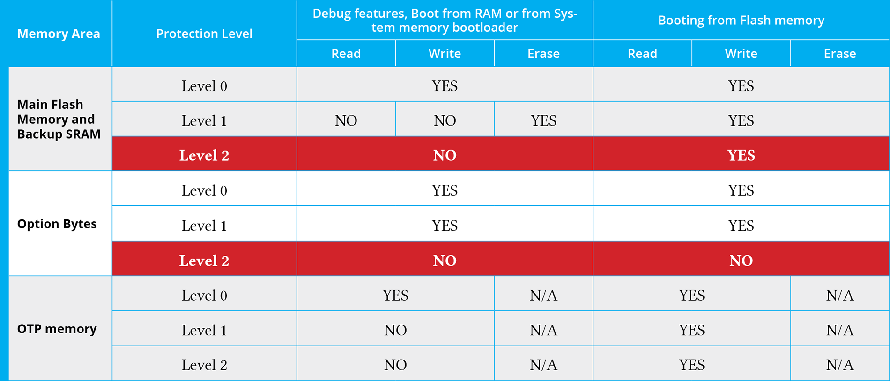
</p>

<p align="center">表 21.4：读取保护级别对各个 NVM 存储器的影响</p>

## 21.4 可选的 OTP 和 True-EEPROM 存储器

较新且功能更强大的 STM32 微控制器提供了一次性可编程（OTP）存储器。这是一种专用存储器，容量为 512 至 1024 字节，其特点是：一旦该存储器中的位从 1 变为 0，就不可能再将其恢复为 1。这意味着该区域是不可擦除的。该存储器区域特别适用于存储与特定设备相关的重要配置参数，例如序列号、MAC 地址、校准值等。电子行业的一种典型做法是从相同的 PCB 甚至相同的完整电路板开始，生产具有不同功能的设备。该区域也可以用于存储固件用来适应电路板特性的配置参数。

OTP 区域分为 N 个 32 字节的 OTP 数据块和一个 N 字节的 OTP 锁定块。OTP 数据和锁定块不可擦除。锁定块包含 N 个字节 LOCKBi (0 ≤i ≤N-1)，用于锁定对应的 OTP 数据块（块 0 到 N）。每个 OTP 数据块可以编程，直到在对应的 OTP 锁定字节中编程值 0x00（显然，已经设置为 0 的单个位无法恢复为 1）。锁定字节必须仅包含 0x00 和 0xFF 值，否则 OTP 字节可能无法被正确识别。

<!-- page: 576 -->

<p align="center">
  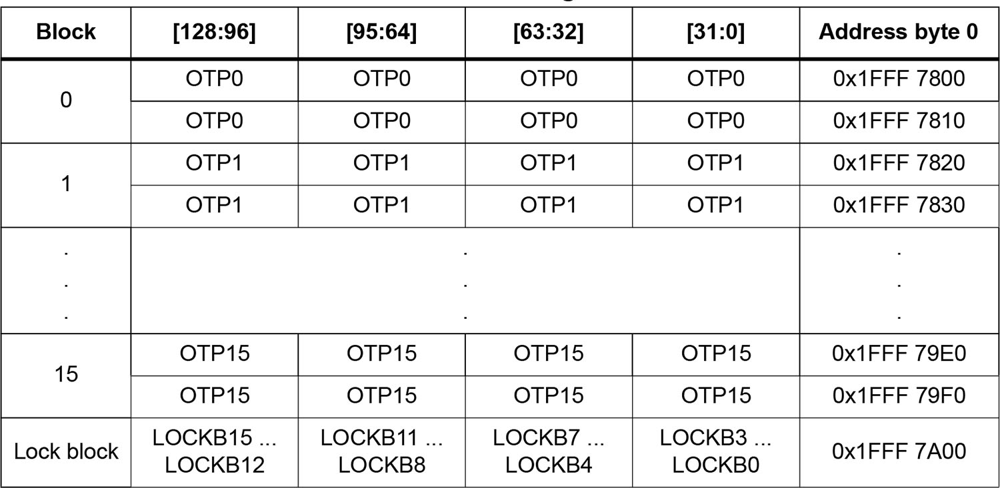
</p>

<p align="center">表 21.5：STM32F401RE MCU 中 OTP 存储器的组织</p>

表 21.5 展示了 STM32F401RE MCU 中 OTP 存储器的组织，并摘自相关的参考手册。如您所见，该 MCU 提供 16 个 OTP 数据块，总计 512 字节。16 个锁定字节允许锁定对应的 OTP 数据块。

数字电子中的另一种常见做法是使用专用的且通常是外部的 EEPROM 存储器来存储配置参数。与 Flash 存储器相比，EEPROM 存储器有几个优点：

- 它们的块可以单独擦除。
- 每个块可以擦除多达甚至超过 1,000,000 次（Flash 存储器擦除周期可能限制在 10,000 次）。
- 额定寿命通常高于 Flash 存储器。
- 它们通常比 Flash 存储器（NOR 和 NAND）存储器便宜。
- 存在能够工作在高达 200°C 的 EEPROM 存储器。

然而，EEPROM 存储器的主要缺点是它们通常比 Flash 存储器慢得多，并且在 PCB 上占用额外的空间。

如果您的设计旨在降低 BOM 成本，那么 ST 提供了几个应用笔记，描述如何使用 STM32 集成 Flash 存储器来模拟 EEPROM 存储器（这些应用笔记的标题为“EEPROM emulation in STM32Fxx microcontrollers”）。最近，ST 还发布了一个专用的 STM32Cube 扩展包，包含许多有趣的功能，包括用于延长模拟 EEPROM 使用寿命的磨损均衡算法。最后，STM32L 系列的几个 MCU 提供集成的 True-EEPROM。更多信息，请参阅您的 MCU 数据手册。

<!-- page: 577 -->

## 21.5 Flash 读取延迟与 ART™ 加速器

在第 1 章中，我们了解到 Cortex-M 内核提供 n 级⁸指令流水线，旨在提升程序执行效率。然而，该流水线需要填充通常存储在 Flash 存储器中的机器指令。这一操作是一个显著的瓶颈，因为与 CPU 时钟频率相比，Flash 存储器的访问速度较慢。

如果 CPU 和 Flash 存储器以相同的速度运行，CPU 可以在不产生额外的性能开销⁹的情况下为其内部流水线提供数据。例如，运行在低于 30 MHz 时钟频率下的 STM32F401RE 微控制器可以无延迟地访问 Flash 存储器。不幸的是，在性能更高的微控制器中，需要在两次连续的 Flash 存储器访问之间插入一个或多个（在某些情况下甚至多达十个）延迟，称为等待状态（wait states）。等待状态对应于在一个或多个 CPU 周期内执行的硬件“忙等待”，这是使 CPU 与速度较慢的 Flash 存储器同步的一种方式。等待状态会显著降低 CPU 的有效性能。这种限制通常通过使用专用的缓存存储器来解决。

配置所需等待状态的准确数量是一个关键步骤，具体取决于您考虑的特定 STM32 微控制器。此操作通常在 SYSCLK 配置期间执行，因为 CPU 频率越高，所需的等待状态越多。配置正确数量的等待状态至关重要，尤其是在提高 CPU 速度时：我们必须在提高 CPU 速度之前设置正确的等待状态数量，否则会触发 BusFault（总线故障）。然而，CubeMX 旨在抽象这些细节，并根据特定的 STM32 微控制器和期望的内核速度生成正确的配置代码（请查看 `SystemClock_Config()` 例程中的代码）。

<p align="center">
  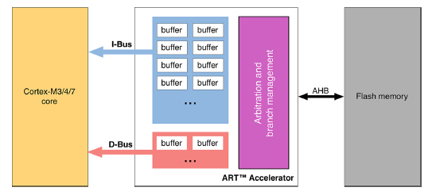
</p>

<p align="center">图 21.2：构成 ART™ 加速器的主要模块</p>

ST 在其更强大的 STM32 微控制器中开发了一种独特的技术：ART™ 加速器。ART™ 加速器是一组位于 Cortex-M 内核外部的缓存技术（见图 21.2），它可以消除等待状态的影响。ART™ 加速器旨在保持 Cortex-M 微控制器的哈佛架构，为 I-Bus 和 D-Bus 提供相互独立的缓存。

⁸流水线级数的确切数量取决于特定的 Cortex-M 内核。⁹在此上下文中谈论“速度”是不恰当的，因为我们应该谈论执行机器操作所需的“延迟”。这种延迟基本上由 CPU 解码和执行机器指令所需的时间，加上 Flash 存储器控制器从 NVM 存储器中检索给定指令所需的时间组成。然而，这里我们关注的是这两个“设备”（CPU 和带有控制器的 Flash 存储器）可能需要不同量的时间来执行其活动这一事实。

<!-- page: 578 -->

ART™ 加速器由以下部分组成：

- 指令预取缓冲区；
- 专用的指令缓存，用于减少分支的影响；
- 用于字面量池（literal pools）的数据缓存；
- AHB 总线的调度策略，便于 CPU 通过 D-Bus 总线访问 Flash 存储器控制器。

让我们分析这些技术的具体作用。

**指令预取缓冲区** 当 CPU 访问 Flash 存储器时，它并不是一次获取一个字节，而是通常根据特定的 STM32 微控制器一次读取 64 到 256 位。这些位包含可变数量的指令，因此被称为指令行（instruction lines）：假设 CPU 读取 128 位（这是在 STM32F4 微控制器中发生的情况），这可能包含四个 32 位宽的指令或八个 16 位宽的指令（这取决于 CPU 是否运行在 Thumb 模式下）。因此，在顺序代码的情况下，至少需要四个 CPU 周期来执行之前读取的指令行。I-Bus 总线上的预取可用于在当前指令行被 CPU 请求的同时，从 Flash 存储器中读取下一个顺序指令行。如果需要至少一个等待状态来访问 Flash 存储器，此功能非常有用。

可以通过在 `stm32XXxx_hal_conf.h` 文件中将 `PREFETCH_ENABLE` 宏设置为 1 来启用指令预取缓冲区。

**指令缓存存储器** 预取缓冲区的内容可能因分支而失效。为了限制因跳转而丢失的时间，可以在指令缓存存储器中保留给定数量的指令行。每次发生未命中（miss）时（请求的数据不存在于当前使用的指令行、预取的指令行或指令缓存存储器中），读取的行会被复制到指令缓存存储器中。如果 CPU 请求包含在指令缓存存储器中的数据，则无需插入任何延迟即可提供。一旦所有“空”的指令缓存存储器行都被填充，就会使用最近最少使用（LRU）策略来确定要替换的指令缓存存储器中的行。此功能对于包含循环的代码特别有用。

对于提供 ART™ 加速器的微控制器，可以通过在 `stm32XXxx_hal_conf.h` 文件中将 `INSTRUCTION_CACHE_ENABLE` 宏设置为 1 来启用此功能。

**数据缓存存储器** 汇编指令经常在内存位置和 CPU 寄存器之间移动数据。有时，这些数据存储在 Flash 存储器中（它们是常量值）：在这种情况下，我们称之为字面量池。字面量池在 CPU 流水线的执行阶段通过 D-Bus 总线从 Flash 存储器中获取。因此，CPU 流水线会停滞，直到请求的字面量池被提供。为了限制因字面量池而丢失的时间，通过 AHB 数据总线 D-Bus 的访问优先于通过 AHB 指令总线 I-Bus 的访问（这实际上是 D-Bus 总线上的总线仲裁策略）。

<!-- page: 579 -->

此外，在 D-Bus 总线和 Flash 存储器之间存在一个专用的数据缓存存储器。此缓存比指令缓存小，但它有助于提高 CPU 的整体性能。对于提供 ART™ 加速器的微控制器，可以通过在 `stm32XXxx_hal_conf.h` 文件中将 `DATA_CACHE_ENABLE` 宏设置为 1 来启用此功能。

### 21.5.1 TCM 存储器在 STM32F7/H7 微控制器中的作用

较新且性能更强的 STM32F7/H7 微控制器的内存组织值得单独提及。事实上，该系列微控制器面临着更复杂、更灵活的内存和总线组织，提供了两种不同的接口来访问 Flash 存储器和 SRAM：高级可扩展接口（Advanced eXtensible Interface, AXI），这是一种 ARM 总线规范，用于将 CPU 内核与其他外设互连；以及紧耦合存储器（Tightly-Coupled Memory, TCM）接口，用于将 CPU 内核与其直接耦合的易失性和非易失性存储器互连。AXI 和 TCM 这两种接口都采用哈佛架构，为指令（I-Bus）和数据（D-Bus）提供分离的线路。

查看图 21.3¹⁰，可以看到 Cortex-M7 内核有三条不同的路径来访问 Flash 存储器控制器（从而访问 Flash 存储器）。在描述这三条路径之前，有必要指出一个基本事实：Cortex-M7 内核已经提供了一个集成的 L1 缓存。该缓存有两个专用的缓存区，每个容量最高可达 64 KB，一个专用于 I-Bus，另一个用于 D-Bus：这与其他 STM32 系列不同，在其他系列中，数据缓存和指令缓存仅在 ART™ 加速器内部实现。

<p align="center">
  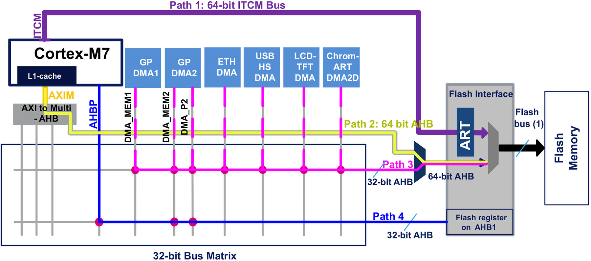
</p>

<p align="center">图 21.3：STM32F7 微控制器中 Flash 存储器的访问方式</p>

在所有 STM32F7 微控制器中，Flash 存储器可通过三个主要接口进行读取和/或写入：

- 64 位 ITCM 接口：它通过 ITCM 总线（图 21.3 中的路径 1）将嵌入式 Flash 存储器连接到 Cortex-M7，用于程序执行、数据读取以及字面量值访问。此总线不支持对 Flash 存储器进行写入。CPU 可通过 ITCM 从地址 0x0020 0000 开始访问 Flash 存储器。由于嵌入式 Flash 存储器的速度低于 CPU 内核，ART™ 加速器可使 STM32F7 在最高 216 MHz、STM32H7 在最高 480 MHz 的 CPU 频率下实现零等待周期执行。ART™ 加速器仅用于经 ITCM 接口访问 Flash 存储器；它实现了最高 256 位 × 64 行的统一指令和分支缓存，可用于指令和数据访问，从而加快顺序代码和循环的执行。ART™ 加速器还实现了指令预取缓冲区。

¹⁰该图取自 ST 的 AN4667 文档(https://bit.ly/29gmp61)。

<!-- page: 580 -->

- 64 位 AHB 接口：它通过 AXI/AHB 桥（图 21.3 中的路径 2）将嵌入式 Flash 存储器连接到 Cortex-M7。它用于代码执行、读取和写入访问。CPU 可以通过 AXI/AHB 桥从地址 0x0800 0000 开始访问 Flash 存储器，并且它是可缓存的（即，可以使用 L1 缓存），达到与 ART™ 加速器相同的 0 等待周期性能。Cortex-M7 内核中的 L1 缓存容量为 4 KB 至 16 KB。STM32F7/H7 提供两个缓存区，一个用于指令（I-Bus），另一个用于字面量池（D-Bus），每个容量最高可达 16 KB。所有 Cortex-M7 内核上的 L1 缓存都分为 32 字节的行。每行都标记有一个地址。数据缓存是 4 路组相联（每组四行），指令缓存是 2 路组相联。这种硬件设计折衷避免了为每一行单独标记地址的需要。
- 32 位 AHB 接口：它用于从 Flash 存储器进行 DMA 传输（图 21.3 中的路径 3）。DMA 对 Flash 存储器的访问从地址 0x0800 0000 开始执行。

存在第四条路径（见图 21.3），通过高级总线外设（Advanced Bus Peripheral, AHBP）接口，它保留用于访问位于 0x4000 0000 外设映射区域内的 Flash 存储器外设寄存器。

<!-- page: 581 -->

<p align="center">
  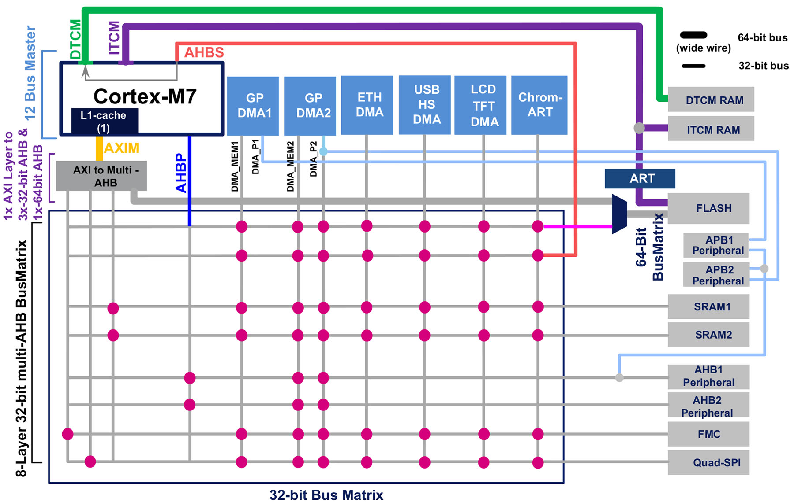
</p>

<p align="center">图 21.4：STM32F7 微控制器中的总线矩阵</p>

这种看似复杂的架构有什么优势？如果两个 Flash 存储器接口，即 AXI/AHB 和 ITCM，都提供 0 等待周期执行（一个依靠内部 L1 缓存，另一个依靠 ART™ 加速器），为什么我们在固件设计期间要处理这种复杂性？

答案来自 STM32F7 微控制器的总线矩阵架构，如图 21.4¹¹ 所示。如您所见，AXI/AHB 总线通过 AXIM 接口连接到内部 L1 缓存。这意味着对总线上某些外设的访问是可缓存的。FMC 和 QuadSPI 控制器就是这种情况。得益于这种架构，可以使用外部 NVM 存储器来存储数据或程序代码，利用容量为 64 KB 的 L1 缓存，同时通过 ITCM 接口和 ART™ 加速器对内部 Flash 存储器进行并行访问（无需总线仲裁）。这对于大量使用存储器来存储图像、视频和一般多媒体内容的设备来说，是一个巨大的性能提升，但也适用于大型常量数据表，如 FFT IV。

基于 Cortex-M7 微控制器的 CMSIS 层定义了一组专用例程来操作 Cortex-M7 L1 缓存存储器（见表 21.6）。

¹¹该图取自 ST 的 AN4667 文档(https://bit.ly/29gmp61)。

<!-- page: 582 -->

表 21.6：用于操作 Cortex-M7 L1 缓存的 CMSIS 函数

| CMSIS-F7 函数 | 描述 |
| --- | --- |
| `SCB_EnableICache(void)` | 先使指令缓存无效，然后使能指令缓存 |
| `SCB_DisableICache(void)` | 禁用指令缓存，并使其中内容无效 |
| `SCB_InvalidateICache(void)` | 使指令缓存无效 |
| `SCB_EnableDCache(void)` | 先使数据缓存无效，然后使能数据缓存 |
| `SCB_DisableDCache(void)` | 禁用数据缓存，然后清理并使其中内容无效 |
| `SCB_InvalidateDCache(void)` | 使数据缓存无效 |
| `SCB_CleanDCache(void)` | 清理数据缓存 |
| `SCB_CleanInvalidateDCache(void)` | 清理并使数据缓存无效 |

<p align="center">
  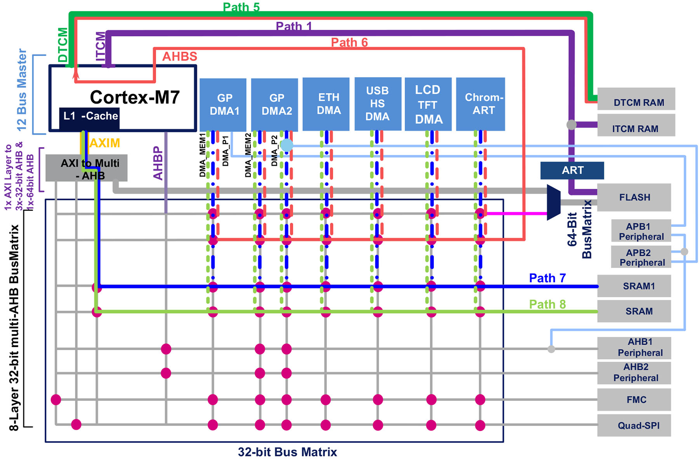
</p>

<p align="center">图 21.5：STM32F7 微控制器中可用的四种 SRAM 存储器</p>

图 21.5¹²还展示了 STM32F7/H7 微控制器的另一项重要特性：它们提供四种不同的 SRAM，可通过三条独立路径访问：

- 指令 RAM（ITCM-RAM），映射在地址 0x0000 0000，仅可由内核访问，即通过图 21.5 中的路径 1。它可以按字节、半字（16 位）、字（32 位）或双字（64 位）访问。ITCM-RAM 可以在最高 CPU 时钟频率下无延迟访问。由于只有 CPU 可以访问此 RAM 区域，ITCM-RAM 受到保护，免受总线争用影响。ITCM-RAM 在其他 STM32 微控制器中起着与 CCM 存储器相同的作用。

¹²该图取自 ST 的 AN4667 文档(https://bit.ly/29gmp61)。

<!-- page: 583 -->

- 数据 RAM（DTCM-RAM），映射在 TCM 接口的地址 0x2000 0000 处，并且可以从 AHB 总线矩阵通过所有 AHB 主设备访问：CPU 通过 DTCM 总线（图 21.5 中的路径 5）以及 DMA 通过 Cortex-M7 内核中的特定 AHBS “桥”（图 21.5 中的路径 6）进行访问。它可以按字节、半字（16 位）、字（32 位）或双字（64 位）进行访问。DTCM-RAM 可以在最高 CPU 时钟频率下无延迟访问。主设备（内核和 DMA）对 DTCM-RAM 的并发访问及其优先级可以由 Cortex-M7 内核的从设备控制寄存器（CM7_AHBSCR 寄存器）处理。可以赋予 CPU 比其他主设备（DMA）更高的优先级来访问 DTCM-RAM。有关此寄存器的更多详细信息，请参阅“ARM Cortex-M7 processor Technical Reference Manual”。
- SRAM1，可以从 AHB 总线矩阵通过所有 AHB 主设备访问，即所有通用 DMA 以及专用 DMA。SRAM1 可以按字节、半字（16 位）或字（32 位）进行访问。有关可能的 SRAM1 访问，请参阅图 21.5（路径 7）。它可以用于数据加载/存储以及代码执行（即使它不提供任何特定的性能提升）。
- SRAM2，可以从 AHB 总线矩阵通过所有 AHB 主设备访问。所有通用 DMA 以及专用 DMA 都可以访问此内存区域。SRAM2 可以按字节、半字（16 位）或字（32 位）进行访问。有关可能的 SRAM2 访问，请参阅图 21.5（路径 8）。它可以用于数据加载/存储以及代码执行（即使它不提供任何特定的性能提升）。

<p align="center">
  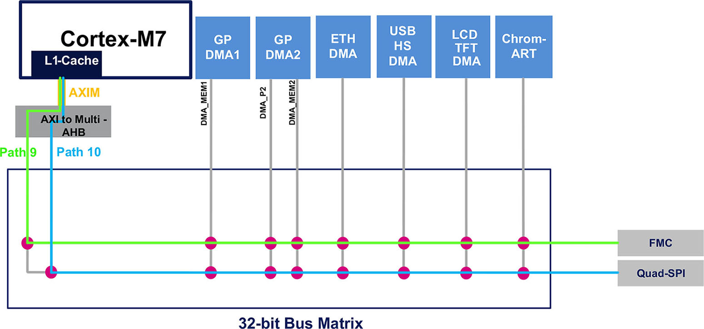
</p>

<p align="center">图 21.6：FMC 和 QuadSPI 外部存储器控制器</p>

除了内部 Flash 存储器和 SRAM 存储器外，STM32F7 的存储器资源还可以使用灵活存储器控制器（FMC）和 Quad-SPI 控制器进行扩展。图 21.6¹³ 显示了通过 AXI 总线连接 CPU 与这些外部存储器的路径。如图 21.6 所示，外部存储器可以受益于 Cortex-M7 L1 缓存，无论是在加载/存储数据期间还是在代码执行期间，都能达到最大性能。Cortex-M7 L1 缓存与具有相同外部存储器控制器的 STM32F4 相比，为 STM32F7 微控制器提供了巨大的性能提升。

¹³该图取自 ST 的 AN4667 (https://bit.ly/29gmp61)。

<!-- page: 584 -->

表 21.7 总结了 STM32F74xxx/STM32F75xxx 微控制器中可用的内部和外部 MCU 存储器类型。该表显示了这些存储器的容量、映射方式以及访问它们所使用的总线接口。例如，您可以看到地址范围 0x0020 0000–0x002F FFFF 允许通过 ITCM 接口访问内部 Flash 存储器，由于 ART 加速器的存在，它是可缓存的。表 21.8 总结了 STM32F76xxx/STM32F77xxx 微控制器的相同存储器（FMC 和 QSPI 的特性相同，因此未在表 21.8 中列出）。

有关这些主题的更多信息，强烈建议查看 ST 的 AN4667¹⁴。

<p align="center">
  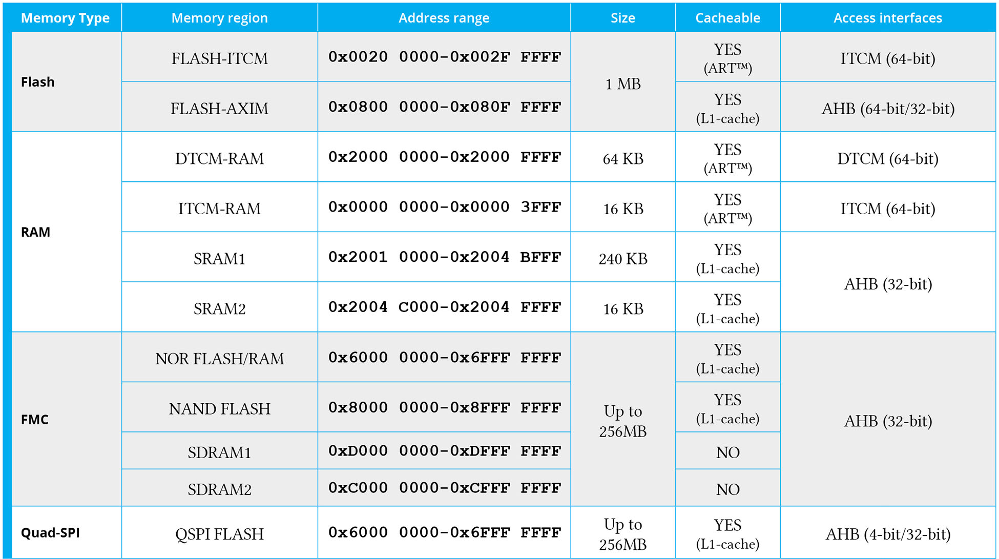
</p>

<p align="center">表 21.7：STM32F74xxx/STM32F75xxx 微控制器中的内存映射和大小</p>

¹⁴https://bit.ly/29gmp61

<!-- page: 585 -->

<p align="center">
  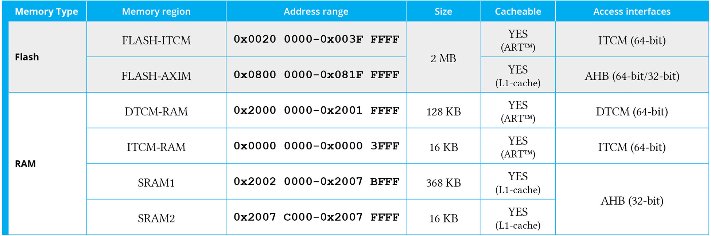
</p>

<p align="center">表 21.8：STM32F76xxx/STM32F77xxx 微控制器中的内存映射和大小</p>

#### 21.5.1.1 如何通过 TCM 接口访问 Flash 存储器

对于所有 STM32F7 平台的新手来说，一个常见的问题是如何利用 TCM 接口。这显然是链接器脚本的工作，它必须使用表 21.7 和 21.8 中报告的地址作为基地址，重新映射 `.text`、`.bss` 和 `.data` 区域的地址。

然而，通过更改链接器脚本中 FLASH 区域的起始地址，无法轻松执行此操作。这是因为，如前所述，不允许通过 ITCM 接口进行写模式访问。这意味着 ST-LINK 调试器或任何等效调试器都无法使用地址范围 0x0020 0000–0x002F FFFF 加载程序代码。为了解决此限制，我们需要像对 `.data` 区域所做的那样，将 `VMA` 地址范围与 `LMA` 地址范围分开。例如，以下链接器脚本片段显示了如何执行此操作。

```ld
 1  /* Specify the memory areas */
 2  MEMORY {
 3    ITCM_FLASH (rx): ORIGIN = 0x00200000, LENGTH = 1024K
 4    AXI_FLASH (rx): ORIGIN = 0x08000000, LENGTH = 1024K
 5    RAM (xrw)       : ORIGIN = 0x20000000, LENGTH = 320K
 6  }
 7
 8  /* Define output sections */
 9  SECTIONS
10  {
11    /* The startup code goes first into FLASH */
12    .isr_vector :
13    {
14      . = ALIGN(4);
15      KEEP(*(.isr_vector)) /* Startup code */
16      . = ALIGN(4);
17    } >ITCM_FLASH AT>AXI_FLASH
18
19    /* The program code and other data goes into FLASH */
20    .text :
21    {
22      . = ALIGN(4);
23      *(.text)           /* .text sections (code) */
24      *(.text*)          /* .text* sections (code) */
25
26      KEEP (*(.init))
27      KEEP (*(.fini))
28
29      . = ALIGN(4);
30      _etext = .;        /* define a global symbols at end of code */
31    } >ITCM_FLASH AT>AXI_FLASH
32
33    /* Constant data goes into FLASH */
34    .rodata :
35    {
36      . = ALIGN(4);
37      *(.rodata)         /* .rodata sections (constants, strings, etc.) */
38      *(.rodata*)        /* .rodata* sections (constants, strings, etc.) */
39      . = ALIGN(4);
40    } >ITCM_FLASH AT>AXI_FLASH
```

如您所见（查看第 17、31 和 40 行），`VMA` 地址范围（即 CPU 用于获取程序代码的地址范围）映射到 ITCM-FLASH 接口，而 `LMA` 地址范围（即用于将程序存储在 Flash 存储器中的地址范围）映射到 AXI 接口，该接口允许以写模式访问 Flash 存储器。

#### 21.5.1.2 使用 CubeMX 配置 Flash 存储器接口

CubeMX 简化了用于访问 Flash 存储器（TCM/AXI）的总线、ART™ 加速器以及 Cortex-M7 L1 缓存的配置。进入引脚布局（Pinout）视图部分，然后单击 Cortex-M7 条目，即可配置这些参数，如图 21.7 所示。

<p align="center">
  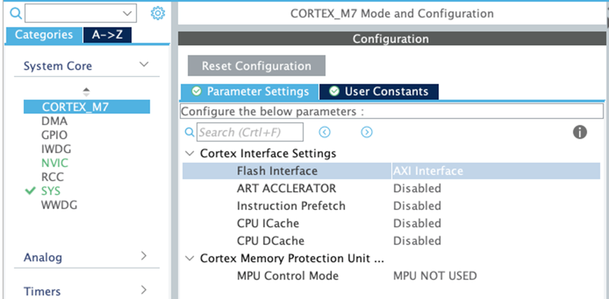
</p>

<p align="center">图 21.7：CubeMX 中的 Cortex-M7 配置视图</p>

<!-- page: 587 -->

> **注意**
>
> 请注意，在撰写本章时（2021 年 10 月），生成的链接器脚本是错误的，因为它没有指定不同的 `LMA` 和 `VMA` 地址，如上一段所述。
