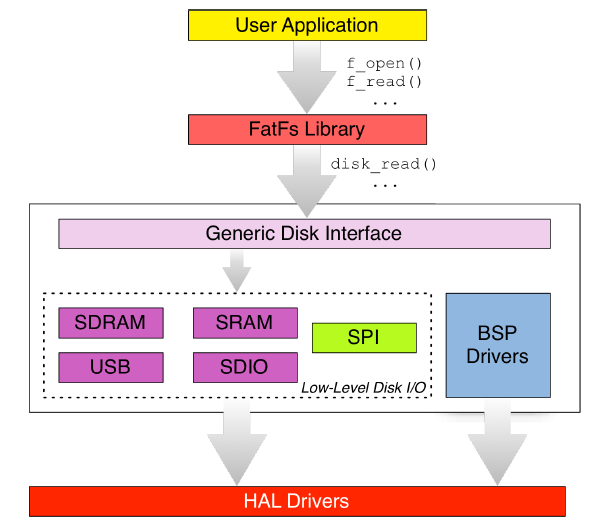
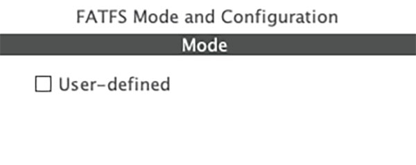
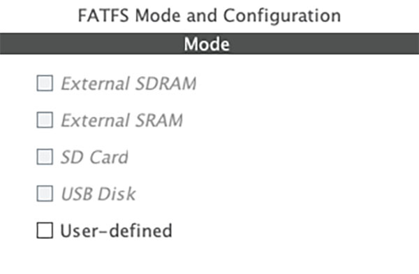
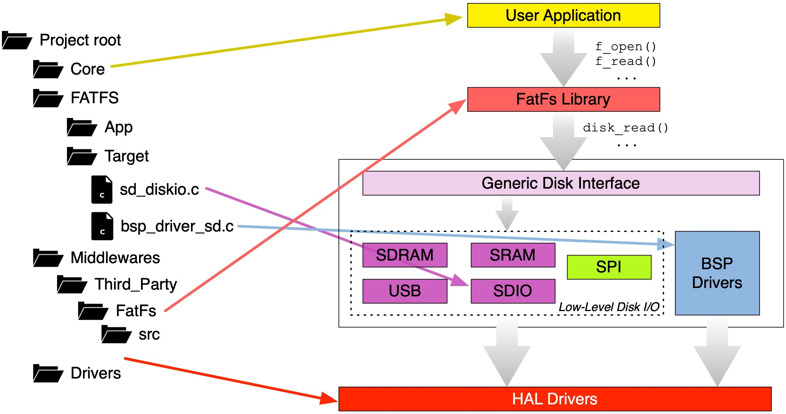

<!-- page: 750 -->

# 25. FAT 文件系统

嵌入式电子设备正变得越来越复杂，需要读取和存储结构化数据的设备也日益普遍。例如，具有互联网连接的设备可能需要处理 HTTP 请求并传输 HTML 文件。除非网页非常简单，否则设备还需要管理多个独立的 HTML 文件，以及 CSS 样式表和 JavaScript 文件。因此，许多嵌入式开发人员都需要在应用程序中使用结构化文件系统。

ST 在 CubeHAL 中集成了由 Chan¹ 开发的知名 FatFs 库，用于操作 FAT 文件系统（FAT12、FAT16 和 FAT32）。该库专为嵌入式系统设计，适用于 SRAM 和 Flash 资源有限的场景；它应用广泛，也已证明足够稳健。

本章将简要介绍这一中间件库，说明如何使用 CubeMX 生成集成 FatFs 的项目，以及如何基于该库开发应用程序。此外，还将介绍如何通过 SPI 接口使用 SD 卡——这是低成本嵌入式微控制器配合存储卡时最常见的方式。

## 25.1 FatFs 库简介

文件分配表（File Allocation Table，FAT）是微软在 20 世纪 80 年代初设计的一种文件系统架构，曾长期作为 MS-DOS 和 Windows 的官方文件系统，直到 Windows NT 3.1 发布。此后，FAT 被更先进的 NTFS 取代。NTFS 改进了对元数据的支持，并采用更先进的数据结构来提升性能、可靠性和磁盘空间利用率；此外还支持访问控制列表（ACL，即文件权限）和文件系统日志等功能。

凭借简单和稳健的特点，FAT 仍广泛用于 USB 存储器、闪存、其他固态存储卡和模块（如 SD 卡），以及各类便携式和嵌入式设备。从技术上讲，“FAT 文件系统”泛指 FAT12、FAT16 和 FAT32 这三种主要变体；这些数字大致表示用于寻址文件系统簇（磁盘上的连续存储区域）的位数。可寻址的簇越多，文件系统可管理的存储空间就越大。因此，FAT32 如今是大容量固态和可移动存储设备上最常用的文件系统。使用 FAT 初始化的磁盘和固态存储器可以包含任意数量的分区。

FatFs 是一个针对存储空间进行优化的库²，提供以下功能：

¹ https://bit.ly/2d6QUC5  
² 同一作者还开发了一个更小的 FatFs 版本，称为 Petit FatFs（https://bit.ly/2drLLAa），适用于 8 位微控制器。它实现了主 FatFs 库的一个子集。

<!-- page: 751 -->

- 支持 FAT12、FAT16、FAT32（r0.0）和 exFAT（r1.0）文件系统。
- 允许打开无限数量的文件（唯一的限制是可用的 SRAM 内存）。
- 支持最多 10 个卷，每个卷的大小在 512 字节/扇区的情况下最大可达 2 TiB。
- 在 FAT 卷上，每个文件最大可增长至 4 GiB；在 exFAT 卷上则几乎无限制。
- 在 FAT 卷上，簇最大可达 128 个扇区；在 exFAT 卷上最大可达 16 MiB。
- 支持 4 种不同的扇区大小：512、1024、2048 和 4096 字节。

FatFs 库提供多达 37 个 API，并可通过配置宏选择性地禁用其中的功能，以减少 Flash 占用。FatFs 使用纯 ANSI C 编写，与底层硬件完全解耦。官方库不直接支持特定的存储设备；用户需要自行实现必要的适配代码，将库连接到底层硬件。

<p align="center"></p>

<p align="center">图 1：FatFs 库与底层硬件的接口关系</p>

ST 工程师已将 FatFs 库集成到 CubeHAL 中，并开发了相应的适配器，使 FatFs 能够与以下设备配合使用：

- 使用 SDIO 外设的 SD 存储卡：安全数字输入输出（Secure Digital Input/Output，SDIO）是 SD 规范的扩展，涵盖了 SD 和 MMC 卡的 I/O 功能。较高端的 STM32 微控制器（例如部分 STM32F4 系列器件，如 STM32F401RE，以及 STM32F7 系列器件）提供了专用的 SDIO 外设。SDIO 接口可以配置为 1 位模式（数据通过名为 `DO` 的输出数据端口传输，另有时钟线和命令线），也可以配置为 4 位模式（数据通过 4 个专用 I/O 引脚传输，另有时钟线和命令线）。这是使用 SD 卡时速度最快的方式；在高性能 STM32 微控制器上，传输速率最高可达 50 MHz。

<!-- page: 752 -->
- 静态和动态 RAM：分别为 SRAM 和 SDRAM 提供了独立的低级驱动程序，可在 RAM 中创建文件系统。这两个驱动程序与 FMC 和 FSMC 控制器配合使用，可将 RAM 初始化为磁盘。当应用对性能要求很高时，这一功能尤其有用（SRAM 的速度远高于非易失性存储器（NVM））。
- USB 磁盘：基于 ST USB 库的专用驱动程序可以创建支持大容量存储类（Mass Storage Class，MSC）的 USB 主机设备，也就是能够访问 USB 磁盘的设备。

图 1 展示了 FatFs 库与 CubeHAL 之间的关系。遗憾的是，ST 工程师尚未提供用于 SPI 模式 SD 卡的驱动程序。SD 卡支持多种通信协议，其中包括通过 SPI 总线交换命令。作者为此整理了一个完整的 SPI SD 卡驱动程序，稍后将对此进行介绍。

要将 FatFs 库接入存储设备，需要实现以下六个例程：

- `disk_initialize()`：包含初始化硬件设备所需的代码。例如，对于工作在 SPI 模式下的 SD 卡，该例程需要初始化 SPI 接口，并按特定顺序将 SD 卡切换到 SPI 模式；具体流程见 Chan 网站³。
- `disk_status()`：供 FatFs 获取设备状态信息，例如设备是否已初始化。
- `disk_read()`：从指定扇区开始，读取存储设备上的指定数量扇区。
- `disk_write()`：向存储设备写入指定数量的扇区。
- `disk_ioctl()`：读取或设置设备参数，例如扇区大小和设备电源状态。
- `get_fattime()`：返回当前时间，以便为文件生成有效的时间戳。如果微控制器没有 RTC，则该函数可以返回 0。

此外，只有在 FatFs 以 `_FS_READONLY == 0` 编译（即启用写入功能）时，才需要实现最后三个例程。若仅以只读模式使用 FatFs，则无需为这些函数提供有效实现。

³ http://bit.ly/2dtWpWS

<!-- page: 753 -->

### 25.1.1 在项目中添加 FatFs 库

如前所述，FatFs 库是 CubeHAL 框架的一个组件，并且 CubeMX 支持它。然而，CubeMX 处理该库的方式对于初学者来说可能有点反直觉。

<p align="center"></p>

<p align="center">图 2：CubeMX 对未提供兼容适配器的 STM32 微控制器所显示的选项</p>

如图 2 所示，CubeMX 只为 FatFs 中间件提供一个选项。对于大多数 STM32 微控制器，该选项显示为含义不太直观的“User-defined”（用户自定义）。这表示你的 STM32 微控制器没有可与 ST 所提供适配器（SRAM/SDRAM、USB 和 SDIO）配合使用的外设，因此需要自行实现底层 I/O 驱动程序。

<p align="center"></p>

<p align="center">图 3：CubeMX 为 STM32F746VG 微控制器显示的选项</p>

图 3 展示了使用 STM32F779BI 微控制器时可用的选项；该器件提供 SDIO 接口⁴、FMC 控制器和 USB 设备接口。不过，如图所示，生成选项呈灰色。这是因为必须先启用相应外设，再选择所需的 FatFs 配置。例如，若使用带 SDIO 外设的 STM32F401RE，首先要在 IP Tree 视图中启用所需的 SDIO 模式（1 位、4 位等），然后再选择相应的 FatFs 选项。

生成的项目结构如图 4 所示。`Middlewares/Third_Party/FatFs/src` 文件夹包含 FatFs 库；`FATFS/Target/sd_diskio.c` 文件则包含通过 SDIO 接口访问 SD 卡的 I/O 例程。这些例程与具体板级配置相隔离，并调用在 `src/bsp_driver_sd.c` 中实现的 API；后者再调用 CubeHAL 函数（SDIO 对应 `HAL_SD` 模块）。

⁴ 在 STM32F7 微控制器中，SDIO 外设称为 SDMMC。

<!-- page: 754 -->

<p align="center"></p>

<p align="center">图 4：集成 FatFs 中间件后的生成项目结构</p>

如果选择“User-defined”选项生成项目，则会得到 `FATFS/Target/user_diskio.c` 文件，其中包含 `USER_initialize()`、`USER_status()`、`USER_read()`、`USER_write()` 和 `USER_ioctl()` 函数。这些函数是空模板，需要填入用于驱动目标存储设备的代码。

#### 25.1.1.1 通用磁盘接口 API

ST 工程师在 FatFs 库和底层设备驱动程序之间开发了另一个抽象层。这被称为通用磁盘接口层（Generic Disk Interface layer），它本质上是一个抽象层，允许在同一应用程序中处理多个磁盘驱动程序。它类似于 Linux 操作系统中的虚拟文件系统（Virtual Filesystem）。

该层中的每个设备驱动程序都由以下 C 结构体的一个实例表示：

```c
typedef struct {
    DSTATUS (*disk_initialize) (BYTE);
    DSTATUS (*disk_status) (BYTE);
    DRESULT (*disk_read) (BYTE, BYTE*, DWORD, UINT);
#if _USE_WRITE == 1
    DRESULT (*disk_write) (BYTE, const BYTE*, DWORD, UINT);
#endif /* _USE_WRITE == 1 */
#if _USE_IOCTL == 1
    DRESULT (*disk_ioctl) (BYTE, BYTE, void*);
#endif /* _USE_IOCTL == 1 */
} Diskio_drvTypeDef;
```

<!-- page: 755 -->

该结构体包含五个函数指针，分别指向 FatFs 访问特定存储设备所需例程的实现。函数：

```c
uint8_t FATFS_LinkDriver(Diskio_drvTypeDef *drv, char *path);
```

负责将该结构体实例关联到指定的挂载路径（例如，路径 `"0:/"` 用于访问卷 0）。

借助 ST 团队的这一改进，我们可以让不同设备使用各自的文件系统，例如同时使用 USB 磁盘上的文件系统和 SD 卡上的另一个文件系统。

#### 25.1.1.2 实现以 SPI 模式访问 SD 卡的驱动程序

SD 存储卡并非只是简单的闪存器件。卡内还包含专用控制器，负责实现 SD 接口的通信协议，并正确访问卡内的闪存（NOR、NAND 等）。此外，所有 SD 卡都实现了磨损均衡机制，以延长闪存的使用寿命。

SD 卡的一个重要特性是能够响应通过 SPI 总线⁵传输的命令和消息。因此，它们可以配合低成本微控制器使用，甚至适用于 8 位微控制器，这也是 SD 卡在嵌入式应用中广受欢迎的原因之一。本文不再介绍 SD 卡支持的 SPI 协议；Chan 的资料⁶已提供了足够的入门信息，重复介绍并无必要。Chan 还提供了若干示例项目，说明如何通过 SPI 接口连接 SD 卡。

下一章将介绍如何在基于 Web 的嵌入式应用中使用 SPI 模式的 SD 卡，提供存储在卡上的网页。

### 25.1.2 相关的 FatFs 结构和函数

下面将介绍 FatFs 库中用于操作 FAT 卷⁷的几个重要结构和函数。

#### 25.1.2.1 挂载文件系统

访问文件或目录之前，必须先使用以下函数挂载文件系统⁸：

⁵ SD 制造商并非必须实现此功能。市面上有些 SD 卡并未实现 SPI 规范，或未完全遵循该规范。  
⁶ https://bit.ly/2dtWpWS  
⁷ 完整的 FatFs API 文档可在 Chan 的网站⁸上找到。  
⁸ 挂载是文件系统驱动程序执行的一项操作，其本质是收集与物理驱动器（或其一部分）相关的逻辑信息，例如分区数量、分区大小、簇大小和簇数量等。在挂载之前，无法使用文件系统操作（如目录和文件操作）。

<!-- page: 756 -->

```c
FRESULT f_mount(FATFS *fs, const TCHAR *path, BYTE opt);
```

`fs` 是结构体 `FATFS` 的实例，用于保存逻辑驱动器（分区）的相关信息；`path` 是指向以空字符结尾字符串的指针，用于指定逻辑驱动器（下文详述）；`opt` 为 0 时，延迟到首次访问卷（例如打开文件或目录）时再挂载文件系统；为 1 时，则立即挂载逻辑卷。应用程序不得修改 `FATFS` 结构体的任何成员，否则可能导致底层逻辑磁盘或物理磁盘的数据遭到不可恢复的破坏。

`path` 参数的格式类似于 Windows 的驱动器标识符，可写作 `N:/`，其中 `N` 是从 0 开始的数字，用于唯一标识逻辑驱动器。默认情况下，每个物理驱动器只对应一个逻辑驱动器（即一个分区）。因此，如果磁盘有多个分区，默认只会挂载分区表中的第一个分区，并将其分配给一个逻辑驱动器。若在 `ffconf.h` 中将宏 `_MULTI_PARTITION` 设置为 1，FatFs 则会为物理磁盘的每个分区分别关联一个逻辑驱动器。省略驱动器号时，默认使用驱动器 0（当前驱动器）。因此，`path` 可以是斜杠或反斜杠（`/` 或 `\`），也可以是空字符串。例如，下面的代码会挂载物理驱动器上的第一个分区：

```c
FATFS fs;
f_mount(&fs, "/", 1);
```

如果逻辑磁盘成功挂载，`f_mount()` 将返回 `FR_OK`；否则可能返回以下错误之一：`FR_INVALID_DRIVE`、`FR_DISK_ERR`、`FR_NOT_READY` 或 `FR_NO_FILESYSTEM`。

#### 25.1.2.2 打开文件

挂载驱动器后，可以使用以下函数打开文件：

```c
FRESULT f_open(FIL* fp, const TCHAR* path, BYTE mode);
```

`fp` 是结构体 `FIL` 的实例，用于保存已打开文件的信息（如文件名、大小和起始簇）；`path` 是文件系统中的文件路径（下文详述）；`mode` 指定文件的访问权限和打开方式，可取表 1 中的值。

<!-- page: 757 -->

表 1：文件打开方式列表

| 值 | 描述 |
| --- | --- |
| `FA_READ` | 允许读取文件。 |
| `FA_WRITE` | 允许写入文件。可与 `FA_READ` 按位或组合，以获得读写权限。 |
| `FA_OPEN_EXISTING` | 打开已有文件；文件不存在时，函数失败（默认值）。 |
| `FA_CREATE_NEW` | 创建新文件；文件已存在时，`f_open()` 返回 `FR_EXIST`。 |
| `FA_CREATE_ALWAYS` | 创建新文件；若文件已存在，则将其截断并覆盖。 |
| `FA_OPEN_ALWAYS` | 若文件存在则打开；若不存在则创建。 |
| `FA_OPEN_APPEND` | 与 `FA_OPEN_ALWAYS` 相同，但读/写指针会定位到文件末尾。 |

文件路径是文件在文件系统中的完整路径，包含文件名。例如，`0:\dir1\filename.txt` 表示打开逻辑驱动器 0 上 `dir1` 目录中的 `filename.txt`。如果应用程序只使用一个逻辑驱动器，也可以写作 `\dir1\filename.txt`。FatFs 同时支持 Windows 和 UNIX 风格的路径，因此前例也可以写作 `0:/dir1/filename.txt`。

文件成功打开时，`f_open()` 返回 `FR_OK`；否则可能返回其他错误码，详见文档⁹。

#### 25.1.2.3 从文件读取/向文件写入

打开文件后，可以根据打开模式读取文件内容或写入新数据。FatFs 库提供以下函数：

```c
FRESULT f_read(FIL* fp, void* buff, UINT btr, UINT* br);
FRESULT f_write(FIL* fp, const void* buff, UINT btr, UINT* br);
```

`fp` 是传递给 `f_open()` 的文件句柄；`buff` 指向用于接收读出数据或存放待写入数据的缓冲区；第三个参数指定要读取或写入的字节数，最后一个参数返回实际传输的字节数。

下面的示例展示了如何使用上述函数复制文件。

⁹ https://bit.ly/3HqA8XO

<!-- page: 758 -->

```c
 1 #define BUF_LEN 2048
 2
 3 FRESULT copy_file (char *srcPath, char *dstPath) {
 4     FATFS fs;                    /* File system object corresponding to logical drive */
 5     FIL fsrc, fdst;               /* File objects */
 6     BYTE buffer[BUF_LEN]; /* File copy buffer */
 7     FRESULT fr;                   /* FatFs function common result code */
 8     UINT br, bw;                  /* File read/write count */
 9
10     /* Mount the filesystem */
11     f_mount(&fs[0], "0:", 0);
12
13     /* Open source file */
14     fr = f_open(&fsrc, srcPath, FA_READ);
15     if (fr) return (int)fr;
16
17     /* Create destination file */
18     fr = f_open(&fdst, dstPath, FA_WRITE | FA_CREATE_ALWAYS);
19     if (fr) return (int)fr;
20
21     /* Copy source to destination */
22     while(1) {
23         /* Read 'BUF_LEN' bytes from source file */
24         fr = f_read(&fsrc, buffer, BUF_LEN, &br);
25         if (fr != FR_OK || br == 0) break; /* Error condition or EOF */
26         /* Write read data to the destination file */
27         fr = f_write(&fdst, buffer, br, &bw);
28         if (fr != FR_OK || bw < br) break; /* Error or disk full */
29     }
30
31     /* Close open files */
32     f_close(&fsrc);
33     f_close(&fdst);
34
35     /* Unmount volume */
36     f_mount(NULL, "0:", 0);
37
38     return fr;
39 }
```

#### 25.1.2.4 创建和打开目录

FatFs 库允许方便地操作文件和目录。要创建目录，可以使用以下函数：

<!-- page: 759 -->

```c
FRESULT f_mkdir(const TCHAR* path);
```

该函数接受要创建的目录的完整路径。例如，如果文件系统根目录下已有名为 `dir1` 的目录，可以传入字符串 `"0:/dir1/subdir1"`，在其中创建子目录。

要打开一个已存在的目录，我们可以使用以下函数：

```c
FRESULT f_opendir(DIR* dp, const TCHAR* path);
```

`dp` 是结构体 `DIR` 的实例，表示已打开目录的句柄；`path` 是待打开目录的完整路径。如果 `f_opendir()` 成功返回有效句柄，就可以使用以下函数读取目录内容：

```c
FRESULT f_readdir(DIR* dp, FILINFO* fno);
```

`dp` 是通过 `f_opendir()` 打开的目录实例；`fno` 是结构体 `FILINFO` 的实例，用于保存当前目录项的信息。打开目录后，反复调用 `f_readdir()`，直到函数返回非 `FR_OK`（表示发生错误），或 `fno.fname` 为空。后一种情况表示已到达目录末尾，没有更多文件或目录可读取。

FILINFO 结构体定义如下：

```c
typedef struct {
    DWORD   fsize;       /* File size */
    WORD    fdate;       /* Last modified date */
    WORD    ftime;       /* Last modified time */
    BYTE    fattrib;     /* Attribute */
    TCHAR   fname[13]; /* Short file name (8.3 format) */
#if _USE_LFN
    TCHAR*  lfname;      /* Pointer to the LFN buffer */
    UINT    lfsize;      /* Size of LFN buffer in TCHAR */
#endif
} FILINFO;
```

让我们分析这个结构体的字段。

- `fsize`：文件大小，以字节为单位。如果对象是目录，则此字段无意义。
- `fdate`：文件的最后修改日期，或目录的创建日期，其格式如下：
  - bit [15:9]：从 1980 年起计算的年份（0–127）
  - bit [8:5]：月份（1–12）
  - bit [4:0]：日期（1–31）
- `ftime`：文件的最后修改时间，或目录的创建时间，其格式如下：
  - bit [15:11]：小时（0–23）
  - bit [10:5]：分钟（0–59）
  - bit [4:0]：秒数除以 2（0–29）
- `fattrib`：文件或目录的属性，可由表 2 所列属性组合而成。
- `fname`：以空字符结尾的字符串，保存 FAT 8.3 格式的文件名或目录名。没有更多项可读取时，该字段为空字符串，表示目录已结束。
- `lfname`：启用长文件名支持（`_USE_LFN != 0`）时，用于保存文件名或目录名的空字符结尾字符串。后文将进一步介绍。

<!-- page: 760 -->

表 2：文件/目录属性列表

| 文件/目录属性 | 描述 |
| --- | --- |
| `AM_RDO` | 只读 |
| `AM_ARC` | 归档 |
| `AM_SYS` | 系统 |
| `AM_HID` | 隐藏 |

以下示例展示了一个对文件系统进行深度优先遍历的例程。它使用 `f_opendir()` 和 `f_readdir()` 获取各目录的内容，并通过 `trace_printf()` 打印文件和目录名称。`_USE_LFN` 宏用于启用长文件名支持，其用法将在下一节说明。

```c
 1 FRESULT scan_files (TCHAR* path) {
 2     FRESULT res;
 3     DIR dir;
 4     UINT i;
 5     static FILINFO fno;
 6     static TCHAR lfname[_MAX_LFN];
 7     TCHAR *fname;
 8
 9     res = f_opendir(&dir, path); /* Open the directory */
10     if (res == FR_OK) {
11         while(1) {
12 #if _USE_LFN > 0
13             fno.lfname = lfname;
14             fno.lfsize = _MAX_LFN - 1;
15 #endif
16             /* Read a directory item */
17             res = f_readdir(&dir, &fno);
18             /* Break on error or end of directory */
19             if (res != FR_OK || fno.fname[0] == 0) break;
20 #if _USE_LFN > 0
21             fname = *fno.lfname ? fno.lfname : fno.fname;
22 #endif
23             if (fno.fattrib & AM_DIR) { /* It is a directory */
24                 i = strlen(path);
25                 sprintf(&path[i], "/%s", fname);
26                 /* Scan directory recursively */
27                 res = scan_files(path);
28                 if (res != FR_OK) break;
29                 path[i] = 0;
30             } else { /* It is a file. */
31                 trace_printf("%s/%s\n", path, fname);
32             }
33         }
34         f_closedir(&dir);
35     }
36     return res;
37 }
```

<!-- page: 761 -->

### 25.1.3 如何配置 FatFs 库

FatFs 库具有很强的可配置性。通过一组配置参数（配置宏），可以在编译时缩减库的总体积，并启用或禁用特定功能。

CubeMX 会将所有配置参数写入 `FATFS/Target/ffconf.h`。下面介绍其中几个重要选项；更多信息请参阅官方文档¹⁰。

- `_FS_TINY`：取值为 0（默认）或 1，用于减少 FatFs 的 SRAM 占用。设为 0 时，每个 `FIL` 结构体实例都包含一个在文件读写期间使用的临时缓冲区；设为 1 时，所有文件共用 `FATFS` 结构体中的缓冲区。后一种设置会降低读写速度。
- `_FS_READONLY`：取值为 0（默认）或 1。设为 1 时，编译时会移除用于修改文件系统的写入 API（例如 `f_write()`、`f_sync()`、`f_unlink()`、`f_mkdir()`、`f_chmod()`、`f_rename()`、`f_truncate()` 和 `f_getfree()`）以及可选的写入功能。
- `_FS_MINIMIZE`：指定库的精简级别，即要移除哪些 API。设为 0 时，所有 API 均可用；设为 1 时，移除 `f_stat()`、`f_getfree()`、`f_unlink()`、`f_mkdir()`、`f_chmod()`、`f_utime()`、`f_truncate()` 和 `f_rename()`；设为 2 时，除上述函数外，还会移除 `f_opendir()`、`f_readdir()` 和 `f_closedir()`；设为 3 时，还会移除 `f_lseek()`。

<!-- page: 762 -->

- `_CODE_PAGE`：指定目标系统使用的 OEM 代码页。代码页设置错误可能导致文件无法打开。对于西方国家，CP1252（也称 Latin-1）是 Windows 中最常用的代码页。
- `_USE_LFN`：启用或禁用长文件名（LFN）支持。启用 LFN 时，需要将 `option/unicode.c` 中的 Unicode 支持函数加入项目；此外，还必须提供预分配的缓冲区来保存长文件名。FatFs 对此要求的文档说明不够充分，初次使用者可能需要花费不少时间才能弄清楚如何获取 LFN。前文的 `scan_files()` 示例展示了具体做法：第 6 行通过 `static` 声明缓冲区 `lfname`（原文称其在栈上分配），第 13 行将 `fno.lfname` 指向该缓冲区，第 14 行设置缓冲区长度。这样，FatFs 就能正确取得文件或目录的长文件名；否则，`fno.fname` 中保存的是 8.3 格式的短文件名。
- `_MAX_LFN`：指定可处理的最大 LFN 长度（12 至 255 个字符）。
- `_LFN_UNICODE`：选择 API 使用的字符编码（0 表示 ANSI/OEM，1 表示 Unicode）。若要在路径名中使用 Unicode 字符串，必须启用 LFN，并将 `_LFN_UNICODE` 设为 1。此选项也会影响字符串 I/O 函数的行为。为便于在 FatFs 中统一使用 Unicode 字符串，库定义了 `TCHAR` 类型：禁用 Unicode 时对应 `char`，启用时对应 `uint16_t`。更多信息请参阅 FatFs 文档¹¹。
- `_VOLUMES`：设置每个物理磁盘可对应的最大逻辑驱动器数，默认值为 1。更多信息请参阅 FatFs 文档¹²。
- `_FS_REENTRANT`：启用或禁用 FatFs 库的可重入性（线程安全性）。对不同卷上的文件或目录进行访问始终可重入，可以并发执行，与此选项的设置无关。卷控制函数（`f_mount()`、`f_mkfs()` 和 `f_fdisk()`）始终不可重入。同一卷上的文件或目录访问默认不可重入；将 `_FS_REENTRANT` 设为 1 后，才可启用此功能。此时还必须提供同步处理例程：`ff_req_grant()`、`ff_rel_grant()`、`ff_del_syncobj()` 和 `ff_cre_syncobj()`。ST 已实现这些例程，并使用 FreeRTOS 信号量进行同步。更多信息请参阅 `option/syscall.c`。
- `_SYNC_t`：当 `_FS_REENTRANT` 设为 1 时，还必须定义此宏，以指定同步对象的类型。FatFs 与 FreeRTOS 配合使用时，该宏设为 `osSemaphoreId`。

¹⁰ https://bit.ly/2dJGh3E  
¹¹ https://bit.ly/2dJP9q1  
¹² http://bit.ly/2dJPoBx
