<!-- page: 795 -->

# 27. 通用串行总线

在 20 世纪 90 年代，七家公司¹决定联合力量，定义并标准化一种新的硬件和通信标准，用于将外设互连到主机计算机。该联盟的目标是统一外设与 PC 之间交换数据所使用的硬件介质，同时标准化通信协议。此外，随着外部磁盘驱动器、便携式媒体播放器、数码相机等更快、更强大的外设的出现，市场对更快、更可靠的通信介质的需求日益增加。

二十六年过去了，通用串行总线（Universal Serial Bus, USB）规范依然存在，并且已成为消费电子领域最重要、最普及的行业标准。多年来，USB 实施者论坛（USB Implementers Forum, USB-IF）——即定义所有 USB 相关标准的委员会——发布了多个版本的规范。每一次新版本的发布都带来了更快、更通用的通信标准，以及更便携、更灵活的物理介质和连接器。最初的 USB 1.0 规范允许设计能够以高达 1.5Mbit/s 的带宽交换数据的设备。最新的规范是 2019 年发布的 USB4，支持最高 40Gbit/s 的带宽。

USB 标准在市场中的重要性促使所有微控制器供应商都在其高端产品中支持该标准，ST 也不例外。所有 STM32 系列都包含多个提供完整硬件支持（至少支持 USB 设备模式）的型号（料号，P/N）。此外，ST 免费提供 Cube 中间件，可简化 USB 应用的开发工作。

从概念上看，USB 并非晦涩复杂的协议。得益于 STM32 内部集成的专用物理层收发器（PHY），开发人员可以忽略协议中与硬件相关的部分（如电压信号和消息编码），专注于软件实现。然而，在硬件介质之上实现逻辑协议仍可能颇具挑战。这也是许多嵌入式开发者和小型公司认为 USB 难以掌握、转而倾向于使用 RS-232 等更简单且仍广泛应用的通信协议的原因。

本章旨在对该主题进行简要介绍。对 USB 规范的完整论述，特别是像 USB 3.0 这样较新的规范，超出了本书的范围，这需要一本页数几乎相当的专门著作。相反，我们将把注意力集中在 USB 2.0 规范的基础主要概念上，并分析 ST 为其 STM32 微控制器设计的中间件结构。

¹早期联盟由康柏（Compaq）、DEC、IBM、英特尔（Intel）、微软（Microsoft）、NEC 和北电网络（Nortel）创立。

<!-- page: 796 -->

## 27.1 USB 2.0 规范概述

对于 USB 初学者²来说，在开始编写代码之前，掌握一些基本概念非常重要。入门资料并不容易找；较有参考价值的是珍妮特·路易丝·阿克塞尔森（Janet Louise Axelson，笔名 Jan Axelson）³的系列著作，尤其是《USB Complete》⁴。我认为几乎每位 USB 开发人员的案头都有这本书；如果你刚接触 USB，我很推荐阅读。另一个很好的起点是 Cypress（现为英飞凌 Infineon 的一部分）的应用笔记 AN57294⁵，由 Robert Murphy 撰写，其中大部分内容与 Cypress 硬件无关。本章引言也参考了这份文档，建议一并阅读。ST 还制作了一系列介绍 USB 2.0 和 STM32Cube 完整 USB 协议栈的视频，可在 YouTube⁶免费观看。

本节先作尽可能简明的介绍。USB 的关键概念容易混淆，因此在展开细节之前，我会先概述 USB，供你阅读后续小节时参考。

<p align="center">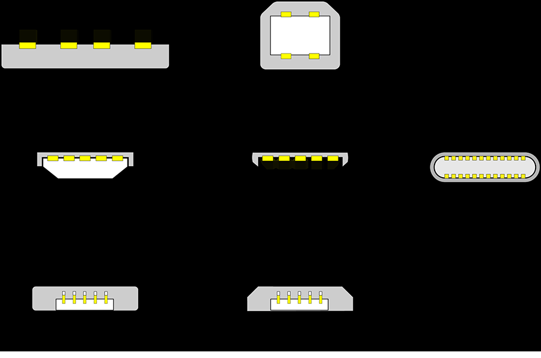</p>

<p align="center">图 1：最普及的 USB 插头和插座</p>

### 27.1.1 USB 快速入门

好吧。没有时间浪费了。这是学习 USB 的最后机会。让我们开始吧。

USB 规范有多个版本。最普及的 USB 2.0 支持三种总线速度：480Mbit/s（也称为高速 - High Speed, HS）、12Mbit/s（称为全速 - Full Speed, FS）、1.5Mbit/s（称为低速 - Low Speed, LS）。后两种继承自 USB 1.1 规范。这表明了该标准的另一个重要特性：新版本被设计为向后兼容。

²请注意，从现在开始，除非另有说明，术语“USB”指的是 USB 2.0 协议。³http://janaxelson.com/ordering.htm#titles ⁴http://janaxelson.com/usbc.htm ⁵https://bit.ly/3zvecY6 ⁶https://bit.ly/3Cyj6V6

<!-- page: 797 -->

多年来，多种电缆和连接器已被标准化。标准连接器被有意设计为强制 USB 网络的定向拓扑结构：主机设备上的 Type-A 插座提供电源，目标设备上的 Type-B 插座消耗电源。这防止了用户意外地将两个 USB 电源相互连接，这可能导致短路、危险的高电流、电路故障甚至火灾。图 1 展示了七种最普及的 USB 插头和插座。

USB 是以主机为中心的。所有通信都在主机（通常是计算机）和设备之间进行。主机管理线路上的流量，设备响应来自主机的通信。USB 是一个总线。这意味着当主机传输数据包时，该数据包会被发送到连接的所有设备。只有一个设备，即被寻址的设备，会接受数据（其他所有设备都接收它，但由于地址不同，它们会静默地忽略它）。

主机通过“虚拟管道”与设备交换数据包，在 USB 术语中称为端点（endpoint）。每个端点都有一个唯一的地址，并且设备可使用的端点数量有限。这意味着，从总线的角度来看，数据包由目标设备地址加上端点号来标识。从开发人员的角度来看，设备端点是一个存储接收数据或待发送数据的内存缓冲区。除了地址号外，每个端点还具有方向和缓冲区的最大尺寸，后者显然对应于端点在一个事务中可发送或接收的最大数据字节数。一个特殊的端点，称为端点零（EP0），始终存在于 USB 设备中，并由主机用于配置该设备。

每个 USB 传输由一个或多个事务组成，这些事务可以向端点传输数据或从端点接收数据。事务以“令牌包”（token packet）开始，该令牌包指定端点号和传输方向。SETUP 令牌包用于配置整个设备或某些功能。IN 令牌包请求从端点获取数据包。OUT 令牌包跟随来自主机的数据包。除了数据外，每个数据包还包含错误检查位和一个带有数据排序值的包 ID（PID）。许多事务还有一个握手包，其中数据接收者报告事务的成功或失败。为了澄清：我们使用 IN 端点将数据从设备传输到主机，而使用 OUT 端点将数据从主机传输到设备。请记住：USB 是一个以主机为中心的协议。

USB 2.0 支持四种传输类型：控制（control）、批量（bulk）、等时（isochronous）和中断。在控制传输中，主机向设备发送定义好的请求。当设备连接时，主机使用控制传输从设备请求一系列称为描述符（descriptors）的数据结构。描述符提供了关于设备能力的信息，并帮助主机决定为设备分配哪个驱动程序。控制传输最多包含三个阶段：SETUP、DATA（可选）和 STATUS。SETUP 阶段包含请求。DATA 阶段包含来自主机或设备的数据，具体取决于请求内容。STATUS 阶段包含关于传输成功与否的信息。

其他传输类型没有定义好的阶段，如何定义和使用消息中包含的数据以及如何解释这些数据，取决于高层软件。

批量传输在其他空闲总线上是最快的，但没有保证的时序。打印机和<!-- page: 798 -->USB 虚拟 COM 端口（VCP）数据使用批量传输。

等时传输具有保证的时序，但没有纠错功能。流式音频和视频使用这种类型的传输。

中断传输具有保证的最大延迟，即两次事务尝试之间的时间。鼠标和键盘使用中断传输。这里有一个重要的点需要澄清：中断传输与微控制器的中断没有任何关系。主机和连接设备之间没有专用的中断线。USB 2.0 物理介质仅由两根名为 D+ 和 D- 的线组成，除了 VCC 和 GND 线之外。中断传输使用一个专用的端点（endpoint），该端点被主机不断轮询。这种类型的传输允许向主机发出信号，表明主机必须执行某个操作，具体取决于特定的协议。

USB 规范并未说明应用层传输字节的意义。这一方面由设备类（device classes）和应用协议来要求，这些协议标准化了消息的结构、其含义、使用的端点数量和类型等。USB-IF 标准化了一些相关的类。例如，人机接口设备（Human Interface Device, HID）是专门用于标准化鼠标、键盘、摇杆等设备的类。

所有 USB 设备都有一个描述符层次结构，为主机提供诸如设备是什么、谁制造的、支持哪个版本的 USB、可以配置多少种方式、端点的数量及其类型等信息。更常见的 USB 描述符包括：

- 设备描述符（Device Descriptors）：它们提供设备功能的总体概述。
- 接口描述符（Interface Descriptors）：它们提供给定设备接口功能的描述（例如，在鼠标中，接口描述符提供有关 HID 类的信息）。
- 端点描述符（Endpoint Descriptors）：这些描述符用于描述除端点零以外的端点。主机将使用从这些描述符返回的信息来确定总线的带宽需求。
- 字符串描述符（String Descriptors）：字符串描述符提供人类可读的信息。

这就是全部内容了。我们现在已经是 USB 协议的专家了。或多或少吧。

<!-- page: 799 -->

<p align="center">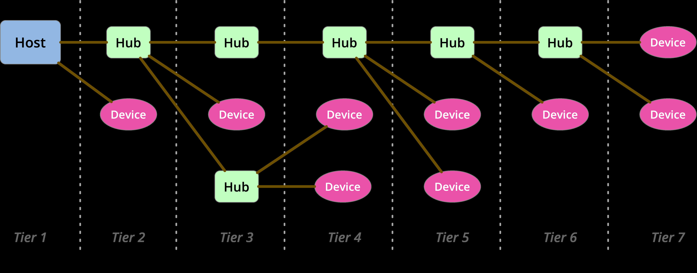</p>

<p align="center">图 2：USB 分层拓扑结构</p>

### 27.1.2 USB 物理架构概述

如前所述，USB 是一种以主机为中心的串行总线协议。在 USB 总线上只能存在一个充当“主设备”的主机，它调度在总线上流动的消息。同一总线上最多可以共存 127 个“从设备”。主机和设备通过专用的透明设备互连，这些设备称为集线器（hubs）。USB 具有分层星型拓扑结构（图 2）。在根层是 USB 主机。所有设备要么直接连接到主机，要么通过集线器连接。根据 USB 规范，USB 主机最多只能支持七层。

基本上，每个主机设备都由两个基本组件组成：主机控制器接口（Host Controller Interface, HCI）和根集线器。主机控制器是一个专用的集成电路（IC），它实现了处理主机和设备之间消息流动所需的所有硬件要求和部分协议逻辑。市场上存在四种主要的“标准化”PC 主机控制器（OHCI、UHCI、EHCI 和 xHCI）。从本文的角度来看，重要的是要知道 HCI 是一个复杂的硬件部分。据我所知，市场上不存在提供 USB 2.0 HCI 的 Cortex-M 微控制器。相反，一些 MCU，如某些 STM32 微控制器，提供了作为 USB FS 主机工作的能力，实现了一组有限的功能。这使得能够开发 USB 主机设备，以接口一些常见且速度不太快的 USB 设备（鼠标、键盘等）。

<!-- page: 800 -->

<p align="center">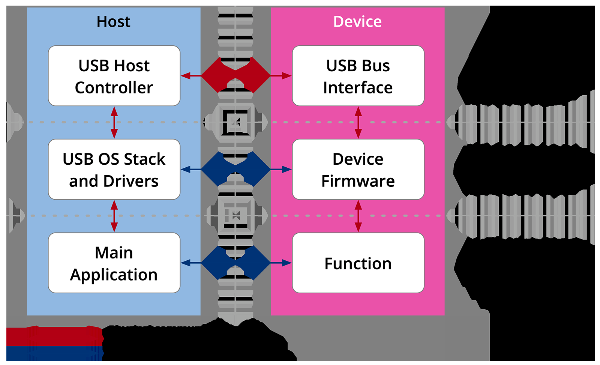</p>

<p align="center">图 3：USB 架构概述</p>

USB 规范也可以被视为一种分层架构，如图 3 所示。USB 可以分为三个主要层：总线接口、设备和应用层。

总线接口层由硬件控制器实现。PC 集成主机控制器接口（HCI）；STM32 MCU 则集成了专用的 USB 物理层收发器（PHY）和串行接口引擎（Serial Interface Engine，SIE）。SIE 是硬件接口的前端，负责处理 USB 规范中定义的大部分协议，通常一直处理到事务层级。其功能包括：

- 数据包识别、事务排序
- SOP、EOP、RESET、RESUME 信号检测/生成
- 时钟/数据分离
- NRZI 数据编码/解码和位填充
- CRC 生成和检查（Token 和 Data）
- 数据包 ID（PID）生成和检查/解码
- 串行-并行/并行-串行转换

设备层对应于 USB 连接中的软件低层部分。它包含一些通用的 USB 功能（例如用于发现设备能力的设备描述符，我们稍后会看到）和特定协议的功能。例如，大容量存储类（Mass Storage Class, MSC）设备实现了所有允许将外部磁盘驱动器接口到 PC 的功能。同时，PC 操作系统（例如 Windows）需要一个专用的“驱动程序”来接口这样的 USB 设备。

应用层实现了使用设备所需的逻辑。从 USB 设备的角度来看，这一层包含提供特定功能的实际代码。例如，<!-- page: 801 -->我们的 MSC 设备可能实现了必要的代码，以便通过 SPI 连接 SD 卡；对于 PC 来说，它看起来就像其他 MSC 设备（即外部磁盘）。MSC 协议基本上由 SCSI 命令组成，这些命令需要由应用代码适配到特定的存储器技术设备（Memory Technology Device, MTD）。

<p align="center">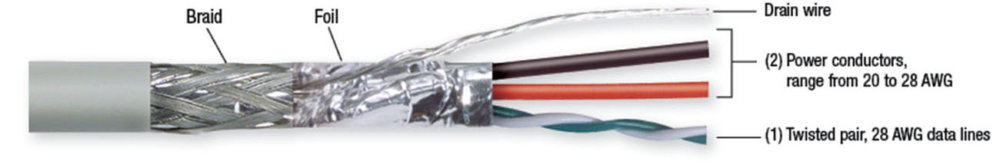</p>

<p align="center">图 4：USB 2.0 电缆的接线</p>

USB-IF 还标准化了互连 USB 设备的硬件介质：插头、插座和电缆。图 4 显示了 USB 2.0 电缆的典型结构。由编织物和箔片（加上确保编织物正确接地的排水线）制成的屏蔽层包围电源线和信号线。电源导体用于向设备提供足够的能量。红色线，也称为 VBUS，为所有连接的设备提供恒定的 4.40–5.25 V 电源。USB 2.0 设备最多可从 USB 电缆取用 500 mA 电流。较新的 USB 3.x 标准允许提供高达 5 A、20 V（100W）的电源。

虽然 USB 向设备提供高达 5.25V 的电压，但数据线（D+ 和 D-）在 3.3V 下工作。数据线是一对差分双绞线。使用差分 D+ 和 D- 信号的原因是拒绝共模噪声。如果噪声耦合到电缆中，它通常存在于电缆中的所有导线上。通过在主机和设备的 USB 硬件内部使用差分放大器，可以拒绝共模噪声。USB 2.0 使用不归零反相（NRZI）编码方案表示二进制信号。

多年来，USB-IF 标准化了一系列连接器。历史上，连接器（包括插头和插座）分为两大类：Type-A 和 Type-B。主机始终使用 Type-A 端口和连接器，而设备使用 Type-B 端口和连接器。最初，USB 规范仅包含用于设备的较大 Type-A 和 Type-B 连接器，但后来包含了 Mini 和 Micro 连接（参见图 1）。这些 Mini 和 Micro 连接器最初是为 USB On-the-Go（USB OTG）开发的，这是一种允许通常作为从机的设备变为主机的 USB 规范。然而，由于 Mini-B 和 Micro-B 连接器比 Type-B 更小，尽管它们缺乏 USB OTG 功能，但在许多电子设备中被采用。

标准的演变以及其他参与者（如 Apple 针对 iPhone/iPad 的 Lightning 标准）的市场压力，迫使 USB-IF 引入了一种完全对称的连接器。随着 2014 年 USB 3.1 标准的出现，USB-IF 引入了 Type-C 连接器，该连接器对主机和设备使用相同的布局。

目前，USB 规范定义了七种传输速率：Low-Speed（低速）、Full-Speed（全速）、Hi-Speed（高速），以及 SuperSpeed 5/10/20/40 Gbit/s。在撰写本章时，大多数带有 USB 外设的 STM32 微控制器仅支持 Full-Speed 模式，而性能最高的型号也支持 USB 2.0 High-Speed。

Low-Speed、Full-Speed 和 High-Speed 设备通常分别标称为 1.5 Mb/s、12 Mb/s 和 480 Mb/s<!-- page: 802 -->。这些是总线速率而不是数据速率。实际数据速率受总线负载、传输类型、开销、操作系统等因素影响。

当 USB 设备连接到主机时，需要检测设备的速度。这是通过 D+ 或 D- 线上的上拉电阻完成的。D+ 线上的 1.5kΩ 上拉电阻表示连接的设备是 Full-Speed 设备。D- 线上的 1.5kΩ 上拉电阻表示连接的设备是 Low-Speed 设备。High-Speed 设备开始时作为 Full-Speed 设备，因此它们在 D+ 线上有 1.5kΩ 上拉电阻。当设备连接时，它在枚举的重置阶段期间通过 D+/D- 线发出信号序列。如果集线器支持 High-Speed，则移除上拉电阻。除了 STM32F1 系列微控制器外，大多数 STM32 微控制器提供内部 1.5kΩ 上拉电阻，无需将其作为外部组件添加。

Low-Speed 和 Full-Speed USB 设备将使用 48 MHz 时钟用于 SIE 和其他 USB 时钟目的。这个 48 MHz 时钟和总线速度决定了 USB 位时间：

- Full-Speed：48 MHz / 12 Mb/s = 每个位时间 4 个时钟。
- Low-Speed：48 MHz / 1.5 Mb/s = 每个位时间 32 个时钟。

一些 STM32 微控制器，特别是属于低成本价值系列的型号，提供集成的 48 MHz RC 网络，因此您可以节省空间和 BOM 成本（它们被称为无晶振 USB 微控制器）。

### 27.1.3 USB 逻辑架构概述

作为 STM32 开发人员，您不需要深入研究 USB 2.0 规范中与物理层相关的方面。ST 工程师将所有实现物理层和 SIE 的硬件电路集成在芯片内部。相反，作为程序员，理解 USB 2.0 逻辑架构及其状态机至关重要。

#### 27.1.3.1 设备状态

当 USB 2.0 设备插入主机/集线器端口时，会发生一系列非平凡的事情。这个过程称为枚举（Enumeration），它由电气阶段和软件阶段组成。我们将开始分析电气部分。

当 USB 2.0 设备插入 Type-A 端口时，主机/集线器和设备都会经历一组定义明确的状态。

- ATTACHED（已连接）：当设备连接到主机/集线器时发生，但此时未向 VBUS 线供电。
- POWERED（已供电）：设备已连接到 USB 并已供电，但尚未收到复位请求。处于此状态的设备不能汲取超过 100 mA 的电流。
- DEFAULT（默认）：设备已连接到 USB，已供电，并已被主机复位。此时，设备没有唯一的设备地址。设备响应地址 0。

<!-- page: 803 -->

- ADDRESSED（已寻址）：设备已连接到 USB，已供电，已复位，并被分配了唯一地址。然而，设备尚未配置。
- CONFIGURED（已配置）：设备已连接到 USB，已供电，已复位，被分配了唯一地址，已配置，且未处于挂起状态。此时，总线供电设备可以汲取超过 100 mA 的电流。
- SUSPENDED（挂起）：当设备已连接并配置，但在总线上 3 ms 内未检测到活动时，发生此状态。

让我们更详细地分析每一种状态。

ATTACHED（已连接） 用户想要使用他的 USB 设备。他轻轻地将设备插入集线器端口。根据本作者有限的经验，设备插入后立即发生的事情在很大程度上取决于具体实现。一些集线器控制器保持 VBUS 线断开，并设计为检测 D+/D- 线电容的变化。根据 USB 物理规范，数据线必须具有良好表征的总线电容，一些控制器被设计为测量它。在电容变化（降至几 pF）时，它们开始为 VBUS 线供电并开始设备速度识别阶段。

其他集线器控制器被设计为检测 VBUS 线上的过流事件。当设备插入时，由于插入初始阶段电阻有限，设备开始汲取大量电流。集线器检测到此事件，并断开 VBUS 线。然后它重新为 VBUS 线供电并开始设备识别阶段。

最后，其他控制器提供标准化的连接检测协议（ADP）。集线器通过放电 VBUS 线，然后测量使已知电流将线路充电到定义电压所需的时间来进行连接探测。如果线路未在预期时间内充电，则没有设备存在。探测大约每 1.75s 重复一次。

POWERED（已供电） 一旦设备插入完成（因此设备处于 ATTACHED 状态），集线器开始为其供电，提供高达 100 mA 的电流。在此阶段开始设备速度识别。在连接到端口时，设备通过将相应的上拉线拉高（根据其速度）来连接到总线。上拉电阻的值允许推导出设备速度。因此设备处于 POWERED 状态，集线器知道使用哪种物理协议（根据速度）与其交换数据。

DEFAULT（默认） 主机被集线器通知有新设备。因此它要求集线器复位相应的端口。发生一个定义明确的复位序列，包括将两条数据线拉低至少 10ms。这是微控制器通知开发者的第一个总线条件。这给了我们一个机会，开始微控制器的早期配置，以便 USB 外设能够响应来自主机的进一步请求。当复位条件结束时，设备被认为处于 DEFAULT 状态。在此状态下，主机/集线器还采样数据线以了解设备是否支持 High-Speed 模式，通过在数据线上发出特殊信号。

<!-- page: 804 -->

**ADDRESSED（已寻址）** 处于 DEFAULT（默认）状态的设备会响应主机在 0x0 地址上的请求。如前所述，USB 2.0 是一种广播协议。所有设备都会接收到相同的消息，但会丢弃那些不包含其设备地址的消息。当设备插入集线器端口时，它会自动将默认地址设置为 0x0。由于主机一次只枚举一个设备（通过物理上逐个给端口供电），因此只有一个设备会响应发送到 0x0 地址的通信。主机因此能够与该设备通信，并开始请求一系列描述该设备的字节。这些字节被称为设备描述符（device descriptors），我们将在后文中深入分析它们。

接下来发生什么取决于操作系统和应用层。一些较旧的 Windows 版本会再次重置设备（有时甚至多次重置……）。设备描述符会被再次轮询，如果操作成功，主机就会为该设备分配一个唯一地址。其他一些操作系统则会跳过这次额外的重置，直接分配地址。此时设备处于 ADDRESSED（已寻址）状态，主机可以请求更多信息。

**CONFIGURED（已配置）** 主机通过读取设备描述符来了解设备的完整能力，使用的是已分配的地址。所需信息的列表可能很长，我们将在后文中分析其中大部分内容。其中一些信息包括设备的供电需求：如果设备需要汲取超过 100 mA 的电流，它必须通知主机，以便主机“授权”其增加功耗。主机收集的其他信息涉及通信通道（端点）的数量和类型、通信缓冲区的最大尺寸等。在这个询问阶段结束时，操作系统还会选择并激活与设备交互所需的设备驱动程序。一旦所有这些操作完成，设备就处于 CONFIGURED（已配置）状态，准备接受来自应用软件的高层消息。

**SUSPENDED（挂起）** 当检测到总线活动停止至少 3 ms 后，设备进入此状态。在 SUSPENDED（挂起）状态下，设备应限制其对总线电源的使用。已配置和未配置的设备都必须支持此状态。我们将在后文中对此进行更多说明。

#### 27.1.3.2 通信端点

在 USB 2.0 中，主机和设备通过虚拟管道（pipe）进行通信。每条消息都指向特定的设备和给定的通信管道。USB 2.0 系统中有两种类型的管道：控制管道（control pipes）和数据管道（data pipes）。每个设备只有一个控制管道和可变数量的数据管道，具体取决于设备的功能。例如，鼠标通常具有一个控制管道和一个用于向 PC 发送指针坐标的数据管道。控制管道是 USB 系统中唯一的双向管道。所有数据管道则是单向的。

<!-- page: 805 -->

<p align="center">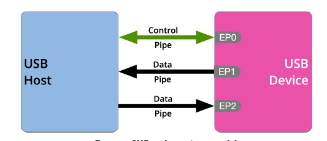</p>

<p align="center">图 5：USB 端点/管道模型</p>

USB 规范定义了四种不同的数据传输类型。所使用的管道类型取决于待传输数据的特性。让我们来分析它们。

**CONTROL TRANSFERS（控制传输）** 控制传输通过总线发送和接收设备信息。它们用于向设备发送命令、进行查询以及配置设备。此传输使用控制管道。例如，主机通过使用控制传输来设置设备地址。控制传输的优势是保证准确性。发生的错误会被正确检测，并且数据会被重发。在低速和全速设备中，控制传输在总线上保留 10% 的带宽；在高速设备中保留 20%。

**INTERRUPT TRANSFERS（中断传输）** 这些传输用于必须使用高可靠性方法来通信少量数据的设备。这通常用于 HID 设备，如鼠标和键盘。这种传输的名称可能会产生误导。它并不是真正从设备流向主机的专用中断线，而是使用轮询率。然而，你得到的是主机以可预测的间隔检查数据的保证。中断传输提供保证的准确性，因为错误会被正确检测，并且有故障的事务会在下一个事务中重试。在低速和全速设备中，中断传输具有 90% 的保证带宽；在高速设备中为 80%。此带宽与等时传输共享。中断传输的最大数据包大小是设备速度的函数。支持高速的设备支持最大 1,024 字节的数据包大小。支持全速的设备支持最大 64 字节的数据包大小。低速设备支持最大 8 字节的数据包大小。这种类型的传输使用数据管道。

**BULK TRANSFERS（批量传输）** 这类传输通常用于在时间要求较宽松的情况下传输相对大量的数据，并可利用所有可用带宽。它们是 USB 设备最常见的传输类型。批量传输没有预留带宽，因此交付时间可变，取决于总线上可用的带宽，无法预先确定。批量传输能够可靠地交付数据，因为错误会被检测到，发生错误的事务会重新发送。它适用于传输大量对时间不敏感的数据。最大数据包大小取决于设备速度：高速设备最大为 512 字节，全速设备最大为 64 字节，低速<!-- page: 806 -->设备不支持批量传输。这类传输使用数据管道。

**ISOCHRONOUS TRANSFERS（等时传输）** 这些传输是连续的和实时的传输，具有预先协商的带宽。等时传输必须支持容错数据流，因为它们没有错误恢复机制或握手。错误通过 CRC 字段检测，但不进行纠正。对于等时传输，你得到的是保证交付与保证准确性之间的权衡。流式音乐或视频是使用等时端点的应用程序示例，因为偶尔丢失的数据会被人耳和人眼忽略。在低速和全速设备中，等时传输具有 90% 的保证带宽（在高速设备中为 80%），该带宽与中断端点共享。支持高速的设备支持最大 1,024 字节的数据包大小。全速设备支持最大 1023 字节的数据包大小。低速设备不支持等时传输类型。等时传输有一些特殊考虑。通常你需要 3 倍缓冲，以确保数据准备好发送，即有一个正在主动传输的缓冲区和另一个正在主动加载的缓冲区。这些传输使用数据管道。

控制管道和数据管道是建立在设备端点之上的抽象。在 USB 规范中，设备端点是 USB 设备中可唯一寻址的部分，它是主机和设备之间通信流中信息的源或汇。有四种类型的端点，对应于前面看到的传输类型：控制端点、中断端点、批量端点和等时端点。

端点由两个参数定义：给定设备的唯一地址和方向。IN 端点用于将数据从设备传输到主机。OUT 端点用于将数据从主机传输到设备。名为 SETUP 的控制端点是一个特殊的端点，其地址为 0x0，它是 USB 系统中唯一的双向端点：程序员将使用它来向主机发送和接收数据。控制端点是 USB 系统中唯一必需的端点，并且存在仅通过 SETUP 端点进行通信的类（例如，DFU 类）。在枚举过程中，主机通过控制端点发送和接收消息，以获取设备能力并对其进行配置。控制端点确保主机拥有一种默认方式来访问设备，而无需了解实际实现的功能。端点本质上是双向的。直到它们被配置后，才具有单一方向（变为单向）。例如，端点 1（简称为 EP1）可以是 IN 端点或 OUT 端点。正是在设备配置中，EP1 才被正式指定为 IN 端点。

USB 2.0 规范的基础中有一个重要的概念需要牢记。正如之前多次提到的，USB 是一种以主机为中心的协议。所有事务均由主机发起，无论端点方向如何。如果主机需要向设备发送数据，它会在 OUT 端点写入一定数量的字节。相反，如果设备需要向主机发送数据，它会将数据写入 IN 端点，并等待主机读取。从固件的角度来看，设备通过专用中断获知传输完成（双向均如此）。正如我们稍后所见，USB 协议是一个完全由中断驱动的协议，这极大地影响了我们嵌入式应用的结构（以及轻松调试它的可能性）。

除 EP0 外，设备可支持的端点数量取决于其设计<!-- page: 807 -->需求。像鼠标这样的简单设备可能只需要一个 IN 端点，更复杂的设计则可能需要多个数据端点。USB 规范将高速和全速设备每个方向的端点数量限制为 16 个（16 个 IN、16 个 OUT，共 32 个），不包括控制端点 0 IN 和 0 OUT。不过，STM32 微控制器可用的端点较少（通常总数为 8 个，包括 EP0；某些 STM32 型号的端点数更少）。低速设备最多支持两个端点。

端点使用循环冗余校验（CRC）来检测事务中的错误。CRC 是用于错误检查的计算值。实际的计算公式在 USB 规范中有说明，这些计算的处理由 USB 硬件负责，以便发出适当的响应。事务的接收方将 CRC 与数据进行比对。如果两者匹配，则接收方发出 ACK。如果数据和 CRC 不匹配，则不发送握手。这种握手的缺失告诉发送方重试。

表 1 总结了四种端点类型及其相关特性。

<p align="center">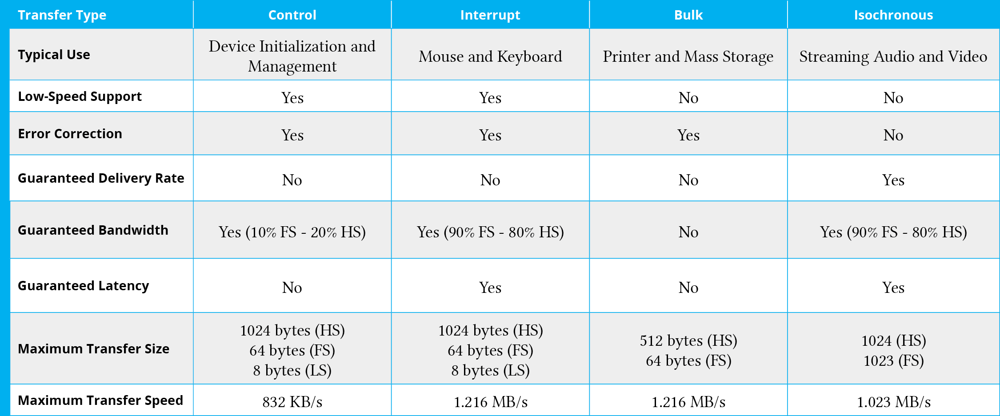</p>

<p align="center">表 1：端点类型及其相对特性</p>

### 27.1.4 USB 2.0 通信协议概述

> **提示**
>
> 如果你刚接触 USB 2.0 协议，可以暂时跳过本节及其子节。本节内容主要由硬件和 CubeHAL 处理；对于程序员而言，事务协议基本透明，除非需要借助协议分析仪调试设备（后文会介绍）。建议直接阅读下一节“设备描述符”。

从开发者的角度来看，USB 2.0 消息是一系列字节流，其含义取决于消息类型。例如，鼠标使用<!-- page: 808 -->中断端点向主机发送数据消息，其中包含用于在屏幕上移动指针的相对坐标。

从 USB 的角度来看，消息是一系列帧，如图 6 所示。每个帧由一个帧起始（SOF）后跟一个或多个事务组成。每个事务由一系列数据包组成。数据包前面有一个数据包 ID 和一个同步模式，并以数据包结束（EOP）模式结束。根据事务类型，可能有一个或多个数据包，某些事务可能有或没有握手包。至少，一个事务有一个令牌包。

<p align="center">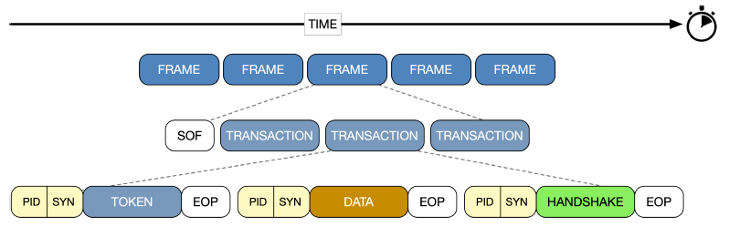</p>

<p align="center">图 6：给定时间帧内的 USB 通信</p>

每个数据包可以包含不同的信息片段。包含哪些信息取决于数据包类型。以下是可以包含在数据包中的潜在信息列表：

- 数据包 ID（PID）：将事务类型声明为 IN/OUT/SETUP/SOF。
- 可选设备地址：指定消息所寻址的设备。
- 可选端点地址：指定 1 到 16 之间的端点地址（对于所有 STM32 MCU，为 1 到 7 之间）。
- 可选有效载荷数据：根据数据包类型和 USB 版本，这可以包含多达 1,024 字节的数据，其含义取决于数据包类型。
- 可选 CRC。

#### 27.1.4.1 数据包类型

根据 USB 2.0 规范，存在四种具有固定结构的数据包类型：

- 令牌包：用于启动事务、标识参与事务的设备，且始终由主机发出。
- 数据包：承载有效载荷数据，可由主机或设备发出。

<!-- page: 809 -->

- 握手数据包：用于确认数据是否成功接收，可由主机或设备发出。
- 特殊数据包：用于协调速率差异，由主机发送给集线器。

让我们深入分析这些数据包类型。

令牌包 令牌包始终由主机发出，用于控制总线上的流量。令牌包的功能取决于所执行的操作。IN 令牌用于请求设备向主机发送数据。OUT 令牌用于在主机发送数据之前发出。SETUP 令牌用于在主机发送控制命令之前发出。SOF 令牌用于标记时间帧。在每个 IN、OUT 和 SETUP 令牌包中，都包含一个 7 位的设备地址、一个 4 位的端点 ID 和一个 5 位的 CRC。图 7 展示了五种令牌包的结构。

<p align="center">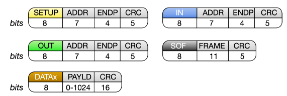</p>

<p align="center">图 7：USB 2.0 中的令牌包类型</p>

SOF 包为设备提供了一种识别帧起始并与主机同步的方法。它们还用于防止设备进入挂起模式（如果 3 ms 内未收到 SOF，设备必须进入该模式）。SOF 包仅出现在全速和高速设备上，并且每毫秒发送一次。SOF 包不会伴随握手包。高速通信更进一步，引入了微帧。对于高速设备，每 125 μs 发送一次 SOF，而帧计数仅每 1ms 递增一次。

数据包 数据包跟随 IN、OUT 和 SETUP 令牌包之后。有效载荷数据的大小根据传输类型和 USB 版本而异，范围为 0 到 1,024 字节。对于 LS/FS 设备，数据包 ID 在 DATA0 和 DATA1 之间切换；对于 HS 设备，则在 DATA0/1/2/MDATA 之间切换。数据包以 16 位 CRC 结束。数据包的结构如图 7 所示。每次数据包成功传输后，主机和设备都会更新数据切换位。数据切换<!-- page: 810 -->还能额外用于检测错误：如果接收到的数据包 ID 与预期不符，设备便可判断传输过程中出现了错误，并作出相应处理。例如，发送方发出了 ACK（确认），但接收方未收到。在这种情况下，发送方会将数据切换位从 1 更新为 0，而接收方不会更新，仍保持为 1。这会导致主机和设备在下一个数据阶段失去同步，从而表明发生了错误。

握手数据包 握手数据包用于结束每个事务。每个握手都包含一个 8 位的数据包 ID，并由事务的接收方发送。每种 USB 速度都有几种握手响应选项。具体支持哪些选项取决于 USB 速度：

- ACK：确认成功完成。（LS/FS/HS）
- NAK：否定确认。（LS/FS/HS）
- STALL：由设备发送的错误指示。（LS/FS/HS）
- NYET：表示设备尚未准备好接收另一个数据包。（仅限高速）

特殊数据包 USB 规范定义了四种特殊数据包。

- PRE：由主机向集线器发出，以指示下一个数据包为低速。
- SPLIT：位于令牌数据包之前，以指示拆分事务。（仅限高速）
- ERR：由集线器返回，以报告拆分事务中的错误。（仅限高速）
- PING：在收到 NYET 握手后，检查批量 OUT 或控制写入的状态。（仅限高速）

#### 27.1.4.2 事务类型

SETUP、IN 和 OUT 令牌决定了三种不同的事务类型。让我们简要了解一下它们。

##### 27.1.4.2.1 控制事务

控制事务用于识别、配置和控制设备。它们使主机能够读取有关设备的信息、设置设备地址、建立配置、读取端点配置、发出某些与类相关的命令等。在枚举阶段，控制传输始终指向设备的控制端点（即始终为 EP0）。在设备完全枚举之后，控制传输可以指向其他端点，以与设备的其他方面（例如其类）进行交互（但这种情况相当少见）。

<!-- page: 811 -->

<p align="center">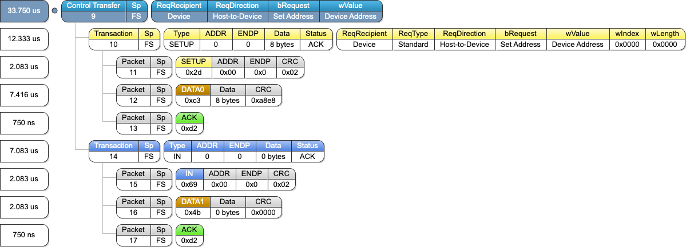</p>

<p align="center">图 8：控制事务的示例</p>

控制事务包含三个阶段：设置阶段（必需）、数据阶段（可选）和状态阶段（必需）。状态阶段包含一个 IN 或 OUT 事务，用于报告之前各阶段的执行成功或失败。该阶段的数据包始终为 DATA1（不同于在 DATA0 和 DATA1 之间切换的常规 IN 和 OUT 事务），并且包含一个零长度数据包。状态阶段以接收方针对前一个数据包发送的握手事务结束。

图 8 显示了主机发出的用于设置设备地址的完整控制事务。数据包 11、12 和 13 标识了设置阶段。

数据包 11 是令牌包，其 PID 等于 SETUP，目标地址等于 0x0（对应于当前处于 DEFAULT 状态的新设备），端点 ID 对应于控制端点 EP0。

数据包 12 是包含对设备有效请求的数据包。它包含 SET_ADDRESS 命令及相应的地址 ID。

数据包 13 是由设备发出的 ACK 包。此控制事务没有数据阶段。

最后，事务 14（由数据包 15、16 和 17 组成）对应于状态阶段（参见空 DATA1 包）。

<!-- page: 812 -->

<p align="center">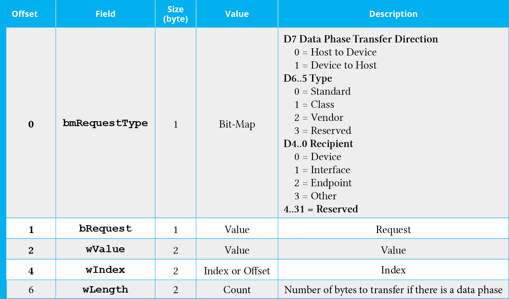</p>

<p align="center">表 2：SETUP 令牌的结构</p>

紧随 SETUP 令牌数据包之后的数据包内容具有明确定义的结构，如表 2 所示。可以看出，SETUP 数据包可以发送至设备、接口（稍后详述）或端点。当 SETUP 数据包寻址到设备（bmRequestType.Type=0/bmRequestType.Recipient=0）时，我们称之为标准设备请求，且字段 bRequest、wValue、wIndex 和 wLength 的内容对应表 3 中的一行。可以看出，SET_ADDRESS 请求具有如下结构：

- wValue：分配给新设备的地址；
- wIndex：未使用的字段，设置为零；
- wLength：未使用的字段，设置为零；
- Data：该请求没有数据阶段。

其余标准设备请求的用途如下：

- GET_STATUS：该请求指向设备，设备将在数据阶段返回两个字节，指示设备是否为自供电以及是否具有远程唤醒功能并能在挂起期间唤醒主机（例如，点击鼠标按钮可以唤醒主机）。
- CLEAR_FEATURE 和 SET_FEATURE：这些请求可用于设置布尔特征。当指定接收方为设备时，仅有的两个特征选择器是 DEVICE_REMOTE_WAKEUP 和 TEST_MODE。测试模式允许设备表现出各种状态。这些内容在 USB 规范修订版 2.0 中有进一步说明。

<!-- page: 813 -->

- GET_DESCRIPTOR 和 SET_DESCRIPTOR：这些请求用于设置/返回 wValue 中指定的描述符。对配置描述符的请求将在一次请求中返回设备描述符以及所有接口和端点描述符。稍后我们将详细介绍描述符。
- GET_CONFIGURATION 和 SET_CONFIGURATION：这些请求用于返回或设置当前设备配置。对于 GET_CONFIGURATION 请求，将在数据阶段返回一个字节以指示设备状态。零值表示设备未配置，非零值表示设备已配置。SET_CONFIGURATION 用于启用设备。它应在 wValue 的低字节中包含所需配置描述符的 bConfigurationValue 值，以选择要启用的配置。

<p align="center">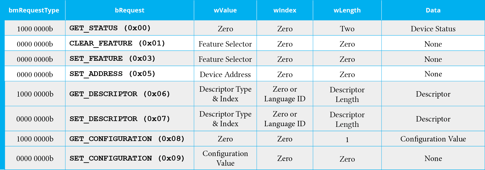</p>

<p align="center">表 3：标准设备请求列表</p>

当控制事务指向接口（bmRequestType.Type=0 / bmRequestType.Recipient=1）时，我们称之为标准接口请求。在这种情况下，请求的字段可以取表 4 中报告的值。表 4 中报告的大多数请求保留供未来使用，除了 GET_INTERFACE 和 SET_INTERFACE 请求，它们允许在备用接口配置之间切换，这是一个我们稍后描述的功能。

<p align="center">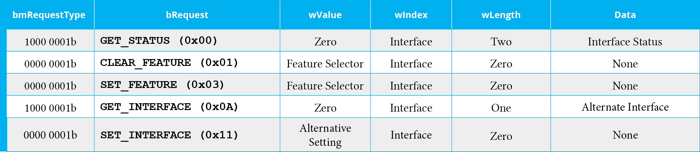</p>

<p align="center">表 4：标准接口请求列表</p>

当控制事务指向端点（bmRequestType.Type=0 / bmRequestType.Recipient=2）时，称为标准端点请求。此时，请求字段可取表 5 所列的值。GET_STATUS 请求返回两个字节，指示端点是否处于停止（halted）状态。CLEAR_FEATURE 和 SET_FEATURE 用于设置或清除端点特性。当前标准定义了一个端点特性选择器 ENDPOINT_HALT<!-- page: 814 -->（0x00），用于设置或清除端点的停止状态。除默认端点外，建议其他端点支持此特性。最后，SYNCH_FRAME 请求用于报告端点同步帧。

<p align="center">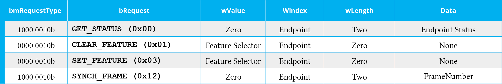</p>

<p align="center">表 5：标准端点请求列表</p>

最后，当控制事务指向接口且其类型为 Class（(bmRequestType.Type=1 / bmRequestType.Recipient=1）时，我们称之为 Class 请求。Class 请求是由 Class 本身定义的一组特定于 Class 的请求。这些请求允许主机查询特定设备的能力和状态，并设置输出和特性项的状态。我们将在本章稍后分析一些特定于 Class 的请求。

##### 27.1.4.2.2 IN/OUT 事务

IN 事务指从设备到主机的数据传输。它们指向除 EP0 以外的端点。这些事务由主机发送 IN 令牌包发起。目标设备通过发送一个或多个数据包进行响应，主机则用握手包进行响应。设备可能无法响应主机的请求：如果是这种情况，设备需要用 NAK 进行响应。主机将通过再次发送相同的事务来持续重试请求。

相反，OUT 事务指从主机到设备发生的数据传输。在这种类型的事务中，主机发送适当的令牌包（OUT 或 SETUP），随后跟随一个或多个数据包。接收设备通过发送适当的握手包来结束事务。设备可能无法接受来自主机的数据：如果是这种情况，设备需要用 NYET 或 NAK⁷ 进行响应。主机将通过再次发送相同的事务来持续重试请求。

例如，查看图 9 中的批量事务。事务 5244 是一个以设备 NYET 结束的 OUT 事务。主机发送一个 PING 包，即使设备确认了 PING，它也会通过发出 NYET 来拒绝后续 OUT 事务中的数据（数据包 5249）。随后的事务（5252）将成功（查看 ACK 包 #5258）。

⁷在 USB 2.0 中引入 NYET 握手包的原因是带宽利用效率的考虑。如果设备以 NYET 响应，主机知道设备很可能会 NAK 下一个 OUT 事务，这意味着整个帧时间都在传输数据，这是浪费的：完全相同的数据将不得不重新发送。这就是为什么 NAK 一个 OUT 事务会浪费大量帧时间，因为 OUT 事务无目的地占用总线，并且与其他事务/设备竞争，从它们那里夺取帧时间。想象一下没有 NYET 握手的协议：每次设备 NAK 时，主机都必须发送整个相同的数据块（即，对于批量端点最多 512 字节），仅仅是为了询问设备是否准备好。如果主机收到 NYET，它将开始向设备发送 PING，询问设备是否准备好接收更多数据。与大型数据 OUT 事务相比，PING 事务非常短。因此，如果设备 NAK 了 PING，主机可以使用帧的其余部分进行其他事务，从而带来更好的总线利用率。

<!-- page: 815 -->

<p align="center">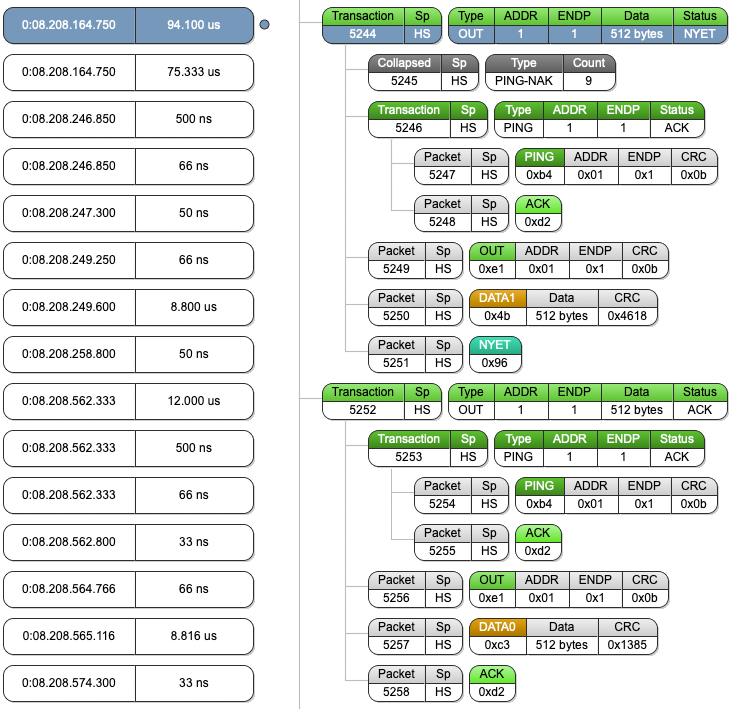</p>

<p align="center">图 9：一个 OUT 事务的示例</p>

#### 27.1.4.3 设备描述符和接口描述符

主机与 USB 设备之间的通信，本质上就是字节通过一个或多个端点流动。除控制端点（EP0）外，每个端点都可承担 IN 或 OUT 功能；传输字节的含义取决于设备特性，尤其是实现的 USB 类（如 HID、CDC、MSC 等）。因此，设备必须能够向主机说明其功能、端点数量和耗电量等信息；同时，还要向操作系统提供设备名称、供应商名称等信息，以便最终用户<!-- page: 816 -->了解设备及其使用方式。在 USB 协议中，这些信息由描述符提供。描述符是硬编码在固件（FW）中的表格，遵循明确定义的结构，并在枚举阶段与主机交换。USB 2.0 定义了四种不同类型的描述符，如图 10 所示。下面简要介绍这些描述符。

<p align="center">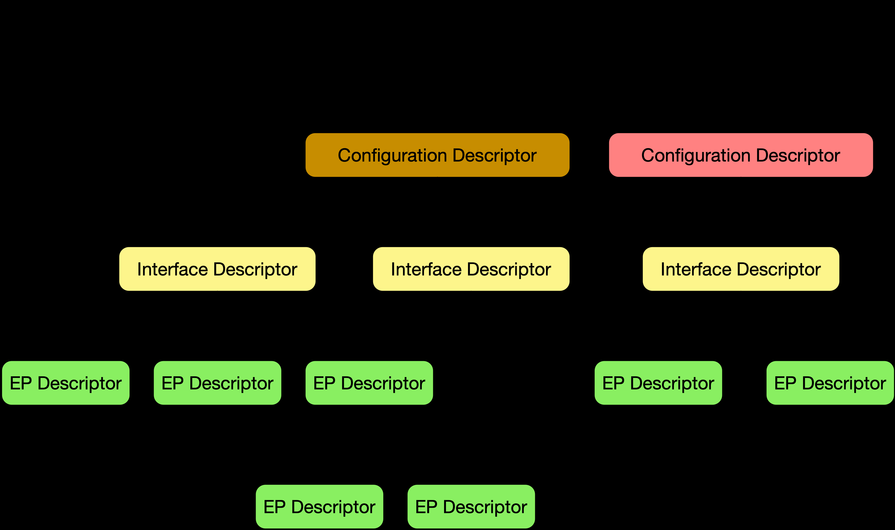</p>

<p align="center">图 10：设备描述符的完整层次结构</p>

##### 27.1.4.3.1 设备描述符

设备描述符向主机提供信息，例如设备符合的 USB 规范、设备配置的数量、设备支持的协议（类）、供应商标识（也称为 VID，这是每个公司从 USB 实施者论坛获得的唯一标识符）、产品标识（也称为 PID，不同于数据包 ID，每个公司唯一选择）以及如果设备有的话的序列号。设备描述符包含关于 USB 设备的一些最关键的信息。表 6 显示了设备描述符的结构。让我们分析各个字段。

<!-- page: 817 -->

<p align="center">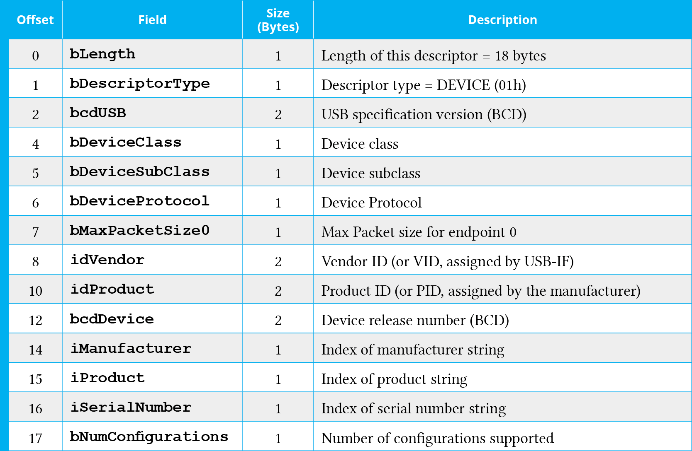</p>

<p align="center">表 6：设备描述符的结构</p>

- bLength：此字段对应于设备描述符的总字节长度。此值由 USB 标准固定。
- bDescriptorType：用于标识描述符类型；对于设备描述符，该字段的值为 01h。
- bcdUSB：此字段报告设备支持的 USB 修订版本，应为最新支持的修订版本。这是一个二进制编码十进制值，使用 0xAABC 格式，其中 A 是主版本号，B 是次版本号，C 是子次版本号。例如，USB 2.0 设备的值为 0x0200，USB 1.1 的值为 0x0110。这通常由主机用于确定加载哪个驱动程序。
- bDeviceClass、bDeviceSubClass、bDeviceProtocol：这些字段由操作系统在枚举过程中用于识别 USB 设备的驱动程序。在设备描述符中设置这些字段，会使复合设备的多个接口无法各自独立工作，例如复合设备。大多数 USB 设备在接口描述符中定义其类，并将这些字段保留为 00h。
- bMaxPacketSize：此字段表示 EP0 支持的最大数据包长度。根据设备类型，其值可以是 8、16、32 或 64 字节。
- iManufacturer、iProduct、iSerialNumber：这些字段是字符串描述符表中的索引。字符串描述符提供关于制造商、产品和序列号的详细信息。如果存在字符串描述符，这些变量应指向字符串表中的索引位置。如果不存在字符串，则相应字段应赋值为零。
- bNumConfigurations：此字段定义设备可以支持的配置总数。多个配置允许设备根据<!-- page: 818 -->特定条件（例如总线供电或自供电）选择不同配置。有关更多细节将在下一段中讨论。

##### 27.1.4.3.2 配置描述符

配置描述符提供关于设备特定配置的信息，例如接口数量、设备是自供电还是总线供电、设备是否可以在事件发生时唤醒主机（远程唤醒）（例如，如果鼠标按钮之一被按下，鼠标可以唤醒主机 PC）。设备必须提供至少一个配置，但可以提供多个配置。例如，设备可能仅在由外部电源适配器自供电时才暴露某些功能。然而，虽然 USB 标准为固件（FW）和硬件（HW）开发人员提供了这种灵活性，但在实践中很少发现具有多个配置的 USB 设备。表 7 显示了配置描述符的结构。让我们分析各个字段。

- wTotalLength：此字段表示整个配置描述符集合的总长度（以字节为单位），包括配置描述符本身以及其后所有接口和端点描述符。
- bNumInterfaces：此字段定义此配置中可能的接口总数。此字段的最小值为 1。
- bConfigurationValue：它定义了一个值，用作 SET_CONFIGURATION 请求的参数以选择此配置。
- bmAttributes：它定义了 USB 设备的参数。如果设备是总线供电的，位 6 设置为 0；如果设备是自供电的，则位 6 设置为 1。如果 USB 设备支持远程唤醒，位 5 设置为 1。如果不支持远程唤醒，位 5 设置为 0。
- bMaxPower：此字段以 2 mA 为单位，指定设备正常工作时可从总线取用的最大电流。如果自供电设备与外部电源断开，其取用的电流不得超过该字段所示的值。

<p align="center">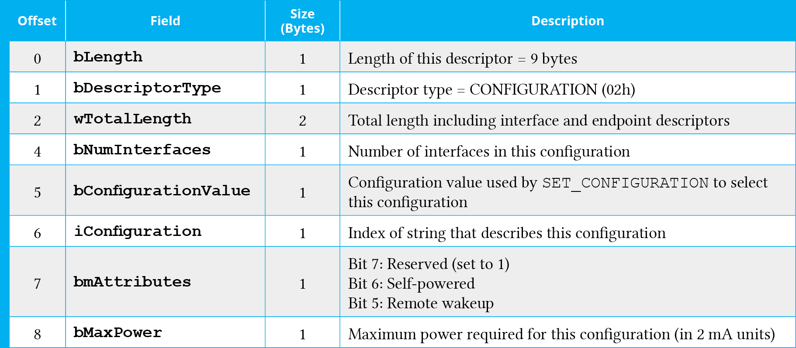</p>

<p align="center">表 7：配置描述符的结构</p>

<!-- page: 819 -->

##### 27.1.4.3.3 接口描述符

接口描述符描述配置中的特定接口。该描述符中指明了接口的端点数量。接口描述符也是声明设备 USB 类别的地方。USB 设备可以是许多预定义的类别之一，其中许多类别列在表 11 中。USB 设备类别标识了设备的功能，并有助于加载针对该特定功能的正确驱动程序。表 8 显示了接口描述符的结构。让我们分析各个字段。

- bInterfaceNumber：此字段对应接口编号。
- bAlternateSetting：接口可以有多个备用设置，并可通过 SET_INTERFACE 请求选择其中一个。例如，USB 接口的端点在正常设置下可能作为中断管道运行，但在替代设置下可能作为批量（BULK）管道运行，从而为您提供在同一接口上使用两种不同模式的功能。与多配置支持类似，这种可能性由 USB 协议提供，但实际应用场景较少。
- bNumEndpoints：指定接口使用的端点数量，不包括控制端点 EP0。
- bInterfaceClass, bInterfaceSubClass, bInterfaceProtocol：这些字段指当前接口暴露的 USB 类别和协议。一些类别由 USB-IF 明确定义并标准化。我们稍后会讨论这一点。
- iInterface：此字段指包含人类可读描述的字符串描述符中的索引。

<p align="center">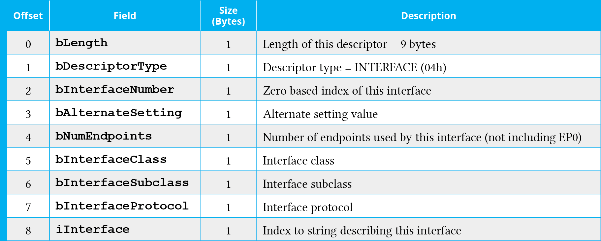</p>

<p align="center">表 8：接口描述符的结构</p>

##### 27.1.4.3.4 端点描述符

用于接口的每个端点都有其自己的描述符。该描述符包含主机确定每个端点特性所需的信息。端点描述符始终作为配置信息的一部分返回。端点零没有描述符。表 9 显示了端点描述符的结构。让我们分析各个字段。

<!-- page: 820 -->

- bEndpointAddress：此字段定义端点地址及其方向。STM32 最多可配置八个端点（包括 EP0）。EP0 是唯一的双向端点；其他七个端点的方向由此字段的最高位指定。例如，0x01 表示地址为 0x01 的 OUT 端点，0x82 表示地址为 0x02 的 IN 端点。
- bmAttributes：此字段是一个位掩码，用于设置端点类型。前两位设置端点类型。如果端点类型设置为同步（isochronous），则位掩码中的接下来两位设置同步类型⁸，再接下来的两位用于设置音频反馈环路的反馈端点。

<p align="center">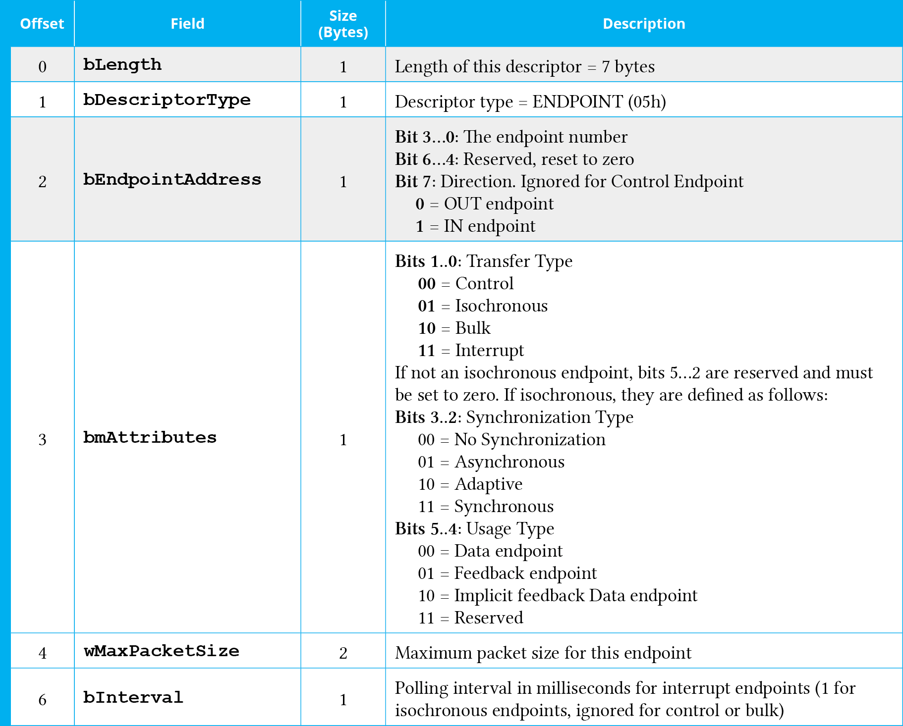</p>

<p align="center">表 9：端点描述符的结构</p>

- wMaxPacketSize：此字段设置端点的最大数据包长度。根据 USB 速度（LS/FS/HS）和端点类型，可接受的最大数据量有所不同，具体数值见表 1。

⁸此主题与通过 USB 传输音频/视频有关。有关三种可能同步类型的详细描述，请参阅此线程。

<!-- page: 821 -->

- bInterval：此字段设置中断端点的轮询间隔（以毫秒为单位）。请记住：中断端点并非真正的“中断”，因为 USB 总线上的每个事务始终由主机发起。它们只是由主机以固定间隔轮询的端点。

<p align="center">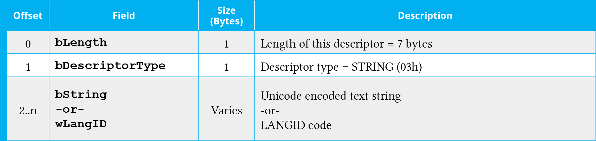</p>

<p align="center">表 10：字符串描述符的结构</p>

##### 27.1.4.3.5 字符串描述符

字符串描述符提供关于设备的人类可读信息。通常，此描述符包含设备名称、制造商、序列号，或各种接口或配置的名称。如果设备中未使用字符串，则前述描述符中的任何字符串索引字段都必须设置为 00h。字符串使用小端序的 Unicode UTF-16 编码定义，并可通过语言 ID 代码支持多种语言。在 Windows 系统中，这些字符串可以在设备管理器中看到。表 10 显示了字符串描述符的结构。

#### 27.1.4.4 USB 类别

到目前为止，我们讨论了主机和 USB 设备之间通信的安排方式。我们提供了大量关于端点（字节传输的虚拟通道）以及其中一些端点在 USB 设备配置阶段所起作用的信息。但是，常规事务期间传输的字节呢？例如，鼠标与 PC 通信以指示其移动或其中一个按钮点击的方式是怎样的？

USB 规范将此任务交给 USB 类别，即用于识别设备功能并基于该功能名义上加载设备驱动程序的代码信息。这些信息包含在设备描述符的三个字节中（bDeviceClass, bDeviceSubClass, bDeviceProtocol - 参见表 6）。

在 USB 设备上有两个可以放置类别代码信息的位置。一个是在设备描述符中，另一个是在接口描述符中。一些定义的类别代码仅允许在设备描述符中使用，其他类别可以在设备描述符和接口描述符中都使用，还有一些只能用于接口描述符。表 11 显示了当前定义的标准类别值集合、其通用用途以及该类别可以使用的地方（设备描述符或接口描述符，或两者）。

<!-- page: 822 -->

<p align="center">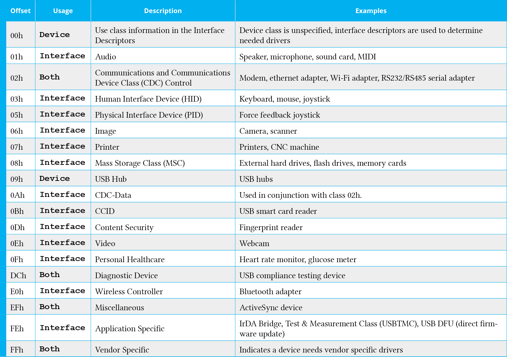</p>

<p align="center">表 11：由 USB-IF 标准化的 USB 类别</p>

使用 USB 标准类别有什么优势？第一个优势是“标准”设备可以很容易被最终用户使用。这促进了设备的采用。例如，考虑如今将鼠标或键盘连接到 PC 是多么容易。但是，使用预定义 USB 设备类别的最大优势是跨各种操作系统的跨平台支持。所有主要操作系统都在操作系统中包含了许多预定义 USB 类别的驱动程序，从而消除了创建自定义驱动程序的需要。这消除了 USB 采用过程中的最大障碍之一，尤其是对小型公司和独立开发者而言。开发自定义驱动程序，特别是针对 Windows 操作系统，并非一项简单的任务，需要适当的投资和时间。因此，很常见地发现实现 HID 类别的 USB 设备，它们既不是鼠标也不是键盘，而是通过自定义 HID 报告在特定应用程序和设备之间交换自定义消息。

<!-- page: 823 -->

<p align="center">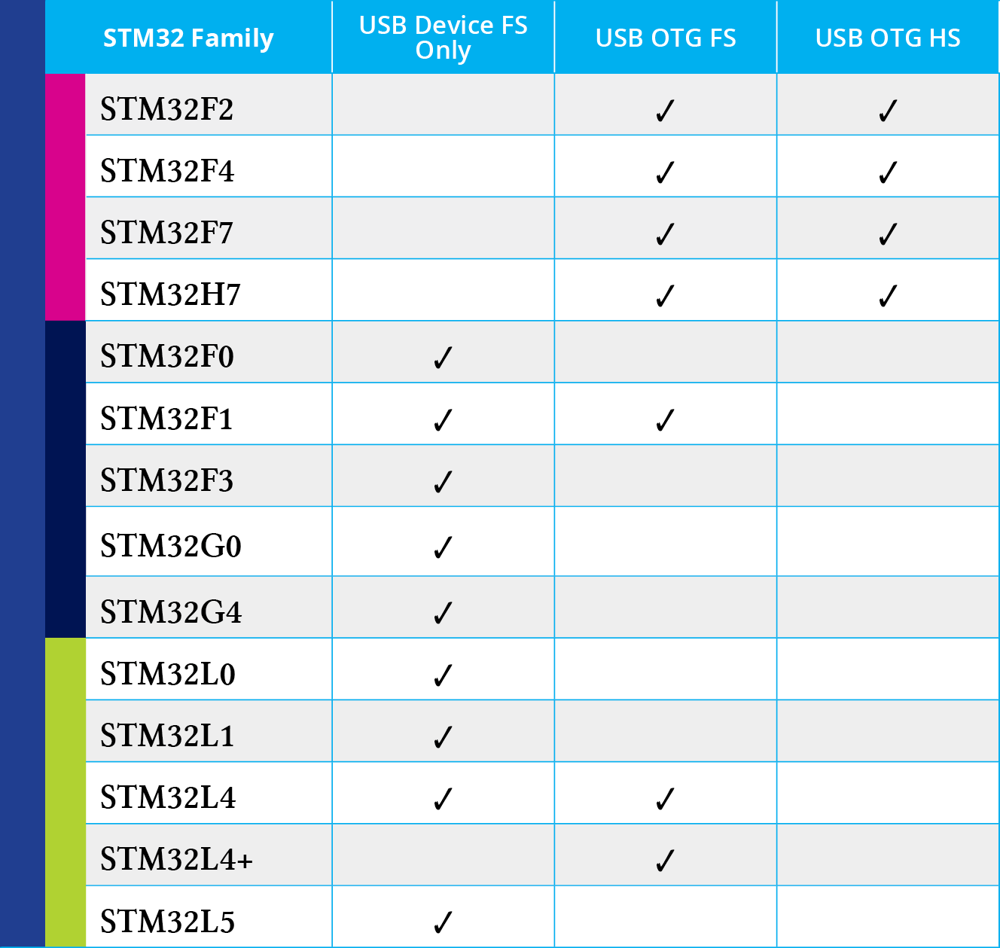</p>

<p align="center">表 12：所有 STM32 系列中 USB 外设的实现</p>

## 27.2 STM32 USB 设备库

你可能会被上述所有信息搞得有点晕头转向，尤其是如果你第一次接触 USB 规范的话。这很正常，你不必过于担心。原因有二。首先，你越是使用 USB，就越能掌握相关主题。其次，你不需要从零开始实现整个 USB 协议栈。开发一个完整的 USB 协议栈绝非易事。前面的段落中省略了许多细节。此外，如果没有合适的仪器（如 USB 协议分析仪），你几乎不可能自己实现一个完整的协议栈。正如我们稍后所见，调试 USB 通信使用常规调试工具是不可能的，因为在 USB 事务中，事情发生得太快了。即使在 UART 上打印信息也可能影响通信会话。

幸运的是，ST 已经设计了完整的 USB 设备和主机协议栈，可以轻松集成到固件中。不过，并非所有 STM32 系列都提供可同时工作于设备模式和主机模式的 USB 控制器。表 12 列出了各 STM32 系列中 USB 外设的实现情况。如你所见，只有部分系列支持 USB On-The-Go（OTG），可用于设计能够在主机和设备模式间切换的设备；也只有少数系列可通过外接 PHY 收发器工作在高速模式。关于所有 STM32<!-- page: 824 -->系列 USB 功能的完整列表，以及 USB 硬件和 PCB 设计指南，请参阅 AN4879⁹。

ST 还开发了对最广泛使用的 USB 类的支持，并且相对容易根据需求调整代码。在接下来的段落中，我们将研究如何配置 CubeMX，以便它自动为我们生成所有必要的代码，从而在固件中添加 USB 支持。接下来，我们将研究 ST 设备协议栈的架构。乍一看，生成的代码可能难以理解，特别是 USB 设备库与 CubeHAL 之间的紧密互连。最后，我们将开发示例来操作一些标准的 USB 类。让我们开始吧。

在现有项目中添加 ST USB 设备库是一个直接的操作。你只需遵循这个简单的两步过程。首先，你必须在 CubeMX 中启用 USB 外设（你可以在“类别”窗格的“Connectivity”部分找到它）。接下来，你必须通过选择所需的 USB 类来启用 USB 设备中间件，如图 11 所示。

<p align="center">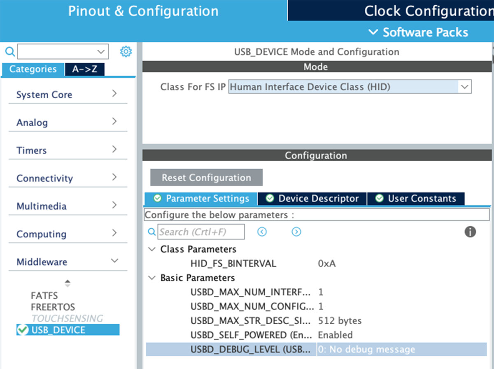</p>

<p align="center">图 11：配置 STM32 USB 设备库的 CubeMX 选项</p>

### 27.2.1 理解生成的代码

图 12 显示了 CubeMX 使用 USB 设备库和所需的 USB 类生成代码后的新项目结构¹⁰。同时，图 13 显示了整个应用程序架构：在阅读本段其余部分时，请将其保持在手边。

如你所见，在 CubeHAL 中添加了三个新文件。尽管名称不同，但这三个文件都与 USB 数据处理的配置和处理有关。

⁹https://bit.ly/3Fagq0f ¹⁰为简化图示，省略了 Drivers/STM32XXxx_HAL_Driver/Src 文件夹中的若干文件。

<!-- page: 825 -->

<p align="center">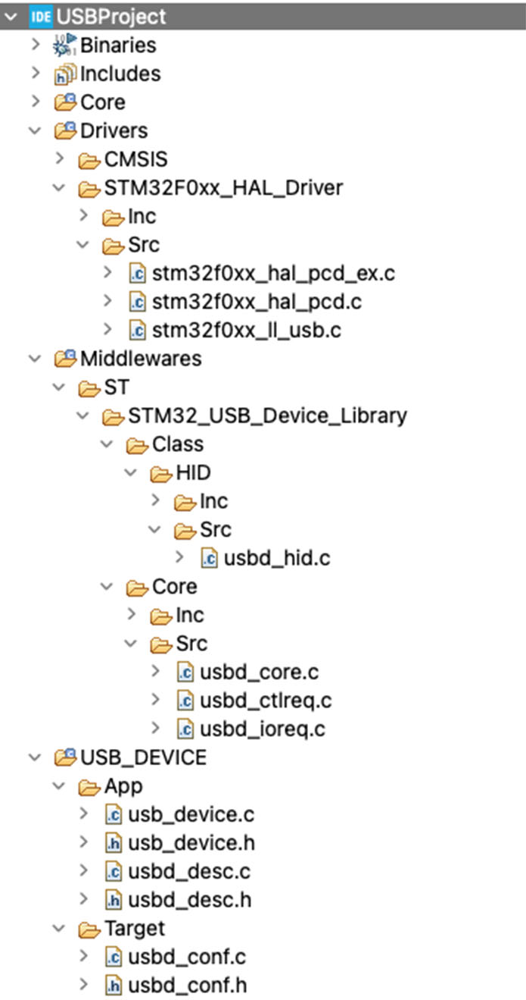</p>

<p align="center">图 12：生成的项目结构</p>

- stm32XXxx_hal_pcd.c：此模块对应于底层 USB 外设控制驱动程序（PCD）。此模块不对应于 MCU 中的真实外设。PCD 模块中包含的函数执行的所有操作都与 USB 外设的活动有关（主要是中断管理）。正如我们接下来将看到的，在 USB 外设上执行的所有操作（初始化、端点分配、数据传输、类管理等）都在 USB 外设中断处理程序中执行。这要求跟踪 USB 外设的不同状态和转换非常重要，以便实现正确的 USB 状态机。PCD 模块的设计使得 USB 外设生成的所有事件都路由到专用的回调函数。这些回调函数通过 USB_DEVICE/target/usbd_conf.c 文件中的函数与主 USB 内核库“粘合”在一起。

<!-- page: 826 -->

<p align="center">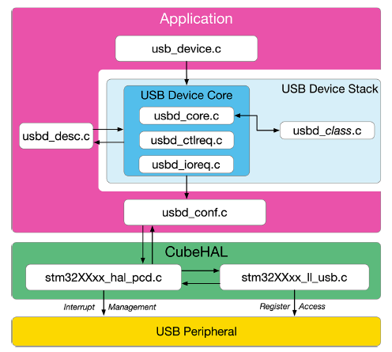</p>

<p align="center">图 13：带有 STM32 USB 设备库的生成应用程序架构</p>

- stm32XXxx_hal_pcd_ex.c：一些较新的 STM32 微控制器实现了高级 USB 功能，例如低功耗模式（LPM）的处理或称为包内存地址（PMA）的专用缓冲内存。这种缓冲内存存在于 SRAM 内存较少的 STM32 微控制器中，因此使用 PMA 可以避免在 SRAM 中分配缓冲区。
- stm32XXxx_ll_usb.c：此文件包含 USB 外设的 Cube 底层库（Cube-LL）。正如之前多次提到的，USB 通信中的时序非常严格，因此拥有最优化的代码以避免不必要的延迟非常重要。因此，所有与 USB 寄存器相关的例程都被设计为经过优化并专门针对给定 STM32 微控制器中的实际外设。

CubeMX 还向项目树添加了两个主要文件夹。第一个是 Middleware，其中包含 STM32 USB 设备库。这又组织在子文件夹中：

- `Class/<class>`：包含所选 USB 类的 C 源文件和头文件。例如，图 12 中的 `usbd_hid.c` 包含处理 HID 类所需的代码。
- `Core`：包含 USB 核心协议栈，主要由以下文件实现：

  - `usbd_core{.c,.h}`：实现 USB 核心状态机。表 13 列出了主要函数及其说明。

<!-- page: 827 -->

  - `usbd_ctlreq{.c,.h}`：包含处理 USB 2.0 规范第 9 章所定义请求的变量和函数¹¹。表 14 列出了主要函数及其说明。
  - `usbd_ioreq{.c,.h}`：实现 EP0 上的数据收发。表 15 列出了主要函数及其说明。

<p align="center">表 13：USB 内核协议栈 API</p>

| 函数 | 描述 |
| --- | --- |
| `USBD_Init` | 初始化设备句柄和状态机 |
| `USBD_DeInit` | 反初始化设备句柄 |
| `USBD_RegisterClass` | 将设备句柄关联到类句柄 |
| `USBD_Start` | 启动设备协议栈 |
| `USBD_Stop` | 停止设备协议栈和类 |
| `USBD_SetClassConfig` | 按指定配置初始化设备类 |
| `USBD_ClrClassConfig` | 清除设备类配置 |
| `USBD_LL_SetupStage` | 处理设置阶段请求 |
| `USBD_LL_DataOutStage` | 处理设备在相应端点上从主机接收的数据 |
| `USBD_LL_DataInStage` | 处理设备在相应端点上发送给主机的数据 |
| `USBD_LL_Reset` | 重新初始化设备句柄 |
| `USBD_LL_SetSpeed` | 设置设备速度 |
| `USBD_LL_Suspend` | 将设备状态设为挂起 |
| `USBD_LL_Resume` | 恢复设备挂起前的状态 |
| `USBD_LL_SOF` | 处理帧起始（SOF）事件 |
| `USBD_LL_IsoINIncomplete` | 处理等时 IN 传输未完成事件 |
| `USBD_LL_IsoOUTIncomplete` | 处理等时 OUT 传输未完成事件 |
| `USBD_LL_DevConnected` | 处理设备连接事件 |
| `USBD_LL_DevDisconnected` | 处理设备断开事件 |

<p align="center">表 14：处理 USB 2.0 第 9 章规范请求的 API</p>

| 函数 | 描述 |
| --- | --- |
| `USBD_StdDevReq` | 处理发送给 USB 设备的标准请求 |
| `USBD_StdItfReq` | 处理发送给接口的标准请求 |
| `USBD_StdEPReq` | 处理发送给端点的标准请求 |
| `USBD_GetDescriptor` | 处理各类 `GET_DESCRIPTOR` 请求 |
| `USBD_SetAddress` | 处理 `SET_ADDRESS` 请求 |
| `USBD_GetConfig` | 处理 `GET_CONFIGURATION` 请求 |
| `USBD_SetConfig` | 处理 `SET_CONFIGURATION` 请求 |
| `USBD_GetStatus` | 处理 `GET_STATUS` 请求 |
| `USBD_SetFeature` | 处理 `SET_FEATURE` 请求 |
| `USBD_ClrFeature` | 处理 `CLEAR_FEATURE` 请求 |
| `USBD_ParseSetupRequest` | 将接收缓冲区中的数据解析为设置请求结构体 |
| `USBD_CtlError` | 处理 USB 底层错误 |
| `USBD_GetString` | 将 ASCII 字符串转换为 Unicode 字符串 |
| `USBD_GetLen` | 返回字符串长度 |

<p align="center">表 15：通过 EP0 交换数据的 API</p>

| 函数 | 描述 |
| --- | --- |
| `USBD_CtlSendData` | 开始通过 EP0 发送数据 |
| `USBD_CtlContinueSendData` | 继续通过 EP0 发送剩余数据 |
| `USBD_CtlPrepareRx` | 准备 EP0 接收数据 |
| `USBD_CtlContinueRx` | 继续通过 EP0 接收数据 |
| `USBD_CtlSendStatus` | 通过 EP0 发送零长度数据包 |
| `USBD_CtlReceiveStatus` | 通过 EP0 接收零长度数据包 |
| `USBD_GetRxCount` | 返回接收数据的长度 |

¹¹https://bit.ly/3ES3H2K

<!-- page: 828 -->

CubeMX 添加到项目中的第二个文件夹是 USB_DEVICE。该文件夹又分为两个子文件夹。

- `App`：包含 USB 协议栈初始化和主要设备描述符相关的 C 文件。

  - `usb_device{.c,.h}`：包含 USB 协议栈初始化流程，主要是 `MX_USB_DEVICE_Init()`，用于初始化协议栈、注册 USB 类并启动 USB 外设。
  - `usbd_desc{.c,.h}`：包含 USB 设备描述符。
- `Target`：此文件夹仅包含两个 C 文件。
  - `usbd_conf{.c,.h}`：包含将 USB 设备内核连接到具体 STM32 器件的“胶合”代码。该文件夹的作用类似于 ST 其他示例或项目中的板级支持包（BSP），其中实现了 PCD 模块定义的回调函数，以及与实际 USB 外设相关的 `USBD_LL` 例程。

### 27.2.2 USB 初始化序列

为了更好地理解之前看到的各个源文件之间的关系，查看 USB 协议栈的初始化序列是有用的。在阅读以下文本时，请随时参考下一页的时序图¹²。

1. 初始化序列从 `MX_USB_DEVICE_Init()`（`usb_device.c`）开始。该函数会定义 `USBD_HandleTypeDef` 结构体实例，并依次调用以下函数：

¹²该图取自此 ST 网页。

<!-- page: 829 -->

- `USBD_Init()`（`usbd_core.c`）：检查 USB 描述符，分配设备描述符，将设备状态设为默认状态，然后调用 `USBD_LL_Init()`。

  - `USBD_LL_Init()`（`usbd_conf.c`）：初始化 USB 外设；如果 MCU 支持 PMA，还会初始化数据包存储区（PMA），然后调用 `HAL_PCD_Init()`。

    - `HAL_PCD_Init()`（`stm32XXxx_hal_pcd.c`）：设置 PCD 相关回调并配置控制端点 EP0，然后调用 `USB_DevInit()`。

      - `USB_DevInit()`（`stm32XXxx_ll_usb.c`）：通过配置寄存器完成 USB 外设的实际初始化。

2. 控制权返回 `MX_USB_DEVICE_Init()`（`usb_device.c`）。该函数调用 `USBD_RegisterClass()`，将所选 USB 类对应的 `USBD_ClassTypeDef` 实例关联到主 `USBD_HandleTypeDef` 实例，供 USB 核心协议栈随后初始化该类。

3. 最后，`MX_USB_DEVICE_Init()` 调用 `USBD_Start()`：

  - `USBD_Start()`（`usbd_core.c`）：调用协议栈底层的 `USBD_LL_Start()` 以启动 USB 操作。

    - `HAL_PCD_Start()`（`stm32XXxx_hal_pcd.c`）：调用 `USB_DevConnect()`。

      - `USB_DevConnect()`（`stm32XXxx_ll_usb.c`）：置位 D+ 上拉控制位，将内部上拉电阻接入 USB D+ 线，从而使能 USB 外设。

在这三个主要调用之后，整个 USB 协议栈已准备好接受主机的连接。现在是时候将我们的设备连接到主机 PC 了。在本文中使用的所有九个 Nucleo 开发板上，USB 信号都路由到 Morpho 连接器，如图 14 所示。您可以使用您想要的 USB Type-B 连接器。所示的接线方案假设 USB 设备是“自供电”的。因此，我们不会连接 VDD (+5V)。

<p align="center"></p>

基于 STM32F1/F3 MCU 的板卡所有者需要注意，USB 收发器不提供 D+ 线的内部上拉电阻，而这是 USB 2.0 规范所必需的。因此，需要在 PA12 和 +3V3 之间添加一个 1.5 kΩ 电阻。

<p align="center"></p>

<!-- page: 830 -->

<p align="center">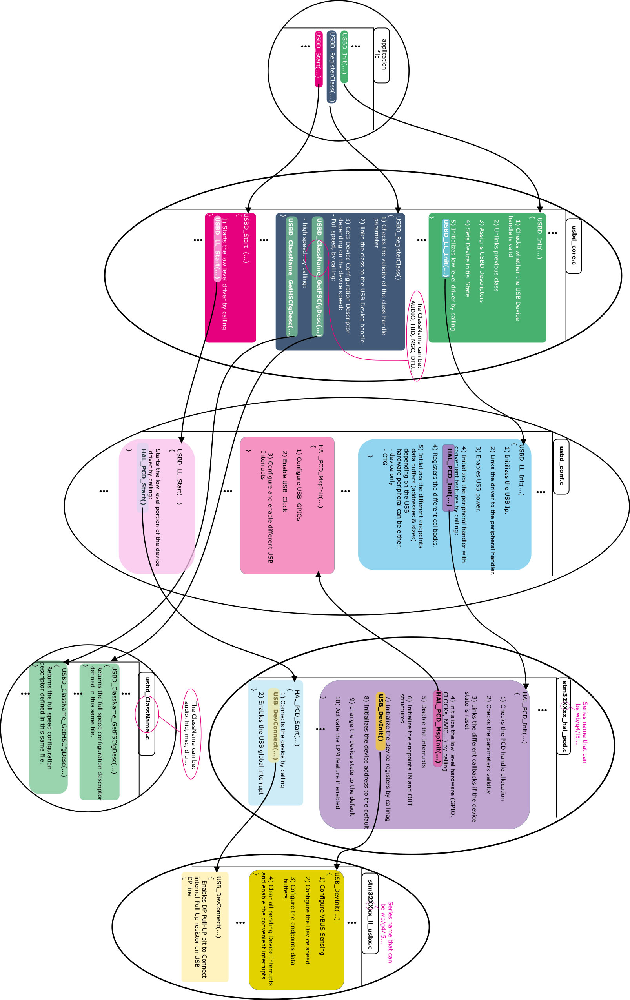</p>

<!-- page: 831 -->

<p align="center">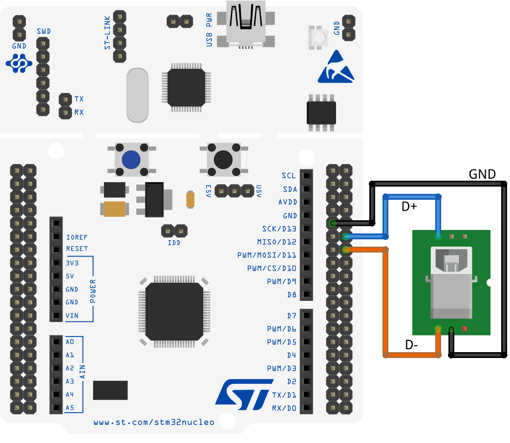</p>

<p align="center">图 14：如何将 USB Type-B 连接器连接到 Nucleo 开发板</p>

### 27.2.3 USB 枚举序列

我永远不会厌倦重复这一点：USB 协议往往显得难以掌握，因为涉及其使用的所有操作都在中断处理程序中执行。而这有一个简单的原因：在 USB 总线上执行的所有事务始终由主机发起，从而避免各个设备之间的总线冲突。这意味着设备必须准备好处理异步事件，以避免应用程序因等待 USB 事件而停滞。

那么，当我们把 USB 电缆插入设备端口时，具体发生了什么？嗯，答案并不简单，而且主要取决于操作系统。不幸的是，Windows、Mac 和 Linux 之间的细节差异很大，而且就精确而言，给定操作系统的不同版本之间（尤其是 Windows）情况也可能有很大变化。最后，PC 的 USB 主机控制器可能会影响枚举过程。然而，枚举阶段可以总结为以下步骤。阅读文本时，请参考图 15¹³ 中显示的 USB 嗅探序列。

¹³请注意，图 15 中显示的枚举序列是在将 USB 虚拟 COM 端口设备连接到 MacOS 11.x 时捕获的。在 Windows 中，枚举过程可能会略有不同。

<!-- page: 832 -->

<p align="center">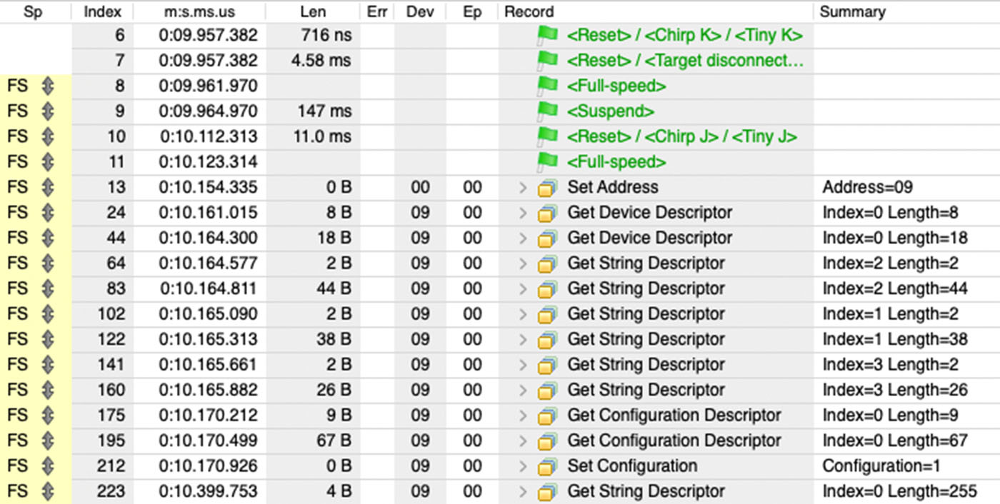</p>

<p align="center">图 15：连接到 MacOS 11.x 的 VCP 设备的枚举序列</p>

1. 高速 (HS) 设备以全速 (FS) 设备开始枚举过程。在复位阶段，HS 设备和支持 HS 的集线器开始一个协商过程，以确定它们是否可以相互进入 HS 模式。该过程通过在 D+ 和 D- 上断言一个电压序列（称为“chirping”）开始。在此阶段之后，设备将最终运行在 FS 或 HS 模式下。
2. USB 外设内部的物理层 (PHY) 现在已准备好与主机控制器交换数据。设备需要设置其 USB 地址，主机通过发出 SET_ADDRESS 开始设置序列。USB 中断触发，并调用 HAL_PCD_IRQHandler() (stm32XXxx_it.c)。处理程序检测到消息是 SET_ADDRESS，并通过传递从主机接收到的地址 ID 来调用 HAL_PCD_SetAddress()(stm32XXxx_hal_pcd.c)。该例程进而调用 USB_SetDevAddress()(stm32XXxx_ll_usb.c)，最终配置 USB 接口。
3. 地址现在已配置，主机请求设备描述符，以便它可以开始了解其能力。主机通过发出 GET_DESCRIPTOR 开始新的设置序列。USB 中断触发，并调用 HAL_PCD_IRQHandler() (stm32XXxx_it.c)。处理程序检测到消息是寻址到控制端点 (EP0) 的，并将控制权传递给 PCD_EP_ISR_Handler() 例程。

- `PCD_EP_ISR_Handler()`（`stm32XXxx_hal_pcd.c`）：提取端点号（0）并解码该端点的中断，识别其中的 SETUP 事务，然后调用 `HAL_PCD_SetupStageCallback()`（`usbd_conf.c`），后者再调用 `USBD_LL_SetupStage()`。

  - `USBD_LL_SetupStage()`（`usbd_core.c`）：分析请求并确定其接收者。由于请求发往设备，因此将控制权传递给 `USBD_StdDevReq()`。

    - `USBD_StdDevReq()`（`usbd_ctlreq.c`）：分析请求后发现主机正在请求设备描述符，于是调用 `USBD_GetDescriptor()`（`usbd_ctlreq.c`）。该函数再调用 `USBD_FS_DeviceDescriptor()`（`usbd_desc.c`）取得设备描述符指针，并调用 `USBD_CtlSendData()` 准备将描述符发送给主机。

<!-- page: 833 -->

      - `USBD_CtlSendData()`（`usbd_ioreq.c`）：配置 EP0，使其可以发送包含描述符的数组。随后调用 `USBD_LL_Transmit()`（`usbd_conf.c`），进而调用 `HAL_PCD_EP_Transmit()`。
        - `HAL_PCD_EP_Transmit()`（`stm32XXxx_hal_pcd.c`）：完成若干设置后调用 `USB_EPStartXfer()`（`stm32XXxx_ll_usb.c`）。该函数配置 EP0（如果支持，也会将数据写入 PMA），并使 USB 外设开始准备传输；主机请求数据后，传输才会实际开始。图 16 展示了完整的调用关系。

<p align="center">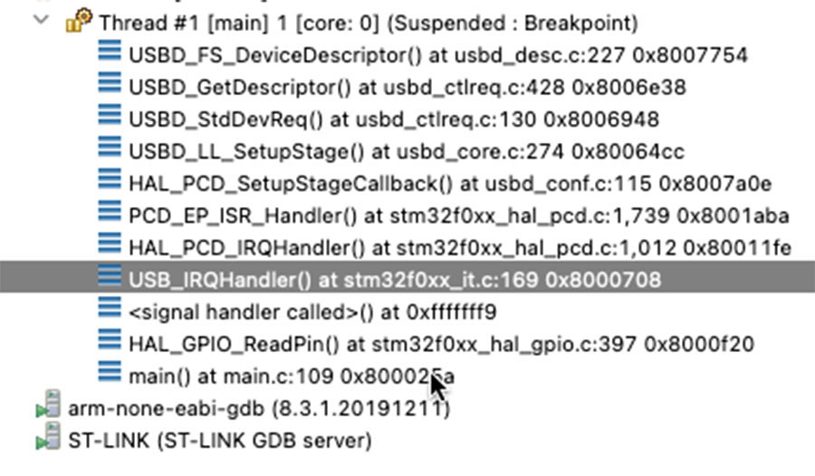</p>

<p align="center">图 16：在 GET_DESCRIPTOR 请求时生成的完整调用图</p>

4. 主机根据设备描述符了解设备及其能力，包括 USB 类和子类、VID/PID，以及制造商、产品和序列号字符串的索引。随后，主机通过多个 `GET_DESCRIPTOR` 请求获取相应的字符串描述符；设备版本号也是可选信息。
5. 主机再次发出 `GET_DESCRIPTOR`，请求配置描述符。该请求还会返回相关的接口、端点等描述符。配置描述符提供接口数量、供电方式以及端点数量和类型等信息。
6. 主机必须加载适当的设备驱动程序，才能与设备通信。Windows 会使用 INF 文件查找与设备 VID/PID 匹配的驱动程序。如果没有匹配项，则会根据从设备读取的类、子类和协议继续查找；若设备以前枚举过，Windows 也会在注册表中查找相应驱动程序。找到驱动程序后，主机还可能请求设备类专用描述符，或再次请求某个描述符。
7. 收到所有描述符后，主机通过 `SET_CONFIGURATION` 请求选择并设置设备配置。大多数设备只有一种配置；支持多种配置的设备则可让用户或驱动程序选择。此时，固件需要完成主机与设备通过相应接口端点通信所需的操作，后文将进一步介绍。

<!-- page: 834 -->

8. 设备现在处于已配置状态，并具备描述符中定义的功能。它可以从 VBUS 取用所声明的最大电流，随后即可供应用程序使用。

> **说明**
>
> 前面介绍的枚举流程只是对实际过程的简化。由于细节繁多，且过程可能因主机 PC 上具体的操作系统而略有差异，这里无法一一说明。建议使用专用 USB 嗅探器观察 ST 软件栈的运行，以便了解哪些调用来自主机、协议栈又作出了哪些响应。非常简单的 USB 项目可以先使用 ST 协议栈，而不必过多关注底层细节；如果要开展更复杂的工作（例如开发协议栈未涵盖的自定义类），最终很可能需要购买专用工具。

### 27.2.4 USB CDC 类

USB-IF 标准化了多个 USB 类，这些类代表了非常常见的设备和应用。其中一个类是 USB 通信设备类（CDC）¹⁴。

USB 通信设备类是一种复合¹⁵ USB 设备类，它使电话、ISDN 终端适配器、网络设备等电信设备（如 PSTN/ADSL 调制解调器、以太网适配器/集线器等）能够连接到 USB 主机机器。USB CDC 指定了多个模型以支持不同类型的通信设备。最相关的模型包括：

- 直接线路控制模型
- 电话控制模型
- CAPI 控制模型
- 以太网网络控制模型
- ATM 网络控制模型
- 抽象控制模型

抽象控制模型（ACM）用于支持传统调制解调器设备，其优势之一是串口仿真功能（即虚拟 COM 端口，VCP）。USB 串口仿真简化了主机 PC 端应用程序的开发，同时兼容基于 RS-232 的传统设备软件，并为应用程序开发者提供了对 USB 的良好抽象。FTDI FT232、Prolific PL2303 等 USB 转串口芯片在嵌入式领域很常见。实现 USB CDC 类后，STM32 设备无需添加专用外设即可提供 USB 转串口功能。最后，CDC 类从 Windows 10 开始原生支持，无需安装专用驱动程序。<!-- page: 835 -->

¹⁴标准的 USB CDC 类规范可以在 USB-IF 网站上找到。¹⁵根据 USB 规范，设备可以拥有多个接口，因此也有多个接口描述符。具有多个接口且各接口执行不同功能的 USB 设备称为复合设备。例如，带有集成智能卡读卡器的键盘就是复合设备：它由一个实现 CCID 类的智能卡读卡器接口和一个实现 HID 类的键盘接口组成；多个接口可以同时处于活动状态。

整个 CDC 类的实现都包含在一个文件中：`Middlewares/ST/STM32_USB_Device_Library/Class/CDC/Src/usbd_cdc.c`。而处理 VCP 操作的函数则实现在 `USB_DEVICE/App/usbd_cdc_if.c` 中。接下来将深入介绍 CDC 类的实现，并借此说明 STM32 USB 设备库如何处理 USB 类。

<p align="center">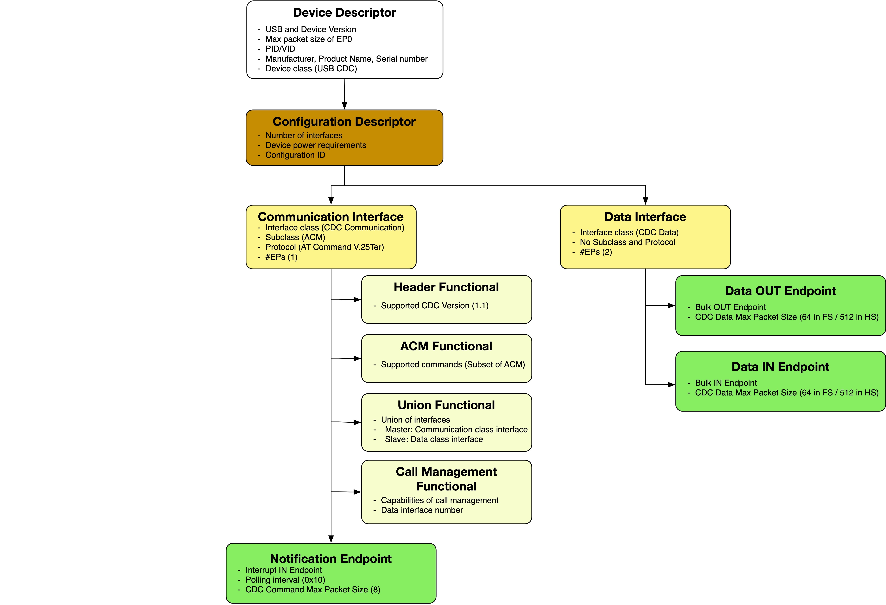</p>

<p align="center">图 17：VCP 设备中的描述符层次结构</p>

#### 27.2.4.1 USB CDC 描述符

在深入 CDC 描述符的细节之前，最好先做一个简短的回顾。在上一段中我们看到，在枚举阶段，主机在 SET_ADDRESS 操作之后立即开始向设备请求其配置描述符。每个配置定义了一组接口，每个接口对应于给定的类功能。为了促进实现相同 USB 类的不同设备之间的兼容性，每个 USB 类中的每个接口都标准化了通信端点的数量及其通信行为（中断、批量、控制、同步）。

每个实现抽象控制模型的 USB CDC 设备都应提供<!-- page: 836 -->图 17 所示的描述符。下面逐一介绍。

- 设备描述符：该描述符在 `USB_DEVICE/App/usbd_desc.c` 文件中实现，提供设备能力的一般信息，包括设备实现的类和子类、EP0 的最大数据包大小、VID/PID、设备版本¹⁶，以及制造商、产品和序列号等字符串。序列号对 VCP 设备尤为重要：Windows 会利用它避免同一设备更换 USB 端口后被分配新的 COM 端口号。带序列号的设备更换 Windows PC 上的 USB 端口后仍会保留原 COM 端口号；没有序列号的设备每次接入不同端口时都可能获得新的端口号。在 Linux 和 MacOS 中，序列号会用于生成相应的 `/dev/` 设备节点。例如，序列号为 316E355B4236 的 USB 设备会生成 `/dev/tty.usbmodem316E355B4236`。下面的代码展示了由 CubeMX 生成的标准 CDC 设备描述符。

**Filename:** `USB_DEVICE/App/usbd_desc.c`

```c
148 | __ALIGN_BEGIN uint8_t USBD_FS_DeviceDesc[USB_LEN_DEV_DESC] __ALIGN_END = {
149 |  0x12,              /*bLength */
150 |  USB_DESC_TYPE_DEVICE, /*bDescriptorType*/
151 |  0x00,              /*bcdUSB: BCD (2.00) */
152 |  0x02,
153 |  0x02,              /*bDeviceClass: CDC*/
154 |  0x02,              /*bDeviceSubClass: ACM*/
155 |  0x00,              /*bDeviceProtocol: No class specific protocol */
156 |  USB_MAX_EP0_SIZE,  /*bMaxPacketSize*: EP0 size = 64 bytes */
157 |  LOBYTE(USBD_VID),  /*idVendor*/
158 |  HIBYTE(USBD_VID),  /*idVendor*/
159 |  LOBYTE(USBD_PID_FS), /*idProduct*/
160 |  HIBYTE(USBD_PID_FS), /*idProduct*/
161 |  0x00,              /*bcdDevice rel. 2.00*/
162 |  0x02,
163 |  USBD_IDX_MFC_STR,  /*Index of manufacturer string in string descriptor*/
164 |  USBD_IDX_PRODUCT_STR, /*Index of product string in string descriptor */
165 |  USBD_IDX_SERIAL_STR, /*Index of serial number string in string descriptor*/
166 |  USBD_MAX_NUM_CONFIGURATION /*bNumConfigurations*/
167 | };
```

- 配置描述符：典型的 CDC VCP 设备只有一个配置。配置描述符指定电源要求和配置中的接口数量，定义在 `Middlewares/ST/STM32_USB_Device_Library/Class/CDC/Src/usbd_cdc.c` 文件中。

¹⁶该字段还可包含现场调试时很有用的信息。例如，在这里存储 FW 版本也是有用的，这样在支持会话期间可以轻松跟踪 FW 的特定行为。相同的值可能有助于在应用程序级别驱动特定操作。

<!-- page: 837 -->

**Filename:** `Middlewares/ST/STM32_USB_Device_Library/Class/CDC/Src/usbd_cdc.c`

```c
269 | __ALIGN_BEGIN uint8_t USBD_CDC_CfgFSDesc[USB_CDC_CONFIG_DESC_SIZ] __ALIGN_END = {
270 |  /* Configuration Descriptor */
271 |  0x09, /* bLength: Configuration Descriptor size */
272 |  USB_DESC_TYPE_CONFIGURATION, /* bDescriptorType: Configuration */
273 |  USB_CDC_CONFIG_DESC_SIZ, /* wTotalLength:no of returned bytes: 67 bytes */
274 |  0x00,
275 |  0x02, /* bNumInterfaces: 2 interface */
276 |  0x01, /* bConfigurationValue: Configuration value */
277 |  0x00, /* iConfiguration: Index of string descriptor describing the configuration */
278 |  0xC0, /* bmAttributes: self powered */
279 |  0x32, /* MaxPower 50 mA */
```

- 接口描述符：USB CDC 类为每个配置定义了两个不同的接口。

- 第一个接口（如下所示）称为通信接口（Communication Interface），用于描述通信设备的具体功能特性。通用的 COM 端口设备应指定与 V.25ter 协议的兼容性，即使它们不使用 AT 命令。通信接口包含四个类特定描述符和一个端点描述符。头部功能描述符（Header Functional descriptor）指定了 CDC 规范的版本（v1.1）。抽象控制模型描述符（Abstract Control Model descriptor）指定了设备支持的类特定请求和通知。联合功能描述符（Union Functional descriptor）标识属于 CDC 功能的接口，通常包括通信接口和数据接口。呼叫管理功能描述符（Call Management Functional descriptor）说明了设备如何管理呼叫。由于通用的 COM 端口设备没有需要处理的呼叫，该描述符表明设备不处理呼叫管理。一个中断 IN 端点（地址为 0x82）向主机发送状态通知。端点描述符提供了端点的编号、方向和最大数据包大小（8 字节）。在 ST 提供的 CDC VCP 接口的当前实现中，该端点完全未被使用，通常在所有主要操作系统上都没有数据通过该端点传输。

**Filename:** `Middlewares/ST/STM32_USB_Device_Library/Class/CDC/Src/usbd_cdc.c`

```c
283 | /*Interface Descriptor */
284 | 0x09, /* bLength: Interface Descriptor size */
285 | USB_DESC_TYPE_INTERFACE, /* bDescriptorType: Interface */
286 | /* Interface descriptor type */
287 | 0x00, /* bInterfaceNumber: Id of the Interface */
288 | 0x00, /* bAlternateSetting: Alternate setting */
289 | 0x01, /* bNumEndpoints: One endpoints used */
290 | 0x02, /* bInterfaceClass: Communication Interface Class */
291 | 0x02, /* bInterfaceSubClass: Abstract Control Model */
292 | 0x01, /* bInterfaceProtocol: Common AT commands */
293 | 0x00, /* iInterface: */
294 |
295 | /*Header Functional Descriptor*/
296 | 0x05, /* bLength: Endpoint Descriptor size */
297 | 0x24, /* bDescriptorType: CS_INTERFACE */
298 | 0x00, /* bDescriptorSubtype: Header Func Desc */
299 | 0x10, /* bcdCDC: spec release number */
300 | 0x01,
301 |
302 | /*Call Management Functional Descriptor*/
303 | 0x05, /* bFunctionLength */
304 | 0x24, /* bDescriptorType: CS_INTERFACE */
305 | 0x01, /* bDescriptorSubtype: Call Management Func Desc */
306 | 0x00, /* bmCapabilities: D0+D1 */
307 | 0x01, /* bDataInterface: 1 */
308 |
309 | /*ACM Functional Descriptor*/
310 | 0x04, /* bFunctionLength */
311 | 0x24, /* bDescriptorType: CS_INTERFACE */
312 | 0x02, /* bDescriptorSubtype: Abstract Control Management desc */
313 | 0x02, /* bmCapabilities */
314 |
315 | /*Union Functional Descriptor*/
316 | 0x05, /* bFunctionLength */
317 | 0x24, /* bDescriptorType: CS_INTERFACE */
318 | 0x06, /* bDescriptorSubtype: Union func desc */
319 | 0x00, /* bMasterInterface: Communication class interface */
320 | 0x01, /* bSlaveInterface0: Data Class Interface */
321 |
322 | /*Endpoint 2 Descriptor*/
323 | 0x07,               /* bLength: Endpoint Descriptor size */
324 | USB_DESC_TYPE_ENDPOINT, /* bDescriptorType: Endpoint */
325 | CDC_CMD_EP,         /* bEndpointAddress */
326 | 0x03,               /* bmAttributes: Interrupt */
327 | LOBYTE(CDC_CMD_PACKET_SIZE), /* wMaxPacketSize: 8 bytes */
328 | HIBYTE(CDC_CMD_PACKET_SIZE),
329 | CDC_FS_BINTERVAL,   /* bInterval: 10ms*/
```

- 第二个接口称为数据接口（Data Interface），负责发送和接收 COM 端口数据。接口描述符（如下所示）告知主机该接口有两个批量端点，每个方向各一个（0x1 用于批量 OUT，0x81 用于批量 IN）。每个端点都有一个端点描述符。

<!-- page: 839 -->

**Filename:** `Middlewares/ST/STM32_USB_Device_Library/Class/CDC/Src/usbd_cdc.c`

```c
332 |  /*Data class interface descriptor*/
333 |  0x09, /* bLength: Endpoint Descriptor size */
334 |  USB_DESC_TYPE_INTERFACE, /* bDescriptorType: */
335 |  0x01, /* bInterfaceNumber: Id of the Interface */
336 |  0x00, /* bAlternateSetting: Alternate setting */
337 |  0x02, /* bNumEndpoints: Two endpoints used */
338 |  0x0A, /* bInterfaceClass: CDC Data */
339 |  0x00, /* bInterfaceSubClass: */
340 |  0x00, /* bInterfaceProtocol: */
341 |  0x00, /* iInterface: */
342 |
343 |  /*Endpoint OUT Descriptor*/
344 |  0x07, /* bLength: Endpoint Descriptor size */
345 |  USB_DESC_TYPE_ENDPOINT, /* bDescriptorType: Endpoint */
346 |  CDC_OUT_EP,             /* bEndpointAddress */
347 |  0x02,                   /* bmAttributes: Bulk */
348 |  LOBYTE(CDC_DATA_FS_MAX_PACKET_SIZE), /* wMaxPacketSize: 64 for FS, 512 for HS*/
349 |  HIBYTE(CDC_DATA_FS_MAX_PACKET_SIZE),
350 |  0x00,                   /* bInterval: ignore for Bulk transfer */
351 |
352 |  /*Endpoint IN Descriptor*/
353 |  0x07, /* bLength: Endpoint Descriptor size */
354 |  USB_DESC_TYPE_ENDPOINT, /* bDescriptorType: Endpoint */
355 |  CDC_IN_EP,              /* bEndpointAddress */
356 |  0x02,                   /* bmAttributes: Bulk */
357 |  LOBYTE(CDC_DATA_FS_MAX_PACKET_SIZE), /* wMaxPacketSize: 64 for FS, 512 for HS */
358 |  HIBYTE(CDC_DATA_FS_MAX_PACKET_SIZE),
359 |  0x00                    /* bInterval: ignore for Bulk transfer */
360 | } ;
```

#### 27.2.4.2 USB CDC 类初始化

同样，在深入更多细节之前，让我们先做一个简短的回顾。

1. 设备连接到主机。在检测到 USB 设备速度模式（HS/FS）后，主机通过分配总线上的 USB 唯一地址来执行 SET_ADDRESS 命令。
2. 然后，主机通过发出一个或多个 GET_DESCRIPTOR 命令，请求设备提供其设备描述符。
3. 主机在此阶段或后续阶段通过发出多个 GET_DESCRIPTOR 命令请求字符串描述符。
4. 接下来，主机通过发出一个或多个 GET_DESCRIPTOR 命令请求设备的配置描述符。设备将提供配置描述符以及所有已实现的接口描述符。

<!-- page: 840 -->

5. 主机随后选择所需的配置并执行 SET_CONFIGURATION 命令。

直到第 5 步为止，主机和设备之间的所有消息都在 EP0 上交换。您可以在图 15 中清楚地看到这一点。因此，设备需要配置 CDC 驱动程序使用的其他端点（用于控制中断的 EP2 和用于 IN/OUT 的 EP1）。此操作由 USBD_CDC_Init() (usbd_cdc.c) 函数执行，该函数在 SET_CONFIGURATION 命令期间被调用。

1. 主机发出 SET_CONFIGURATION 命令，并传递 1 作为所需配置的索引（请记住，我们的设备仅提供一个配置）。该命令发送到 EP0，因此触发一个新的 USB 中断。
2. 堆栈检测到消息地址在 EP0（控制中断）上，并调用 HAL_PCD_SetupStageCallback() (usbd_conf.c)。随后控制权转移到 USBD_LL_SetupStage() (usbd_core.c)，该函数检测到这是一个标准设置请求，并调用 USBD_StdDevReq() 例程。
3. USBD_StdDevReq() (usbd_ctlreq.c) 检测到命令类型为 SET_CONFIGURATION，并将控制权传递给 USBD_SetConfig (usbd_ctlreq.c) 例程。该例程进而调用 USBD_SetClassConfig() (usbd_core.c)。这个例程简单地调用 CDC 类的初始化例程（USBD_CDC_Init()）。如果您查看源代码，会发现代码被设计为与实际使用的 USB 类解耦。这之所以可能，是因为 struct USBD_ClassTypeDef 的实例（对应于 USBD_CDC (usbd_cdc.c)）通过 MX_USB_DEVICE_Init() (usb_device.c) 例程中对 USBD_RegisterClass() 的调用链接到 USB 句柄 USBD_HandleTypeDef。
4. 因此，USBD_CDC_Init() (usbd_cdc.c) 函数被调用，EP1 和 EP2 被正确初始化。该例程还通过调用 USBD_LL_PrepareReceive() 配置 USB 外设，使 EP1 准备好接受来自主机的数据。
5. 最后，在 USBD_CDC_Init() 例程内部，通过调用 CDC_Init_FS() (usbd_cdc_if.c) 例程来初始化 CDC 接口，该例程简单地配置用于通过串行接口交换数据的全局 TX 和 RX 缓冲区。

#### 27.2.4.3 USB CDC 类操作

我们即将看到一个完整且实用的示例。但我们还需要理解几件事。同样，在这个阶段，回顾可能至关重要。

<!-- page: 841 -->

<p align="center">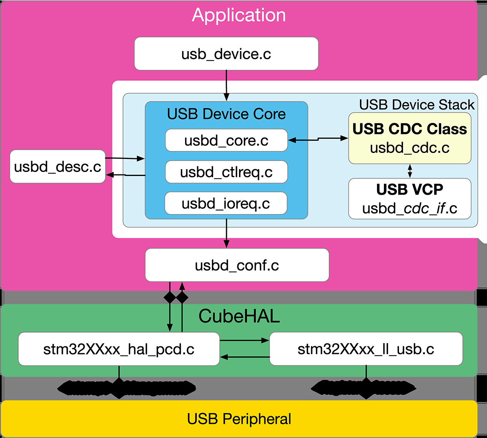</p>

<p align="center">图 18：USB-CDC 应用的典型架构</p>

CDC 是用于通过 USB 连接交换数据的通信设备的标准 USB 类。CDC 是一个通用规范，它定义了针对实际设备的几种特定通信模型。抽象控制模型（Abstract Control Model）是串行接口的模型，即所谓的虚拟 COM 端口（Virtual COM Port）。STM32 USB 设备库的设计使得 CDC 实现（完全包含在 usbd_cdc.c 文件中）与实际模型（在库中称为接口）解耦。文件 USB_DEVICE/App/usbd_cdc_if.c 包含 VCP 模型的实现（见图 18）。

此接口文件仅包含五个例程：

- CDC_Init_FS：此函数由 USB CDC 类初始化器在 SET_CONFIGURATION 命令（由主机发出）期间调用。
- CDC_DeInit_FS：当 USB 接口发出复位操作时（通常是因为 USB 设备从主机断开连接），此函数由 USB CDC 类去初始化器调用。
- CDC_Control_FS：此函数处理由主机驱动程序或应用程序（在我们的情况下，是连接到串行端口的终端仿真器程序）发出的所有特定 CDC 命令。稍后我们将详细介绍此函数。
- CDC_Receive_FS：一旦新数据到达端点 EP1，即数据通过串行端口交换时，USB 堆栈会调用此函数。请注意，您不能在轮询模式下使用此例程。这是一个回调函数，当数据进入 RX 缓冲区时会被调用。还要注意，一旦数据到达 EP1，CDC_Receive_FS() 必须调用 USBD_CDC_ReceivePacket() 例程，该例程将 EP1 重新配置为接收模式，以便其准备好接受来自主机的新数据。

<!-- page: 842 -->

- CDC_Transmit_FS：此函数设置发送缓冲区并调用 USBD_CDC_TransmitPacket，该函数将 EP1 配置为发送模式（请记住，数据将在 IN 事务中由主机“请求”）。

<p align="center">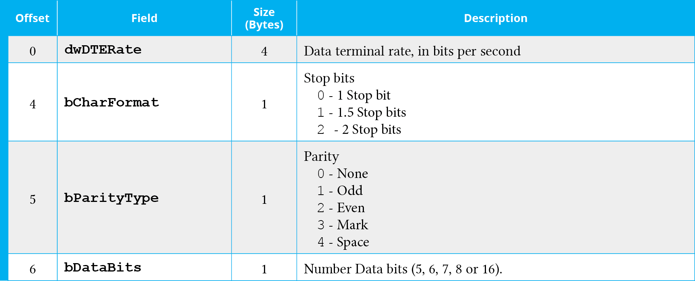</p>

<p align="center">表 16：CDC_SET_LINE_CODING 请求的结构</p>

通过查看 CDC_Control_FS 的内容，可以看到它包含一个 switch 块，用于处理来自主机（以及应用程序级别）的与 CDC 相关的类请求¹⁷。没有任何 case 语句包含实现。为了正确建立串行通信，必须至少实现 CDC_SET_LINE_CODING 和 CDC_GET_LINE_CODING 请求，这些请求用于配置串行线路通信参数（波特率、停止位、奇偶校验、数据大小）。串行协议要求，一旦发出 CDC_SET_LINE_CODING，CDC_GET_LINE_CODING 必须返回相同的配置值。CDC_SET_LINE_CODING 请求接收的配置值遵循一个定义明确的结构，如表 16 所示。STM32 USB 设备库已经定义了用于存储配置值的 struct USBD_CDC_LineCodingTypeDef。

以下代码展示了如何正确实现线路编码配置。此外，它还展示了对 CDC_Receive_FS() 函数（第 239 行）的修改，使得在串行端口上接收到的每个字节都回显到主机：这将允许我们看到在终端仿真器上写入的内容。完整的源代码可在书籍示例中获取。请还注意，所有这些 printf() 将允许您在 Nucleo VCP 上看到调试消息。这将阐明 VCP 的配置方式。

¹⁷这些请求仅代表 CDC 类定义的完整类请求列表的一小部分。更多信息，请参阅官方 CDC 规范。

<!-- page: 843 -->

**Filename:** `USB_DEVICE/App/usbd_cdc_if.c`

```c
179 | static int8_t CDC_Control_FS(uint8_t cmd, uint8_t* pbuf, uint16_t length) {
180 |  switch(cmd) {
181 |    case CDC_SEND_ENCAPSULATED_COMMAND:
182 |     printf("Received CDC_SEND_ENCAPSULATED_COMMAND: %d\r\n", length);
183 |     break;
184 |
185 |    case CDC_GET_ENCAPSULATED_RESPONSE:
186 |     printf("Received CDC_GET_ENCAPSULATED_RESPONSE\r\n");
187 |     break;
188 |
189 |    case CDC_SET_COMM_FEATURE:
190 |     printf("Received CDC_SET_COMM_FEATURE\r\n");
191 |     break;
192 |
193 |    case CDC_GET_COMM_FEATURE:
194 |     printf("Received CDC_GET_COMM_FEATURE\r\n");
195 |     break;
196 |
197 |    case CDC_CLEAR_COMM_FEATURE:
198 |     printf("Received CDC_CLEAR_COMM_FEATURE\r\n");
199 |     break;
200 |
201 |    case CDC_SET_LINE_CODING:
202 |     lineCoding.bitrate = (uint32_t) (pbuf[0] | (pbuf[1] << 8)
203 |                   | (pbuf[2] << 16) | (pbuf[3] << 24));
204 |     lineCoding.format = pbuf[4];
205 |     lineCoding.paritytype = pbuf[5];
206 |     lineCoding.datatype = pbuf[6];
207 |     printf("Received CDC_SET_LINE_CODING: \r\n\tBaudrate: %lu\r\n\tCharFormat: %d\r\n\t
208 |          Parity: %d\r\n\tDataBits: %d\r\n", lineCoding.bitrate, lineCoding.format,
209 |          lineCoding.paritytype, lineCoding.datatype);
210 |     break;
211 |
212 |    case CDC_GET_LINE_CODING:
213 |     printf("Received CDC_GET_LINE_CODING\r\n");
214 |     pbuf[0] = (uint8_t) (lineCoding.bitrate);
215 |     pbuf[1] = (uint8_t) (lineCoding.bitrate >> 8);
216 |     pbuf[2] = (uint8_t) (lineCoding.bitrate >> 16);
217 |     pbuf[3] = (uint8_t) (lineCoding.bitrate >> 24);
218 |     pbuf[4] = lineCoding.format;
219 |     pbuf[5] = lineCoding.paritytype;
220 |     pbuf[6] = lineCoding.datatype;
221 |     break;
222 |
223 |    case CDC_SET_CONTROL_LINE_STATE:
224 |     printf("Received CDC_SET_CONTROL_LINE_STATE: %d\r\n", length);
225 |     break;
226 |
227 |    case CDC_SEND_BREAK:
228 |     printf("Received CDC_SEND_BREAK\r\n");
229 |     break;
230 |
231 |    default:
232 |     break;
233 |  }
234 |  return (USBD_OK);
235 | }
236 |
237 | static int8_t CDC_Receive_FS(uint8_t* Buf, uint32_t *Len) {
238 |  CDC_Transmit_FS(Buf, *Len);
239 |  USBD_CDC_SetRxBuffer(&hUsbDeviceFS, &Buf[0]);
240 |  USBD_CDC_ReceivePacket(&hUsbDeviceFS);
241 |  return (USBD_OK);
242 | }
```

CDC_SET_LINE_CODING 请求是在何时发出的？更重要的是，生成该请求的调用序列是什么？同样，USB 协议分析仪可以帮助我们了解其内部过程。图 19 展示了终端仿真程序连接 COM 端口时发出的请求。如图所示，EP0 上发起了一次 SETUP 控制传输，其数据阶段方向为主机到设备；与之相反，枚举期间主机读取描述符时，数据阶段由设备向主机传送。该 SETUP 请求的接收者是接口，且请求类型为类，因此这是发往 CDC 类的类特定接口请求。事务中的数据对应于 CDC_SET_LINE_CODING 请求。

<!-- page: 845 -->

<p align="center">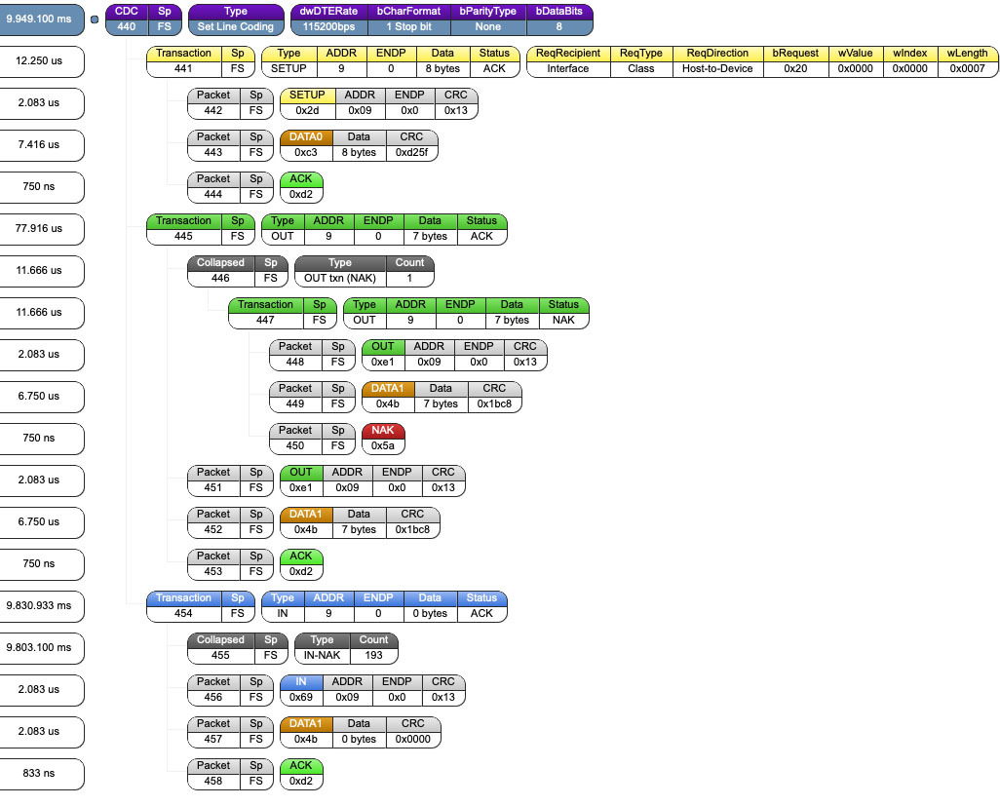</p>

<p align="center">图 19：由 CDC_SET_LINE_CODING 请求引发的事务序列</p>

## 27.3 构建自定义 USB 设备

到目前为止，我们已经看到 USB-IF 为特定设备家族标准化了多个 USB 类。鼠标、键盘、外部 USB 磁盘只是标准和流行 USB 设备的少数几个例子。然而，作为固件/硬件开发人员，你很可能会设计一个不属于上述类别的 USB 设备。如果是这种情况，你需要知道有几种可用的选择，每种选择都有利有弊。

在设计供应商特定设备时，需要考虑的主要问题是，你需要为你的设备提供自定义驱动程序。对于 Windows 操作系统而言，这是一个相当重要的问题。使用 Windows 驱动程序开发工具包 (WDK) 设计设备驱动程序并非易事。此外，你需要使用代码签名证书对驱动程序进行签名（这可能花费高达 500 美元），并通过 WHQL 认证（费用在 2500 美元到 5000 美元之间）。就复杂性而言，这对某些公司来说既不容易也不便宜。

<!-- page: 846 -->

根据复杂性和灵活性的程度，在设计新的 USB 设备时，应考虑以下选项。

- 使用标准化的 USB 类：好吧，这仍然是设计新设备时首选的最佳选项。三大主要操作系统（Windows、MacOS 和 Linux）的所有近期版本都为 HID 类和 CDC 类提供了标准驱动程序。如果你的设备适合通过串行通信交换消息，那么虚拟 COM 端口 (VCP) 是一个完美的解决方案。这就是为什么 USB 转串口转换器在电子行业中仍然如此流行的主要原因。使用 CDC 类的主要缺点是最大传输速度，在 USB FS 设备中限制为约 80 kB/s。HID 类是另一个很好的替代方案，因为即使是旧版本的 Windows 也支持此 USB 类。
- 设计 WCID 设备：Windows 兼容 ID (WCID) 设备是一种向 Windows 系统提供额外信息以简化自动驱动程序安装的 USB 设备。这些额外信息仅通过自定义字符串描述符与主机交换。WCID 允许设备在插入后几乎立即被 Windows 应用程序使用，这与通常的场景相反，在通常场景中，既不是 HID 也不是 CDC 的 USB 设备需要最终用户执行手动驱动程序安装。WCID 是 WinUSB 设备功能的扩展，由 Microsoft 在 Windows 8 中引入。WinUSB 设备的目的是使 Windows 能够加载 Winusb.sys 作为设备的功能驱动程序，而无需自定义 INF 文件。对于 WinUSB 设备，你不需要分发设备的 INF 文件，这使得最终用户的驱动程序安装过程变得简单。相反，如果你需要提供自定义 INF，你不应该将设备定义为 WinUSB 设备，也不应该在 INF 中指定设备的硬件 ID。这种方法的另一个优势是你不需要进行 Windows 硬件质量实验室 (WHQL) 测试以进行驱动程序签名。
- 使用 libusb：libusb 是一个开源项目，提供对 USB 设备的通用访问。它旨在供开发人员使用，以简化与 USB 硬件通信的应用程序的生产。libusb 是一个跨平台库：它在所有 Windows 版本、Linux 和 MacOS 下都能工作。libusb 还包括一个 Windows 特定的 libusb-win32 库，它允许用户空间应用程序在 Windows 操作系统上访问 USB 设备。此库可以用作你设备的默认驱动程序，你可以通过两种方式进行安装：使用 Pete Batard 的 Zadig 工具¹⁸ 或同一作者的配套库 libwdi（Windows 驱动程序安装库）。Pete 还提供了构建 WCID 设备的优秀教程¹⁹ 以及 STM32 USB 设备库的一些示例。最后，请注意，在 MacOS 和 Linux 中，使用 libusb 是接口供应商特定设备所需的一切。

表 17 总结了开发新 USB 设备时四种可用选项的主要特性。根据本作者的观点，除非速度是你的应用程序的严格要求，否则设计自定义 HID 设备仍然是最佳选项。此外，对于 STM32 系列，ST 提供了一个可以很容易地根据你的需求进行自定义的自定义 HID 类。让我们分析一下。

¹⁸https://zadig.akeo.ie/ ¹⁹https://github.com/pbatard/libwdi/wiki/WCID-Devices

<!-- page: 847 -->

<p align="center">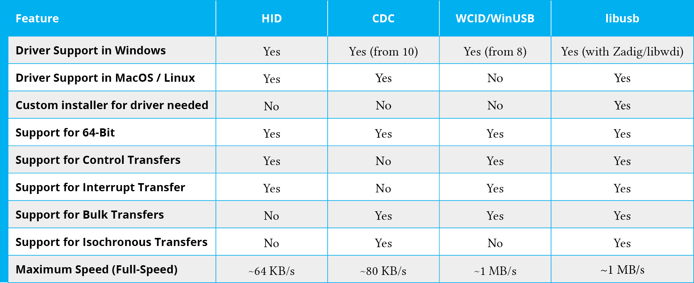</p>

<p align="center">表 17：USB 设备类驱动程序特性比较</p>

### 27.3.1 USB HID 类

人机接口设备（Human Interface Device, HID）是专门用于通常由人类操作的外设的 USB 类，例如键盘、鼠标、游戏手柄等。然而，正如我们稍后将要看到的，HID 规范足够通用，以至于几乎任何设备都可以使用此规范来实现，只要传输速度不是严格要求。完整的 HID 类规范可在官方 USB-IF 网站上获取²⁰。HID 设备本质上由一个接口和两个数据端点组成（除了标准的控制端点 EP0 之外），尽管一些 HID 设备仅实现了 IN 数据端点（例如，简单的 USB 鼠标仅通过数据 IN 端点发送位置信息）。

HID 协议使设备较易实现。设备先定义数据包的结构（在 HID 术语中称为报告，report），再向主机提供报告描述符（Report Descriptor）。报告描述符是固化在设备中的字节数组，用于描述报告的数据结构；其中各字段的含义由“用途”（Usage）定义。描述内容包括设备支持的报告数量、报告大小、每个字节和位的用途，以及单个字节或位可取的最小值和最大值。例如，鼠标可以告知主机：左键的按下/释放状态存储在报告第一个字节的第 3 位，该位取逻辑值 0 或 1，分别表示释放和按下（注意：此处的位置仅用于说明，实际定义因设备而异）。设备通常将报告描述符存储在 ROM 中，本身无需理解或解析它。

²⁰https://bit.ly/3qs2NV0

不同设备可以采用相同的数据包结构，但让主机对数据作出不同响应。因此，数据项的具体含义由更通用的用途页（Usage Page）界定。每个用途页都有标准化的 ID，其中的每项用途（Usage）也有自己的标准化 ID。例如，通用桌面用途页（Generic Desktop Page）的 ID 为 0x01；用途 ID 0x02 表示鼠标，0x06 表示<!-- page: 848 -->键盘。可以将用途页和用途看作命名空间：切换用途页会改变可用的用途。USB-IF 已标准化许多用途页及其对应的用途。更多信息请参阅官方文档²¹。


这种机制允许设备具有自描述性，并且以同样的方式允许操作系统仅为所有 HID 设备拥有一个驱动程序：操作系统驱动程序中的强大解析器允许“理解”实际设备发送的消息结构，从而允许制造商构建他们新的时尚且充满按钮的鼠标，而无需专用驱动程序。

²¹https://bit.ly/3qw9dCj

<!-- page: 849 -->

然而，我确信你对所有这些内容感到完全困惑。在处理 USB 及其标准类时，这是正常的。别担心：事情很快就会变得清晰。

#### 27.3.1.1 USB HID 描述符

每个 USB HID 设备都应提供图 20 所示的描述符。下面逐一介绍。

<p align="center">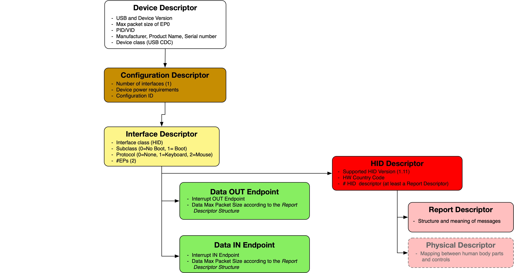</p>

<p align="center">图 20：USB HID 设备中的描述符层次结构</p>

- 接口描述符：HID 类通过接口描述符向主机声明设备实现了 HID 协议。字段 `bInterfaceSubClass` 的取值为 0（非启动设备）或 1（启动设备）；取值为 1 表示设备遵循启动协议。由于报告描述符解析器占用大量代码，BIOS 需要一种更简单的方法来识别必须支持的设备（启动设备），因此 HID 使用 `bInterfaceSubClass` 指示设备是否支持预定义的启动协议。启动协议适用于鼠标或键盘（即能够作为启动设备使用的设备）。启动协议可以扩展为包含 BIOS 无法识别的额外数据；设备也可能支持供 HID 类驱动程序使用的第二种首选协议。字段 `bInterfaceProtocol` 的取值为 0（无）、1（键盘）或 2（鼠标）。取值为 1 或 2 时，报告描述符应遵循明确定义的结构。

<p align="center">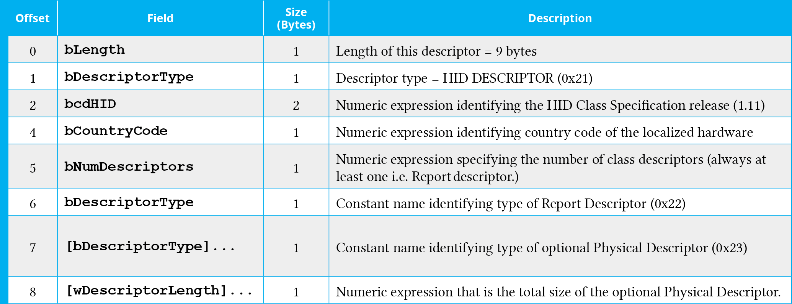</p>

<p align="center">表 18：USB HID 描述符的结构</p>

- HID 描述符：HID 描述符提供 HID 类规范的版本信息，并标识设备从属描述符的长度和类型，其结构如表 18 所示。最重要的从属描述符是报告描述符。它不同于其他描述符，并非简单的数值表；其长度和内容取决于设备报告所需的字段数量。报告描述符由一系列描述设备信息的项组成，操作系统的 HID 设备驱动程序会解析这些项，以便与 HID 设备交换数据。报告描述符格式错误，可能导致设备与主机之间无法通信，或使数据被错误解释。下一节将进一步介绍报告描述符。物理描述符（Physical Descriptor）是一种数据结构，用于说明人体的哪些部位会激活一个或多个控制。例如，它可以指出使用右手拇指激活按钮 5。应用程序可利用此信息为设备控件分配功能。物理描述符完全可选；它会增加复杂性，但对大多数设备而言收益有限。
- 中断端点：HID 设备通过控制端点 EP0（默认端点）或两个中断端点（图 20 中的数据 IN/OUT 端点）与 HID 类驱动程序通信。控制端点用于接收和响应 USB 控制请求与类请求，也用于在 HID 类驱动程序通过 `GET_REPORT` 请求轮询时传输数据，以及接收主机发送的数据。两个中断端点用于<!-- page: 850 -->接收设备主动发送的异步数据，并向设备传输低延迟数据。中断 OUT 端点是可选的：若设备定义了该端点，主机便通过它向设备传输输出报告；否则，输出报告通过控制端点 EP0 和 `SET_REPORT` 请求传输。

#### 27.3.1.2 报告描述符概述

在处理 HID 协议时，术语本身就可能造成混淆。HID 协议通过 Interrupt IN 和 OUT 端点发送的数据包称为报告（report）。报告是结构化的信息片段（例如鼠标指针坐标或键盘按键），其结构由报告描述符（Report Descriptor）详细说明。报告描述符机制使主机操作系统中的通用驱动程序能够处理多种设备，每种设备都可以有各自的功能和结构化数据格式。显然，键盘和鼠标等标准设备必须遵循固定的用途（Usage）和用途页（Usage Page），否则操作系统就无法在没有专用驱动程序的情况下使用它们²²。

报告描述符没有固定结构，只是一个描述报告（即消息）结构的字节序列；其中各字段的含义由特定用途（Usage）和用途页（Usage Page）确定。下面以鼠标为例，描述其消息结构。以下 C 结构体定义了该结构：

```c
struct mouse_report_t {
    uint8_t buttons;
    int8_t x;
    int8_t y;
}
```

x 和 y 字段分别表示鼠标在 X 轴和 Y 轴上的移动量。它们是占用一个字节的有符号整数，取值范围为 -127 到 +127（准确范围为 -128 到 +127，这里为简化而采用前者）。`buttons` 字段包含三个鼠标按钮信息，只使用该字节的低 3 位：位值为 1 表示按下，为 0 表示释放。消息结构的完整说明见表 19。

²²现代和高级 HID 设备制造商使用双重机制来实现高级功能，例如手势或配置某些设备按钮。在这种情况下，设备以双重模式运行。默认情况下，设备发送标准 HID 报告，使其像任何常规鼠标一样工作，直到安装专用驱动程序。借助此驱动程序，设备将进入高级模式。例如，罗技（Logitech）的 HID++ 协议就是这种情况。

<!-- page: 851 -->

<p align="center">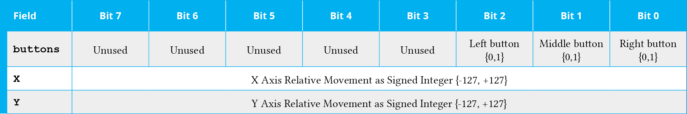</p>

<p align="center">表 19：鼠标消息的结构</p>

该结构体如何转换为报告描述符？首先，我们需要描述三个按钮：

```text
 1 | USAGE_PAGE (Button)
 2 | USAGE_MINIMUM (Button 1)
 3 | USAGE_MAXIMUM (Button 3)
```

每个按钮的状态由一个位表示，0 或 1：

```text
 4 | LOGICAL_MINIMUM (0)
 5 | LOGICAL_MAXIMUM (1)
```

共有三个这样的位：

```text
 6 | REPORT_COUNT (3)
 7 | REPORT_SIZE (1)
```

此可变数据是输入到计算机的数据：

```text
 8 | INPUT (Data,Var,Abs)
```

那么那五个无用的填充位呢？我们需要将它们声明为常量数据：

```text
 9 | REPORT_COUNT (1)
10 | REPORT_SIZE (5)
11 | INPUT (Cnst,Var,Abs)
```

结果如下：

<!-- page: 852 -->

```text
 1 | USAGE_PAGE (Button)
 2 | USAGE_MINIMUM (Button 1)
 3 | USAGE_MAXIMUM (Button 3)
 4 | LOGICAL_MINIMUM (0)
 5 | LOGICAL_MAXIMUM (1)
 6 | REPORT_COUNT (3)
 7 | REPORT_SIZE (1)
 8 | INPUT (Data,Var,Abs)
 9 | REPORT_COUNT (1)
10 | REPORT_SIZE (5)
11 | INPUT (Cnst,Var,Abs)
```

现在我们需要定义 X 轴和 Y 轴的移动：

```text
 1 | USAGE_PAGE (Generic Desktop)
 2 | USAGE (X)
 3 | USAGE (Y)
```

我们希望它是有符号整数，占用一个字节，因此其值在 -127 到 +127 之间：

```text
 4 | LOGICAL_MINIMUM (-127)
 5 | LOGICAL_MAXIMUM (127)
 6 | REPORT_SIZE (8)
 7 | REPORT_COUNT (1)
```

并将其作为可变相对坐标发送到计算机：

```text
 8 | INPUT (Data,Var,Rel)
```

结果如下：

```text
 1 | USAGE_PAGE (Button)
 2 | USAGE_MINIMUM (Button 1)
 3 | USAGE_MAXIMUM (Button 3)
 4 | LOGICAL_MINIMUM (0)
 5 | LOGICAL_MAXIMUM (1)
 6 | REPORT_COUNT (3)
 7 | REPORT_SIZE (1)
 8 | INPUT (Data,Var,Abs)
 9 | REPORT_COUNT (1)
10 | REPORT_SIZE (5)
11 | INPUT (Cnst,Var,Abs)
12 | USAGE_PAGE (Generic Desktop)
13 | USAGE (X)
14 | USAGE (Y)
15 | LOGICAL_MINIMUM (-127)
16 | LOGICAL_MAXIMUM (127)
17 | REPORT_SIZE (8)
18 | REPORT_COUNT (2)
19 | INPUT (Data,Var,Rel)
```

上述报告描述符仍不足以让操作系统识别鼠标移动。HID 规范要求一个定义良好的前导部分：

```text
 1 | USAGE_PAGE (Generic Desktop)
 2 | USAGE (Mouse)
 3 | COLLECTION (Application)
 4 |    USAGE (Pointer)
 5 |    COLLECTION (Physical)
 6 |        USAGE_PAGE (Button)
 7 |        USAGE_MINIMUM (Button 1)
 8 |        USAGE_MAXIMUM (Button 3)
 9 |        LOGICAL_MINIMUM (0)
10 |        LOGICAL_MAXIMUM (1)
11 |        REPORT_COUNT (3)
12 |        REPORT_SIZE (1)
13 |        INPUT (Data,Var,Abs)
14 |        REPORT_COUNT (1)
15 |        REPORT_SIZE (5)
16 |        INPUT (Cnst,Var,Abs)
17 |        USAGE_PAGE (Generic Desktop)
18 |        USAGE (X)
19 |        USAGE (Y)
20 |        LOGICAL_MINIMUM (-127)
21 |        LOGICAL_MAXIMUM (127)
22 |        REPORT_SIZE (8)
23 |        REPORT_COUNT (2)
24 |        INPUT (Data,Var,Rel)
25 |    END COLLECTION
26 | END COLLECTION
```

最后，上述报告描述符需要被“编译”，使其成为一个存储在 Flash 中的 const 数组。这可以通过使用 USB-IF²³ 提供的专用工具来完成。因此，描述符变成了一个 C 数组：

²³https://bit.ly/3pzZs7e

<!-- page: 854 -->

```c
  1 | const char ReportDescriptor[50] = {
  2 |    0x05, 0x01,          // USAGE_PAGE (Generic Desktop)
  3 |    0x09, 0x02,          // USAGE (Mouse)
  4 |    0xa1, 0x01,          // COLLECTION (Application)
  5 |    0x09, 0x01,          // USAGE (Pointer)
  6 |    0xa1, 0x00,          // COLLECTION (Physical)
  7 |    0x05, 0x09,          //  USAGE_PAGE (Button)
  8 |    0x19, 0x01,          //  USAGE_MINIMUM (Button 1)
  9 |    0x29, 0x03,          //  USAGE_MAXIMUM (Button 3)
 10 |    0x15, 0x00,          //  LOGICAL_MINIMUM (0)
 11 |    0x25, 0x01,          //  LOGICAL_MAXIMUM (1)
 12 |    0x95, 0x03,          //  REPORT_COUNT (3)
 13 |    0x75, 0x01,          //  REPORT_SIZE (1)
 14 |    0x81, 0x02,          //  INPUT (Data,Var,Abs)
 15 |    0x95, 0x01,          //  REPORT_COUNT (1)
 16 |    0x75, 0x05,          //  REPORT_SIZE (5)
 17 |    0x81, 0x03,          //  INPUT (Cnst,Var,Abs)
 18 |    0x05, 0x01,          //  USAGE_PAGE (Generic Desktop)
 19 |    0x09, 0x30,          //  USAGE (X)
 20 |    0x09, 0x31,          //  USAGE (Y)
 21 |    0x15, 0x81,          //  LOGICAL_MINIMUM (-127)
 22 |    0x25, 0x7f,          //  LOGICAL_MAXIMUM (127)
 23 |    0x75, 0x08,          //  REPORT_SIZE (8)
 24 |    0x95, 0x02,          //  REPORT_COUNT (2)
 25 |    0x81, 0x06,          //  INPUT (Data,Var,Rel)
 26 |    0xc0,                // END_COLLECTION
 27 |    0xc0                 // END_COLLECTION
 28 | };
```

深入探讨上述报告描述符的细节超出了本书的范围。此外，我必须承认，这个问题主要面向 HID 行业从业者，因为其文档非常匮乏，且很难在网上找到好的教程。我建议参考这个教程²⁴和另一个教程²⁵，以对该主题有一个良好的入门了解。

#### 27.3.1.3 USB HID 类特定请求

USB-IF 为 HID 类标准化了非常少的类特定请求。这些请求由主机通过控制端点 EP0 发送给设备，并在表 20 中进行了总结。

²⁴https://bit.ly/3qy8yk3 ²⁵https://bit.ly/3mFNx5T

<!-- page: 855 -->

<p align="center">表 20：HID 类特定请求</p>

| 值 | 请求 | 描述 |
| --- | --- | --- |
| 0x01 | `GET_REPORT`²⁶ | 允许主机通过控制管道接收报告。 |
| 0x02 | `GET_IDLE` | 读取特定输入报告当前的空闲率。 |
| 0x03 | `GET_PROTOCOL`²⁷ | 读取当前启用的协议（引导协议或报告协议）。 |
| 0x04–0x08 | 保留 | — |
| 0x09 | `SET_REPORT` | 允许主机向设备发送报告，以设置输入、输出或功能控件的状态。 |
| 0x0A | `SET_IDLE` | 使中断 IN 管道上的特定报告保持静默，直到发生新事件或经过指定时间。 |
| 0x0B | `SET_PROTOCOL`²⁸ | 在引导协议和报告协议之间切换。 |

### 27.3.2 构建厂商特定的 USB HID 设备

让我们快速回顾一下，这次侧重于浅层细节，不深入探讨。符合 HID 标准的设备是一种 USB 外设，它与主机 PC 交换称为报告的消息。这是通过使用两个中断端点来实现的：一个 IN 端点用于从设备流向主机的消息，以及一个 OUT 端点（可选）用于从主机流向设备的消息。为了在这两个端点之间交换数据，必须向主机设备驱动程序准确描述这些数据：交换多少字节，这些数据是变化的还是恒定的，这些字节可以取什么值以及它们之间的关系。这一操作由报告描述符完成，它必须遵循一个定义明确的结构。如果我们只关注上述句子，那么我们可以忘记鼠标、键盘、游戏手柄、人类等等。从 HID 协议的角度来看，HID 设备只是一个通过 USB 通信发送一堆字节的外设。我们可以在这组字节序列上构建我们想要的自定义协议。

有了这个简单的概念，我们可以构建任意数量的厂商特定设备，

²⁶此请求是强制性的，所有设备都必须支持。 ²⁷此请求仅对引导设备是必需的。 ²⁸此请求仅对引导设备是必需的。

<!-- page: 856 -->

而无需处理自定义设备驱动程序的开发和认证、驱动程序自定义安装程序等。这就是为什么在设计新的 USB 设备时，制作厂商特定的 HID 设备仍然是最佳选择，也是 ST 在其 STM32 USB 设备库中提供自定义 HID 类的原因。

如您所见，在设计厂商特定的 HID 设备时，需要解决的最相关问题是报告描述符的定义。如果没有一个好的报告描述符，我们将无法在主机和设备之间交换消息（报告）。好消息是，HID 规范提供了一种定义“非结构化”报告的方法，这些报告不需要像鼠标和键盘那样遵循固定的结构。例如，我们可以声明一个可以取 8 位字节全范围的报告：

```text
 4 | LOGICAL_MINIMUM (0)
 5 | LOGICAL_MAXIMUM (255)
```

然后，我们可以将输入报告（即从设备流向主机的消息）定义为 n 个可变字节的序列：

```text
 6 | REPORT_ID (1)
 7 | REPORT_SIZE (8)
 8 | REPORT_COUNT (报告中的字节数)
 9 | USAGE (Undefined)
10 | INPUT (Data,Var,Abs,Vol)
```

其中 REPORT_ID 对应于我们添加到消息中的标签，以便我们可以根据给定的标签对报告进行专门化。同样，我们可以定义输出报告（即从主机流向设备的消息）：

```text
11 | REPORT_ID (2)
12 | REPORT_SIZE (8)
13 | REPORT_COUNT (报告中的字节数)
14 | USAGE (Undefined)
15 | OUTPUT (Data,Var,Abs,Vol)
```

将所有内容组合在一起，我们有以下报告描述符：

<!-- page: 857 -->

```text
 1 | USAGE_PAGE (Generic Desktop)
 2 | USAGE (Undefined)
 3 | COLLECTION (Application)
 4 | LOGICAL_MINIMUM (0)
 5 | LOGICAL_MAXIMUM (255)
 6 | REPORT_ID (1)
 7 | REPORT_SIZE (8)
 8 | REPORT_COUNT (报告中的字节数)
 9 | USAGE (Undefined)
10 | INPUT (Data,Var,Abs,Vol)
11 | REPORT_ID (2)
12 | REPORT_SIZE (8)
13 | REPORT_COUNT (报告中的字节数)
14 | USAGE (Undefined)
15 | OUTPUT (Data,Var,Abs,Vol)
16 | END_COLLECTION
```

对应的 C 数组如下：

```c
  1 | const uint8_t ReportDescriptor[32] = {
  2 |  0x05, 0x01,          // USAGE_PAGE (Generic Desktop)
  3 |  0x09, 0x00,          // USAGE (Undefined)
  4 |  0xa1, 0x01,          // COLLECTION (Application)
  5 |  0x15, 0x00,          //  LOGICAL_MINIMUM (0)
  6 |  0x26, 0xff, 0x00,    //  LOGICAL_MAXIMUM (255)
  7 |  // IN report
  8 |  0x85, 0x01,          //  REPORT_ID (1) - The report tag
  9 |  0x75, 0x08,          //  REPORT_SIZE (8)
 10 |  0x95, IN_REPORT_SIZE-1, // REPORT_COUNT (The amount of bytes in the report)
 11 |  0x09, 0x00,          //  USAGE (Undefined)
 12 |  0x81, 0x82,          //  INPUT (Data,Var,Abs,Vol)
 13 |  // OUT report
 14 |  0x85, 0x02,          //  REPORT_ID (2) - The report tag
 15 |  0x75, 0x08,          //  REPORT_SIZE (8)
 16 |  0x95, OUT_REPORT_SIZE-1, // REPORT_COUNT (The amount of bytes in the report)
 17 |  0x09, 0x00,          //  USAGE (Undefined)
 18 |  0x91, 0x82,          //  OUTPUT (Data,Var,Abs,Vol)
 19 |  0xc0                 // END_COLLECTION
 20 | };
```

一旦我们定义了报告描述符，就可以使用 CubeMX 生成一个新项目，并选择自定义人机接口设备类 (Custom Human Interface Device Class, HID) 作为我们设备所需的类。CubeMX 将生成一个模板项目，我们可以通过少量修改使其适应我们的需求。图 21 展示了生成项目的结构。让我们简要描述一下最相关的源文件及其主要例程。

<!-- page: 858 -->

<p align="center">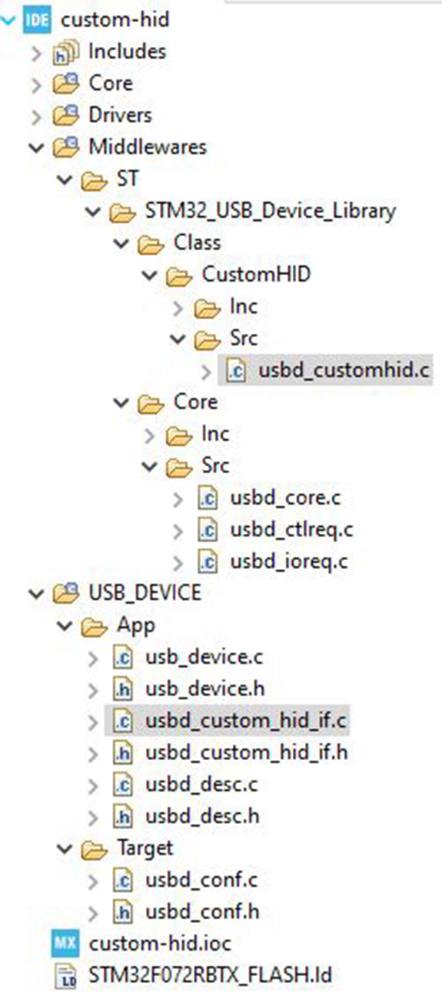</p>

<p align="center">图 21：生成的自定义 HID 项目结构</p>

- `Class/CustomHID/Src/usbd_customhid.c`：包含 HID 类协议的完整实现。
  - 数组 `USBD_CUSTOM_HID_CfgFSDesc` 包含完整的 HID 描述符（配置、接口、HID 和端点描述符）。
  - `USBD_CUSTOM_HID_Init()` 负责初始化 IN 和 OUT 端点。
  - `USBD_CUSTOM_HID_Setup()` 实现表 20 所列的类特定请求。
  - `USBD_CUSTOM_HID_SendReport()` 通过 IN 端点发送指定长度的报告。
- `USB_DEVICE/App/usbd_custom_hid_if.c`：包含自定义 HID 协议的具体实现。
  - 数组 `CUSTOM_HID_ReportDesc_FS` 是通过 EP0 的 `GET_DESCRIPTOR` 请求提供给主机的报告描述符。
  - `CUSTOM_HID_OutEvent_FS()` 是在主机通过 OUT 端点发送报告时调用的回调函数。

我们现在将看到一个完整且非常基础的示例，它帮助我们理解需要对生成的项目进行哪些修改，以便我们可以双向交换报告。想法是拥有一个由四个字节组成的报告消息：

<!-- page: 859 -->

- 第一个字节是报告 ID。报告 ID 用于“标记”报告，我们只有两个 ID：ID 1 用于从设备到主机的消息（INPUT 报告）；ID 2 用于相反方向流动的消息。
- 第二个字节对应于 Nucleo 的 USER 按钮（蓝色按钮）的状态。该字节仅用于 IN 报告（ID 为 1），因为我们无法修改按钮的状态。
- 第三和第四个字节对应于一个无符号半字（16 位）的高位和低位部分，该半字用于设置连接到 Nucleo 的 LD2 LED 的 DAC 输出 I/O。这将允许我们修改 PA5 GPIO 的输出电压，从而调节 LD2 LED 的亮度。

<p align="center"></p>

Nucleo-F401 和 Nucleo-F103 的所有者会发现一个略有不同的示例。由于这些 STM32 微控制器不提供 DAC，示例被设计为让 LD2 LED 以 1 Hz 的频率闪烁。因此，报告中的第三个字节始终不变。

<p align="center"></p>

**Filename:** `USB_DEVICE/App/usbd_custom_hid_if.c`

```c
 24 | /* Private variables ---------------------------------------------------------*/
 25 | extern DAC_HandleTypeDef hdac;
 26 | extern USBD_HandleTypeDef hUsbDeviceFS;
 27 |
 28 | /** Usb HID report descriptor. */
 29 | static const uint8_t CUSTOM_HID_ReportDesc_FS[USBD_CUSTOM_HID_REPORT_DESC_SIZE] = {
 30 |  0x05, 0x01,          // USAGE_PAGE (Generic Desktop)
 31 |  0x09, 0x00,          // USAGE (Undefined)
 32 |  0xa1, 0x01,          // COLLECTION (Application)
 33 |  0x15, 0x00,          //  LOGICAL_MINIMUM (0)
 34 |  0x26, 0xff, 0x00,    //  LOGICAL_MAXIMUM (255)
 35 |  // IN report
 36 |  0x85, 0x01,          //  REPORT_ID (1)
 37 |  0x75, 0x08,          //  REPORT_SIZE (8)
 38 |  0x95, USBD_CUSTOMHID_OUTREPORT_BUF_SIZE-1, // REPORT_COUNT (3)
 39 |  0x09, 0x00,          //  USAGE (Undefined)
 40 |  0x81, 0x82,          //  INPUT (Data,Var,Abs,Vol)
 41 |  // OUT report
 42 |  0x85, 0x02,          //  REPORT_ID (2)
 43 |  0x75, 0x08,          //  REPORT_SIZE (8)
 44 |  0x95, USBD_CUSTOMHID_OUTREPORT_BUF_SIZE-1, // REPORT_COUNT (3)
 45 |  0x09, 0x00,          //  USAGE (Undefined)
 46 |  0x91, 0x82,          //  OUTPUT (Data,Var,Abs,Vol)
 47 |  0xC0                 //  END_COLLECTION
 48 | };
 49 |
 50 | static int8_t CUSTOM_HID_Init_FS(void);
 51 | static int8_t CUSTOM_HID_DeInit_FS(void);
 52 | static int8_t CUSTOM_HID_OutEvent_FS(uint8_t *report, uint8_t report_len);
 53 | static int8_t CUSTOM_HID_GetData(uint8_t *report, uint8_t *report_len);
 54 |
 55 | USBD_CUSTOM_HID_ItfTypeDef USBD_CustomHID_fops_FS = {
 56 |  CUSTOM_HID_ReportDesc_FS,
 57 |  CUSTOM_HID_Init_FS,
 58 |  CUSTOM_HID_DeInit_FS,
 59 |  CUSTOM_HID_OutEvent_FS,
 60 |  CUSTOM_HID_GetData
 61 | };
 62 |
 63 | static int8_t CUSTOM_HID_Init_FS(void) {
 64 |  return (USBD_OK);
 65 | }
 66 |
 67 | static int8_t CUSTOM_HID_DeInit_FS(void) {
 68 |  return (USBD_OK);
 69 | }
 70 |
 71 | static int8_t CUSTOM_HID_OutEvent_FS(uint8_t *report, uint8_t report_len) {
 72 |  HAL_DAC_SetValue(&hdac, DAC_CHANNEL_2, DAC_ALIGN_12B_R,
 73 |              (uint32_t)((report[2] << 8) | report[3]));
 74 |
 75 |  return (USBD_OK);
 76 | }
 77 |
 78 | static int8_t CUSTOM_HID_GetData(uint8_t *report, uint8_t *report_len) {
 79 |  uint32_t dacValue = 0;
 80 |
 81 |  report[0] = 0x1;
 82 |  report[1] = !HAL_GPIO_ReadPin(B1_GPIO_Port, B1_Pin);
 83 |
 84 |  dacValue = HAL_DAC_GetValue(&hdac, DAC_CHANNEL_2);
 85 |  report[2] = dacValue >> 8;
 86 |  report[3] = dacValue & 0xFF;
 87 |
 88 |  *report_len = 4;
 89 |
 90 |  return (USBD_OK);
 91 | }
```

上述代码展示了对 `usbd_custom_hid_if.c` 文件所做的修改。第 29–48 行是前文介绍的报告描述符。第 55–61 行定义了 `USBD_CUSTOM_HID_ItfTypeDef` 结构体的一个实例（该结构体定义在 `usbd_customhid.h` 中）；此处为其增加了一个用于获取报告数据的函数指针，该函数实现在第 78–91 行。最后，修改回调函数 `CUSTOM_HID_OutEvent_FS()`，使其<!-- page: 861 -->根据主机接收到的值设置 DAC 通道 2。

自动生成的代码假设报告消息长度为 2 字节，报告描述符也较短。因此，我们需要修改 `usbd_conf.h` 文件中的宏 `USBD_CUSTOMHID_OUTREPORT_BUF_SIZE` 和 `USBD_CUSTOM_HID_REPORT_DESC_SIZE`，如第 75–77 行所示：

**Filename:** `USB_DEVICE/App/usbd_conf.h`

```c
 64 | /*---------- -----------*/
 65 | #define USBD_MAX_NUM_INTERFACES 1
 66 | /*---------- -----------*/
 67 | #define USBD_MAX_NUM_CONFIGURATION 1
 68 | /*---------- -----------*/
 69 | #define USBD_MAX_STR_DESC_SIZ 512
 70 | /*---------- -----------*/
 71 | #define USBD_DEBUG_LEVEL 0
 72 | /*---------- -----------*/
 73 | #define USBD_SELF_POWERED 1
 74 | /*---------- -----------*/
 75 | #define USBD_CUSTOMHID_OUTREPORT_BUF_SIZE 4
 76 | /*---------- -----------*/
 77 | #define USBD_CUSTOM_HID_REPORT_DESC_SIZE 32
 78 | /*---------- -----------*/
 79 | #define CUSTOM_HID_FS_BINTERVAL 0x5
```

同样地，我们需要在文件 usbd_custom_hid.h 中增加两个端点（IN/OUT）缓冲区的维度：

**Filename:** `Middlewares/ST/STM32_USB_Device_Library/Class/CustomHID/Inc/usbd_customhid.h`

```c
 44 | #define CUSTOM_HID_EPIN_ADDR  0x81U
 45 | #define CUSTOM_HID_EPIN_SIZE  USBD_CUSTOMHID_OUTREPORT_BUF_SIZE
 46 |
 47 | #define CUSTOM_HID_EPOUT_ADDR 0x02U
 48 | #define CUSTOM_HID_EPOUT_SIZE USBD_CUSTOMHID_OUTREPORT_BUF_SIZE
```

**警告**

> 在同一个头文件中，我们需要将 OUT 端点地址从 0x1 修改为 0x2，如第 47 行所示。这是因为当前的 HID 类实现未处理对 IN/OUT 端点的并发访问（读/写），这可能会破坏端点配置，导致 USB 协议栈停滞。因此，最简单的变通方法是使用两个不同的端点编号。这会给初学者带来很多麻烦，而且如果您没有硬件 USB 协议分析仪，调试时尤其需要谨慎。

最后还需修改 `usbd_custom_hid.c`。首先，修改负责处理类请求的 `USBD_CUSTOM_HID_Setup()` 函数<!-- page: 862 -->，使其能够正确处理 `GET_REPORT` 请求。ST 并未实现这一请求，但它是表 20 所列唯一的强制性类请求。

**Filename:** `Middlewares/ST/STM32_USB_Device_Library/Class/CustomHID/Src/usbd_customhid.c`

```c
431 | static uint8_t USBD_CUSTOM_HID_Setup(USBD_HandleTypeDef *pdev,
432 |                           USBD_SetupReqTypedef *req)
433 | {
434 |  USBD_CUSTOM_HID_HandleTypeDef *hhid = (USBD_CUSTOM_HID_HandleTypeDef *)pdev->pClassData;
435 |  uint16_t len = 0U;
436 |  uint8_t *pbuf = NULL;
437 |  uint16_t status_info = 0U;
438 |  uint8_t ret = USBD_OK;
439 |  uint8_t report[USBD_CUSTOMHID_OUTREPORT_BUF_SIZE];
440 |  uint8_t reportLen = 0;
441 |
442 |  switch (req->bmRequest & USB_REQ_TYPE_MASK)
443 |  {
444 |    case USB_REQ_TYPE_CLASS :
445 |     switch (req->bRequest)
446 |     {
447 |      case CUSTOM_HID_REQ_SET_PROTOCOL:
448 |        hhid->Protocol = (uint8_t)(req->wValue);
449 |        break;
450 |
451 |      case CUSTOM_HID_REQ_GET_PROTOCOL:
452 |        USBD_CtlSendData(pdev, (uint8_t *)(void *)&hhid->Protocol, 1U);
453 |        break;
454 |
455 |      case CUSTOM_HID_REQ_SET_IDLE:
456 |        hhid->IdleState = (uint8_t)(req->wValue >> 8);
457 |        break;
458 |
459 |      case CUSTOM_HID_REQ_GET_IDLE:
460 |        USBD_CtlSendData(pdev, (uint8_t *)(void *)&hhid->IdleState, 1U);
461 |        break;
462 |
463 |      case CUSTOM_HID_REQ_GET_REPORT:
464 |        ((USBD_CUSTOM_HID_ItfTypeDef *)pdev->pUserData)->GetData(report, &reportLen);
465 |        if(reportLen == USBD_CUSTOMHID_OUTREPORT_BUF_SIZE) {
466 |             USBD_CtlSendData(pdev, report, reportLen);
467 |             ret = USBD_OK;
468 |        } else {
469 |             USBD_CtlError(pdev, req);
470 |             ret = USBD_FAIL;
471 |        }
472 |        break;
```

<!-- page: 863 -->

接下来，我们需要修改函数 USBD_CUSTOM_HID_DataOut() 和 USBD_CUSTOM_HID_EP0_RxReady()，以便我们可以向 CUSTOM_HID_OutEvent_FS() 传递长度大于 2 的报告消息。

**Filename:** `Middlewares/ST/STM32_USB_Device_Library/Class/CustomHID/Src/usbd_customhid.c`

```c
649 | static uint8_t USBD_CUSTOM_HID_DataOut(USBD_HandleTypeDef *pdev, uint8_t epnum) {
650 |  USBD_CUSTOM_HID_HandleTypeDef *hhid = (USBD_CUSTOM_HID_HandleTypeDef *)pdev->pClassData;
651 |
652 |  ((USBD_CUSTOM_HID_ItfTypeDef *)pdev->pUserData)->OutEvent(
653 |                       hhid->Report_buf, USBD_CUSTOMHID_OUTREPORT_BUF_SIZE);
654 |
655 |  USBD_LL_PrepareReceive(pdev, CUSTOM_HID_EPOUT_ADDR, hhid->Report_buf,
656 |                  USBD_CUSTOMHID_OUTREPORT_BUF_SIZE);
657 |
658 |  return USBD_OK;
659 | }
660 |
661 | static uint8_t USBD_CUSTOM_HID_EP0_RxReady(USBD_HandleTypeDef *pdev) {
662 |  USBD_CUSTOM_HID_HandleTypeDef *hhid = (USBD_CUSTOM_HID_HandleTypeDef *)pdev->pClassData;
663 |
664 |  if (hhid->IsReportAvailable == 1U) {
665 |        ((USBD_CUSTOM_HID_ItfTypeDef *)pdev->pUserData)->OutEvent(
666 |                       hhid->Report_buf, USBD_CUSTOMHID_OUTREPORT_BUF_SIZE);
667 |
668 |    hhid->IsReportAvailable = 0U;
669 |  }
670 |
671 |  return USBD_OK;
672 | }
```

该示例完全可用，但存在一个明显的局限性：从设备向主机传输数据的唯一方式是发出 GET_REPORT 请求。这是一个严重的限制，导致我们无法在按下 USER 按钮时立即捕获事件。我们可以修改该示例，使得当连接到 GPIO13 的中断触发时，向主机发送一条报告消息。

**Filename:** `USB_DEVICE/App/usb_device.c`

```c
 22 | #include "usb_device.h"
 23 | #include "usbd_core.h"
 24 | #include "usbd_desc.h"
 25 | #include "usbd_customhid.h"
 26 | #include "usbd_custom_hid_if.h"
 27 |
 28 | /* Private variables ---------------------------------------------------------*/
 29 | volatile int8_t userBtnStatus = -1;
 30 |
 31 | /* USB Device Core handle declaration. */
 32 | USBD_HandleTypeDef hUsbDeviceFS;
 33 |
 34 | void MX_USB_DEVICE_Init(void) {
 35 |  uint8_t report[4], reportLen;
 36 |
 37 |  /* Init Device Library, add supported class and start the library. */
 38 |  if (USBD_Init(&hUsbDeviceFS, &FS_Desc, DEVICE_FS) != USBD_OK) {
 39 |    Error_Handler();
 40 |  }
 41 |  if (USBD_RegisterClass(&hUsbDeviceFS, &USBD_CUSTOM_HID) != USBD_OK) {
 42 |    Error_Handler();
 43 |  }
 44 |  if (USBD_CUSTOM_HID_RegisterInterface(&hUsbDeviceFS, &USBD_CustomHID_fops_FS) != USBD_OK) {
 45 |    Error_Handler();
 46 |  }
 47 |  if (USBD_Start(&hUsbDeviceFS) != USBD_OK) {
 48 |    Error_Handler();
 49 |  }
 50 |
 51 |  while(1) {
 52 |    if(userBtnStatus >= 0) {
 53 |     HAL_Delay(10); //Adding a little bit of debouncing
 54 |     if(HAL_GPIO_ReadPin(B1_GPIO_Port, B1_Pin) == userBtnStatus) {
 55 |      USBD_CustomHID_fops_FS.GetData(report, &reportLen);
 56 |      USBD_CUSTOM_HID_SendReport(&hUsbDeviceFS, report, reportLen);
 57 |     }
 58 |     userBtnStatus = -1;
 59 |    }
 60 |  }
 61 | }
 62 |
 63 | void HAL_GPIO_EXTI_Callback(uint16_t GPIO_Pin) {
 64 |  if(GPIO_Pin == B1_Pin) {
 65 |    userBtnStatus = HAL_GPIO_ReadPin(B1_GPIO_Port, B1_Pin);
 66 |  }
 67 | }
```

如何测试该示例？根据主机操作系统不同，我们有几种选择。

- Windows：如果您只是想测试示例固件，可以考虑使用

Jan Axelson 开发的 SimpleHIDWrite²⁹ 工具。该工具操作非常简单。首先，您需要选择要与其交换数据的设备。该工具会根据报告消息中的字节数自动显示相应数量的文本框。在我们的情况下，它将显示一个字节用于报告 ID，以及三个字节用于消息的其余部分（参见图 22）。

²⁹http://janaxelson.com/files/SimpleHIDWrite3.zip

<!-- page: 865 -->

通过将 01 设置为报告 ID，工具将允许通过点击“获取报告”按钮来检索报告消息（工具将通过控制端点 EP0 发送 GET_REPORT 请求）。接收到的消息形式为 **rd** 01 00 00 00。相反，如果我们按下 USER 按钮，工具将自动以 **RD** 01 01 00 00 的形式显示报告。要设置 DAC 输出，我们可以将报告 ID 设置为 02，并将最后两个字节设置为 0A 00。

<p align="center">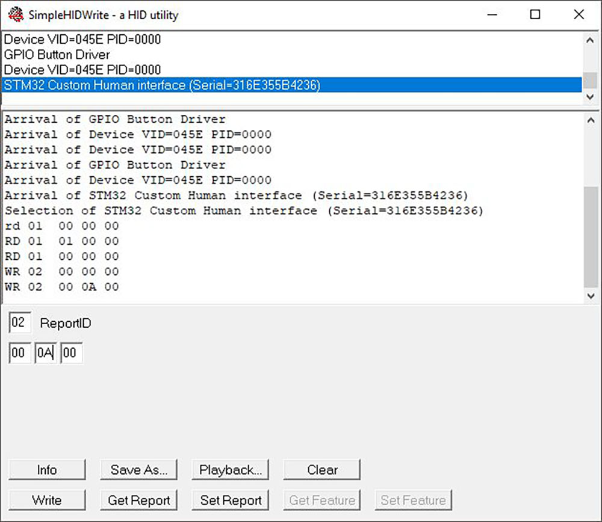</p>

<p align="center">图 22：SimpleHIDWrite 实用工具</p>

- Windows、MacOS 和 Linux：如果需要以编程方式访问 HID 设备，那么 hidapi³⁰ 是最佳选择之一，尤其是在开发跨平台应用程序时。hidapi 是 libusb 项目的一部分，专门用于处理 USB-HID 设备。它在这三大操作系统上均可运行，并提供相同的 API。此外，还存在将 hidapi 库移植到其他语言的多个版本。例如，以下代码片段是用 Python 3 编写的，并使用 cython-hidapi³¹ 封装器来接口我们的 HID 示例。

³⁰https://github.com/libusb/hidapi ³¹https://github.com/trezor/cython-hidapi

<!-- page: 866 -->

**Filename:** `hid_test.py`

```python
  1 | import hid, time, threading, struct
  2 |
  3 | class myT(threading.Thread):
  4 |    def run(self):
  5 |      global hidhandle
  6 |      while True:
  7 |         report = hidhandle.read(0x4)
  8 |         if report[1] == 1:
  9 |            print("USER BUTTON PRESSED")
 10 |         elif report[1] == 0:
 11 |            print("USER BUTTON RELEASED")
 12 |
 13 | hidhandle = hid.device()
 14 | hidhandle.open(0x483, 0x5750)
 15 |
 16 | print("Manufacturer: %s" % hidhandle.get_manufacturer_string())
 17 | print("Product: %s" % hidhandle.get_product_string())
 18 | print("Serial No: %s" % hidhandle.get_serial_number_string())
 19 |
 20 | t = myT()
 21 | t.start()
 22 |
 23 | STEP = 50
 24 | ledStatus = 2000
 25 | incr = STEP
 26 | while True:
 27 |    p = tuple(struct.pack(">H", ledStatus))
 28 |    hidhandle.write((2,0)+p)
 29 |    if ledStatus >= 3500:
 30 |      incr = -STEP;
 31 |    elif ledStatus <= 2000:
 32 |      incr = STEP
 33 |    ledStatus += incr
 34 |    time.sleep(0.05)
```

代码应易于理解。类 myT 是一个在后台运行的线程，它对设备执行阻塞式 read()：一旦按下 Nucleo 的 USER 按钮，就会通过 IN 端点发出一个新报告。如果报告中的第二个字节等于 1，则表示 USER 按钮已被按下，否则表示已释放。示例的另一部分只是持续向 OUT 端点写入一个从 2000 到 3500 的无符号整数，并反向变化：这将导致 LD2 LED 逐渐变亮和变暗。

最后，测试 HID 设备的另一种解决方案是使用 hidapitester 工具³²。

³²https://github.com/todbot/hidapitester/releases

<!-- page: 867 -->

## 27.4 调试 USB 设备

开发 USB 设备并非易事，特别是如果你刚接触 USB 协议，你需要一种方法来调试设备与主机之间交换的数据。执行这项繁琐工作主要有两个选项：硬件协议嗅探器和分析仪，以及软件工具。

### 27.4.1 软件嗅探器和分析仪

市面上有多种免费和商业 USB 软件嗅探器。软件分析仪可用于捕获设备数据传输和协议。它们还可以用于向设备发送命令。软件分析仪通过替换主机上的 USB 软件栈来工作。这是监控 USB 流量的必要步骤。因此，软件分析仪在可呈现的信息方面将依赖于主机硬件。软件分析仪有一个重要优势：它们在驱动程序级别显示通信内容，从而有助于理解你的设备与主机操作系统的设备驱动程序之间出了什么问题。然而，软件分析仪也有一些缺点。首先，主机如果不作为总线的一部分，就无法监控 USB 流量。这意味着无法观察挂起（suspend）或复位（reset）等状态。此外，根据主机硬件和软件栈的不同，还有一些总线状态是由主机控制器在没有软件参与的情况下处理的。另一个缺点是软件的跨平台可用性。如果软件分析仪仅在 Windows 上运行，那么你就只能调试与 Windows 操作系统的通信。在当今时代，这是一个严重的限制。最后一个缺点与定时有关。软件分析仪的定时精度取决于主机操作系统，这可能会引入不同程度的不准确性。

你可以找到几种 USB 软件嗅探器。Wireshark³³ 是唯一同时支持 Windows、MacOS 和 Linux 的工具。它完全免费，并且在大多数情况下运行良好。然而，如果你刚接触 USB 协议，可能会发现 Wireshark 的输出有点难以解码。也有几种商业和专用软件可用。USB Monitor³⁴（作者过去曾成功使用过）和 USBTrace³⁵ 是两个值得考虑的良好替代方案。

### 27.4.2 USB 硬件分析仪

如果你要认真开展 USB 开发，就需要趁手的工具。相信作者的经验：购买一台硬件协议分析仪可以节省大量时间。硬件协议分析仪是一种专用设备（通常由 FPGA 和支持 USB 的微控制器组成），连接在主机与设备之间以监控总线流量。部分分析仪还能生成总线流量，用于构造特定测试条件。其价格取决于制造商、支持的 USB 规范（USB 2.0 或 USB 3.0）以及是否具备流量生成功能，通常从几百美元到几千美元不等。

³³https://wiki.wireshark.org/CaptureSetup/USB ³⁴https://www.hhdsoftware.com/usb-sniffer ³⁵https://www.sysnucleus.com/

<!-- page: 868 -->

虽然有多家公司生产硬件分析仪，但较常见的两家是 TotalPhase 和 LeCroy。作者使用的是 TotalPhase Beagle USB 480³⁶（见图 23），它附带免费的 TotalPhase Data Center 软件，可用于分析主机与设备之间的流量。该软件支持 Windows、MacOS 和 Linux。

<p align="center">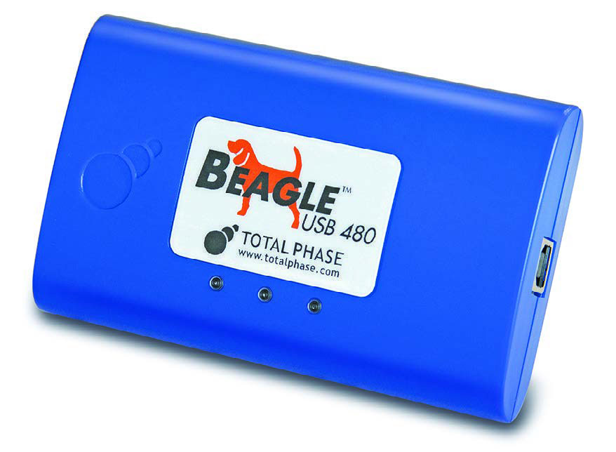</p>

<p align="center">图 23：TotalPhase 的 Beagle USB 480 协议分析仪</p>

## 27.5 优化 STM32 USB 设备库

让我们正视现实：STM32 USB 设备库并未经过充分优化。原因很简单：ST 尽可能将 USB 库设计得通用，使其与具体的 STM32 微控制器、USB 物理层（LS/FS/HS）和 USB 类解耦。此外，该库还采用了可扩展的设计，开发者只需基于现有代码进行适配，就能实现自定义类。然而，这也导致库中存在重复结构和大量 if-then-else 分支，因而占用相当多的 Flash 和 SRAM，可能给应用程序设计带来不少问题。

你可以通过执行以下简单操作，在不破坏库结构的情况下获得更好的结果：

- 如果你要设计一个仅在 Full-Speed 或 High-Speed 模式下工作的设备，那么你可以从库中移除所有与你未考虑的 USB 速度相关的描述符。例如，如果你的设备仅在 FS 模式下工作，那么你可以完全移除以下巨大的数组：

  - `USBD_<CLASS>_CfgHSDesc`
  - `USBD_<CLASS>_OtherSpeedCfgDesc`
- 其他描述符可以定义为 const，这样它们就会进入 Flash 而不是 SRAM。这将节省大量 SRAM 内存。在执行此操作时，注释掉文件 usbd_ctlreq.c 中大约在第 436 行和第 441 行的以下行（老实说，我不知道这些行是用于什么目的的……）：

³⁶https://www.totalphase.com/media/datasheet/TP_Beagle_USB_480_Protocol_Analyzer-Datasheet.pdf

<!-- page: 869 -->

**Filename:** `Middleware/ST/STM32_USB_Device_Library/Core/Src/usbd_ctlreq.c`

```c
428 | case USB_DESC_TYPE_DEVICE:
429 |  pbuf = pdev->pDesc->GetDeviceDescriptor(pdev->dev_speed, &len);
430 |  break;
431 |
432 | case USB_DESC_TYPE_CONFIGURATION:
433 |  if (pdev->dev_speed == USBD_SPEED_HIGH)
434 |  {
435 |   pbuf = pdev->pClass->GetHSConfigDescriptor(&len);
436 |   pbuf[1] = USB_DESC_TYPE_CONFIGURATION;
437 |  }
438 |  else
439 |  {
440 |   pbuf = pdev->pClass->GetFSConfigDescriptor(&len);
441 |   pbuf[1] = USB_DESC_TYPE_CONFIGURATION;
442 |  }
443 |  break;
```

- 同样，你可以移除所有那些仅针对一种速度模式设计的函数，并剥离所有与 USB 速度选择相关的 if-then-else。例如：

```c
if (speed == USBD_SPEED_HIGH) {
    USBD_GetString((uint8_t *)USBD_CONFIGURATION_STRING_FS, USBD_StrDesc, length);
} else {
    USBD_GetString((uint8_t *)USBD_CONFIGURATION_STRING_FS, USBD_StrDesc, length);
}
return USBD_StrDesc;
```

如果你的设备仅在 FS 模式下工作，例如，这个 if 可以简化为一条指令。

最后，请注意存在其他比 ST 的库更优化（甚至更受支持）的完整 USB 栈。tinyusb³⁷ 是一个在设计 USB 设备时值得认真考虑的框架，并且所有 STM32 系列都得到官方支持。

## 27.6 将 USB 设备推向市场

在开始销售 USB 设备之前，根据您希望或需要获得的合规级别，有几个必要的步骤。

首先，有一些强制性的步骤需要执行。其中最相关（也是最昂贵）的一步是获取官方的供应商 ID (Vendor ID, VID)。VID 是一个唯一的标识符，每家公司都从 USB 实施者论坛 (USB Implementers Forum) 获得。获取 VID 有三种选择：

³⁷https://github.com/hathach/tinyusb

<!-- page: 870 -->

- 成为 USB-IF 会员并支付年度会费。在撰写本章时，会费为每年 5000 美元。会员资格具有多项好处。其中最重要的包括：
  - 免费获得一个供应商 ID（如果之前未分配过）
  - 有资格参加 USB-IF 赞助的免费季度合规研讨会
  - 有机会参与 USB-IF 的营销计划和活动，例如零售通讯、商店端架、精选产品等
  - 在 USB 关键联系人列表中列出公司信息
  - 有资格被列入 usb.org 网站上的 USB 当前产品列表以及定期发布的 USB-IF 零售通讯中
  - 加入 USB-IF 标志计划时免除标志管理费
  - 在开发者大会、电子商店产品等方面享受折扣
  - 有资格参与设备工作组
- 以 6000 美元的一次性费用从 USB-IF 购买供应商 ID。但请注意，仅仅购买 VID 并不授权您在产品上使用 USB 标志。为了做到这一点，您需要成为 USB-IF 非会员标志被许可人。此许可费为两年期限 3500 美元。此外，请注意，此许可费并不赋予您其他 USB-IF 会员权益，例如合规研讨会。
- 从 MCS Electronics³⁸ 购买个人 PID。嗯，这看起来更像是一种意大利式³⁹的绕过障碍的方式，但 MCS Electronics 是一家荷兰公司，多年前收购了一个 VID，并开始从他们庞大的资源池中出售个人 PID。他们与 USB-IF 有过纠纷，但根据荷兰法律，他们似乎可以这样做，而 USB-IF 也停止了与他们的对抗。因此，如果您需要 USB 标志合规性（下一节将详细介绍），则需要购买自己的 VID 并投资约 10,000 美元。相反，如果您只需要一个唯一的 VID/PID 对，那么以低于 20 美元的价格从 MCS 购买个人 PID 是可以的（是的，你没看错）。

下一个强制性步骤是至少进行欧洲 CE 和美国 FCC 的合规测试。凭借这两个认证，您可以在地球上大多数国家销售您的设备。在选择测试实验室时，您有两个主要选择：

- 使用更昂贵但离您更近的测试实验室。
- 使用位于中国但便宜得多的测试实验室。

请注意，您可以在中国以低于 500 美元的价格获得 CE/FCC 认证。在中国，有几家被通知用于监管测试的公司，在许多情况下工作迅速且高效。我亲自访问了深圳的几个相关测试实验室，我可以保证，您可以找到与几家“知名”西方公司提供的相同质量和专业水平。在测试您的设备时，我建议至少执行以下测试：

³⁸https://bit.ly/34sPTic ³⁹由于作者是意大利公民，他完全有资格这样说 :-D

<!-- page: 871 -->

- 电磁兼容性 (EMC) 指令 2014/30/EU⁴⁰ 的测试。
- FCC 第 47 篇 CFR 第 15 部分⁴¹ 的测试。
- 低电压指令 (LVD) (2014/35/EU)⁴² 的测试。
- REACH-SVCH⁴³ 的测试。

所有这些测试在中国测试实验室的费用将低于 1000 美元。如果您打算设计 5V USB 设备，则 LVD 测试不是强制性的。然而，获得此认证以及 REACH-SVCH 认证，将在全球范围内运输您的设备时为您省去很多麻烦：海关人员可以将每一笔愉快的交易变成一场噩梦。请相信这位作者。

<p align="center"></p>

<p align="center">图 24：USB-IF 标志之一 - 您能看出您需要哪一个吗？</p>

现在还有几个额外的可选认证您可能需要。如果您希望/需要获得 USB 标志合规性⁴⁴（见图 24），则需要遵循专门的路径。为了确保基于 USB 的设备（主机、设备、集线器等）之间的互操作性，USB-IF 严格规定您的设备遵循标准的方式。因此，您不能随意在设备上使用任何 USB 标志。相反，您必须接受由 USB-IF 管理的一系列合规测试。这些合规测试将确保被测设备符合 USB 规范的相关部分。通过后，产品将获得使用相关 USB-Certified® 标志的能力，此外，产品将被列入 USB 集成商列表，这只是一个由 USB-IF 维护的列表，包含已满足强制合规标准的 USB 产品列表。在获得 USB 合规认证的路径上，必须完成两个组成部分：检查表和合规测试。有关更多信息，请参阅 USB-IF 网站上的专门页面⁴⁵。在遵循此路径时，请注意这将花费您至少 10,000 美元，并强烈建议接受专业顾问的支持。

最后，您可能需要为您的设备和驱动程序获取 Windows 硬件质量实验室 (WHQL) 认证。嗯，这不是一个简单的步骤。微软提供了一个专门的认证计划⁴⁶，以及一套专门用于执行“预合规”测试的工具⁴⁷。同样，我的建议是向经验丰富的测试实验室寻求帮助。请准备好投入大量资金。

⁴⁰https://bit.ly/3t20c72 ⁴¹https://bit.ly/3qXY3a1 ⁴²https://bit.ly/3qRZsi3 ⁴³https://bit.ly/3t0eDbF ⁴⁴https://www.usb.org/compliance ⁴⁵https://www.usb.org/compliance ⁴⁶https://bit.ly/3HDiYWs ⁴⁷https://bit.ly/3n2VHp4
