<!-- source-file: 00-front-matter.md -->

<!-- page: 1 -->

[原文提取异常（exception），第1页]

<!-- page: 2 -->

# 精通 STM32 - 第二版

## 使用官方 STM32Cube 开发环境，逐步掌握最完整的 ARM Cortex-M 平台

## Carmine Noviello

本书可在 http://leanpub.com/mastering-stm32-2nd 购买

本版本发布于 2022-02-28


这是一本 Leanpub 书籍。Leanpub 通过精益出版流程赋能作者和出版商。精益出版是指使用轻量级工具和多次迭代来发布正在编写中的电子书，以获取读者反馈，不断调整直至打造出合适的书籍，并在成功后建立影响力。

© 2015-2022 Carmine Noviello

<!-- page: 3 -->

# 在推特上分享这本书！

请在推特上帮忙向更多人推荐这本书，以支持卡米内·诺维耶洛（Carmine Noviello）！

本书建议使用的标签是 #MasteringSTM32。

点击此链接，在推特上搜索该标签，查看其他人对这本书的评价：

#MasteringSTM32

<!-- page: 4 -->

献给我的妻子安娜，她始终无条件地支持我所有的事业

献给我的女儿朱莉娅，她总是彻底打乱我的计划

<!-- page: 5 -->

# 目录

前言 . . . . . . . . . . . . . . . . . . . . . . . . . . . . . . . . . . . . . . . . . . . . . . . . . . . . . . i 本书适合谁阅读？ . . . . . . . . . . . . . . . . . . . . . . . . . . . . . . . . . . . . . . . . . ii 如何结合本书学习？ . . . . . . . . . . . . . . . . . . . . . . . . . . . . . . . . . . . . . . iii 本书的结构安排 . . . . . . . . . . . . . . . . . . . . . . . . . . . . . . . . . . . . . . iv 与第一版的区别 . . . . . . . . . . . . . . . . . . . . . . . . . . . . . . . . . . . vii 作者简介 . . . . . . . . . . . . . . . . . . . . . . . . . . . . . . . . . . . . . . . . . . . . . viii 勘误与建议 . . . . . . . . . . . . . . . . . . . . . . . . . . . . . . . . . . . . . . . . . ix 图书支持 . . . . . . . . . . . . . . . . . . . . . . . . . . . . . . . . . . . . . . . . . . . . . . . ix 如何支持作者

. . . . . . . . . . . . . . . . . . . . . . . . . . . . . . . . . . . . . . . . ix 版权声明 . . . . . . . . . . . . . . . . . . . . . . . . . . . . . . . . . . . . . . . . . . ix 致谢 . . . . . . . . . . . . . . . . . . . . . . . . . . . . . . . . . . . . . . . . . . . . . . . . . . . x

第一版致谢 . . . . . . . . . . . . . . . . . . . . . . . . . . . . . . . . . xi

# 引言. . . . . . . . . . . . . . . . . . . . . . . . . . . . . . . . . . . . . . . . 1

1。STM32 微控制器（microcontroller）产品组合简介 . . . . . . . . . . . . . . . . . . . . . . . . . . . . . . . 2

1.1 基于 ARM 的处理器简介 . . . . . . . . . . . . . . . . . . . . . . . . . . . 2

1.1.1 基于Cortex和Cortex-M的处理器 . . . . . . . . . . . . . . . . . . . . 4

1.1.1.1 内核（core）寄存器（register） . . . . . . . . . . . . . . . . . . . . . . . . . . . . 4

1.1.1.2 内存映射（memory map） . . . . . . . . . . . . . . . . . . . . . . . . . . . . 7

1.1.1.3 位带 . . . . . . . . . . . . . . . . . . . . . . . . . . . . . 8

1.1.1.4 Thumb-2 与内存对齐 . . . . . . . . . . . . . . . . 11

1.1.1.5 流水线（pipeline） . . . . . . . . . . . . . . . . . . . . . . . . . . . . . . . . 13

1.1.1.6 中断（interrupt）与异常处理 . . . . . . . . . . . . . . . 14

1.1.1.7 系统定时器 . . . . . . . . . . . . . . . . . . . . . . . . . . . . . . . 16

1.1.1.8 电源模式 . . . . . . . . . . . . . . . . . . . . . . . . . . . . 17

1.1.1.9 TrustZoneTM . . . . . . . . . . . . . . . . . . . . . . . . . . . . . 18

1.1.1.10 CMSIS . . . . . . . . . . . . . . . . . . . . . . . . . . . . . . . . . 19

1.1.1.11 在 STM32 系列中有效实现 Cortex-M 特性 . . . . . . . . . . . . . . . . . . . . . . . . . . . 20

1.2 STM32 微控制器简介 . . . . . . . . . . . . . . . . . . . . . . . . . . 21

1.2.1STM32 产品组合的优势……. . . . . . . . . . . . . . . . . . . . . . 22

<!-- page: 6 -->

目录

### 1.2.2 ……及其缺点 . . . . . . . . . . . . . . . . . . . . . . . . . . . . . . . 23

1.3 STM32 子系列概览 . . . . . . . . . . . . . . . . . . . . . . . . . . 24

1.3.1 F0 . . . . . . . . . . . . . . . . . . . . . . . . . . . . . . . . . . . . . . . . . . . 26

1.3.2 F1 . . . . . . . . . . . . . . . . . . . . . . . . . . . . . . . . . . . . . . . . . . . 27

1.3.3 F2 . . . . . . . . . . . . . . . . . . . . . . . . . . . . . . . . . . . . . . . . . . . 28

1.3.4 F3 . . . . . . . . . . . . . . . . . . . . . . . . . . . . . . . . . . . . . . . . . . . 29

1.3.5 F4 . . . . . . . . . . . . . . . . . . . . . . . . . . . . . . . . . . . . . . . . . . . 31

1.3.6 F7 . . . . . . . . . . . . . . . . . . . . . . . . . . . . . . . . . . . . . . . . . . . 33

1.3.7 H7 . . . . . . . . . . . . . . . . . . . . . . . . . . . . . . . . . . . . . . . . . . . 35

1.3.8 L0 . . . . . . . . . . . . . . . . . . . . . . . . . . . . . . . . . . . . . . . . . . . 37

1.3.9 L1 . . . . . . . . . . . . . . . . . . . . . . . . . . . . . . . . . . . . . . . . . . . 38

1.3.10 L4 . . . . . . . . . . . . . . . . . . . . . . . . . . . . . . . . . . . . . . . . . . . 39

1.3.11 L4+ . . . . . . . . . . . . . . . . . . . . . . . . . . . . . . . . . . . . . . . . . . 41

1.3.12 L5 . . . . . . . . . . . . . . . . . . . . . . . . . . . . . . . . . . . . . . . . . . . 42

1.3.13 U5 . . . . . . . . . . . . . . . . . . . . . . . . . . . . . . . . . . . . . . . . . . . 43

1.3.14 G0 . . . . . . . . . . . . . . . . . . . . . . . . . . . . . . . . . . . . . . . . . . . 45

1.3.15 G4 . . . . . . . . . . . . . . . . . . . . . . . . . . . . . . . . . . . . . . . . . . . 46

1.3.16 STM32WB . . . . . . . . . . . . . . . . . . . . . . . . . . . . . . . . . . . . . . 48

1.3.17 STM32WL . . . . . . . . . . . . . . . . . . . . . . . . . . . . . . . . . . . . . . 50

1.3.18 如何为您选择合适的微控制器？ . . . . . . . . . . . . . . . . . . . . 51

1.4 Nucleo 开发板 . . . . . . . . . . . . . . . . . . . . . . . . . . . . . . . 54

2。与 STM32CubeIDE 建立联系 . . . . . . . . . . . . . . . . . . . . . . . . . . . . . . . . . 60 2.1 为何选择 STM32CubeIDE 作为 STM32 的工具链（toolchain） . . . . . . . . . . . . . . . . 60 2.1.1 关于 Eclipse 的两句闲话… . . . . . . . . . . . . . . . . . . . . . . . . . . . 62 2.1.2 …以及 GCC . . . . . . . . . . . . . . . . . . . . . . . . . . . . . . . . . . . . . 62 2.2 下载并安装 STM32CubeIDE . . . . . . . . . . . . . . . . . . . . . 63 2.2.1 Windows - 安装工具链 . . . . . . . . . . . . . . . . . . . . . 64 2.2.2 Linux - 安装工具链 . . . . . . . . . . . . . . . . . . . . . . . . 67 2.2.3 Mac - 安装工具链 . . . . . . . . . . . . . . . . . . . . . . . . . 68 2.3 STM32CubeIDE 概览 . . . . . . . . . . . . . . . . . . . . . . . . . . . . . . . . . . . 70

3。你好，Nucleo！. . . . . . . . . . . . . . . . . . . . . . . . . . . . . . . . . . . . . . . . . . . . . . 76 3.1 创建项目 . . . . . . . . . . . . . . . . . . . . . . . . . . . . . . . . . . . . . . . . . 76 3.2 为生成的代码添加实用功能 . . . . . . . . . . . . . . . . . . . . 79 3.3 将 Nucleo 连接到 PC . . . . . . . . . . . . . . . . . . . . . . . . . . . . . . 84 3.3.1 ST-LINK 固件升级 . . . . . . . . . . . . . . . . . . . . . . . . . . . 85 3.4 使用 STM32CubeProgrammer 对 Nucleo 进行烧录 . . . . . . . . . . . . . . . . . . . 86

4。STM32CubeMX 工具 . . . . . . . . . . . . . . . . . . . . . . . . . . . . . . . . . . . . . . . . . . 89 4.1 CubeMX 工具简介 . . . . . . . . . . . . . . . . . . . . . . . . . . . . . . . . 89 4.1.1 目标选择向导 . . . . . . . . . . . . . . . . . . . . . . . . . . . . . 90 4.1.1.1 MCU/MPU 选择器 . . . . . . . . . . . . . . . . . . . . . . . . 91 4.1.1.2 开发板选择器 . . . . . . . . . . . . . . . . . . . . . . . . . . . . 92

<!-- page: 7 -->

目录

#### 4.1.1.3 示例选择器 . . . . . . . . . . . . . . . . . . . . . . . . . . 92 4.1.1.4 交叉选择器 . . . . . . . . . . . . . . . . . . . . . . . . . . . . 94 4.1.2 MCU 和中间件配置 . . . . . . . . . . . . . . . . . . . . . 94 4.1.2.1 引脚视图与配置 . . . . . . . . . . . . . . . . . . 95 4.1.2.2 时钟配置视图 . . . . . . . . . . . . . . . . . . . . 100 4.1.3 项目管理器 . . . . . . . . . . . . . . . . . . . . . . . . . . . . . . . . . . 102 4.1.4 工具视图 . . . . . . . . . . . . . . . . . . . . . . . . . . . . . . . . . . . . . 104 4.2 理解项目结构 . . . . . . . . . . . . . . . . . . . . . . . . . . . . . . . 105 4.3 下载本书源代码示例 . . . . . . . . . . . . . . . . . . . . . . . . 113 4.4 STM32Cube 软件包管理 . . . . . . . . . . . . . . . . . . . . . . . . . . . 115

5调试简介. . . . . . . . . . . . . . . . . . . . . . . . . . . . . . . . . . . . . . 117 5.1调试会话背后的原理. . . . . . . . . . . . . . . . . . . . . . . . . . . . . . . 117 5.2使用 STM32CubeIDE 进行调试. . . . . . . . . . . . . . . . . . . . . . . . . . . . . . 119 5.2.1调试配置. . . . . . . . . . . . . . . . . . . . . . . . . . . . . . 122 5.3 I/O重定向. . . . . . . . . . . . . . . . . . . . . . . . . . . . . . . . . . . . . . . . . 125

# II 深入硬件抽象层（hardware abstraction layer） . . . . . . . . . . . . . . . . . . . . . . . . . . . . . .129

6。GPIO 管理 . . . . . . . . . . . . . . . . . . . . . . . . . . . . . . . . . . . . . . . . . . . 130 6.1 STM32 外设映射与 HAL 处理程序 . . . . . . . . . . . . . . . . . . . . . 130 6.2 GPIO 配置 . . . . . . . . . . . . . . . . . . . . . . . . . . . . . . . . . . . . . . 135 6.2.1 GPIO 模式 . . . . . . . . . . . . . . . . . . . . . . . . . . . . . . . . . . . . . 136 6.2.2 GPIO 复用功能 . . . . . . . . . . . . . . . . . . . . . . . . . . . . . 139 6.3 驱动 GPIO . . . . . . . . . . . . . . . . . . . . . . . . . . . . . . . . . . . . . . . . . 140 6.4 反初始化 GPIO . . . . . . . . . . . . . . . . . . . . . . . . . . . . . . . . . . . . . . 140

7。中断管理 . . . . . . . . . . . . . . . . . . . . . . . . . . . . . . . . . . . . . . . . 143

7.1 NVIC 控制器 . . . . . . . . . . . . . . . . . . . . . . . . . . . . . . . . . . . . . . . . . 143

7.1.1 STM32 中的向量表 . . . . . . . . . . . . . . . . . . . . . . . . . . . . . . 144

7.2 启用中断 . . . . . . . . . . . . . . . . . . . . . . . . . . . . . . . . . . . . . . . 148

7.2.1 外部线路与 NVIC . . . . . . . . . . . . . . . . . . . . . . . . . . . . . 149

7.2.2 使用 CubeMX 启用中断 . . . . . . . . . . . . . . . . . . . . . . . 153

7.3 中断生命周期 . . . . . . . . . . . . . . . . . . . . . . . . . . . . . . . . . . . . . . . 155

7.4 中断优先级 . . . . . . . . . . . . . . . . . . . . . . . . . . . . . . . . . . . . 159

7.4.1 Cortex-M0/0+ . . . . . . . . . . . . . . . . . . . . . . . . . . . . . . . . . . . . 159

7.4.2 Cortex-M3/4/7/33 . . . . . . . . . . . . . . . . . . . . . . . . . . . . . . . . . 164

7.4.3 在 CubeMX 中设置中断优先级 . . . . . . . . . . . . . . . . . . . . . 171

7.5 中断重入 . . . . . . . . . . . . . . . . . . . . . . . . . . . . . . . . . . . . . 171

7.6 一次性屏蔽所有中断或按优先级屏蔽 . . . . . . . . . . . . . . . . . . . . 173

8。通用异步串行通信 . . . . . . . . . . . . . . . . . . . . . . . 176 8.1 UART 与 USART 简介 . . . . . . . . . . . . . . . . . . . . . . . . . . . . . 176

<!-- page: 8 -->

目录

## 8.2 UART 初始化 . . . . . . . . . . . . . . . . . . . . . . . . . . . . . . . . . . . . . . . 180 8.2.1 使用 CubeMX 配置 UART . . . . . . . . . . . . . . . . . . . . . 187 8.3 轮询模式下的 UART 通信 . . . . . . . . . . . . . . . . . . . . . . . . . . 188 8.3.1 在 Eclipse 中安装终端仿真器 . . . . . . . . . . . . . . . . . . . 192 8.4 中断模式下的 UART 通信 . . . . . . . . . . . . . . . . . . . . . . . . . 193 8.4.1 UART 相关中断 . . . . . . . . . . . . . . . . . . . . . . . . . . . . . 194 8.5 错误管理 . . . . . . . . . . . . . . . . . . . . . . . . . . . . . . . . . . . . . . . 201 8.6 HAL_UART 模块中可用的回调函数列表 . . . . . . . . . . . . . . . . . . . 202

9。直接存储器访问（direct memory access）管理 . . . . . . . . . . . . . . . . . . . . . . . . . . . . . . . . . . . . . . . . . . . 205

9.1 直接存储器访问简介 . . . . . . . . . . . . . . . . . . . . . . . . . . . . . . . . . . . . . . 205

9.1.1 直接存储器访问（DMA）的需求及内部总线的作用 . . . . . . . . . . 206

9.1.2 DMA 控制器 . . . . . . . . . . . . . . . . . . . . . . . . . . . . . . . 209

9.1.2.1 在 F0/F1/F3/L0/L1/L4 微控制器中的直接存储器访问实现 . . 210

9.1.2.2 在 F2/F4/F7 微控制器中的直接存储器访问实现 . . . . . . . . . 214

9.1.2.3 G0/G4/L4+/L5/H7 微控制器中的直接存储器访问实现 . . . 217

9.2 HAL_DMA 模块 . . . . . . . . . . . . . . . . . . . . . . . . . . . . . . . . . . . . . . . . . 220

9.2.1 在 F0/F1/F3/L0/L1/L4 硬件抽象层中的 . . . . . . . . . . . . . . . 220

9.2.2 在 G0/G4/L4+/L5/H7 硬件抽象层中的 DMA 配置 . . . . . . . . . . . . . . 223

9.2.3 在 F2/F4/F7 硬件抽象层中的 . . . . . . . . . . . . . . . . . . . . . 226

9.2.4 如何在轮询模式下执行 DMA 传输 . . . . . . . . . . . . . . 229

9.2.5 如何在中断模式下执行 DMA 传输 . . . . . . . . . . . . . 232

9.2.6 使用 HAL_UART 模块进行直接存储器访问模式传输 . . . . . . . . . . 233

9.2.7 使用 CubeHAL 编程 DMAMUX . . . . . . . . . . . . . . 236

9.2.8 来自 HAL_DMA 和 HAL_DMA_Ex 模块的杂项功能 . . . . 237

9.3 使用 CubeMX 配置 DMA 请求 . . . . . . . . . . . . . . . . . . . . . . . 238

9.4 直接存储器访问缓冲区的正确内存分配 . . . . . . . . . . . . . . . . . . . . . . . 239

9.5 案例研究：DMA 内存到内存传输性能分析 . . . 240

10。时钟树（clock tree） . . . . . . . . . . . . . . . . . . . . . . . . . . . . . . . . . . . . . . . . . . . . . . . . . 245

## 10.1 时钟分配 . . . . . . . . . . . . . . . . . . . . . . . . . . . . . . . . . . . . . . . 245 10.1.1 STM32 时钟树概述 . . . . . . . . . . . . . . . . . . . . . . 246 10.1.1.1 STM32L/U 系列中的多速内部 RC 振荡器 250 10.1.2 使用 CubeMX 配置时钟树 . . . . . . . . . . . . . . . . . . . . 251 10.1.3 Nucleo 开发板中的时钟源选项 . . . . . . . . . . . . . . . . . . . . 253 10.1.3.1 Nucleo-64 rev. MB1136（较旧版本，配备 ST-LINK V2.1） . . . . . . . . . . . . . . . . . . . . . . . . . . . . 254 10.1.3.1.1 OSC 时钟供电 . . . . . . . . . . . . . . . . . . . . . . . . . . . 254 10.1.3.1.2 OSC 32kHz 时钟供电 . . . . . . . . . . . . . . . . . . . . . . . 255

#### 10.1.3.2 Nucleo-64 rev. MB1367 中的时钟源（较新版本，配备 ST-LINK v3） . . . . . . . . . . . . . . . . . . . . . . . . . . . . . 256 10.1.3.2.1 OSC 时钟供电 . . . . . . . . . . . . . . . . . . . . . . . . . . . 256 10.1.3.2.2 OSC 32kHz 时钟供电 . . . . . . . . . . . . . . . . . . . . . . . 257

<!-- page: 9 -->

目录

## 10.2 HAL_RCC 模块概述 . . . . . . . . . . . . . . . . . . . . . . . . . . . . . . 257 10.2.1 在运行时计算时钟频率 . . . . . . . . . . . . . . . . . 259 10.2.2 启用主时钟输出 . . . . . . . . . . . . . . . . . . . . . . . 260 10.2.3 启用时钟安全系统 . . . . . . . . . . . . . . . . . . . . . . 260 10.3 HSI 校准 . . . . . . . . . . . . . . . . . . . . . . . . . . . . . . . . . . . . . . . . . 261

11。定时器 . . . . . . . . . . . . . . . . . . . . . . . . . . . . . . . . . . . . . . . . . . . . . . . . . . . 263

##

11.1 定时器简介 . . . . . . . . . . . . . . . . . . . . . . . . . . . . . . . . . . . . . 263

11.1.1 STM32 微控制器中的定时器类别 . . . . . . . . . . . . . . . . . . . . . . 264

11.1.2 STM32 系列中定时器的有效可用性 . . . . . . . . . . 266

11.2 基本定时器 . . . . . . . . . . . . . . . . . . . . . . . . . . . . . . . . . . . . . . . . . . . 269

11.2.1 在中断模式下使用定时器 . . . . . . . . . . . . . . . . . . . . . . . . . 272

11.2.1.1 高级定时器中的时基生成 . . . . . . . . . . 274

11.2.2 以轮询模式使用定时器 . . . . . . . . . . . . . . . . . . . . . . . . . . 274

11.2.3 在直接存储器访问模式下使用定时器 . . . . . . . . . . . . . . . . . . . . . . . . . . . 275

11.2.4 停止定时器 . . . . . . . . . . . . . . . . . . . . . . . . . . . . . . . . . . 278

11.2.5 使用 CubeMX 配置基本定时器 . . . . . . . . . . . . . . . . . 278

11.3 通用定时器 . . . . . . . . . . . . . . . . . . . . . . . . . . . . . . . . . . . . 278

11.3.1 具有外部时钟源的时间基准发生器 . . . . . . . . . . . . . 279

11.3.1.1 外部时钟模式 2 . . . . . . . . . . . . . . . . . . . . . . . 281

11.3.1.2 外部时钟模式 1 . . . . . . . . . . . . . . . . . . . . . . . 284

11.3.1.3 使用 CubeMX 配置通用定时器的源时钟 . . . . . . . . . . . . . . . . . . . . . . . . . . . . 289

11.3.2 Master/Slave 同步模式 . . . . . . . . . . . . . . . . . . . . . 290

11.3.2.1 启用触发器相关中断 . . . . . . . . . . . . . . . . 296

11.3.2.2 使用 CubeMX 配置 Master/Slave 同步 . . . . . . . . . . . . . . . . . . . . . . . . . . . . . . . . 296

11.3.3 通过软件生成定时器相关事件 . . . . . . . . . . . . . . . . . 297

11.3.4 计数模式 . . . . . . . . . . . . . . . . . . . . . . . . . . . . . . . . . . 299

11.3.5 输入捕获模式 . . . . . . . . . . . . . . . . . . . . . . . . . . . . . . . . 300

11.3.5.1 使用 CubeMX 配置输入捕获模式 . . . 307

11.3.6 输出比较模式 . . . . . . . . . . . . . . . . . . . . . . . . . . . . . . 308

11.3.6.1 使用 CubeMX 配置输出比较模式 313

11.3.7 脉宽生成 . . . . . . . . . . . . . . . . . . . . . . . . . . . . . 313

11.3.7.1 使用 PWM 生成正弦波 . . . . . . . . . . 317

11.3.7.2 使用 CubeMX 配置 PWM 模式 . . . . . . . . . 322

11.3.8 单脉冲模式 . . . . . . . . . . . . . . . . . . . . . . . . . . . . . . . . . . 322

11.3.8.1 使用 CubeMX 配置 OPM 模式 . . . . . . . . . 325

11.3.9 编码器模式 . . . . . . . . . . . . . . . . . . . . . . . . . . . . . . . . . . . 325

11.3.9.1 使用 CubeMX 配置编码器模式 . . . . . . . 331

11.3.10 通用定时器和高级定时器中可用的其他功能 . . . 331

11.3.10.1 霍尔传感器模式 . . . . . . . . . . . . . . . . . . . . . . . . . . 332

<!-- page: 10 -->

目录

#### 11.3.10.2 组合三相 PWM 模式及其他电机控制相关功能 . . . . . . . . . . . . . . . . . . . . . 332 11.3.10.3 中断输入和定时器寄存器锁定 . . . . . . . . . . 333 11.3.10.4 自动重载寄存器预加载 . . . . . . . . . . . . . . . 333 11.3.11 调试和定时器 . . . . . . . . . . . . . . . . . . . . . . . . . . . . . . 334 11.4 SysTick 定时器 . . . . . . . . . . . . . . . . . . . . . . . . . . . . . . . . . . . . . . . . . . 335 11.4.1 使用另一个定时器作为系统时基源 . . . . . . . . . . . . . . . 336 11.5 案例研究：如何使用 STM32 微控制器精确测量微秒 . . . . 337

12. 模数转换 . . . . . . . . . . . . . . . . . . . . . . . . . . . . . . . . . . . . 343

##

12.1 SAR ADC 简介 . . . . . . . . . . . . . . . . . . . . . . . . . . . . . . . . . . . 343

12.2 HAL_ADC 模块 . . . . . . . . . . . . . . . . . . . . . . . . . . . . . . . . . . . . . . . . . 348

12.2.1 转换模式 . . . . . . . . . . . . . . . . . . . . . . . . . . . . . . . . . 350

12.2.1.1 单通道、单次转换模式 . . . . . . . . . . . 350

12.2.1.2 单次转换扫描模式 . . . . . . . . . . . . . . . . . . 351

12.2.1.3 单通道、连续转换模式 . . . . . . . . 351

12.2.1.4 扫描连续转换模式 . . . . . . . . . . . . . . . 352

12.2.1.5注入转换模式. . . . . . . . . . . . . . . . . . . . 352

12.2.1.6 双模式 . . . . . . . . . . . . . . . . . . . . . . . . . . . . . 353

12.2.2 通道选择 . . . . . . . . . . . . . . . . . . . . . . . . . . . . . . . . . 353

12.2.3 ADC 分辨率与转换速度 . . . . . . . . . . . . . . . . . . . . 355

12.2.4 A/D 轮询模式下的转换 . . . . . . . . . . . . . . . . . . . . . . . 356

12.2.5 A/D 中断模式下的转换 . . . . . . . . . . . . . . . . . . . . . . 360

12.2.6 A/D DMA 模式下的转换 . . . . . . . . . . . . . . . . . . . . . . . . 361

12.2.6.1 在 DMA 模式下对同一通道进行多次转换。 365

12.2.6.2 DMA 模式下的多次非连续转换。 365

12.2.6.3 DMA 模式下的连续转换 . . . . . . . . . . . . 365

12.2.7 错误管理 . . . . . . . . . . . . . . . . . . . . . . . . . . . . . . . . 365

12.2.8 定时器触发的转换 . . . . . . . . . . . . . . . . . . . . . . . . . . . . 366

12.2.9 由外部事件触发的转换 . . . . . . . . . . . . . . . . . . . . 370

12.2.10 ADC 校准 . . . . . . . . . . . . . . . . . . . . . . . . . . . . . . . . . . 370

12.3 使用 CubeMX 配置 ADC 外设 . . . . . . . . . . . . . . . . . . . . . . . 371

13。数模转换 . . . . . . . . . . . . . . . . . . . . . . . . . . . . . . . . . . . . 373

## 13.1 DAC 外设简介 . . . . . . . . . . . . . . . . . . . . . . . . . . . . . 373 13.2 HAL_DAC 模块 . . . . . . . . . . . . . . . . . . . . . . . . . . . . . . . . . . . . . . . . . 375 13.2.1 手动驱动 DAC . . . . . . . . . . . . . . . . . . . . . . . . . . . 377 13.2.2 使用定时器以 DMA 模式驱动 DAC . . . . . . . . . . . . . . . 379 13.2.3 三角波生成 . . . . . . . . . . . . . . . . . . . . . . . . . . . 383 13.2.4 噪声波生成 . . . . . . . . . . . . . . . . . . . . . . . . . . . . . . 384

14. I²C . . . . . . . . . . . . . . . . . . . . . . . . . . . . . . . . . . . . . . . . . . . . . . . . . . . . . . 385

## 14.1 I²C 规范简介 . . . . . . . . . . . . . . . . . . . . . . . . . . . . . 385 14.1.1 I²C 协议 . . . . . . . . . . . . . . . . . . . . . . . . . . . . . . . . . . 387

<!-- page: 11 -->

目录

#### 14.1.1.1 起始和停止条件 . . . . . . . . . . . . . . . . . . . 388 14.1.1.2 字节格式 . . . . . . . . . . . . . . . . . . . . . . . . . . . . . 388 14.1.1.3 地址帧 . . . . . . . . . . . . . . . . . . . . . . . . . . . 388 14.1.1.4 应答（ACK）和非应答（NACK） . . . . 389 14.1.1.5 数据帧 . . . . . . . . . . . . . . . . . . . . . . . . . . . . . 389 14.1.1.6 组合事务 . . . . . . . . . . . . . . . . . . . . . . 390 14.1.1.7 时钟拉伸 . . . . . . . . . . . . . . . . . . . . . . . . . . 391 14.1.2 STM32 微控制器中 I²C 外设的可用性 . . . . . . . . . . . . . . . 391 14.2 HAL_I2C 模块 . . . . . . . . . . . . . . . . . . . . . . . . . . . . . . . . . . . . . . . . . 392 14.2.1 以主模式使用 I²C 外设 . . . . . . . . . . . . . . . . . . . 396 14.2.1.1 I/O MEM 操作 . . . . . . . . . . . . . . . . . . . . . . . . 403 14.2.1.2 组合事务 . . . . . . . . . . . . . . . . . . . . . . 405 14.2.1.3 关于 STM32F0/L0/L4 系列时钟配置的说明 . . . . . . . . . . . . . . . . . . . . . . . . . . . . . . . . 406 14.2.2 以从模式使用 I²C 外设 . . . . . . . . . . . . . . . . . . . . 406 14.3 使用 CubeMX 配置 I²C 外设 . . . . . . . . . . . . . . . . . . . . . . 412

15. SPI . . . . . . . . . . . . . . . . . . . . . . . . . . . . . . . . . . . . . . . . . . . . . . . . . . . . . . 414

## 15.1 SPI 规范简介 . . . . . . . . . . . . . . . . . . . . . . . . . . . . 414 15.1.1 时钟极性和相位 . . . . . . . . . . . . . . . . . . . . . . . . . . . . . 417 15.1.2 从设备选择信号管理 . . . . . . . . . . . . . . . . . . . . . . . . 418 15.1.3 SPI TI 模式 . . . . . . . . . . . . . . . . . . . . . . . . . . . . . . . . . . . . . 418 15.1.4 STM32 微控制器中 SPI 外设的可用性 . . . . . . . . . . . . . . . 419 15.2 HAL_SPI 模块 . . . . . . . . . . . . . . . . . . . . . . . . . . . . . . . . . . . . . . . . . 420 15.2.1 使用 SPI 外设交换消息 . . . . . . . . . . . . . . . . . . 422 15.2.2 使用 CubeHAL 可达到的最大传输频率 . . . 424 15.3 使用 CubeMX 配置 SPI 外设 . . . . . . . . . . . . . . . . . . . . . . . . 424

16. 循环冗余校验 . . . . . . . . . . . . . . . . . . . . . . . . . . . . . . . . . . . . . . 425

## 16.1 CRC 计算简介 . . . . . . . . . . . . . . . . . . . . . . . . . . . . . . . 425 16.1.1 在 STM32F1/F2/F4/L1 微控制器中执行 CRC 计算 . . . . . . . . . . . . . . . . 428 16.1.2 微控制器中的 CRC 外设 STM32F0/F3/F7/L0/L4/L5/G0/G4. . . . . . . . 430 16.2 HAL_CRC 模块 . . . . . . . . . . . . . . . . . . . . . . . . . . . . . . . . . . . . . . . . . 431

17.  IWDG 和 WWDG 定时器 . . . . . . . . . . . . . . . . . . . . . . . . . . . . . . . . . . . . . 434 17.1 独立看门狗定时器 . . . . . . . . . . . . . . . . . . . . . . . . . . . . . . 434 17.1.1 使用 CubeHAL 编程 IWDG 定时器 . . . . . . . . . . . . . . . . 435 17.2 系统窗口看门狗定时器 . . . . . . . . . . . . . . . . . . . . . . . . . . . . 436 17.2.1 使用 CubeHAL 编程 WWDG 定时器 . . . . . . . . . . . . . . . 438 17.3 检测由看门狗定时器引起的系统复位 . . . . . . . . . . . . . . . . 439 17.4 在调试会话期间冻结看门狗定时器 . . . . . . . . . . . . . . . . . . . 440 17.5 为您的应用选择合适的看门狗定时器 . . . . . . . . . . . . . . . 440

18.  实时时钟 . . . . . . . . . . . . . . . . . . . . . . . . . . . . . . . . . . . . . . . . . . . . . 441

<!-- page: 12 -->

目录

##

18.1 RTC 外设简介 . . . . . . . . . . . . . . . . . . . . . . . . . . . . . 441

18.2 HAL_RTC 模块 . . . . . . . . . . . . . . . . . . . . . . . . . . . . . . . . . . . . . . . . . 443

18.2.1 设置和获取当前 Date/Time . . . . . . . . . . . . . . . . 444

18.2.1.1 正确读取 Date/Time 值的方法 . . . . . . . . . . . . 446

18.2.2 配置闹钟 . . . . . . . . . . . . . . . . . . . . . . . . . . . . . . . . 447

18.2.3 周期性唤醒单元 . . . . . . . . . . . . . . . . . . . . . . . . . . . . . . . 449

18.2.4 时间戳生成与防篡改检测 . . . . . . . . . . . . . . . . 451

18.2.5 RTC 校准 . . . . . . . . . . . . . . . . . . . . . . . . . . . . . . . . . . 451

18.2.5.1 RTC 粗校准 . . . . . . . . . . . . . . . . . . . . . . 452

18.2.5.2 RTC 平滑校准 . . . . . . . . . . . . . . . . . . . . . 452

18.2.5.3 参考时钟检测 . . . . . . . . . . . . . . . . . . . . 454

18.3 使用备份 SRAM . . . . . . . . . . . . . . . . . . . . . . . . . . . . . . . . . . . . 454

# III 高级主题 . . . . . . . . . . . . . . . . . . . . . . . . . . . . . . . . . .456

19。电源管理 . . . . . . . . . . . . . . . . . . . . . . . . . . . . . . . . . . . . . . . . . . 457

##

19.1 基于 Cortex-M 的微控制器中的电源管理 . . . . . . . . . . . . . . . . . . . . . . 457

19.2 Cortex-M 微控制器如何处理运行模式和睡眠模式 . . . . . . . . . . . . . . . . . . 458

19.2.1 Entering/exiting 睡眠模式 . . . . . . . . . . . . . . . . . . . . . . . . . . 461

19.2.1.1 退出时休眠 . . . . . . . . . . . . . . . . . . . . . . . . . . . . 463

19.2.2 基于Cortex-M的微控制器的睡眠模式 . . . . . . . . . . . . . . . . . . . . 463

19.3 STM32F 微控制器的电源管理 . . . . . . . . . . . . . . . . . . . . . 464

19.3.1 电源 . . . . . . . . . . . . . . . . . . . . . . . . . . . . . . . . . . . 464

19.3.2 电源模式 . . . . . . . . . . . . . . . . . . . . . . . . . . . . . . . . . . . . 465

19.3.2.1 运行模式 . . . . . . . . . . . . . . . . . . . . . . . . . . . . . . 466

19.3.2.1.1 在 STM32F4/F7 微控制器中的动态电压调节 . . . . . . . . . 467

19.3.2.1.2 Over/Under-Drive 模式在 STM32F4/F7 微控制器中 . . . . . . . . . 468

####

19.3.2.2 睡眠模式 . . . . . . . . . . . . . . . . . . . . . . . . . . . . . . 468

19.3.2.3 停止模式 . . . . . . . . . . . . . . . . . . . . . . . . . . . . . . 469

19.3.2.4 待机模式 . . . . . . . . . . . . . . . . . . . . . . . . . . . . 470

19.3.2.5 低功耗模式示例 . . . . . . . . . . . . . . . . . . . 470

19.3.3 关于 STM32F1 微控制器的重要警告 . . . . . . . . . . . 474

19.4 STM32L/G 微控制器中的电源管理 . . . . . . . . . . . . . . . . . . . 476

19.4.1 电源 . . . . . . . . . . . . . . . . . . . . . . . . . . . . . . . . . . . 476

19.4.2 电源模式 . . . . . . . . . . . . . . . . . . . . . . . . . . . . . . . . . . . . 478

19.4.2.1 运行模式 . . . . . . . . . . . . . . . . . . . . . . . . . . . . . . 478

19.4.2.2 睡眠模式 . . . . . . . . . . . . . . . . . . . . . . . . . . . . . 480

19.4.2.2.1 批量采集模式 . . . . . . . . . . . . . . . . . . . . . . . . 481

#### 19.4.2.3 停止模式 . . . . . . . . . . . . . . . . . . . . . . . . . . . . . . 481 19.4.2.4 待机模式 . . . . . . . . . . . . . . . . . . . . . . . . . . . 482 19.4.2.5 关机模式 . . . . . . . . . . . . . . . . . . . . . . . . . . . 483 19.4.3 电源模式转换 . . . . . . . . . . . . . . . . . . . . . . . . . . . . . 483

<!-- page: 13 -->

目录

### 19.4.4 低功耗外设 . . . . . . . . . . . . . . . . . . . . . . . . . . . . . . 484 19.4.4.1 LPUART . . . . . . . . . . . . . . . . . . . . . . . . . . . . . . . 484 19.4.4.2 LPTIM . . . . . . . . . . . . . . . . . . . . . . . . . . . . . . . . 485 19.4.4.3 LPGPIO . . . . . . . . . . . . . . . . . . . . . . . . . . . . . . . . 485 19.4.4.4 LPDMA . . . . . . . . . . . . . . . . . . . . . . . . . . . . . . . . 486 19.5 电源监控器 . . . . . . . . . . . . . . . . . . . . . . . . . . . . . . . . . . . 486 19.6 低功耗模式下的调试 . . . . . . . . . . . . . . . . . . . . . . . . . . . . . . 487 19.7 使用 CubeMX 功耗计算器 . . . . . . . . . . . . . . . . . . . 487 19.8 案例研究：在低功耗模式下使用看门狗定时器 . . . . . . . . . . . 489

20。内存布局 . . . . . . . . . . . . . . . . . . . . . . . . . . . . . . . . . . . . . . . . . . . . . 490

##

20.1 STM32 内存布局模型 . . . . . . . . . . . . . . . . . . . . . . . . . . . . . 490

20.1.1 闪存存储器典型组织结构 . . . . . . . . . . . . . . . . . . . . . . 490

20.1.2 SRAM 内存典型组织 . . . . . . . . . . . . . . . . . . . . . 492

20.1.3 理解编译与链接过程 . . . . . . . . . . . . . 493

20.2 极简 STM32 应用程序 . . . . . . . . . . . . . . . . . . . . . . . . . . 495

20.2.1 ELF 二进制文件检查 . . . . . . . . . . . . . . . . . . . . . . . . . . . . 499 20.2.2 .data 和 .bss 段的初始化 . . . . . . . . . . . . . . . . . . . . . 501

20.2.2.1 关于 COMMON 段 . . . . . . . . . . . . . . . . 508 20.2.3 .rodata 段 . . . . . . . . . . . . . . . . . . . . . . . . . . . . . . . . . . 509

20.2.4 堆栈和堆区域 . . . . . . . . . . . . . . . . . . . . . . . . . . . . . 511

20.2.5 在编译时检查堆和栈的大小 . . . . . . . . . . . 514

20.2.6 与工具链脚本文件的差异 . . . . . . . . . . . . . . . . . 515

20.3 如何使用 CCM 内存 . . . . . . . . . . . . . . . . . . . . . . . . . . . . . . . . 520

20.3.1 将向量表重定位到 CCM 内存 . . . . . . . . . . . . . . . . . 524

20.4 如何在基于 /3/4/7 Cortex-M0+ . . . . . . . . . . .  的 STM32 微控制器中使用 MPU 527

20.4.1 使用 CubeHAL 编程 MPU . . . . . . . . . . . . . . . . . 531

21。闪存内存管理 . . . . . . . . . . . . . . . . . . . . . . . . . . . . . . . . . . . . . 534

##

21.1 STM32 闪存内存简介 . . . . . . . . . . . . . . . . . . . . . . . . . . . 534

21.2 HAL_FLASH 模块 . . . . . . . . . . . . . . . . . . . . . . . . . . . . . . . . . . . . . 537

21.2.1 闪存存储器解锁 . . . . . . . . . . . . . . . . . . . . . . . . . . . . . 538

21.2.2 闪存擦除 . . . . . . . . . . . . . . . . . . . . . . . . . . . . . . 538

21.2.3 闪存存储器编程 . . . . . . . . . . . . . . . . . . . . . . . . . . 540

21.2.4 编程和擦除期间的闪存读取访问 . . . . . . . . . . . 541

21.3 选项字节 . . . . . . . . . . . . . . . . . . . . . . . . . . . . . . . . . . . . . . . . . . . 541

21.3.1 闪存存储器读取保护 . . . . . . . . . . . . . . . . . . . . . . . . . 543

21.4 可选的OTP和True-EEPROM存储器 . . . . . . . . . . . . . . . . . . . . . . . 545

21.5 闪存读取延迟与 ART™ 加速器 . . . . . . . . . . . . . . . . . . . . . . 547

21.5.1 TCM 存储器在 STM32F7/H7 微控制器中的作用 . . . . . . . . . . 549

21.5.1.1 如何通过 TCM 接口访问闪存存储器 . 555

21.5.1.2 使用 CubeMX 配置闪存存储器接口 . . . . 556

22。启动过程 . . . . . . . . . . . . . . . . . . . . . . . . . . . . . . . . . . . . . . . . . . . . . 558

<!-- page: 14 -->

目录

## 22.1 Cortex-M 统一内存布局与启动过程 . . . . . . . . . . . 558 22.1.1 软件物理重映射 . . . . . . . . . . . . . . . . . . . . . . . . . . . . . 559 22.1.2 向量表重定位 . . . . . . . . . . . . . . . . . . . . . . . . . . . . . . 560 22.1.3 使用 STM32CubeIDE 从 SRAM 运行固件 . . . . . 562 22.2 集成式 STM32 引导加载程序 . . . . . . . . . . . . . . . . . . . . . . . . . . . . . . . . . 563 22.2.1 从板载固件启动 STM32 引导加载程序 . . . . . . 566 22.2.2 STM32CubeIDE 工具链中的启动序列 . . . . . . . . . 567 22.3 开发自定义引导加载程序 . . . . . . . . . . . . . . . . . . . . . . . . . . . . . . 568 22.3.1 STM32F0 微控制器中的向量表重定位 . . . . . . . . . . . 579 22.3.2 如何使用 flasher.py 工具 . . . . . . . . . . . . . . . . . . . . . . . . 581

23. 运行 FreeRTOS . . . . . . . . . . . . . . . . . . . . . . . . . . . . . . . . . . . . . . . . . . . 584

##

23.1 理解实时操作系统（real-time operating system）（operating system）（RTOS）的底层概念 . . . . . . . . . . . . . . . . . . . . 585

23.2 配置 FreeRTOS 和 CMSIS-RTOS v2 封装 . . . . . . . . . . . . . . . 591

23.2.1 FreeRTOS 源代码树 . . . . . . . . . . . . . . . . . . . . . . . . . . . . 592

23.2.1.1 如何使用 CubeMX 配置 FreeRTOS . . . . . . . . . 593

23.3 线程管理 . . . . . . . . . . . . . . . . . . . . . . . . . . . . . . . . . . . . . . 594

23.3.1 线程状态 . . . . . . . . . . . . . . . . . . . . . . . . . . . . . . . . . . . . 597

23.3.2 线程优先级与调度策略 . . . . . . . . . . . . . . . . . . . 598

23.3.3 主动释放控制权 . . . . . . . . . . . . . . . . . . . . . . . . 602

23.3.4 空闲线程 . . . . . . . . . . . . . . . . . . . . . . . . . . . . . . . . . . 602

23.4 内存分配与管理 . . . . . . . . . . . . . . . . . . . . . . . . . . . 604

23.4.1 动态内存分配模型 . . . . . . . . . . . . . . . . . . . . . . 604 23.4.1.1 heap_1.c . . . . . . . . . . . . . . . . . . . . . . . . . . . . . . . 605 23.4.1.2 heap_2.c . . . . . . . . . . . . . . . . . . . . . . . . . . . . . . . 606 23.4.1.3 heap_3.c . . . . . . . . . . . . . . . . . . . . . . . . . . . . . . . 606 23.4.1.4 heap_4.c . . . . . . . . . . . . . . . . . . . . . . . . . . . . . . . 607 23.4.1.5 heap_5.c . . . . . . . . . . . . . . . . . . . . . . . . . . . . . . . 607

23.4.1.6 FreeRTOS 堆定义 . . . . . . . . . . . . . . . . . . . . 608

23.4.2 静态内存分配模型 . . . . . . . . . . . . . . . . . . . . . . . . 608 23.4.2.1 在静态内存分配模型下空闲线程的分配 609

23.4.3 FreeRTOS 与 C 标准库 . . . . . . . . . . . . . . . . . . . . . . . . . . . . 609

23.4.3.1 如何配置 newlib 以配合 FreeRTOS 处理并发 . . . . . . . . . . . . . . . . . . . . . . . . . . . . . . . 610

23.4.3.2 如何在 FreeRTOS 中使用 malloc() 和依赖 malloc() 的 newlib 函数 . . . . . . . . . . . . . . . . . . . . 613

23.4.3.3 STM32CubeMX 的线程安全方法 . . . . . . . . . 621

23.4.4 内存池 . . . . . . . . . . . . . . . . . . . . . . . . . . . . . . . . . . . 622

23.4.5 堆栈溢出检测 . . . . . . . . . . . . . . . . . . . . . . . . . . . . 625

23.5 同步原语 . . . . . . . . . . . . . . . . . . . . . . . . . . . . . . . . . . 627

23.5.1 消息队列 . . . . . . . . . . . . . . . . . . . . . . . . . . . . . . . . . . 627

23.5.2 信号量 . . . . . . . . . . . . . . . . . . . . . . . . . . . . . . . . . . . . . 630

23.5.3 事件与线程标志 . . . . . . . . . . . . . . . . . . . . . . . . . . . . . . 633

<!-- page: 15 -->

目录

## 23.6 资源管理与互斥 . . . . . . . . . . . . . . . . . . . . . . 637 23.6.1 互斥锁 . . . . . . . . . . . . . . . . . . . . . . . . . . . . . . . . . . . . . . . 637 23.6.1.1 优先级反转问题 . . . . . . . . . . . . . . . . . 639 23.6.1.2 递归互斥锁 . . . . . . . . . . . . . . . . . . . . . . . . . 640 23.6.2 临界区 . . . . . . . . . . . . . . . . . . . . . . . . . . . . . . . . . . 640 23.6.3 使用实时操作系统的中断管理 . . . . . . . . . . . . . . . . . . . . . 641 23.6.3.1 FreeRTOS API 与中断优先级 . . . . . . . . . . . . . 642 23.7 软件定时器 . . . . . . . . . . . . . . . . . . . . . . . . . . . . . . . . . . . . . . . . . 643 23.7.1 FreeRTOS 如何管理定时器 . . . . . . . . . . . . . . . . . . . . . . . . 645 23.8 案例研究：使用实时操作系统进行低功耗管理 . . . . . . . . . . . . . . . . . 645 23.8.1 空闲线程钩子 . . . . . . . . . . . . . . . . . . . . . . . . . . . . . . . 646 23.8.2 FreeRTOS 中的无滴答模式 . . . . . . . . . . . . . . . . . . . . . . . . 647 23.8.2.1 无滴答模式的示意图 . . . . . . . . . . . . . . . . . 649 23.8.2.2 自定义无滴答模式策略 . . . . . . . . . . . . . . . . . 652 23.9 调试功能 . . . . . . . . . . . . . . . . . . . . . . . . . . . . . . . . . . . . . . . 660 23.9.1 configASSERT() 宏 . . . . . . . . . . . . . . . . . . . . . . . . . . . . . . 660 23.9.2 运行时统计信息与线程状态信息 . . . . . . . . . . . . . 661 23.9.3 在 STM32CubeIDE 中调试 FreeRTOS . . . . . . . . . . . . . . . . . . . 665 23.9.4 在 STM32CubeIDE 中进行 FreeRTOS 内核感知调试 . . . . . . . . . . 668 23.10 FreeRTOS 的替代方案 . . . . . . . . . . . . . . . . . . . . . . . . . . . . . . . . . . . 670 23.10.1 AzureRTOS . . . . . . . . . . . . . . . . . . . . . . . . . . . . . . . . . . . . . 670 23.10.2 ChibiOS . . . . . . . . . . . . . . . . . . . . . . . . . . . . . . . . . . . . . . . 670 23.10.3 Contiki OS . . . . . . . . . . . . . . . . . . . . . . . . . . . . . . . . . . . . . 671 23.10.4 OpenRTOS . . . . . . . . . . . . . . . . . . . . . . . . . . . . . . . . . . . . . 671

24. 高级调试技术 . . . . . . . . . . . . . . . . . . . . . . . . . . . . . . . . . . 673

## 24.1 理解 Cortex-M 故障相关异常 . . . . . . . . . . . . . . . . . . . 673 24.1.1 Cortex-M 异常入口序列与 ARM 调用约定 . . . . . . . . . . . . . . . . . . . . . . . . . . . . . . . . . . . . . 675 24.1.1.1 如何在异常入口时解读 LR 寄存器的内容 . . . . . . . . . . . . . . . . . . . . . . . . . . . . 680 24.1.2 故障异常与故障分析 . . . . . . . . . . . . . . . . . . . . . 681 24.1.2.1 内存管理异常 . . . . . . . . . . . . . . . . 682 24.1.2.2 总线故障异常 . . . . . . . . . . . . . . . . . . . . . . . . 682 24.1.2.3 使用故障异常 . . . . . . . . . . . . . . . . . . . . . . . 683 24.1.2.4 硬故障异常 . . . . . . . . . . . . . . . . . . . . . . . 684 24.1.2.5 安全故障异常 . . . . . . . . . . . . . . . . . . . . . . . 685 24.1.2.6 启用可选故障处理程序 . . . . . . . . . . . . . . . . 685 24.1.2.7 基于 Cortex-M0/0+ 处理器的故障分析 . . . . . . 686 24.2 STM32CubeIDE 高级调试功能 . . . . . . . . . . . . . . . . . . . . . 686 24.2.1 表达式与实时表达式 . . . . . . . . . . . . . . . . . . . . . . . 686 24.2.1.1 内存监视器 . . . . . . . . . . . . . . . . . . . . . . . . . 688 24.2.2 观察点 . . . . . . . . . . . . . . . . . . . . . . . . . . . . . . . . . . . . 689

<!-- page: 16 -->

目录

###

24.2.3 指令单步模式 . . . . . . . . . . . . . . . . . . . . . . . . . . . . 690

24.2.4 特殊功能寄存器视图 . . . . . . . . . . . . . . . . . . . . . . . . . . . . . . . . . . . . . . 690

24.2.5 故障分析器 . . . . . . . . . . . . . . . . . . . . . . . . . . . . . . . . . . . 691

24.2.5.1 在没有 IDE 支持的情况下追踪故障相关寄存器。 693

24.2.6 构建分析器 . . . . . . . . . . . . . . . . . . . . . . . . . . . . . . . . . . . 696

24.2.7 静态堆栈分析器 . . . . . . . . . . . . . . . . . . . . . . . . . . . . . . . 697

24.3 串行线查看器跟踪 . . . . . . . . . . . . . . . . . . . . . . . . . . . . . . . . . . 698

24.3.1 启用 SWV 调试 . . . . . . . . . . . . . . . . . . . . . . . . . . . . 700

24.3.2 配置 SWV . . . . . . . . . . . . . . . . . . . . . . . . . . . . . . . . . 701

24.3.3 SWV 视图 . . . . . . . . . . . . . . . . . . . . . . . . . . . . . . . . . . . . . 703

24.3.3.1 SWV 跟踪日志 . . . . . . . . . . . . . . . . . . . . . . . . . . . 704

24.3.3.2 SWV 异常跟踪日志 . . . . . . . . . . . . . . . . . . . . . 704

24.3.3.3 SWV 数据跟踪 . . . . . . . . . . . . . . . . . . . . . . . . . . 705

24.3.3.4 SWV 数据跟踪时间线图表 . . . . . . . . . . . . . . . . 706

24.3.3.5 SWV ITM 数据控制台 . . . . . . . . . . . . . . . . . . . . . . 707

24.3.3.6 SWV 统计剖析 . . . . . . . . . . . . . . . . . . . . . 708

24.4 CubeHAL 提供的调试辅助功能 . . . . . . . . . . . . . . . . . . . . . . . . . . . . 709

24.5 外部调试器 . . . . . . . . . . . . . . . . . . . . . . . . . . . . . . . . . . . . . . . 709

24.6 同时调试两块 Nucleo 开发板 . . . . . . . . . . . . . . . . . . . . . . 711

24.7 ARM 半主机 . . . . . . . . . . . . . . . . . . . . . . . . . . . . . . . . . . . . . . . . 712

24.7.1 在项目中启用半主机 . . . . . . . . . . . . . . . . . . . . . . . . 713

24.7.2 半托管的缺点 . . . . . . . . . . . . . . . . . . . . . . . . . . . . . 715

24.7.3 了解半托管的工作原理 . . . . . . . . . . . . . . . . . . . 716

25。FAT 文件系统 . . . . . . . . . . . . . . . . . . . . . . . . . . . . . . . . . . . . . . . . . . . . . . 720

##

25.1 FatFs 库简介 . . . . . . . . . . . . . . . . . . . . . . . . . . . . . . . . . 720

25.1.1 在项目中添加 FatFs 库 . . . . . . . . . . . . . . . . . . . . . 723

25.1.1.1 通用磁盘接口 API . . . . . . . . . . . . . . . . . 724

25.1.1.2 以 SPI 模式访问 SD 卡的驱动程序实现 . . . . . . . . . . . . . . . . . . . . . . . . . . . . . . . . . 725

25.1.2 相关的 FatFs 结构和函数 . . . . . . . . . . . . . . . . . . . 725

25.1.2.1 挂载文件系统 . . . . . . . . . . . . . . . . . . . . . . . 725

25.1.2.2 打开文件 . . . . . . . . . . . . . . . . . . . . . . . . . . . . 726

25.1.2.3 将 From/Writing 读取到文件中 . . . . . . . . . . . . . . . . 727

25.1.2.4 创建和打开目录 . . . . . . . . . . . . . . . 728

25.1.3 如何配置 FatFs 库 . . . . . . . . . . . . . . . . . . . . . . 731

26。开发物联网应用 . . . . . . . . . . . . . . . . . . . . . . . . . . . . . . . . . . . . . . . 733

## 26.1 ST 提供的用于开发物联网应用的解决方案 . . . . . . . . . . . . . . . . . 734 26.2 W5500 以太网控制器 . . . . . . . . . . . . . . . . . . . . . . . . . . . . . . . 736 26.2.1 如何使用 W5500 扩展板和 ioLibrary_Driver 模块 . . . . 740 26.2.1.1 配置 SPI 接口 . . . . . . . . . . . . . . . . . . 742 26.2.1.2 配置套接字缓冲区和网络接口 . 743

<!-- page: 17 -->

目录

### 26.2.2 Socket API . . . . . . . . . . . . . . . . . . . . . . . . . . . . . . . . . . . . . 745 26.2.2.1 在 TCP 模式下处理套接字 . . . . . . . . . . . . . . . . . 746 26.2.2.2 在 UDP 模式下处理套接字 . . . . . . . . . . . . . . . . . 747 26.2.3 I/O 重定向到 TCP/IP 套接字 . . . . . . . . . . . . . . . . . . . . . . . 748 26.2.4 构建 HTTP 服务器 . . . . . . . . . . . . . . . . . . . . . . . . . . . 749 26.2.4.1 基于 Web 的示波器 . . . . . . . . . . . . . . . . . . . . 752

27。通用串行总线 . . . . . . . . . . . . . . . . . . . . . . . . . . . . . . . . . . . . . . . . . . 765

##

27.1 通用串行总线

2.0 规范概述 . . . . . . . . . . . . . . . . . . . . . . . . . . . . . . . 766

27.1.1 USB“Before-To-Die”指南 . . . . . . . . . . . . . . . . . . . . . . . 766

27.1.2 USB 物理架构概述 . . . . . . . . . . . . . . . . . . . . . 769

27.1.3 USB 逻辑架构概述 . . . . . . . . . . . . . . . . . . . . . . 772

27.1.3.1 设备状态 . . . . . . . . . . . . . . . . . . . . . . . . . . . . . 772

27.1.3.2 通信端点 . . . . . . . . . . . . . . . . . . . . 774

27.1.4 USB

2.0 通信协议概述 . . . . . . . . . . . . . . . . . 777

27.1.4.1 数据包类型 . . . . . . . . . . . . . . . . . . . . . . . . . . . . . 778

27.1.4.2 事务类型 . . . . . . . . . . . . . . . . . . . . . . . . . 780

27.1.4.2.1 控制事务 . . . . . . . . . . . . . . . . . . . . . . . . . . 780

27.1.4.2.2 IN/OUT 事务 . . . . . . . . . . . . . . . . . . . . . . . . . 784

#### 27.1.4.3 设备和接口描述符 . . . . . . . . . . . . . . . . 785 27.1.4.3.1 设备描述符 . . . . . . . . . . . . . . . . . . . . . . . . . . . 786 27.1.4.3.2 配置描述符 . . . . . . . . . . . . . . . . . . . . . . . 788 27.1.4.3.3 接口描述符 . . . . . . . . . . . . . . . . . . . . . . . . . . 789 27.1.4.3.4 端点描述符 . . . . . . . . . . . . . . . . . . . . . . . . . . 789 27.1.4.3.5 字符串描述符 . . . . . . . . . . . . . . . . . . . . . . . . . . . . 791

####

27.1.4.4 USB 类 . . . . . . . . . . . . . . . . . . . . . . . . . . . . . 791

27.2 STM32 USB 设备库 . . . . . . . . . . . . . . . . . . . . . . . . . . . . . . . . . . 793

27.2.1 理解生成的代码 . . . . . . . . . . . . . . . . . . . . . . . . . 794

27.2.2 USB 初始化序列 . . . . . . . . . . . . . . . . . . . . . . . . . . . 798

27.2.3 USB 枚举序列 . . . . . . . . . . . . . . . . . . . . . . . . . . . 801

27.2.4 USB CDC 类 . . . . . . . . . . . . . . . . . . . . . . . . . . . . . . . . 804

27.2.4.1 USB CDC 描述符 . . . . . . . . . . . . . . . . . . . . . . . 805

27.2.4.2 USB CDC 类初始化 . . . . . . . . . . . . . . . . . . . 809

27.2.4.3 USB CDC 类操作 . . . . . . . . . . . . . . . . . . . . 810

27.3 构建自定义 USB 设备 . . . . . . . . . . . . . . . . . . . . . . . . . . . . . . . . 815

27.3.1 USB HID 类 . . . . . . . . . . . . . . . . . . . . . . . . . . . . . . . . 817

27.3.1.1 USB HID 描述符 . . . . . . . . . . . . . . . . . . . . . . . 818

27.3.1.2 报告描述符概述 . . . . . . . . . . . . . . . 820

27.3.1.3 USB HID 类特定请求 . . . . . . . . . . . . . . . . 824

27.3.2 构建厂商特定的 USB HID 设备 . . . . . . . . . . . . . . . . . 825

27.4 调试 USB 设备 . . . . . . . . . . . . . . . . . . . . . . . . . . . . . . . . . . . . 837

27.4.1 软件嗅探器与分析器 . . . . . . . . . . . . . . . . . . . . . . . . 837

27.4.2 USB 硬件分析仪 . . . . . . . . . . . . . . . . . . . . . . . . . . . . 837

<!-- page: 18 -->

目录

## 27.5 优化 STM32 USB 设备库 . . . . . . . . . . . . . . . . . . . . . . . . 838 27.6 走向市场 . . . . . . . . . . . . . . . . . . . . . . . . . . . . . . . . . . . . . . 839

28.  开始新设计 . . . . . . . . . . . . . . . . . . . . . . . . . . . . . . . . 842 28.1 硬件设计 . . . . . . . . . . . . . . . . . . . . . . . . . . . . . . . . . . . . . . . . 842 28.1.1 PCB 层叠结构 . . . . . . . . . . . . . . . . . . . . . . . . . . . . . . . . 843 28.1.2 MCU 封装 . . . . . . . . . . . . . . . . . . . . . . . . . . . . . . . . . . . . 844 28.1.3 电源引脚去耦 . . . . . . . . . . . . . . . . . . . . . . . 845 28.1.4 时钟 . . . . . . . . . . . . . . . . . . . . . . . . . . . . . . . . . . . . . . . . 847 28.1.5 RESET 引脚滤波 . . . . . . . . . . . . . . . . . . . . . . . . . . . . . . 848 28.1.6 调试端口 . . . . . . . . . . . . . . . . . . . . . . . . . . . . . . . . . . . . . 848 28.1.7 启动模式 . . . . . . . . . . . . . . . . . . . . . . . . . . . . . . . . . . . . . 850 28.1.8 注意“引脚对引脚”兼容性…… . . . . . . . . . . . . . . . . 851 28.1.9 ……以及选择合适的外设 . . . . . . . . . . . . . . . . . . . 852 28.1.10 CubeMX 在板级设计阶段的作用 . . . . . . . . . . . 852 28.1.11 板级布局策略 . . . . . . . . . . . . . . . . . . . . . . . . . . . . . 856 28.2 软件设计 . . . . . . . . . . . . . . . . . . . . . . . . . . . . . . . . . . . . . . . . . 857 28.2.1 生成用于生产的二进制镜像 . . . . . . . . . . . . . . . . . 857

# 附录 . . . . . . . . . . . . . . . . . . . . . . . . . . . . . . . . . . . . . . . . . . . . . . .860

A. 其他 HAL 函数和 STM32 特性 . . . . . . . . . . . . . . . . . . . . . . . . 861

从固件中强制 MCU 复位 . . . . . . . . . . . . . . . . . . . . . . . . . . . . . . . . . 861 STM32 96位唯一 CPU ID . . . . . . . . . . . . . . . . . . . . . . . . . . . . . . . . . . . . . 861

B. 故障排除指南 . . . . . . . . . . . . . . . . . . . . . . . . . . . . . . . . . . . . . . . . . 863

STM32CubeIDE 问题 . . . . . . . . . . . . . . . . . . . . . . . . . . . . . . . . . . . . . . . . . . 863

调试过程中每条指令都持续中断 . . 863 单步调试速度非常慢 . . . . . . . . . . . . . . . . . . . . . . . . 863 固件仅在调试会话期间运行 . . . . . . . . . . . . . . . . . . . 864 STM32 相关问题 . . . . . . . . . . . . . . . . . . . . . . . . . . . . . . . . . . . . . . . . . . 864

微控制器无法正确启动 . . . . . . . . . . . . . . . . . . . . . . . 864 无法对 MCU 进行烧录或调试 . . . . . . . . . . . . . . . . . . . . . 866

C. Nucleo 引脚分配 . . . . . . . . . . . . . . . . . . . . . . . . . . . . . . . . . . . . . . . . . . . . . . . 868

Nucleo-G474RE . . . . . . . . . . . . . . . . . . . . . . . . . . . . . . . . . . . . . . . . . . . . . . 869

Arduino 兼容排针 . . . . . . . . . . . . . . . . . . . . . . . . . . . . . . . . . 869 Morpho 排针 . . . . . . . . . . . . . . . . . . . . . . . . . . . . . . . . . . . . . . . . . 869 Nucleo-F446RE . . . . . . . . . . . . . . . . . . . . . . . . . . . . . . . . . . . . . . . . . . . . . . 870

Arduino 兼容排针 . . . . . . . . . . . . . . . . . . . . . . . . . . . . . . . . . 870 Morpho 排针 . . . . . . . . . . . . . . . . . . . . . . . . . . . . . . . . . . . . . . . . . 870 Nucleo-F401RE . . . . . . . . . . . . . . . . . . . . . . . . . . . . . . . . . . . . . . . . . . . . . . 871

Arduino 兼容排针 . . . . . . . . . . . . . . . . . . . . . . . . . . . . . . . . . 871

<!-- page: 19 -->

目录

Morpho 标头 . . . . . . . . . . . . . . . . . . . . . . . . . . . . . . . . . . . . . . . . . 871 Nucleo-F303RE . . . . . . . . . . . . . . . . . . . . . . . . . . . . . . . . . . . . . . . . . . . . . . 872

Arduino 兼容引脚 . . . . . . . . . . . . . . . . . . . . . . . . . . . . . . . . . 872 Morpho 引脚 . . . . . . . . . . . . . . . . . . . . . . . . . . . . . . . . . . . . . . . . . 872 Nucleo-F103RB . . . . . . . . . . . . . . . . . . . . . . . . . . . . . . . . . . . . . . . . . . . . . . 873

Arduino 兼容引脚 . . . . . . . . . . . . . . . . . . . . . . . . . . . . . . . . . 873 Morpho 引脚 . . . . . . . . . . . . . . . . . . . . . . . . . . . . . . . . . . . . . . . . . 873 Nucleo-F072RB . . . . . . . . . . . . . . . . . . . . . . . . . . . . . . . . . . . . . . . . . . . . . . 874

Arduino 兼容引脚 . . . . . . . . . . . . . . . . . . . . . . . . . . . . . . . . . 874 Morpho 引脚 . . . . . . . . . . . . . . . . . . . . . . . . . . . . . . . . . . . . . . . . . 874 Nucleo-L476RG . . . . . . . . . . . . . . . . . . . . . . . . . . . . . . . . . . . . . . . . . . . . . . 875

Arduino 兼容引脚 . . . . . . . . . . . . . . . . . . . . . . . . . . . . . . . . . 875 Morpho 引脚 . . . . . . . . . . . . . . . . . . . . . . . . . . . . . . . . . . . . . . . . . 875 Nucleo-L152RE . . . . . . . . . . . . . . . . . . . . . . . . . . . . . . . . . . . . . . . . . . . . . . 876

Arduino 兼容引脚 . . . . . . . . . . . . . . . . . . . . . . . . . . . . . . . . . 876 Morpho 引脚 . . . . . . . . . . . . . . . . . . . . . . . . . . . . . . . . . . . . . . . . . 876 Nucleo-L073R8 . . . . . . . . . . . . . . . . . . . . . . . . . . . . . . . . . . . . . . . . . . . . . . 877

Arduino 兼容引脚 . . . . . . . . . . . . . . . . . . . . . . . . . . . . . . . . . 877 Morpho 引脚 . . . . . . . . . . . . . . . . . . . . . . . . . . . . . . . . . . . . . . . . . 877

D. 与 1st 版本的差异 . . . . . . . . . . . . . . . . . . . . . . . . . . . . . . . . . . . . 878

第 1 章 . . . . . . . . . . . . . . . . . . . . . . . . . . . . . . . . . . . . . . . . . . . . . . . . . . 878 第 2 章 . . . . . . . . . . . . . . . . . . . . . . . . . . . . . . . . . . . . . . . . . . . . . . . . . . 878 第 3 章和 4 章 . . . . . . . . . . . . . . . . . . . . . . . . . . . . . . . . . . . . . . . . . . . . . . 878 第 5 章 . . . . . . . . . . . . . . . . . . . . . . . . . . . . . . . . . . . . . . . . . . . . . . . . . . 878 第 6 章 . . . . . . . . . . . . . . . . . . . . . . . . . . . . . . . . . . . . . . . . . . . . . . . . . . 879 第 7 章 . . . . . . . . . . . . . . . . . . . . . . . . . . . . . . . . . . . . . . . . . . . . . . . . . . 879 第 8 章 . . . . . . . . . . . . . . . . . . . . . . . . . . . . . . . . . . . . . . . . . . . . . . . . . . 879 第 9 章 . . . . . . . . . . . . . . . . . . . . . . . . . . . . . . . . . . . . . . . . . . . . . . .

. . . 879 第 10 章 . . . . . . . . . . . . . . . . . . . . . . . . . . . . . . . . . . . . . . . . . . . . . . . . . 879 第 11 章 . . . . . . . . . . . . . . . . . . . . . . . . . . . . . . . . . . . . . . . . . . . . . . . . . 879 第 12-22 章 . . . . . . . . . . . . . . . . . . . . . . . . . . . . . . . . . . . . . . . . . . . . . . . 880 第 23 章 . . . . . . . . . . . . . . . . . . . . . . . . . . . . . . . . . . . . . . . . . . . . . . . . . 880 第 24 章 . . . . . . . . . . . . . . . . . . . . . . . . . . . . . . . . . . . . . . . . . . . . . . . . . 880 第 25-26 章 . . . . . . . . . . . . . . . . . . . . . . . . . . . . . . . . . . . . . . . . . . . . . . . 880 第 27 章 . . . . . . . . . . . . . . . . . . . . . . . . . . . . . . . . . . . . . . . . . . . . . . . . . 880 第 28 章 . . . . . . . . . . . . . . . . . . . . . . . . . . . . . . . . . . . . . . . . . . . . .

. . . . 880

<!-- page: 20 -->

# 前言

2015 年夏天，我开始考虑将个人博客上的一系列文章整理成册，以形成一份关于 STM32 微控制器使用的更结构化的指南。当时，除非你能负担得起 ARM Keil 的许可证，否则为 STM32 产品系列搭建一套完整的工具链并非易事。此外，ST 公司正从历史悠久的标准外设库（Standard Peripheral Library, SPL）迁移到新的 CubeHAL SDK，对于如何开始学习这个非常有趣的产品系列，路径并不清晰。

于是，我开始撰写本书的最初章节，展示如何基于 Liviu Ionescu 开发的 GNU MCU Eclipse 插件（现称为 Eclipse Embedded CDT，并得到 Eclipse 基金会的官方支持）搭建一套完整且免费的 Eclipse 工具链。我决定使用 LeanPub 平台，该平台允许我发布一本正在编写中的书籍，并在我添加新章节时随时更新。从本书的首次发布起，许多人采用了该文本，并在塑造书籍结构和内容方面给予了我很大帮助。我花了两年时间完成第一版，相信我，这是一项非常艰巨的工作，尤其是因为情况每天都在变化。多年来，本书已被全球多所大学采用，作为嵌入式系统课程的官方教材。许多人联系我提供反馈，有些人请求帮助理解文本，有些人询问他们开发板的开发问题，有些人要求修订文本，有些人要求修订示例，有些人批评整本书，还有些人告诉我，他们每次睡觉前都会感谢我。

七年后，情况发生了巨大变化。STM 大力推动了硬件和软件生态系统的开发。本书的首次发布涵盖了九个 STM32 系列，涉及约 500 个料号（P/N）。如今，STM32 产品系列中有十七个系列，涵盖超过 1200 个料号。但巨大的改进在于软件部分。STM 决定解决 STM32 产品系列的主要问题：缺乏官方工具链。STM 收购了 Atollic 及其 TrueStudio IDE，并推出了 STM32CubeIDE。STM32CubeIDE 连同整个 STM32Cube 计划，代表了基于 STM32 设备开发的一次量子飞跃。

这要求我对文本进行深度修订。于是，我在 2021 年春天开始着手编写第二版，并花了一年左右的时间更新文本并添加第一版中缺失的新内容。这是一段很长的时间，但在这几年里，即使对我个人而言，情况也发生了巨大变化。我换了一份完全不同的工作，承担了许多责任，中间还迎来了一个女儿，现在我空闲的时间只有早上 5:00 到 7:00，你可以想象，每天只有两个小时来编写一本 900 页的书是多么艰难。

即使在第二版中，本书仍分为三个部分：一个介绍部分，展示如何设置 STM32CubeIDE 以及如何在其上工作；一个部分介绍 STM32 编程的基础知识和官方硬件抽象层（Hardware Abstraction Layer, HAL）的主要方面；一个更高级的部分，涵盖诸如实时操作系统（Real Time Operating System）的使用、STM32 应用的启动序列和内存布局、以及 USB 等高级外设等方面。

<!-- page: 21 -->

然而，本书并不旨在取代 ST Microelectronics 的官方数据手册。数据手册仍然是关于电子器件的主要参考，将数十本数据手册的内容整理进一本书中既不可能，也没有太大意义。你需要考虑到，仅 STM32G4 MCU（这是产品系列中最新但并非最复杂的系列之一）的官方数据手册就接近三千页！因此，本文本将提供一个提示，帮助你开始深入阅读 ST 的官方文档。此外，本书不会专注于底层主题以及与硬件相关的问题，将这些艰巨的工作留给数据手册。最后，本书不是一本关于自定义和有趣项目的烹饪书：你可以在网上找到许多优秀的教程。

## 本书适合谁？

本书面向 STM32 平台的新手，他们有兴趣在更短的时间内学习如何编程这些出色的微控制器。然而，本书并不适合完全不懂 C 语言或嵌入式编程的人。我假设你对 C 语言有相当的了解，并且对数字电子和 MCU 编程的大多数基本概念并不陌生。本书的理想读者可能是熟悉 Arduino 平台并希望学习更强大、更全面的架构的爱好者或学生，也可能是负责处理其尚不熟悉的 MCU 的专业人士。

<!-- page: 22 -->

关于 Arduino？

我多次收到来自不同人的这个问题，他们不确定应该学习哪个 MCU 平台。由于几个原因，答案并不简单。

首先，Arduino 并不是一个给定的 MCU 系列或硅片制造商。Arduino 既是一个品牌，也是一个生态系统。如今，市场上有数十种 Arduino 开发板，有些使用 8 位 MCU，有些使用更强大的 32 位 MCU，尽管人们通常将 Arduino UNO 板称为“Arduino”。Arduino UNO 是围绕 ATMega328 构建的开发板，这是一款由 Atmel 设计的 8 位微控制器。然而，Arduino 不仅仅是一块冰冷的硬件，它还是一个围绕 Arduino IDE（Processing 的一个衍生版本）和 Arduino 库建立的社区，这些库极大地简化了在 ATMega MCU 上的开发过程。这个庞大、稳定且不断增长的社区开发了数百个库，用于连接尽可能多的硬件设备，以及数千个示例和应用。

那么，问题是：“Arduino 适合专业应用，或者适合那些想要在 Kickstarter 上开发最新主流产品的人吗？”答案是：“是的，绝对适合。”我自己曾为一位客户开发过几块定制板，由于这些板基于 ATMega328 IC（SMD 版本），固件是使用 Arduino IDE 开发的。因此，说 Arduino 仅适用于爱好者和学生是不正确的。

然而，如果你在寻找比 8 位 MCU 更强大的东西，或者你想增加关于固件编程的知识（Arduino 环境隐藏了太多关于底层细节的信息），那么 STM32 可能是你的最佳选择。得益于基于 Eclipse 和 GCC 的开发环境，你不需要投入巨资即可开始开发 STM32 应用。此外，如果你正在构建一个对成本敏感的设备，其中 PCB 的每一平方英寸都对你很重要，请考虑 STM32F0 价值系列也被称为“32 美分的 32 位 MCU”。这意味着低成本 STM32 系列的价格与 8 位 MCU 完全可比，但提供了更多的计算能力、硬件功能和集成外设。

https://www.arduino.cc/ https://www.arduino.cc/en/Main/Products https://processing.org/

# 如何整合本书？

本书并不旨在成为 STM32 微控制器的全面指南，而本质上是一份使用官方 ST HAL 开发应用程序的指南。强烈建议将其与一本关于 ARM Cortex-M 架构的书籍结合使用，Joseph Yiu¹ 的系列书籍是每位 Cortex-M 开发者的最佳资源。

¹http://amzn.to/1P5sZwq

<!-- page: 23 -->

## 本书是如何组织的？

本书分为二十八章，涵盖以下主题。

第 1 章对 STM32 平台进行了简要且初步的介绍。它介绍了这些微控制器的主要方面，引导读者了解 ARM Cortex-M 架构。此外，还简要解释了每个 STM32 子系列（L0、F1 等）的关键特性。本章还介绍了贯穿全书用作测试板的开发板：Nucleo。

第 2 章展示了如何设置 STM32CubeIDE 以开始开发 STM32 应用程序。本章分为三个不同的分支，每个分支分别解释 Windows、Linux 和 Mac OS X 平台的工具链设置过程。

第 3 章专门介绍如何为 STM32 Nucleo 开发板构建第一个应用程序。这是一个非常简单的应用程序，即闪烁 LED，这无疑是硬件领域的“Hello World”应用程序。

第 4 章关于 STM32CubeMX 工具，这是我们每次需要基于 STM32 MCU 启动新应用程序时的主要助手。本章对该工具进行了实操演示，解释了其特性以及如何根据我们需要配置 MCU 外设。

第 5 章引导读者了解调试，展示了 STM32CubeIDE 调试功能的简要视图。最后，读者将被引入一个重要主题：I/O 重定向。

第 6 章快速概述了 ST CubeHAL，解释了外设如何通过指向外设内存映射区域的句柄在 HAL 中进行映射。接下来，它介绍了 HAL_GPIO 库以及 STM32 GPIO 提供的所有配置选项。

第 7 章解释了 NVIC 控制器背后的机制：集成在每个 STM32 MCU 中，负责管理异常和中断的硬件单元。广泛介绍了 HAL_NVIC 模块，并强调了 Cortex-M0/0+ 与 Cortex-M3/4/7 之间的差异。

第 8 章对用于编程所有 STM32 微控制器提供的 UART 接口的 HAL_UART 模块进行了实用介绍。此外，还简要介绍了 UART 和 USART 接口之间的区别。介绍了使用 UART 在设备之间交换数据的两种方式：轮询模式和中断导向模式。最后，我们以实用的方式展示了如何使用每个 Nucleo 板集成的 VCP，以及如何使用 Nucleo 的 UART 重定向 printf()/scanf() 函数。

第 9 章讨论了 DMA 控制器，展示了几个 STM32 系列之间的差异，例如在 STM32L4+/L5/Gx/H7 系列中可用的更强大且较新的 DMAMUX。更详细地概述了 STM32 MCU 的内部结构，描述了 Cortex-M 内核、DMA 控制器和从属外设之间的关系。此外，它展示了如何在轮询和中断模式下使用 HAL_DMA 模块。最后，展示了内存到内存传输的性能分析。

<!-- page: 24 -->

第 10 章介绍了 STM32 微控制器的时钟树，展示了主要功能块以及如何使用 HAL_RCC 模块进行配置。此外，还介绍了 CubeMX 时钟配置视图，解释了如何更改其设置以生成正确的时钟配置。

第 11 章深入探讨了定时器，这是每个 STM32 微控制器中实现的最先进且高度可定制的外设之一。本章将引导读者逐步了解这一主题，介绍基本定时器、通用定时器和高级定时器最基本的概念。此外，还通过实用示例说明了多种高级使用模式（主/从、外部触发、输入捕获、输出比较、PWM 等）。

第 12 章提供了模数转换器（ADC）外设的概述。它引导读者了解 SAR ADC 背后的概念，然后解释了如何使用指定的 CubeHAL 模块编程这个有用的外设。此外，本章提供了一个实用示例，展示了如何使用硬件定时器在 DMA 模式下驱动 ADC 转换。

第 13 章简要介绍了数模转换器（DAC）外设。它提供了 R-2R DAC 背后的最基本概念，以及如何使用指定的 CubeHAL 模块编程这个有用的外设。本章还展示了一个示例，详细说明了如何使用硬件定时器在 DMA 模式下驱动 DAC 转换。

第 14 章专门介绍 I²C 总线。本章首先介绍 I²C 协议的基本要素，然后展示了使用 CubeHAL 中最相关的例程来使用该外设。此外，还展示了一个完整的示例，解释了如何开发 I²C 从机应用程序。

第 15 章专门介绍 SPI 总线。本章首先介绍 SPI 规范的基本要素，然后展示了使用 CubeHAL 中最相关的例程来使用该基本外设。

第 16 章讨论了 CRC 外设，简要介绍了其计算背后的数学原理，并展示了用于编程它的相应 CubeHAL 模块。

第 17 章关于 IWDT 和 WWDT 定时器，简要介绍了它们的作用以及如何使用相关的 CubeHAL 模块进行编程。

第 18 章讨论了 RTC 外设及其主要功能。还展示了用于编程 RTC 的最相关的 CubeHAL 例程。

第 19 章引导读者了解 STM32F 和 STM32L 微控制器提供的电源管理功能。它首先展示了 Cortex-M 内核如何处理低功耗模式，介绍了 WFI 和 WFE 指令。然后解释了这些模式在 STM32 MCU 中的实现方式。还描述了相应的 HAL_PWR 模块。

第 20 章分析了编译和链接过程中涉及的活动，这些活动定义了 STM32 应用程序的内存布局。展示了一个极简应用程序，并从零开始设计了一个完整且可用的链接器脚本，展示了如何组织 STM32 内存空间。此外，还介绍了 CCM RAM 的使用，以及其他重要的 Cortex-M 功能，如向量表重定位。

第 21 章介绍了内部闪存存储器及其相关控制器，这些在所有 STM32 微控制器中均可用。它说明了如何配置和编程该外设，展示了

<!-- page: 25 -->

相关的 CubeHAL 例程。此外，对 STM32F7 总线和内存组织的深入探讨引导读者了解这些高性能 MCU 的架构。

第 22 章描述了 STM32 微控制器在启动时执行的操作。描述了整个启动过程，并解释了一些高级技术（如 Cortex-M0 微控制器中的向量表重定位）。此外，展示了一个自定义且安全的引导加载程序，它可以通过 USART 外设升级板载固件。该引导加载程序使用 AES 算法对固件进行加密。

第 23 章专门介绍 FreeRTOS 实时操作系统。它引导读者了解实时操作系统背后的最相关概念，并展示了如何使用 ST 在 FreeRTOS API 之上开发的 CMSIS-RTOS v2 层来使用 FreeRTOS 的主要功能（如线程、信号量、互斥锁等）。此外，还展示了一些高级技术，如低功耗设计中的无滴答模式以及使用 C 标准库处理并发。

第 24 章向读者介绍了一些高级调试技术。本章首先解释了基于 Cortex-M 内核中故障相关异常的作用，以及如何解读相关的硬件寄存器以追溯故障根源。此外，本章还介绍了 STM32CubeIDE 的所有高级调试工具，例如观察点（watchpoints）、表达式以及与 SWV 相关的工具。最后，简要介绍了 SEGGER J-LINK 专业调试器，以及如何在 Eclipse 工具链中使用它们。

第 25 章简要向读者介绍了 FatFs 中间件。该库允许操作使用广泛流行的 FAT12/16/32 文件系统创建的结构化文件系统。本章还展示了 ST 工程师如何将此库集成到 CubeHAL 中。最后，它概述了最相关的 FatFs 例程和配置选项。

第 26 章描述了一种使用 W5500 网络处理器将 Nucleo 开发板连接到互联网的方案。本章展示了如何使用 STM32 微控制器开发基于互联网和 Web 的应用程序，即使它们不提供原生以太网外设。此外，本章还向读者介绍了在静态网页中处理动态内容的可能策略。最后，展示了一个 FatFs 中间件的应用，以便在外部 SD 卡上存储网页等内容。

第 27 章介绍了一种广泛使用的通信协议：USB 2.0。本章将引导读者了解 USB 规范的基础知识，既从硬件角度，也从通信协议角度。此外，深入解释了 STM32 USB 设备栈，并提供了关于 USB-CDC 和 USB-HID 类的实用示例。

第 28 章展示了如何使用 STM32 MCU 开始新的自定义 PCB 设计。本章主要关注硬件相关方面，例如去耦、信号布线技术等。此外，它展示了如何在 PCB 设计过程中使用 CubeMX，以及当板级设计完成时如何生成应用程序骨架。


在书中，您会发现一些带有“徽章”的水平分隔线，如上所示。这意味着书中该部分的说明是针对特定系列的 STM32 微控制器的。

<!-- page: 26 -->

有时，您可能会发现带有特定 MCU 类型的徽章：这意味着说明仅与该 MCU 相关。一条黑色水平分隔线（如下所示）表示特定部分的结束。这意味着文本重新变为适用于整个 STM32 平台的通用内容。


您还会发现多个旁注，每个旁注都以左侧的一个图标开始。让我们解释一下它们。

这是一个警告框。其中包含的文本解释了重要方面或给出了重要说明。强烈建议仔细阅读文本并遵循说明。


这是一个信息框。其中包含的文本澄清了之前引入的一些概念。


这是一个提示框。它包含给读者的建议，这些建议可以简化学习过程。


这是一个讨论框，用于以更广泛的方式讨论主题。


这是一个与 Bug 相关的框，用于报告某些特定和/或未解决的 Bug（包括硬件和软件）。


## 与第一版的区别

每一个后续版本都不是对前一个版本的完全重构。技术书籍也是如此。第二版与第一版有一些主要区别：

- 它已更新以反映 STM32 产品组合的最新演变。
- 它已完全更改以涵盖 STM32CubeIDE 工具链，该工具链与第一版中展示的不同（尽管两者都基于 Eclipse 和 GCC）。
- 它修复了几个错误（有些非常严重）。
- 它引入了第一版中不可用的全新主题。

如果您想了解每一章的具体差异，可以跳转到附录 D。

<!-- page: 27 -->

## 关于作者

当有人问起我的职业生涯和学习经历时，我喜欢说，我是一名高级程序员，某天开始与比特（bits）搏斗。

我刚开始从事信息学工作时，还只是个拥有 80286 PC 的少年。但与那些从 BASIC 开始编程的人不同，我决定学习一种相当不常见的语言：Clipper。Clipper 主要用于编写银行软件，很多人建议我从这种编程语言开始（呃？！）。当像 Windows 3.1 这样的可视化环境开始变得更加普遍时，我决定学习 Visual Basic 的基础知识，并用它编写了几个程序（其中一个用于医生患者管理的程序进入了市场），直到我开始上大学，在那里我开始在 Unix 环境中使用 C/C++ 等编程语言进行编程。有一天，我发现了将成为我一生编程语言的 Python。我用 Python 编写了数十万行代码，范围从 Web 系统到嵌入式设备。我认为 Python 是一种富有表现力且高效的编程语言，每当我需要编写代码时，它总是我的首选。

大约八年间，我在意大利国家研究委员会（CNR）担任研究助理，在那里我花时间编写基于 Web 和分布式的内容管理系统。2010 年，我的职业生涯发生了巨大变化。由于一些我在这里不详细列出的原因，我一下子进入了一个我一直认为晦涩的世界：电子学。我最初开始在低成本 MCU 上开发固件，然后设计自定义 PCB。2010 年，我共同创立了一家生产用于小规模自动化的无线传感器和控制板的公司。不幸的是，这家公司运气不佳，未能达到我们想要的成功。

2013 年，我在 ST 位于那不勒斯的总部的一次展示日上接触到了 STM32 世界。自那以后，我在设计的多个产品中成功使用了 STM32 微控制器，范围从工业自动化到安全令牌。甚至得益于这本书的成功，我目前主要作为全职硬件顾问为一些意大利公司工作。

2016 年，我加入了 Bit4id，一家全球领先的 PKI 系统公司。我最初作为硬件顾问帮助开发蓝牙智能卡读卡器，几年后最终成为公司最重要业务部门的负责人，管理着约 1200 万欧元的总业务、数千名客户、30 多名杰出的工程师、销售人员以及每年约 200 万台设备的完整生产。为了支持向更管理角色的转变，我在一所欧盟商学院参加了 MBA 课程。我喜欢这种新的管理角色生活吗？下一个问题？？！?! :-D

2021 年，我的第一个女儿出现在我的生活中。好吧，自那以后事情发生了很大变化，正如您可以想象的那样。我的空闲时间大大减少，这也是这本书第二版真正迟到的原因之一 ;-)

<!-- page: 28 -->

## 勘误与建议

我深知文中存在若干错误。不幸的是，英语并非我的母语，这也是我喜爱精益出版（lean publishing）的主要原因之一：作为一本正在编写中的书籍，我有充足的时间来检查和修正这些错误。我决定，一旦本书完成，我将聘请一位专业编辑来帮助我修正英语中的所有错误。不过，欢迎随时联系我，指出您发现的问题。

另一方面，对于本书内容的建议和改进意见，我完全持开放态度。我希望这本书能在您需要理解与 STM32 编程相关的任何方面时为您节省时间，因此，请随意提出您感兴趣的主题，或指出书中不清晰或解释不当的部分。

您可以通过本书的网站联系我：http://www.carminenoviello.com/en/mastering-stm32/²

## 书籍支持

我在个人网站上建立了一个小型论坛，作为本书所介绍主题的支持站点。如有任何问题，请在此订阅：http://www.carminenoviello.com/en/mastering-stm32/³。

我无法回答通过电子邮件私下发送的问题，因为这些往往是同一主题的不同变体。希望您能理解。

## 如何支持作者

如果您想帮助我，可以考虑：

- 就文本和示例中不清晰的内容或错误向我提供反馈；
- 在反馈部分⁵写下您对本书的看法⁴；
- 使用您喜欢的社交网络或博客来传播消息。本书在 Twitter 上的推荐标签是 #MasteringSTM32⁶；

## 版权声明

本书包含对若干产品和技术的引用，其版权分别归各自的公司、组织或个人所有。

```text
²http://www.carminenoviello.com/en/mastering-stm32/
³http://www.carminenoviello.com/en/mastering-stm32/
⁴Negative feedback is also welcome ;-)
⁵https://leanpub.com/mastering-stm32/feedback
⁶https://twitter.com/search?q=%23MasteringSTM32
```

<!-- page: 29 -->

ARTTM Accelerator、STM32、ST-LINK、STM32Cube、STM32CubeIDE、STM32Programmer 以及本书封面上带有白色蝴蝶的 STM32 标志，版权 ©ST Microelectronics NV。

ARM、Cortex、Cortex-M、CoreSight、CoreLink、Thumb、Thumb-2、TrustZone、AMBA、AHB、APB、Keil 是 ARM Holdings 的注册商标。

本书中提到的 GNU 编译器集合中的 GCC、GDB 及其他工具，版权 © Free Software Foundation。

Eclipse 的版权归 Eclipse 社区及其所有贡献者所有。

在本书的其余部分，我将提及我所介绍的工具和库的版权。如果我遗漏了本书中使用的产品和软件的版权归属，且您认为应在此处添加，请通过 LeanPub 平台给我发邮件。

## 致谢

本书封面由 Alessandro Migliorato (AleMiglio⁷) 设计。

⁷https://99designs.it/profiles/alemiglio

<!-- page: 30 -->

# 第一版致谢

尽管封面上只有我的名字，但如果没有许多人在开发过程中提供的帮助，这本书是不可能完成的。

首先，我要向 ST Microelectronics 那不勒斯站点（意大利 Arzano）的经理 Alan Smith 表示衷心的感谢。Alan 凭借坚持和极大的决心，在三年前多次来到我的办公室，并带来了几块 Nucleo 开发板。他对我说：“你必须了解 STM32！”这本书几乎就在那天诞生了！

我想感谢那些默默且积极为这部作品做出贡献的许多人。Enrico Colombini (aka Erix⁸) 在本书的早期阶段帮助了我很多，他审阅了书中的多个部分。如果没有他最初的支持和建议，这本书可能永远无法完成。对于一位自出版且正在编写中的作者来说，早期的反馈对于理解如何组织如此复杂的作品至关重要。Ubaldo de Feo (aka @ubi⁹) 也通过提供技术反馈和对某些章节进行出色的校对，帮助了我很多。特别感谢来自 ST Microelectronics 那不勒斯的 Davide Ruggiero，他通过审阅多个示例和编辑关于 CRC 外设的章节帮助了我（Davide 是一位数学家，他更知道如何处理公式 :-))。Davide 还通过捐赠给我几瓶葡萄酒积极做出了贡献：没有足够的燃料，你无法写一本 900 页的书！一些英语母语人士试图帮助我改善我糟糕的英语，他们花费了大量时间和精力在文本的多个部分上。因此，我要向 Omar Shaker、Roger Berger、J. Clarke、William Den Beste、J.Behloul、M.Kaiser 表示衷心的感谢。希望我没有遗漏任何人。

也要感谢所有本书的早期采用者，特别是那些在本书仅有几个章节时就购买它的人。这种基本的鼓励给了我完成这项漫长而艰难工作所需的能量。

此致，Carmine I.D. Noviello

⁸http://www.erix.it ⁹http://ubidefeo.com

<!-- page: 31 -->

I 引言

[原文提取异常，第31页]

<!-- source-file: 01-introduction-to-stm32-mcu-portfolio.md -->

<!-- page: 32 -->

# 1. STM32 微控制器产品组合简介

本章对 STM32 整个产品组合进行简要介绍。其目的是向读者介绍这个相当复杂的微控制器家族，该家族细分为十七个不同的子系列。这些子系列共享一组共同特性，同时各自具备特定系列独有的功能。此外，本章还将对 Cortex-M 架构进行简要介绍。本章无意成为 Cortex-M 架构或 STM32 微控制器的完整参考手册，而是旨在为读者提供一份指南，帮助他们在超过 1200 款微控制器中选出最适合自身开发需求的那一款——毕竟，面对如此庞大的选择范围，要做出决定并不容易。

## 1.1 ARM 处理器简介

如今，"ARM"一词既指众多精简指令集计算（RISC）架构家族，也指多个完整的内核家族。这些内核是许多芯片制造商所生产的 CPU 的基本构建模块（因此称为"核"）。在涉及 ARM 处理器时，由于存在许多不同的 ARM 架构修订版本（ARMv6、ARMv6-M、ARMv7-M、ARMv7-A、ARMv8-M 等）以及许多基于这些架构修订版本的核心架构，很容易产生混淆。为了便于理解，例如，基于 Cortex-M4 内核的处理器就是按照 ARMv7-M 架构设计的。

ARM 架构是一组规范，涵盖指令集、执行模型、内存组织与布局、指令周期等方面，精确描述了一台将实现该架构的机器。如果你的编译器能够为该架构生成汇编指令，那么它就能够为所有实现该架构的实际机器（即处理器）生成机器代码。

Cortex-M 是一组物理内核家族，设计用于与厂商特定的硅器件进一步集成，从而构成完整的微控制器。内核的工作方式不仅由其对应的 ARM 架构（如 ARMv7-M）定义，还由芯片制造商所集成的外设和硬件能力决定。例如，Cortex-M4 内核架构设计为支持在两个特定内存区域中使用一种称为位带（bit-banding）的特性进行位数据访问操作，但是否实际添加该特性取决于具体的实现方案。STM32F1 是基于 Cortex-M3 内核的微控制器系列，实现了该位带特性。图 1.1 清晰地展示了基于 Cortex-M3 的微控制器与其 Cortex-M3 内核之间的关系。

<!-- page: 33 -->

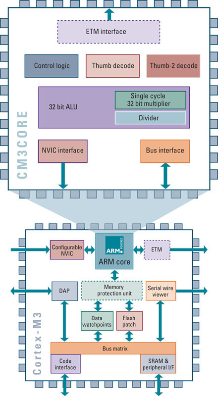

图 1.1：Cortex-M3 内核与基于 Cortex-M3 的微控制器之间的关系

ARM Holdings 是一家英国公司，为日本软银（Softbank）控股集团的子公司，负责开发 ARM 产品的指令集和架构，但不制造器件。这是 ARM 世界的一个重要特点，也是众多芯片制造商能够基于 ARM 架构和内核开发、生产并销售微控制器的原因。ST 微电子（ST Microelectronics）就是其中之一，目前也是少数销售完整 Cortex-M 处理器产品组合的制造商之一。

ARM Holdings 既不制造也不销售基于自身设计的 CPU 器件，而是将处理器架构授权给相关方。ARM 提供多种授权条款，在费用和交付物方面各不相同。在提及 Cortex-M 内核时，也常使用知识产权（IP）核这一说法，指的是被视为某一方（即 ARM Holdings）知识产权的芯片设计版图。

得益于这种商业模式以及低功耗能力、某些架构的低生产成本等重要特性，ARM 在数量上是最广泛使用的指令集架构。基于 ARM 的产品已变得极为流行。截至 2020 年，已生产超过 1600 亿颗 ARM 处理器。基于 ARM 的处理器装备了全球约 95% 的移动设备。许多主流且广受欢迎的 64 位多核 CPU，用于已成为电子行业标志性的设备（如 Apple 的 iPhone），都是基于 ARM 内核的。近年来，Apple 发布了 Apple M1，这是一款基于 ARMv8.5-A 架构的 ARM 片上系统（system on chip）（SoC），由 Apple 自行设计，作为其 Macintosh 计算机和 iPad Pro 平板电脑的中央处理器（CPU）和图形处理器（GPU）。

<!-- page: 34 -->

作为一种广泛采用的标准，有大量编译器和工具，以及操作系统（Linux 是 Cortex-A 处理器上最常用的操作系统）支持这些架构，为开发者提供了丰富的应用构建机会。

### 1.1.1 Cortex 和基于 Cortex-M 的处理器

ARM Cortex 是一组在嵌入式领域广受欢迎的 32/64 位架构和内核。Cortex 微控制器分为三个主要子系列：

- Cortex-A，其中 A 代表 Application（应用），是一系列为执行复杂计算任务的设备提供多种解决方案的处理器，例如承载丰富的操作系统（OS）平台（Linux 及其衍生系统 Android 最为常见），并支持多个软件应用。Cortex-A 内核装备了大多数移动设备（如手机和平板电脑）中的处理器。在这一市场细分中，我们可以找到多家芯片制造商，从销售目录产品的厂商（TI、Freescale 以及 STM 的 STM32MP1）到为其他被许可方生产处理器的厂商。在这一系列中最常见的内核中，有广受欢迎的 32 位 Cortex-A7 和 Cortex-A9 处理器（它们仍然常见于多款廉价单板计算机（SBC）上），以及最新的超高性能 64 位 Cortex-A77 和 Cortex-A78 内核。
- Cortex-M，其中 M 代表 eMbedded（嵌入式），是一系列可扩展、兼容、节能且易于使用的处理器，专为低成本嵌入式市场设计。Cortex-M 系列针对成本和功耗敏感的 MCU 进行了优化，适用于物联网、连接性、电机控制、智能计量、人机界面设备、汽车和工业控制系统、家用家电、消费电子产品和医疗器械等应用。在这一市场细分中，我们可以找到许多生产 Cortex-M 处理器的芯片制造商，ST Microelectronics 就是其中之一。
- Cortex-R，其中 R 代表 Real-Time（实时），是一系列为嵌入式系统提供高性能计算解决方案的处理器，在这些系统中，可靠性、高可用性、容错性、可维护性和确定性实时响应至关重要。Cortex-R 系列处理器提供快速且确定性的处理和高性能，同时满足苛刻的实时约束。它们将这些特性集成为性能、功耗和面积优化的封装，使其成为要求容错性的可靠系统中的可靠之选。

接下来的章节将介绍 Cortex-M 处理器的主要特性，尤其是从嵌入式开发者的角度来看。

#### 1.1.1.1 内核寄存器

与所有 RISC 架构一样，Cortex-M 处理器是加载/存储（load/store）型机器，它们仅对 CPU 寄存器执行操作，¹ 但有两类指令除外：加载和存储指令，用于在 CPU 寄存器和内存位置之间传输数据。

¹这并不完全正确，因为 ARMv6/7 架构中还有其他可以访问内存位置的指令，但就本讨论而言，最好将该句视为正确。

<!-- page: 35 -->

图 1.2 展示了 Cortex-M 内核寄存器。其中一些寄存器仅在 M3、M4 和 M7 等更高性能系列中可用。R0-R12 是通用寄存器（general-purpose register），可作为 ARM 指令的操作数。然而，某些通用寄存器可被编译器用作具有特殊功能的寄存器。R13 是堆栈指针（stack pointer）（SP）寄存器，也被称为分组的（banked）寄存器。这意味着该寄存器的内容会根据当前 CPU 模式（特权模式或非特权模式）而变化。此功能通常被实时操作系统（RTOS）用于执行上下文切换（context switching）。

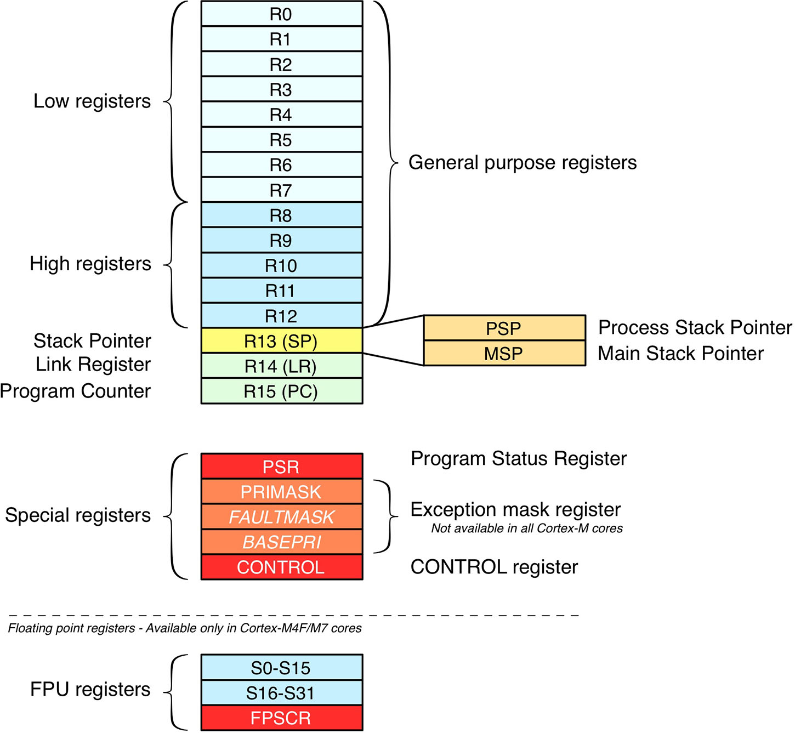

图 1.2：ARM Cortex-M 内核寄存器

例如，考虑以下使用局部变量 "a"、"b"、"c" 的 C 代码：

```text
...
uint8_t a,b,c;
a = 3;
b = 2;
c = a * b;
...
```

<!-- page: 36 -->

### 编译器将生成以下 ARM 汇编代码²：

```text
1
movs
r3, #3
;move "3" in register r3
2
strb
r3, [r7, #7] ;store the content of r3 in "a"
3
movs
r3, #2
;move "2" in register r3
4
strb
r3, [r7, #6] ;store the content of r3 in "b"
5
ldrb
r2, [r7, #7] ;load the content of "a" in r2
6
ldrb
r3, [r7, #6] ;load the content of "b" in r3
7
smulbb
r3, r2, r3
;multiply "a" with "b" and store result in r3
8
strb
r3, [r7, #5] ;store the result in "c"
```

我们可以看到，所有操作始终涉及一个寄存器。第 1-2 行的指令将数字 3 移入寄存器 r3，然后将其内容（即数字 3）存储到由寄存器 r7 加上 7 个内存位置偏移量所给出的内存位置中——这就是变量存储的位置。第 3-4 行对变量 b 执行相同的操作。然后，第 5-7 行加载变量 a 和 b 的内容并执行乘法运算。最后，第 8 行将结果存储在变量 c 的内存位置中。

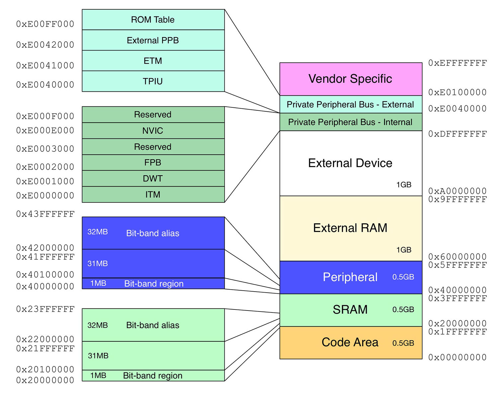

图 1.3：Cortex-M 固定内存地址空间

²该汇编代码是在 thumb 模式下编译生成的，且未启用任何优化，调用 GCC 的方式如下：$ arm-none-eabi-gcc -mcpu=cortex-m4 -mthumb -fverbose-asm -save-temps -O0 -g -c file.c

<!-- page: 37 -->

#### 1.1.1.2 内存映射

ARM 定义了一个标准化的内存地址空间，该空间为所有 Cortex-M 内核所共有，从而确保了代码在不同硅片制造商之间的可移植性。该地址空间宽度为 4GB，并划分为具有不同逻辑功能的若干子区域。图 1.3 展示了 Cortex-M 处理器的内存布局³。

前 512MB 专门用于代码区域。STM32 器件进一步将此区域划分为若干子区域，如图 1.4 所示。让我们简要介绍这些区域。

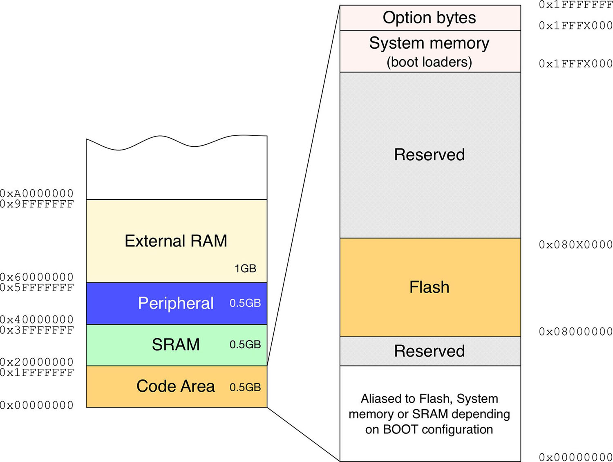

图 1.4：STM32 微控制器上代码区域的内存布局

所有 Cortex-M 处理器都将代码区域映射到起始地址 0x0000 0000⁴。该区域还包括指向堆栈起始位置的指针（通常放置在 SRAM 中）以及向量表，我们将在第 7 章中对此进行介绍。代码区域的位置在所有其他 Cortex-M 供应商之间是标准化的，尽管内核架构足够灵活，允许制造商以不同的方式安排该区域。事实上，对于所有 STM32 器件，从地址 0x0800 0000 开始的区域绑定到内部 MCU 闪存，程序代码就驻留在该区域。然而，得益于我们将在第 22 章中探讨的特定启动配置，该区域也从地址 0x0000 0000 进行别名映射。这意味着完全可以通过地址 0x0800 0000 和 0x0000 0000 来引用闪存的内容（例如，位于地址 0x0800

³虽然内存布局以及子区域的大小（因此也包括它们的地址）在所有 Cortex-M 内核之间是标准化的，但某些功能可能存在差异。例如，Cortex-M7 不提供位带区域，且私有外设总线区域中的某些外设有所不同。请务必查阅您所考虑架构的参考手册。⁴为了提高可读性，本书中所有 32 位地址均将高两个字节与低两个字节分开书写。因此，每当看到以这种方式表示的地址（0x0000 0000）时，您应将其解释为一个普通的 32 位地址（0x00000000）。此规则不适用于 C 和汇编源代码。

<!-- page: 38 -->

16DC 也可以从 0x0000 16DC 访问）。

最后两个部分专门用于系统内存和选项字节。前者是一个保留给引导加载程序（bootloader）的 ROM 区域。每个 STM32 系列（及其子系列——低密度、中密度等）都在生产过程中预编程了一个引导加载程序到芯片中。正如我们将在第 22 章中看到的，该引导加载程序可用于从多个外设加载代码，包括 USART、USB 和 CAN 总线。选项字节区域包含一系列位标志，可用于配置 MCU 的多个方面（如闪存读取保护、硬件看门狗、启动模式等），并且与特定的 STM32 微控制器相关。

回到整个 4GB 地址空间，下一个主要区域是绑定到内部 MCU SRAM 的区域。它从地址 0x2000 0000 开始，潜在地可以延伸到 0x3FFF FFFF。然而，实际的结束地址取决于内部 SRAM 的有效容量。例如，对于具有 20KB SRAM 的 STM32F103RB MCU，其最终地址为 0x2000 4FFF⁵。尝试访问该区域之外的位置将导致总线故障异常（Bus Fault exception）（稍后会有更多介绍）。

接下来的 0.5GB 内存专门用于外设映射。MCU 提供的每个外设（定时器、I²C 和 SPI 接口、USART 等）在该区域都有一个别名。具体由哪个 MCU 来组织此内存空间。

接下来的 2GB 区域专门用于外部 SRAM 或闪存。Cortex-M 器件可以通过 EMI/FSMC 接口从外部内存执行代码并加载/存储数据，从而扩展内部内存资源。一些 STM32 器件，如 STM32F7，能够借助 L1 缓存和 ARTTM 加速器，从外部内存执行代码而不会遇到性能瓶颈。

最后的 0.5 GB 内存分配给内部（内核）Cortex 处理器外设，以及为未来 Cortex 处理器增强功能保留的区域。所有 Cortex 处理器寄存器在所有基于 Cortex 的微控制器中都位于固定位置。这使得代码更容易在不同的 STM32 变体之间移植，实际上也可以移植到其他供应商的基于 Cortex 的微控制器。

#### 1.1.1.3 位带操作 (Bit-Banding)

在嵌入式应用中，使用位掩码（bit masking）处理字（word）中的单个位是非常常见的。例如，假设我们要设置或清除无符号字节（unsigned byte）的第 3 位（即 bit 2）。我们可以简单地使用以下 C 代码来实现：

```text
...
uint8_t temp = 0;
temp |= 0x4;
temp &= ~0x4;
...
```

当我们希望节省内存空间（使用单个变量并为其每一位赋予不同的含义）或者必须处理微控制器内部寄存器和外围设备时，会使用位掩码。

⁵最终地址的计算方式如下：20K 等于 20 * 1024 字节，在十六进制中为 0x5000。但由于地址从 0 开始，因此最终地址是 0x2000 0000 + 0x4FFF。

<!-- page: 39 -->

考虑上述 C 代码，我们可以看到编译器将生成以下 ARM 汇编代码⁶：

```text
#temp |= 0x4;
a:
79fb
ldrb
r3, [r7, #7]
c:
f043 0304
orr.w
r3, r3, #4
10:
71fb
strb
r3, [r7, #7]
#temp &= ~0x4;
12:
79fb
ldrb
r3, [r7, #7]
14:
f023 0304
bic.w
r3, r3, #4
18:
71fb
strb
r3, [r7, #7]
```

如我们所见，如此简单的操作需要三条汇编指令（取数、修改、保存）。这导致了两种类型的问题。首先，这三条指令造成了 CPU 周期的浪费。其次，如果 CPU 处于单任务模式且只有一个执行流，该代码工作正常；但如果我们处理的是并发执行，另一个任务（或仅仅是中断例程）可能会在我们完成“位掩码”操作之前影响内存内容（例如，在上述汇编代码中，中断发生在第 0xC-0x10 行或 0x14-0x18 行指令之间）。

位带操作（Bit-banding）是一种将给定内存区域的每一位映射到别名位带内存区域（aliased bit-banding memory region）中一个完整字（word）的能力，从而允许对该位进行原子访问。图 1.5 展示了 Cortex 内核如何将内存地址 0x2000 0000 的内容映射到位带区域 0x2200 0000-1c。例如，如果我们想要修改 0x2000 0000 内存位置（bit 2），我们只需访问 0x2200 0008 内存位置即可。

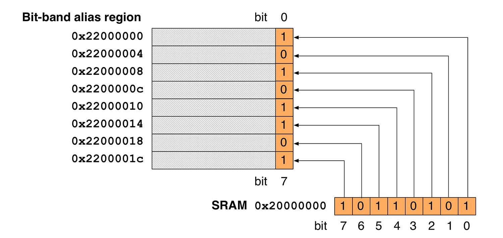

图 1.5：SRAM 地址 0x2000 0000 在位带区域中的内存映射（显示前 8 个 32 位字）

计算别名区域地址的公式如下：

```text
bit_band_address = alias_region_base + (region_base_offset x 32) + (bit_number x 4)
```

⁶该汇编代码是在 Thumb 模式下编译生成的，未启用任何优化，调用 GCC 的方式如下：$ arm-none-eabi-gcc -mcpu=cortex-m4 -mthumb -fverbose-asm -save-temps -O0 -g -c file.c

<!-- page: 40 -->

例如，考虑图 1.5 中的内存地址，要访问 bit 2：

```text
alias_region_base = 0x22000000
region_base_offset = 0x20000000 - 0x20000000 = 0
bit_band_address = 0x22000000 + 0*32 + (0x2 x 0x4) = 0x22000008
```

ARM 为基于 Cortex-M3/4 的微控制器定义了两个位带区域，每个区域宽 1MB，并映射到一个 32Mbit 的位带别名区域。别名内存区域中每个连续的 32 位字对应位带区域中每个连续的位（这解释了尺寸关系：1Mbit <-> 32Mbit）。第一个区域从 0x2000 0000 开始，到 0x200F FFFF 结束，并从 0x2200 0000 映射到 0x23FF FFFF。它专门用于 SRAM 内存位置的位访问。另一个位带区域从 0x4000 0000 开始，到 0x400F FFFF 结束，如图 1.6 所示。

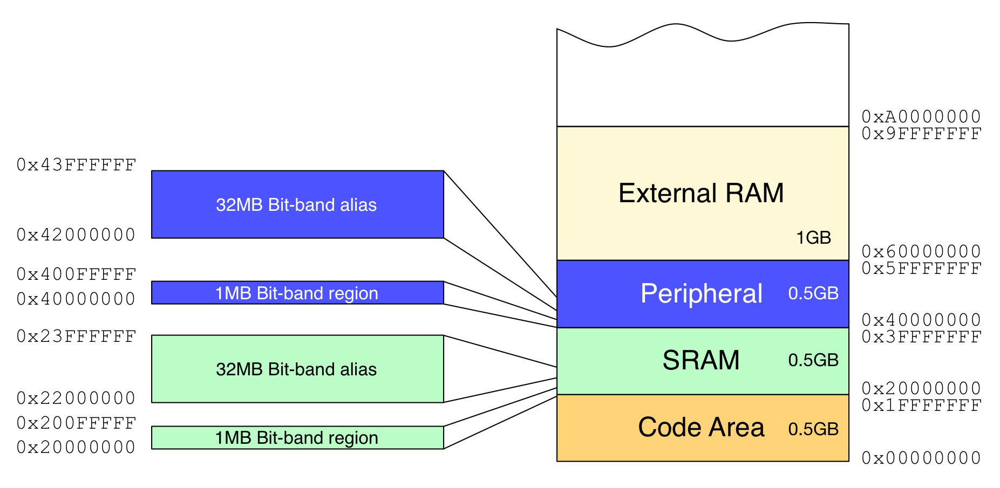

图 1.6：内存映射和位带区域

这个区域专门用于外围设备的内存映射。例如，ST 将 GPIOA 外围设备的 GPIO 输出数据寄存器（GPIO->ODR）映射到 0x4002 0014。这意味着地址 0x4002 0014 处的字的每一位都允许修改 GPIO 的输出状态（从低电平到高电平，反之亦然）。因此，如果我们想要修改 GPIOA 端口的 PIN5 的状态⁷，使用之前的公式，我们有：

```text
alias_region_base = 0x42000000
region_base_offset = 0x40020014 - 0x40000000 = 0x20014
bit_band_address = 0x42000000 + 0x20014*32 + (0x5 x 0x4) = 0x42400294
```

我们可以在 C 中定义两个宏，以便轻松计算位带别名地址：

⁷任何已经玩过 Nucleo 开发板的人都知道，用户 LED LD2（绿色那个）连接到该端口引脚。

<!-- page: 41 -->

```text
1
// Define base address of bit-band
2
#define BITBAND_SRAM_BASE 0x20000000
3
// Define base address of alias band
4
#define ALIAS_SRAM_BASE 0x22000000
5
// Convert SRAM address to alias region
6
#define BITBAND_SRAM(a,b) ((ALIAS_SRAM_BASE + ((uint32_t)&(a)-BITBAND_SRAM_BASE)*32 + (b*4)))
```

7

```text
8
// Define base address of peripheral bit-band
9
#define BITBAND_PERI_BASE 0x40000000
10
// Define base address of peripheral alias band
11
#define ALIAS_PERI_BASE 0x42000000
12
// Convert PERI address to alias region
13
#define BITBAND_PERI(a,b) ((ALIAS_PERI_BASE + ((uint32_t)a-BITBAND_PERI_BASE)*32 + (b*4)))
```

继续使用上面的例子，我们可以快速修改 GPIOA 端口 PIN5 的状态，如下所示：

```text
1
#define GPIOA_PERH_ADDR 0x40020000
2
#define ODR_ADDR_OFF
0x14
```

3

```text
4
uint32_t *GPIOA_ODR = GPIOA_PERH_ADDR + ODR_ADDR_OFF;
5
uint32_t *GPIOA_PIN5 = BITBAND_PERI(GPIOA_ODR, 5);
```

6

```text
7
*GPIOA_PIN5 = 0x1; // Turns GPIO HIGH
```

#### 1.1.1.4 Thumb-2 与内存对齐

从历史上看，ARM 处理器提供 32 位指令集。这不仅允许拥有丰富的指令集，而且保证了在执行涉及算术运算以及内核寄存器与 SRAM 之间内存传输的指令时获得最佳性能。然而，32 位指令集在固件的内存占用方面是有代价的。这意味着使用 32 位指令集架构（Instruction Set Architecture, ISA）编写的程序需要更多的闪存存储字节数，这会影响微控制器（MCU）的功耗和整体成本（硅晶圆价格昂贵，制造商不断缩小芯片尺寸以降低其成本）。

为了解决这些问题，ARM 引入了 Thumb 16 位指令集，它是常用 32 位指令集的一个子集。Thumb 指令每条长度为 16 位，并自动“转换”为对处理器模型具有相同效果的相应 32 位 ARM 指令。这意味着 16 位 Thumb 指令在实时情况下被透明地扩展（从开发者的角度来看）为完整的 32 位 ARM 指令，且没有性能损失。Thumb 代码的大小通常是 ARM 代码的 65%，并在从 16 位内存系统运行时提供后者 160% 的性能；然而，在 Thumb 中，16 位操作码的功能较少。例如，只有分支可以是条件性的，并且许多操作码被限制为只能访问 CPU 通用寄存器的一半。随后，ARM 引入了 Thumb-2 指令集，它是 16 位和 32 位指令

<!-- page: 42 -->

集在一种操作状态下的混合。Thumb-2 是一种可变长度指令集，与 Thumb 指令集相比提供了更多的指令，并实现了相似的代码密度。

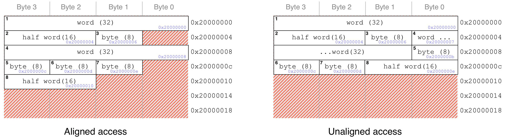

图 1.7：对齐内存访问与非对齐内存访问的区别

Cortex-M3/4/7 被设计为支持完整的 Thumb 和 Thumb-2 指令集，其中一些还支持专门用于浮点运算（Cortex-M4/7）和单指令多数据（SIMD）运算（也称为 NEON 指令）的其他指令集。

Cortex-M3/4/7 内核的另一个有趣特性是能够进行非对齐内存访问。基于 ARM 的 CPU 传统上能够访问字节（8 位）、半字（16 位）和字（32 位）的有符号和无符号变量，而不会像 8 位 MCU 架构那样增加汇编指令的数量。然而，早期的 ARM 架构无法执行非对齐内存访问，导致内存位置的浪费。

为了理解这个问题，请考虑图 1.7 中的左侧图表。这里有八个变量。内存对齐访问意味着，要访问字变量（图中的 1 和 4），我们需要访问 32 位（4 字节）的倍数地址。也就是说，字变量只能存储在 0x2000 0000、0x2000 0004、0x2000 0008 等位置。任何尝试访问不是 4 的倍数的位置都会导致 UsageFaults 异常。因此，以下 ARM 伪指令是不正确的：

```text
STR R2, 0x20000002
```

半字访问也是如此：可以访问存储在 2 字节倍数位置的内存位置：0x2000 0000、0x2000 0002、0x2000 0004 等。这种限制会导致 RAM 内存中的碎片化。为了解决这个问题，基于 Cortex-M3/4/7 的 MCU 能够执行非对齐内存访问，如图 1.7 中的右侧图表所示。我们可以看到，变量 4 从地址 0x2000 0007 开始存储（在早期 ARM 架构中，这仅对单字节变量是可能的）。这允许我们将变量 5 存储在内存位置 0x2000 000b，从而导致变量 8 存储在 0x2000 000e。内存现在被紧密打包，我们节省了 4 字节的 SRAM。

然而，非对齐访问仅限于以下 ARM 指令：

- LDR, LDRT
- LDRH, LDRHT
- LDRSH, LDRSHT

<!-- page: 43 -->

- STR, STRT
- STRH, STRHT

#### 1.1.1.5 流水线

每当我们要谈论指令执行时，我们都在做一系列非平凡的假设。在执行指令之前，CPU 必须从内存中获取并解码它。这个过程消耗几个 CPU 周期，具体取决于内存和内核 CPU 架构，这会增加到实际指令成本（即执行给定指令所需的周期数）中。

现代 CPU 引入了一种并行化这些操作的方法，以提高其指令吞吐量（单位时间内可以执行的指令数量）。基本指令周期被分解为一系列步骤，就好像指令沿着流水线行进一样。而不是按顺序处理每条指令（一次一条，在完成一条指令之前不开始下一条），每条指令被拆分为一系列阶段，以便不同的步骤可以并行执行。

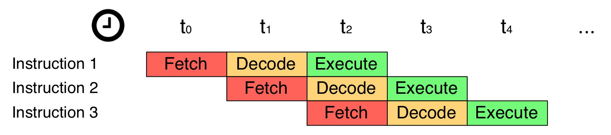

图 1.8：三级指令流水线

所有基于 Cortex-M 的微控制器都引入了某种形式的流水线。最常见的是三级流水线，如图 1.8 所示。Cortex-M0/3/4 支持三级流水线。专门用于低功耗 MCU 的 Cortex-M0+ 内核提供二级流水线（尽管流水线有助于减少与指令获取/解码/执行周期相关的时间成本，但它引入了必须在低功耗应用中最小化的能量成本）。Cortex-M7 内核提供六级流水线。

在处理流水线时，分支是一个需要解决的问题。程序执行的所有内容都是关于采取不同的路径；这是通过分支（如果相等则跳转）实现的。不幸的是，分支会导致流水线流失效，如图 1.9 所示。最后两条指令已被加载到流水线中，但由于选择了可选的分支路径而被丢弃（我们通常将它们称为分支阴影）

<!-- page: 44 -->

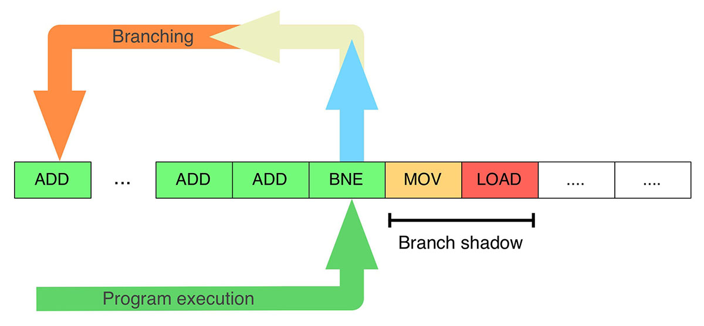

图 1.9：与流水线相关的程序执行中的分支

即使在这种情况下，也有几种技术可以最小化分支的影响。它们通常被称为分支预测技术。这些技术背后的想法是，CPU 开始获取和解码分支后的指令以及如果发生分支将到达的指令（在图 1.9 中，MOV 和 ADD 指令都是如此）。然而，还有其他实现分支预测方案的方法。如果你想深入了解这个主题，官方 ARM 支持论坛上的这篇文章⁸是一个很好的起点。

#### 1.1.1.6 中断与异常处理

中断和异常管理是基于 Cortex-M 处理器的最强大功能之一。中断和异常是改变程序流程的异步事件。当发生异常或中断时，CPU 会暂停当前任务的执行，保存其上下文（即堆栈指针），并开始执行一个专门用于处理该中断事件的例程。对于异常，该例程称为异常处理程序（Exception Handler）；对于中断，则称为中断服务例程（Interrupt Service Routine, ISR）。在异常或中断处理完成后，CPU 恢复之前的执行流程，之前的任务可以继续执行⁹。

⁸https://bit.ly/1k7ggh6 ⁹术语“任务”指的是一系列构成主执行流程的指令。如果我们的固件基于操作系统，场景可能会稍微复杂一些。此外，在低功耗睡眠模式下，CPU 可能被配置为在中断管理例程执行完毕后重新进入睡眠状态。我们将在后续章节中分析这些更复杂的场景。

<!-- page: 45 -->


表 1.1：Cortex-M 异常类型

在 ARM 架构中，中断是异常的一种类型。中断通常由片上外设（例如定时器）或外部输入（例如连接到 GPIO 的轻触开关）产生，在某些情况下也可以由软件触发。相反，异常与软件执行相关，CPU 本身也可以是异常的源。这些可能是故障事件，例如尝试访问无效的内存位置，或者是由操作系统（如果存在）生成的事件。

每个异常（因此也包括中断）都有一个唯一标识它的编号。表 1.1 显示了所有 Cortex-M 内核共有的预定义异常，以及与中断管理相关的可变数量的用户定义异常。该编号反映了异常处理例程在向量表中的位置，实际例程地址就存储在那里。例如，位置

<!-- page: 46 -->

# 15 包含 SysTick 中断的异常处理程序的代码区域的内存地址，该中断在 SysTick 定时器减至零时产生。

除了前三个异常外，每个异常都可以分配一个优先级级别，该级别定义了并发中断时的处理顺序：数字越小，优先级越高。例如，假设我们有两个与外部输入 A 和 B 相关的中断例程。我们可以为输入 A 分配较高的优先级（较小的数字）。如果在处理器正在处理来自输入 B 的中断时，与 A 相关的中断到达，则 B 的执行将被暂停，以便立即执行优先级较高的中断服务例程。

异常和中断都由一个称为嵌套向量中断控制器（Nested Vectored Interrupt Controller, NVIC）的专用单元处理。NVIC 具有以下特性：

- 灵活的异常和中断管理：NVIC 能够处理来自外设的中断信号/请求以及来自处理器内核的异常，允许我们在软件中启用/禁用它们（NMI¹⁰ 除外）。
- 嵌套异常/中断支持：NVIC 允许为异常和中断分配优先级级别（前三种异常类型除外），从而可以根据用户需求对中断进行分类。
- 向量化的异常/中断入口：NVIC 自动定位与异常/中断相关的异常处理程序的位置，无需额外代码。
- 中断屏蔽：开发人员可以自由地暂停所有异常处理程序（NMI 除外）的执行，或者基于优先级级别暂停其中一些，这得益于一组专用寄存器。这允许以安全的方式执行关键任务，而无需处理异步中断。
- 确定性的中断延迟：NVIC 的一个有趣特性是中断处理的确定性延迟，对于所有 Cortex-M3/4 内核为 12 个周期，对于 Cortex-M0 为 15 个周期，对于 Cortex-M0+ 为 16 个周期，无论处理器的当前状态如何。
- 异常处理程序的重定位：正如我们稍后在书中将看到的，异常处理程序可以重定位到其他闪存内存位置，甚至完全不同——甚至是外部的——非只读内存。这为高级应用提供了极大的灵活性。

#### 1.1.1.7 SysTimer

基于 Cortex-M 的处理器可以选择性地提供系统定时器，也称为 SysTick。好消息是所有 STM32 设备都提供了一个，如表 1.3 所示。SysTick 是一个 24 位递减计数器，用于为 FreeRTOS 等实时操作系统（RTOS）提供系统节拍。它用于生成周期性中断以调度任务。程序员可以通过设置其寄存器来定义 SysTick 定时器的更新频率。即使我们未使用 RTOS，SysTick 定时器也被 STM32 HAL 用于生成精确的延迟。有关此定时器的更多信息，请参见第 11 章。

¹⁰Reset 异常也不能被禁用，尽管谈论 Reset 异常的禁用是不恰当的，因为它是 MCU 复位后生成的第一个异常。正如我们将在第 7 章中看到的，Reset 异常是每个 STM32 应用程序的实际入口点。

<!-- page: 47 -->

#### 1.1.1.8 电源模式

当前电子行业，尤其是移动设备设计领域，主要趋势在于电源管理。将功耗降至最低是所有参与电池供电设备开发的硬件设计师和程序员的主要目标。Cortex-M 处理器提供多个级别的电源管理，可分为两大类：固有特性和用户定义的电源模式。

所谓固有特性，是指在设计 Cortex-M 内核（内核）和整个微控制器（MCU）时定义的与功耗相关的原生能力。例如，Cortex-M0+ 内核仅定义了两个流水线级，以减少指令预取期间的功耗。另一个与电源管理相关的原生行为是 Thumb-2 指令集的高代码密度，这使得开发人员可以选择具有较小闪存存储器的微控制器，从而降低功耗需求。

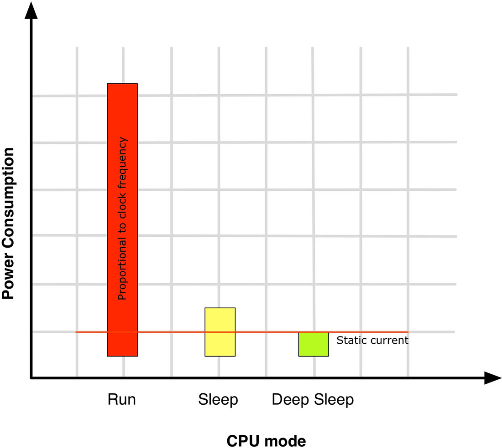

图 1.10：Cortex-M 在不同电源模式下的功耗

传统上，Cortex-M 处理器通过系统控制寄存器（System Control Register, SCR）提供用户定义的电源模式。第一种是运行模式（Run mode）（见图 1.10），此时 CPU 以全功能运行。在运行模式下，功耗取决于时钟频率和使用的外设。睡眠模式（Sleep mode）是可用于降低功耗的第一种低功耗模式。激活后，大多数功能被挂起，CPU 频率降低，其活动减少到唤醒所需的最小程度。在深度睡眠模式（Deep sleep mode）下，所有时钟信号停止，CPU 需要外部事件才能从该状态唤醒。

然而，这些电源模式只是通用模型，它们在实际的微控制器中进一步实现。例如，考虑图 1.11，它显示了 STM32F2 微控制器

<!-- page: 48 -->

在 80MHz @30°C¹¹ 下的功耗。我们可以看到，当 ARTTM 加速器禁用时，运行模式（Runmode）达到最大功耗。启用 ARTTM 加速器可以节省高达 10mAh 的电量，同时实现更好的计算性能。这清楚地表明，实际的微控制器实现可以引入不同的功耗级别。

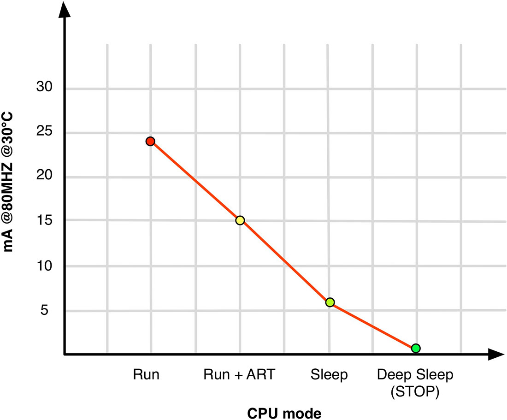

图 1.11：STM32F2 在不同电源模式下的功耗

STM32Lx 系列提供多个进一步的中间功耗级别，允许精确选择首选的电源模式，从而确定微控制器的性能和功耗。我们将在第 19 章中更深入地讨论这个话题。

#### 1.1.1.9 TrustZoneTM

ARM 最近推出了两款名为 Cortex-M23 和 Cortex-M33 的新 Cortex-M 处理器内核，两者均基于 ARMv8-M 架构。这些新内核继承了一个在大多数 Cortex-A 处理器中已经存在的特性：ARM TrustZoneTM。TrustZoneTM 是一个可选的安全扩展，旨在为广泛的嵌入式应用提供改进系统安全性的基础。TrustZoneTM 技术的概念并不新鲜。处理器可以运行在安全（Secure）和非安全（Non-secure）状态，非安全软件只能访问非安全内存区域。通过操作内存映射配置，可以定义内存地址空间中的区域，使得只有当处理器运行在安全模式时，才能访问该区域（无论是执行代码还是访问数据）。ARM TrustZoneTM 技术使系统和软件能够划分为安全世界（Secure world）和普通世界（Normal world）。安全软件可以访问安全和非安全内存以及硬件资源，而普通软件只能访问非安全内存和资源。这些安全状态与现有的线程模式（Thread mode）和处理程序模式（Handler mode）正交（后文将详细介绍这两种运行模式），从而允许在安全和非安全状态下都存在线程模式和处理程序模式。

¹¹来源 ST AN3430

<!-- page: 49 -->

ARM TrustZone 技术并不涵盖安全性的所有方面。例如，它不包括加密。在具有 TrustZoneTM 的 ARMv8-M 架构设计中，对系统安全至关重要的组件可以放置在安全世界中。例如，这些关键组件可能包括：

- 安全引导加载程序（Secure boot loader）
- 秘密密钥（Secret keys）
- 闪存编程支持（Flash programming support）
- 高价值资产（High value assets）

其余的应用程序通常放置在普通世界中。

#### 1.1.1.10 CMSIS

ARM 平台（无论是对于芯片供应商还是应用开发人员）的一个关键优势在于存在一套完整的开发工具（编译器、运行时库、调试器等），这些工具可以在多个供应商之间重用。

ARM 还在积极致力于在微控制器供应商之间标准化软件基础设施。Cortex 微控制器软件接口标准（Cortex Microcontroller Software Interface Standard, CMSIS）是 Cortex-M 处理器系列的供应商无关的硬件抽象层，并指定了调试器接口。CMSIS 由以下组件组成：

- CMSIS-CORE：Cortex-M 处理器内核和外设的 API。它为 Cortex-M0/0+/3/4/7/23/33 提供标准化接口。
- CMSIS-Driver：定义通用外设驱动程序接口，使中间件可以在受支持的设备之间重用。该 API 与实时操作系统（real-time operating system, RTOS）无关，并将微控制器外设连接到实现通信堆栈、文件系统或图形用户界面等功能的中间件。
- CMSIS-DSP：包含 60 多种函数的 DSP 库集合，适用于各种数据类型：定点（分数 q7, q15, q31）和单精度浮点（32 位）。该库可用于 Cortex-M0、Cortex-M3 和 Cortex-M4。Cortex-M4 实现针对 SIMD 指令集进行了优化。
- CMSIS-RTOS API：实时操作系统的通用 API。它提供标准化的编程接口，可移植到许多 RTOS，因此使软件模板、中间件、库和其他组件能够在受支持的 RTOS 系统之间工作。我们将在第 23 章中讨论这个 API 层。
- CMSIS-Pack：使用名为“PDSC”的基于 XML 的包描述文件，描述文件集合（即“软件包”）中与用户和设备相关的部分，该集合包括源文件、头文件、库文件、文档、闪存编程算法、源代码模板和示例项目。开发工具和 Web 基础设施使用 PDSC 文件提取设备参数、软件组件和评估板配置。

<!-- page: 50 -->

- CMSIS-SVD：外设的系统视图描述（System View Description, SVD）。在 XML 文件中描述设备的外设，可用于在调试器中创建外设感知，或创建包含外设寄存器和中断定义的头文件。
- CMSIS-DAP：调试访问端口（Debug Access Port）。连接至 CoreSight 调试访问端口的调试单元的标准固件。CMSIS-DAP 作为单独的包分发，非常适合集成在评估板上。
- CMSIS-NN：神经网络。由于最新 Cortex-M4/7 内核计算能力的提升，基于神经网络的解决方案即使在嵌入式机器学习应用中也越来越流行。CMSIS-NN 是一组高效的神经网络内核，旨在最大化 Cortex-M 处理器内核上神经网络的性能并最小化其内存占用。

然而，ARM 的这一举措正在自行演进，并且主要与 ARM Keil 工具链的演进相关。对 ST 所有组件的支持仍然局限于某些 API，我们将在后续章节中看到。官方 ST HAL 是开发 STM32 平台应用程序的主要方式，而不同系列的微控制器（MCU）之间存在许多特殊性。此外，很明显，芯片供应商的主要目标是留住客户，并避免他们迁移到其他 MCU 平台（即使基于相同的 ARM Cortex 内核）。因此，我们距离拥有一个完整且可移植的、适用于市场上所有基于 ARM 的 MCU 的层还相去甚远。

#### 1.1.1.11 在 STM32 产品组合中有效实现 Cortex-M 特性

前几段中介绍的一些特性是可选的，并且在特定的 MCU 中可能不可用。表 1.2 和 3 总结了 STM32 产品组合中可用的 Cortex-M 指令和组件。这些内容在选型 STM32 MCU 时可能很有用。

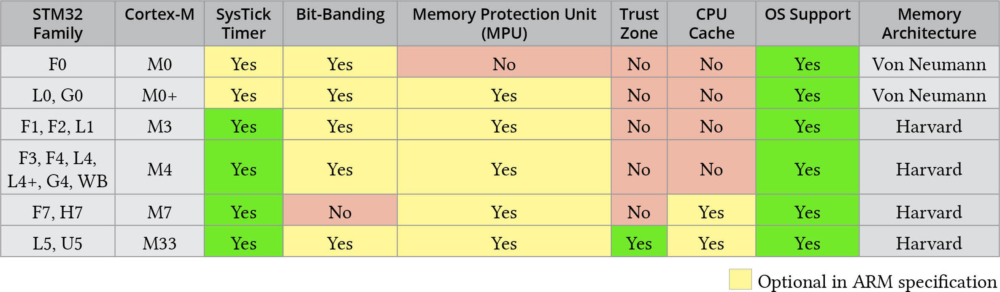

表 1.2：ARM Cortex-M 指令变体

<!-- page: 51 -->

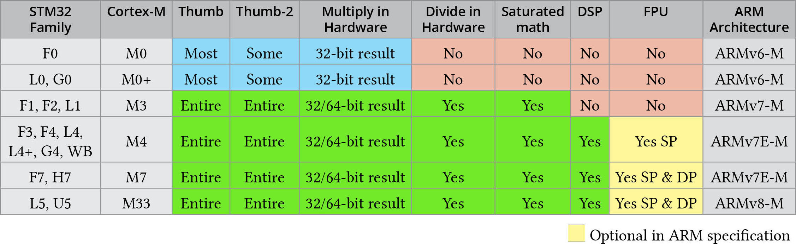

表 1.3：ARM Cortex-M 可选组件

## 1.2 STM32 微控制器简介

STM32 是一个广泛的微控制器系列，分为十七个子系列，每个子系列都有其独特的特性。ST 于 2007 年开始该系列的市场生产，从 STM32F1 系列开始，该系列目前仍在生产中。图 1.12 展示了 STM32F103 MCU 的内部芯片裸片（die），这是最广泛使用的 STM32 MCU 之一¹²。所有 STM32 微控制器都具有一个 Cortex-M 内核，以及一些独特的 ST 特性（如 ARTTM 加速器）。内部而言，每个微控制器由处理器内核、静态 RAM、闪存存储器、调试接口以及各种其他外设组成。一些 MCU 提供额外的内存类型（EEPROM、CCM 等），并且针对低功耗应用的整个设备产品线也在不断增长。

¹²这张图片取自 Zeptobars.ru，一个非常棒的博客。其作者通过酸蚀刻（decap，即去除保护外壳）集成电路，并发布芯片内部结构的图像。我喜欢这些图像，因为它们展示了人类在电子领域所能取得的成就。

<!-- page: 52 -->

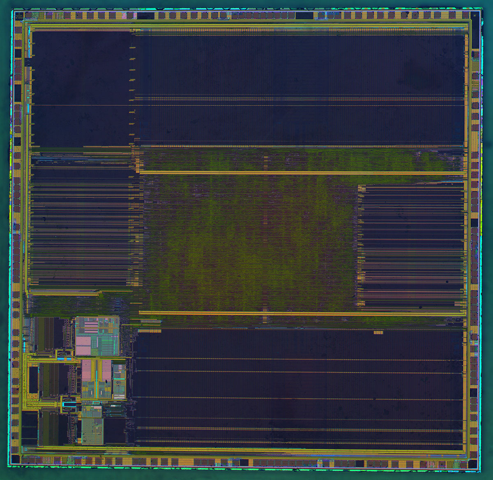

图 1.12：STM32F103 MCU 的内部芯片裸片

本章剩余的段落将向读者介绍 STM32 微控制器，并对所有 STM32 子系列进行完整的概述。

### 1.2.1 STM32 产品组合的优势……

STM32 平台为嵌入式开发人员提供了多项优势。本段试图总结其中相关的主要优势。

- 它们是基于 Cortex-M 的 MCU：对于刚接触该平台的人来说，这一点可能还不是很清楚。作为基于 Cortex-M 的微控制器，这确保了市场上有多种工具可用于开发您的应用程序。ARM 已成为嵌入式世界的一种标准（这在 Cortex-A 处理器中尤为真实；在 Cortex-M 市场细分中，仍有几个优秀的替代方案：PIC、MSP430 等），并且到 2020 年已售出 1600 亿台设备，这有力地证明了投资该平台是一个不错的选择。
- 免费的基于 ARM 的工具链：得益于基于 ARM 的处理器普及，可以使用完全免费的工具链进行工作，无需投入大量资金即可开始使用该平台，这对于爱好者或学生来说极其重要。
- 知识复用：STM32 是一个相当庞大的产品组合，基于一个共同点：其主要 CPU 平台。这确保了，例如，在

<!-- page: 53 -->

- 针对特定 STM32Fx CPU 工作时获得的知识可以轻松地应用于同一系列的其他设备。此外，使用 Cortex-M 处理器允许您在（或您的采购团队）决定切换到其他供应商的 Cortex-M MCU 时（理论上）复用大部分已获得的技能。
- 官方开发环境：近年来，ST 在构建完整的开发环境方面投入了大量精力。过去他们犯了很多错误，资助了几个最终一无所成的项目。CooCox IDE 和 SW4STM32 是 ST 之前试图支持开源社区为其微控制器构建完整工具链的两次尝试，但都以惨败告终。最终，ST 意识到这阻碍了很多人采用 STM32 产品组合，因此他们决定收购 Atollic，以便将其 TrueSTUDIO IDE 用作 STM32 微控制器系列的官方工具链。
- 引脚对引脚兼容性：大多数 STM32 MCU 旨在在庞大的 STM32 产品组合内实现引脚对引脚兼容。这在 LQFP64-100 封装中尤为真实，这是一个巨大的加分项。在初始选择适合您应用程序的正确微控制器时，您的责任将更小，因为您知道如果当前选择不符合您的需求，最终可以跳转到另一个系列。
- 5V 容忍：大多数 STM32 引脚具有 5V 容忍能力。这意味着您可以连接其他不提供 3.3V I/O 的设备，而无需使用电平转换器（除非速度是您应用程序的关键，电平转换器总会引入寄生电容，从而降低换向频率）。
- 32 美分换 32 位¹³：如果您希望从 8/16 位 MCU 迁移到一个强大且一致的平台，同时保持可比较的目标价格，STM32F0 是合适的选择。您可以使用实时操作系统来提升您的应用程序并编写更好的代码。
- 集成引导加载程序：STM32 MCU 出厂时带有集成引导加载程序，允许使用某些通信外设（USART、I²C 等）重新编程内部闪存存储器。对你们中的一些人来说，这可能不是一个杀手级特性，但它可以极大地简化专业设备开发人员的工作。

### 1.2.2 …及其缺点

本书不是宣传册，也不是由营销人员编写的文档。作者也不是 ST 的员工，或与 ST 有业务往来。因此，可以说该平台存在一些陷阱。

- 学习曲线：STM32 的学习曲线可能相当陡峭，尤其是对经验不足的用户而言。如果你完全新手于嵌入式开发，学习如何开发 STM32 应用的过程可能会令人沮丧。尽管 ST 在努力改善整体文档和官方库方面做得很好，但处理该平台仍然很困难，这很遗憾。历史上，ST 的文档对于经验不足的人来说并不是最好的，过于晦涩且缺乏清晰的示例。

¹³由于 2020 年代的硅片市场危机，这一口号不再有效。IC 行业的疯狂状况导致低成本 IC（受影响最大的部分）价格上涨超过 25%。然而，祸不单行，对于低成本应用，STM32F0 系列仍然是一个值得评估的系列，除非 8 位解决方案适合你。

<!-- page: 54 -->

- 文档碎片化且分散：ST 正在积极改进 STM32 平台的官方文档。你可以在 ST 网站上找到许多巨大的数据手册，但对于其 HAL 来说，仍然缺乏良好的文档。CubeHAL 的近期版本提供了一或多个“CHM”文件¹⁴，这些文件是从 CubeHAL 源代码中的文档自动生成的。然而，这些文件不足以开始使用该框架进行编程，尤其是如果你对 STM32 生态系统和 Cortex-M 世界是新手。
- 存在缺陷且性能不佳的 HAL：坦率地说，ST 的官方 HAL 多年来有了很大改进，但它仍在演变中，并且在 HAL 的高级和较少普及的模块中，发现一些严重缺陷是很常见的，就像作者在使用 HAL_PCD 模块时遇到的情况一样（我花了两个月时间识别出一个影响 STM32L052 MCU 上 USB HAL 库的棘手缺陷）。ST 正在积极修复 HAL 缺陷，但似乎距离“稳定版本”还很远。此外，他们的软件发布生命周期过于陈旧，不适合我们生活的时代：缺陷修复在几个月后发布，有时修复本身带来的问题比损坏的代码更多。最后，CubeHAL 远不能被认为是一个优化的库。HAL 被设计为从底层家族和特定 MCU 中抽象出来，这要求 HAL 例程充满 if-then-else 语句。对于时间关键型应用，ST 发布了 CubeHAL-LL 库，这本质上是一组宏，用于简化外设寄存器的操作。再次提醒，你是飞行员，你必须驾驭所有这些工具。

## 1.3 STM32 子系列概览


如果你是 STM32 世界的新手，并且已经拥有一个 STM32 开发套件或一个你迫不及待想要开始使用的定制设备，那么你可以安全地跳过这段长（且相当枯燥 :-) ）的文字，直接跳到下一段。

正如你所读到的，STM32 是一个相当复杂的产品系列，涵盖十七个产品子系列。图 1.13 总结了当前的 STM32 产品组合。图表将子系列聚合为四个宏观组：高性能、主流、超低功耗和无线 MCU。

高性能微控制器是那些专为 CPU 密集型和多媒体应用设计的 STM32 MCU。它们是基于 Cortex-M3/4F/7 的 MCU，最大时钟频率范围从 120MHz (F2) 到 550MHz (H7)。该组中的一些 MCU 提供 ARTTM 加速器，这是一种 ST 技术，允许从闪存内存中执行 0 等待。

¹⁴CHM 文件是一种典型的 Microsoft 文件格式，用于将 HTML 格式的文档分发在单个文件中。它在 Windows 操作系统上非常常见，你可以在 MacOS 和 Linux 上找到几个好的免费工具来阅读它们。

<!-- page: 55 -->

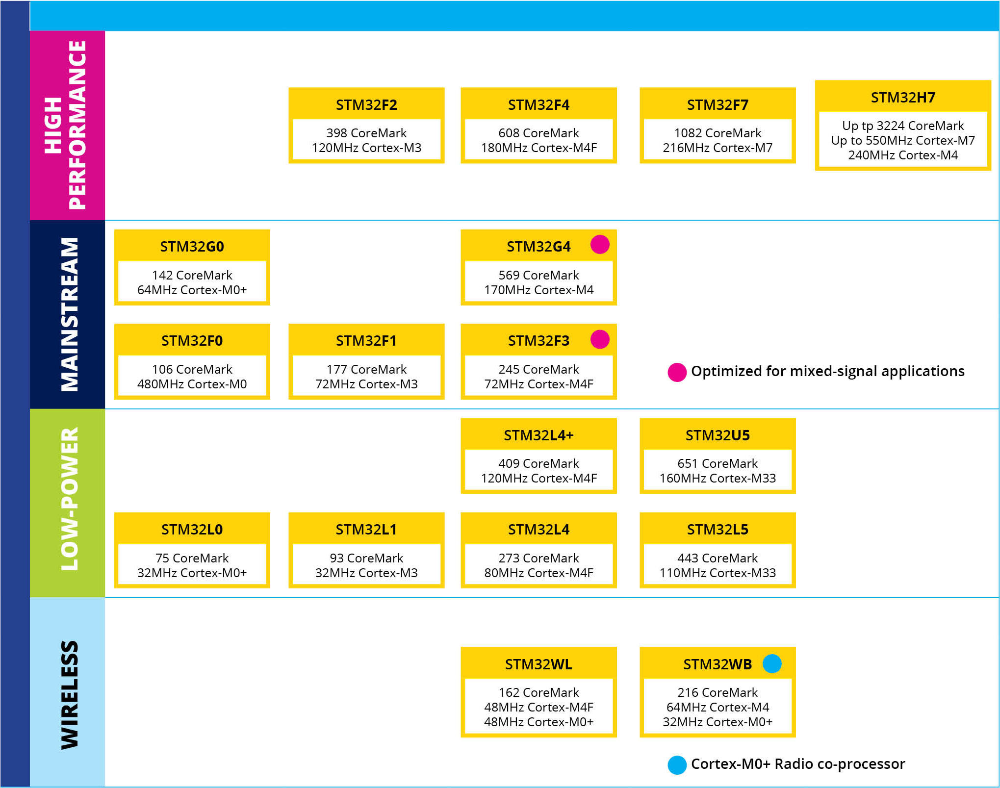

图 1.13：STM32 产品组合

主流 MCU 是为成本敏感型应用开发的，其中 MCU 的成本必须低于 1 美元/件，且空间是一个强约束。在该组中，我们可以找到基于 Cortex-M0/0+/3/4 的 MCU，最大时钟频率范围从 48MHz (F0) 到超过 170MHz (G4)。

超低功耗组包含那些针对低功耗应用的 STM32 MCU 家族，用于需要降低总功耗以确保更长电池寿命的电池供电设备。在该组中，我们可以找到基于 Cortex-M0+ 的 MCU，用于成本敏感型应用，以及基于 Cortex-M4F 的微控制器，具有动态电压缩放 (DVS)，这是一种允许根据频率优化内部 CPU 电压的技术。此外，ST 最近在该类别中也引入了具有新 Cortex-M33 内核的 MCU，专为安全是强约束的应用设计。该组的 MCU 范围从 32MHz Cortex-M0+ 到 160MHz Cortex-M33。

无线 MCU 是全新的双核 STM32 微控制器系列，专为无线连接设计。它们覆盖 Sub-GHz 以及 2.4GHz 频率范围操作。它们易于使用、可靠，并完美适用于广泛的工业和消费应用。这些

<!-- page: 56 -->

MCU 具有一个名为网络处理器 (Network Processor) 的 Cortex-M0+ 内核，专门用于无线电管理，以及一个名为应用处理器 (Application Processor) 的用户可编程 Cortex-M4 内核，用于主嵌入式应用。STM32Wx 解决方案兼容多种协议，从点对点和网状网络到广域网。

以下段落简要描述了每个 STM32 家族，介绍了其主要特性。最重要的特性将在表格中总结。表格由本书作者根据 ST 官方文档的灵感整理而成。

### 1.3.1 F0

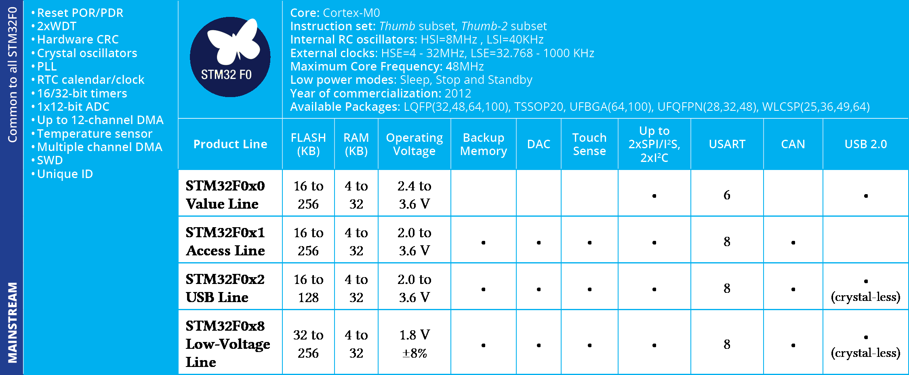

表 1.4：STM32F0 特性

STM32F0 系列是 STM32 产品组合中性价比最高的微控制器（MCU）系列。其设计目标是以能够与其他厂商的 8/16 位 MCU 竞争的市场价格，提供一个更先进、更强大的平台。该系列最重要的特性包括：

- 内核：

- – 最高时钟频率为 48 MHz 的 ARM Cortex-M0 内核。 – Cortex-M0 选项包括 SysTick 定时器。
- 存储器：

- – 4 到 32 KB 的静态 RAM。 – 16 到 256 KB 的 Flash。 – 每颗芯片都有一个出厂预编程的 96 位唯一设备标识号。
- 外设：

– 每个 F0 系列器件都具备一系列外设，具体因产品线而异（快速概览请参见表 1.4）。

<!-- page: 57 -->

- 振荡器源包括内部 RC（8 MHz，40 kHz），可选外部 HSE（4 到 32 MHz），LSE（32.768 到 1000 kHz）。
- IC 封装：LQFP，TSSOP20¹⁵，UFBGA，UFQFPN，WLCSP（更多详情请参见表 1.4）。
- 工作电压范围为 2.0V 到 3.6V，最低可降至 1.8V ±8%。

### 1.3.2 F1

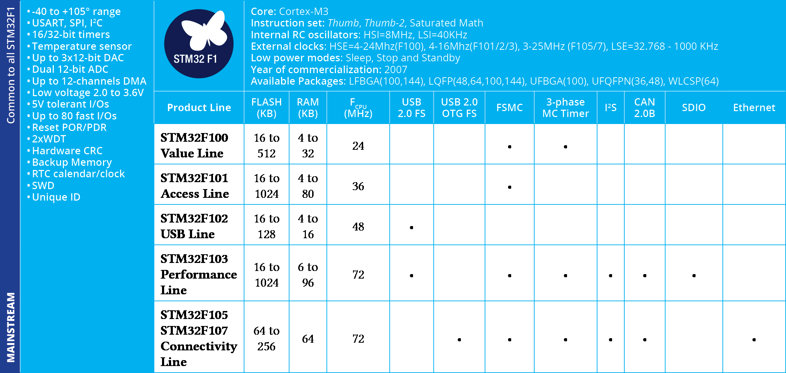

表 1.5：STM32F1 特性

STM32F1 系列是 ST 推出的首款基于 ARM 的 MCU。该系列于 2007 年推向市场，至今仍是 STM32 产品组合中应用最广泛的 MCU。市场上有大量由 ST 和其他厂商生产的开发板，网络上也有大量关于 F1 微控制器的示例。如果您是 STM32 领域的新手，F1 系列可能是开始学习该平台的最佳选择。F1 系列随着时间推移不断演进，提升了速度、内部存储器容量以及外设多样性。F1 系列包含五个产品线：连接型（STM32F105/107）、高性能型（STM32F103）、USB 访问型（STM32F102）、访问型（STM32F101）、价值型（STM32F100）。该系列最重要的特性包括：

- 内核：

- – 最高时钟频率在 24 到 72 MHz 之间变化的 ARM Cortex-M3 内核。
- 存储器：

– 4 到 96 KB 的静态 RAM。 – 16 到 256 KB 的 Flash。 – 每颗芯片都有一个出厂预编程的 96 位唯一设备标识号。

¹⁵F0/G0/L0 是仅有的提供这种便捷封装的 STM32 系列。

<!-- page: 58 -->

- 外设：

- – 每个 F1 系列器件都具备一系列外设，具体因产品线而异（快速概览请参见表 1.5）。
- 振荡器源包括内部 RC（8 MHz，40 kHz），可选外部 HSE（F100 为 4-24MHz，F101/2/3 为 4-16MHz，F105/7 为 3-25MHz），LSE（32.768 - 1000 kHz）。
- IC 封装：LFBGA，LQFP，UFBGA，UFQFPN，WLCSP（更多详情请参见表 1.5）。
- 工作电压范围为 2.0V 到 3.6V
- 多种连接选项，包括以太网、CAN 和 USB 2.0 OTG。

### 1.3.3 F2

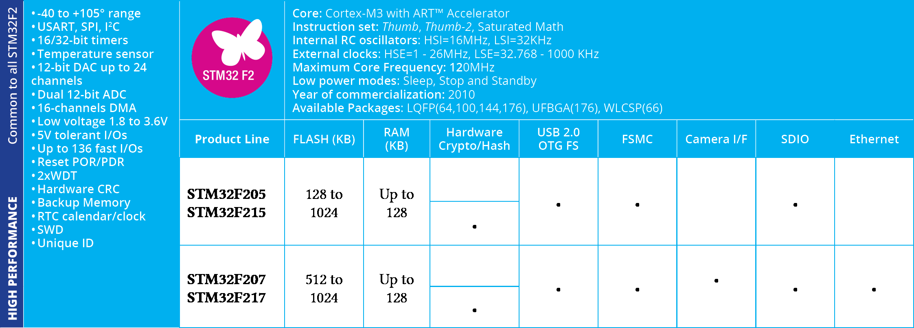

表 1.6：STM32F2 特性

STM32F2 系列微控制器是高性能细分市场中具有成本效益的解决方案。它是 STM32 产品组合中最新且最快的基于 Cortex-M3 的 MCU，并独家搭载了 ST 的 ARTTM 加速器。F2 与 STM32 F4 系列引脚兼容。

该系列最重要的特性包括：

- 内核：

- – 最高时钟频率为 120 MHz 的 ARM Cortex-M3 内核。
- 存储器：

– 64 到 128 KB 的静态 RAM。

- * 4 KB 电池备份 RAM，80 字节带篡改检测擦除功能的电池备份 RAM。 – 128 到 1024 KB 的 Flash。 – 每颗芯片都有一个出厂预编程的 96 位唯一设备标识号。
- 外设：

- – 每个 F2 系列器件都具备一系列外设，具体因产品线而异（快速概览请参见表 1.6）。
- 振荡器包括内部 RC（16 MHz，32 kHz），可选外部 HSE（1 到 26 MHz），LSE（32.768 到 1000 kHz）。
- IC 封装：BGA，LQFP，UFBGA，WLCSP（更多详情请参见表 1.6）。
- 工作电压范围为 1.8V 到 3.6V。

<!-- page: 59 -->

### 1.3.4 F3

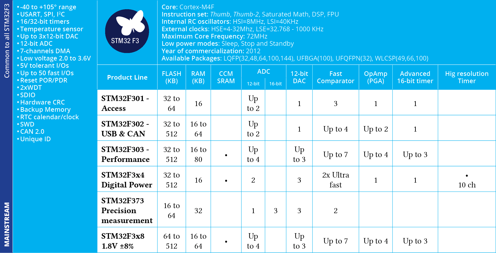

表 1.7：STM32F3 特性

STM32F3 基于 ARM Cortex-M4F 内核，是专门用于混合信号应用的两个系列之一。其设计旨在与 STM32 F1 系列几乎引脚兼容，尽管它不提供相同种类的外设。Sphero¹⁷ 的 BB-8 机器人¹⁶ 玩具开发者选择了 STM32F3 作为其 MCU。

该系列的显著特性是集成模拟外设的存在，这降低了应用层面的成本并简化了应用设计，包括：

- 超快速比较器（25 ns）。
- 可编程增益运算放大器。
- 12 位 DAC。
- 超快速 12 位 ADC，每通道 5 MSPS（百万样本每秒）（在交错模式下最高可达 18 MSPS）。
- 精确的 16 位 sigma-delta ADC（21 通道）。
- 144 MHz 高级 16 位脉宽调制定时器（分辨率 < 7 ns），用于控制应用；高分辨率定时器（217 皮秒），针对电源和温度漂移进行自补偿。

该系列的另一个有趣特性是核心耦合存储器（CCM）的存在，这是一种特定的存储器架构，将某些存储器区域与 CPU 内核耦合，从而实现 0 等待状态。

¹⁶http://cnet.co/1M2NyJS ¹⁷http://www.sphero.com/

<!-- page: 60 -->

这可用于加速时间关键例程，性能提升最高可达 40%。例如，可以将用于上下文切换的操作系统例程存储在此区域，以加快实时操作系统（RTOS）的活动。该系列最重要的特性包括：


图 1.14：使用 STM32F3 MCU 制作的 BB-8 机器人

- 内核：

- – 最高时钟频率为 72 MHz 的 ARM Cortex-M4F 内核。
- 存储器：

– 16 到 80 KB 带硬件奇偶校验的通用静态 RAM。

- * 64 / 128 字节带篡改检测擦除功能的电池备份 RAM。 – 最高 8 KB 带硬件奇偶校验的核心耦合存储器（CCM）。 – 32 到 512 KB 的 Flash。 – 每颗芯片都有一个出厂预编程的 96 位唯一设备标识号。
- 外设：

- – 每个 F3 系列器件都具备一系列外设，具体因产品线而异（快速概览请参见表 1.7）。
- 振荡器包括内部 RC（8 MHz，40 kHz），可选外部 HSE（4 到 32 MHz），LSE（32.768 到 1000 kHz）。
- IC 封装：LQFP，UFBGA，UFQFPN，WLCSP（更多详情请参见表 1.7）。工作电压范围为 1.8V ±8% 到 3.6V。

<!-- page: 61 -->

### 1.3.5 F4

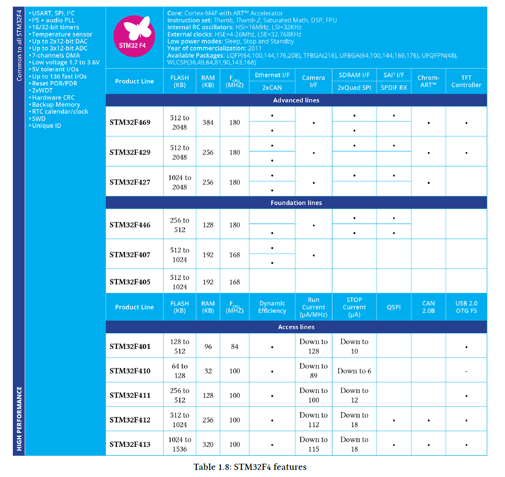

表 1.8：STM32F4 特性

STM32F4 系列是高性能领域中基于 Cortex-M4F 内核的微控制器（MCU）中应用最广泛的系列。F4 系列也是首个具备 DSP 和浮点 SP 指令的 STM32 系列。F4 与 STM32 F2 系列引脚兼容，并增加了更高的时钟速度、64K CCM 静态 RAM、全双工 I²S、改进的实时时钟以及更快的 ADC。STM32F4 系列还面向多媒体应用，部分 MCU 提供对 LCD-TFT 的专用支持，以及通过灵活存储器控制器（FMC）和双模式 Quad-SPI 接口扩展的存储器。该系列最重要的特性包括：

<!-- page: 62 -->

- 内核：

- – 最高时钟频率在 84 至 180 MHz 之间变化的 ARM Cortex-M4F 内核。
- 存储器：

– 128 至 384 KB 的静态 RAM。

- * 4 KB 电池备份 RAM，以及 80 字节带篡改检测擦除功能的电池备份 RAM。 – 64 KB 内核耦合存储器（CCM）。 – 256 至 2048 KB 的 Flash。 – 通过灵活存储器控制器（FMC）和双模式 Quad-SPI 接口轻松扩展的存储器范围。FMC 以 90 MHz 运行，具有 32 位并行接口，支持 Compact Flash、SRAM、PSRAM、NOR、NAND 和 SDRAM 存储器。以 90 MHz 运行的双模式 Quad-SPI 实现了具有成本效益的 NOR Flash，并支持内存映射模式。 – 每个芯片都有一个出厂编程的 96 位唯一设备标识号。
- 外设：

- – 每个 F4 系列器件都具备一系列外设，具体因产品线而异（快速概览见表 1.8）。
- 振荡器包括内部 RC（16 MHz，32 kHz），可选外部 HSE（4 至 26 MHz），LSE（32.768 至 1000 kHz）。
- IC 封装：BGA、LQFP、TFBGA、UFBGA、UFQFPN、WLCSP（更多详情见表 1.8）。
- 工作电压范围为 1.8V 至 3.6V。

<!-- page: 63 -->

### 1.3.6 F7

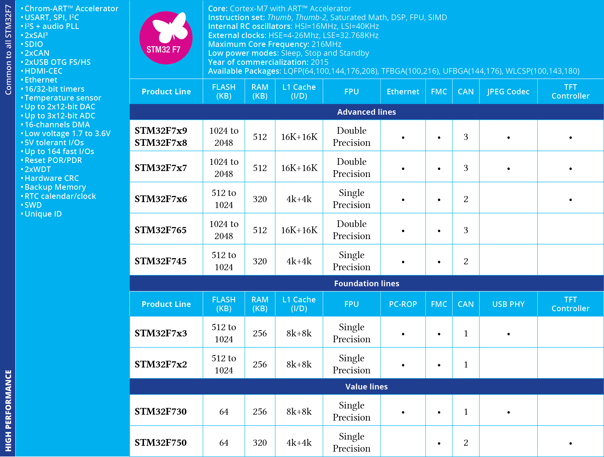

表 1.9：STM32F7 特性

STM32F7 系列是高性能领域中最新的超高性能微控制器，也是市场上首款基于 Cortex-M7 内核的 MCU。得益于 ST 的 ARTTM 加速器以及 L1 缓存，无论代码是从嵌入式 Flash 还是外部存储器执行，STM32F7 器件都能提供 Cortex-M7 的最大理论性能：在 216 MHz 下达到 1082 CoreMark/462 DMIPS。STM32F7 明确面向重型多媒体嵌入式应用。得益于 STM32 长期供货计划（10 年），开发人员可以在不担心未来 MCU 市场供应的情况下开发强大的嵌入式应用。Cortex-M7 向后兼容 Cortex-M4 指令集，且 STM32F7 系列与 STM32F4 系列引脚兼容。

该系列最重要的特性包括：

- 内核：

– 最高时钟频率为 216 MHz 的 ARM Cortex-M7 内核。

<!-- page: 64 -->

- 存储器：

– 具有分散架构的静态 RAM：

- * 最多 512 Kbytes 的通用数据存储器，包括最多 128 Kbytes 的数据紧密耦合存储器（DTCM），用于时间关键数据处理（堆栈、堆…） * 16 Kbytes 的指令紧密耦合存储器（ITCM），用于时间关键例程 * 4 Kbytes 的备份 SRAM，用于在最低功耗模式下保持数据 – L1 缓存（I/D 最多 16 KB + 16 KB）。 – 512 至 2048 KB 的 Flash。 – 通过灵活存储器控制器（FMC）和双模式 Quad-SPI 接口轻松扩展的存储器范围。FMC 以 90 MHz 运行，具有 32 位并行接口，支持 Compact Flash、SRAM、PSRAM、NOR、NAND 和 SDRAM 存储器。以 90 MHz 运行的双模式 Quad-SPI 实现了具有成本效益的 NOR Flash，并支持内存映射模式。 – 两个通用直接存储器访问（DMA）控制器，以及用于以太网（部分变体）、高速 USB On-The-Go 接口和 Chrom-ARTTM 图形加速器（部分变体）的专用 DMA 控制器 – 外设速度独立于 CPU 速度（支持双时钟），允许更改系统时钟而不影响外设操作 – 部分变体具备受保护代码执行功能（PC-ROP） – 部分变体具备片上 USB 高速 PHY – 每个芯片都有一个出厂编程的 96 位唯一设备标识号。
- 外设：

- – 每个 F7 系列器件都具备一系列外设，具体因产品线而异（快速概览见表 1.9）。
- 振荡器包括内部 RC（16 MHz，32 kHz），可选外部 HSE（4 至 26 MHz），LSE（32.768 至 1000 kHz）。
- IC 封装：LQFP、TFBGA、UFBGA、WLCSP（更多详情见表 1.9）。
- 工作电压范围为 1.7V 至 3.6V。

<!-- page: 65 -->

### 1.3.7 H7

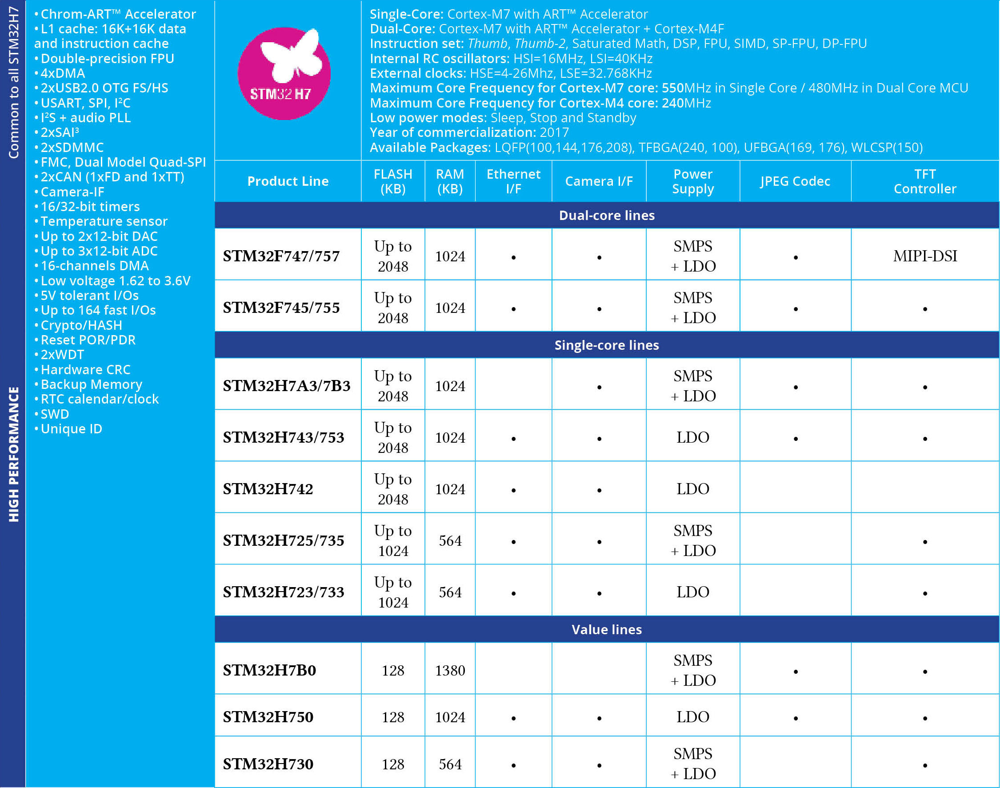

表 1.10：STM32H7 特性

ST 于 2017 年向市场推出了这一系列单核 Cortex-M7 以及双核 Cortex-M7 和 Cortex-M4 微控制器，采用 40nm 工艺制造，单核 MCU 最高运行频率可达 550MHz。它还提供了最多 1MB SRAM，具有与 STM32F7 系列相同的分散架构。

该系列最重要的特性包括：

- 内核：

- – 单核 MCU 的最高时钟频率为 550 MHz 的 ARM Cortex-M7 内核，以及双核 MCU 中最高时钟频率为 480 MHz 的 ARM Cortex-M7 内核加上最高时钟频率为 240 MHz 的 ARM Cortex-M4 内核。
- 存储器：

– 具有分散架构的静态 RAM，最多 1024 KB：

<!-- page: 66 -->

- * 192 Kbytes 的 TCM RAM（包括 64 Kbytes ITCM RAM 和 128 Kbytes DTCM RAM，用于时间关键例程和数据），512 Kbytes、288 Kbytes 和 64 Kbytes 的用户 SRAM，以及 4 Kbytes 位于备份域的 SRAM，用于在最低功耗模式下保持数据 – L1 缓存（I/D 最多 16 KB + 16 KB）。 – 512 至 2048 KB 的 Flash。 – 通过灵活存储器控制器（FMC）和双模式 Quad-SPI 接口轻松扩展的存储器范围。FMC 以 90 MHz 运行，具有 32 位并行接口，支持 Compact Flash、SRAM、PSRAM、NOR、NAND 和 SDRAM 存储器。以 90 MHz 运行的双模式 Quad-SPI 实现了具有成本效益的 NOR Flash，并支持内存映射模式。 – 一个高速主直接存储器访问（MDMA）控制器，两个具有 FIFO 和请求路由器功能的双端口 DMA，用于最佳外设管理，以及一个额外的 DMA – Chrom-ART Accelerator™用于高效的 2D 图像复制，以及双精度 FPU 也是可用加速功能的一部分。某些器件还提供用于驱动高分辨率显示屏的 MIPI-DSI 物理层。 – 得益于双时钟支持，外设速度独立于 CPU 速度，允许更改系统时钟而不影响外设操作 – 更多外设，例如四个支持 SPDIF 输出的串行音频接口（SAI），三个全双工 I²S 接口，一个支持四个输入的 SPDIF 输入接口，两个具有专用电源的 USB OTG 和双模式 Quad-SPI 接口，两个 FD-CAN 控制器，一个高分辨率定时器，一个 TFT-LCD 控制器，一个 JPEG 编解码器，两个 SDIO 接口以及许多其他模拟外设，包括三个快速 16 位 ADC、两个比较器和两个运算放大器。 – 安全固件安装和安全启动 – 安全固件升级允许用户以安全方式执行器件的初始编程，或执行代码的安全现场升级。 – 每个芯片都有一个出厂编程的 96 位唯一设备标识号。
- 外设：

- – 多个新外设，例如 14 位 ADC 和一个新的 SAI。
- IC 封装：LQFP、TFBGA、UFBGA、WLCSP
- 与 STM32F7 系列引脚兼容。

本书不涵盖 STM32H7 系列。

<!-- page: 67 -->

### 1.3.8 L0

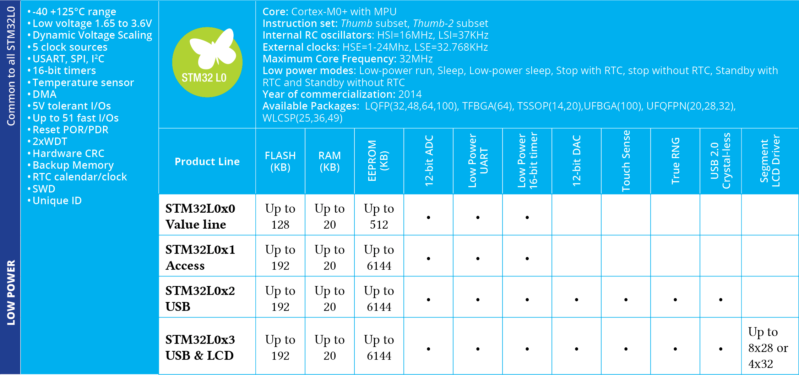

表 1.11：STM32L0 特性

STM32L0 系列是超低功耗领域的经济型解决方案。ARM Cortex-M0+ 内核与超低功耗特性的结合，使 STM32L0 成为电池供电或能量收集供电应用的最佳选择，在 125°C 下提供全球最低的功耗。STM32L0 提供动态电压调节、超低功耗时钟振荡器、LCD 接口、比较器、DAC 和硬件加密。电流消耗参考值：

- 动态运行模式：低至 49μA/MHz。
- 超低功耗模式 + 完整 RAM + 低功耗定时器：340 nA（16 条唤醒线）。
- 超低功耗模式 + 备份寄存器：230 nA（3 条唤醒线）。
- 唤醒时间：3.5 µs。

该系列最重要的特性包括：

- 内核：

- – 最高时钟频率为 32 MHz 的 ARM Cortex-M0+ 内核。
- 存储器：

– 静态 RAM 最大 20 KB。

* 20 字节电池备份，具有防篡改检测擦除功能。 – Flash 从 32 到 192 KB。 – EEPROM 最大 6 KB（带 ECC）。 – 每颗芯片都有一个出厂编程的 96 位唯一设备标识号。

<!-- page: 68 -->

- 外设：

- – 每个 L0 系列都具有一组外设，具体因产品线而异（详见表 1.11 以获取快速概览）。
- 振荡器包括内部 RC（16 MHz, 37 kHz），可选外部 HSE（1 到 24 MHz），LSE（32.768kHz）。
- IC 封装为 LQFP, TFBGA, UFQFPN, WLCSP（详见表 1.11 以获取更多相关信息）。
- 工作电压范围为 1.65V 到 3.6V。

### 1.3.9 L1

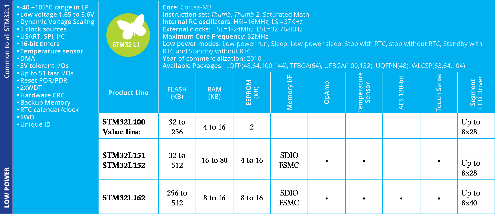

表 1.12：STM32L1 特性

STM32L1 系列是超低功耗领域的中端解决方案。ARM Cortex-M3 内核（带 FPU）与超低功耗特性的结合，使 STM32L1 成为既需要电池供电又需要足够计算能力的应用的最佳选择。与 L0 系列一样，STM32L1 提供动态电压调节、超低功耗时钟振荡器、LCD 接口、比较器、DAC 和硬件加密。电流消耗参考值：

- 超低功耗模式：带备份寄存器时为 280 nA（3 个唤醒引脚）
- 超低功耗模式 + RTC：带备份寄存器时为 900 nA（3 个唤醒引脚）
- 低功耗运行模式：低至 9 μA
- 动态运行模式：低至 177 μA/MHz

STM32L1 与 STM32F 系列中的多个 MCU 引脚兼容。该系列最重要的特性包括：

- 内核：

<!-- page: 69 -->

- – 最高时钟频率为 32 MHz 的带 FPU 的 ARM Cortex-M3 内核。
- 存储器： – 静态 RAM 从 4 到 80 KB。

- * 20 字节电池备份，具有防篡改检测擦除功能。 – Flash 从 32 到 512 KB。 – EEPROM 最大 2 KB（带 ECC）。 – 每颗芯片都有一个出厂编程的 96 位唯一设备标识号。
- 外设： – 每个 L1 系列器件都具有一组外设，具体因产品线而异（详见表 1.12 以获取快速概览）。
- 振荡器包括内部 RC（16 MHz, 37 kHz），可选外部 HSE（1 到 24 MHz），LSE（32.768kHz）。
- IC 封装为 LQFP, TFBGA, UFBGA, UFQFPN, WLCSP（详见表 1.12 以获取更多相关信息）。
- 工作电压范围为 1.65V 到 3.6V，包括可编程欠压检测器。

### 1.3.10 L4

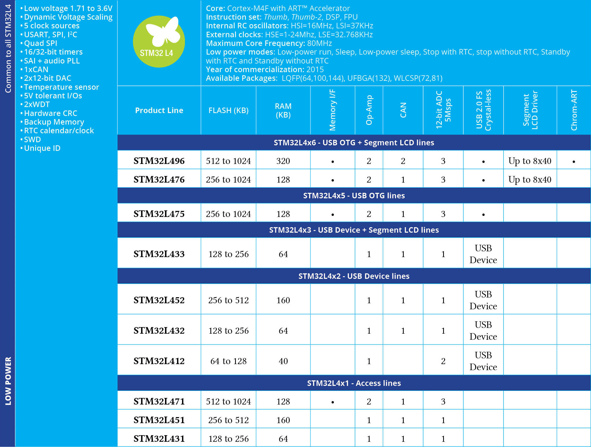

表 1.13：STM32L4 特性

<!-- page: 70 -->

STM32L4 系列是超低功耗领域中性能最佳的 MCU 系列之一。ARM Cortex-M4 内核（带 FPU）与超低功耗特性的结合，使 STM32L4 成为需要在电池供电或能量收集供电下运行且要求高性能的应用的最佳选择。与 L1 系列一样，STM32L4 提供动态电压调节和超低功耗时钟振荡器。电流消耗参考值：

- 超低功耗模式：带备份寄存器且无 RTC 时为 8 nA。
- 超低功耗模式 + RTC：带备份寄存器时为 200 nA（5 条唤醒线）。
- 超低功耗模式 + 8 Kbytes RAM：195 nA。
- 超低功耗模式 + 8 Kbytes RAM + RTC：340 nA。
- 动态运行模式：低至 28 μA/MHz。
- 唤醒时间：5 μs。

STM32L4 与 STM32F 系列中的多个 MCU 引脚兼容。该系列最重要的特性包括：

- 内核：

- – 最高时钟频率为 80 MHz 的带 FPU 的 ARM Cortex-M4F 内核。
- 存储器：

– 静态 RAM 最大 320 KB。

- * 20 字节电池备份，具有防篡改检测擦除功能。 – Flash 容量从 256 到 1024 KB。 – 支持 SDMMC 和 FSMC 接口。 – 每颗芯片都有一个出厂编程的 96 位唯一设备标识号。
- 外设：

- – 每个 L4 系列器件都具有一组外设，具体因产品线而异（详见表 1.13 以获取快速概览）。
- 振荡器包括内部 RC（16 MHz, 37 kHz），可选外部 HSE（1 到 24 MHz），LSE（32.768kHz）。
- IC 封装为 LQFP, UFBGA, WLCSP（详见表 1.13 以获取更多相关信息）。
- 工作电压范围为 1.7V 到 3.6V。

<!-- page: 71 -->

### 1.3.11 L4+

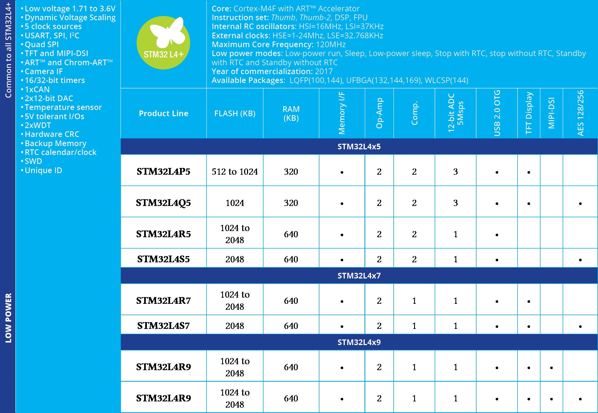

表 1.14：STM32L4+ 特性

STM32L4+ 系列于 2017 年底推向市场，是超低功耗领域全新的业界领先微控制器系列。STM32L4+ 系列在从内部 Flash 存储器执行时提供 150 DMIPS/409 CoreMark 分数，并嵌入 640 Kbytes SRAM，从而打破了超低功耗世界的处理能力极限，支持更先进的消费类、医疗和工业低功耗应用及设备。STM32L4+ 微控制器提供动态电压缩放功能，以平衡功耗与处理需求；在停止（Stop）模式下可用的低功耗外设（LP UART、LP 定时器）；安全与安保功能；智能且丰富的外设；以及先进的低功耗模拟外设，如运算放大器、比较器、12 位 DAC 和 16 位 ADC（硬件过采样）。新的 STM32L4+ 系列还嵌入了先进的图形功能，可实现最先进的图形用户界面。Chrom-ART Accelerator™ 是 ST 专有的 2D 硬件图形加速器，能够高效处理重复性图形操作，从而释放主 CPU 的能力用于实时处理或更高级的图形操作。Chrom-ART Accelerator 与大容量嵌入式 SRAM、Chrom-GRC™ 圆形显示存储器优化器、高吞吐量 Octo-SPI 接口以及先进的 TFT 和 DSI 控制器相结合，使您能够在单芯片、超低功耗解决方案中实现“智能手机级”的图形用户界面。

<!-- page: 72 -->

电流消耗参考值：

- 超低功耗模式：20 nA（带备份寄存器，无 RTC）。
- 超低功耗模式 + RTC：200 nA（带备份寄存器，5 条唤醒线）。
- 超低功耗模式 + 64 Kbytes RAM：800 nA。
- 超低功耗模式 + 64 Kbytes RAM + RTC：1 μA。
- 动态运行模式：低至 43 μA/MHz。
- 唤醒时间：5 μs。

STM32L4+ 与 STM32F 系列中的多款微控制器引脚兼容。该系列最重要的特性包括：

- 内核：

- – 带有 FPU 的 ARM Cortex-M4F 内核，最高时钟频率为 120 MHz。
- 存储器：

– 静态 RAM 最大 640 KB。

- * 64 字节电池备份，带篡改检测擦除功能。 – Flash 容量从 1024 到 2048 KB。 – 支持 SDMMC 和 FSMC 接口。 – 每颗芯片都有一个工厂编程的 96 位唯一设备标识号。
- 外设：

- – 每个 L4+ 系列器件都具备一系列外设，具体因产品线而异（详见表 1.14 以获取快速概览）。
- 振荡器包括内部 RC（16 MHz、37 kHz）、可选外部 HSE（1 至 24 MHz）、LSE（32.768 kHz）。
- IC 封装为 LQFP、UFBGA、WLCSP（详见表 1.14 以获取更多信息）。
- 工作电压范围为 1.7V 至 3.6V。

### 1.3.12 L5

2018 年，ST 宣布了基于新 Cortex-M33 内核的首个 STM32 系列。STM32L5 具备多种安全特性，如 TrustZone™、安全启动（Secure Boot）、主动 IO 篡改检测、安全固件安装加载器、认证加密库等。根据 ST 的观点，STM32L5 系列面向物联网（IoT）设备，其中安全性已成为嵌入式和 IoT 应用开发者致力于改进的三大关键领域之一。STM32L5 微控制器系列是解决方案，提供了性能、功耗和安全之间的新最佳平衡。

提供最大 512 Kbytes Flash（双 Bank）存储器和 256 Kbytes SRAM，STM32L5 微控制器系列凭借此新内核和新的 ST ART Accelerator™（现也支持外部存储器）达到了升级后的性能水平（443 CoreMark）。STM32L5 提供包含 7 种封装（从 48 到 144 引脚）的广泛产品组合，并支持高达 125°C 的环境温度。该系列最重要的特性包括：

<!-- page: 73 -->

- 内核：

- – 带有 FPU 的 ARM Cortex-M33 内核，最高时钟频率为 110 MHz。
- 存储器：

- – 静态 RAM 最大 256 KB。 – Flash 容量从 256 到 512 KB。 – 支持 SDMMC 和 Octa-SPI 接口。 – 每颗芯片都有一个工厂编程的 96 位唯一设备标识号。
- 外设：

- – 每个 L5 系列器件都具备一系列外设，具体因产品线而异（详见表 1.15 以获取快速概览）。
- 振荡器包括内部 RC（16 MHz、37 kHz）、可选外部 HSE（1 至 24 MHz）、LSE（32.768 kHz）。
- IC 封装为 LQFP、UFBGA、WLCSP（详见表 1.15 以获取更多信息）。
- 工作电压范围为 1.71V 至 3.6V。

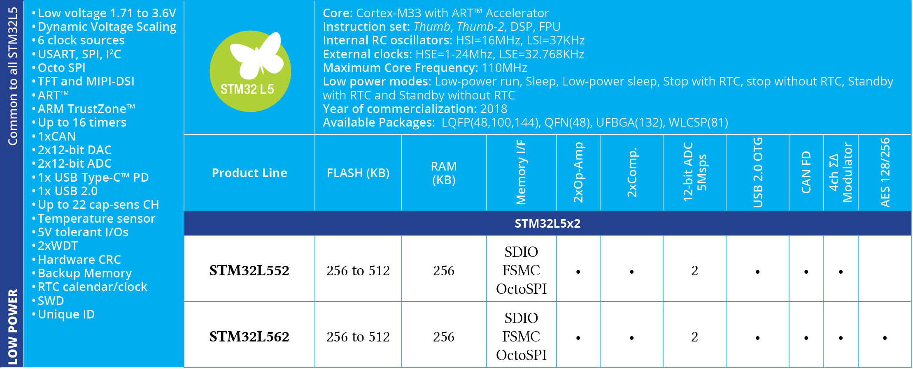

表 1.15：STM32L5 特性

### 1.3.13 U5

2021 年，ST 宣布低功耗产品组合的重要演进，推出了 STM32U5 系列，其中“U”代表超低功耗。基于 Cortex®-M33，STM32U5 满足了智能应用最苛刻的功耗/性能要求，包括可穿戴设备、个人医疗设备、家庭自动化和工业传感器。提供最大 2 Mbytes Flash（双 Bank）存储器和 786 Kbytes SRAM，STM32U5 微控制器系列将性能提升至下一个水平。

该系列最重要的特性包括：

<!-- page: 74 -->

- 内核：

- – 带有 FPU 的 ARM Cortex-M33 内核，最高时钟频率为 160 MHz。
- 存储器：

- – 静态 RAM 最大 786 KB。 – Flash 容量最大 2048 KB。 – 支持 SDMMC、FSMC 和 Octa-SPI 接口。 – 每颗芯片都有一个工厂编程的 96 位唯一设备标识号。
- 外设：

- – 每个 L5 系列器件都具备一系列外设，具体因产品线而异（详见表 1.16 以获取快速概览）。
- 振荡器包括内部 RC（16 MHz、37 kHz）、可选外部 HSE（1 至 24 MHz）、LSE（32.768 kHz）。
- IC 封装为 LQFP、UFBGA、WLCSP（详见表 1.16 以获取更多信息）。
- 工作电压范围为 1.71V 至 3.6V。
- 嵌入式 SMPS（开关模式电源）降压转换器，以改善电源管理。
- 低功耗背景自主模式（LPBAM），一种创新的自主电源模式，通过启用直接存储器访问低功耗直接存储器访问（LPDMA）并确保外设在设备大部分处于停止模式时继续工作来节省功耗。
- 关键性能指标包括：

– 关机模式下 110 nA。 – 待机模式下 300 nA。 – 停止模式 3 下，带 16 Kbytes SRAM 时为 1.7 µA。 – 停止模式 2 下，带 786 Kbytes SRAM 时为 6.6 µA。 – 活动模式下低至 19 µA/MHz。

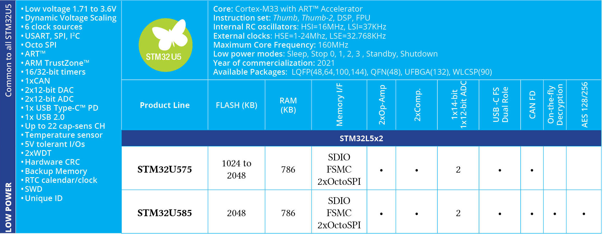

表 1.16：STM32U5 特性

<!-- page: 75 -->

### 1.3.14 G0

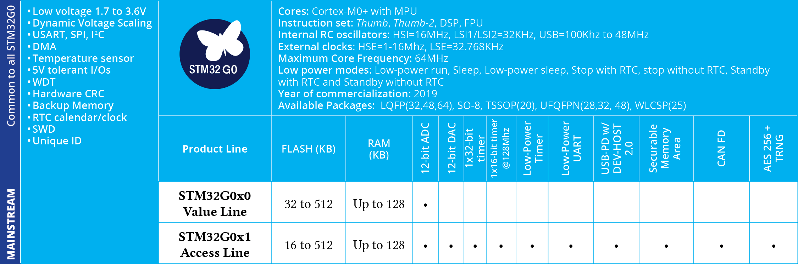

表 1.17：STM32G0 特性

2019 年，ST 向市场推出了 STM32F0 系列的现代化替代品：STM32G0 系列。该新系列基于 90nm 光刻工艺，而非 STM32F0 系列所使用的较旧的 180nm 工艺。这意味着在相同外设下所需的空间更小、封装更小、由于对硅片需求降低而在大批量生产时成本更低、功耗更低。传统上，与其他提供 SO-8 等更小封装的 Cortex-M 制造商相比，STM32 微控制器（MCU）通常采用较大的封装。如今，ST 终于弥补了这一差距，允许减少 PCB 空间和设计复杂度。事实上，STM32G0 不再使用传统的多条电源线路及其必要的去耦电容，而是仅使用一条电源线路，这将使 PCB 设计变得更加简单且成本更低。这也意味着，与具有相似引脚数量的相应 STM32F0 微控制器相比，某些 STM32G0 微控制器提供了多出的九个 I/O。此外，STM32G03X 和 STM32G04X 微控制器在小封装（SO8、TSSOP20）中采用了多键合（multi-bonding）方法，以提供最多的复用功能和模拟输入。这种方法导致多个芯片焊盘在内部连接到单个封装引脚。

这一代新产品提供了 64 MHz 的 Cortex-M0+ 内核、可保护内存区域（Securable Memory Area）、更多的 RAM 和 Flash、更多的 I/O，以及更广泛的组件集成，从而显著简化了整体 PCB 设计。32 引脚和 48 引脚型号从最简单的配置（8 KB RAM 和 16 KB Flash）到最强大的架构（128 KB RAM / 512 KB Flash）。采用 Cortex-M0+ 内核将有助于在低功耗模式下进行应用程序编程。尽管是一款主流设备，但得益于与 STM32L4 具有某些相似之处的 90nm 工艺，STM32G0 在 64 MHz 运行时所需的电流低于 100 µA / MHz。相比之下，STM32F0 需要 250 µA / MHz。新架构还具有一种 STOP 模式，在仅关闭 Flash 和实时时钟（Real-Time Clock）的情况下，电流可低至 3 µA；而其 STANDBY 模式仅需 200 nA，这比上一代产品的任何模式都大幅降低。尽管处于如此低的功耗状态，该架构仍能在 STOP 模式下约 5 µs 内、在 STANDBY 模式下约 14 µs 内唤醒，使其更具优势。

此外，STM32G0 提供了一个 VBAT 引脚，这意味着工程师可以放置一个电容仅为 RTC 和备份寄存器（backup registers）供电，从而允许系统的其余部分关闭，并将

<!-- page: 76 -->

功耗降低至 10 nA。凭借如此低的功耗，可以创建一种设计，在用户更换电池时保持内存中的基本信息，例如，从而改善整体体验。

最后，STM32G0 包含一个能够加速 AES 256 位计算的加密内核（crypto-core），以及一个用于优化加密密钥的真随机数生成器（True Random Number Generator, TRNG）。然而，最有趣的安全特性是可保护内存区域（securable memory area）的实现。开发人员可以定义 Flash 的一部分，一旦从中注销，该部分将对系统的其余部分不可访问，这使得他们能够存储根密钥和关键例程，以实现安全启动（Secure Boot）和安全固件升级（Secure Firmware Upgrade）等功能。

STM32G0 与 STM32F0 系列中的许多 MCU 引脚兼容。该系列最重要的特性包括：

- 内核：

- – 带有 MPU 的 ARM Cortex-M0+ 内核，最大时钟频率为 64 MHz。
- 内存（Memory）：

- – 静态 RAM 最大 128 KB。 – Flash 容量从 16 到 512 KB。 – 每个芯片都有一个工厂编程的 96 位唯一设备标识号。
- 外设（Peripherals）：

- – 每个 G0 系列都具有一组外设，具体因产品线而异（参见表 1.17 以获取快速概览）。
- 振荡器由内部 RC（16 MHz、37 kHz）、可选的外部 HSE（1 到 48 MHz）、LSE（32.768 kHz）组成。
- IC 封装为 LQFP、TSSOP、SO-8、UFQFPN、WLCSP（有关此内容的更多信息，请参见表 1.11）。
- 工作电压范围为 1.7V 到 3.6V。

### 1.3.15 G4

2019 年，ST 还宣布了一个新系列，该系列结合了 STM32F4 系列的性能和 STM32F3 系列的一些独特特性：STM32G4。STM32G4 是首个专门针对“混合信号”细分市场的系列，因为它是首个包含五个模数转换器（analog-to-digital converters）、七个数模转换器（digital-to-analog converters）、六个运算放大器（operational amplifiers）和七个比较器（comparators）的 STM32，同时还集成了 USB-C 电源传输（Power Delivery）控制器、184 皮秒高分辨率定时器、具有灵活数据率的 CAN 接口，以及加速某些三角函数运算的数学单元。其 Cortex-M4 内核最高可达 170 MHz，以获得 213 DMIPS，并在 CoreMark 中得分 550 分，而其众多的架构改进使得能够创建更简单但更健壮的设计。

<!-- page: 77 -->

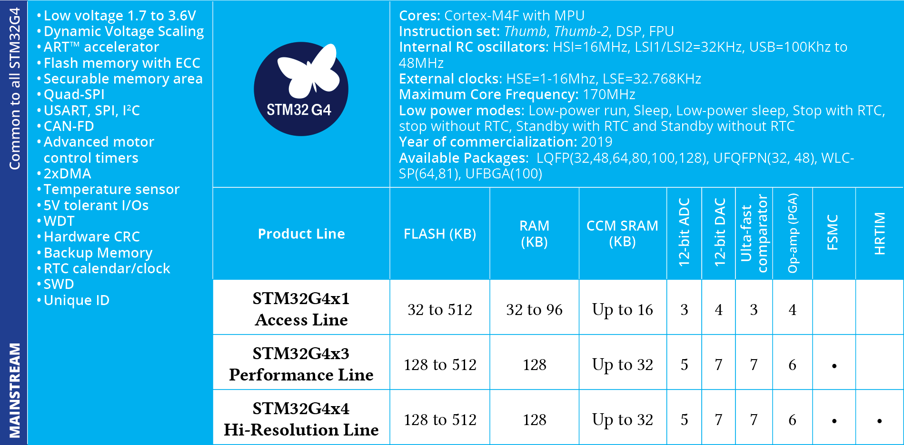

表 1.18：STM32G4 特性

STM32G4 是首个配备两个数学加速器的 STM32，一个用于三角计算（ST 称之为 COordinate Rotation DIgital Computer 或 CORDIC），另一个用于滤波功能（ST 称之为 Filter Mathematical ACcelerator 或 FMAC）。简单来说，CORDIC 加速器为电机控制、计量、信号处理以及许多其他应用中常见的三角函数提供硬件加速。另一方面，FMAC 使得能够实现信号处理中的两种主要初级滤波器：有限冲激响应（FIR）和无限冲激响应（IIR）数字滤波器。STM32G4 系列也是首个包含分辨率低于 200 皮秒定时器的 ST MCU 架构。其首要且最明显的优势是能够驱动 LLC 谐振拓扑中的高精度电源。该定时器还通过七个时基（timebases）的存在，提供了高度灵活的脉冲宽度调制（PWM），开发人员可以组合这些时基以获得非常精细的调制。高分辨率定时器还受益于一个事件处理器（event handler），帮助工程师更轻松地配置和调用定时器，或例如使用它来生成中断。

STM32G47x 微控制器还具有一个关键特性，即双 Bank Flash，类似于某些 STM32F4 以及所有 STM32F7/H7 系列。简单来说，MCU 将 Flash 内存组织为两个具有边读边写（Read While Write, RWW）能力的物理 Bank。因此，可以在没有任何中断的情况下下载、安装并运行新固件。系统在一个 Bank 上运行，而另一个 Bank 接收新固件。然后，系统可以热切换（hot swap）Bank，并无缝切换到第二个 Bank 以运行新代码。开发人员甚至可以使用 STM32G4 上可用的新安全特性（如可保护内存区域）来保护下载操作：可保护内存区域是内存的一个部分，可以存储秘密密钥或执行软件例程，并且仅在复位后运行一次，之后对用户代码不可见。此外，STM32G4 还借用了 STM32F3 中可用的其他特性，如本书后文描述的核耦合内存（Core Coupled Memory, CCM）。

- 内核：

<!-- page: 78 -->

- – 带有 MPU 的 ARM Cortex-M4F 内核，最大时钟频率为 170 MHz。
- 内存（Memory）：

- – 静态 RAM 最大 128 KB。 – Flash 容量从 32 到 512 KB。 – 丰富的先进模拟外设（比较器、运算放大器、DAC） – 具有硬件过采样（16 位分辨率）的 ADC – 具有纠错码（ECC）的双 Bank Flash 内存（支持现场固件升级） – 可保护内存区域 – 高分辨率定时器 – 包含物理层（PHY）的 USB Type-C 接口，支持电源传输 – AES 硬件加密 – 每个芯片都有一个工厂编程的 96 位唯一设备标识号。
- 外设（Peripherals）：

- – 每个 G0 系列都具备一系列外设，具体配置因产品线而异（快速概览请参见表 1.17）。
- 振荡器包括内部 RC（16 MHz，37 kHz），可选外部 HSE（1 至 48 MHz），LSE（32.768kHz）。
- IC 封装形式为 LQFP、UFBGA、WLCSP、UQFN（更多详情请参见表 1.18）。
- 工作电压范围为 1.71V 至 3.6V。

### 1.3.16 STM32WB

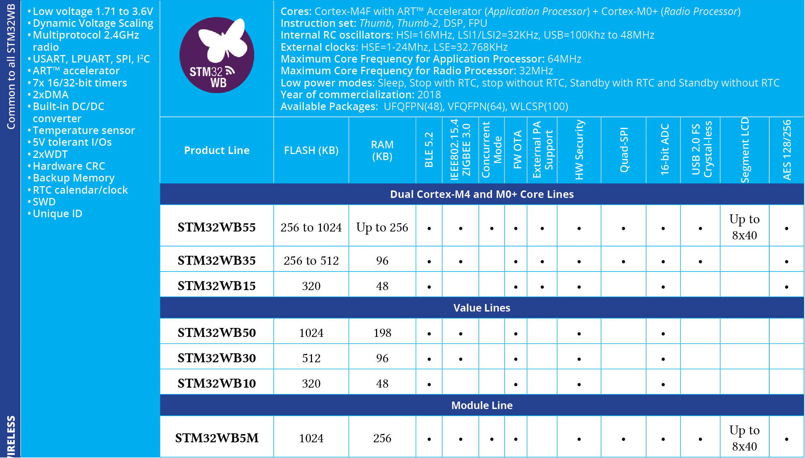

表 1.19：STM32WB 特性

<!-- page: 79 -->

STM32WB 系列于 2018 年初推向市场，是 2.4GHz 无线领域的 MCU 系列。STM32WB 是一组双核 STM32 微控制器，集成了适用于无线和 Bluetooth 5.x 应用的 2.4GHz 射频前端。这些 MCU 配备一个运行在 32 MHz 的 Cortex-M0+ 内核（称为网络处理器），专门用于射频管理（ST 还提供配套的 BLE 5.0 协议栈），以及一个运行在 64 MHz 的用户可编程 Cortex-M4 内核（称为应用处理器），用于主要嵌入式应用。

STM32WB 平台是 STM32L4 超低功耗 MCU 系列的演进版本。它提供相同的数字和模拟外设，适用于需要延长电池寿命和复杂功能的应用。STM32WB 集成了多种通信外设、便捷的无晶振 USB2.0 FS 接口、音频支持、LCD 驱动器、多达 72 个 GPIO、用于优化功耗的集成 SMPS 以及多种低功耗模式，以最大化电池寿命。

除了无线和低功耗特性外，还特别注重嵌入安全硬件功能，例如 256 位 AES、PCROP、JTAG Fuse、PKA（椭圆曲线加密引擎）和 Root Secure Services (RSS)。RSS 允许对 OTA 通信进行身份验证，无论射频协议栈或应用如何。

STM32WB55 是一款通过 Bluetooth 5.2 认证的设备，提供 Mesh 1.0 软件支持、多种配置文件以及集成专有 BLE 协议栈的灵活性。也可获得 OpenThread 认证的软件协议栈。射频前端还可以同时运行 BLE/OpenThread 协议。嵌入式通用 MAC 允许使用其他 IEEE 802.15.4 专有协议栈，如 ZigBee®，或专有协议，为将设备连接到物联网 (IoT) 提供更多选择。

- 内核：

- – 带有 FPU 的 ARM Cortex-M4F 内核，最大时钟频率为 64 MHz（应用处理器）。* 最大时钟频率为 32 MHz 的 ARM Cortex-M0+ 内核（网络处理器）。
- 存储器：

- – 静态 RAM 最大 256 KB。– Flash 容量最大 1024 KB。– 支持 Quad-SPI 接口。– 每个芯片都有一个工厂编程的 96 位唯一设备标识号。
- 射频：

- – 兼容 BLE 5.0 的射频前端和协议栈。– 兼容 IEEE 802.15.4 的射频前端。– 空中固件升级能力。– 支持外部功率放大器。
- 外设：

- – 每个 WB 系列设备都具备一系列外设，具体配置因产品线而异（快速概览请参见表 1.19）。
- 振荡器包括多个内部 RC（16 MHz，32 kHz），可选外部 HSE（1 至 24 MHz），LSE（32.768kHz）。
- IC 封装形式为 WLCSP、UFQFPN、VFQFPN（更多详情请参见表 1.19）。
- 工作电压范围为 1.7V 至 3.6V。

<!-- page: 80 -->

### 1.3.17 STM32WL

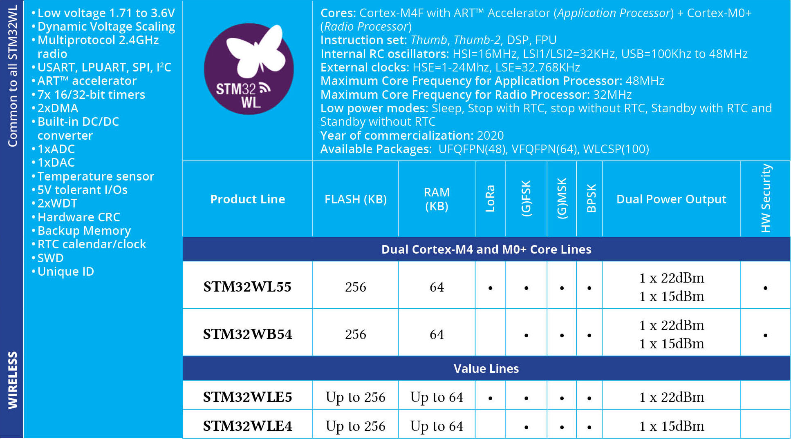

表 1.20：STM32WL 特性

STM32WL 家族于 2020 年推出，是一款亚 GHz 射频设备。基于 Cortex-M4 和 Cortex-M0+ 内核（提供单核和双核架构），STM32WL 微控制器支持多种调制方式：LoRa、(G)FSK、(G)MSK、BPSK，以确保在 LoRaWAN、Sigfox、W-MBUS、mioty 或任何其他合适协议中以完全开放的方式实现无线应用的灵活性。STM32WL 微控制器基于 Semtech SX126x 的亚 GHz 射频，满足工业和消费物联网 (IoT) 中广泛低功耗广域网 (LPWAN) 无线应用的需求。该射频适用于旨在符合射频法规的系统，包括但不限于 ETSI EN 300 220、FCC CFR 47 Part 15、中国法规要求以及日本 ARIB T-108。150 至 960 MHz 的连续频率覆盖范围支持全球所有主要的亚 GHz ISM 频段。

内核：* 带有 FPU 的 ARM Cortex-M4F 内核，最大时钟频率为 48 MHz（应用处理器）。* 最大时钟频率为 32 MHz 的 ARM Cortex-M0+ 内核（网络处理器）。* 存储器：* 静态 RAM 最大 64 KB。* Flash 容量最大 256 KB。* 每个芯片都有一个工厂编程的 96 位唯一设备标识号。* 射频：* 150 至 960 MHz 射频前端。* 兼容 LoRa、(G)FSK、(G)MSK、BPSK 调制。* 双输出功率，以平衡长距离、电池寿命和法规合规性。* 外设：* 每个 WB 系列设备都具备一系列外设，具体配置因产品线而异（快速概览请参见表 1.20）。* 振荡器包括多个内部 RC（16 MHz，32 kHz），可选外部 HSE（1 至 24 MHz），LSE（32.768kHz）。* IC 封装形式为 WLCSP、UFQFPN、VFQFPN（更多详情请参见表 1.20）。* 工作电压范围为 1.7V 至 3.6V。

<!-- page: 81 -->

### 1.3.18 如何为您选择合适的 MCU？

为新项目选择微控制器绝非易事，除非您正在复用之前的设计。首先，市场上有数十家 MCU 制造商，每家都有自己的市场份额和目标受众。例如 ST、Microchip、TI、Atmel、Renesas、NXP 等¹⁸。就我们而言，我们非常幸运：我们已经选定了一个品牌。正如前几段所述，STM32 确实是一个庞大的产品组合。我们可以从超过 1200 种器件中进行选择（如果考虑封装变体的话）。那么，从哪里开始呢？

在理想世界中，选择过程的第一步是理解所需的计算能力。如果我们打算开发一个 CPU 密集型应用，专注于多媒体和图形应用，那么我们必须将注意力转向 STM32 微控制器的高性能（High-Performance）组。另一方面，如果计算能力不是我们电子设备的主要需求，我们可以专注于主流（Mainstream）细分市场，并仔细查看提供最多选择范围的 STM32F1 系列。

下一步是关于连接性要求。如果我们需要通过以太网连接或其他工业协议（如 CAN 总线）与外部世界交互，并且我们的应用程序必须具有响应能力并能够处理多种互联网协议，那么 STM32F4 产品组合可能是您的最佳选择；否则，STM32F105/7 连接性产品线是更好的选择。

如果我们打算开发一个电池供电的设备（也许是可穿戴市场上的下一个畅销产品），那么我们必须查看 STM32L 选择，并根据我们所需的计算能力在各种子系列中进行选择。

如本段开头所述，这是理想世界中的选择过程。但现实世界呢？在日常开发过程中，在开始为项目选择合适的 MCU 之前，我们可能必须回答以下问题：

- 该设备是面向大众市场还是利基市场？如果您正在开发一种小批量生产的设备，那么 STM32 微控制器之间的价格差异不会对您的项目产生太大影响。您甚至可以考虑全新的 STM32F7，并对软件优化给予较少的关注（在处理低性能 MCU 时，您必须尽力优化代码——请记住，这也是一种增加最终投资的成本）。另一方面，如果您打算构建大众市场设备，那么单个 IC 的价格确实很重要：您在生产过程中节省的费用往往超过初始投资。
- 总 BOM（物料清单）的允许预算是多少？这是前一点的一个推论。如果您已经有了目标板的价格，那么您必须在早期阶段仔细选择合适的 MCU。
- 空间限制如何？您的板子是否必须适合最新的可穿戴设备，或者您是否有足够的空间使用您偏好的 IC 封装？这个问题的答案深刻地

¹⁸ 可以在这里找到一份良好的 MCU 制造商列表 (http://bit.ly/1VUkN2e)。请注意，近年来，上述几家公司为了在变得非常拥挤的市场中生存而进行了合并。

<!-- page: 82 -->

- 影响了 MCU 的选择过程以及我们在性能和外设能力方面对它的要求。
- 我的公司能负担得起哪种生产技术？这是另一个非平凡的问题。LQFP 封装在 MCU 市场上仍然非常流行，因为它们不需要复杂的生产成本，并且即使在旧的生产线上也可以轻松组装。BGA 和 WLCSP 封装需要 X 射线检测设备，并可能影响您的选择过程。
- 上市时间对您来说是否关键？上市时间对于任何从事商业活动的人来说始终是一个关键因素，但有时您被要求在开始开发过程的前一天准备好固件。这可能导致固件未优化，至少在早期阶段是这样。这意味着，对于您来说，具有更强计算能力的 MCU 可能是最佳选择。
- 您可以复用板级布局或代码吗？每个嵌入式开发人员都有一个库和知名 IC 的组合。软件开发是一项复杂的任务，在我们认为固件稳定并准备好用于生产之前，涉及多个阶段。有时（这在当今非常常见），您必须处理未记录的硬件错误，或者至少处理其不可预测的行为。这意味着，在决定切换到另一种架构甚至同一系列中的另一个 MCU 时，您必须非常小心。
- 候选 MCU 是否有货？嗯，在 2022 年，这不是一个简单的问题。由于全球硅片短缺危机，几乎所有硅片供应商的交货期都在 8 个月到 2 年之间。对于 ST 来说，这一点尤其严重。我的一个朋友为了满足项目截止日期，不得不购买 200 块 Nucleo 和 Discovery 开发板，以拆焊 STM32F1 MCU，从而交付 200 块定制板。现在，所有电子元件分销商（RS、Farnell 等）都在限制一家公司可以购买的开发板最大数量。因此，在开始基于 STM32 MCU 设计新产品之前，我强烈建议在打开 IDE 之前购买所需的 MCU 并保留库存材料。

STM32 平台的一个关键特性可以在选择过程中提供很大帮助：引脚对引脚（pin-to-pin）兼容性。这允许您在选择过程中选择更强大（或更便宜）的 MCU，并赋予您在更高级的开发阶段更改它的自由。例如，对于我最近开发的一块板子，我最初选择了一个 STM32F1 MCU，但当我得出结论认为它满足我的要求时，我将其降级为更便宜的 STM32F0。但是，请记住，这个过程始终涉及将代码适配到不同的子系列。

<!-- page: 83 -->


图 1.15：桌面版 MCU Finder 工具

ST 提供了两个方便的工具来帮助您的 MCU 选择过程。第一个是适用于 Windows、Mac 和 Linux 的 STM32 和 STM8 MCU Finder（见图 1.15），可在 ST 网站上获取¹⁹。在安装之前，请耐心等待：正如我们稍后所见，该工具已经集成在 STM32CubeIDE 工具链中。因此，没有必要占用您 PC 的空间。

¹⁹https://bit.ly/34BWSW3

<!-- page: 84 -->

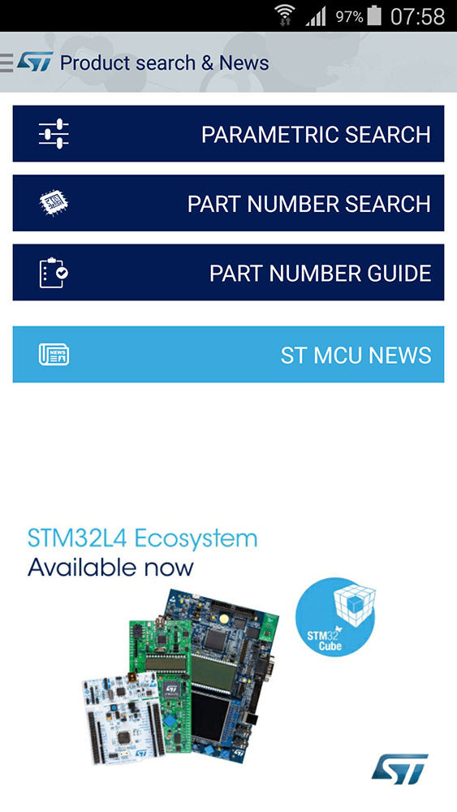

图 1.16：适用于 Android 操作系统的 MCU Finder 应用

第二个工具是一个有用的移动应用（见图 1.16），适用于 iOS²⁰ 和 Android²¹。

## 1.4 Nucleo 开发板

任何关于电子设备的实用文本都需要一块开发板（也称为套件）才能开始工作。在 STM32 领域中，最广泛使用的开发板是 STM32 Discovery。ST 已经开发了 48 种不同的 Discovery 开发板，用于测试 STM32 微控制器及其功能。

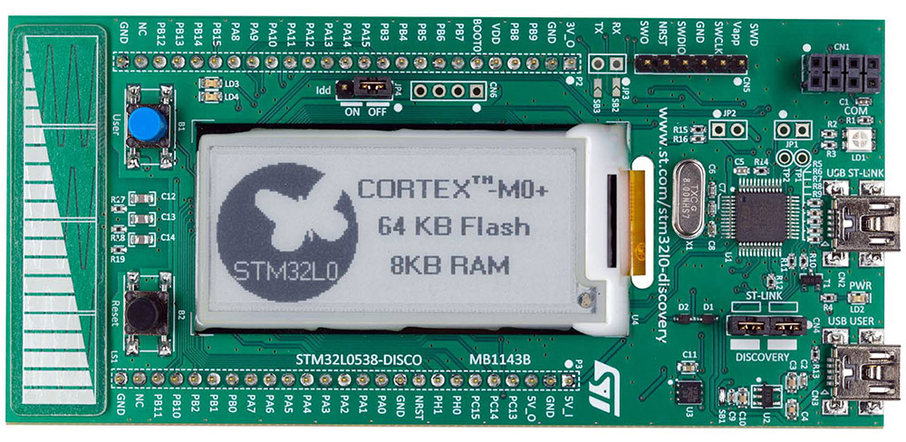

图 1.17：ST 于 2015 年推出的 STM32L0538 Discovery 套件

例如，STM32L0538DISCOVERY 开发板（图 1.17）允许测试 STM32L053 微控制器（MCU）以及电子纸显示屏。您可以在互联网上找到大量涵盖 Discovery 系列开发板的教程。

²⁰http://apple.co/Uf20WR ²¹http://bit.ly/1Pvo8EV

<!-- page: 85 -->

ST 在 2015 年推出了一系列全新的开发板：Nucleo。Nucleo 系列分为三个主要组别：Nucleo-32、Nucleo-64 和 Nucleo-144（见图 1.18）。每个组别的名称源自所使用的微控制器（MCU）封装类型：Nucleo-32 使用 LQFP-32 封装的 STM32；Nucleo-64 使用 LQFP-64 封装；Nucleo-144 使用 LQFP-144 封装。Nucleo-64 是首个推向市场的系列，目前共有 32 种不同的开发板，每块板都配备特定的 STM32 微控制器。Nucleo-144 于 2016 年 1 月推出，是首个配备强大 STM32F746 的低成本套件。它还提供了以太网物理层收发器²²和 LAN 端口。由于 Nucleo-64 是最完整的系列，本书将仅涵盖 Nucleo-64 系列中最相关的开发板（完整列表见表 1.21）。在本书的其余部分，我们将简单地用术语“Nucleo”来指代 Nucleo-64。

Nucleo 由两部分组成，如图 1.19 所示。带有 mini-USB 连接器的部分是一个集成的 ST-LINK 2.1 调试器，用于将固件上传到目标微控制器（MCU）并进行单步调试。ST-LINK 接口还提供虚拟 COM 端口（VCP），可用于与主机 PC 交换数据和消息。Nucleo 开发板的一个关键特性是，ST-LINK 接口可以轻松地从板子的其余部分分离出来（图 1.19 中的两个红色剪刀图标指示了断开位置）。这样，它可以作为独立的 ST-LINK 编程器使用（独立的 ST-LINK 编程器价格约为 25 美元）。然而，ST-LINK 提供了一个可选的 SWD 接口，可以通过移除标有 ST-LINK 的两个跳线帽，在不将 ST-LINK 接口从 Nucleo 上拆下的情况下（正如在 Discovery 开发板上已经发生的那样）用于编程另一块板子。板子的其余部分包含目标微控制器（MCU）（我们将用于开发应用程序的微控制器）、一个 RESET 按钮（黑色）、一个用户可编程的轻触按钮（蓝色）和一个 LED。板子上还有一个用于安装外部高速晶振（HSE）的焊盘。所有较新的 Nucleo 开发板都已提供低速晶振。最后，板子上有几个引脚排针，我们稍后会详细介绍。

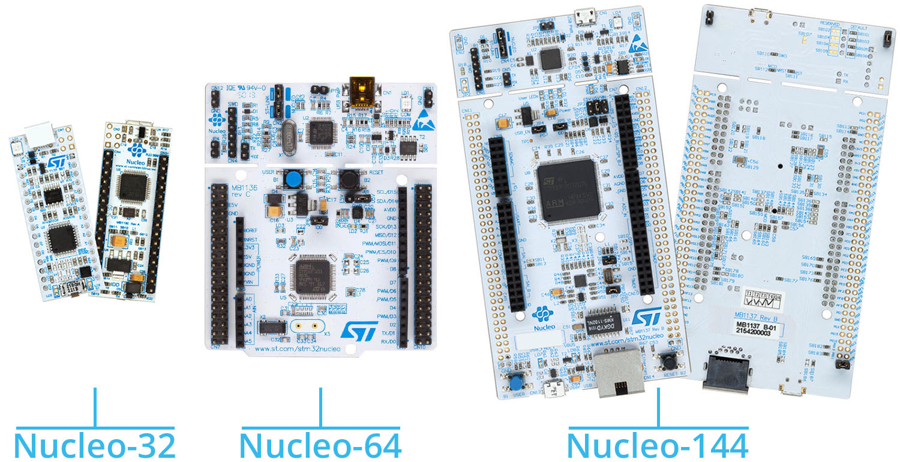

图 1.18：一块 Nucleo 开发板

ST 推出这款新套件是为了吸引来自 Arduino 世界的人们。事实上，Nucleo 开发板提供了引脚排针，以接受 Arduino 扩展板，这些扩展板是专门为扩展 Arduino

²²以太网物理层收发器（也称为以太网 PHY）是一种将局域网（LAN）网络中交换的消息转换为电信号的设备。

<!-- page: 86 -->

UNO 及其他所有 Arduino 开发板而构建的。图 1.20²³ 显示了与 Arduino 兼容连接器相关的 STM32 外设和 GPIO。

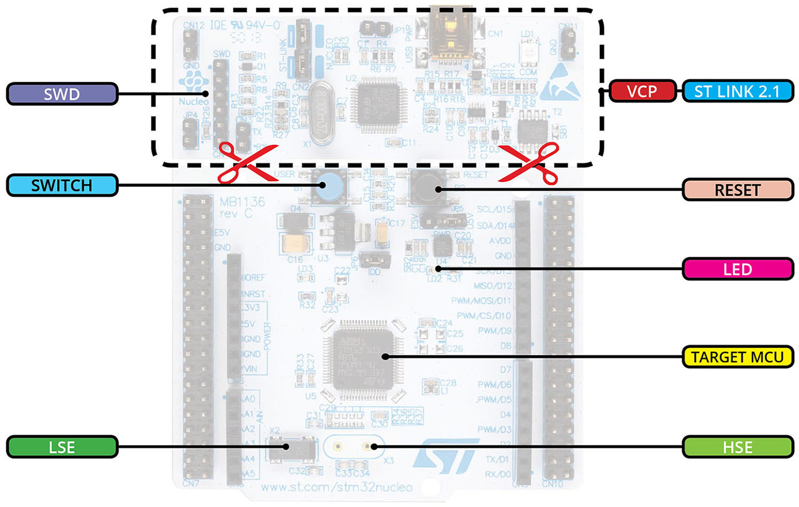

图 1.19：Nucleo 开发板的相关部分

诚实地说，与 Discovery 开发板相比，Nucleo 开发板还有其他有趣的优点。首先，ST 以极具竞争力的价格出售它们（可能是出于上述原因）。一块 Nucleo 的价格在 10 到 15 美元之间，具体取决于购买地点，如果您考虑到使用这种架构可以做的事情，您必须同意与 Arduino DUE 开发板（同样配备 Microchip 的 32 位 ARM 处理器）相比，它的价格确实偏低。另一个有趣的特性是，Nucleo 开发板被设计为彼此引脚兼容。这意味着您可以为 STM32Nucleo-F103RB 开发板（配备流行的 STM32F103 微控制器）开发固件，如果需要更多的计算能力，稍后可以将其适配到更强大的 Nucleo（例如 STM32Nucleo-F401RE）。

²³图 1.20 和 22 取自 mbed.org 网站，并指代 Nucleo-F401RE 开发板。请参阅附录 C 以获取您的 Nucleo 开发板的正确引脚定义。

<!-- page: 87 -->

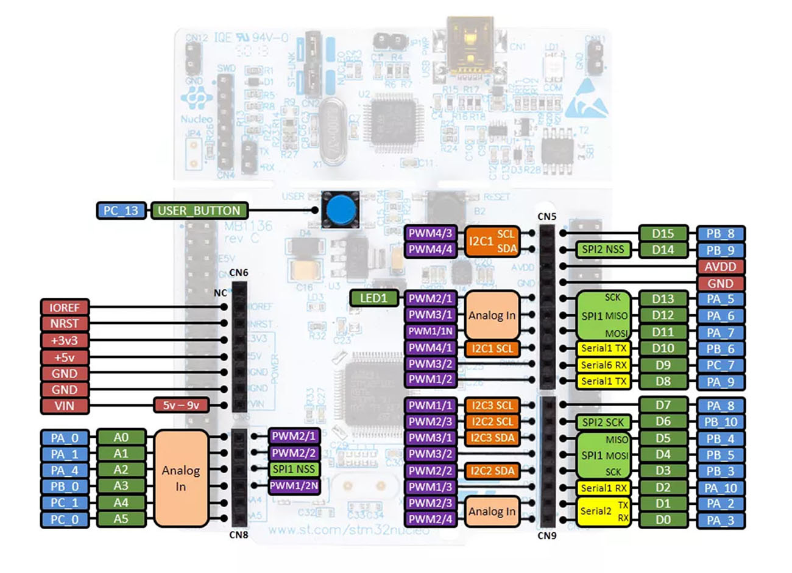

图 1.20：与 Arduino 排针相关的外设和 GPIO

除了 Arduino 兼容的引脚排针外，Nucleo 还提供了自己的扩展连接器。它们是两个 2x19、间距为 2.54mm 的公头引脚排针。它们被称为 Morpho 连接器，是访问大多数微控制器（MCU）引脚的便捷方式。图 1.21 显示了与 Morpho 连接器相关的 STM32 外设和 GPIO。

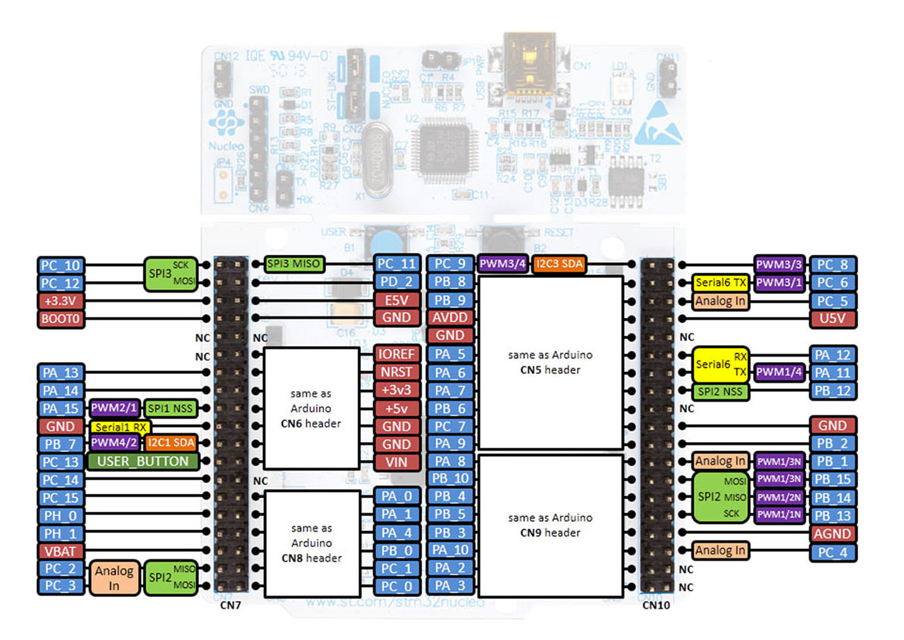

图 1.21：与 Morpho 排针相关的外设和 GPIO

ST 正在发布多种适用于 Nucleo 的扩展板，这些扩展板与 Arduino UNO 或 ST Morpho 排针兼容。例如，图 1.22 显示了一块带有 X-NUCLEO-IHM07M1 扩展板的 Nucleo-F302R8 开发板，该扩展板是一个配备 ST L6230 DMOS 驱动器的电机控制

<!-- page: 88 -->

### 低压三相直流无刷电机的解决方案。

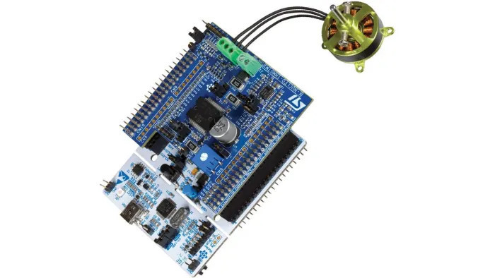

图 1.22：X-NUCLEO-IHM07M1 扩展板

在撰写本章时（2022 年 2 月），市面上共有 32 款 Nucleo 开发板。表 1.21 总结了本书示例所使用的 Nucleo 开发板的主要特性，以及所有 Nucleo-64 开发板共有的特性²⁴。

²⁴请注意，ST 将 STM32G4 系列归类为主流（Mainstream）级别。然而，由于其内核运行频率高达 170MHz，可被视为高性能微控制器。因此，在本书中，Nucleo-G474RE 被归类为高性能系列。

<!-- page: 89 -->

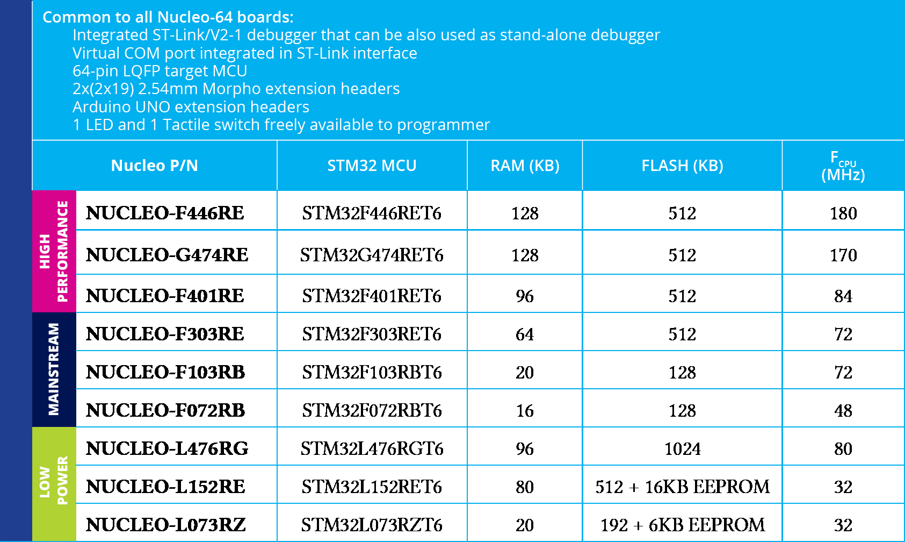

表 1.21：本书中使用的 Nucleo 开发板列表及其特定特性

## 为什么选择 Nucleo 作为本书的示例开发板？


这个问题的答案几乎都包含在前面的段落中。首先，Nucleo 开发板价格低廉，让您几乎零成本地开始学习 STM32 平台。其次，它们极大地简化了本书中包含的说明和示例。您可以完全自由选择您喜欢的 Nucleo 开发板。本书将展示所有必要的步骤，以便轻松地将示例适配到您特定的 Nucleo 开发板上。


请记住，整本书的设计旨在为读者提供开始使用任何开发板（即使是定制开发板）所需的所有必要工具。将示例适配到您的具体需求将变得轻而易举。

<!-- source-file: 02-get-in-touch-with-sm32cubeide.md -->

<!-- page: 90 -->

# 2。与 STM32CubeIDE 建立联系

在开始为 STM32 平台开发应用程序之前，我们需要一套完整的工具链。工具链是一组程序、编译器和工具，它使我们能够：

- 编写代码并在应用程序的源文件中进行导航；
- 在应用程序代码中进行导航，从而检查变量、函数定义s/declarations等；
- 使用跨平台编译器编译源代码；
- 将应用程序上传到目标开发板（或我们自行制作的定制板）并进行调试。

要完成这些活动，我们基本上需要：

- 一个集成源代码编辑器和导航器的集成开发环境（IDE）；
- 一个能够针对 ARM Cortex-M 平台编译源代码的跨平台编译器；
- 一个允许我们在目标板上对固件进行单步调试的调试器；
- 一个允许我们与 Nucleo 板上的集成硬件调试器（ST-LINK 接口）或专用编程器（例如 JTAG 适配器）进行交互的工具。

在本章中，我将展示如何在 Windows、Mac OS 和 Linux 上安装并运行 STM32CubeIDE 工具链，并为您提供 Eclipse IDE 主要功能的必要概述。

## 2.1 为何选择 STM32CubeIDE 作为 STM32 的工具链

自本书第一版以来已经过去了很长时间，很多事情都发生了变化。传统上，STM32 缺乏一个由 ST 完全、直接且积极维护的官方开发环境。在过去几年里，ST 尝试支持多个基于免费 Eclipse/GCC 工具链的开源和社区项目。然而，这些项目（CooCox、AC6）均未达到真正的成熟度，这构成了开始使用 STM32 微控制器的主要障碍之一。

本书第一版的特点是展示了如何从零开始搭建一套完整的、跨平台的且完全免费的工具链。那是一个基于 Eclipse 的工具链，其

<!-- page: 91 -->

增加了一组名为 Eclipse Embedded CDT¹ 的插件，由 Liviu Ionescu 开发和维护，他在为 GCC ARM 工具链提供支持方面做出了非常出色的工作。如果没有这些插件，几乎不可能使用 Eclipse 为 STM32 平台开发和运行代码。该项目现在是 Eclipse 基金会的官方项目之一，并且仍然是一个良好的开发环境，特别是如果您习惯于在不同的 Cortex-M 平台上工作。

在 2017 末尾，ST 决定收购 Atollic²，即 TrueStudio IDE 背后的公司。TrueStudio IDE 是 Eclipse CDT 和 ARM GCC 的商业发行版，并增加了用于开发 ARM Cortex-M 微控制器嵌入式应用的专用插件。收购 Atollic 后，ST 决定向所有 STM32 开发者免费提供 TrueStudio IDE，并将该 IDE 更名为 STM32CubeIDE。正如我们将在本书中看到的那样，STM32CubeIDE 远不止是 Eclipse CDT 的一个变体。ST 投入了大量资源，将所有与 STM32 相关的工具集成到单一软件中，无需开发者处理分散在 ST 网站上的多个未集成工具的安装问题。此外，ST 最终完成了将所有基础开发工具移植到 Linux 和 MacOS 的工作，使程序员能够使用他们喜爱的操作系统。这代表了一次真正的量子

对于 STM32 平台而言，这是一次飞跃，如今我看不出有任何实际理由去使用其他开发环境，除非你对自己的特定应用有强烈需求（例如，为 automotive/aerospace 行业开发电子产品）。出于此及其他将在下文详细阐述的原因，本书的这一版将完全基于 STM32CubeIDE。

然而，尽管 STM32CubeIDE 如今已成为 ST 官方的开发环境，但如果您在工具链的选择上存在疑虑，在评估时仍需考虑若干额外因素。以下是一些可供参考的考量事项：

- 它基于 GCC：GCC 可能是地球上最好的编译器，即使在使用 ARM 内核的处理器上也能提供出色的结果。如今，ARM 是最普及的架构（得益于近年来嵌入式系统的广泛普及），许多硬件和软件制造商都将 GCC 作为其平台的基础工具。
- 它是跨平台的：无论您使用的是 Windows PC、最新的时尚 Mac 还是 Linux 服务器，您都能毫无差别地成功地在开发板上进行开发、编译和上传固件。如今，这是一项必备要求。
- Eclipse 的普及：许多用于 STM32 的集成开发环境也基于 Eclipse，它已成为一种标准。Eclipse 有许多有用的插件，只需单击一下即可下载。而且，它是一个每天都在不断演进的产品。
- Eclipse 是开源的：好的。我同意。对于如此庞大的

对于软件组件而言，想要理解其内部机制并修改代码确实非常困难，尤其是当你是一名专注于晶体管和中断管理的硬件工程师时。但是，如果你在使用工具时遇到问题，尝试理解一个开源工具出了什么问题，要比理解一个闭源工具简单得多。
- 庞大且不断壮大的社区：这些工具如今已拥有一个庞大的国际社区，该社区持续开发新功能并修复错误。你会找到大量的示例和博客，它们可以在你的工作中提供帮助。此外，许多已经采用

¹https://eclipse-embed-cdt.github.io/ ²https://www.st.com/content/st_com/en/about/media-center/press-item.html/c2839.html

<!-- page: 92 -->

- 将这款软件作为官方工具，为主开发工作提供经济上的支持。这保证了该软件不会突然消失。
- 它是免费的：没错。我将这一点放在最后，但它并非最不重要。如前所述，对于小型公司或hobbyist/student.而言，商业集成开发环境可能价格高昂。而免费工具的可用性正是STM32平台的关键优势之一。

如果您完全不熟悉Eclipseand/or和GCC，以下是关于这两款产品的一些更具体的考量。

### 2.1.1 关于 Eclipse 的两句闲话…

Eclipse³ 是一款开源且免费的基于 Java 的集成开发环境（IDE）。尽管存在这一事实（不幸的是，Java 程序往往消耗大量机器资源并导致你的 PC 变慢），Eclipse 仍然是最普及且最完整的开发环境之一。Eclipse 提供多种预配置版本，针对特定用途进行了定制。例如，面向 Java 开发者的 Eclipse IDE 预配置了与 Java 以及该开发平台中使用的各种工具（如 Ant、Maven 等）协同工作的能力。在我们的案例中，STM32CubeIDE 本质上基于面向 C/C++ 开发者的 Eclipse IDE。

Eclipse 被设计为可通过插件进行扩展。Eclipse Marketplace 中有多个可用于嵌入式系统软件开发的插件。我们将在本书中安装并使用其中大部分插件。此外，Eclipse 具有高度的可定制性。我强烈建议你查看其设置，以便根据你的需求和偏好进行适配。

### 2.1.2 …以及 GCC

GNU 编译器集合⁴（GCC）是一套完整且广泛使用的编译器套件。它是唯一能够编译多种编程语言（前端）并生成数十种硬件架构（具有多种变体）代码的开发工具。GCC 是一个真正复杂的软件。它提供了多种工具以完成编译任务。除了编译器本身外，这些工具还包括汇编器、链接器、调试器（即 GNU Debugger - GDB），以及用于二进制文件检查、反汇编和优化的多种工具。此外，GCC 还配备了针对目标架构定制的 C 语言运行时环境。

近年来，多家公司，甚至是在嵌入式领域，都采用了 GCC 作为其官方编译器。例如，NXP 使用 GCC 作为其 LPC 系列 Cortex 微控制器的交叉编译器。

³http://www.eclipse.org ⁴https://gcc.gnu.org/

<!-- page: 93 -->

什么是交叉编译器？


我们通常将编译器一词指代为能够为我们 PC 中的处理器生成机器码的工具。编译器仅仅是一个从特定编程语言（在我们的案例中是 C 语言）到低级机器语言（也称为汇编语言）的“语言翻译器”。例如，如果我们在 Intel x86 机器上工作，我们使用编译器从 C 编程语言生成 x86 汇编代码。为了完整性，我们必须指出，如今编译器是一个更复杂的工具，它同时针对特定的目标硬件处理器和我们正在使用的操作系统（例如 Windows 7）。

跨平台编译器是一种能够生成与用于开发应用程序的机器不同的硬件机器机器码的编译器。在我们的案例中，GCC ARM Embedded 编译器在 x86 机器上（使用特定的操作系统，例如 Windows 或 Mac OSX）编译时，为 Cortex-M 处理器生成机器码。

在 ARM 领域，GCC 是最常用的编译器，这主要归因于它被用作 ARM Cortex-A 处理器（装备几乎每个移动设备的 ARM 微控制器）基于 Linux 的操作系统的主要开发工具。ARM 工程师积极维护 GCC 的 ARM GCC 分支。STM32CubeIDE 使用了基于 GCC 的最新工具链之一。最后，请考虑获取关于这套编译器的知识在未来也可能有用：这是一项可以复用于其他嵌入式架构的技能。

## 2.2 下载和安装 STM32CubeIDE

可以从官方 STM 网站⁵免费下载 STM32CubeIDE。唯一的要求是你在 STM 网站注册并提供一个有效的电子邮件地址。

在同一个网页上，你可以找到所有操作系统的安装包。你会找到五个链接，如图 2.1⁶所示。三个链接与 Linux 相关，另外两个分别用于 Windows 和 MacOS：

- STM32CubeIDE-Win：此可执行包包含 Windows 的安装程序。
- STM32CubeIDE-Mac：此 ZIP 文件包含带有 Mac OSX 安装程序的 DMG 文件（Apple Disk Image）。
- STM32CubeIDE-DEB：此包包含 Linux Debian 安装包（.deb 包）。这适用于 Linux Debian 发行版及其衍生版本（特别是 Ubuntu）。
- STM32CubeIDE-RPM：此包包含 Linux RedHat 安装包（.rpm 包）。这适用于 Linux RedHat 发行版及其衍生版本（特别是 CentOS）。
- STM32CubeIDE-Lnx：这是一个通用的 Linux tarball，包含 STM32CubeIDE 以及所有必要的工具和库。此包适用于高级 Linux 用户，他们通常知道如何自行安装自定义应用程序。

⁵https://www.st.com/en/development-tools/stm32cubeide.html ⁶在本书中，除非另有要求，所有屏幕截图均基于 Mac OS，因为这是作者用于开发 STM32 应用程序（以及撰写本书）的操作系统。然而，它们也适用于其他操作系统。

<!-- page: 94 -->

在下载部分点击粉色图标“Get Software”，选择适用于你操作系统的 STM32CubeIDE 移植版本。软件下载完成后，请按照下一节中的说明进行操作。

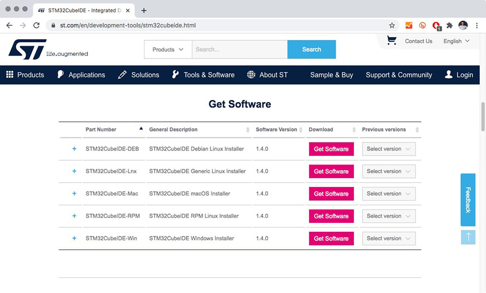

图 2.1：官方 STM 网站上的 STM32CubeIDE 下载页面


接下来的三段及其子段落几乎相同。它们仅在特定于给定操作系统（Windows、Linux 或 Mac OS）的部分有所不同。因此，请跳转到你感兴趣的段落，并跳过其余部分。

### 2.2.1 Windows - 安装工具链

Windows 安装包包含在一个 ZIP 文件中。下载完成后，解压 ZIP 归档文件并运行其中包含的可执行文件（可执行文件名结构为：st-stm32cubeide_VERSION_x86_64.exe，其中 VERSION 对应 IDE 的最新发布版本）。在安装过程中，Windows 可能会显示一个对话框，内容为：“是否允许此应用对你的设备进行更改？”，并显示信息“已验证的发布者：STMicroelectronics Software AB”。点击“是”以接受并让安装程序继续。

<!-- page: 95 -->

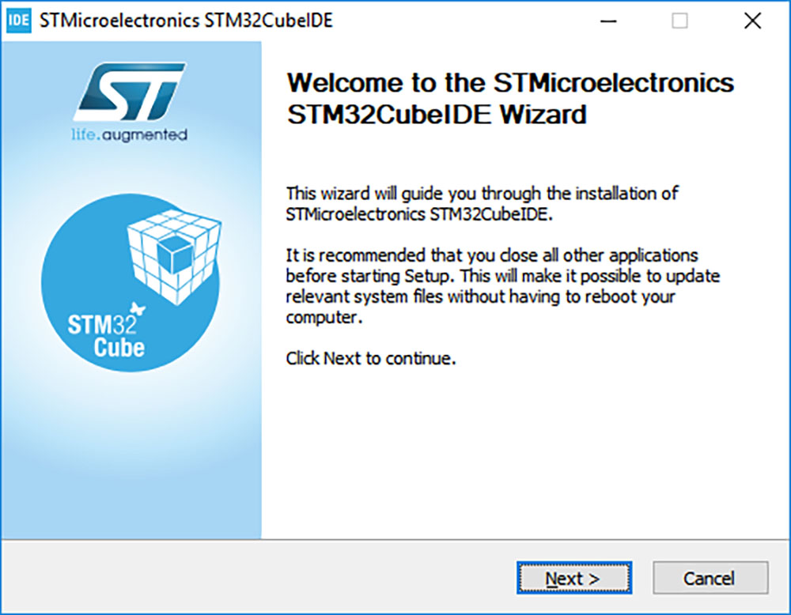

图 2.2：Windows 安装程序欢迎页面

几秒钟后，安装程序的“欢迎使用……”页面将出现，如图 2.2 所示。点击“下一步”，阅读许可协议并点击“我同意”以接受协议条款。在下一个对话框中（见图 2.3），可以选择安装位置。建议选择较短的路径，以避免因工作区路径过长而遇到 Windows 的限制。我的建议是保留默认路径（C:\ST\STM32CubeIDE）。

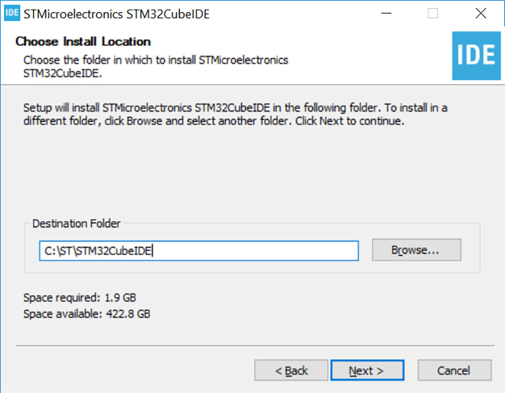

图 2.3：选择安装位置对话框

<!-- page: 96 -->


独立项目不会存储在该路径内。相反，它们被分组在一个名为“工作区”的首选位置中。这是 Eclipse 存储项目的通用方式，好消息是你可以拥有任意数量的工作区：每个工作区代表一个完全独立的环境，无论是从存储项目的角度来看，还是从 IDE 配置的角度来看。这意味着你可以根据具体需求自定义每个工作区。每个项目、每个已安装的插件、每个 IDE 和工具配置都将局限于该特定工作区。这对初学者也非常有用：弄乱 IDE 配置并破坏一些重要配置的情况并不罕见。如果发生这种情况，你只需丢弃当前工作区并创建一个新的工作区，而不会影响整体系统配置。

选择安装路径后，点击“下一步”。将显示“选择组件”对话框，如图 2.4 所示。除非你对这些选项非常熟悉，否则我的建议是保持所有选项均被勾选。随着本书内容的推进，这些组件的作用将变得更加清晰。点击“安装”按钮并等待操作完成。在此步骤中，安装程序会将 IDE 及所有相关组件复制到所选位置：Java 虚拟机、Eclipse 及其所有插件、GCC 编译器和调试器、用于 ST-LINK 调试器的 Windows 驱动程序。

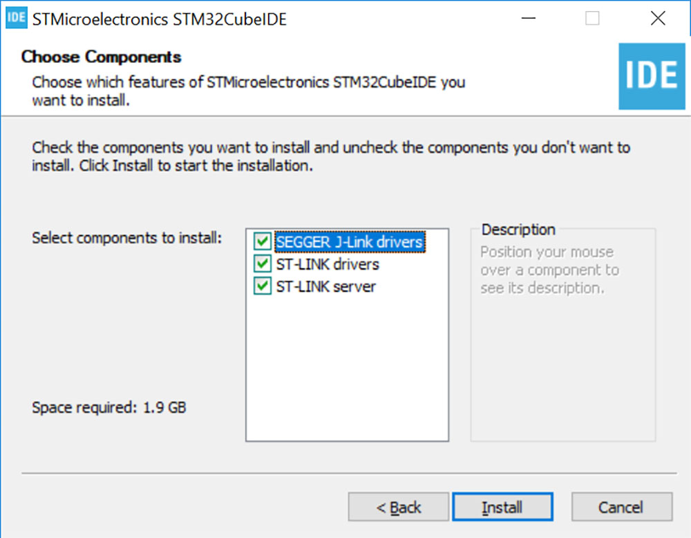

图 2.4：选择组件对话框

安装步骤结束后，点击“完成”。

下一个需要安装的工具是 STM32CubeProgrammer。它是一个软件，用于通过我们 Nucleo 板上的 ST-LINK 接口或专用的 ST-LINK 编程器将固件上传到 MCU。除了下一章之外，我们在书中不会过多使用这个工具。然而，在常见的开发生命周期中，尤其是在小批量生产时，这个工具经常派上用场。因此，我认为熟悉这个工具是合理的。

你可以从 ST 官方页面⁷下载 STM32CubeProgrammer（下载链接位于页面底部的“获取软件”部分）。下载完成后，解压

⁷http://bit.ly/2CK4aFa

<!-- page: 97 -->

.zip 包。你将找到 SetupSTM32CubeProgrammer-2.9.0.exe 文件。运行它并按照安装说明操作。

工具链的安装现已完成，如果你是 Eclipse IDE 的完全新手，可以跳转到 STM32CubeIDE 概述段落。

### 2.2.2 Linux - 安装工具链

整个安装过程将假设满足以下要求：

- 一台运行最新 Linux-64 位版本的 PC：

- – Ubuntu Linux 20.04 LTS Desktop 或更高版本 – Fedora 29 或更高版本
- 足够的硬件资源（建议至少拥有 4Gb 内存和硬盘上 20Gb 的可用空间）；这些说明应能轻松适配其他 Linux 发行版。

安装程序以不同的捆绑包形式提供，以适应各种 Linux 发行版。捆绑包的命名为 st-stm32cubeide_VERSION_ARCHITECTURE.PACKAGE，其中：

- VERSION 是实际的产品版本和构建日期（例如：1.0.0_2026_20190221_1309）
- ARCHITECTURE 是运行 STM32CubeIDE 的目标主机计算机的架构（例如：amd64）
- PACKAGE 是要安装的 Linux 包类型。支持的包包括：

– rpm_bundle.sh 用于 Fedora/CentOS – deb_bundle.sh 用于 Ubuntu/Debian – .sh 用于通用 Linux

请按以下步骤操作：

1. 在主机计算机上使用命令控制台导航到安装文件所在的位置。 2. 在控制台窗口中输入以下命令：

```text
1
$ sudo sh ./st-stm32cubeide_VERSION_ARCHITECHURE.PACKAGE
```

其中 VERSION、ARCHITECTURE 和 PACKAGE 必须根据所选的 Linux 包进行输入。

3. 按照控制台窗口中提供的进一步说明操作。

下一个需要安装的工具是 STM32CubeProgrammer。它是一个软件，用于通过我们 Nucleo 板上的 ST-LINK 接口或专用的 ST-LINK 编程器将固件上传到 MCU。除了下一章之外，我们在书中不会过多使用这个工具。然而，在常见的开发生命周期中，尤其是在小批量生产时，这个工具经常派上用场。因此，我认为熟悉这个工具是合理的。

要在 Linux 上执行 STM32CubeProgrammer，要求你的机器上已安装某些包。所需的包是：

<!-- page: 98 -->

```text
• libusb-1.0.0-dev
```

该包的安装方式因具体的 Linux 发行版而异。在 Ubuntu 中，可以在终端提示符下使用以下命令进行安装：

```text
$ sudo apt-get install libusb libusb-1.0.0-dev
```

你可以从 ST 官方页面⁸下载 STM32CubeProgrammer（下载链接位于页面底部的“获取软件”部分）。下载完成后，解压 .zip 包。你将找到 SetupSTM32CubeProgrammer-2.9.0.linux 文件。运行它并按照安装说明操作。

如果你是 Eclipse IDE 的完全新手，可以跳转到 STM32CubeIDE 概述段落。

### 2.2.3 Mac - 安装工具链

MacOS 安装包包含在一个 ZIP 文件中。下载完成后，解压 ZIP 归档文件并运行其中的 DMG 文件（文件名结构为：ststm32cubeide_VERSION_x86_64.dmg，其中 VERSION 对应 IDE 的最新发布版本）。双击 DMG 文件以让 MacOS 挂载 Apple 磁盘映像。随后会出现许可协议对话框，如图 2.5 所示。

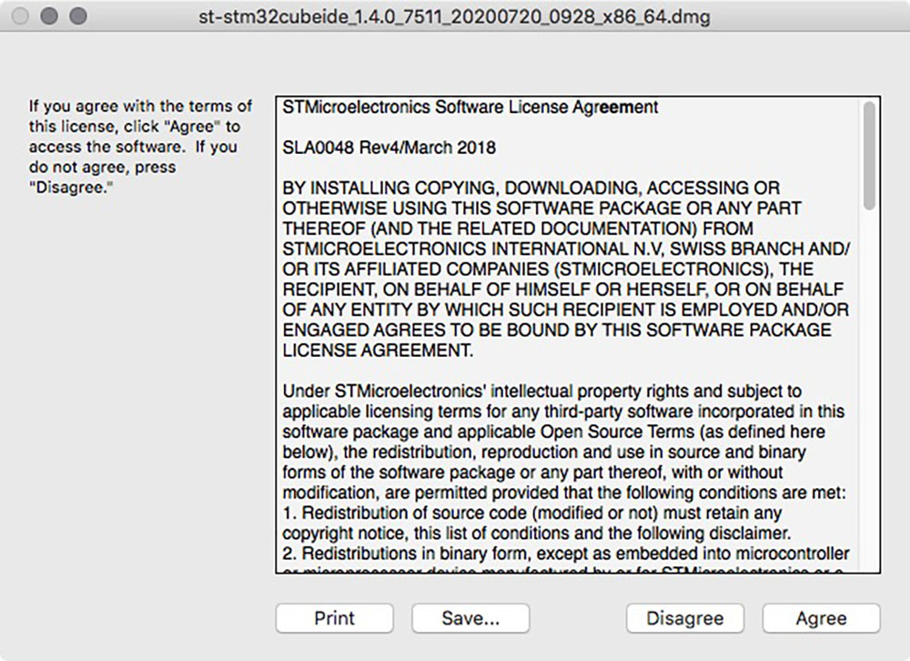

图 2.5：许可协议对话框

阅读许可协议并点击“同意”以接受协议条款并继续软件安装。随后会出现安装页面，如图 2.6 所示。在将大型 IDE 图标拖入应用程序文件夹之前，重要的是先安装 ST-LINK 服务器包。因此，点击“Install me 1st”图标（MacOS 中代表软件包的经典图标）并按照安装说明进行操作。

⁸http://bit.ly/2CK4aFa

<!-- page: 99 -->


MacOS 会阻止你安装该软件，因为它来自不受信任的网站，而非官方 App Store。不过，我假设你对 MacOS 足够熟悉，能够通过进入 MacOS 系统偏好设置 -> 安全性与隐私设置来绕过此限制。或者，你可以通过在 MacOS 终端中运行以下命令来完全禁用 MacOS Gatekeeper（该组件负责强制代码签名，并在最近的 MacOS 版本中允许运行之前验证下载的应用程序）：

```text
$ sudo spctl --master-disable
```

完成后，你可以安全地将 IDE 图标拖入应用程序文件夹，并等待操作完成。

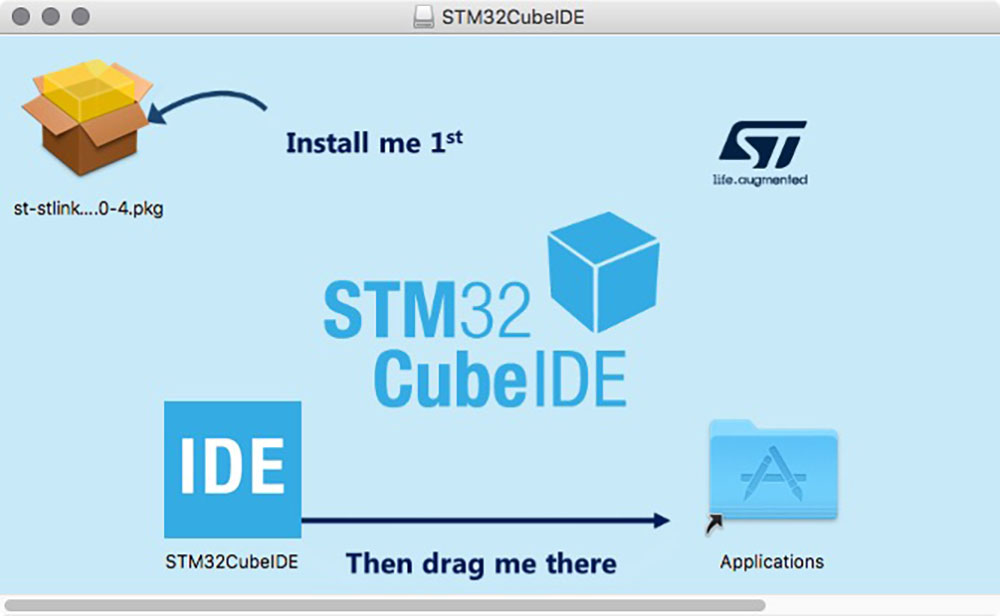

图 2.6：安装页面对话框

<!-- page: 100 -->

请仔细阅读！


MacOS 用户在首次启动应用程序时经常无法运行 STM32CubeIDE。此时会显示以下系统警告：

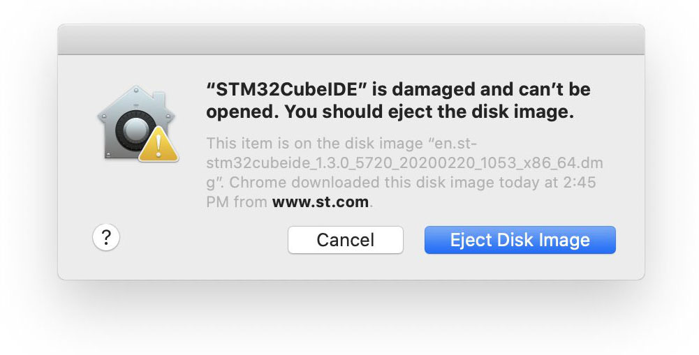

不幸的是，此错误是由于错误的扩展属性权限造成的，这主要与 MacOS X 的新路径有关，这正推动 MacOS 向某种更高级的 iOS 发展。诚实地说，作为一个非常资深且高级的 MacOS 用户，我看不到这种转变有任何好处。然而，好消息是你可以通过打开 MacOS 终端并在提示符下执行以下命令轻松解决此问题：

```text
$ xattr -c /Applications/STM32CubeIDE.app
```

这应该能修复该问题，并且你应该能够运行 STM32CubeIDE。

下一个要安装的工具是 STM32CubeProgrammer。它是一个软件，用于通过我们 Nucleo 的 ST-LINK 接口或专用的 ST-LINK 编程器将固件上传到 MCU。除了下一章之外，我们在书中不会太多使用这个工具。然而，这个工具在常见的开发生命周期中经常派上用场，特别是对于小批量生产。因此，我认为熟悉这个工具是合理的。

你可以从 ST 官方页面⁹下载 STM32CubeProgrammer（下载链接位于页面底部的“获取软件”部分）。下载完成后，解压 .zip 包。你会找到 SetupSTM32CubeProgrammer-2.9.0.app 文件。运行它并按照安装说明进行操作。

工具链安装已完成，如果你是 Eclipse IDE 的新手，可以跳转到下一段。

## 2.3 STM32CubeIDE 概述

现在我们已经完成了工具链的安装，我们可以初步查看其主要界面和功能。

⁹http://bit.ly/2CK4aFa

<!-- page: 101 -->

当你启动 Eclipse 时，系统会要求你指定一个工作区目录，如图 2.7 所示。你可以自由地将此文件夹指向硬盘上的任何位置。

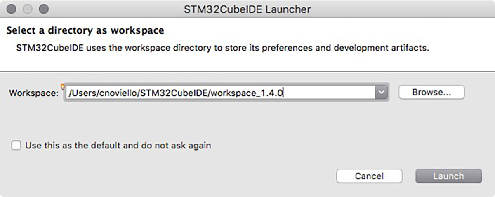

图 2.7：Eclipse 工作区选择对话框

工作区是磁盘上的一个目录，Eclipse 平台以及所有已安装的插件在此存储偏好设置、配置和临时信息。后续的 Eclipse 调用将使用此存储来恢复之前的状态。顾名思义，它是你的“工作空间”。它定义了你在 Eclipse 会话期间的关注区域。除了 IDE 配置参数外，工作区也是属于给定工作区的所有项目的仓库。

拥有多个工作区主要是程序员的个人选择，他们可以根据个人需求组织项目和 IDE 配置。如果你不打算拥有多个工作区，可以勾选“Use this as the default and do not ask again”（使用此作为默认值且不再询问）标志。Eclipse 将在启动时自动打开该工作区。


任何时候，如果你改变主意并想切换到新的工作区，你可以通过点击 File->Switch workspace->Other…（文件->切换工作区->其他…）来覆盖默认配置。图 2.7 中的对话框将再次出现，你将能够选择不同的工作区。

设置好默认工作区位置后，点击 Launch（启动）按钮，并等待 Eclipse 完全启动。

当你启动 STM32CubeIDE 时，如果你是 Eclipse 的新手，可能会对其界面感到有些困惑。图 2.8 显示了 Eclipse 首次启动时的外观。

<!-- page: 102 -->

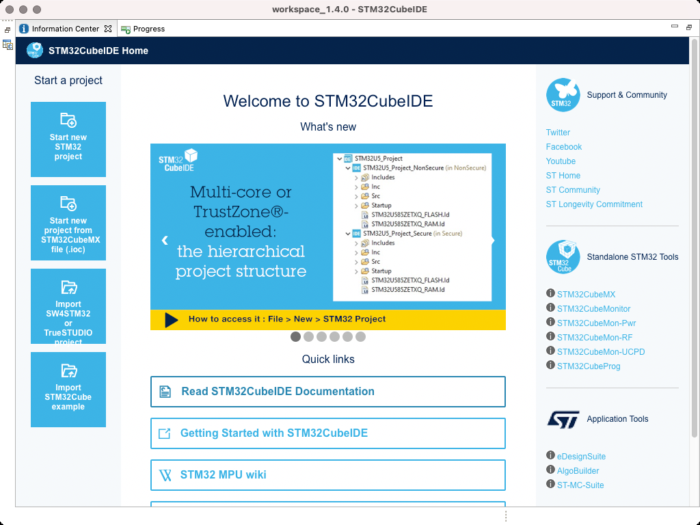

图 2.8：Eclipse 首次启动后的界面

Eclipse 是一个多视图 IDE，其组织方式使得所有功能都显示在一个窗口中，但用户可以自由地根据自己的需求安排界面。当 Eclipse 启动时，会显示一个欢迎屏幕。该欢迎选项卡的内容称为视图（view）。


图 2.9：通过点击 X 关闭欢迎视图。

要关闭欢迎视图，请点击交叉图标，如图 2.9 所示。一旦欢迎视图消失，C/C++ 透视图（perspective）就会出现，如图 2.10 所示。

<!-- page: 103 -->

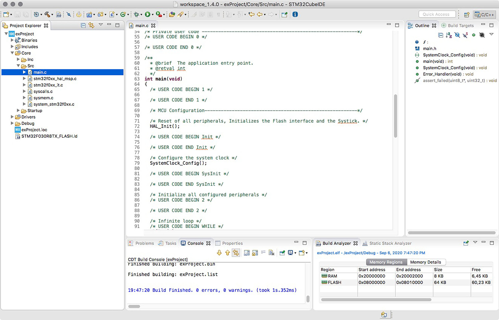

图 2.10：Eclipse 中的 C/C++ 透视图（稍后加载了 main.c 文件）

如果你想要重新显示欢迎视图，请点击主工具栏上红圈标出的图标，如下图所示。


在 Eclipse 中，透视图（perspective）是一种以与透视图功能相关的方式排列视图的方法。C/C++ 透视图专门用于编码，它展示了与源代码编辑及其编译相关的所有方面。它分为四个视图。

左侧名为 Project Explorer（项目资源管理器）的视图显示了工作区内的所有项目。居中的视图，也是最大的一个，是 C/C++ 编辑器。每个源文件显示为一个选项卡，可以同时打开多个选项卡。

Eclipse 窗口底部的视图专门用于与编译相关的多种活动，它们被细分为选项卡。例如，Console（控制台）选项卡显示编译器的输出；

<!-- page: 104 -->

Problems（问题）选项卡以方便检查的方式组织来自编译器的所有消息；Search（搜索）选项卡包含搜索结果。

右侧的视图包含其他几个选项卡。例如，Outline（大纲）选项卡显示每个源文件中包含的符号（函数、变量等），允许在文件内容中快速导航。

还有其他可用的视图（以及许多由自定义插件提供的视图）。用户可以通过进入 Window->Show View->Other… 菜单来查看它们。其中一些将在后续章节中进行分析。


有时，某个视图会被“最小化”，看起来像是从 IDE 中消失了。对于刚接触 Eclipse 的用户来说，这可能会让人困惑，不知道它去了哪里。例如，查看图 2.11 时，似乎 Project Explorer 视图已经消失，但它只是被最小化了，你可以点击红色圆圈标记的图标来恢复它。然而，有时视图确实已被关闭。这种情况发生在该视图中只有一个活动标签页且我们将其关闭时。在这种情况下，你可以进入 Window->Show View->Other… 菜单重新启用该视图。


图 2.11：最小化的 Project Explorer 视图

要在不同的透视（Perspective）之间切换，你可以使用 Eclipse 右上角提供的专用工具栏（见图 2.12）。


图 2.12：透视切换工具栏

默认情况下，另一个可用的透视是 Debug（调试），我们将在后面更详细地介绍。你可以通过进入 Window->Perspective->Open Perspective->Other… 菜单来启用其他透视。

<!-- page: 105 -->


从 Eclipse 4.6（又称 Neon）开始，透视切换工具栏默认不再显示透视名称，仅显示与透视关联的图标。这往往会令初学者感到困惑。你可以右键点击工具栏并选择 Show Text 选项，以在图标附近显示透视名称，如下所示。


Eclipse IDE 设计有一个主工具栏，其内容会根据主透视视图中选定的文件类型进行自适应调整。表 2.1 解释了工具栏中最常见且相关的图标。


表 2.1：Eclipse 主工具栏图标

随着本书主题的深入，我们将有机会看到 Eclipse 的其他功能。

<!-- source-file: 03-hello-nucleo.md -->

<!-- page: 106 -->

# 3. 你好，Nucleo！

没有哪本编程书不是从经典的“Hello world!”程序开始的。本书也将遵循这一传统。在上一章中，我们配置了用于开发 STM32 嵌入式应用的 STM32CubeIDE。因此，我们现在已经准备好开始编写代码了。

在本章中，我们将创建一个非常基础的程序：一个闪烁的 LED。我们将使用 STM32CubeIDE 在几个步骤内创建一个完整的应用程序，在此阶段，我们不会处理与 ST 硬件抽象层（Hardware Abstraction Layer, HAL）以及 MCU 图形配置器（更常被称为 STM32CubeMX）相关的方面。我意识到，本章中介绍的一些细节一开始可能并不清晰，特别是如果你完全是嵌入式编程的新手。然而，这个第一个示例将帮助我们熟悉开发环境。随后的章节，尤其是下一章，将澄清许多晦涩难懂的内容。因此，我建议你保持耐心，并尽力从以下段落中获取最大的收获。

## 3.1 创建项目

让我们创建第一个项目。我们将创建一个简单应用程序，使 Nucleo 上的 LD2 LED（绿色那个）闪烁。转到 File->New->STM32 Project。根据你当前的 IDE 配置，目标选择向导（Target Selection wizard，如图 3.1 所示）将在稍后出现。


第一次运行目标选择向导时，可能需要几秒钟才能显示出来。进度指示器会提示你正在从 ST 的服务器获取 MCU 和开发板的规格。新的 STM32 微控制器或开发套件每月都会发布，该工具的设计方式是不内置完整的部件号列表。因此，请耐心等待，让软件完成操作。

正如我们稍后将要学习的，目标选择向导是一个更复杂的软件的一部分，该软件以前被称为 STM32CubeMX。该工具旨在极大地简化特定 STM32 MCU 硬件外设的配置过程，以及生成驱动这些外设所需的所有库文件。下一章将完全基于对 STM32CubeMX 最相关功能的解释。因此，我们现在不会在此事上花费太多时间。

现在点击“Board Selector”选项卡（在图 3.1 中以浅蓝色高亮显示），展开“Type”菜单并勾选 Nucleo-64 系列开发板。在开发板列表中查找你的特定 Nucleo-64 开发板。

<!-- page: 107 -->


图 3.1：目标选择向导 - 步骤 1


如第 1 章所述，本书完全基于 Nucleo-64 开发板，且文中的示例已在表 1.18 中列出的开发板上进行了测试。然而，本书的目的是教授 STM32 编程的基础概念。我认为，将本文中的此示例及其他所有示例适配到其他任何开发板（Nucleo-32、Nucleo-144、Discovery 等）应该相对容易。

<!-- page: 108 -->


图 3.2：项目向导 - 步骤 2

在列表中选中开发板后，点击“Next”按钮。在相应字段中指定项目名称（在我们的情况下是 hello-nucleo，但你可以自由选择最适合你的名称），并保持所有其他标志为默认配置，如图 3.1 所示。点击“Finish”开始生成项目。STM32CubeIDE 会询问你是否希望以默认模式初始化所有外设，如图 3.3 所示。这是什么意思？


图 3.3：项目向导 - 步骤 3

在每个开发板上，目标 MCU（即上传固件的主 MCU）既配备了内部外设（例如，实时时钟 - RTC），又通过单独的 GPIO 引脚连接到多个外部其他设备。例如，在每个 Nucleo-64 开发板上，一个 GPIO 直接连接到标记为 PCB 上 LD2 的绿色 USER LED。要使用这些“默认”外设，我们必须正确配置内部外设和相应的 GPIO。通过回答“是”，我们指示 IDE 自动执行所有必要的配置，以使用 Nucleo-64 开发板的所有内部和外部默认外设。随着我们深入本书，你将学习如何自行配置每个外设。然而，在此阶段，为了保持简单，点击“是”，让 IDE 施展魔法。

STM32CubeIDE 将开始生成新项目。如果这是你第一次为你的 Nucleo 开发板的 STM32 系列（即 STM32F0、STM32F4 等）创建项目，IDE 需要下载相应的 Cube 固件包（例如，如果你的开发板是 Nucleo-F401RE，则需要下载 STM32F4 系列的 stm32cube_fw_f4_v1XXX.zip 包）。

<!-- page: 109 -->

这些包包含几个相关组件：

- 给定 STM32 系列的完整 HAL：硬件抽象层（Hardware Abstraction Layer, HAL）是一组允许驱动微控制器外设和内核功能而无需处理特定 MCU 细节的库。本书完全基于 STM32CubeHAL，我们将学习关于这个相当复杂的库的许多内容。
- 额外的中间件包：一些 STM32 MCU 集成了高级外设，需要使用额外的库（由 ST 或第三方开发）。例如，要编程某些 STM32 MCU 中集成的 USB 控制器，必须使用 ST 免费提供的完整 USB 协议栈。每个 Cube 固件包都附带一组中间件库，我们将在本书的第三部分分析其中几个。
- 开发板的示例项目：ST 为其开发板提供了许多完整且可运行的示例。每个示例都旨在展示如何使用开发板的特定功能。每个 Cube 固件包集成了多个示例，你可以通过点击目标选择向导中的“Example Selector”选项卡（见图 3.1）来浏览完整的示例列表。


图 3.4：Cube 固件包下载对话框

根据 STM32 系列的不同，Cube 固件包的大小可能相当大。基本规则是，STM32 系列越强大，相应的 Cube 固件就越大。因此，请耐心等待完整的下载，如特定对话框所示（见图 3.4）。

## 3.2 向生成的代码中添加有用的内容

图 3.5 展示了项目生成后在 STM32CubeIDE 中显示的内容。项目资源管理器（Project Explorer）视图显示了项目结构。这是一级文件夹的内容（从上到下）¹：

```text
Includes
```

此文件夹显示了所有属于 GCC 包含文件夹（Include Folders）² 的文件夹。

¹我们不会在此处描述所有生成的文件和文件夹。这只是一个简要介绍。在后续章节中，我们将有机会更好地分析它们。现在不要在上面花太多时间。 ²每个 C/C++ 编译器都需要知道在哪里查找包含文件（以 .h 结尾的文件）。这些文件夹被称为包含文件夹（或更准确地说是包含路径），并且必须使用 -I 参数向 GCC 指定其路径。然而，Eclipse 可以自动为我们完成此操作，并且包含文件夹在视觉上显示了 GCC 将查找包含文件的搜索路径。

<!-- page: 110 -->

```text
Core
```

此 Eclipse 文件夹包含生成的项目，由构成我们应用程序的几个 .c 文件组成。其中一个文件是 src/main.c，其中包含我们稍后将进行定制的 int main(void) 例程。Drivers

此 Eclipse 文件夹通常包含许多相关库的头文件和源文件（例如，ST CubeHAL 和 CMSIS 包）。我们将在下一章中更深入地了解它们。hello-nucleo.ioc

此文件是在设备配置工具（Device Configuration Tool）视图中图形化显示的 STM32CubeMX 项目（项目生成后的默认主视图，如图 3.5 所示）。我们将在下一章中深入分析 STM32CubeMX 的界面和功能。


图 3.5：完整项目生成后的 STM32CubeIDE 界面

我们现在准备好开始处理真正的核心应用程序了。IDE 生成的项目自动包含构建自洽应用程序所需的所有代码。为了让 LD2 LED 闪烁，我们只需要在 main() 函数中添加两行代码，该函数是我们自定义应用程序的入口点³。因此，在项目资源管理器窗格中，展开 Core->Src 文件夹并双击 main.c 文件。转到大约第 66 行，在那里你可以找到 main() 函数的定义。在这里你可以找到

³经验丰富的 STM32 程序员知道，说 main() 函数是 STM32 应用程序的入口点是不恰当的。固件的执行开始得早得多，从调用一些重要的设置例程开始，这些例程为固件创建执行环境。然而，从应用程序的角度来看，其起点在 main() 函数内部。后续章节将详细展示 STM32 微控制器的引导过程。

<!-- page: 111 -->

四个例程⁴ 的调用：

- HAL_Init()：此函数初始化 CubeHAL 框架。它负责 MCU 的最初初始化。我们将在书中稍后分析此函数。
- SystemClock_Config()：此函数起着真正关键的作用，因为它配置 MCU 以使用可能的时钟源之一工作。STM32 MCU 提供了使用几种不同时钟源的可能性。这是一个高级主题，我们将在第 10 章中深入探讨。
- MX_GPIO_Init()：此函数根据在 STM32CubeMX 中完成的图形化配置初始化 I/O 引脚。在我们的情况下，它将配置与 LD2 LED 关联的 GPIO 引脚。关于这些主题的更多信息见第 6 章。
- MX_USART2_UART_Init()：此函数初始化 UART2 外设，该外设在所有 Nucleo 板上都连接到 ST-LINK 接口。关于此主题的更多信息见第 8 章。

紧接着这四个初始化例程的调用之后，你可以找到一个 while 循环，这是一个无限循环，所有固件活动都在其中发生。在这里你可以添加两个函数调用，如下所示在第 101-102 行。

```text
Filename: src/main.c
66
int main(void)
67
{
68
/* USER CODE BEGIN 1 */
```

69

```text
70
/* USER CODE END 1 */
```

71

```text
72
/* MCU Configuration--------------------------------------------------------*/
```

73

```text
74
/* Reset of all peripherals, Initializes the Flash interface and the Systick. */
75
HAL_Init();
```

76

```text
77
/* USER CODE BEGIN Init */
```

78

```text
79
/* USER CODE END Init */
```

80

```text
81
/* Configure the system clock */
82
SystemClock_Config();
```

83

```text
84
/* USER CODE BEGIN SysInit */
```

85

```text
86
/* USER CODE END SysInit */
```

87

```text
88
/* Initialize all configured peripherals */
89
MX_GPIO_Init();
```

⁴根据你的开发板，特别是如果你没有使用 Nucleo-64，你可能会发现 main() 函数内部调用了额外的例程。这意味着你的开发板提供了比标准 Nucleo-64 板更多的外设（请记住，当 STM32CubeIDE 询问我们是否要自动初始化所有外设时，我们回答了“是”。因此，如果你的 main() 与这里显示的略有不同，请不要太在意。

<!-- page: 112 -->

```text
90
MX_USART2_UART_Init();
91
/* USER CODE BEGIN 2 */
```

92

```text
93
/* USER CODE END 2 */
```

94

```text
95
/* Infinite loop */
96
/* USER CODE BEGIN WHILE */
97
while (1)
98
{
99
/* USER CODE END WHILE */
100
/* USER CODE BEGIN 3 */
101
HAL_GPIO_TogglePin(LD2_GPIO_Port, LD2_Pin);
102
HAL_Delay(500);
103
}
104
/* USER CODE END 3 */
```

你会注意到，由 CubeMX 生成的代码充满了这些注释区域：


```text
/* USER CODE BEGIN 1 */
...
/* USER CODE END 1 */
```

这些注释是做什么用的？CubeMX 的设计使得如果你更改硬件配置，你可以重新生成项目代码而不会丢失你添加的代码片段。将你的代码放在这些“受保护区域”内应该能保证你不会丢失你的工作。然而，我必须承认，有时 CubeMX 可能会把生成的文件搞得一团糟，用户代码会丢失。因此，我建议始终生成另一个独立的项目，并将更改的代码复制粘贴到应用程序文件中。这也让你完全控制你的代码。

代码应该是自解释的。HAL_GPIO_TogglePin() 函数简单地反转连接到 LD2 LED 的 PIN 的逻辑状态（这对应于所有 Nucleo-64 板上 GPIO 端口 A 的 PIN 5），而 HAL_Delay() 函数只是一个持续 500ms 的忙等待自旋：因此 LD2 将以 1HZ 的频率闪烁。

<!-- page: 113 -->


我们如何知道 LED 连接到哪个引脚？ST 提供了 Nucleo 板的原理图⁵。原理图是使用 Altium Designer CAD 制作的，这是一种在专业世界中使用的相当昂贵的软件。然而，幸运的是，ST 提供了一个包含原理图的方便 PDF。查看第 4 页，我们可以看到 LED 连接到 PA5 引脚⁶，如图 3.6 所示。


图 3.6：LD2 连接到 PA5

PA5 是 GPIOA 端口 PIN5 的缩写，这是在 STM32 世界中指示 GPIO 的标准方式。最后，STM32CubeMX 自动定义宏 LD2_GPIO_Port 和 LD2_Pin，以便它们的展开对应于 GPIOA 端口和 PIN5。

### 现在我们可以编译项目了。转到菜单 Project->Build Project。过一会儿，我们应该会在输出控制台⁷中看到类似以下内容。

```text
arm-none-eabi-size
hello-nucleo.elf
arm-none-eabi-objdump -h -S
hello-nucleo.elf
> "hello-nucleo.list"
arm-none-eabi-objcopy
-O binary
hello-nucleo.elf
"hello-nucleo.bin"
text
data
bss
dec
hex
filename
8224
20
1636
9880
2698
hello-nucleo.elf
Finished building: default.size.stdout
Finished building: hello-nucleo.bin
Finished building: hello-nucleo.list
15:22:52 Build Finished. 0 errors, 0 warnings. (took 5s.769ms)
```

⁵http://bit.ly/1FAVXSw ⁶除了 Nucleo-F302RB 之外，其 LD2 连接到 PB13 端口。稍后会有更多介绍。⁷每个二进制段（text、bss 等）所需的字节数可能与你的不同。这是因为不同 STM32 系列之间的 HAL 存在差异，以及编译器优化级别不同所致。请不要关注这些细节，稍后它们会变得清晰得多。

<!-- page: 114 -->

## 3.3 将 Nucleo 连接到 PC

一旦我们编译了测试项目，就可以使用连接到 micro-USB 端口（在图 3.7 中称为 VCP）的 USB 线将 Nucleo 板连接到你的计算机。你应该至少能看到两个 LED 亮起。

仔细阅读


请确保 USB 端口能够为板卡提供足够的电力。强烈建议使用能够提供至少 500mAh 的 USB 端口或自供电的外部集线器。


图 3.7：Nucleo 板及其主要接口

第一个是 LD1 LED，在图 3.7 中标记为 ST-LINK LED。它是一个红/绿 LED，用于指示 ST-LINK 的活动状态：一旦板卡连接到计算机，该 LED 为绿色；在调试会话期间或向 MCU 上传固件时，它会交替闪烁绿色和红色。

另一个在板卡连接到计算机时会点亮的 LED 是 LD3，在图 3.7 中标记为 POWER LED。它是一个红色 LED，当 USB 端口完成枚举时点亮，即 ST-LINK 接口被计算机操作系统正确识别为 USB 外设。板卡上的目标 MCU 仅在该 LED 点亮时才通电（这意味着 ST-LINK 接口还负责管理目标 MCU 的供电）。

最后，如果你还没有用自定义固件刷写你的板卡，你会看到 LD2 LED，即图 3.7 中标记为 USER LED 的绿色 LED，也在闪烁：这是因为 ST 预加载了

<!-- page: 115 -->

一个使 LD2 LED 闪烁的固件。你可以通过按下图 3.7 中标记为 USER BTN 的开关（蓝色那个）来改变闪烁频率。

我们稍后会将板载固件替换为我们之前制作的那个。在继续这一步之前，重要的是要确保我们 Nucleo 板上的 ST-LINK 调试器配备了最新的 ST-LINK 2.1 固件。

### 3.3.1 ST-LINK 固件升级

警告


请仔细阅读本段。不要跳过这一步！

我购买了几块 Nucleo 板，发现所有板卡通常都带有相当旧的 ST-LINK 固件。为了使用最新的 STM32CubeIDE，固件必须至少更新到 V2J37.x 版本。

升级过程可以很容易地通过 STM32CubeIDE 完成。使用 USB 线连接你的 Nucleo 板，然后转到 Help->ST-LINK Upgrade。ST-LINK Upgrade 程序会出现，如图 3.8 所示。


图 3.8：ST-LINK Upgrade 程序

点击 Refresh device list：连接的板卡应被识别为 ST-LINK/V2-1。点击 Open in update mode。ST-LINK Upgrade 将显示你的 Nucleo 固件是否需要更新（指出不同的版本，如图 3.8 所示）。如果需要，点击 Upgrade 按钮并等待固件更新完成。

<!-- page: 116 -->

ST-LINK 固件升级错误


当你点击 Open in update mode 按钮时，上述过程可能会失败。STLinkUpgrade 工具可能会显示错误信息 Error connecting to device ST-LINK/V2- 1 (error 0x1); check the USB connection and refresh device list，即使板卡已正确连接到 PC。这通常是由于板卡供电不足造成的。尝试使用自供电 USB 集线器或使用另一个 USB 端口。在最近的 iMac 上，如果通过集成 USB 端口的 Apple 键盘连接板卡，这种错误相当常见。

## 3.4 使用 STM32CubeProgrammer 刷写 Nucleo

我们在第 2 章中安装了 STM32CubeProgrammer，现在我们将使用它。启动程序并使用 USB 线将你的 Nucleo 连接到 PC。点击图 3.9 中用红圈圈出的刷新按钮。一旦 STM32CubeProgrammer 识别了板卡，其序列号将出现在 Serial number 框中，如图 3.9 所示。


图 3.9：STM32CubeProgrammer 工具显示的 ST-LINK 接口序列号

仔细阅读


如果显示的是标签 “Old ST-LINK Firmware” 而不是 ST-LINK 接口的序列号，那么你需要将 ST-LINK 固件更新到最新版本。点击 ST-LINK Configuration 窗格底部的 Firmware upgrade 按钮，并按照上一段中报告的相同说明进行操作。

一旦识别了 ST-LINK 板卡，点击 Connect 按钮。过一会儿，你将看到闪存的内容，如图 3.10 所示。好的，让我们最终将示例固件上传到板卡。点击 Erase & programming 图标（左侧第二个绿色图标）。然后，点击 File programming 中的 Browse 按钮。进入你的 Eclipse 工作区目录（默认情况下，在 Windows 中路径为 %HOMEPATH%\STM32CubeIDE\workspace_1.X.0，在 Linux 和 Mac OS 中为 ∼/STM32CubeIDE7workspace_- 1.X.0，其中 1.X.0 对应你的 STM32CubeIDE 的确切版本）。然后进入 hello_nucleo\Debug 子文件夹，选择名为 hello_nucleo.elf 的文件。勾选 Verify programming 和 Run after programming 标志，然后点击 Start Programming 按钮开始刷写。刷写过程结束后，你的 Nucleo 绿色 LED 将开始闪烁。

<!-- page: 117 -->

### 恭喜：欢迎来到 STM32 世界 ;-)


图 3.10：连接到 Nucleo 开发板时的 STM32CubeProgrammer 界面

<!-- page: 118 -->

Eclipse 插曲

Eclipse 允许我们在源代码中轻松导航，而无需手动在源文件之间跳转以查找函数定义的位置。例如，假设我们想查看函数 MX_GPIO_Init() 的代码实现。要跳转到其定义处，请高亮显示该函数调用，右键单击并选择“Open declaration entry”，如下面的图像所示。


或者，您可以按住 Ctrl 键（在 MacOS 上为 CMD⌘）同时单击给定的符号。此外，在符号导航过程中，可以使用 Eclipse 工具栏上的两个专用按钮在已打开的源文件之间进行导航，如下所示。


Eclipse 的另一个有趣功能是能够展开复杂的宏。例如，右键单击一个宏并选择“Explore macro expansion”条目。随后将出现如下上下文窗口。


有时，Eclipse 会使其索引文件混乱，导致无法在源代码中进行导航。为了解决这个问题，您可以前往 Project->C/C++ Index->Rebuild 菜单，强制 Eclipse 重建其索引。

<!-- source-file: 04-stm32cubemx-tool.md -->

<!-- page: 119 -->

# 4. STM32CubeMX 工具

通过几条汇编指令即可配置 8 位微控制器外设的时代已经远去。尽管仍有一群根深蒂固的开发者坚持使用纯汇编代码¹开发嵌入式软件，但在当今的项目开发中，时间是最昂贵的资源，对于 STM32 这样相当复杂的硬件平台，获得尽可能多的帮助至关重要。此外，在现代 32 位 MCU 中，尤其是那些拥有大量 I/O 端口的型号，即使驱动一个简单的 GPIO 也可能需要你在长达一千页的数据手册中翻阅数十页。信不信由你，如果没有 ST HAL 的专门支持，仅仅初始化 STM32H7 上像 DCMI 或 ETH 接口这样的高级外设，真的会令人非常沮丧。最后，要了解 GPIO 的所有可能配置选项，要求你对特定 STM32 型号所支持的所有外设、其特定的引脚布局和配置有完整的概览。幸运的是，ST 提供了一款强大且便捷的工具，使我们无需关注外设配置底层的所有特定实现细节，这就是 STM32CubeMX。

STM32CubeMX² 是每位 STM32 开发者的瑞士军刀，特别是对于 STM32 平台的新手来说，它是一款基础工具。这是一款相当复杂的软件，由 ST 免费分发，既可以作为从 ST 网站下载的独立工具使用，也可以作为 STM32CubeIDE 内部的集成组件使用。

在本章中，我们将了解 CubeMX 的工作原理，以及如何利用它生成的代码从零开始创建可运行的项目。这将使我们能够创建更好的代码，并准备好与 STM32Cube HAL 的其余部分集成。然而，本章不能替代 CubeMX 工具的官方 ST 文档³，该文档长达 350 多页，深入解释了其所有功能。

## 4.1 CubeMX 工具简介

CubeMX 是用于配置我们项目中选定的微控制器的工具。它既用于选择正确的硬件连接，也用于生成配置 ST HAL 所需的代码。

CubeMX 是一个以 MCU 为中心的应用程序。这意味着该工具执行的所有活动都基于：

- STM32 MCU 的系列（F0、F1 等）。

¹ 可能有一天，有人会向他们解释，除了少数特定情况外，现代编译器从 C 语言生成的汇编代码比手工直接编写的汇编代码更好。然而，我们必须说，这些习惯仅限于 PIC12 等超低成本 8 位 MCU。 ² 在本书其余部分，STM32CubeMX 的名称将简化为 CubeMX。 ³ https://bit.ly/3k8HeE2

<!-- page: 120 -->

- 为我们设备选择的封装类型（LQFP48、BGA144 等）。
- 我们项目中需要的硬件外设（USART、SPI 等）。

- 选定的外设如何映射到微控制器引脚。
- MCU 的一般配置（如时钟、电源管理、NVIC 控制器等）

除了与硬件相关的功能外，CubeMX 还能够处理以下软件方面：

- 针对给定 MCU 系列的 ST HAL 管理（CubeF0、CubeF1 等）。
- 配置额外的软件库，称为中间件（Middlewares）库，我们可能在项目中需要它们来驱动特定外设或管理复杂的软件栈（FatFs、LwIP、FreeRTOS 等）。
- 我们将用于构建固件的开发环境（IAR EWARM、Keil MDK- ARM、STM32CubeIDE）⁴。

在 CubeMX 中生成项目本质上是一个两阶段的活动。第一步是通过目标选择向导（Target Selection wizard）选择正确的 STM32 MCU 或开发板。第二步是根据项目需求配置 MCU 和任何所需的中间件库。让我们深入研究这两个阶段。

### 4.1.1 目标选择向导

我们在第 3 章⁵中已经使用 CubeMX 生成了 hello-nucleo，即我们的第一个 STM32 项目。我们看到项目生成从目标选择视图开始。该视图是一个基于选项卡的窗口，有四个主要选项卡（见图 4.1）：MCU/MPU 选择器、板卡选择器、示例选择器和交叉选择器。让我们更深入地分析它们。

⁴ CubeMX 的独立版本不仅可以为官方 STM32CubeIDE 生成项目代码和配置，还可以为其他商业 IDE 生成。然而，在本书中，我们将仅关注在 STM32CubeIDE 内部使用 CubeMX 的相关方面。 ⁵ ch3-hello-nucleo-project

<!-- page: 121 -->


图 4.1：CubeMX MCU/MPU 选择器

#### 4.1.1.1 MCU/MPU 选择器

第一个选项卡允许从整个 STM32 产品组合中选择一个微控制器。多个过滤器有助于为用户应用识别正确的微控制器。

- 内核：此过滤器允许仅选择属于选定 Cortex-M 内核（-M0、M4 等）的 MCU。
- 系列（Series）：使用此过滤器，我们可以仅显示属于选定 STM32 系列（F0、F4 等）的 MCU。
- 产品线（Line）：此过滤器允许进一步选择属于子系列（如 Value line 等）的 MCU。
- 封装（Package）：此过滤器允许选择具有所需物理封装（LQFP、WLCSP 等）的所有 MCU。
- 其他（Other）：此部分提供多个过滤器，允许根据预算价格、I/O 数量、FLASH、SRAM 和 EEPROM 内存的尺寸来限制 MCU。
- 外设（Peripheral）：此部分允许仅选择具有所需集成外设的 MCU。

<!-- page: 122 -->


图 4.2：CubeMX 板卡选择器

#### 4.1.1.2 开发板选择器

开发板选择器（Board Selector）选项卡允许在所有官方 ST 开发板中进行筛选（参见图 4.2）。多个筛选器有助于识别正确的开发板。

- 类型（Type）：此筛选器允许将选择范围限制为属于特定系列（如 Nucleo-64、Discovery、Evaluation Board 等）的开发板。
- MCU/MPU 系列（MCU/MPU Series）：使用此筛选器，可以仅显示目标微控制器（MCU）属于所选 STM32 系列（如 F0、F4 等）的开发板。
- 其他（Other）：此部分提供两个筛选器，允许根据预算价格或振荡器频率限制微控制器（根据本作者的观点，这不是一个非常有用的筛选器）。
- 外设（Peripheral）：此部分允许根据所需的集成外设选择开发板。

#### 4.1.1.3 示例选择器

多年来，ST 开发了数千个示例，以展示如何使用 STM32 产品线的单个外设或扩展中间件（Middleware）。示例选择器（Example Selector）选项卡允许在超过 5,000 个示例中进行筛选（参见图 4.3）。多个筛选器有助于识别正确的示例。

- 名称（Name）：此筛选器允许将示例列表限制为具有特定项目名称的示例（每个示例通常可用于多个微控制器和/或开发板）。

<!-- page: 123 -->

- 关键字（Keyword）：此筛选器根据给定的搜索关键字限制示例列表。
- 开发板（Board）：此筛选器选择针对特定目标开发板的所有示例。
- MCU/MPU：此筛选器选择针对特定目标微控制器的所有示例。
- 项目类型（Project Type）：此筛选器允许在应用程序（Application）、演示（Demonstration）和示例（Example）项目之间进行选择；好吧，以我卑微的观点来看，他们在这个字段上只是吹毛求疵。
- 基于驱动程序（Based on driver）：使用此筛选器可以选择那些使用 CubeHAL、CubeHAL-LL 或两者混合制作的示例；稍后会有更多介绍。
- 中间件（Middleware）：此筛选器允许选择所有展示特定中间件库用法的示例。
- MCU/MPU 库（MCU/MPU Library）：此筛选器可能会引起一点误解，因为其用途是选择所有展示如何编程特定外设的示例。
- 开发板支持包库（Board Support Package Library）：许多 STM32 开发套件集成了额外外设，例如 LCD 显示屏、DCMI 摄像头、MEMS 传感器等。为了测试这些额外外设，ST 提供了有用的开发板支持包（简称 BSP）库。当你需要在自定义开发板上驱动类似外设时，这些免费库非常有用。此筛选器允许选择使用特定 BSP 库的示例。


图 4.3：CubeMX 示例选择器

<!-- page: 124 -->

#### 4.1.1.4 交叉选择器

如果你习惯使用其他供应商（Microchip、Renesas 等）的微控制器，并且正在考虑将电子开发板移植到 STM32 微控制器，交叉选择器（Cross Selector）部分可能有助于你识别正确的替代方案。然而，在我看来，这个工具在寻找特定 STM32 微控制器的替代方案时工作得很好。如果 STM32 微控制器在市场上缺货（这在当今时代绝非罕见），这可能特别有用。交叉选择器工具（如图 4.4 所示）提供了一个匹配百分比，让你了解建议的替代方案与你当前微控制器的差异程度。然而，请始终手边备好数据手册，并仔细检查即使是非主要规格，例如 GPIO 的物理行为（电压容差、摆率等）。


图 4.4：CubeMX 交叉选择器

### 4.1.2 微控制器和中间件配置

一旦项目生成完毕，STM32CubeIDE 会自动打开项目文件夹中名为 <project-name>.ioc 的文件。此文件是 CubeMX 的主项目文件，包含在 CubeMX 中执行的所有配置。基于这些配置，CubeMX 将生成相应的项目结构，包括使用所选外设和中间件组件所需的所有源文件和库。

<!-- page: 125 -->

当打开 .ioc 文件时，CubeMX 会显示设备配置工具（Device Configuration Tool），如图 4.5 所示。


图 4.5：CubeMX 设备配置工具视图

在 CubeMX 视图的上部，你可以看到一个上下文菜单，分为浅蓝色和深蓝色。菜单分为四个主要选项卡，每个选项卡都有其专用的视图。让我们简要介绍它们。

#### 4.1.2.1 引脚布局视图与配置

引脚布局与配置（Pinout & Configuration）视图是第一个视图，它又分为几个子部分。右侧包含带有所选外设和 GPIO 的微控制器表示，ST 称之为引脚布局视图（Pinout view）。它允许轻松地在微控制器配置内部导航，是配置微控制器的便捷方式。⁶ 亮绿色的引脚表示已启用。这意味着 CubeMX 将生成必要的代码，根据绑定的外设配置该引脚。例如，考虑图 4.5 中的项目配置，对于引脚 PA5，CubeMX 将生成所需的 C 代码，将其设置为通用输出引脚以驱动 LD2 LED⁷。相反，对于 PA2 引脚，CubeMX 将生成代码将其配置为 USART TX 引脚。

⁶ 在此上下文中，引脚（pin）和信号（signal）可以互换使用。⁷ 在某些 Nucleo 开发板上，LD2 LED 连接到不同的引脚。例如，在 Nucleo-F302 上，LD2 连接到 PB13 引脚。在配置之前，请查阅你特定开发板的手册。

<!-- page: 126 -->

当相应外设未启用时，引脚显示为橙色。例如，在图 4.6 中，PA2⁸ 和 PA3 引脚已启用，CubeMX 将生成相应的 C 代码来初始化它们，但关联的外设（USART2）未启用，因此不会自动生成用于设置该外设的 USART 相关代码。浅黄色的引脚是电源引脚，其配置无法更改。BOOT 和 RESET 引脚显示为卡其色，其配置无法更改。


图 4.6：外设的替代映射

当鼠标指针悬停在微控制器引脚上时，会显示上下文工具提示（参见图 4.7）。例如，引脚 PB3 的上下文工具提示告诉我们，该信号映射到串行线调试（Serial Wire Debug, SWD）接口，并作为串行线输出（Serial Wire Output, SWO）引脚。此外，还显示了引脚编号（本例中为 55）。


图 4.7：上下文工具提示有助于理解信号用途

具有较高引脚数量的 STM32 微控制器允许将外设映射到不同的引脚。例如，在 STM32F401xE 微控制器中，SPI2 MOSI 信号可以映射到引脚 PC2 或 PB14。通过 Ctrl+点击引脚，CubeMX 可以轻松显示允许的替代方案。如果存在替代引脚，它会以蓝色显示（仅当引脚不处于复位状态——即已启用时——才显示替代方案）。例如，在图 4.6 中，我们可以看到，如果对 PC2 引脚执行 Ctrl+点击，PB14 信号会以蓝色高亮显示⁹。这在开发板布局期间非常有用。如果无法或不方便将信号布线到该引脚，或者该引脚需要用于其他功能，使用替代引脚可能会简化开发板设计。

⁸ 本节中显示的引脚配置是指 STM32L073RZ 微控制器。⁹ 请注意，在最近的 CubeMX 版本中，Ctrl+点击的行为略有变化。要显示替代引脚，你需要在 Ctrl+点击后按住鼠标，直到替代引脚开始闪烁。第一次做时并不直观。

<!-- page: 127 -->

引脚可能会简化开发板。


图 4.8：引脚的替代功能

同样地，大多数微控制器（MCU）引脚可以具有替代功能。点击引脚时会显示一个上下文菜单。这允许我们选择希望为该信号启用的功能。

这种灵活性会导致信号功能之间产生冲突。CubeMX 会尝试自动解决这些冲突，将信号分配给另一个引脚。固定引脚（Pinned signals）是指其功能被锁定到特定引脚的引脚，从而防止 CubeMX 选择替代引脚。当冲突导致某个外设无法使用时，芯片视图（Chip View）中的引脚模式会被禁用，并且该引脚会被标记为橙色。要将输入/输出（I/O）标记为固定，请右键点击引脚并选择“Pin locking”（引脚锁定）选项。

CubeMX 还提供了一个非常便捷的功能：可以为每个单独的 MCU 信号定义自定义标签。通过右键点击一个已启用的引脚，您可以选择“Enter User Label”（输入用户标签）选项。随后会出现一个上下文弹出窗口，如图 4.9 所示。标签的形式可以是 LABEL [Comment]。LABEL 部分将用于在 main.h 文件中生成相应的宏，而 [Comment] 部分只是显示在引脚布局视图（Pinout View）中供开发人员参考的注释。


图 4.9：如何为 MCU I/O 添加自定义标签

作为引脚布局视图（Pinout view）的替代视图，系统视图（System view）提供了所有可通过软件配置的组件概览：GPIO、外设、DMA、NVIC、中间件（Middleware）以及额外的软件组件。可点击的按钮允许打开给定组件的配置选项（模式和配置面板）。按钮图标的颜色反映了配置状态。

<!-- page: 128 -->


表 4.1：CubeMX 在配置窗格中显示组件列表的方式

在引脚布局与配置视图（Pinout & Configuration view）的左侧，我们有类别列表（在 ST 官方文档中也称为组件列表），既可以按字母顺序显示，也可以按类别显示。默认情况下，它包含目标 MCU 支持的外设和中间件组件列表，这是一种启用/禁用并配置所需外设和软件中间件的便捷方式。从该列表中选择一个条目会打开两个附加面板（模式和配置），允许用户设置其功能模式并配置

<!-- page: 129 -->

将包含在生成代码中的初始化参数。

表 4.1 展示了组件列表视图中使用的图标和颜色方案，以及模式面板中对应的颜色方案。

- 情况 1：表示该外设可用且当前处于禁用状态，其所有可能的模式均可使用。例如，对于 USART 接口，该外设的所有可能模式（异步、同步、IrDA 等）均可用。
- 情况 2：表示该外设因与另一个外设冲突而被禁用。这意味着两个外设使用相同的 GPIO，因此无法同时使用它们。将鼠标悬停在上面会显示涉及冲突的另一个外设。例如，对于 STM32F401RE MCU，不可能同时使用 I2S2 和 SPI2 引脚。
- 情况 3：表示该外设已配置（至少设置了一种模式），且其他所有模式均可用。绿色对勾表示所有参数已正确配置，洋红色叉号表示未正确配置。
- 情况 4：表示该外设未配置（未设置任何模式），且其至少一种模式不可用。
- 情况 5：表示该外设未配置（未设置任何模式），且没有任何模式可用。将鼠标悬停在外设名称上可以显示描述冲突的工具提示。

<!-- page: 130 -->

#### 4.1.2.2 时钟配置视图


图 4.10：CubeMX 时钟视图

时钟配置视图（Clock Configuration view）是进行所有与时钟管理相关的配置的面板。在这里，我们可以设置主内核和外设的时钟。所有时钟源和 PLL 的配置都以图形方式呈现（见图 4.10）。用户第一次看到此视图时，可能会被大量的配置选项所困惑。然而，经过一点练习，这是处理 STM32 时钟配置（与 8 位 MCU 相比相当复杂）的最简单方式。

如果您的板级设计需要高速时钟（HSE）、低速时钟（LSE）或两者都需要外部源，您必须首先在引脚布局视图（Pinout view）的系统内核（System Core）-> RCC 部分中启用它，如图 4.11 所示。

<!-- page: 131 -->


图 4.11：在 CubeMX 中启用 HSE 和 LSE

完成此操作后，您将能够在时钟视图中更改时钟源。

时钟树配置将在第 10 章中探讨。为了避免在此阶段产生混淆，请保持所有参数为 CubeMX 自动配置的状态。

超频


一种常见的黑客做法是超频 MCU 内核，通过更改 PLL 配置使其以更高的频率运行。作者强烈不鼓励这种做法，因为这不仅可能会严重损坏微控制器，还可能导致难以调试的异常行为。

除非您绝对确定自己在做什么，否则请勿更改任何设置。

<!-- page: 132 -->

### 4.1.3 项目管理器


图 4.12：项目管理器视图

项目管理器视图包含与工作区、工具链、源代码生成以及所使用的硬件抽象层（HAL）库类型相关的项目级配置。该视图进一步分为三个部分：

- 项目（Project）：此部分包含通用项目设置，例如项目名称、文件系统中的项目位置、工具链以及 CubeHAL 库的版本。
- 代码生成器（Code Generator）：此部分包含与 CubeMX 代码生成相关的附加选项，例如 HAL *.c/h 文件如何包含在项目中、当对项目设置应用新的更改时如何保持模板文件结构等。
- 高级设置（Advanced Settings）：此部分包含更多高级项目选项，主要与用于生成特定外设初始化代码的 CubeHAL 类型有关。可以在 CubeHAL 和更优化的 Cube-LL 库之间进行选择。同时，可以选择不为某些外设或中间件组件生成代码，以便程序员决定添加自己的代码。

<!-- page: 133 -->

什么是 Cube 底层 API？

随着 STCube 计划的推出，ST 完全重新设计了 STM32 系列的 SDK，引入了硬件抽象层（HAL）库，并将旧的标准外设库（SPL）弃之不用。尽管 SPL 在 ST 社区中非常流行，但它缺乏许多与较新且功能更强大的 STM32 微控制器相关的特性。然而，多年来 HAL 库受到了大量批评，一方面是因为它在最初几年存在太多错误，另一方面——也是更重要的一点——是因为它并不是嵌入式应用开发中代码优化良好的典范。

CubeHAL 确实是一个性能不佳的库，但这有一个简单的原因：它被设计为抽象化，以简化同一系列微控制器之间以及不同 STM32 系列微控制器之间用户代码的移植。这导致该库充满了 if 和 then 语句，并且在针对非常具体的微控制器工作时包含大量不必要的代码。但这是为了简化开发流程——以及更重要的是——为了采用如 STM32 产品组合这样复杂的微控制器架构所必须付出的代价。HAL API 分为两类：通用 API，为所有 STM32 系列提供通用和通用的功能；以及扩展 API，包含针对特定系列或部件号的具体和定制功能。HAL 驱动程序包含一套完整的即用型 API，简化了用户应用的实现。HAL 驱动程序是面向功能的，而不是面向 IP 的。例如，定时器 API 根据 IP 功能分为几个类别，如基本定时器、捕获和脉冲宽度调制（PWM）。HAL 驱动层通过检查所有函数的输入值来实现运行时故障检测。这种动态检查增强了固件的健壮性。

近年来，ST 通过引入 Cube 底层（简称 LL）驱动程序集来回应关于库性能的强烈批评。顾名思义，LL 库旨在高度优化，将处理特定 STM32 系列和特定部件号（P/N）非常具体特性的责任留给程序员。LL 驱动程序基于 STM32 外设的可用功能提供硬件服务。这些服务准确反映了硬件能力，并提供必须按照产品线参考手册中描述的编程模型调用的原子操作。因此，LL 服务不基于独立进程，也不需要任何额外的内存资源来保存其状态、计数器或数据指针。所有操作都是通过更改关联外设寄存器的内容来执行的。与 HAL 不同，对于优化访问不是关键特性的外设，或者需要大量软件配置和/或复杂上层堆栈（如 USB）的外设，不提供 LL API。基于 LL 的代码本质上是一系列 C 宏，这些宏将展开为一系列语句，从性能角度来看，分支和不可预测语句的使用非常有限。

本书不会涵盖与 LL 库相关的主题。这需要一种完全不同的文本方法，并强烈专注于少数几个 STM32 部件号。本书旨在具有通用性，并提供最相关特性的概述，以开始设计强大且复杂的电子板。如果你需要控制特定外设的每一个方面以达到最优化的代码，那么 LL 库就是你所需要的。但是，首先，我建议你先使用 CubeHAL 开始设计固件，然后再进入下一步，除非你是一位非常有经验的固件开发人员。

<!-- page: 134 -->

### 4.1.4 工具视图

工具视图包含其他相关的配置面板，其中一些面板仅在更高级的 STM32 微控制器（如 STM32MP1 系列）上可用。相反，对于所有 STM32 微控制器，都可用功耗计算器（PCC）。这是 CubeMX 的一项功能，给定一个微控制器、一个电池模型和一个用户定义的电源序列，它可以估算以下参数：

- 平均功耗。
- 电池寿命。
- 平均 DMIPS。

可以通过专用界面添加用户定义的电池。对于每个步骤，用户可以选择 VBUS 作为可能的电源，而不是电池。这将影响电池寿命的估算。如果在不同的电压级别下有功耗测量数据，CubeMX 还会提供电压值的选择。

PCC 视图将在后续章节中进行分析。


图 4.13：CubeMX 工具视图

<!-- page: 135 -->

## 4.2 理解项目结构

一旦完成了 MCU、其外设和中间件组件的配置，我们就可以使用 CubeMX 为我们生成 C 项目骨架。代码生成可以通过两种方式启动：

```text
• by saving the CubeMX project (the .ioc file) and letting CubeMX automatically perform the
generation;
• by going to Project->Generate Code menu (while the .ioc file is the one selected in the main
perspective) or by clicking on the corresponding icon on the Eclipse toolbar (see Table 2.1).
```

CubeMX 将生成所有必要的文件，并按照图 4.14 所示的结构进行排列。

起初，你可能会被所有这些复杂性所困惑，特别是如果你是嵌入式编程或此类复杂架构的新手¹⁰。但请不要担心：在后续章节中，我们将处理这些自动生成的源文件中包含的所有细节。然而，为了开始编程而不必担心不理解相关主题，最好我们先快速浏览一下主要的项目文件夹及其包含的文件。图 4.14 是这次快速浏览的良好参考。

```text
Binaries
```

此文件夹包含编译器在构建过程结束时生成的最终二进制文件。它是一个可执行和可链接格式（ELF）文件，这是基于 Linux 的操作系统中典型的对象文件。该文件夹是 Eclipse CDT 项目组织的一部分，其内容是冗余的：相同的二进制文件也包含在 Debug 文件夹中。Includes

此文件夹扮演两个角色。它是编译器所有包含路径（即 GCC 查找 C 包含文件（.h）的文件系统上的所有目录）的图形表示。但它也是一个添加对其他包含文件的额外引用的地方，而无需处理编译器特定的参数和包含路径。有关此主题的更多信息，请参阅 Eclipse CDT 文档。Core

此文件夹包含所有特定于应用程序的文件。此文件夹及其子文件夹中的文件特定于 CubeMX 中的项目设置和 MCU 配置。Core 文件夹应包含开发应用程序所需的所有其他文件，但 Eclipse 足够智能，允许你根据需要将这些文件重新排列到不同的文件夹中。但为此需要付出很高的代价：如果你更改了 Core 文件夹结构，当你引入对 CubeMX 项目的任何修改时，你将无法更新源代码。因此，我的建议是在项目的早期阶段保持其原样。Core 文件夹中的一些文件在项目中扮演非常特殊的角色。让我们来分析它们。

¹⁰嗯……使用 STM32H7 开始学习嵌入式编程从来都不是一个好主意 ;-P。

<!-- page: 136 -->


图 4.14：CubeMX 项目的典型结构

```text
Core/Inc/main.h
```

此文件是 main.c 的配套头文件。除了其他内容外，它还包含使用 CubeMX 与各个外设关联的所有标签的宏声明。Core/Inc/stm32XXxx_hal_conf.h

这是将 HAL 配置转换为 C 代码的文件，使用多个宏定义。这些宏用于“指示” HAL 关于启用的 MCU 功能。你会发现很多被注释掉的宏，如下所示。

<!-- page: 137 -->

```text
Filename: Core/Inc/stm32XXxx_hal_conf.h
55
#define HAL_UART_MODULE_ENABLED
56
/*#define HAL_USART_MODULE_ENABLED
*/
57
/*#define HAL_IRDA_MODULE_ENABLED
*/
58
/*#define HAL_SMARTCARD_MODULE_ENABLED
*/
59
/*#define HAL_SMBUS_MODULE_ENABLED
*/
60
/*#define HAL_WWDG_MODULE_ENABLED
*/
61
/*#define HAL_PCD_MODULE_ENABLED
*/
62
#define HAL_GPIO_MODULE_ENABLED
63
#define HAL_EXTI_MODULE_ENABLED
64
#define HAL_DMA_MODULE_ENABLED
65
#define HAL_I2C_MODULE_ENABLED
66
#define HAL_RCC_MODULE_ENABLED
67
#define HAL_FLASH_MODULE_ENABLED
68
#define HAL_PWR_MODULE_ENABLED
69
#define HAL_CORTEX_MODULE_ENABLED
```

## 它们用于在编译时有选择地包含 HAL 模块。当你需要某个模块时，如果对应的 .c/.h 文件已经包含在项目中，你只需取消相应宏的注释即可。在本书的其余部分，我们将有机会看到在此文件中定义的所有其他宏。

```text
Core/Inc/stm32XXxx_it.h and Core/Src/stm32XXxx_it.c
```

## 这两个文件是我们项目的另一个基本组成部分。所有由 CubeMX 生成的中断服务例程 (ISR) 都存储在这里。鉴于我们选择的 CubeMX 配置，该文件包含几个函数的定义。考虑到第 3 章¹¹中的 hello-nucleo 项目，只有一个有用的函数：void SysTick_Handler(void)。该函数是 SysTick 定时器的 ISR，即当 SysTick 定时器达到 0 时调用的例程。但是，这个 ISR 是在哪里被调用的？

```text
Filename: Core/Src/stm32XXxx_it.c
123
/**
124
* @brief This function handles System tick timer.
125
*/
126
void SysTick_Handler(void)
127
{
128
/* USER CODE BEGIN SysTick_IRQn 0 */
129
130
/* USER CODE END SysTick_IRQn 0 */
131
HAL_IncTick();
132
/* USER CODE BEGIN SysTick_IRQn 1 */
133
134
/* USER CODE END SysTick_IRQn 1 */
135
}
```

¹¹ch3-hello-nucleo-project

<!-- page: 138 -->

## 回答这个问题让我们有机会开始处理 Cortex-M 处理器最有趣的功能之一：嵌套向量中断控制器 (NVIC)。第 1 章中的表 1.1 展示了 Cortex-M 的异常类型。如果你还记得，我们说过在 Cortex-M CPU 中，中断是异常的一种特殊类型。Cortex-M 将 SysTick_Handler 定义为 NVIC 向量数组中的第十五个异常。但是这个数组是在哪里定义的？在 Core/Startup 文件夹中，有一个用汇编语言编写的特殊文件，称为启动文件 (startup file)。打开此文件，我们可以看到 Cortex 处理器的最小向量表，如下所示：

```text
Filename: Core/Startup/startup_stmXXxx.s
116
/******************************************************************************
117
* The minimal vector table for a Cortex M4. Note that the proper constructs
118
* must be placed on this to ensure that it ends up at physical address
119
* 0x0000.0000.
120
*******************************************************************************/
121
.section
.isr_vector,"a",%progbits
122
.type
g_pfnVectors, %object
123
.size
g_pfnVectors, .-g_pfnVectors
124
125
126
g_pfnVectors:
127
.word
_estack
128
.word
Reset_Handler
129
130
.word
NMI_Handler
131
.word
HardFault_Handler
132
.word
MemManage_Handler
133
.word
BusFault_Handler
134
.word
UsageFault_Handler
135
.word
0
136
.word
0
137
.word
0
138
.word
0
139
.word
SVC_Handler
140
.word
DebugMon_Handler
141
.word
0
142
.word
PendSV_Handler
143
.word
SysTick_Handler
144
145
/* External Interrupts */
```

## 第 145 行将 SysTick_Handler() 定义为 SysTick 定时器的 ISR。

<!-- page: 139 -->


请注意，启动文件在不同的 ST HAL 之间会有细微的修改。这里报告的行号可能与你的 MCU 的启动文件略有不同。此外，MemManage Fault、Bus Fault、Usage Fault 和 Debug Monitor 异常在基于 Cortex-M0/0+ 的处理器中不可用（因此相应的向量条目是 RESERVED - 参见第 1 章中的表 1.1）。然而，NVIC 中的前十五个异常对于所有基于 Cortex-M0/0+ 的处理器和所有基于 Cortex-M3/4/7 的 MCU 都是相同的。

```text
Core/Src/stm32XXxx_hal_msp.c
```

这是另一个需要分析的重要文件。首先，重要的是澄清“MSP”的含义。它代表 MCU Support Package（MCU 支持包），它定义了用于根据用户配置（引脚分配、时钟使能、DMA 和中断的使用）配置片上外设的所有初始化函数。让我们通过一个例子深入解释这一点。一个外设基本上由两部分组成：外设本身（例如，SPI2 接口）和与该外设关联的硬件引脚。


图 4.15：MSP 文件与 HAL 之间的关系

ST HAL 的设计使得 HAL 的 SPI 模块是通用的，并且与特定的 I/O 设置抽象分离，这些设置可能因 MCU 封装和用户定义的硬件配置而异。因此，ST 开发人员将“填充”HAL 这一部分的责任留给了用户，使用一种回调例程来配置外设所需的代码，并且这些代码位于 Core/Src/stm32XXxx_hal_msp.c 文件中（见图 4.15）。

让我们打开它。在这里我们可以找到函数 void HAL_UART_MspInit() 的定义：

<!-- page: 140 -->

```text
Filename: Core/Src/stm32XXxx_hal_msp.c
86
void HAL_UART_MspInit(UART_HandleTypeDef* huart)
87
{
88
GPIO_InitTypeDef GPIO_InitStruct = {0};
89
if(huart->Instance==USART2) {
90
/* USER CODE BEGIN USART2_MspInit 0 */
```

91

```text
92
/* USER CODE END USART2_MspInit 0 */
93
/* Peripheral clock enable */
94
__HAL_RCC_USART2_CLK_ENABLE();
```

95

```text
96
__HAL_RCC_GPIOA_CLK_ENABLE();
97
/**USART2 GPIO Configuration
98
PA2
------> USART2_TX
99
PA3
------> USART2_RX
100
*/
101
GPIO_InitStruct.Pin = USART_TX_Pin|USART_RX_Pin;
102
GPIO_InitStruct.Mode = GPIO_MODE_AF_PP;
103
GPIO_InitStruct.Pull = GPIO_NOPULL;
104
GPIO_InitStruct.Speed = GPIO_SPEED_FREQ_VERY_HIGH;
105
GPIO_InitStruct.Alternate = GPIO_AF4_USART2;
106
HAL_GPIO_Init(GPIOA, &GPIO_InitStruct);
107
}
108
}
```

如你所见，HAL_UART_MspInit() 负责实际配置与 USART 外设关联的引脚对（即 PA2 和 PA3）。图 4.16 展示了函数 HAL_UART_MspInit() 的调用层次结构：如你所见，它由通用 HAL 函数 HAL_UART_Init() 调用，而后者又在 main.c 中由函数 MX_USART2_UART_Init() 调用。


图 4.16：函数 HAL_UART_MspInit() 的调用层次结构

我们要分析的最后一个文件是 Core/Src/main.c。它基本上包含四个例程：System-Clock_Config(void)、MX_GPIO_Init(void)、MX_USART2_UART_Init(void) 和 int main(void)。第一个函数用于初始化内核和外设时钟。它的解释超出了本章的范围，但如果你对此事不陌生，其代码并不那么复杂，易于理解。MX_GPIO_Init(void) 是配置连接到 LD2 引脚和 B1 引脚（连接到 Nucleo 板上的蓝色开关）的 GPIO 的函数。第 6 章将深入解释这个问题。

### 最后，我们有 main(void) 函数，如下所示。

<!-- page: 141 -->

```text
Filename: Core/Src/main.c
66
int main(void) {
67
/* MCU Configuration--------------------------------------------------------*/
```

68

```text
69
/* Reset of all peripherals, Initializes the Flash interface and the Systick. */
70
HAL_Init();
```

71

```text
72
/* Configure the system clock */
73
SystemClock_Config();
```

74

```text
75
/* Initialize all configured peripherals */
76
MX_GPIO_Init();
77
MX_USART2_UART_Init();
```

78

```text
79
/* Infinite loop */
80
while (1)
81
{
82
HAL_GPIO_TogglePin(LD2_GPIO_Port, LD2_Pin);
83
HAL_Delay(500);
84
}
85
}
```

代码本身具有自解释性。首先，通过调用函数 HAL_Init() 来初始化 HAL。然后，初始化时钟、GPIO 和 USART2。最后，应用程序进入一个无限循环：这就是我们放置代码的地方。

外设初始化与去初始化


如果你查看文件 Core/Src/stm32XXxx_hal_msp.c，可以找到函数 HAL_UART_MspDeInit() 的定义。与 HAL_UART_MspInit() 函数类似，HAL_UART_MspDeInit() 是由 HAL 函数 HAL_UART_DeInit() 调用的。良好的编程实践是，当不再使用某个外设时，始终对其进行去初始化。对于大多数外设，去初始化过程包括将关联的 GPIO 设置为高阻抗状态（以避免任何形式的电源泄漏），并通过关闭其时钟源来停止任何外设的活动。CubeHAL 的设计旨在正确处理外设的去初始化。

为了保持简单，在本书中展示的大多数示例中，你不会找到适当的去初始化过程。但请记住，在嵌入式编程中，你能控制的越多，出现非预期行为的风险就越小。

```text
Core/Src/syscalls.c
```

ARM GCC，以及由此衍生的整个 STM32 开发环境，依赖于嵌入式系统标准 C 运行时库的一个精简版本（newlib 库）：即所谓的

<!-- page: 142 -->

newlib nano。每次我们为 STM32 微控制器编译固件时，newlib nano 的一部分会与 CubeHAL 和我们的源代码链接在一起。newlib nano 提供了在嵌入式应用程序中使用一些传统 C 库函数的可能性。例如，即使我们的开发板没有提供屏幕或键盘，也完全可以使用经典的 printf()/scanf() I/O 操作函数。然而，newlib nano 的一些函数依赖于更“底层”的例程（称为系统调用或 syscalls），这些例程知道如何处理非常具体的硬件特性。文件 Core/Src/syscalls.c 包含这些例程的虚拟实现：如果没有它们，链接过程将会失败。在后续章节中，我们将看到如何自定义某些 syscalls 以实现更强大和高级的调试功能。我们将分析几种建立开发板与我们主机 PC 之间通信的替代方法，包括使用 Instrumentation Trace Macrocell (ITM)、所谓的 ARM Semihosting 或简单的 UART 通信。Core/Src/sysmem.c

与 syscalls.c 文件类似，此文件包含 _sbrk() 例程的一个完全可用的实现。在基于 UNIX 的环境中，此例程是一个系统调用，用于控制分配给进程数据段（即堆）的内存量。在第 20 章中，我们将深入研究典型 STM32 应用的内存布局。这将使我们理解 _sbrk() 例程背后的逻辑以及如何根据我们的需求对其进行自定义。Drivers

此文件夹包含 CMSIS-CORE 包和 CubeHAL 库。关于 HAL，默认情况下，CubeMX 只会将使用设备配置工具启用的外设所需的文件放入此文件夹及其子文件夹中。相反，CMSIS-CORE 包实现了 Cortex-M 设备的基本运行时系统，并允许用户通过方便的 C 宏访问处理器内核和设备外设。具体而言，它定义了：

- 用于 Cortex-M 处理器寄存器的 HAL，具有 SysTick、NVIC、系统控制块寄存器、MPU 寄存器、FPU 寄存器和内核访问函数的标准化定义。
- 系统异常名称，以便在接口系统异常时避免兼容性问题。
- 组织头文件的方法，使学习新的 Cortex-M 微控制器产品变得容易，并提高软件可移植性。这包括针对特定设备中断的命名约定。
- 供每个 MCU 厂商使用的系统初始化方法。例如，标准化的 SystemInit() 函数对于在设备启动时配置时钟系统至关重要。
- 用于生成标准 C 函数不支持的 CPU 指令的内在函数。
- 一个名为 SystemCoreClock 的全局变量，用于轻松确定系统时钟频率。

CMSIS-CORE 包中最相关的子文件夹是 CMSIS/Include。它包含几个 core_<cpu>.h 文件（其中 <cpu> 被替换为 cm0、cm3 等）。这些文件定义了内核外设，并提供了访问内核寄存器（SysTick、NVIC、ITM、DWT 等）的辅助函数。这些文件对于所有基于 Cortex-M 的 MCU 都是通用的。

<!-- page: 143 -->

```text
Debug
```

此文件夹包含由 Eclipse 和 GCC 编译器生成的所有中间文件（可重定位文件、映射文件等），以获取最终的 ELF 或其他二进制格式的二进制文件。名称 Debug 来自活动的构建配置的名称。构建配置是所有现代 IDE 都支持的功能。它允许在同一个项目内拥有多个项目配置。每个 Eclipse 项目至少有两个构建配置：Debug 和 Release。前者用于生成适合调试的二进制文件。后者用于生成用于生产的优化固件。如果需要，可以安全地完全删除此文件夹。STM32XXxx_FLASH.ld 和 STM32XXxx_RAM.ld

这些文件（_RAM.ld 可能不存在于为某些 STM32 MCU 生成的项目中）是描述我们应用内存布局的链接器脚本。它们定义了 FLASH 和 RAM 内存的数量，并且更重要的是，它们定义了这些内存在运行时如何组织。在第 20 章中，我们将深入研究典型 STM32 应用的内存布局。这将使我们理解这些文件的内容以及如何根据我们的需求对其进行自定义。

## 4.3 下载本书源代码示例

本书中展示的所有示例均可从其 GitHub 仓库下载：http://github.com/cnoviello/mastering-stm32-2nd¹²。

示例按每个 Nucleo 型号进行了划分，如图 4.17 所示。您可以使用 git 命令克隆整个仓库：

```text
$ git clone https://github.com/cnoviello/mastering-stm32-2nd.git
```

或者，您可以按照此链接¹³仅下载仓库内容作为 .zip 包。该仓库分为九个子文件夹，每个文件夹对应本书中用于构建示例的一个 Nucleo 开发板。现在，您需要将适用于您的 Nucleo 的所有 Eclipse 项目导入到 Eclipse 工作区中。

打开 Eclipse 并切换到新的工作区。转到 File->Import…。将出现导入对话框。选择 General->Existing Project into Workspace 条目，然后单击 Next 按钮。现在，通过单击 Browse 按钮浏览到包含您的 Nucleo 示例项目的文件夹。一旦选中主文件夹，将显示其中包含的项目列表。勾选您感兴趣的所有项目，并勾选 Search for nested projects 和 Copy projects into workspace 条目，如图 4.18 所示，然后单击 Finish 按钮。

¹²http://github.com/cnoviello/mastering-stm32-2nd ¹³https://github.com/cnoviello/mastering-stm32-2nd/archive/refs/heads/main.zip

<!-- page: 144 -->


图 4.17：包含所有本书示例的 GitHub 仓库内容


图 4.18：Eclipse 项目导入向导

### 现在您可以在 Project Explorer 窗格中看到所有已导入的项目。

<!-- page: 145 -->

每个项目都与特定章节相关，该章节中展示的所有示例都位于同一个项目中。要在不同示例之间切换，请选择相应的 Build Configuration，如图 4.19 所示。


图 4.19：如何切换到不同的项目配置以选择其他章节的示例

## 4.4 STM32Cube 软件包管理

STM32CubeIDE 允许直接从 IDE 中管理 CubeHAL 软件包和额外的 Cube 扩展包。转到 Help->Manage Embedded Software Packages 可以启动嵌入式软件包管理器，如图 4.20 所示。此工具还允许通过指定本地 ZIP 文件或远程 URL 来手动安装软件包。

```text
Please, take note that all Cube packages ends in C:\Users\{USERNAME}\STM32Cube\Repository folder
on Windows or ∼/STM32Cube/Repository directory in MacOS and Linux. Keep the content of this
folder under control because it can eat a lot of HDD space.
```

<!-- page: 146 -->


图 4.20：嵌入式软件包管理器

<!-- source-file: 05-introduction-to-debugging.md -->

<!-- page: 147 -->

# 5. 调试入门

我的一位朋友曾对我说，编程的核心就是调试。这话确实不假。无论我们多么努力编写优秀的代码，迟早都要面对软件缺陷（硬件缺陷则是另一头可怕的怪兽）。而对于嵌入式软件而言，良好的调试能力是成为一名快乐的嵌入式开发者的关键。

在本章中，我们将开始使用 STM32CubeIDE 提供的最基本的调试功能。正如我们将看到的，STM32CubeIDE 提供了一套强大的调试工具，使我们能够轻松地调查缺陷和不期望的行为。此外，ST 在将调试工具集成到 Eclipse 中方面做得非常出色：使用这些工具简单且自然，无需像过去那样使用外部程序或额外的硬件工具。如今，你只需要一个廉价的 ST-LINK 调试探针和 STM32CubeIDE 即可。

本章是对调试过程的初步概览，即使对于像 STM32 这样相对简单的架构，要详尽描述调试过程也足以写成一本书。第 24 章将深入探讨其他调试工具，并重点介绍 Cortex-M 异常机制，这是该平台的一个显著特性。

## 5.1 调试会话背后的原理

在了解如何启动调试会话以及如何执行典型的调试操作（如添加断点、单步执行、步入等）之前，最好先快速了解一下涉及的软件和硬件工具。图 5.1 试图提供一个幕后调试设置的概览。

在基于 GCC 的开发环境中，执行调试操作的基本工具是 GNU 调试器（GDB）。GDB 是一个带有集成 shell 和相当多的命令及选项的命令行工具。GDB 的设计遵循与 GCC 相同的理念：它抽象了具体的目标架构（x86、MIPS、ARM 等）、具体的编程语言（C、C++ 等）以及具体的主机操作系统（Windows、Linux、MacOS 等）。

为了在如此不同的目标架构之间强制实现这种可移植性，GDB 在设计上强烈分离了前端部分（即真正的 GDB 内核，负责二进制文件操作、解释目标文件中的调试信息等）和后端部分（后者了解与目标硬件和软件架构相关的所有细节）。因此，人们常说 GDB 具有客户端和服务器部分，它们通过一个定义良好的协议经由网络连接进行通信。显然，这种连接可以在两台分离的机器之间建立，也可以在同一个机器上建立。

<!-- page: 148 -->


图 5.1：OpenOCD 如何与 Nucleo 板交互

对于像 Cortex-M 这样的嵌入式架构，通常 ARM-GCC 发行版中并不提供服务器部分。这是因为在调试会话中总是涉及一个专用的调试适配器，这是一块硬件，它将（从物理和逻辑角度）“高级”命令转换为 JTAG 或 SWD 信号和指令。对于所有 Nucleo 板，这个适配器就是集成的 ST-LINK 接口¹。

因此，ST 为 GDB 提供了一个专用的后端服务器，称为 ST-LINK GDB Server，它通过 USB 连接使用 libusb 或任何 API 兼容的库（允许用户空间应用程序接口 USB 设备）与 ST-LINK 适配器通信。得益于包含在 STM32CubeIDE 发行版中的一组配置文件，ST-LINK GDB Server 知道如何处理特定的目标微控制器（STM32F030、STM32F401 等）、其特定的调试访问端口（DAB）、特定的 FLASH 存储器²、总线架构等。

当调试会话开始时，会发生以下主要操作³：

1. STM32CubeIDE 在后台执行 ST-LINK GDB Server，并传递多个命令行参数，指定诸如 STM32CubeProgrammer 的路径、用于接受来自 GDB 客户端连接的 TCP/IP 端口、要使用的调试模式类型（SWD、JTAG）、调试端口速度等⁴。如果 ST-LINK GDB Server 能够正确地与 ST-LINK 探针和目标板通信，它就开始在指定的 TCP/IP 端口（默认为 61234 端口）上等待命令。
2. 然后，STM32CubeIDE 执行 GDB 客户端，使用上述 TCP/IP 端口连接到远程 GDB 服务器（即 ST-LINK GDB Server）。
3. 接着，STM32CubeIDE 将二进制文件加载到目标微控制器的 FLASH 存储器中，并启动固件执行。

¹Nucleo ST-LINK 调试器被设计为可以作为独立适配器用于调试外部设备（例如，配备 STM32 微控制器的由您设计的板子）。请查阅您的 Nucleo 板文档以进行相应配置。
²关于 STM32 平台的一个常见误解是所有 STM32 设备都有共同且标准化的方式来访问其内部 FLASH。事实并非如此，因为每个 STM32 系列在包括内部 FLASH 在内的外设方面都有特定的能力。这要求 ST-LINK GDB Server 提供驱动程序来处理所有 STM32 设备。
³请注意，以下步骤是对调试会话中实际执行的操作的非常简化的视图。省略了许多细节，因为详细描述需要对多个 Cortex-M 细节、多个 STM32 技术细节以及 GDB 框架有相当的了解。
⁴完整的命令行参数集在相关用户手册中有详细记录，可通过此地址获取：https://bit.ly/3EfV2aH

<!-- page: 149 -->

最后，Eclipse-CDT 包含所有必要的逻辑，以便在后台驱动 GDB，同时用户可以自由使用 GUI 执行典型的调试操作，而无需知道任何 GDB shell 命令。

## 5.2 使用 STM32CubeIDE 进行调试

Eclipse 提供了一个专门用于调试的独立透视图（Perspective）。它旨在提供调试过程中所需的大部分工具，并且可以根据需要添加额外的插件进行自定义（稍后会有更多介绍）。


图 5.2：在 Eclipse 中开始调试的调试图标

要开始一个新的调试会话，只需点击 Eclipse 工具栏上的调试图标，如图 5.2 所示。Eclipse 会询问您是否要切换到调试透视图。点击“是”按钮（强烈建议勾选“记住我的决定”复选框）。Eclipse 将切换到调试透视图，如图 5.3 所示。


图 5.3：调试透视图

让我们看看每个视图的用途。左上角的视图称为“调试”（Debug），它显示所有正在运行的调试活动。这是一个树形视图，当固件执行被暂停时，它会显示完整的调用栈，提供了一种在调用栈内快速导航的方式。

<!-- page: 150 -->


图 5.4：调试透视图中的变量检查面板

右上角的视图包含几个子面板。“变量”（Variables）面板提供了检查当前栈帧（即调用栈中选定的过程）中定义的变量内容的能力。使用鼠标右键点击被检查的变量，我们可以进一步自定义变量的显示方式。例如，我们可以将其数值表示从十进制（默认值）更改为十六进制或二进制形式。我们还可以将其强制转换为不同的数据类型（这在处理已知类型的原始数据量时非常有用——例如，来自流文件的一组字节）。我们还可以通过点击上下文菜单中的“查看内存...”（View Memory...）项，跳转到存储该变量的内存地址。“断点”（Breakpoint）面板列出了应用程序中使用的所有断点。断点是一种硬件原语，允许在程序计数器（PC）到达特定指令时停止固件的执行。当这种情况发生时，调试器停止，Eclipse 将显示暂停指令的上下文。每个 Cortex-M 基础 MCU 都有有限数量的硬件断点。表 5.1 总结了特定 Cortex-M 系列的最大断点数和观察点数⁵。

表 5.1：Cortex-M 内核中可用的断点/观察点

Cortex-M 断点 观察点 M0/0+ 4 2 M3/4/7/33 8 4

⁵实际上，观察点（watchpoint）是一种更高级的调试原语，允许对数据和外设寄存器定义条件断点，即只有当变量满足某个表达式时（例如 var == 10），MCU 才会停止执行。我们将在第 24 章中分析观察点。

<!-- page: 151 -->


图 5.5：如何在特定行号处添加断点

Eclipse 允许在调试透视图中央的编辑器视图中轻松地在代码内设置断点。要放置断点，只需双击编辑器左侧的灰色条纹，靠近我们希望暂停 MCU 执行的指令处。将出现一个蓝色圆点，如图 5.5 所示。

当程序计数器到达构成该行代码的第一条汇编指令时，执行将被暂停，Eclipse 将显示相应的代码行，如图 5.3 所示。一旦我们检查了代码，就有几个选项来恢复执行。表 5.2 解释了 Eclipse 调试工具栏上最相关图标的用法。

表 5.2：Eclipse 调试工具栏上最相关的图标

图标 描述


此图标用于忽略所有断点并继续执行，而不中断。


此图标用于对 MCU 进行软复位，而不停止调试并再次启动它。


此图标终止调试会话，开始构建项目并重新启动调试会话。


此图标在 MCU 到达断点或用户显式暂停后恢复调试会话。


此图标将代码执行暂停到下一个 C 语句。


此图标导致调试会话结束。GDB 被终止，目标板被暂停。


此图标是用于逐步调试的两个图标中的第一个。当我们逐行执行固件时，进入被调用的例程可能很重要。此图标允许这样做，否则下一个图标才是执行当前栈帧内下一条指令所需的。

<!-- page: 152 -->

表 5.2：Eclipse 调试工具栏上最相关的图标

图标 描述


此图标有一个——不幸的是——反直觉的名称。它被称为“单步跳过”（step over），其名称可能暗示“跳过下一条指令”（即越过）。但此图标是用于执行下一条指令的。它的名称来源于这样一个事实：与上一个图标不同，它执行被调用的例程而不进入其中。


点击此图标后，执行将恢复，MCU 将继续运行直到当前例程的退出（即返回）。执行将精确停止在调用函数中的下一条指令处。

最后，在右侧的视图中，你可以找到另外两个有趣的视图：SFR 和寄存器（Registers）。它们分别显示给定 STM32 MCU 中所有硬件寄存器的内容和所有 Cortex-M 内核寄存器的内容。它们在理解外设或 Cortex-M 内核的当前状态时非常有用。在第 24 章关于调试的内容中，我们将看到如何处理 Cortex-M 异常，并学习如何解释某些重要 Cortex-M 寄存器的内容。

### 5.2.1 调试配置

Eclipse 是一款通用且高度可配置的集成开发环境（IDE），允许创建多个调试配置，以轻松适应我们的开发场景。到目前为止，我们只是通过点击工具栏上对应的图标（参见图 5.2）来启动调试会话。然而，当我们第一次点击该图标时，实际上是要求 STM32CubeIDE 自动为我们配置调试操作。


图 5.6：调试上下文菜单

通过点击调试图标附近的向下箭头，我们可以访问调试上下文菜单（参见图 5.6）。选择“Debug Configurations…”（调试配置…），我们可以访问所有调试配置，如图 5.7 所示。

<!-- page: 153 -->


图 5.7：调试配置对话框

该视图分为两个主要窗格。左侧是一个包含多种配置类型的树形窗格。我们感兴趣的是 STM32 Cortex-M C/C++ Application（STM32 Cortex-M C/C++ 应用程序）。展开该条目后，可以看到为我们创建的调试配置（配置名称与项目名称对应）。右侧是一个包含多个选项卡的选项卡窗格。其中最值得注意的是 Main（主）、Debugger（调试器）和 Startup（启动）。

Main（主）选项卡主要包含项目名称以及要在目标微控制器（MCU）上加载以启动调试会话的二进制文件。Debugger（调试器）视图包含用于配置调试会话的几个相关选项。其中一些选项是高级主题，我们将在后续章节中讨论。在这里，我们将描述最重要的几个选项。

- GDB Connection Settings（GDB 连接设置）：这组设置与 GDB Server（GDB 服务器）的配置有关。我们可以选择连接本地服务器或远程服务器，以及其 IP 地址和端口号。强烈建议保持所有选项不变。
- Debug Probe（调试探针）：STM32CubeIDE 支持三种不同的调试探针（标准的 ST-LINK、SEGGER J-Link 和 OpenOCD）。本文假设使用集成在 Nucleo 开发板中的 ST-LINK 调试探针。然而，我们将在后续章节中讨论另外两种探针。
- Interface（接口）：通过这些设置，您可以选择使用哪个 MCU 调试端口。大多数 STM32 MCU 同时支持 JTAG 和 SWD 接口。在本书中，我们假设使用 SWD 接口。

<!-- page: 154 -->

Reset behavior（复位行为）部分需要更深入的说明。有时会出现无法使用 ST-LINK 对 MCU 进行闪存或调试的情况。另一个可识别的症状是 ST-LINK LD1 LED（在板子处于调试状态时交替闪烁红色和绿色的那个）停止闪烁，并且两个 LED 保持常亮。当这种情况发生时，意味着 ST-LINK 调试器无法访问目标 MCU 的调试端口（通过 SWD 接口），或者闪存被锁定，阻止调试器访问。

导致这种故障状态通常有两个原因：

- SWD 引脚被配置为通用输入/输出（general-purpose input/output）（GPIO）（如果我们在 CubeMX 中执行引脚配置复位，这种情况经常发生）。
- MCU 处于深度低功耗模式，该模式会关闭调试端口。
- 选项字节配置存在问题（可能闪存已被写保护或读保护级别 1 已开启）。

为了解决这个问题，我们必须强制 ST-LINK 调试器在保持其 nRST 引脚为低电平的同时连接到目标 MCU。此操作称为复位下连接（connection under reset），可以通过选择一种复位行为来执行，这些行为描述如下。

- Connect under reset (default)（复位下连接（默认））：ST-LINK 复位线被激活，ST-LINK 在复位激活期间以 SWD 或 JTAG 模式连接。然后复位线被去激活。
- Software system reset（软件系统复位）：通过软件写入 RCC 寄存器来激活系统复位。这会复位内核和外设，并且由于目标复位引脚被自身拉低，可以复位整个系统。
- Hardware reset（硬件复位）：ST-LINK 复位线被激活和去激活（复位线上的脉冲），然后 ST-LINK 以 SWD 或 JTAG 模式连接。
- Core reset（内核复位）：通过软件写入 Cortex-M 寄存器来激活内核复位（在 Cortex®‑M0/0+/33 内核上不可行）。这仅复位内核，不复位外设或复位引脚。
- None（无）：用于附加到已下载程序到设备中的运行目标。Startup（启动）选项卡中不得有任何文件程序命令。

Startup（启动）选项卡配置如何启动调试会话。Initialization Commands（初始化命令）编辑字段可以根据特殊需求更新为任何类型的 GDB 或 GDB 服务器监视器命令，以便在发送加载命令之前向 GDB 服务器发送一些命令。例如，当使用 ST-LINK GDB 服务器时，如果需要在加载前进行完整的 FLASH 存储器擦除，可以在此处输入 monitor flash mass_erase 命令。Load Image and Symbols（加载映像和符号）列表框必须包含要调试的文件。Runtime Options（运行时选项）部分包含复选框，用于设置起始地址和断点，并启用异常处理和恢复。Set breakpoint at（在...处设置断点）复选框默认启用，编辑字段显示 main。这意味着，默认情况下，当程序被调试时，会在 main() 例程处设置断点。这就是为什么每次调试会话开始时执行都会停在 main() 的原因。三个异常复选框用于在调试应用程序时更容易找到问题：

<!-- page: 155 -->

- Exception on divide by zero（除以零异常）：默认启用，以便在调试时更容易捕获除以零错误。
- Exception on unaligned access（非对齐访问异常）：可以启用，以便在存在非对齐内存访问时获取异常。
- Halt on exception（异常时暂停）：默认启用，以便在调试期间发生异常错误时程序执行暂停。

## 5.3 I/O 重定向

在第 4 章中，我们讨论了使用标准 C I/O 原语（如 `printf()`/`scanf()`）在目标微控制器与外部世界之间交换数据的可能性。在调试过程中，通常无法使用断点，因为这会导致丢失相关事件。与此同时，在串行控制台⁶上打印几条消息对于理解固件⁷中出现的错误非常有帮助。最后，得益于 `printf()` 函数的字符串格式化功能，我们在打印简单整数时无需处理数据类型转换。

最简单且有效的解决方案是重新定义所需的系统调用（`_write()`、`_read()`、`_isatty()`、`_close()`、`_fstat()`），将 STDIN、STDOUT 和 STDERR 标准流重定向到 Nucleo USART2。可以通过以下方式轻松实现：

```text
Filename: CH5-EX1/Core/Src/retarget.c
15
UART_HandleTypeDef *gHuart;
```

16

```text
17
void RetargetInit(UART_HandleTypeDef *huart) {
18
gHuart = huart;
```

19

```text
20
/* Disable I/O buffering for STDOUT stream, so that
21
* chars are sent out as soon as they are printed. */
22
setvbuf(stdout, NULL, _IONBF, 0);
23
}
```

24

```text
25
int _isatty(int fd) {
26
if (fd >= STDIN_FILENO && fd <= STDERR_FILENO)
27
return 1;
```

28

```text
29
errno = EBADF;
30
return 0;
31
}
```

32

```text
33
int _write(int fd, char* ptr, int len) {
```

⁶要与串行控制台交互，您需要一个终端模拟器。有关更多信息，请遵循第 8 章中的说明。⁷为了完整性起见，CH5-EX1 中实现的解决方案速度并不快。原因有二。首先，它使用了 CubeHAL，而 CubeHAL 在实现时并未将代码速度作为基本要求。其次，它使用轮询模式驱动 UART：UART 本身并非高速外设，以轮询模式驱动它会使调用 `HAL_UART_Trasmit()` 的代码变得非常缓慢。即使打印几个字符的字符串也会显著拖慢代码速度。因此，请将 `retarget.c` 仅视为一个基础示例。应使用中断模式或 - 更好的是 - DMA 模式来编码。我们将在后文中学习这些高级主题。

<!-- page: 156 -->

```text
34
HAL_StatusTypeDef hstatus;
```

35

```text
36
if (fd == STDOUT_FILENO || fd == STDERR_FILENO) {
37
hstatus = HAL_UART_Transmit(gHuart, (uint8_t *) ptr, len, HAL_MAX_DELAY);
38
if (hstatus == HAL_OK)
39
return len;
40
else
41
return EIO;
42
}
43
errno = EBADF;
44
return -1;
45
}
```

46

```text
47
int _close(int fd) {
48
if (fd >= STDIN_FILENO && fd <= STDERR_FILENO)
49
return 0;
```

50

```text
51
errno = EBADF;
52
return -1;
53
}
```

54

```text
55
int _read(int fd, char* ptr, int len) {
56
HAL_StatusTypeDef hstatus;
```

57

```text
58
if (fd == STDIN_FILENO) {
59
hstatus = HAL_UART_Receive(gHuart, (uint8_t *) ptr, 1, HAL_MAX_DELAY);
60
if (hstatus == HAL_OK)
61
return 1;
62
else
63
return EIO;
64
}
65
errno = EBADF;
66
return -1;
67
}
```

68

```text
69
int _fstat(int fd, struct stat* st) {
70
if (fd >= STDIN_FILENO && fd <= STDERR_FILENO) {
71
st->st_mode = S_IFCHR;
72
return 0;
73
}
```

74

```text
75
errno = EBADF;
76
return 0;
77
}
```

## 除了 USART 外设的使用部分（我们将在第 8 章中学习），代码相当自解释。最相关的函数是 `_write()` 和 `_read()`，它们利用

<!-- page: 157 -->

## `HAL_UART_*` 例程通过 UART 交换数据。

## 要在固件中重定向标准流，只需调用 `RetargetInit()` 初始化库，并传入 UART2 的 `UART_HandleTypeDef` 实例指针（第 46 行）。例如，以下代码展示了如何在固件中使用 `printf()`/`scanf()` 函数：

```text
Filename: CH5-EX1/Core/Src/main.c
1
#include "main.h"
2
#include <retarget.h>
3
#include <stdio.h>
```

4

```text
5
/* Private variables ---------------------------------------------------------*/
6
UART_HandleTypeDef huart2;
```

7

```text
8
/* Private function prototypes -----------------------------------------------*/
9
void SystemClock_Config(void);
10
static void MX_GPIO_Init(void);
11
static void MX_USART2_UART_Init(void);
```

12

```text
13
int main(void) {
14
uint8_t uTimes = 0;
```

15

```text
16
/* Reset of all peripherals, Initializes the Flash interface and the Systick. */
17
HAL_Init();
18
/* Configure the system clock */
19
SystemClock_Config();
```

20

```text
21
/* Initialize all configured peripherals */
22
MX_GPIO_Init();
23
MX_USART2_UART_Init();
24
/* Enables retarget of standard I/O over the USART2 */
25
RetargetInit(&huart2);
```

26

```text
27
printf("How many times to print the message?: ");
28
scanf("%hhu", &uTimes);
29
printf("\r\n");
```

30

```text
31
for(uint8_t i = 0; i < uTimes;) {
32
HAL_Delay(500);
33
printf("Hello, Nucleo: %u \r\n", ++i);
34
}
35
while(1);
36
}
```

## 请注意，本示例假设项目是按照第 3 章中所示的相同步骤生成的。如果现在并非所有内容都清晰明了，请不要担心：在阅读完第 8 章后，您将能够理解所执行的每一项操作。

<!-- page: 158 -->


```text
printf() and float datatypes.
```

如果您打算使用 printf()/scanf() 函数在串行控制台上打印/读取浮点数据类型（或者如果您打算使用 sprintf() 及类似例程），您需要显式启用 newlib-nano 中的浮点支持，newlib-nano 是嵌入式系统中更紧凑的 C 运行时库版本。为此，请前往 Project->Properties… 菜单，然后进入 C/C++ Build->Settings->MCU Settings，并根据您的功能需求勾选 Use float with printf from newlib-nano 和 Use float with scanf from newlib-nano，如图 5.8 所示。这将增加固件二进制文件的大小。


图 5.8：如何在 printf() 和 scanf() 中启用浮点支持

<!-- page: 159 -->

II 深入硬件抽象层

[原文提取异常，第159页]

<!-- source-file: 06-gpio-management.md -->

<!-- page: 160 -->

# 6. GPIO 管理

所有 STM32 微控制器都具有可变数量的通用可编程输入/输出（GPIO）。具体数量取决于：

- 所选的封装类型（如 LQFP48、BGA176 等）。
- 微控制器的系列（F0、F1 等）。
- 是否使用外部晶振用于 HSE 和 LSE。

GPIO 是 MCU 与外部世界通信的方式。每个电子板卡都使用可变数量的 I/O 来驱动外部外设（例如 LED）或通过多种类型的通信外设（UART、USB、SPI 等）交换数据。

本章通过查看 CubeHAL 中最简单的模块之一：HAL_- GPIO，开始了我们在 CubeHAL 内部的旅程。我们已经在本书早期的示例中使用过该模块的几个函数，但现在正是理解如此简单且常用的外设所提供的所有可能性的合适时机。然而，在我们开始描述 HAL 功能之前，最好先快速了解一下 STM32 外设如何映射到逻辑地址，以及它们在 HAL 库中是如何表示的。

## 6.1 STM32 外设映射和 HAL 句柄

每个 STM32 外设都通过多个级别的总线与 MCU 内核互连，如图 6.1¹ 所示。

¹ 此处，为了简化主题，我们考虑的是最简单的 STM32 微控制器之一，即 STM32F072 的总线组织。例如，STM32F4 和 STM32F7 具有更先进的总线互连系统，这超出了本书的范围。请始终参考您的 MCU 参考手册。

<!-- page: 161 -->


图 6.1：STM32F072 微控制器的总线架构

- 系统总线将 Cortex-M 内核的系统总线连接到总线矩阵（Bus Matrix），该矩阵管理内核和直接存储器访问（DMA）之间的仲裁。内核和 DMA 都作为主设备（master）运行。
- DMA 总线将 DMA 的高级高性能总线（AHB）主接口连接到总线矩阵，该矩阵管理 CPU 和 DMA 对 SRAM、闪存内存和外设的访问。
- 总线矩阵管理内核系统总线和 DMA 主总线之间的访问仲裁。仲裁使用轮询（Round Robin）算法。总线矩阵由两个主设备（CPU、DMA）和四个从设备（FLASH 内存接口、SRAM、带有 AHB 到高级外设总线（APB）桥接的 AHB1 以及 AHB2）组成。AHB 外设通过总线矩阵连接到系统总线，以允许 DMA 访问。
- AHB 到 APB 桥接器在 AHB 和 APB 总线之间提供完全同步的连接，大多数外设都连接在 APB 总线上。

正如我们将在后续章节中看到的，这些总线中的每一条都连接到不同的时钟源，这些时钟源决定了连接到该总线的外设的最大速度²。

在第 1 章中，我们了解到外设被映射到 4GB 地址空间中的特定区域，从 0x4000 0000 开始，一直持续到 0x5FFF FFFF。该区域进一步划分为多个子区域，每个子区域映射到一个特定的外设，如图 6.2 所示。

² 对于你们中的一些人来说，上述描述可能不清楚且过于复杂。别担心，继续阅读本章的后续内容。当您到达专门介绍 DMA 的章节时，这些内容就会变得清晰。

<!-- page: 162 -->


图 6.2：STM32F072 微控制器的外设区域内存映射

这种空间的组织方式，因此外设的映射方式，是特定 STM32 微控制器特有的。例如，在 STM32F072 微控制器中，AHB2 总线映射到从 0x4800 0000 到 0x4800 17FF 的区域。这意味着该区域宽度为 6144 字节。该区域进一步划分为多个子区域，每个子区域对应一个特定的外设。沿用前面的例子，GPIOA 外设（管理连接到 PORT-A 的所有引脚）映射从 0x4800 0000 到 0x4800 03FF，这意味着它占用 1KB 的别名外设内存。这个内存映射空间反过来根据特定外设进行组织。表 6.1³ 显示了 GPIO 外设的内存布局。


图 6.3：GPIO MODER 寄存器内存布局

³ 表 6.1 和图 6.1 均取自 ST STM32F072 参考手册 (https://bit.ly/2XzzJ3s)。

<!-- page: 163 -->


表 6.1：STM32F072 微控制器的 GPIO 外设内存映射

通过修改和读取这些映射区域中的每个寄存器来控制外设。例如，继续 GPIOA 外设的例子，要将 PA5 引脚配置为输出引脚，我们

<!-- page: 164 -->

必须配置 MODER 寄存器，使得位 [11:10] 被配置为 01（对应通用输出模式），如图 6.3 所示。接下来，为了将引脚拉高，我们必须设置输出数据寄存器（ODR）中对应的位 [5]，根据表 6.1，该位映射到 GPIOA + 0x14 内存位置，即 0x4800 0000 + 0x14。

以下最小示例展示了如何使用指针访问 STM32F72 MCU 中映射的 GPIOA 外设内存。

```text
int main(void) {
volatile uint32_t *GPIOA_MODER = 0x0, *GPIOA_ODR = 0x0;
GPIOA_MODER = (uint32_t*)0x48000000;
// Address of the GPIOA->MODER register
GPIOA_ODR = (uint32_t*)(0x48000000 + 0x14); // Address of the GPIOA->ODR register
//This ensures that the peripheral is enabled and connected to the AHB1 bus
__HAL_RCC_GPIOA_CLK_ENABLE();
*GPIOA_MODER = *GPIOA_MODER | 0x400; // Sets MODER[11:10] = 0x1
*GPIOA_ODR = *GPIOA_ODR | 0x20;
// Sets ODR[5] = 0x1, that is pulls PA5 high
while(1);
}
```

再次澄清这一点很重要：每个 STM32 系列（F0、F1 等）以及给定系列中的每个成员（STM32F072、STM32F103 等）都提供其外设子集，这些外设映射到特定地址。此外，外设的实现方式在 STM32 系列之间也有所不同。

HAL 的角色之一是从特定的外设映射中抽象出来。这是通过为每个外设定义多个句柄（handler）来实现的。句柄不过是一个 C 结构体，其引用用于指向真实的外设地址。让我们看看其中一个。

在前面的章节中，我们使用以下代码配置了 PA5 引脚：

```text
/*Configure GPIO pin : PA5 */
GPIO_InitStruct.Pin = GPIO_PIN_5;
GPIO_InitStruct.Mode = GPIO_MODE_OUTPUT_PP;
HAL_GPIO_Init(GPIOA, &GPIO_InitStruct);
```

在这里，GPIOA 变量是一个类型为 GPIO_TypeDef 的指针，定义如下：

<!-- page: 165 -->

```text
typedef struct {
volatile uint32_t MODER;
volatile uint32_t OTYPER;
volatile uint32_t OSPEEDR;
volatile uint32_t PUPDR;
volatile uint32_t IDR;
volatile uint32_t ODR;
volatile uint32_t BSRR;
volatile uint32_t LCKR;
volatile uint32_t AFR[2];
volatile uint32_t BRR;
} GPIO_TypeDef;
```

### GPIOA 指针被定义，使其指向⁴地址 0x4800 0000：

```text
GPIO_TypeDef *GPIOA = 0x48000000;
GPIOA->MODER |= 0x400;
GPIOA->ODR
|= 0x20;
```

## 6.2 GPIO 配置

如前所述，HAL（硬件抽象层）的设计旨在抽象具体的外设内存映射。同时，它也提供了一种更通用且用户友好的方式来配置外设，而不强制程序员必须详细了解如何配置其寄存器。

要配置一个 GPIO，我们使用 `HAL_GPIO_Init(GPIO_TypeDef *GPIOx, GPIO_InitTypeDef *GPIO_- Init)` 函数。`GPIO_InitTypeDef` 是用于配置 GPIO 的 C 结构体，其定义如下：

```text
typedef struct {
uint32_t Pin;
uint32_t Mode;
uint32_t Pull;
uint32_t Speed;
uint32_t Alternate;
} GPIO_InitTypeDef;
```

### 该结构体中每个字段的作用如下：

- Pin：这是我们要配置的引脚编号，从 0 开始。例如，对于 PA5 引脚，其值为 `GPIO_PIN_5`⁵。我们可以使用同一个 `GPIO_InitTypeDef` 实例

⁴这并不完全准确，因为 HAL 为了节省 RAM 空间，将 GPIOA 定义为一个宏（`#define GPIOA ((GPIO_TypeDef *) GPIOA_BASE)`）。⁵请注意，`GPIO_PIN_x` 是一个位掩码，其中第 i 个引脚对应 `uint16_t` 数据类型的第 i 位。例如，`GPIO_PIN_5` 的值为 0x0020，即十进制的 32。

<!-- page: 166 -->

- 来一次性配置多个引脚，通过执行按位或运算（例如，`GPIO_PIN_1 | GPIO_PIN_5 | GPIO_- PIN_6`）。
- Mode：这是引脚的工作模式，它可以取表 6.2 中的值之一。稍后将详细介绍此字段。
- Pull：根据表 6.3，指定所选引脚的上拉或下拉激活状态。
- Speed：定义引脚的切换速度，它可以取特定 STM32 系列常量范围内的值。在每个 STM32 MCU 中，GPIO 都有一个最大切换频率。请查阅您的 MCU 数据手册中“绝对最大额定值”段落下的“输入/输出交流特性”部分。
- Alternate：指定要关联到该引脚的外设。稍后将详细介绍。

表 6.2：GPIO 可用的 `GPIO_InitTypeDef.Mode`

引脚模式 | 描述
---|---
`GPIO_MODE_INPUT` | 输入浮空模式⁶
`GPIO_MODE_OUTPUT_PP` | 输出推挽模式
`GPIO_MODE_OUTPUT_OD` | 输出开漏模式
`GPIO_MODE_AF_PP` | 复用功能推挽模式
`GPIO_MODE_AF_OD` | 复用功能开漏模式
`GPIO_MODE_ANALOG` | 模拟模式
`GPIO_MODE_IT_RISING` | 外部中断模式，上升沿触发检测
`GPIO_MODE_IT_FALLING` | 外部中断模式，下降沿触发检测
`GPIO_MODE_IT_RISING_FALLING` | 外部中断模式，上升/下降沿触发检测
`GPIO_MODE_EVT_RISING` | 外部事件模式，上升沿触发检测
`GPIO_MODE_EVT_FALLING` | 外部事件模式，下降沿触发检测
`GPIO_MODE_EVT_RISING_FALLING` | 外部事件模式，上升/下降沿触发检测

表 6.3：GPIO 可用的 `GPIO_InitTypeDef.Pull` 模式

引脚模式 | 描述
---|---
`GPIO_NOPULL` | 无上拉或下拉激活
`GPIO_PULLUP` | 上拉激活
`GPIO_PULLDOWN` | 下拉激活

### 6.2.1 GPIO 模式

STM32 MCU 提供了灵活的 GPIO 管理。图 6.4⁷ 展示了 STM32F072 微控制器单个 I/O 的硬件结构。

⁶在复位期间及复位刚结束时，复用功能不处于活动状态，所有 I/O 端口均配置为输入浮空模式。⁷该图取自 ST STM32F072 参考手册 (https://bit.ly/2XzzJ3s)。

<!-- page: 167 -->


图 6.4：I/O 端口位的基本结构

根据 GPIO `GPIO_InitTypeDef.Mode` 字段的不同，MCU 会改变 I/O 硬件的工作方式。让我们来看看主要模式。

当 I/O 配置为 `GPIO_MODE_INPUT` 时：

- 输出缓冲器被禁用。
- 施密特触发器输入被激活。
- 根据 `Pull` 字段的值，上拉和下拉电阻被激活。
- I/O 引脚上存在的数据在每个 AHB 时钟周期被采样到输入数据寄存器中。
- 对输入数据寄存器的读访问提供 I/O 状态。

当 I/O 端口编程为 `GPIO_MODE_ANALOG` 时：

- 输出缓冲器被禁用。
- 施密特触发器输入被去激活，使得对于 I/O 引脚的任何模拟值，功耗为零。
- 弱上拉和下拉电阻被硬件禁用。
- 对输入数据寄存器的读访问获取值 0。

当 I/O 端口编程为输出时：

- 输出缓冲器按以下方式启用：

– 如果模式是 `GPIO_MODE_OUTPUT_OD`：输出寄存器 (ODR) 中的 0 激活 N-MOS，而 1 使端口处于高阻态 (Hi-Z)（P-MOS 永远不会被激活）；– 如果模式是 `GPIO_MODE_OUTPUT_PP`：ODR 中的 0 激活 N-MOS，而 1 激活 P-MOS。

<!-- page: 168 -->

- 施密特触发器输入被激活。
- 根据 `Pull` 字段的值，上拉和下拉电阻被激活。
- I/O 引脚上存在的数据在每个 AHB 时钟周期被采样到输入数据寄存器中。
- 对输入数据寄存器的读访问获取 I/O 状态。
- 对输出数据寄存器的读访问获取最后写入的值。

当 I/O 端口编程为复用功能时：

- 输出缓冲器可以配置为开漏或推挽模式。
- 输出缓冲器由来自外设的信号驱动（发送使能和数据）。
- 施密特触发器输入被激活。
- 弱上拉和下拉电阻取决于 `Pull` 字段的值。
- I/O 引脚上存在的数据在每个 AHB 时钟周期被采样到输入数据寄存器中。
- 对输入数据寄存器的读访问获取 I/O 状态。

GPIO 模式 `GPIO_MODE_EVT_*` 与睡眠模式相关。当 I/O 被配置为在这些模式之一中工作时，如果相应的 I/O 被触发，CPU 将被唤醒（当使用 WFE 指令置于睡眠模式时），而不会生成相应的中断（关于此主题的更多信息见第 19 章）。GPIO 模式 `GPIO_MODE_IT_*` 与中断管理相关，将在下一章中进行分析。

然而，请记住，这种实现方案可能会在 STM32 系列之间有所不同，特别是对于低功耗系列。始终参考您的 MCU 参考手册，其中准确描述了 I/O 模式及其对 MCU 工作和功耗的影响。

同样重要的是要指出，这种灵活性对于硬件设计也是一个优势。例如，如果您的应用程序需要外部上拉电阻，则无需使用外部专用电阻，因为相应的 GPIO 可以通过设置 `GPIO_InitType- Def.Mode = GPIO_MODE_OUTPUT_PP` 和 `GPIO_InitTypeDef.Pull = GPIO_PULLUP` 进行配置。这节省了 PCB 上的空间并简化了 BOM（物料清单）。


图 6.5：引脚配置对话框可用于配置 I/O 模式

<!-- page: 169 -->

I/O 模式最终也可以使用 CubeMX 工具进行配置，如图 6.5 所示。在 Configuration 视图中，点击 GPIO 按钮即可进入引脚配置对话框。

### 6.2.2 GPIO 复用功能

大多数 GPIO 都具有“复用功能”（alternate functions），即它们可以作为至少一个内部外设的 I/O 引脚使用。然而，请记住，一个 I/O 引脚在同一时间只能关联到一个外设。


图 6.6：可以轻松使用 CubeMX 来发现 I/O 的复用功能

要确定哪些外设可以绑定到某个 I/O 引脚，您可以查阅 MCU 数据手册，或者直接使用 CubeMX 工具。在引脚视图（Pin View）中点击某个引脚会弹出一个菜单。在此菜单中，我们可以设置所需的复用功能。例如，在图 6.6 中可以看到，PA3 可以用作 USART2_RX（即，它可以用作 USART/UART2 外设的 RX 引脚，这对于所有采用 LQFP64 封装的 STM32 MCU 都是可行的）。CubeMX 会自动为我们生成正确的初始化代码，如下所示：

```text
/* Configure GPIO pins : PA2 PA3 */
GPIO_InitStruct.Pin = GPIO_PIN_2|GPIO_PIN_3;
GPIO_InitStruct.Mode = GPIO_MODE_AF_PP;
GPIO_InitStruct.Pull = GPIO_NOPULL;
GPIO_InitStruct.Speed = GPIO_SPEED_LOW;
GPIO_InitStruct.Alternate = GPIO_AF1_USART2;
HAL_GPIO_Init(GPIOA, &GPIO_InitStruct);
```


使用 STM32F1 MCU 的读者会注意到，CubeF1 HAL 中缺少 GPIO_InitTypeDef.Alternate 字段。这是因为 STM32F1 MCU 定义引脚复用功能的方式灵活性较低。

<!-- page: 170 -->

与其他 STM32 微控制器在 GPIO 级别定义可能的复用功能（通过配置专用寄存器 GPIOx_AFRL 和 GPIOx_AFRH）不同，后者允许一个引脚关联多达十六种不同的复用功能（这仅发生在引脚数量较多的封装中），STM32F1 MCU 的 GPIO 重映射能力非常有限。例如，在 STM32F103RB MCU 中，只有 USART3 拥有两对可以交替用作外设 I/O 的引脚。通常，两个专用的外设寄存器 AFIO_MAPR 和 AFIO_MAPR2 会“重映射”这些外设的信号 I/O，从而实现此操作。

这基本上就是该字段在 CubeF1 HAL 中不可用的原因。


## 6.3 驱动 GPIO

CubeHAL 提供了四个操作例程，用于读取、更改和锁定 I/O 的状态。要读取 I/O 的状态，我们可以使用以下函数：

```text
GPIO_PinState HAL_GPIO_ReadPin(GPIO_TypeDef* GPIOx, uint16_t GPIO_Pin)
```

该函数接受 GPIO 描述符和引脚编号。当 I/O 为低电平时，它返回 GPIO_PIN_RESET；当为高电平时，返回 GPIO_PIN_SET。相反，要更改 I/O 状态，我们有以下函数：

```text
void HAL_GPIO_WritePin(GPIO_TypeDef* GPIOx, uint16_t GPIO_Pin, GPIO_PinState PinState)
```

该函数接受 GPIO 描述符、引脚编号和期望的状态。如果我们只想简单地反转 I/O 状态，则可以使用这个便捷的例程：

```text
void HAL_GPIO_TogglePin(GPIO_TypeDef* GPIOx, uint16_t GPIO_Pin).
```

最后，GPIO 外设的一个特性是我们可以锁定 I/O 的配置。任何后续更改其配置的尝试都将失败，直到发生复位。要锁定引脚配置，我们可以使用此例程：

```text
HAL_StatusTypeDef HAL_GPIO_LockPin(GPIO_TypeDef* GPIOx, uint16_t GPIO_Pin).
```

## 6.4 去初始化 GPIO

可以将 GPIO 引脚设置为其默认复位状态（即输入浮空模式）。函数：

<!-- page: 171 -->

```text
void HAL_GPIO_DeInit(GPIO_TypeDef
*GPIOx, uint32_t GPIO_Pin).
```

会自动为我们完成这项工作。

如果我们不再需要某个特定外设，或者为了避免 CPU 进入睡眠模式时浪费电力，这个函数会非常有用。

<!-- page: 172 -->

Eclipse 插曲

通过安装自定义主题，可以深度定制 Eclipse 界面。主题基本上允许更改 Eclipse 用户界面的外观。这似乎是一个非必要的功能，但如今许多程序员更喜欢定制他们喜爱的开发环境的颜色、字体类型和大小等。这是 TextMate、Sublime Text 或 Visual Studio Code 等极简但高度可定制的源代码编辑器成功的原因之一。

除了使用常规的 Eclipse 设置来定制界面外，Eclipse Marketplace 上还有几个可供 Eclipse 使用的主题包。作者更喜欢深色主题，而不是浅色主题。一个较新的主题包是包含在 DevStyle 主题包中的 Darkest Dark Theme。STM32CubeIDE 的界面会发生很大变化，用户体验类似于 Android Studio 的最新版本，如下面的截图所示。


https://marketplace.eclipse.org/content/darkest-dark-theme-devstyle

<!-- source-file: 07-interrupts-management.md -->

<!-- page: 173 -->

# 7. 中断管理

硬件管理主要涉及处理异步事件。其中大多数事件来自硬件外设。例如，定时器达到配置的周期值，或者 UART 报告数据到达。其他事件则源自我们开发板之外的“外部世界”。例如，用户按下了那个该死的开关，导致你的开发板挂起，而你不得不花上一整天来弄清楚哪里出了问题。

所有微控制器都提供一种称为中断的功能。中断是一种异步事件，它会基于优先级停止当前代码的执行（中断越重要，其优先级越高；这会导致较低优先级的中断被挂起）。用于处理中断的代码称为中断服务例程（ISR）。

中断是多道程序设计的来源：硬件了解中断，并负责在切换到 ISR 之前保存当前的执行上下文（即堆栈帧、当前程序计数器（PC）以及其他少量内容）。实时操作系统（RTOS）利用中断来引入任务的概念：如果没有硬件的支持，就不可能拥有一个真正的抢占式系统，而抢占式系统允许在多个执行上下文之间切换，而不会不可挽回地丢失当前的执行流。

中断既可以由硬件产生，也可以由软件本身产生。ARM 架构区分这两种类型：由硬件产生的称为中断，由软件产生的称为异常（例如，访问无效的内存位置）。在 ARM 术语中，中断是异常的一种类型。

Cortex-M 处理器提供了一个专门用于异常管理的单元。这被称为嵌套向量中断控制器（NVIC），本章将讨论如何编程这一基本硬件组件。然而，在这里我们只讨论中断管理。异常处理将在第 24 章关于高级调试的内容中讨论。

## 7.1 NVIC 控制器

NVIC 是位于基于 Cortex-M 的微控制器内部的一个专用硬件单元，负责异常处理。图 7.1 展示了 NVIC 单元、处理器内核和外设之间的关系。在这里，我们需要区分两种类型的外设：那些位于 Cortex-M 内核外部但位于 STM32 MCU 内部的外设（例如，定时器、UART 等），以及那些完全位于 MCU 外部的外设。来自后一类外设的中断源是 MCU 的 I/O，这些 I/O 既可以配置为通用输入/输出（例如，连接到配置为输入引脚的轻触开关），也可以用于驱动外部高级外设（例如，配置为通过 RMII 接口与以太网物理层交换数据的 I/O）。一个名为外部中断/事件控制器（EXTI）的专用可编程控制器负责外部 I/O 信号与 NVIC 控制器之间的互连，我们将在下文看到。

<!-- page: 174 -->


图 7.1：NVIC 控制器、Cortex-M 内核和 STM32 外设之间的关系

如前所述，ARM 区分系统异常（源自 CPU 内核内部）和来自外部外设的硬件异常，后者也称为中断请求（IRQ）。程序员使用特定的 ISR 来管理异常，这些 ISR 在更高层级编码（通常使用 C 语言）。处理器通过一个间接表知道在哪里找到这些例程，该表包含中断服务例程在内存中的地址。这个表通常称为向量表，每个 STM32 微控制器都定义了自己的向量表。让我们深入分析一下。

### 7.1.1 STM32 中的向量表

所有 Cortex-M 处理器都保留了一组固定的十五个异常，这些异常是所有 Cortex-M 系列共有的。然而，并非所有这些异常目前都已定义（它们在 ARM 官方文档中被标记为 RESERVED），并且只有子集在 Cortex-M0/0+ 内核中可用。我们在第 1 章中已经遇到过它们。为了方便起见，你可以在这里找到相同的表格（表 7.1）。快速浏览一下这些异常是个好主意（我们将在专门讨论高级调试的第 24 章中更好地研究故障异常）。

- Reset：此异常在 CPU 复位后立即触发。其处理程序是运行固件的真正入口点。在 STM32 应用程序中，一切从此异常开始。处理程序包含一些用汇编编码的函数，旨在初始化执行环境，例如主堆栈、.bss 区域等。专门讨论启动过程第 22 章将深入解释。
- NMI：这是一种特殊异常，其优先级仅次于 Reset 异常。与 Reset 异常一样，它不能被屏蔽，并且可以与关键且不可延迟的活动相关联。在所有 STM32 微控制器中，它与时钟安全系统（CSS）相关联。CSS 是一个自诊断外设，用于检测外部时钟（称为 HSE）的故障。如果发生这种情况，HSE 会自动禁用（这意味着内部 HSI 会自动启用），并触发 NMI 中断以通知软件 HSE 存在问题。有关此功能的更多信息，请参阅第 10 章。
- Hard Fault：这是通用的故障异常，因此与软件中断相关。当其他故障异常被禁用时，它充当所有类型异常的收集器（例如，一个

<!-- page: 175 -->

- 对无效位置的内存访问会引发 Hard Fault 异常（如果未启用 Bus Fault 异常）。
- Memory Management Fault¹：当执行代码尝试访问非法位置或违反内存保护单元（Memory Protection Unit, MPU）的规则时发生。更多相关内容见第 20 章。
- Bus Fault¹：当 AHB 接口从总线从设备（bus slave）接收到错误响应时发生（如果是取指操作，也称为预取中止 prefetch abort；如果是数据访问，也称为数据中止 data abort）。也可能由其他非法访问引起（例如，访问不存在的 SRAM 内存位置）。
- Usage Fault¹：当出现程序错误时发生，例如非法指令、对齐问题或尝试访问不存在的协处理器。
- SVCCall：这不是故障条件，而是在调用 Supervisor Call (SVC) 指令时触发。实时操作系统（Real Time Operating Systems）使用此机制来执行特权状态下的指令（需要执行特权操作的任务执行 SVC 指令，然后操作系统执行请求的操作——这与其它操作系统中的系统调用行为相同）。
- Debug Monitor¹：当处理器内核处于 Monitor Debug-Mode 时发生软件调试事件，会触发此异常。当使用基于软件的调试方案时，它也用作断点和观察点等调试事件的异常。
- PendSV：这是另一个与 RTOS 相关的异常。与 SVCall 异常不同（后者在执行 SVC 指令后立即执行），PendSV 可以被延迟。这允许 RTOS 完成优先级更高的任务。
- SysTick：此异常通常也与 RTOS 活动相关。每个 RTOS 都需要一个定时器来周期性地中断当前代码的执行并切换到另一个任务。所有 STM32 微控制器都提供一个 SysTick 定时器，它位于 Cortex-M 内核内部。虽然可以使用其他任何定时器来调度系统活动，但专用定时器的存在确保了在所有 STM32 系列之间的可移植性（由于与 MCU 内部芯片相关的优化原因，并非所有定时器都能作为外部外设可用）。此外，即使我们的固件没有使用 RTOS，也请记住 ST CubeHAL 使用 SysTick 定时器来执行内部时间相关活动（并且假设 SysTick 定时器被配置为每 1ms 生成一次中断）。

可以为特定 MCU 定义的其余异常与 IRQ 处理有关。Cortex-M0/0+ 内核允许最多 32 个外部中断，Cortex-M3/4/7 内核允许硅片制造商定义最多 240 个中断，而 Cortex-M33 内核允许最多 480 条 IRQ 线。

我们可以在哪里找到特定 STM32 微控制器的可用中断列表？该 MCU 的数据手册（datasheet）当然是关于可用中断的主要信息来源。然而，我们可以简单地参考 ST 在其 HAL 中提供的向量表。该表定义在我们 MCU 的启动文件中，即项目 Core/Startup 文件夹中以 .s 结尾的汇编文件（例如，对于 STM32F446RET MCU，文件名为 startup_stm32f446retx.s）。打开该文件，我们可以找到该 MCU 的完整向量表，大约从第 128 行开始（参见第 4 章中的示例）。

¹此异常在基于 Cortex-M0/0+ 的微控制器中不可用。

<!-- page: 176 -->


表 7.1：Cortex-M 异常类型

尽管向量表包含处理例程的地址（实际上它是一个间接表），但 Cortex-M 内核需要一种在内存中找到向量表的方法。按照惯例，在所有基于 Cortex-M 的处理器中，向量表从硬件地址 0x0000 0000 开始。如果我们的固件设计为将向量表驻留在内部闪存（flash memory）中（这是一个相当常见的场景），那么在所有 STM32 MCU 中，向量表将从 0x0800 0000 地址开始放置。然而，在第 1 章中我们看到，0x0800 0000 地址会自动被别名映射

<!-- page: 177 -->

到 0x0000 0000，当 CPU 启动时²。

图 7.2 展示了向量表在内存中的组织方式。此数组的第一个条目是 SRAM 中主堆栈指针（Main Stack Pointer, MSP）的地址。通常，此地址对应于 SRAM 的末尾，即其基地址 + 其大小（关于 STM32 应用的内存布局，更多见第 20 章）。从该表的第二个条目开始，我们可以找到所有异常和中断的处理程序。这意味着对于基于 Cortex-M0/0+ 的微控制器，向量表的长度等于 48；对于 Cortex-M3/4/7，长度等于 256。


图 7.2：基于 Cortex-M3/4/7 内核的 STM32 MCU 中向量表的最小布局

关于向量表，澄清一些事情很重要。

1. 异常处理程序的名称只是一种约定，如果你喜欢不同的名称，完全可以自由地重命名它们。它们只是符号（就像程序中的变量和函数一样）。但是，请记住 CubeMX 软件被设计为使用这些名称生成 ISR，这是 ST 的约定。因此，你还需要重命名 ISR 名称。
2. 如前所述，向量表必须放置在闪存内存的开头，处理器期望在那里找到它。这是 GCC 链接器（Linker）的工作，它在生成绝对文件（即我们上传到闪存的二进制文件）期间，将向量表放置在闪存数据的开头。

²除了 Cortex-M0 之外，其余的 Cortex-M 内核允许重新定位向量表在内存中的位置。此外，还可以强制 MCU 从内部闪存以外的不同存储器启动。这些是高级主题，将在第 20 章关于内存布局以及另一章关于启动过程中涵盖。为了避免给经验不足的读者造成混淆，最好认为向量表的位置是固定的，并绑定到 0x0000 0000 地址。

<!-- page: 178 -->

在第 20 章中，我们将研究 STM32XXxx_FLASH.ld 文件的内容，该文件包含指示 GNU LD 执行此操作的指令。

## 7.2 启用中断

当 STM32 微控制器启动时，默认仅启用复位（Reset）、不可屏蔽中断（NMI）和硬故障（Hard Fault）异常。其余的异常和外设中断均处于禁用状态，必须根据请求进行启用。要启用一个 IRQ，CubeHAL 提供了以下函数：

```text
void HAL_NVIC_EnableIRQ(IRQn_Type IRQn);
```

其中，IRQn_Type 是为该特定微控制器定义的所有异常和中断的枚举。IRQn_Type 枚举是 ST 驱动 HAL 的一部分，它定义在 Eclipse 文件夹 Drivers/CMSIS/Device/ST/STM32XXxx/Include 中针对给定 STM32 微控制器的特定头文件内。这些文件命名为 stm32XXxx.h。例如，对于 STM32F446RE 微控制器，正确的文件名是 stm32f446xx.h。

```text
Filename: Drivers/CMSIS/Device/ST/STM32XXxx/Include/stm32XXxx.h
66
typedef enum {
67
/******
Cortex-M4 Processor Exceptions Numbers ********************************/
68
NonMaskableInt_IRQn
= -14,
/*!< 2 Non Maskable Interrupt
*/
69
MemoryManagement_IRQn = -12,
/*!< 4 Cortex-M4 Memory Management Interrupt */
70
BusFault_IRQn
= -11,
/*!< 5 Cortex-M4 Bus Fault Interrupt
*/
71
UsageFault_IRQn
= -10,
/*!< 6 Cortex-M4 Usage Fault Interrupt
*/
72
SVCall_IRQn
= -5,
/*!< 11 Cortex-M4 SV Call Interrupt
*/
73
DebugMonitor_IRQn
= -4,
/*!< 12 Cortex-M4 Debug Monitor Interrupt
*/
74
PendSV_IRQn
= -2,
/*!< 14 Cortex-M4 Pend SV Interrupt
*/
75
SysTick_IRQn
= -1,
/*!< 15 Cortex-M4 System Tick Interrupt
*/
76
...
```

用于禁用 IRQ 的对应函数是：

```text
void HAL_NVIC_DisableIRQ(IRQn_Type IRQn);
```

需要特别指出的是，上述两个函数在 NVIC 控制器级别启用/禁用中断。查看图 7.1，可以看到中断线由连接到该线的外设置位。例如，USART2 外设会置位 NVIC 控制器内对应于 USART2_IRQn 中断线的那条中断线。这意味着单个外设必须被正确配置为以中断模式工作。正如我们将在本书其余部分所见，大多数 STM32 外设被设计为可以（除其他功能外）以中断模式工作。通过使用特定的 HAL 例程，我们可以启用外设级别的中断。例如，使用 HAL_USART_Transmit_IT() 会隐式地将 USART 外设配置为中断模式。显然，还需要通过调用 HAL_NVIC_EnableIRQ() 在 NVIC 级别启用相应的中断。

现在是一个开始尝试中断的好时机。

<!-- page: 179 -->

### 7.2.1 外部线和 NVIC

如我们在图 7.1 中看到的，STM32 微控制器提供可变数量的外部中断源，这些中断源通过 EXTI 控制器连接到 NVIC，而 EXTI 控制器又能够管理多条 EXTI 线。中断源和线的数量取决于特定的 STM32 系列。

GPIO 连接到 EXTI 线，并且可以为每个微控制器 GPIO 启用中断，即使其中大多数共享同一条中断线。例如，对于 STM32F4 微控制器，多达 114 个 GPIO 连接到 16 条 EXTI 线。然而，其中只有 7 条线拥有独立的中断。


图 7.3：STM32F4 微控制器中 GPIO、EXTI 线及相应 ISR 之间的关系

图 7.3 展示了 STM32F4 微控制器中的 EXTI 线 0、10 和 15。所有 Px0 引脚都连接到 EXTI0，所有 Px10 引脚都连接到 EXTI10，所有 Px15 引脚都连接到 EXTI15。然而，EXTI 线 10 和 15 在 NVIC 内共享同一个 IRQ（因此由同一个 ISR 处理）³。

³有时，即使是在基于 Cortex-M3/4/7 的微控制器中（这些微控制器最多提供 240 条可配置请求线），不同的外设也会共享同一条请求线。例如，在 STM32F446RE 微控制器中，定时器 TIM6 与 DAC1 和 DAC2 的下溢错误中断共享其全局 IRQ。

<!-- page: 180 -->

## 这意味着：

## - 只有一个 PxY 引脚可以作为中断源。例如，我们不能同时将 PA0 和 PB0 定义为输入中断引脚。
- 对于在 NVIC 控制器内共享同一 IRQ 的 EXTI 线，我们必须编写相应的 ISR，以便能够区分是哪条线产生了中断。

## 以下示例⁴展示了如何使用中断，每次按下连接到 PC13 引脚的用户可编程按钮时切换 LD2 LED。首先，我们将 GPIO PC13 配置为每次从低电平变为高电平时触发中断（第 79:82 行）。这是通过将 GPIO .Mode 设置为 GPIO_MODE_IT_RISING 来实现的（有关可用中断相关模式的完整列表，请参阅表 6.2）。接下来，我们启用与 Px13 引脚关联的 EXTI 线的中断，即 EXTI15_10_IRQn。

```text
Filename: src/main-ex1.c
64
int main(void) {
65
GPIO_InitTypeDef GPIO_InitStruct = {0};
```

66

```text
67
/* MCU Configuration----------------------------------------------------------*/
68
/* Reset of all peripherals, Initializes the Flash interface and the Systick. */
69
HAL_Init();
70
/* Configure the system clock */
71
SystemClock_Config();
```

72

```text
73
/* GPIOA and GPIOC Configuration----------------------------------------------*/
74
/* GPIO Ports Clock Enable */
75
__HAL_RCC_GPIOC_CLK_ENABLE();
76
__HAL_RCC_GPIOA_CLK_ENABLE();
```

77

```text
78
/*Configure GPIO pin : PC13 */
79
GPIO_InitStruct.Pin = GPIO_PIN_13;
80
GPIO_InitStruct.Mode = GPIO_MODE_IT_RISING;
81
GPIO_InitStruct.Pull = GPIO_PULLDOWN;
82
HAL_GPIO_Init(GPIOC, &GPIO_InitStruct);
```

83

```text
84
/*Configure GPIO pin : PA5 */
85
GPIO_InitStruct.Pin = GPIO_PIN_5;
86
GPIO_InitStruct.Mode = GPIO_MODE_OUTPUT_PP;
87
GPIO_InitStruct.Pull = GPIO_NOPULL;
88
GPIO_InitStruct.Speed = GPIO_SPEED_FREQ_LOW;
89
HAL_GPIO_Init(GPIOA, &GPIO_InitStruct);
```

90

```text
91
/* Configure GPIO pin Output Level */
92
HAL_GPIO_WritePin(GPIOA, GPIO_PIN_5, GPIO_PIN_RESET);
```

⁴该示例旨在适用于 Nucleo-F446RE 板。如果您拥有不同的 Nucleo 板，请参阅本书中的其他示例。

<!-- page: 181 -->

93

```text
94
/* EXTI interrupt init*/
95
HAL_NVIC_EnableIRQ(EXTI15_10_IRQn);
```

96

```text
97
while (1);
98
}
```

99

```text
100
void EXTI15_10_IRQHandler(void) {
101
if(__HAL_GPIO_EXTI_GET_IT(GPIO_PIN_13) != RESET) {
102
__HAL_GPIO_EXTI_CLEAR_IT(GPIO_PIN_13);
103
HAL_GPIO_TogglePin(GPIOA, GPIO_PIN_5);
104
}
```

## 最后，我们需要定义函数 void EXTI15_10_IRQHandler()⁵，它是向量表中与 EXTI15_10 线的 IRQ 相关联的中断服务例程（ISR）（第 100:104 行）。ISR 的内容相当简单。由于 EXTI15_10 线连接到不同的引脚，我们需要检查 PC13 是否是触发中断的引脚。如果是，我们切换 PA5 的 I/O 状态，并清除与 EXTI 线相关联的挂起位（执行此操作的原因将在后文中解释）。

## 幸运的是，ST HAL 提供了一种抽象机制，使我们无需处理所有这些细节，除非我们需要特别关注它们。前面的示例可以重写为以下形式：

```text
Filename: src/main-ex2.c
64
GPIO_InitTypeDef GPIO_InitStruct = {0};
```

65

```text
66
/* MCU Configuration----------------------------------------------------------*/
67
/* Reset of all peripherals, Initializes the Flash interface and the Systick. */
68
HAL_Init();
69
/* Configure the system clock */
70
SystemClock_Config();
```

71

```text
72
/* GPIOA and GPIOC Configuration----------------------------------------------*/
73
/* GPIO Ports Clock Enable */
74
__HAL_RCC_GPIOC_CLK_ENABLE();
75
__HAL_RCC_GPIOA_CLK_ENABLE();
```

76

```text
77
/*Configure GPIO pin : PC13 */
78
GPIO_InitStruct.Pin = GPIO_PIN_12 | GPIO_PIN_13;
79
GPIO_InitStruct.Mode = GPIO_MODE_IT_RISING;
80
GPIO_InitStruct.Pull = GPIO_PULLDOWN;
```

⁵ARM 架构的另一个特性是能够使用常规的 C 函数作为 ISR。当中断触发时，CPU 从线程模式（即主执行流）切换到处理程序模式。在此切换过程中，当前执行上下文通过名为堆栈（stacking）的过程被保存。当 ISR 结束执行时，CPU 本身负责恢复之前保存的上下文（unstacking）。此过程的解释超出了本书的范围。有关这些方面的更多信息，请参考 Joseph Yiu 的书籍之一。

<!-- page: 182 -->

```text
81
HAL_GPIO_Init(GPIOC, &GPIO_InitStruct);
```

82

```text
83
/*Configure GPIO pin : PA5 */
84
GPIO_InitStruct.Pin = GPIO_PIN_5;
85
GPIO_InitStruct.Mode = GPIO_MODE_OUTPUT_PP;
86
GPIO_InitStruct.Pull = GPIO_NOPULL;
87
GPIO_InitStruct.Speed = GPIO_SPEED_FREQ_LOW;
88
HAL_GPIO_Init(GPIOA, &GPIO_InitStruct);
```

89

```text
90
/* Configure GPIO pin Output Level */
91
HAL_GPIO_WritePin(GPIOA, GPIO_PIN_5, GPIO_PIN_RESET);
```

92

```text
93
/* EXTI interrupt init*/
94
HAL_NVIC_EnableIRQ(EXTI15_10_IRQn);
```

95

```text
96
while (1);
97
}
```

98

```text
99
void EXTI15_10_IRQHandler(void) {
100
HAL_GPIO_EXTI_IRQHandler(GPIO_PIN_12);
101
HAL_GPIO_EXTI_IRQHandler(GPIO_PIN_13);
102
}
103
104
void HAL_GPIO_EXTI_Callback(uint16_t GPIO_Pin) {
105
if(GPIO_Pin == GPIO_PIN_13)
106
HAL_GPIO_WritePin(GPIOA, GPIO_PIN_5, SET);
107
else if(GPIO_Pin == GPIO_PIN_12)
108
HAL_GPIO_WritePin(GPIOA, GPIO_PIN_5, RESET);
109
}
```

## 这次我们将引脚 PC13 和 PC12 都配置为中断源。当调用 EXTI15_10_IRQHandler() ISR 时，我们将控制权转移到 HAL 内部的 HAL_GPIO_EXTI_IRQHandler() 函数。该函数将为我们执行所有与中断相关的活动，并调用 HAL_GPIO_EXTI_Callback() 例程，同时传递生成 IRQ 的实际 GPIO（请记住，PC12 和 PC13 连接到同一条 EXTI 中断线）。图 7.4 清楚地展示了由 IRQ⁶ 产生的调用序列。

⁶不要考虑那些与 CPU 周期相关的时间间隔，它们仅用于指示“后续”事件。

<!-- page: 183 -->


图 7.4：HAL 如何处理 IRQ

HAL 中几乎所有 IRQ 处理例程都使用这种机制。

### 7.2.2 使用 CubeMX 启用中断

CubeMX 可用于轻松启用 IRQ 并自动生成 ISR 代码。第一步是使用芯片视图（Chip view）启用相应的 EXTI 线，如图 7.5 所示。


图 7.5：如何使用 CubeMX 将 GPIO 绑定到 EXTI 线

一旦我们启用了 IRQ，就需要指示 CubeMX 生成相应的 ISR。此配置通过系统视图（System view）完成，点击 NVIC 按钮。将出现一个可启用的 ISR 列表，如图 7.6 所示。

<!-- page: 184 -->


图 7.6：NVIC 配置视图允许启用相应的 ISR

CubeMX 自动将启用的 ISR 添加到 Core/Src/stm32XXxx_it.c 文件中，并负责启用 IRQ。此外，它还为我们添加了需要调用的相应 HAL 处理例程，如下所示：

```text
/**
* @brief This function handles EXTI line[15:10] interrupts.
*/
void EXTI15_10_IRQHandler(void) {
/* USER CODE BEGIN EXTI15_10_IRQn 0 */
/* USER CODE END EXTI15_10_IRQn 0 */
HAL_GPIO_EXTI_IRQHandler(GPIO_PIN_13);
/* USER CODE BEGIN EXTI15_10_IRQn 1 */
/* USER CODE END EXTI15_10_IRQn 1 */
}
```

### 我们只需要在应用程序代码中添加相应的回调函数（例如 HAL_GPIO_EXTI_Callback() 例程）。

<!-- page: 185 -->

各部分的归属关系


在开始处理 ST HAL 时，由于其与 ARM CMSIS 包之间的关系，往往会产生许多混淆。stm32XX_hal_cortex.c 模块清楚地展示了 ST HAL 与 CMSIS 包之间的交互，因为它完全依赖官方的 ARM 包来处理底层的 Cortex-M NVIC 控制器。每个 HAL_NVIC_xxx() 函数都是对相应 CMSIS NVIC_xxx() 函数的封装。这意味着我们可以使用 CMSIS API 来编程 NVIC 控制器。然而，由于本书是关于 CubeHAL 的，我们将使用 ST API 来管理中断。

## 7.3 中断生命周期

一旦涉及中断，理解其生命周期就非常重要。虽然 Cortex-M 内核会自动为我们完成大部分工作，但我们必须注意一些可能在中断管理过程中引起混淆的方面。然而，本段是从“HAL 视角”来审视中断生命周期的。如果你有兴趣深入研究这个问题，Joseph Yiu⁷ 的书籍系列仍然是最好的资料来源。

中断可以：

1. 要么被禁用（默认行为），要么被启用；

- 我们通过调用 HAL_NVIC_EnableIRQ()/HAL_NVIC_DisableIRQ() 函数来启用/禁用它； 2. 要么处于挂起状态（有一个请求正在等待被服务），要么不处于挂起状态； 3. 要么处于活动状态（正在被服务），要么处于非活动状态。

我们在上一段中已经看到了第一种情况。现在重要的是研究当中断发生时发生了什么。

当中断触发时，它被标记为挂起，直到处理器能够服务它。如果没有其他中断当前正在被处理，其挂起状态会被处理器自动清除，处理器几乎立即开始服务它。


图 7.7：挂起位与中断活动状态之间的关系

⁷http://amzn.to/1P5sZwq

<!-- page: 186 -->

图 7.7 展示了其工作原理。中断 A 在时间 t0 触发，由于 CPU 没有正在服务另一个中断，其挂起位被清除，其执行立即开始⁸（中断变为活动状态）。在时间 t1，中断 B 触发，但在这里我们假设它的优先级低于 A。因此，它保持挂起状态，直到 A 的 ISR 完成其操作。当这种情况发生时，挂起位被自动清除，ISR 变为活动状态。


图 7.8：活动状态与中断优先级之间的关系

图 7.8 展示了另一个重要情况。在这里，中断 A 触发，CPU 可以立即服务它。中断 B 在 A 被服务期间触发，因此它保持挂起状态，直到 A 完成。当这种情况发生时，中断 B 的挂起位被清除，它变为活动状态。然而，过了一段时间，中断 A 再次触发，由于其优先级更高，中断 B 被挂起（变为非活动状态），中断 A 的执行立即开始。当 A 完成时，中断 B 再次变为活动状态，并完成其工作。


图 7.9：如何通过设置其挂起位来强制中断再次触发

NVIC 为程序员提供了高度的灵活性。在中断执行期间，可以通过简单地再次设置其挂起位来强制中断再次触发，如图 7.9⁹ 所示。同样，当中断处于挂起状态时，可以通过清除其挂起位来取消中断的执行，如图 7.10 所示。

⁸在这里，重要的是要理解，使用“立即”这个词并不意味着中断执行没有延迟就开始。如果没有其他中断正在运行，Cortex-M3/4/7/33 内核在 12 个 CPU 周期内服务一个中断，而 Cortex-M0 在 15 个周期内完成，Cortex-M0+ 在 16 个周期内完成。⁹为了完整性，重要的是要指出，Cortex-M 架构的设计使得如果当中断触发时处理器已经在服务另一个中断，那么新的中断将被服务，而无需恢复之前的应用程序（无需进行出栈操作，参见本章注释 3 中关于入栈/出栈的定义）。这种技术称为尾链（tail chaining），它允许加快中断管理速度并降低功耗。

<!-- page: 187 -->


图 7.10：在执行前清除其挂起位可以取消 IRQ 服务

在这里，澄清一个与外设如何向 NVIC 控制器发出中断请求警告相关的重要方面非常重要。当中断发生时，大多数 STM32 外设会断言一个连接到 NVIC 的特定信号，该信号通过专用位映射在外设内存中。这个外设中断请求位将保持高电平，直到被应用程序代码手动清除。例如，在示例 1 中，我们必须使用宏 __HAL_GPIO_EXTI_CLEAR_IT() 明确清除 EXTI 线的 IRQ 挂起位。如果我们不断言该位，新的中断将持续触发，直到它被清除。


图 7.11：外设 IRQ 与相应中断之间的关系

图 7.11 清楚地展示了外设 IRQ 挂起状态与 ISR 挂起状态之间的关系。信号 I/O 是驱动 I/O 的外部外设（例如，连接到引脚的轻触开关）。当信号电平变化时，连接到该 I/O 的 EXTI 线生成一个 IRQ，相应的挂起位被断言。作为结果，NVIC 生成中断。当处理器开始服务 ISR 时，ISR 挂起位被自动清除，但外设 IRQ 挂起位将保持高电平，直到被应用程序代码清除。

<!-- page: 188 -->


图 7.12：当通过设置其挂起位强制中断时，相应的外设 IRQ 保持未设置状态

图 7.12 展示了另一种情况。在这里，我们通过设置其挂起位来强制 ISR 的执行。由于这次外部外设没有参与，因此无需清除相应的 IRQ 挂起位。

由于 IRQ 挂起位的存在取决于外设，因此始终建议使用 ST HAL 函数来管理中断，将所有底层细节留给 HAL 实现（除非我们想要完全控制，但本书并非这种情况）。然而，请记住，为了避免丢失重要的中断，良好的设计实践是在 ISR 开始被服务时清除外设 IRQ 挂起状态位。处理器内核不跟踪多个中断（它不排队中断），因此如果我们在 ISR 结束时清除外设挂起位，我们可能会丢失在中间触发的重要 IRQ。

要检查中断是否处于挂起状态（即已触发但未运行），我们可以使用 HAL 函数：

```text
uint32_t HAL_NVIC_GetPendingIRQ(IRQn_Type IRQn);
```

如果 IRQ 不处于挂起状态，则返回 0，否则返回 1。要设置 IRQ 的挂起位，我们可以使用 HAL 函数：

```text
void HAL_NVIC_SetPendingIRQ(IRQn_Type IRQn);
```

这将导致中断触发，就像由硬件生成的一样。Cortex-M 处理器的一个显著特征是，可以在另一个中断的 ISR 例程中编程触发一个中断。相反，要清除 IRQ 的挂起位，我们可以使用函数：

<!-- page: 189 -->

```text
void HAL_NVIC_ClearPendingIRQ(IRQn_Type IRQn);
```

同样，在中断服务程序（ISR）处理另一个中断请求（IRQ）时，也可以清除挂起中断的执行。

若要检查某个 ISR 是否处于活动状态（即正在处理 IRQ），我们可以使用以下函数：

```text
uint32_t HAL_NVIC_GetActive(IRQn_Type IRQn);
```

如果该 IRQ 处于活动状态，则返回 1，否则返回 0。

## 7.4 中断优先级

ARM Cortex-M 架构的一个显著特性是能够设置中断的优先级（除了前三个具有固定优先级的软件异常，如表 7.1 所示）。中断优先级允许定义以下两点：

- 在发生并发中断时，哪些 ISR 将首先执行；
- 哪些例程可以被可选地抢占，以便开始执行具有更高优先级的 ISR。

NVIC 的优先级机制在 Cortex-M0/0+ 与 Cortex-M3/4/7/33 内核之间存在实质性差异。因此，我们将在两个独立的小节中分别进行说明。

### 7.4.1 Cortex-M0/0+

基于 Cortex-M0/0+ 的微控制器具有更简单的中断优先级机制。这意味着 STM32F0/G0/L0 微控制器（MCU）的行为与其他 STM32 微控制器不同。如果您需要在不同的 STM32 系列之间移植代码，必须特别注意这一点。

在 Cortex-M0/0+ 内核中，每个中断的优先级通过一个名为 IPR 的 8 位寄存器来定义。在 ARMv6-M 内核架构中，该寄存器仅使用 4 位，从而允许最多 16 个不同的优先级级别。然而，在实际应用中，实现这些内核的 STM32 MCU 仅使用该寄存器的最高两位，其余所有位均视为零。


图 7.13：基于 Cortex-M0 的 STM32 MCU 上 IPR 寄存器的内容

图 7.13 展示了 IPR 内容的解释方式。这意味着我们只有四个最高优先级级别：0x00、0x40、0x80、0xC0。数值越低，优先级越高。也就是说，优先级为 0x40 的 IRQ 比优先级为

<!-- page: 190 -->

0xC0 的 IRQ 具有更高的优先级。如果两个中断同时触发，优先级较高的那个将首先得到服务。如果处理器正在处理一个中断，而一个更高优先级的中断触发，则当前中断将被挂起，控制权转移到更高优先级的中断。当该中断处理完成后，如果在此期间没有发生其他更高优先级的中断，执行将返回到之前的中断。这种机制称为中断抢占。


图 7.14：并发执行情况下的中断抢占

图 7.14 展示了中断抢占的一个示例。A 是一个在时间 t0 触发的低优先级 IRQ。其 ISR 开始执行，但在时间 t1，具有更高优先级（更低优先级级别）的 IRQ B 触发，导致 A 的 ISR 执行停止。当 B 完成其任务后，A 的 ISR 执行恢复，直到其完成。这种由中断优先级引起的“嵌套”机制导致了 NVIC 控制器的名称，即嵌套向量中断控制器（Nested Vectored Interrupt Controller）。

与 Cortex-M3/4/7/33 内核相比，Cortex-M0/0+ 有一个重要区别。中断优先级是静态的。这意味着一旦启用某个中断，其优先级就无法再更改，直到我们再次禁用该 IRQ。

CubeHAL 提供了以下函数来为 IRQ 分配优先级：

```text
void HAL_NVIC_SetPriority(IRQn_Type IRQn, uint32_t PreemptPriority, uint32_t SubPriority);
```

HAL_NVIC_SetPriority() 函数接受我们要配置的 IRQ 以及 PreemptPriority（抢占优先级），即我们要分配给该 IRQ 的抢占优先级。CMSIS API，进而 CubeHAL 库，被设计为 PreemptPriority 使用从 0 到 4 的优先级级别数字进行指定。该值会在内部自动移位到最高有效位。这简化了代码向具有不同优先级位数数量的其他 MCU 的移植（这也是为什么芯片厂商仅使用 IPR 寄存器的左侧部分的原因）。

<!-- page: 191 -->


如您所见，HAL_NVIC_SetPriority() 函数还接受一个额外的参数 SubPriority（子优先级），由于底层的 Cortex-M 处理器不支持中断子优先级，因此在 CubeF0 和 CubeL0 HAL 中该参数将被简单地忽略。在这里，ST 工程师决定使用与基于 Cortex-M3/4/7/33 处理器的其他 HAL 中可用的相同 API。他们可能这样做是为了简化在不同 STM32 MCU 之间移植代码。有趣的是，他们决定以如下方式定义用于检索 IRQ 优先级的相应函数：

```text
uint32_t HAL_NVIC_GetPriority(IRQn_Type IRQn);
```

### 这与基于 Cortex-M3/4/7/33 处理器的 HAL 中定义的内容完全不同。

## 以下示例¹⁰展示了中断优先级机制是如何工作的。

```text
Filename: src/main-ex3.c
39
uint8_t blink = 0;
```

40

```text
41
int main(void) {
42
GPIO_InitTypeDef GPIO_InitStruct;
```

43

```text
44
HAL_Init();
```

45

```text
46
/* GPIO Ports Clock Enable */
47
__HAL_RCC_GPIOC_CLK_ENABLE();
48
__HAL_RCC_GPIOB_CLK_ENABLE();
49
__HAL_RCC_GPIOA_CLK_ENABLE();
```

50

```text
51
/*Configure GPIO pin : PC13 - USER BUTTON */
52
GPIO_InitStruct.Pin = GPIO_PIN_13 ;
53
GPIO_InitStruct.Mode = GPIO_MODE_IT_RISING;
54
GPIO_InitStruct.Pull = GPIO_PULLDOWN;
55
HAL_GPIO_Init(GPIOC, &GPIO_InitStruct);
```

56

```text
57
/*Configure GPIO pin : PB2 */
58
GPIO_InitStruct.Pin = GPIO_PIN_2 ;
59
GPIO_InitStruct.Mode = GPIO_MODE_IT_FALLING;
60
GPIO_InitStruct.Pull = GPIO_PULLUP;
61
HAL_GPIO_Init(GPIOB, &GPIO_InitStruct);
```

62

```text
63
/*Configure GPIO pin : PA5 - LD2 LED */
64
GPIO_InitStruct.Pin = GPIO_PIN_5;
65
GPIO_InitStruct.Mode = GPIO_MODE_OUTPUT_PP;
66
GPIO_InitStruct.Pull = GPIO_NOPULL;
67
GPIO_InitStruct.Speed = GPIO_SPEED_LOW;
```

¹⁰该示例旨在配合 Nucleo-F072RB 开发板使用。如果您使用的是其他型号的 Nucleo 开发板，请参阅本书中的其他示例。

<!-- page: 192 -->

```text
68
HAL_GPIO_Init(GPIOA, &GPIO_InitStruct);
```

69

```text
70
HAL_NVIC_SetPriority(EXTI4_15_IRQn, 0x1, 0);
71
HAL_NVIC_EnableIRQ(EXTI4_15_IRQn);
```

72

```text
73
HAL_NVIC_SetPriority(EXTI2_3_IRQn, 0x0, 0);
74
HAL_NVIC_EnableIRQ(EXTI2_3_IRQn);
```

75

```text
76
while(1);
77
}
```

78

```text
79
void EXTI4_15_IRQHandler(void) {
80
HAL_GPIO_EXTI_IRQHandler(GPIO_PIN_13);
81
}
```

82

```text
83
void EXTI2_3_IRQHandler(void) {
84
HAL_GPIO_EXTI_IRQHandler(GPIO_PIN_2);
85
}
```

86

```text
87
void HAL_GPIO_EXTI_Callback(uint16_t GPIO_Pin) {
88
if(GPIO_Pin == GPIO_PIN_13) {
89
blink = 1;
90
while(blink) {
91
HAL_GPIO_TogglePin(GPIOA, GPIO_PIN_5);
92
for(volatile int i = 0; i < 100000; i++) {
93
/* Busy wait */
94
}
95
}
96
}
97
else {
98
blink = 0;
```

如果前面的解释清晰易懂，这段代码应该很容易理解。这里有两个与 EXTI 线 2 和 13 相关联的中断请求（IRQ）。相应的中断服务程序（ISR）调用 HAL 函数 `HAL_GPIO_EXTI_IRQHandler()`，该函数进而调用 `HAL_GPIO_EXTI_Callback()` 回调函数，并传入参与中断的 GPIO。当按下连接到 PC13 信号的用户按钮时，ISR 启动一个无限循环，直到全局变量 `blink` 大于 0。此循环使 LD2 LED 快速闪烁。当 PB2 引脚被拉低时（请使用附录 C 中您 Nucleo 开发板的引脚图来识别 PB2 引脚的位置），`EXTI2_3_IRQHandler()`¹¹ 被触发，这导致 `HAL_GPIO_EXTI_IRQHandler()` 将 `blink` 变量设置为 0。此时 `EXTI4_15_IRQHandler()` 可以结束。每个中断的优先级在第 70 行和第 73 行配置：如您所见，由于基于 Cortex-M0/0+ 的微控制器（MCU）的中断优先级是静态的，我们必须在启用相应中断之前设置它。

¹¹请注意，对于 STM32F302 微控制器，与 EXTI 线 2 关联的中断请求的默认名称是 `EXTI2_TSC_IRQHandler`。如果您正在使用该微控制器，请参阅本书示例。

<!-- page: 193 -->


请注意，这是一种处理中断的非常糟糕的方式。在中断中锁定微控制器是一种糟糕的编程风格，也是嵌入式编程中所有问题的根源。不幸的是，考虑到本书在此处仍只涵盖少数主题，这是作者能想到的唯一示例。每个 ISR 的设计都应尽可能短，否则其他基本的 ISR 可能会被屏蔽很长时间，从而丢失来自其他外设的重要信息。

作为练习，尝试调整中断优先级，看看如果两个中断具有相同优先级时会发生什么。


可能会产生一个好问题：为什么不在第 87:89 行使用 `HAL_Delay()` 函数而不是忙等待（busywait）？答案很简单，并且与中断优先级直接相关。`HAL_Delay()` 在执行忙等待的同时，等待 SysTick 定时器递增全局变量 `uwTick`（一个以 1KHZ 频率递增的无符号 32 位整数）。然而，正如我们将在第 11 章中看到的，SysTick 定时器被配置为以中断模式工作，并且其中断优先级由 CubeMX 设置——默认情况下设置为尽可能低的优先级（请查看 `Core/Inc/stm32XXxx_hal_conf.h` 文件中的宏 `TICK_INT_PRIORITY`）。通过将 `EXTI15_10_IRQn` 中断的优先级级别设置为 1，将导致 SysTick 定时器的 ISR 永远不会触发，直到 `blink` 变量变为 0 且 ISR 可以终止。


您可能注意到，即使导线未接地，仅仅触摸导线就会触发中断。为什么会发生这种情况？导致中断“意外”触发的原因主要有两个。首先，现代微控制器试图最小化与使用内部上拉/下拉电阻相关的电源泄漏。因此，这些电阻的阻值选择得较高（大约 50kΩ）。如果您研究分压公式，您会发现当上拉/下拉电阻具有高阻值时，很容易将 I/O 拉低或拉高。其次，这里我们没有对输入引脚进行适当的去抖动（debouncing）。去抖动是减少由“不稳定”源（例如机械开关）产生的抖动影响的过程。通常，去抖动是通过硬件¹²或软件完成的，通过计算从输入状态首次变化开始经过的时间：在我们的情况下，如果输入保持低电平超过给定时段（通常 100ms 到 200ms 之间就足够了），那么我们可以说输入确实被接地了）。正如我们将在第 11 章中看到的，我们还可以使用配置为输入捕获模式工作的定时器的一个通道来检测 GPIO 何时改变状态。这使我们能够自动计算从第一个事件开始经过的时间。此外，定时器通道支持集成且可编程的硬件滤波器，这允许我们减少用于对 I/O 进行去抖动的元件数量。

¹²通常，在开关触点并联一个电容和一个电阻就足够了。例如，您可以查看 Nucleo 开发板的原理图，看看 ST 工程师如何对连接到 PC13 GPIO 的 USER 按钮进行去抖动。

<!-- page: 194 -->

### 7.4.2 Cortex-M3/4/7/33

Cortex-M3/4/7/33 中的中断优先级机制比基于 Cortex-M0/0+ 内核的微控制器中的机制更为先进。开发人员拥有更高的灵活性，但这往往也是新手感到头疼的根源之一。此外，ARM 和 ST 文档中呈现中断优先级的方式略显反直觉。

在 Cortex-M3/4/7/33 内核中，每个中断的优先级是通过 IPR 寄存器定义的。在 ARMv7-M 内核架构中，这是一个 8 位寄存器，允许多达 255 个不同的优先级级别。然而，在实际应用中，实现 Cortex-M3/4/7 内核的 STM32 MCU 仅使用该寄存器的最高四位，而基于 Cortex-M33 内核的 STM32 MCU 仅使用最高三位。


图 7.15：基于 Cortex-M3/4/7 内核的 STM32 MCU 上 IPR 寄存器的内容

图 7.15 清楚地展示了 IPR 内容的解释方式。这意味着我们最多只有十六个优先级级别：0x00, 0x10, 0x20, 0x30, 0x40, 0x50, 0x60, 0x70, 0x80, 0x90, 0xA0, 0xB0, 0xC0, 0xD0, 0xE0, 0xF0。数值越低，优先级越高。也就是说，优先级为 0x10 的 IRQ 比优先级级别为 0xA0 的 IRQ 具有更高的优先级。如果两个中断同时触发，优先级较高的那个将首先得到服务。如果处理器正在服务一个中断，而一个更高优先级的中断触发，则当前中断将被挂起，控制权传递给更高优先级的中断。当该中断完成后，执行返回到之前的中断，除非在此期间没有其他更高优先级的中断发生。

到目前为止，该机制与 Cortex-M0/0+ 基本相同。复杂性源于 IPR 寄存器可以在逻辑上细分为两部分：一组定义抢占优先级（preemption priority）¹³ 的位和一组定义子优先级（sub-priority）的位。第一个优先级级别决定了 ISR 之间的抢占优先级。如果一个 ISR 的优先级高于另一个 ISR，当它触发时，它将抢占较低优先级 ISR 的执行。子优先级决定了在多个 ISR 处于挂起状态时，哪个 ISR 将首先执行，但它不会影响 ISR 的抢占。

¹³使中断优先级理解复杂化的事实是，在官方文档中，抢占优先级有时也被称为组优先级（group priority）。这导致了很多混淆，因为新手倾向于认为这些位定义了某种访问控制列表（ACL）权限。在这里，为了简化对此问题的理解，我们只讨论抢占优先级级别。

<!-- page: 195 -->


图 7.16：并发执行情况下的中断抢占

图 7.16 展示了中断抢占的一个示例。A 是一个在时间 t0 触发的最低优先级的 IRQ。ISR 开始执行，但具有更高优先级（更低优先级级别）的 IRQ B 在时间 t1 触发，A ISR 的执行停止。过了一会儿，C IRQ 在时间 t2 触发，B ISR 停止，C ISR 开始执行。当 C 完成后，B ISR 的执行恢复，直到它完成。当这种情况发生时，A ISR 的执行恢复。这种由中断优先级引起的“嵌套”机制导致了 NVIC 控制器的名称，即嵌套向量中断控制器（Nested Vectored Interrupt Controller）。


图 7.17：如果两个具有相同优先级的中断处于挂起状态，具有更高子优先级的中断将首先执行

图 7.17 展示了子优先级如何影响多个挂起 ISR 的执行。这里我们有三个中断，都具有相同的最高优先级。在时间 t0，IRQ A 触发并立即得到服务。在时间 t1，B IRQ 触发，但由于它具有与其他 IRQ 相同的优先级级别，它被保留在挂起状态。在时间 t2，C IRQ 也触发，但由于与之前相同的原因，它也被处理器保留在挂起状态。当 A ISR 完成时，C IRQ 首先得到服务，因为它的子优先级高于 B。只有当 C ISR 完成后，B IRQ 才能得到服务。

IPR 位逻辑细分的方式由 SCB->AIRCR 寄存器（系统控制块（SCB）寄存器的一组子位）定义，并且从一开始就强调，解释 IPR 寄存器内容的方式对所有 ISR 都是全局的。一旦我们定义了优先级方案（在 HAL 中也称为优先级分组），该方案对系统中使用的所有中断都是通用的。

<!-- page: 196 -->


图 7.18：IPR 位在抢占优先级和子优先级之间的细分

图 7.18 展示了 IPR 寄存器的所有五种可能细分方式，而表 2 展示了每种细分方案允许的最大抢占优先级级别数和子优先级级别数¹⁴。

表 2：基于当前优先级分组方案可用的抢占优先级级别数

NVIC 优先级组 抢占优先级级别数 子优先级级别数

```text
NVIC_PRIORITYGROUP_0
0
16
NVIC_PRIORITYGROUP_1
2
8
NVIC_PRIORITYGROUP_2
4
4
NVIC_PRIORITYGROUP_3
8
2
NVIC_PRIORITYGROUP_4
16
0
```

CubeHAL 提供了以下函数来为 IRQ 分配优先级：

```text
void HAL_NVIC_SetPriority(IRQn_Type IRQn, uint32_t PreemptPriority, uint32_t SubPriority);
```

HAL 库的设计使得 PreemptPriority 和 SubPriority 可以配置为 0 到 16 之间的优先级级别编号。该值会自动内部移位到最高有效位。这简化了代码移植到其他具有不同优先级位数的 MCU（这就是为什么硅厂商仅使用 IPR 寄存器的左侧部分的原因）。

相反，要定义优先级分组，即如何在抢占优先级和子优先级之间细分 IPR 寄存器，可以使用以下函数：

¹⁴如前所述，基于 Cortex-M33 内核的 STM32 MCU 仅使用 IPR 寄存器的最高三位。这意味着最多有八个优先级级别和三个优先级组。因此，NVIC_PRIORITYGROUP_4 完全不可用。

<!-- page: 197 -->

```text
void HAL_NVIC_SetPriorityGrouping(uint32_t PriorityGroup);
```

## 其中 PriorityGroup 参数是表 2 中 NVIC Priority Group 列中的宏之一。

## 以下示例¹⁵ 展示了中断优先级机制的工作原理。

```text
Filename: src/main-ex3.c
23
void SystemClock_Config(void);
24
uint8_t blink=0;
```

25

```text
26
int main(void) {
27
GPIO_InitTypeDef GPIO_InitStruct = {0};
```

28

```text
29
/* MCU Configuration----------------------------------------------------------*/
30
/* Reset of all peripherals, Initializes the Flash interface and the Systick. */
31
HAL_Init();
32
/* Configure the system clock */
33
SystemClock_Config();
```

34

```text
35
/* GPIOA, GPIOB and GPIOC Configuration----------------------------------------------*/
36
/* GPIO Ports Clock Enable */
37
__HAL_RCC_GPIOA_CLK_ENABLE();
38
__HAL_RCC_GPIOC_CLK_ENABLE();
39
__HAL_RCC_GPIOB_CLK_ENABLE();
```

40

```text
41
/*Configure GPIO pin : PC13 */
42
GPIO_InitStruct.Pin = GPIO_PIN_13;
43
GPIO_InitStruct.Mode = GPIO_MODE_IT_RISING;
44
GPIO_InitStruct.Pull = GPIO_PULLDOWN;
45
HAL_GPIO_Init(GPIOC, &GPIO_InitStruct);
```

46

```text
47
/*Configure GPIO pin : PB2 */
48
GPIO_InitStruct.Pin = GPIO_PIN_2;
49
GPIO_InitStruct.Mode = GPIO_MODE_IT_FALLING;
50
GPIO_InitStruct.Pull = GPIO_PULLUP;
51
HAL_GPIO_Init(GPIOB, &GPIO_InitStruct);
```

52

53

```text
54
/*Configure GPIO pin : PA5 */
55
GPIO_InitStruct.Pin = GPIO_PIN_5;
56
GPIO_InitStruct.Mode = GPIO_MODE_OUTPUT_PP;
57
GPIO_InitStruct.Pull = GPIO_NOPULL;
58
GPIO_InitStruct.Speed = GPIO_SPEED_FREQ_LOW;
59
HAL_GPIO_Init(GPIOA, &GPIO_InitStruct);
```

60

¹⁵该示例旨在配合 Nucleo-F401RE 开发板使用。如果您使用的是其他型号的 Nucleo 开发板，请参阅本书中的其他示例。

<!-- page: 198 -->

```text
61
/* Configure GPIO pin Output Level */
62
HAL_GPIO_WritePin(GPIOA, GPIO_PIN_5, GPIO_PIN_RESET);
```

63

```text
64
/* EXTI interrupt init*/
65
HAL_NVIC_SetPriority(EXTI15_10_IRQn, 0x1, 0x0);
66
HAL_NVIC_EnableIRQ(EXTI15_10_IRQn);
```

67

```text
68
HAL_NVIC_SetPriority(EXTI2_IRQn, 0x0, 0x0);
69
HAL_NVIC_EnableIRQ(EXTI2_IRQn);
```

70

```text
71
while (1);
72
}
```

73

```text
74
void EXTI15_10_IRQHandler(void) {
75
HAL_GPIO_EXTI_IRQHandler(GPIO_PIN_13);
76
}
```

77

```text
78
void EXTI2_IRQHandler(void) {
79
HAL_GPIO_EXTI_IRQHandler(GPIO_PIN_2);
80
}
```

81

```text
82
void HAL_GPIO_EXTI_Callback(uint16_t GPIO_Pin) {
83
if (GPIO_Pin == GPIO_PIN_13) {
84
blink = 1;
85
while (blink) {
86
HAL_GPIO_TogglePin(GPIOA, GPIO_PIN_5);
87
for (volatile int i = 0; i < 100000; i++) {
88
/* Busy wait */
89
}
90
}
91
} else {
92
blink = 0;
93
}
94
}
```

如果前面的解释清晰易懂，这段代码应该很容易理解。这里有两个与 EXTI 线 2 和 13 关联的中断请求（IRQ）。对应的中断服务程序（ISR）调用 HAL 函数 HAL_GPIO_EXTI_IRQHandler()，该函数进而调用 HAL_GPIO_EXTI_Callback() 回调函数，并传入参与中断的 GPIO。当按下连接到 PC13 信号的用户按钮时，ISR 启动一个无限循环，直到全局变量 blink 大于 0。这个循环使 LD2 LED 快速闪烁。当 PB2 引脚被拉低时（请使用附录 C 中您 Nucleo 开发板的引脚图来确定其位置），EXTI2_IRQHandler() 被触发，这导致 HAL_GPIO_EXTI_IRQHandler() 将 blink 变量设置为 0。此时，EXTI15_10_IRQHandler() 可以结束。

<!-- page: 199 -->


请注意，这是一种处理中断的非常糟糕的方式。在中断中锁定微控制器（MCU）是一种糟糕的编程风格，也是嵌入式编程中所有问题的根源。不幸的是，考虑到本书在此处仍只涵盖少数主题，这是作者能想到的唯一示例。正如我们很快将看到的，每个 ISR 都必须设计得尽可能短，否则其他基本 ISR 可能会被屏蔽很长时间，从而丢失来自其他外设的重要信息。

作为练习，请尝试调整中断优先级，并观察如果两个中断具有相同优先级时会发生什么。


可能会产生一个好问题：为什么不在第 87:89 行使用 HAL_Delay() 函数而不是忙等待（busy-wait）？答案很简单，并且与中断优先级直接相关。HAL_Delay() 在执行忙等待时，等待 SysTick 定时器增加全局变量 uwTick（一个以 1KHZ 频率递增的无符号 32 位整数）。然而，正如我们将在第 11 章中看到的，SysTick 定时器被配置为在中断模式下工作，并且其中断优先级由 CubeMX 设置——默认情况下设置为尽可能低的优先级（请查看 Core/Inc/stm32XXxx_hal_conf.h 文件中的宏 TICK_INT_PRIORITY）。通过将 EXTI15_10_IRQn 中断的优先级级别设置为 1，会导致 SysTick 定时器的 ISR 在 blink 变量变为 0 且 ISR 能够终止之前永远不会触发。


您可能注意到，即使导线没有接地，仅仅触摸导线就会触发中断。为什么会发生这种情况？导致中断“意外”触发的原因主要有两个。首先，现代微控制器试图最小化与使用内部上拉/下拉电阻相关的电源泄漏。因此，这些电阻的值被选得非常高（大约 50kΩ）。如果您研究分压公式，您会发现当上拉/下拉电阻具有高阻值时，很容易将 I/O 拉低或拉高。其次，这里我们没有对输入引脚进行适当的去抖动（debouncing）。去抖动是减少由“不稳定”源（例如机械开关）产生的抖动影响的过程。通常，去抖动是通过硬件¹⁶或软件执行的，通过计算从输入状态首次变化开始经过的时间：在我们的情况下，如果输入保持低电平超过给定时段（通常 100ms 到 200ms 之间就足够了），那么我们可以说输入确实被接地了）。正如我们将在第 11 章中看到的，我们还可以使用配置为输入捕获模式工作的定时器的一个通道来检测 GPIO 何时改变状态。这使我们能够自动计算从第一个事件开始经过的时间。此外，定时器通道支持集成且可编程的硬件滤波器，这允许我们减少用于对 I/O 进行去抖动的外部组件数量。

强调一些基本事项很重要。首先，与基于 Cortex-M0/0+ 的微控制器不同，Cortex-M3/4/7/33 内核允许动态更改中断的优先级，

¹⁶通常，在开关触点并联一个电容和一个电阻就足够了。例如，您可以查看 Nucleo 开发板的原理图，看看 ST 工程师如何对连接到 PC13 GPIO 的 USER 按钮进行去抖动。

<!-- page: 200 -->

即使该功能已经启用。其次，当动态降低优先级分组时，必须格外小心。让我们考虑以下示例。假设我们有三个中断服务程序（ISR），其优先级依次递减（优先级在括号内指定）：A(0x0)、B(0x10)、C(0x20)。假设我们在优先级分组等于 `NVIC_PRIORITYGROUP_4` 时定义了这些优先级。如果我们将其降低到 `NVIC_PRIORITYGROUP_1` 级别，当前的抢占级别将被解释为子优先级。这将导致中断服务程序 A、B 和 C 具有相同的抢占级别（即 0x0），因此无法抢占它们。例如，查看图 7.20，我们可以看到当优先级分组从 4 降低到 1 时，ISR C 的优先级发生了什么变化。当优先级分组设置为 4 时，ISR C 的优先级仅比最高优先级级别（即 0）低两级（下一个最高级别是 0x10，即 B 的优先级）。这意味着 C 可以被 A 和 B 抢占。然而，如果我们降低优先级分组到 1，那么 C 的优先级变为 0x0（只有位 7 作为优先级），其余位被 NVIC 控制器解释为子优先级。这可能导致以下场景：

1. 所有中断都无法相互抢占；
2. 如果触发 C 中断，且 CPU 未在处理另一个中断，则立即处理 C；
3. 如果 CPU 正在处理 ISR C，随后不久触发 A 和 B，CPU 将在完成 C 的处理后，先处理 A，然后处理 B；
4. 如果 CPU 正在处理另一个 ISR，若触发 C，随后不久触发 A 和 B，则首先处理 A，接着是 B，最后是 C。


图 7.20：当优先级分组从 4 降低到 1 时，ISR C 的优先级变化


在理解中断优先级机制之前，你需要自己进行几次实验。因此，尝试修改示例 3，使得更改优先级分组导致两个 IRQ 的抢占优先级相同。

要获取中断的优先级，HAL 定义了以下函数：

```text
void HAL_NVIC_GetPriority(IRQn_Type IRQn, uint32_t PriorityGroup, uint32_t* pPreemptPriority, \
uint32_t* pSubPriority);
```

<!-- page: 201 -->

我必须承认，这个函数的签名有点模糊，因为它与 `HAL_NVIC_SetPriority()` 不同：在这里我们必须指定 `PriorityGroup`，而 `HAL_NVIC_SetPriority()` 函数在内部计算它。我不知道 ST 为什么决定使用这种签名，我也看不出使其与 `HAL_NVIC_SetPriority()` 不同的理由。

可以使用以下函数获取当前的优先级分组：

```text
uint32_t HAL_NVIC_GetPriorityGrouping(void);
```

### 7.4.3 在 CubeMX 中设置中断优先级

CubeMX 也可以用于设置 IRQ 优先级和优先级分组方案。此配置通过 Configuration 视图完成，点击 NVIC 按钮。可启用的 ISR 列表将出现，如图 7.21 所示。


图 7.21：NVIC 配置视图允许设置 ISR 优先级

使用 Priority Group 组合框，我们可以设置优先级分组方案，然后为每个中断分配单独的优先级和子优先级。CubeMX 将自动生成相应的 C 代码，在 `MX_GPIO_Init()` 函数内部设置 IRQ 优先级。相反，全局优先级分组方案在 `HAL_MspInit()` 函数中配置。

## 7.5 中断重入性

让我们假设重新排列示例 3，使其使用引脚 PC12 而不是 PB2。在这种情况下，由于 EXTI12 和 EXTI13 共享同一个 IRQ，我们的 Nucleo 将永远不会停止闪烁。由于

<!-- page: 202 -->

## Cortex-M 处理器中优先级机制的实现方式（即，具有给定优先级的异常不能被具有相同优先级的另一个异常抢占），异常和中断不是可重入的。因此，它们不能被递归调用¹⁷。

## 然而，在大多数情况下，我们可以重新排列代码以解决此限制。在以下示例中，闪烁代码在 `main()` 函数中执行，ISR 仅负责设置全局闪烁变量。

```text
50
/*Configure GPIO pin : PC12 & PC13 */
51
GPIO_InitStruct.Pin = GPIO_PIN_12 | GPIO_PIN_13;
52
GPIO_InitStruct.Mode = GPIO_MODE_IT_RISING;
53
GPIO_InitStruct.Pull = GPIO_PULLDOWN;
54
HAL_GPIO_Init(GPIOC, &GPIO_InitStruct);
```

55

```text
56
/*Configure GPIO pin : PA5 */
57
GPIO_InitStruct.Pin = GPIO_PIN_5;
58
GPIO_InitStruct.Mode = GPIO_MODE_OUTPUT_PP;
59
GPIO_InitStruct.Pull = GPIO_NOPULL;
60
GPIO_InitStruct.Speed = GPIO_SPEED_LOW;
61
HAL_GPIO_Init(GPIOA, &GPIO_InitStruct);
```

62

```text
63
HAL_NVIC_SetPriorityGrouping(NVIC_PRIORITYGROUP_1);
64
HAL_NVIC_EnableIRQ(EXTI15_10_IRQn);
65
HAL_NVIC_SetPriority(EXTI15_10_IRQn, 0x0, 0);
```

66

```text
67
while(1) {
68
if(blink) {
69
HAL_GPIO_TogglePin(GPIOA, GPIO_PIN_5);
70
for(int i = 0; i < 100000; i++);
71
}
72
}
73
}
```

74

```text
75
void EXTI15_10_IRQHandler(void) {
76
HAL_GPIO_EXTI_IRQHandler(GPIO_PIN_12);
77
HAL_GPIO_EXTI_IRQHandler(GPIO_PIN_13);
78
}
```

79

```text
80
void HAL_GPIO_EXTI_Callback(uint16_t GPIO_Pin) {
81
if(GPIO_Pin == GPIO_PIN_13)
82
blink = 1;
83
else
84
blink = 0;
85
}
```

¹⁷ Joseph Yiu 在他的书中展示了一种绕过此限制的方法。然而，除非你的应用程序确实需要中断重入性，否则我强烈反对使用这些技巧技术。

<!-- page: 203 -->

## 7.6 一次性屏蔽所有中断或基于优先级屏蔽

有时，我们希望确保代码不会被抢占，从而允许执行中断或更高权限的代码。也就是说，我们希望确保代码是线程安全的。基于 Cortex-M 的处理器允许临时屏蔽所有中断和异常的执行，而无需逐个禁用。两个特殊的寄存器，名为 PRIMASK 和 FAULTMASK，分别允许禁用所有中断和异常。


```text
Figure 7.22: PRIMASK, FAULTMASK and BASEPRI registers
```

尽管这些寄存器是 32 位宽的，但仅使用第一个位来启用/禁用中断和异常。ARM 汇编指令 CPSID i 通过将 PRIMASK 位设置为 1 来禁用所有中断，而 CPSIE i 指令通过将 PRIMASK 设置为零来启用它们。相反，指令 CPSID f 通过将 FAULTMASK 位设置为 1 来禁用所有异常（NMI 除外），而 CPSIE f 指令则启用它们。

CMSIS-Core 包提供了几个宏，我们可以使用它们来执行这些操作：__disable_irq() 和 __enable_irq() 会自动设置和清除 PRIMASK。任何关键任务都可以放置在这两个宏之间，如下所示：

```text
...
__disable_irq();
/* All exceptions with configurable priority are temporarily disabled.
You can place critical code here */
...
__enable_irq();
```

然而，请记住，作为一般规则，中断只能被屏蔽很短的时间，否则您可能会丢失重要的中断。请记住，中断不会被排队。

我们可以使用的另一个宏是 __set_PRIMASK(x)，其中 x 是 PRIMASK 寄存器的内容（0 或 1）。宏 __get_PRIMARK() 返回 PRIMASK 寄存器的内容。相反，宏 __set_FAULTMASK(x) 和 __get_FAULTMASK() 允许操作 FAULTMASK 寄存器。

重要的是要指出，一旦 PRIMASK 寄存器再次被设置为零，所有挂起的中断将根据其优先级得到服务：PRIMASK 导致中断挂起位被设置，但 ISR 未被服务。这就是为什么我们说中断是被屏蔽而不是被禁用的原因。一旦 PRIMASK 被清除，中断就开始得到服务。

<!-- page: 204 -->

Cortex-M3/4/7/33 内核允许基于优先级选择性屏蔽中断。BASEPRI 寄存器按优先级级别屏蔽异常或中断。BASEPRI 寄存器的宽度与 IPR 寄存器相同，在基于 Cortex-M3/4/7 内核的 STM32 微控制器中，它占据高 4 位，而在基于 Cortex-M33 的 STM32 微控制器中占据 3 位。当 BASEPRI 设置为 0 时，它被禁用。当它被设置为非零值时，它会阻止具有相同或较低优先级级别的异常（包括中断），同时仍允许具有较高优先级级别的异常被处理器接受。例如，如果 BASEPRI 寄存器被设置为 0x60，则所有优先级在 0x60 到 0xFF 之间的中断都被禁用。请记住，在 Cortex-M 内核中，优先级数字越高，中断优先级级别越低。__set_BASEPRI(x) 宏允许设置 BASEPRI 寄存器的内容：再次记住，HAL 会自动将优先级级别移位到 MSB 位。因此，如果我们想要禁用所有优先级高于 2 的中断，则必须向 __set_BASEPRI() 宏传递值 0x20。或者，我们可以使用以下代码：

```text
__set_BASEPRI(2 << (8 - __NVIC_PRIO_BITS));
```

<!-- page: 205 -->

Eclipse 插曲

在编码时，生产力对每个开发人员都很重要。现代源代码编辑器允许定义自定义代码片段，即当输入特定“关键字”时由编辑器自动插入的源代码片段。Eclipse 将此功能称为“代码模板”，它们可以在输入关键字后立即通过发出 Ctrl+Space 来调用。例如，打开一个源文件并写入关键字“for”，然后立即按下 Ctrl+Space。会弹出一个上下文菜单，如下面的图片所示。


通过选择条目“for - for loop”，Eclipse 会自动在代码中放置一个新的 for 循环。现在注意一件事：循环变量 var 被高亮显示，如下面的图片所示。


如果您为循环变量写入新名称，Eclipse 会自动在所有三个位置更改其名称。Eclipse 定义了其代码模板集，但好消息是您可以定义自己的！进入 Eclipse 首选项，然后进入 C/C++->Editor->Templates。在这里您可以找到所有预定义的代码片段，并最终添加您自己的。


例如，我们可以添加一个新的代码模板，当写入关键字 bkpt 时插入软件断点指令 (asm("BKPT #0");)，如前一张图片所示。代码模板高度可定制，得益于变量和其他模式构造的使用。更多信息，请参阅 Eclipse 文档。

http://bit.ly/2c3Vm1K

<!-- source-file: 08-universal-asynchronous-serial-communications.md -->

<!-- page: 206 -->

# 8. 通用异步串行通信

如今，电子行业中存在许多串行通信协议和硬件接口。其中大多数专注于高传输带宽，例如较新的 USB 2.0 和 3.x 标准、Firewire (IEEE 1394) 等。有些标准源自过去，但至今仍很普及，尤其是在同一电路板上的模块间作为通信接口。其中之一是通用同步/异步收发器接口，通常简称为 USART。

几乎每个微控制器 都至少提供一个 UART 外设。几乎所有 STM32 MCU 都至少提供两个 UART/USART 接口，但根据 MCU 封装支持的 I/O 数量，大多数提供两个以上的接口（某些多达八个接口）。

在本章中，我们将学习如何使用 CubeHAL 来编程这个有用的外设。此外，我们将研究如何开发使用 UART 的应用程序，包括轮询模式和中断模式，而将第三种操作模式，即直接存储器访问 (direct memory access, DMA)，留到下一章讨论。

## 8.1 UART 和 USART 简介

在我们开始深入分析 HAL 提供的用于操作通用串行设备的功能之前，最好先简要了解一下 UART/USART 接口及其通信协议。

当我们希望两个（甚至更多）设备之间交换数据时，有两种选择：我们可以并行传输，即使用与每个数据字大小相等的通信线数量（例如，对于由 8 位组成的字，使用 8 条独立线路）；或者我们可以逐个传输构成我们字的每一位。UART/USART 是一种将并行位序列（通常分组为字节）转换为在单根线上流动的连续信号流的设备。

当信息在两个设备之间的公共信道中流动时，这两个设备（这里，为了简单起见，我们称它们为发送器和接收器）必须就时序达成一致，即传输信息的每个单独位需要多长时间。在同步传输中，发送器和接收器共享由其中一个设备（通常是充当此互连系统主设备的设备）生成的公共时钟。

<!-- page: 207 -->


图 8.1：使用共享时钟源的两个设备之间的串行通信

在图 8.1 中，我们有一个典型的时序图¹，显示设备 A 使用公共参考时钟将一字节 (0b01101001) 串行地发送到设备 B。公共时钟也用于确定何时开始采样位序列：当主设备开始在专用线上产生时钟时，意味着它将要发送一系列位。

在同步传输中，传输速度和持续时间由时钟定义：其频率决定了我们在通信信道上能多快传输单个字节²。但是，如果参与数据传输的两个设备就传输单个位所需的时间以及何时开始和结束采样传输位达成一致，那么我们就可以避免使用专用的时钟线。在这种情况下，我们就有了异步传输。


图 8.2：没有专用时钟线的串行通信时序图

图 8.2 显示了异步传输的时序图。空闲状态（即没有传输发生）由高电平信号表示。传输以 START 位开始，由低电平表示。接收器检测到负边沿，并在 1.5 个位周期后（在图 8.7.1s T1.5bit 中指示），开始采样位。采样 8 个数据位。最低有效位 (LSB) 通常最先传输。然后传输一个可选的奇偶校验位（用于数据位的错误检查）。如果假设传输信道无噪声，或者在协议层更高层存在错误检查，则通常省略此位。传输以 STOP 位结束，其持续时间为 1.5 个位。

¹时序图是时间域中一组信号的表示。²然而，请记住，最大传输速度由许多其他因素决定，例如电气信道的特性、参与传输的每个设备采样快速信号的能力等。

<!-- page: 208 -->


图 8.3：USART 和 UART 之间的信号差异

通用同步收发器接口是一种能够使用两个 I/O 串行传输数据字的设备，其中一个作为发送器 (TX)，另一个作为接收器 (RX)，外加一个额外的 I/O 作为时钟线；而通用异步收发器仅使用两个 RX/TX I/O（见图 8.3）。传统上，我们称第一种接口为 USART，第二种接口为 UART。

UART/USART 定义了信号方法，但没有说明电压电平。这意味着 STM32 UART/USART 将使用 MCU I/O 的电压电平，这几乎等于 VDD（通常也将这些电压电平称为 TTL 电压电平）。将这些电压电平转换以允许板外串行通信的方式由其他通信标准规定。例如，EIA-RS232 或 EIA-RS485 是两个流行的标准，除了定义时序和含义外，还定义了信号电压以及连接器的物理尺寸和引脚排列。此外，UART/USART 接口可用于使用其他物理和逻辑串行接口交换数据。例如，FT232RL 是一种流行的 IC，允许将 UART 映射到 USB 接口，如图 8.4 所示。

专用时钟线的存在，或关于传输频率的公共约定，并不能保证字节流的接收器能够以与主设备相同的传输速率处理它们。因此，一些通信标准，如 RS232 和 RS485，提供了使用专用硬件流控线的可能性。例如，使用 RS232 接口通信的两个设备可以共享两条额外的线，名为 Request To Send (RTS) 和 Clear To Send (CTS)：发送器设置其 RTS，向接收器发出信号开始监控其数据输入线。当准备好接收数据时，接收器会拉高其互补线 CTS，向发送器发出信号开始发送数据，并让发送器开始监控从设备的数据输出线。

<!-- page: 209 -->


图 8.4：基于 FT232RL 的典型电路，用于将 3.3V TTL UART 接口转换为 USB

STM32 微控制器提供可变数量的 USART，可配置为在同步和异步模式下工作。一些 STM32 MCU 还提供仅能作为 UART 工作的接口。表 8.1 列出了本教材中使用的所有 Nucleo 板卡所配备的 STM32 MCU 提供的 UART/USART。大多数 USART 还能够自动实现硬件流控，适用于 RS232 和 RS485 标准。

所有 Nucleo-64 板卡都设计为将目标 MCU 的 USART2 连接到 ST-LINK 接口³。当我们安装 ST-LINK 驱动程序时，还会安装一个用于虚拟 COM 端口 (VCP) 的额外驱动程序：这允许我们通过 USB 接口访问目标 MCU 的 USART2，而无需使用专用的 TTL/USB 转换器。使用终端仿真程序，我们可以与我们的 Nucleo 交换消息和数据。

```text
The CubeHAL separates the API for the management of UART and USART interfaces. All functions
and C type handlers used for the handling of USARTs start with the HAL_USART prefix and are
contained inside the files stm32xxx_hal_usart.{c,h}, while those related to UARTs management
start with the HAL_UART prefix and are contained inside the files stm32xxx_hal_uart.{c,h}. Since
both the modules are conceptually identical, and since the UART is the most common form of serial
interconnection between different modules, this book will only cover the features of the HAL_UART
module.
```

³请注意，如果您使用的是 Nucleo-32 或 Nucleo-144 开发板，此声明可能不成立。有关更多信息，请查阅 ST 文档。

<!-- page: 210 -->


表 8.1：所有 Nucleo 开发板上可用的 USART 和 UART 列表

## 8.2 UART 初始化

与所有 STM32 外设一样，USART⁴ 也映射在内存映射外设区域中，该区域从 0x4000 0000 开始。得益于 USART_TypeDef⁵ 描述符，CubeHAL 抽象了给定 STM32 微控制器中每个 USART 的实际位置。例如，我们可以简单地使用 USART2 宏来引用所有采用 LQFP64 封装的 STM32 微控制器提供的第二个 USART 外设。

然而，所有与 UART 管理相关的 HAL 函数都设计为接受 C 结构体 UART_HandleTypeDef 的一个实例作为第一个参数，其定义方式如下⁶：

⁴从本段开始，除非另有说明，否则 USART 和 UART 这两个术语可互换使用。 ⁵对该 C 结构体字段的分析超出了本书的范围。 ⁶请注意，结构体 UART_HandleTypeDef 的字段列表并不完整。此处省略了若干与本章节涵盖的主题无关的字段。有关更多信息，请参阅 CubeHAL。

<!-- page: 211 -->

```text
typedef struct {
USART_TypeDef
*Instance;
/* UART registers base address
*/
UART_InitTypeDef
Init;
/* UART communication parameters
*/
UART_AdvFeatureInitTypeDef
AdvancedInit;
/* UART Advanced Features initialization
parameters */
uint8_t
*pTxBuffPtr;
/* Pointer to UART Tx transfer Buffer */
uint16_t
TxXferSize;
/* UART Tx Transfer size
*/
uint16_t
TxXferCount;
/* UART Tx Transfer Counter
*/
uint8_t
*pRxBuffPtr;
/* Pointer to UART Rx transfer Buffer */
uint16_t
RxXferSize;
/* UART Rx Transfer size
*/
uint16_t
RxXferCount;
/* UART Rx Transfer Counter
*/
DMA_HandleTypeDef
*hdmatx;
/* UART Tx DMA Handle parameters
*/
DMA_HandleTypeDef
*hdmarx;
/* UART Rx DMA Handle parameters
*/
HAL_LockTypeDef
Lock;
/* Locking object
*/
__IO HAL_UART_StateTypeDef
gState;
/* UART communication state
*/
__IO HAL_UART_ErrorTypeDef
ErrorCode;
/* UART Error code
*/
} UART_HandleTypeDef;
```

让我们更深入地查看该结构体中最重要的字段。

- Instance：指向我们要使用的 USART 描述符（即外设映射在内存中的基地址）。例如，USART2 是与每个 Nucleo 开发板上的 ST-LINK 接口相关联的 UART 的描述符。
- Init：是 C 结构体 UART_InitTypeDef 的一个实例，用于配置 UART 接口。我们稍后将更深入地研究它。
- AdvancedInit：此字段用于配置更高级的 UART 功能，如自动波特率（BaudRate）检测和 TX/RX 引脚交换。某些 HAL 不提供此附加字段。这是因为并非所有 STM32 微控制器的 USART 接口都相同。这是在选择适用于您应用的正确微控制器时需要牢记的一个重要方面。对该字段的分析超出了本书的范围。
- pTxBuffPtr 和 pRxBuffPtr：这些字段分别指向发送和接收缓冲区。它们用作源，通过 UART 发送 TxXferSize 字节，并在 UART 配置为全双工模式（Full Duplex Mode）时接收 RxXferSize 字节。TxXferCount 和 RxXferCount 字段由 HAL 内部使用，用于统计已发送和已接收的字节数。
- Lock：此字段由 HAL 内部使用，用于锁定对 UART 接口的并发访问。

<!-- page: 212 -->


如上所述，Lock 字段用于在几乎所有 HAL 例程中控制并发访问。如果您查看 HAL 代码，可以看到多处使用了 __HAL_LOCK() 宏，其展开方式如下：

```text
#define __HAL_LOCK(__HANDLE__)
\
do{
\
if((__HANDLE__)->Lock == HAL_LOCKED)
\
{
\
return HAL_BUSY;
\
}
\
else
\
{
\
(__HANDLE__)->Lock = HAL_LOCKED;
\
}
\
}while (0)
```

尚不清楚 ST 工程师为何决定处理对 HAL 例程的并发访问。他们可能决定采用线程安全的方法，以便在多个线程在同一应用中运行的情况下，免除应用程序开发人员管理对同一硬件接口的多次访问的责任。

然而，这对所有 HAL 用户都有一个令人烦恼的副作用：即使我的应用程序不执行对同一外设的并发访问，我的代码也会因为大量关于 Lock 字段状态的检查而优化得很差。此外，这种锁定方式本质上是线程不安全的，因为没有使用临界区来防止在更高优先级的中断服务程序（ISR）抢占运行代码时发生竞态条件。最后，如果我的应用程序使用实时操作系统（RTOS），最好使用原生操作系统锁定原语（如信号量和互斥锁，它们不仅是原子的，而且能正确管理任务调度以避免忙等待）来处理并发访问，而无需检查 HAL 函数的特定返回值（HAL_BUSY）。

自 HAL 首次发布以来，许多开发人员都反对⁷这种锁定外设的方式。ST 工程师几年前宣布他们正在积极寻找更好的解决方案。然而，目前尚无最新消息。

所有 UART 配置活动都通过使用 C 结构体 UART_InitTypeDef 的一个实例来执行，其定义方式如下：

⁷https://bit.ly/3nOo63u

<!-- page: 213 -->

```text
typedef struct {
uint32_t BaudRate;
uint32_t WordLength;
uint32_t StopBits;
uint32_t Parity;
uint32_t Mode;
uint32_t HwFlowCtl;
uint32_t OverSampling;
} UART_InitTypeDef;
```

- BaudRate：此参数指连接速度，以每秒比特数表示。尽管该参数可以取任意值，但通常 BaudRate 来自一组众所周知的标准值列表。这是因为它是与 USART 关联的外设时钟的函数（在某些 STM32 微控制器中，由主 HSI 或 HSE 时钟通过 PLL 和倍频器链派生而来），并非所有 BaudRate 都能在不引入采样误差（从而导致通信错误）的情况下轻松实现。表 8.2 显示了 STM32F072 微控制器的常见 BaudRate 列表及相关误差计算。请务必查阅您微控制器的参考手册，以确定在给定 STM32 微控制器上哪种外设时钟频率最适合所需的 BaudRate。


表 8.2：在 48 MHz 下，分别采用 16 倍或 8 倍过采样时，编程波特率的误差计算

<!-- page: 214 -->

- WordLength：它指定帧中传输或接收的数据位数。此字段可以取值为 UART_WORDLENGTH_8B 或 UART_WORDLENGTH_9B，这意味着我们可以通过 UART 传输包含 8 位或 9 位数据的包。此数值不包括传输的开销位，例如起始位和停止位。
- StopBits：此字段指定传输的停止位数。它可以取值为 UART_STOPBITS_1 或 UART_STOPBITS_2，这意味着我们可以使用一个或两个停止位来指示帧的结束。
- Parity：它指示奇偶校验模式。此字段可以取表 8.3 中的值。请注意，当启用奇偶校验时，计算出的奇偶校验位会被插入到传输数据的最高有效位（MSB）位置（当字长设置为 9 位数据时为第 9 位；当字长设置为 8 位数据时为第 8 位）。奇偶校验是一种非常简单的错误检查形式。它有两种类型：奇校验或偶校验。为了生成奇偶校验位，所有数据位相加，总和的奇偶性决定该位是否被置位。例如，假设奇偶校验设置为偶校验，并且被添加到像 0b01011101 这样的数据字节中，该字节有奇数个 1（5 个），那么奇偶校验位将被置为 1。反之，如果奇偶校验模式设置为奇校验，奇偶校验位将为 0。奇偶校验是可选的，且使用并不广泛。它在通过噪声介质传输时可能有用，但它也会稍微降低数据传输速度，并要求发送方和接收方都实现错误处理（通常，接收失败的数据必须重新发送）。当发生奇偶校验错误时，所有 STM32 微控制器都会生成一个特定的中断，我们稍后将会看到。
- Mode：它指定 RX 或 TX 模式是启用还是禁用。此字段可以取表 8.4 中的一个值。
- HwFlowCtl：它指定是否启用或禁用 RS232⁸ 硬件流控模式。此参数可以取表 8.5 中的一个值。

表 8.3：UART 连接可用的奇偶校验模式

奇偶校验模式 描述

UART_PARITY_NONE 未启用奇偶校验 UART_PARITY_EVEN 如果等于 1 的位数计数为奇数，则奇偶校验位被置为 1 UART_PARITY_ODD 如果等于 1 的位数计数为偶数，则奇偶校验位被置为 1

表 8.4：可用的 UART 模式

UART 模式 描述

UART_MODE_RX UART 仅配置为接收模式 UART_MODE_TX UART 仅配置为发送模式 UART_MODE_TX_RX UART 配置为同时工作在接收和发送模式

⁸此字段仅用于启用 RS232 流控。要启用 RS485 流控，HAL 提供了一个特定函数 HAL_RS485Ex_Init()，定义在 stm32XXxx_hal_uart_ex.c 文件中。

<!-- page: 215 -->

表 8.5：UART 连接可用的流控模式

流控模式 描述

UART_HWCONTROL_NONE 禁用硬件流控 UART_HWCONTROL_RTS 启用请求发送 (RTS) 线 UART_HWCONTROL_CTS 启用清除发送 (CTS) 线 UART_HWCONTROL_RTS_CTS 同时启用 RTS 和 CTS 线

- OverSampling：当 UART 从远程对等方接收帧时，它会采样信号以计算构成消息的 1 和 0 的数量。过采样是一种以显著高于奈奎斯特率的采样频率对信号进行采样的技术。接收器实现了不同的用户可配置过采样技术（同步模式下除外），通过区分有效传入数据和噪声来进行数据恢复。这允许在最大通信速度和噪声/时钟不准确性免疫力之间进行权衡。OverSampling 字段可以取值为 UART_OVERSAMPLING_16 以执行每帧位 16 次采样，或 UART_OVERSAMPLING_8 以执行 8 次采样。表 8.2 展示了在 STM32F072 微控制器中，以 48 MHz 编程波特率时，分别进行过 16 倍或 8 倍过采样的误差计算。

现在是开始编写一些代码的好时机。让我们看看如何配置我们 Nucleo 板上微控制器的 USART2，以便通过 ST-LINK 接口交换消息。

```text
int main(void) {
UART_HandleTypeDef huart2;
/* Initialize the HAL */
HAL_Init();
/* Configure the system clock */
SystemClock_Config();
/* Configure the USART2 */
huart2.Instance = USART2;
huart2.Init.BaudRate = 38400;
huart2.Init.WordLength = UART_WORDLENGTH_8B;
huart2.Init.StopBits = UART_STOPBITS_1;
huart2.Init.Parity = UART_PARITY_NONE;
huart2.Init.Mode = UART_MODE_TX_RX;
huart2.Init.HwFlowCtl = UART_HWCONTROL_NONE;
huart2.Init.OverSampling = UART_OVERSAMPLING_16;
HAL_UART_Init(&huart2);
...
}
```

第一步是配置 USART2 外设。这里我们使用此配置：38400, N, 1。即，波特率等于 38400 Bps，无奇偶校验，且只有一个停止位。接下来，我们禁用任何

<!-- page: 216 -->

形式的硬件流控，并选择最高的过采样率，即每个传输位 16 个时钟节拍。调用 HAL_UART_Init() 函数确保 HAL 根据给定的选项初始化 USART2。

然而，上述代码仍然不足以通过 Nucleo 虚拟 COM 端口交换消息。不要忘记，每个旨在与外部世界交换数据的外设都必须正确绑定到相应的 GPIO，即我们必须配置 USART2 的 TX 和 RX 引脚。查看 Nucleo 原理图，我们可以看到 USART2 的 TX 和 RX 引脚分别是 PA2 和 PA3。此外，我们在第 4 章中已经看到，HAL 的设计使得 HAL_UART_Init() 函数会自动调用 HAL_UART_MspInit()（参见第 4 章中的图 4.15）以正确初始化 I/O：编写此函数是我们的责任，该函数将由 HAL 自动调用。


是否必须定义此函数？

答案是否定的。这只是 HAL 和 CubeMX 自动生成的代码所强制的一种实践。HAL_UART_MspInit()，以及由 HAL_UART_DeInit() 函数调用的相应函数 HAL_UART_MspDeInit()，在 HAL 中是这样声明的：

```text
__weak void HAL_UART_MspInit(UART_HandleTypeDef *huart);
```

函数属性 __weak 是 GCC 声明具有弱作用域可见性的符号（此处为函数名）的一种方式，如果应用程序中其他地方（即另一个可重定位文件中）定义了具有相同名称且具有全局作用域（即没有 __weak 属性）的另一个符号，则该符号将被覆盖。如果我们在应用程序代码中实现了它，链接器将自动替换对 HAL 内部定义的函数 HAL_UART_MspInit() 的调用。

下面的代码展示了如何正确编写 HAL_UART_MspInit() 函数。

```text
void HAL_UART_MspInit(UART_HandleTypeDef* huart) {
GPIO_InitTypeDef GPIO_InitStruct;
if(huart->Instance==USART2) {
/* Peripheral clock enable */
__HAL_RCC_USART2_CLK_ENABLE();
/**USART2 GPIO Configuration
PA2
------> USART2_TX
PA3
------> USART2_RX
*/
GPIO_InitStruct.Pin = USART_TX_Pin|USART_RX_Pin;
GPIO_InitStruct.Mode = GPIO_MODE_AF_PP;
GPIO_InitStruct.Pull = GPIO_NOPULL;
GPIO_InitStruct.Speed = GPIO_SPEED_LOW;
```

<!-- page: 217 -->

```text
GPIO_InitStruct.Alternate = GPIO_AF1_USART2; /* WARNING: this depends on
the specific STM32 MCU */
HAL_GPIO_Init(GPIOA, &GPIO_InitStruct);
}
}
```

如您所见，该函数的设计使其适用于应用程序中使用的每个 USART。if 语句控制给定 USART（在我们的情况下是 USART2）的初始化代码。其余代码配置 PA2 和 PA3 引脚。请注意，备用功能可能会因您 Nucleo 板上配备的微控制器而异。查阅书籍示例以查看适用于您 Nucleo 的正确初始化代码。

一旦我们配置好了 USART2 接口，我们就可以开始与我们的 PC 交换消息了。


请注意，前面展示的代码可能不足以正确初始化某些 STM32 微控制器的 USART 外设。某些 STM32 微控制器，例如 STM32F334R8，允许开发者为特定外设选择时钟源（例如，STM32F334R8 微控制器中的 USART2 可以选择由 SYSCLK、HSI、LSE 或 PCLK1 提供时钟）。强烈建议首次配置微控制器外设时使用 CubeMX，并仔细检查生成的代码，以查找此类例外情况。否则，数据手册是获取此信息的唯一来源。


### 8.2.1 使用 CubeMX 配置 UART

如前所述，首次为我们的 Nucleo 配置 USART2 时，最好使用 CubeMX。第一步是在引脚布局（Pinout）视图中启用 USART2 外设：点击连接性（Connectivity）部分中的 USART2 条目，然后在 USART2 模式和配置（Mode and Configuration）窗格中的模式（Mode）组合框中选择异步（Asynchronous）条目，如图 8.5 所示。PA2 和 PA3 引脚将自动以绿色高亮显示。然后，进入配置（Configuration）部分并点击 USART2 按钮。通过使用配置窗格，您可以设置其他选项，例如波特率（BaudRate）、字长等⁹。

配置好 USART 接口后，我们可以生成 C 代码。你会注意到，CubeMX 将所有 USART2 初始化代码放在 MX_USART2_UART_Init() 中（该函数位于 main.c 文件中）。而所有与 GPIO 配置相关的代码都放在 HAL_UART_MspInit() 函数中，该函数位于 stm32XXxx_hal_msp.c 文件中。

⁹你们中的一些人，特别是拥有 Nucleo-F3 的人，会注意到配置窗格可能包含比图 8.5 中显示的更多设置。有关更多信息，请参阅目标微控制器的参考手册。

<!-- page: 218 -->


图 8.5：可以使用 CubeMX 轻松配置 UART2 接口

## 8.3 轮询模式下的 UART 通信

STM32 微控制器，因此 CubeHAL 也提供了三种通过 UART 通信在对等节点之间交换数据的方式：轮询（polling）、中断和直接存储器访问（direct memory access，DMA）模式。现在就有必要强调，这些模式不仅仅是处理 UART 通信的三种不同变体。它们是完成同一任务的三种不同编程方法，从设计和性能角度来看都带来了多种好处。让我们简要介绍它们。

- 在轮询模式（也称为阻塞模式）中，主应用程序或其线程之一会同步等待数据传输和接收。这是使用此外设进行数据通信的最简单形式，当传输速率不是太低，且 UART 未作为我们应用程序中的关键外设使用时（经典示例是将 UART 用作调试活动的输出控制台），可以使用此模式。
- 在中断模式（也称为非阻塞模式）中，主应用程序无需等待数据传输和接收完成即可释放。数据传输例程在完成外设配置后立即终止。当数据传输结束时，随后的中断将向主代码发出信号。当通信速度较低（低于 38400 Bps）或与其他微控制器执行的活动相比“很少”发生时，且我们不希望微控制器卡在等待数据传输上时，此模式更为适用。
- DMA 模式提供了最佳的数据传输吞吐量，这得益于 UART 外设对微控制器内部 RAM 的直接访问。此模式最适合高速通信，并且

<!-- page: 219 -->

当我们希望完全将微控制器从数据传输开销中解放出来时。如果没有 DMA 模式，几乎不可能达到 USART 外设能够处理的最快传输速率。在本章中，我们将不讨论这种 USART 通信模式，将其留给下一章专门介绍 DMA 管理。

要在轮询模式下通过 USART 传输一系列字节，HAL 提供了以下函数：

```text
HAL_StatusTypeDef HAL_UART_Transmit(UART_HandleTypeDef *huart, uint8_t *pData,
uint16_t Size, uint32_t Timeout);
```

其中：

- huart：它是之前看到的 struct UART_HandleTypeDef 实例的指针，用于标识和配置 UART 外设；
- pData：是指向一个数组的指针，其长度等于 Size 参数，包含我们要传输的字节序列；
- Timeout：是我们等待传输完成的最大时间，以毫秒为单位。如果传输未在指定的超时时间内完成，函数将中止并返回 HAL_TIMEOUT 值；否则，如果没有发生其他错误，则返回 HAL_OK 值。此外，我们可以传递等于 HAL_MAX_DELAY (0xFFFF FFFF) 的超时值，以无限期地等待传输完成。

相反，要在轮询模式下通过 USART 接收一系列字节，HAL 提供了以下函数：

```text
HAL_StatusTypeDef HAL_UART_Receive(UART_HandleTypeDef *huart, uint8_t *pData,
uint16_t Size, uint32_t Timeout);
```

其中：

- huart：它是之前看到的 struct UART_HandleTypeDef 实例的指针，用于标识和配置 UART 外设；
- pData：是指向一个数组的指针，其长度至少等于 Size 参数，包含我们要接收的字节序列。该函数将阻塞，直到接收到 Size 参数指定的所有字节。
- Timeout：是我们愿意等待接收完成的最大时间，以毫秒为单位。如果传输未在指定的超时时间内完成，函数将中止并返回 HAL_TIMEOUT 值；否则，如果没有发生其他错误，则返回 HAL_OK 值。此外，我们可以传递等于 HAL_MAX_DELAY (0xFFFF FFFF) 的超时值，以无限期地等待接收完成。

<!-- page: 220 -->

## 请仔细阅读


需要特别指出的是，这两个函数提供的超时机制仅在每 1ms 调用一次 HAL_IncTick() 例程时才有效，正如 CubeMX 生成的代码所做的那样（递增 HAL 滴答计数器的函数在 SysTick 定时器 ISR 中被调用）。

## 好的，现在是时候看一个示例了。

```text
Filename: src/main-ex1.c
21
int main(void) {
22
uint8_t opt = 0;
```

23

```text
24
/* Reset of all peripherals, Initializes the Flash interface and the SysTick. */
25
HAL_Init();
```

26

```text
27
/* Configure the system clock */
28
SystemClock_Config();
```

29

```text
30
/* Initialize all configured peripherals */
31
MX_GPIO_Init();
32
MX_USART2_UART_Init();
```

33

```text
34
printMessage:
```

35

```text
36
printWelcomeMessage();
```

37

```text
38
while (1)
{
39
opt = readUserInput();
40
processUserInput(opt);
41
if(opt == 3)
42
goto printMessage;
43
}
44
}
```

45

```text
46
void printWelcomeMessage(void) {
47
HAL_UART_Transmit(&huart2, (uint8_t*)"\033[0;0H", strlen("\033[0;0H"), HAL_MAX_DELAY);
48
HAL_UART_Transmit(&huart2, (uint8_t*)"\033[2J", strlen("\033[2J"), HAL_MAX_DELAY);
49
HAL_UART_Transmit(&huart2, (uint8_t*)WELCOME_MSG, strlen(WELCOME_MSG), HAL_MAX_DELAY);
50
HAL_UART_Transmit(&huart2, (uint8_t*)MAIN_MENU, strlen(MAIN_MENU), HAL_MAX_DELAY);
51
}
```

52

```text
53
uint8_t readUserInput(void) {
54
char readBuf[1];
```

55

```text
56
HAL_UART_Transmit(&huart2, (uint8_t*)PROMPT, strlen(PROMPT), HAL_MAX_DELAY);
57
HAL_UART_Receive(&huart2, (uint8_t*)readBuf, 1, HAL_MAX_DELAY);
```

<!-- page: 221 -->

```text
58
return atoi(readBuf);
59
}
```

60

```text
61
uint8_t processUserInput(uint8_t opt) {
62
char msg[30];
```

63

```text
64
if(!opt || opt > 3)
65
return 0;
```

66

```text
67
sprintf(msg, "%d", opt);
68
HAL_UART_Transmit(&huart2, (uint8_t*)msg, strlen(msg), HAL_MAX_DELAY);
```

69

```text
70
switch(opt) {
71
case 1:
72
HAL_GPIO_TogglePin(GPIOA, GPIO_PIN_5);
73
break;
74
case 2:
75
sprintf(msg, "\r\nUSER BUTTON status: %s",
76
HAL_GPIO_ReadPin(GPIOC, GPIO_PIN_13) == GPIO_PIN_RESET ? "PRESSED" : "RELEASED");
77
HAL_UART_Transmit(&huart2, (uint8_t*)msg, strlen(msg), HAL_MAX_DELAY);
78
break;
79
case 3:
80
return 2;
81
};
```

82

```text
83
return 1;
84
}
```

该示例是一种简化的管理控制台。应用程序启动时打印欢迎消息（第 36 行），然后进入循环等待用户选择。第一个选项允许切换 LD2 LED，第二个选项用于读取 USER 按钮的状态。最后，选项 3 会导致欢迎屏幕再次打印。


字符串 "\033[0;0H" 和 "\033[2J" 是转义序列。它们是用于操作终端控制台的标准字符序列。第一个将光标放置在可用控制台屏幕的左上角，第二个清除屏幕。

要与这个简单的管理控制台交互，我们需要一个串行通信程序。有多种选择可用。最简单的方法是使用独立程序，例如 Windows 平台上的 putty¹⁰（如果您使用的是旧版 Windows，也可以考虑使用经典的 HyperTerminal 工具），或者 Linux 和 MacOS 上的 kermit¹¹。然而，我们现在将介绍一种在 STM32CubeIDE 内部集成串行通信工具的解决方案。

¹⁰http://bit.ly/1jsQjnt ¹¹https://www.kermitproject.org/

<!-- page: 222 -->

### 8.3.1 在 Eclipse 中安装终端模拟器

Eclipse 提供了一个方便且跨平台的插件，可以在 IDE 内部添加终端模拟器，无需外部工具。该插件可自由在 Eclipse Marketplace 上获取。

要安装该插件，请转到 Help->Eclipse Marketplace…。在 Find 文本框中输入“terminal”。稍等片刻，TM Terminal 插件应该会显示出来，如图 8.6 所示。点击 Install 按钮并按照说明操作。当被要求时，重启 Eclipse。


图 8.6: Eclipse Marketplace

要打开 Terminal 面板，您可以简单地按 Ctrl+Alt+Shift+T，或者点击 Eclipse 工具栏上的专用图标，如图 8.7 所示。


图 8.7: 如何启动新终端

Launch Terminal 对话框出现，选择 Serial Terminal 作为终端类型（见图 8.8），然后选择对应于 Nucleo VCP 的 COM 端口，并设置与 CubeMX 中配置的相同波特率。点击 OK 按钮。

<!-- page: 223 -->


图 8.8: 终端类型选择对话框

现在您可以重置 Nucleo。使用 HAL_UART 库编程的管理控制台应出现在串行控制台窗口中，如图 8.9 所示。


图 8.9: 在终端视图中显示的 Nucleo 管理控制台

## 8.4 中断模式下的 UART 通信

让我们再次回顾本章的第一个示例。它有什么问题？由于我们的固件完全致力于这个简单的任务，使用 UART 轮询模式（polling mode）并没有什么问题。微控制器基本上处于阻塞状态，等待用户输入（HAL_MAX_DELAY 超时值会阻塞 HAL_UART_Receive()，直到通过 UART 发送一个字符）。但是，如果我们的固件必须实时执行其他 CPU 密集型活动呢？

假设我们将第一个示例中的 main() 重新排列为以下形式：

<!-- page: 224 -->

```text
38
while (1)
{
39
opt = readUserInput();
40
processUserInput(opt);
41
if(opt == 3)
42
goto printMessage;
```

43

```text
44
performCriticalTasks();
45
}
```

在这种情况下，我们不能阻塞 processUserInput() 函数的执行以等待用户选择，而必须为 HAL_UART_Receive() 函数指定一个更短的超时值，否则 performCriticalTasks() 将永远不会被执行。然而，这可能会导致来自 UART 外设的重要数据丢失（请记住，UART 接口有一个单字节宽的缓冲区）。

为了解决这个问题，HAL 提供了另一种通过 UART 外设交换数据的方式：中断模式。要使用此模式，我们需要执行以下任务：

- 启用 USARTx_IRQn 中断并实现相应的 USARTx_IRQHandler() 中断服务程序（ISR）。
- 在 USARTx_IRQHandler() 内部调用 HAL_UART_IRQHandler()：这将执行与 UART 外设生成的中断管理相关的所有活动¹²。
- 使用函数 HAL_UART_Transmit_IT() 和 HAL_UART_Receive_IT() 通过 UART 交换数据。这些函数也会启用 UART 外设的中断模式：这样，当事件发生时，外设会在 NVIC 控制器中置位相应的线，从而触发 ISR。
- 设计我们的应用程序代码以处理异步事件。

在我们重新排列第一个示例的代码之前，最好先查看可用的 UART 中断以及 HAL 例程的设计方式。

### 8.4.1 UART 相关中断

每个 STM32 USART 外设都提供表 8.6 中列出的中断。这些中断包括与数据传输和通信错误相关的 IRQ。它们可以分为两组：

- 传输期间生成的 IRQ：发送完成（Transmission Complete）、清除发送（Clear to Send）或发送数据寄存器空（Transmit Data Register Empty）中断。
- 接收期间生成的 IRQ：空闲线检测（Idle Line detection）、溢出错误（Overrun error）、接收数据寄存器非空（Receive Data register not empty）、奇偶校验错误（Parity error）、LIN 断点检测（LIN break detection）、噪声标志（Noise Flag，仅用于多缓冲区通信）和帧错误（Framing Error，仅用于多缓冲区通信）。

¹²如果我们使用 CubeMX 从 NVIC 配置部分启用 USARTx_IRQn（如第 7 章所示），它会自动在 ISR 中放置对 HAL_UART_IRQHandler() 的调用。

<!-- page: 225 -->

表 8.6：USART 相关中断列表

| 中断事件 | 事件标志 | 使能控制位 |
| :--- | :--- | :--- |
| 发送数据寄存器空 (Transmit Data Register Empty) | TXE | TXEIE |
| 清除发送 (Clear To Send, CTS) 标志 | CTS | CTSIE |
| 发送完成 (Transmission Complete) | TC | TCIE |
| 接收数据准备好读取 (Received Data Ready to be Read) | RXNE | RXNEIE |
| 检测到溢出错误 (Overrun Error Detected) | ORE | RXNEIE |
| 检测到空闲线 (Idle Line Detected) | IDLE | IDLEIE |
| 奇偶校验错误 (Parity Error) | PE | PEIE |
| 断点标志 (Break Flag) | LBD | LBDIE |
| 多缓冲区通信中的噪声标志、溢出错误和帧错误 (Noise Flag, Overrun error and Framing Error in multi buffer communication) | NF 或 ORE 或 FE | EIE |

如果相应的使能控制位被置位（表 8.6 的第三列），这些事件将生成中断。然而，STM32 微控制器被设计为每个 USART 外设的所有这些 IRQ 都绑定到同一个 ISR（见图 8.10¹³）。例如，USART2 仅为该外设生成的所有中断定义了一个 USART2_IRQn 作为 IRQ。用户代码需要分析相应的事件标志以推断是哪个中断生成了请求。


图 8.10：USART 中断事件如何连接到同一个中断向量

CubeHAL 被设计为自动为我们完成这项工作。通过一系列由 HAL_UART_IRQHandler() 调用的回调函数，用户会收到关于中断生成的警告，该函数必须如前所述在 ISR 内部被调用。

从技术角度来看，UART 在轮询模式和中断模式下的传输没有太大区别。这两种方法都使用 UART 数据寄存器（DR）传输字节数组，算法如下：

¹³图 8.10 取自 STM32F030 参考手册（RM0390）。

<!-- page: 226 -->

- 对于数据传输，将一个字节放入 USART->DR 寄存器，并等待直到发送数据寄存器空（TXE）标志被置为真。
- 对于数据接收，等待直到接收数据准备好读取（RXNE）标志未被置为真，然后将 USART->DR 寄存器的内容存储到应用程序内存中。

两种方法的区别在于它们如何等待数据传输完成。在轮询模式下，HAL_UART_Receive()/HAL_UART_Transmit() 函数被设计为等待相应的事件标志被置位，针对我们要传输的每一个字节。在中断模式下，函数 HAL_UART_Receive_IT()/HAL_UART_Transmit_IT() 被设计为不等待数据传输完成，而是由 ISR 例程在生成 RXNEIE/TXEIE 中断时完成将新字节放入 DR 寄存器或将其内容加载到应用程序内存中的繁琐工作¹⁴。

要在中断模式下传输一系列字节，HAL 定义了以下函数：

```text
HAL_StatusTypeDef HAL_UART_Transmit_IT(UART_HandleTypeDef *huart,
uint8_t *pData, uint16_t Size);
```

其中：

- huart：它是之前看到的 struct UART_HandleTypeDef 实例的指针，用于标识和配置 UART 外设；
- pData：它是指向一个数组的指针，其长度等于 Size 参数，包含我们要传输的字节序列；该函数不会阻塞等待数据传输，一旦完成 UART 配置，它就会将控制权交还给主流程。

相反，要在中断模式下通过 USART 接收一系列字节，HAL 提供了以下函数：

```text
HAL_StatusTypeDef HAL_UART_Receive_IT(UART_HandleTypeDef *huart,
uint8_t *pData, uint16_t Size);
```

其中：

- huart：它是之前看到的 struct UART_HandleTypeDef 实例的指针，用于标识和配置 UART 外设；
- pData：它是指向一个数组的指针，其长度至少等于 Size 参数，包含我们要接收的字节序列。该函数不会阻塞等待数据接收，一旦完成 UART 配置，它就会将控制权交还给主流程。

现在我们可以继续重新排列第一个示例。

¹⁴这就是为什么当通信速度过高，或者我们需要非常频繁地传输大量数据时，在中断模式下传输一系列字节并不是明智之举。由于每个字节的传输发生得很快，CPU 会被 UART 为每个传输的字节生成的中断“淹没”。对于高速连续传输大量字节序列，最好使用 DMA 模式，我们将在下一章中看到。

<!-- page: 227 -->

```text
Filename: src/main-ex2.c
55
/* Enable USART2 interrupt */
56
HAL_NVIC_SetPriority(USART2_IRQn, 0, 0);
57
HAL_NVIC_EnableIRQ(USART2_IRQn);
```

58

```text
59
printMessage:
```

60

```text
61
printWelcomeMessage();
```

62

```text
63
while (1)
{
64
opt = readUserInput();
65
if(opt > 0) {
66
processUserInput(opt);
67
if(opt == 3)
68
goto printMessage;
69
}
70
performCriticalTasks();
71
}
72
}
```

73

```text
74
void USART2_IRQHandler(void) {
75
HAL_UART_IRQHandler(&huart2);
76
}
```

77

```text
78
void HAL_UART_RxCpltCallback(UART_HandleTypeDef *UartHandle) {
79
/* Set transmission flag: transfer complete*/
80
UartReady = SET;
81
}
```

82

```text
83
void printWelcomeMessage(void) {
84
char *strings[] = {"\033[0;0H", "\033[2J", WELCOME_MSG, MAIN_MENU, PROMPT};
```

85

```text
86
for (uint8_t i = 0; i < 5; i++) {
87
HAL_UART_Transmit_IT(&huart2, (uint8_t*)strings[i], strlen(strings[i]));
88
while (HAL_UART_GetState(&huart2) == HAL_UART_STATE_BUSY_TX ||
89
HAL_UART_GetState(&huart2) == HAL_UART_STATE_BUSY_TX_RX);
90
}
91
}
```

92

```text
93
int8_t readUserInput(void) {
94
int8_t retVal = -1;
```

95

```text
96
if(UartReady == SET) {
97
UartReady = RESET;
98
HAL_UART_Receive_IT(&huart2, (uint8_t*)readBuf, 1);
99
retVal = atoi(readBuf);
100
}
```

<!-- page: 228 -->

```text
101
return retVal;
102
}
```

如上述代码所示，第一步是启用 USART2_IRQn 并为其分配优先级¹⁵。接下来，我们定义相应的 ISR（中断服务程序），并添加对 HAL_UART_IRQHandler() 的调用。示例文件的其余部分都是关于重构 printWelcomeMessage() 和 readUserInput() 函数以处理异步事件。

readUserInput() 函数现在检查全局变量 UartReady 的值。如果它等于 SET，则表示用户已向管理控制台发送了一个字符。该字符包含在全局数组 readBuf 中。然后，该函数调用 HAL_UART_Receive_IT() 以在中断模式下接收下一个字符。当 readUserInput() 返回大于 0 的值时，会调用 processUserInput() 函数。最后，定义了 HAL_UART_RxCpltCallback() 函数，该函数在接收到一个字节时由 HAL 自动调用：它只是设置全局变量 UartReady，而该变量随后被 readUserInput() 使用，如前所述。


需要澄清的是，只有当通过传递给 HAL_UART_Receive_IT() 函数的 Size 参数指定的所有字节都接收完毕时，才会调用 HAL_UART_RxCpltCallback() 函数。

那么 HAL_UART_Transmit_IT() 函数呢？它的工作方式与 HAL_UART_Receive_IT() 类似：每当生成 Transmit Data Register Empty(TXE) 中断时，它就传输数组中的下一个字节。然而，多次调用它时必须格外小心。由于该函数在完成 UART 设置后立即将控制权返回给调用者，因此后续对同一函数的调用将会失败，并返回 HAL_BUSY 值。

假设将上一个示例中的 printWelcomeMessage() 函数重新排列如下：

```text
void printWelcomeMessage(void) {
HAL_UART_Transmit_IT(&huart2, (uint8_t*)"\033[0;0H", strlen("\033[0;0H"));
HAL_UART_Transmit_IT(&huart2, (uint8_t*)"\033[2J", strlen("\033[2J"));
HAL_UART_Transmit_IT(&huart2, (uint8_t*)WELCOME_MSG, strlen(WELCOME_MSG));
HAL_UART_Transmit_IT(&huart2, (uint8_t*)MAIN_MENU, strlen(MAIN_MENU));
HAL_UART_Transmit_IT(&huart2, (uint8_t*)PROMPT, strlen(PROMPT));
}
```

上述代码永远不会正常工作，因为对 HAL_UART_Transmit_IT() 函数的每次调用都比 UART 传输快得多，并且下一次调用会失败，从而扰乱 UART 流程。

如果速度不是您应用程序的严格要求，并且 HAL_UART_Transmit_IT() 的使用仅限于应用程序的少数部分，则上述代码可以重新排列，如示例

¹⁵该示例是为 STM32F4 设计的。请参阅书籍示例以获取您特定 Nucleo 的信息。

<!-- page: 229 -->

# 2（参见上方代码第 83:91 行）所示。在该实现中，我们使用 HAL_UART_Transmit_IT() 传输每个字符串，但在传输下一个字符串之前，我们等待传输完成。然而，这只是 HAL_UART_Transmit() 轮询模式的一种变体，因为我们对每次 UART 传输都有忙等待。

一种更优雅且性能更好的解决方案是使用一个临时内存区域来存储字节序列，并让 ISR 执行传输。队列是处理 FIFO 事件的最佳选择。实现队列有多种方法，既可以使用静态数据结构，也可以使用动态数据结构。如果我们决定使用预定义的内存区域来实现队列，那么环形缓冲区（circular buffer）是适合此类应用程序的数据结构。


图 8.11：使用数组和两个指针实现的环形缓冲区

环形缓冲区不过是一个固定大小的数组，其中使用两个指针来跟踪仍需要处理的数据的头部和尾部。在环形缓冲区中，数组的第一个和最后一个位置被视为“连续”的（见图 8.11）。这就是为什么这种数据结构被称为环形缓冲区的原因。环形缓冲区还有一个重要特性：除非我们的应用程序具有多达两个并发执行流（在我们的情况下，是将字符放入缓冲区的主流程以及通过 UART 发送这些字符的 ISR 例程），否则它们本质上是线程安全的，因为“消费者”线程（在我们的情况下是 ISR）只更新尾部指针，而生产者（主流程）只更新头部指针。

环形缓冲区可以通过多种方式实现。其中一些更快，另一些更安全（即，它们增加了额外的开销，以确保我们正确处理缓冲区内容）。您可以在书籍示例中找到一个简单且相当快速的实现。解释其编码方式超出了

<!-- page: 230 -->

## 本书的范围。

## 使用环形缓冲区，我们可以按以下方式定义一个新的 UART 发送函数：

```text
Filename: src/main-ex3.c
77
uint8_t UART_Transmit(UART_HandleTypeDef *huart, uint8_t *pData, uint16_t len) {
78
if(HAL_UART_Transmit_IT(huart, pData, len) != HAL_OK) {
79
if(RingBuffer_Write(&txBuf, pData, len) != RING_BUFFER_OK)
80
return 0;
81
}
82
return 1;
83
}
```

## 该函数仅执行两项操作：它尝试以中断模式通过 UART 发送缓冲区；如果 HAL_UART_Transmit_IT() 函数失败（这意味着 UART 正在发送另一条消息），则字节序列会被放入环形缓冲区中。由 HAL_UART_TxCpltCallback() 负责检查环形缓冲区中是否有待发送的字节：

```text
Filename: src/main-ex3.c
94
void HAL_UART_TxCpltCallback(UART_HandleTypeDef *huart) {
95
if(RingBuffer_GetDataLength(&txBuf) > 0) {
96
RingBuffer_Read(&txBuf, &txData, 1);
97
HAL_UART_Transmit_IT(huart, &txData, 1);
98
}
99
}
```

## printWelcomeMessage() 和 processUserInput() 函数现在可以安排为不执行忙等待（busy-wait），如下所示：

```text
Filename: src/main-ex3.c
105
void printWelcomeMessage(void) {
106
char *strings[] = {"\033[0;0H", "\033[2J", WELCOME_MSG, MAIN_MENU, PROMPT};
107
108
for (uint8_t i = 0; i < 5; i++)
109
UART_Transmit(&huart2, (uint8_t*)strings[i], strlen(strings[i]));
110
}
111
112
uint8_t processUserInput(uint8_t opt) {
113
char msg[30];
114
115
if(!opt || opt > 3)
116
return 0;
117
118
sprintf(msg, "%d", opt);
119
UART_Transmit(&huart2, (uint8_t*)msg, strlen(msg));
```

<!-- page: 231 -->

```text
120
121
switch(opt) {
122
case 1:
123
HAL_GPIO_TogglePin(GPIOA, GPIO_PIN_5);
124
break;
125
case 2:
126
sprintf(msg, "\r\nUSER BUTTON status: %s",
127
HAL_GPIO_ReadPin(GPIOC, GPIO_PIN_13) == GPIO_PIN_RESET ? "PRESSED" : "RELEASED");
128
UART_Transmit(&huart2, (uint8_t*)msg, strlen(msg));
129
break;
130
case 3:
131
return 2;
132
};
133
134
UART_Transmit(&huart2, (uint8_t*)PROMPT, strlen(PROMPT));
135
return 1;
136
}
```


RingBuffer_Read() 的速度并不像采用更高性能的实现那样快。在某些实际情况下，HAL_UART_TxCpltCallback() 例程（从中断服务例程 ISR 中调用）的整体开销可能过高。如果这是你的情况，可以考虑创建一个如下所示的函数：

```text
void processPendingTXTransfers(UART_HandleTypeDef *huart) {
if(RingBuffer_GetDataLength(&txBuf) > 0) {
RingBuffer_Read(&txBuf, &txData, 1);
HAL_UART_Transmit_IT(huart, &txData, 1);
}
}
```

然后，你可以在主应用程序代码中调用此函数，或者如果你正在使用实时操作系统（RTOS），可以在较低权限的任务中调用它。

## 8.5 错误管理

在处理外部通信时，错误管理是我们必须重点考虑的一个方面。STM32 UART 外设提供了一些与通信错误相关的错误标志。此外，还可以启用相应的中断，以便在发生错误时收到通知。

CubeHAL 旨在自动检测错误状况并提醒我们。我们只需要在应用程序代码中实现 HAL_UART_ErrorCallback() 函数。如果发生错误，HAL_UART_IRQHandler() 会自动调用它。要了解发生了哪种错误，我们可以检查 UART_HandleTypeDef->ErrorCode 字段的值。错误代码列表如表 8.7 所示。

<!-- page: 232 -->

```text
Table 8.7: List of UART_HandleTypeDef->ErrorCode possible values
```

UART 错误代码描述

```text
HAL_UART_ERROR_NONE
No error occurred
HAL_UART_ERROR_PE
Parity check error
HAL_UART_ERROR_NE
Noise error
HAL_UART_ERROR_FE
Framing error
HAL_UART_ERROR_ORE
Overrun error
HAL_UART_ERROR_DMA
DMA Transfer error
```

HAL_UART_IRQHandler() 的设计使得我们无需关心 UART 错误管理的实现细节。HAL 代码将自动执行处理错误所需的所有步骤（例如清除事件标志、挂起位等），而将处理应用程序级别错误的责任留给我们（例如，我们可以要求对端重新发送损坏的帧）。

## 8.6 HAL_UART 模块中可用回调列表

到目前为止，我们看到了如何利用回调机制来接收 CubeHAL 库关于传输完成事件的通知。CubeHAL 采用事件驱动方法设计，几乎每个 HAL_XXX 模块都提供了一组回调，可用于捕获特定的外设事件。

表 8.8 列出了 STM32G4 库中与 UART 模块相关的所有可用回调。前八个回调与传输期间生成的事件相关。HAL_UART_MspInitCallback 和 HAL_UART_MspDeInitCallback 是由 CubeMX 在 Core/Src/stm32XXxx_hal_msp.c 文件中自动生成的两个回调。最后，最后两个回调与 UART FIFO 相关，这是像 G4 系列这样的近期 STM32 微控制器可用的功能。

表 8.8: STM32F4 库中 HAL_UART 模块的回调列表

HAL_UART 回调描述

```text
HAL_UART_TxHalfCpltCallback
Tx Half Complete Callback
HAL_UART_TxCpltCallback
Tx Complete Callback
HAL_UART_RxHalfCpltCallback
Rx Half Complete Callback.
HAL_UART_RxCpltCallback
Rx Complete Callback.
HAL_UART_ErrorCallback
Error Callback.
HAL_UART_AbortCpltCallback
Abort Complete Callback.
HAL_UART_AbortTransmitCpltCallback
Abort Transmit Complete Callback.
HAL_UART_AbortReceiveCpltCallback
Abort Receive Complete Callback.
HAL_UART_MspInitCallback
UART MspInit.
HAL_UART_MspDeInitCallback
UART MspDeInit.
HAL_UARTEx_WakeupCallback
Wakeup from Stop Mode Callback.
HAL_UARTEx_RxFifoFullCallback
Rx Fifo Full Callback.
HAL_UARTEx_TxFifoEmptyCallback
Tx Fifo Empty Callback.
```

<!-- page: 233 -->

HAL_PPP 与 HAL_PPPEx 模块之间的区别


```text
We have encountered several HAL modules until here, each one covering one specific
peripheral or core feature. Every HAL module is contained in a file named stm32XXxx_-
hal_ppp.{c,h}, where the “XX” represents the STM32 family, and “ppp” the peripheral type.
For example, the stm32f4xx_hal_uart.c file contains all the function definitions for the
HAL_DMA module, all those functions have an API common to all STM32 families. This
enforces the portability of code in STM32 lineup.
However, some peripheral functions are specific of a given family, and cannot be abstracted
in a general way common to all STM32 portfolio. In this cases, the HAL provide an extension
module named HAL_PPPEX and implemented in a file named stm32XXxx_hal_ppp_ex.{c,h}.
For example, the previous HAL_UARTEx_RxFifoFullCallback() function is defined in the
HAL_UARTEx module, implemented in stm32f4xx_hal_uart_ex.c file.
```

扩展模块中 API 的实现特定于相应的 STM32 系列，甚至特定于该系列中的某个具体部件号，使用这些 API 会导致代码的可移植性降低。

近期的 CubeHAL 提供了两种定义回调的方法。标准方法是在应用程序源文件中定义回调函数，并让编译器覆盖使用 __weak 修饰符定义的占位函数。第二种方法是使用一组专用的 API，允许在运行时定义回调例程。对于大多数 HAL 模块，可以在 Core/Inc/stm32f4xx_hal_conf.h 中将宏 USE_HAL_PPP_REGISTER_CALLBACKS 设置为 1（其中 PPP 是对应的外设名称）。这将启用以下函数：

```text
HAL_StatusTypeDef HAL_UART_RegisterCallback(UART_HandleTypeDef *huart,
HAL_UART_CallbackIDTypeDef CallbackID, pUART_CallbackTypeDef pCallback);
```

and

```text
HAL_StatusTypeDef HAL_UART_UnRegisterCallback(UART_HandleTypeDef *huart,
HAL_UART_CallbackIDTypeDef CallbackID, pUART_CallbackTypeDef pCallback);
```

这些函数接受与表 8.8 中回调对应的 CallbackID 以及指向回调函数的指针。在运行时配置回调的能力使程序员能够在运行时更改回调行为，代价是固件（FW）体积的增加。

<!-- page: 234 -->


图 8.12：如何在 CubeMX 中启用寄存器回调机制

CubeMX 提供了一种方便的方式来启用运行时回调机制。在项目管理器（Project Manager）窗格中，点击高级设置（Advanced Settings）部分。右侧会出现寄存器回调（Register Callback）窗格，如图 8.12 所示。对于给定的外设，您可以通过在相应字段中选择 ENABLE 来启用运行时回调。

<!-- source-file: 09-dma-management.md -->

<!-- page: 235 -->

# 9. 直接存储器访问 (DMA) 管理

每个嵌入式应用都需要与外部世界交换数据或驱动外部外设。例如，我们的微控制器 可能使用 UART 与 PCB 上的其他模块交换消息，或者使用可用的 SPI 接口之一将数据存储到外部闪存中。这涉及在内部 SRAM 或闪存与外设寄存器之间传输一定量的数据，并且需要一定数量的 CPU 周期来完成传输。这会导致计算能力（CPU 被占用在传输过程中）的损失、整体性能的降低，并最终导致重要异步事件的丢失。

直接存储器访问 (DMA) 控制器是一个专用的、可编程的硬件单元，它允许 MCU 外设在不经过 Cortex-M 内核 干预的情况下访问内部存储器。CPU 完全从数据传输产生的开销中解放出来（除了与 DMA 配置相关的开销），并且可以并行执行其他活动¹。DMA 被设计为双向工作（即，它允许数据从存储器传输到外设，反之亦然），并且所有 STM32 微控制器都至少提供一个 DMA 控制器，但其中大多数实现了两个独立的 DMA。

DMA 是现代 MCU 的“高级”功能，初学者往往认为它太复杂而难以使用。相反，DMA 背后的基本概念基本上很简单，一旦你理解了它们，使用它就容易了。此外，好消息是，CubeHAL 被设计为抽象给定外设的大部分 DMA 配置步骤，留给用户负责提供仅少数基本配置。

本章将引导你了解与 DMA 使用相关的基本概念，并概述所有 STM32 系列中 DMA 的特性。一如既往，本章并不旨在详尽无遗，也不旨在取代官方 ST 文档²，而后者在阅读本章期间是一个很好的参考。然而，一旦你掌握了与 DMA 相关的基本概念，你就能够轻松地深入你的 MCU 数据手册。

## 9.1 DMA 简介

在我们分析 HAL_DMA 模块提供的功能之前，理解 DMA 控制器背后的一些基本概念很重要。接下来的段落试图总结在研究此外设期间需要记住的最重要方面。STM32 MCU 中的 DMA 实现随着更强大和更现代系列的出现而在过去几年中不断演进。最早且更便宜的 STM32 系列提供了最简单的 DMA 架构，具有相当

¹这并不完全正确，正如我们接下来将看到的。但在这里考虑该句子为真是可以的。 ²ST 为每个 STM32 系列提供了关于 DMA 的专用应用笔记。例如，AN2548 (https://bit.ly/3kHEfFH) 讨论了 STM32F0/F1/F3/Gx/Lx MCU 中的 DMA，而 AN4031 (https://bit.ly/3kImCpn) 则完全关于 STM32F2/F4/F7 系列中的 DMA。

<!-- page: 236 -->

有限的混合 DMA 源的可能性。随着更强大的 F2/F4/F7 系列的出现，ST 引入了更灵活的 DMA 架构，增加了通信通道的数量，同时通过专用的“总线桥”直接将 DMA 连接到某些外设，从而避免了总线矩阵上的“流量”，提高了整体性能。最后，在最近的 STM32L4+/L5/Gx/H7 系列中，混合源和目的地的自由度达到了新的维度：得益于 DMAMUX 复用器，源和目的外设之间的互连不再由设计固定，并且有可能将外设互连成链，其中数据仅通过 DMA 交换，而没有 CPU 的干预。

如果你在没有充分准备的情况下开始处理这三种 STM32 DMA 架构，你很可能会完全困惑，尤其是被 ST 的术语所困扰。出于不明原因，ST 决定在三种不同的架构之间改变词汇，混淆了术语和定义。不幸的是，这种术语变化也反映在 CubeHAL 中，给程序员一种 DMA 架构之间差异很大的印象。相反，除了灵活性的增加之外，三种架构背后的概念（和技术细节）几乎相同。

接下来的段落将试图最小化细节水平，同时关注重要的事情。强烈建议手边保留你正在使用的 STM32 MCU 的参考手册。但相信我：如果你是这方面的新手，在深入非常具体的细节之前，先尝试理解整体情况。

### 9.1.1 对直接存储器访问（DMA）的需求及内部总线的作用

为什么直接存储器访问（DMA）是一个如此重要的特性？STM32 微控制器中的每个外设都需要与内部 Cortex-M 内核交换数据。其中一些外设会将这些数据转换为电气 I/O 信号，以便根据给定的通信协议与外部世界进行交换（例如 UART 或 SPI 接口的情况）。另一些外设的设计使得访问其位于外设内存映射区域（从 0x4000 0000 到 0x5FFF FFFF）内的寄存器会导致其状态发生变化（例如，GPIOx->ODR 寄存器驱动连接到该端口的所有 I/O 的状态）。然而，请记住，从 CPU 的角度来看，这也意味着在 MCU 内核和外设之间进行内存传输。

理论上，MCU 可以设计为每个外设都有自己独立的存储区域（专用存储器），并且这些存储器可以与 MCU 内核紧密耦合，以最小化与内存传输相关的成本³。然而，这会使 MCU 架构变得复杂，需要更多的硅片和更多消耗电力的“有源组件”。因此，所有嵌入式微控制器采用的方法是使用内部 SRAM 内存的一部分作为不同外设的临时存储区域。由用户决定为这些区域分配多少空间。例如，让我们考虑以下代码片段：

³这就是某些配备真正昂贵的超级计算机的向量处理器所采用的方式，但对于像 STM32 这样售价 32 美分的 CPU 来说并非如此。

<!-- page: 237 -->

```text
uint8_t buf[20];
...
HAL_UART_Receive(&huart2, buf, 20, HAL_MAX_DELAY);
```

在这里，我们将要从 UART2 接口读取二十个字节，因此我们在 SRAM 中分配了一个相同大小的数组（临时存储）。HAL_UART_Receive() 函数将访问 huart2.Instance->DR 数据寄存器二十次，以将字节从外设传输到内部内存，此外它还会轮询 UART RXNE 标志以检测新数据何时准备好进行传输。在这些操作期间，CPU 将参与其中（见图 9.1），即使其角色“有限”于将数据从外设移动到 SRAM⁴。


图 9.1：从外设到 SRAM 传输期间的数据流

虽然这种方法一方面简化了硬件设计，但另一方面引入了性能惩罚。Cortex-M 内核“负责”将数据从外设内存加载到 SRAM，这是一个阻塞操作，它不仅阻止 CPU 执行其他活动，还要求 CPU 等待“较慢”的单元完成其工作（如我们将在第 10 章中看到的，一些 STM32 外设通过较慢的总线连接到 MCU 内核）。这就是高性能微控制器提供专门用于在外设和集中式缓冲存储（即 SRAM）之间传输数据的硬件单元的原因。

在深入探讨 DMA 的细节之前，最好先概览一下从外设到 SRAM 内存以及反向传输过程中涉及的所有组件。我们已经在第 6 章中看到了 STM32F072 MCU 的总线架构，这是最简单的 STM32 微控制器之一。为了便于查阅，总线架构再次显示在图 9.2 中。它与其他性能更高的 STM32 系列有很大不同。我们将在本章稍后分析它们，因为在这个阶段保持简单是最好的。

该图向我们说明了一些重要的事情：

- Cortex-M 内核和 DMA1 控制器都通过一系列总线与其他 MCU 外设进行交互。如果这仍然不清楚，重要的是要指出，FLASH

⁴请记住，使用中断模式下的 UART 并不会改变情况。一旦 UART 生成中断以向 MCU 内核发出新数据到达的信号，始终由 CPU 负责将数据逐字节从 UART 数据寄存器“移动”到 SRAM。这就是为什么从性能角度来看，UART 在轮询模式和中断模式下的管理没有区别的原因。

<!-- page: 238 -->

- 和 SRAM 内存都是 MCU 内核之外的组件，因此它们需要通过总线互连进行交互。
- Cortex-M 内核和 DMA1 控制器都是主设备。这意味着它们是可以在总线上启动事务的唯一单元。然而，对总线的访问必须受到调节，以便它们不能同时访问同一个从设备外设。
- BusMatrix 管理 Cortex-M 内核和 DMA1 控制器之间的访问仲裁。仲裁使用轮询（Round Robin）算法来规则对总线的访问。BusMatrix 由两个主设备（CPU、DMA）和四个从设备（FLASH 接口、SRAM、带有 AHB 到高级外设总线（APB）桥接的 AHB1 以及 AHB2）组成。BusMatrix 还允许自动互连多个外设。
- 系统总线将 Cortex-M 内核连接到 BusMatrix。
- DMA 总线将 DMA 的高级高性能总线（AHB）主接口连接到 BusMatrix。
- AHB 到 APB 桥接在 AHB 和 APB 总线之间提供完全同步的连接，大多数外设都连接在 APB 总线上。


图 9.2：STM32F072 微控制器的总线架构

我们在图 9.2 中遗漏了另一件事：从外设块（白色矩形）指向 DMA1 控制器的 DMA 请求箭头。它具体是做什么用的？在第 7 章中，我们看到 NVIC 控制器通知 Cortex-M 内核来自外设的异步中断请求（IRQ）。当外设准备好执行某些操作时（例如，UART 准备好接收数据或定时器溢出），它会断言一条专用的 IRQ 线。MCU 内核在给定数量的周期后执行相应的 ISR，其中包含处理 IRQ 所需的代码。不要忘记，外设是从设备单元：它们不能独立访问总线。

<!-- page: 239 -->

始终需要一个主设备来启动事务。但是，由于外设是从设备单元⁵，如果我们使用 DMA 将数据从外设传输到内存，我们就有一种方式通知 DMA 外设已准备好交换数据。这就是为什么从外设到 DMA 控制器有专用数量的 DMA 请求线的原因。我们将在下一段中看到它们是如何组织的，以及我们如何对它们进行编程。

### 9.1.2 直接存储器访问 (DMA) 控制器

在每一个 STM32 微控制器中，DMA 控制器是一个硬件单元，它：

- 拥有两个主端口，分别称为外设端口和存储器端口，连接到高级高性能总线 (AHB)。其中一个端口能够接口从设备外设，另一个端口能够接口存储器控制器（SRAM、闪存、FSMC 等）；在某些 DMA 控制器中，外设端口也能够接口存储器控制器，从而实现存储器到存储器的传输；在大多数 STM32 微控制器中，存储器端口也能够接口外设控制器，从而实现外周到外周的传输；
- 拥有一个从端口，连接到 AHB 总线，用于由另一个主设备（即 CPU）对 DMA 控制器本身进行编程；
- 拥有若干独立且可编程的通道，每个通道在设计上连接或可连接到特定的外设请求线（如 UART_TX、TIM_UP 等）；
- 为通道定义不同的优先级（基于可编程基础或设计基础），以便仲裁对存储器的访问，赋予更快且更重要的外设更高的优先级；
- 允许数据双向流动，即从存储器到外设以及从外设到存储器：

每个 STM32 微控制器根据其系列和销售类型提供不同数量的 DMA 和通道。表 9.1 报告了本书中使用的配备所有 Nucleo 开发板的 STM32 微控制器的确切数量。

这些特性在所有 STM32 微控制器中普遍存在。然而，正如本节开头所述，DMA 控制器的架构在最早的 STM32 系列和最新的系列之间有所变化。这就是为什么我们要单独处理它们⁶。

⁵除了某些高性能外设，如 USB 和以太网，它们需要独立访问某些存储器缓冲区，以避免流向通信介质的重要数据丢失。⁶然而，请记住，本书并不旨在成为每个 STM32 系列硬件细节的详尽来源。请始终手边备有您正在考虑的微控制器的参考手册，并仔细查看与 DMA 相关的章节。

<!-- page: 240 -->


表 9.1：本书中使用的 Nucleo 开发板中可用的 DMA/通道数量

#### 9.1.2.1 F0/F1/F3/L0/L1/L4 微控制器中的 DMA 实现

图 9.3 展示了 F0/F1/F3/L0/L1/L4 微控制器中 DMA1 控制器的表示。这些系列中的某些微控制器提供第二个 DMA 控制器，即 DMA2。DMA1 控制器提供七个可配置通道，而 DMA2 仅提供五个。通道用于在 4GB 地址空间中的两个存储器区域之间以给定的自由度交换数据。每个通道绑定到特定的请求线，该请求线触发两个存储器区域之间的传输。每个请求线连接可变数量的外设请求源：使用多路复用器将特定的外设请求源绑定到通道请求线。然而，通道在芯片设计期间绑定到一组固定的外设，并且同一通道中一次只能有一个外设处于活动状态。例如，表 9.2⁷ 展示了在 STM32F030 微控制器中通道如何绑定到外设。每个请求线也可以由“软件”触发。此功能用于执行存储器到存储器的传输。

⁷该表提取自 ST RM0360 参考手册 (https://bit.ly/1GfS3iC)

<!-- page: 241 -->


图 9.3：F0/F1/F3/L0/L1/L4 微控制器中 DMA 结构的表示

每个通道都有一个优先级，用于规则对 AHB 总线的访问。在像 STM32F1 这样的较旧微控制器中，优先级是固定的：通道 1 具有最高优先级，通道 7 具有最低优先级。在较新的微控制器中，可以使用四级刻度来配置优先级。内部仲裁器根据通道优先级规则来自通道的请求。如果两个请求线激活请求且它们的通道具有相同的优先级，则编号较低的通道赢得竞争。

我们已经在图 9.2 中看到了 STM32F072 的总线架构。为了完整性，图 9.4⁸ 展示了具有相同 DMA 实现（例如 STM32F1）的更高性能微控制器的总线架构。如您所见，这两个系列具有相当不同的内部总线组织。您可以看到两个额外的总线，名为 ICode 和 DCode。为什么会有这种差异？

⁸该图取自 ST 的 RM0008 参考手册 (https://bit.ly/1TNekGo)

<!-- page: 242 -->


表 9.2：在 STM32F030 微控制器中通道如何绑定到外设

大多数 STM32 微控制器共享相同的计算机架构，除了基于 Cortex-M0/0+ 内核的 STM32F0/G0/L0。事实上，它们是唯一基于冯·诺依曼架构的 Cortex-M 内核，而其他 Cortex-M 内核基于哈佛架构⁹。这两种架构之间的根本区别在于，Cortex-M0/0+ 内核使用一个公共总线访问闪存存储器、SRAM 和外设，而其他 Cortex-M 内核拥有两条分离的总线线用于访问闪存（一条用于获取指令，称为指令总线，或简称为 I-Bus 甚至 I-Code；另一条用于访问常量数据，称为数据总线，或简称为 D-Bus 甚至 D-Code）以及一条专门用于访问 SRAM 和外设的线（也称为系统总线，或简称为 S-Bus）。这给我们的应用程序带来了什么优势？

⁹为了完整性，我们必须说它们基于修改的哈佛架构 (https://en.wikipedia.org/wiki/Modified_Harvard_architecture)，但让我们把这种区别留给计算机科学的历史学家。

<!-- page: 243 -->


图 9.4：来自连接线系列的 STM32F1 微控制器中的总线架构

在 Cortex-M0/0+ 内核中，DMA 和 Cortex 内核使用 BusMatrix 竞争对存储器和外设的访问。假设 CPU 正在对其内部寄存器（R0-R14）中包含的数据执行数学运算。如果 DMA 正在将数据传输到 SRAM，BusMatrix 会仲裁来自 Cortex 内核对闪存存储器的访问，以加载下一条要执行的指令。因此，微控制器内核被阻塞，等待其轮次（稍后会有更多介绍）。在其他 Cortex-M 内核中，CPU 可以独立访问闪存存储器，从而提升整体性能。这是一个根本性的差异，它解释了 STM32F0 微控制器的价格：它们不仅可能拥有更少的 SRAM 和闪存并以较低频率运行，而且它们面临的是更简单且本质上性能较低的架构。

然而，重要的是要指出，BusMatrix 实现了调度策略，以避免某个主设备（在价值线微控制器中为 CPU 和 DMA，或在连接线微控制器中为 CPU、DMA、以太网和 USB）阻塞时间过长。每个 DMA 传输由四个阶段组成：采样和仲裁阶段、地址计算阶段、总线访问阶段以及最终的确认阶段（用于信号传输已完成）。每个阶段占用一个周期，除了总线访问阶段，它可以持续更多周期。然而，其最大持续时间固定，并且 BusMatrix 保证在确认

<!-- page: 244 -->

阶段结束时，另一个主设备将被调度以访问总线。正如我们将在下一段中看到的，STM32F2/F4/F7 系列允许在访问从设备时实现更高级的并行性。然而，这些方面的细节超出了本书的范围。强烈建议查看 ST 的 AN4031 (https://bit.ly/1n66sW7¹⁰) 以更好地理解它们。

最后，在特定条件下，直接存储器访问（DMA）还可以执行外设到外设的传输，我们将在下一节中看到。


图 9.5：STM32F2/F4/F7 微控制器中的 DMA 架构

#### 9.1.2.2 F2/F4/F7 微控制器中的 DMA 实现

STM32F2/F4/F7 微控制器实现了更高级的 DMA 控制器，如图 9.5 所示。与旧款 STM32 微控制器中的 DMA 相比，它提供了更高的灵活性。然而，出于作者不明的原因，ST 团队决定在这些系列中更改与 DMA 相关的术语，并在 G0/G4/L4+/L5/H7 系列中再次改变主意。因此，特别是如果你阅读了上一段，从一开始就澄清以下几点非常重要：

¹⁰https://bit.ly/1n66sW7

<!-- page: 245 -->

- 术语“流”（streams）指的是内存地址和外设地址之间的通信通道；因此，“流”是“通道”的同义词；
- 术语“通道”（channels）指的是请求线（在 ST 官方文档中也被称为请求流）。

在 F2/F4/F7 系列中，每个 DMA 都实现了 8 个不同的流。每个流专门用于管理来自一个或多个外设的内存访问请求。每个流总共最多可以有 8 个通道（请求线）（但请记住，在一个流中，同一时间只能有一个通道/请求处于活动状态），并且它有一个仲裁器用于处理 DMA 请求之间的优先级，该仲裁器可由用户基于四级进行配置。每个流也可以由“软件”触发。此功能用于执行内存到内存的传输，但如表 9.1 所示，它仅限于 DMA2。

流可以可选地配置为启用一个四词深度的 32 位先进先出（FIFO）内存缓冲区。FIFO 用于在将数据从源传输到目标之前临时存储数据，特别是当两个源的速度不同时。当两个端点的数据帧大小不同时，FIFO 缓冲区可以在执行传输的同时自动执行数据转换。支持的操作包括：

- 8 位 / 16 位 → 32 位 / 16 位（数据打包）
- 32 位 / 16 位 → 8 位 / 16 位（数据解包）

每个 STM32F2/F4/F7 微控制器提供两个 DMA 控制器，总共 16 个独立的流。与其他 STM32 微控制器一样，通道在芯片设计期间绑定到一组固定的外设。表 9.3 显示了 STM32F401RE 微控制器中 DMA1 的流/通道请求映射。STM32F2/F4/F7 微控制器嵌入了由以下部分组成的多主/多从架构：


表 9.3：STM32F401RE 微控制器中 DMA1 的流/通道请求映射

<!-- page: 246 -->

- 八个主设备：

- – Cortex 内核 I-bus – Cortex 内核 D-bus – Cortex 内核 S-bus – DMA1 内存总线 – DMA2 内存总线 – DMA2 外设总线 – 以太网 DMA 总线（如果可用） – USB 高速 DMA 总线（如果可用）
- 八个从设备：

– 内部闪存 I-Code 总线 – 内部闪存 D-Code 总线 – 主内部 SRAM1 – 辅助内部 SRAM2（如果可用） – 辅助内部 SRAM3（如果可用） – 包括 AHB 到 APB 桥接器和 APB 外设的 AHB1 外设 – AHB2 外设 – AHB3 外设（FMC）（如果可用）

主设备和从设备通过多层 BusMatrix 连接，确保来自不同主设备的并发访问和高效操作，即使多个高速外设同时工作也是如此。此外，专用的 AHB 到 APB 桥接器允许主设备（因此也包括 DMA）直接访问某些外设，以避免通过 BusMatrix。图 9.6¹¹ 展示了 STM32F405/415 和 STM32F407/417 系列中此架构的情况。

多层 Bus Matrix 允许不同的主设备并发执行数据传输，只要它们寻址不同的从模块（但对于给定的 DMA，同一时间只能有一个“流”访问总线）。在 Cortex-M 哈佛架构和双 AHB 端口 DMA 的基础上，这种结构增强了数据传输的并行性，从而有助于减少执行时间，并优化 DMA 效率和功耗。

¹¹该图取自 ST 的 AN4031 应用笔记（http://bit.ly/1n66sW7）

<!-- page: 247 -->


图 9.6：STM32F405 微控制器中的多层 BusMatrix

#### 9.1.2.3 G0/G4/L4+/L5/H7 微控制器中的 DMA 实现

STM32G0/G4/L4+/L5/H7 微控制器中的 DMA 控制器架构与 STM32F0/F1/F3/L0/L1/L4 系列中的架构相似，但通过 DMA 请求复用器（DMAMUX）单元进行了增强。DMAMUX 为来自给定外设的任何 DMA 请求（在 DMA 模式下）到两个 DMA 控制器中任何 DMA 通道的完全可配置路由。这意味着绑定到给定通道的外设请求不是由设计定义的，从而为程序员和硬件开发者在设计阶段提供了最大的灵活性。DMAMUX 不会在外设发送的 DMA 请求和配置的 DMA 通道接收的 DMA 请求之间增加任何时钟周期。它使用专用输入来同步 DMA 请求。DMAMUX 还能够从自身的触发输入或由软件生成请求。

<!-- page: 248 -->


图 9.7：STM32G0/G4/L4+/L5/H7 系列中的整体 DMA 架构

图 9.7 展示了整体 DMA 架构。这是一个简化的图表，我们将在后面更详细地说明。在图表的右侧，你可以看到两个 DMA（DMA1, DMA2）。这两个 DMA 单元¹²的架构与图 9.3 中所示的架构相同，因此我们不会在这里详细阐述。与 F0/F1/F3/L0/L1/L4 系列的主要区别在于，这里的 DMA 请求源不是直接连接到各个外设，而是来自 DMAMUX 模块。顾名思义，DMAMUX 是一个作为复用器运行的模块。DMAMUX 的输出是请求线，这些请求线将触发源地址和目标地址之间的数据传输。DMAMUX 的输入由实际的外设请求线和一组不来自外设的请求组成，外加一组用于同步数据传输的线，我们将在后面看到。

¹²该图仅展示了 STM32G4 的 DMA 架构。然而，各系列之间的差异仅与外设请求、触发器和同步线的数量有关。

<!-- page: 249 -->


图 9.8：DMAMUX 模块架构

DMAMUX 架构稍微复杂一些，并在图 9.8 中更详细地展示。如你所见，请求复用器模块为两个 DMA 中的每个通道都有专用的子单元。根据具体系列，每个 DMA 单元提供 7 或 8 个通道。这意味着请求复用器集成了 14 或 16 个专用于各个通道的单元。每个通道单元都有一组请求线。这些请求线既来自外设，也来自我们将稍后详细说明的请求生成器模块。每个通道可以绑定到任何外设请求线，唯一的限制是一个请求线只能绑定到一个通道。

请求生成器单元可以被视为外设和 DMA 控制器之间的中介。它允许没有 DMA 功能的外设（如 RTC 闹钟或比较器）在事件发生时生成可编程数量的 DMA 请求。触发信号（主要来自 EXTI_LINES 和 LPTIM 定时器）、触发极性以及请求的数量

<!-- page: 250 -->

定义生成器通道的行为。在接收到触发事件后，相应的生成器通道开始在其输出端生成直接存储器访问（DMA）请求。每当由连接的 DMA 控制器处理 DMAMUX 生成的请求时，内置的 DMA 请求计数器（每个请求生成器通道一个计数器）就会递减。当计数器下溢时，请求生成器通道停止生成 DMA 请求，并且在下一次触发事件时，DMA 请求计数器会自动重新加载为其编程值。

为了执行外设到存储器或存储器到外设的传输，DMA 控制器通道每次都需要一条外设 DMA 请求线。每当发生请求时，DMA 通道就会从/向外设传输数据。这种模式称为无条件请求转发。除了无条件请求转发外，每个通道子模块中的同步单元允许软件实现条件请求转发：仅当检测到定义的条件时，路由才实际执行。DMA 传输可以与内部或外部信号同步。例如，用户软件可以使用同步单元来启动或调整数据传输吞吐量。DMA 请求可以通过以下任一方式转发：

- 每次在 GPIO 引脚上检测到边沿时（EXTI）；
- 响应来自定时器的周期性事件；
- 响应来自外设的异步事件；
- 响应来自另一个请求路由器的请求（请求链）；

除了 DMA 请求条件化之外，同步单元还允许生成事件（图 9.8 中的 DMAMUX_EVTm 线），这些事件可被其他 DMAMUX 子块（例如请求生成器或另一个 DMAMUX 请求多路复用器通道）使用。

## 9.2 HAL_DMA 模块

说了这么多，现在是时候开始编写代码了。

严格来说，编程 DMA 相当简单，特别是如果从理论角度清楚 DMA 如何工作。此外，CubeHAL 旨在抽象大部分底层硬件细节。

所有与 DMA 操作相关的 HAL 函数都设计为接受 C 结构体 DMA_HandleTypeDef 的实例作为第一个参数。由于前几段中所示的不同 DMA 实现，该结构与 CubeF2/F4/F7 HAL 和其他 CubeHAL 略有不同。因此，我们将单独介绍它们。

### 9.2.1 F0/F1/F3/L0/L1/L4 HAL 中的 DMA_HandleTypeDef

结构体 DMA_HandleTypeDef 用于配置给定的 DMA 通道，并在 CubeF0/F1/F3/L1 HAL 中定义如下¹³：

¹³请注意，这里并未列出所有结构体字段，仅列出了程序员需要填写的那些字段。

<!-- page: 251 -->

```text
typedef struct {
DMA_Channel_TypeDef
*Instance;
/* Register base address
*/
DMA_InitTypeDef
Init;
/* DMA communication parameters
*/
HAL_LockTypeDef
Lock;
/* DMA locking object
*/
__IO HAL_DMA_StateTypeDef State;
/* DMA transfer state
*/
void
*Parent;
/* Parent object state
*/
void
(* XferCpltCallback)( struct __DMA_HandleTypeDef * hdma);
void
(* XferHalfCpltCallback)( struct __DMA_HandleTypeDef * hdma);
void
(* XferErrorCallback)( struct __DMA_HandleTypeDef * hdma);
__IO uint32_t
ErrorCode;
/* DMA Error code
*/
} DMA_HandleTypeDef;
```

让我们更深入地看看这个结构体中最重要的字段。

- Instance：是指向我们要使用的 DMA/通道对描述符的指针。例如，DMA1_Channel5 表示 DMA1 的第五个通道。请记住，在这些 STM32 系列中，通道在 MCU 设计期间就绑定到外设，因此请查阅您的 MCU 数据手册，以查看绑定到您想在 DMA 模式下使用的外设的通道。
- Init：是 C 结构体 DMA_InitTypeDef 的一个实例，用于配置 DMA/通道对。我们稍后会更深入地分析它。
- Parent：此指针由 HAL 使用，以跟踪与当前 DMA/通道关联的外设句柄。例如，如果我们正在 DMA 模式下使用 UART，此字段将指向 UART_HandleTypeDef 的一个实例。我们很快就会看到外设句柄是如何“链接”到此字段的。
- XferCpltCallback, XferHalfCpltCallback, XferErrorCallback, XferAbortCallback：这些是指向函数的指针，用作回调，以向用户代码发出信号，表明 DMA 传输已完成、半完成、发生错误或传输被中止。当 DMA 中断触发时，它们由函数 HAL_DMA_IRQHandler() 自动调用，正如我们接下来将看到的。

所有 DMA/通道配置活动都通过使用 C 结构体 DMA_InitTypeDef 的实例来执行，其定义如下：

```text
typedef struct {
uint32_t Direction;
uint32_t PeriphInc;
uint32_t MemInc;
uint32_t PeriphDataAlignment;
uint32_t MemDataAlignment;
uint32_t Mode;
uint32_t Priority;
} DMA_InitTypeDef;
```

<!-- page: 252 -->

- Direction：它定义 DMA 传输方向，可以取表 9.4 中报告的任一值。
- PeriphInc：如前几段所述，DMA 控制器有一个外设端口，用于指定参与存储器传输的外设寄存器地址（例如，对于 UART 接口，其数据寄存器（DR）的地址）。由于 DMA 存储器传输通常涉及多个字节，因此可以编程 DMA 在每次传输字节时自动递增外设寄存器。当执行存储器到存储器传输以及外设可按字节、半字和字寻址时（如外部 SRAM 存储器），这一点同样适用。在这种情况下，该字段取值为 DMA_PINC_ENABLE，否则为 DMA_PINC_DISABLE。
- MemInc：此字段具有与 PeriphInc 字段相同的含义，但它涉及存储器端口。它可以取值为 DMA_MINC_ENABLE，以指示在每次传输字节后必须递增指定的存储器地址，或者取值为 DMA_MINC_DISABLE，以在每次传输后保持其不变。
- PeriphDataAlignment：外设和存储器的传输数据大小完全可以通过此字段和下一个字段进行编程。它可以取表 9.5 中的一个值。DMA 控制器被设计为在源和目的数据大小不同时自动执行数据对齐（打包/解包）。有关更多信息，请参阅您的 MCU 参考手册。
- MemDataAlignment：它指定存储器传输数据大小，可以取表 9.6 中的一个值。
- Mode：STM32 MCU 中的 DMA 控制器有两种工作模式：DMA_NORMAL 和 DMA_CIR- CULAR。在正常模式下，DMA 将指定数量的数据从源端口发送到目的端口并停止活动。必须再次重新武装才能进行另一次传输。在循环模式下，在传输结束时，它自动重置传输计数器，并从源缓冲区的第一个字节开始再次传输（即，它将源缓冲区视为环形缓冲区）。这种模式也称为连续模式，并且是某些外设（例如高速 SPI 设备）实现高传输速度的唯一方式。
- Priority：DMA 控制器的一个重要功能是能够为每个通道分配优先级，以管理并发请求。此字段可以取表 9.7 中的一个值。如果来自连接到具有相同优先级的通道的外设的并发请求，则编号较低的通道首先触发。

表 9.4：可用的 DMA 传输方向

DMA 传输方向 描述

DMA_PERIPH_TO_MEMORY 外设到存储器方向 DMA_MEMORY_TO_PERIPH 存储器到外设方向 DMA_MEMORY_TO_MEMORY 存储器到存储器方向

<!-- page: 253 -->

表 9.5：DMA 外设数据大小

外设数据大小 描述

DMA_PDATAALIGN_BYTE 外设数据对齐：字节 DMA_PDATAALIGN_HALFWORD 外设数据对齐：半字 DMA_PDATAALIGN_WORD 外设数据对齐：字

表 9.6：DMA 内存数据大小

外设数据大小 描述

DMA_MDATAALIGN_BYTE 内存数据对齐：字节 DMA_MDATAALIGN_HALFWORD 内存数据对齐：半字 DMA_MDATAALIGN_WORD 内存数据对齐：字

表 9.7：可用的 DMA 通道优先级

DMA 通道优先级 描述

```text
DMA_PRIORITY_LOW
Priority level : Low
DMA_PRIORITY_MEDIUM
Priority level : Medium
DMA_PRIORITY_HIGH
Priority level : High
DMA_PRIORITY_VERY_HIGH
Priority level : Very_High
```

为了根据 DMA_HandleTypeDef 和 DMA_- InitTypeDef 结构体中指定的参数初始化 DMA，使用以下 HAL 函数：

```text
HAL_StatusTypeDef HAL_DMA_Init(DMA_HandleTypeDef *hdma);
```

### 9.2.2 G0/G4/L4+/L5/H7 HAL 中的 DMA 配置

到目前为止，我们已经看到，在 STM32G0/G4/L4+/L5/H7 微控制器中，DMA 是 F0/F1/F3/L0/L1/L4 系列中 DMA 的演进：DMAMUX 使得可以将外设请求源与每个 DMA 通道混合。因此，STM32G0/G4/L4+/L5/H7 微控制器的 HAL_DMA API 与之前看到的几乎相同，除了 DMAMUX 配置部分。

因此，从程序员的角度来看，DMA_HandleTypeDef 结构体并没有增加需要特别关注的字段。如果您查看其在 STM32G0/G4/L4+/L5/H7 HAL 中的定义，您会注意到额外的字段——然而，这些字段是由 HAL_DMA_Init() 例程自动填充的。这大大简化了不同 STM32 系列之间代码的移植。相反，DMAMUX 的配置需要使用专门的结构体和函数来完成。

要将 DMA 通道绑定到来自请求生成器模块的信号，我们必须执行两个不同的配置。首先，我们必须使用之前看到的 DMA_HandleTypeDef 结构体的实例来配置 DMA 通道。其次，我们必须使用以下结构体来配置请求生成器模块：

<!-- page: 254 -->

```text
typedef struct {
uint32_t SignalID;
/*!< Specifies the ID of the signal used for DMAMUX
request generator */
uint32_t Polarity;
/*!< Specifies the polarity of the signal on which the
request is generated */
uint32_t RequestNumber; /*!< Specifies the number of DMA request that will be
generated after a signal event */
} HAL_DMA_MuxRequestGeneratorConfigTypeDef;
```

- SignalID：指定用作请求生成器模块输入的信号 ID。它可以取表 9.8 中的值。
- Polarity：指定输入信号的极性，它可以取表 9.9 中的值
- RequestNumber：指定在发生信号事件后触发的请求数量。它可以取 1 到 32 的值。

表 9.8：请求生成器信号 ID

请求生成器信号 ID 描述

HAL_DMAMUX1_REQ_GEN_EXTI0 请求生成器信号是 EXTI0 IT ... … HAL_DMAMUX1_REQ_GEN_EXTI15 请求生成器信号是 EXTI15 IT HAL_DMAMUX1_REQ_GEN_DMAMUX1_CH0_EVT 请求生成器信号是 DMAMUX1 通道 0 事件 ... … HAL_DMAMUX1_REQ_GEN_DMAMUX1_CH3_EVT 请求生成器信号是 DMAMUX1 通道 3 事件 HAL_DMAMUX1_REQ_GEN_LPTIM1_OUT 请求生成器信号是 LPTIM1 OUT

表 9.9：请求生成器信号极性

请求生成器信号极性 描述

HAL_DMAMUX_REQ_GEN_NO_EVENT 停止请求生成器事件 HAL_DMAMUX_REQ_GEN_RISING 在上升沿事件时生成请求 HAL_DMAMUX_REQ_GEN_FALLING 在下降沿事件时生成请求 HAL_DMAMUX_REQ_GEN_RISING_FALLING 在上升沿和下降沿事件时生成请求

要使用上述设置配置请求生成器模块，我们需要使用函数：

```text
HAL_DMAEx_ConfigMuxRequestGenerator(DMA_HandleTypeDef *hdma,
HAL_DMA_MuxRequestGeneratorConfigTypeDef *pRequestGeneratorConfig);
```

该函数接受指向对应于要绑定到请求生成器信号的 DMA 通道的 DMA_HandleTypeDef 实例的指针，以及指向 ‘HAL_DMA_MuxRequestGenerator- ConfigTypeDef 结构体的实例。

<!-- page: 255 -->

DMAMUX 允许通过将给定通道与同步信号关联来同步该通道。这是通过使用 HAL_DMA_MuxSyncConfigTypeDef 结构体完成的，其定义如下：

```text
typedef struct {
uint32_t SyncSignalID;
/* Specifies the synchronization signal gating the DMA request \
in periodic mode.
*/
uint32_t SyncPolarity;
/* Specifies the polarity of the signal on which the DMA reques\
t is synchronized.
*/
FunctionalState SyncEnable;
/* Specifies if the synchronization shall be enabled or disable\
d.
*/
FunctionalState EventEnable; /* Specifies if an event shall be generated once the RequestNum\
ber is reached.*/
uint32_t RequestNumber;
/* Specifies the number of DMA request that will be authorized \
after a sync event. */
} HAL_DMA_MuxSyncConfigTypeDef;
```

- SyncSignalID：指定用于启动 DMA 事务的同步信号，它可以取表 9.10 中的一个值。
- SyncPolarity：指定 DMA 请求所同步的信号的极性，它可以取表 9.11 中的一个值。
- SyncEnable 和 EventEnable：指定是否启用或禁用同步，它可以取 ENABLE 或 DISABLE 的值。
- RequestNumber：指定在同步事件后授权的 DMA 请求数量。

表 9.10：请求生成器信号 ID

DMAMUX SyncSignal ID 描述

HAL_DMAMUX1_SYNC_EXTI0 同步信号是 EXTI0 IT ... … HAL_DMAMUX1_SYNC_EXTI15 同步信号是 EXTI15 IT HAL_DMAMUX1_SYNC_DMAMUX1_CH0_EVT 同步信号是 DMAMUX1 通道 0 事件 ... … HAL_DMAMUX1_SYNC_DMAMUX1_CH3_EVT 同步信号是 DMAMUX1 通道 3 事件 HAL_DMAMUX1_SYNC_LPTIM1_OUT 同步信号是 LPTIM1 OUT

表 9.11：DMAMUX 同步信号极性

请求生成器信号极性 描述

HAL_DMAMUX_SYNC_NO_EVENT 停止同步事件 HAL_DMAMUX_SYNC_RISING 与上升沿事件同步 HAL_DMAMUX_SYNC_FALLING 与下降沿事件同步 HAL_DMAMUX_SYNC_RISING_FALLING 与上升沿和下降沿事件同步

<!-- page: 256 -->

要配置通道同步，使用以下 HAL 函数：

```text
HAL_DMAEx_ConfigMuxSync(DMA_HandleTypeDef *hdma, HAL_DMA_MuxSyncConfigTypeDef *pSyncConfig);
```

该函数接受指向对应于要与外部源同步绑定的 DMA 通道的 DMA_HandleTypeDef 实例的指针，以及指向 HAL_DMA_MuxSyncConfigTypeDef 结构体的实例。

### 9.2.3 F2/F4/F7 HAL 中的 DMA_HandleTypeDef

到目前为止，我们已经看到，在 STM32F2/F4/F7 微控制器中，直接存储器访问（DMA）采用了略有不同的术语和组织方式。CubeHAL 也相应地反映了这些差异。结构体 `DMA_HandleTypeDef` 的定义方式如下：

```text
typedef struct {
DMA_Stream_TypeDef
*Instance;
/* Register base address
*/
DMA_InitTypeDef
Init;
/* DMA communication parameters
*/
HAL_LockTypeDef
Lock;
/* DMA locking object
*/
__IO HAL_DMA_StateTypeDef
State;
/* DMA transfer state
*/
void
*Parent;
/* Parent object state
*/
void
(* XferCpltCallback)( struct __DMA_HandleTypeDef * hdma);
void
(* XferHalfCpltCallback)( struct __DMA_HandleTypeDef * hdma);
void
(* XferM1CpltCallback)( struct __DMA_HandleTypeDef * hdma);
void
(* XferErrorCallback)( struct __DMA_HandleTypeDef * hdma);
__IO uint32_t
ErrorCode;
/* DMA Error code
*/
uint32_t
StreamBaseAddress;
/* DMA Stream Base Address
*/
uint32_t
StreamIndex;
/*!< DMA Stream Index
*/
} DMA_HandleTypeDef;
```

让我们更深入地查看该结构体中最重要的字段。

- `Instance`：这是指向我们要使用的流描述符的指针。例如，`DMA1_Stream6` 表示 DMA1 的第七个¹⁴流。请记住，流必须绑定到通道后才能使用。这通过 `Init` 字段实现，我们稍后会看到。还要记住，通道是在微控制器设计期间绑定到外设的，因此请查阅您的微控制器数据手册，以查看绑定到您想在 DMA 模式下使用的外设的通道。
- `Init`：这是 C 结构体 `DMA_InitTypeDef` 的一个实例，用于配置 DMA/通道/流三元组。我们稍后会深入研究它。
- `Parent`：该指针被硬件抽象层（HAL）用于跟踪与当前 DMA/通道关联的外设句柄。例如，如果我们正在以 DMA 模式使用 UART，则该字段将指向 `UART_HandleTypeDef` 的一个实例。我们很快就会看到外设句柄是如何“链接”到此字段的。

¹⁴流计数从零开始。

<!-- page: 257 -->

- `XferCpltCallback`, `XferHalfCpltCallback`, `XferM1CpltCallback`, `XferErrorCallback`：这些是指向函数的指针，用作回调，以向用户代码发出信号，表明 DMA 传输已完成、半完成、多缓冲传输中第一个缓冲区的传输已完成或发生了错误。当 DMA 中断触发时，它们由函数 `HAL_DMA_IRQHandler()` 自动调用，我们接下来会看到。

所有 DMA/通道配置活动都是通过使用 C 结构体 `DMA_InitTypeDef` 的一个实例来执行的，其定义方式如下：

```text
typedef struct {
uint32_t Channel;
uint32_t Direction;
uint32_t PeriphInc;
uint32_t MemInc;
uint32_t PeriphDataAlignment;
uint32_t MemDataAlignment;
uint32_t Mode;
uint32_t Priority;
uint32_t FIFOMode;
uint32_t FIFOThreshold;
uint32_t MemBurst;
uint32_t PeriphBurst;
} DMA_InitTypeDef;
```

- `Channel`：它指定用于给定流的 DMA 通道。它可以取 `DMA_CHANNEL_0`、`DMA_CHANNEL_1` 直到 `DMA_CHANNEL_7` 的值。请记住，外设是在微控制器设计期间绑定到流和通道的，因此请查阅您的微控制器数据手册，以查看绑定到您想在 DMA 模式下使用的外设的流。
- `Direction`：它定义 DMA 传输方向，可以取表 9.4 中报告的值之一。
- `PeriphInc`：如前几段所述，DMA 控制器有一个外设端口，用于指定参与内存传输的外设寄存器地址（例如，对于 UART 接口，其数据寄存器（DR）的地址）。由于 DMA 内存传输通常涉及多个字节，因此可以编程使 DMA 在传输每个字节时自动递增外设寄存器。当执行内存到内存传输时，或者当外设是按字节、半字和字寻址的（如外部 SRAM 内存）时，这都是正确的。在这种情况下，该字段取值为 `DMA_PINC_ENABLE`，否则为 `DMA_PINC_DISABLE`。
- `MemInc`：该字段具有与 `PeriphInc` 字段相同的含义，但它涉及内存端口。它可以取值为 `DMA_MINC_ENABLE`，以指示在传输每个字节后必须递增指定的内存地址，或者取值为 `DMA_MINC_DISABLE`，以在每次传输后保持其不变。

<!-- page: 258 -->

- `PeriphDataAlignment`：外设和内存的传输数据大小完全可以通过该字段和下一个字段进行编程。它可以取表 9.5 中的一个值。DMA 控制器被设计为在源和目的数据大小不同时自动执行数据对齐（打包/解包）。此主题超出了本书的范围。请参阅您的微控制器参考手册。
- `MemDataAlignment`：它指定内存传输数据大小，可以取表 9.6 中的一个值。
- `Mode`：STM32 微控制器中的 DMA 控制器有两种工作模式：`DMA_NORMAL` 和 `DMA_CIRCULAR`。在正常模式下，DMA 将指定数量的数据从源端口发送到目的端口，然后停止活动。必须重新武装才能进行另一次传输。在循环模式下，在传输结束时，它自动重置传输计数器，并从源缓冲区的第一个字节开始再次传输（即，它将源缓冲区视为环形缓冲区）。这种模式也称为连续模式，并且是在某些外设（例如快速 SPI 设备）中实现高传输速度的唯一方式。
- `Priority`：DMA 控制器的一个重要功能是能够为每个流分配优先级，以管理并发请求。该字段可以取表 9.7 中的一个值。如果来自连接到具有相同优先级的流的外设的并发请求，则编号较低的流首先触发。
- `FIFOMode`：它使用 `DMA_FIFOMODE_ENABLE`/`DMA_FIFOMODE_DISABLE` 宏来启用/禁用 DMA FIFO 模式。在 STM32F2/F4/F7 微控制器中，每个流都有一个独立的 4 字（4 * 32 位）FIFO。FIFO 用于在传输到目的端之前临时存储来自源端的数据。当禁用时，使用直接模式（这是其他 STM32 微控制器中可用的“正常”模式）。FIFO 模式引入了几个优势：它减少了 SRAM 访问，从而为其他主设备访问总线矩阵提供更多时间，而无需额外的并发；它允许软件执行突发事务，以优化传输带宽（稍后会有更多介绍）；它允许打包/解包数据，以适应源和目的数据宽度，而无需额外的 DMA 访问。如果启用了 DMA FIFO，则可以使用数据打包/解包和/或突发模式。FIFO 根据阈值级别自动清空。该级别可在软件中配置为 1/4、1/2、3/4 或满尺寸。
- `FIFOThreshold`：它指定 FIFO 阈值级别，可以取表 9.12 中的一个值。
- `MemBurst`：轮询调度策略管理 DMA 流在通过 AHB 总线传输字节序列之前的访问。这会“减慢”传输操作，对于某些高速外设，这可能是一个瓶颈。突发传输允许 DMA 流重复传输数据，而无需经过传输每个数据片段所需的单独事务中的所有步骤。突发模式与 FIFO 协同工作，并且不涉及传输的字节数量。这基于 `MemDataAlignment` 字段的设置（当我们进行内存到外设传输时）。`MemBurst` 指示流执行的“射击”次数，由字节、半字和字组成，具体取决于源配置。`MemBurst` 字段可以取表 9.13 中的一个值。

<!-- page: 259 -->

- `PeriphBurst`：该字段具有与前一个字段相同的含义，但它与外设到内存传输相关。它可以取表 9.14 中的一个值。

表 9.12：可用的 FIFO 阈值级别

DMA 通道优先级 描述

DMA_FIFO_THRESHOLD_1QUARTERFULL FIFO 阈值 1/4 满配置 DMA_FIFO_THRESHOLD_HALFFULL FIFO 阈值 1/2 满配置 DMA_FIFO_THRESHOLD_3QUARTERSFULL FIFO 阈值 3/4 满配置 DMA_FIFO_THRESHOLD_FULL FIFO 阈值 满配置

表 9.13：可用的 DMA 存储器突发模式

DMA 通道优先级 描述

```text
DMA_MBURST_SINGLE
Single burst
DMA_MBURST_INC4
Burst of 4 beats
DMA_MBURST_INC8
Burst of 8 beats
DMA_MBURST_INC16
Burst of 16 beats
```

表 9.14：可用的 DMA 外设突发模式

DMA 通道优先级 描述

```text
DMA_PBURST_SINGLE
Single burst
DMA_PBURST_INC4
Burst of 4 beats
DMA_PBURST_INC8
Burst of 8 beats
DMA_PBURST_INC16
Burst of 16 beats
```

### 9.2.4 如何在轮询模式下执行 DMA 传输

一旦我们配置好了 DMA 通道/流，还需要做以下几件事：

- 设置存储器和外设端口的地址；
- 指定我们要传输的数据量；
- 使能 DMA；
- 在相应的外设上启用 DMA 模式。

HAL 通过使用以下函数抽象了前三点：

```text
HAL_StatusTypeDef HAL_DMA_Start(DMA_HandleTypeDef *hdma, uint32_t SrcAddress, uint32_t DstAddr\
ess, uint32_t DataLength);
```

而第四点取决于具体的外设，我们需要查阅特定 MCU 的数据手册。不过，正如我们稍后所见，HAL 也抽象了这一点（例如，在配置 UART 为 DMA 模式时，使用相应的 HAL_UART_Transmit_DMA() 函数）。

<!-- page: 260 -->

现在，我们应该已经具备了查看一个完全可用的应用程序所需的所有要素。在下一个示例中，我们将仅使用 DMA 模式通过 UART2 外设发送一个字符串。涉及的步骤如下：

- 使用 HAL_UART 模块配置 UART2，正如我们在上一章中所见。
- 配置 DMA1 通道（对于基于 STM32F4 的 Nucleo 开发板，则是 DMA1 通道/流组合）以执行存储器到外设的传输（参见表 9.15）
- 使能相应的通道以执行传输，并在 DMA 模式下启用 UART。


表 9.15：书中使用的配备 Nucleo 开发板的 MCU 中 USART_TX/USART_RX DMA 通道的映射方式

以下示例旨在 Nucleo-F072 上运行（其他 Nucleo 开发板请参考书籍示例），展示了如何轻松实现这一点。

```text
Filename: Core/Src/main-ex1.c
31
UART_HandleTypeDef huart2;
32
DMA_HandleTypeDef hdma_usart2_tx;
33
char msg[] = "Hello STM32 Lovers! This message is transferred in DMA Mode.\r\n";
```

34

```text
35
int main(void) {
36
/* Reset of all peripherals, Initializes the Flash interface and the Systick. */
37
HAL_Init();
```

38

```text
39
/* Configure the system clock */
40
SystemClock_Config();
```

41

```text
42
/* Initialize all configured peripherals */
43
MX_GPIO_Init();
44
MX_USART2_UART_Init();
45
MX_DMA_Init();
```

46

<!-- page: 261 -->

```text
47
/* USART2_TX Init */
48
/* USART2 DMA Init */
49
hdma_usart2_tx.Instance = DMA1_Channel4;
50
hdma_usart2_tx.Init.Direction = DMA_MEMORY_TO_PERIPH;
51
hdma_usart2_tx.Init.PeriphInc = DMA_PINC_DISABLE;
52
hdma_usart2_tx.Init.MemInc = DMA_MINC_ENABLE;
53
hdma_usart2_tx.Init.PeriphDataAlignment = DMA_PDATAALIGN_BYTE;
54
hdma_usart2_tx.Init.MemDataAlignment = DMA_MDATAALIGN_BYTE;
55
hdma_usart2_tx.Init.Mode = DMA_NORMAL;
56
hdma_usart2_tx.Init.Priority = DMA_PRIORITY_LOW;
57
HAL_DMA_Init(&hdma_usart2_tx);
```

58

```text
59
HAL_DMA_Start(&hdma_usart2_tx,
(uint32_t)msg,
(uint32_t)&huart2.Instance->TDR, strlen(msg)\
60
);
61
//Enable UART in DMA mode
62
huart2.Instance->CR3 |= USART_CR3_DMAT;
63
//Wait for transfer complete
64
HAL_DMA_PollForTransfer(&hdma_usart2_tx, HAL_DMA_FULL_TRANSFER, HAL_MAX_DELAY);
65
//Disable UART DMA mode
66
huart2.Instance->CR3 &= ~USART_CR3_DMAT;
67
//Turn LD2 ON
68
HAL_GPIO_WritePin(LD2_GPIO_Port, LD2_Pin, GPIO_PIN_SET);
```

69

```text
70
/* Infinite loop */
71
while (1);
72
}
```

首先，我们配置 DMA1_Channel4 以执行存储器到外设的传输。由于 USART 外设的发送数据寄存器 (TDR) 仅有一个字节宽，我们配置 DMA 使得外设地址不会自动递增 (DMA_PINC_DISABLE)，而我们希望源存储器地址在每发送一个字节时自动递增 (DMA_MINC_ENABLE)。配置完成后，我们调用 HAL_DMA_Init()，该函数根据 hdma_usart2_tx.Init 结构体中提供的信息执行 DMA 接口配置。接下来，在第 59 行，我们调用 HAL_DMA_Start() 例程，该例程配置源存储器地址（即 msg 数组的地址）、目标外设地址（即 USART2->TDR 寄存器的地址）以及我们要传输的数据量。此时 DMA 已准备就绪，我们通过设置 USART2 外设的相应位来启动传输，如第 62 行所示。最后，请注意，函数 MX_DMA_Init()（在第 45 行调用）使用宏 __HAL_RCC_DMA1_CLK_ENABLE() 来使能 DMA1 控制器（请记住，几乎每个 STM32 内部模块都必须使用 __HAL_RCC_<PERIPHERAL>_CLK_ENABLE() 宏来使能）。

### 由于我们不知道完成传输过程需要多长时间，因此我们使用以下函数：

<!-- page: 262 -->

```text
HAL_StatusTypeDef HAL_DMA_PollForTransfer(DMA_HandleTypeDef *hdma, uint32_t CompleteLevel, uin\
t32_t Timeout);
```

该函数会自动等待传输完全完成。在 ST 官方文档中，这种以 DMA 模式发送数据的方式被称为“轮询模式”（polling mode）。一旦传输完成，我们将禁用 UART2 的 DMA 模式并点亮 LD2 LED。

### 9.2.5 如何在中断模式下执行 DMA 传输

从性能角度来看，除非我们的代码不需要等待传输完成，否则以轮询模式进行 DMA 传输是没有意义的。如果我们的目标是提高整体性能，那么就没有理由使用 DMA 控制器，然后消耗大量 CPU 周期来等待传输完成。因此，最佳选择是启用 DMA，并让它在传输完成时通知我们。DMA 能够生成与通道活动相关的中断（例如，在 STM32F072 微控制器中，DMA1 为通道 1 有一个中断请求，为通道 2 和 3 有一个中断请求，为通道 4 到 7 有一个中断请求）。此外，有三个独立的使能位可用于在传输一半、传输完成和传输错误时启用中断请求。

按照以下步骤可以在中断模式下启用 DMA：

- 定义三个作为回调例程的函数，并将它们传递给 `DMA_HandleTypeDef` 句柄中的函数指针 `XferCpltCallback`、`XferHalfCpltCallback` 和 `XferErrorCallback`（只定义我们感兴趣的函数是可以的，但必须将对应的指针设置为 NULL，否则可能会发生奇怪的故障）；
- 编写与正在使用的通道相关联的中断请求的中断服务例程（ISR），并调用 `HAL_DMA_IRQHandler()`，传入 `DMA_HandleTypeDef` 句柄的引用；
- 在 NVIC 控制器中启用相应的中断请求；
- 使用函数 `HAL_DMA_Start_IT()`，该函数会自动为您执行所有必要的设置步骤，传入与 `HAL_DMA_Start()` 相同的参数。


关于 `XferCpltCallback`、`XferHalfCpltCallback` 和 `XferErrorCallback` 回调，有一点很重要需要指出：只有当我们不使用 CubeHAL 中介而直接使用 DMA 时，才需要设置它们。让我们澄清这个概念。

假设我们正在以 DMA 模式使用 UART2。如果我们自己管理 DMA，那么定义这些回调例程并在每次传输发生时管理必要的 UART 中断相关配置是可以的。然而，如果我们使用 `HAL_UART_Trasmit_DMA()`/`HAL_UART_Receive_DMA()` 例程，那么 HAL 已经正确定义了这些回调，我们不需要更改它们。相反，例如，为了捕获 UART 的 DMA 完成事件，我们需要定义函数 `HAL_UART_RxCpltCallback()`。始终查阅您打算以 DMA 模式使用的外设的 HAL 文档。

以下示例展示了如何在中断模式下进行 DMA 内存到外设的传输。

<!-- page: 263 -->

```text
Filename: Core/Src/main-ex2.c
50
hdma_usart2_tx.Instance = DMA1_Channel4;
51
hdma_usart2_tx.Init.Direction = DMA_MEMORY_TO_PERIPH;
52
hdma_usart2_tx.Init.PeriphInc = DMA_PINC_DISABLE;
53
hdma_usart2_tx.Init.MemInc = DMA_MINC_ENABLE;
54
hdma_usart2_tx.Init.PeriphDataAlignment = DMA_PDATAALIGN_BYTE;
55
hdma_usart2_tx.Init.MemDataAlignment = DMA_MDATAALIGN_BYTE;
56
hdma_usart2_tx.Init.Mode = DMA_NORMAL;
57
hdma_usart2_tx.Init.Priority = DMA_PRIORITY_LOW;
58
hdma_usart2_tx.XferCpltCallback = &DMATransferComplete;
59
HAL_DMA_Init(&hdma_usart2_tx);
```

60

```text
61
/* DMA interrupt init */
62
HAL_NVIC_SetPriority(DMA1_Channel4_5_IRQn, 0, 0);
63
HAL_NVIC_EnableIRQ(DMA1_Channel4_5_IRQn);
```

64

```text
65
HAL_DMA_Start_IT(&hdma_usart2_tx,
(uint32_t)msg,
66
(uint32_t)&huart2.Instance->TDR, strlen(msg));
```

67

```text
68
//Enable UART in DMA mode
69
huart2.Instance->CR3 |= USART_CR3_DMAT;
```

70

```text
71
/* Infinite loop */
72
while (1);
73
}
```

74

```text
75
void DMATransferComplete(DMA_HandleTypeDef *hdma) {
76
if(hdma->Instance == DMA1_Channel4) {
77
//Disable UART DMA mode
78
huart2.Instance->CR3 &= ~USART_CR3_DMAT;
79
//Turn LD2 ON
80
HAL_GPIO_WritePin(LD2_GPIO_Port, LD2_Pin, GPIO_PIN_SET);
81
}
82
}
```

### 9.2.6 使用 HAL_UART 模块进行 DMA 模式传输

## 在第 8 章中，我们遗漏了如何以 DMA 模式使用 UART。我们在前面的段落中已经看到了如何做到这一点。然而，我们必须操作一些 USART 寄存器来启用外设的 DMA 模式。

## HAL_UART 模块旨在抽象所有底层硬件细节。使用它所需的步骤如下：

## - 配置硬连线到您将要使用的 UART 的 DMA 通道/流，如本章所述；

<!-- page: 264 -->

```text
• link the UART_HandleTypeDef to the DMA_HandleTypeDef using the __HAL_LINKDMA();
• enable the DMA interrupt related to the channel/stream you are using and call the HAL_DMA_-
IRQHandler() routine from its ISR;
• enable the UART related interrupt and call the HAL_UART_IRQHandler() routine from its ISR
(this is really important, do not skip this step¹⁵);
• Use the HAL_UART_Transmit_DMA() and HAL_UART_Receive_DMA() function to exchange data
over the UART and be prepared to be notified of transfer completion implementing the HAL_-
UART_RxCpltCallback().
```

## 以下代码展示了如何在 STM32F072 微控制器¹⁶中，以 DMA 模式从 UART2 接收三个字节：

```text
uint8_t dataArrived = 0;
uint8_t data[3];
int main(void) {
HAL_Init();
Nucleo_BSP_Init(); //Configure the UART2
//Configure the DMA1 Channel 5, which is wired to the UART2_RX request line
hdma_usart2_rx.Instance = DMA1_Channel5;
hdma_usart2_rx.Init.Direction = DMA_PERIPH_TO_MEMORY;
hdma_usart2_rx.Init.PeriphInc = DMA_PINC_DISABLE;
hdma_usart2_rx.Init.MemInc = DMA_MINC_ENABLE;
hdma_usart2_rx.Init.PeriphDataAlignment = DMA_PDATAALIGN_BYTE;
hdma_usart2_rx.Init.MemDataAlignment = DMA_MDATAALIGN_BYTE;
hdma_usart2_rx.Init.Mode = DMA_NORMAL;
hdma_usart2_rx.Init.Priority = DMA_PRIORITY_LOW;
HAL_DMA_Init(&hdma_usart2_rx);
//Link the DMA descriptor to the UART2 one
__HAL_LINKDMA(&huart, hdmarx, hdma_usart2_rx);
/* DMA interrupt init */
HAL_NVIC_SetPriority(DMA1_Channel4_5_IRQn, 0, 0);
HAL_NVIC_EnableIRQ(DMA1_Channel4_5_IRQn);
/* Peripheral interrupt init */
HAL_NVIC_SetPriority(USART2_IRQn, 0, 0);
HAL_NVIC_EnableIRQ(USART2_IRQn);
//Receive three bytes from UART2 in DMA mode
```

¹⁵启用与 UART 相关的中断并调用 HAL_UART_IRQHandler() 例程至关重要，因为 HAL 的设计使得即使 UART 由 DMA 模式驱动，也可能引发与 UART 相关的错误（如奇偶校验错误、溢出错误等）。通过捕获错误状态，HAL 会暂停 DMA 传输并调用相应的错误回调，以向应用层发出错误状态信号。 ¹⁶为其他 STM32 微控制器安排 DMA 初始化代码留作读者的练习。

<!-- page: 265 -->

```text
HAL_UART_Receive_DMA(&huart2, &data, 3);
while(!dataArrived); //Wait for the arrival of data from UART
/* Infinite loop */
while (1);
}
//This callback is automatically called by the HAL when the DMA transfer is completed
void HAL_UART_RxCpltCallback(UART_HandleTypeDef *huart) {
dataArrived = 1;
}
void DMA1_Channel4_5_IRQHandler(void) {
HAL_DMA_IRQHandler(&hdma_usart2_rx); //This will automatically call the HAL_UART_RxCpltCallb\
ack()
}
```

HAL_UART_RxCpltCallback() 究竟是在哪里被调用的？在前面的段落中，我们看到 DMA_HandleTypeDef 包含一个指向函数的指针（名为 XferCpltCallback），该函数在 DMA 传输完成时由 HAL_DMA_IRQHandler() 例程调用。然而，当我们使用针对特定外设的 HAL 模块（本例中为 HAL_UART）时，我们不需要提供自己的回调：它们由 HAL 内部定义，HAL 使用它们来执行其活动。HAL 允许我们定义相应的回调函数（对于 DMA 模式下的 UART_RX 传输，即 HAL_UART_RxCpltCallback()），这些函数将由 HAL 自动调用，如图 9.7 所示。此规则适用于所有 HAL 模块。


图 9.7：由 HAL_DMA_IRQHandler() 生成的调用序列

如您所见，一旦掌握了 DMA 控制器的工作原理，使用此传输模式来使用外设就变得很简单。

<!-- page: 266 -->

### 9.2.7 使用 CubeHAL 编程 DMAMUX

## 本书使用的九块 Nucleo 开发板中有一块配备了 STM32G4 微控制器，该微控制器提供了 DMAMUX 外设。这让我们有机会了解如何使用 CubeHAL 编程 DMAMUX，以及如何通过使用外部同步信号来同步请求传输。我们要在此分析的例子与之前的例子类似：USART2 以 DMA 模式用于传输一批字符。然而，这次传输是与 EXTI13 线同步的，该中断线连接到 PC13 GPIO，而在所有 Nucleo-64 开发板上，PC13 GPIO 都连接到了 USER 按钮。

```text
Filename: Core/Src/main-ex3.c
49
/* USART2_TX Init */
50
/* USART2 DMA Init */
51
hdma_usart2_tx.Instance = DMA1_Channel7;
52
hdma_usart2_tx.Init.Request = DMA_REQUEST_USART2_TX;
53
hdma_usart2_tx.Init.Direction = DMA_MEMORY_TO_PERIPH;
54
hdma_usart2_tx.Init.PeriphInc = DMA_PINC_DISABLE;
55
hdma_usart2_tx.Init.MemInc = DMA_MINC_ENABLE;
56
hdma_usart2_tx.Init.PeriphDataAlignment = DMA_PDATAALIGN_BYTE;
57
hdma_usart2_tx.Init.MemDataAlignment = DMA_MDATAALIGN_BYTE;
58
hdma_usart2_tx.Init.Mode = DMA_CIRCULAR;
59
hdma_usart2_tx.Init.Priority = DMA_PRIORITY_LOW;
60
HAL_DMA_Init(&hdma_usart2_tx);
```

61

```text
62
pSyncConfig.SyncSignalID = HAL_DMAMUX1_SYNC_EXTI13;
63
pSyncConfig.SyncPolarity = HAL_DMAMUX_SYNC_FALLING;
64
pSyncConfig.SyncEnable = ENABLE;
65
pSyncConfig.EventEnable = ENABLE;
66
pSyncConfig.RequestNumber = strlen(msg);
67
HAL_DMAEx_ConfigMuxSync(&hdma_usart2_tx, &pSyncConfig);
```

68

```text
69
__HAL_LINKDMA(&huart2,hdmatx,hdma_usart2_tx);
```

70

```text
71
/* DMA interrupt init */
72
/* DMA1_Channel7_IRQn interrupt configuration */
73
HAL_NVIC_SetPriority(DMA1_Channel7_IRQn, 0, 0);
74
HAL_NVIC_EnableIRQ(DMA1_Channel7_IRQn);
```

75

```text
76
HAL_UART_Transmit_DMA(&huart2, (uint8_t*)msg, strlen(msg));
```

77

```text
78
/* Infinite loop */
79
while (1);
80
}
```

81

```text
82
void HAL_UART_TxCpltCallback(UART_HandleTypeDef *huart) {
83
if(huart->Instance == USART2) {
```

<!-- page: 267 -->

```text
84
//Turn LD2 ON
85
HAL_GPIO_TogglePin(LD2_GPIO_Port, LD2_Pin);
86
}
87
}
```

这段代码应该很容易理解。USART2_TX 请求源绑定到 DMA1_Channel7，但得益于 DMAMUX，它可以连接到任何 DMA 通道。这次 DMA 被配置为以循环模式工作（第 58 行），其原因稍后将会清楚。在第 62:67 行，该通道绑定到 EXTI13 同步信号：这意味着每当 GPIO13 的电平从高电平变为低电平时，传输就会发生。最后，EXTI15_10_IRQn 和 DMA1_Channel7_IRQn 中断均被启用，并使用 HAL_UART_Transmit_DMA() 对 DMA 进行武装。

上述代码会导致每当按下 USER 按钮时，UART2_TX 请求信号就会被断言，因为 DMA 被配置为循环模式。相应的消息将打印在串行控制台上。请注意，DMA 的目标地址是一字节的 USART2->TDR 发送数据寄存器。为了允许 DMA 传输 msg 变量中包含的所有字符，pSyncConfig.RequestNumber 参数被设置为消息的长度。这将导致 DMA 自动触发 strlen(msg) 次。然而，这意味着字符串不能超过 32 个字符。

一旦所有字符的传输完成，DMA1_Channel7 中断将触发。这将导致第 86 行的 HAL_UART_TxCpltCallback() 被调用，从而翻转 LD2 LED 的状态。

### 9.2.8 HAL_DMA 和 HAL_DMA_Ex 模块中的其他函数

HAL_DMA 模块提供了其他有助于使用 DMA 控制器的函数。让我们简要了解一下它们。

```text
HAL_StatusTypeDef HAL_DMA_Abort(DMA_HandleTypeDef *hdma);
```

此函数用于禁用 DMA 流/通道。如果在数据传输正在进行时禁用流，当前数据仍会被传输，并且只有在该单个数据传输完成后，流才会被真正禁用。

一些 STM32 微控制器（MCU）可以执行多缓冲区 DMA 传输，这允许在传输过程中使用两个独立的缓冲区：当第一个缓冲区（名为 memory0）的末尾到达时，DMA 会自动“跳转”到第二个缓冲区（名为 memory1）。当 DMA 工作在循环模式时，这特别有用。函数：

```text
HAL_StatusTypeDef HAL_DMAEx_MultiBufferStart(DMA_HandleTypeDef *hdma, uint32_t SrcAddress, uin\
t32_t DstAddress, uint32_t SecondMemAddress, uint32_t DataLength);
```

<!-- page: 268 -->

用于设置多缓冲区 DMA 传输。它仅在 F2/F4/F7 的 HAL 中可用。还有一个对应的 HAL_DMAEx_MultiBufferStart_IT() 函数，该函数还负责启用 DMA 中断。

函数：

```text
HAL_StatusTypeDef HAL_DMAEx_ChangeMemory(DMA_HandleTypeDef *hdma, uint32_t Address, HAL_DMA_Me\
moryTypeDef memory);
```

在多缓冲区 DMA 事务中动态更改 memory0 或 memory1 的地址。

## 9.3 使用 CubeMX 配置 DMA 请求

CubeMX 可以将设置通道/流请求所需的工作量降到最低。一旦您在引脚布局（Pinout）部分启用了某个外设，请进入系统视图（System view）部分并点击 DMA 按钮。DMA 模式和配置面板将出现，如图 9.8 所示。


图 9.8：CubeMX 中的 DMA 配置对话框

该对话框包含两个选项卡。第一个选项卡与外设请求相关。例如，如果您想为 USART2 的发送模式（执行存储器到外设的传输）启用 DMA 请求，请点击“添加”（Add）按钮，并选择 USART2_TX 条目。CubeMX 会自动为您填充其余字段，并选择正确的通道。然后您可以为该请求分配优先级，并设置其他内容，如 DMA 模式、外设/存储器递增、与 DMAMUX 相关的设置等。同样，可以配置 DMA 通道/流以执行存储器到存储器的传输。

<!-- page: 269 -->

CubeMX 会在 stm32XXxx_hal_msp.c 文件中自动生成用于所使用请求/通道的正确初始化代码。

## 9.4 DMA 缓冲区的正确内存分配

如果您查看本章中所有示例的源代码，您会发现 DMA 缓冲区（即用于执行存储器到外设和外设到存储器传输的源数组和目标数组）始终在全局作用域中分配。我们为什么要这样做？

这是所有初学者迟早都会犯的一个常见错误。当我们在局部作用域（即被调用例程的堆栈帧中）声明一个变量时，该变量将在该堆栈帧活动期间“存活”。当被调用的函数退出时，分配给该变量的堆栈区域会被重新分配用于其他用途（用于存储下一个被调用函数的参数或其他局部变量）。如果我们使用局部变量作为 DMA 传输的缓冲区（即向 DMA 存储器端口传递堆栈中内存位置的地址），那么 DMA 很可能会访问包含其他数据的内存区域，如果我们在执行外设到存储器传输，这将破坏该内存区域，除非我们确定该函数永远不会从堆栈中弹出（这可能是 main() 函数内部声明的变量的情况）。


图 9.9：局部分配变量与全局分配变量的区别

图 9.9 清楚地展示了局部分配的变量（lbuf）和全局作用域分配的变量（gbuf）之间的区别。只要 func1() 在堆栈上，lbuf 就会保持活动状态。

如果您希望在应用程序中避免使用全局变量，另一个解决方案是将其声明为 static。正如我们将在第 20 章中发现的那样，static 变量会自动分配在 .data 区域（图 9.9 中的全局数据区域）中，即使它们的“可见性”仅限于局部作用域。

<!-- page: 270 -->

## 9.5 案例研究：DMA 存储器到存储器传输性能分析

## DMA 控制器也可以用于执行存储器到存储器的传输¹⁷。例如，它可以用于将大型数据数组从闪存（flash memory）移动到 SRAM，或在 SRAM 中复制数组，或将内存区域清零。C 库通常提供一组函数来完成此任务。memcpy() 和 memset() 是最常见的。在网上搜索，您可以找到许多对 memcpy()/memset() 例程和 DMA 传输进行性能比较的测试。这些测试中的大多数声称通常 DMA 比 Cortex-M 内核慢得多。这是真的吗？答案是：视情况而定。那么，既然您已经拥有这些例程，为什么还要使用 DMA 呢？

## 这些测试背后的故事要复杂得多，涉及多个因素，例如内存对齐、所使用的 C 库以及正确的 DMA 设置。让我们考虑以下测试应用程序（该代码设计用于在 STM32F4 微控制器上运行），它分为几个阶段：

```text
12
DMA_HandleTypeDef hdma_memtomem_dma2_stream0;
```

13

```text
14
const uint8_t flashData[] = {0xe7, 0x49, 0x9b, 0xdb, 0x30, 0x5a, ...};
15
uint8_t sramData[1000];
```

16

```text
17
int main(void) {
18
HAL_Init();
19
Nucleo_BSP_Init();
```

20

```text
21
hdma_memtomem_dma2_stream0.Instance = DMA2_Stream0;
22
hdma_memtomem_dma2_stream0.Init.Channel = DMA_CHANNEL_0;
23
hdma_memtomem_dma2_stream0.Init.Direction = DMA_MEMORY_TO_MEMORY;
24
hdma_memtomem_dma2_stream0.Init.PeriphInc = DMA_PINC_ENABLE;
25
hdma_memtomem_dma2_stream0.Init.MemInc = DMA_MINC_ENABLE;
26
hdma_memtomem_dma2_stream0.Init.PeriphDataAlignment = DMA_PDATAALIGN_BYTE;
27
hdma_memtomem_dma2_stream0.Init.MemDataAlignment = DMA_MDATAALIGN_BYTE;
28
hdma_memtomem_dma2_stream0.Init.Mode = DMA_NORMAL;
29
hdma_memtomem_dma2_stream0.Init.Priority = DMA_PRIORITY_LOW;
30
hdma_memtomem_dma2_stream0.Init.FIFOMode = DMA_FIFOMODE_ENABLE;
31
hdma_memtomem_dma2_stream0.Init.FIFOThreshold = DMA_FIFO_THRESHOLD_FULL;
32
hdma_memtomem_dma2_stream0.Init.MemBurst = DMA_MBURST_SINGLE;
33
hdma_memtomem_dma2_stream0.Init.PeriphBurst = DMA_MBURST_SINGLE;
34
HAL_DMA_Init(&hdma_memtomem_dma2_stream0);
```

35

```text
36
GPIOC->ODR = 0x100;
37
HAL_DMA_Start(&hdma_memtomem_dma2_stream0,
(uint32_t)&flashData,
(uint32_t)sramData, 1000);
38
HAL_DMA_PollForTransfer(&hdma_memtomem_dma2_stream0, HAL_DMA_FULL_TRANSFER, HAL_MAX_DELAY);
39
GPIOC->ODR = 0x0;
```

¹⁷请记住，在 STM32F2/F4/F7 微控制器中，只有 DMA2 可用于此类传输。

<!-- page: 271 -->

40

```text
41
while(HAL_GPIO_ReadPin(B1_GPIO_Port, B1_Pin));
```

42

```text
43
hdma_memtomem_dma2_stream0.Init.PeriphDataAlignment = DMA_PDATAALIGN_WORD;
44
hdma_memtomem_dma2_stream0.Init.MemDataAlignment = DMA_MDATAALIGN_WORD;
```

45

```text
46
HAL_DMA_Init(&hdma_memtomem_dma2_stream0);
```

47

```text
48
GPIOC->ODR = 0x100;
49
HAL_DMA_Start(&hdma_memtomem_dma2_stream0,
(uint32_t)&flashData,
(uint32_t)sramData, 250);
50
HAL_DMA_PollForTransfer(&hdma_memtomem_dma2_stream0, HAL_DMA_FULL_TRANSFER, HAL_MAX_DELAY);
51
GPIOC->ODR = 0x0;
```

52

```text
53
HAL_Delay(1000); /* This is a really primitive form of debouncing */
```

54

```text
55
while(HAL_GPIO_ReadPin(B1_GPIO_Port, B1_Pin));
```

56

```text
57
GPIOC->ODR = 0x100;
58
memcpy(sramData, flashData, 1000);
59
GPIOC->ODR = 0x0;
```

这里有两个相当大的数组。其中一个，flashData，由于 const 修饰符¹⁸而被分配在闪存（Flash）内存中。我们希望将其内容复制到 sramData 数组中，顾名思义，该数组存储在 SRAM 中，并且我们想要测试使用 DMA 和 memcpy() 函数分别需要多长时间。

首先，我们开始测试 DMA。hdma_memtomem_dma2_stream0 句柄用于配置 DMA2 stream0/channel0 以执行内存到内存的传输。在第一阶段，我们将 DMA 流配置为执行字节对齐的内存传输。一旦 DMA 配置完成，我们就启动传输。使用连接到 Nucleo PC8 引脚的示波器，我们可以测量传输所需的时间。按下 Nucleo USER 按钮（连接到 PC13）会触发另一个测试阶段。这次我们将 DMA 配置为执行字对齐的传输。最后，在第 58 行，我们测试使用 memcpy() 复制数组所需的时间。

¹⁸发生这种情况的原因将在第 20 章中解释。

<!-- page: 272 -->


表 9.16：M2M 传输测试结果

表 9.16 显示了在每个 Nucleo 开发板上获得的结果。让我们关注 Nucleo-F401RE 开发板。如您所见，DMA M2M 字节对齐传输耗时约 42μS，而 DMA M2M 字对齐传输耗时约 14 μS。这是一个巨大的加速，证明了使用正确的 DMA 配置可以为我们提供最佳的传输性能，因为我们在每次 DMA 传输中一次性移动 4 个字节。那么 memcpy() 呢？如您从表 9.16 中看到的，这取决于所使用的 C 库。我们使用的 GCC 工具链提供了两个 C 运行时库：一个名为 newlib，另一个名为 newlib-nano。前者是两者中最完整且速度优化最好的，而后者是缩减版本。newlib 库中的 memcpy() 旨在提供最快的复制速度，代价是代码大小。它自动检测字对齐传输，并在执行字对齐 M2M 传输时与 DMA 性能相当。因此，当执行字节对齐 M2M 传输时，它比 DMA 快得多，这就是为什么有人声称 memcpy() 总是比 DMA 快的原因。另一方面，Cortex-M 内核和 DMA 都需要使用相同的总线访问闪存和 SRAM 内存。因此，没有理由认为微控制器内核应该比 DMA 快¹⁹。如您所见，当 DMA 流/通道禁用内部 FIFO 缓冲区时，实现了最快的传输速度（约 12 μS）。重要的是要指出，对于闪存内存较小的 STM32 微控制器，newlib-nano 几乎是一个不可避免的选择，除非代码能够适应闪存空间。但同样，使用正确的 DMA 设置，我们可以达到 newlib 库中可用速度优化版本的相同性能。

我们需要分析的最后一件事是表 9.16 中的最后一列。它显示了使用像下面这样的简单循环进行内存传输所需的时间：

¹⁹在这里，我明确排除了 Cortex-M 内核和 SRAM 之间的一些“特权路径”。这是 Core-Coupled Memory (CCM) 的作用，这是一种在某些 STM32 微控制器中可用的功能，我们将在第 20 章中更好地探索它。

<!-- page: 273 -->

```text
...
GPIOC->ODR = 0x100;
for(int i = 0; i < 1000; i++)
sramData[i] = flashData[i];
GPIOC->ODR = 0x0;
...
```

如您所见，在最高优化级别（-O3）下，它花费的时间与 memcpy() 完全相同。为什么会这样？

```text
...
GPIOC->ODR = 0x100;
8001968:
f44f 7380
mov.w
r3, #256
; 0x100
800196c:
6163
str
r3, [r4, #20]
800196e:
4807
ldr
r0, [pc, #28]
; (800198c <main+0x130>)
8001970:
4907
ldr
r1, [pc, #28]
; (8001990 <main+0x134>)
8001972:
f44f 727a
mov.w
r2, #1000
; 0x3e8
8001976:
f000 f92d
bl
8001bd4 <memcpy>
for(int i = 0; i < 1000; i++)
sramData[i] = flashData[i];
GPIOC->ODR = 0x0;
800197a:
6165
str
r5, [r4, #20]
...
```

查看上面生成的汇编代码，您可以看到编译器自动将循环转换为对 memcpy() 函数的调用。这清楚地解释了为什么它们具有相同的性能。

表 9.16 显示了另一个有趣的结果。对于 STM32F152RE 微控制器，newlib 中的 memcpy() 总是比 DMA M2M 快两倍。我不知道为什么会这样，但我进行了多次测试，并可以确认这一结果。

最后，这里未报告的其他测试表明，当数组元素超过 30-50 个时，使用 DMA 进行 M2M 传输是方便的，否则 DMA 设置成本会超过其使用带来的好处。然而，重要的是要指出，使用 DMA M2M 传输的另一个优势是，当 DMA 执行传输时，CPU 可以自由地完成其他任务，即使其对总线的访问会减慢整体 DMA 性能。

如何切换到 newlib 运行时库？这可以在 STM32CubeIDE 中轻松完成，进入项目设置（Project->Properties 菜单），然后进入 C/C++ Build->Settings 部分，并在 Tools Setting 部分中选择 MCU Settings 条目。要选择 newlib 库，请在 Runtime library 组合框中选择 Standard C 条目。要选择 newlib-nano，请选择 Reduced C 条目（见图 9.10）。

<!-- page: 274 -->


图 9.10：如何选择 newlib/newlib-nano 运行时库

<!-- source-file: 10-clock-tree.md -->

<!-- page: 275 -->

# 10. 时钟树

几乎每个数字电路都需要一种方式来同步其内部电路，或者与其他电路进行同步。时钟是一种产生周期性信号的设备，它是数字电子领域中最普遍的心跳源形式。

然而，同一个时钟信号不能用于为像 STM32 这样的现代微控制器提供的所有组件和外设供电。此外，功耗是一个与特定外设时钟速度直接相关的关键方面。能够选择性地禁用某些 MCU 部分或降低其时钟速度，有助于优化整个设备的功耗。这要求时钟以层次结构组织，使开发人员能够选择不同的速度和时钟源。

本章简要介绍了 STM32 MCU 复杂的时钟分配网络。其目的是为读者提供必要的工具来理解和管理时钟树，并展示 HAL_RCC 模块的主要功能。本章的内容将在专门讨论电源管理的第 19 章中进一步补充。

## 10.1 时钟分配

时钟通常产生占空比为 50% 的方波信号，如图 10.1¹ 所示。


图 10.1：占空比为 50% 的典型时钟信号

时钟信号在 VL 和 VH 电压电平之间振荡，对于 STM32 微控制器而言，这两个电平是 VDD 供电电压的一部分。时钟最基本的参数是频率，它表示每秒从 VL 切换到 VH 的次数。频率以赫兹（Hertz）为单位表示。

¹ 重要的是要指出，图 10.1 中代表的方波是“理想”的。时钟源的实际方波具有梯形形式。

<!-- page: 276 -->

大多数 STM32 MCU² 可以交替使用两种不同的时钟源进行时钟驱动：内部 RC 振荡器³（称为高速内部时钟，High Speed Internal，HSI）或外部专用晶振⁴（称为高速外部时钟，High Speed External，HSE）。选择外部晶振而非内部 RC 振荡器有几个原因：

- 与内部 RC 网络相比，外部晶振提供了更高的精度，内部 RC 网络的精度额定为 1%⁵，尤其是在 PCB 工作温度远离 25°C 环境温度时。
- 某些外设，特别是高速外设，只能由以特定频率运行的专用外部晶振驱动。

除了高速振荡器⁶ 外，还可以使用另一个时钟源来偏置低速振荡器，后者可以由外部晶振（称为低速外部时钟，Low Speed External，LSE）或内部专用 RC 振荡器（称为低速内部时钟，Low Speed Internal，LSI）驱动。低速振荡器用于驱动实时时钟（Real Time Clock，RTC）和独立看门狗（Independent Watchdog，IWDT）外设。

高速振荡器的频率并不决定 Cortex-M 内核或其他外设的实际频率。一个复杂的分配网络，也称为时钟树，负责在 STM32 MCU 内部传播时钟信号。通过使用多个可编程锁相环（Phase-Locked Loops，PLL）和预分频器，可以根据需要增加/降低源频率（见图 10.2），具体取决于我们要达到的性能、特定外设或总线的最大速度以及整体全局功耗⁷。


图 10.2：如何使用 PLL 和预分频器增加/降低源时钟信号频率

### 10.1.1 STM32 时钟树概览

STM32 MCU 的时钟树可能具有非常复杂的结构。即使在“较简单”的 STM32F0 MCU 中，内部时钟网络也可以拥有多达四个 PLL/预分频级，并且系统时钟多路复用器（也称为系统时钟切换，System Clock Switch，SW）可以由多个备用源供电。

² 存在一些 STM32 MCU，特别是那些引脚数较少的型号，无法由外部时钟源驱动。 ³ https://bit.ly/1TkDnUd ⁴ https://bit.ly/20ymjJx ⁵ 1% 的精度可能看起来是一个不错的折衷方案，特别是考虑到你可以节省 PCB 空间以及专用晶振的成本，而晶振是一种价格不可忽略的设备。然而，对于时间约束应用，1% 可能是一个巨大的偏差。例如，一天由 86,400 秒组成。1% 的误差意味着在最坏情况下，我们可能会损失（或获得）多达 864 秒，这等于 14.4 分钟！如果温度升高，情况可能会变得更糟。这就是为什么如果你打算使用 RTC，必须使用外部低速晶振的原因。然而，存在一种提高此精度的解决方案。稍后会有更多介绍。 ⁶ 在本书中，我们将把高速振荡器称为“抽象”时钟源，它有两个互斥的“具体”源：HSE 或 HSI 振荡器。同样的规则也适用于低速振荡器 ⁷ 请记住，MCU 的功耗与其频率大致呈线性关系。频率越高，消耗的功率越大。

<!-- page: 277 -->


表 10.1：本书中用作测试板的 Nucleo 板所搭载 MCU 的 AHB、APB1 和 APB2 总线的最大时钟速度

此外，深入解释每个 STM32 系列的时钟树是一项复杂的任务，这也要求我们将注意力集中在特定的部件号上。这是因为时钟树结构主要受以下关键方面影响：

- 微控制器的 STM32 主系列。例如，所有 STM32F0 MCU 仅提供一个外设总线（APB1），其时钟频率可以达到 Cortex-M 内核的最大频率。其他 STM32 微控制器通常提供两个外设总线，其中只有一个（APB2）可以达到最大 CPU 时钟速度。相反，STM32F7 微控制器中可用的任何外设总线都无法达到最大内核频率⁸，而 STM32G4 MCU 中的 APB1 和 APB2 都可以达到最大内核时钟速度。表 10.1 报告了本书中用作测试板的 Nucleo 板所搭载 MCU 的 AHB、APB1 和 APB2 总线（及相关定时器时钟速度）的最大时钟速度：你可以注意到，对于“旧款” STM32F103，仅使用外部 HSE 振荡器就可以达到最大时钟速度。
- MCU 提供的外设类型和数量。时钟树的复杂性随着可用外设数量的增加而增加。此外，某些外设需要专用的时钟源和速度，这会影响 PLL 级的数量。
- MCU 的销售类型和封装，这决定了所提供外设的有效类型和数量。

即使我们将焦点仅限于搭载在 Nucleo 板上的九个 MCU，这也需要漫长且繁琐的工作，涉及对给定 MCU 实现的所有外设的深入了解。基于这些原因，我们将对 STM32 时钟树进行快速概览，并留给读者责任去深入考虑他们特定的 MCU。此外，正如我们稍后所见，得益于 CubeMX，我们可以从特定的时钟树实现中抽象出来，

⁸ 除了 APB2 总线上的定时器。

<!-- page: 278 -->

除非我们需要处理特定的 PLL 配置以满足性能和电源管理的原因。


图 10.3：STM32F030R8 MCU 的时钟树

图 10.3 展示了最简单的 STM32 微控制器之一：STM32F030R8 的时钟树。该图提取自 ST 提供的相关参考手册⁹。对于许多 STM32 平台的新手来说，这张图完全令人费解且难以解读，尤其是当他们也是嵌入式微控制器的新手时。图中用红色标出了最相关的路径：从 HSI 振荡器到 Cortex-M0 内核、AHB 总线和 DMA 的路径。这是我们在此处“使用”的路径，我们一直默默地使用它，而没有过多地处理其可能的配置。让我们介绍

⁹https://bit.ly/1GfS3iC

<!-- page: 279 -->

该路径中最相关的部分。

该路径从内部 8MHz 振荡器开始。如前所述，这是一个由 ST 工厂校准的 RC 振荡器，在 25 °C 环境温度下精度为 1%。HSI 时钟可以直接用于馈送系统时钟切换器（SW）（图 10.3 中用蓝色高亮显示的路径），或者在经过中间预分频器¹⁰将其除以二后，用于馈送 PLL 倍频器。因此，主 PLL 可以将 4MHz 时钟最多乘以 12 倍，以获得 48MHz 的最大系统时钟频率（SYSCLK）。SYSCLK 源可用于馈送 I2C1 外设（作为 HSI 的替代方案）以及另一个中间预分频器，即 AHB 预分频器，后者可用于降低高速时钟（HCLK），而 HCLK 又偏置 AHB 总线、内核和 SysTimer。

### 为什么需要这么多中间 PLL/预分频器级？


如前所述，时钟速度决定了整体性能，但也影响 MCU 的总功耗。能够选择性地开启/关闭或降低 MCU 某些部分的时钟速度，使得可以根据实际所需的计算能力来降低功耗。正如我们将在第 19 章中看到的，L0/1/4/5 MCU 引入了更多的 PLL/预分频器级，以让开发人员对 MCU 的整体功耗拥有更多的控制权。结合专门的硬件设计，这使得创建由电池供电的设备成为可能，这些设备可以使用同一块电池运行数年。

时钟树配置是通过一个名为复位和时钟控制（RCC）的专用外设¹¹进行的，该过程本质上由三个步骤组成：

1. 选择高速振荡器源（HSI 或 HSE），如果使用 HSE，则对其进行适当配置。¹² 2. 如果我们希望以高于高速振荡器提供的频率馈送 SYSCLK，则需要配置主 PLL（提供 PLLCLK 信号）。否则，我们可以跳过此步骤。 3. 配置系统时钟切换器（SW），选择正确的时钟源（HSI、HSE 或 PLLCLK）。然后，我们选择正确的 AHB、APB1 和 APB2（如果可用）预分频器设置，以达到高速时钟（HCLK - 即馈送内核、DMA 和 AHB 总线的时钟）所需的频率，以及高级外设总线 1（APB1）和 APB2（如果可用）总线的频率。

了解 PLL 和预分频器的允许值可能是一场噩梦，尤其是对于更复杂的 STM32 MCU。对于给定的 STM32 微控制器，只有一些组合是有效的，不当的配置可能会损坏 MCU 或至少导致故障

¹⁰预分频器是一种用于降低高频的“电子计数器”。在这种情况下，“/2”预分频器将主 8MHz 频率降低到 4MHz。 ¹¹有时，ST 在其文档中将 RCC 定义为“外设”。有时则不。我不确定它是否真正是一个外设，但我会像 ST 那样定义它。有时。 ¹²在 STM32L0/1/4 MCU 中，SYSCLK 也可以由另一个专用的低功耗时钟源馈送，该源名为 MSI。我们将讨论这个时钟源。

<!-- page: 280 -->

（错误的时钟配置可能导致异常行为、奇怪且不可预测的重置等）。幸运的是，STM32 工程师提供了一个简化工具来简化时钟配置：CubeMX。

#### 10.1.1.1 STM32L/U 系列中的多速度内部 RC 振荡器

时钟源及其分配网络对 MCU 的整体功耗有不可忽略的影响。如果我们需要的 SYSCLK 频率高于或低于内部 HSI 时钟源（对于大多数 STM32 MCU 为 8MHz，对于某些其他型号为 16MHz），我们必须使用 PLL 源复用器和中间预分频器来增加/减少它。不幸的是，这些组件消耗能量，这对电池供电设备可能产生巨大影响。


表 10.2：STM32L476 MCU 中时钟源的比较

STM32L/U MCU 明确针对低功耗应用设计，并通过提供一个专用的内部时钟源来解决这一特定问题，该源名为多速度内部（MSI）RC 振荡器。MSI 是一个低功耗 RC 振荡器，具有 ±1%@25°C 的工厂预校准精度，在 0-85°C 范围内可能增加到 ±3%。MSI 的主要特点是它提供多达十二种不同的频率，而无需添加任何外部组件。例如，STM32L476 中的 MSI 提供从 100kHz 到 48MHz 的内部时钟源。MSI 时钟在从复位重启、从待机模式和关机低功耗模式唤醒后用作 SYSCLK。从复位重启后，MSI 频率设置为其默认值（例如，STM32L476 中的默认 MSI 频率为 4MHz）。表 10.2 总结了 STM32L476 MCU 中所有可能时钟源的最相关特性。如您所见，当 MCU 由 MSI 时钟驱动时（不使用 PLL 复用器），可实现最佳的功耗。此外，与 HSI 相比，该时钟源保证了最短的启动时间。有趣的是，稳定 LSE 时钟最多需要两秒钟：如果启动速度对您的应用确实很重要，那么使用一个单独的线程¹³来启动 LSE 是一个值得考虑的选项。

¹³这显然意味着使用 RTOS。我们将在后面的章节中研究这个问题。

<!-- page: 281 -->

除了与低功耗相关的优势外，当 MSI 用作 PLL 源复用器的源时，它提供了一个非常精确的时钟源，该源可用于 USB OTG FS 设备，而无需使用外部专用晶振，同时馈送主 PLL 以让系统以最大速度运行。

### 10.1.2 使用 CubeMX 配置时钟树

我们在第 4 章中已经接触过 CubeMX 的时钟配置视图。现在是时候看看它是如何工作的了。图 10.4 展示了前文所见的同一款 F0 微控制器的时钟树。正如你所见，得益于屏幕上可用的空间更大，分配网络看起来不那么繁琐了。


图 10.4：STM32F030R8 微控制器的时钟树在 CubeMX 中的表示方式

在这种情况下，时钟树中最关键的路径也用红色和蓝色高亮显示。这应该能简化与图 10.3 的对比。当创建新项目时，默认情况下 CubeMX 选择 HSI 振荡器作为默认时钟源。如图 10.4 所示，HSI 也被选为系统时钟多路复用器¹⁴（蓝色路径）的默认时钟源。这意味着，对于我们要考虑的这款微控制器，Cortex-M 内核频率将等于 8MHz。

¹⁴系统时钟多路复用器即图 10.3 中看到的系统时钟切换器（SW）

<!-- page: 282 -->

CubeMX 还向我们提示了两件事：在此微控制器中，高速时钟（HCLK）和 APB1 总线的最大频率等于 48MHz（蓝色标签）。要提高 CPU 内核频率，我们首先需要选择 PLLCLK 作为系统时钟切换器的源时钟，然后选择合适的 PLL 倍频系数。然而，CubeMX 提供了一种快速完成此操作的方法：你只需在 HCLK 字段中输入“48”并按下回车键。CubeMX 将自动调整设置，选择正确的时钟树路径（图 10.4 中的红色路径）。

如果你的开发板依赖外部 HSE/LSE 晶振，你必须在 RCC 外设中启用它，然后才能将其用作相应振荡器的主要时钟源（我们稍后将会逐步介绍如何执行此步骤）。一旦外部振荡器被启用，就可以指定其频率（在标有“输入频率”的蓝色框内），并配置主 PLL 以实现所需的 SYSCLK 速度（参见图 10.5）。否则，外部振荡器的输入频率可以直接用作系统时钟切换器的源时钟。


图 10.5：使用 RCC 外设启用 HSE 振荡器后，CubeMX 允许选择该振荡器

我们需要相应地配置 RCC 外设以启用外部时钟源。这可以通过 CubeMX 中的引脚布局视图完成，如图 10.6 所示。


图 10.6：RCC 外设提供的配置选项

对于 HSE 和 LSE 振荡器，CubeMX 提供三种配置选项：

- Disable（禁用）：外部振荡器不可用/未使用，并使用相应的内部振荡器。
- Crystal/Ceramic Resonator（晶振/陶瓷谐振器）：使用外部晶振/陶瓷谐振器，并从中导出相应的主频率。这意味着使用 RCC_OSC_IN 和 RCC_OSC_OUT 引脚来连接 HSE，并且相应的信号 I/O 不可用于其他用途（如果我们使用的是外部低速晶振，则也使用相应的 RCC_OSC32_IN 和 RCC_OSC32_OUT I/O）。

<!-- page: 283 -->

- BYPASS Clock Source（旁路时钟源）：使用外部时钟源。该时钟源由另一个活动设备生成。这意味着 RCC_OSC_OUT 保持未使用状态，并且可以将其用作常规 GPIO。在几乎所有来自 ST 的开发板（包括 Nucleo 系列）中，ST-LINK 接口的 Master Clock Output (MCO) 引脚被用作目标 STM32 微控制器的外部时钟源。启用此选项允许将 ST-LINK MCO 用作 HSE。

RCC 外设还允许启用 Master Clock Output (MCO)，这是一个可用于为另一个外部设备提供时钟的引脚，从而为该其他 IC 节省外部晶振。一旦启用 MCO，就可以使用时钟配置视图选择其时钟源，如图 10.7 所示。


图 10.7：如何为 MCO 引脚选择时钟源

### 10.1.3 Nucleo 开发板中的时钟源选项

Nucleo-64 开发板为时钟源提供了多种替代方案。然而，早期的 Nucleo-64 开发板与基于不同板级布局和较新的 ST-LINK v3 调试器的较新开发板之间存在显著区别。

要了解你拥有的是哪个版本的 Nucleo-64，检查开发板版本号很重要。早期版本基于 MB1136 设计。较新的版本基于 MB1367 设计。此信息通常报告在 PCB 上（在较旧的 Nucleo 上使用背面的标签），如图 10.8 所示。


图 10.8：Nucleo-64 PCB 版本号

<!-- page: 284 -->

#### 10.1.3.1 Nucleo-64 rev. MB1136（旧版，配备 ST-LINK V2.1）的时钟源

##### 10.1.3.1.1 OSC 时钟供电

配置对应外部高速时钟 external highspeed clock (HSE) 的引脚有四种方式：

- 来自 ST-LINK 的 MCO：使用 ST-LINK 微控制器的 MCO 输出作为输入时钟。该频率不可更改，固定为 8 MHz，并连接到目标 STM32 微控制器的 PF0/PD0/PH0-OSC_IN。需要以下配置：

- – SB55 OFF – SB16 和 SB50 ON – 移除 R35 和 R37
- 板载 HSE 振荡器，来自 X3 晶振（未提供）：关于典型频率及其电容和电阻，请参阅 STM32 微控制器数据手册。关于 STM32 微控制器的振荡器设计指南，请参阅 AN2867。需要以下配置：

- – SB54 和 SB55 OFF – 焊接 R35 和 R37 – 焊接 C33 和 C34 – SB16 和 SB50 OFF
- 来自外部 PF0/PD0/PH0 的振荡器：通过 CN7 连接器的第 29 引脚从外部振荡器引入。需要以下配置：

- – SB55 ON – SB50 OFF – 移除 R35 和 R37
- 未使用 HSE：PF0/PD0/PH1 和 PF1/PD1/PH1 用作 GPIO，而非时钟。需要以下配置：

– SB54 和 SB55 ON – SB16 和 SB50 (MCO) OFF – 移除 R35 和 R37

根据 NUCLEO 板硬件版本的不同，HSE 引脚有两种可能的默认配置。PCB 底部贴纸上标有板版本 MB1136 C-01/02/03。

- 板标记 MB1136 C-01 对应配置为未使用 HSE 的板。
- 板标记 MB1136 C-02（或更高版本）对应配置为使用 STLINK MCO 作为时钟输入的板。

<!-- page: 285 -->

请仔细阅读


对于 Nucleo-L476RG，ST-LINK MCO 输出未连接到 OSCIN，以降低低功耗模式下的功耗。因此，除非按照前述描述在 X3 焊盘上安装外部晶振，否则 Nucleo-L476RG 中的 HSE 无法使用。

##### 10.1.3.1.2 OSC 32kHz 时钟供电

配置对应低速时钟 (LSE) 的引脚有三种方式：

- 板载振荡器：X2 晶振。关于 STM32 微控制器的振荡器设计指南，请参阅 AN2867¹⁵。
- 来自外部 PC14 的振荡器：通过 CN7 连接器的第 25 引脚从外部振荡器引入。需要以下配置：

- – SB48 和 SB49 ON – 移除 R34 和 R36
- 未使用 LSE：PC14 和 PC15 用作 GPIO，而非低速时钟。需要以下配置：

– SB48 和 SB49 ON – 移除 R34 和 R36

根据 NUCLEO 板硬件版本的不同，LSE 有两种可能的默认配置。PCB 底部贴纸上标有板版本 MB1136 C-01/02/03。

- 板标记 MB1136 C-01 对应配置为未使用 LSE 的板。
- 板标记 MB1136 C-02（或更高版本）对应配置为使用板载 32kHz 振荡器的板。
- 板标记 MB1136 C-03（或更高版本）对应使用新 LSE 晶振 (ABS25) 并更新了 C26、C31 和 C32 数值的板。

请仔细阅读


所有发布版本等于 MB1136 C-02 的 Nucleo 板在阻尼电阻 R34、R36 以及电容 C26、C31 和 C32 的数值上存在严重问题。此问题导致 LSE 无法正确启动。

¹⁵https://bit.ly/2WbvHgS

<!-- page: 286 -->

#### 10.1.3.2 Nucleo-64 rev. MB1367（新版，配备 ST-LINK v3）的时钟源

##### 10.1.3.2.1 OSC 时钟供电

配置对应外部高速时钟 external highspeed clock (HSE) 的引脚有四种方式：

- 来自 ST-LINK 的 MCO：使用 ST-LINK 的 MCO 输出作为输入时钟。该频率不可更改，固定为 8 MHz 或 8.33MHz¹⁶，并连接到 STM32 微控制器的 PF0-OSC_IN。配置必须为：

- – SB27 ON – SB25 和 SB26 OFF – SB24 和 SB28 OFF
- 板载 HSE 振荡器，来自 X3 晶振（默认）：关于典型频率及其电容和电阻，请参阅 STM32 微控制器数据手册以及 STM8S、STM8A 和 STM32 微控制器的振荡器设计指南应用笔记 (AN2867¹⁷)。建议使用具有以下特性的晶振：24 MHz，6 pF 负载电容，20 ppm。配置必须为：

- – SB25 和 SB26 ON – SB24 和 SB28 OFF – SB27 OFF – 使用 6.8 pF 电容焊接 C56 和 C59
- 来自外部 PF0 的振荡器：通过 CN7 连接器的第 29 引脚从外部振荡器引入。配置必须为：

- – SB28 ON – SB24 OFF – SB25 和 SB26 OFF – SB27 OFF
- 未使用 HSE：PF0 和 PF1 用作 GPIO，而非时钟。配置必须为：

– SB24 和 SB28 ON – SB27 OFF – SB25 和 SB26 OFF

¹⁶默认情况下，ST-LINK v3 配置为 MCO 时钟频率为 HSI/2，在 STM32F723IEK6 中对应 16MHz/2 = 8MHz。从 STLinkUpgrade 3.3.7 开始，可以配置 ST-LINK v3 固件，使 MCO 由 HSE/3 驱动，对应 25MHz/3 = 8.33MHz。与内部 HSI（修剪至 1%）相比，此方案提供了更好的时钟精度。如果切换到 8.33 MHz，目标应用程序必须相应更新：必须在 PLL 配置中应用系数 ×(24/25)，以保持后级时钟树不变（例如，如果 PLLN = 400，则设置 PLLN = 384）。此外，通常在 stm32xxx_hal_conf.h 中定义的 HSE_VALUE 常量必须更改为值 8333333。更多信息请参阅 RN0093。 ¹⁷https://bit.ly/2WbvHgS

<!-- page: 287 -->

##### 10.1.3.2.2 OSC 32kHz 时钟源

配置对应低速时钟 (LSE) 引脚有三种方式：

- 板载振荡器（默认）：X2 晶振。请参阅《STM8S、STM8A 和 STM32 微控制器振荡器设计指南》应用笔记 (AN2867¹⁸)。建议使用具有以下特性的晶振：32.768 kHz，6 pF 负载电容，20 ppm。配置必须为：

- – SB30 和 SB31 开启 – SB29 和 SB32 关闭
- 来自外部 PC14 的振荡器：通过 CN7 连接器的第 25 引脚从外部振荡器引入。配置必须为：

- – SB29 和 SB32 开启 – SB30 和 SB31 关闭
- 不使用 LSE：PC14 和 PC15 用作 GPIO，而不是低速时钟。配置必须为：

– SB29 和 SB32 开启 – SB30 和 SB31 关闭

## 10.2 HAL_RCC 模块概述

到目前为止，我们已经了解到复位和时钟控制 (RCC) 外设负责配置 STM32 MCU 的整个时钟树。HAL_RCC 模块包含 CubeHAL 中对应的描述符和例程，用于抽象特定的 RCC 实现。然而，该模块的实际实现不可避免地反映了特定 STM32 系列和部件号时钟树的特殊性。正如我们对其他 HAL 模块所做的那样，深入探讨此模块超出了本书的范围。这将要求我们跟踪多个 STM32 微控制器之间的太多差异。因此，我们现在将简要概述其主要功能以及时钟树配置过程中涉及的步骤。

配置时钟树最相关的 C 结构体是 RCC_OscInitTypeDef 和 RCC_ClkInitTypeDef。前者用于配置 RCC 内部/外部振荡器源 (HSE, HSI, LSE, LSI)，以及如果 MCU 提供的话，一些额外的时钟源。例如，F0 系列的一些 STM32 MCU (STM32F07x, STM32F0x2 和 STM32F09x) 除了提供 USB 2.0 支持外，还提供一个内部专用且出厂校准的、运行在 48MHz 的高速振荡器，用于偏置 USB 外设。如果是这种情况，RCC_OscInitTypeDef 结构体也用于配置这些额外的时钟源。RCC_OscInitTypeDef 结构体还有一个字段，它是 RCC_PLLInitTypeDef 结构体的实例，用于配置用于提高源时钟速度的主 PLL。它反映了主 PLL 的硬件结构，并且可以根据 STM32 系列由多个字段组成（在 STM32F2/4/7 MCU 中，它可能具有相当复杂的结构）。

¹⁸https://bit.ly/2WbvHgS

<!-- page: 288 -->

相反，RCC_ClkInitTypeDef 结构体用于配置系统时钟切换 (SWCLK)、AHB 总线以及 APB1/2 总线的源时钟。

CubeMX 旨在为我们的 MCU 生成正确的时钟树代码初始化。所有必要的代码都打包在 SystemClock_Config() 例程中，我们在之前生成的项目中已经遇到过它。例如，以下 SystemClock_Config() 实现反映了运行在 48MHz 的 STM32F030R8 MCU 的时钟树配置：

```text
1
void SystemClock_Config(void) {
2
RCC_OscInitTypeDef RCC_OscInitStruct;
3
RCC_ClkInitTypeDef RCC_ClkInitStruct;
```

4

```text
5
RCC_OscInitStruct.OscillatorType = RCC_OSCILLATORTYPE_HSI;
6
RCC_OscInitStruct.HSIState = RCC_HSI_ON;
7
RCC_OscInitStruct.HSICalibrationValue = 16;
8
RCC_OscInitStruct.PLL.PLLState = RCC_PLL_ON;
9
RCC_OscInitStruct.PLL.PLLSource = RCC_PLLSOURCE_HSI;
10
RCC_OscInitStruct.PLL.PLLMUL = RCC_PLL_MUL12;
11
RCC_OscInitStruct.PLL.PREDIV = RCC_PREDIV_DIV1;
12
HAL_RCC_OscConfig(&RCC_OscInitStruct);
```

13

```text
14
RCC_ClkInitStruct.ClockType = RCC_CLOCKTYPE_SYSCLK;
15
RCC_ClkInitStruct.SYSCLKSource = RCC_SYSCLKSOURCE_PLLCLK;
16
RCC_ClkInitStruct.AHBCLKDivider = RCC_SYSCLK_DIV1;
17
RCC_ClkInitStruct.APB1CLKDivider = RCC_HCLK_DIV1;
18
HAL_RCC_ClockConfig(&RCC_ClkInitStruct, FLASH_LATENCY_1);
```

19

```text
20
HAL_SYSTICK_Config(HAL_RCC_GetHCLKFreq()/1000);
```

21

```text
22
HAL_SYSTICK_CLKSourceConfig(SYSTICK_CLKSOURCE_HCLK);
```

23

```text
24
/* SysTick_IRQn interrupt configuration */
25
HAL_NVIC_SetPriority(SysTick_IRQn, 0, 0);
26
}
```

第 [5:12] 行选择 HSI 作为源振荡器并启用主 PLL，通过 PLL 多路复用器将 HSI 设置为其时钟源。然后时钟频率被提高十二倍（设置 PLLMUL 字段）。第 [14:18] 行设置 SYSCLK 频率。选择 PLLCLK 作为时钟源（第 15 行）。同样，选择 SYSCLK 频率作为 AHB 总线的源，并选择相同的 HCLK 频率 (RCC_HCLK_DIV1) 作为 APB1 总线的源。其他代码行设置了 SysTick 定时器，这是 Cortex-M 内核中可用的一个特殊定时器，用于同步一些内部 HAL 活动（或者如我们将在第 23 章中看到的，用于驱动 RTOS 的调度器）。HAL 基于 SysTick 定时器每 1ms 生成一个中断的约定。由于我们将 SysTick 时钟配置为以 48MHz 的最大内核频率运行（这意味着 SYSCLK 每秒执行 48,000,000 个时钟周期），我们可以设置 SysTick 定时器，使其

<!-- page: 289 -->

每 48,000,000 周期/1000ms = 48,000 个时钟周期生成一个中断¹⁹。

### 10.2.1 在运行时计算时钟频率

有时了解 CPU 内核的运行速度至关重要。如果我们的固件被设计为始终以既定频率运行，我们可以轻松地在固件中使用符号常量硬编码该值。然而，这始终是一种糟糕的编程风格，并且如果我们要动态管理 CPU 频率，则完全不适用。CubeHAL 提供了一个可用于计算 SYSCLK 频率的函数：HAL_RCC_GetSysClockFreq()²⁰。然而，必须特别小心地处理此函数。让我们看看原因。

HAL_RCC_GetSysClockFreq() 并不返回真实的 SYSCLK 频率（在没有已知且精确的外部参考的情况下，它永远无法以可靠的方式做到这一点），而是基于以下算法得出结果：

- 如果 SYSCLK 源是 HSI 振荡器，则返回基于 HSI_VALUE 宏的值；
- 如果 SYSCLK 源是 HSE 振荡器，则返回基于 HSE_VALUE 宏的值；
- 如果 SYSCLK 源是 PLLCLK，则根据特定 STM32 MCU 实现，返回基于 HSI_VALUE/HSE_VALUE 乘以 PLL 因子的值。

HSI_VALUE 和 HSE_VALUE 宏定义在 stm32xxx_hal_conf.h 文件中，它们是硬编码的值。HSI_VALUE 由 ST 在芯片设计期间定义，我们可以信任对应宏的值（除了 1% 的精度误差）。相反，如果我们使用外部振荡器作为 HSE 源，我们必须为 HSE_VALUE 宏提供实际值，否则 HAL_RCC_GetSysClockFreq() 函数返回的值将是错误的²¹。这也影响 SysTick 定时器的滴答频率（即生成定时器中断所需的时间）。

我们还可以使用 SystemCoreClock CMSIS 全局变量来获取内核频率。


仔细阅读

如果我们决定手动操作时钟树配置而不使用 CubeHAL 例程，我们必须记住，每次更改 SYSCLK 频率时，都需要调用 CMSIS 函数 SystemCoreClockUpdate()，否则某些 CMSIS 例程可能会给出错误结果。此函数由 HAL_RCC_ClockConfig() 例程自动为我们调用。

¹⁹ 如我们将在下一章所见，定时器是一个自由计数器模块，即在每个时钟周期从 0 计数到给定值的设备。请注意，为了完整性，SysTick 定时器是一个 24 位递减计数器定时器，即它从配置的最大值（在我们的情况下为 48.000）递减到零，然后自动重新开始。定时器的源时钟决定了该定时器计数的速度。由于这里我们指定 SysTick 定时器的时钟源是 HCLK（第 22 行），因此计数器每 1ms 达到零。 ²⁰ 请注意，Cortex-M 内核不是由 SYSCLK 频率驱动的，而是由 HCLK 频率驱动的，后者可能会被 AHB 预分频器降低。因此，总结一下，内核频率等于 HAL_RCC_GetSysClockFreq()/AHB-预分频器。 ²¹ HAL_RCC_GetSysClockFreq() 被定义为返回一个 uint32_t。这意味着对于 HSE 振荡器的小数值，它可能会返回错误结果。

<!-- page: 290 -->

### 10.2.2 启用主时钟输出

如前所述，根据所使用的 IC 封装，STM32 MCU 允许将时钟信号路由到一个或两个输出 I/O，称为主时钟输出（Master Clock Output，MCO）。这是通过使用以下函数实现的：

```text
void HAL_RCC_MCOConfig(uint32_t RCC_MCOx, uint32_t RCC_MCOSource, uint32_t RCC_MCODiv);
```

例如，要在 STM32F401RE MCU（对应 PA8 引脚）中将 PLLCLK 路由到 MCO1 引脚，我们必须以以下方式调用上述函数：

```text
HAL_RCC_MCOConfig(RCC_MCO1, RCC_MCO1SOURCE_PLLCLK, RCC_MCODIV_1);
```

### 仔细阅读


请注意，当配置 MCO 引脚为输出 GPIO 时，其速度（即压摆率）会影响输出时钟的质量。此外，对于较高的时钟频率，必须以以下方式启用补偿单元：

```text
HAL_EnableCompensationCell();
```

有关此功能的更多信息，请参阅您的 MCU 数据手册。

### 10.2.3 启用时钟安全系统

时钟安全系统（Clock Security System，CSS）是 RCC 外设的一个功能，用于检测外部 HSE 的故障。CSS 在某些关键应用中是一个重要功能，在这些应用中，HSE 的故障可能会导致用户受伤。其重要性由以下事实证明：故障检测是通过 NMI 异常通知的，这是一种无法禁用的 Cortex-M 异常。

当检测到 HSE 故障时，MCU 自动切换到 HSI 时钟，该时钟被选为 SYSCLK 时钟的源。因此，如果需要更高的内核频率，我们需要在 NMI 异常处理程序中进行适当的初始化。

要启用 CSS，我们使用 HAL_RCC_EnableCSS() 例程，并需要以以下方式²²定义 NMI 异常的处理程序：

```text
void NMI_Handler(void) {
HAL_RCC_NMI_IRQHandler();
}
```

捕获 HSE 时钟故障的正确方法是定义回调：

²² 无需启用 NMI 异常，因为它会自动启用，且无法禁用。

<!-- page: 291 -->

```text
void HAL_RCC_CSSCallback(void) {
//Catch the HSE failure and take proper actions
}
```

## 10.3 HSI 校准

我们在之前看到的 SystemClock_Config() 例程中保留了一行未注释的代码：第 7 行的指令。它用于对 HSI 振荡器进行微调校准。但它具体做了什么？

如前所述，由于制造工艺的差异，内部 RC 振荡器的频率可能因芯片而异。因此，ST 对 HSI 振荡器进行了出厂校准，使其在室温下具有 1% 的精度。复位后，出厂校准值会自动加载到 RCC 配置寄存器 (RCC_CR) 的第二个字节 (HSICAL) 中（图 10.9 展示了 STM32F401RE²³ 中该寄存器的实现）。


图 10.9：STM32F401RE 微控制器中的 RCC_CR 寄存器

内部 RC 振荡器的频率可以进行微调，以在更宽的温度和电源电压范围内实现更高的精度。修剪位 (trimming bits) 用于此目的。五个修剪位 RCC_CR->HSITRIM[4:0] 用于微调。默认的修剪值为 16。修剪值的增加/减少会导致 HSI 频率的增加/减少。HSI 振荡器以 HSI 时钟速度的 0.5% 为步长进行微调：

- 写入 17 到 31 范围内的修剪值会增加 HSI 频率。
- 写入 0 到 15 范围内的修剪值会降低 HSI 频率。
- 写入等于 16 的修剪值会使 HSI 频率保持其默认值。

可以使用以下程序对 HSI 进行校准：

1. 设置内部高速 RC 振荡器系统时钟；
2. 测量每个修剪值下的内部 RC 振荡器频率；
3. 计算每个修剪值的频率误差（根据已知的参考值）；

²³该图取自 ST 的 RM0368 应用笔记 (https://bit.ly/1Kq3SoE)。

<!-- page: 292 -->

4. 最后，将修剪位设置为最优值（对应最低的频率误差）。

内部振荡器频率不是直接测量的，而是通过与典型值比较使用定时器计数的时钟脉冲数计算得出的。为此，必须有一个非常精确的参考频率，例如由外部 32.768 kHz 晶振提供的 LSE 频率，或市电的 50 Hz/60 Hz。

ST 提供了多个应用笔记，更详细地描述了此过程（例如，AN4067²⁴ 是关于 STM32F0 系列的校准过程）。请参阅这些文档以获取更多信息。

²⁴https://bit.ly/1R8kEbf

<!-- source-file: 11-timers.md -->

<!-- page: 293 -->

# 11. 定时器

嵌入式设备基于时间执行某些活动。对于非常简单且不精确的延时，忙等待循环（busy loop）可以完成任务，但使用 CPU 内核来执行与时间相关的活动从来都不是明智的解决方案。因此，所有微控制器都提供了专用的硬件外设：定时器。定时器不仅是时基发生器，还提供多种附加功能，用于与 Cortex-M 内核以及 MCU 内部和外部的其他外设进行交互。

根据所使用的系列和封装，STM32 微控制器实现了可变数量的定时器，每个定时器具有特定的特性。某些型号最多可提供 14 个独立的定时器。与其他外设不同，定时器在所有 STM32 系列中几乎具有相同的实现方式，并被归入九个不同的类别。其中最重要的是：基本定时器、通用定时器和高级定时器。

STM32 定时器是一种功能强大的外设，提供广泛的定制选项。此外，其中一些功能特定于应用领域。深入探讨这一主题需要一本完全独立的书籍（你需要考虑到，通常典型的 STM32 数据手册中超过 250 页的内容都专门用于定时器）。本章无疑是本书中最长的章节之一，旨在梳理 STM32 MCU 中基本定时器和通用定时器最相关的概念，并参考用于编程它们的 CubeHAL 模块。

## 11.1 定时器简介

定时器是一个自由运行的计数器，其计数频率是其源时钟的一个分数。可以使用每个定时器专用的预分频器来降低计数速度¹。根据定时器类型，它可以由内部时钟（派生自其所连接的总线）、外部时钟源或用作“主”定时器的另一个定时器进行时钟驱动。

通常，定时器从零计数到给定值，该值不能高于其分辨率的最大无符号值（例如，16 位定时器在计数器达到 65535 时溢出），但它也可以反向计数，以及以我们将在下文看到的其他方式计数。

STM32 微控制器中最先进的定时器具有多种功能：

- 它们可以用作时基发生器（这是所有 STM32 定时器的共同功能）。
- 它们可以用于测量外部事件的频率（输入捕获模式）。
- 用于控制输出波形，或指示一段时间已过（输出比较模式）。

¹这并不完全正确，但在这里将其视为正确是可以接受的。

<!-- page: 294 -->

- 单脉冲模式（OPM）是输入捕获模式和输出比较模式的一个特例。它允许计数器在响应刺激时启动，并在可编程延时后生成长度可编程的脉冲。
- 在每个通道上独立地生成边沿对齐模式或中心对齐模式的 PWM 信号（PWM 模式）。

– 在某些 STM32 MCU 中（特别是 STM32F3 和较新的 STM32L4 系列），某些定时器可以生成具有可编程延时和相位偏移的中心对齐 PWM 信号。

根据定时器类型，当发生以下事件时，定时器可以生成中断或直接存储器访问（direct memory access, DMA）请求：

- 更新事件

- – 计数器上溢/下溢 – 计数器初始化 – 其他
- 触发

- – 计数器启动/停止 – 计数器初始化 – 其他
- 输入捕获/输出比较

### 11.1.1 STM32 MCU 中的定时器类别

STM32 定时器主要可分为九个类别。让我们简要查看每一个类别。

- 基本定时器：该类别的定时器是 STM32 MCU 中最简单的定时器形式。它们是用作时基发生器的 16 位定时器，没有输出/输入引脚。基本定时器还用于为 DAC 外设提供数据，因为其更新事件可以触发 DAC 的 DMA 请求（因此，它们通常存在于至少提供一个 DAC 的 STM32 MCU 中）。基本定时器也可以用作其他定时器的“主”定时器。
- 通用定时器：它们是 16/32 位定时器（取决于 STM32 系列），提供了现代嵌入式微控制器定时器预期实现的经典功能。它们用于任何应用中的输出比较（定时和延时生成）、单脉冲模式、输入捕获（用于外部信号频率测量）、传感器接口（编码器、霍尔传感器）等。显然，通用定时器可以像基本定时器一样用作时基发生器。该类别的定时器提供四个可编程输入/输出通道。

– 1 通道/2 通道：它们是通用定时器的两个子组，仅提供一个/两个输入/输出通道。

<!-- page: 295 -->

- – 带一个互补输出的 1 通道/2 通道：与前面的类型相同，但在一个通道上具有死区时间发生器。这使得能够拥有与高级定时器时基独立的互补信号。
- 高级定时器：这些定时器是 STM32 MCU 中最完整的定时器。除了通用定时器的功能外，它们还包括与电机控制和数字电源转换应用相关的多种功能：具有死区时间插入的三个互补信号、紧急停机输入。
- 高分辨率定时器：高分辨率定时器（HRTIM1）是由 STM32F3/G4 系列（这些系列专门用于电机控制和电源转换）和 STM32H7 系列中的某些微控制器提供的特殊定时器。它允许生成具有高精度定时的数字信号，例如 PWM 或相位偏移脉冲。它由 6 个子定时器组成，1 个主定时器和 5 个从定时器，总共 10 个高分辨率输出，可以成对耦合以插入死区时间。它还具有 5 个故障输入用于保护目的，以及 10 个输入用于处理外部事件，如电流限制、零电压或零电流切换。HRTIM1 定时器由以核心速度时钟的数字内核（digital kernel）后接延迟线组成。具有闭环控制的延迟线保证了无论电压、温度或芯片间制造工艺偏差如何，都能达到 217ps 的分辨率。在所有工作模式下（可变占空比、可变频率和恒定导通时间），10 个输出均可用高分辨率。本书不会涵盖 HRTIM1 定时器。ST 提供了一份撰写良好的应用笔记 AN4539²，涵盖了 HRTIM 定时器的所有方面。
- 低功耗定时器：该组定时器专门针对低功耗应用设计。得益于其多样的时钟源，这些定时器能够在所有电源模式下保持运行（待机模式除外）。鉴于这种即使在没有内部时钟源的情况下也能运行的能力，低功耗定时器可以用作“脉冲计数器”，这在某些应用中很有用。它们还具有从低功耗模式唤醒系统的能力。

²https://bit.ly/2YjCdmM

<!-- page: 296 -->


表 11.1：每个定时器类别的最相关特性

表 11.1³ 总结了每个定时器类别需要牢记的最相关特性。

### 11.1.2 STM32 系列中定时器的有效可用性

并非所有类型的定时器都存在于所有 STM32 微控制器中。这主要取决于 STM32 系列、销售类型以及所使用的封装。表 11.2 总结了所有 STM32 家族中 22 个定时器的分布情况。星号表示该定时器并非在该系列的所有微控制器中都可用。

³该表改编自 ST 的应用笔记 AN4013(http://bit.ly/1WAewd6)，这是一份专门介绍 STM32 定时器的文档，建议在本章阅读期间随时备查。

<!-- page: 297 -->


表 11.2：每个 STM32 系列实现了哪些定时器

### 关于表 11.2，有几点需要特别指出：

- 对于特定的定时器（例如 TIM1、TIM8 等），其实现方式（功能、寄存器数量和类型、生成的中断、DMA 请求、外设互连⁴等）在所有 STM32 微控制器中都是相同的⁵。这保证了为使用特定定时器而编写的固件可以移植到拥有相同定时器的其他微控制器或 STM32 系列上。
- 某个属于特定家族微控制器中定时器的实际存在与否，取决于销售类型和所使用的封装（引脚更多的封装可能会提供该家族实现的所有定时器

⁴术语“外设互连”指的是某些外设能够“触发”其他外设，或触发其部分 DMA 请求的能力（例如，TIM6 的更新事件可以触发 DAC1 的转换）。有关此主题的更多信息，请参阅第 13 章。⁵如本章开头所述，STM32 定时器是唯一在所有 STM32 家族中共享相同实现的外设。这几乎完全正确，除了 TIM2 和 TIM5 定时器，它们在大多数 STM32 微控制器中具有 32 位分辨率，而在一些早期 STM32 微控制器中为 16 位分辨率。此外，某些特定功能在不同 STM32 系列之间（尤其是较旧的 STM32F1 微控制器与较新的 STM32 微控制器之间）的实现可能略有不同。在计划使用某些定时器提供的专用功能之前，请务必查阅您微控制器的数据手册。

<!-- page: 298 -->

- 该家族）。
- 该表是从 AN4013⁶ 中提取、扩展并重新排列的。我仔细核对了该表中报告的数值，发现了一些未更新的内容。然而，我并不完全确定它是否忠实地反映了整个 STM32 产品组合的实际实现⁷（要确保这些数值的准确性，我需要检查超过 1500 个微控制器）。因此，我留了一些单元格为空，以便如果您发现错误，可以最终添加数值⁸。

表 11.3 报告了本书中考虑的九个 Nucleo 板所配备的微控制器实现的所有定时器列表。表 11.3 中报告的几点内容值得强调：

- STM32F401RE 和 STM32F103RB 不提供基本定时器。
- “最大时钟速度”列报告了给定 STM32 微控制器中所有定时器的最大时钟速度。这意味着定时器的最大时钟速度取决于其连接的总线。请务必查阅数据手册以确定定时器连接到哪条总线（参见数据手册中的外设映射部分），并使用 CubeMX 时钟配置视图来确定配置的总线速度。
- STM32G474RE 微控制器于 2021 年初推向市场，实现了 STM32L 和 STM32F3 系列特有的两个功能：低功耗定时器和高分辨率定时器。

在处理定时器时，采取务实的方法非常重要。否则，很容易迷失在其设置和相应的 HAL 例程中（HAL_TIM 和 HAL_TIM_EX 模块是 CubeHAL 中最复杂的模块之一）。因此，我们将开始研究如何使用基本定时器，其功能也是更高级 STM32 定时器的通用功能。

⁶https://bit.ly/1WAewd6 ⁷该表整理于 2021 年 9 月。STM32 微控制器几乎每天都在演进，因此当您阅读本章时，某些内容可能已经发生变化。⁸并最终给我发一封电子邮件，以便我可以在本书的后续版本中更正该表 :-)

<!-- page: 299 -->


表 11.3：配备九个 Nucleo 板的每个 STM32 微控制器实现了哪些定时器

## 11.2 基本定时器

基本定时器 TIM6、TIM7 和 TIM18⁹ 是 STM32 产品组合中可用的最简单的定时器。尽管并非所有 STM32 微控制器都提供它们，但需要强调的是，STM32 定时器的设计使得更高级的定时器以相同的方式实现了功能较弱的定时器的相同功能，如图 11.1 所示。这意味着完全可以使用通用定时器以与基本定时器相同的方式工作。CubeHAL 也反映了这种硬件实现：对所有定时器执行的基本操作都是使用 HAL_TIM_Base_XXX 函数完成的。

通过使用 C 结构体 TIM_HandleTypeDef 的实例来引用单个定时器，其定义如下：

⁹TIM18 基本定时器仅在 STM32F37x 微控制器中可用。

<!-- page: 300 -->

```text
typedef struct {
TIM_TypeDef
*Instance;
/* Pointer to timer descriptor
*/
TIM_Base_InitTypeDef
Init;
/* TIM Time Base required parameters */
HAL_TIM_ActiveChannel
Channel;
/* Active channel
*/
DMA_HandleTypeDef
*hdma[7];
/* DMA Handlers array
*/
HAL_LockTypeDef
Lock;
/* Locking object
*/
__IO HAL_TIM_StateTypeDef
State;
/* TIM operation state
*/
} TIM_HandleTypeDef;
```


图 11.1：三大类定时器之间的关系

让我们更深入地看看这个结构体中最重要的字段。

- Instance：是指向我们要使用的 TIM 描述符的指针。例如，TIM6 是大多数 STM32 微控制器中可用的基本定时器之一。
- Init：是 C 结构体 TIM_Base_InitTypeDef 的一个实例，用于配置基本定时器的功能。我们稍后会深入研究它。
- Channel：指示那些提供一个或多个输入/输出通道的定时器中活动通道的数量（基本定时器不属于这种情况）。它可以取枚举 HAL_TIM_ActiveChannel 中的一个或多个值，我们将在下一段中研究其用法。
- *hdma[7]：这是一个数组，包含指向与定时器关联的 DMA 请求的 DMA_HandleTypeDef 描述符的指针。如后文所述，一个定时器最多可以生成七个 DMA 请求。
- State：这是 HAL 内部用于跟踪定时器状态的字段。

所有定时器配置活动都是使用 C 结构体 TIM_Base_InitTypeDef 的实例完成的，其定义如下：

<!-- page: 301 -->

```text
typedef struct {
uint32_t Prescaler;
/* Specifies the prescaler value used to divide the TIM clock. */
uint32_t CounterMode;
/* Specifies the counter mode.
*/
uint32_t Period;
/* Specifies the period value to be loaded into the active
Auto-Reload Register at the next update event.
*/
uint32_t ClockDivision; /* Specifies the clock division.
*/
uint32_t RepetitionCounter; /* Specifies the repetition counter value.
*/
} TIM_Base_InitTypeDef;
```

- 预分频器（Prescaler）：它将定时器时钟除以 1 到 65535 之间的一个因子（这意味着预分频器寄存器具有 16 位分辨率）。例如，如果定时器所连接的总线运行频率为 48MHz，那么将预分频器值设置为 48 会将计数频率降低到 1MHz。
- 计数模式（CounterMode）：它定义了定时器的计数方向，可以取表 11.4 中的任一值。某些计数模式仅在通用定时器和高级定时器中可用。对于基本定时器，仅定义了 TIM_COUNTERMODE_UP。
- 周期（Period）：设置定时器计数器在重新开始计数前的最大值。对于 16 位定时器，该值可以从 0x1 到 0xFFFF（65535）；对于将 TIM2 和 TIM5 实现为 32 位定时器的微控制器（MCU），该值可以从 0x1 到 0xFFFF FFFF。如果 Period 设置为 0x0，定时器将不会启动。
- 时钟分割（ClockDivision）：此位域指示内部定时器时钟频率与 ETRx 和 TIx 引脚上数字滤波器使用的采样时钟之间的分割比。请注意，它与馈送定时器的时钟频率无关。这是 STM32 初学者常见的混淆点。ClockDivision 可以取表 11.5 中的一个值，并且仅在通用定时器和高级定时器中可用。我们将在本章稍后研究定时器输入引脚上的数字滤波器。此字段也被死区发生器使用（本书未描述该功能）。
- 重复计数器（RepetitionCounter）：每个定时器都有一个特定的更新寄存器，用于跟踪定时器的溢出/下溢状态。如我们接下来将看到的，这也可以生成特定的中断请求（IRQ）。RepetitionCounter 指定在更新寄存器被置位并引发相应事件（如果已启用）之前，定时器溢出/下溢的次数。RepetitionCounter 仅在高级定时器中可用。

表 11.4：定时器可用的计数模式

计数模式 描述

TIM_COUNTERMODE_UP 定时器从零计数到 Period 值（该值不能高于定时器分辨率 - 16/32 位），然后生成溢出事件。 TIM_COUNTERMODE_DOWN 定时器从 Period 值向下计数到零，然后生成下溢事件。 TIM_COUNTERMODE_CENTERALIGNED1 在中心对齐模式下，计数器从 0 计数到 Period 值 – 1，生成溢出事件，然后从 Period 值向下计数到 1 并生成计数器下溢事件。然后它从 0 重新开始计数。当计数器向下计数时，配置为输出模式的通道的输出比较中断标志被置位。

<!-- page: 302 -->

表 11.4：定时器可用的计数模式

计数模式 描述

TIM_COUNTERMODE_CENTERALIGNED2 与 TIM_COUNTERMODE_CENTERALIGNED1 相同，但当计数器向上计数时，配置为输出模式的通道的输出比较中断标志被置位。 TIM_COUNTERMODE_CENTERALIGNED3 与 TIM_COUNTERMODE_CENTERALIGNED1 相同，但当计数器向上和向下计数时，配置为输出模式的通道的输出比较中断标志被置位。

表 11.5：通用定时器和高级定时器可用的 ClockDivision 模式

时钟分割模式 描述

TIM_CLOCKDIVISION_DIV1 在 ETRx 和 TIx 引脚上计算输入信号的 1 个采样 TIM_CLOCKDIVISION_DIV2 在 ETRx 和 TIx 引脚上计算输入信号的 2 个采样 TIM_CLOCKDIVISION_DIV4 在 ETRx 和 TIx 引脚上计算输入信号的 4 个采样

### 11.2.1 在中断模式下使用定时器

在查看完整示例之前，最好总结一下我们目前所见的内容。一个基本定时器：

- 是一个自由运行的计数器，它从 0 计数到 TIM_Base_InitTypeDef 初始化结构中 Period¹⁰ 字段指定的值，该值可以取最大值 0xFFFF（对于 32 位定时器为 0xFFFF FFFF）；
- 计数频率取决于定时器所连接总线的速度，可以通过在初始化结构中设置 Prescaler 寄存器将其降低多达 65536 倍；
- 当定时器达到 Period 值时，它会溢出，并置位更新事件（UEV）标志¹¹；定时器自动从初始值（对于基本定时器始终为零）重新开始计数¹²。

Period 和 Prescaler 寄存器决定了定时器频率，即溢出所需的时间（或者，如果你愿意，生成更新事件的频率），根据以下简单公式：

UpdateEvent = Timerclock (Prescaler + 1)(Period + 1) [1]

¹⁰Period 用于填充定时器的自动重载寄存器（ARR）。我不知道为什么 ST 工程师决定这样命名，因为 ARR 是所有 ST 数据手册中使用的寄存器名称。这可能会导致很多混淆，特别是当你刚开始接触 CubeHAL 时，但遗憾的是我们无能为力。 ¹¹更新事件（UEV）被锁存到预分频器时钟，并在下一个时钟边沿自动清除。不要将 UEV 与更新中断标志（UIF）混淆，后者必须像其他所有中断请求（IRQ）一样手动清除。只有当相应的中断被启用时，UIF 才会被置位。正如我们将在第 19 章中发现的，UEV 事件，就像为其他外设设置的所有事件标志一样，允许微控制器在使用 WFE 指令进入低功耗模式时唤醒。 ¹²这是与其他微控制器架构（特别是 8 位架构）的一个重要区别，在这些架构中，定时器需要手动“重新装填”才能重新开始计数。

<!-- page: 303 -->

例如，假设在一个 STM32F072 微控制器中，一个定时器连接到 APB1 总线，HCLK 设置为 48MHz，Prescaler 值等于 47999，Period 值等于 499。那么定时器将在每以下时间溢出一次：

UpdateEvent = 48.000.000 (47999 + 1)(499 + 1) = 2Hz = 1

2s = 0.5s

以下代码旨在 Nucleo-F072RB 上运行，展示了一个使用 TIM6¹³ 的完整示例。该示例不过是经典的 LED 闪烁，但这次我们使用基本定时器来计算延迟。

```text
Filename: Core/Src/main-ex1.c
5
TIM_HandleTypeDef htim6;
```

6

```text
7
int main(void) {
8
HAL_Init();
```

9

```text
10
Nucleo_BSP_Init();
```

11

```text
12
htim6.Instance = TIM6;
13
htim6.Init.Prescaler = 47999; //48MHz/48000 = 1000Hz
14
htim6.Init.Period = 499;
//1000HZ / 500 = 2Hz = 0.5s
```

15

```text
16
__HAL_RCC_TIM6_CLK_ENABLE();
```

17

```text
18
HAL_NVIC_SetPriority(TIM6_DAC_IRQn, 0, 0);
19
HAL_NVIC_EnableIRQ(TIM6_DAC_IRQn);
```

20

```text
21
HAL_TIM_Base_Init(&htim6);
22
HAL_TIM_Base_Start_IT(&htim6);
```

23

```text
24
while (1);
25
}
```

第 [12:14] 行使用之前计算的 Prescaler 和 Period 值配置 TIM6。然后通过使用第 19 行的宏启用定时器外设。其中断请求（IRQ）也是如此。定时器在第 21 行进行配置，并使用 HAL_TIM_Base_Start_IT() 函数以中断模式启动¹⁴。其余代码与之前看到的类似。

当定时器溢出时，TIM6_DAC_IRQHandler() 中断服务例程（ISR）触发，然后调用 HAL_TIM_IRQHandler()。硬件抽象层（HAL）会自动为我们处理所有必要的操作以正确管理更新事件，并调用 HAL_TIM_PeriodElapsedCallback() 回调函数来通知我们定时器已经溢出。

¹³配备 F401 和 F103 STM32 微控制器的 Nucleo 板用户会发现一个使用通用定时器的略有不同的示例。然而，概念保持不变。 ¹⁴初学者犯的一个非常常见的错误是忘记启动定时器，即忘记使用 CubeHAL 提供的 HAL_TIM_xxx_Start 函数之一。

<!-- page: 304 -->


HAL_TIM_IRQHandler() 例程的性能

对于运行速度极快的定时器，HAL_TIM_IRQHandler() 函数会带来不可忽视的开销。该函数被设计用于检查多达九个不同的中断状态标志，这需要执行多条 ARM 汇编指令才能完成任务。如果你需要在最短的时间内处理中断，最好自行处理 IRQ。再次强调，HAL（硬件抽象层）旨在向用户抽象大量细节，但它引入了性能惩罚，这是每个嵌入式开发人员都应知晓的。

如何为预分频器（Prescaler）和周期（Period）字段选择数值？


首先请注意，并非所有预分频器和周期值的组合都能导致定时器时钟频率的整数分频。例如，对于一个以 48MHz 运行的定时器，如果周期设置为 65535，定时器频率将降低至 732,4218 Hz。作者习惯于通过为预分频器值设置一个整数分频器来划分定时器的主频率（例如，对于 48MHz 的定时器，预分频器设为 47999——请记住，根据公式 [1]，频率计算时预分频器和周期值都需要加 1），然后调整周期值以达到所需的频率。MikroElektronica 提供了一个不错的工具¹⁵，可以根据特定的 STM32 微控制器和 HCLK 频率自动计算这些值。不幸的是，在撰写本章时，该工具生成的代码并不支持 CubeHAL。

#### 11.2.1.1 高级定时器中的时基生成

到目前为止，我们已经看到定时器的所有基本功能都是通过 TIM_Base_InitTypeDef 结构体的一个实例来配置的。该结构体包含一个名为 RepetitionCounter 的字段，用于进一步增加两个连续更新事件之间的周期：定时器将计数指定次数后才会设置事件并引发相应的中断。RepetitionCounter 仅在高级定时器中可用，这使得计算更新事件频率的公式变为：

UpdateEvent = Timerclock (Prescaler + 1)(Period + 1)(RepetitionCounter + 1)

将 RepetitionCounter 保持为零（默认行为），我们就获得了与基本定时器相同的工作模式。

### 11.2.2 以轮询模式使用定时器

CubeHAL 提供了三种使用定时器的方式：轮询、中断和直接存储器访问（DMA）模式。因此，HAL 提供了三个不同的函数来启动定时器：HAL_TIM_Base_Start()、HAL_TIM_Base_Start_IT() 和 HAL_TIM_Base_Start_DMA()。轮询模式背后的理念是定时器

¹⁵http://www.mikroe.com/timer-calculator/

<!-- page: 305 -->

计数器寄存器 (TIMx->CNT) 被连续访问以检查特定值。但在轮询定时器时必须小心。例如，在网上经常发现如下代码：

```text
...
while (1) {
if(__HAL_TIM_GET_COUNTER(&tim) == value)
...
```

这种轮询定时器的方式是完全错误的，即使它在某些示例中看似有效。为什么？

定时器独立于 Cortex-M 内核运行。定时器可以高速计数，最高可达 CPU 内核相同的时钟频率。但是，检查定时器计数器是否相等（即检查它是否等于给定值）需要多条 ARM 汇编指令，而这些指令又需要多个时钟周期。没有保证 CPU 访问计数器寄存器的时间恰好是它达到配置值的时间（这种情况仅在定时器运行非常慢时发生）。更好的方法是检查定时器当前计数值是否等于或大于给定值，或者检查 UIF 标志状态¹⁶：在最坏的情况下，我们可能会有时间测量上的偏移，但我们完全不会丢失事件（除非定时器运行得非常快，并且由于中断被屏蔽——即 UIF 标志在手动清除或 HAL 自动清除之前仍然被置位——我们丢失了后续事件）。

```text
...
while (1) {
if(__HAL_TIM_GET_FLAG(&tim) == TIM_FLAG_UPDATE) {
//Clear the IRQ flag otherwise we lose other events
__HAL_TIM_CLEAR_IT(htim, TIM_IT_UPDATE);
...
```

话虽如此，定时器是异步外设，管理溢出/下溢事件的正确方式是使用中断。除非定时器运行得非常快，以至于在几微秒（甚至纳秒）后生成中断会完全淹没微控制器，阻止其处理其他指令¹⁷，否则没有理由不使用中断模式来使用定时器。

### 11.2.3 以 DMA 模式使用定时器

定时器通常被编程为以 DMA 模式工作，特别是当它们用于触发其他外设时。这种模式保证定时器执行的操作是确定性的，并且具有尽可能小的延迟，尤其是当它们运行速度很快时。此外，Cortex-M 内核从定时器管理中解放出来

¹⁶然而，这要求定时器以中断模式启用，使用 HAL_TIM_Base_Start_IT() 函数。 ¹⁷请记住，即使 Cortex-M 微控制器中的异常处理具有确定性延迟（Cortex-M3/4/7/33 内核在 12 个 CPU 周期内响应中断，而 Cortex-M0 在 15 个周期内，Cortex-M0+ 在 16 个周期内），它也有不可忽视的成本，在“低速”微控制器中需要几纳秒（例如，对于以 48MHz 运行的 STM32F072 微控制器，中断服务大约需要 300ns）。此成本必须加上之前看到的 HAL 在中断管理期间引入的开销。

<!-- page: 306 -->

，这通常涉及处理频繁的 ISR（中断服务程序），可能会使 CPU 拥塞。最后，在某些高级模式下，如输出 PWM 模式，如果不使用 DMA 模式，几乎不可能达到给定的开关频率。

基于这些原因，定时器提供多达七个 DMA 请求，如表 11.6 所列。基本定时器仅实现 TIM_DMA_UPDATE 请求，因为它们没有输入/输出 I/O。然而，在希望基于时间执行 DMA 传输的情况下，利用 TIMx_UP 请求是有用的。

表 11.6：DMA 请求（其中大多数仅在通用定时器和高级定时器中可用）

定时器 DMA 请求 描述

TIM_DMA_UPDATE 更新请求（在 UEV 事件时生成） TIM_DMA_CC1 捕获/比较 1 DMA 请求 TIM_DMA_CC2 捕获/比较 2 DMA 请求 TIM_DMA_CC3 捕获/比较 3 DMA 请求 TIM_DMA_CC4 捕获/比较 4 DMA 请求 TIM_DMA_COM 换相请求 TIM_DMA_TRIGGER 触发请求

以下示例是闪烁 LED 应用的另一种变体，但这次我们使用以 DMA 模式运行的定时器来开启/关闭 LED。这里我们将使用 TIM6 定时器，编程为每 500ms 溢出一次：当这种情况发生时，定时器生成 TIM6_UP 请求（在 STM32F072 微控制器中，该请求绑定到 DMA1 的第三个通道），并且缓冲区的下一个元素以 DMA 循环模式传输到 GPIOA->ODR 寄存器，这导致 LD2 无限期地闪烁。

仔细阅读


在 STM32F2/F4/F7/L1/L4 系列中，只有 DMA2 对总线矩阵具有完全访问权限。这意味着只有那些请求绑定到此 DMA 控制器的定时器才能用于执行涉及其他外设的传输（内部和外部易失性存储器除外）。因此，对于基于 F2/F4/L1/L4 微控制器的 Nucleo 板，此示例使用 TIM1 作为时基生成器。

```text
Filename: Core/Src/main-ex2.c
8
int main(void) {
9
uint8_t data[] = {0xFF, 0x0};
```

10

```text
11
HAL_Init();
```

12

```text
13
Nucleo_BSP_Init();
```

14

```text
15
htim6.Instance = TIM6;
16
htim6.Init.Prescaler = 47999; //48MHz/48000 = 1000Hz
17
htim6.Init.Period = 499;
//1000HZ / 500 = 2Hz = 0.5s
```

<!-- page: 307 -->

18

```text
19
__HAL_RCC_TIM6_CLK_ENABLE();
```

20

```text
21
HAL_TIM_Base_Init(&htim6);
```

22

```text
23
hdma_tim6_up.Instance = DMA1_Channel3;
24
hdma_tim6_up.Init.Direction = DMA_MEMORY_TO_PERIPH;
25
hdma_tim6_up.Init.PeriphInc = DMA_PINC_DISABLE;
26
hdma_tim6_up.Init.MemInc = DMA_MINC_ENABLE;
27
hdma_tim6_up.Init.PeriphDataAlignment = DMA_PDATAALIGN_BYTE;
28
hdma_tim6_up.Init.MemDataAlignment = DMA_MDATAALIGN_BYTE;
29
hdma_tim6_up.Init.Mode = DMA_CIRCULAR;
30
hdma_tim6_up.Init.Priority = DMA_PRIORITY_LOW;
31
HAL_DMA_Init(&hdma_tim6_up);
```

32

```text
33
HAL_TIM_Base_Start(&htim6);
34
HAL_DMA_Start(&hdma_tim6_up, (uint32_t)data, (uint32_t)&GPIOA->ODR, 2);
35
__HAL_TIM_ENABLE_DMA(&htim6, TIM_DMA_UPDATE);
```

36

```text
37
while (1);
38
}
```

## 第 [26:33] 行配置了 DMA1_Channel3 的 DMA_HandleTypeDef，使其工作在循环模式。随后，第 37 行启动 DMA 传输，使得每当生成 TIM6_UP 请求（即定时器溢出）时，data 缓冲区的内容就会被传输到 GPIOA->ODR 寄存器中。这导致 LD2 LED 闪烁。请注意，这里没有使用 HAL_TIM_Base_Start_DMA() 函数。为什么不用？

## 查看 HAL_TIM_Base_Start_DMA() 例程的实现，可以看到 ST 工程师将其定义为从内存缓冲区传输到 TIM6->ARR，这对应于 Period（周期）。

```text
HAL_TIM_Base_Start_DMA(TIM_HandleTypeDef *htim, uint32_t *pData, uint16_t Length) {
...
/* Enable the DMA channel */
HAL_DMA_Start_IT(htim->hdma[TIM_DMA_ID_UPDATE], (uint32_t)pData,
(uint32_t)&htim->Instance->ARR, Length);
/* Enable the TIM Update DMA request */
__HAL_TIM_ENABLE_DMA(htim, TIM_DMA_UPDATE);
...
```

## 基本上，我们只能使用 HAL_TIM_Base_Start_DMA() 来在每次定时器溢出时更改定时器的 Period（周期）。因此，我们需要自行配置 DMA 以执行此传输。

## 在下一章中，我们将看到一个更有用的应用，展示如何在 DMA 模式下使用定时器来定期执行 ADC 转换。

<!-- page: 308 -->

### 11.2.4 停止定时器

CubeHAL 提供了三个用于停止运行中定时器的函数：HAL_TIM_Base_Stop()、HAL_TIM_Base_Stop_IT() 和 HAL_TIM_Base_Stop_DMA()。我们根据所使用的定时器模式选择其中一个（例如，如果我们在中断模式下启动了定时器，则需要使用 HAL_TIM_Base_Stop_IT() 例程来停止它）。每个函数都旨在正确地禁用 IRQ（中断请求）和 DMA 配置。

### 11.2.5 使用 CubeMX 配置基本定时器

CubeMX 可以将配置基本定时器所需的工作量降至最低。一旦通过勾选 Activated 标志启用定时器，就可以从 Configuration 视图中进行配置。定时器配置视图允许设置 Prescaler（预分频器）和 Period（周期）寄存器的值，如图 11.2 所示。CubeMX 将在 MX_TIMx_Init() 函数内生成所有必要的初始化代码。此外，始终在同一个配置对话框中，可以启用与定时器相关的 IRQ（中断请求）和 DMA 请求。


图 11.2：CubeMX 允许轻松生成配置定时器所需的代码

## 11.3 通用定时器

大多数 STM32 定时器都是通用定时器。与之前介绍的基本定时器不同，它们提供了更多的交互能力，这得益于多达四个独立通道，可用于测量输入信号、基于时间输出信号以及生成脉宽调制 (PWM) 信号。然而，通用定时器提供了许多其他功能，我们将在本章的这一部分逐步发现。

<!-- page: 309 -->

### 11.3.1 具有外部时钟源的时间基准发生器

图 11.3 显示了通用定时器¹⁸ 的框图。图中的某些部分已被屏蔽：我们将在后面更深入地研究它们。红色高亮显示的路径用于在 APB 时钟被选为源时为定时器供电：内部时钟 CK_INT 馈送到 Prescaler (PSC)，后者进而决定 Counter Register (CNT) 增加/减小的速度。该计数器与自动重载寄存器（其中填充了 TIM_Base_InitTypeDef.Period 字段的值）的内容进行比较。当它们匹配时，生成 UEV 事件，如果已启用，则触发相应的 IRQ（中断请求）。


图 11.3：通用定时器的结构

查看图 11.3，我们可以看到定时器可以从其他源接收“刺激”。这些可以分为两个主要组：

- 时钟源，用于为定时器提供时钟。它们可以来自连接到 MCU 引脚的外部源，或来自内部连接到 MCU 的其他定时器。请记住

¹⁸该图改编自 ST 的 RM0368(https://bit.ly/1Kq3SoE) 参考手册中找到的图。

<!-- page: 310 -->

- 定时器没有时钟源就无法工作，因为时钟源用于递增计数器寄存器。
- 触发源，用于将定时器与连接到 MCU 引脚的外部源或内部连接的其他定时器同步。例如，可以配置定时器，使其在外部事件触发时开始计数。在这种情况下，定时器由另一个时钟源（可以是 APBx 总线或连接到 ETR2 引脚的外部时钟源）提供时钟，并由另一个设备控制（即，何时开始计数等）。

根据定时器类型及其实际实现，定时器可以从以下来源获取时钟：

- 由 RCC 提供的内部 TIMx_CLK（在第 11.2 节中介绍）
- 内部触发输入 0 到 3

- – ITR0、ITR1、ITR2 和 ITR3，使用另一个定时器（主）作为此定时器（从）的预分频器（在第 11.3.1.2 节中介绍）
- 外部输入通道引脚（在第 11.3.1.2 节中介绍）

- – 引脚 1：TI1FP1 或 TI1F_ED – 引脚 2：TI2FP2
- 外部 ETR 引脚：

– ETR1 引脚（在第 11.3.1.2 节中介绍） – ETR2 引脚（在第 11.3.1.1 节中介绍）

相反，定时器可以从以下来源触发：

- 内部触发输入 0 到 3

- – ITR0、ITR1、ITR2 和 ITR3，使用另一个定时器作为主定时器（在第 11.3.2 节中介绍）
- 外部输入通道引脚（在第 11.3.2 节中介绍）

- – 引脚 1：TI1FP1 或 TI1F_ED – 引脚 2：TI2FP2
- 外部 ETR1 引脚

让我们通过分析实际示例来研究这些从外部源为定时器提供时钟/触发的方式。

<!-- page: 311 -->

#### 11.3.1.1 外部时钟模式 2

通用定时器（General purpose timers）具有从外部源获取时钟的能力，这使它们可以设置为两种不同的模式：外部时钟源模式 1 和 外部时钟源模式 2。第一种模式仅在定时器配置为从模式（slave mode）时可用。我们将在下一段中研究这种模式。

相反，第二种模式仅通过使用外部时钟源即可激活。这允许使用更精确和专用的源，并最终进一步降低计数频率。事实上，当选择外部时钟源模式 2 时，计算更新事件频率的公式变为：

UpdateEvent = EXTclock (EXTclockPrescaler)(Prescaler + 1)(Period + 1)(RepetitionCounter + 1) [2]

其中 EXTclock 是外部源的频率，EXTclockPrescaler 是一个源频率分频器，其取值可以为 1、2、4 和 8。

可以使用函数 HAL_TIM_ConfigClockSource() 和结构体 TIM_ClockConfigTypeDef 的一个实例来选择通用定时器的时钟源，该结构体定义如下：

```text
typedef struct {
uint32_t ClockSource;
/* TIM clock sources
*/
uint32_t ClockPolarity;
/* TIM clock polarity
*/
uint32_t ClockPrescaler;
/* TIM clock prescaler */
uint32_t ClockFilter;
/* TIM clock filter */
} TIM_ClockConfigTypeDef;
```

- ClockSource：指定用于驱动定时器的时钟信号的源。它可以取表 11.7 中的值。默认情况下，选择 TIM_CLOCKSOURCE_INTERNAL 模式。
- ClockPolarity：指示用于驱动定时器的时钟信号的极性。它可以取表 11.8 中的值。默认情况下，选择 TIM_CLOCKPOLARITY_RISING 模式。
- ClockPrescaler：指定外部时钟源的分频器。它可以取表 11.9 中的值。默认情况下，选择 TIM_CLOCKPRESCALER_DIV1 值。
- ClockFilter：这个 4 位字段定义了用于采样外部时钟信号的频率以及应用于该信号的数字滤波器的长度。数字滤波器由一个事件计数器组成，需要 N 个连续事件来验证输出上的转换。关于 fDT S（死区信号）是如何计算的，请参阅您的 MCU 数据手册。默认情况下，滤波器被禁用。

<!-- page: 312 -->

表 11.7：通用定时器和高级定时器可用的时钟源模式

时钟源模式 描述

TIM_CLOCKSOURCE_INTERNAL 定时器由其所连接的 APBx 总线提供时钟。 TIM_CLOCKSOURCE_ETRMODE1 此模式称为外部时钟模式 1¹⁹，当定时器配置为从模式时可用。定时器可以由连接到 ITR0、ITR1、ITR2、ITR3、TI1FP1、TI2FP2 或 ETR1 引脚的内部/外部源提供时钟。 TIM_CLOCKSOURCE_ETRMODE2 此模式称为外部时钟模式 2。定时器可以由连接到 ETR2 引脚的外部源提供时钟。

表 11.8：通用定时器和高级定时器可用的外部时钟极性模式

外部时钟极性模式 描述

TIM_CLOCKPOLARITY_RISING 定时器在外部时钟源的上升沿同步。 TIM_CLOCKPOLARITY_FALLING 定时器在外部时钟源的下降沿同步。 TIM_CLOCKPOLARITY_BOTHEDGE 定时器在外部时钟源的上升沿和下降沿同步（这将增加采样频率）。

表 11.9：通用定时器和高级定时器可用的外部时钟分频器模式

外部时钟分频器模式 描述

TIM_CLOCKPRESCALER_DIV1 不使用分频器 TIM_CLOCKPRESCALER_DIV2 每 2 个事件执行一次捕获 TIM_CLOCKPRESCALER_DIV4 每 4 个事件执行一次捕获 TIM_CLOCKPRESCALER_DIV8 每 8 个事件执行一次捕获

让我们构建一个示例，展示如何为 TIM3 定时器使用外部时钟源。该示例包括将主时钟输出（MCO）引脚路由到 TIM3_ETR2 引脚，对于提供此定时器的所有 Nucleo 板，这对应于 PD2 引脚。使用 Morpho 连接器可以轻松完成此操作，如图 11.4 所示（针对 Nucleo-F072RB）（对于您的 Nucleo，请使用 CubeMX 工具识别 MCO 引脚以及附录 C 中对应的引脚图）。

¹⁹在 ST 文档中，这些模式也被称为外部触发模式 1 和 2（ETR1 和 ETR2）。

<!-- page: 313 -->


图 11.4：如何在 Nucleo-F072RB 板上将 MCO 引脚路由到 TIM3_ETR 引脚

## MCO 引脚已启用并连接到 HSI 时钟源。以下代码显示了示例中最相关的部分。

```text
Filename: Core/Src/main-ex3.c
23
void MX_TIM3_Init(void) {
24
TIM_ClockConfigTypeDef sClockSourceConfig;
```

25

```text
26
htim3.Instance = TIM3;
27
htim3.Init.Prescaler = 999;
28
htim3.Init.CounterMode = TIM_COUNTERMODE_UP;
29
htim3.Init.Period = 3999;
30
htim3.Init.ClockDivision = TIM_CLOCKDIVISION_DIV1;
31
htim3.Init.RepetitionCounter = 0;
32
HAL_TIM_Base_Init(&htim3);
```

33

```text
34
sClockSourceConfig.ClockSource = TIM_CLOCKSOURCE_ETRMODE2;
35
sClockSourceConfig.ClockPolarity = TIM_CLOCKPOLARITY_NONINVERTED;
36
sClockSourceConfig.ClockPrescaler = TIM_CLOCKPRESCALER_DIV1;
37
sClockSourceConfig.ClockFilter = 0;
38
HAL_TIM_ConfigClockSource(&htim3, &sClockSourceConfig);
```

39

```text
40
HAL_NVIC_SetPriority(TIM3_IRQn, 0, 0);
41
HAL_NVIC_EnableIRQ(TIM3_IRQn);
42
}
```

43

```text
44
void HAL_TIM_Base_MspInit(TIM_HandleTypeDef* htim_base) {
45
GPIO_InitTypeDef GPIO_InitStruct;
46
if(htim_base->Instance==TIM3)
{
47
/* Peripheral clock enable */
```

<!-- page: 314 -->

```text
48
__HAL_RCC_TIM3_CLK_ENABLE();
49
__HAL_RCC_GPIOD_CLK_ENABLE();
```

50

```text
51
/**TIM3 GPIO Configuration
52
PD2
------> TIM3_ETR
53
*/
54
GPIO_InitStruct.Pin = GPIO_PIN_2;
55
GPIO_InitStruct.Mode = GPIO_MODE_AF_PP;
56
GPIO_InitStruct.Pull = GPIO_NOPULL;
57
GPIO_InitStruct.Speed = GPIO_SPEED_LOW;
58
HAL_GPIO_Init(GPIOD, &GPIO_InitStruct);
59
}
60
}
```

第 [27:33] 行配置 TIM3 定时器，将其分频器设置为 999，周期设置为 3999。第 [34:38] 行为 TIM3 配置外部时钟源。由于 HSI 振荡器运行在 8MHz²⁰，使用公式 [2] 我们可以计算 UEV 频率，其等于：

UpdateEvent = 8.000.000 (1)(999 + 1)(3999 + 1)(0 + 1) = 2Hz = 0.5s

最后，第 [48:58] 行启用 TIM3 并将 PD2 引脚（对应于 TIM3_ETR2 引脚）配置为输入源。

仔细阅读


重要的是要指出，在使用 __GPIOD_CLK_ENABLE() 宏启用 GPIO 端口 D 之前，我们不能将其用作 TIM3 的时钟源。同样适用于 TIM3，它通过 __TIM3_CLK_ENABLE() 启用：这是因为外部时钟并不直接馈送到分频器，而是首先通过专用逻辑块与 APBx 时钟进行同步。

#### 11.3.1.2 外部时钟模式 1

STM32 的通用定时器和高级定时器可以被配置为工作在主模式或从模式²¹。当被配置为从模式时，定时器可以由内部 ITR0、ITR1、ITR2 和 ITR3 线、连接到 ETR1 引脚的外部时钟，或连接到 TI1FP1 和 TI2FP2 源的其他时钟源驱动，这些源对应于通道 1 和通道 2 的输入引脚。这种工作模式被称为外部时钟模式 1。

²⁰此 HSI 频率与 STM32F072RB 相关。在其他 STM32 微控制器中，HSI 速度为 16MHz。请查阅您的微控制器数据手册，并相应地调整计算。²¹正如我们接下来将看到的，定时器可以被配置为同时工作在主模式和从模式。

<!-- page: 315 -->


对于所有 STM32 平台的新手来说，外部时钟模式 1 和 2 是相当令人困惑的。这两种模式都是使用外部时钟源为定时器提供时钟的方式，但第一种是通过将定时器配置为从模式来实现的（这确实是一种“触发”形式），而第二种是通过简单地选择不同的时钟源获得的。我不知道这种术语的起源，以及这种区分的实际效果是什么。然而，重要的是在此指出，将定时器配置为 ETR1 或 ETR2 模式的方式是完全不同的，我们将在下一个例子中看到。

查看图 11.16，我们可以看到 TI1FP1 和 TI2FP2 输入只不过是定时器在应用输入滤波器后的 TI1 和 TI2 输入通道。


要配置定时器为从模式，我们使用函数 HAL_TIM_SlaveConfigSynchro() 和 struct TIM_SlaveConfigTypeDef 的一个实例，其定义如下：

```text
typedef struct {
uint32_t
SlaveMode;
/* Slave mode selection */
uint32_t
InputTrigger;
/* Input Trigger source */
uint32_t
TriggerPolarity;
/* Input Trigger polarity */
uint32_t
TriggerPrescaler; /* Input trigger prescaler */
uint32_t
TriggerFilter;
/* Input trigger filter */
} TIM_SlaveConfigTypeDef;
```

- SlaveMode：当定时器被配置为从模式时，它可以由多个源进行时钟/触发。此字段可以取表 11.10 中的值。本段讨论的是 TIM_SLAVEMODE_EXTERNAL1 模式。
- InputTrigger：定义触发/时钟配置为从模式的定时器的源。它可以取表 11.11 中的值。
- TriggerPolarity：指示触发/时钟源的极性。它可以取表 11.12 中的值。
- TriggerPrescaler：指定外部时钟源的预分频器。它可以取表 11.13 中的值。默认情况下，选择 TIM_TRIGGERPRESCALER_DIV1 值。
- TriggerFilter：此 4 位字段定义了用于采样连接到输入引脚的外部时钟/触发信号的频率，以及应用于该信号的数字滤波器的长度。数字滤波器由一个事件计数器组成，其中需要 N 个连续事件来验证输出上的转换。关于如何计算 fDT S（死区信号），请参阅您的微控制器数据手册。默认情况下，滤波器被禁用。

<!-- page: 316 -->

表 11.10：通用定时器和高级定时器可用的从模式

从模式 工作 描述

TIM_SLAVEMODE_DISABLE 禁用 从模式被禁用（默认值） TIM_SLAVEMODE_RESET 触发 所选触发输入 (TRGI) 的上升沿重新初始化计数器并生成寄存器的更新 TIM_SLAVEMODE_GATED 触发 当触发输入 (TRGI) 为高电平时，计数器时钟被启用。一旦触发变为低电平，计数器停止（但不会被重置）。计数器的启动和停止都受控制 TIM_SLAVEMODE_TRIGGER 触发 计数器在 TRGI 的上升沿启动（但不会被重置）。仅计数器的启动受控制 TIM_SLAVEMODE_EXTERNAL1 时钟 所选 TRGI 的上升沿对计数器进行时钟 TIM_SLAVEMODE_COMBINED_RESETTRIGGER²² 触发 所选触发输入 (TRGI) 的上升沿重新初始化计数器，生成寄存器的更新并启动计数器

表 11.11：工作在从模式的定时器可用的触发/时钟源

触发/时钟源 描述

TIM_TS_ITR0 触发/时钟源是 ITR0 线（内部连接到主定时器） TIM_TS_ITR1 触发/时钟源是 ITR1 线（内部连接到主定时器） TIM_TS_ITR2 触发/时钟源是 ITR2 线（内部连接到主定时器） TIM_TS_ITR3 触发/时钟源是 ITR3 线（内部连接到主定时器） TIM_TS_TI1F_ED 触发/时钟源是 TIM_TS_TI1F_ED 线 TIM_TS_TI1FP1 触发/时钟源是 TIM_TS_TI1FP1 线，对应于通道 1 TIM_TS_TI2FP2 触发/时钟源是 TIM_TS_TI2FP2 线，对应于通道 2 TIM_TS_ETRF 触发/时钟源是 ETR1 引脚 TIM_TS_NONE 无外部时钟/触发源

表 11.12：工作在从模式的定时器可用的触发/时钟极性模式

触发/时钟极性模式 描述

TIM_TRIGGERPOLARITY_INVERTED 当外部时钟源是 ETR1 时使用。ETR1 非反相，高电平或上升沿有效 TIM_TRIGGERPOLARITY_NONINVERTED 当外部时钟源是 ETR1 时使用。ETR1 反相，低电平或下降沿有效 TIM_TRIGGERPOLARITY_RISING TIxFPx 或 TI1_ED 触发源的极性。定时器在外部触发源的上升沿同步 ²²此模式仅在部分 STM32F3 微控制器中可用。

<!-- page: 317 -->

表 11.12：工作在从模式的定时器可用的触发/时钟极性模式

触发/时钟极性模式 描述

TIM_TRIGGERPOLARITY_FALLING TIxFPx 或 TI1_ED 触发源的极性。定时器在外部触发源的下降沿同步 TIM_TRIGGERPOLARITY_BOTHEDGE TIxFPx 或 TI1_ED 触发源的极性。定时器在外部触发源的上升沿和下降沿同步（这将增加采样频率）

表 11.13：工作在从模式的定时器可用的触发/时钟预分频器模式

外部时钟预分频器模式 描述

TIM_TRIGGERPRESCALER_DIV1 不使用预分频器 TIM_TRIGGERPRESCALER_DIV2 每 2 个事件执行一次捕获 TIM_TRIGGERPRESCALER_DIV4 每 4 个事件执行一次捕获 TIM_TRIGGERPRESCALER_DIV8 每 8 个事件执行一次捕获

当选择外部时钟源模式 1 时，计算更新事件频率的公式变为：

UpdateEvent = TRGIclock (Prescaler + 1)(Period + 1)(RepetitionCounter + 1) [3]

其中 TRGIclock 是连接到 ETR1 引脚的时钟源的频率，连接到内部线 ITR0..ITR3 的内部/外部触发时钟源的频率，或连接到外部通道 TI1FP1..T2FP2 的信号频率。

因此，让我们回顾一下到目前为止看到的内容：

- 当定时器仅工作在主模式²³时，可以通过将此源连接到 ETR2 引脚来由外部源进行时钟；
- 如果定时器工作在从模式，则它可以由连接到 ETR1 引脚的信号、连接到内部线 ITR0…ITR2 的任何触发源（因此，时钟源只能是另一个定时器）或连接到定时器通道 TI1 和 TI2 的输入信号进行时钟，如果激活了输入滤波级，则变为 TI1FP1 和 TI2FP2。

让我们构建另一个示例，展示如何使用外部时钟源为 TIM3 定时器提供时钟。该示例包括将主时钟输出 (MCO) 引脚路由到 TI2FP2 引脚（即 TIM3 定时器的第二个通道），在 Nucleo-F072RB 中对应于 PA7 引脚。使用 Morpho 连接器可以轻松完成此操作，如图 11.5 所示（对于您的 Nucleo，请使用 CubeMX 工具来识别 MCO 和 TI2FP2 引脚）。

²³ 正如我们稍后将会发现的，定时器的主从模式并非排他性的：一个定时器可以被配置为同时作为主定时器和从定时器工作。

<!-- page: 318 -->


图 11.5：如何在 Nucleo-F072RB 开发板上将 MCO 引脚路由到 TI2FP2 引脚

## MCO 引脚已启用并连接到 HSI 时钟源，如前一个示例所示。以下代码展示了该示例中最相关的部分。

```text
Filename: Core/Src/main-ex4.c
24
void MX_TIM3_Init(void) {
25
TIM_SlaveConfigTypeDef sSlaveConfig;
```

26

```text
27
htim3.Instance = TIM3;
28
htim3.Init.Prescaler = 999;
29
htim3.Init.CounterMode = TIM_COUNTERMODE_UP;
30
htim3.Init.Period = 3999;
31
htim3.Init.ClockDivision = TIM_CLOCKDIVISION_DIV1;
32
HAL_TIM_Base_Init(&htim3);
```

33

```text
34
sSlaveConfig.SlaveMode = TIM_SLAVEMODE_EXTERNAL1;
35
sSlaveConfig.InputTrigger = TIM_TS_TI2FP2;
36
sSlaveConfig.TriggerPolarity = TIM_TRIGGERPOLARITY_RISING;
37
sSlaveConfig.TriggerFilter = 0;
38
HAL_TIM_SlaveConfigSynchro(&htim3, &sSlaveConfig);
```

39

```text
40
HAL_NVIC_SetPriority(TIM3_IRQn, 0, 0);
41
HAL_NVIC_EnableIRQ(TIM3_IRQn);
42
}
```

43

```text
44
void HAL_TIM_Base_MspInit(TIM_HandleTypeDef* htim_base) {
45
GPIO_InitTypeDef GPIO_InitStruct;
46
if(htim_base->Instance==TIM3)
{
47
/* Peripheral clock enable */
48
__HAL_RCC_TIM3_CLK_ENABLE();
```

<!-- page: 319 -->

```text
49
__HAL_RCC_GPIOA_CLK_ENABLE();
```

50

```text
51
/**TIM3 GPIO Configuration
52
PA7
------> TIM3_CH2
53
*/
54
GPIO_InitStruct.Pin = GPIO_PIN_7;
55
GPIO_InitStruct.Mode = GPIO_MODE_AF_PP;
56
GPIO_InitStruct.Pull = GPIO_NOPULL;
57
GPIO_InitStruct.Speed = GPIO_SPEED_LOW;
58
GPIO_InitStruct.Alternate = GPIO_AF1_TIM3;
59
HAL_GPIO_Init(GPIOA, &GPIO_InitStruct);
60
}
```

第 [34:38] 行将 TIM3 配置为从模式。输入触发源被设置为 TI2FP2，定时器同步于输入信号的上升沿。最后，第 [54:59] 行将 PA7 配置为 TIM3 第二通道的输入引脚。

#### 11.3.1.3 使用 CubeMX 配置通用定时器的源时钟

配置通用定时器的时钟源可能是一场噩梦，尤其对于 STM32 平台的新手而言。CubeMX 可以简化这一过程，尽管这需要很好地理解主从模式以及 ETR1 和 ETR2 模式。

要将定时器配置为外部时钟模式 2，只需从配置面板中选择 ETR2 作为时钟源即可，如图 11.6 所示。


图 11.6：如何从 IP 面板中选择 ETR2 模式

选择时钟源后，可以从配置中设置外部时钟滤波器、极性和预分频器，如图 11.7 所示。

<!-- page: 320 -->


图 11.7：如何配置工作在 ETR2 模式的定时器

要将定时器配置为外部时钟模式 1，我们需要从从模式条目中选择该模式，然后选择触发源（在这种情况下，它是定时器的时钟源），如图 11.8 所示。


图 11.8：如何从 IP 树面板中选择 ETR1 模式

选择时钟源后，可以从定时器配置对话框中设置其他配置参数（此处未显示）。

### 11.3.2 主从同步模式

一旦定时器以主模式运行，它就可以通过一条专用的输出线（称为触发输出 TRGO²⁴）向配置为从模式的另一个定时器提供信号，该输出线连接到内部专用线 ITR0、ITR1、ITR2 和 ITR3。主定时器既可以提供时钟源（因此充当一级预分频器——这就是我们在上一段中研究的内容），也可以触发从定时器。

这些内部触发（ITR）线（ITR0、ITR1、ITR2 和 ITR3）正是芯片内部的，每条线都在两个定义的定时器之间硬连线。例如，在 STM32F072 微控制器中，TIM1

²⁴ 一些 STM32 微控制器，特别是 STM32F3 系列，提供两条独立的触发线，分别命名为 TRGO1 和 TRGO2。本书未展示这种情况。

<!-- page: 321 -->

的 TRGO 线连接到 TIM2 定时器的 ITR0 线，如图 11.9 所示。


图 11.9：TIM1 可以通过 ITR0 线向 TIM2 定时器提供信号

配置为从模式的定时器也可以同时作为另一个定时器的主定时器，从而允许创建复杂的定时器网络。例如，图 11.10 展示了定时器如何级联连接，而图 11.11 展示了定时器如何通过主从模式的组合形成层次结构。请注意，TIM1、TIM2 和 TIM3 通过同一条 ITR0 线内部互连。这使得可以根据同一事件（复位、使能、更新等）同步多个定时器。


图 11.10：主从模式的组合允许将定时器配置为级联

<!-- page: 322 -->


图 11.11：主从模式的组合允许将定时器配置为层次结构

要配置定时器为主模式，我们使用函数 HAL_TIMEx_MasterConfigSynchronization() 和结构体 TIM_MasterConfigTypeDef 的一个实例，其定义如下：

```text
typedef struct {
uint32_t
MasterOutputTrigger;
/* Trigger output (TRGO) selection */
uint32_t
MasterSlaveMode;
/* Master/slave mode selection */
} TIM_MasterConfigTypeDef;
```

- MasterOutputTrigger：指定 TRGO 输出的行为，其取值来自表 11.14。
- MasterSlaveMode：用于启用/禁用定时器的主从模式。它可以取值为 TIM_MASTERSLAVEMODE_ENABLE 或 TIM_MASTERSLAVEMODE_DISABLE。

表 11.14：工作在从模式的定时器可用的触发/时钟源

定时器主模式选择 描述

TIM_TRGO_RESET 当 TIMx->EGR 寄存器中的 UG 位被置位时，生成 TRGO 信号。更多细节见第 11.3.3 节 TIM_TRGO_ENABLE 当主定时器被使能时，生成 TRGO 信号。这有助于同时启动多个定时器，或控制从定时器被使能的时间窗口 TIM_TRGO_UPDATE 选择更新事件作为触发输出（TRGO）。例如，主定时器可以用作从定时器的预分频器（我们在第 11.3.1.2 节中研究过这种模式） TIM_TRGO_OC1 一旦发生捕获或比较匹配，触发输出发送一个正脉冲

<!-- page: 323 -->

表 11.14：工作在从模式的定时器可用的触发/时钟源

定时器主模式选择 描述

TIM_TRGO_OC1REF 一旦在通道 1 上发生捕获或比较匹配，触发输出发送一个正脉冲 TIM_TRGO_OC2REF 一旦在通道 2 上发生捕获或比较匹配，触发输出发送一个正脉冲 TIM_TRGO_OC3REF 一旦在通道 3 上发生捕获或比较匹配，触发输出发送一个正脉冲 TIM_TRGO_OC4REF 一旦在通道 4 上发生捕获或比较匹配，触发输出发送一个正脉冲

让我们看一个示例，展示如何配置 TIM1 和 TIM3 为级联模式，其中 TIM1 作为 TIM3 定时器的主定时器。TIM1 通过 ITR0 线用作 TIM3 的时钟源。此外，TIM1 被配置为在其 TI1FP1 线上发生外部事件时开始计数，在 Nucleo-F072 上这对应于 PA8 引脚：当 PA8 引脚变高时，TIM1 开始计数，然后通过 ITR0 线向 TIM3 定时器提供信号。

```text
Filename: Core/Src/main-ex5.c
12
int main(void) {
13
HAL_Init();
```

14

```text
15
Nucleo_BSP_Init();
16
MX_TIM1_Init();
17
MX_TIM3_Init();
```

18

```text
19
HAL_TIM_Base_Start_IT(&htim3);
```

20

```text
21
while (1);
22
}
```

23

```text
24
void MX_TIM1_Init(void) {
25
TIM_ClockConfigTypeDef sClockSourceConfig;
26
TIM_MasterConfigTypeDef sMasterConfig;
27
TIM_SlaveConfigTypeDef sSlaveConfig;
```

28

```text
29
htim1.Instance = TIM1;
30
htim1.Init.Prescaler = 47999;
31
htim1.Init.CounterMode = TIM_COUNTERMODE_UP;
32
htim1.Init.Period = 249;
33
htim1.Init.ClockDivision = TIM_CLOCKDIVISION_DIV1;
34
htim1.Init.RepetitionCounter = 0;
35
HAL_TIM_Base_Init(&htim1);
```

36

```text
37
sClockSourceConfig.ClockSource = TIM_CLOCKSOURCE_INTERNAL;
38
HAL_TIM_ConfigClockSource(&htim1, &sClockSourceConfig);
```

39

<!-- page: 324 -->

```text
40
sSlaveConfig.SlaveMode = TIM_SLAVEMODE_TRIGGER;
41
sSlaveConfig.InputTrigger = TIM_TS_TI1FP1;
42
sSlaveConfig.TriggerPolarity = TIM_TRIGGERPOLARITY_RISING;
43
sSlaveConfig.TriggerFilter = 15;
44
HAL_TIM_SlaveConfigSynchron(&htim1, &sSlaveConfig);
```

45

```text
46
sMasterConfig.MasterOutputTrigger = TIM_TRGO_UPDATE;
47
sMasterConfig.MasterSlaveMode = TIM_MASTERSLAVEMODE_ENABLE;
48
HAL_TIMEx_MasterConfigSynchronization(&htim1, &sMasterConfig);
49
}
```

50

```text
51
void MX_TIM3_Init(void) {
52
TIM_SlaveConfigTypeDef sSlaveConfig;
```

53

```text
54
htim3.Instance = TIM3;
55
htim3.Init.Prescaler = 0;
56
htim3.Init.CounterMode = TIM_COUNTERMODE_UP;
57
htim3.Init.Period = 1;
58
htim3.Init.ClockDivision = TIM_CLOCKDIVISION_DIV1;
59
HAL_TIM_Base_Init(&htim3);
```

60

```text
61
sSlaveConfig.SlaveMode = TIM_SLAVEMODE_EXTERNAL1;
62
sSlaveConfig.InputTrigger = TIM_TS_ITR0;
63
HAL_TIM_SlaveConfigSynchro(&htim3, &sSlaveConfig);
```

64

```text
65
HAL_NVIC_SetPriority(TIM3_IRQn, 0, 0);
66
HAL_NVIC_EnableIRQ(TIM3_IRQn);
67
}
```

68

```text
69
void HAL_TIM_Base_MspInit(TIM_HandleTypeDef* htim_base) {
70
GPIO_InitTypeDef GPIO_InitStruct;
71
if(htim_base->Instance==TIM3) {
72
__HAL_RCC_TIM3_CLK_ENABLE();
73
}
```

74

```text
75
if(htim_base->Instance==TIM1) {
76
__HAL_RCC_TIM1_CLK_ENABLE();
```

77

```text
78
GPIO_InitStruct.Pin = GPIO_PIN_8;
79
GPIO_InitStruct.Mode = GPIO_MODE_AF_PP;
80
GPIO_InitStruct.Pull = GPIO_PULLDOWN;
81
GPIO_InitStruct.Speed = GPIO_SPEED_LOW;
82
GPIO_InitStruct.Alternate = GPIO_AF2_TIM1;
83
HAL_GPIO_Init(GPIOA, &GPIO_InitStruct);
84
}
85
}
```

<!-- page: 325 -->

第 [29:38] 行配置 TIM1 以内部 APB1 总线作为时钟源。第 [40:44] 行将 TIM1 配置为从模式，使其在 TI1FP1 线变高时（即被触发时）开始计数。PA8 GPIO 在第 [74:79] 行中相应地进行了配置（被配置为 GPIO_AF2_TIM1）。请注意，第 76 行激活了内部下拉电阻：这可以防止浮空输入意外触发定时器。出于同样的原因，第 43 行将 TriggerFilter 设置为最大级别（如果你尝试将其设置为零，你会发现即使只是触摸连接到 PA8 引脚的导线，也很容易意外触发定时器）。

第 [46:48] 行配置 TIM1 同时工作在主模式。每当产生更新事件时，定时器都会触发其内部线（该线连接到 TIM3 的 ITR0 线）。最后，第 [61:63] 行将 TIM3 配置为外部时钟模式 1，选择 ITR0 线作为源时钟。


注意，为了使 LD2 LED 每 500ms（2Hz）闪烁一次，TIM1 的周期被设置为 249²⁵，这导致 TIM1 的更新频率为 4Hz。这是必需的，因为根据公式 [3]，我们有：

UpdateEvent = 4Hz (0 + 1)(1 + 1)(0 + 1) = 2Hz = 0.5s

请记住，Period 字段不能设置为零。

要触发 TIM1，你需要将 PA8 引脚连接到 +3V3 电源。图 11.12 展示了如何在 Nucleo-F072 上进行连接。

最后，请注意，我们没有为 TIM1 定时器调用 HAL_TIM_Base_Start() 函数（参见 main() 例程），因为定时器是在通道 1 上生成的触发事件时启动的（即，当我们把 PA8 引脚连接到 +3V3 电源时）。

²⁵显然，该预分频器值是针对运行在 48MHz 的 STM32F072RB 微控制器而言的。对于你的 Nucleo，请查阅书中的示例以获取正确的预分频器设置。

<!-- page: 326 -->


图 11.12：如何在 Nucleo-F072R8 板上将 TI2FP2 引脚连接到 AVDD 引脚

#### 11.3.2.1 启用触发相关中断

当定时器工作在从模式时，如果已启用，每次指定的触发事件发生时，定时器中断（IRQ）都会被触发。例如，当主时钟因更新事件而触发时，从定时器的 IRQ 会被触发，我们可以通过定义回调函数来获知此事：

```text
void HAL_TIM_TriggerCallback(TIM_HandleTypeDef *htim) {
...
}
```

默认情况下，HAL_TIM_Base_Start_IT() 不会启用这种类型中断。我们必须使用函数 HAL_TIM_SlaveConfigSynchron_IT()，而不是函数 HAL_TIM_SlaveConfigSynchron()。显然，必须定义相应的定时器 ISR，并且必须从中调用函数 HAL_TIM_IRQHandler()。

#### 11.3.2.2 使用 CubeMX 配置主/从同步

要从 CubeMX 配置定时器为从模式，只需从 IP 面板树（从模式组合框）中选择所需的触发模式（复位模式、门控模式、触发模式），然后选择触发源，如图 11.13 所示。请记住，配置为从模式且未工作在外部时钟模式 1 的定时器，必须由内部时钟或 ETR2 时钟源提供时钟。

<!-- page: 327 -->


图 11.13：如何配置定时器为从模式

相反，要启用主模式，我们需要从定时器配置视图中选择该模式，如图 11.14 所示。选择主模式后，即可选择 TRGO 源事件。


图 11.14：如何配置定时器为主模式

### 11.3.3 通过软件生成定时器相关事件

定时器通常在满足特定条件时生成事件。例如，当计数器寄存器 (CNT) 与周期值匹配时，它们会生成更新事件 (UEV)。然而，我们可以通过软件强制定时器生成特定事件。每个定时器都提供一个专用寄存器，名为事件生成器 (EGR)。该寄存器中的某些位用于触发定时器相关事件。例如，第一个位名为更新生成器 (UG)，当置位时允许生成 UEV 事件。一旦事件生成，该位会自动清零。

要通过软件生成事件，HAL 提供了以下函数：

<!-- page: 328 -->

```text
HAL_StatusTypeDef HAL_TIM_GenerateEvent(TIM_HandleTypeDef *htim, uint32_t EventSource);
```

该函数接受指向定时器句柄的指针以及要生成的事件。EventSource 参数可以取表 11.15 中的一个值。

表 11.15：软件可触发的事件

事件源 描述

TIM_EVENTSOURCE_UPDATE 定时器更新事件源 TIM_EVENTSOURCE_CC1 定时器捕获比较 1 事件源 TIM_EVENTSOURCE_CC2 定时器捕获比较 2 事件源 TIM_EVENTSOURCE_CC3 定时器捕获比较 3 事件源 TIM_EVENTSOURCE_CC4 定时器捕获比较 4 事件源 TIM_EVENTSOURCE_COM 定时器 COM 事件源 TIM_EVENTSOURCE_TRIGGER 定时器触发事件源 TIM_EVENTSOURCE_BREAK 定时器断路事件源

TIM_EVENTSOURCE_UPDATE 扮演两个重要角色。第一个与定时器运行时周期寄存器（即 TIMx->ARR 寄存器）的更新方式有关。默认情况下，除非定时器配置不同，否则当生成 TIM_EVENTSOURCE_UPDATE 事件时，ARR 寄存器的内容会被传输到内部影子寄存器。稍后会有更多介绍。

当配置为主模式的定时器的 TRGO 输出设置为 TIM_TRGO_RESET 模式时，TIM_EVENTSOURCE_UPDATE 事件也很有用：在这种情况下，只有使用 TIMx->EGR 寄存器生成 TIM_EVENTSOURCE_UPDATE 事件（即置位 UG 位）时，从定时器才会被触发。

以下代码展示了软件事件生成是如何工作的（该示例基于 STM32F401RE 微控制器）。TIM3 和 TIM4 是两个分别配置为主模式和从模式的定时器。TIM4 配置为工作在 ETR1 模式（即由主定时器提供时钟）。TIM3 配置为当 TIM3->EGR 寄存器的 UG 位置位时触发 TRGO 输出（该输出内部连接到 ITR2 线）。最后，我们在 main() 例程中每 200ms 手动生成一次 UEV 事件。

```text
int main(void) {
...
while (1) {
HAL_TIM_GenerateEvent(&htim3, TIM_EVENTSOURCE_UPDATE);
HAL_Delay(200);
}
...
}
void MX_TIM3_Init(void){
TIM_ClockConfigTypeDef sClockSourceConfig;
TIM_MasterConfigTypeDef sMasterConfig;
```

<!-- page: 329 -->

```text
htim3.Instance = TIM3;
htim3.Init.Prescaler = 65535;
htim3.Init.CounterMode = TIM_COUNTERMODE_UP;
htim3.Init.Period = 120;
htim3.Init.ClockDivision = TIM_CLOCKDIVISION_DIV1;
HAL_TIM_Base_Init(&htim3);
sClockSourceConfig.ClockSource = TIM_CLOCKSOURCE_INTERNAL;
HAL_TIM_ConfigClockSource(&htim3, &sClockSourceConfig);
sMasterConfig.MasterOutputTrigger = TIM_TRGO_RESET;
sMasterConfig.MasterSlaveMode = TIM_MASTERSLAVEMODE_ENABLE;
HAL_TIMEx_MasterConfigSynchronization(&htim3, &sMasterConfig);
}
void MX_TIM4_Init(void) {
TIM_SlaveConfigTypeDef sSlaveConfig;
htim4.Instance = TIM4;
htim4.Init.Prescaler = 0;
htim4.Init.CounterMode = TIM_COUNTERMODE_UP;
htim4.Init.Period = 1;
htim4.Init.ClockDivision = TIM_CLOCKDIVISION_DIV1;
HAL_TIM_Base_Init(&htim4);
sSlaveConfig.SlaveMode = TIM_SLAVEMODE_EXTERNAL1;
sSlaveConfig.InputTrigger = TIM_TS_ITR2;
HAL_TIM_SlaveConfigSynchro_IT(&htim4, &sSlaveConfig);
}
```

### 11.3.4 计数模式

## 在本章开头，我们看到基本定时器从零计数到给定的周期值。通用定时器和高级定时器可以以其他不同的方式计数，如表 11.4 所示。图 11.15 展示了三种主要的计数模式。

## 当定时器以 TIM_COUNTERMODE_DOWN 模式计数时，它从 Period 值开始向下计数至零：当计数器到达终点时，会触发定时器中断（IRQ）并置位 UIF 标志（即生成更新事件，并由 HAL 调用 HAL_TIM_PeriodElapsedCallback()）。

<!-- page: 330 -->


图 11.15：通用定时器的三种主要计数模式

相反，当定时器以 TIM_COUNTERMODE_CENTERALIGNED 模式计数时，它从零开始向上计数至 Period 值：这会导致触发定时器中断（IRQ）并置位 UIF 标志（即生成更新事件，并由 HAL 调用 HAL_TIM_PeriodElapsedCallback()）。随后，定时器开始向下计数至零，并生成另一个更新事件（以及相应的中断）。

### 11.3.5 输入捕获模式

通用定时器并非设计用作时基发生器。尽管完全可以使用它们来完成此任务，但也可以使用其他定时器（如基本定时器和 SysTick 定时器）来执行此任务。通用定时器提供了更高级的功能，可用于驱动其他重要的时间相关活动。

图 11.16 展示了通用定时器中²⁶ 输入通道的结构。如图所示，每个输入都连接到一个边沿检测器，该检测器还配备了一个用于对输入信号进行“去抖动”的滤波器。边沿检测器的输出进入一个源多路复用器（IC1、IC2 等）。如果某个 I/O 被分配给另一个外设，这允许“重映射”输入通道。最后，一个专用的预分频器允许“降低”输入信号的频率，以便在无法降低定时器运行频率的情况下（我们稍后会看到）使其与定时器运行频率匹配。

²⁶ 某些通用定时器（例如 TIM14）具有较少的输入通道，因此其输入级结构较为简化。请参阅您 MCU 的参考手册以了解您将要使用的定时器的确切结构。

<!-- page: 331 -->


图 11.16：通用定时器中输入通道的结构

通用定时器和高级定时器提供的输入捕获模式允许计算施加到这些定时器提供的 4 个通道中每一个的外部信号的频率。并且捕获是对每个通道独立进行的。


图 11.17：外部信号馈入定时器其中一个通道的捕获过程

图 11.17 展示了捕获过程的工作原理。TIMx 是一个定时器，配置为以给定的 TIMx_CLK 时钟频率²⁷ 工作。这意味着它每 1 T IMx_CLK 秒将 TIMx_CNT 寄存器递增一次，直到达到 Period 值。假设我们将一个方波信号施加到定时器的一个通道上，并假设我们配置定时器在输入信号的每个上升沿触发

²⁷ 定时器时钟频率与定时器的工作方式（在此情况下为输入捕获模式）无关。如前几段所述，定时器时钟取决于总线频率或外部时钟源以及相关的预分频器设置。

<!-- page: 332 -->

输入信号，那么 TIMx_CCRx²⁸ 寄存器将在检测到每次转换时更新为 TIMx_CNT 寄存器的内容。当这种情况发生时，定时器将生成相应的中断或 DMA 请求，从而允许跟踪计数器的值。

要获取外部信号的周期，需要两次连续的捕获。周期是通过减去这两个值（CNT0（图 11.17 中的值 4）和 CNT1（图 11.17 中的值 20））并使用以下公式计算的：

)−1 [4]

Period = Capture · ( TIMx_CLK (Prescaler + 1)(CHP rescaler)(PolarityIndex)

其中：

Capture = CNT1 −CNT0 如果 CNT0 < CNT1 Capture = (TIMx_Period −CNT0) + CNT1 如果 CNT0 > CNT1

CHP rescaler 是可以应用于输入通道的进一步预分频器，PolarityIndex 在通道配置为在输入信号的上升沿或下降沿触发时等于 1，或者在采样两个边沿时等于 2。

另一个相关条件是 UEV 频率应低于采样信号频率。为什么这很重要是显而易见的：如果定时器运行速度比采样信号快，那么它将在能够采样信号边沿之前溢出（即 Period 计数器耗尽）（见图 11.18）。因此，通常建议将 Period 值设置为最大值，并增加 Prescaler 因子以降低计数频率。


图 11.18：如果定时器运行速度比采样信号快，则会在检测到两个上升沿之前溢出

要配置输入通道，我们使用函数 HAL_TIM_IC_ConfigChannel() 和 C 结构体 TIM_IC_InitTypeDef 的一个实例，其定义如下：

²⁸ CCR 是 Capture Compare Register（捕获比较寄存器）的缩写，x 是通道号。

<!-- page: 333 -->

```text
typedef struct {
uint32_t ICPolarity;
/* Specifies the active edge of the input signal. */
uint32_t ICSelection;
/* Specifies the input. */
uint32_t ICPrescaler;
/* Specifies the Input Capture Prescaler. */
uint32_t ICFilter;
/* Specifies the input capture filter. */
} TIM_IC_InitTypeDef;
```

- ICPolarity：指定输入信号的极性，其值可取自表 11.16。
- ICSelection：指定定时器使用的输入。其值可取自表 11.17。可以选择性地将输入通道重映射到不同的输入源，即 (IC1,IC2) 映射到 (TI2,TI1)，(IC3,IC4) 映射到 (TI4,TI3)。通常这用于区分上升沿捕获和下降沿捕获，适用于 Ton 与 Toff 不同的信号。也可以从名为 TRC 的同一内部通道进行捕获，该通道连接到 ITR0..ITR3 源。
- ICPrescaler：配置给定输入的预分频级。其值可取自表 11.18。
- ICFilter：此 4 位字段定义了用于采样连接到 TIMx_CHx 引脚的外部时钟信号的频率，以及应用于该信号的数字滤波器的长度。它有助于对输入信号进行去抖动。有关更多信息，请参阅您 MCU 的数据手册。

表 11.16：可用的输入捕获极性

输入捕获极性模式 描述

TIM_ICPOLARITY_RISING 捕获外部信号的上升沿 TIM_ICPOLARITY_FALLING 捕获外部信号的下降沿 TIM_ICPOLARITY_BOTHEDGE 外部信号的上升沿和下降沿确定捕获周期（这将增加采样信号的频率）

表 11.17：可用的输入捕获选择模式

输入捕获选择模式 描述

TIM_ICSELECTION_DIRECTTI 选择 TIM 输入 1、2、3 或 4 分别连接到 IC1、IC2、IC3 或 IC4 TIM_ICSELECTION_INDIRECTTI 选择 TIM 输入 1、2、3 或 4 分别连接到 IC2、IC1、IC4 或 IC3。 TIM_ICSELECTION_TRC 选择 TIM 输入 1、2、3 或 4 连接到 TRC（图 11.3 中的触发线 - 图 11.16 中高亮显示为红色的 TRC 输入）

<!-- page: 334 -->

表 11.18：可用的输入预分频模式

### 输入捕获预分频模式说明

TIM_ICPSC_DIV1 不使用预分频 TIM_ICPSC_DIV2 每 2 个事件捕获一次 TIM_ICPSC_DIV4 每 4 个事件捕获一次 TIM_ICPSC_DIV8 每 8 个事件捕获一次

## 现在是时候来看一个实际示例了。我们将重新排列本章的示例 2，以便通过 TIM3 定时器的通道 1 对 PA5 引脚（连接到 LD2 LED 的那个引脚）的开关频率进行采样（在 STM32F072 微控制器中，该引脚与 PA6 引脚重合）。我们将通道 1 配置为输入捕获引脚，并将其配置为直接存储器访问（DMA）模式，以便在检测到输入信号的上升沿时，触发 TIM_DMA_ID_CC1 请求，自动填充一个临时缓冲区，该缓冲区存储 TIM3_CNT 寄存器的值。

## 在分析 main() 函数之前，最好先看一下 TIM3 的初始化例程。

```text
Filename: Core/Src/main-ex6.c
59
/* TIM3 init function */
60
void MX_TIM3_Init(void) {
61
TIM_IC_InitTypeDef sConfigIC;
```

62

```text
63
htim3.Instance = TIM3;
64
htim3.Init.Prescaler = 999;
65
htim3.Init.CounterMode = TIM_COUNTERMODE_UP;
66
htim3.Init.Period = 65535;
67
htim3.Init.ClockDivision = TIM_CLOCKDIVISION_DIV1;
68
HAL_TIM_IC_Init(&htim3);
```

69

```text
70
sConfigIC.ICPolarity = TIM_INPUTCHANNELPOLARITY_RISING;
71
sConfigIC.ICSelection = TIM_ICSELECTION_DIRECTTI;
72
sConfigIC.ICPrescaler = TIM_ICPSC_DIV1;
73
sConfigIC.ICFilter = 0;
74
HAL_TIM_IC_ConfigChannel(&htim3, &sConfigIC, TIM_CHANNEL_1);
75
}
```

76

```text
77
void HAL_TIM_IC_MspInit(TIM_HandleTypeDef* htim_ic) {
78
GPIO_InitTypeDef GPIO_InitStruct;
79
if (htim_ic->Instance == TIM3) {
80
/* Peripheral clock enable */
81
__HAL_RCC_TIM3_CLK_ENABLE();
```

82

```text
83
/**TIM3 GPIO Configuration
84
PA6
------> TIM3_CH1
85
*/
86
GPIO_InitStruct.Pin = GPIO_PIN_6;
87
GPIO_InitStruct.Mode = GPIO_MODE_AF_PP;
```

<!-- page: 335 -->

```text
88
GPIO_InitStruct.Pull = GPIO_NOPULL;
89
GPIO_InitStruct.Speed = GPIO_SPEED_LOW;
90
GPIO_InitStruct.Alternate = GPIO_AF1_TIM3;
91
HAL_GPIO_Init(GPIOA, &GPIO_InitStruct);
```

92

```text
93
/* Peripheral DMA init*/
94
hdma_tim3_ch1_trig.Instance = DMA1_Channel4;
95
hdma_tim3_ch1_trig.Init.Direction = DMA_PERIPH_TO_MEMORY;
96
hdma_tim3_ch1_trig.Init.PeriphInc = DMA_PINC_DISABLE;
97
hdma_tim3_ch1_trig.Init.MemInc = DMA_MINC_ENABLE;
98
hdma_tim3_ch1_trig.Init.PeriphDataAlignment = DMA_PDATAALIGN_HALFWORD;
99
hdma_tim3_ch1_trig.Init.MemDataAlignment = DMA_MDATAALIGN_HALFWORD;
100
hdma_tim3_ch1_trig.Init.Mode = DMA_NORMAL;
101
hdma_tim3_ch1_trig.Init.Priority = DMA_PRIORITY_LOW;
102
HAL_DMA_Init(&hdma_tim3_ch1_trig);
103
104
/* Several peripheral DMA handle pointers point to the same DMA handle.
105
Be aware that there is only one channel to perform all the requested DMAs. */
106
__HAL_LINKDMA(htim_ic, hdma[TIM_DMA_ID_CC1], hdma_tim3_ch1_trig);
107
}
108
}
```


图 11.19：如何在 Nucleo-F072RB 中连接 PA5 和 PA6 引脚

## MX_TIM3_Init() 配置 TIM3 定时器，使其以约 0.732Hz 的频率运行。随后，第一个通道被配置为在输入信号的每个上升沿触发捕获事件（TIM_DMA_ID_CC1）。然后，HAL_TIM_IC_MspInit() 配置硬件部分（连接到 TIM3 通道 1 的 PA6 引脚）以及用于配置 TIM_DMA_ID_CC1

<!-- page: 336 -->

## 请求的 DMA 描述符。


这里有两点需要注意。首先，DMA 被配置为外设和内存数据对齐均设置为执行 16 位传输，因为定时器计数器寄存器是 16 位宽的。在 TIM2 和 TIM5 定时器具有 32 位宽计数器寄存器的微控制器中，您需要设置 DMA 以执行字对齐传输。其次，由于我们在第 69 行使用了 HAL_TIM_IC_Init()，HAL 被设计为调用 HAL_TIM_IC_MspInit() 函数来执行底层初始化，而不是调用 HAL_TIM_Base_MspInit()。

```text
Filename: Core/Src/main-ex6.c
20
uint8_t
odrVals[] = { 0x0, 0xFF };
21
uint16_t captures[2];
22
volatile uint8_t
captureDone = 0;
```

23

```text
24
int main(void) {
25
uint16_t diffCapture = 0;
26
char msg[30];
```

27

```text
28
HAL_Init();
```

29

```text
30
Nucleo_BSP_Init();
31
MX_DMA_Init();
```

32

```text
33
MX_TIM3_Init();
34
MX_TIM6_Init();
```

35

```text
36
HAL_DMA_Start(&hdma_tim6_up, (uint32_t) odrVals, (uint32_t) &GPIOA->ODR, 2);
37
__HAL_TIM_ENABLE_DMA(&htim6, TIM_DMA_UPDATE);
38
HAL_TIM_Base_Start(&htim6);
```

39

```text
40
HAL_TIM_IC_Start_DMA(&htim3, TIM_CHANNEL_1, (uint32_t*) captures, 2);
```

41

```text
42
while (1) {
43
if (captureDone != 0) {
44
if (captures[1] >= captures[0])
45
diffCapture = captures[1] - captures[0];
46
else
47
diffCapture = (htim3.Instance->ARR - captures[0]) + captures[1];
```

48

```text
49
frequency = HAL_RCC_GetPCLK1Freq() / (htim3.Instance->PSC + 1);
50
frequency = (float) frequency / diffCapture;
```

51

```text
52
sprintf(msg, "Input frequency: %.3f\r\n", frequency);
53
HAL_UART_Transmit(&huart2, (uint8_t*) msg, strlen(msg), HAL_MAX_DELAY);
54
while (1);
```

<!-- page: 337 -->

```text
55
}
56
}
57
}
```

应用程序中最相关的部分是 main() 函数。我们首先使用 MX_TIM6_Init() 函数初始化 TIM6 定时器（它被配置为以 40Hz 运行——这意味着 PA5 引脚每 50ms = 20Hz 被置为高电平），然后按照本章前面所述，以 DMA 模式启动它。接着，我们启动 TIM3，并使用 HAL_TIM_IC_Start_DMA() 函数（第 40 行）在第一个通道上启用 DMA 模式。captures 数组用于存储在该通道上获取的两个连续捕获值。

第 [42:53] 行是我们计算外部信号频率的部分。当两个捕获完成时，全局变量 captureDone 会被 HAL_TIM_IC_CaptureCallback() 回调函数（此处未显示）设置为 1，该函数在捕获过程结束时被调用。当这种情况发生时，我们使用公式 [4] 计算采样信号的频率。

为了使示例正常工作，您需要按照图 11.19 所示连接 PA5 和 PA6 引脚。请务必检查您的 Nucleo 开发板上这些引脚是否路由到 Morpho 连接器的相应位置。

#### 11.3.5.1 使用 CubeMX 配置输入捕获模式

借助 CubeMX，配置通用定时器的输入通道以进入输入捕获模式变得轻而易举。为了将一个通道绑定到对应的输入（即 IC1 绑定到 TI1），您需要为期望的通道选择“输入捕获直接模式”（Input capture direct mode），如图 11.20 所示。


图 11.20：如何启用通道的输入捕获模式

相反，为了将一对中的另一个通道（(IC1,IC2) 或 (IC3,IC4)）映射到相同的输入（即对于 (IC1,IC2) 对，映射到 TI1 或 TI2），您可以启用该对中的另一个通道为“输入捕获间接模式”（Input capture indirect mode），如图 11.21 所示。最后，从 TIMx 配置视图（此处未展示）中，可以配置其他输入捕获参数（如通道极性、滤波器设置等）。

<!-- page: 338 -->


图 11.21：如何启用通道的输入捕获间接模式

### 11.3.6 输出比较模式

到目前为止，我们使用了两种技术来控制 GPIO 电平，一种使用中断，另一种使用 DMA。它们都利用更新事件（UEV event）的产生来切换配置为输出引脚的 GPIO。输出比较（Output Compare）是通用定时器和高级定时器提供的一种模式，它允许在通道比较寄存器（TIMx_CCRx）与定时器计数器寄存器（TIMx_CNT）匹配时控制输出通道的状态。

程序员可以使用六种²⁹输出比较模式：

- 输出比较计时³⁰：输出比较寄存器（CCRx）与计数器（CNT）之间的比较对输出没有影响。此模式用于生成计时基准。
- 输出比较激活：匹配时将通道输出设置为激活电平。当计数器（CNT）与捕获/比较寄存器（CCRx）匹配时，通道输出被强制置高。
- 输出比较非激活：匹配时将通道设置为非激活电平。当计数器（CNT）与捕获/比较寄存器（CCRx）匹配时，通道输出被强制置低。
- 输出比较翻转：当计数器（CNT）与捕获/比较寄存器（CCRx）匹配时，通道输出发生翻转。
- 输出比较强制激活/非激活：无论计数器值如何，通道输出被强制置高（激活模式）或置低（非激活模式）。

定时器的每个通道都通过函数 HAL_TIM_OC_ConfigChannel() 和 C 结构体 TIM_OC_InitTypeDef 的一个实例配置为输出比较模式，其定义如下：

²⁹输出比较模式实际上有八种，但其中两种与 PWM 输出相关，将在下一段中分析。³⁰此模式在 CubeMX 中被称为冻结模式（Frozen mode）。

<!-- page: 339 -->

```text
typedef struct {
uint32_t OCMode;
/* Specifies the TIM mode. */
uint32_t Pulse;
/* Specifies the pulse value to be loaded
into the Capture Compare Register. */
uint32_t OCPolarity;
/* Specifies the output polarity. */
uint32_t OCNPolarity;
/* Specifies the complementary output polarity.*/
uint32_t OCFastMode;
/* Specifies the Fast mode state. */
uint32_t OCIdleState;
/* Specifies the TIM Output Compare pin state during Idle state.*/
uint32_t OCNIdleState; /* Specifies the complementary
TIM Output Compare pin
state during Idle state. */
} TIM_OC_InitTypeDef;
```

- OCMode：指定输出比较模式，其值可取自表 11.19。
- Pulse：该字段的内容将存储在 CCRx 寄存器中，并确定何时触发输出。请确保定时器周期设置为 Pulse 字段的倍数，否则请准备好相应处理整数除法的余数。
- OCPolarity：定义当 CCRx 寄存器与 CNT 寄存器匹配时的输出通道极性。其值可取自表 11.20。
- OCNPolarity：定义互补输出极性。这是仅在 TIM1 和 TIM8 高级定时器中可用的模式，允许在额外的专用通道上生成互补信号（即当 CH1 为高电平时 CH1n 为低电平，反之亦然）。此功能特别针对电机控制应用设计，本书中不予详细描述。其值可取自表 11.21。
- OCFastMode：指定快速模式状态。此参数仅在 PWM1 和 PWM2 模式下有效，可取值为 TIM_OCFAST_DISABLE 和 TIM_OCFAST_ENABLE。
- OCIdleState：指定定时器空闲状态期间通道输出比较引脚的状态。可取值为 TIM_OCIDLESTATE_SET 和 TIM_OCIDLESTATE_RESET。此参数仅在 TIM1 和 TIM8 高级定时器中可用。
- OCNIdleState：指定定时器空闲状态期间互补通道输出比较引脚的状态。可取值为 TIM_OCNIDLESTATE_SET 和 TIM_OCNIDLESTATE_RESET。此参数仅在 TIM1 和 TIM8 高级定时器中可用。

表 11.19：可用的输出比较模式

输出比较模式 描述

TIM_OCMODE_TIMING 输出比较寄存器（CCRx）与计数器（CNT）之间的比较对输出没有影响（又称冻结模式） TIM_OCMODE_ACTIVE 匹配时将通道输出设置为激活电平 TIM_OCMODE_INACTIVE 匹配时将通道设置为非激活电平 TIM_OCMODE_TOGGLE 当计数器（CNT）与捕获/比较寄存器（CCRx）匹配时，通道输出发生翻转 TIM_OCMODE_PWM1 PWM 模式 1 - 见下一段 TIM_OCMODE_PWM2 PWM 模式 2 - 见下一段 TIM_OCMODE_FORCED_ACTIVE 无论计数器值如何，通道输出被强制置高 TIM_OCMODE_FORCED_INACTIVE 无论计数器值如何，通道输出被强制置低

<!-- page: 340 -->

表 11.20：可用的输出比较极性模式

输出比较极性模式 描述

TIM_OCPOLARITY_HIGH 当 CCRx 和 CNT 寄存器匹配时，输出通道被置高 TIM_OCPOLARITY_LOW 当 CCRx 和 CNT 寄存器匹配时，输出通道被置低

表 11.21：可用的互补输出比较极性模式

互补输出比较极性模式 描述

TIM_OCNPOLARITY_HIGH 当 CCRx 和 CNT 寄存器匹配时，互补输出通道被置高 TIM_OCNPOLARITY_LOW 当 CCRx 和 CNT 寄存器匹配时，互补输出通道被置低

当 CCRx 寄存器与定时器 CNT 计数器匹配，且通道被配置为工作在输出比较模式时，会生成一个特定的中断（如果已启用）。这使得可以独立控制每个通道的切换频率，并最终实现通道间的相位偏移。通道频率可以使用以下公式计算：

CHx_Update = TIMx_CLK

CCRx [5]

其中：

TIMx_CLK 是定时器的工作频率，CCRx 是用于配置通道的 TIM_OnePulse_InitTypeDef 结构体中的 Pulse 值。这意味着，给定一个通道频率，我们可以按以下方式计算 Pulse 值：

Pulse = TIMx_CLK

CHx_Update [6]

显然，重要的是要强调，定时器频率必须设置得使通过 [6] 计算出的 Pulse 值小于定时器的 Period 值（CCRx 值不能高于 TIM->ARR 值，该值对应于定时器的 Period）。

以下示例展示了如何生成两个输出方波信号，一个运行在 25kHz，另一个运行在 50kHz。它使用 TIM3 定时器的通道 1 和通道 2（分别绑定到 OC1 和 OC2），并设计用于在 Nucleo-F072RB 上运行。

<!-- page: 341 -->

```text
Filename: Core/Src/main-ex7.c
17
volatile uint16_t CH1_FREQ = 0;
18
volatile uint16_t CH2_FREQ = 0;
```

19

```text
20
int main(void) {
21
HAL_Init();
```

22

```text
23
Nucleo_BSP_Init();
24
MX_TIM3_Init();
```

25

```text
26
HAL_TIM_OC_Start_IT(&htim3, TIM_CHANNEL_1);
27
HAL_TIM_OC_Start_IT(&htim3, TIM_CHANNEL_2);
```

28

```text
29
while (1);
30
}
```

31

```text
32
/* TIM3 init function */
33
void MX_TIM3_Init(void) {
34
TIM_OC_InitTypeDef sConfigOC;
```

35

```text
36
htim3.Instance = TIM3;
37
htim3.Init.Prescaler = 2;
38
htim3.Init.CounterMode = TIM_COUNTERMODE_UP;
39
htim3.Init.Period = 63999;
40
htim3.Init.ClockDivision = TIM_CLOCKDIVISION_DIV1;
41
HAL_TIM_OC_Init(&htim3);
```

42

```text
43
CH1_FREQ = computePulse(&htim3, 25000); /* 25kHZ switching frequency */
44
CH2_FREQ = computePulse(&htim3, 50000); /* 50kHZ switching frequency */
```

45

```text
46
sConfigOC.OCMode = TIM_OCMODE_TOGGLE;
47
sConfigOC.Pulse = 0;
48
sConfigOC.OCPolarity = TIM_OCPOLARITY_HIGH;
49
sConfigOC.OCFastMode = TIM_OCFAST_DISABLE;
50
HAL_TIM_OC_ConfigChannel(&htim3, &sConfigOC, TIM_CHANNEL_1);
```

51

```text
52
sConfigOC.Pulse = 0;
53
HAL_TIM_OC_ConfigChannel(&htim3, &sConfigOC, TIM_CHANNEL_2);
54
}
```

## 第 [48:59] 行将通道 1 和通道 2 配置为输出比较通道。两者均配置为翻转模式（即，每当 CCRx 寄存器与 CNT 定时器寄存器匹配时，GPIO 的状态就会反转）。TIM3 被配置为以 16MHz 运行，因此，使用公式 [6] 的函数 computePulse() 将分别返回 640 和 320，以使通道的切换频率分别等于 50kHz 和 100kHz。然而，上述代码仍不足以以该频率驱动 GPIO。在这里，我们配置通道，使得它们

<!-- page: 342 -->

## 每当定时器 CNT 寄存器等于通道 1 的 640 和通道 2 的 320 时，其输出就会翻转。但这意味着切换频率等于：

16.000.000

# 65535 + 1 = 244Hz

## 并且两个通道之间只有 10µs 的相位偏移，如图 11.22 所示。该 65535 值对应于定时器的 Period（周期）值，即定时器 CNT 寄存器达到的最大值。


图 11.22：通道 1 和通道 2 之间的翻转偏移

## 为了达到期望的切换频率³¹，我们需要在 TIM3 CNT 寄存器每 640 和 320 个计数时翻转输出。为此，我们可以定义以下回调例程：

```text
Filename: Core/Src/main-ex7.c
56
void HAL_TIM_OC_DelayElapsedCallback(TIM_HandleTypeDef *htim) {
57
uint32_t pulse;
58
uint16_t arr = __HAL_TIM_GET_AUTORELOAD(htim);
```

59

```text
60
/* TIMx_CH1 toggling with frequency = 50KHz */
61
if(htim->Channel == HAL_TIM_ACTIVE_CHANNEL_1) {
62
pulse = HAL_TIM_ReadCapturedValue(htim, TIM_CHANNEL_1);
63
/* Set the Capture Compare Register value */
64
if((pulse + CH1_FREQ) < arr)
65
__HAL_TIM_SET_COMPARE(htim, TIM_CHANNEL_1, (pulse + CH1_FREQ));
66
else
67
__HAL_TIM_SET_COMPARE(htim, TIM_CHANNEL_1, (pulse + CH1_FREQ) - arr);
68
}
```

69

```text
70
/* TIMx_CH2 toggling with frequency = 100KHz */
71
if(htim->Channel == HAL_TIM_ACTIVE_CHANNEL_2) {
72
pulse = HAL_TIM_ReadCapturedValue(htim, TIM_CHANNEL_2);
73
/* Set the Capture Compare Register value */
74
if((pulse + CH2_FREQ) < arr)
```

³¹请确保 GPIO 速度已配置，使得允许的最大切换频率与期望的定时器切换频率处于同一数量级。

<!-- page: 343 -->

```text
75
__HAL_TIM_SET_COMPARE(htim, TIM_CHANNEL_2, (pulse + CH2_FREQ));
76
else
77
__HAL_TIM_SET_COMPARE(htim, TIM_CHANNEL_2, (pulse + CH2_FREQ) - arr);
78
}
79
}
```

HAL_TIM_OC_DelayElapsedCallback() 由 HAL 在通道 CCRx 寄存器与定时器计数器匹配时自动调用。因此，我们可以将通道 1 的 Pulse（即 CCRx 寄存器）增加 CH1_FREQ，将通道 2 的 Pulse 增加 CH2_FREQ。这将导致相应通道以期望的频率切换，如图 11.23 所示。


图 11.23：通道 2 被配置为以通道 1 两倍的速度切换

使用 DMA 模式和预初始化的向量也可以获得相同的结果，该向量最终可以使用 const 修饰符存储在闪存中：

```text
const uint16_t ch1IV[] = {320, 640, 960, ...};
...
HAL_TIM_OC_Start_DMA(&htim3, TIM_CHANNEL_1, (uint32_t)ch1IV, sizeof(ch1IV));
```

#### 11.3.6.1 使用 CubeMX 配置输出比较模式

在 CubeMX 中配置输出比较模式的过程与配置输入捕获模式的过程相同。第一步是为期望的通道选择 Output compare CHx（输出比较 CHx）模式，如图 11.20 所示。接下来，从 TIMx 配置视图（此处未显示）中，可以配置其他输出比较参数（输出模式、通道极性等）。

### 11.3.7 脉宽生成

迄今为止生成的方波都有一个共同特征：它们的 TON 周期等于 TOFF 周期。因此，它们也被称为具有 50% 的占空比。占空比是指在一个周期（例如 1s）内信号处于活动状态的百分比。作为公式，占空比表示为：

<!-- page: 344 -->

D = TON Period × 100% [8]

其中 D 是占空比，TON 是信号处于活动状态的时间。因此，50% 的占空比意味着信号 50% 的时间处于开启状态，50% 的时间处于关闭状态。占空比并不说明持续时间有多长。对于 50% 占空比，“开启时间”可以是几分之一秒、一天，甚至一周，具体取决于周期的长度。脉宽是给定实际周期时 TON 的持续时间。例如，假设周期为 1s，20% 的占空比会产生 200ms 的脉宽。


图 11.24：三种不同的占空比 - 50%、20% 和 80%

图 11.24 显示了三种不同的占空比：50%、20% 和 80%。

脉宽调制（PWM）是一种用于在给定时间段内（或者，如果你愿意，在给定频率下）生成具有不同占空比的多个脉冲的技术。PWM 在数字电子学中有很多应用，但它们都可以归为两大类：

- 控制输出电压（从而控制电流）；
- 对消息（即数字电子学中的一系列字节³²）进行编码（即调制）到载波（以给定频率运行）上。

这两类可以扩展为 PWM 技术的多种实际用途。将注意力集中在输出电压的控制上，我们可以找到几种应用：

- 生成从 0V 到 VDD 范围的输出电压（即 I/O 允许的最大电压，在 STM32 中为 3.3V）；

³²然而，请记住，作为调制技术的 PWM 并不局限于数字电子学，它起源于“模拟时代”，当时用于将音频波调制到载波频率上。

<!-- page: 345 -->

- LED 调光；
- 电机控制；
- 电源转换；
- 生成以给定频率运行的输出波形（正弦波、三角波、方波等）；
- 声音输出；

通过适当的输出滤波，通常涉及使用低通滤波器，PWM 可以复制 DAC 的行为，即使 MCU 不提供 DAC。通过改变输出引脚的占空比，可以按比例调节输出电压。放大器可以根据需要增加/减小电压范围，并且还可以使用功率晶体管控制大电流和负载。

使用函数 HAL_TIM_PWM_ConfigChannel() 和上一段中看到的 C 结构体 TIM_OC_InitTypeDef 的实例来配置定时器通道为 PWM 模式。TIM_OC_InitTypeDef.Pulse 字段定义占空比，其范围从 0 到定时器的 Period 字段。Period 越长，调节范围越宽。这意味着我们可以微调输出电压。


周期（Period）的选择——它与定时器时钟（内部、外部等）共同决定了输出信号的频率——绝非可以随意决定的细节。这取决于具体的应用领域，并且可能对整体电磁干扰（EMI）发射产生严重影响。此外，某些使用脉宽调制（PWM）技术控制的设备在特定频率下可能会发出可听噪声。例如，电动机在处于人耳听觉范围内的频率下受控时，可能会发出令人不悦的嗡嗡声。另一个与此关联不大但成因相似的例子是开关电源中功率电感器发出的噪声。这些电源利用 PWM 的底层概念来调节输出电压，进而调节电流。有时，输出噪声是不可避免的，需要使用清漆等产品来减轻问题。而在其他情况下，正确的频率源自“自然限制”：以接近 100Hz 的频率调节 LED 的亮度，通常足以避免可见的光闪烁。

有两种可用的 PWM 模式：PWM 模式 1 和 PWM 模式 2。两者都可以通过字段 `TIM_OC_InitTypeDef.OCMode` 进行配置，使用值 `TIM_OCMODE_PWM1` 和 `TIM_OCMODE_PWM2`。让我们来看看它们的区别。

- PWM 模式 1：在向上计数时，只要 Period < Pulse，通道即为活动状态，否则为非活动状态。在向下计数时，只要 Period > Pulse，通道即为非活动状态，否则为活动状态。
- PWM 模式 2：在向上计数时，只要 Period < Pulse，通道 1 即为非活动状态，否则为活动状态。在向下计数时，只要 Period > Pulse，通道 1 即为活动状态，否则为非活动状态。

以下示例展示了 PWM 技术的一个典型应用：LED 调光。该示例设计用于在 Nucleo-F401RE 上运行，并使 LD2 LED³³ 进行淡入/淡出效果。

³³不幸的是，并非所有 Nucleo 开发板都将 LD2 LED 连接到定时器通道（这取决于 LQFP-64 STM32 微控制器的引脚布局是否完全兼容这一事实）。只有七款开发板具备此功能。拥有其他 Nucleo 开发板的用户需要使用外部 LED 重新调整该示例。

<!-- page: 346 -->

```text
Filename: Core/Src/main-ex8.c
11
int main(void) {
12
HAL_Init();
```

13

```text
14
Nucleo_BSP_Init();
15
MX_TIM2_Init();
```

16

```text
17
HAL_TIM_PWM_Start(&htim2, TIM_CHANNEL_1);
```

18

```text
19
uint16_t dutyCycle = HAL_TIM_ReadCapturedValue(&htim2, TIM_CHANNEL_1);
```

20

```text
21
while(1) {
22
while(dutyCycle < __HAL_TIM_GET_AUTORELOAD(&htim2)) {
23
__HAL_TIM_SET_COMPARE(&htim2, TIM_CHANNEL_1, ++dutyCycle);
24
HAL_Delay(1);
25
}
```

26

```text
27
while(dutyCycle > 0) {
28
__HAL_TIM_SET_COMPARE(&htim2, TIM_CHANNEL_1, --dutyCycle);
29
HAL_Delay(1);
30
}
31
}
32
}
```

33

```text
34
/* TIM3 init function */
35
void MX_TIM2_Init(void) {
36
TIM_OC_InitTypeDef sConfigOC;
```

37

```text
38
htim2.Instance = TIM2;
39
htim2.Init.Prescaler = 499;
40
htim2.Init.CounterMode = TIM_COUNTERMODE_UP;
41
htim2.Init.Period = 999;
42
htim2.Init.ClockDivision = TIM_CLOCKDIVISION_DIV1;
43
HAL_TIM_PWM_Init(&htim2);
```

44

```text
45
sConfigOC.OCMode = TIM_OCMODE_PWM1;
46
sConfigOC.Pulse = 0;
47
sConfigOC.OCPolarity = TIM_OCPOLARITY_HIGH;
48
sConfigOC.OCFastMode = TIM_OCFAST_DISABLE;
49
HAL_TIM_PWM_ConfigChannel(&htim2, &sConfigOC, TIM_CHANNEL_1);
50
}
```

## 第 [45:49] 行将定时器 TIM2 的第一个通道配置为工作在 PWM 模式 1。占空比（duty cycle）的范围将从 0 到 999，这对应于 Period 的值。这意味着，如果输出经过良好滤波（且 PCB 布局良好），我们可以以约 0.0033V 的步长调节输出电压。这接近于 10 位 DAC 的性能。

<!-- page: 347 -->

第 [21:32] 行是实现淡入/淡出效果的地方。第一个循环每 1ms 将 Pulse 的值（对应于捕获比较寄存器 1 (CCR1)）递增，直到达到 Period 的值（对应于自动重载寄存器 (ARR)）。这意味着在不到 1 秒的时间内，LED 将达到全亮。第二个循环以相同的方式递减 Pulse 字段，直到其达到零。


定时器的更新频率设置为 84MHz³⁴/(499+1)(999+1)=168Hz。通过将 Prescaler 设置为 249 并将 Period 设置为 1999，也可以获得相同的频率。但是淡入/淡出效果会发生变化。为什么会这样？如果你无法解释其中的差异，我强烈建议先休息一下，然后自己动手做实验。

#### 11.3.7.1 使用 PWM 生成正弦波

使用 PWM 技术生成的输出方波可以通过滤波生成平滑信号，即峰峰值电压（Vpp）降低的模拟信号。电阻-电容（RC）低通滤波器（参见图 11.25）可以截止所有频率高于给定阈值的交流信号。RC 低通滤波器的一般经验法则是：截止频率越低，Vpp³⁵ 越低。RC 低通滤波器利用了电容的一个重要特性：能够阻断直流电流同时允许交流电流通过：给定由电阻-电容网络形成的 R/C 时间常数，滤波器会将频率高于 RC 常数的交流信号短路到地，从而允许信号的直流分量和较低频率的交流电压通过。


图 11.25：使用电阻和电容实现的典型低通滤波器

虽然这个电路非常简单，但为 R（电阻）和 C（电容）选择合适的值包含一些设计决策：我们可以容忍多少纹波，以及滤波器需要多快响应。这两个参数是相互排斥的。在大多数滤波器中，我们希望拥有完美的滤波器——一个让所有低于截止频率的频率通过且没有电压纹波的滤波器。不幸的是，这种理想滤波器并不存在：为了将纹波降低到零，我们必须选择一个非常大的滤波器，这会导致输出稳定所需的时间很长。虽然这对于连续且固定的电压可能是可以接受的，但如果我们试图从 PWM 信号生成复杂的波形，这对输出信号的质量会有严重影响。

³⁴当从 APB1 总线时钟驱动时，STM32F401RE MCU 中定时器的最大频率为 84MHz。 ³⁵在处理用于平滑输出波形的滤波器时，考虑对输出电压的影响比考虑滤波器的频率响应更为方便。然而，滤波器传递函数下的数学超出了本书的范围。如果有兴趣，这个在线计算器(https://bit.ly/22breq2)允许根据 VIN、PWM 频率以及 R 和 C 的值来评估 Vpp 输出。

<!-- page: 348 -->

一阶 RC 低通滤波器的截止频率 (fc) 由以下公式表示：

fc = 1 2πRC [9]

图 11.26 展示了低通滤波器对频率为 100Hz 的 PWM 信号的影响。在这里，我们选择了 1K 电阻和 10µF 电容。这意味着截止频率等于：

fc = 1 2π103 × 10−5 ≈15.9Hz


图 11.26：截止频率等于 15.9Hz 的低通滤波器的影响

图 11.27 展示了使用 4300K 电阻和 10µF 电容的低通滤波器的影响。这意味着截止频率等于：

fc = 1 2π(4.3 × 103) × 10−5 ≈3.7Hz

如你所见，第二个滤波器允许 Vpp 约为 160mV，这对于许多应用来说是一个可以接受的电压差。


图 11.27：截止频率等于 3.7Hz 的低通滤波器的影响

通过改变输出电压（这意味着我们改变占空比），我们可以生成任意的输出波形，其频率是 PWM 周期的一部分。这里的基本思想

<!-- page: 349 -->

其方法是将我们想要的波形（例如正弦波）划分为 “x” 个分段。对于每个分段，我们都有一个 PWM 周期。TON 时间（即占空比）直接对应该分段中波形的幅度，该幅度使用 sin() 函数计算得出。


图 11.28：如何使用多个 PWM 信号近似正弦波

考虑图 11.28 中所示的示意图。这里正弦波被划分为 10 个步骤。因此，我们需要 10 个按正弦方式递增/递减的不同 PWM 脉冲。占空比为 0% 的 PWM 脉冲代表最小幅度（0V），占空比为 100% 的脉冲代表最大幅度（3.3V）。由于我们的 PWM 脉冲电压在 0V 到 3.3V 之间摆动，我们的正弦波也将在 0V 到 3.3V 之间摆动。

正弦波完成一个周期需要 360 度。因此，对于 10 个分段，我们需要以 36 度为步长增加角度。这被称为角度步长率（Angle Step Rate）或角度分辨率。我们可以增加分段的数量以获得更精确的波形。但随着分段的增加，我们也需要增加分辨率，这意味着我们必须增加用于生成 PWM 信号的定时器的频率（定时器运行得越快，周期越小）。

通常，200 个分段是输出波形的良好近似。这意味着，如果我们想生成一个 50Hz 的正弦波，我们需要以 50Hz*200 = 10kHz 的频率运行定时器。脉冲周期将等于 200（步骤数 - 这意味着我们将输出电压变化 3.3V/200=0.016V），因此预分频器（Prescaler）值将为（假设 STM32F072 MCU 以 48MHz 运行）：

Prescaler = 48MHz 50Hz × 200divisions × 200Pulse = 24

以下示例展示了如何在以 48MHz 运行的 STM32F072MCU 上生成 50Hz 纯正弦波。

<!-- page: 350 -->

```text
Filename: Core/Src/main-ex9.c
14
#define PI
3.14159
15
#define ASR
1.8 //360 / 200 = 1.8
```

16

```text
17
int main(void) {
18
uint16_t IV[200];
19
float angle;
```

20

```text
21
HAL_Init();
```

22

```text
23
Nucleo_BSP_Init();
24
MX_TIM3_Init();
```

25

```text
26
for (uint8_t i = 0; i < 200; i++) {
27
angle = ASR*(float)i;
28
IV[i] = (uint16_t) rint(100 + 99*sinf(angle*(PI/180)));
29
}
```

30

```text
31
HAL_TIM_PWM_Start_DMA(&htim3, TIM_CHANNEL_1, (uint32_t *)IV, 200);
```

32

```text
33
while (1);
34
}
```

35

```text
36
/* TIM3 init function */
37
void MX_TIM3_Init(void) {
38
TIM_OC_InitTypeDef sConfigOC;
```

39

```text
40
htim3.Instance = TIM3;
41
htim3.Init.Prescaler = 23;
42
htim3.Init.CounterMode = TIM_COUNTERMODE_UP;
43
htim3.Init.Period = 199;
44
htim3.Init.ClockDivision = TIM_CLOCKDIVISION_DIV4;
45
HAL_TIM_PWM_Init(&htim3);
```

46

```text
47
sConfigOC.OCMode = TIM_OCMODE_PWM1;
48
sConfigOC.Pulse = 0;
49
sConfigOC.OCPolarity = TIM_OCPOLARITY_HIGH;
50
sConfigOC.OCFastMode = TIM_OCFAST_DISABLE;
51
HAL_TIM_PWM_ConfigChannel(&htim3, &sConfigOC, TIM_CHANNEL_1);
```

52

```text
53
hdma_tim3_ch1_trig.Instance = DMA1_Channel4;
54
hdma_tim3_ch1_trig.Init.Direction = DMA_MEMORY_TO_PERIPH;
55
hdma_tim3_ch1_trig.Init.PeriphInc = DMA_PINC_DISABLE;
56
hdma_tim3_ch1_trig.Init.MemInc = DMA_MINC_ENABLE;
57
hdma_tim3_ch1_trig.Init.PeriphDataAlignment = DMA_PDATAALIGN_HALFWORD;
58
hdma_tim3_ch1_trig.Init.MemDataAlignment = DMA_MDATAALIGN_HALFWORD;
59
hdma_tim3_ch1_trig.Init.Mode = DMA_CIRCULAR;
```

<!-- page: 351 -->

```text
60
hdma_tim3_ch1_trig.Init.Priority = DMA_PRIORITY_LOW;
61
HAL_DMA_Init(&hdma_tim3_ch1_trig);
```

62

```text
63
/* Several peripheral DMA handle pointers point to the same DMA handle.
64
Be aware that there is only one channel to perform all the requested DMAs. */
65
__HAL_LINKDMA(&htim3, hdma[TIM_DMA_ID_CC1], hdma_tim3_ch1_trig);
66
__HAL_LINKDMA(&htim3, hdma[TIM_DMA_ID_TRIGGER], hdma_tim3_ch1_trig);
67
}
```

最相关的部分由第 [26:29] 行表示。这些代码行用于生成初始化向量（Initialization Vector, IV），即包含用于生成正弦波的脉冲值（对应输出电压电平）的向量。C 语言中的 sinf() 返回给定角度（以弧度表示）的正弦值。因此，我们需要使用以下公式将以度表示的角度转换为弧度：

Radians = π 180° × Degrees

然而，在我们的情况下，我们将正弦波周期划分为 200 个步骤（即，我们将圆周划分为 200 个步骤），因此我们需要计算每个步骤的弧度值。但由于正弦函数在 180° 到 360° 之间的角度给出负值（见图 11.29），我们需要对其进行缩放，因为 PWM 输出值不能为负。


图 11.29：正弦函数在 180° 到 360° 之间取的值

一旦生成了 IV 向量，我们就可以启动 DMA 模式下的 PWM。DMA1_Channel4 被配置为以循环模式工作，因此它会根据 IV 中包含的脉冲值自动设置 TIMx_CCRx 寄存器的值。使用 DMA 模式下的定时器是生成任意函数而不引入延迟并影响 Cortex-M 内核的最佳方式。然而，通常 IV 是硬编码在程序中的，使用自动存储在闪存中的 const 数组。你可以找到几个在线工具来完成此操作，例如这里提供的工具³⁶。

³⁶https://bit.ly/1QPfm4k

<!-- page: 352 -->


图 11.30：定时器如何允许使用 PWM 近似 50Hz 正弦波

图 11.30 显示了 TIM3 通道 1 的输出：如你所见，使用适当的滤波级³⁷，很容易生成纯 50Hz 正弦波。

#### 11.3.7.2 使用 CubeMX 配置 PWM 模式

一旦掌握了 PWM 生成的基本概念，在 CubeMX 中配置 PWM 模式的过程就很直接了。第一步是为所需通道选择 PWM Generation CHx 模式，如图 11.20 所示。接下来，从 TIMx 配置视图（此处未显示）中，可以配置其他 PWM 设置（PWM 模式 1 或 2、通道极性，等等）。

### 11.3.8 单脉冲模式

单脉冲模式（One Pulse Mode, OPM）是通用定时器和高级定时器提供的输入捕获模式和输出比较模式的混合。它允许计数器在响应刺激信号时启动，并在可编程延迟后生成具有可编程持续时间（PWM）的脉冲。

OPM 是一种专门设计用于与定时器的通道 1 和通道 2 一起工作的模式。我们可以使用以下函数决定这两个通道中哪一个是输出，哪一个是输入：

```text
HAL_TIM_OnePulse_ConfigChannel(TIM_HandleTypeDef *htim, TIM_OnePulse_InitTypeDef* sConfig,
uint32_t OutputChannel,
uint32_t InputChannel);
```

两个通道都使用 C 结构体 TIM_OnePulse_InitTypeDef 的实例进行配置，其定义如下：

³⁷这里，我使用了一个 100ohm 电阻和一个 10µF 电容，它们给出了约 159Hz 的截止频率和等于 0.08V 的 Vpp。

<!-- page: 353 -->

```text
typedef struct {
uint32_t Pulse;
/* Specifies the pulse value to be loaded into the CCRx register.*/
/* Output channel configuration */
uint32_t OCMode;
/* Specifies the TIM mode. */
uint32_t OCPolarity;
/* Specifies the output polarity. */
uint32_t OCNPolarity;
/* Specifies the complementary output polarity. */
uint32_t OCIdleState;
/* Specifies the TIM Output Compare pin state during Idle state.*/
uint32_t OCNIdleState; /* Specifies the TIM Output Compare pin state during Idle state.*/
/* Input channel configuration */
uint32_t ICPolarity;
/* Specifies the active edge of the input signal. */
uint32_t ICSelection;
/* Specifies the input. */
uint32_t ICFilter;
/* Specifies the input capture filter. */
} TIM_OnePulse_InitTypeDef;
```

该结构体在逻辑上分为两部分：一部分与输入通道的配置相关，另一部分与输出相关。我们不会深入讨论结构体字段的细节，因为它们与我们之前讨论输入捕获和输出比较模式时所见到的类似。

需要理解的一个重要方面是定时器计算延迟和脉冲持续时间的方式。延迟根据以下公式计算：

Delay = Pulse ( T IMx_CLK

```text
Prescaler+1 )
[10]
```

而脉冲的持续时间（即占空比）用以下公式计算：

```text
Duration = Period - Pulse
```

( T IMx_CLK

```text
Prescaler+1 )
[11]
```

这意味着，一旦输入通道检测到触发事件，定时器就开始计数，当 CNT 寄存器达到 CCRx 寄存器（Pulse）时，它生成输出信号，该信号持续直到 CNT 寄存器达到 ARR 寄存器（Period），即 Period - Pulse。

OPM 可以设置为单次触发（single shoot）或重复模式。这是通过使用以下函数完成的：

```text
HAL_TIM_OnePulse_Init(TIM_HandleTypeDef *htim, uint32_t OnePulseMode);
```

该函数接受指向定时器句柄的指针以及符号常量 TIM_OPMODE_SINGLE 以将 OPM 配置为单次触发，或 TIM_OPMODE_REPETITIVE 以启用重复模式。

以下示例展示了如何在 STM32F072 MCU 中配置 TIM3 以 OPM 模式运行。

<!-- page: 354 -->

```text
Filename: Core/Src/main-ex10.c
12
int main(void) {
13
HAL_Init();
```

14

```text
15
Nucleo_BSP_Init();
16
MX_TIM3_Init();
```

17

```text
18
HAL_TIM_OnePulse_Start(&htim3, TIM_CHANNEL_1);
```

19

```text
20
while (1);
21
}
```

22

```text
23
/* TIM3 init function */
24
void MX_TIM3_Init(void) {
25
TIM_OnePulse_InitTypeDef sConfig;
```

26

```text
27
htim3.Instance = TIM3;
28
htim3.Init.Prescaler = 47;
29
htim3.Init.CounterMode = TIM_COUNTERMODE_UP;
30
htim3.Init.Period = 65535;
31
HAL_TIM_OnePulse_Init(&htim3, TIM_OPMODE_SINGLE);
```

32

```text
33
/* Configure the Channel 1 */
34
sConfig.OCMode = TIM_OCMODE_PWM1;
35
sConfig.OCPolarity = TIM_OCPOLARITY_LOW;
36
sConfig.Pulse = 19999;
```

37

```text
38
/* Configure the Channel 2 */
39
sConfig.ICPolarity = TIM_ICPOLARITY_RISING;
40
sConfig.ICSelection = TIM_ICSELECTION_DIRECTTI;
41
sConfig.ICFilter = 0;
```

42

```text
43
HAL_TIM_OnePulse_ConfigChannel(&htim3, &sConfig, TIM_CHANNEL_1, TIM_CHANNEL_2);
44
}
```

## 第 [34:36] 行将输出通道配置为 PWM 模式 1，而第 [39:41] 行配置输入通道。第 43 行的 HAL_TIM_OnePulse_ConfigChannel() 配置这两个通道，将通道 1 设置为输出，通道 2 设置为输入。最后，HAL_TIM_OnePulse_Start()（在第 18 行调用）以 OPM 模式启动定时器。通过在 Nucleo-F072RB 上对 PA7 引脚施加偏置，定时器将在 20ms 的延迟后启动，并生成约 45ms 的 PWM，如图 11.31 所示。

<!-- page: 355 -->


图 11.31：单脉冲模式如何工作

以单脉冲模式运行的定时器的输出通道甚至可以配置为 PWM 以外的其他模式。

#### 11.3.8.1 使用 CubeMX 配置 OPM 模式

若要使用 CubeMX 启用 OPM 模式，第一步是独立配置通道 1 和通道 2，然后选中“单脉冲模式”（One Pulse Mode）复选框，如图 11.32 所示。接下来，从 TIMx 配置视图（此处未显示）中，可以配置其他通道的设置。


图 11.32：如何在定时器中启用单脉冲模式

### 11.3.9 编码器模式

旋转编码器具有广泛的应用范围。它们用于测量旋转物体的速度以及角位置。它们可用于测量电机的转速（RPM）和方向，控制伺服电机以及步进电机等。旋转编码器有几种类型：光学式、机械式和磁式。

增量式编码器是一种在检测到运动时提供周期性输出的旋转编码器类型。机械式类型需要去抖动，通常用作“数字电位器”。

<!-- page: 356 -->

大多数现代家用和车载音响使用机械式旋转编码器进行音量控制。由于成本低廉且能够提供易于解释以提供运动相关信息（如速度）的信号，增量式旋转编码器是所有旋转编码器中使用最广泛的。


图 11.33：正交编码器在 A 和 B 通道上发出的方波

它们使用两个称为 A 和 B 的输出，这些输出被称为正交输出，因为它们的相位相差 90 度，如图 11.33 所示。电机的方向取决于相位 A 是否领先于相位 B，或者相位 B 是否领先于相位 A。可选的第三个通道，即索引脉冲，每转发生一次，用作测量绝对位置的参考。检测旋转编码器方向和位置的方法有多种。通过将 A 和 B 引脚连接到两个 MCU 的 I/O，可以检测信号何时变为高电平（HIGH）和低电平（LOW）。这可以手动完成（使用中断来捕获通道状态变化的时刻），也可以使用定时器：其通道可以配置为输入捕获模式，并将捕获值进行比较以计算编码器的方向和速度。

STM32 通用定时器提供了一种读取旋转编码器的便捷方式：这种模式确实被称为编码器模式，它极大地简化了捕获过程。当定时器配置为编码器模式时，定时器计数器寄存器（TIMx_CNT）会在输入通道的边沿处递增/递减。

<!-- page: 357 -->


图 11.34：编码器模式下的定时器如何计算编码器速度和方向

有两种可用的捕获模式：X2 和 X4。在 X2 模式下，CNT 寄存器仅在其中一个通道（T1 或 T2）的每个边沿处递增/递减。在 X4 模式下，CNT 寄存器在两个通道的每个边沿处更新：这将捕获频率加倍。运动方向会自动推导出来，并通过 TIMx_DIR 寄存器提供给程序员，如图 11.34 所示。通过定期比较计数器寄存器的值，可以推导出 RPM 数，前提是已知编码器每转发出的脉冲数。

增量式机械编码器通常由于输出噪声需要去抖动。通常使用比较器作为这些设备的滤波级，特别是当它们用于接口电机和其他噪声设备时。在某些条件下，STM32 定时器的输入滤波级可用于过滤 A 和 B 通道，从而减少 BOM 组件的数量。

编码器模式仅在 TI1 和 TI2 通道上可用，并通过使用函数 HAL_TIM_Encoder_Init() 和 C 结构体 TIM_Encoder_InitTypeDef 的一个实例来激活，其定义如下。

<!-- page: 358 -->

```text
typedef struct {
/* T1 channel */
uint32_t EncoderMode;
/* Specifies the active edge of the input signal. */
uint32_t IC1Polarity;
/* Specifies the active edge of the input signal. */
uint32_t IC1Selection;
/* Specifies the input. */
uint32_t IC1Prescaler;
/* Specifies the Input capture prescaler. */
uint32_t IC1Filter;
/* Specifies the input capture filter. */
/* T2 channel */
uint32_t IC2Polarity;
/* Specifies the active edge of the input signal. */
uint32_t IC2Selection;
/* Specifies the input. */
uint32_t IC2Prescaler;
/* Specifies the Input capture prescaler. */
uint32_t IC2Filter;
/* Specifies the input capture filter. */
} TIM_Encoder_InitTypeDef;
```

我们在前面的段落中已经遇到了 TIM_Encoder_InitTypeDef 的大多数字段。唯一值得注意的是 EncoderMode，它可以取值 TIM_ENCODERMODE_TI1 或 TIM_ENCODERMODE_TI2 以在两个通道之一上设置 X2 编码器模式，以及取值 TIM_ENCODERMODE_TI12 以设置 X4 模式，从而使 TIMx_CNT 寄存器在 TI1 和 TI2 通道的每个边沿处更新。

以下示例旨在 Nucleo-F072RB 上运行，通过使用 TIM1 的输出比较模式来模拟增量式编码器。TIM1 的 OC1 和 OC2（PA8, PA9）通道通过 morpho 连接器路由到 TIM3 的 TI1 和 TI2 通道（PA6, PA7），并配置为生成两个具有相同周期但相位偏移的方波信号。然后 TIM3 被配置为编码器模式。SysTick 定时器用于生成时基：每 1 秒，计算脉冲数以及编码器方向。然后推导出 RPM 数，假设编码器每转生成 4 个脉冲。最后，通过按下 USER 按钮可以改变相位 A 和 B 之间的相位偏移：这将反转编码器的旋转方向。

```text
Filename: Core/Src/main-ex11.c
22
#define PULSES_PER_REVOLUTION 4
```

23

```text
24
int main(void) {
25
HAL_Init();
```

26

```text
27
Nucleo_BSP_Init();
28
MX_TIM1_Init();
29
MX_TIM3_Init();
```

30

```text
31
HAL_TIM_Encoder_Start(&htim3, TIM_CHANNEL_ALL);
32
HAL_TIM_OC_Start(&htim1, TIM_CHANNEL_1);
33
HAL_TIM_OC_Start(&htim1, TIM_CHANNEL_2);
```

34

```text
35
cnt1 = __HAL_TIM_GET_COUNTER(&htim3);
36
tick = HAL_GetTick();
```

<!-- page: 359 -->

37

```text
38
while (1) {
39
if (HAL_GetTick() - tick > 1000L) {
40
cnt2 = __HAL_TIM_GET_COUNTER(&htim3);
41
if (__HAL_TIM_IS_TIM_COUNTING_DOWN(&htim3)) {
42
if (cnt2 < cnt1) /* Check for counter underflow */
43
diff = cnt1 - cnt2;
44
else
45
diff = (65535 - cnt2) + cnt1;
46
} else {
47
if (cnt2 > cnt1) /* Check for counter overflow */
48
diff = cnt2 - cnt1;
49
else
50
diff = (65535 - cnt1) + cnt2;
51
}
```

52

```text
53
sprintf(msg, "Difference: %d\r\n", diff);
54
HAL_UART_Transmit(&huart2, (uint8_t*) msg, strlen(msg), HAL_MAX_DELAY);
```

55

```text
56
speed = ((diff / PULSES_PER_REVOLUTION) / 60);
```

57

```text
58
/* If the first three bits of SMCR register are set to 0x3
59
* then the timer is set in X4 mode (TIM_ENCODERMODE_TI12)
60
* and we need to divide the pulses counter by two, because
61
* they include the pulses for both the channels */
62
if ((TIM3->SMCR & 0x3) == 0x3)
63
speed /= 2;
```

64

```text
65
sprintf(msg, "Speed: %d RPM\r\n", speed);
66
HAL_UART_Transmit(&huart2, (uint8_t*) msg, strlen(msg), HAL_MAX_DELAY);
```

67

```text
68
dir = __HAL_TIM_IS_TIM_COUNTING_DOWN(&htim3);
69
sprintf(msg, "Direction: %d\r\n", dir);
70
HAL_UART_Transmit(&huart2, (uint8_t*) msg, strlen(msg), HAL_MAX_DELAY);
```

71

```text
72
tick = HAL_GetTick();
73
cnt1 = __HAL_TIM_GET_COUNTER(&htim3);
74
}
```

75

```text
76
if (HAL_GPIO_ReadPin(GPIOC, GPIO_PIN_13) == GPIO_PIN_RESET) {
77
/* Invert rotation by swapping CH1 and CH2 CCR value */
78
tim1_ch1_pulse = __HAL_TIM_GET_COMPARE(&htim1, TIM_CHANNEL_1);
79
tim1_ch2_pulse = __HAL_TIM_GET_COMPARE(&htim1, TIM_CHANNEL_2);
```

80

```text
81
__HAL_TIM_SET_COMPARE(&htim1, TIM_CHANNEL_1, tim1_ch2_pulse);
82
__HAL_TIM_SET_COMPARE(&htim1, TIM_CHANNEL_2, tim1_ch1_pulse);
83
}
```

<!-- page: 360 -->

```text
84
}
85
}
```

86

```text
87
/* TIM1 init function */
88
void MX_TIM1_Init(void) {
89
TIM_OC_InitTypeDef sConfigOC;
```

90

```text
91
htim1.Instance = TIM1;
92
htim1.Init.Prescaler = 9;
93
htim1.Init.CounterMode = TIM_COUNTERMODE_UP;
94
htim1.Init.Period = 999;
95
HAL_TIM_Base_Init(&htim1);
```

96

```text
97
sConfigOC.OCMode = TIM_OCMODE_TOGGLE;
98
sConfigOC.Pulse = 499;
99
sConfigOC.OCPolarity = TIM_OCPOLARITY_HIGH;
100
sConfigOC.OCFastMode = TIM_OCFAST_DISABLE;
101
sConfigOC.OCIdleState = TIM_OCIDLESTATE_RESET;
102
sConfigOC.OCNPolarity = TIM_OCNPOLARITY_HIGH;
103
sConfigOC.OCNIdleState = TIM_OCNIDLESTATE_RESET;
104
HAL_TIM_OC_ConfigChannel(&htim1, &sConfigOC, TIM_CHANNEL_1);
105
106
sConfigOC.Pulse = 999; /* Phase B is shifted by 90° */
107
HAL_TIM_OC_ConfigChannel(&htim1, &sConfigOC, TIM_CHANNEL_2);
108
}
109
110
/* TIM3 init function */
111
void MX_TIM3_Init(void) {
112
TIM_Encoder_InitTypeDef sEncoderConfig;
113
114
htim3.Instance = TIM3;
115
htim3.Init.Prescaler = 0;
116
htim3.Init.CounterMode = TIM_COUNTERMODE_UP;
117
htim3.Init.Period = 65535;
118
119
sEncoderConfig.EncoderMode = TIM_ENCODERMODE_TI12;
120
121
sEncoderConfig.IC1Polarity = TIM_ICPOLARITY_RISING;
122
sEncoderConfig.IC1Selection = TIM_ICSELECTION_DIRECTTI;
123
sEncoderConfig.IC1Prescaler = TIM_ICPSC_DIV1;
124
sEncoderConfig.IC1Filter = 0;
125
126
sEncoderConfig.IC2Polarity = TIM_ICPOLARITY_RISING;
127
sEncoderConfig.IC2Selection = TIM_ICSELECTION_DIRECTTI;
128
sEncoderConfig.IC2Prescaler = TIM_ICPSC_DIV1;
129
sEncoderConfig.IC2Filter = 0;
130
```

<!-- page: 361 -->

```text
131
HAL_TIM_Encoder_Init(&htim3, &sEncoderConfig);
132
}
```

函数 MX_TIM1_Init() 配置 TIM1 定时器，使其 OC1 和 OC2 通道工作在输出比较模式，每约 20μs 触发一次输出。通过设置两个不同的 Pulse 值（第 84 行和第 92 行），这两个输出在相位上相互偏移。MX_TIM3_Init() 函数将 TIM3 配置为编码器 X4 模式（TIM_ENCODERMODE_TI12）。

main() 函数的设计如下：SysTimer 被配置为每 1ms 生成一个滴答（tick），每当 SysTimer 计数达到 1000 个滴答时，将计数器寄存器（cnt2）的当前内容与保存的值（cnt1）进行比较：根据编码器方向（向上或向下）计算差值，并计算速度。代码还需要检测计数器可能发生的溢出/下溢，并相应地计算差值。另外请注意，由于我们每秒执行一次比较，必须配置 TIM1，使得通道 A 和 B 生成的脉冲总和每秒小于 65535。为此，我们将 TIM1 的 Prescaler 设置为 9 以减慢其速度。最后，当按下 Nucleo 用户按钮时，第 [76:83] 行会反转 A 和 B 之间的相位偏移（即 TIM1 定时器的 OC1 和 OC2 通道）。

#### 11.3.9.1 使用 CubeMX 配置编码器模式

若要使用 CubeMX 启用编码器模式，第一步是从 Combined Channels 组合框中启用此模式，如图 11.35 所示。接下来，在 TIMx 配置视图（此处未显示）中，可以配置其他通道的设置。


图 11.35：如何在定时器中启用编码器模式

### 11.3.10 通用定时器和高级定时器中的其他功能

迄今为止介绍的功能代表了定时器最常见的用法。然而，STM32 的通用定时器和高级定时器还提供了其他重要功能，这些功能在某些特定的

<!-- page: 362 -->

应用领域中非常有用。我们现在将简要概述这些附加功能。由于这些功能共享前几段中其他应用示例中找到的共同概念，我们将不会深入探讨这些主题的详细信息（特别是因为如果没有专用硬件，很难安排示例）。

#### 11.3.10.1 霍尔传感器模式

在有刷直流电机中，电刷通过物理连接线圈来控制换向，并在正确的时刻进行连接。在无刷直流（BLDC）电机中，换向由电子电路控制，使用 PWM。电子电路可以具有位置传感器输入，提供关于何时进行换向的信息，或者使用线圈中产生的反电动势（BEF）。位置传感器最常用于启动扭矩变化很大或需要高初始扭矩的应用中。位置传感器也常用于电机用于定位的应用中。

霍尔效应传感器，或简称霍尔传感器，主要用于计算三相 BLDC 电机的位置（每个相位一个传感器）。STM32 通用定时器可以被编程为工作在霍尔传感器模式。通过将前三个输入设置为异或（XOR）模式，可以自动检测转子的位置。

这是通过使用高级控制定时器（TIM1）生成 PWM 信号来驱动电机，并使用另一个定时器（例如 TIM3）作为“接口定时器”来实现的。该接口定时器捕获通过异或门连接到 TI1 输入通道的三个定时器输入引脚（CC1、CC2、CC3）（参见图 11.16）。TIM3 处于从模式，配置为复位模式；从输入为 TI1F_ED³⁸。因此，每当三个输入之一切换时，计数器从 0 重新开始计数。这创建了一个由霍尔输入的任何变化触发的时间基准。

在“接口定时器”（TIM3）上，捕获/比较通道 1 被配置为捕获模式，捕获信号为 TRC（参见图 11.16 - TRC 以红色高亮显示）。捕获的值对应于输入之间两次变化之间的时间间隔，提供了关于电机速度的信息。“接口定时器”可以用作输出模式，生成一个脉冲，该脉冲改变高级控制定时器（TIM1）的通道配置（通过触发 COM 事件）。TIM1 定时器用于生成 PWM 信号以驱动电机。为此，接口定时器通道必须被编程，以便在编程延迟后生成一个正脉冲（在输出比较或 PWM 模式下）。该脉冲通过 TRGO 输出发送到高级定时器（TIM1）。

#### 11.3.10.2 三相 PWM 组合模式及其他电机控制相关功能

ST32F3 系列是专门用于高级电源转换和电机控制的系列。部分 STM32F3 微控制器，特别是 STM32F30x 和 STM32F3x8，能够使用单个可编程信号（该信号在脉冲中间进行 AND 操作）生成 1 到 3 个中心对齐的 PWM 信号。此外，它们还可以生成多达 3 个互补输出，并插入死区时间。这些

³⁸ED 是 Edge Detector（边沿检测器）的缩写，它是一种内部滤波定时器输入，当 XOR 的三个输入中仅有一个为 HIGH 时启用。

<!-- page: 363 -->

功能，加上之前提到的霍尔传感器模式，使得构建适用于电机控制的电子设备成为可能。有关此功能的更多信息，请参阅 ST 发布的 AN4013³⁹。

#### 11.3.10.3 刹车输入与定时器寄存器锁定

刹车输入（Break input）是电机控制应用中的紧急输入。刹车功能保护由高级定时器生成的 PWM 信号驱动的功率开关。刹车输入通常连接到功率级和三相逆变器的故障输出。当被激活时，刹车电路会关闭 TIM 输出，并将其强制置于预定义的安全状态。

此外，高级定时器通过编程 BDTR 寄存器中的 LOCK 位，为其寄存器提供渐进式保护。共有三个锁定级别可供选择，可选择性地锁定所有定时器寄存器。有关更多信息，请参阅您所用微控制器的参考手册。

#### 11.3.10.4 自动重载寄存器的预加载

我们在图 11.16 中遗留了一个未加注释的细节。ARR 寄存器在图形表示中带有阴影。这是因为它是预加载的，即对 ARR 寄存器的写入或读取操作访问的是预加载寄存器。预加载寄存器的内容会永久地，或者在每次 UEV 事件时（当且仅当 TIMx->CR1 寄存器中的自动重载预加载位（APRE）被使能时），传输到影子寄存器（即定时器内部实际包含待匹配计数值的寄存器）。如果是这种情况，可以通过设置 TIMx->EGR 寄存器中相应的位来生成 UEV 事件：这将导致预加载寄存器的内容传输到影子寄存器，并且定时器将采用新值。显然，如果您停止定时器，您可以自由更改 ARR 寄存器的内容。

这是一个需要澄清的重要方面。当定时器停止时，我们可以使用 TIM_Base_InitTypeDef.Period 结构体来配置 ARR 寄存器：Period 字段的内容由 HAL_TIM_Base_Init() 函数传输到 TIMx->ARR 寄存器。这将导致生成 UEV 事件，并且如果已使能，相应的 IRQ 将被触发。值得注意的是，即使定时器是外设复位后首次配置，这种情况也会发生。让我们考虑以下代码：

```text
htim6.Instance = TIM6;
htim6.Init.Prescaler = 47999; //48MHz/48000 = 1kHz
htim6.Init.Period = 4999;
//1kHz / 5000 = 5s
htim6.Init.CounterMode = TIM_COUNTERMODE_UP;
__HAL_RCC_TIM6_CLK_ENABLE();
HAL_NVIC_SetPriority(TIM6_IRQn, 0, 0);
HAL_NVIC_EnableIRQ(TIM6_IRQn);
HAL_TIM_Base_Init(&htim6);
HAL_TIM_Base_Start_IT(&htim6);
```

³⁹https://bit.ly/1WAewd6

<!-- page: 364 -->

上述代码配置 TIM6 定时器，使其在 5 秒后到期。然而，如果您将该代码重新排列到一个完整的示例中，您会发现 IRQ 在调用 HAL_TIM_Base_Start_IT() 函数后几乎立即触发。这是因为 HAL_TIM_Base_Init() 例程生成了一个 UEV 事件，以将 TIM6->ARR 寄存器的内容传输到内部影子寄存器。这导致 UIF 标志被置位，并且当 HAL_TIM_Base_Start_IT() 使能 IRQ 时，IRQ 被触发。

我们可以通过设置 TIMx->CR1 寄存器中的 URS 位来绕过此行为：这将导致 UEV 事件仅在计数器达到溢出/下溢时生成。

可以通过设置 TIMx->CR1 控制寄存器中的 TIM_CR1_ARPE 位来配置定时器，使 ARR 寄存器被缓冲。这将导致影子寄存器的内容自动更新。不幸的是，HAL 似乎没有提供明确的宏来执行此操作，我们需要在底层访问定时器寄存器：

```text
TIM3->CR1 |= TIM_CR1_ARPE;
//Enable preloading
TIM3->CR1 &= ~TIM_CR1_ARPE; //Disable preloading
```

预加载在使用输出比较模式且启用多个输出通道（每个通道具有自己的捕获值）的定时器时特别有用，此时我们必须确保对 CCRx 寄存器的任何更改同时发生。如果我们使用定时器进行电机控制或电源转换，这一点尤为重要。启用预加载功能可保证 CCRx 寄存器的新设置在定时器计数器的下一次溢出/下溢时生效。

### 11.3.11 调试与定时器

在调试会话期间，当执行因硬件或软件断点而暂停时，默认情况下定时器不会停止。有时，在调试期间停止定时器是有用的，特别是当定时器用于驱动外部设备时。

STM32 定时器可以选择性地配置为在内核因断点而暂停时停止。HAL 宏 `__HAL_DBGMCU_FREEZE_TIMx()`（其中 x 对应定时器编号）启用定时器的此工作模式。此外，具有互补输出的定时器的输出将被禁用并强制处于非活动状态。对于定时器控制电源开关或电动机的应用，此功能极其有用。它可以防止功率级因过流而损坏，或防止在命中断点时电动机处于不受控制的状态。

宏 `__HAL_DBGMCU_UNFREEZE_TIMx()` 恢复默认行为（即定时器在断点期间不停止）。


请注意，在调用 `__HAL_DBGMCU_FREEZE_TIMx()` 宏之前，必须通过调用 `__HAL_RCC_DBGMCU_CLK_- ENABLE()` 宏来启用 MCU 调试组件（DBGMCU）。

<!-- page: 365 -->

## 11.4 SysTick 定时器

SysTick 是 Cortex-M 内核内部的一个特殊定时器，由所有 STM32 微控制器提供。它主要用作 CubeHAL 和实时操作系统（real-time operating system，RTOS，如果使用）的时间基准生成器。关于 SysTick 定时器最重要的一点是，如果将其用作 HAL 的时间基准生成器，必须将其配置为每 1ms 生成一次异常：异常处理程序将递增系统滴答计数器（一个全局的、32 位宽且静态的变量），可以通过调用 `HAL_GetTick()` 例程来访问该计数器。

SysTick 是一个 24 位递减计数器，由 AHB 总线时钟驱动（即，它具有与高速时钟 - HCLK 相同的频率）。其时钟速度最终可以使用以下函数除以 8：

```text
void HAL_SYSTICK_CLKSourceConfig(uint32_t CLKSource);
which accepts the parameters SYSTICK_CLKSOURCE_HCLK and SYSTICK_CLKSOURCE_HCLK_DIV8.
```

SysTick 的更新频率由 SysTick 计数器的起始值决定，该值使用以下函数进行配置：

```text
uint32_t HAL_SYSTICK_Config(uint32_t TicksNumb);
```

要配置 SysTick 定时器使其每 1ms 生成一次更新事件，并假设它以与 AHB 总线相同的速度时钟驱动，只需以以下方式调用 `HAL_SYSTICK_Config()` 即可：

```text
HAL_SYSTICK_Config(HAL_RCC_GetHCLKFreq()/1000);
```

`HAL_SYSTICK_Config()` 例程还负责启用定时器及其 `SysTick_IRQn` 异常⁴⁰。异常的优先级可以在编译时通过设置 `include/stm32XXxx_hal_conf.h` 文件中的 `TICK_INT_- PRIORITY` 符号常量来配置，或者如第 7 章所示，通过调用 `HAL_- NVIC_SetPriority()` 来配置 `SysTick_IRQn` 异常的优先级。

当 SysTick 定时器达到零时，会引发 `SysTick_IRQn` 异常，并调用相应的处理程序。CubeMX 已经为我们提供了正确的函数体，其定义如下：

```text
void SysTick_Handler(void) {
HAL_IncTick();
HAL_SYSTICK_IRQHandler();
}
```

⁴⁰请记住，`SysTick_IRQn` 是一个异常而不是中断，尽管通常将其称为中断。这意味着我们不能使用 `HAL_NVIC_EnableIRQ()` 函数来启用它。

<!-- page: 366 -->

`HAL_IncTick()` 自动递增全局 SysTick 计数器，而 `HAL_SYSTICK_- IRQHandler()` 仅包含对 `HAL_SYSTICK_Callback()` 例程的调用，这是一个可选实现的回调，用于在定时器下溢时通知我们。

### 仔细阅读


避免在 `HAL_SYSTICK_Callback()` 例程中使用缓慢的代码，否则可能会影响时间基准生成。这可能导致依赖精确 1ms 时间基准生成的一些 HAL 模块出现不可预测的行为。

此外，使用 `HAL_Delay()` 时必须小心。该函数基于 SysTick 计数器提供精确的延迟（以毫秒为单位）。这意味着如果从外设 ISR 进程中调用 `HAL_Delay()`，则 SysTick 中断必须具有比外设中断更高的优先级（数值更低）。否则，调用者 ISR 进程将被阻塞（因为全局滴答计数器永远不会递增）。

要暂停系统时间基准生成，可以使用 `HAL_SuspendTick()` 例程，而要恢复它则使用 `HAL_ResumeTick()`。

### 11.4.1 使用另一个定时器作为系统时间基准源

SysTick 定时器只有一个主要应用：作为 HAL 或可选 RTOS 的时间基准生成器。由于 SysTick 时钟无法轻松预分频到更灵活的计数频率，因此不适合用作常规定时器。然而，它有一个重要的限制，我们将在第 23 章中更好地分析：它不适合用于某些 RTOS 为低功耗应用提供的无滴答（tickless）模式。因此，有时使用另一个定时器（可能是 LPTIM）作为系统时间基准生成器很重要。最后，正如我们将在第 23 章中发现的那样，当使用 RTOS 时，将 HAL 和 RTOS 的时间基准源分开是方便的。

CubeMX 允许轻松使用另一个定时器代替 SysTick。要执行此操作，请进入引脚布局（Pinout）视图，然后从类别窗格中打开 RCC 条目并选择时间基准源，如图 11.36 所示。

<!-- page: 367 -->


图 11.36：如何选择另一个定时器作为系统时间基准源

CubeMX 将生成一个名为 `stm32XXxx_hal_timebase_TIM.c` 的附加文件，其中包含 `HAL_InitTick()`（包含初始化定时器所需的所有代码，使其每 1ms 溢出一次）、`HAL_SuspendTick()` 和 `HAL_ResumeTick()` 的定义，以及 `HAL_TIM_PeriodElapsedCallback()` 的定义，其中包含对 `HAL_IncTick()` 例程的调用。这种对 HAL 例程的“覆盖”之所以可能，是因为这些函数在 HAL 源文件中被定义为 `__weak`。

## 11.5 案例研究：如何使用 STM32 微控制器精确测量微秒

有时，特别是在处理未由外设硬件实现的通信协议时，我们需要精确测量从 1 微秒到几微秒不等的延迟。这引出了另一个更普遍的问题：如何在 STM32 微控制器中精确测量微秒？

实现这一目标有几种方法，但有些方法在不同微控制器和时钟配置之间更准确，而另一些方法则更具通用性。

让我们考虑 STM32F4 系列的一个成员：STM32F401RE。这款微控制器在使用内部 RC 时钟时，最高运行频率可达 84MHz。这意味着每 1µs，时钟会循环 84 次。因此，我们需要一种方法来计数 84 个时钟周期，以确认 1µs 已经流逝（我假设您可以容忍内部 RC 时钟 1% 的精度误差）。

有时，我们会发现类似以下的延迟例程：

<!-- page: 368 -->

```text
void delay1US() {
#define CLOCK_CYCLES_PER_INSTRUCTION
X
#define CLOCK_FREQ
Y
//IN MHZ (e.g., 16 for 16 MHZ)
volatile int cycleCount = CLOCK_FREQ / CLOCK_CYCLE_PER_INSTRUCTION;
while (cycleCount--);
}
```

但是，如何确定计算 `while(cycleCount--)` 指令的一个步骤需要多少个时钟周期呢？不幸的是，给出答案并不简单。让我们假设 `cycleCount` 等于 1。通过一些测试（我稍后会解释我是如何进行的），在禁用编译器优化（GCC 的 -O0 选项）的情况下，我们可以看到在这种情况下，整个 C 指令需要 24 个周期来执行。这是如何可能的呢？您必须明白，我们的 C 语句被展开为几条汇编指令，如果我们反汇编固件二进制文件，就可以看到这一点：

```text
...
while(counter--);
800183e:
f89d 3003
ldrb.w
r3, [sp, #3]
8001842:
b2db
uxtb
r3, r3
8001844:
1e5a
subs
r2, r3, #1
8001846:
b2d2
uxtb
r2, r2
8001848:
f88d 2003
strb.w
r2, [sp, #3]
800184c:
2b00
cmp
r3, #0
800184e:
d1f6
bne.n
800183e <delay1US+0x3e>
```

此外，另一个延迟来源与从内部 MCU 闪存中获取指令有关（这与“低成本”STM32 微控制器和更强大的微控制器（如带有 ART 加速器的 STM32F4 和 STM32F7，该加速器旨在将闪存访问延迟降至零）有很大不同）。因此，该指令具有 24 个周期的“基本成本”。如果 `cycleCount` 等于 2，需要多少个周期？在这种情况下，MCU 需要 33 个周期，即额外增加 9 个周期。这意味着，如果我们想要自旋 84 个周期，`cycleCount` 必须等于 (84-24)/9，约为 7。因此，我们可以以更通用的方式编写延迟函数：

```text
void delayUS(uint32_t us) {
volatile uint32_t counter = 7*us;
while(counter--);
}
```

使用以下代码测试此函数：

<!-- page: 369 -->

```text
while(1) {
delayUS(1);
GPIOA->ODR = 0x0;
delayUS(1);
GPIOA->ODR = 0x20;
}
```

我们可以使用连接到 PA5 引脚的示波器来检查，确认我们获得了所需的延迟：


这种延迟 1µs 的方法是否一致？不幸的是，答案是否定的。首先，它仅在此特定微控制器（STM32F401RE）以全速（84MHz）运行时才有效。如果我们决定使用不同的时钟速度，我们需要通过测试重新调整它。其次，它受编译器优化的影响（我们很快就会看到），以及某些 STM32 微控制器中 D-Bus 和 I-Bus 上的 CPU 内部缓存（这些缓存最终可以通过在 include/stm32XXxx_hal_conf.h 文件中设置 PREFETCH_ENABLE, INSTRUCTION_CACHE_ENABLE, DATA_CACHE_ENABLE 来禁用）。

让我们为“大小”启用 GCC 优化（-Os）。我们得到什么结果？在这种情况下，`delayUS()` 函数仅花费 72 个 CPU 周期，即约 850ns。示波器证实了这一点：


如果我们启用最大速度优化（-O3）会发生什么？在这种情况下，我们只有 64 个 CPU 周期，即我们的 `delayUS()` 仅持续约 750ns。然而，这个问题可以使用特定的 GCC pragma 指令来解决：

<!-- page: 370 -->

```text
#pragma GCC push_options
#pragma GCC optimize ("O0")
void delayUS(uint32_t us) {
volatile uint32_t counter = 7*us;
while(counter--);
}
#pragma GCC pop_options
```

然而，如果我们想要使用较低的 CPU 频率，或者想要将代码移植到不同的 STM32 微控制器，我们仍然需要重新进行测试，并经验性地推导出周期数。


但是，请记住，CPU 频率越低，精确延迟 1µs 就越困难，因为给定指令的周期数是固定的，但在相同的时间单位内可用的周期数更少。

那么，如果我们更改硬件设置，如何在不进行测试的情况下获得精确的 1µs 延迟？

一种可能的答案是通过设置一个每 1µs 溢出一次的定时器（只需将其 Period 设置为外设总线速度（以 MHz 为单位）——例如，对于 STM32F401RE，我们需要将 Period 设置为 (84 - 1)），并且我们可以递增一个全局变量来跟踪已流逝的微秒数。这与 SysTick 定时器用于生成 HAL 时间基准的方式相同。

然而，这种方法不切实际，特别是对于低速 STM32 微控制器。每 1µs 生成一次中断（对于以全速运行的 STM32F0 微控制器，这意味着每 48 个 CPU 周期一次）会使 MCU 拥塞，降低整体的多任务处理程度。此外，中断管理具有不可忽略的成本（从 12 到 16 个周期），这将影响 1µs 时间基准的生成。同样，轮询定时器以获取其计数器的值也不切实际：大量时间将花费在检查计数器与起始值的比较上，并且定时器溢出/下溢的处理将影响时间基准的生成。

一种更稳健的解决方案来自之前的测试。我是如何测量 CPU 周期的？Cortex-M3/4/7 处理器可以有一个可选的调试单元，称为数据观察点和跟踪（DWT），它为处理器提供观察点、数据跟踪和系统分析。该单元的一个寄存器是 CYCCNT，它计算 CPU 执行的周期数。因此，我们可以使用这个特殊单元来计数 MCU 在执行指令期间执行的周期数。

<!-- page: 371 -->

```text
uint32_t cycles = 0;
/* DWT struct is defined inside the core_cm4.h file */
DWT->CTRL |= 1 ; // enable the counter
DWT->CYCCNT = 0; // reset the counter
delayUS(1);
cycles = DWT->CYCCNT;
cycles--; /* We subtract the cycle used to transfer
CYCCNT content to cycles variable */
```

## 使用 DWT，我们可以以这种方式构建一个更通用的 delayUS() 例程：

```text
#pragma GCC push_options
#pragma GCC optimize ("O3")
void delayUS_DWT(uint32_t us) {
volatile uint32_t cycles = (SystemCoreClock/1000000L)*us;
volatile uint32_t start = DWT->CYCCNT;
do
{
} while(DWT->CYCCNT - start < cycles);
}
#pragma GCC pop_options
```

## 这个函数的精度如何？如果你对 1µs 的最佳分辨率感兴趣，这个函数帮不了你，示波器显示如下。


## 当设置较高的编译器优化级别时，可获得最佳性能。如图所示，对于期望的 1µs 延迟，该函数给出的延迟约为 1.22µs（慢了 22%）。然而，如果我们需要自旋 10µs，我们获得的实际延迟为 10.5µs（慢了 5%），这更接近我们的期望。

<!-- page: 372 -->


从 100µs 的延迟开始，误差完全可以忽略不计。

为什么这个函数不够精确？要理解为什么这个函数比另一个函数精度低，你必须明白我们使用了一系列指令来检查自函数启动以来已经过去了多少个周期（即 while 条件）。这些指令消耗 CPU 周期，既用于用 CYCCNT 寄存器的内容更新内部 CPU 寄存器，也用于执行比较和分支。然而，这个函数的优势在于它自动检测 CPU 速度，并且开箱即用，特别是在处理速度更快的处理器上时。

如果你想要完全控制编译器优化，可以使用以下完全用汇编编写的宏来达到最佳的 1µs 延迟：

```text
#define delayUS_ASM(us) do {
\
asm volatile ("MOV R0,%[loops]\n
\
1: \n
\
SUB R0, #1\n
\
CMP R0, #0\n
\
BNE 1b \t"
\
: : [loops] "r" (16*us) : "memory" \
);
\
} while(0)
```

这是编写 while(counter--) 函数最优化的一种方式。通过示波器测试，我发现当微控制器在 84MHZ 下执行此循环 16 次时，可以获得 1µs 的延迟。然而，如果你的处理器速度较低，必须重新调整此宏，并且请记住，由于它是一个宏，每次使用它时都会“展开”，从而导致固件尺寸增加。

<!-- source-file: 12-analog-to-digital-conversion.md -->

<!-- page: 373 -->

# 12. 模数转换

将模拟外设连接到微控制器是非常常见的做法。在数字时代，仍然有许多设备产生模拟信号：传感器、电位器、换能器和音频外设只是生成可变电压的模拟设备的少数几个例子，这些电压通常在一个固定的区间内变化。通过读取该电压，我们可以将其转换为一个数值实体，以便我们的固件进行处理。例如，TMP36 是一种相当流行的温度传感器，它产生一个与电路工作电压（据称提供比率输出）和环境温度成比例的变电压。

所有 STM32 微控制器都至少提供一个模数转换器（Analog-to-Digital Converter, ADC），这是一种能够通过专用 I/O 获取多个输入电压并将其转换为数字的外设。输入电压会与一个众所周知的固定电压进行比较，该电压也称为参考电压。此参考电压可以源自 VDDA 域，或者在引脚数较多的 MCU 中，由外部固定参考电压发生器提供（这些 MCU 提供了一个名为 VREF+ 的专用引脚）。大多数 STM32 MCU 提供 12 位 ADC。其中一些来自 STM32F3 和 STM32H7 产品组合的 MCU 甚至提供 16 位 ADC。

与迄今为止看到的其他 STM32 外设不同，ADC 在不同的 STM32 系列之间，甚至在同一系列内部都可能存在很大差异。因此，我们将仅对此有用外设进行介绍，并留给读者责任去深入分析其正在考虑的具体 MCU 中的 ADC。

在分析 STM32 微控制器中 ADC 提供的功能及相关 CubeHAL 之前，最好先简要介绍该外设的工作方式。

## 12.1 SAR ADC 简介

在几乎所有 STM32 微控制器中，ADC 都实现为 12 位逐次逼近寄存器（Successive Approximation Register, SAR）ADC¹。根据销售类型和使用的封装，它可以具有可变数量的多路复用输入通道（在大多数高引脚数的 STM32 MCU 中通常超过十个通道），从而允许测量来自外部源的信号。此外，还提供了一些内部通道：一个用于内部温度传感器（VSENSE）的通道，一个用于内部参考电压（VREF INT）的通道，一个用于监控外部 VBAT 电源的通道，以及一个用于监控 LCD 电压的通道（在那些提供原生单色被动 LCD 控制器的 MCU 中，例如 STM32L053 就是其中之一）。在较新的 STM32 系列（STM32F3/L4/L4+/L5/G0/G5/H7）中实现的 ADC 还能够转换全差分输入。表 12.1

¹在撰写本章时，STM32F37/38xx 和 STM32H7 系列提供的 ADC 是这一规则的唯一显著例外，因为它们提供了更精确的带有 Sigma-Delta(Σ-Δ) 调制器的 16 位 ADC。本书不会涵盖这种类型的 ADC。ST 提供了 AN4207 来涵盖此主题。然而，使用它的 HAL 例程具有相同的组织结构。

<!-- page: 374 -->

列出了本书中考虑的九个 Nucleo 板所配备的所有 STM32 MCU 的确切 ADC 外设数量及其相关的输入源。


表 12.1：本书中使用的 Nucleo 板所配备的 STM32 MCU 中 ADC 外设的可用性

各个通道的 A/D 转换可以以单次、连续、扫描或不连续模式执行。ADC 的结果存储在一个左对齐或右对齐的 16 位数据寄存器中。此外，ADC 还实现了模拟看门狗功能，该功能允许应用程序检测输入电压是否超出用户定义的高阈值或低阈值：如果发生这种情况，将触发一个专用的 IRQ。


图 12.1：ADC 的简化结构

图 12.1 示意了 ADC 的结构²。输入选择和扫描控制单元执行对 ADC 输入源的选择。根据转换模式（单次、扫描或连续模式），该单元自动在输入通道之间切换，以便每个通道都可以被周期性采样。该单元的输出馈送到 ADC。

图 11.1 还显示了 ADC 的另一个重要部分：启动和停止控制单元。其作用是控制 A/D 转换过程，它可以由软件或可变数量的输入源触发。此外，它内部连接到某些定时器的 TRGO 线，以便在 DMA 模式下自动执行定时驱动的转换。我们将在后面分析 ADC 外设的这一重要

²图 12.1 是 ADC 的简化表示。由于 ADC 实现在多个 STM32 系列之间可能存在很大差异，这里我们将考虑一个简化视图，清晰地描述 ADC 单元是如何设计的。

<!-- page: 375 -->

模式。


图 12.2：SAR ADC 的内部结构

图 12.2 显示了构成图 12.1 中所示 SAR ADC 单元的主要模块。输入信号通过 SHA 单元。正如你在图 12.1 中看到的，一个开关和一个电容器与 ADC 输入串联。该部分代表了图 12.2 中所示的采样保持（Sample-and-Hold, SHA）单元，这是所有 ADC 都具备的功能。该单元在转换周期内保持输入信号恒定起着重要作用。得益于一个内部定时单元，该单元由可配置的时钟调节（我们稍后会看到），SAR 通过闭合/打开图 12.1 中的“开关”不断连接/断开输入源。为了保持输入电压水平恒定，SHA 由一个电容器网络实现：这确保了源信号在 A/D 转换期间保持在一定水平，这是一个需要一定时间的过程，具体取决于所选的转换频率。

SHA 模块的输出馈送到一个比较器，该比较器将其与由内部 DAC 生成的另一个信号进行比较。比较结果被发送到逻辑单元，该单元根据一个特征明确的算法计算输入信号的数值表示。该算法是 SAR ADC 与其他 A/D 转换器的区别所在。

逐次逼近算法通过将输入信号的电压与内部 DAC 生成的电压进行比较来计算输入信号的电压，后者是 VREF 电压的一部分：如果输入信号高于此内部参考电压，则进一步增加该电压，直到输入信号低于它。最终结果将对应于一个从零到最大 12 位无符号整数（即 2¹² −1 = 4095）范围内的数字。假设 VREF = 3300mV，我们有 3300mV 用 4095 表示。这意味着 110 = 3300

# 4095 ≈0.8mV 。例如，等于 2.5V 的输入电压将被转换为：

x = 4095 3300mV × 2500mV = 3102

SAR 算法的工作方式如下：

1. 输出数据寄存器被清零，最高有效位（MSB）被置为 1。这将对应于由内部 DAC 生成的一个明确定义的电压电平。

<!-- page: 376 -->

2. DAC 的输出与输入信号 VIN 进行比较：

1. 如果 VIN 较高，则该位保持为 1； 2. 如果 VIN 较低，则该位被重置为 0； 3. 算法继续处理数据寄存器中的下一个最高有效位，直到所有位都被置为 1 或 0。

图 12.3 展示了 4 位 ADC 内部 SAR 逻辑单元执行的转换过程。让我们考虑红色高亮显示的路径，并假设 VIN = 2700mV 且 VREF = 3300mV 。算法首先将最高有效位置为 1，这对应于 10002 = 810。这意味着：

x = 3300mV

# 24 −1 × 810 = 1760mV

由于 VIN 高于 1760mV，第 4 位保持为 1，算法转向下一个最高有效位。此时数据寄存器等于 11002 = 1210，DAC 生成等于 2640mV 的输出。由于 VIN 仍然高于此值，第 3 位再次保持为 1。寄存器随后被设置为 11102 = 1410，这导致内部电压等于 3080mV。这次 VIN 较低，因此第二位被重置为零。算法现在将第 1 位置为 1，这导致内部电压等于 2860mV。此值仍然高于 VIN，算法将最后一位重置为零。因此，ADC 检测到输入电压接近 2640mV。显然，ADC 提供的分辨率越高，转换值就越接近 VIN。

如您所见，SAR 算法本质上是在二叉树中进行搜索。该算法的巨大优势在于转换在 N 个周期内完成，其中 N 对应于 ADC 的分辨率。因此，12 位 ADC 需要十二个周期来完成一次转换。但一个周期可以持续多久？每秒的周期数，即 ADC 频率，是 ADC 的性能评估参数。SAR ADC 可以非常快，特别是当 ADC 分辨率降低时（更少的采样位对应于每次转换更少的周期）。然而，模拟信号源的阻抗，或源与 MCU 引脚之间的串联电阻（RIN），由于流入引脚的电流，会在其上引起电压降。

<!-- page: 377 -->


图 12.3：SAR ADC 执行的转换过程

内部电容网络（我们用 CADC 表示）的充电由图 12.1 中的开关控制，该开关具有等于 RADC 的电阻。加上源电阻（即，RT OT = RADC + RIN）后，完全充电保持电容所需的时间增加。图 12.4 显示了模拟信号源电阻的影响。CADC 的有效充电由 RT OT 控制，因此充电时间常数变为 tC = (RADC + RIN) × CADC。如果采样时间小于通过 RT OT 完全充电 CADC 所需的时间（tS < tC），则 ADC 转换的数字值小于实际值。通常，需要等待 tC 的倍数才能达到合理的精度。

<!-- page: 378 -->


图 12.4：ADC 电阻对模拟信号源的影响

对于高速 A/D 转换，在板级设计时考虑 PCB 布局的影响和适当的去耦非常重要。ST 提供了一份编写良好的应用笔记 AN2834³⁴，其中提供了多个重要提示，以充分利用集成在 STM32 微控制器中的 ADC。

## 12.2 HAL_ADC 模块

在简要介绍了 STM32 微控制器中 ADC 外设提供的最重要功能之后，现在是深入研究相关 CubeHAL API 的合适时机。

为了操作 ADC 外设，HAL 定义了 C 结构体 ADC_HandleTypeDef，其定义方式如下：

```text
typedef struct {
ADC_TypeDef
*Instance;
/* Pointer to ADC descriptor */
ADC_InitTypeDef
Init;
/* ADC initialization parameters */
__IO uint32_t
NbrOfCurrentConversionRank; /* ADC number of current conversion rank */
DMA_HandleTypeDef *DMA_Handle;
/* Pointer to the DMA Handler */
HAL_LockTypeDef
Lock;
/* ADC locking object */
__IO uint32_t
State;
/* ADC communication state */
__IO uint32_t
ErrorCode;
/* Error code */
} ADC_HandleTypeDef;
```

让我们分析这个结构体最重要的字段。

- Instance：是指向我们要使用的 ADC 描述符的指针。例如，ADC1 是第一个 ADC 外设的描述符。
- Init：是 C 结构体 ADC_InitTypeDef 的一个实例，用于配置 ADC。我们稍后会更深入地研究它。
- NbrOfCurrentConversionRank：对应于规则转换组中的当前第 i 个通道（排名）。我们很快就会更好地描述它。

³https://bit.ly/1rHj9ZN ⁴STM32F37x/38x 系列的等效应用笔记是 AN4207(https://bit.ly/3AXmbxj)。

<!-- page: 379 -->

## - DMA_Handle：这是指向配置为以直接存储器访问（DMA）模式执行 A/D 转换的 DMA 处理器的指针。它由 __HAL_LINKDMA() 宏自动配置。

## ADC 配置通过使用 C 结构体 ADC_InitTypeDef 的实例来完成，其定义方式如下⁵：

```text
typedef struct {
uint32_t ClockPrescaler;
/* Selects the ADC clock frequency */
uint32_t Resolution;
/* Configures the ADC resolution mode */
uint32_t ScanConvMode;
/* The scan sequence direction. */
uint32_t ContinuousConvMode;
/* Specifies whether the conversion is performed in
Continuous or Single mode */
uint32_t DataAlign;
/* Specifies whether the ADC data alignment
is left or right */
uint32_t NbrOfConversion;
/* Specifies the number of ranks that will be converted
within the regular group sequencer */
uint32_t NbrOfDiscConversion;
/* Specifies the number of discontinuous conversions in
which the
main sequence of regular group */
uint32_t DiscontinuousConvMode; /* Specifies whether the conversion sequence of regular
group is performed in Complete-sequence/Discontinuous
sequence */
uint32_t ExternalTrigConv;
/* Select the external event used to trigger the start
of conversion */
uint32_t ExternalTrigConvEdge;
/* Select the external trigger edge and enable it */
uint32_t DMAContinuousRequests; /* Specifies whether the DMA requests are performed in
one shot or in continuous mode */
uint32_t EOCSelection;
/* Specifies what EOC (End Of Conversion) flag is used
for conversion polling and interruption */
} ADC_InitTypeDef;
```

## 让我们分析该结构体中最相关的字段。

## - ClockPrescaler：定义 ADC 模拟电路部分时钟（ADCCLK）的速度。在前一段中，我们看到 ADC 有一个内部定时单元，用于控制输入开关的切换频率（参见图 12.2）。ADCCLK 确立了该定时单元的速度，并影响每秒的采样次数，因为它定义了每个转换周期所用的时间。该时钟由外设时钟经过可编程预分频器分频后生成，允许 ADC 以 fP CLK/2、/4、/6 或 /8 的频率工作（具体 MCU 的 ADCCLK 最大值及其预分频器请参考数据手册）。在某些 STM32 MCU 中，ADCCLK 也可以从 HSI 振荡器派生。该字段的值会影响 MCU 中所有实现的 ADC 的 ADCCLK 速度。

⁵ADC_InitTypeDef 结构体与 CubeF0 和 CubeL0 HAL 中定义的略有不同。这是因为这些系列的 ADC 不提供定义自定义输入采样序列（通过分配通道序号）的能力。此外，这些系列的 ADC 提供对输入信号进行过采样的能力，并且在 CubeL0 HAL 中，可以启用这些 MCU 中 ADC 提供的专用低功耗功能。更多信息，请参考 CubeHAL 源代码。

<!-- page: 380 -->

- Resolution：除了 STM32F1 MCU（其 ADC 不允许选择采样分辨率，参见表 12.1）外，使用此字段可以定义 A/D 转换分辨率。它可以取表 12.2 中的值。分辨率越高，每秒可能完成的转换次数越少。如果速度对你的应用不重要，强烈建议将位分辨率设置为最大值，并将转换速度设置为最小值。
- ScanConvMode：此字段可以取 ENABLE 或 DISABLE 值，用于启用/禁用扫描转换模式。稍后会有更多介绍。
- ContinuousConvMode：指定转换是在单次模式还是连续模式下执行，它可以取 ENABLE 或 DISABLE 值。稍后会有更多介绍。
- NbrOfConversion：指定在扫描模式下将被转换的规则组通道数。此数量应等于配置的通道数。
- DataAlign：指定转换结果的数据对齐方式。ADC 数据寄存器实现为半字寄存器。由于仅使用 12 位来存储转换结果，此参数确立了这些位在寄存器内的对齐方式。它可以取 ADC_DATAALIGN_LEFT 或 ADC_DATAALIGN_RIGHT 值。
- ExternalTrigConvEdge：选择用于驱动转换的外部触发源（使用定时器）。
- EOCSelection：根据转换模式（单次或连续转换），ADC 会相应地设置转换结束（EOC）标志。此字段用于 ADC 轮询或中断 API 以确定转换何时完成，它可以取 ADC_EOC_SEQ_CONV（用于连续转换）和 ADC_EOC_SINGLE_CONV（用于单次转换）值。

表 12.2：ADC 可用的分辨率选项

ADC 分辨率 描述

```text
ADC_RESOLUTION_12B
ADC 12-bit resolution
ADC_RESOLUTION_10B
ADC 10-bit resolution
ADC_RESOLUTION_8B
ADC 8-bit resolution
ADC_RESOLUTION_6B
ADC 6-bit resolution
```

在我们开始进行实际示例之前，我们必须分析另外两个主题：如何配置输入通道以及如何对其输入信号进行采样。

### 12.2.1 转换模式

STM32 微控制器中实现的 ADC 提供了几种转换模式，以应对不同的应用场景。接下来我们将简要介绍其中最相关的几种模式：ST 发布的 AN3116⁶ 文档描述了 ADC 提供的所有可能的转换模式。

#### 12.2.1.1 单通道单次转换模式

这是最简单的 ADC 模式。在此模式下，ADC 对单个通道执行单次转换（单次采样），如图 12.5 所示，并在转换完成后停止。

⁶https://bit.ly/39EFUpk

<!-- page: 381 -->


图 12.5：单通道单次转换模式

#### 12.2.1.2 扫描单次转换模式

此模式在某些 ST 文档中也被称为多通道单次模式，用于在独立模式下依次转换多个通道。利用排序（ranks），您可以使用此 ADC 模式配置多达 16 个通道的任意顺序，每个通道可以具有不同的采样时间，并且顺序可自定义。例如，您可以执行图 12.6 中所示的序列。这样，在转换过程中无需停止 ADC 来重新配置下一个通道的不同采样时间。此模式节省了额外的 CPU 负载和大量的软件开发工作。扫描转换以 DMA 模式执行。


图 12.6：扫描单次转换模式

例如，当系统启动依赖于某些参数时，可以使用此模式，例如在机械臂系统中需要知道机械臂尖端的坐标。在这种情况下，您必须在通电时读取机械臂系统中每个关节的位置，以确定机械臂尖端的坐标。此模式也可用于对多个信号电平（电压、压力、温度等）进行单次测量，以决定系统是否可以启动，从而保护人员和设备。

#### 12.2.1.3 单通道连续转换模式

此模式在规则通道转换中连续且无限地转换单个通道。连续模式功能允许 ADC 在后台工作。ADC 连续转换通道，无需 CPU 的任何干预。此外，可以使用 DMA 的循环模式，从而降低 CPU 负载。

<!-- page: 382 -->


图 12.7：单通道连续转换

例如，可以实现此 ADC 模式来监控电池电压、使用 PID 进行烤箱温度的测量和调节等。

#### 12.2.1.4 扫描连续转换模式

此模式也被称为多通道连续模式，可用于在独立模式下依次转换多个通道。利用排序（ranks），您可以配置多达 16 个通道的任意顺序，每个通道可以具有不同的采样时间和不同的顺序。此模式与多通道单次转换模式类似，不同之处在于它在序列中的最后一个通道转换结束后不会停止，而是从第一个通道重新开始转换序列，并无限继续。扫描转换以 DMA 模式执行。


图 12.8：扫描连续转换模式

例如，此模式可用于监控多电池充电器中的多个电压和温度。在充电过程中读取每个电池的电压和温度。当电压或温度达到最大水平时，应将相应的电池从充电器断开。

#### 12.2.1.5 注入转换模式

此模式旨在用于转换由外部事件或软件触发的情况。注入组优先于规则通道组。它会中断规则通道组中当前通道的转换。

<!-- page: 383 -->


图 12.9：注入转换模式

例如，此模式可用于将通道转换与事件同步。这在电机控制应用中很有用，因为晶体管开关会产生噪声，影响 ADC 测量并导致错误的转换。使用定时器，可以实现注入转换模式，从而将 ADC 测量延迟到晶体管开关之后。

#### 12.2.1.6 双模式

双模式适用于具有两个 ADC 的 STM32 微控制器：ADC1 为主，ADC2 为从。ADC1 和 ADC2 的触发器在规则通道和注入通道转换时内部同步。ADC1 和 ADC2 协同工作。在某些器件中，最多有 3 个 ADC：ADC1、ADC2 和 ADC3。在这种情况下，ADC3 始终独立工作，不与其他 ADC 同步。

双模式的工作方式是，当转换结束时，ADC1 和 ADC2 的结果同时保存在 ADC1 的 32 位数据寄存器中。通过分离这两个结果，我们可以同时获取来自两个独立通道的数据。

有关双模式的更多信息，请参阅 ST 发布的 AN3116⁷。

### 12.2.2 通道选择

根据所使用的 STM32 系列和封装，STM32 微控制器中的 ADC 可以转换来自可变数量通道的信号。在 F0 和 L0 系列中，通道的分配是固定的：第一个始终是 IN0，第二个是 IN1，依此类推。用户只能决定某个通道是否启用。这意味着在扫描模式下，第一个被采样的通道将始终是 IN0，第二个是 IN1，依此类推。其他

⁷https://bit.ly/39EFUpk

<!-- page: 384 -->

STM32 微控制器则提供了“组”的概念。一个组由一系列转换组成，这些转换可以在任何通道上以任意顺序执行。虽然输入通道是固定的，并绑定到特定的微控制器引脚（即 IN0 是第一个通道，IN1 是第二个通道，依此类推），但可以在逻辑上重新排序以形成自定义的采样序列。通道的重新排序是通过为它们分配一个从 1 到 16 的索引来完成的。在 CubeHAL 中，这个索引被称为 rank（排名）。


图 12.10：如何使用 rank 重新排序输入通道

图 12.10 展示了这一概念。尽管 IN4 通道是固定的（例如，在 STM32F401RE 微控制器中，它连接到 PA4 引脚），但可以在逻辑上将其分配给 rank 1，使其成为第一个被采样的通道。提供此功能的微控制器还允许单独选择每个通道的采样速度，这与 F0/L0 微控制器不同，后者的配置是 ADC 全局的。

通道/rank 配置通过使用 C 结构体 ADC_ChannelConfTypeDef 的实例来完成，其定义如下：

```text
typedef struct {
uint32_t Channel;
/* Specifies the channel to configure into ADC rank */
uint32_t Rank;
/* Specifies the rank ID */
uint32_t SamplingTime;
/* Sampling time value for the selected channel */
uint32_t Offset;
/* Reserved for future use, can be set to 0 */
} ADC_ChannelConfTypeDef;
```

- Channel：指定通道 ID。它可以取值为 ADC_CHANNEL_0、ADC_CHANNEL_1…ADC_CHANNEL_N，具体取决于实际可用的通道数量。
- Rank：对应于与通道关联的 rank。它可以取 1 到 16 之间的值，这是用户可定义 rank 的最大数量。
- SamplingTime：指定要为所选通道设置的采样时间值，它对应于 ADC 周期的数量。这个数字不能任意设定，而是属于选定值列表的一部分。正如我们稍后所见，CubeMX 通过提供针对您正在考虑的特定微控制器的允许值列表，提供了很大的帮助。

每个 ADC 存在两个组：

<!-- page: 385 -->

- 一个规则组（regular group），由最多 16 个通道组成，对应于扫描转换期间被采样通道的序列。
- 一个注入组（injected group），由最多 4 个通道组成，对应于执行注入转换时注入通道的序列。

CubeHAL 及其非线性演变


在使用 CubeHAL 时，特别是如果您是初学者并且正在跟随本书的示例开始学习它，在将针对某个 STM32 系列编写的代码移植到另一个系列时，必须格外小心。例如，考虑 ADC_ChannelConfTypeDef.Rank 字段，在许多 STM32 微控制器中它可以取 1..16 的值。对于这些微控制器，使用十进制数字表示 rank 是没问题的。但对于较新的 STM32 微控制器，该值是一个计算结果，需要遵循精确的方案。例如，对于 G474RE 微控制器，必须使用 CubeHAL_LL 宏 LL_ADC_REG_RANK_1 来指定 rank，否则配置将完全损坏。ST 应该增加在 CubeHAL 内部标准化多项工作的力度。除非完全确定，否则在重用其他代码之前，始终建议先使用 CubeMX 生成初始化代码。作者在迁移本章示例时，花了一整晚和第二天才意识到这一至关重要的事情。悲惨的故事。

### 12.2.3 ADC 分辨率和转换速度

通过降低 ADC 分辨率⁸，可以执行更快的转换。事实上，采样时间由固定数量的周期（通常为 3）加上取决于 A/D 分辨率的可变数量周期定义。每种分辨率的最小转换时间如下：

- 12 位：3 + ∼12 = 15 ADCCLK 周期
- 10 位：3 + ∼10 = 13 ADCCLK 周期
- 8 位：3 + ∼8 = 11 ADCCLK 周期
- 6 位：3 + ∼6 = 9 ADCCLK 周期

通过降低分辨率，可以增加每秒最大采样数，在某些 STM32 微控制器中甚至可以达到 15Msps 以上。请记住，ADCCLK 派生自外设时钟：这意味着 SYSCLK 和 PCLK 速度会影响每秒最大采样数。

⁸这在 STM32F1 微控制器中是不可能的。

<!-- page: 386 -->

### 12.2.4 轮询模式下的 A/D 转换

与大多数 STM32 外设一样，ADC 可以以三种模式驱动：轮询（polling）、中断和直接存储器访问（DMA）模式。正如我们稍后所见，定时器最终可以驱动最后这种模式，从而使 A/D 转换以固定间隔发生。当我们需要以特定频率采样信号时（例如在音频应用中），这非常有用。

一旦通过向 `HAL_ADC_Init()` 例程传递 `ADC_InitTypeDef` 结构体的实例来配置 ADC 控制器，我们就可以使用 `HAL_ADC_Start()` 函数启动该外设。根据所选的转换模式，ADC 将连续转换每个选定的输入，或者仅转换一次：在这种情况下，若要再次转换选定的输入，我们需要在再次调用 `HAL_ADC_Start()` 之前调用 `HAL_ADC_Stop()` 函数。

在轮询模式下，我们使用函数

```text
HAL_StatusTypeDef HAL_ADC_PollForConversion(ADC_HandleTypeDef* hadc, uint32_t Timeout);
```

来确定 A/D 转换何时完成，并且结果可用在 ADC 数据寄存器中。该函数接受指向 ADC 句柄描述符的指针和一个 Timeout 值，该值表示我们愿意等待的最大时间（以毫秒为单位）。或者，我们可以传递 `HAL_MAX_DELAY` 以无限期等待。

要获取结果，我们可以使用函数：

```text
uint32_t HAL_ADC_GetValue(ADC_HandleTypeDef* hadc);
```

我们现在终于准备好分析一个完整的示例了。我们将首先查看用于执行轮询模式转换的 API。正如您将看到的，与之前在其他外设中所见相比，这里没有什么新内容。

我们要研究的示例做了一件简单的事情：它使用所有 STM32 微控制器中可用的内部温度传感器作为 ADC 的源。温度传感器连接到一个内部 ADC 输入。确切的输入编号取决于具体的微控制器系列和封装。例如，在 STM32F401RE 微控制器中，温度传感器连接到 ADC1 外设的 IN18。然而，硬件抽象层（HAL）被设计为抽象这一特定方面。在我们分析实际代码之前，最好先快速查看一下温度传感器的电气特性，这些特性记录在您所考虑的微控制器的数据手册中。

<!-- page: 387 -->


表 12.3：STM32F401RE 微控制器中温度传感器的电气特性

## 表 12.3 显示了 STM32F401RE 微控制器中温度传感器的特性。它具有 1°C⁹ 的典型精度和 2.5mV/°C 的平均斜率。此外，温度传感器结的工作方式使得在 25°C 时电压降为 760mV。这意味着，为了计算检测到的温度，我们可以使用以下公式：

## Temp(°C) = (VSENSE −V25)

## Avg_Slope + 25 [1]

## 以下代码展示了如何在 STM32F401RE 微控制器中执行内部温度传感器输出的 A/D 转换。

```text
Filename: Core/Src/main-ex1.c
31
/* Private variables ---------------------------------------------------------*/
32
ADC_HandleTypeDef hadc1;
33
UART_HandleTypeDef huart2;
34
char msg[30];
35
uint16_t rawValue;
36
float temp;
```

37

```text
38
int main(void) {
39
/* Reset of all peripherals, Initializes the Flash interface and the Systick. */
40
HAL_Init();
```

41

```text
42
/* Configure the system clock */
43
SystemClock_Config();
```

44

```text
45
/* Initialize all configured peripherals */
46
MX_GPIO_Init();
47
MX_USART2_UART_Init();
48
MX_ADC1_Init();
```

⁹STM32 内部温度传感器在 IC 生产期间经过工厂校准。通常会在 30°C 和 110°C 下采样两个温度。它们分别称为 TS_CAL1 和 TS_CAL2。检测到的温度存储在非易失性系统内存中。确切的内存地址记录在特定的数据手册中。利用这些数据，可以对检测到的温度进行线性化，从而使误差回到 1°C 的典型精度值内。ST 提供了一份专门针对此主题的应用笔记：AN3964(https://bit.ly/1XfbuO6)。但是，请记住，内部温度传感器测量的是 IC（因此也是 PCB）的温度。根据特定的 STM32 系列、微控制器运行频率、执行的操作、启用的外设、电源部分等，检测到的温度可能远高于实际环境温度。例如，本作者验证了一个以 200MHz 运行的 STM32F7 微控制器，在 20°C 的室温下，其工作温度约为 ∼45°C。

<!-- page: 388 -->

49

```text
50
/* Starts the ADC */
51
HAL_ADC_Start(&hadc1);
```

52

```text
53
while (1) {
54
HAL_ADC_PollForConversion(&hadc1, HAL_MAX_DELAY);
```

55

```text
56
rawValue = HAL_ADC_GetValue(&hadc1);
57
temp = ((float)rawValue) / 4095 * 3300;
58
temp = ((temp - 760.0) / 2.5) + 25;
```

59

```text
60
sprintf(msg, "ADC rawValue: %hu\r\n", rawValue);
61
HAL_UART_Transmit(&huart2, (uint8_t*) msg, strlen(msg), HAL_MAX_DELAY);
```

62

```text
63
sprintf(msg, "Temperature: %f\r\n", temp);
64
HAL_UART_Transmit(&huart2, (uint8_t*) msg, strlen(msg), HAL_MAX_DELAY);
65
}
66
}
```

67

```text
68
static void MX_ADC1_Init(void) {
69
ADC_ChannelConfTypeDef sConfig = {0};
```

70

```text
71
/** Configure the global features of the ADC (Clock, Resolution,
72
*
Data Alignment and number of conversion) */
73
hadc1.Instance = ADC1;
74
hadc1.Init.ClockPrescaler = ADC_CLOCK_SYNC_PCLK_DIV2;
75
hadc1.Init.Resolution = ADC_RESOLUTION_12B;
76
hadc1.Init.ScanConvMode = DISABLE;
77
hadc1.Init.ContinuousConvMode = ENABLE;
78
hadc1.Init.DiscontinuousConvMode = DISABLE;
79
hadc1.Init.ExternalTrigConvEdge = ADC_EXTERNALTRIGCONVEDGE_NONE;
80
hadc1.Init.ExternalTrigConv = ADC_SOFTWARE_START;
81
hadc1.Init.DataAlign = ADC_DATAALIGN_RIGHT;
82
hadc1.Init.NbrOfConversion = 1;
83
hadc1.Init.DMAContinuousRequests = DISABLE;
84
hadc1.Init.EOCSelection = ADC_EOC_SEQ_CONV;
85
HAL_ADC_Init(&hadc1);
```

86

```text
87
/** Configure for the selected ADC regular channel its corresponding
88
*
rank in the sequencer and its sample time. */
89
sConfig.Channel = ADC_CHANNEL_TEMPSENSOR;
90
sConfig.Rank = 1;
91
sConfig.SamplingTime = ADC_SAMPLETIME_480CYCLES;
92
HAL_ADC_ConfigChannel(&hadc1, &sConfig);
93
}
```

## 首先分析的是函数 MX_ADC1_Init()，该函数用于初始化 ADC1 外设。首先

<!-- page: 389 -->

在第 74 行，ADC 被配置为 ADCCLK（即 ADC 模拟部分的时钟）频率为 PCLK2 频率的一半¹⁰，对于以最大速度运行的 STM32F401RE 而言，该频率为 84MHz。接下来，ADC 分辨率被配置为最大值：12 位。扫描转换模式被禁用（第 76 行），而连续转换模式被启用（第 77 行），这样我们就可以反复轮询转换结果，而无需停止并重新启动 ADC。因此，在第 84 行，EOC 标志被设置为 ADC_EOC_SEQ_CONV。请注意，第 82 行的参数 NbrOfConversion 在这种情况下完全无意义且冗余，因为单次转换模式自动假定采样通道数为 1。

第 [89:92] 行配置了温度传感器通道并为其分配了优先级 1：即使我们没有执行扫描转换，也需要为使用的通道指定优先级。采样时间被设置为 480 个周期：这意味着，鉴于时钟速度为 84MHz，且考虑到 ADCCLK 被设置为 PCLK 速度的一半，A/D 转换每 10μs¹¹ 执行一次。


为什么选择该转换速度？原因来自表 12.3，该表指出 ADC 采样时间 TS_temp 等于 10μs 时，精度为 1°C。例如，如果你将速度增加到 3 个周期，通过将 SamplingTime 字段设置为 ADC_- SAMPLETIME_3CYCLES，你会发现转换结果经常完全错误。

在同一张表中，你还可以找到另一个有趣的数据：温度传感器启动时间（即传感器启用后输出电压稳定所需的时间）在 6 到 10μs 之间。然而，我们不需要关心这方面的问题，因为 HAL_ADC_ConfigChannel() 例程被设计为正确处理启动时间。这意味着，该函数将执行 10μs 的忙等待（busy-wait），以允许温度传感器稳定。

我们现在可以关注 main() 例程。一旦 ADC1 外设启动（第 51 行），我们就开始一个无限循环，循环轮询 ADC 以进行 A/D 转换。完成后，我们可以获取转换值并应用公式 [1] 来计算摄氏温度。最终，结果在 UART2 接口上打印出来。

仔细阅读


为了正常工作，此示例需要 newlib-nano 支持浮点数据类型。请遵循第 5 章中关于 I/O 重定向（I/O retargeting）段落中的说明。


¹⁰请注意，在撰写本章时（2021 年 9 月），CubeMX 不允许将最大 ADC 频率设置为 PCLK2 频率的一半，声称这在 F401RE P/N 中是不可能的。这对作者来说似乎并不正确，因为在旧版本的 CubeMX 中这是完全可能的，同时，ST 官方数据手册明确指出 ADC 能够以 PCLK2 时钟速度的一半运行。 ¹¹该数字来源于以下事实：以 48MHz 运行的 ADCCLK 接口每 1μs 执行 48 个周期。因此，480 个周期除以 48 周期/μs 得到 10μs。

<!-- page: 390 -->

CubeF1 HAL 中的 HAL_ADC 模块与其他 HAL 略有不同。要启动由软件驱动的转换，要求在 ADC 初始化期间指定参数 hadc.Init.ExternalTrigConv = ADC_SOFT- WARE_START。这与其他 HAL 的做法完全不同，也不清楚为什么 ST 开发人员采用了这种不同的方法。此外，即使 CubeMX 在生成相应的初始化代码时，也提供了不同的配置以考虑这一特殊性。有关完整的配置过程，请参阅书籍示例。


### 12.2.5 中断模式下的 A/D 转换

在中断模式下执行 A/D 转换与之前看到的内容没有太大区别。通常，我们需要定义连接到 ADC 全局中断的 ISR，分配所需的中断优先级，并启用相应的 IRQ。与其他所有 HAL 外设一样，我们需要从 ADC ISR 中调用 HAL_ADC_IRQHandler()，并实现回调例程 HAL_ADC_- ConvCpltCallback()，该例程在转换结束时由 HAL 自动调用。最后，通过使用 HAL_ADC_Start_IT() 函数启动 ADC，所有与 ADC 相关的中断都被启用。

以下示例仅展示了如何在中断模式下执行转换。ADC 的初始化代码与上一个示例中使用的相同。

```text
int main(void) {
HAL_Init();
Nucleo_BSP_Init();
/* Initialize all configured peripherals */
MX_ADC1_Init();
HAL_NVIC_SetPriority(ADC_IRQn, 0, 0);
HAL_NVIC_EnableIRQ(ADC_IRQn);
HAL_ADC_Start_IT(&hadc1);
while (1);
}
void ADC_IRQHandler(void) {
HAL_ADC_IRQHandler(&hadc1);
}
void HAL_ADC_ConvCpltCallback(ADC_HandleTypeDef* hadc) {
char msg[30];
uint16_t rawValue;
float temp;
rawValue = HAL_ADC_GetValue(&hadc1);
```

<!-- page: 391 -->

```text
temp = ((float)rawValue) / 4095 * 3300;
temp = ((temp - 760.0) / 2.5) + 25;
sprintf(msg, "rawValue: %hu\r\n", rawValue);
HAL_UART_Transmit(&huart2, (uint8_t*) msg, strlen(msg), HAL_MAX_DELAY);
sprintf(msg, "Temperature: %f\r\n", temp);
HAL_UART_Transmit(&huart2, (uint8_t*) msg, strlen(msg), HAL_MAX_DELAY);
}
```

### 12.2.6 DMA 模式下的 A/D 转换

驱动 ADC 外设最有趣的模式是 DMA 模式。该模式允许在没有 CPU 干预的情况下执行转换，并且通过使用循环模式的 DMA，我们可以轻松配置 ADC 以执行连续转换。此外，正如我们接下来将要发现的，这种模式非常适合使用定时器来驱动转换，从而以固定的采样率对输入信号进行采样。当我们要使用扫描模式执行多通道转换时，也必须使用 DMA 模式来驱动 ADC 外设。

要在 DMA 模式下执行 A/D 转换，通常涉及以下步骤：

- 根据所需的转换模式（单次扫描、连续扫描等）配置 ADC 外设。
- 配置与所用 ADC 控制器对应的 DMA 通道/流。
- 使用 __HAL_LINKDMA() 宏将 DMA 句柄描述符链接到 ADC 句柄。
- 启用 DMA 以及与所用 DMA 流关联的中断（IRQ）。
- 使用 HAL_ADC_Start_DMA() 启动 DMA 模式下的 ADC，并传递用于存储从 ADC 获取的数据的数组引用。
- 通过定义 HAL_ADC_ConvCpltCallback()¹² 回调函数，准备好捕获 EOC 事件。

以下示例旨在 STM32F401RE 微控制器上运行，展示了如何使用 DMA 模式执行单次扫描转换。我们要分析的第一部分是关于 ADC 外设和 DMA 控制器配置的部分。

¹²HAL_ADC 模块还提供了 HAL_ADC_ConvHalfCpltCallback() 回调函数，该函数在扫描转换序列完成一半时被调用。

<!-- page: 392 -->

```text
Filename: Core/Src/main-ex2.c
80
static void MX_ADC1_Init(void) {
81
ADC_ChannelConfTypeDef sConfig = {0};
```

82

```text
83
/** Configure the global features of the ADC (Clock, Resolution,
84
*
Data Alignment and number of conversion) */
85
hadc1.Instance = ADC1;
86
hadc1.Init.ClockPrescaler = ADC_CLOCK_SYNC_PCLK_DIV8;
87
hadc1.Init.Resolution = ADC_RESOLUTION_12B;
88
hadc1.Init.ScanConvMode = ENABLE;
89
hadc1.Init.ContinuousConvMode = DISABLE;
90
hadc1.Init.DiscontinuousConvMode = DISABLE;
91
hadc1.Init.ExternalTrigConvEdge = ADC_EXTERNALTRIGCONVEDGE_NONE;
92
hadc1.Init.ExternalTrigConv = ADC_SOFTWARE_START;
93
hadc1.Init.DataAlign = ADC_DATAALIGN_RIGHT;
94
hadc1.Init.NbrOfConversion = 3;
95
hadc1.Init.DMAContinuousRequests = DISABLE;
96
hadc1.Init.EOCSelection = ADC_EOC_SEQ_CONV;
97
HAL_ADC_Init(&hadc1);
```

98

```text
99
/** Configure for the selected ADC regular channel its corresponding
100
*
rank in the sequencer and its sample time. */
101
sConfig.Channel = ADC_CHANNEL_TEMPSENSOR;
102
sConfig.Rank = 1;
103
sConfig.SamplingTime = ADC_SAMPLETIME_480CYCLES;
104
HAL_ADC_ConfigChannel(&hadc1, &sConfig);
105
106
sConfig.Rank = 2;
107
HAL_ADC_ConfigChannel(&hadc1, &sConfig);
108
109
sConfig.Rank = 3;
110
HAL_ADC_ConfigChannel(&hadc1, &sConfig);
111
112
/* ADC1 DMA Init */
113
hdma_adc1.Instance = DMA2_Stream0;
114
hdma_adc1.Init.Channel = DMA_CHANNEL_0;
115
hdma_adc1.Init.Direction = DMA_PERIPH_TO_MEMORY;
116
hdma_adc1.Init.PeriphInc = DMA_PINC_DISABLE;
117
hdma_adc1.Init.MemInc = DMA_MINC_ENABLE;
118
hdma_adc1.Init.PeriphDataAlignment = DMA_PDATAALIGN_HALFWORD;
119
hdma_adc1.Init.MemDataAlignment = DMA_MDATAALIGN_HALFWORD;
120
hdma_adc1.Init.Mode = DMA_NORMAL;
121
hdma_adc1.Init.Priority = DMA_PRIORITY_LOW;
122
hdma_adc1.Init.FIFOMode = DMA_FIFOMODE_DISABLE;
123
if (HAL_DMA_Init(&hdma_adc1) != HAL_OK);
124
125
__HAL_LINKDMA(&hadc1,DMA_Handle,hdma_adc1);
```

<!-- page: 393 -->

```text
126
127
}
128
129
static void MX_DMA_Init(void) {
130
/* DMA controller clock enable */
131
__HAL_RCC_DMA2_CLK_ENABLE();
132
133
/* DMA interrupt init */
134
/* DMA2_Stream0_IRQn interrupt configuration */
135
HAL_NVIC_SetPriority(DMA2_Stream0_IRQn, 1, 0);
136
HAL_NVIC_EnableIRQ(DMA2_Stream0_IRQn);
137
}
138
139
void DMA2_Stream0_IRQHandler(void) {
140
HAL_DMA_IRQHandler(&hdma_adc1);
141
}
```

MX_ADC1_Init() 配置 ADC 以执行三个通道的单次扫描。ADCCLK 被设置为最低值（第 86 行），并启用了扫描模式（第 88 行）。如您所见，我们配置 ADC 使其始终从内部温度传感器进行转换：这并没有太大用处，但不幸的是 Nucleo 开发板没有嵌入可供实验的模拟外设。初始化代码继续配置 DMA2 Stream0/Channel0，以便在 ADC 完成转换时执行外设到内存的传输。显然，转换序列由分配给通道的排名指定。由于 ADC 数据寄存器宽度为 16 位，我们配置 DMA 以执行半字传输（第 [118:119] 行）。最后，函数 MX_DMA_Init() 启用连接到 DMA2_Stream0 的中断（IRQ），其中断服务程序（ISR）将调用 HAL_DMA_IRQHandler() 例程。这将导致当扫描转换结束时，HAL 自动调用 HAL_ADC_ConvCpltCallback() 函数。该回调函数设置一个全局变量，用于指示转换结束。

```text
Filename: Core/Src/main-ex2.c
37
char msg[30];
38
uint16_t rawValues[3];
39
float temp;
40
volatile uint8_t convCompleted = 0;
```

41

```text
42
int main(void) {
43
/* Reset of all peripherals, Initializes the Flash interface and the Systick. */
44
HAL_Init();
```

45

```text
46
/* Configure the system clock */
47
SystemClock_Config();
```

48

```text
49
/* Initialize all configured peripherals */
```

<!-- page: 394 -->

```text
50
MX_DMA_Init();
51
MX_ADC1_Init();
52
MX_GPIO_Init();
53
MX_USART2_UART_Init();
```

54

```text
55
/* Starts the ADC in DMA mode*/
56
HAL_ADC_Start_DMA(&hadc1, (uint32_t*)rawValues, 3);
```

57

```text
58
while(!convCompleted);
```

59

```text
60
HAL_ADC_Stop_DMA(&hadc1);
```

61

```text
62
for(uint8_t i = 0; i < hadc1.Init.NbrOfConversion; i++) {
63
temp = ((float)rawValues[i]) / 4095 * 3300;
64
temp = ((temp - 760.0) / 2.5) + 25;
```

65

```text
66
sprintf(msg, "rawValue %d: %hu\r\n", i, rawValues[i]);
67
HAL_UART_Transmit(&huart2, (uint8_t*) msg, strlen(msg), HAL_MAX_DELAY);
```

68

```text
69
sprintf(msg, "Temperature %d: %f\r\n",i,
temp);
70
HAL_UART_Transmit(&huart2, (uint8_t*) msg, strlen(msg), HAL_MAX_DELAY);
71
}
```

72

```text
73
while (1);
74
}
```

75

```text
76
void HAL_ADC_ConvCpltCallback(ADC_HandleTypeDef*hadc) {
77
convCompleted = 1;
78
}
```

上述代码行展示了 main() 函数。在第 56 行，通过传递指向 rawValues 数组的指针和转换次数来以 DMA 模式启动 ADC：这必须对应于第 94 行的 hadc1.Init.NbrOfConversion 字段（因此也对应于配置的排名数量）。最后，当 convCompleted 变量被 HAL_ADC_ConvCpltCallback() 例程（第 [76:78] 行）设置为 1 时，rawValues 数组的内容被转换，结果打印在 UART2 接口上。请注意，在第 60 行调用了 HAL_ADC_Stop_DMA()：执行此操作不是为了停止转换（转换在三个采样后会自动停止），而是为了允许后续在 DMA 模式下使用 ADC 外设（否则转换将无法启动）。


基于 STM32L0 的开发板用户会发现一个略有不同的示例。在 STM32L0 微控制器中，排名固定分配给 ADC 通道，并且序列反映通道编号方案。因此，序列中的排名数量由启用的通道数量定义，每个通道的排名由通道号定义（通道 0 固定在排名 0，通道 1 固定在排名 1，等等）。这意味着温度传感器通道不能分配给超过 1 个排名。

<!-- page: 395 -->

因此，对于 STM32L073RZ 示例，本例及下一个示例将仅循环使用一个通道。


#### 12.2.6.1 在 DMA 模式下对同一通道进行多次转换

要在 DMA 模式下对同一通道（或同一通道序列）执行指定次数的转换，您需要执行以下操作：

- 将 hadc.Init.ContinuousConvMode 字段设置为 ENABLE。
- 分配大小足够的缓冲区。
- 将所需的采集次数传递给 HAL_ADC_Start_DMA()。

#### 12.2.6.2 DMA 模式下的多次非连续转换

要在直接存储器访问模式下执行多次转换，您需要执行以下步骤：

```text
• Set the hadc.Init.DMAContinuousRequests field to ENABLE.
• Call the HAL_ADC_Start_DMA() to start conversions in DMA mode.
```

如果将 hadc.Init.DMAContinuousRequests 字段设置为 DISABLE，则需要在每个转换序列结束时调用 HAL_ADC_Stop_DMA()，并在再次调用 HAL_ADC_Start_DMA() 之前执行此操作。否则，转换将不会启动。

#### 12.2.6.3 DMA 模式下的连续转换

要在 DMA 模式下执行连续转换，您需要执行以下步骤：

- 将 hadc.Init.ContinuousConvMode 字段设置为 ENABLE。
- 将 hadc.Init.DMAContinuousRequests 字段设置为 ENABLE，否则在首次扫描序列完成后，ADC 不会重新触发直接存储器访问。
- 配置直接存储器访问 Stream/Channel in DMA_CIRCULAR 模式。

### 12.2.7 错误管理

ADC 外设具备在转换丢失时通知开发人员的能力。当连续模式或扫描模式转换正在进行，且 ADC 数据寄存器在读取之前被后续事务覆盖时，就会发生这种错误情况。此时，ADC_SR 寄存器中的一个特殊位会被置位，并产生 ADC 中断。

我们可以通过实现以下回调函数来捕获溢出错误：

<!-- page: 396 -->

```text
void HAL_ADC_ErrorCallback(ADC_HandleTypeDef *hadc);
```

当发生溢出错误时，DMA 传输将被禁用，且不再接受 DMA 请求。在这种情况下，如果发出 DMA 请求，正在进行的常规转换将被中止，后续的常规触发将被忽略。随后，必须清除 OVR 标志位以及所用 DMA 流的 DMAEN 位，并重新初始化 DMA 和 ADC，以便将所需转换通道的数据传送到正确的内存位置（当调用 HAL_ADC_Start_DMA() 例程时，HAL 会自动执行所有这些操作）。

我们可以通过启用前一个示例中的连续转换模式，并将 hadc.Init.DMAContinuousRequests 字段设置为 ENABLE 来模拟溢出错误¹³：如果启用了 ADC 中断，并且从中断中调用了 HAL_ADC_IRQHandler()，那么您将能够捕获溢出错误。


溢出错误不仅与ADC接口的错误配置有关。即使ADC工作在DMA循环模式下，也可能产生该错误。在我之前基于STM32F4微控制器所做的一款自定义设计中，多个外设大量使用了DMA，我发现当DMA执行其他并发传输时，可能会发生溢出错误。尽管总线仲裁本应避免出现竞态条件，尤其是在优先级设置正确的情况下，但我仍在一些无法复现的场景中遇到了此错误。通过正确处理溢出错误，我得以在发生该情况时重新启动转换。不用说，在我意识到DMA转换意外停止的根本原因之前，我花了数天时间尝试调试该问题。

### 12.2.8 定时器触发的转换

ADC 外设可配置为由定时器通过 TRGO 触发线驱动。用于执行此操作的定时器在芯片设计阶段即已硬连线固定。例如，在 STM32F401RE 微控制器中，ADC1 外设可使用 TIM2 定时器进行同步。该功能对于以特定频率执行 ADC 转换极为有用。例如，我们可以以 20kHz 频率对麦克风生成的音频波形进行采样。随后，结果数据可存储到持久性存储器中。

ADC 转换可以由定时器驱动，既支持中断模式，也支持直接存储器访问（DMA）模式。前者适用于以低频率仅采样单个通道的场景。后者则是高频扫描模式转换的必需方式。要启用定时器驱动的转换，您可以按照以下步骤操作：

- 根据所需的采样频率，配置通过 TRGO 线连接到 ADC 的定时器。

¹³在某些 STM32 微控制器中，还需要通过将 hadc.Init.Overrun 设置为 ADC_OVR_DATA_OVERWRITTEN 来显式启用溢出检测。请查阅您所考虑的微控制器系列的硬件抽象层源代码。

<!-- page: 397 -->

## - 配置定时器的 TRGO 线，使其在每次生成更新事件时都触发（TIM_TRGO_UPDATE）¹⁴。
- 配置 ADC，使所选定时器的 TRGO 线触发转换，并确保禁用连续转换模式（因为是由 TRGO 线触发转换的）。此外，如果希望无限期地每次执行 N 次转换，请将 hadc.Init.DMAContinuousRequests 字段设置为 ENABLE，并将 DMA 设置为循环模式；如果希望在执行 N 次转换后停止，请将 hadc.Init.DMAContinuousRequests 字段设置为 DISABLE。
- 务必将 hadc.Init.ContinuousConvMode 字段设置为 DISABLE，否则 ADC 将在不等待定时器触发的情况下自行执行转换。
- 启动定时器。
- 以中断模式或 DMA 模式启动 ADC。

## 以下示例展示了如何在 STM32F401RE 微控制器中使用 TIM2 定时器，每 1 秒触发一次转换。

```text
Filename: Core/Src/main-ex3.c
85
/** Configure the global features of the ADC (Clock, Resolution,
86
*
Data Alignment and number of conversion) */
87
hadc1.Instance = ADC1;
88
hadc1.Init.ClockPrescaler = ADC_CLOCK_SYNC_PCLK_DIV8;
89
hadc1.Init.Resolution = ADC_RESOLUTION_12B;
90
hadc1.Init.ScanConvMode = DISABLE;
91
hadc1.Init.ContinuousConvMode = DISABLE;
92
hadc1.Init.DiscontinuousConvMode = DISABLE;
93
hadc1.Init.ExternalTrigConvEdge = ADC_EXTERNALTRIGCONVEDGE_RISING;
94
hadc1.Init.ExternalTrigConv = ADC_EXTERNALTRIG2_T2_TRGO;
95
hadc1.Init.DataAlign = ADC_DATAALIGN_RIGHT;
96
hadc1.Init.NbrOfConversion = 3;
97
hadc1.Init.DMAContinuousRequests = ENABLE;
98
hadc1.Init.EOCSelection = ADC_EOC_SEQ_CONV;
99
HAL_ADC_Init(&hadc1);
100
101
/** Configure for the selected ADC regular channel its corresponding
102
*
rank in the sequencer and its sample time. */
103
sConfig.Channel = ADC_CHANNEL_TEMPSENSOR;
104
sConfig.Rank = 1;
105
sConfig.SamplingTime = ADC_SAMPLETIME_480CYCLES;
106
HAL_ADC_ConfigChannel(&hadc1, &sConfig);
107
108
sConfig.Rank = 2;
109
HAL_ADC_ConfigChannel(&hadc1, &sConfig);
110
```

¹⁴请注意，即使定时器未工作在主模式，使用 HAL_TIMEx_MasterConfigSynchronization() 例程配置定时器的 TRGO 输出模式也是非常重要的。这对初学者来说是一个容易混淆的点，我必须承认这有点反直觉。

<!-- page: 398 -->

```text
111
sConfig.Rank = 3;
112
HAL_ADC_ConfigChannel(&hadc1, &sConfig);
113
114
/* ADC1 DMA Init */
115
hdma_adc1.Instance = DMA2_Stream0;
116
hdma_adc1.Init.Channel = DMA_CHANNEL_0;
117
hdma_adc1.Init.Direction = DMA_PERIPH_TO_MEMORY;
118
hdma_adc1.Init.PeriphInc = DMA_PINC_DISABLE;
119
hdma_adc1.Init.MemInc = DMA_MINC_ENABLE;
120
hdma_adc1.Init.PeriphDataAlignment = DMA_PDATAALIGN_HALFWORD;
121
hdma_adc1.Init.MemDataAlignment = DMA_MDATAALIGN_HALFWORD;
122
hdma_adc1.Init.Mode = DMA_CIRCULAR;
123
hdma_adc1.Init.Priority = DMA_PRIORITY_LOW;
124
hdma_adc1.Init.FIFOMode = DMA_FIFOMODE_DISABLE;
125
HAL_DMA_Init(&hdma_adc1);
126
127
__HAL_LINKDMA(&hadc1,DMA_Handle,hdma_adc1);
128
129
}
130
131
static void MX_TIM2_Init(void) {
132
TIM_ClockConfigTypeDef sClockSourceConfig = {0};
133
TIM_MasterConfigTypeDef sMasterConfig = {0};
134
135
htim2.Instance = TIM2;
136
htim2.Init.Prescaler = 47999;
137
htim2.Init.Period = 1999;
138
htim2.Init.CounterMode = TIM_COUNTERMODE_UP;
139
htim2.Init.ClockDivision = TIM_CLOCKDIVISION_DIV1;
140
htim2.Init.AutoReloadPreload = TIM_AUTORELOAD_PRELOAD_DISABLE;
141
HAL_TIM_Base_Init(&htim2);
142
143
sClockSourceConfig.ClockSource = TIM_CLOCKSOURCE_INTERNAL;
144
HAL_TIM_ConfigClockSource(&htim2, &sClockSourceConfig);
145
146
sMasterConfig.MasterOutputTrigger = TIM_TRGO_UPDATE;
147
sMasterConfig.MasterSlaveMode = TIM_MASTERSLAVEMODE_DISABLE;
148
HAL_TIMEx_MasterConfigSynchronization(&htim2, &sMasterConfig);
149
}
```

## 让我们从分析 MX_TIM2_Init() 函数开始。首先，它配置 TIM2 定时器，使其在运行于 84MHz 的 Nucleo-F401RE 上每 1 秒溢出一次（第 [136:137] 行）。接下来，定时器被配置为在溢出时置位 TRGO 线（第 146 行）。另一方面，ADC 被配置为从同一通道（连接到温度传感器的通道）执行三次转换。ADC 还被配置为由 TIM2 的 TRGO 线触发（第 [93:94] 行），并且由 DMA 请求连续触发转换（第 97 行）。

<!-- page: 399 -->

## DMA 相应地被配置为工作在循环模式（第 122 行）。

```text
Filename: Core/Src/main-ex3.c
85
int main(void) {
86
/* Reset of all peripherals, Initializes the Flash interface and the Systick. */
87
HAL_Init();
```

88

```text
89
/* Configure the system clock */
90
SystemClock_Config();
```

91

```text
92
/* Initialize all configured peripherals */
93
MX_DMA_Init();
94
MX_ADC1_Init();
95
MX_GPIO_Init();
96
MX_USART2_UART_Init();
97
MX_TIM2_Init();
```

98

```text
99
HAL_TIM_Base_Start(&htim2);
100
HAL_ADC_Start_DMA(&hadc1, (uint32_t*)rawValues, 3);
101
102
while(1) {
103
while(!convCompleted);
104
105
for(uint8_t i = 0; i < hadc1.Init.NbrOfConversion; i++) {
106
temp = ((float)rawValues[i]) / 4095 * 3300;
107
temp = ((temp - 760.0) / 2.5) + 25;
108
109
sprintf(msg, "rawValue %d: %hu\r\n", i, rawValues[i]);
110
HAL_UART_Transmit(&huart2, (uint8_t*) msg, strlen(msg), HAL_MAX_DELAY);
111
112
sprintf(msg, "Temperature %d: %f\r\n",i,
temp);
113
HAL_UART_Transmit(&huart2, (uint8_t*) msg, strlen(msg), HAL_MAX_DELAY);
114
}
115
convCompleted = 0;
116
}
117
}
118
119
void HAL_ADC_ConvCpltCallback(ADC_HandleTypeDef*hadc) {
120
convCompleted = 1;
121
}
```

## 上述代码展示了 main() 函数的内容，应该很容易理解。定时器在第 56 行启动，ADC 以 DMA 模式启动以执行三次 ADC 采集。如果你运行该示例，可以看到每三秒 DMA 完成一次传输，并且 convCompleted 变量被置位：这导致每三秒在 UART2 接口上打印三次转换结果。

<!-- page: 400 -->

### 12.2.9 由外部事件触发的转换

在某些 STM32 微控制器中，可以配置 EXTI 线来触发 A/D 转换。例如，在 STM32F401RE 微控制器中，EXTI 线 11 可以为此类用途启用。这意味着连接到该线的任何微控制器引脚（PA11、PB11 等）都是触发转换的有效源。请注意，不能同时使用 EXTI 线和定时器作为触发源。

### 12.2.10 ADC 校准

某些 STM32 系列（如 STM32F1/F3/L0/L4/G4 系列）实现的 ADC 外设提供自动校准程序，该程序驱动所有校准序列，包括 ADC 的电源开启/关闭序列。在程序期间，ADC 计算一个校准因子，该因子为 7 位宽，并在内部应用于 ADC，直到下一次 ADC 电源关闭。在校准程序期间，应用程序不得使用 ADC，并且必须等待校准完成。校准是任何 ADC 操作的前提。它消除了可能因工艺或带隙变化而从芯片到芯片变化的偏移误差。用于单端输入转换的校准因子与用于差分输入转换的因子不同。

HAL_ADC_Ex 模块提供了三个用于处理 ADC 校准的有用函数。

```text
HAL_ADCEx_Calibration_Start(ADC_HandleTypeDef* hadc, uint32_t SingleDiff);
```

自动执行校准程序。必须在 HAL_ADC_Init() 之后立即调用，并且在使用任何 HAL_ADC_Start_XXX() 例程之前调用。传递参数 ADC_SINGLE_ENDED 将执行单端校准，而传递 ADC_DIFFERENTIAL_ENDED 则执行差分输入校准。

函数

```text
uint32_t HAL_ADCEx_Calibration_GetValue(ADC_HandleTypeDef* hadc, uint32_t SingleDiff);
```

用于检索计算出的校准值，而

```text
HAL_StatusTypeDef HAL_ADCEx_Calibration_SetValue(ADC_HandleTypeDef* hadc,
uint32_t SingleDiff, uint32_t CalibrationFactor);
```

用于设置自定义导出的校准值。有关更多信息，请参阅你所考虑的微控制器的参考手册。

<!-- page: 401 -->

## 12.3 使用 CubeMX 配置 ADC 外设

CubeMX 允许通过几个步骤轻松配置 ADC 外设。第一步是在 IP Tree 视图中启用所需的 ADC 通道，如图 12.11 所示。


图 12.11：IP Tree 视图窗格允许选择 ADC 的输入通道

启用输入后，我们可以从 Configuration 视图中配置 ADC 外设，如图 12.12 所示。


图 12.12：CubeMX 中的 ADC 配置视图

这些字段反映了迄今为止看到的 ADC 配置参数。只有一部分容易让新手用户感到困惑：通道配置的方式。事实上，我们首先需要设置 Number of Conversion 字段来配置使用的通道数量。接下来，（这非常重要）我们需要在配置对话框的其他位置点击，以便 Rank 字段的数量根据指定的通道数量增加

<!-- page: 402 -->

。在提供常规组和注入组概念的那些微控制器中，我们可以独立地为每个通道选择采样速度。CubeMX 将自动生成所有初始化代码。


如本章前面所述，CubeF1 HAL 中的 HAL_ADC 模块与其他 HAL 不同。要启动由软件驱动的转换，要求在 ADC 初始化期间指定参数 hadc.Init.ExternalTrigConv = ADC_SOFTWARE_START。CubeMX 反映了这种不同的配置，但理解如何正确配置外设很棘手。因此，要启用软件驱动的转换，必须将 External Trigger Conversion Edge 参数设置为 Trigger detection on the rising edge。这使得 External Trigger Conversion Source 字段可用，并且你必须选择 Software trigger 条目。否则，你将无法执行转换。


<!-- source-file: 13-digital-to-analog-conversion.md -->

<!-- page: 403 -->

# 13. 数模转换

在上一章中，我们将注意力集中在 ADC 控制器上，展示了这一重要外设的所有 STM32 微控制器都具备的最相关特性。该操作的逆过程由数模转换器（Digital to Analog Converter, DAC）实现。

根据所使用的系列和封装，STM32 微控制器通常仅提供具有一个或两个专用输出的 DAC，除了少数 STM32F3 系列型号实现了两个 DAC（第一个具有两个输出，另一个仅有一个输出）之外。一些较新的 STM32G4 系列 MCU 甚至提供多达 5 个独立的 DAC 模块，但只有前两个具有输出 I/O：其他模块仅具备向内部外设（如 OPAMP、比较器和 ADC，如果支持的话）提供信号的可能性。

DAC 通道可以配置为工作在 8/12 位模式，两个通道的转换可以独立执行或同时执行：后一种模式在需要生成两个独立但同步信号的应用中非常有用（例如，在音频应用中）。与 ADC 外设一样，DAC 也可以由专用定时器触发，以在给定频率下生成模拟信号。

本章简要介绍了该外设的最相关特性，读者有责任深入理解其正在考虑的特定 STM32 微控制器中 DAC 的功能。一如既往，我们现在将简要解释 DAC 控制器的工作原理。

## 13.1 DAC 外设简介

DAC 是一种将数字量转换为模拟信号的设备，该信号与提供的参考电压 VREF 成正比（见图 13.1）。DAC 有许多类别。其中包括脉冲宽度调制器（PWM）、插值型、Sigma-Delta DAC 和高速 DAC。我们在第 11 章中分析了如何使用 STM32 定时器生成 PWM 信号，并利用此功能借助 RC 低通滤波器生成输出正弦波。


图 13.1：DAC 的一般结构

<!-- page: 404 -->

STM32 微控制器中可用的 DAC 外设基于通用的 R-2R 电阻梯形网络。电阻梯形是由电阻重复单元组成的电路，它是使用由高精度电阻制成的重复电阻网络进行数模转换的一种廉价且简单的方法。该网络在参考电压和地之间充当可编程分压器。


图 13.2：R-2R 网络如何用于将数字量转换为模拟信号

图 13.2 展示了一个 8 位 R–2R 电阻梯形网络。DAC 的每一位由数字逻辑门驱动。理想情况下，这些门在 V = 0（逻辑 0）和 V = VREF（逻辑 1）之间切换输入位。R–2R 网络使这些数字位对输出电压 VOUT 的贡献具有加权作用。根据哪些位被设置为 1 以及哪些位被设置为 0，输出电压将在 0 和 VREF 减去最小步长值（对应位 0）之间具有相应的阶梯值。

对于具有 N 位和 0V / VREF 逻辑电平的 R–2R DAC 的给定数值 D，输出电压 VOUT 为：

VOUT = VREF × D

2N [1]

例如，如果 N = 12（因此 2N = 4096）且 VREF = 3.3 V（STM32 MCU 中典型的模拟供电电压），则 VOUT 将在 0V（VAL = 0 = 000000002）和最大值（VAL = 4095 = 111111112）之间变化：

VOUT = 3.3 × 4095

# 4096 ≈3.29V

步长（对应 VAL = 1）为：

∆VOUT = 3.3 × 1 4096 ≈0.0002V

<!-- page: 405 -->

然而，始终请记住，DAC 输出的精度和稳定性受 VDDA 电源域质量和 PCB 布局的严重影响。

在 STM32 微控制器中，DAC 模块具有 12 位精度，但也可以配置为工作在 8 位模式。在 12 位模式下，数据可以是左对齐或右对齐的。根据销售类型和使用的封装，DAC 具有两个输出通道，每个通道都有其自己的转换器。在双 DAC 通道模式下，当两个通道组合在一起用于同步更新操作时，转换可以独立执行或同时执行。为了获得更好的分辨率，提供了一个输入参考引脚 VREF+（与其他模拟外设共享）。与 ADC 外设一样，DAC 也可以与 DMA 控制器一起使用，以在给定固定频率下生成可变输出电压。这在音频应用中极其有用，或者当我们希望以给定载波频率工作来生成模拟信号时也是如此。正如我们将在本章后面看到的，STM32 DAC 具有生成噪声波和三角波的能力。

最后，STM32 MCU 中实现的 DAC 为每个通道集成了一个输出缓冲器（见图 13.2），可用于降低输出阻抗并直接驱动外部负载，而无需添加外部运算放大器。每个 DAC 通道输出缓冲器都可以启用和禁用。

表 13.1 列出了本书中考虑的九个 Nucleo 板所配备的所有 STM32 MCU 的确切 DAC 外设数量及其相关输出通道。


表 13.1：配备 Nucleo 板的 STM32 MCU 中 DAC 外设的可用性

## 13.2 HAL_DAC 模块

在简要介绍 STM32 微控制器中 DAC 外设提供的最重要功能之后，现在是深入探讨相关 CubeHAL API 的合适时机。

为了操作 DAC 外设，HAL 定义了 C 结构体 `DAC_HandleTypeDef`，其定义方式如下：

<!-- page: 406 -->

```text
typedef struct {
DAC_TypeDef
*Instance;
/* Pointer to DAC descriptor
*/
__IO HAL_DAC_StateTypeDef
State;
/* DAC communication state
*/
HAL_LockTypeDef
Lock;
/* DAC locking object
*/
DMA_HandleTypeDef
*DMA_Handle1;
/* Pointer DMA handler for channel 1 */
DMA_HandleTypeDef
*DMA_Handle2;
/* Pointer DMA handler for channel 2 */
__IO uint32_t
ErrorCode;
/* DAC Error code
*/
} DAC_HandleTypeDef;
```

让我们分析该结构体中最重要的字段。

```text
• Instance: is the pointer to the DAC descriptor we are going to use. For example, DAC1 is the
descriptor of the first DAC peripheral.
• DMA_Handle{1,2}: this is the pointer to the DMA handler configured to perform D/A conver-
sions in DMA mode. In DACs with two output channels, there exist two independent DMA
handlers used to perform conversions for each channel.
```

如您所见，`DAC_HandleTypeDef` 结构体与之前使用的其他处理器描述符有所不同。事实上，它没有提供专用的 Init 参数，该参数由 `HAL_DAC_Init()` 函数用于配置 DAC。这是因为 DAC 的实际配置是在通道级别进行的，并且要求使用结构体 `DAC_ChannelConfTypeDef`，其定义方式如下：

```text
typedef struct {
uint32_t DAC_Trigger;
/* Specifies the external trigger for the selected
DAC channel */
uint32_t DAC_OutputBuffer;/* Specifies whether the DAC channel output buffer
is enabled or disabled */
} DAC_ChannelConfTypeDef;
```

- `DAC_Trigger`：指定用于触发 DAC 转换的源。当使用 `HAL_DAC_SetValue()` 函数手动驱动 DAC 时，它可以取值 `DAC_TRIGGER_NONE`；当在 DMA 模式下驱动 DAC 且没有定时器来“时钟”转换时，取值为 `DAC_TRIGGER_SOFTWARE`；取值为 `DAC_TRIGGER_Tx_TRGO` 表示由专用定时器驱动的转换。
- `DAC_OutputBuffer`：启用专用的输出缓冲器。

要配置 DAC 通道，我们使用以下函数：

```text
HAL_StatusTypeDef HAL_DAC_ConfigChannel(DAC_HandleTypeDef* hdac,
DAC_ChannelConfTypeDef* sConfig, uint32_t Channel);
```

<!-- page: 407 -->

该函数接受指向 `DAC_HandleTypeDef` 结构体实例的指针、指向之前看到的 `DAC_ChannelConfTypeDef` 结构体实例的指针，以及宏 `DAC_CHANNEL_1` 以配置第一个通道，`DAC_CHANNEL_2` 用于第二个通道。

在一些较新的 STM32 微控制器中，如 STM32L476 或 STM32G474，DAC 还提供额外的低功耗功能。例如，可以启用采样保持电路，即使 DAC 断电也能保持输出电压稳定。这在电池供电的应用中极其有用。在这些 MCU 中，`DAC_ChannelConfTypeDef` 结构体的结构有所不同，以允许配置这些额外功能。请参阅您所考虑的 MCU 的 HAL 源代码。

### 13.2.1 手动驱动 DAC

DAC 外设可以手动驱动，也可以使用 DMA 和触发源（例如专用定时器）驱动。我们现在将分析第一种方法，该方法用于不需要高频转换的情况。

第一步是通过调用以下函数启动外设：

```text
HAL_StatusTypeDef HAL_DAC_Start(DAC_HandleTypeDef* hdac, uint32_t Channel);
```

该函数接受指向 `DAC_HandleTypeDef` 结构体实例的指针，以及要激活的通道（`DAC_CHANNEL_1` 或 `DAC_CHANNEL_2`）。

一旦 DAC 通道被启用，我们就可以通过调用以下函数执行转换：

```text
HAL_StatusTypeDef HAL_DAC_SetValue(DAC_HandleTypeDef* hdac, uint32_t Channel,
uint32_t Alignment, uint32_t Data);
```

其中，`Alignment` 参数可以取值 `DAC_ALIGN_8B_R` 以在 8 位模式下驱动 DAC，`DAC_ALIGN_12B_L` 或 `DAC_ALIGN_12B_R` 以在 12 位模式下驱动 DAC，分别传递左对齐或右对齐的输出值。

以下示例旨在 Nucleo-F072RB 上运行，展示了如何手动驱动 DAC 外设。该示例基于这样一个事实：在大多数提供 DAC 外设的 Nucleo 板上，其中一个输出通道对应于 PA5 引脚，该引脚连接到 LD2 LED。这允许我们使用 DAC 使 LD2 进行淡入淡出。

<!-- page: 408 -->

```text
Filename: Core/Src/main-ex1.c
8
DAC_HandleTypeDef hdac;
```

9

```text
10
/* Private function prototypes -----------------------------------------------*/
11
static void MX_DAC_Init(void);
```

12

```text
13
int main(void) {
14
HAL_Init();
15
Nucleo_BSP_Init();
```

16

```text
17
/* Initialize all configured peripherals */
18
MX_DAC_Init();
```

19

```text
20
HAL_DAC_Init(&hdac);
21
HAL_DAC_Start(&hdac, DAC_CHANNEL_2);
```

22

```text
23
while(1) {
24
int i = 2000;
25
while(i < 4000) {
26
HAL_DAC_SetValue(&hdac, DAC_CHANNEL_2, DAC_ALIGN_12B_R, i);
27
HAL_Delay(1);
28
i+=4;
29
}
```

30

```text
31
while(i > 2000) {
32
HAL_DAC_SetValue(&hdac, DAC_CHANNEL_2, DAC_ALIGN_12B_R, i);
33
HAL_Delay(1);
34
i-=4;
35
}
36
}
37
}
```

38

```text
39
/* DAC init function */
40
void MX_DAC_Init(void) {
41
DAC_ChannelConfTypeDef sConfig;
42
GPIO_InitTypeDef GPIO_InitStruct;
```

43

```text
44
__HAL_RCC_DAC1_CLK_ENABLE();
```

45

```text
46
/* DAC Initialization
*/
47
hdac.Instance = DAC;
48
HAL_DAC_Init(&hdac);
```

49

```text
50
/**DAC channel OUT2 config */
51
sConfig.DAC_Trigger = DAC_TRIGGER_NONE;
52
sConfig.DAC_OutputBuffer = DAC_OUTPUTBUFFER_ENABLE;
53
HAL_DAC_ConfigChannel(&hdac, &sConfig, DAC_CHANNEL_2);
```

<!-- page: 409 -->

54

```text
55
/* DAC GPIO Configuration
56
PA5
------> DAC_OUT2
57
*/
58
GPIO_InitStruct.Pin = GPIO_PIN_5;
59
GPIO_InitStruct.Mode = GPIO_MODE_ANALOG;
60
GPIO_InitStruct.Pull = GPIO_NOPULL;
61
HAL_GPIO_Init(GPIOA, &GPIO_InitStruct);
62
}
```

代码很直接。第 [40:62] 行配置 DAC，使通道 2 用作输出通道。因此，PA5 被配置为模拟输出（第 [58:61] 行）。请注意，由于我们将手动驱动 DAC 转换，通道触发源被设置为 `DAC_TRIGGER_NONE`（第 51 行）。最后，`main()` 只是一个无限循环，它增加/减少输出电压，从而使 LD2 淡入淡出。

### 13.2.2 使用定时器以 DMA 模式驱动 DAC

DAC 外设最常见的用途是以给定频率生成模拟波形（例如在音频应用中）。在这种情况下，驱动 DAC 的最佳方式是使用 DMA 和定时器来触发转换。

要启动 DAC 并在 DMA 模式下执行传输，我们需要配置相应的 DMA 通道/流对，并使用以下函数：

```text
HAL_StatusTypeDef HAL_DAC_Start_DMA(DAC_HandleTypeDef* hdac, uint32_t Channel,
uint32_t* pData, uint32_t Length, uint32_t Alignment);
```

该函数接受指向 DAC_HandleTypeDef 结构体实例的指针、要激活的通道（DAC_CHANNEL_1 或 DAC_CHANNEL_2）、要在 DMA 模式下传输的值数组的指针、其长度，以及内存中输出值的对齐方式。对齐方式可以取值为 DAC_ALIGN_8B_R 以 8 位模式驱动 DAC，或取值为 DAC_ALIGN_12B_L 或 DAC_ALIGN_12B_R 以 12 位模式驱动 DAC，分别对应输出值左对齐或右对齐。

例如，我们可以轻松地使用 DAC 生成正弦波。在第 11 章中，我们分析了如何使用定时器的 PWM 模式生成正弦波。如果我们的 MCU 提供了 DAC，那么同样的操作可以更容易地完成。此外，根据具体应用，通过启用输出缓冲器，我们可以完全避免使用外部无源元件。

要生成以给定频率运行的正弦波，我们必须将完整周期划分为若干步。通常，超过 200 步是对输出波形的良好近似。这意味着，如果我们想生成 50Hz 的正弦波，则需要每以下时间间隔执行一次转换：

fsinewave = 50Hz ∗200 = 10kHz [2]

<!-- page: 410 -->

## 由于 STM32 DAC 的分辨率为 12 位，我们必须使用以下公式将对应最大输出电压的值 4095 除以 200 步：

) + 1 ) (4096

) [3]

DACOutput = ( sin ( x · 2π

2

ns

## 其中 ns 是采样数，在我们的例子中为 200。

## 使用上述公式，我们可以生成一个初始化向量，以在 DMA 模式下馈送 DAC。与 ADC 外设一样，我们可以使用配置为以公式 [2] 给定的频率触发 TRGO 线的定时器。以下示例展示了如何在 STM32F072 MCU 中使用 DAC 生成 50Hz 正弦波。

```text
Filename: Core/Src/main-ex2.c
7
#define PI
3.14159
8
#define SAMPLES 200
```

9

```text
10
/* Private variables ---------------------------------------------------------*/
11
DAC_HandleTypeDef hdac;
12
TIM_HandleTypeDef htim6;
13
DMA_HandleTypeDef hdma_dac_ch1;
```

14

```text
15
/* Private function prototypes -----------------------------------------------*/
16
static void MX_DAC_Init(void);
17
static void MX_TIM6_Init(void);
```

18

```text
19
int main(void) {
20
uint16_t IV[SAMPLES], value;
```

21

```text
22
HAL_Init();
23
Nucleo_BSP_Init();
```

24

```text
25
/* Initialize all configured peripherals */
26
MX_TIM6_Init();
27
MX_DAC_Init();
```

28

```text
29
for (uint16_t i = 0; i < SAMPLES; i++) {
30
value = (uint16_t) rint((sinf(((2*PI)/SAMPLES)*i)+1)*2048);
31
IV[i] = value < 4096 ? value : 4095;
32
}
```

33

```text
34
HAL_DAC_Init(&hdac);
35
HAL_TIM_Base_Start(&htim6);
36
HAL_DAC_Start_DMA(&hdac, DAC_CHANNEL_1, (uint32_t*)IV, SAMPLES, DAC_ALIGN_12B_R);
```

37

```text
38
while(1);
39
}
```

<!-- page: 411 -->

40

```text
41
/* DAC init function */
42
void MX_DAC_Init(void) {
43
DAC_ChannelConfTypeDef sConfig;
44
GPIO_InitTypeDef GPIO_InitStruct;
```

45

```text
46
__HAL_RCC_DAC1_CLK_ENABLE();
```

47

```text
48
/**DAC Initialization
*/
49
hdac.Instance = DAC;
50
HAL_DAC_Init(&hdac);
```

51

```text
52
/**DAC channel OUT1 config */
53
sConfig.DAC_Trigger = DAC_TRIGGER_T6_TRGO;
54
sConfig.DAC_OutputBuffer = DAC_OUTPUTBUFFER_ENABLE;
55
HAL_DAC_ConfigChannel(&hdac, &sConfig, DAC_CHANNEL_1);
```

56

```text
57
/**DAC GPIO Configuration
58
PA4
------> DAC_OUT1
59
*/
60
GPIO_InitStruct.Pin = GPIO_PIN_4;
61
GPIO_InitStruct.Mode = GPIO_MODE_ANALOG;
62
GPIO_InitStruct.Pull = GPIO_NOPULL;
63
HAL_GPIO_Init(GPIOA, &GPIO_InitStruct);
```

64

```text
65
/* Peripheral DMA init*/
66
hdma_dac_ch1.Instance = DMA1_Channel3;
67
hdma_dac_ch1.Init.Direction = DMA_MEMORY_TO_PERIPH;
68
hdma_dac_ch1.Init.PeriphInc = DMA_PINC_DISABLE;
69
hdma_dac_ch1.Init.MemInc = DMA_MINC_ENABLE;
70
hdma_dac_ch1.Init.PeriphDataAlignment = DMA_PDATAALIGN_HALFWORD;
71
hdma_dac_ch1.Init.MemDataAlignment = DMA_MDATAALIGN_HALFWORD;
72
hdma_dac_ch1.Init.Mode = DMA_CIRCULAR;
73
hdma_dac_ch1.Init.Priority = DMA_PRIORITY_LOW;
74
HAL_DMA_Init(&hdma_dac_ch1);
```

75

```text
76
__HAL_LINKDMA(&hdac,DMA_Handle1,hdma_dac_ch1);
77
}
```

78

79

```text
80
/* TIM6 init function */
81
void MX_TIM6_Init(void) {
82
TIM_MasterConfigTypeDef sMasterConfig;
```

83

```text
84
__HAL_RCC_TIM6_CLK_ENABLE();
```

85

```text
86
htim6.Instance = TIM6;
```

<!-- page: 412 -->

```text
87
htim6.Init.Prescaler = 0;
88
htim6.Init.CounterMode = TIM_COUNTERMODE_UP;
89
htim6.Init.Period = 4799;
90
HAL_TIM_Base_Init(&htim6);
```

91

```text
92
sMasterConfig.MasterOutputTrigger = TIM_TRGO_UPDATE;
93
sMasterConfig.MasterSlaveMode = TIM_MASTERSLAVEMODE_DISABLE;
94
HAL_TIMEx_MasterConfigSynchronization(&htim6, &sMasterConfig);
95
}
```

函数 MX_DAC_Init() 配置 DAC，使得当 TIM6 TRGO 线生成时，第一个通道执行转换。此外，DMA 也相应配置，将其设置为循环模式，以便连续地将初始化向量的内容传输到 DAC 数据寄存器中。MX_TIM6_Init() 函数设置 TIM6，使其以等于 10kHz 的频率溢出，从而触发内部连接到 DAC 的 TRGO 线。最后，第 [29:32] 行根据公式 [3] 生成初始化向量。其内容随后用于馈送 DAC，在 TIM6 启用后，DAC 以 DMA 模式启动。


图 13.3：使用 DAC 外设生成的输出正弦波

通过将示波器探头连接到我们的 Nucleo 开发板的 PA4 引脚，我们可以看到由 DAC 生成的输出正弦波（见图 13.3）。

如果我们想知道何时完成了一次 DMA 模式下的 DAC 转换，我们可以实现回调函数：

```text
void HAL_DACEx_ConvCpltCallbackChX(DAC_HandleTypeDef* hdac);
```

该函数由从与 DAC 外设关联的 DMA 通道的 ISR 中调用的 HAL_DMA_IRQHandler() 例程自动调用。函数名称末尾的 X 必须根据使用的通道替换为 1 或 2。

仔细阅读


请注意，在 STM32G4 系列中，DAC 外设寄存器必须以字（32 位）为单位进行访问。因此，Nucleo-G474RE 开发板的用户会发现 IV 数组和 value 变量被定义为 unit32_t。

<!-- page: 413 -->

### 13.2.3 三角波生成

在许多音频应用中，生成三角波非常有用。虽然完全可以使用之前介绍的直接存储器访问（DMA）技术来生成三角波，但 STM32 的 DAC 允许在硬件层面生成具有三角形状的波形。


图 13.4：使用 DAC 生成的三角波

图 13.4 展示了定义三角波形状的三个参数。让我们来分析它们。

- 幅度（Amplitude）：这是一个从 0 到 0xFFF 的值，它决定了波形的最大高度。它与偏移量（offset）值直接相关，我们稍后会看到这一点。幅度不能是任意值，而是固定值列表的一部分。请查阅 HAL 源代码以获取完整的可接受值列表。
- 偏移量（Offset）：它是最小输出值，代表波形的最低点。偏移量与幅度之和不能超过最大值 0xFFF。这意味着波形的最大幅度将由差值 amplitude - offset 给出。
- 频率（Frequency）：是波形的频率，由连接到 DAC 的定时器的更新频率决定。定时器的更新频率由下方的公式 [4] 决定。这意味着，如果我们想生成一个幅度等于 2047 的 50Hz 三角波，那么运行在 48MHz 的定时器的预分频器需要配置为 234。

fUEV = 2 · amplitude · fwave [4]

要生成三角波形，我们使用函数

```text
HAL_StatusTypeDef HAL_DACEx_TriangleWaveGenerate(DAC_HandleTypeDef* hdac, uint32_t Channel,
uint32_t Amplitude);
```

该函数接受要使用的 DAC 通道和所需的幅度。而波形偏移量则使用 HAL_DAC_SetValue() 例程进行配置。生成三角波的完整步骤如下：

<!-- page: 414 -->

- 配置用于生成波形的 DAC 通道。
- 配置与 DAC 关联的定时器，并根据公式 [4] 配置其预分频器。
- 使用 HAL_DAC_Start() 函数启动 DAC。
- 使用 HAL_DAC_SetValue() 例程配置所需的偏移量值。
- 调用 HAL_DACEx_TriangleWaveGenerate() 函数启动三角波生成。

### 13.2.4 噪声波生成

STM32 的 DAC 还能够使用伪随机数生成器生成噪声波（见图 13.5）。这在某些应用领域非常有用，例如音频应用和射频（RF）系统。此外，它还可以用于提高 ADC 外设¹的精度。

要生成可变幅度的伪噪声，DAC 中提供了一个 LFSR（线性反馈移位寄存器）。该寄存器预加载了值 0xAAA，该值可以被部分或完全屏蔽。然后，该值与 DAC 数据寄存器的内容相加（无溢出），并将结果用作输出值。


图 13.5：使用 DAC 生成的噪声波

要生成噪声波，我们可以使用 HAL 例程

```text
HAL_StatusTypeDef HAL_DACEx_NoiseWaveGenerate(DAC_HandleTypeDef* hdac, uint32_t Channel,
uint32_t Amplitude);
```

该函数接受用于生成波形的通道和幅度值，该幅度值会与 LFSR 的内容相加以生成伪随机波。与三角波生成类似，可以使用定时器来触发转换：这意味着波形的频率由定时器的溢出频率决定。

¹ST 提供了专门针对此主题的 AN2668(https://bit.ly/25lJoqx)。

<!-- source-file: 14-i-c.md -->

<!-- page: 415 -->

# 14. I²C

如今，即使是最简单的 PCB 也包含两个或更多数字集成电路（IC），除了主微控制器外，这些 IC 被指定用于特定任务。ADC 和 DAC、EEPROM 存储器、传感器、逻辑 I/O 端口、RTC 时钟、RF 电路以及专用 LCD 控制器，仅仅是那些专门执行单一任务的 IC 的一小部分列表。现代数字电子设计的关键在于正确选择（并编程）功能强大、专用且通常廉价的 IC，以便在最终的 PCB 上进行组合。

根据这些 IC 的特性，它们通常被设计为按照定义明确的通信协议与可编程设备（通常是微控制器，但不限于此）交换消息和数据。板内通信最常用的两种协议是 I²C 和 SPI，两者都起源于 20 世纪 80 年代初，但在电子行业中仍然广泛使用，尤其是在通信速度不是严格要求且仅限于 PCB 边界内的情况下¹。

几乎所有 STM32 微控制器都提供能够使用 I²C 和 SPI 协议进行通信的专用硬件外设。本章是专门介绍此主题的两章中的第一章，它简要介绍了 I²C 协议以及用于编程该外设的相关 CubeHAL API。如果对深入了解 I²C 协议感兴趣，NXP 的 UM10204² 提供了完整且最新的规范。

## 14.1 I²C 规范简介

集成电路间总线（Inter-Integrated Circuit，简称 I²C - 发音为 I-squared-C 或极少见的 I-two-C）是由飞利浦（现为 NXP Semiconductors）半导体部门于 1982 年开发的硬件规范和协议。它是一种多从机³、半双工、单端 8 位导向的串行总线规范，仅使用两根线将一定数量的从设备互连到主机。直到 2006 年 10 月，基于 I²C 的设备开发需要向飞利浦支付版税，但这一限制已被取代⁴。

¹虽然存在使用 I²C 和 SPI 协议通过外部导线（通常长度约为一米）交换消息的应用，但这些规范并非旨在保证在潜在嘈杂介质上通信的鲁棒性。因此，其应用仅限于单个 PCB。 ²https://bit.ly/3E18iPF ³I²C 也可以是多主机协议，意味着同一总线上可以存在两个或更多主机，但一次只能有一个主机获得总线控制权，并且由主机负责仲裁对总线的访问。在实践中，在嵌入式系统中很少使用 I²C 的多主机模式。本书不涵盖多主机模式。 ⁴如果您希望为您的设备获得官方授权的 I²C 地址池，您仍然需要向 NXP 支付版税，但我认为本书的读者不属于这种情况。

<!-- page: 416 -->


图 14.1：I²C 总线的图形表示

构成 I²C 总线的两根线是双向开漏线，分别称为串行数据线（SDA）和串行时钟线（SCL）（见图 14.1）。I²C 协议规定这两根线需要通过电阻上拉。这些电阻的取值与总线电容和传输速度直接相关。德州仪器（Texas Instruments）的这份文档⁵提供了计算电阻值所需的数学公式。然而，使用接近 4.7KΩ 的电阻值是非常常见的。


像 STM32 这样的现代微控制器允许将 GPIO 线配置为开漏上拉，从而启用内部上拉电阻。在网上经常可以看到这样的说法：你可以使用内部上拉电阻来拉高 I²C 线，从而避免使用专用电阻。然而，在所有 STM32 设备中，内部上拉电阻的值接近（甚至高于）20KΩ，以避免不必要的电源泄漏。如此高的阻值会增加总线达到 HIGH 状态所需的时间，从而降低传输速度。如果速度对你的应用不重要，并且（非常重要）你在 MCU 和 IC 之间没有使用长走线（小于 2cm），那么对于许多应用来说，使用内部上拉电阻是可以的。但是，如果你在 PCB 上有足够的空间放置几个电阻，则强烈建议使用外部专用电阻。


仔细阅读


STM32F1 微控制器不提供上拉 SDA 和 SCL 线的功能。它们的 GPIO 必须配置为开漏，并且需要两个外部电阻来上拉 I²C 线。


由于 I²C 是基于仅两根线的协议，因此应该有一种方法来寻址同一总线上的单个从设备。为此，I²C 定义每个从设备为给定总线提供唯一的从机

⁵https://bit.ly/29URjoy

<!-- page: 417 -->

地址⁶。地址可以是 7 位或 10 位宽（这种选项相当少见）。

I²C 总线速度由协议规范明确定义，尽管发现能够以自定义（且往往模糊）速度通信的芯片并不罕见。常见的 I²C 总线速度是 100kHz⁷，也称为标准模式，以及 400kHz，称为快速模式。标准的近期修订版可以运行在更快的速度（1MHz，称为快速模式 plus；3.4MHz，称为高速模式；以及 5MHz，称为超快速模式）。

I²C 协议足够简单，以至于如果 MCU 没有提供专用 I²C 外设，它可以“模拟”一个专用 I²C 外设：这种技术称为位操作（bit-banging），常用于低成本 8 位架构中，这些架构有时不提供专用 I²C 接口以减少引脚数量和/或 IC 成本。

### 14.1.1 I²C 协议

在 I²C 协议中，所有事务（transaction）始终由主设备（master）发起并完成。这是该通信协议中在编程（尤其是调试）I²C 设备时需要牢记的少数规则之一。通过 I²C 总线交换的所有消息都被拆分为两种类型的帧：地址帧，其中主设备指示消息发送的目标从设备（slave）；以及一个或多个数据帧，这些是主设备与从设备之间传递的 8 位数据消息。数据在 SCL 线变低后放置在 SDA 线上，并在 SCL 线变高后被采样。时钟边沿与数据读写之间的时间由总线上的设备定义，并且因芯片而异。

如前所述，SDA 和 SCL 均为双向线，通过电流源或上拉电阻连接到正电源电压（参见图 14.1）。当总线空闲时，两条线均为高电平。连接到总线的设备的输出级必须具有开漏（open-drain）或开集（open-collector）特性，以执行线与（wired-AND）功能。总线电容限制了连接到总线的接口数量。对于单主设备应用，如果总线上没有会拉伸时钟的设备（稍后详述），主设备的 SCL 输出可以采用推挽（push-pull）驱动器设计。

我们现在将分析 I²C 通信的基本步骤。


图 14.2：基本 I²C 消息的结构

⁶这构成了 I²C 协议最实际的限制之一。事实上，IC 制造商很少分配足够的引脚来配置在特定板上使用的完整从设备地址（如果运气好，最多只有三个引脚专门用于此功能，仅提供八种从设备地址选择）。在设计包含多个 I²C 设备的电路板时，请注意它们的地址，如果发生冲突，则需要使用两个或更多 I²C 外设来驱动它们。⁷存在仅以较低速度通信的 IC，但现在已不常见。

<!-- page: 418 -->

#### 14.1.1.1 START 和 STOP 条件

所有事务以 START 开始，并以 STOP 结束（参见图 14.2）。当 SCL 为高电平时，SDA 线上从高到低的跳变定义 START 条件。当 SCL 为高电平时，SDA 线上从低到高的跳变定义 STOP 条件。

START 和 STOP 条件始终由主设备生成。在 START 条件之后，总线被视为忙碌。在 STOP 条件之后的一段时间，总线再次被视为空闲。如果生成重复 START（也称为 RESTART 条件）而不是 STOP 条件，总线将保持忙碌（稍后详述）。在这种情况下，START 和 RESTART 条件在功能上是相同的。

#### 14.1.1.2 字节格式

在 SDA 线上传输的每个字（word）必须为 8 位长，地址帧也是如此，我们稍后会看到。每次传输可以传输的字节数没有限制。每个字节后必须跟随一个应答（Acknowledge, ACK）位。数据以最高有效位（Most Significant Bit, MSB）优先传输（参见图 14.2）。如果从设备在执行其他功能（例如服务内部中断）之前无法接收或传输另一个完整字节的数据，它可以保持时钟线 SCL 为低电平，以强制主设备进入等待状态。当从设备准备好接收另一个字节的数据并释放时钟线 SCL 时，数据传输继续。

#### 14.1.1.3 地址帧

地址帧始终位于任何新通信序列的最前面。对于 7 位地址，地址以最高有效位（MSB）优先移出，随后是一个 R/W 位，指示这是读（1）还是写（0）操作（参见图 14.2）。


图 14.3：使用 10 位寻址时的消息结构

在 10 位寻址系统（参见图 14.3）中，需要两个帧来传输从设备地址。第一个帧由代码 1111 0XXD2 组成，其中 XX 是 10 位从设备地址的两个最高有效位，D 是如上所述的 R/W 位。第一个帧的 ACK 位将由所有匹配地址前两位的从设备置位。与正常的 7 位传输一样，立即开始另一次传输，该传输包含地址的位 [7:0]。此时，被寻址的从设备应响应一个 ACK 位。如果没有，故障模式与 7 位系统相同。

请注意，10 位地址设备可以与 7 位地址设备共存，因为地址的前导部分 11110 不是任何有效 7 位地址的一部分。

<!-- page: 419 -->

#### 14.1.1.4 应答 (ACK) 和非应答 (NACK)

ACK 发生在每个字节之后。ACK 位允许接收方⁸向发送方⁸信号该字节已成功接收，并且可以发送另一个字节。主设备生成 SCL 线上的所有时钟脉冲，包括 ACK 的第九个时钟脉冲。

ACK 信号定义如下：发送方在应答时钟脉冲期间释放 SDA 线，以便接收方可以将 SDA 线拉低，并且在该时钟脉冲的高电平期间保持稳定的低电平。如果 SDA 在此第九个时钟脉冲期间保持高电平，则定义为非应答（Not Acknowledge, NACK）信号。主设备随后可以生成 STOP 条件以中止传输，或生成 RESTART 条件以开始新的传输。导致生成 NACK 的五个条件如下：

1. 总线上没有具有所传输地址的接收方，因此没有设备响应应答。
2. 接收方无法接收或传输，因为它正在执行某些实时功能，尚未准备好与主设备开始通信。
3. 在传输过程中，接收方接收到它不理解的数据或命令。
4. 在传输过程中，接收方无法再接收任何数据字节。
5. 主接收方必须向从发送方信号传输的结束。


ACK/NACK 位的有效性源于 I²C 协议的开漏特性。开漏意味着参与事务的主设备和从设备都可以将相应的信号线拉低，但不能驱动其为高电平。如果发送方和接收方之一释放了一条线，而另一方未将其拉低，则该线会自动被相应的电阻拉高。I²C 协议的开漏特性还确保了不会出现总线竞争，即一个设备试图将线驱动为高电平，而另一个设备试图将其拉低，从而消除了驱动器的潜在损坏或系统中过大的功率耗散。

#### 14.1.1.5 数据帧

在地址帧发送完毕后，数据即可开始传输。主设备（Master）只需以固定间隔继续在 SCL 上产生时钟脉冲，而数据则由主设备或从设备（Slave）放置在 SDA 线上，具体取决于 R/W 位指示的是读操作还是写操作。通常，第一个或前两个字节包含要写入/读取的从设备寄存器地址。例如，对于 I²C EEPROM，地址帧之后的前两个字节代表参与此次事务的内存位置地址。根据 R/W 位，后续字节由主设备填充（如果 R/W 位为 1）或由从设备填充（如果 R/W 位为 0）。数据帧的数量是任意的，大多数从设备会

⁸请注意，这里我们泛指接收器和发送器，因为 ACK/NACK 位可以由主设备和从设备两者设置。

<!-- page: 420 -->

自动递增内部寄存器，这意味着后续的读取或写入将来自下一个顺序的寄存器。这种模式也被称为顺序模式或突发模式（参见图 14.4），它是一种提高传输速度的方式。


图 14.4：突发模式下的传输，其中在一次事务中交换多个字节

#### 14.1.1.6 组合事务

I²C 协议本质上具有简单的通信模式：

- 主设备在总线上发送参与事务的从设备地址；
- R/W 位（从设备地址字节的最低有效位）确定数据流向（从主设备到从设备 - W - 或从从设备到主设备 - R）；
- 根据传输方向，由两个对等体之一发送若干字节，每个字节之间穿插一个 ACK 位，直到发生 STOP 条件为止。

这种通信方案存在一个巨大的陷阱：如果我们想向从设备询问特定信息，需要使用两个独立的事务。让我们考虑这个例子。假设我们有一个 I²C EEPROM。通常，这类设备有多个可寻址的内存位置（一个 64Kbits 的 EEPROM 的可寻址范围是 0 - 0x1FFF⁹）。要检索某个内存位置的内容，主设备应执行以下步骤：

- 以写模式启动事务（从设备地址的最后一位设为 0），通过在 I²C 总线上发送从设备地址，使 EEPROM 开始采样总线上的消息；
- 发送两个字节，代表我们要读取的内存位置；
- 通过发送 STOP 条件结束事务；
- 以读模式启动新事务（从设备地址的最后一位设为 1），通过在 I²C 总线上发送从设备地址；
- 读取从设备发送的 n 个字节（通常在随机模式下读取内存时为一个字节，在顺序模式下读取时为一个以上字节），然后通过 STOP 条件结束事务。

⁹这些值源于 64Kbits 等于 65536 位，但每个内存位置宽度为 8 位，因此 65536/8 = 8192 = 0x2000。由于内存位置从 0 开始，因此最后一个位置的地址为 0x1FFF。

<!-- page: 421 -->


图 14.5：组合事务的结构

为了支持这种常见的通信方案，I²C 协议定义了组合事务，即在传输若干字节后，数据流向发生反转（通常是从从设备到主设备，或反之）。图 14.5 示意了这种与从设备通信的方式。主设备以写模式开始发送从设备地址（注意图 14.5 中红色加粗的 W），然后发送我们要读取的寄存器地址。接着发送一个新的 START 条件，而不终止事务：这个额外的 START 条件也被称为重复 START 条件（或 RESTART）。主设备再次发送从设备地址，但这次事务以读模式启动（注意图 14.5 中加粗的 R）。从设备现在传输所需寄存器的内容，主设备确认发送的每个字节。主设备通过发出 NACK（这一点很重要，我们稍后会看到）和 STOP 条件来结束事务。

#### 14.1.1.7 时钟拉伸

有时，主设备的数据速率会超过从设备提供该数据的能力。这是因为数据尚未就绪（例如，从设备尚未完成模数转换），或者是因为之前的操作尚未完成（例如，EEPROM 尚未完成对非易失性内存的写入，需要在处理其他请求之前先完成该操作）。

在这种情况下，一些从设备会执行所谓的时钟拉伸（Clock Stretching）。在时钟拉伸中，从设备通过将 SCL 线保持为低电平（LOW）来暂停事务。直到该线再次被释放为高电平（HIGH），事务才能继续。时钟拉伸是可选的，大多数从设备不包含 SCL 驱动器，因此无法拉伸时钟（主要是为了简化 I²C 接口的硬件布局）。正如我们稍后将发现的，配置为 I²C 从设备模式的 STM32 MCU 可以选择性地实现时钟拉伸模式。

### 14.1.2 STM32 微控制器中 I²C 外设的可用性

根据所使用的系列类型和封装，STM32 微控制器最多可提供四个独立的 I²C 外设。表 14.1 总结了本书中考虑的九块 Nucleo 开发板所搭载的 STM32 微控制器中 I²C 外设的可用性情况。

<!-- page: 422 -->


表 14.1：九块 Nucleo 开发板所搭载微控制器中 I²C 外设的实际可用性

对于每一个 I²C 外设和给定的 STM32 微控制器，表 14.1 显示了 SDA 和 SCL 线对应的引脚。此外，较深色的行显示了在电路板布局期间可以使用的备用引脚。例如，对于 STM32F401RE 微控制器，我们可以看到 I2C1 外设映射到 PB7 和 PB6，但 PB9 和 PB8 也可以用作备用引脚。请注意，I2C1 外设在所有采用 LQFP-64 封装的 STM32 微控制器中使用相同的 I/O 引脚。这是 STM32 微控制器提供的引脚对引脚兼容性的一个关键示例。

我们现在准备看看如何使用 CubeHAL API 来编程此外设。

## 14.2 HAL_I2C 模块

为了编程 I²C 外设，CubeHAL 定义了 C 结构体 I2C_HandleTypeDef，其定义方式如下：

<!-- page: 423 -->

```text
typedef struct {
I2C_TypeDef
*Instance;
/* I²C registers base address
*/
I2C_InitTypeDef
Init;
/* I²C communication parameters
*/
uint8_t
*pBuffPtr;
/* Pointer to I²C transfer buffer */
uint16_t
XferSize;
/* I²C transfer size
*/
__IO uint16_t
XferCount;
/* I²C transfer counter
*/
DMA_HandleTypeDef
*hdmatx;
/* I²C Tx DMA handle parameters
*/
DMA_HandleTypeDef
*hdmarx;
/* I²C Rx DMA handle parameters
*/
HAL_LockTypeDef
Lock;
/* I²C locking object
*/
__IO HAL_I2C_StateTypeDef
State;
/* I²C communication state
*/
__IO HAL_I2C_ModeTypeDef
Mode;
/* I²C communication mode
*/
__IO uint32_t
ErrorCode;
/* I²C Error code
*/
} I2C_HandleTypeDef;
```

## 让我们分析这个 C 结构体中最重要的字段。

## - Instance：指向我们要使用的 I²C 描述符的指针。例如，I2C1 是第一个 I²C 外设的描述符。
- Init：C 结构体 I2C_InitTypeDef 的一个实例，用于配置外设。我们稍后会更深入地研究它。
- pBuffPtr：指向内部缓冲区的指针，该缓冲区用于临时存储传输到 I²C 外设和从 I²C 外设传输的数据。当 I²C 以中断模式工作时使用此缓冲区，并且不应从用户代码中修改它。
- hdmatx, hdmarx：指向 DMA_HandleTypeDef 结构体实例的指针，当 I²C 外设以 DMA 模式工作时使用。

## I²C 外设的设置通过使用 C 结构体 I2C_InitTypeDef 的一个实例来完成，其定义方式如下：

```text
typedef struct {
uint32_t ClockSpeed;
/* Specifies the clock frequency */
uint32_t DutyCycle;
/* Specifies the I²C fast mode duty cycle. */
uint32_t OwnAddress1;
/* Specifies the first device own address. */
uint32_t OwnAddress2;
/* Specifies the second device own address if dual addressing
mode is selected */
uint32_t AddressingMode;
/* Specifies if 7-bit or 10-bit addressing mode is selected. */
uint32_t DualAddressMode; /* Specifies if dual addressing mode is selected. */
uint32_t GeneralCallMode; /* Specifies if general call mode is selected. */
uint32_t NoStretchMode;
/* Specifies if nostretch mode is selected. */
} I2C_InitTypeDef;
```

## 以下是这个 C 结构体中最相关字段的功能。

## - ClockSpeed：此字段指定 I²C 接口的速度，它应对应于 I²C 规范中定义的总线速度（标准模式、快速模式等）。然而，

<!-- page: 424 -->

该字段的确切值也是 DutyCycle 字段的函数，正如我们接下来将看到的。对于支持高达快速模式的 STM32 微控制器，该字段的最大值为 400000（400kHz）。较新的 STM32 系列还支持快速模式加（1MHz）。在这些其他微控制器中，ClockSpeed 字段被另一个名为 Timing 的字段取代。Timing 字段的配置值计算方式不同，我们在这里不涵盖它。ST 提供了一份专门的应用笔记（AN4235¹⁰），解释了如何根据所需的 I²C 总线速度计算该字段的确切值。然而，CubeMX 能够为您生成正确的配置值。


表 14.2：标准、快速和快速模式加 I²C 总线设备的 SDA 和 SCL 总线线特性

- DutyCycle：此字段仅在那些不支持快速模式加通信速度的微控制器中可用，它指定 I²C SCL 线的 tLOW 和 tHIGH 之间的比率。它可以取 I2C_DUTYCYCLE_2 和 I2C_DUTYCYCLE_16_9 的值，分别表示占空比为 2:1 和 16:9。通过选择给定的时钟占空比，我们可以“预分频”外设时钟以实现所需的 I²C 时钟速度。为了更好地理解此配置参数的作用，我们需要回顾 I²C 总线的一些基本概念。在第 11 章中，我们看到占空比是一个时间周期（例如，10μs）中信号处于活动状态的百分比。对于每种 I²C 总线速度，I²C 规范精确定义了最小的 tLOW 和 tHIGH 值。表 14.2 摘自 NXP 的 UM10204¹¹，显示了给定通信速度下的 tLOW 和 tHIGH 值（表 14.2 中的值已用黄色高亮显示）。这两个值的比率是占空比，它与通信速度无关。例如，100kHz 的周期对应于 10μs，但表 14.2 中的 tHIGH + tLOW 小于 10μs（4μs + 4.7μs = 8.7μs）。因此，只要满足 tLOW 和 tHIGH 的最小定时要求（分别为 4.7μs 和 4μs），实际值的比率可以变化。这些比率的意义在于说明 I²C 模式之间的 I²C 定时约束是不同的。它们不是 STM32 I²C 外设必须保持的强制比率。例如，tHIGH = 4μs 和 tLOW = 6μs 将是 0.67 的比率，这仍然与标准模式（100kHz）的定时兼容（因为 tHIGH = 4μs 和 tLOW > 4.7μs，且它们的和等于 10μs）。STM32 微控制器中的 I²C 外设定义了以下占空比（比率）。对于标准模式，比率固定为 1:1。这意味着 tLOW = tHIGH = 5μs。对于快速模式，我们可以使用两个比率：2:1 或 16:9。2:1 比率意味着通过 tLOW = 2.66μs 和 tHIGH = 1.33μs 获得 4μs（=400kHz），且这两个值都高于表 14.2 中报告的数值（0.6μs 和 1.3μs）。16:9 比率意味着通过 tLOW = 2.56μs 和 tHIGH = 1.44μs 获得 4μs，且这两个值仍然高于表 14.2 中报告的数值。何时使用 2:1 比率而不是 16:9 比率，反之

¹⁰https://bit.ly/2bxBoP1 ¹¹https://bit.ly/3E18iPF

<!-- page: 425 -->

- 是否通用？这取决于外设时钟（PCLK1）的频率。2:1 的比例意味着通过将时钟源除以三（1+2）来实现 400MHz。这意味着 PCLK1 必须是 1.2MHz 的整数倍（400kHz * 3）。使用 16:9 的比例意味着我们将 PCLK1 除以 25。这意味着当 PCLK1 是 10MHz 的整数倍（400kHz * 25）时，我们可以获得最大的 I²C 总线频率。因此，占空比的正确选择取决于 APB1 总线的有效速度以及期望的（最大）I²C SCL 频率。需要强调的是，即使 SCL 频率低于 400kHz（例如，在使用 16:9 的比例且 PCLK1 频率为 8MHz 时，我们可以达到等于 360kHz 的最大通信速度），我们仍然满足 I²C 快速模式规范的要求（400kHz 是一个上限）。
- OwnAddress1, OwnAddress2：STM32 微控制器中的 I²C 外设可用于开发主设备和从设备 I²C 器件。在开发 I²C 从设备时，OwnAddress1 字段允许指定 I²C 从地址：外设会自动检测 I²C 总线上的给定地址，并自动触发所有相关事件（例如，它可以生成相应的中断，以便固件代码可以在总线上启动新的事务）。I²C 外设支持 7 位或 10 位寻址，以及 7 位双地址模式：在这种情况下，我们可以指定两个不同的 7 位从地址，从而使设备能够响应发送到这两个地址的请求。
- AddressingMode：此字段可以取值为 I2C_ADDRESSINGMODE_7BIT 或 I2C_ADDRESSINGMODE_10BIT，分别指定 7 位或 10 位寻址模式。
- DualAddressMode：此字段可以取值为 I2C_DUALADDRESS_ENABLE 或 I2C_DUALADDRESS_DISABLE，以启用/禁用 7 位双地址模式。
- GeneralCallMode：通用呼叫（General Call）是 I²C 协议中的一种广播寻址方式。使用特殊的 I²C 从地址 0x0000 000 向同一总线上的所有设备发送消息。通用呼叫是一个可选功能，通过将此字段设置为 I2C_GENERALCALL_ENABLE 值，当匹配到通用呼叫地址时，I²C 外设将生成事件。本书不会讨论此模式。
- NoStretchMode：此字段可以取值为 I2C_NOSTRETCH_ENABLE 或 I2C_NOSTRETCH_DISABLE，用于禁用/启用可选的时钟拉伸模式（请注意，将其设置为 I2C_NOSTRETCH_ENABLE 会禁用时钟拉伸模式）。有关此可选 I²C 模式的更多信息，请参阅 NXP 的 UM10204¹² 以及您的微控制器的参考手册。

通常，要配置 I²C 外设，我们使用以下函数：

```text
HAL_StatusTypeDef HAL_I2C_Init(I2C_HandleTypeDef *hi2c);
```

该函数接受指向之前看到的 I2C_HandleTypeDef 实例的指针。

¹²https://bit.ly/3E18iPF

<!-- page: 426 -->

### 14.2.1 在主模式下使用 I²C 外设

我们现在将分析 CubeHAL 提供的主要例程，以在主模式下使用 I²C 外设。要在 I²C 总线上执行写模式事务，CubeHAL 提供了以下函数：

```text
HAL_StatusTypeDef HAL_I2C_Master_Transmit(I2C_HandleTypeDef *hi2c, uint16_t DevAddress,
uint8_t *pData, uint16_t Size, uint32_t Timeout);
```

其中：

- hi2c：它是指向之前看到的 I2C_HandleTypeDef 结构体实例的指针，用于标识 I²C 外设；
- DevAddress：它是从设备的地址，根据特定的 IC，可以是 7 位或 10 位长；
- pData：它是指向一个数组的指针，其长度等于 Size 参数，包含我们要传输的字节序列；
- Timeout：表示我们愿意等待传输完成的最大时间，以毫秒为单位。如果传输未在指定的超时时间内完成，函数将中止并返回 HAL_TIMEOUT 值；否则，如果没有发生其他错误，它返回 HAL_OK 值。此外，我们可以传递等于 HAL_MAX_DELAY (0xFFFF FFFF) 的超时值，以无限期地等待传输完成。

要执行读模式事务，我们可以使用以下函数：

```text
HAL_StatusTypeDef HAL_I2C_Master_Receive(I2C_HandleTypeDef *hi2c, uint16_t DevAddress,
uint8_t *pData, uint16_t Size, uint32_t Timeout);
```

上述两个函数都在轮询模式下执行事务。对于基于中断的事务，我们可以使用以下函数：

```text
HAL_StatusTypeDef HAL_I2C_Master_Transmit_IT(I2C_HandleTypeDef *hi2c, uint16_t DevAddress,
uint8_t *pData, uint16_t Size);
\
HAL_StatusTypeDef HAL_I2C_Master_Receive_IT(I2C_HandleTypeDef *hi2c, uint16_t DevAddress,
uint8_t *pData, uint16_t Size);
```

这些函数的工作方式与前面章节中看到的其他例程相同（例如，与 UART 中断模式传输相关的那些例程）。要正确使用它们，我们需要启用相应的 ISR 并调用 HAL_I2C_EV_IRQHandler() 例程，该例程进而调用 HAL_I2C_MasterTxCpltCallback(I2C_HandleTypeDef *hi2c) 以指示写模式传输完成，或调用 HAL_I2C_MasterRxCpltCallback(I2C_HandleTypeDef *hi2c)

<!-- page: 427 -->

以指示读模式传输结束。除了 STM32F0 和 STM32L0 系列外，所有 STM32 微控制器中的 I²C 外设都使用独立的中断来指示错误条件（请查看与您微控制器相关的向量表）。因此，在相应的 ISR 中，我们需要调用 HAL_I2C_ER_IRQHandler()，该函数在发生错误时进而调用 HAL_I2C_ErrorCallback(I2C_HandleTypeDef *hi2c)。存在十个由 CubeHAL 调用的不同回调。表 14.3 列出了所有这些回调，以及调用该回调的 ISR。

表 14.3：当 I²C 外设在中断或 DMA 模式下工作时，CubeHAL 可用的回调

| 回调 | 调用 ISR | 描述 |
| :--- | :--- | :--- |
| HAL_I2C_MasterTxCpltCallback() | I2Cx_EV_IRQHandler() | 指示从主设备到从设备的传输已完成（外设工作在主模式）。 |
| HAL_I2C_MasterRxCpltCallback() | I2Cx_EV_IRQHandler() | 指示从从设备到主设备的传输已完成（外设工作在主模式）。 |
| HAL_I2C_SlaveTxCpltCallback() | I2Cx_EV_IRQHandler() | 指示从从设备到主设备的传输已完成（外设在从模式下工作）。 |
| HAL_I2C_SlaveRxCpltCallback() | I2Cx_EV_IRQHandler() | 指示从主设备到从设备的传输已完成（外设在从模式下工作）。 |
| HAL_I2C_MemTxCpltCallback() | I2Cx_EV_IRQHandler() | 指示从主设备到外部存储器的传输已完成（仅在使用 HAL_I2C_Mem_xxx() 例程且外设工作在主模式时调用）。 |
| HAL_I2C_MemRxCpltCallback() | I2Cx_EV_IRQHandler() | 指示从外部存储器到主设备的传输已完成（仅在使用 HAL_I2C_Mem_xxx() 例程且外设工作在主模式时调用）。 |
| HAL_I2C_AddrCallback() | I2Cx_EV_IRQHandler() | 指示主设备已在总线上放置外设从地址（外设在从模式下工作）。 |
| HAL_I2C_ListenCpltCallback() | I2Cx_EV_IRQHandler() | 指示监听模式已完成（这发生在发出 STOP 条件且外设在从模式下工作时 - 稍后会有更多介绍）。 |
| HAL_I2C_ErrorCallback() | I2Cx_ER_IRQHandler() | 指示发生了错误条件（外设在主模式和从模式下均工作）。 |
| HAL_I2C_AbortCpltCallback() | I2Cx_ER_IRQHandler() | 指示已发出 STOP 条件且 I²C 事务已被中止（外设在主模式和从模式下均工作）。 |

<!-- page: 428 -->

最后，以下函数：

```text
HAL_StatusTypeDef HAL_I2C_Master_Transmit_DMA(I2C_HandleTypeDef *hi2c,uint16_t DevAddress,
uint8_t *pData, uint16_t Size);
HAL_StatusTypeDef HAL_I2C_Master_Receive_DMA(I2C_HandleTypeDef *hi2c, uint16_t DevAddress,
uint8_t *pData, uint16_t Size);
```

允许使用直接存储器访问（DMA）执行 I²C 事务。

为了构建完整且可运行的示例，我们需要一个能够通过 I²C 总线进行交互的外部设备，因为 Nucleo 开发板本身不提供此类外设。因此，我们将使用外部 EEPROM 存储器：24LCxx 系列。这是一个流行的串行 EEPROM 系列，在电子行业中已成为一种标准。它们价格低廉（通常只需几美分），提供多种封装形式（从传统的 THT P-DIP 封装到现代紧凑的 WLCP 封装），数据保持时间超过 200 年，且单个页面可擦除超过一百万次。此外，许多硅片制造商都提供兼容版本（ST 也提供其自己的 24LCxx 兼容 EEPROM 系列）。这些存储器的普及程度堪比 555 定时器，我敢打赌它们将在技术创新中存续多年。


图 14.6：采用 PDIP-8 封装的 24LCxx EEPROM 引脚图

我们的示例将基于 24LC64 型号，这是一款 64Kbits 的 EEPROM（这意味着存储器能够存储 8KB，或者换句话说，8192 字节）。PDIP-8 版本的引脚图如图 14.6 所示。A0、A1 和 A2 用于设置 I²C 地址的最低有效位（LSB），如图 14.7 所示：如果其中一个引脚接地，则对应的位被设置为 0；如果连接到 VDD，则位被设置为 1。如果这三个引脚都接地，则 I²C 地址对应于 0xA0。


图 14.7：24LCxx I²C 地址的组成方式。

WP 引脚是写保护引脚：如果接地，我们可以写入单个存储单元。相反，如果连接到 VDD，写操作将无效。由于 I2C1 外设

<!-- page: 429 -->

在所有 Nucleo 开发板上都映射到相同的引脚，图 14.8 展示了在本书中考虑的九种 Nucleo 开发板上将 24LCxx EEPROM 连接到 Arduino 接口的正确方式。


仔细阅读


STM32F1 微控制器不提供上拉 SDA 和 SCL 线的功能。其 GPIO 必须配置为开漏模式。因此，您需要添加两个额外的电阻来上拉 I²C 线。4K 到 10K 之间是经过验证的有效值。


如前所述，64Kbits 的 EEPROM 有 8192 个地址，范围从 0x0000 到 0x1FFF。单个字节写入是通过在 I²C 总线上发送 EEPROM 地址、内存地址的高半部分、低半部分以及要存储在该单元中的值来完成的，并以 STOP 条件结束事务。


图 14.8：如何将 Nucleo 连接到 24LCxx EEPROM

假设我们要将值 0x4C 存储在内存位置 0x320 中，那么图 14.9 展示了正确的事务序列。地址 0x320 分为两部分：等于 0x3 的高位部分首先传输，等于 0x20 的低位部分紧随其后发送。然后发送要存储的数据。我们也可以在同一个事务中发送多个字节：内部地址计数器会在每发送一个字节后自动递增。这允许我们减少事务时间并提高总吞吐量。

I²C EEPROM 在最后一个发送字节后设置的 ACK 位并不意味着数据已有效存储在内存中。发送的数据存储在临时缓冲区中，因为 EEPROM 位置存储器是按页擦除的，而不是单独擦除的。整个页面（由 32 字节组成）在每次写操作时都会刷新，传输的字节仅在该操作结束时存储。在擦除期间，发送到 EEPROM 的任何命令都将被

<!-- page: 430 -->

忽略。为了检测写操作何时完成，我们需要使用应答轮询。这涉及主设备发送 START 条件，随后发送从设备地址以及写命令的控制字节（R/W 位设置为 0）。如果设备仍忙于写周期，则不会返回 ACK。如果没有返回 ACK，必须重新发送 START 位和控制字节。如果周期完成，设备将返回 ACK，主设备随后可以继续下一个读或写命令。


图 14.9：如何使用 24LCxx EEPROM 执行写操作

读操作的发起方式与写操作相同，区别在于控制字节的 R/W 位设置为 1。有三种基本的读操作类型：当前地址读、随机读和顺序读。在本书中，我们将只关注随机读模式，留给读者深入理解其他模式。

随机读操作允许主设备以随机方式访问任何内存位置。要执行这种类型的读操作，必须首先发送内存地址。这是通过将内存地址作为写操作的一部分（R/W 位设置为 ‘0’）发送给 24LCxx 来实现的。一旦发送了内存地址，主设备在 ACK¹³ 之后生成 RESTART 条件（重复 START）。这终止了写操作，但在内部地址计数器设置之前不会终止。然后主设备再次发出从设备地址，但这次将 R/W 位设置为 1。24LCxx 随后发出 ACK 并传输 8 位数据字。主设备不应答传输并生成 STOP 条件，这导致 EEPROM 停止传输（见图 14.10）。在随机读命令之后，内部地址计数器将指向刚刚读取的地址之后的地址位置。


图 14.10：如何使用 24LCxx EEPROM 执行随机读操作

我们终于准备好安排一个完整的示例了。我们将创建两个简单的函数，命名为 Read_From_24LCxx() 和 Write_To_24LCxx()，允许使用 CubeHAL 从 24LCxx 存储器中写入/读取数据。然后我们将通过简单地将一个字符串存储在 EEPROM 中，然后将其读回来，来测试这些例程：如果原始字符串等于从 EEPROM 读取的字符串，则 Nucleo LD2 LED 开始闪烁。

¹³24LCxx EEPROM 存储器被设计为即使我们通过发出 STOP 条件结束事务，然后立即以读模式开始新事务，也能以相同的方式工作。这种灵活性将允许我们构建本章的第一个示例，我们稍后会看到。

<!-- page: 431 -->

```text
Filename: src/main-ex1.c
14
int main(void) {
15
const char wmsg[] = "We love STM32!";
16
char rmsg[20] = {0};
```

17

```text
18
HAL_Init();
19
Nucleo_BSP_Init();
```

20

```text
21
MX_I2C1_Init();
```

22

```text
23
Write_To_24LCxx(&hi2c1, 0xA0, 0x1AAA, (uint8_t*)wmsg, strlen(wmsg)+1);
24
Read_From_24LCxx(&hi2c1, 0xA0, 0x1AAA, (uint8_t*)rmsg, strlen(wmsg)+1);
```

25

```text
26
if(strcmp(wmsg, rmsg) == 0) {
27
while(1) {
28
HAL_GPIO_TogglePin(LD2_GPIO_Port, LD2_Pin);
29
HAL_Delay(100);
30
}
31
}
```

32

```text
33
while(1);
34
}
```

35

```text
36
/* I2C1 init function */
37
static void MX_I2C1_Init(void) {
38
GPIO_InitTypeDef GPIO_InitStruct;
```

39

```text
40
/* Peripheral clock enable */
41
__HAL_RCC_I2C1_CLK_ENABLE();
```

42

```text
43
hi2c1.Instance = I2C1;
44
hi2c1.Init.ClockSpeed = 100000;
45
hi2c1.Init.DutyCycle = I2C_DUTYCYCLE_2;
46
hi2c1.Init.OwnAddress1 = 0x0;
47
hi2c1.Init.AddressingMode = I2C_ADDRESSINGMODE_7BIT;
48
hi2c1.Init.DualAddressMode = I2C_DUALADDRESS_DISABLE;
49
hi2c1.Init.OwnAddress2 = 0;
50
hi2c1.Init.GeneralCallMode = I2C_GENERALCALL_DISABLE;
51
hi2c1.Init.NoStretchMode = I2C_NOSTRETCH_DISABLE;
```

52

```text
53
GPIO_InitStruct.Pin = GPIO_PIN_8|GPIO_PIN_9;
54
GPIO_InitStruct.Mode = GPIO_MODE_AF_OD;
55
GPIO_InitStruct.Pull = GPIO_PULLUP;
56
GPIO_InitStruct.Speed = GPIO_SPEED_FREQ_VERY_HIGH;
57
GPIO_InitStruct.Alternate = GPIO_AF4_I2C1;
58
HAL_GPIO_Init(GPIOB, &GPIO_InitStruct);
```

59

<!-- page: 432 -->

```text
60
HAL_I2C_Init(&hi2c1);
61
}
```

## 让我们从 MX_I2C1_Init() 例程开始分析上述代码片段。它首先启用 I2C1 外设时钟，以便我们可以对其寄存器进行编程。然后，我们设置总线速度（在我们的情况下为 100kHz——在这种情况下，占空比设置被忽略，因为当总线运行速度小于或等于 100kHz 时，占空比固定为 1:1）。接着，我们配置 PB8 和 PB9 引脚，使它们分别作为 SCL 和 SDA 线工作。

## main() 例程很简单：它将字符串 "We love STM32!" 存储在 0x1AAA 内存位置；然后从 EEPROM 中读回该字符串，并与原始字符串进行比较。我们需要解释一下为什么我们要存储和读取一个长度等于 strlen(wmsg)+1 的缓冲区。这是因为 C 语言的 strlen() 例程返回的字符串长度不包含字符串终止符（'\0'）。如果不存储该字符，然后从 EEPROM 中读回它，第 26 行的 strcmp() 将无法计算字符串的确切长度。

```text
Filename: src/main-ex1.c
63
HAL_StatusTypeDef Read_From_24LCxx(I2C_HandleTypeDef *hi2c, uint16_t DevAddress, uint16_t MemA\
64
ddress, uint8_t *pData, uint16_t len) {
65
HAL_StatusTypeDef returnValue;
66
uint8_t addr[2];
```

67

```text
68
/* We compute the MSB and LSB parts of the memory address */
69
addr[0] = (uint8_t) ((MemAddress & 0xFF00) >> 8);
70
addr[1] = (uint8_t) (MemAddress & 0xFF);
```

71

```text
72
/* First we send the memory location address where start reading data */
73
returnValue = HAL_I2C_Master_Transmit(hi2c, DevAddress, addr, 2, HAL_MAX_DELAY);
74
if(returnValue != HAL_OK)
75
return returnValue;
```

76

```text
77
/* Next we can retrieve the data from EEPROM */
78
returnValue = HAL_I2C_Master_Receive(hi2c, DevAddress, pData, len, HAL_MAX_DELAY);
```

79

```text
80
return returnValue;
81
}
```

82

```text
83
HAL_StatusTypeDef Write_To_24LCxx(I2C_HandleTypeDef *hi2c, uint16_t DevAddress, uint16_t MemAd\
84
dress, uint8_t *pData, uint16_t len) {
85
HAL_StatusTypeDef returnValue;
86
uint8_t *data;
```

87

```text
88
/* First we allocate a temporary buffer to store the destination memory
89
* address and the data to store */
90
data = (uint8_t*)malloc(sizeof(uint8_t)*(len+2));
```

91

<!-- page: 433 -->

```text
92
/* We compute the MSB and LSB parts of the memory address */
93
data[0] = (uint8_t) ((MemAddress & 0xFF00) >> 8);
94
data[1] = (uint8_t) (MemAddress & 0xFF);
```

95

```text
96
/* And copy the content of the pData array in the temporary buffer */
97
memcpy(data+2, pData, len);
```

98

```text
99
/* We are now ready to transfer the buffer over the I2C bus */
100
returnValue = HAL_I2C_Master_Transmit(hi2c, DevAddress, data, len + 2, HAL_MAX_DELAY);
101
if(returnValue != HAL_OK)
102
return returnValue;
103
104
free(data);
105
106
/* We wait until the EEPROM effectively stores data in memory */
107
while(HAL_I2C_Master_Transmit(hi2c, DevAddress, 0, 0, HAL_MAX_DELAY) != HAL_OK);
108
109
return HAL_OK;
110
}
```

我们现在可以将注意力集中在用于操作 24LCxx EEPROM 的两个例程上。它们都设计为接受以下参数：

- EEPROM 存储器的 I²C 从机地址 (DevAddress)；
- 开始存储/读取数据的内存地址 (MemAddress)；
- 用于与 EEPROM 交换数据的内存缓冲区指针 (pData)；
- 要存储/读取的数据量 (len)；

Read_From_24LCxx() 函数首先计算内存地址的两个部分（最高有效字节 MSB 和最低有效字节 LSB）。然后，它使用 HAL_I2C_Master_Transmit() 例程（第 73 行）通过 I²C 总线发送这两个部分。如前所述，24LCxx 存储器被设计为将内部地址计数器设置为传入的地址。因此，我们可以启动一个新的读模式事务，以从 EEPROM 中检索所需的数据量（第 78 行）。

Write_To_24LCxx() 函数执行类似的操作，但方式不同。它必须遵循图 14.9 中描述的 24LCxx 协议，该协议与图 14.8 中的协议略有不同。这意味着我们不能使用两个独立的事务分别传输内存地址和要存储的数据，而必须执行单一的 I²C 事务。为此，我们使用一个临时的动态缓冲区（第 90 行），其中包含内存地址的两个部分以及要存储在 EEPROM 中的数据。然后，我们可以执行一次 I²C 总线事务（第 98 行），并等待 EEPROM 完成内存传输（第 107 行）。

#### 14.2.1.1 I/O MEM 操作

24LCxx EEPROM 所使用的协议实际上是所有具有可寻址寄存器（memory-addressable registers）以进行读取和写入的 I²C 设备的通用协议。例如，许多 I²C 传感器，如 HTS221

<!-- page: 434 -->

## 由 ST 生产，也采用相同的协议。因此，ST 工程师已经在 CubeHAL 中实现了特定的例程，它们比 Read_From_24LCxx() 和 Write_To_24LCxx() 执行相同任务时更高效、更快速。这些函数为：

```text
HAL_StatusTypeDef HAL_I2C_Mem_Write(I2C_HandleTypeDef *hi2c, uint16_t DevAddress,
uint16_t MemAddress, uint16_t MemAddSize,
uint8_t *pData, uint16_t Size, uint32_t Timeout);
HAL_StatusTypeDef HAL_I2C_Mem_Read(I2C_HandleTypeDef *hi2c, uint16_t DevAddress,
uint16_t MemAddress, uint16_t MemAddSize,
uint8_t *pData, uint16_t Size, uint32_t Timeout);
```

## 允许从可寻址 I²C 设备中存储和检索数据，只有一个显著的区别：HAL_I2C_Mem_Write() 函数并非设计为等待写周期完成，正如我们在上一个示例的第 107 行所做的那样。但是，即使对于此操作，HAL 也提供了一个专用且更具可移植性的例程：

```text
HAL_StatusTypeDef HAL_I2C_IsDeviceReady(I2C_HandleTypeDef *hi2c, uint16_t DevAddress,
uint32_t Trials, uint32_t Timeout);
```

## 该函数接受在返回错误状态之前的最大尝试次数（Trials），但如果我们将 HAL_MAX_DELAY 作为 Timeout 值传递给函数，则可以将 Trials 参数设置为 1。当轮询的 I²C 设备就绪时，函数返回 HAL_OK。否则，它返回 HAL_BUSY 值。

## 因此，之前看到的 main() 函数可以重新排列为以下形式：

```text
14
int main(void) {
15
char wmsg[] ="We love STM32!";
16
char rmsg[20];
```

17

```text
18
HAL_Init();
19
Nucleo_BSP_Init();
```

20

```text
21
MX_I2C1_Init();
```

22

```text
23
HAL_I2C_Mem_Write(&hi2c1, 0xA0, 0x1AAA, I2C_MEMADD_SIZE_16BIT, (uint8_t*)wmsg,
24
strlen(wmsg)+1, HAL_MAX_DELAY);
25
while(HAL_I2C_IsDeviceReady(&hi2c1, 0xA0, 1, HAL_MAX_DELAY) != HAL_OK);
```

26

```text
27
HAL_I2C_Mem_Read(&hi2c1, 0xA0, 0x1AAA, I2C_MEMADD_SIZE_16BIT, (uint8_t*)rmsg,
28
strlen(wmsg)+1, HAL_MAX_DELAY);
```

29

```text
30
if(strcmp(wmsg, rmsg) == 0) {
31
while(1) {
32
HAL_GPIO_TogglePin(LD2_GPIO_Port, LD2_Pin);
33
HAL_Delay(100);
```

<!-- page: 435 -->

```text
34
}
35
}
```

36

```text
37
while(1);
38
}
```

上述 API 工作在轮询模式下，但 CubeHAL 还提供了相应的例程以在中断和直接存储器访问（DMA）模式下执行事务。通常，这些其他 API 具有相似的函数签名，只有一点需要注意：用于指示传输结束的回调函数是 HAL_I2C_MemTxCpltCallback() 和 HAL_I2C_MemRxCpltCallback()，如表 14.3 所示。

#### 14.2.1.2 组合事务

在 24LCxx EEPROM 内存中执行读操作的传输序列是一个组合事务。在反转 I²C 传输方向（从写变为读）之前，会使用一个 RESTART 条件。在第一个示例中，我们能够在 Read_From_24LCxx() 中使用两个分离的事务，因为 24LCxx EEPROM 被设计为以相同方式工作。这得益于内部地址计数器：第一个事务将地址计数器设置为所需的位置；第二个事务以读模式执行，从该位置开始从 EEPROM 中检索数据。然而，这不仅降低了可能达到的最大吞吐量，更重要的是，这通常导致代码缺乏可移植性：存在许多严格遵循 I²C 协议并根据规范使用 RESTART 条件实现组合事务的 I²C 设备（因此它们不容忍中间的 STOP 条件）。

CubeHAL 提供了两个专用例程来处理组合事务，或者如 Cube HAL 中称为的顺序传输（sequential transmissions）：

```text
HAL_I2C_Master_Sequential_Transmit_IT(I2C_HandleTypeDef *hi2c, uint16_t DevAddress,
uint8_t *pData, uint16_t Size,uint32_t XferOptions);
HAL_I2C_Master_Sequential_Receive_IT(I2C_HandleTypeDef *hi2c, uint16_t DevAddress,
uint8_t *pData, uint16_t Size, uint32_t XferOptions);
```

与之前看到的其他例程相比，这里唯一需要强调的相关参数是 XferOptions。它可以取表 14.4 中报告的值之一，并用于在单个事务中驱动 START/RESTART/STOP 条件的生成。这两个函数都以这种方式工作。假设我们要从 24LCxx EEPROM 中读取 n 个字节。根据 I²C 协议，我们必须执行以下操作（参见图 14.10）：

1. 我们必须通过发出 START 条件后跟从机地址来开始一个新的写模式事务；
2. 然后传输两个字节，包含内存地址的 MSB 和 LSB 部分；
3. 接着发出 RESTART 条件，并传输从机设备地址，最后一位设置为 1 以指示读事务。
4. 从机设备开始逐字节发送数据，直到我们通过发出 NACK 或 STOP 条件结束事务。

<!-- page: 436 -->

表 14.4：用于驱动 START/RESTART/STOP 条件生成的 XferOptions 参数值

传输选项 描述

I2C_FIRST_FRAME 此选项允许仅生成 START 条件，而在传输结束时不生成最终的 STOP 条件。 I2C_NEXT_FRAME 如果方向改变（即我们在调用 HAL_I2C_Master_Sequential_Receive_IT() 后调用 HAL_I2C_Master_Sequential_Transmit_IT() 或反之），此选项允许在传输数据前生成 RESTART；或者，如果没有方向改变，则允许仅处理要传输的新数据，且在两种情况下均不生成最终的 STOP 条件。 I2C_LAST_FRAME 如果方向改变（即我们在调用 HAL_I2C_Master_Sequential_Receive_IT() 后调用 HAL_I2C_Master_Sequential_Transmit_IT() 或反之），此选项允许在传输数据前生成 RESTART；或者，如果没有方向改变，则允许仅处理新数据的传输，且在两种情况下均生成最终的 STOP 条件。 I2C_FIRST_AND_LAST_FRAME 无顺序使用。这两个例程的工作方式与 HAL_I2C_Master_Transmit_IT() 和 HAL_I2C_Master_Receive_IT() 函数相同。

使用顺序传输例程，我们可以按以下方式操作：

1. 我们调用 HAL_I2C_Master_Sequential_Transmit_IT() 例程，传入从机地址和构成内存位置地址的两个字节；我们通过传入值 I2C_FIRST_FRAME 来调用该函数，以便它在两个字节发送后生成 START 条件而不发出 STOP 条件；
2. 然后我们调用 HAL_I2C_Master_Sequential_Receive_IT() 例程，传入从机地址、用于存储读取字节的缓冲区指针、要从 EEPROM 读取的字节数以及值 I2C_LAST_FRAME，以便该函数生成 RESTART 条件，并在传输结束时通过发出 STOP 条件终止事务。

#### 14.2.1.3 关于 STM32F0/L0/L4 系列时钟配置的说明

在 STM32F0/L0 系列中，可以为 I2C1 外设选择不同的时钟源。这是因为在这些系列中，I2C1 外设能够在某些低功耗模式下工作，从而允许在 I²C 工作于从机模式且配置的从机地址被放置在总线上时唤醒微控制器（MCU）。有关此功能的更多信息，请参阅 CubeMX 中的时钟视图。

在 STM32L4/5 微控制器中，可以为所有 I²C 外设选择时钟源。

### 14.2.2 在从机模式下使用 I²C 外设

如今，市场上有许多片上系统（System-on-Board, SoB）模块。这些通常是已经焊接了多个集成电路（IC）的小型印刷电路板（PCB），并专门用于执行某些特定功能。GPRS 和 GPS 模块或多传感器板就是 SoB 模块的例子。这些模块随后被

<!-- page: 437 -->

焊接到主板上，这是因为它们在侧面暴露了可焊接的焊盘，也被称为“铸孔”（castellated vias）或“铸孔化”（castellations）。图 14.11 展示了 ST 公司的 STEVAL-STLCS01V1¹⁴ 传感器开发套件模块，这是一个集成且可编程的模块，包含一个 STM32L476、三个高集成度传感器（6 轴数字电子罗盘和 3 轴数字陀螺仪、气压计、麦克风）以及一个蓝牙低功耗（BLE）网络处理器 BlueNRG-MS。


图 14.11：ST 公司的 STEVAL-STLCS01V1 传感器开发套件

这些板上的微控制器通常预编程了固件，专门用于执行既定任务。主机板还包含另一个可编程 IC，可能是另一个微控制器或类似设备。主板使用众所周知的通信协议与 SoB 进行交互，通常是 UART、CAN 总线、SPI 或 I²C 总线。因此，将 STM32 设备编程为在 I²C 从机模式下工作是非常常见的。

CubeHAL 提供了开发 I²C 从机应用所需的所有粘合代码。从机例程与用于编程 I²C 外设为主机模式的例程相同。例如，当 I²C 外设用于从机模式时，以下例程用于在中断模式下发送/接收数据：

```text
HAL_StatusTypeDef HAL_I2C_Slave_Transmit_IT(I2C_HandleTypeDef *hi2c, uint8_t *pData,
uint16_t Size);
HAL_StatusTypeDef HAL_I2C_Slave_Receive_IT(I2C_HandleTypeDef *hi2c, uint8_t *pData,
uint16_t Size);
```

同样，在数据传输/接收结束时调用的回调例程如下：

```text
void HAL_I2C_SlaveTxCpltCallback(I2C_HandleTypeDef *hi2c);
void HAL_I2C_SlaveRxCpltCallback(I2C_HandleTypeDef *hi2c);
```

我们现在将分析一个完整的示例，展示如何使用 CubeHAL 开发 I²C 从机应用。我们将实现一种具有 I²C 接口的数字温度传感器，类似于市场上大多数数字温度传感器（例如 TI 的流行型号 TMP275 和 ST 的 HT221）。这个“传感器”将仅提供三个寄存器：

¹⁴https://bit.ly/3vCGKND

<!-- page: 438 -->

- 一个 WHO_AM_I 寄存器，用于主机代码检查 I²C 接口是否正常工作；该寄存器返回固定值 0xBC。
- 两个与温度相关的寄存器，名为 TEMP_OUT_INT 和 TEMP_OUT_FRAC，分别包含采集温度的整数部分和小数部分；例如，如果检测到的温度等于 27.34°C，则 TEMP_OUT_INT 寄存器将包含值 27，而 TEMP_OUT_FRAC 包含值 34。


图 14.12：用于读取我们从机设备内部寄存器的 I²C 协议

我们的传感器将被设计为响应一个非常简单的协议，该协议基于组合事务，如图 14.12 所示。如您所见，与 24LCxx EEPROM 在随机读模式下访问内存时使用的协议相比，唯一显著的区别是内存寄存器的大小，在本例中仅为一个字节。

该示例提供了“从机”和“主机”两种实现：在项目级别定义的宏 SLAVE_BOARD 控制这两部分的编译。该示例需要两块 Nucleo 板¹⁵。

```text
Filename: src/main-ex2.c
11
#ifdef SLAVE_BOARD
12
static void MX_ADC1_Init(void);
13
#endif
14
static void MX_I2C1_Init(void);
```

15

```text
16
volatile uint8_t transferDirection, transferRequested;
```

17

```text
18
#define TEMP_OUT_INT_REGISTER
0x0
19
#define TEMP_OUT_FRAC_REGISTER
0x1
20
#define WHO_AM_I_REGISTER
0xF
21
#define WHO_AM_I_VALUE
0xBC
22
#define TRANSFER_DIR_WRITE
0x1
23
#define TRANSFER_DIR_READ
0x0
24
#define I2C_SLAVE_ADDR
0x33
```

25

```text
26
int main(void) {
27
char uartBuf[30];
28
uint8_t i2cBuf[2];
29
float ftemp;
30
int8_t t_frac, t_int;
```

31

```text
32
HAL_Init();
```

¹⁵不幸的是，当我开始设计这个示例时，我以为可以使用一块板，将关联于一个 I²C 外设的引脚连接到另一个 I²C 外设的引脚（例如，I2C1 引脚直接连接到 I2C3 引脚）。但是，经过大量尝试后，我得出的结论是 STM32 中的 I²C 外设并不是“真正异步”的，并且不可能同时使用两个 I²C 外设。因此，要运行此示例，您需要两块 Nucleo 板，或者一块 Nucleo 板和另一个开发套件：在这种情况下，您需要相应地重新安排主机部分。

<!-- page: 439 -->

```text
33
Nucleo_BSP_Init();
```

34

```text
35
MX_I2C1_Init();
```

36

```text
37
#ifdef SLAVE_BOARD
38
uint16_t rawValue;
39
uint32_t lastConversion;
```

40

```text
41
MX_ADC1_Init();
42
HAL_ADCEx_Calibration_Start(&hadc1);
43
HAL_ADC_Start(&hadc1);
```

44

```text
45
while(1) {
46
HAL_I2C_EnableListen_IT(&hi2c1);
47
while(!transferRequested) {
48
if(HAL_GetTick() - lastConversion > 1000L) {
49
HAL_ADC_PollForConversion(&hadc1, HAL_MAX_DELAY);
```

50

```text
51
rawValue = HAL_ADC_GetValue(&hadc1);
52
ftemp = ((float)rawValue) / 4095 * 3300;
53
ftemp = ((ftemp - 1430.0) / 4.3) + 25;
```

54

```text
55
t_int = ftemp;
56
t_frac = (ftemp - t_int)*100;
```

57

```text
58
sprintf(uartBuf, "Temperature: %.2f\r\n", ftemp);
59
HAL_UART_Transmit(&huart2, (uint8_t*)uartBuf, strlen(uartBuf), HAL_MAX_DELAY);
```

60

```text
61
sprintf(uartBuf, "t_int: %d - t_frac: %d\r\n", t_int, t_frac);
62
HAL_UART_Transmit(&huart2, (uint8_t*)uartBuf, strlen(uartBuf), HAL_MAX_DELAY);
```

63

```text
64
lastConversion = HAL_GetTick();
65
}
66
}
```

67

```text
68
transferRequested = 0;
```

69

```text
70
if(transferDirection == TRANSFER_DIR_WRITE) {
71
/* Master is sending register address */
72
HAL_I2C_Slave_Sequential_Receive_IT(&hi2c1, i2cBuf, 1, I2C_FIRST_FRAME);
73
while (HAL_I2C_GetState(&hi2c1) != HAL_I2C_STATE_LISTEN);
```

74

```text
75
switch(i2cBuf[0]) {
76
case WHO_AM_I_REGISTER:
77
i2cBuf[0] = WHO_AM_I_VALUE;
78
break;
79
case TEMP_OUT_INT_REGISTER:
```

<!-- page: 440 -->

```text
80
i2cBuf[0] = t_int;
81
break;
82
case TEMP_OUT_FRAC_REGISTER:
83
i2cBuf[0] = t_frac;
84
break;
85
default:
86
i2cBuf[0] = 0xFF;
87
}
```

88

```text
89
HAL_I2C_Slave_Sequential_Transmit_IT(&hi2c1, i2cBuf, 1, I2C_LAST_FRAME);
90
while (HAL_I2C_GetState(&hi2c1) != HAL_I2C_STATE_READY);
91
}
92
}
```

main() 函数中最相关的部分从第 46 行开始。HAL_I2C_EnableListen_IT() 例程启用所有与 I²C 外设相关的中断。这意味着当主机放置从机设备地址（由宏 I2C_SLAVE_ADDR 定义）时，将触发一个新的中断。因此，HAL_I2C_EV_IRQHandler() 例程将自动调用 HAL_I2C_AddrCallback() 函数，我们将在后面分析该函数。

随后，main() 函数开始每秒执行一次内部温度传感器的 A/D 转换，并将获取的温度（存储在 ftemp 变量中）拆分为两个 8 位整数 t_int 和 t_frac：它们分别代表温度的整数部分和小数部分。一旦 transferRequested 变量变为 1，主函数就会暂时停止 A/D 转换：这个全局变量由 HAL_I2C_AddrCallback() 函数设置，同时还会设置 transferDirection 变量，后者包含 I²C 事务的传输方向（读/写）。

如果主设备以写模式启动新事务，则意味着它正在传输寄存器地址。随后在第 72 行调用 HAL_I2C_Slave_Sequential_Receive_IT() 函数：这将导致从主设备接收寄存器地址。由于该函数以中断模式工作，我们需要一种方法来等待传输完成。HAL_I2C_GetState() 返回硬件抽象层（HAL）的内部状态，在传输完成之前，该状态等于 HAL_I2C_STATE_BUSY_RX_LISTEN。当传输完成时，状态恢复为 HAL_I2C_STATE_LISTEN，此时我们可以继续向主设备传输所需寄存器的内容。

这在第 89 行执行，此处调用了 HAL_I2C_Slave_Sequential_Transmit_IT() 函数：该函数反转传输方向，并向主设备发送所需寄存器的内容。棘手的部分体现在第 90 行。在这里，我们执行忙等待（busy spin），直到 I²C 外设状态等于 HAL_I2C_STATE_READY。为什么我们不检查外设状态是否等于 HAL_I2C_STATE_LISTEN，就像我们在第 73 行所做的那样？要理解这一点，我们需要记住组合事务的一个重要特性。当事务反转传输方向时，主设备开始确认（acknowledge）发送的每一个字节。请记住，只有主设备知道事务持续多久，并由它决定何时停止事务。在组合事务中，主设备通过发出 NACK（非确认）来结束从从设备到主设备的传输，这会导致从设备发出 STOP（停止）条件。从 I²C 外设的角度来看，STOP 条件会导致外设

<!-- page: 441 -->

## 退出监听模式（从技术角度来说，它会产生一个中止条件——如果你实现了 HAL_I2C_AbortCpltCallback() 回调，你可以跟踪这一事件的发生），这就是为什么我们需要检查 HAL_I2C_STATE_READY 状态，并在第 46 行再次将外设置于监听模式的原因。

```text
Filename: src/main-ex2.c
94
#else //Master board
95
i2cBuf[0] = WHO_AM_I_REGISTER;
96
HAL_I2C_Master_Sequential_Transmit_IT(&hi2c1, I2C_SLAVE_ADDR, i2cBuf,
97
1, I2C_FIRST_FRAME);
98
while (HAL_I2C_GetState(&hi2c1) != HAL_I2C_STATE_READY);
```

99

```text
100
HAL_I2C_Master_Sequential_Receive_IT(&hi2c1, I2C_SLAVE_ADDR, i2cBuf,
101
1, I2C_LAST_FRAME);
102
while (HAL_I2C_GetState(&hi2c1) != HAL_I2C_STATE_READY);
103
104
sprintf(uartBuf, "WHO AM I: %x\r\n", i2cBuf[0]);
105
HAL_UART_Transmit(&huart2, (uint8_t*) uartBuf, strlen(uartBuf), HAL_MAX_DELAY);
106
107
i2cBuf[0] = TEMP_OUT_INT_REGISTER;
108
HAL_I2C_Master_Sequential_Transmit_IT(&hi2c1, I2C_SLAVE_ADDR, i2cBuf,
109
1, I2C_FIRST_FRAME);
110
while (HAL_I2C_GetState(&hi2c1) != HAL_I2C_STATE_READY);
111
112
HAL_I2C_Master_Sequential_Receive_IT(&hi2c1, I2C_SLAVE_ADDR, (uint8_t*)&t_int,
113
1, I2C_LAST_FRAME);
114
while (HAL_I2C_GetState(&hi2c1) != HAL_I2C_STATE_READY);
115
116
i2cBuf[0] = TEMP_OUT_FRAC_REGISTER;
117
HAL_I2C_Master_Sequential_Transmit_IT(&hi2c1, I2C_SLAVE_ADDR, i2cBuf,
118
1, I2C_FIRST_FRAME);
119
while (HAL_I2C_GetState(&hi2c1) != HAL_I2C_STATE_READY);
120
121
HAL_I2C_Master_Sequential_Receive_IT(&hi2c1, I2C_SLAVE_ADDR, (uint8_t*)&t_frac,
122
1, I2C_LAST_FRAME);
123
while (HAL_I2C_GetState(&hi2c1) != HAL_I2C_STATE_READY);
124
125
ftemp = ((float)t_frac)/100.0;
126
ftemp += (float)t_int;
127
128
sprintf(uartBuf, "Temperature: %.2f\r\n", ftemp);
129
HAL_UART_Transmit(&huart2, (uint8_t*) uartBuf, strlen(uartBuf), HAL_MAX_DELAY);
130
131
#endif
132
133
while (1);
134
}
```

<!-- page: 442 -->

最后，重要的是要强调，“从设备部分”的实现仍然不够健壮。事实上，我们应该处理所有可能发生的错误情况。例如，主设备可能在两个事务中间关闭连接。这会使示例变得非常复杂，因此留给读者作为练习。

示例的“主设备部分”从第 94 行开始。代码很直接。这里我们使用 HAL_I2C_Master_Sequential_Transmit_IT() 函数启动组合事务，并使用 HAL_I2C_Master_Sequential_Receive_IT() 从从设备获取所需寄存器的内容。然后，温度的整数部分和小数部分再次组合成一个浮点数，获取的温度通过 UART2 打印输出。

```text
Filename: src/main-ex2.c
136
void I2C1_EV_IRQHandler(void) {
137
HAL_I2C_EV_IRQHandler(&hi2c1);
138
}
139
140
void I2C1_ER_IRQHandler(void) {
141
HAL_I2C_ER_IRQHandler(&hi2c1);
142
}
143
144
void HAL_I2C_AddrCallback(I2C_HandleTypeDef *hi2c, uint8_t TransferDirection, uint16_t AddrMat\
145
chCode) {
146
UNUSED(AddrMatchCode);
147
148
if(hi2c->Instance == I2C1) {
149
transferRequested = 1;
150
transferDirection = TransferDirection;
151
}
152
}
```

我们需要分析的最后一部分是由中断服务程序（ISR）处理程序组成的。如前所述，ISR I2C1_EV_IRQHandler() 调用了 HAL_I2C_EV_IRQHandler()。这导致每当主设备在总线上传输从设备地址时，都会调用 HAL_I2C_AddrCallback() 函数。当被调用时，该回调将接收指向代表特定 I²C 描述符的 I2C_HandleTypeDef 的指针、传输方向（TransferDirection）以及匹配的 I²C 地址（AddrMatchCode）：这是必需的，因为工作在从设备模式的 STM32 I²C 外设可以响应两个不同的地址，因此我们可以编写根据主设备发出的 I²C 地址进行条件判断的代码。

## 14.3 使用 CubeMX 配置 I²C 外设

一如既往，CubeMX 将配置 I²C 外设所需的工作量降至最低。一旦在引脚布局视图（Pinout view）的分类列表窗格中启用了该外设，我们就可以在配置窗格中设置所有参数，如图 14.13 所示。

<!-- page: 443 -->


图 14.13：用于设置 I²C 外设的 CubeMX 配置视图

仔细阅读


默认情况下，在具有 LQFP-64 封装的 STM32 微控制器中启用 I2C1 外设时，CubeMX 会默认启用 PB7 和 PB6 引脚作为外设 I/O（分别为 SDA 和 SCL）。这些引脚并非 Nucleo 开发板上连接到 Arduino 接口的引脚，因此您需要点击 PB9 和 PB8 这两个替代引脚，然后从下拉菜单中选择相应的功能，如下图所示。


图 14.14：如何在 Nucleo-64 开发板上选择正确的 I2C1 引脚

<!-- source-file: 15-spi.md -->

<!-- page: 444 -->

# 15. SPI

在上一章中，我们分析了统治板内通信系统“市场”的两大最广泛通信标准之一：I²C 协议。现在，是时候分析另一位参与者：SPI 协议了。

所有 STM32 微控制器都至少提供一个 SPI 接口，该接口允许开发主设备和从设备应用。CubeHAL 实现了编程此类外设所需的所有必要功能。本章将首先简要介绍 SPI 规范，随后对 HAL_SPI 模块进行快速概述。

## 15.1 SPI 规范简介

串行外设接口（Serial Peripheral Interface, SPI）是一种关于主控制器（通常由 MCU 或具有可编程功能的设备实现）与多个从设备之间进行串行、同步和全双工通信的规范。正如我们接下来将看到的，SPI 接口的特性允许在同一总线上进行全双工和半双工通信。SPI 规范是一个事实标准，由 Motorola¹ 在 20 世纪 70 年代末定义，并且至今仍被广泛用作许多数字 IC 的通信协议。与 I²C 协议不同，SPI 规范不强制在总线上使用特定的消息协议，它仅限于总线信号传输，从而赋予从设备关于交换消息结构的完全自由度。


图 15.1：典型 SPI 总线的结构

¹Motorola 是半导体行业的先驱公司，多年来已拆分为几家子公司。Motorola 的半导体部门演变为 ON Semiconductor，而微控制器部门则成为 Freescale Semiconductor。后者于 2015 年被 NXP 收购。

<!-- page: 445 -->

典型的 SPI 总线由四个信号组成，如图 15.1 所示，尽管也可以使用仅三个 I/O 来驱动某些 SPI 设备（在这种情况下，我们称之为 3 线 SPI）：

- SCK：此信号 I/O 用于生成时钟，以同步 SPI 总线上的数据传输。它由主设备生成，这意味着在 SPI 总线中，每次传输总是由主设备启动。与 I²C 规范不同，SPI 本质上更快，SPI 时钟速度通常为几 MHz。如今，能够以高达 100MHz 的速率交换数据的 SPI 设备非常常见。此外，SPI 协议允许具有不同通信速度的设备在同一总线上共存。
- MOSI：此信号 I/O 的名称代表主输出从输入（Master Output Slave Input），用于将数据从主设备发送到从设备。与 I²C 总线不同，I²C 总线仅使用一根线进行双向数据交换，SPI 协议定义了两条独立的线用于主设备和从设备之间的数据交换。
- MISO：代表主输入从输出（Master Input Slave Output），对应于用于将从设备的数据发送到主设备的 I/O 线。
- SSn：代表从设备选择（Slave Select），在典型的 SPI 总线中存在 ‘n’ 条独立的线，用于寻址参与事务的特定 SPI 设备。与 I²C 协议不同，SPI 不使用从设备地址来选择设备，而是要求通过一条物理线执行此操作，该线被拉低（asserted LOW）以执行选择。在典型的 SPI 总线中，通过将其 SS 线拉低，同一时间只能有一个从设备处于活动状态。这就是为什么具有不同通信速度的设备可以在同一总线上共存²的原因。

由于拥有两条独立的数据通信线 MOSI 和 MISO，SPI 本质上允许全双工通信，因为从设备可以在接收来自主设备的新数据的同时向主设备发送数据。在一对一 SPI 总线（仅一个主设备和一个从设备）中，可以省略 SS 信号（相应的从设备 I/O 接地），并且 MISO/MOSI 线合并为一条称为从输入/从输出（Slave In/Slave Out, SISO）的单线。在这种情况下，我们可以称之为 2 线 SPI，尽管它本质上是一个 3 线总线。

²为了完整性，我们必须指出，这并不是在同一总线上拥有具有不同通信速度的设备的准确原因。主要原因是从设备 I/O 是用三态 I/O 实现的，即当 SS 线未被拉低时，它们处于高阻抗状态（断开连接）。

<!-- page: 446 -->


图 15.2：全双工传输中 SPI 总线上的数据交换方式

总线上的每次事务都是根据最大从设备频率启用 SCK 线而开始的。一旦时钟线开始生成信号，主设备将 SS 线拉低，数据传输即可开始。传输通常涉及两个给定字长³的寄存器，一个在主设备中，一个在从设备中。数据通常以最高有效位（most-significant bit）优先移出，同时将新的最低有效位（least-significant bit）移入同一寄存器。与此同时，来自从设备的数据被移入最低有效位寄存器。在寄存器位被移出和移入后，主设备和从设备已交换数据。如果需要交换更多数据，移位寄存器将被重新加载，过程重复。传输可以继续任意数量的时钟周期。完成时，主设备停止切换时钟信号，并通常取消选择从设备。

图 15.2 展示了全双工传输中数据传输的方式，而图 15.3 展示了半双工连接中数据通常交换的方式。


图 15.3：半双工传输中 SPI 总线上的数据交换方式

³8 位数据传输是常规做法，但某些从设备甚至支持 16 位传输。

<!-- page: 447 -->

### 15.1.1 时钟极性和相位

除了设置总线时钟频率外，主设备和从设备还必须就通过 MOSI 和 MISO 线交换数据时的时钟极性和相位达成一致。摩托罗拉（Motorola）的 SPI 规范⁴将这两个设置分别命名为 CPOL 和 CPHA，大多数芯片厂商都采用了这一约定。

极性和相位的组合通常被称为 SPI 总线模式，通常按照表 15.1 进行编号。最常见的模式是模式 0 和模式 3，但大多数从设备至少支持几种总线模式。

表 15.1：根据 CPOL 和 CPHA 配置划分的 SPI 总线模式

模式 CPOL CPHA 0 0 0 1 0 1 2 1 0 3 1 1

时序图如图 15.4 所示，并在下文进一步描述：

- 当 CPOL=0 时，时钟的基准值为零，即活动状态为 1，空闲状态为 0。

- – 对于 CPHA=0，数据在 SCK 上升沿（LOW →HIGH 转换）被捕获，数据在下降沿（HIGH →LOW 时钟转换）输出。 – 对于 CPHA=1，数据在 SCK 下降沿被捕获，数据在上升沿输出。
- 当 CPOL=1 时，时钟的基准值为 1（CPOL=0 的反相），即活动状态为 0，空闲状态为 1。

– 对于 CPHA=0，数据在 SCK 下降沿被捕获，数据在上升沿输出。 – 对于 CPHA=1，数据在 SCK 上升沿被捕获，数据在下降沿输出。

也就是说，CPHA=0 意味着在第一个时钟沿采样，而 CPHA=1 意味着在第二个时钟沿采样，无论该时钟沿是上升沿还是下降沿。请注意，当 CPHA=0 时，数据必须在第一个时钟周期之前保持半个周期的稳定。

⁴http://bit.ly/2cc3T3S

<!-- page: 448 -->


图 15.4：根据 CPOL 和 CPHA 设置划分的 SPI 时序图

### 15.1.2 从设备选择信号管理

如前所述，SPI 从设备没有用于在总线上标识它们的地址，但只要从设备选择（Slave Select，SS）信号为低电平（LOW），它们就会开始与主设备交换数据。STM32 微控制器提供两种不同的模式来处理 SS 信号，在 ST 文档中该信号被称为 NSS。让我们分析一下这两种模式。

- NSS 软件模式：SS 信号由固件驱动。当 MCU 工作在主模式时，可以使用任意空闲的 GPIO 来驱动 IC；当 MCU 工作在从模式时，可以使用它来检测另一个主设备是否开始传输。
- NSS 硬件模式：使用特定的 MCU I/O 来驱动 SS 信号，并由 SPI 外设内部进行管理。根据 NSS 输出配置，有两种可能的配置：

– NSS 输出使能：此配置仅用于设备工作在主模式时。当主设备开始通信时，NSS 信号被驱动为低电平，并保持低电平直到 SPI 被禁用。重要的是要指出，当总线上只有一个 SPI 从设备且其 SS I/O 连接到 NSS 信号时，此模式才适用。此配置不允许多主模式。 – NSS 输出禁用：此配置允许工作在主模式的设备具备多主能力。对于设置为从设备的设备，NSS 引脚作为经典的 NSS 输入：当 NSS 为低电平时从设备被选中，当 NSS 为高电平时从设备被取消选中。

### 15.1.3 SPI TI 模式

STM32 微控制器中的 SPI 外设在主模式下工作且 NSS 信号配置为硬件工作时，支持 TI 模式。在 TI 模式下，无论设置值如何，时钟极性和相位都被强制符合德州仪器（Texas Instruments）协议的要求。NSS 管理也是 TI 协议特有的，这使得 NSS 管理的配置对用户来说是透明的。事实上，在 TI 模式下，NSS 信号在每个传输字节结束时“脉冲”（从 LSB 位开始从低电平变为高电平，并在下一个传输字节的 MSB 位开始时从高电平变为低电平

<!-- page: 449 -->

）。有关此通信模式的更多信息，请参阅您所考虑 MCU 的参考手册。


表 15.2：配备所有九个 Nucleo 开发板的 MCU 中 SPI 外设的实际可用性

### 15.1.4 STM32 MCU 中 SPI 外设的可用性

根据所使用的家族类型和封装，STM32 微控制器最多可提供六个独立的 SPI 外设。表 15.2 总结了本书中考虑的配备所有九个 Nucleo 开发板的 STM32 MCU 中 SPI 外设的可用性。

对于每个 SPI 外设和给定的 STM32 MCU，表 15.2 显示了与 MOSI、MISO 和 SCK 线对应的引脚。此外，较深的行显示了在电路板布局期间可以使用的备用引脚。例如，对于 STM32F401RE MCU，我们可以看到 SPI1 外设映射到 PA7、PA6 和 PA5，但 PB5、PB5 和 PB3 也可以用作备用引脚。请注意，SPI1 外设在所有具有 LQFP-64 封装的 STM32 MCU 中使用相同的 I/O 引脚。这是 STM32 微控制器提供的引脚对引脚兼容性的另一个清晰示例。

我们现在准备好看看如何使用 CubeHAL API 来编程此外设。

<!-- page: 450 -->

## 15.2 HAL_SPI 模块

### 为了编程 SPI 外设，HAL 定义了 C 结构体 SPI_HandleTypeDef，其定义方式如下⁵：

```text
typedef struct __SPI_HandleTypeDef {
SPI_TypeDef
*Instance;
/* SPI registers base address */
SPI_InitTypeDef
Init;
/* SPI communication parameters */
uint8_t
*pTxBuffPtr;
/* Pointer to SPI Tx transfer Buffer */
uint16_t
TxXferSize;
/* SPI Tx Transfer size */
__IO uint16_t
TxXferCount;
/* SPI Tx Transfer Counter */
uint8_t
*pRxBuffPtr;
/* Pointer to SPI Rx transfer Buffer */
uint16_t
RxXferSize;
/* SPI Rx Transfer size */
__IO uint16_t
RxXferCount;
/* SPI Rx Transfer Counter */
DMA_HandleTypeDef
*hdmatx;
/* SPI Tx DMA Handle parameters
*/
DMA_HandleTypeDef
*hdmarx;
/* SPI Rx DMA Handle parameters
*/
HAL_LockTypeDef
Lock;
/* Locking object
*/
__IO HAL_SPI_StateTypeDef
State;
/* SPI communication state */
__IO uint32_t
ErrorCode;
/* SPI Error code */
} SPI_HandleTypeDef;
```

### 让我们分析该结构体中最重要的字段。

- Instance：是指向我们要使用的 SPI 描述符的指针。例如，SPI1 是第一个 SPI 外设的描述符。
- Init：是 C 结构体 SPI_InitTypeDef 的一个实例，用于配置外设。我们稍后会更深入地研究它。
- pTxBuffPtr, pRxBuffPtr：指向内部缓冲区的指针，用于临时存储传输到 SPI 外设和从 SPI 外设传输的数据。当 SPI 工作在 中断 模式下时使用此功能，并且不应由用户代码修改。
- hdmatx, hdmarx：指向 DMA_HandleTypeDef 结构体实例的指针，用于 SPI 外设工作在 直接存储器访问 模式时。

### SPI 外设的配置是通过使用 C 结构体 SPI_InitTypeDef 的一个实例来完成的，其定义方式如下：

⁵为了简洁起见，省略了一些字段。有关 SPI_HandleTypeDef 结构体的确切定义，请参阅 CubeHAL 源代码。

<!-- page: 451 -->

```text
typedef struct {
uint32_t Mode;
/* Specifies the SPI operating mode. */
uint32_t Direction;
/* Specifies the SPI bidirectional mode state. */
uint32_t DataSize;
/* Specifies the SPI data size. */
uint32_t CLKPolarity;
/* Specifies the serial clock steady state. */
uint32_t CLKPhase;
/* Specifies the clock active edge for the bit capture. */
uint32_t NSS;
/* Specifies whether the NSS signal is managed by
hardware (NSS pin) or by software */
uint32_t BaudRatePrescaler; /* Specifies the Baud Rate prescaler value which will be
used to configure the SCK clock. */
uint32_t FirstBit;
/* Specifies whether data transfers start
from MSB or LSB bit. */
uint32_t TIMode;
/* Specifies if the TI mode is enabled or not. */
uint32_t CRCCalculation;
/* Specifies if the CRC calculation is enabled or not. */
uint32_t CRCPolynomial;
/* Specifies the polynomial used for the CRC calculation. */
} SPI_InitTypeDef;
```

- Mode：此参数将 SPI 设置为主模式或从模式。它可以取值为 SPI_MODE_MASTER 和 SPI_MODE_SLAVE。
- Direction：它指定从外设工作在 4 线模式（输入/输出有两条独立的线）还是 3 线模式（仅有一条 I/O 线）。它可以取值为 SPI_DIRECTION_2LINES 以配置全双工 4 线模式；取值为 SPI_DIRECTION_2LINES_RXONLY 以配置半双工 4 线模式；取值为 SPI_DIRECTION_1LINE 以配置半双工 3 线模式。
- DataSize：配置通过 SPI 总线传输的数据大小，它可以取值为 SPI_DATASIZE_8BIT 和 SPI_DATASIZE_16BIT。
- CLKPolarity：它配置 SCK CPOL 设置，它可以取值为 SPI_POLARITY_LOW（对应 CPOL=0）和 SPI_POLARITY_HIGH（对应 CPOL=1）。
- CLKPhase：此相关字段设置时钟相位，它可以取值为 SPI_PHASE_1EDGE（对应 CPHA=0）和 SPI_PHASE_2EDGE（对应 CPHA=1）。
- NSS：此字段处理 NSS I/O 的行为。它可以取值为 SPI_NSS_SOFT 以在软件模式下配置 NSS 信号；取值为 SPI_NSS_HARD_INPUT 和 SPI_NSS_HARD_OUTPUT 以分别在输入和输出硬件模式下配置 NSS 信号。
- BaudRatePrescaler：它设置 APB 时钟的预分频器，并确定最大 SCK 时钟速度。它可以取值为 SPI_BAUDRATEPRESCALER_2, SPI_BAUDRATEPRESCALER_4, …, SPI_BAUDRATEPRESCALER_256（从 2¹ 到 2⁸ 的所有 2 的幂）。
- FirstBit：指定数据传输顺序，它可以取值为 SPI_FIRSTBIT_MSB 和 SPI_FIRSTBIT_LSB。
- TIMode：用于启用/禁用 TI 模式，它可以取值为 SPI_TIMODE_DISABLE 和 SPI_TIMODE_ENABLE。
- CRCCalculation 和 CRCPolynomial：所有 STM32 微控制器中的 SPI 外设都支持硬件 CRC 生成。在 Tx 模式下，CRC 值可以作为最后一个字节传输，或者可以对最后接收的字节执行自动 CRC 错误检查。CRC 值

<!-- page: 452 -->

使用奇数可编程多项式对每一位进行计算。计算在由 CPHA 和 CPOL 配置定义的采样时钟边沿上处理。计算出的 CRC 值在数据块结束时自动检查，无论是由 CPU 还是由 直接存储器访问 管理的传输。如果在内部计算的接收数据 CRC 与发送方发送的 CRC 之间检测到不匹配，则设置错误条件。当 SPI 在 DMA 循环模式下驱动时，CRC 功能不可用。有关此选项的更多信息，请参阅您所考虑的 STM32 MCU 的参考手册。

通常，为了配置 SPI 外设，我们使用以下函数：

```text
HAL_StatusTypeDef HAL_SPI_Init(SPI_HandleTypeDef *hspi);
```

该函数接受指向之前看到的 SPI_HandleTypeDef 结构体实例的指针。

### 15.2.1 使用 SPI 外设交换消息

一旦 SPI 外设配置完成，我们即可开始与从设备交换数据。由于 SPI 规范并未强制规定特定的通信协议，因此在使用 SPI 外设时，无论处于从模式还是主模式，CubeHAL 例程之间没有区别。唯一的区别在于外设配置，即相应地设置 SPI_InitTypeDef 结构体中的 Mode 参数。

通常，CubeHAL 提供了三种通过 SPI 总线通信的方式：轮询、中断和直接存储器访问（DMA）模式。

要在轮询模式下向从设备发送若干字节，我们使用以下函数：

```text
HAL_StatusTypeDef HAL_SPI_Transmit(SPI_HandleTypeDef *hspi, uint8_t *pData, uint16_t Size,
uint32_t Timeout);
```

该函数的签名与之前看到的其他通信例程（例如用于 UART 操作的例程）几乎相同，因此我们在此不再描述其参数。如果 SPI 外设被配置为在 SPI_DIRECTION_1LINE 或 SPI_DIRECTION_- 2LINES 模式下工作，均可使用此函数。要在轮询模式下接收若干字节，我们使用以下函数：

```text
HAL_StatusTypeDef HAL_SPI_Receive(SPI_HandleTypeDef *hspi, uint8_t *pData, uint16_t Size,
uint32_t Timeout);
```

此函数可用于所有三种方向模式。

如果从设备支持全双工模式，则我们可以使用以下函数：

<!-- page: 453 -->

```text
HAL_StatusTypeDef HAL_SPI_TransmitReceive(SPI_HandleTypeDef *hspi, uint8_t *pTxData,
uint8_t *pRxData, uint16_t Size,
uint32_t Timeout);
```

该函数允许在传输指定数量字节的同时，同时接收相同数量的数据。显然，这仅在 SPI 方向设置为 SPI_DIRECTION_2LINES 时有效。

要在中断模式下通过 SPI 交换数据，CubeHAL 提供了以下函数：

```text
HAL_StatusTypeDef HAL_SPI_Transmit_IT(SPI_HandleTypeDef *hspi, uint8_t *pData,
uint16_t Size);
HAL_StatusTypeDef HAL_SPI_Receive_IT(SPI_HandleTypeDef *hspi, uint8_t *pData,
uint16_t Size);
HAL_StatusTypeDef HAL_SPI_TransmitReceive_IT(SPI_HandleTypeDef *hspi, uint8_t *pTxData,
uint8_t *pRxData, uint16_t Size);
```

在 DMA 模式下通过 SPI 交换数据的 CubeHAL 例程与上述三个例程相同，只是它们以 _DMA 结尾。

一旦使用基于中断和 DMA 的例程，我们必须准备好在传输结束时收到通知，因为传输是异步执行的。这意味着我们需要在 NVIC 级别启用相应的中断，并从 ISR 中调用函数 HAL_SPI_IRQHandler()。存在六种不同的回调函数可供实现，如表 15.3 所示。

表 15.3：当 SPI 外设在中断或 DMA 模式下工作时，CubeHAL 可用的回调函数

回调函数 描述

HAL_SPI_TxCpltCallback() 指示已传输指定数量的字节 HAL_SPI_RxCpltCallback() 指示已接收指定数量的字节 HAL_SPI_TxRxCpltCallback() 指示已传输并接收指定数量的字节 HAL_SPI_TxHalfCpltCallback() 指示 DMA SPI 半传输过程已完成 HAL_SPI_RxHalfCpltCallback() 指示 DMA SPI 半接收过程已完成 HAL_SPI_TxRxHalfCpltCallback() 指示 DMA SPI 半传输和半接收过程已完成

当 SPI 外设配置为 DMA 循环模式时，我们可以使用以下例程来暂停/恢复/中止 DMA 循环事务：

```text
HAL_StatusTypeDef HAL_SPI_DMAPause(SPI_HandleTypeDef *hspi);
HAL_StatusTypeDef HAL_SPI_DMAResume(SPI_HandleTypeDef *hspi);
HAL_StatusTypeDef HAL_SPI_DMAStop(SPI_HandleTypeDef *hspi);
```

当 SPI 工作在 DMA 循环模式时，适用以下限制：

- 当 SPI 仅以接收模式访问时，不能使用 DMA 循环模式；

<!-- page: 454 -->

- 当启用 DMA 循环模式时，CRC 功能不受管理
- 当使用 SPI DMA 暂停/停止功能时，我们必须在 SPI 回调函数下仅使用函数 HAL_SPI_DMA- Pause()/ HAL_SPI_DMAStop()。

在本章中，我们不会分析任何具体示例。在第 26 章中，我们将使用 SPI 外设来编程一个硬连线 TCP/IP 嵌入式以太网控制器，这使我们能够使用 Nucleo 板构建基于互联网的应用程序。

### 15.2.2 使用 CubeHAL 可达到的最大传输频率

SCK 频率是通过可编程预分频器从 PCLK 频率派生而来的。该预分频器的范围从 2¹ 到 2⁸。然而，正如之前多次提到的，CubeHAL 在驱动外设时会增加不可避免的开销。这也适用于 SPI 外设。事实上，使用 CubeHAL 时，无法在不同的 SPI 模式下达到所有支持的 SPI 频率。

ST 工程师已在 CubeHAL 中清楚地记录了这一点。如果您打开 stm32XXxx_hal_spi.c 文件，可以看到（大约在第 120 行）两个表格，它们报告了给定方向模式（半双工或全双工）以及编程和使用外设的方式（轮询、中断和 DMA）下的最大可达传输频率。

例如，在 STM32F4 MCU 中，如果 SPI 外设工作在从模式，并且我们使用 CubeHAL 以中断模式对其进行编程，则可以达到等于 fP CLK/8 的 SCK 频率。

## 15.3 使用 CubeMX 配置 SPI 外设

若要使用 CubeMX 启用所需的 SPI 外设，必须按以下顺序操作。首先，我们需要选择所需的通信模式，如图 15.5 所示。接下来，我们需要在同一配置视图中指定 NSS 信号的行为。设置好这两个参数后，我们可以在 CubeMX 配置窗格中继续配置其他 SPI 设置。


图 15.5：如何在 CubeMX 中选择 SPI 通信模式

<!-- source-file: 16-cyclic-redundancy-check.md -->

<!-- page: 455 -->

# 16。循环冗余校验

在数字系统中，数据损坏是完全可能发生的，尤其是在数据通过通信介质传输时。在数字电子学中，消息是一串比特流，其值要么为 0，要么为 1；当其中一个或多个比特在传输过程中意外改变时，消息即被视为损坏。因此，消息交换时总会附带一些额外数据，用于检测原始消息是否已损坏。在第 8 章中，我们分析了与数据传输相关的一种早期错误检测形式：奇偶校验位是附加在消息中的一个额外比特，用于跟踪值为 1 的比特数量是奇数还是偶数（具体取决于奇偶校验的类型）。然而，如果同时有两个或更多比特发生改变，该方法将无法检测到错误。

循环冗余校验（CRC）是一种广泛用于检测数字数据在传输和存储过程中错误的技术。在 CRC 方法中，若干校验位（称为校验和¹）会被附加到待传输的消息上。接收方可以判断校验位是否与数据一致，从而以一定的概率断定传输过程中是否发生了错误。如果是，接收方可以要求发送方重新传输该消息。该技术也应用于某些数据存储设备，例如硬盘驱动器。在这种情况下，磁盘上的每个数据块都会包含特定的校验位，当检测到错误时，硬件可能会自动发起对该数据块的重新读取，或者将错误报告给软件。需要强调的是，CRC 是一种识别损坏消息的有效方法，但并非用于在发生错误时进行纠错

检测到。

由于循环冗余校验（CRC）方法被许多通信外设和协议（如以太网、MODBUS 等）所采用，因此微控制器中通常都配备了能够计算字节流 CRC 校验和的专用硬件外设，从而将 CPU 从在软件中执行此操作的任务中解放出来。所有 STM32 微控制器都提供专用的 CRC 外设，本章将简要介绍如何使用相应的 CubeHAL 模块。

一如既往，在深入实现细节之前，我们首先简要介绍 CRC 技术背后的数学原理²。

## 16.1 CRC 计算简介

CRC 技术基于多项式算术的已知特性。要计算比特流的校验和，可将消息视为一个多项式，并用另一个固定的多项式（称为生成多项式）对其进行除法运算。该运算的余数即为校验和，

¹校验和通常被称为CRC。这种说法并不完全准确，因为CRC是一种特定的差错检测方法，它使用一种定义明确的算法以及一串校验位来检测消息是否已损坏。然而，将校验和称为CRC或CRC码的做法非常普遍。²关于CRC算法的优秀论述见Ross N. Williams撰写的这份在线文档（http://www.zlib.net/crc_v3.txt）

<!-- page: 456 -->

添加到原始消息中。接收方将使用它，并结合生成多项式，来检查消息是否正确。

在实践中，所有 CRC 方法都使用 GF（2ⁿ）中的多项式。GF（pⁿ）代表伽罗瓦域，也称为有限域，即元素数量有限的域。与任何域一样，伽罗瓦域是一个集合，在其上定义了乘法、加法、减法和除法运算，并满足某些基本规则。有限域最常见的例子是模 p 的整数，其中 p 是一个质数。在我们的情况下，p 等于 2，这意味着 GF（2ⁿ）域仅包含两个元素，当 n=1 时：0 和 1。

在 GF（2ⁿ）中，加法和减法是按模 2 进行的，即它们对应于异或逻辑运算。

⊕ 0 1 0 0 1 1 1 0

而乘法则对应于与逻辑运算。

∧0 1 0 0 0 1 0 1

GF（2ⁿ）中的多项式是单变量 x 的多项式，其系数为 0 或 1。CRC 技术将数据消息的位解释为 GF（2ⁿ）中多项式的系数，其次数等于 n −1，其中 n 是消息的长度。例如，假设消息为 111001102，其长度等于 8，这对应于多项式：

x7 · 1 + x6 · 1 + x5 · 1 + x4 · 0 + x3 · 0 + x2 · 1 + x1 · 1 + x0 · 0 = x7 + x6 + x5 + x2 + x

如前所述，在 GF（2ⁿ）中，加法和减法对应于异或逻辑运算。这意味着多项式 x4 + x3 + 1 和 x3 + x + 1 的和等于 x4 + x³。显然，这两个多项式的差也是相同的。

GF（2ⁿ）中多项式的乘法，通常与十进制整数乘法类似，只是跟踪的是 x 的幂次而不是十进制位。例如，将上述两个多项式相乘，我们得到：

³相反，在常规代数中，加法将等于 x4 + 2x3 + x + 2。

<!-- page: 457 -->


如你所见，第一个多项式中的每一项都与第二个多项式中的每一项相乘，然后按照 GF（2ⁿ）中的加法规则将它们相加。

在 GF（2ⁿ）中，一个多项式除以另一个多项式类似于整数的长除法（带余数），区别在于没有借位或进位。例如，让我们用多项式 x3 + x + 1 去除多项式 x7 + x6 + x5 + x2 + x。


首先，用被除数的第一项除以除数的最高次项（即 x 的最高次幂，在本例中为 x3）。然后，将除数乘以刚刚得到的结果（即最终商的第一项）。


现在，按照 GF（2ⁿ）中的减法规则，从原始被除数的相应项中减去刚刚得到的乘积。


重复上述步骤，但这次使用刚刚写出的两项作为被除数。

<!-- page: 458 -->


该过程持续进行，直到所得到的被除数的次数低于除数的次数。至此，我们便得到了除法的余数，该余数即为需要附加到原始消息末尾的校验和。


接收方有两种方式来评估传输的正确性。它可以计算所接收数据前 n 个位的校验和，并验证其是否与最后接收到的 r 个位一致。或者，按照通常的做法，接收方可以将所有接收到的位除以生成多项式，并检查 r 位余数是否为 0。

然而，CRC 计算的具体算法通常与常规多项式除法有所不同。此外，生成多项式可能会定义特定的初始和最终条件，我们很快就会看到这一点。这意味着生成多项式不能随意更改，而是从一组⁴经过充分研究的多项式库中选取。例如，被广泛采用的 CRC-32 多项式具有以下形式：

x26 + x23 + x22 + x16 + x12 + x11 + x10 + x8 + x7 + x5 + x4 + x2 + x + 1

该值可以用二进制序列 000001001100000100011101101101112 表示，也可以用十六进制数 0x04C1 1DB7 表示。许多传输和存储协议都采用了该值，例如以太网、串行 ATA、MPEG-2、BZip2 和 PNG。

### 16.1.1 STM32F1/F2/F4/L1 微控制器中的 CRC 计算

多项式长除法适合进行手动计算。然而，另一种更高效的 CRC 算法是结合按位消息异或（XOR）技术的多项式除法，

⁴http://bit.ly/293h2Hd

<!-- page: 459 -->

该算法适合使用专用硬件电路实现：移位寄存器。

STM32 微控制器中的 CRC 计算过程与由 CRC-32 多项式定义的算法相关，该多项式如下⁵：

- 将 CRC 寄存器初始化为 0xFFFF FFFF 与数据值进行异或（XOR）的结果。
- 逐位移入输入流。如果弹出的最高有效位（MSB）为 ‘1’，则将 CRC 寄存器值与生成多项式进行异或。
- 当所有输入位处理完毕后，CRC 移位寄存器中包含 CRC 值。

假设数据值为 10100101₂ (0xAD)，CRC 多项式为 00010110₂ (0x16)，STM32 微控制器实现的算法工作方式如下（图 16.1 示意了此过程）：

1. 通过 0xFF 与 0xAD 进行异或计算 CRC 寄存器的初始内容。
2. 由于最高有效位（MSB）为 0，CRC 寄存器仅执行左移。
3. 现在 CRC 寄存器的最高有效位为 1。因此，首先左移寄存器，然后与 CRC 多项式 (0x16) 进行异或。
4. 由于最高有效位为 0，CRC 寄存器仅执行左移。
5. 现在 CRC 寄存器的最高有效位为 1。因此，首先左移寄存器，然后与 CRC 多项式 (0x16) 进行异或。
6. 由于最高有效位为 0，CRC 寄存器仅执行左移。
7. 现在 CRC 寄存器的最高有效位为 1。因此，首先左移寄存器，然后与 CRC 多项式 (0x16) 进行异或。
8. 现在 CRC 寄存器的最高有效位为 1。因此，首先左移寄存器，然后与 CRC 多项式 (0x16) 进行异或。
9. 最后，最高有效位再次为 0。因此，对 CRC 寄存器执行左移。最终值代表需要前置到消息中的校验和。

上述算法只是 STM32 微控制器中实际实现算法的简化版。事实上，它因两个主要原因而有所不同：

- CRC 多项式是固定的，对应于 CRC-32 (0x04C1 1DB7)。
- 单个输入/输出数据寄存器宽度为 32 位，且 CRC 校验和是针对整个 32 位寄存器计算的，而不是逐字节计算⁶。

这极大地限制了该外设的实际可用性。

⁵如我们接下来将看到的，STM32F0/F3/F7/L0/L4 微控制器使用一种略有不同且功能更强大的 CRC 外设，不受限于 CRC-32 多项式。 ⁶这与在多个库和在线计算器中实现的算法相比是一个重要区别，后者通常通过将字拆分为子字节来执行 CRC 计算。请参考此帖子(http://bit.ly/29303sh)以及 ST 官方论坛上 clive1 用户（STM32 相关子论坛中最活跃且经验丰富的用户）的另一帖子(http://bit.ly/293067u)。

<!-- page: 460 -->


图 16.1：STM32 中如何计算 CRC 校验和

### 16.1.2 STM32F0/F3/F7/L0/L4/L5/G0/G4 微控制器中的 CRC 外设

在前一段中，我们看到某些 STM32 微控制器提供的 STM32 外设仅限于使用 CRC-32 以太网多项式计算 CRC。此外，每次计算处理的数据大小为 32 位。

在较新的 STM32 系列中，这一限制已被取代。事实上，STM32F0/F3/F7/L0/L4/L5/G0/G4 微控制器提供了更先进的 CRC 外设，如表 16.1 所示。

<!-- page: 461 -->


表 16.1：STM32 微控制器中 CRC 外设的实际实现

在这些微控制器中，CRC 外设默认设计为与 STM32F1/F2/F4/L1 微控制器提供的较简单的 CRC 外设兼容。这意味着，在没有显式配置的情况下，为 STM32F1/F2/F4/L1 微控制器设计的代码可以在 STM32F0/F3/F7/L0/L4 微控制器上运行，且无需任何更改。

## 16.2 HAL_CRC 模块

CubeHAL 提供了一个专用模块来操作 CRC 外设寄存器：HAL_CRC。通过使用 CRC_HandleTypeDef 结构体的实例来引用 CRC 外设。在提供最简单 CRC 外设的 STM32F1/F2/F4/L1 微控制器中，该结构体定义如下：

```text
typedef struct {
CRC_TypeDef
*Instance;
/* CRC registers base address
*/
HAL_LockTypeDef
Lock;
/* CRC locking object */
__IO HAL_CRC_StateTypeDef
State;
/* CRC communication state */
} CRC_HandleTypeDef;
```

唯一相关的字段是 Instance，它是指向 CRC 外设描述符的指针（其基地址由 CRC 宏定义）。

相反，在 STM32F0/F3/F7/L0/L4 微控制器中，CRC_HandleTypeDef 结构体定义如下：

<!-- page: 462 -->

```text
typedef struct {
CRC_TypeDef
*Instance;
/* Register base address
*/
CRC_InitTypeDef
Init;
/* CRC configuration parameters */
HAL_LockTypeDef
Lock;
/* CRC Locking object
*/
__IO HAL_CRC_StateTypeDef
State;
/* CRC communication state
*/
uint32_t InputDataFormat;
/* Specifies input data format. */
} CRC_HandleTypeDef;
```

唯一相关的区别在于存在 Init 字段，该字段用于配置 CRC 外设（我们稍后会看到），以及 InputDataFormat 字段，该字段指定输入数据的大小：它可以取表 16.2 中的值。

表 16.2：CRC 外设的输入数据格式

数据格式 描述

CRC_INPUTDATA_FORMAT_BYTES 输入数据是字节流（8 位数据） CRC_INPUTDATA_FORMAT_HALFWORDS 输入数据是半字流（16 位数据） CRC_INPUTDATA_FORMAT_WORDS 输入数据是字流（32 位数据）

### 要配置这些微控制器中的 CRC 外设，我们使用 CRC_InitTypeDef 结构体的一个实例，其定义方式如下：

```text
typedef struct {
uint8_t DefaultPolynomialUse;
/* Indicates if default polynomial is used */
uint8_t DefaultInitValueUse;
/* Indicates if default init value is used */
uint32_t GeneratingPolynomial;
/* Set CRC generating polynomial */
uint32_t CRCLength;
/* Indicates CRC length */
uint32_t InitValue;
/* Set the initial value to start CRC computation */
uint32_t InputDataInversionMode;
/* Specifies input data inversion mode */
uint32_t OutputDataInversionMode; /* Specifies output data (i.e. CRC) inversion mode */
} CRC_InitTypeDef;
```

### 让我们分析该结构体的字段：

- DefaultPolynomialUse：此字段指示使用的是默认多项式（即 CRC-32）还是自定义多项式。它可以取值为 DEFAULT_POLYNOMIAL_ENABLE 或 DEFAULT_POLYNOMIAL_DISABLE。在后一种情况下，必须设置 GeneratingPolynomial 和 CRCLength 字段。
- DefaultInitValueUse：此字段指示使用的是默认 CRC 初始值（即 0xFFFFFFFF）还是自定义初始值。它可以取值为 DEFAULT_INIT_VALUE_ENABLE 或 DEFAULT_INIT_VALUE_DISABLE。在后一种情况下，必须设置 InitValue 字段。
- GeneratingPolynomial：设置 CRC 生成多项式。对于等于 7、8、16 或 32 的多项式阶数，其值为 7、8、16 或 32 位长。此字段以常规表示法写入，例如，对于 7 阶多项式，X7 + X6 + X5 + X2 + 1 被写为 0x65。
- CRCLength：此字段指示 CRC 的长度，它可以取表 16.3 中的值。

<!-- page: 463 -->

- InitValue：设置用于开始 CRC 计算的自定义初始值。
- InputDataInversionMode：指定输入数据是否需要反转。它可以取表 16.4 中的值。
- OutputDataInversionMode：指定输出数据（计算得到的 CRC）是否需要反转。它可以取值为 CRC_OUTPUTDATA_INVERSION_DISABLE 和 CRC_OUTPUTDATA_INVERSION_ENABLE。在后一种情况下，操作在位级别进行：例如，输出数据 0x11223344 被转换为 0x22CC4488。

表 16.3：CRC 长度

CRC 长度 描述

```text
CRC_POLYLENGTH_32B
32-bit CRC
CRC_POLYLENGTH_16B
16-bit CRC
CRC_POLYLENGTH_8B
8-bit CRC
CRC_POLYLENGTH_7B
7-bit CRC
```

表 16.4：输入数据反转模式

反转模式 描述

```text
CRC_INPUTDATA_INVERSION_NONE
No input data inversion
CRC_INPUTDATA_INVERSION_BYTE
Byte-wise inversion, 0x1A2B 3C4D becomes 0x58D4 3CB2
CRC_INPUTDATA_INVERSION_HALFWORD
Halfword-wise inversion, 0x1A2B 3C4D becomes 0xD458 B23C
CRC_INPUTDATA_INVERSION_WORD
Word-wise inversion, 0x1A2B 3C4D becomes 0xB23C D458
```

一旦定义了 CRC_InitTypeDef 结构体的一个实例，并且其字段被正确填充，我们通过调用以下函数来配置 CRC 外设：

```text
HAL_StatusTypeDef HAL_CRC_Init(CRC_HandleTypeDef *hcrc);
```

要计算数据缓冲区的 CRC 校验和，我们使用以下函数：

```text
uint32_t HAL_CRC_Calculate(CRC_HandleTypeDef *hcrc, uint32_t pBuffer[],
uint32_t BufferLength);
```

该函数接受指向 uint32_t 数组的指针及其长度。如果我们在 STM32F0/F3/F7/L0/L4 微控制器上工作，此函数将默认 CRC 初始值设置为 0xFFFFFFFF，或者设置为指定的值。相反，如果需要从之前计算得到的 CRC 作为初始值开始计算 CRC，则可以使用以下函数：

```text
uint32_t HAL_CRC_Accumulate(CRC_HandleTypeDef *hcrc, uint32_t pBuffer[],
uint32_t BufferLength);
```

当使用大小小于源数据块的临时缓冲区来计算大块数据的 CRC 校验和时，这特别有用。

<!-- source-file: 17-iwdg-and-wwdg-timers.md -->

<!-- page: 464 -->

# 17. IWDG 和 WWDG 定时器

墨菲定律¹指出：凡是可能出错的事，终究会出错。对于嵌入式系统而言，这一点尤为戏剧化。除了可能影响软件的硬件故障外，即使是最谨慎的设计也可能存在导致设备行为异常的意外情况。如果设备被设计用于危险和关键场景，这种情况可能会带来严重的代价。

市场上几乎所有的嵌入式微控制器都提供看门狗定时器（WatchDog Timer, WDT）²。看门狗通常被实现为一个自由运行的递减计数器定时器，当它计数到零，或者如果定时器计数器未在一个明确定义的时间窗口内重新加载到其初始值（在这种情况下我们称之为窗口看门狗），就会触发 MCU 复位。一旦启用，固件需要“持续”地将看门狗计数器寄存器刷新为其初始值，否则定时器会将 MCU 复位线拉低，导致硬复位持续发生。

对 WDT 的智能管理可以帮助我们处理所有导致嵌入式固件故障状态的不希望出现的情况（未处理的异常、堆栈溢出、访问无效内存位置、由于电源不稳定导致的 SRAM 损坏、无条件循环等）。此外，如果 WDT 能在定时器即将耗尽时发出警告，我们可以尝试恢复固件的正常活动，或者至少将设备置于安全状态。

STM32 微控制器提供两个独立的看门狗定时器：独立看门狗（Independent Watchdog, IWDG）和系统窗口看门狗（System Window Watchdog, WWDG）。它们具有几乎相同的特性，除了少数几个特性使得其中一个定时器在某些特定应用中比另一个更合适。本章展示了如何使用 CubeHAL 来利用这两个重要且常被低估的外设。

## 17.1 独立看门狗定时器

IWDG 是一个由低速内部（LSI）振荡器驱动的 12 位递减计数器定时器：这解释了“独立”这个形容词的含义，意味着该外设不由外设时钟供电，而外设时钟又是由 HSI 或 HSE 振荡器生成的。这是一个重要特性，它允许 IWDG 定时器在主时钟失效时仍能工作：即使 CPU 停止，看门狗仍会继续计数，并在达到零时复位 MCU。如果固件设计得当以应对此问题，MCU 可以使用内部振荡器（HSE）从故障时钟中恢复。

在 STM32F0/F3/F7/L0/L4/L5/G0/G4 系列中，该定时器可以选择工作在窗口模式。这意味着我们可以设置一个时间窗口（范围从 0x0 到 0xFFF），以确定

¹这位作者更喜欢较不出名的史密斯定律，其内容是：墨菲是个乐观主义者。 ²确实存在一些成本极低的 MCU 不提供此功能，或者以不可靠的方式实现此功能，需要采用外部专用 IC。

<!-- page: 465 -->

何时刷新定时器计数器是允许的。如果我们在计数器达到窗口值之前刷新定时器，那么当定时器达到零时，MCU 会以相同的方式复位。这确保了“事情”正在以正确的方式运行，特别是当 MCU 执行在明确定义的时间窗口内工作的重复任务时。

IWDG 定时器在 MCU 复位前需要多长时间？以下公式建立了 IWDG 定时器的更新事件：

UpdateEventIW DG = (2IW DGP SC)(Period + 1)

LSIclock [1]

其中 Period 的范围从 0 到 4095，IWDGP SC 对应一个专用的 3 位预分频器，范围从 2 到 8。例如，假设 LSI 时钟运行在 32kHz，Period 等于 0xFFF，IWDGP SC 等于 2，则 IWDG 定时器将在以下时间后下溢：

UpdateEventIW DG = (22)(4096)

# 32000 ≈0.5s

IWDG 定时器还支持硬件看门狗功能。选项字节区域（flash 内存中的一个区域，我们将在第 21 章中研究）中的一个特殊位配置定时器，使其在每次系统复位后自动开始计数。

与常规定时器和其他微控制器架构不同，一旦 STM32 看门狗定时器启动，就没有办法停止它。这是在开发低功耗应用³时需要牢记的重要约束。

### 17.1.1 使用 CubeHAL 编程 IWDG 定时器

为了操作 IWDG 外设，HAL 定义了 C 结构体 IWDG_HandleTypeDef，其定义如下：

```text
typedef struct {
IWDG_TypeDef
*Instance; /* Pointer to IWDG descriptor */
IWDG_InitTypeDef
Init;
/* IWDG initialization parameters */
HAL_LockTypeDef
Lock;
/* IWDG locking object
*/
__IO HAL_IWDG_StateTypeDef
State;
/* IWDG communication state */
} IWDG_HandleTypeDef;
```

为了配置 IWDG 外设，我们使用 C 结构体 IWDG_InitTypeDef 的一个实例，其定义如下：

³在第 19 章关于电源管理的章节中，我们将看到如何针对此限制采取措施。

<!-- page: 466 -->

```text
typedef struct {
uint32_t Prescaler; /* Selects the prescaler of the IWDG */
uint32_t Reload;
/* Specifies the IWDG down-counter reload value */
uint32_t Window;
/* Specifies the window value to be compared to the down-counter */
} IWDG_InitTypeDef;
```

让我们研究一下这个 C 结构体的字段。

- Prescaler：此字段指定预分频值，它可以取从 2² 到 2⁸ 的所有 2 的幂次值。为了指定此值，CubeHAL 定义了七个不同的宏 - IWDG_- PRESCALER_4, IWDG_PRESCALER_8, …, IWDG_PRESCALER_256。
- Reload：指定定时器周期，即定时器刷新时的自动重载值。其范围从 0x0 到 0xFFF（默认值）。
- Window：对于提供窗口 IWDG 的 STM32 MCU，此字段设置相应的窗口值，允许在该窗口内刷新定时器。其范围从 0x0 到 0xFFF（默认值）。

为了配置并启动 IWDG 定时器，我们使用 CubeHAL 函数：

```text
HAL_StatusTypeDef HAL_IWDG_Init(IWDG_HandleTypeDef *hiwdg);
```

而在其达到零之前刷新它，我们使用函数：

```text
HAL_StatusTypeDef HAL_IWDG_Refresh(IWDG_HandleTypeDef *hiwdg);
```

## 17.2 系统窗口看门狗定时器

WWDG 是一个由 APB 时钟驱动的 7 位递减计数器定时器。与 IWDG 定时器不同，WWDG 被设计为必须在给定的时间窗口内进行刷新，否则将触发微控制器（MCU）复位。对于初学者来说，WWDG 定时器的工作方式可能显得有些反直觉。让我们逐步解释其工作原理。

WWDG 是一个 7 位定时器（参见图 17.1）。其计数器寄存器可以设置为从 0x7F 到 0x40 的值。该值将在刷新时用于重新加载计数器寄存器（我们将此值称为 TS）。


图 17.1：复位时 WWDG 计数器寄存器的内容

<!-- page: 467 -->

WWDG 定时器具有如下特性：当计数器的第 7 位（图 17.1 中的 T6）从 1 变为 0 时，将发生系统复位。这意味着当计数器达到值 TE = 0x3F（对应二进制 01111112）时，MCU 将被复位。

WWDG 由 APB 总线主时钟供电。时钟经过固定系数（4096）和可编程系数的分频，遵循以下公式：

WWDGP SC = 4096 · 2i 其中 0 ≤i ≤3

例如，假设 WWDGP SC = 4096·8 且 APB 时钟为 48MHz，则计数器每 682.6μS 递减 1。

如前所述，WWDG 定时器只能在一个给定的时间窗口内进行刷新：这个可编程值可以从 TS 范围到 0x40：越接近 TS，窗口越宽。例如，如果我们配置窗口寄存器的值为 TW = 0x5F，则只能在计数器从 0x5F 递减到 0x40 期间刷新 WWDG 定时器。图 17.2 清楚地展示了时间窗口的作用。如果我们尝试在那些灰色区域（即 0x7F 和 0x60 之间，或计数器低于 0x3F 时）刷新 WWDG 定时器，MCU 将被复位。


图 17.2：时间窗口如何定义允许刷新 WWDG 定时器的计数器区间

时间窗口持续多久？这由以下公式定义：

WWDGW indow = WWDGP SC · (Period + 1)

APBclock [2]

其中

Period = TS −TW [3]

例如，假设我们将计数器刷新值（即 TS）设置为 0x7F，窗口值（即 TW）设置为 0x5F。此外，假设 APB 时钟等于 48MHz，可编程分频系数等于 8。我们有：

WWDGWMIN = 4096 · (23) · (0x20 + 1)

# 48000000 ≈22.5ms

<!-- page: 468 -->

这代表了我们必须等待的最小超时时间，之后才能刷新 WWDG 计数器。相反，最大超时时间由较低且固定的值 0x40 表示。再次使用 [2]，我们有：

WWDGWMAX = 4096 · (23) · (0x3F + 1)

# 48000000 ≈43.6ms

这意味着，如果在自上次刷新以来 22.5ms 之前或 43.6ms 之后刷新 WWDG 定时器，将导致系统复位。

WWDG 还有另一个重要特性：当计数器达到值 TI = 0x40 时，即在导致 MCU 复位的 0x3F 值之前的一个“tick”，如果已启用，则会触发一个专用中断。这个中断称为早期唤醒中断（Early Wakeup Interrupt, EWI），可用于在最后一刻刷新 WWDG 定时器，或将设备置于安全状态。专用的中断服务程序（ISR）名为 WWDG_IRQHandler()，它是紧随十五个 Cortex-M 异常之后的第一个 ISR。

最后，WWDG 也支持硬件看门狗功能，类似于 IWDG 定时器。

### 17.2.1 使用 CubeHAL 编程 WWDG 定时器

为了操作 WWDG 外设，HAL 定义了 C 结构体 WWDG_HandleTypeDef，其定义方式如下：

```text
typedef struct {
WWDG_TypeDef
*Instance; /* Pointer to WWDG descriptor */
WWDG_InitTypeDef
Init;
/* WWDG initialization parameters */
HAL_LockTypeDef
Lock;
/* WWDG locking object
*/
__IO HAL_WWDG_StateTypeDef
State;
/* WWDG communication state */
} WWDG_HandleTypeDef;
```

为了配置 WWDG 外设，我们使用 C 结构体 WWDG_InitTypeDef 的一个实例，其定义方式如下：

```text
typedef struct {
uint32_t Prescaler; /* Select the prescaler of the WWDG */
uint32_t Window;
/* Specifies the window value to be compared to the down-counter */
uint32_t Counter;
/* Specifies the WWDG down-counter reload value */
uint32_t EWIMode;
/* Specifies if WWDG Early Wakeup Interupt is enable or not.
This parameter can be a value of @ref WWDG_EWI_Mode */
} WWDG_InitTypeDef;
```

让我们研究一下这个 C 结构体的字段。

- Prescaler：此字段指定分频器值，它可以是 1 到 8 之间的所有 2 的幂次方。要指定此值，CubeHAL 定义了四个不同的宏 - WWDG_- PRESCALER_1, WWDG_PRESCALER_2, …, WWDG_PRESCALER_8。

<!-- page: 469 -->

- Window：此字段设置允许刷新定时器的相应窗口值。它可以是从 Counter 字段的值（默认值）到 0x3F 的范围。
- Counter：指定定时器周期，即定时器刷新时的重载值。它可以是从 0x7F（默认值）到 0x3F 的范围。
- EWIMode：此字段启用早期唤醒中断（EWI），它可以取 WWDG_EWI_ENABLE 和 WWDG_EWI_DISABLE 的值。

为了配置并启动 WWDG 定时器，我们使用 CubeHAL 函数：

```text
HAL_StatusTypeDef HAL_WWDG_Init(WWDG_HandleTypeDef *hwwdg);
```

当 WWDG 定时器启用 EWI 模式时，我们必须实现 WWDG_IRQHandler() ISR 并调用以下函数：

```text
void HAL_WWDG_IRQHandler(WWDG_HandleTypeDef *hwwdg);
```

在中断触发时收到通知的正确方法是实现回调例程：

```text
void HAL_WWDG_EarlyWakeupCallback(WWDG_HandleTypeDef* hwwdg);
```

为了在时间窗口内刷新 WWDG 定时器，我们使用以下函数：

```text
HAL_StatusTypeDef HAL_WWDG_Refresh(WWDG_HandleTypeDef *hwwdg, uint32_t Counter);
```

其中 Counter 参数对应于要在 WWDG 计数器寄存器中重载的值。

最后，由于 WWDT 定时器由 APB 时钟驱动，我们需要使用宏 __HAL_RCC_WWDG_CLK_ENABLE() 来启用外设时钟。

## 17.3 检测由看门狗定时器引起的系统复位

检测系统复位是否由看门狗定时器超时引起可能很有用。这有助于我们在调试会话期间理解哪里出现了问题。复位和时钟控制（RCC）外设中的一个寄存器包含两个特殊位，可用于检测此事件。

要检测复位是否由 IWDG 定时器引起，我们可以使用以下宏检查相应的标志：

<!-- page: 470 -->

```text
__HAL_RCC_GET_FLAG(RCC_FLAG_IWDGRST);
```

而对于 WWDG 定时器，我们可以检查另一个标志：

```text
__HAL_RCC_GET_FLAG(RCC_FLAG_WWDGRST));
```

## 17.4 在调试会话期间冻结看门狗定时器

在调试会话期间，WWDG 和 IWDG 定时器将继续计数。这将阻止我们进行单步调试。我们可以配置调试接口，以便在 MCU 停止时使用以下宏暂停看门狗定时器：

```text
__HAL_DBGMCU_FREEZE_IWDG();
__HAL_DBGMCU_FREEZE_WWDG();
```

## 17.5 为您的应用选择合适的看门狗定时器

两种看门狗定时器具有相似的功能，并且执行相同的工作：如果我们在给定时间内未刷新其计数器寄存器，则复位 MCU。但是，何时最好优先选择一种定时器而非另一种？

当我们需要确保主时钟正常工作时应优先选择 IWDG 定时器。由于 IWDG 由独立的 LSI 提供时钟，因此它有助于检测此类故障。此外，如果我们正在使用实时操作系统（RTOS），可以设置一个配置为最高优先级的独立线程，并使用软件定时器定期刷新 IWDG 定时器。这也有助于我们理解内核是否正在正确调度线程。

当我们需要确保某些操作在固定且特征明确的时间窗口内完成时，应优先选择 WWDG 定时器而非 IWDG 定时器。如果该过程花费的时间少于或多于该时间窗口，将无法在该时间窗口内刷新定时器，从而导致系统复位。此外，如果我们希望执行关键操作（例如将机器置于安全状态或将特殊数据保存到非易失性存储器中），WWDG 是合适的选择：借助早期警告中断（IRQ），我们可以获知系统复位正在进行中。

<!-- source-file: 18-real-time-clock.md -->

<!-- page: 471 -->

# 18. 实时时钟

存在大量需要跟踪当前日期和时间的嵌入式应用。数据记录器、计时器、家用电器和控制设备只是其中有限的几个例子。传统上，微控制器通过专用集成电路（IC）进行接口连接，这些 IC 能够使用 SPI 或 I²C 总线进行通信。例如，同一家 ST Microelectronics 公司销售 M41T81¹ IC，这是一款流行的实时时钟（Real-Time Clock, RTC），它需要几个无源元件和一个 32kHz 振荡器来跟踪当前时间。此外，该 IC 还能够生成报警事件并充当看门狗定时器。

所有 STM32 微控制器都提供了一个集成的 RTC 单元，其功能不仅限于跟踪当前日期/时间。事实上，RTC 还提供了一些额外的相关功能，例如防篡改检测、生成报警事件以及从更深的低功耗模式中唤醒 MCU 的能力。本章展示了如何使用相关的 CubeHAL 模块来编程此外设。

## 18.1 RTC 外设简介

STM32 的 RTC 是一个独立的二进制编码十进制（Binary Coded Decimal, BCD）计数器。BCD 是一种二进制编码类型，其中十进制数的每一位都由固定数量的位独立表示。例如，RTC 定时器以以下方式表示当前小时：

- 使用两位编码小时的十位；
- 使用四位编码小时的个位；
- 使用三位编码分钟的十位；
- 使用四位编码分钟的个位。


图 18.1：STM32 MCU 中时间如何以 BCD 格式编码

图 18.1 展示了 STM32 RTC 如何以 BCD 格式编码当前小时。为什么要使用这种方法来编码日期/时间？这种跟踪当前日期/时间的方式是小型嵌入式系统的典型特征，它允许以人类可读的格式表示时间，而无需

¹http://bit.ly/2fj3vCM

<!-- page: 472 -->

执行任何类型的转换。传统上，高级操作系统使用无符号长整型变量来跟踪时间，该变量每秒自动递增。例如，UNIX 时间表示自纪元（Epoch）以来经过的秒数，纪元对应于 1970 年 1 月 1 日星期四 00:00:00。然而，将自该日期以来经过的秒数转换为当前日期/时间需要大量的 CPU 算力和固件空间。转换例程需要跟踪多个因素，例如一个月有多少天、闰年以及秒数等。BCD 编码允许立即以地球上许多人可理解的方式排列当前日期/时间，代价是内部电路更加复杂。

STM32 的 RTC 外设允许轻松配置和显示日历数据字段：

- 日历包括：
  - 亚秒（不可编程）
  - 秒
  - 分钟
  - 小时（12 小时或 24 小时格式）
  - 星期几（day）
  - 月中的第几天（date）
  - 月份
  - 年份
- 自动管理 28 天、29 天（闰年）、30 天和 31 天的月份
- 可通过软件编程调整夏令时

与大多数 STM32 外设不同，RTC 可以由三个独立的时钟源独立提供时钟：LSI、LSE 和 HSE。一系列专用的预分频器（prescaler）允许向日历单元提供 1Hz 时钟，无论时钟源是什么。当 RTC 的时钟源（RTCCLK）为 HSE 时，用户有责任正确配置预分频器，以便正确的时钟频率能够馈送 RTC。然而，CubeMX 被设计为根据指定的 HSE 晶振频率自动处理此问题。

尽管 RTC 提供了校正时钟不精确性的工具（如后文所述），但并非所有时钟源都适合实现 RTC 的良好精度，特别是当 MCU 工作在不同于环境温度的温度下时。如果精度对你的应用很重要，则强烈建议使用专用的外部 LSE 晶振，并根据晶振规格和 PCB 布局进行调谐。

RTC 的功能不仅限于日期/时间管理。RTC 提供两个独立的报警单元，分别称为 Alarm A 和 Alarm B，可用于在 RTC 计数器达到配置的报警值时生成事件。报警单元高度可定制：亚秒、秒、分钟、小时和日期字段可以独立选择或屏蔽，以提供丰富的报警组合。除了两个报警单元外，RTC 还提供一个独立的、可编程的专用唤醒单元，用于从更深的睡眠状态唤醒 MCU。事实上，

<!-- page: 473 -->

在下一章中我们将看到，RTC 是唯一能够以可编程方式从待机睡眠状态唤醒 MCU 的外设。

最后，RTC 提供了对给定输入进行采样以检测篡改的能力：由于在多个 STM32 微控制器中，RTC 外设可以由电池²供电，因此即使设备断电，它也能检测篡改。在检测到篡改时，会设置一个特定的寄存器，并且备份存储器（backup memory）的内容也会被清零。

## 18.2 HAL_RTC 模块

为了编程 RTC 外设，HAL 定义了 C 结构体 `RTC_HandleTypeDef`，其定义方式如下：

```text
typedef struct {
RTC_TypeDef
*Instance;
/* Register base address
*/
RTC_InitTypeDef
Init;
/* RTC required parameters
*/
HAL_LockTypeDef
Lock;
/* RTC locking object
*/
__IO HAL_RTCStateTypeDef
State;
/* Time communication state */
} RTC_HandleTypeDef;
```

该结构体中值得注意的字段只有 `Instance`，它是指向 RTC 外设描述符的指针，以及用于配置外设的 `Init` 字段。该字段是 C 结构体 `RTC_InitTypeDef` 的一个实例，其定义方式如下：

```text
typedef struct {
uint32_t HourFormat;
/* Specifies the RTC Hour Format. */
uint32_t AsynchPrediv;
/* Specifies the RTC Asynchronous Predivider value. */
uint32_t SynchPrediv;
/* Specifies the RTC Synchronous Predivider value. */
uint32_t OutPut;
/* Specifies which signal will be routed to the RTC output. */
uint32_t OutPutPolarity;
/* Specifies the polarity of the output signal. */
uint32_t OutPutType;
/* Specifies the RTC Output Pin mode. */
} RTC_InitTypeDef;
```

- `HourFormat`：此字段指定小时格式，它可以取值为 `RTC_HOURFORMAT_12` 以设置 AM/PM 小时格式，或取值为 `RTC_HOURFORMAT_24` 以指定 24 小时/天格式。
- `AsynchPrediv` 和 `SynchPrediv`：使用两个预分频器从 LSI/LSE/HSE 振荡器源派生出 1Hz 时钟，以供给 RTC 外设。第一个是异步预分频器，它是一个 7 位计数器，进而供给同步预分频器，后者是另一个 15 位计数器。这两个字段的值必须设置为使 1Hz 频率达到要求，依据公式

²在下一章中我们将看到，具有较高引脚数量的 STM32 微控制器提供多个独立的电源域。RTC 属于 VBAT 域，即所有通过 VBAT 引脚供电的外设集合。该域特别设计为连接到电池，并且属于该域的所有外设即使在主电源关闭（因此微控制器内核关闭）时也能继续工作。

<!-- page: 474 -->

公式 [1]，其中 `CalendarCLK` 是 LSI/LSE/HSE 之一。在撰写本章时，最新的 CubeMX 版本（4.22）无法自动推导 `AsynchPrediv` 和 `SynchPrediv` 字段的正确值。对于大多数相关的振荡器频率，您可以使用表 18.1 中报告的数值。

```text
CalendarCLK =
RTCCLK
(AsynchPrediv + 1)(SynchPrediv + 1)
[1]
```

表 18.1：根据最常见的时钟源，`AsynchPrediv` 和 `SynchPrediv` 字段的正确值

CalendarCLK AsynchPrediv SynchPrediv HSE_RTC = 1MHz 124 7999 LSE = 32.768kHz 127 255 LSI = 32kHz 127 249 LSI = 37kHz 127 295

- `OutPut`：指定路由到 RTC 输出的信号 I/O。它可以取值为 `RTC_OUTPUT_ALARMA`、`RTC_OUTPUT_ALARMB`、`RTC_OUTPUT_WAKEUP` 和 `RTC_OUTPUT_DISABLE`，以将输出路由到与报警 A、B、唤醒相关的信号，或禁用输出信号。请注意，与特定报警关联的实际 GPIO 是在微控制器开发期间设计的，并且是固定的。根据所使用的封装类型，可能只有一个信号 I/O 可用，并在三个报警源之间共享。例如，所有具有 LQFP-64 封装的 STM32 微控制器只有一个名为 AF1 的报警 I/O，并连接到 PC13 引脚。
- `OutPutPolarity`：此字段指定信号的输出极性，它可以取值为 `RTC_OUTPUT_POLARITY_HIGH` 和 `RTC_OUTPUT_POLARITY_LOW`。
- `OutPutType`：此字段指定输出信号的类型，它可以取值为 `RTC_OUTPUT_TYPE_OPENDRAIN` 和 `RTC_OUTPUT_TYPE_PUSHPULL`。

通常，为了配置 RTC 外设，我们使用函数：

```text
HAL_StatusTypeDef HAL_RTC_Init(RTC_HandleTypeDef *hrtc);
```

该函数接受指向之前看到的 `RTC_HandleTypeDef` 结构体实例的指针。

### 18.2.1 设置和获取当前日期/时间

CubeHAL 实现了独立的例程和 C 结构体来设置和获取当前日期和时间。函数：

<!-- page: 475 -->

```text
HAL_StatusTypeDef HAL_RTC_SetTime(RTC_HandleTypeDef *hrtc,
RTC_TimeTypeDef *sTime, uint32_t Format);
HAL_StatusTypeDef HAL_RTC_GetTime(RTC_HandleTypeDef *hrtc,
RTC_TimeTypeDef *sTime, uint32_t Format);
```

## 用于设置/获取当前时间，而函数：

```text
HAL_StatusTypeDef HAL_RTC_SetDate(RTC_HandleTypeDef *hrtc,
RTC_DateTypeDef *sDate, uint32_t Format);
HAL_StatusTypeDef HAL_RTC_GetDate(RTC_HandleTypeDef *hrtc,
RTC_DateTypeDef *sDate, uint32_t Format);
```

## 用于设置/获取当前日期。

## 用于设置/获取当前时间的 `RTC_TimeTypeDef` 结构体定义如下：

```text
typedef struct {
uint8_t Hours;
/* Specifies the RTC Time Hour.
This parameter must be a number between 0 and 12 if the
12 hours format is selected. Otherwise, it must be a
number between 0 and 23 if the 24 hours format is selected */
uint8_t Minutes;
/* Specifies the RTC Time Minutes.
This parameter must be a number between 0 and 59 */
uint8_t Seconds;
/* Specifies the RTC Time Seconds.
This parameter must be a number 0 and 59 */
uint8_t TimeFormat;
/* Specifies the RTC AM/PM Time. */
uint32_t SubSeconds;
/* Specifies the RTC_SSR RTC Sub Second register content.
Not used when setting the timer */
uint32_t SecondFraction; /* Specifies the range or granularity of Sub Second register */
uint32_t DayLightSaving; /* Specifies DayLight Save Operation. */
uint32_t StoreOperation; /* Specifies Store Operation value
*/
} RTC_TimeTypeDef;
```

## 让我们分析一下最重要字段的作用：

## - Hours, Minutes, Seconds：这些字段用于设置当前时间。
- TimeFormat：用于设置时间格式（12/24小时制），其值可以是 RTC_HOURFORMAT_12 或 RTC_HOURFORMAT_24。
- SubSeconds：当结构体 RTC_TimeTypeDef 由 HAL_RTC_GetTime() 例程填充时，此字段包含当前的亚秒值。它会被 HAL_RTC_SetTime() 例程忽略。此字段对应于 [0-1] 秒之间的时间单位范围，其粒度等于 1s/(SecondFraction+1)。
- SecondFraction：指定 SubSeconds 字段的粒度，对应于同步预分频因子值。此字段仅由 HAL_RTC_GetTime() 函数使用。
- DayLightSaving：此字段指定夏令时，其值可以是 RTC_DAYLIGHTSAVING_SUB1H、RTC_DAYLIGHTSAVING_ADD1H、RTC_DAYLIGHTSAVING_NONE。

## 用于设置/获取当前日期的 RTC_DateTypeDef 结构体定义如下：

<!-- page: 476 -->

```text
typedef struct {
uint8_t WeekDay;
/* Specifies the RTC Date WeekDay. */
uint8_t Month;
/* Specifies the RTC Date Month (in BCD format). */
uint8_t Date;
/* Specifies the RTC Date.
*/
uint8_t Year;
/* Specifies the RTC Date Year. */
} RTC_DateTypeDef;
```

所有四个与时间/日期相关的函数都将时间/日期相关字段的格式作为最后一个参数接受。该参数可以取 RTC_FORMAT_BIN 和 RTC_FORMAT_BCD 的值。如果传递 RTC_FORMAT_BIN 常量，则时间/日期相关字段以常规二进制格式表示。例如，时间“12:45”按原样表示。相反，如果传递 RTC_FORMAT_BCD 常量，则值以 BCD 表示。这意味着每个时间/日期相关字段（占用一个字节）必须被解释为两个子半字节，它们对应于十进制数的数字。因此，按照之前的相同示例，十进制数“12”在二进制格式中表示为 1810，这对应于十六进制表示中的 12（见图 18.2）。


图 18.2：以 BCD 格式编码的时间如何被返回

#### 18.2.1.1 读取日期/时间值的正确方式

当前日期/时间值不能随意读取，但必须遵循一个明确定义的过程。这是因为，默认情况下，我们无法直接访问 RTC 内部日期/时间寄存器。RTC 是一个独立运行的外设，不通过 APB 总线进行时钟驱动。当代码读取日历字段时，它访问的是包含由 RTC 时钟 (RTCCLK) 驱动的真实日历时间和日期副本的影子寄存器。该副本每两个 RTCCLK 周期执行一次，并与系统时钟 (SYSCLK) 同步。此外，即使我们不关心当前日期，我们也必须在调用 HAL_RTC_GetTime() 之后调用 HAL_RTC_GetDate()。这是因为调用 HAL_RTC_GetDate() 会解锁高阶日历影子寄存器中的值，以确保时间值和日期值之间的一致性。读取 RTC 当前时间会锁定日历影子寄存器中的值，直到读取当前日期为止。这是 STM32 平台新手经常犯的一个错误：当使用 HAL_RTC_GetTime() 访问时间相关字段时，除非我们读取相应影子寄存器中日期相关字段的内容，否则我们接收到的将是最后一次传输的时间。

在系统复位后或退出低功耗模式后，应用程序必须在读取日历影子寄存器之前，等待 RTC 内部寄存器和影子寄存器之间的同步。为了执行此操作，CubeHAL 提供了以下函数：

<!-- page: 477 -->

```text
HAL_StatusTypeDef HAL_RTC_WaitForSynchro(RTC_HandleTypeDef* hrtc);
```

然而，仅当我们在系统复位后或从低功耗模式唤醒后立即访问影子寄存器，且 SYSCLK 速度仍处于其最低频率（因为它由 HSI 供电）时，才需要调用此函数。如果 HCLK 速度至少是 RTCCLK 的八倍，则影子寄存器的同步会在几个时钟周期内完成。在使用 HAL_RTC_WaitForSynchro() 例程时，重要的是要记住，默认情况下，对所谓的备份域（包括 RTC 外设）的写模式访问是被禁用的，以防止因电源不稳定而导致外设寄存器损坏。然而，HAL_RTC_WaitForSynchro() 例程需要以写模式访问 RTC 寄存器，因此我们需要使用宏 __HAL_RTC_WRITEPROTECTION_DISABLE() 来启用对备份域的写模式访问，如下所示：

```text
1
/* Disable the write-protection */
2
__HAL_RTC_WRITEPROTECTION_DISABLE(&hrtc);
3
/* Wait until the shadow registers are synchronized */
4
HAL_RTC_WaitForSynchro(&hrtc);
5
/* Enable again the write-protection to prevent registers corruption */
6
__HAL_RTC_WRITEPROTECTION_ENABLE(&hrtc);
```

最后，可以绕过对影子寄存器的访问。在这种情况下，不必等待同步时间，但必须由软件检查日历寄存器的一致性。用户必须两次读取所需的日历字段值。然后比较两次读取序列的结果。如果结果匹配，则读取结果正确。如果不匹配，则必须再读取一次字段，第三次读取的结果有效。为了绕过影子寄存器，CubeHAL 提供了以下函数：

```text
HAL_StatusTypeDef HAL_RTCEx_EnableBypassShadow(RTC_HandleTypeDef* hrtc);
```

要重新启用影子寄存器访问，我们可以使用以下函数：

```text
HAL_StatusTypeDef HAL_RTCEx_DisableBypassShadow(RTC_HandleTypeDef* hrtc);
```

### 18.2.2 配置闹钟

STM32 RTC 提供两个闹钟，分别命名为 Alarm A 和 Alarm B，它们具有相同的功能。用户可以通过编程在指定的时间或/和日期生成闹钟。要设置闹钟，我们使用以下函数：

<!-- page: 478 -->

```text
HAL_StatusTypeDef HAL_RTC_SetAlarm(RTC_HandleTypeDef *hrtc,
RTC_AlarmTypeDef *sAlarm, uint32_t Format);
```

我们最终可以通过使用以下函数轮询闹钟，直到事件发生：

```text
HAL_StatusTypeDef HAL_RTC_PollForAlarmAEvent(RTC_HandleTypeDef *hrtc, uint32_t Timeout);
```

可以配置闹钟，使其在触发时断言一个专用的中断。与两个闹钟关联的中断请求号（IRQ）均为 RTC_Alarm_IRQn，要配置闹钟处于中断模式，我们可以使用以下专用例程：

```text
HAL_StatusTypeDef HAL_RTC_SetAlarm_IT(RTC_HandleTypeDef *hrtc,
RTC_AlarmTypeDef *sAlarm, uint32_t Format);
```

与所有 CubeHAL 中断处理例程一样，我们需要从 RTC_Alarm_IRQn 的中断服务例程（ISR）中调用 HAL_RTC_AlarmIRQHandler()。为了接收闹钟事件的通知，我们可以实现相应的回调函数：

```text
void HAL_RTC_AlarmAEventCallback(RTC_HandleTypeDef *hrtc)
```

可以使用以下函数来停用闹钟：

```text
HAL_StatusTypeDef HAL_RTC_DeactivateAlarm(RTC_HandleTypeDef *hrtc, uint32_t Alarm);
```

用于设置闹钟的结构体 RTC_AlarmTypeDef 定义如下：

```text
typedef struct {
RTC_TimeTypeDef AlarmTime;
/* Specifies the RTC Alarm Time members */
uint32_t AlarmMask;
/* Specifies the RTC Alarm Masks. */
uint32_t AlarmSubSecondMask;
/* Specifies the RTC Alarm SubSeconds Masks. */
uint32_t AlarmDateWeekDaySel; /* Specifies the RTC Alarm is on Date or WeekDay. */
uint8_t AlarmDateWeekDay;
/* Specifies the RTC Alarm Date/WeekDay. */
uint32_t Alarm;
/* Specifies the alarm (A or B). */
} RTC_AlarmTypeDef;
```

- AlarmTime：此字段是之前看到的 RTC_TimeTypeDef 结构体的一个实例，用于设置闹钟时间。
- AlarmMask：闹钟由一个与 RTC 时间计数器长度相同的寄存器组成。当 RTC 计数器与闹钟寄存器中配置的值匹配时，它会生成一个事件。AlarmMask 字段定义了闹钟与 RTC 时间寄存器之间的比较标准。它可以采用表 18.2 中报告的一个或多个值（通过对它们进行位掩码操作）。例如，如果我们希望闹钟在 12:45:03 发生，我们使用 RTC_ALARMMASK_NONE 值。相反，如果我们希望每小时在指定的分钟和秒生成一次闹钟，我们可以使用值 RTC_ALARMMASK_HOURS。

<!-- page: 479 -->

表 18.2：用于设置闹钟行为的可用闹钟掩码

掩码值 闹钟行为

RTC_ALARMMASK_NONE 所有字段都用于闹钟比较（例如，闹钟在 12:45:03 发生） RTC_ALARMMASK_SECONDS 秒在闹钟比较中不重要（例如，闹钟在 12:45 的每一秒发生） RTC_ALARMMASK_SECONDS 秒在闹钟比较中不重要（例如，闹钟在 12:45 的每一秒发生） RTC_ALARMMASK_MINUTES 分钟在闹钟比较中不重要（例如，闹钟在 12:XX 的每一分钟的第 3 秒发生） RTC_ALARMMASK_HOURS 小时在闹钟比较中不重要（例如，闹钟在每 45 分钟的第 3 秒发生） RTC_ALARMMASK_DATEWEEKDAY 星期（或日期，如果已选择）在闹钟比较中不重要（例如，闹钟每天在 12:45:03 发生） RTC_ALARMMASK_ALL 闹钟每秒发生一次

- AlarmDateWeekDaySel：指定闹钟是按日期（月中的某一天）还是按星期（星期一、星期二等）设置的。它可以取值 RTC_ALARMDATEWEEKDAYSEL_DATE 或 RTC_ALARMDATEWEEKDAYSEL_WEEKDAY。
- AlarmDateWeekDay：如果 AlarmDateWeekDaySel 字段设置为 RTC_ALARMDATEWEEKDAYSEL_DATE，则此字段必须设置为 1-31 范围内的值。相反，如果 AlarmDateWeekDaySel 字段设置为 RTC_ALARMDATEWEEKDAYSEL_WEEKDAY，则此字段必须设置为符号常量 RTC_WEEKDAY_MONDAY、RTC_WEEKDAY_TUESDAY 等。
- AlarmSubSecondMask：RTC 时间的亚秒寄存器可用于生成粒度低于秒的事件。通过对亚秒寄存器的各个位进行掩码操作，可以生成每 1/128s、1/64s 等的事件。有关掩码可能性及其对闹钟行为影响的更多信息，请参阅 ST³ 的官方文档 AN3371。此功能允许例如将 RTC 用作 HAL 的时间基准发生器。ST 在 CubeHAL 项目中提供了这样一个示例。有关此功能的更多信息，请参阅它们。
- Alarm：它指定配置的闹钟，可以取值 RTC_ALARM_A 和 RTC_ALARM_B。

### 18.2.3 周期性唤醒单元

在下一章中，我们将看到 STM32 微控制器提供了选择性地禁用内部功能的能力，以减少功耗。多种低功耗模式使程序员能够决定最适合其需求的功耗水平，特别是在开发电池供电设备时。

STM32 RTC 具有一个周期性时间基准和唤醒单元，当微控制器处于低功耗模式运行时，该单元可以唤醒系统。该单元是一个可编程的 16 位向下计数和自动重载定时器。当此计数器达到零时，会设置一个标志并生成一个中断（如果已启用）。唤醒单元具有以下特性：

³http://bit.ly/2fcR1uE

<!-- page: 480 -->

- 可编程的向下计数自动重载定时器。
- 特定的标志和中断，能够从低功耗模式中唤醒设备。
- 唤醒备用功能输出，可以路由到 RTC 闹钟输出（该输出在 Alarm A、Alarm B 或唤醒单元之间共享），并具有可配置的极性。
- 一组完整的预分频器，用于选择所需的等待周期。

唤醒计数器的计数频率可以由 RTCCLK 源导出，并最终进一步预分频，或者由日历时钟（即，在异步和同步预分频器之后）导出。这使得能够生成唤醒事件，其频率范围从 122μs 到超过 48 天（当为 LSE 振荡器选择外部时钟时）。

要设置唤醒事件，CubeHAL 提供了以下函数：

```text
HAL_StatusTypeDef HAL_RTCEx_SetWakeUpTimer(RTC_HandleTypeDef *hrtc,
uint32_t WakeUpCounter, uint32_t WakeUpClock);
```

其中 WakeUpCounter 参数设置唤醒计数器的自动重载值（即，周期），而 WakeUpClock 参数设置计数器频率，它可以取表 18.3 中列出的值之一。

表 18.3：WakeUpClock 参数的可用值

唤醒计数器时钟源 描述

RTC_WAKEUPCLOCK_RTCCLK_DIV2 唤醒计数器时钟源设置为 RTCCLK/2 RTC_WAKEUPCLOCK_RTCCLK_DIV4 唤醒计数器时钟源设置为 RTCCLK/4 RTC_WAKEUPCLOCK_RTCCLK_DIV8 唤醒计数器时钟源设置为 RTCCLK/8 RTC_WAKEUPCLOCK_RTCCLK_DIV16 唤醒计数器时钟源设置为 RTCCLK/16 RTC_WAKEUPCLOCK_CK_SPRE_16BITS 唤醒计数器时钟源设置为 CalendarCLK RTC_WAKEUPCLOCK_CK_SPRE_17BITS 唤醒计数器时钟源设置为 CalendarCLK，并且唤醒计数器增加一个额外的位（因此它可以计数到 0x1FFFF）。

一个独立的中断请求号（RTC_WKUP_IRQn）与唤醒计数器关联，可以使用以下函数启用它：

```text
HAL_RTCEx_SetWakeUpTimer_IT(RTC_HandleTypeDef *hrtc, uint32_t WakeUpCounter,
uint32_t WakeUpClock);
```

通常，我们必须从中断服务例程（ISR）中调用 HAL_RTCEx_WakeUpTimerIRQHandler()，并准备好通过实现 HAL_RTCEx_WakeUpTimerEventCallback() 来接收唤醒事件的通知。否则，如果在轮询模式下使用唤醒计数器，我们可以使用 HAL_RTCEx_PollForWakeUp-TimerEvent() 来检测唤醒事件（说实话，这不太有用）。

<!-- page: 481 -->

### 18.2.4 时间戳生成与防篡改检测

RTC 外设根据所使用的封装不同，硬连线到若干信号 I/O 上。当这些 I/O 的状态发生变化时，可以利用它们生成时间戳。当前的日期/时间会被保存在专用寄存器中，如果已启用，相应的中断也会被触发。

要设置时间戳生成，CubeHAL 提供了以下函数：

```text
HAL_RTCEx_SetTimeStamp(RTC_HandleTypeDef *hrtc, uint32_t TimeStampEdge,
uint32_t RTC_TimeStampPin);
```

TimeStampEdge 参数指定激活时间戳的引脚边沿。该参数可以是以下值之一：RTC_TIMESTAMPEDGE_RISING 和 RTC_TIMESTAMPEDGE_- FALLING。RTC_TimeStampPin 指定用于生成时间戳的 I/O，它可以取值为 RTC_TIMESTAMPPIN_DEFAULT（通常对应 PC13 引脚），或者取值为 RTC_TIMESTAMPPIN_PA0 或 RTC_TIMESTAMPPIN_POS1 以指示替代引脚（通常是 PA0 或 PI8）。

要启用相应的中断，该中断与专用的 TAMP_STAMP_IRQn IRQ 相关联，我们可以使用以下函数：

```text
HAL_RTCEx_SetTimeStamp_IT(RTC_HandleTypeDef *hrtc, uint32_t TimeStampEdge,
uint32_t RTC_TimeStampPin);
```

HAL_RTCEx_TamperTimeStampIRQHandler() 是从 ISR 中调用的处理函数，而 HAL_- RTCEx_TimeStampEventCallback() 是对应的回调函数。相反，如果我们想以轮询模式使用时间戳功能，可以使用以下函数：

```text
HAL_RTCEx_PollForTimeStampEvent(RTC_HandleTypeDef *hrtc, uint32_t Timeout);
```

来轮询时间戳事件。要检索保存在时间戳寄存器中的日期/时间，可以使用以下函数：

```text
HAL_RTCEx_GetTimeStamp(RTC_HandleTypeDef *hrtc, RTC_TimeTypeDef *sTimeStamp,
RTC_DateTypeDef *sTimeStampDate, uint32_t Format);
```

相同的 I/O 也可以配置为检测篡改。CubeHAL 提供了专用的例程和 C 结构体来编程此功能。我们在此不详细讨论。有关此功能的更多信息，请参阅 CubeHAL 源代码（特别是 HAL_RTCEx 模块）。

### 18.2.5 RTC 校准

RTC 可以进行校准，以补偿 RTCCLK 源的不精确性。这对于需要高精度 RTC 的应用，以及要求在温度变化时保持 RTC 稳定性的应用特别有用。

RTC 外设提供两种类型的校准：粗校准和细校准。让我们来分析它们。

<!-- page: 482 -->

#### 18.2.5.1 RTC 粗校准

数字粗校准可以通过在异步预分频器输出端添加（正校准）或屏蔽（负校准）时钟周期来补偿晶体的不准确性。负校准可以以约 2 ppm 的分辨率执行，正校准可以以约 4 ppm 的分辨率执行。最大校准范围从 -63 ppm 到 126 ppm。

我们可以通过将异步预分频器之前的输出频率路由到专用引脚（通常与 AF1 引脚重合）来测量该频率。当此 I/O 用于此类操作时，也被称为 AFO_CALIB 引脚。通过使用示波器测量输出频率，我们可以评估 RTCCLK 的质量。AFO_CALIB 预期输出固定为 512Hz 频率的方波。

要设置粗校准，HAL 提供了以下函数：

```text
HAL_RTCEx_SetCoarseCalib(RTC_HandleTypeDef *hrtc, uint32_t CalibSign, uint32_t Value);
```

CalibSign 参数可以接受 RTC_CALIBSIGN_POSITIVE 和 RTC_CALIBSIGN_NEGA- TIVE 值，而 Value 参数在使用负号时可以从 0 到 63，步长为 2 ppm；在使用正号时可以从 0 到 126，步长为 4 ppm。


图 18.3：RTC 时钟分配结构

在使用粗校准对 RTC 进行校准时，强调以下几点很重要。

- 无法检查校准结果，因为 512Hz 输出位于校准块之前（见图 18.3⁴）。在某些 STM32 微控制器中，由于 1Hz CK_Spre 输出位于粗校准块之后，因此可以检查校准。请参阅您微控制器的参考手册。
- 校准设置只能在初始化期间更改。因此，仅将粗校准用于静态校正。

#### 18.2.5.2 RTC 细校准

RTC 频率可以以约 0.954 ppm 的分辨率进行校准，范围从 -487.1 ppm 到 +488.5 ppm。频率校正通过使用一系列小调整来执行

⁴该图取自 ST 的 AN3371(http://bit.ly/2fcR1uE)。

<!-- page: 483 -->

（添加和/或同时减去单个 RTCCLK 脉冲）。这些调整在几秒（8、16 或 32 秒）的范围内均匀分布，因此即使在短时间观察下，RTC 也能得到很好的校准。

使用两个名为 CALP 和 CALM 的 RTC 寄存器，可以在选定的范围（8、16 或 32 秒）内添加和/或减去给定数量的 RTCCLK 脉冲。虽然 CALM 允许以精细分辨率将 RTC 频率降低多达 487.1 ppm，但位 CALP 可用于将频率增加 488.5 ppm。将 CALP 寄存器设置为 ‘1’ 实际上会在每 2¹¹ 个 RTCCLK 周期中插入一个额外的 RTCCLK 脉冲，这意味着在每个 32 秒周期中添加了 512 个时钟脉冲。通过使用 CALM 寄存器指定在 32 秒周期中要屏蔽的 RTCCLK 脉冲数量，可以减少要添加的时钟脉冲数量，直至 0。

同时使用 CALM 和 CALP，可以在 32 秒周期中添加 -511 到 +512 个 RTCCLK 周期的偏移量，这相当于 -487.1 ppm 到 +488.5 ppm 的校准范围，分辨率约为 0.954 ppm。给定输入频率 (FRT CCLK)，计算有效校准频率 (FCAL) 的公式如下：

FCAL = FRT CCLK × [1 + (CALP × 512 −CALM) (220 + CALM −CALP × 512)] [2]

要设置细校准，HAL 提供了以下函数：

```text
HAL_RTCEx_SetSmoothCalib(RTC_HandleTypeDef* hrtc, uint32_t SmoothCalibPeriod,
uint32_t SmoothCalibPlusPulses, uint32_t SmouthCalibMinusPulsesValue);
```

SmoothCalibPeriod 参数可以取表 18.4 中列出的值，并定义分布间隔。SmoothCalibPlusPulses 参数可以取 RTC_SMOOTHCALIB_- PLUSPULSES_SET 和 RTC_SMOOTHCALIB_PLUSPULSES_RESET 值，用于设置/复位 CALP 寄存器内的单个位。SmouthCalibMinusPulsesValue 参数设置要减去的时钟脉冲数量，可以是 0 到 511 之间的任何值。

表 18.4：SmoothCalibPeriod 参数的可用值

Wakeup counter clock source Description

RTC_SMOOTHCALIB_PERIOD_8SEC 细校准周期为 8s RTC_SMOOTHCALIB_PERIOD_16SEC 细校准周期为 16s RTC_SMOOTHCALIB_PERIOD_32SEC 细校准周期为 32s

与 RTC 粗校准不同，细校准对日历时钟 (RTC Clock) 的影响可以通过检查 AFO_CALIB 引脚的输出轻松检查。细校准也可以在线执行，因此可以在温度变化或检测到其他因素时进行更改。

<!-- page: 484 -->

#### 18.2.5.3 参考时钟检测

在某些应用中，RTC 可以使用外部参考时钟进行主动校准。参考时钟（频率为 50Hz 或 60Hz - 典型的市电频率）应具有比 32.768kHz LSE 时钟更高的精度。这就是为什么在引脚数较多的 STM32 微控制器中，RTC 提供了一个参考时钟输入（名为 RTC_50Hz 引脚），该引脚可用于补偿日历频率（1Hz）的不精确性。

RTC_50Hz 引脚应配置为输入浮空模式。此机制使日历的精度能够与参考时钟保持一致。通过使用以下函数启用参考时钟检测：

```text
HAL_StatusTypeDef HAL_RTCEx_SetRefClock(RTC_HandleTypeDef* hrtc);
```

当启用参考时钟检测时，异步预分频器和同步预分频器必须设置为其默认值：0x7F 和 0xFF。当启用参考时钟检测时，每个 1Hz 时钟边沿都会与最近的参考时钟边沿进行比较（如果在给定的时间窗口内找到该边沿）。在大多数情况下，这两个时钟边沿是对齐的。当 1Hz 时钟由于 LSE 时钟的不精确性而发生失准时，RTC 会稍微调整 1Hz 时钟，以便未来的 1Hz 时钟边沿能够对齐。更新窗口为三个 ck_calib 周期（ck_calib 是粗校准模块的输出 - 参见图 18.3）。

如果参考时钟停止，日历将仅基于 LSE 时钟持续更新。然后，RTC 使用以同步预分频器输出时钟（ck_spre）边沿为中心的检测窗口等待参考时钟。检测窗口为七个 ck_calib 周期。

参考时钟可能存在较大的局部偏差（例如在 500ppm 范围内），但从长期来看，其精度必须远高于 32kHz 石英晶体。检测系统仅在参考时钟丢失后需要重新检测时使用。由于检测窗口略大于参考时钟周期，该检测系统会带来 1 个 ck_ref 周期（对于 50Hz 参考时钟为 20ms）的不确定性，因为检测窗口内可能包含 2 个 ck_ref 边沿。随后使用更新窗口，由于更新窗口小于参考时钟周期，因此不会引入误差。我们假设 ck_ref 每天丢失不超过一次。因此，每月的总不确定性为 20ms * 1 * 30 = 0.6s，这远小于典型石英晶体的不确定性（对于 35ppm 石英晶体，每月为 1.53 分钟）。

## 18.3 使用备份 SRAM

大多数 STM32 微控制器提供一个额外的内存区域，称为备份内存（或 RTC 备份数据内存）。如果 VBAT 引脚连接到备份电源，当 VDD 关闭时，该内存由 VBAT 供电，因此其内容不会在系统复位时丢失。即使器件处于低功耗模式，备份内存中的内容仍然有效。相反，当发生篡改检测事件时，备份寄存器会被复位。

<!-- page: 485 -->

默认情况下，系统复位后，对所谓的备份域（包括备份内存和 RTC 寄存器）的写模式访问被禁用，以保护其免受因电源不稳定而导致的意外写访问。要修改整个域，从而修改备份内存，我们需要显式地遵循以下流程：

```text
• enable the power interface clock by using the macro __HAL_RCC_PWR_CLK_ENABLE();
• call the HAL_PWR_EnableBkUpAccess() function to enable the access to the backup domain (RTC
registers, RTC backup data memory).
• Use the functions HAL_RTCEx_BKUPWrite() and HAL_RTCEx_BKUPRead() function to write/read
inside the available backup registers (the number of registers differs among the several STM32
MCUs).
```

<!-- page: 486 -->

III 高级主题

[原文提取异常，第486页]

<!-- source-file: 19-power-management.md -->

<!-- page: 487 -->

# 19. 电源管理

能效是电子行业的一个趋势性话题。即使您没有设计电池供电的设备，通常也必须处理与电源相关的需求。从电源角度来看，设计良好的设备不仅能耗更低，还能简化和最小化其电源部分，从而减少 PCB 的整体尺寸、BOM（物料清单）以及功耗。

通常，我们认为电子板的电源管理完全与其供电阶段有关。在过去二十年中，电源转换一直是热门话题。IC 供应商的研究和开发产生了许多集成器件，能够在众多应用领域中提高整体电源效率，范围从低功耗解决方案到能够供应数千安培电流的高负载电源转换单元。相反，作为嵌入式开发人员，我们在确保固件能够最小化所制造设备的能耗方面承担着巨大的责任。

现代微控制器为开发人员提供了许多用于最小化能耗的工具。Cortex-M 内核也不例外，它们提供了一种“抽象”的电源管理模型，由硅片制造商重新排列以创建自己的电源管理方案。STM32 MCU 正是这种情况：即使在所有 STM32 系列中都涉及电源管理，但在 STM32L 和 STM32U 系列中，它达到了非常复杂的实现，为开发人员提供了可扩展的电源模型，以精确调整所需的能量。这使得设计能够仅由纽扣电池供电运行多年的电子设备成为可能。

在本章中，我们将快速了解 STM32 MCU 中电源管理的实现方式，并分别分析 STM32F 系列、STM32L 系列和 STM32G 系列。我们将首先检查 Cortex-M 内核提供的功能，然后发现 ST 工程师如何对其进行专门化，以在最近的 STM32L5 系列中提供多达十二种不同的电源模式。

## 19.1 基于 Cortex-M 的 MCU 中的电源管理

在我们研究基于 Cortex-M 的微控制器提供的用于以编程方式选择 MCU 电源模式的功能之前，最好先对数字设备中的功耗来源进行一些考量。

首先，设备本身的复杂性会影响能耗。我们的板卡提供的周边设备和功能越多，所需的功率就越大。此外，某些周边设备本质上能耗较高。例如，与其他电子板卡部件相比，TFT 显示屏消耗大量功率。最后，低功耗设计需要仔细选择 BOM 中的所有组件。例如，在实时时钟 (RTC)

<!-- page: 488 -->

在所有条件下（包括睡眠、关机和 VBAT 模式）都保持激活的应用中¹，LSE 的电流消耗在整体系统级应用设计中变得更加关键。

仅关注 MCU，影响功耗的第一个方面是其运行频率：CPU 运行得越快，其消耗就越高。这是一条刻在石头上的定律，所有固件开发人员都必须知道：即使我们使用的 MCU 能够运行到 200MHz，如果我们不需要那么高的速度，那么通过简单地降低时钟频率就可以节省大量能量。这也是 STM32 微控制器拥有复杂时钟分布树的主要原因之一。

这一方面的另一个影响是，主动运行的周边设备越多，MCU 消耗的功率就越大。这意味着设计良好的固件总是立即禁用不再需要的周边设备。例如，如果我们在引导过程中只需要 I²C EEPROM（因为它存储了一些我们在固件生命周期内保留在 RAM 中的配置参数），那么一旦完成，我们就必须禁用 I²C 周边设备²。这就是为什么 STM32 MCU 提供选择性禁用每个周边设备的能力，通过调用 __HAL__RCC_<PPP>_CLK_DISABLE() 来门控其时钟源，其中 <PPP> 是特定的周边设备（例如，__HAL_RCC_DMA1_CLK_DISABLE() 允许门控 DMA1 的时钟，而 __HAL_RCC_DMA1_CLK_ENABLE() 则启用它）。

在谈论微控制器时，最好谈论能效，而不仅仅是它们的功耗。设备的功耗仅谈论它使用多少 mA 或 µA，而能效衡量的是它用有限量的能量能做多少“工作”，例如以 DMIPS/mW 或 CoreMark/mW 的形式。因此我们可以发现，对于 STM32L4 MCU，当它在低功耗运行 (LPRUN) 模式下运行时，达到了最佳的能效折衷，如图 19.8 所示。

最后，MCU 及其周边设备本身的设计会影响整体功耗。这就是为什么 STM32L 微控制器被明确设计为在提供特定子系列最佳性能的同时，提供同类最佳的功耗。例如，STM32L4 MCU 中的一些通信周边设备（LPUART 就是其中之一）允许在 MCU 处于 STOP2 模式³时以 DMA 模式交换数据。

## 19.2 Cortex-M 微控制器如何处理运行模式和睡眠模式

当基于 Cortex-M 的微控制器复位时，其电源模式被设置为运行⁴模式。在此模式下，所需的能量当然由整个微控制器的设计决定，但主要取决于运行频率和激活的外设数量。这里需要特别指出的是，闪存

¹正如我们接下来将发现的，在某些非常“深度”的睡眠模式下，微控制器只能由少数几个外设唤醒，这些外设始终包括 RTC。 ²I²C 外设在以最大时钟速度运行的“旧款” STM32F103 上最多消耗 720µA。对于由市电供电的设备，这似乎不算多，但对于电池供电的设备，其影响是巨大的。 ³在此模式下，STM32L4 微控制器的内核消耗约 1.1µA。 ⁴官方 ARM 文档提到的是活动模式（active mode），这与用于指示内核未运行的睡眠模式相对。然而，由于本书完全关于 STM32 微控制器，且 Cortex-M 微控制器的电源方案取决于特定供应商的实现，因此我们将在本书中使用“运行模式”（run mode）这一术语，这是 ST 用来指示 CPU 正在积极运行的术语。

<!-- page: 489 -->

和 SRAM 存储器都是位于 Cortex-M 内核之外的“外设”。此外，采用先进的闪存预取技术（如 ART™ 加速器）也会影响整体功耗。

在此模式下，开发人员可以通过调节时钟速度和禁用不需要的外设来改变微控制器的能耗方式。这看似显而易见，但重要的是要指出，在许多实际情况下，这是我们能做的最佳电源优化。正如我们将在本章后面看到的，STM32G/L 微控制器将运行模式结构化为多个子模式，在保证大部分功能性和最佳 CPU 性能的同时，提供了对功耗更多的控制。

如果我们知道在给定时间段内不需要处理任何事务，那么 Cortex-M 内核允许我们将其置于睡眠模式，而无需进行忙等待（busy-waits）。在此模式下，内核停止运行，并且只能由来自 EXTI 控制器的“外部事件”（例如连接到 GPIO 的按钮）唤醒。同样，STM32G/L 微控制器扩展了此模式，提供多达八种不同的子模式，我们稍后将看到。

重要的是要强调，Cortex-M 内核进入睡眠模式是“自愿的”：两条不同的 ARM 指令（我们稍后将看到）会暂停 CPU，同时保持其部分事件线处于活动状态。通过触发这些线，CPU 会在给定的唤醒时间内恢复执行，该时间取决于有效的睡眠级别和 Cortex-M 内核类型（M0、M3 等）。

唤醒延迟可以用 CPU 周期来表示（对于“轻量级”睡眠模式），也可以用微秒（µs）来表示（对于深度睡眠模式）。这意味着睡眠模式越深，唤醒时间越长。开发人员需要决定为其特定应用使用哪种睡眠模式：进入然后退出深度低功耗状态所消耗的能量和时间可能会超过任何潜在的功耗节省收益。在可穿戴设备中，能效是最重要的因素，而在某些工业控制应用中，唤醒延迟可能非常关键。

设计低功耗系统也有不同的方法。如今，许多嵌入式系统被设计为中断驱动（interrupt driven）。这意味着当没有请求需要处理时，系统保持在睡眠模式。当中断请求到达时，处理器唤醒并处理它，工作完成后再次回到睡眠模式。或者，如果数据处理请求是周期性的且持续时间恒定，并且数据处理延迟不是问题，你可以以尽可能慢的时钟速度运行系统以减少功耗。哪种方法更好没有明确的答案，因为选择将取决于应用的数据处理要求、所使用的微控制器以及其他因素，如可用的电源类型。

<!-- page: 490 -->


图 19.1：固件如何潜在地管理其活动期间的时钟速度和电源模式

图 19.1 展示了一种最小化功耗的可能策略。在微控制器启动过程中，微控制器以最大速度运行，以允许快速完成所有初始化活动。当所有外设配置完成后，时钟速度降低，微控制器进入睡眠模式。在此期间，微控制器由中断唤醒，这些中断可以在较低的 CPU 速度下处理。当需要执行 CPU 密集型操作时，时钟速度可以增加到最大值，完成后再次降低。

那么，何时进入睡眠模式？如前所述，由我们决定将微控制器置于可能的睡眠模式之一的正确时间。如果我们知道微控制器正在等待通过中断通知的异步事件，那么进入睡眠模式而不是进行忙等待可能是正确的时机。让我们考虑一下我们在本书中多次看到的经典闪烁 LED 应用。

```text
...
while(1) {
HAL_GPIO_TogglePin(LD2_GPIO_Port, LD2_Pin);
HAL_Delay(500);
}
```

这段看似无害的代码对我们设备的功耗有巨大影响。即使在那 500ms 内我们没有太多事情要做，我们也在浪费大量电力来检查全局 SysTick 计数值，以查看该时间是否已过。相反，我们可以重新排列该代码，使其大部分时间保持在睡眠模式，并设置一个定时器，在 100ms 后唤醒微控制器。

让其他软件组件决定何时将微控制器置于睡眠模式可以代表另一种方法。正如我们将在第 23 章中发现的，实时操作系统可以被编程为在无事可做时自动将微控制器置于睡眠模式⁵。

⁵我们将在该章中发现，一种可能的策略是在空闲线程被调度时将微控制器置于睡眠模式。空闲线程是当所有其他线程都“不可运行”时由实时操作系统执行的那个线程。这显然意味着微控制器没有相关的事情要做，可以安全地将其置于睡眠模式。

<!-- page: 491 -->

### 19.2.1 进入/退出睡眠模式

正如上一段所述，CPU 仅基于自愿原则进入睡眠模式，通过使用特定的 ARM 汇编指令实现。这意味着，作为程序员，我们对我们所制造设备的功耗承担全部责任⁶。

基于 Cortex-M 的微控制器（MCU）提供两条指令将 MCU 置于睡眠模式：WFI 和 WFE。等待中断（Wait For Interrupt, WFI）指令也被称为无条件睡眠指令。当 CPU 执行该指令时，它会立即停止内核执行。CPU 仅在中断请求（取决于中断优先级和有效的睡眠级别，稍后详述）或调试事件的情况下才会恢复。如果在 MCU 执行 WFI 指令时有中断处于挂起状态，它会进入睡眠模式并立即再次唤醒。

等待事件（Wait For Event, WFE）是另一条允许将 MCU 置于睡眠模式的指令。它与 WFI 的不同之处在于，它在停止内核之前会检查特定事件寄存器⁷的状态：如果该寄存器被置位，WFE 会清除它并且不停止 CPU，继续执行程序执行（这允许我们在需要时处理挂起的事件）。否则，它会停止 MCU，直到该事件寄存器再次被置位。

但事件和中断之间的确切区别是什么？在 STM32 世界（以及更广泛的 Cortex-M 世界）中，事件是一个令人困惑的来源。与我们在第 7 章中学会处理的中断相比，它们看起来像是某种无形的东西。在我们澄清“事件”一词的含义之前，我们需要更好地解释 EXTI 控制器在 STM32 MCU 中的作用。扩展中断和事件控制器（Extended Interrupts and Events Controller, EXTI）是 MCU 内部的一个硬件组件，它管理外部和内部异步中断/事件，并向 CPU/NVIC 控制器生成事件请求，向电源控制器生成唤醒请求（参见图 19.2）。EXTI 允许管理多条事件线，这些线可以将 MCU 从某些睡眠模式中唤醒（并非所有事件都能唤醒 MCU）。这些线是可配置的或直接的，因此在 MCU 内部是硬连线的：

- 线是可配置的：可以独立选择活动边沿，并且状态标志指示中断源。可配置线用于 I/O 外部中断和少数外设（稍后详述）。
- 线是直接的且硬连线的：它们由某些外设用于生成从停止模式唤醒的事件或中断。状态标志由外设本身提供。例如，RTC 可用于生成唤醒 MCU 的事件。

⁶显然，我们谈论的是 MCU 内核和所有集成外设的功耗。整个板的功耗由其他因素决定，这里不予讨论。⁷该寄存器位于内核内部，用户无法访问。

<!-- page: 492 -->


图 19.2：如何使用事件唤醒内核

关于 EXTI 和 NVIC 控制器，另一个需要澄清的重要方面是，每条线都可以独立地屏蔽中断或事件生成。例如，在第 6 章中我们看到，GPIO 可以配置为工作在 GPIO_MODE_EVT_* 模式下，这与 GPIO_MODE_IT_* 模式不同：在前一种情况下，当 I/O 被触发时，它不会生成 IRQ 请求，而是会设置事件标志。如果 MCU 使用 WFE 指令进入了低功耗模式，这将导致 MCU 唤醒。

因此，WFE 指令检查是否有事件挂起，因此也被称为条件睡眠指令。该事件寄存器可以由以下情况设置：

- 异常进入和退出；
- 当 SEV-On-Pend 功能启用时，当中断挂起状态从 0 变为 1 时，事件寄存器可以被设置（稍后详述）；
- 外设设置其专用事件线（这是外设特定的）；
- 执行 SEV（Send Event）指令；
- 调试事件（例如，停止请求）。

在第 7 章中我们看到，在 Cortex-M3/4/7/33 内核中，我们可以暂时屏蔽那些优先级低于 BASEPRI 寄存器中设定值的中断的执行。然而，如果这些中断触发，它们仍然处于使能状态并被标记为挂起。我们可以通过设置 SCR->SEVONPEND 位来配置 MCU，以便在中断挂起时设置事件寄存器。顾名思义，该寄存器将在“中断挂起时设置事件寄存器”。这意味着，如果处理器被 WFE 指令置于睡眠模式，CPU 会立即唤醒，我们可以最终处理挂起的中断。相反，WFI 指令永远不会唤醒内核。Cube HAL 提供了两个方便的函数，HAL_PWR_EnableSEVOnPend() 和 HAL_PWR_DisableSEVOnPend()，以执行此设置。

<!-- page: 493 -->

相反，如果通过设置 PRIMASK 寄存器来屏蔽中断，挂起的中断可以唤醒处理器，无论使用哪种睡眠指令（WFI 或 WFE）：这一特性允许软件通过门控时钟来关闭 MCU 的某些部分，并且软件可以在唤醒后、执行 ISR 之前将其重新打开。

因此，总结一下，WFI 和 WFE 具有相同的以下行为：

- 在使能的且优先级高于当前级别的中断/异常请求时唤醒⁸；
- 可以被调试事件唤醒；
- 可用于产生睡眠和深度睡眠模式（稍后详述）。

相反，WFI 和 WFE 因以下原因而不同：

- 如果内部事件寄存器被置位，执行 WFE 不会进入睡眠模式，而执行 WFI 总是导致睡眠；
- 如果设置了 SEVONPEND，被禁用或屏蔽的中断的新挂起可以从 WFE 唤醒处理器；
- WFE 可以被外部事件唤醒；
- 当设置了 PRIMASK 时，WFI 可以被使能的中断唤醒。

#### 19.2.1.1 退出时休眠 (Sleep-On-Exit)

退出时休眠 (Sleep-On-Exit) 功能对于中断驱动的应用非常有用，在这些应用中，除了初始化阶段外，所有操作都在中断处理程序中执行。这是一个可编程功能，可以通过设置 SCB->SCR 寄存器中的位来启用或禁用。当启用时，Cortex-M 内核在退出异常/中断处理程序时会自动进入休眠模式（其行为与 WFI 指令相同）。应在初始化阶段结束时启用退出时休眠 (Sleep-On-Exit) 功能。否则，如果在初始化阶段期间发生中断事件，而此时退出时休眠 (Sleep-On-Exit) 功能已启用，即使初始化阶段尚未完成，处理器也会进入休眠状态。

CubeHAL 提供了两个便捷的例程来启用/禁用此模式：HAL_PWR_EnableSleepOnExit() 和 HAL_PWR_DisableSleepOnExit()。

### 19.2.2 基于 Cortex-M 的微控制器中的休眠模式

到目前为止，我们广泛地讨论了休眠模式。这主要是因为 ARM 定义的电源管理方案被芯片供应商进一步专门化，例如 ST 在其产品中就是这样做的。基于 Cortex-M 的微控制器在架构上支持两种休眠模式：普通休眠和深度休眠。正如我们将在本章后面发现的那样，STM32F 微控制器将它们称为休眠 (sleep) 和停止 (stop) 模式

⁸基于优先级禁用中断仅适用于基于 Cortex-M3/4/7 的微控制器。

<!-- page: 494 -->

并添加了一种更深的模式，称为待机 (standby) 模式。STM32L 系列进一步将这些两个“主要”操作模式细分为多个子模式。

普通休眠和深度休眠模式都是通过之前看到的 WFI 和 WFE 指令达到的。唯一的区别是，深度休眠模式是通过将 PWR->SCR 寄存器中的 SLEEPDEEP 位设置为 1 来实现的。然而，我们不需要处理这些细节，因为 CubeHAL 被设计为抽象这些细节。

通常，STM32 微控制器被设计为在休眠模式下仅关闭 CPU 时钟，而对其他时钟或模拟时钟源没有影响（这意味着所有启用的外设保持活动状态）。而在停止模式下，属于 1.8V（对于较新的 STM32 微控制器为 1.2V）域时钟的所有外设都会被关闭，而 VDD 域保持开启⁹，除了 HSI 和 HSE 振荡器会被关闭。在待机模式下，1.8V 域和 VDD 域都会被关闭。然而，在下一段中我们将深入探讨这些主题。

## 19.3 STM32F 微控制器中的电源管理

迄今为止说明的概念适用于所有 STM32 微控制器。然而，STM32 产品组合分为几个分支：STM32F、STM32G、STM32L、STM32U 系列（不考虑本书未涵盖的 STM32W 系列）。STM32G/L/U 面向低功耗应用，并提供更多的操作模式以最小化功耗。

我们将首先分析如何管理 STM32F 微控制器中的电源模式。然而，重要的是要强调，正如这个庞大产品组合中其他功能经常发生的情况一样，某些 STM32 系列，甚至某些特定的部件号，具有与大多数 STM32F 微控制器处理电源管理方式不同的特定特性。因此，请始终手边备有您正在考虑的微控制器的参考手册。

### 19.3.1 电源

图 19.3 显示了 STM32F 微控制器的电源¹⁰。如前所述，即使我们习惯于仅通过一个电源为微控制器供电（更多相关内容见第 27 章），微控制器内部有一个电源分配网络，定义了多个电压域，用于为具有相同供电特性的外设供电。例如，VDDA 域包括那些需要独立（过滤更好）电源的模拟外设，通过 VDDA 引脚供电。

⁹正如我们将很快发现的，STM32 微控制器可以由 2.0V 到 3.6V 的可变电压源供电（其中一些允许低至 1.62V 供电）。该电压源也称为 VDD 域，微控制器内部所有由该电源供电的组件都被认为是 VDD 域的一部分。然而，微控制器内部内核和其他一些外设由专用的 1.8V（在某些 STM32L 微控制器中甚至为 1.0V）内部电压调节器供电。这定义了 1.8V 域或 VCORE 域。低压内部调节器可以独立关闭。稍后会有更多介绍。 ¹⁰重要的是要指出，图 19.3 中的图表只是一个示意图。某些 STM32F 微控制器，特别是那些提供 TFT-LCD 控制器或其他通信接口（如以太网）的微控制器，引入了其他电源域。同样，引脚数较少的 STM32 微控制器（特别是引脚数少于 32 个的那些）具有简化的电源分配网络。然而，这里说明的概念仍然有效。

<!-- page: 495 -->


图 19.3：STM32F 微控制器中的电源

VDD 和 VDD18 域是最相关的域。VDD 域由外部电源供电，而 VDD18 域由微控制器内部的电压调节器供电。该调节器可以配置为工作在低功耗模式，我们将在下文看到。为了在 VDD 关闭时保持备份寄存器¹¹的内容并为 RTC 功能供电，VBAT 引脚可以连接到由电池或其他源提供的可选待机电压。VBAT 引脚为 RTC 单元、LSE 振荡器以及用于从深度休眠模式唤醒微控制器的一个或两个引脚供电，允许 RTC 在主电源关闭时继续运行。因此，VBAT 电源被称为为 RTC 域供电。切换到 VBAT 供电由嵌入在复位块中的掉电复位 (Power Down Reset, PDR) 控制。

### 19.3.2 电源模式

在本章的第一部分中，我们已经了解到 Cortex-M 微控制器（MCU）提供三种主要的电源模式：运行（run）、睡眠（sleep）和深度睡眠（deep sleep）。现在正是时候来看看 ST 工程师如何在 STM32F 系列微控制器中重新安排这些模式了。表 19.1 总结了这些模式，并展示了硬件抽象层（HAL）提供的三个主要功能，用于将微控制器置于相应的电源模式。我们将在后面更深入地分析它们。

¹¹备份寄存器（Backup registers）是一个专用的内存区域，典型大小为 4Kb，由不同的电源供电，通常连接到电池或超级电容器。这用于存储易失性数据，即使微控制器断电（无论是整个设备关闭还是微控制器进入待机模式），这些数据仍然保持有效。

<!-- page: 496 -->


表 19.1：STM32F 系列微控制器支持的三种电源模式

#### 19.3.2.1 运行模式

默认情况下，在上电或系统复位后，STM32F 系列微控制器被置于运行模式。这是一种完全活跃的模式，即使执行轻微任务也会消耗大量功率。运行模式和睡眠模式的功耗都取决于工作频率¹²。

图 19.4¹³ 展示了一些最新 STM32F4 系列微控制器的功耗水平。

在运行模式下，主稳压器向 1.8-1.2V 域（CPU 内核、存储器和数字外设）提供全功率。在此模式下，稳压器输出电压（根据具体的 STM32F 系列微控制器，约为 1.8-1.2V）可以通过软件调整为不同的电压值（稍后会有更多介绍）。一些较新的 STM32F4 系列微控制器提供两种运行模式：

- 正常模式（Normal mode）：CPU 和内核逻辑在给定的电压缩放（scale 1、scale 2 或 scale 3）下以最大频率运行。
- 超驱动模式（Over-drive mode）：此模式允许 CPU 和内核逻辑在电压缩放 scale 1 和 scale 2 下以高于正常模式的频率运行。稍后会有更多关于此模式的介绍。

¹²请记住，在睡眠模式下，只有 CPU 时钟被关闭，而其他外设保持活跃。因此，HCLK 时钟源的速度继续影响整体功耗。 ¹³该图取自 ST AN4365(https://bit.ly/1XzmF2o) 应用笔记。

<!-- page: 497 -->


图 19.4：一些 STM32F4 系列微控制器的功耗

##### 19.3.2.1.1 STM32F4/F7 系列微控制器中的动态电压缩放

直流电路使用的功率由电路的电流和电压决定。这意味着我们可以通过降低电压来减少电路所需的功率。STM32F4/F7 系列提供了一项名为动态电压缩放（Dynamic Voltage Scaling, DVS）的智能供电技术，这是 STM32L 系列特有的。DVS 背后的理念是，许多嵌入式系统并不总是需要系统的完整处理能力，因为并非所有子系统始终处于活跃状态。在这种情况下，系统可以保持活跃模式，而处理器不必以最大工作频率运行。当较低频率足够时，可以降低提供给处理器的电压。通过这种电源管理，我们可以在监控处理器输入电压以响应系统性能需求的同时，减少电池消耗的功率。

这包括在根据处理需求降低时钟频率时，缩放 STM32F4 系列稳压器输出电压，该电压为 1.2V 域（内核、存储器和数字外设）供电。STM32F4/F7 系列提供三种电压缩放级别（scale 1、scale 2 和 scale 3）。给定电压缩放级别下可实现的最大内核频率由具体的 STM32 微控制器决定。例如，STM32F401 仅提供两种电压缩放级别，scale 2 和 scale 3，分别允许内核运行至 84MHz 和 60MHz。为了控制电压缩放，CubeHAL 提供了以下函数：

```text
HAL_StatusTypeDef HAL_PWREx_ControlVoltageScaling(uint32_t VoltageScaling);
```

该函数接受符号常量 PWR_REGULATOR_VOLTAGE_SCALE1、PWR_REGULATOR_VOLTAGE_SCALE2 和 PWR_REGULATOR_VOLTAGE_SCALE3。只有当系统时钟多路复用器（System Clock Multiplexer）的源时钟是 HSI 或 HSE 时，才能更改电压缩放级别。因此，要增加/减少电压缩放级别，您可以遵循以下程序：

<!-- page: 498 -->

- 使用 HAL_RCC_ClockConfig() 将 HSI 或 HSE 设置为系统时钟频率。
- 调用 HAL_RCC_OscConfig() 来配置 PLL。
- 调用 HAL_PWREx_ConfigVoltageScaling() API 来调整电压缩放级别。
- 使用 HAL_RCC_ClockConfig() 设置新的系统时钟频率。

有关此主题的更多信息，请参阅 AN4365¹⁴。

##### 19.3.2.1.2 STM32F4/F7 系列微控制器中的超驱动/欠驱动模式

STM32F4 系列中的某些微控制器以及所有 STM32F7 系列微控制器提供两种甚至多种子运行模式。这些模式被称为超驱动（over-drive）和欠驱动（under-drive）。前者通过某种“超频”方式增加内核频率。建议当应用程序未运行关键任务且系统时钟源为 HSI 或 HSE 时进入超驱动模式。这些功能在希望临时增加/减少微控制器时钟速度而不重新配置时钟树时非常有用，因为重新配置时钟树通常会引入不可忽略的开销。HAL 提供了两个方便的函数 HAL_PWREx_EnableOverDrive() 和 HAL_PWREx_DisableOverDrive() 来执行此操作。

欠驱动模式与超驱动模式相反，通过降低 CPU 频率并禁用某些外设来实现。在此模式下，可以将内部电压稳压器置于低功耗模式。在某些 STM32F4/F7 系列微控制器中，即使在停止模式（stop mode）下也可用欠驱动模式。

#### 19.3.2.2 睡眠模式

通过执行 WFI 或 WFE 指令进入睡眠模式。在睡眠模式下，所有 I/O 引脚保持与运行模式相同的状态。然而，我们无需关心汇编指令，因为 CubeHAL 提供了以下函数：

```text
void HAL_PWR_EnterSLEEPMode(uint32_t Regulator, uint8_t SLEEPEntry);
```

第一个参数 Regulator 对于所有 STM32F 系列在睡眠模式下均无意义，保留该参数是为了与 STM32L 系列保持兼容。第二个参数 SLEEPEntry 可以取值为 PWR_SLEEPENTRY_WFI 或 PWR_SLEEPENTRY_WFE：顾名思义，前者执行 WFI 指令，后者执行 WFE 指令。


如果您查看 HAL_PWR_EnterSLEEPMode() 函数，会发现如果传入参数 PWR_SLEEPENTRY_WFE，它会连续执行两条 WFE 指令。这导致 HAL_PWR_EnterSLEEPMode() 以与传入参数 PWR_SLEEPENTRY_WFI 相同的方式进入睡眠模式（连续调用两次 WFE 会导致：如果事件寄存器已置位，则第一条 WFE 指令将其清除，第二条指令使 MCU 进入睡眠模式）。我不知道 ST 为何采用这种方法。如果您希望完全控制 MCU 进入低功耗模式的方式，则需要根据您的需要重新调整该函数的内容。显然，MCU 将遵循 WFE 指令的退出条件从睡眠模式退出。

¹⁴https://bit.ly/1XzmF2o

<!-- page: 499 -->

如果使用 WFI 指令进入睡眠模式，任何由嵌套向量中断控制器 (NVIC) 确认的外设中断都可以将器件从睡眠模式唤醒。如果使用 WFE 指令进入睡眠模式，一旦发生事件，MCU 即退出睡眠模式。唤醒事件可以由以下任一方式产生：

- 在外设控制寄存器中使能中断，但在 NVIC 中未使能，并在系统控制寄存器 (System Control Register) 中使能 SEVONPEND 位 - 当 MCU 从 WFE 恢复时，必须清除外设中断挂起位和外设 NVIC IRQ 通道挂起位（位于 NVIC 中断清除挂起寄存器中）；
- 或者将外部或内部 EXTI 线配置为事件模式 - 当 CPU 从 WFE 恢复时，无需清除外设中断挂起位或 NVIC IRQ 通道挂起位，因为对应于事件线的挂起位未被置位。

此模式提供最短的唤醒时间，因为在中断进入/退出过程中没有浪费时间。

#### 19.3.2.3 停止模式

停止模式基于 Cortex-M 深度睡眠模式并结合外设时钟门控。在停止模式下，1.8V 域中的所有时钟停止，PLL、HSI 和 HSE 振荡器被禁用。SRAM 和寄存器内容得以保留。在停止模式下，所有 I/O 引脚保持与运行模式相同的状态。电压调节器可配置为正常模式或低功耗模式。为使 MCU 进入停止模式，HAL 提供了以下函数：

```text
void HAL_PWR_EnterSTOPMode(uint32_t Regulator, uint8_t STOPEntry);
```

其中，Regulator 参数接受值 PWR_MAINREGULATOR_ON 以保持内部电压调节器开启，或接受值 PWR_LOWPOWERREGULATOR_ON 将其置于低功耗模式。参数 STOPEntry 可以取值为 PWR_STOPENTRY_WFI 或 PWR_STOPENTRY_WFE。

要进入停止模式，所有 EXTI 线挂起位、所有外设中断挂起位以及 RTC 闹钟标志必须被复位。否则，停止模式进入过程将被忽略，程序执行将继续。如果应用程序需要在进入停止模式之前禁用外部高速振荡器 (HSE)，则必须先将系统时钟源切换到 HSI，然后清除 HSEON 位。否则，如果在进入停止模式之前 HSEON 位保持为 1，则必须启用安全系统 (CSS) 功能以检测任何外部振荡器（外部时钟）故障，并避免在进入停止模式时发生故障。

任何配置为中断或事件模式的 EXTI 线都会强制 CPU 退出停止模式，具体取决于它是使用 WFI 还是 WFE 指令进入低功耗模式的。由于在进入停止模式之前 HSE 和 PLL 均被禁用，因此当退出此低功耗模式时，MCU 源时钟被设置为 HSI。这意味着我们的代码必须根据所需的 SYSCLK 速度重新配置时钟树。

<!-- page: 500 -->

#### 19.3.2.4 待机模式

待机模式可实现最低的功耗。它基于 Cortex-M 深度睡眠模式，且电压调节器被禁用。因此，1.8-1.2V 域断电。PLL 多路复用器、HSI 和 HSE 振荡器也关闭。SRAM 和寄存器内容丢失，待机电路中的寄存器除外。为使 MCU 进入待机模式，HAL 提供了以下函数：

```text
void HAL_PWR_EnterSTANDBYMode(void);
```

当发生外部复位 (NRST 引脚)、IWDG 复位、任一已使能的 WKUPx 引脚上的上升沿或 RTC 事件时，微控制器退出待机模式。从待机模式唤醒后，除电源控制/状态寄存器 (PWR->CSR) 外，所有寄存器均被复位。从待机模式唤醒后，程序执行以与复位后相同的方式重新开始（启动引脚采样、选项字节加载、获取复位向量等）。使用宏：

```text
__HAL_PWR_GET_FLAG(PWR_FLAG_SB);
```

我们可以检查 MCU 是否因退出待机模式而正在复位。由于在进入停止模式之前 HSE 和 PLL 均被禁用，因此当退出此低功耗模式时，MCU 源时钟被设置为 HSI。这意味着我们的代码必须根据所需的 SYSCLK 速度重新配置时钟树。

仔细阅读


某些 STM32 MCU 存在硬件缺陷，导致无法进入或退出待机模式。在进入此模式之前必须满足特定条件。请查阅您 MCU 的勘误表以获取更多信息（如果适用）。

#### 19.3.2.5 低功耗模式示例

以下示例旨在 Nucleo-F072RB¹⁵ 上运行，展示了低功耗模式的工作方式。

¹⁵ 对于其他 Nucleo 开发板，请参阅本书中的示例。

<!-- page: 501 -->

```text
Filename: Core/Src/main-ex1.c
14
int main(void) {
15
char msg[30];
```

16

```text
17
HAL_Init();
18
Nucleo_BSP_Init();
```

19

```text
20
/* Before we can access to every register of the PWR peripheral we must enable it */
21
__HAL_RCC_PWR_CLK_ENABLE();
```

22

```text
23
while (1) {
24
if(__HAL_PWR_GET_FLAG(PWR_FLAG_SB)) {
25
/* If standby flag set in PWR->CSR, then the reset is generated from
26
* the exit of the standby mode */
27
sprintf(msg, "RESET after STANDBY mode\r\n");
28
HAL_UART_Transmit(&huart2, (uint8_t*)msg, strlen(msg), HAL_MAX_DELAY);
29
/* We have to explicitly clear the flag */
30
__HAL_PWR_CLEAR_FLAG(PWR_FLAG_WU|PWR_FLAG_SB);
31
}
```

32

```text
33
sprintf(msg, "MCU in run mode\r\n");
34
HAL_UART_Transmit(&huart2, (uint8_t*)msg, strlen(msg), HAL_MAX_DELAY);
35
while(HAL_GPIO_ReadPin(GPIOC, GPIO_PIN_13) == GPIO_PIN_SET) {
36
HAL_GPIO_TogglePin(LD2_GPIO_Port, LD2_Pin);
37
HAL_Delay(100);
38
}
```

39

```text
40
HAL_Delay(200);
```

41

```text
42
sprintf(msg, "Entering in SLEEP mode\r\n");
43
HAL_UART_Transmit(&huart2, (uint8_t*)msg, strlen(msg), HAL_MAX_DELAY);
```

44

```text
45
SleepMode();
```

46

```text
47
sprintf(msg, "Exiting from SLEEP mode\r\n");
48
HAL_UART_Transmit(&huart2, (uint8_t*)msg, strlen(msg), HAL_MAX_DELAY);
```

49

```text
50
while(HAL_GPIO_ReadPin(GPIOC, GPIO_PIN_13) == GPIO_PIN_SET);
51
HAL_Delay(200);
```

52

```text
53
sprintf(msg, "Entering in STOP mode\r\n");
54
HAL_UART_Transmit(&huart2, (uint8_t*)msg, strlen(msg), HAL_MAX_DELAY);
```

55

```text
56
StopMode();
```

57

```text
58
sprintf(msg, "Exiting from STOP mode\r\n");
59
HAL_UART_Transmit(&huart2, (uint8_t*)msg, strlen(msg), HAL_MAX_DELAY);
```

<!-- page: 502 -->

60

```text
61
while(HAL_GPIO_ReadPin(GPIOC, GPIO_PIN_13) == GPIO_PIN_SET);
62
HAL_Delay(200);
```

63

```text
64
sprintf(msg, "Entering in STANDBY mode\r\n");
65
HAL_UART_Transmit(&huart2, (uint8_t*)msg, strlen(msg), HAL_MAX_DELAY);
```

66

```text
67
StandbyMode();
```

68

```text
69
while(1); //Never arrives here, since MCU is reset when exiting from STANDBY
70
}
71
}
```

72

73

```text
74
void SleepMode(void)
75
{
76
GPIO_InitTypeDef GPIO_InitStruct;
```

77

```text
78
/* Disable all GPIOs to reduce power */
79
MX_GPIO_Deinit();
```

80

```text
81
/* Configure User push-button as external interrupt generator */
82
__HAL_RCC_GPIOC_CLK_ENABLE();
83
GPIO_InitStruct.Pin = B1_Pin;
84
GPIO_InitStruct.Mode = GPIO_MODE_IT_RISING;
85
GPIO_InitStruct.Pull = GPIO_NOPULL;
86
HAL_GPIO_Init(B1_GPIO_Port, &GPIO_InitStruct);
```

87

```text
88
HAL_UART_DeInit(&huart2);
```

89

```text
90
/* Suspend Tick increment to prevent wakeup by Systick interrupt.
91
Otherwise the Systick interrupt will wake up the device within 1ms (HAL time base) */
92
HAL_SuspendTick();
```

93

```text
94
__HAL_RCC_PWR_CLK_ENABLE();
95
/* Request to enter SLEEP mode */
96
HAL_PWR_EnterSLEEPMode(0, PWR_SLEEPENTRY_WFI);
```

97

```text
98
/* Resume Tick interrupt if disabled prior to sleep mode entry*/
99
HAL_ResumeTick();
100
101
/* Reinitialize GPIOs */
102
MX_GPIO_Init();
103
104
/* Reinitialize UART2 */
105
MX_USART2_UART_Init();
106
}
```

<!-- page: 503 -->

第 21 行的宏 __HAL_RCC_PWR_CLK_ENABLE() 启用了 PWR 外设：在执行任何与电源管理相关的操作之前，我们需要启用 PWR 外设，即使我们只是检查 PWR->CSR 寄存器中是否设置了待机标志。这是许多初学者在电源管理中遇到麻烦的一个来源。第 [24:31] 行检查是否设置了待机标志：如果是，这意味着 MCU 在退出待机模式后发生了复位。第 [33:38] 行代表运行模式：LD2 LED 会闪烁，直到我们按下连接到 PC13 引脚的 Nucleo USER 按钮。main() 中剩余的代码只是在每次按下 USER 按钮时循环遍历三种低功耗模式。第 [74:106] 行定义了 SleepMode() 函数，用于将 MCU 置于睡眠模式。所有 GPIO 都被配置为模拟模式，以减少未使用 IO 上的电流消耗（特别是那些可能成为漏电源的引脚）。相应的外设时钟被关闭，除了 GPIOC 外设：PC13 GPIO 用于从低功耗模式恢复。同样的情况也适用于 UART2 接口和 SysTick 定时器，后者被停止以防止 MCU 在 1ms 后退出低功耗模式。第 96 行对 HAL_PWR_EnterSLEEPMode() 函数的调用将 MCU 置于睡眠模式，直到按下 USER 按钮时唤醒（因为我们将相应的 IRQ 配置为导致 WFI 指令退出低功耗模式，所以 MCU 会唤醒）。此处未显示的 StopMode() 函数与 SleepMode() 几乎相同，除了它调用 HAL_PWR_EnterSTOPMode() 函数将 MCU 置于停止模式，并且再次调用 Nucleo_BSP_Init() 函数，该函数进而调用 SystemClock_Config() 函数以恢复时钟到原始设置，从而允许 USART2 正常工作。

```text
Filename: Core/Src/main-ex1.c
149
void StandbyMode(void) {
150
MX_GPIO_Deinit();
151
152
/* This procedure come from the STM32F030 Errata sheet*/
153
__HAL_RCC_PWR_CLK_ENABLE();
154
155
HAL_PWR_DisableWakeUpPin(PWR_WAKEUP_PIN1);
156
157
/* Clear PWR wake up Flag */
158
__HAL_PWR_CLEAR_FLAG(PWR_FLAG_WU);
159
160
/* Enable WKUP pin */
161
HAL_PWR_EnableWakeUpPin(PWR_WAKEUP_PIN1);
162
163
/* Enter STANDBY mode */
164
HAL_PWR_EnterSTANDBYMode();
165
}
```

最后，第 [144:160] 行定义了 StandbyMode() 函数。在这里，我们遵循 STM32F072 勘误表中描述的过程，因为该系列受一个硬件缺陷影响，导致 CPU 无法进入待机模式：我们必须首先禁用 PWR_WAKEUP_PIN1 引脚，然后清除 PWR->CSR 外设中的唤醒标志，并重新启用唤醒引脚，在 STM32F072 MCU 中，该引脚与 PA0 引脚重合。

<!-- page: 504 -->


STM32 MCU 通常有两个唤醒引脚，分别命名为 PWR_WAKEUP_PIN1 和 PWR_WAKEUP_PIN2。对于许多采用 LQFP64 封装的 STM32 MCU，第二个唤醒引脚与 PC13 重合，而在所有 Nucleo 开发板（除了连接到 PB13 引脚的 Nucleo-F302）中，PC13 都连接到 USER 按钮。然而，在我们的示例中不能使用 PWR_WAKEUP_PIN2，因为该引脚在 PCB 上被电阻拉高。当我们将唤醒引脚与待机模式结合使用时，我们并没有使用相应的 GPIO 外设（该外设允许我们配置引脚输入模式），因为在进入待机模式之前它已经断电：唤醒引脚由 PWR 外设直接处理，如果这两个引脚中的任何一个变高，PWR 外设就会复位 MCU。因此，在示例中我们使用 PWR_WAKEUP_PIN1 引脚，在 STM32F072 MCU 中，该引脚对应于 PA0 引脚。


图 19.5：如何在 Nucleo 开发板上测量 MCU 的功耗

Nucleo 开发板允许使用 IDD 引脚排针测量 MCU 的电流消耗。在开始测量之前，您应该按照图 19.5 所示建立与开发板的连接，方法是移除 IDD 跳线帽并连接电流表电缆。确保电流表设置为 mA 量程。这样，您就可以看到每种电源模式下的功耗。


### 19.3.3 针对 STM32F1 微控制器的重要警告

在开发相关章节中 FreeRTOS 无滴答（tickless）模式的示例时，我遇到了 STM32F103 MCU 在使用 CubeF1 HAL 中的 `HAL_PWR_EnterSTOPMode()` 例程进入停止模式（stop mode）时的一种棘手行为。具体而言，遇到的问题与

<!-- page: 505 -->

## MCU 使用 WFI 指令进入该低功耗模式后，从该模式退出有关。在这种特定场景下，MCU 能够正确进入停止模式，但当其中断唤醒时，会立即产生一个 Hard Fault 异常。我得出结论，ST 的开发人员在进入 Cortex-M3 处理器的低功耗模式时，并未遵循 ARM 的建议，正如此处所述¹⁶。

## 以这种方式修改 HAL 例程解决了该问题：

```text
1
void HAL_PWR_EnterSTOPMode(uint32_t Regulator, uint8_t STOPEntry) {
2
/* Check the parameters */
3
assert_param(IS_PWR_REGULATOR(Regulator));
4
assert_param(IS_PWR_STOP_ENTRY(STOPEntry));
```

5

```text
6
/* Clear PDDS bit in PWR register to specify entering in STOP mode when CPU enter in Deepsle\
7
ep */
8
CLEAR_BIT(PWR->CR,
PWR_CR_PDDS);
```

9

```text
10
/* Select the voltage regulator mode by setting LPDS bit in PWR register according to Regula\
11
tor parameter value */
12
MODIFY_REG(PWR->CR, PWR_CR_LPDS, Regulator);
```

13

```text
14
/* Set SLEEPDEEP bit of Cortex System Control Register */
15
SET_BIT(SCB->SCR, ((uint32_t)SCB_SCR_SLEEPDEEP_Msk));
```

16

```text
17
/* Select Stop mode entry --------------------------------------------------*/
18
if(STOPEntry == PWR_STOPENTRY_WFI)
19
{
20
/* Request Wait For Interrupt */
21
__DSB(); //Added by me
22
__WFI();
23
__ISB(); //Added by me
24
}
25
else
26
{
27
/* Request Wait For Event */
28
__SEV();
29
PWR_OverloadWfe(); /* WFE redefine locally */
30
PWR_OverloadWfe(); /* WFE redefine locally */
31
}
32
/* Reset SLEEPDEEP bit of Cortex System Control Register */
33
CLEAR_BIT(SCB->SCR, ((uint32_t)SCB_SCR_SLEEPDEEP_Msk));
34
}
```

## 该更改仅在于在 WFI 指令之前和之后各添加了一条内存屏障指令，如第 21 行和第 23 行所示。

¹⁶https://bit.ly/3oN7rO5

<!-- page: 506 -->


## 19.4 STM32L/G 微控制器的电源管理

STM32L 系列是一个专为低功耗应用定制的广泛 MCU 产品组合。它分为五个主要系列：L0、L1、L4 以及较新的 L4+ 和 L5。这些微控制器比 STM32F 系列提供更多电源模式，能够精确调节 CPU 内核和集成外设消耗的能源。此外，它们提供了特定的低功耗外设（如 LPUART 或 LPTIM 定时器）。在最近的 STM32L5 MCU 中，还集成了开关模式电源（Switched Mode Power Supply, SMPS）降压转换器，减少了外部组件的数量并提高了整体效率。最后，一些最近的 STM32L MCU 提供了为连接到 VBAT 引脚的外部超级电容充电的可能性¹⁷。所有这些特性使得 STM32L MCU 非常适合电池供电设备。

近年来，STM32 产品阵容发生了很大变化，存在不属于低功耗系列但实现了类似功能的 STM32 MCU。STM32G 系列就是这种情况，它在某些 STM32G4 MCU 中提供多达十一种不同的电源模式，且整体电源效率远优于早期的 STM32L1 微控制器。

在本章的这一部分，我们将分析 STM32L/G MCU 提供的最重要的电源管理相关特性，主要关注 STM32L4 系列。

### 19.4.1 电源

图 19.6 展示了 STM32L4 微控制器的电源。如您所见，为了允许精确调节外设消耗的功率，与 STM32F 系列相比，这些 MCU 提供了更多的电压域。

¹⁷ST 在其数据手册中声称 VBAT 引脚可以为电池充电。虽然这在理论上是可能的，但请注意，集成的“充电器”不过是一个连接到 VDD 的限流电阻。这意味着该充电器没有实现任何必要的充电算法，以避免损坏现代电池（如 LiPo 或 NIMH 电池）。因此，除非您决定通过在固件中实现适当的充电策略来构建自己的电池充电器，否则请注意，存在许多专门用于此用途的 IC，成本仅几美分，尤其是如果您关注中国行业的话。

<!-- page: 507 -->


图 19.6：STM32L4 微控制器中的电源

即使在这些系列中，VDD 域也是最重要的。它用于为其他电压域供电，例如 VDDIO1 域（用于为大多数 MCU 引脚供电）以及用于为 VCORE 域供电的内部电压调节器。这可以通过软件编程为三种不同的功率范围（scale 1、scale 2 和 scale 3），以根据系统的最大工作频率优化功耗（得益于前面提到的电压缩放技术）。值得注意的是，对于提供 GPIOG 外设的 MCU（即采用高引脚数封装的 MCU），VDDIO2 域用于独立地为 GPIOG 外设供电。该域与 USB 域一起，可以通过 HAL 提供的专用函数（`HAL_PWREx_EnableVddIO2()`、`HAL_PWREx_EnableVddUSB()` 等）选择性启用/禁用。

为了在 VDD 关闭时保持备份寄存器的内容并为 RTC 功能供电，VBAT 引脚可以连接到由电池或其他电源提供的可选备用电压。VBAT 引脚为 RTC 单元、LSE 振荡器以及一个或两个用于从深度睡眠模式唤醒 MCU 的引脚供电，允许 RTC 在主电源关闭时继续运行。因此，VBAT 电源被称为为 RTC 域供电。切换到 VBAT 供电由 PDR 控制。VLCD 引脚用于控制 LCD 的对比度。

<!-- page: 508 -->

### 19.4.2 电源模式

除了允许降低 MCU 中每个组件功耗的专用设计外，STM32L MCU 还向用户提供多达十二种不同的电源模式，如图 19.7 所示。对于前三种电源模式，每 MHz 的功耗值是 CPU 从闪存（flash）和从 SRAM 执行指令时的功耗平均值¹⁸。前三种电源模式基于 Cortex-M 运行模式（run mode），而接下来的五种模式基于睡眠模式（sleep mode）。最后，所有其他低功耗模式都依赖于 Cortex-M 深度睡眠模式（deep sleep mode）。

表 19.2 总结了十种电源模式，并展示了由硬件抽象层（HAL）提供的用于将 MCU 置于相应电源模式的功能。我们将在后文中更深入地分析它们。请注意，并非所有 STM32L/G MCU 都支持所有这些电源模式。在设计固件中的电源转换之前，请务必查阅您的数据手册对应的参考手册。


图 19.7：STM32L5 微控制器支持的十二种电源模式

#### 19.4.2.1 运行模式

默认情况下，在上电或系统复位后，STM32L MCU 被置于运行模式。默认时钟源设置为 MSI，这是一种我们在第 10 章中遇到的功耗优化时钟源。STM32L 微控制器为开发人员提供了更精细的调整能力，允许在此模式下降低功耗。如果我们不需要太多的计算能力，那么我们可以保留 MSI 作为主时钟源，从而避免由 PLL 多路复用器引入的功耗。通过将时钟速度降低到 24-26MHz，我们可以配置动态电压

¹⁸图 19.7 中报告的功耗值指的是集成 SMPS 的 STM32L562 系列。

<!-- page: 509 -->

缩放（DVS）等级 2，这在较新的 STM32L MCU 中会将 VCORE 域降低到 1.0V。这种模式也被称为运行范围 2（run range 2），并且可以通过禁用闪存来进一步降低整体功耗。


如前所述，在 STM32L/G MCU 以及某些较新的 STM32F4 MCU（如 STM32F446）中，即使在运行模式下也可以禁用闪存。CubeHAL 函数 HAL_- FLASHEx_EnableRunPowerDown() 会自动为我们执行此操作，而 HAL_FLASHEx_DisableRunPowerDown() 例程则重新启用闪存。唯一的条件是，该函数以及所有在闪存关闭时使用的其他例程（包括中断向量）必须放置在 SRAM 中，否则一旦闪存断电，就会立即发生总线错误（Bus Fault）。通过创建自定义链接器脚本可以轻松实现这一点，我们将在第 20 章中看到。因此，ST 工程师将这些例程收集在一个名为 stm32XXxx_hal_flash_ramfunc.c 的单独文件中。


表 19.2：STM32L5 MCU 支持的十二种电源模式中的十种

为了进一步降低系统处于运行模式时的能耗，可以将内部电压调节器配置为低功耗模式。在此模式下，系统频率不应超过 2 MHz。HAL_PWREx_EnableLowPowerRunMode() 函数会自动为我们执行此操作。在此模式下，我们最终可以禁用闪存，以进一步降低整体功耗。

<!-- page: 510 -->

从能效角度来看，低功耗运行模式代表了 STM32L MCU 的最佳折衷方案，如图 19.8¹⁹ 所示。如您所见，启用 ART 加速器会增加性能，但也会降低动态功耗。最佳功耗通常是在指令缓存（Instruction Cache）开启、数据缓存（Data Cache）开启且预取缓冲区（Prefetch Buffer）关闭时达到的，因为这种配置减少了闪存访问次数。较小的闪存动态功耗使得每次固件需要访问闪存时都能保持较小的功耗。SRAM1 和 SRAM2 的功耗相当相似，但当 SRAM2 未重映射到地址 0 时，由于其 0 等待状态访问特性，SRAM2 比 SRAM1 更具能效。


图 19.8：STM32L4 系列中的功耗优化与频率关系

#### 19.4.2.2 睡眠模式

睡眠模式允许使用所有外设，同时提供最快的唤醒时间。在这些模式下，CPU 停止运行，并且每个外设时钟都可以通过软件配置，在睡眠模式和低功耗睡眠模式期间被门控开启（ON）或关闭（OFF）。这些模式通过执行汇编指令 WFI 或 WFE 进入。为了将 MCU 置于两种睡眠模式之一，CubeHAL 提供了以下函数：

```text
void HAL_PWR_EnterSLEEPMode(uint32_t Regulator, uint8_t SLEEPEntry);
```

第一个参数 Regulator 可以接受值 PWR_MAINREGULATOR_ON 和 PWR_LOWPOWERREG- ULATOR_ON：前者将 MCU 置于睡眠模式，后者置于低功耗睡眠模式。第二个参数 SLEEPEntry 可以取值 PWR_SLEEPENTRY_WFI 或 PWR_SLEEPENTRY_WFE：顾名思义，前者执行 WFI 指令，后者执行 WFE 指令。

¹⁹图 19.8 取自此 ST 官方文档(https://bit.ly/3FwfEfA)。ST 还提供了一份关于 STM32L4 MCU 功耗优化的有用应用笔记，即 AN4746(https://bit.ly/3FAKKCy)。

<!-- page: 511 -->

仔细阅读


请注意，对于 STM32L MCU，在此电源模式下系统频率不应超过 MSI 范围 1 的值。有关电压调节器和外设工作条件的更多详细信息，请参阅产品数据手册。

如果使用 WFI 指令进入睡眠模式，任何由 NVIC 确认的外设中断都可以将设备从睡眠模式中唤醒。如果使用 WFE 指令进入睡眠模式，一旦发生事件，MCU 就会退出睡眠模式。唤醒事件可以由以下情况生成：

- 在外设控制寄存器中启用中断，但在 NVIC 中未启用，并在系统控制寄存器（System Control Register）中启用 SEVONPEND 位 - 当 MCU 从 WFE 恢复时，必须清除外设中断挂起位和外设 NVIC IRQ 通道挂起位（在 NVIC 中断清除挂起寄存器中）；
- 或者将外部或内部 EXTI 线配置为事件模式 - 当 CPU 从 WFE 恢复时，由于对应于事件线的挂起位未被设置，因此不需要清除外设中断挂起位或 NVIC IRQ 通道挂起位。

退出低功耗睡眠模式后，MCU 会自动被置于低功耗运行模式。

##### 19.4.2.2.1 批量采集模式

批量采集模式（Batch Acquisition Mode, BAM）是一种隐式且优化的数据传输模式。在睡眠模式下，仅配置所需的通信外设（例如 I²C）、一个直接存储器访问（DMA）以及 SRAM 的时钟使能。闪存（Flash）存储器进入掉电模式，并且在睡眠模式下闪存时钟被门控关闭。微控制器（MCU）可以进入睡眠模式或低功耗睡眠模式。请注意，即使在低功耗睡眠模式下，I²C 时钟也可以设置为 16 MHz，从而支持 1 MHz 快速模式加（fast-mode plus）。USART 和 LPUART 时钟也可以基于 HSI 振荡器。BAM 的典型应用是传感器集线器。

#### 19.4.2.3 停止模式

STM32L/G 微控制器可提供多达 2 种不同的停止模式，分别命名为 stop1 和 stop2。停止模式基于 Cortex-M 深度睡眠模式并结合外设时钟门控实现。电压调节器可配置为正常²⁰或低功耗模式。在 stop1 模式下，VCORE 域中的所有时钟均停止；PLL、MSI、HSI16 和 HSE 振荡器被禁用。具有唤醒能力的某些外设（I²C、USART 和 LPUART）可以开启 HSI16 以接收帧，并在接收帧后关闭 HSI16，如果该帧不是唤醒帧。在这种情况下，HSI16 时钟仅传播到请求它的外设。SRAM1、SRAM2 和寄存器内容得以保留。在 stop1 模式下，多个外设可以正常工作：PVD、LCD 控制器，

²⁰HAL 将此模式称为 stop0，并通过调用 HAL_PWREx_EnterSTOP0Mode() 函数实现。

<!-- page: 512 -->

数模转换器、运算放大器、比较器、独立看门狗、LPTIM 定时器（如果可用）、I²C、UART 和 LPUART。stop2 与 stop1 模式的区别在于，仅以下外设可用：PVD、LCD 控制器、比较器、独立看门狗、LPTIM1、I2C3 和 LPUART。

BOR 在 stop1 和 stop2 模式下始终可用。当使用高于 VBOR0 的阈值时，功耗会增加。

要将微控制器置于停止模式，HAL 提供了以下函数：

```text
void HAL_PWREx_EnterSTOPxMode(uint8_t STOPEntry);
```

其中 ‘x’ 根据停止模式等于 0、1 或 2。参数 STOPEntry 可以取值为 PWR_STOPENTRY_WFI 或 PWR_STOPENTRY_WFE。为了与其他 HAL 兼容，也可以使用 HAL_PWR_EnterSTOPMode()。

要进入停止模式，必须复位所有 EXTI 线挂起位、所有外设中断挂起位以及 RTC 闹钟标志。否则，停止模式进入过程将被忽略，程序执行将继续。可以从运行模式和低功耗运行模式进入 stop1 模式，但不能从低功耗运行模式进入 stop2 模式。

任何配置为中断或事件模式的 EXTI 线都会强制 CPU 退出停止模式，具体取决于它是使用 WFI 还是 WFE 指令进入低功耗模式的。由于在进入停止模式之前 HSE 和 PLL 均被禁用，因此当退出此低功耗模式时，微控制器的源时钟被设置为 HSI。这意味着我们的代码必须根据所需的 SYSCLK 速度重新配置时钟树。

#### 19.4.2.4 待机模式

STM32L/G 微控制器提供两种待机模式，它们基于 Cortex-M 深度睡眠模式。待机模式是最低功耗模式，在此模式下可保留 32 Kbytes 的 SRAM2，支持从 VDD 到 VBAT 的自动切换，并且 I/O 电平可以通过独立的上拉和下拉电路进行配置。默认情况下，电压调节器处于掉电模式，SRAM 和外设寄存器内容丢失。128 字节的备份寄存器始终保留。超低功耗 BOR 始终开启，以确保无论 VDD 斜率如何都能安全复位。

要将微控制器置于待机模式，HAL 提供了以下函数：

```text
void HAL_PWR_EnterSTANDBYMode(void);
```

如果我们希望保留 32 Kbytes 的 SRAM2，则可以调用以下函数：

```text
void HAL_PWREx_EnableSRAM2ContentRetention(void);
```

<!-- page: 513 -->

```text
before we call the HAL_PWR_EnterSTANDBYMode();
```

在 STM32L 微控制器中，每个 I/O 都可以通过调用 HAL 函数 HAL_PWREx_EnablePullUpPullDownConfig() 配置为带或不带上拉或下拉电阻。这允许在待机模式下控制外部组件的输入状态。有关此主题的更多信息，请参阅您的微控制器参考手册。

当发生外部复位（NRST 引脚）、IWDG 复位、任一已使能的 WKUPx 引脚上的上升沿或 RTC 事件时，微控制器退出待机模式。从待机模式唤醒后，除电源控制/状态寄存器（PWR->CSR）外，所有寄存器均被复位。从待机模式唤醒后，程序执行以与复位后相同的方式重新开始（启动引脚采样、选项字节加载、获取复位向量等）。使用宏：

```text
__HAL_PWR_GET_FLAG(PWR_FLAG_SB);
```

我们可以检查微控制器是否因退出待机模式而复位。由于在进入停止模式之前 HSE 和 PLL 均被禁用，因此当退出此低功耗模式时，微控制器的源时钟被设置为 HSI。这意味着我们的代码必须根据所需的 SYSCLK 速度重新配置时钟树。

#### 19.4.2.5 关机模式

关机模式是功耗最低的模式，在 RTC 关闭的情况下，STM32L5 微控制器在 1.8 V 电压下仅消耗 3.4 nA。此模式与待机模式类似，但不具备任何电源监控功能：在此模式下，欠压复位（BOR）被禁用，且不支持切换到 VBAT。LSI 不可用，因此独立看门狗也不可用。当器件退出关机模式时，会产生欠压复位（Brown-Out Reset）：除备份域中的寄存器外，所有寄存器均被复位，并在引脚上产生复位信号。128 字节的备份寄存器在关机模式下得以保留。退出关机模式时，唤醒时钟为 4 MHz 的 MSI。

要进入关机模式，HAL 提供了以下函数：

```text
void HAL_PWREx_EnterSHUTDOWNMode(void);
```

当发生外部复位（NRST 引脚）、任一已使能的 WKUPx 引脚出现上升沿或 RTC 事件时，微控制器将退出关机模式。从待机模式唤醒后，所有寄存器均被复位，包括电源控制/状态寄存器（PWR->CSR）。从关机模式唤醒后，程序执行将以与复位后相同的方式重新开始（采样启动引脚、加载选项字节、获取复位向量等）。

### 19.4.3 电源模式转换

STM32L/G 微控制器提供了多种电源模式。然而，需要注意的是，从给定的模式出发，并非可以到达所有电源模式，电源模式转换是受限的。

<!-- page: 514 -->

图 19.9 展示了 STM32L4 微控制器中有效的电源模式转换。如图所示，从运行模式可以访问除低功耗睡眠模式外的所有低功耗模式。要进入低功耗睡眠模式，必须先切换到低功耗运行模式，然后在调节器处于低功耗状态时执行 WFI 或 WFE 指令。另一方面，当退出低功耗睡眠模式时，STM32L4 处于低功耗运行模式。当器件处于低功耗运行模式时，可以进入除睡眠模式和 stop2 模式外的所有低功耗模式。Stop2 模式只能从运行模式进入。如果器件从低功耗运行模式进入 Stop1 模式，它将退出至低功耗运行模式。如果器件从低功耗运行模式进入待机模式或关机模式，它将退出至运行模式。


图 19.9：STM32L4 微控制器中允许的电源模式转换

### 19.4.4 低功耗外设

几乎所有较新的 STM32 系列（如 STM32L、STM32G、STM32H 以及最新的 STM32U）都提供了专用的低功耗外设。这里简要介绍这些外设。

#### 19.4.4.1 LPUART

低功耗 UART（LPUART）是一种允许双向 UART 通信且功耗有限的 UART。仅需 32.768 kHz 的 LSE 时钟即可支持高达 9600 波特率的 UART 通信。当 LPUART 由不同于 LSE 时钟的时钟源驱动时，可以达到更高的波特率。即使微控制器处于停止模式，LPUART 也可以以极低的能耗等待传入的 UART 帧。LPUART 包含所有必要的硬件支持，以便以最小功耗实现异步串行通信。它支持半双工单线通信和调制解调器操作（CTS/RTS）。它还支持多处理器通信。即使在 stop 2 模式下，也可以使用直接存储器访问（DMA）进行数据传输/接收。

要编程 LPUART 外设，我们使用 HAL_UART 模块中的相同函数。

<!-- page: 515 -->

#### 19.4.4.2 LPTIM

低功耗定时器（LPTIM）是一款 16 位定时器，受益于功耗降低方面的最新发展。得益于其多样的时钟源，无论选择何种电源模式，LPTIM 都能保持运行，这与在停止模式下不运行的标准 STM32 定时器不同。鉴于其即使在没有内部时钟源的情况下也能运行的能力，LPTIM 可用作脉冲计数器，这在某些应用中非常有用。此外，LPTIM 从低功耗模式唤醒系统的能力使其非常适合实现具有极低功耗的超时功能。在第 23 章关于 FreeRTOS 的内容中，我们将使用 LPTIM 定时器作为无滴答空闲模式（tickless idle mode）的时间基准源。LPTIM 引入了一种灵活的时钟方案，在最小化功耗的同时提供所需的功能和性能。

LPTIM 外设的相关特性如下：

- 16 位向上计数器
- 3 位预分频器，具有 8 种可能的分频系数（1, 2, 4, 8, 16, 32, 64, 128）
- 可选时钟源

- – 内部时钟源：LSE、LSI、HSI16 或 APB 时钟 – 通过 ULPTIM 输入的外部时钟源（在无 LP 振荡器运行时工作，用于脉冲计数器应用）
- 16 位周期寄存器
- 16 位比较寄存器
- 连续/单次模式
- 可选软件/硬件输入触发
- 可配置输出：脉冲、PWM
- 可配置 I/O 极性
- 编码器模式

要编程 LPTIM 定时器，我们使用专用的 HAL_LPTIM 模块。

#### 19.4.4.3 LPGPIO

ST 在 2021 年第三季度推出了一款面向超低功耗应用的新 STM32 系列：STM32U。STM32U5 系列提供基于 Cortex-M33 的高级省电微控制器，旨在满足智能应用（包括可穿戴设备、个人医疗设备、家庭自动化和工业传感器）最严苛的功耗/性能要求。在撰写本章时，市场上尚未提供开发板，且 STM32U5 的 CubeHAL 也未发布。

与 STM32L/G 系列相比，STM32U5 系列提供了新的低功耗外设。低功耗 GPIO (LPGPIO) 允许在停止模式（低至 Stop 2 模式）下进行 I/O 控制，并使用直接存储器访问 (DMA) 进行存储器到存储器的传输。LPGPIO 设计用于与 GPIO 配合使用。

LPGPIO 的主要特性可总结如下：

<!-- page: 516 -->

- 在低至 Stop 2 模式的低功耗模式下控制 16 个 I/O。
- 安全的时钟和复位管理。
- 从输出数据寄存器 (LPGPIO_ODR) 输出数据。
- 向输入数据寄存器 (LPGPIO_IDR) 输入数据。
- 位设置和复位寄存器 (LPGPIO_BSRR)，用于对 LPGPIO_ODR 进行按位写访问。
- TrustZone 安全支持。

#### 19.4.4.4 LPDMA

STM32U 系列提供即使在 Stop 3 模式下也能工作的 DMA，允许在内核 (Cortex-M core) 停止时进行存储器与外设之间的传输。此外，LPDMA 能够执行外设到外设的传输，并在睡眠和停止模式下进行自主数据传输。

## 19.5 电源监控器

大多数 STM32 微控制器提供两个电源监控器：BOR 和 PVD。欠压复位 (Brownout Reset, BOR) 是一个单元，它在电源电压达到指定的 VBOR 阈值之前保持微控制器处于复位状态。VBOR 通过器件选项字节进行配置。默认情况下，BOR 处于关闭状态。用户可以选择三到五个可编程的 VBOR 阈值级别。有关 BOR 特性的完整详细信息，请参阅器件数据手册中的“电气特性”部分。不提供 BOR 单元的 STM32 器件通常具有一个名为上电复位 (Power on Reset, POR)/掉电复位 (Power Down Reset, PDR) 的类似单元，它们执行与 BOR 单元相同的功能，但具有固定的、出厂配置的电压阈值。

固件可以通过使用可编程电压检测器 (Programmable Voltage Detector, PVD) 主动监控电源。PVD 允许配置要监控的电压，如果该 VDD 高于或低于给定级别，则电源控制/状态寄存器 (PWR->CSR) 中相应的位会被置位。如果配置得当，MCU 可以通过 EXTI 控制器生成专用的中断请求 (IRQ)。对于具有此功能的 MCU，HAL 提供 HAL_PWR_EnablePVD()/HAL_PWR_DisablePVD() 函数来启用/禁用 PVD，并提供 HAL_PWR_ConfigPVD() 函数来配置电压级别。更多信息，请参阅 CubeHAL 的 HAL_PWREx 模块。

BOR/POR/PDR 和 PVD 都主动监控 VDD，并将其与给定的阈值级别进行比较。最近的 STM32L 微控制器提供四个外设电压监控 (Peripheral Voltage Monitoring, PVM)，用于监控其他外设电源域。四个 PVMx 中的每一个都是固定阈值 VPVMx 与所选电源之间的比较器。表 19.3 总结了 PVMx 的特性，包括监控的电源域和电压级别。每个 PVM 输出都连接到一个 EXTI 线，如果通过 EXTI 寄存器启用，则可以生成中断。在具有 PVM 支持的 STM32 MCU 中，此 IRQ 与 PVD 共享。当独立电源降至 PVMx 阈值以下和/或升至 PVMx 阈值以上时，根据 EXTI 线上升/下降沿配置，会生成 PVMx 输出中断。每个 PVM 可以在 Stop 0、Stop 1 和 Stop 2 模式下保持活动状态，并且 PVM 中断可以从任何停止模式中唤醒。

<!-- page: 517 -->

表 19.3：PVMx 特性

PVM 电源 PVM 阈值 EXTI 线 PVM1 VDDUSB VPVM1 (约 1.2 V) 35 PVM2 VDDIO2 VPVM2 (约 0.9 V) 36 PVM3 VDDA VPVM3 (约 1.65 V) 37 PVM4 VDDA VPVM4 (约 1.8 V) 38

要配置 PVM，CubeHAL 提供 HAL_PWREx_ConfigPVM() 例程，而要选择性启用/禁用其中一个 PVMx，则提供 HAL_PWREx_EnablePVMx()/HAL_PWREx_DisablePVMx()。更多信息，请参阅 CubeL5 文档。

## 19.6 低功耗模式下的调试

默认情况下，如果应用程序在使用调试功能时将 MCU 置于睡眠、停止和待机模式，调试连接将丢失。这是因为 Cortex-M 内核不再有时钟。然而，通过设置 MCU 调试组件 (DBGMCU) 的 DBGMCU_CR 寄存器中的某些配置位，即使大量使用低功耗模式，也可以调试软件。

CubeHAL 提供方便的函数来启用/禁用低功耗模式下的调试模式。函数 HAL_DBGMCU_EnableDBGSleepMode() 用于在睡眠模式期间启用调试²¹；函数 HAL_DBGMCU_EnableDBGStopMode() 和 HAL_DBGMCU_EnableDBGStandbyMode() 分别允许在停止和待机模式期间使用调试接口。

重要的是要注意，如果我们想在低功耗模式下调试 MCU，我们还必须保持对应于 SWDIO/SWO/SWCLK 引脚的 GPIO 外设开启。在所有 Nucleo 板上，这些引脚与 PA13、PA14 和 PB3 重合。

请注意，在启用低功耗模式下的 MCU 调试之前，必须通过调用 __HAL_RCC_DBGMCU_CLK_ENABLE() 宏来启用 DBGMCU 接口。


## 19.7 使用 CubeMX 功耗计算器

手动估算微控制器的功耗可能是一场噩梦，尤其是在启用了多个外设且在不同电源模式下存在多种转换状态的情况下。即使 MCU 数据手册提供了所有必要信息，要确定确切的功耗水平仍然很困难。

²¹在 STM32F0 微控制器中，睡眠模式下的调试不可用，因此 HAL 未提供相应的 HAL 函数。

<!-- page: 518 -->

CubeMX 提供了一个名为功耗计算器（Power Consumption Calculator, PCC）的便捷工具，它允许我们构建电源序列并对 MCU 功耗进行估算。


图 19.10：功耗计算器主视图

图 19.10 展示了 PCC 的主视图。要使用它，我们首先必须选择 Vdd 电源源，否则该工具不允许我们在电源序列中创建步骤。下一个可选步骤是选择用于在主电源缺失时为 MCU 供电的电池。这对于评估电池寿命非常有用。我们可以从一系列知名电池中选择，或者添加自定义电池。

通过点击绿色的“New Step”（新步骤），我们可以添加序列中的一个步骤。在这里，我们可以指定电源模式（运行、睡眠等）、存储器配置（Flash 启用/禁用、ART 启用/禁用等）以及电源电压水平。从同一个对话框中，我们还可以选择 CPU 频率、步骤持续时间以及启用的外设。

使用此工具，我们可以确定微控制器需要多少功耗。在 STM32L/G MCU 中，还可以启用“Transitions Checker”（转换检查器），它允许识别无效的转换状态（例如，我们不能从运行模式直接切换到低功耗睡眠模式，而不经过低功耗运行模式）。有关 PCC 视图的更多信息，请参阅 ST 的 UM1718²²。

²²https://bit.ly/3k8HeE2

<!-- page: 519 -->

## 19.8 案例研究：在低功耗模式下使用看门狗定时器

IWDG 和 WWDG 定时器一旦启动就无法停止。WWDG 定时器会一直计数直到停止模式，而 IWDG 定时器由于由 LSI 振荡器提供时钟，即使在关机模式下也能工作。这意味着看门狗定时器会阻止 MCU 长时间停留在低功耗模式下。

如果您的应用程序需要同时使用看门狗定时器和低功耗模式，则需要遵循以下技巧，该技巧基于 SRAM 存储器内容在连续复位后得以保留这一事实（显然，它无法在电源开启复位后保留）。因此，为了在保持低功耗模式的同时跟踪由看门狗定时器引起的复位，您可以使用一个变量来跟踪这一事实（例如，在进入低功耗模式之前，将 uint32_t 变量的内容设置为特殊的“密钥”值）。一旦 MCU 复位，您可以检查该变量的内容，如果该变量已相应配置，则可以避免启动看门狗定时器。

然而，我们需要一个“安全”的位置来存储此变量，否则它很可能会被启动例程覆盖。因此，最好的做法是减少 mem.ld 文件中 SRAM 区域的大小，并将此哨兵变量放置在 SRAM 存储器的末尾，通常主堆栈（main stack）就在那里开始：

```text
volatile uint32_t *lpGuard = (0x20000000 + SRAM_SIZE);
```

例如，假设有一个具有 8KB SRAM 的 STM32F030R8 MCU，并且假设我们在 mem.ld 文件中以如下方式定义 SRAM 区域：

```text
MEMORY {
FLASH (rx)
: ORIGIN = 0x08000000, LENGTH = 64K
SRAM (xrw)
: ORIGIN = 0x20000000, LENGTH = 8K - 4
}
```

那么宏 SRAM_SIZE 将等于 0x2000-4 = 0x1FFC。lpGuard 变量的内容将放置在地址 0x2000 1FFC 处。

我知道这些概念可能看起来完全晦涩难懂。一旦您阅读了下一章关于 STM32 应用程序内存布局的内容，许多事情将会得到澄清。

<!-- source-file: 20-memory-layout.md -->

<!-- page: 520 -->

# 20. 内存布局

每次我们使用 GCC ARM 工具链编译固件时，都会发生一系列非平凡的事情。编译器将 C 源代码转换为 ARM 汇编，并对其进行组织，以便烧录到特定的 STM32 微控制器上。每种微处理器架构都定义了一个执行模型，该模型需要与 C 编程语言的执行模型进行“匹配”。这意味着在引导（bootstrap）期间会执行多项操作，其任务是为我们的应用程序准备执行环境：创建堆栈和堆、初始化数据内存、初始化向量表，这些都只是启动期间执行的活动的一部分。此外，一些 STM32 微控制器提供额外的内存，或者允许使用 FSMC 控制器连接外部内存，这些内存可以在固件生命周期中分配给特定任务。

本章旨在阐明许多 STM32 开发者共同关心的问题。当 MCU 复位时发生了什么？为什么提供 main() 函数是强制性的？从 MCU 复位到执行需要多长时间？如何将变量存储在闪存（flash）而不是 SRAM 中？如何使用 STM32 的 CCM 内存？

## 20.1 STM32 内存布局模型

在第 1 章中，我们分析了 STM32 微控制器的典型内存布局。图 1.4 显示，前 1GB 地址空间在闪存（FLASH）和 SRAM 内存之间划分。这些内存区域又进一步细分为若干子区域。让我们以图 20.1 为参考，分析它们在典型 STM32 应用中的组织方式。

### 20.1.1 闪存内存的典型组织

在 STM32 微控制器中，内部闪存内存从地址 0x0800 0000¹ 开始映射。在第 7 章中，我们了解到闪存内存的最初几个字节专门用于主堆栈指针（Main Stack Pointer, MSP）。MSP 包含堆栈在 SRAM 中起始位置的地址。Cortex-M 架构允许在 SRAM 内存中放置堆栈，同时也允许放置在其他内部内存（例如某些 STM32 MCU 中可用的 CCM RAM）或外部内存（连接到 FSMC 控制器）中。这解释了为什么需要 MSP。Cortex-M 架构定义 MSP 之后的内存位置专门用于向量表（vector table），这是一系列指向 ISR 例程的 32 位地址。如表 7.1 所示，该表的长度取决于 Cortex-M 架构。

¹请记住，正如我们接下来将看到的，Cortex-M 架构将 0x0000 0000 地址定义为开始放置 MSP 和向量表的内存位置。这意味着闪存起始地址（0x0800 0000）被别名（aliased）为 0x0000 0000。

<!-- page: 521 -->

除了这些架构约束（我们将在本章后面看到如何“放宽”这些约束）之外，编译器可以自由地根据编程语言执行模型来安排其余的闪存内存。在典型的 ARM-GCC C 应用程序中，通常其余的闪存内存用于存储程序代码、只读数据（也称为 const 数据，因为声明为 const 的变量会自动放置在此内存中）以及初始化数据，即 SRAM 中变量的初始值。


图 20.1：闪存和 SRAM 内存的典型布局

从编译器的角度来看，这些段（sections）在应用程序二进制文件中传统上以不同的名称命名。例如，包含汇编代码的段名为 .text，包含 const 变量和字符串的段名为 .rodata，而用于已初始化数据的段名为 .data。这些名称在其他计算机架构（如 x86 和 MIPS）中也很常见。另一些名称则是“微控制器世界”特有的。例如，.isr_vector 段是专门用于在基于 Cortex-M 的 MCU 中存储向量表的段。然而，这些段的数量和命名是明确定义的，并且遵循一个更通用的规范，称为 ARM 嵌入式

<!-- page: 522 -->

应用程序二进制接口（Embedded Application Binary Interface, EABI）。该规范规定了 ELF² 二进制文件必须提供多少个段以及什么类型的段，以便所有固件应用程序都能在给定的 Cortex-M 架构上正确加载和执行。

### 20.1.2 SRAM 内存的典型组织

内部 SRAM 内存从地址 0x2000 0000 开始映射，并且也组织为若干子区域。一个从 SRAM 末尾开始并向下增长（即其基地址具有最高的 SRAM 地址）的可变大小区域专门用于堆栈。这是因为 Cortex-M 内核使用一种称为全降序堆栈（full-descending stack）的堆栈内存模型。基堆栈指针，即 MSP，在编译时计算，并存储在 0x0800 0000 闪存内存位置，如前所述。一旦我们调用一个函数，一个新的堆栈帧（stack frame）就会被推入堆栈。这意味着指向当前堆栈帧的指针（SP）在每次函数调用时会自动递减（这意味着 ARM 汇编 push 指令会自动递减它）。

SRAM 还用于存储变量数据，该区域通常从 SRAM 的开头（0x2000 0000）开始。该区域又进一步分为已初始化和未初始化数据。为了理解其中的区别，让我们考虑以下代码片段：

```text
...
uint8_t var1 = 0xEF;
uint8_t var2;
...
```

var1 和 var2 是两个全局变量。var1 是一个已初始化变量（我们在编译时固定其起始值），而 var2 的值是未初始化的：在 MCU 复位后的最初几条指令中，一组专用例程通过设置 var2 为零并将 var1 设置为存储在闪存内存中 .data 段内的值来初始化它们。我们将在本章后面研究这些操作。

最后，SRAM 内存可能包含另一个增长区域：堆（heap）。它存储在执行固件期间动态分配的变量（通过使用 C malloc() 例程或类似例程）。该区域可以根据使用的分配器进一步组织为若干子区域（在下一章中，我们将看到 FreeRTOS 如何提供多个分配器来处理动态内存分配）。堆向上增长（即其区域内的基地址是最低的），并且具有固定的最大大小。

由于每个 STM32 MCU 都有自己特定数量的 SRAM 和闪存，并且每个程序都有可变数量的指令和变量，因此这些段在内存中的尺寸和位置在不同的 MCU 之间有所不同。在我们看到如何指示编译器为特定 MCU 生成二进制文件之前，我们必须理解生成目标文件期间涉及的所有步骤和工具。

²ELF 是 Executable and Linkable Format（可执行和可链接格式）的缩写，它是可执行文件、目标代码、共享库和核心转储的通用标准文件格式。它是类 UNIX 系统（Linux 和 MacOS 也使用此格式）和基于 ARM 环境的典型文件格式。

<!-- page: 523 -->

### 20.1.3 理解编译和链接过程

从 C 源代码的编译到生成最终用于烧录到我们微控制器（MCU）的二进制映像的过程，涉及 GCC 工具链提供的多个步骤和工具。图 20.2 试图概述这一过程。一切始于 C 源文件。它们通常包含以下程序结构。


图 20.2：从源文件到最终二进制映像的编译过程

- 全局变量：这些变量可以进一步分为未初始化和已初始化变量；全局变量也可以定义为静态（static），即其可见性仅限于当前源文件。
- 局部变量：这些变量可以分为简单的局部变量（也称为自动变量）和静态局部变量（即那些生命周期贯穿整个程序运行期间的变量）。
- 常量数据：这些可以进一步分为常量数据类型（例如 `const int c = 5`）和字符串常量（例如 `"Hello World!"`）。
- 例程：这些构成了程序，它们将被翻译为汇编指令。
- 外部资源：这些既包括全局变量（声明为 `extern`），也包括在其他源文件中定义的例程。链接器的工作是“链接”指向这些在其他源文件中定义的符号的引用，并合并来自相应二进制文件的节（section）。

一旦源文件被编译，上述程序结构就被映射到二进制文件中的特定节中。表 20.1 总结了其中最重要的部分。

<!-- page: 524 -->

表 20.1：程序结构与二进制文件节的映射

| 语言结构 | 二进制文件节 | 运行时内存区域 |
| :--- | :--- | :--- |
| 全局未初始化变量 | .common | 数据 (SRAM) |
| 全局已初始化变量 | .data | 数据 (SRAM+Flash) |
| 全局静态未初始化变量 | .bss | 数据 (SRAM) |
| 全局静态已初始化变量 | .data | 数据 (SRAM+Flash) |
| 局部变量 | <无特定节> | 堆栈或堆 (SRAM) |
| 局部静态未初始化变量 | .bss | 数据 (SRAM) |
| 局部静态已初始化变量 | .data | 数据 (SRAM+Flash) |
| 常量数据类型 | .rodata | 代码 (Flash) |
| 常量字符串 | .rodata.1 | 代码 (Flash) |
| 例程 | .text | 代码 (Flash) |

对于组成我们应用程序的每个源文件 (.c)，编译器将生成一个对应的目标文件 (.o)，其中包含表 20.1 中的节³。目标文件是一种遵循公认标准的二进制文件类型。周围有很多二进制文件标准（PE、COFF、ELF 等）。GCC ARM 使用的是 ELF32，这是一个非常流行的开放标准，由于其在基于 Linux 的操作系统中的使用而广受欢迎，并且即使像 ST-LINK GDB Server 和 STM32CubeProgrammer 这样的其他工具也广泛支持它。然而，以 .o⁴ 结尾的文件是一种特殊类型的目标文件。这些也被称为可重定位文件（relocatable files）。这个名字源于该类型文件中包含的所有内存地址都是相对于同一文件的，并从 0x0000 0000 地址开始。这意味着 .text 节也将从该地址开始，我们知道这与 STM32 MCU⁵ 中闪存内存的起始地址（0x0800 0000）是矛盾的。

从一系列可重定位文件（加上一些我们稍后会看到的配置文件）开始，链接器将组装它们的内容以形成一个通用的目标文件，该文件将代表我们要烧录到 MCU 上的固件。在这个称为链接（linking）的过程中，链接器将所有相对地址重定位到实际的内存地址。这种类型的文件也被称为绝对文件（absolute file），因为所有地址都是绝对的，并且特定于给定的 STM32 MCU⁶。

链接器如何知道将绝对文件中包含的节放置在内存中的哪个位置？这要归功于链接脚本（那些在根 STM32CubeIDE 项目文件夹中以 .ld 结尾的文件 - 例如，对于 STM32F072RB MCU 的 STM32F072RBTX_FLASH.ld），我们可以根据实际的内存布局来安排绝对文件的内容。

³ 重要的是要强调，目标文件包含更多的节。其中大多数与调试有关，并包含相关信息，如原始源代码、源文件中包含的所有符号（即使那些已被编译器优化的符号）等。然而，为了本次讨论的目的，最好将它们排除在外。⁴ 请注意，从编译器的角度来看，文件扩展名只是一种约定。⁵ 想要深入研究此问题的读者可以查看 GCC ARM 工具链中提供的 readelf 工具。⁶ 这里，故事再次变得更加复杂。首先，链接器可以从多个外部静态链接库（那些以 .a 结尾的库）中组装其他部分。这些库，也称为归档文件（archive files），只不过是多个可重定位文件的合并。在链接过程中，只有我们应用程序中使用的程序结构才会与最终固件合并。另一个值得注意的重要方面是，这个过程对于每个微处理器平台（如 x86 等）基本上都是一样的，也被称为静态链接。更强大的架构面临更高级的链接过程，也称为动态链接，它将链接推迟到程序加载到操作系统进程时进行。这允许大幅减小可执行文件的大小，并在不重新编译整个应用程序的情况下更新依赖库。在动态链接中，库被称为共享对象（或共享库，或在 Windows 中的 DLL），在现代操作系统中，通过使用 mmap() 或类似的系统调用，可以在使用这些库的进程之间共享来自这些库的相同 .text 节。这允许减少磁盘空间以及进程占用的 SRAM（想想在现代 PC 上运行的多个进程之间应该“复制”的大量系统库）。

<!-- page: 525 -->

由于如果我们之前没有掌握几个概念，研究这些脚本文件的内容可能真的很难，最好从平滑地创建一个骨架 STM32 应用程序开始。

## 20.2 极简 STM32 应用程序

迄今为止看到的大多数应用程序看起来都非常简单。然而，无论是从内存组织的角度，还是从微控制器启动时执行的操作来看，它们在底层已经执行了大量操作。因此，我们将构建一个真正的基础应用程序。

第一步是使用 STM32CubeIDE 创建一个空项目。转到 File->New->C/C++ Project 菜单。在下一个对话框中选择 C Managed Build 类型，并点击 Next。在下一个对话框中，在 Project type 树视图中选择 Executable->Empty Project，并在 Toolchains 部分选择 MCU ARM GCC，如图 20.3 所示。选择一个 Project name 并点击 Next。跳过下一个向导步骤，进入 Select default target for the project。通过点击 Select 按钮选择开发板上的微控制器，然后点击 Finish。


图 20.3：用于生成极简 STM32 应用程序的项目设置

现在创建一个名为 main.c 的新 C 文件（File->New->Source File），并在其中放置以下代码⁷。

⁷此代码专为 Nucleo-F401RE 设计。其他 Nucleo 开发板请参考本书示例。

<!-- page: 526 -->

```text
Filename: /main-ex1.c
1
typedef unsigned long uint32_t;
```

2

```text
3
/* Memory and peripheral start addresses (common to all STM32 MCUs) */
4
#define FLASH_BASE
0x08000000
5
#define SRAM_BASE
0x20000000
6
#define PERIPH_BASE
0x40000000
```

7

```text
8
/* Work out end of RAM address as initial stack pointer
9
* (specific of a given STM32 MCU */
10
#define SRAM_SIZE
96*1024
// STM32F401RE has 96 KB of RAM
11
#define SRAM_END
(SRAM_BASE + SRAM_SIZE)
```

12

```text
13
/* RCC peripheral addresses applicable to GPIOA
14
* (specific of a given STM32 MCU */
15
#define RCC_BASE
(PERIPH_BASE + 0x23800)
16
#define RCC_APB1ENR
((uint32_t*)(RCC_BASE + 0x30))
```

17

```text
18
/* GPIOA peripheral addresses
19
* (specific of a given STM32 MCU */
20
#define GPIOA_BASE
(PERIPH_BASE + 0x20000)
21
#define GPIOA_MODER
((uint32_t*)(GPIOA_BASE + 0x00))
22
#define GPIOA_ODR
((uint32_t*)(GPIOA_BASE + 0x14))
```

23

```text
24
/* User functions */
25
int main(void);
26
void delay(uint32_t count);
```

27

```text
28
/* Minimal vector table */
29
uint32_t *vector_table[] __attribute__((section(".isr_vector"))) = {
30
(uint32_t *)SRAM_END,
// initial stack pointer
31
(uint32_t *)main
// main as Reset_Handler
32
};
```

33

```text
34
int main() {
35
/* Enable clock on GPIOA peripheral */
36
*RCC_APB1ENR = 0x1;
37
/* Configure the PA5 as output pull-up */
38
*GPIOA_MODER |= 0x400; // Sets MODER[11:10] = 0x1
```

39

```text
40
while(1) {
41
*GPIOA_ODR = 0x20;
42
delay(200000);
43
*GPIOA_ODR = 0x0;
44
delay(200000);
45
}
46
}
```

<!-- page: 527 -->

47

```text
48
void delay(uint32_t count) {
49
while(count--);
50
}
```

前 21 行仅包含定义最常见 STM32 外设地址的宏。其中一些是通用的，另一些则是特定于给定微控制器的。在第 26 行，我们定义了向量表。由于是“极简”的，它仅包含两项内容：SRAM 中 MSP（主堆栈指针，Main Stack Pointer）的地址（请记住，这是向量表的第一项，且必须放置在 0x0800 0000 地址处）以及指向 Reset 异常处理程序的指针。我们具体在做什么？

在第 7 章中，我们提到当微控制器复位时，NVIC 控制器会在几个周期后生成一个 Reset 异常。这意味着相应的 ISR（中断服务程序）是我们应用程序的真正入口点，固件的执行从那里开始。在这里，我们将 main() 函数定义为 Reset 异常的处理程序。GCC 关键字 __attribute__((section(".isr_vector"))) 告诉编译器将 vector_table 数组放置在名为 .isr_vector 的节中，该节进而包含在目标文件 main.o 中。最后，main() 例程除了经典的 LED 闪烁应用程序外不包含其他内容。

准备好 C 源文件后，我们可以继续处理 GNU LD 链接器脚本。创建一个名为 LinkerScript.ld 的新文件（File->New->Other… 然后选择 General->File），并在其中放入以下内容。


图 20.4：用于设置 LD 配置脚本的项目设置

<!-- page: 528 -->

```text
Filename: ldscript.ld
1
/* memory layout for an STM32F401RE */
```

2

```text
3
MEMORY
```

# 4 {

```text
5
FLASH (rx)
: ORIGIN = 0x08000000, LENGTH = 512K
6
SRAM (xrw)
: ORIGIN = 0x20000000, LENGTH = 96K
```

# 7 }

8

```text
9
ENTRY(main)
```

10

```text
11
/* output sections */
12
SECTIONS
13
{
14
/* Program code into FLASH */
15
.text : ALIGN(4)
16
{
17
*(.isr_vector)
/* Vector table */
18
*(.text)
/* Program code */
19
KEEP(*(.isr_vector))
20
} >FLASH
```

21

```text
22
/* Initialized global and static variables (which
23
we don't have any in this example) into SRAM */
24
.data :
25
{
26
*(.data)
27
} >SRAM
28
}
```

让我们看看这个文件的内容。第 [3:7] 行包含闪存和 SRAM 内存的定义。每个区域可以有多个属性（w=可写，r=可读，x=可执行）。我们还指定了它们的起始地址和长度（在上面的示例中，它们与 STM32F401RE 微控制器相关）。第 9 行指定 main() 函数作为我们应用程序的入口点⁸。第 [12:28] 行定义了 .text 和 .data 节的内容。.text 节首先由向量表组成，然后由程序代码组成。通过 ALIGN(4) 指令，我们表示该节是按字（4 字节）对齐的，而 >FLASH 指令指定 .text 节将放置在闪存内存中。KEEP(*(.isr_vector)) 告诉 LD 在最终绝对文件中保留向量表，否则该节可能会被对最终文件执行优化的其他工具“剥离”。最后，.data 节也被定义（即使在此示例中不包含任何内容），并放置在 SRAM 内存中。

STM32CubeIDE 生成的项目已经配置为向 GNU LD 传递一个名为 LinkerScript.ld 的脚本文件。如果需要更改文件名，请转到 Project Properties-

⁸ENTRY() 指令在嵌入式应用程序中没有意义，因为实际的入口点对应于 Reset 异常的处理程序。然而，它可能对调试器和模拟器具有信息价值，因此你会在 ST 官方的 LD 链接器脚本中找到它。

<!-- page: 529 -->

```text
>C/C++ Build->Settings->MCU GCC Linker->General. You will find the entry Linker Script (-T)
with this setting: ${workspace_loc:/${ProjName}/LinkerScript.ld}, as shown in Figure 20.4.
Moreover, to compile the examples in this chapter without errors, it is important to set the option
Do not use standard start files (–nostartfiles) as shown in Figure 20.4. This will avoid that linker
will add to the final binary file the C Run-Time (CRT) initialization routine (_mainCRTStartup()),
which expects a more informative linker script to perform some initializations at start-up.
```

恭喜：几乎不可能拥有比这更小的 STM32 应用程序⁹。

### 20.2.1 ELF 二进制文件检查

可以使用 GNU MCU 工具链¹⁰提供的一系列工具来检查 ELF 二进制文件。objdump 和 readelf 是最常用的两个。描述它们的使用方法超出了本书的范围。然而，强烈建议花一点时间玩玩它们的命令行可选参数。理解二进制文件是如何构建的，可以极大地提升对底层机制的认知。例如，使用 -h 参数运行 objdump 会显示固件二进制文件¹¹中包含的所有节（section）的内容。

```text
# ~/gcc-arm/bin/arm-none-eabi-objdump -h CH20.elf
CH20.elf:
file format elf32-littlearm
Sections:
Idx Name
Size
VMA
LMA
File off
Algn
0 .text
00000008
08000000
08000000
00008000
2**2
CONTENTS, ALLOC, LOAD, READONLY, DATA
1 .text.main
00000040
08000008
08000008
00008008
2**2
CONTENTS, ALLOC, LOAD, READONLY, CODE
2 .text.delay
00000020
08000048
08000048
00008048
2**2
CONTENTS, ALLOC, LOAD, READONLY, CODE
3 .comment
00000070
00000000
00000000
0000b1d2
2**0
CONTENTS, READONLY
4 .ARM.attributes 00000033
00000000
00000000
0000b242
2**0
CONTENTS, READONLY
```

查看上述输出，我们可以看到关于二进制文件中包含的节的几件事。每个节都有一个以字节为单位的大小。每个节还有两个地址：虚拟内存地址（VMA）和加载内存地址（LMA）。在 STM32 微控制器等嵌入式系统中，VMA 是固件开始执行时该节将拥有的地址。LMA 是该节将被加载到的地址。在大多数情况下，这两个地址是相同的。正如我们将在下一段中发现的那样，对于 .data 区域，它们是不同的。

每个节都有几个属性，它们告诉加载器（在我们的例子中，例如，加载器是 GDB 与 ST-LINK GDB Server 的组合，或者是 STM32CubeProgrammer 工具）如何处理给定的节。让我们看看它们的含义：

```text
⁹Ok, coding it in assembly will allow you to save additional space, but this book is not for masochists ;-D
¹⁰https://bit.ly/3AiMj4e
¹¹When you run the command, you will see much more sections all related to debugging. Here you will not see them because the debug
information has been “stripped” from the file using the arm-none-eabi-strip command.
```

<!-- page: 530 -->

- CONTENTS：此属性告诉加载器，二进制文件中的该节包含要加载到最终 LMA 地址的数据。正如我们接下来将看到的，.bss 节在二进制文件中没有内容。
- ALLOC：这表示在 LMA 内存（可以是闪存和 SRAM 内存）中分配相应的空间。分配空间的大小由 Size 列给出。
- LOAD：这表示将二进制文件中该节包含的数据加载到最终的 LMA 内存中。
- READONLY：这表示该节的内容是只读的。
- CODE：这表示该节的内容是二进制代码。

从之前的输出中值得注意的另一件有趣的事情是，二进制文件为源代码中的每个可调用项（callable）包含一个专用节（main() 对应 .text.main，delay() 对应 .text.delay）。我们必须告诉链接器将所有 .text 节合并为一个唯一的节，通过以下方式修改链接器脚本：

```text
.text : ALIGN(4)
{
*(.isr_vector)
/* Vector table */
*(.text)
/* Program code */
*(.text*)
/* Merge all .text.* sections inside the .text section */
KEEP(*(.isr_vector))
} >FLASH
```

正如我们稍后将会看到的，为每个可调用项拥有独立节的能力允许我们将某些函数选择性地放置在不同的内存中（例如，某些 STM32 微控制器中的快速 CCM 内存）。

最后，File off 列指定了节在二进制文件中的偏移量，而 Algn 列指示内存中的数据对齐方式，这里是 4 字节。

STM32CubeIDE 构建分析器


STM32CubeIDE 提供了一个非常有用的工具，用于可视化检查 ELF 二进制文件。它被称为构建分析器（Build Analyzer），可以通过前往 Window->Show view->Build Analyzer 作为可选视图使用。此视图提供两个选项卡。第二个选项卡，称为 Memory Detail，包含基于 ELF 文件的详细程序信息。不同的链接器节名称以地址和大小信息呈现。每个节都可以展开和折叠。当展开一个节时，会列出该节中的函数/数据。每个呈现的函数/数据都包含地址和大小信息。有关构建分析器的更多信息，请参阅专门介绍高级调试的章节。

<!-- page: 531 -->


构建分析器视图

### 20.2.2 .data 和 .bss 段的初始化

让我们对前面的示例做一个小的修改。

```text
36
volatile uint32_t dataVar = 0x3f;
```

37

```text
38
int main() {
39
/* enable clock on GPIOA and GPIOC peripherals */
40
*RCC_APB1ENR = 0x1 | 0x4;
41
*GPIOA_MODER |= 0x400; // Sets MODER[11:10] = 0x1
```

42

```text
43
while(dataVar == 0x3f) { // This is always true
44
*GPIOA_ODR = 0x20;
45
delay(200000);
46
*GPIOA_ODR = 0x0;
47
delay(200000);
48
}
49
}
```

这次我们使用一个全局初始化变量 dataVar 来启动闪烁循环。该变量被声明为 volatile，仅仅是为了避免编译器对其进行优化（不过，在编译此示例时，请在项目设置中禁用所有优化 [-ON]）。查看代码，我们可以得出结论，它执行的操作与前面的示例相同。然而，如果你尝试将程序烧录到 Nucleo 开发板上，你会发现 LD2 LED 不会闪烁。这是为什么？

为了理解正在发生的事情，我们需要回顾一些 C 编程语言的知识。考虑以下代码片段：

<!-- page: 532 -->

```text
...
uint32_t globalVar = 0x3f;
void foo() {
volatile uint32_t localVar = 0x4f;
while(localVar--);
}
```

这里有两个变量：一个定义在全局作用域，另一个是局部变量。localVar 变量被初始化为值 0x4f。这具体是什么时候发生的？初始化是在调用 foo() 例程时执行的，如下面的汇编代码所示：

```text
1
void foo() {
2
0:
b480
push
{r7}
;Save the current FP
3
2:
b083
sub
sp, #12
;Allocate 12 bytes on the stack
4
4:
af00
add
r7, sp, #0
;Save the new FP
5
volatile uint32_t localVar = 0x4f;
6
6:
234f
movs
r3, #79
;Place 0x4f in r3
7
8:
607b
str
r3, [r7, #4]
;Store r3 (that is 0x4f) in the 4-th byte
```

8

```text
9
while(localVar--);
10
a:
bf00
nop
11
c:
687b
ldr
r3, [r7, #4]
12
e:
1e5a
subs
r2, r3, #1
13
10:
607a
str
r2, [r7, #4]
14
12:
2b00
cmp
r3, #0
15
14:
d1fa
bne.n
c <foo+0xc>
16
}
```

第 0 行将当前的帧指针（Frame Pointer）¹² 保存到堆栈中。第 [2:4] 行是函数序言（prolog）。每个例程负责分配自己的堆栈帧，并保存一些 CPU 内部寄存器。这也称为调用约定（calling convention），其执行方式由特定标准定义（对于基于 ARM 的处理器，由 ARM 体系结构过程调用标准（AAPCS）定义）。我们在这里不会深入讨论这个问题，因为我们将在第 24 章中更好地分析 ARM 调用约定。

我们感兴趣的指令位于第 [5:6] 行。在这里，我们将值 0x4f（即十进制的 79）存储在通用寄存器 R3 中，然后将其内容移动到堆栈中的第二个字，这对应于 localVar 变量 ¹³。

汇编代码的剩余部分包含 while(localVar--) 和函数尾声（epilog）（此处未显示），后者负责在返回调用者函数之前恢复状态。

¹² 帧指针是一个特殊的指针，用于将函数参数与局部变量分隔开。有关此寄存器的更多详细信息，请参见此处(https://bit.ly/1ngLrop)。 ¹³ 重要的是要澄清，上述汇编代码是在禁用所有优化的情况下生成的。

<!-- page: 533 -->

因此，调用约定定义了局部变量在函数调用时自动初始化。那么全局变量呢？由于它们不参与调用过程，因此需要在 MCU 复位时由某些特定代码进行初始化（请记住，SRAM 是易失性的，复位后其内容未定义）。这意味着我们必须提供一个特定的初始化函数。

以下例程可用于简单地将包含初始化值的闪存区域的内容复制到专门用于全局初始化变量的 SRAM 区域。

```text
void __initialize_data (unsigned int* flash_begin, unsigned int* data_begin,
unsigned int* data_end) {
unsigned int *p = data_begin;
while (p < data_end)
*p++ = *flash_begin++;
}
```


图 20.3：将已初始化数据从闪存复制到 SRAM 内存的过程

在我们能够使用这个例程之前，我们需要定义其他几件事。首先，我们需要指示链接器（LD）将 .data 段中包含的每个变量的初始化值存储在闪存内存的特定区域中，这将对应于 LMA 内存地址。其次，我们需要一种方法将 .data 段在 SRAM 中的起始和结束位置（我们将分别称为 _sdata 和 _edata）以及初始化值在闪存内存中存储的起始位置（我们将称为 _sidata）传递给 __initialize_data() 函数（重要的是要强调，当我们把一个变量初始化为给定值时，我们需要将该值存储在闪存的某个地方，并使用它来初始化对应于该变量的 SRAM 位置）。图 20.3 示意了这一过程。

<!-- page: 534 -->

再次说明，所有这些操作都可以通过链接脚本完成，我们可以按以下方式修改它：

```text
25
/* Used by the startup to initialize data */
26
_sidata = LOADADDR(.data);
```

27

```text
28
.data : ALIGN(4)
29
{
30
. = ALIGN(4);
31
_sdata = .;
/* create a global symbol at data start */
```

32

```text
33
*(.data)
34
*(.data*)
```

35

```text
36
. = ALIGN(4);
37
_edata = .;
/* define a global symbol at data end */
38
} >SRAM AT>FLASH
```

第 26 行的指令定义了符号 _sidata，它将包含 .data 段的 LMA 地址（即包含初始化值的闪存内存的起始地址）。第 [30:31] 行的指令使用了一个特殊运算符：“.” 运算符。它被称为位置计数器（location counter），是一个计数器，用于跟踪在生成每个段期间达到的内存位置。位置计数器独立地计算每个内存区域（SRAM、闪存等）的位置内存。例如，在上面的代码中，由于 .data 段是加载到 SRAM 中的第一个段，因此它从 0x2000 0000 开始。当执行两条指令 *(.data) 和 *(.data*) 时，位置计数器会增加文件中包含的所有 .data 段的大小。通过指令 . = ALIGN(4);，我们只是强制位置计数器进行字对齐。因此，总结一下，_sdata 将包含 0x2000 0000，而 _edata 将等于 .data 段的大小（在我们的示例中，.data 段只包含一个变量 - dataVar- 因此其大小为 0x2000 0004）。最后，指令 >SRAM AT>FLASH 告诉链接编辑器，.data 段的 VMA 地址绑定到 SRAM 地址空间（因此为 0x2000 0000），但 LMA 地址（即存储初始化值的位置）映射在闪存内存空间中。

得益于这种新的内存布局配置，我们现在可以按以下方式安排 main.c 文件：

<!-- page: 535 -->

```text
Filename: main-ex2.c
22
void _start (void);
23
int main(void);
24
void delay(uint32_t count);
```

25

```text
26
/* Minimal vector table */
27
uint32_t *vector_table[] __attribute__((section(".isr_vector"))) = {
28
(uint32_t *)SRAM_END,
// initial stack pointer
29
(uint32_t *)_start
// main as Reset_Handler
30
};
```

31

```text
32
// Begin address for the initialisation values of the .data section.
33
// defined in linker script
34
extern uint32_t _sidata;
35
// Begin address for the .data section; defined in linker script
36
extern uint32_t _sdata;
37
// End address for the .data section; defined in linker script
38
extern uint32_t _edata;
```

39

40

```text
41
volatile uint32_t dataVar = 0x3f;
```

42

```text
43
inline void
44
__initialize_data (uint32_t* flash_begin, uint32_t* data_begin,
45
uint32_t* data_end) {
46
uint32_t *p = data_begin;
47
while (p < data_end)
48
*p++ = *flash_begin++;
49
}
```

50

```text
51
void __attribute__ ((noreturn,weak))
52
_start (void) {
53
__initialize_data(&_sidata, &_sdata, &_edata);
54
main();
```

55

```text
56
for(;;);
57
}
```

58

```text
59
int main() {
```

60

```text
61
/* enable clock on GPIOA and GPIOC peripherals */
62
*RCC_APB1ENR = 0x1 | 0x4;
63
*GPIOA_MODER |= 0x400; // Sets MODER[11:10] = 0x1
```

64

```text
65
while(dataVar == 0x3f) {
66
*GPIOA_ODR = 0x20;
67
delay(200000);
```

<!-- page: 536 -->

```text
68
*GPIOA_ODR = 0x0;
69
delay(200000);
70
}
71
}
```

入口点现在是 _start() 例程，它被用作复位（Reset）异常的处理程序。当微控制器复位时，该函数会被自动调用，进而调用 __initialize_data() 函数，并传入由链接器在链接过程中计算出的参数 _sidata、_sdata 和 _edata。随后，_start() 调用 main() 例程，此时 main() 能够按预期工作。

使用 objdump 工具，我们可以检查 ELF 文件中各段（section）的组织方式。

```text
# ~/gcc-arm/bin/arm-none-eabi-objdump -h CH20.elf
CH20.elf:
file format elf32-littlearm
Sections:
Idx Name
Size
VMA
LMA
File off
Algn
0 .text
000000c0
08000000
08000000
00008000
2**2
CONTENTS, ALLOC, LOAD, READONLY, CODE
1 .data
00000004
20000000
080000c0
00010000
2**2
CONTENTS, ALLOC, LOAD, DATA
2 .comment
00000070
00000000
00000000
00010004
2**0
CONTENTS, READONLY
3 .ARM.attributes 00000033
00000000
00000000
00010074
2**0
CONTENTS, READONLY
```

如您所见，工具确认 .data 段的大小为 4 字节，VMA 地址为 0x2000 0000，LMA 地址为 0x0800 00c0，这对应于 .text 段的末尾。

同样的情况也适用于 .bss 段，该段用于未初始化变量。根据 ANSI C 标准，该段的内容必须初始化为 0。然而，.bss 段并没有一个包含全零的对应闪存区域，而是由启动代码负责初始化该区域。以下链接脚本片段展示了 .bss 段的定义¹⁴：

¹⁴请注意，链接脚本中段的顺序反映了它们在内存中的顺序。如果我们有两个段，分别命名为 A 和 B，且都加载到 SRAM 中，如果段 A 定义在段 B 之前，那么 A 将被放置在 SRAM 中 B 之前的位置。

<!-- page: 537 -->

```text
30
/* Uninitialized data section */
31
.bss (NOLOAD): ALIGN(4)
32
{
33
/* This is used by the startup in order to initialize the .bss section */
34
_sbss = .;
/* define a global symbol at bss start */
35
*(.bss .bss*)
36
*(COMMON)
```

37

```text
38
. = ALIGN(4);
39
_ebss = .;
/* define a global symbol at bss end */
40
} >SRAM
```

## 而以下例程始终由 _start() 调用，用于将 SRAM 中的 .bss 区域清零：

```text
void __initialize_bss (unsigned int* bss_begin, unsigned int* bss_end) {
unsigned int *p = bss_begin;
while (p < bss_end)
*p++ = 0;
}
```

## 以如下方式修改 main() 例程，可以检查所有功能是否正常工作：

```text
Filename: main-ex3.c
76
volatile uint32_t dataVar = 0x3f;
77
volatile uint32_t bssVar;
```

78

```text
79
int main() {
```

80

```text
81
/* enable clock on GPIOA and GPIOC peripherals */
82
*RCC_APB1ENR = 0x1 | 0x4;
83
*GPIOA_MODER |= 0x400; // Sets MODER[11:10] = 0x1
```

84

```text
85
while(bssVar == 0) {
86
*GPIOA_ODR = 0x20;
87
delay(200000);
88
*GPIOA_ODR = 0x0;
89
delay(200000);
90
}
91
}
```

## 再次通过在对最终二进制文件调用 objdump 工具，我们可以看到 .bss 段的排列情况

<!-- page: 538 -->

```text
# ~/gcc-arm/bin/arm-none-eabi-objdump -h CH20.elf
CH20.elf:
file format elf32-littlearm
Sections:
Idx Name
Size
VMA
LMA
File off
Algn
0 .text
000000e8
08000000
08000000
00008000
2**2
CONTENTS, ALLOC, LOAD, READONLY, CODE
1 .data
00000004
20000000
080000e8
00010000
2**2
CONTENTS, ALLOC, LOAD, DATA
2 .bss
00000004
20000004
20000004
00010004
2**2
ALLOC
3 .comment
00000070
00000000
00000000
00010004
2**0
CONTENTS, READONLY
4 .ARM.attributes 00000033
00000000
00000000
00010074
2**0
CONTENTS, READONLY
```

上述输出显示该段的大小为 4 字节，但它不占用最终二进制文件中的空间，因为该段仅具有 ALLOC 属性。

#### 20.2.2.1 关于 COMMON 段

在之前的链接脚本中，我们在定义 .bss 段时使用了特殊指令 *(COMMON)。这仅仅是告诉链接器（LD）将 common 段的内容合并到 .bss 段中。但 common 段究竟是什么？为了更好地理解其作用，我们需要回顾一下 C 语言中一些鲜为人知的特性。假设我们有两个源文件，它们都定义了同名的两个全局已初始化变量：

File A.c

```text
int globalVar[3] = {0x1, 0x2, 0x3};
...
```

File B.c

```text
int globalVar[3] = {0x1, 0x2, 0x3};
...
```

当我们尝试通过链接这两个可重定位文件（.o）来生成最终应用程序时，会得到以下错误：

```text
B.o:(.data+0x0): multiple definition of 'globalVar'
A.o:(.data+0x0): first defined here
collect2: error: ld returned 1 exit status
```

发生这种情况的原因显而易见：我们在两个不同的源文件中定义了同一个全局变量。但如果我们将这两个符号声明为未初始化的全局变量呢？

File A.c

<!-- page: 539 -->

```text
int globalVar[3];
...
```

File B.c

```text
int globalVar[6];
...
```

如果您尝试生成最终的二进制文件，会发现链接器没有产生错误。为什么链接器会对这两个符号的定义提出警告？因为 C 标准并没有禁止这样做。但是，如果语言本质上允许多次定义全局未初始化变量，那么将分配多少内存？（即，globalVar 将是包含 3 个还是 6 个元素的数组？）。这一方面留给编译器实现。较新版本的 GCC 将所有未初始化的全局变量（未声明为 static 的）放置在一个完整的“common”段中，并且给定符号的内存量将取最大值（在我们的例子中，数组将有容纳 6 个 int 类型元素的空间 - 即 12 字节）。

因此，总结一下，静态全局未初始化变量是局部于某个可重定位文件的，因此进入其 .bss 段；全局未初始化变量是全局于整个应用程序的，并进入 common 段。之前的链接脚本将这两种类型的全局未初始化变量都放置在 .bss 段中，该段将在运行时由 __initialize_bss() 例程清零。

可以通过向 GCC 命令指定选项 -fno-common 来覆盖此行为。GCC 会将全局未初始化变量分配在 .data 段中，并将其初始化为零。这意味着，如果我们声明一个包含 1000 个元素的未初始化全局数组，.data 段将包含一千个 0 值：这将浪费大量闪存空间。因此，对于嵌入式应用，最好避免使用该命令行选项。

### 20.2.3 .rodata 段

程序通常会使用常量数据。字符串和数值常量只是两个例子，但大型数据数组也可以初始化为常量（例如，用于生成网页的 HTML 文件可以使用 xxd 等 UNIX 命令转换为数组）。由于常量数据是不可变的，可以将其放置在内部闪存（Flash）存储器中（或者放置在通过 Quad-SPI 接口连接到微控制器的外部闪存存储器中），以节省 SRAM 空间。这可以通过在链接器脚本中定义 .rodata 段来轻松实现：

<!-- page: 540 -->

```text
/* Constant data goes into flash */
.rodata : ALIGN(4)
{
*(.rodata)
/* .rodata sections (constants) */
*(.rodata*)
/* .rodata* sections (strings, etc.) */
} >FLASH
```

## 例如，考虑以下 C 代码：

```text
Filename: main-ex4.c
76
const char msg[] = "Hello World!";
77
const float vals[] = {3.14, 0.43, 1.414};
```

78

```text
79
int main() {
80
/* enable clock on GPIOA and GPIOC peripherals */
81
*RCC_APB1ENR = 0x1 | 0x4;
82
*GPIOA_MODER |= 0x400; // Sets MODER[11:10] = 0x1
```

83

```text
84
while(vals[0] >= 3.14) {
85
*GPIOA_ODR = 0x20;
86
delay(200000);
87
*GPIOA_ODR = 0x0;
88
delay(200000);
89
}
90
}
```

## 我们可以看到，字符串 msg 和数组 vals 都被放置在闪存存储器中，如下所示的 objdump 工具输出：

```text
# ~/gcc-arm/bin/arm-none-eabi-objdump -h CH20.elf
CH20.elf:
file format elf32-littlearm
Sections:
Idx Name
Size
VMA
LMA
File off
Algn
0 .text
00000590
08000000
08000000
00008000
2**3
CONTENTS, ALLOC, LOAD, READONLY, CODE
1 .rodata
00000024
08000590
08000590
00008590
2**2
CONTENTS, ALLOC, LOAD, READONLY, DATA
2 .comment
00000070
00000000
00000000
000085b4
2**0
CONTENTS, READONLY
3 .ARM.attributes 00000033
00000000
00000000
00008624
2**0
CONTENTS, READONLY
```

<!-- page: 541 -->

指向常量数据的指针


请注意，以这种方式声明字符串：

```text
char *msg = "Hello World!";
...
```

与以另一种方式声明它：

```text
char msg[] = "Hello World!";
...
```

是完全不同的。

在前一种情况下，我们声明了一个指向常量数组的指针，这意味着将在 .data 段中分配一个字（word）来存储字符串 "Hello World!" 在闪存存储器中的位置。在后一种情况下，我们正确地定义了一个字符数组。请记住，在 C 语言中，数组不是指针。

### 20.2.4 堆栈和堆区域

我们在图 20.1 中已经看到，堆（heap）和堆栈（stack）是 SRAM 存储器中的两个动态区域，它们向相反方向增长。堆栈是一种向下增长的结构，从 SRAM 的末尾增长到 .bss 段的末尾，或者如果使用堆，则增长到堆的末尾。堆则向相反方向增长。虽然堆栈是 C 语言中的强制结构，但堆仅在需要动态内存分配时使用。在某些应用领域（如汽车领域），不使用动态分配，或者至少强烈建议不要使用，因为其中涉及的风险。合理的堆管理会引入大量的性能惩罚，并且是潜在泄漏和内存碎片的来源。

然而，如果您的应用程序需要动态分配内存的某些部分，您可以考虑使用 C 库中的经典 malloc()¹⁵ 例程。让我们考虑以下示例：

```text
Filename: main-ex5.c
107
int main() {
108
/* enable clock on GPIOA and GPIOC peripherals */
109
*RCC_APB1ENR = 0x1 | 0x4;
110
*GPIOA_MODER |= 0x400; // Sets MODER[11:10] = 0x1
111
112
char *heapMsg = (char*)malloc(sizeof(char)*strlen(msg));
113
strcpy(heapMsg, msg);
114
115
while(strcmp(heapMsg, msg) == 0) {
116
*GPIOA_ODR = 0x20;
117
delay(200000);
```

¹⁵不过还有其他更好的替代方案。我们将在下一章中探讨它们。

<!-- page: 542 -->

```text
118
*GPIOA_ODR = 0x0;
119
delay(200000);
120
}
121
}
```

上述代码很简单。heapMsg 是一个指向由 malloc() 函数动态分配的内存区域的指针。我们简单地复制 msg 字符串的内容，并检查两个字符串是否相等。如果是，LD2 LED 开始闪烁。

如果您尝试编译上述代码，您将看到以下链接错误：

```text
Invoking: Cross ARM C++ Linker
arm-none-eabi-g++ ...
./src/ch10/main-ex5.o
/../../../../arm-none-eabi/lib/armv7e-m/libg_nano.a(lib_a-sbrkr.o): In function `_sbrk_r':
sbrkr.c:(.text._sbrk_r+0xc): undefined reference to `_sbrk'
collect2: error: ld returned 1 exit status
```

发生了什么？malloc() 函数依赖于 _sbrk() 例程，这是一个依赖于操作系统和架构的特性。newlib 将提供此函数的责任留给了用户。_sbrk() 是一个例程，它接受要在堆内存中分配的字节数，并返回指向该连续内存“块”起始位置的指针。_sbrk() 函数背后的算法相当简单：

1. 首先，它需要检查是否有足够的空间来分配所需的内存量。为了完成此任务，我们需要一种方法向 _sbrk() 例程提供最大堆大小。
2. 如果堆有足够的空间来分配所需的内存，它会增加当前堆大小并返回指向新内存块起始位置的指针。
3. 如果堆没有足够的空间（堆溢出），则 _sbrk() 失败，由用户提供错误反馈。

以下代码显示了 _sbrk() 例程的一种可能实现。让我们分析其代码。

```text
Filename: main-ex5.c
81
void *_sbrk(int incr) {
82
extern uint32_t _end_static; /* Defined by the linker */
83
extern uint32_t _Heap_Limit;
```

84

```text
85
static uint32_t *heap_end;
86
uint32_t *prev_heap_end;
```

87

```text
88
if (heap_end == 0) {
89
heap_end = &_end_static;
90
}
```

<!-- page: 543 -->

```text
91
prev_heap_end = heap_end;
```

92

```text
93
#ifdef __ARM_ARCH_6M__ //If we are on a Cortex-M0/0+ MCU
94
incr = (incr + 0x3) & (0xFFFFFFFC); /* This ensure that memory chunks are
95
always multiple of 4 */
96
#endif
97
if (heap_end + incr > &_Heap_Limit) {
98
asm("BKPT");
99
}
100
101
heap_end += incr;
102
return (void*) prev_heap_end;
```

_end_static 和 _Heap_Limit 由链接器提供，它们分别对应于 .bss 段的末尾和堆区域的最高内存地址（即，_Heap_Limit - _end_static 是堆的大小）。我们稍后会看到它们如何在链接器脚本中定义。heap_end 是一个静态分配的变量，用于跟踪堆内第一个空闲内存位置。由于它是一个未初始化的静态局部变量，根据表 20.1，它被放置在 .bss 段中，因此在运行时被清零。因此，第一次调用 _sbrk() 时它等于零，因此被初始化为 _end_static 变量的值。第 97 行的 if 语句确保堆内存中有足够的空间。如果没有，则调用 ARM 汇编 BKPT 指令，导致调试器停止执行¹⁶。棘手的部分是第 [93:96] 行的指令。预处理器宏检查 ARM 架构是否为 ARMv6-M，即基于 Cortex-M0/0+ 处理器的架构。事实上，这些处理器不允许非对齐内存访问。第 95 行的指令确保分配的内存总是 4 字节的倍数。

我们剩下要分析的是链接器脚本。我们感兴趣的部分从第 51 行开始。

```text
Filename: ldscript5.ld
51
_end_static = _ebss;
52
_Heap_Size = 0x190;
53
_Heap_Limit = _end_static + _Heap_Size;
```

_end_static 只不过是 _ebss 内存位置的别名，即 .bss 段的末尾。_Heap_Size 由我们固定，它确立了堆（400 字节）的大小。最后，_Heap_Limit 包含的只不过是堆内存的最终地址。

¹⁶ 在这里，我们可以使用另一种方式来指示堆溢出。例如，可以调用一个全局 error() 函数，并在其中采取适当的措施。然而，这通常是一种编程风格，因此请根据需要自由安排该代码。

<!-- page: 544 -->

关于链接器脚本符号的说明


在本章中，我们大量使用了从 C 源代码中定义的链接器脚本中的符号。对于每个符号，我们都定义了一个对应的 extern uint32_t _symbol 变量。每次我们需要访问该符号的内容时，我们都使用 &_symbol 语法。这可能会引起混淆。

链接器脚本中符号的处理方式与 C 语言不同。在 C 语言中，符号是由符号、其内存位置和值组成的三元组。链接器脚本中的符号是元组，由符号及其内存位置组成。因此，符号是内存位置的容器，就像指针一样，没有值。所以以下指令：

```text
extern uint32_t _symbol;
uint32_t symbol_value = _symbol;
```

是完全无意义的（_symbol 没有对应的值）。

虽然当 _symbol 是一个内存位置时，这种处理链接器符号的方式显然是合理的，但如果它是一个常量值，则会导致大量错误。例如，要在 C 语言中获取 _Heap_Size 的值，我们必须使用以下代码：

```text
unsigned int heapSize = (unsigned int)&_Heap_Size;
```

_Heap_Size 再次将堆大小作为地址（即 0x00000190）包含在内，但它不是一个有效的 STM32 地址。通过使用 objdump 工具并带有 -t 命令行参数检查最终二进制文件的符号表，也可以分析这一事实。

### 20.2.5 在编译时检查堆和栈的大小

微控制器具有有限的内存资源。特别是对于 Value-lines STM32 微控制器，很容易超过最大 SRAM 内存。我们也可以使用链接器脚本添加一种关于最大内存使用的“静态”检查。以下链接器脚本部分有助于确保我们没有使用过多的 SRAM：

```text
_Min_Stack_Size = 0x200;
/* User_heap_stack section, used to check that there is enough RAM left */
._user_heap_stack :
{
. = ALIGN(4);
. = . + _Heap_Size;
. = . + _Min_Stack_Size;
. = ALIGN(4);
} >SRAM
```

使用上述代码，我们在最终的二进制文件中定义了一个“虚拟”段。使用位置计数器运算符（“.”），我们增加该段的大小，使其尺寸等于

<!-- page: 545 -->

最大堆大小和“估计”的最小栈大小。如果 .data、.bss、栈和堆区域的总和大于 SRAM 大小，链接器将发出错误，如下所示：

```text
arm-none-eabi-g++ ...
./src/ch10/main-ex5.o
../../../../arm-none-eabi/bin/ld: nucleo-f401RE.elf section `._user_heap_stack' will not fit i\
n region `SRAM'
../../../../arm-none-eabi/bin/ld: region `SRAM' overflowed by 9520 bytes
collect2: error: ld returned 1 exit status
make: *** [nucleo-f401RE.elf] Error 1
```

重要的是要强调，这是一种静态检查，与固件在运行时的活动无关。检测栈溢出需要不同的策略，并且很难为嵌入式系统找到完整的解决方案。我们将在第 22 章中分析这个主题。

### 20.2.6 与工具链脚本文件的差异

每次我们创建一个全新的项目时，CubeMX 会自动向项目中添加一个适合给定 STM32 微控制器的链接器脚本。例如，文件 STM32F401RETX_FLASH.ld 包含所有用于为 STM32F401RE 微控制器创建完整工作固件的链接器指令。

通过查看自动生成的链接器脚本，你可以看到很多与我们在本章中使用的链接器脚本相似之处，后者经过简化以避免让初学者读者感到困惑。乍一看，生成的文件可能显得更复杂，并且包含更多晦涩的段。本段的作用仅仅是澄清实际应用中的另外几件事。让我们看看以下代码。

```text
Filename: STM32F401RETX_FLASH.ld
36
/* Entry Point */
37
ENTRY(Reset_Handler)
```

38

```text
39
/* Highest address of the user mode stack */
40
_estack = ORIGIN(RAM) + LENGTH(RAM); /* end of "RAM" Ram type memory */
```

41

```text
42
_Min_Heap_Size = 0x200 ; /* required amount of heap */
43
_Min_Stack_Size = 0x400 ; /* required amount of stack */
```

44

```text
45
/* Memories definition */
46
MEMORY
47
{
48
RAM
(xrw)
: ORIGIN = 0x20000000,
LENGTH = 96K
49
FLASH
(rx)
: ORIGIN = 0x8000000,
LENGTH = 512K
50
}
```

51

```text
52
/* Sections */
53
SECTIONS
```

<!-- page: 546 -->

```text
54
{
55
/* The startup code into "FLASH" Rom type memory */
56
.isr_vector :
57
{
58
. = ALIGN(4);
59
KEEP(*(.isr_vector)) /* Startup code */
60
. = ALIGN(4);
61
} >FLASH
```

62

```text
63
/* The program code and other data into "FLASH" Rom type memory */
64
.text :
65
{
66
. = ALIGN(4);
67
*(.text)
/* .text sections (code) */
68
*(.text*)
/* .text* sections (code) */
69
*(.glue_7)
/* glue arm to thumb code */
70
*(.glue_7t)
/* glue thumb to arm code */
71
*(.eh_frame)
```

72

```text
73
KEEP (*(.init))
74
KEEP (*(.fini))
```

75

```text
76
. = ALIGN(4);
77
_etext = .;
/* define a global symbols at end of code */
78
} >FLASH
```

79

```text
80
/* Constant data into "FLASH" Rom type memory */
81
.rodata :
82
{
83
. = ALIGN(4);
84
*(.rodata)
/* .rodata sections (constants, strings, etc.) */
85
*(.rodata*)
/* .rodata* sections (constants, strings, etc.) */
86
. = ALIGN(4);
87
} >FLASH
```

上述链接器脚本与 STM32F401RE 微控制器相关，但其内容与大多数 STM32 微控制器相同。前几行只不过是我们之前看到的内容。Reset_Handler 汇编例程（定义在 Core/Startup/startup_stm32f401retx.s 文件中）被配置为整个应用程序的入口点。通过查看汇编代码，你可以很容易地看到它所做的只不过是之前看到的 __initialize_data() 和 __initialize_bss() 函数。接下来，链接器脚本定义了栈和堆的边界和尺寸，以及 RAM 和 FLASH 的大小及其基地址。接下来，定义了 .isr_vector 段，它专门用于向量表。下一个段是 .text 段，它包含这些额外的段：

### - .glue_7 和 .glue_7t：这两个部分由 GCC 自动生成，它们引用

<!-- page: 547 -->

- 所谓的 ARM interwork 代码。这段“晦涩”的代码是一个前导部分（称为“glue”），在 ARM BX 或 BLX 汇编指令之后立即调用，这些指令用于在 ARM 模式和 Thumb/Thumb-2 模式之间切换 Cortex-M 内核。如第 1 章所述，Cortex-M 内核允许在运行时在 ARM 指令集和更优化（就大小而言）的 Thumb 指令集之间进行切换。两种模式之间的切换需要额外的操作，这些操作由编译器自动添加到二进制文件中。默认情况下，在常规的 STM32CubeIDE 应用程序中，不使用指令模式切换，并且由于默认设置了 --gc-sections 选项（参见图 20.4），链接器将丢弃这些部分。
- .eh_frame：此部分与 C++ 中抛出异常后执行堆栈展开操作时进行的操作有关。如果您的应用程序中不使用任何 C++ 代码，且设置了 --gc-sections 选项，则该部分将被静默丢弃。
- .init 和 .fini：这些部分将包含由 C 运行时库添加的初始化和去初始化代码。这些部分确保 C 运行时库的正确初始化，除非在项目设置中设置了 -nodefaultlibs 和 -nostdlib 选项（图 20.4），从而不使用任何 C 标准库函数。

让我们继续分析自动生成的链接脚本。

```text
Filename: STM32F401RETX_FLASH.ld
89
.ARM.extab
: {
90
. = ALIGN(4);
91
*(.ARM.extab* .gnu.linkonce.armextab.*)
92
. = ALIGN(4);
93
} >FLASH
```

94

```text
95
.ARM : {
96
. = ALIGN(4);
97
__exidx_start = .;
98
*(.ARM.exidx*)
99
__exidx_end = .;
100
. = ALIGN(4);
101
} >FLASH
102
103
.preinit_array
:
104
{
105
. = ALIGN(4);
106
PROVIDE_HIDDEN (__preinit_array_start = .);
107
KEEP (*(.preinit_array*))
108
PROVIDE_HIDDEN (__preinit_array_end = .);
109
. = ALIGN(4);
110
} >FLASH
111
112
.init_array :
113
{
```

<!-- page: 548 -->

```text
114
. = ALIGN(4);
115
PROVIDE_HIDDEN (__init_array_start = .);
116
KEEP (*(SORT(.init_array.*)))
117
KEEP (*(.init_array*))
118
PROVIDE_HIDDEN (__init_array_end = .);
119
. = ALIGN(4);
120
} >FLASH
121
122
.fini_array :
123
{
124
. = ALIGN(4);
125
PROVIDE_HIDDEN (__fini_array_start = .);
126
KEEP (*(SORT(.fini_array.*)))
127
KEEP (*(.fini_array*))
128
PROVIDE_HIDDEN (__fini_array_end = .);
129
. = ALIGN(4);
130
} >FLASH
```

## .ARM.extab 和 .ARM 部分再次与 C++ 中的堆栈展开有关，您可以在 ELF for the ARM Architecture¹⁷ 规范中找到更多信息。相反，.preinit_array、.init_array 和 .fini_array 部分与 C++ 对象实例化有关。要了解这些部分的用途，请考虑以下 C++ 应用程序：

```text
1
class MyClass {
2
int i;
```

3

```text
4
public:
5
MyClass() {
6
i = 100;
```

# 7 }

8

```text
9
void increment() {
10
i++;
11
}
12
};
```

13

```text
14
MyClass instance;
```

15

```text
16
int main() {
17
instance.increment();
18
for (;;);
19
}
```

## 让我们把注意力集中在第 14 行。在这里，我们定义了一个 MyClass 类的实例。该实例被定义为全局变量。但是，声明一个类的实例意味着该

¹⁷https://bit.ly/3FoZRz4

<!-- page: 549 -->

## 类的构造函数会被自动调用。因此，为了清楚起见，当我们在第 17 行调用 increment() 方法时，实例属性 i 将等于 101。但是，谁负责调用实例的构造函数？当实例在局部创建时（即，从全局函数或另一个方法中创建），由该可调用实体执行类初始化。但当这发生在全局作用域时，则由其他初始化例程负责。通常，编译器会自动生成一个函数指针数组，其中包含所有全局和静态分配对象的初始化例程。这些数组通常称为 __init_array 和 __fini_array（后者包含对对象析构函数的调用）。

## 让我们继续分析自动生成的链接脚本。

```text
Filename: STM32F401RETX_FLASH.ld
132
/* Used by the startup to initialize data */
133
_sidata = LOADADDR(.data);
134
135
/* Initialized data sections into "RAM" Ram type memory */
136
.data :
137
{
138
. = ALIGN(4);
139
_sdata = .;
/* create a global symbol at data start */
140
*(.data)
/* .data sections */
141
*(.data*)
/* .data* sections */
142
*(.RamFunc)
/* .RamFunc sections */
143
*(.RamFunc*)
/* .RamFunc* sections */
144
145
. = ALIGN(4);
146
_edata = .;
/* define a global symbol at data end */
147
148
} >RAM AT> FLASH
149
150
/* Uninitialized data section into "RAM" Ram type memory */
151
. = ALIGN(4);
152
.bss :
153
{
154
/* This is used by the startup in order to initialize the .bss section */
155
_sbss = .;
/* define a global symbol at bss start */
156
__bss_start__ = _sbss;
157
*(.bss)
158
*(.bss*)
159
*(COMMON)
160
161
. = ALIGN(4);
162
_ebss = .;
/* define a global symbol at bss end */
163
__bss_end__ = _ebss;
164
} >RAM
165
166
/* User_heap_stack section, used to check that there is enough "RAM" Ram
type memory left */
```

<!-- page: 550 -->

```text
167
._user_heap_stack :
168
{
169
. = ALIGN(8);
170
PROVIDE ( end = . );
171
PROVIDE ( _end = . );
172
. = . + _Min_Heap_Size;
173
. = . + _Min_Stack_Size;
174
. = ALIGN(8);
175
} >RAM
```

链接脚本文件的其余部分与前一段中看到的几乎相同。定义了 .data 和 .bss 部分。这里的差异很小。.RamFunc 是一个专门用于存储在 RAM 而不是 FLASH 中的函数的部分。我们将在下一章中分析这种可能性。.bss 部分仅定义了两个额外的符号：__bss_start__ 和 __bss_end__，它们是 _sbss 和 _ebss 的别名。这两个符号是 C 运行时（由定义在 .text.init 部分中的 _mainCRTStartup() 例程）的最新版本所需的。

## 20.3 如何使用 CCM 存储器

STM32F3 系列中的某些微控制器以及 STM32G4 系列中的所有微控制器都提供了一种名为核心耦合存储器（Core Coupled Memory, CCM）的额外 SRAM 存储器。与常规 SRAM 不同，该存储器与 Cortex-M 内核紧密耦合。一条直接路径将 D-Bus 和 I-Bus 都连接到该存储器区域（参见图 20.5¹⁸），从而实现 0 等待状态执行。虽然完全可以将数据（如查找表和初始化向量）存储在此存储器中，但该区域的最佳用途是存储关键的、计算密集型例程，这些例程可能需要实时执行。因此，具有 CCM 存储器的 MCU 被认为实现了例程加速技术（routine booster technology）。

¹⁸该图改编自 ST 的 AN4296 文档中的图 (https://bit.ly/1QSctkT)。

<!-- page: 551 -->


图 20.5：具有 CCM 存储器的 STM32F3 MCU 中 Cortex-M 内核与 CCM SRAM 之间的直接连接

为什么使用 CCM 存储代码而不是数据？


在网上经常可以看到这样的说法：CCM 存储器可用于存储关键数据。这保证了内核对其的快速访问。虽然这在理论上是正确的，但并不带来实际优势。所有具有 CCM 存储器的 STM32 MCU 都提供了 SRAM，这些 SRAM 可以以最大系统时钟频率访问且无等待状态¹⁹。此外，在 STM32F3 MCU 中，SRAM 可被 CPU 和 DMA 访问，而 CCM 仅可被 Cortex 内核访问。相反，当代码位于 CCM SRAM 中且数据存储在常规 SRAM 中时，Cortex 内核处于最优的哈佛架构配置，因为这使得 I-Bus（访问 CCM）和 D-Bus（并行访问 SRAM）都能实现 0 等待状态访问²⁰。

然而，如果您的应用对确定性性能要求不高，且需要额外的 SRAM 存储空间，那么 CCM 是数据存储器的良好备用资源。

¹⁹一些 STM32 MCU 提供两个 SRAM 存储器，其中一个允许 0 等待访问。请务必查阅您 MCU 的数据手册。 ²⁰请记住，为了实现 SRAM 的完全并行访问，没有其他主设备（例如 DMA）必须通过 BusMatrix 争用对 SRAM 的访问。

<!-- page: 552 -->


表 20.2：STM32F3 和 STM32G4 系列中的 CCM 实现

表 20.2 展示了 STM32F3/G4 微控制器中 CCM 存储器的主要特性。在所有具有此额外存储器的 STM32 MCU 中，CCM SRAM 从 0x1000 0000 地址开始映射，除了 STM32G4 MCU，其中 CCM 也被别名映射在 SRAM 结束后的位置，以便轻松扩展。此外，这简化了在 CCM 存储器中放置堆栈的操作。同样，要使用 CCM 存储器，我们需要在链接器脚本中定义该存储器区域，方式如下²¹：

```text
/* memory layout for an STM32F303RE */
MEMORY
{
FLASH (rx)
: ORIGIN = 0x08000000, LENGTH = 64K
SRAM (xrw)
: ORIGIN = 0x20000000, LENGTH = 12K
CCM
(xrw)
: ORIGIN = 0x10000000, LENGTH = 16K
}
```

显然，LENGTH 属性必须反映特定 STM32 MCU 的 CCM 存储器大小。一旦定义了该区域，我们就需要在链接器脚本中创建一个特定的段：

```text
.ccm : ALIGN(4) {
*(.ccm .ccm*)
} >CCM
```

要将特定例程重定位到 CCM 存储器中，我们可以使用 GCC 关键字 __attribute__，正如之前针对 .isr_vector 段所做的那样：

²¹该存储器配置指的是 Nucleo-F303，它与 Nucleo-G474 一起提供 CCM 存储器。

<!-- page: 553 -->

```text
void __attribute__((section(".ccm"))) routine() {
...
}
```

## 相反，如果我们想在 CCM 存储器中存储数据，那么我们也必须像我们在常规 SRAM 存储器中处理 .bss 和 .data 区域那样对其进行初始化。在这种情况下，我们需要一个更复杂的链接器脚本：

```text
/* Used by the startup to initialize data in CCM */
_siccm = LOADADDR(.ccm.data);
/* Initialized data section in CCM */
.ccm.data : ALIGN(4) {
_sccmd = .;
*(.ccm.data .ccm.data*)
. = ALIGN(4);
_eccmd = .;
} >CCM AT>FLASH
/* Uninitialized data section in CCM */
.ccm.bss (NOLOAD) : ALIGN(4) {
_sccmb = .;
*(ccm.bss ccm.bss*)
. = ALIGN(4);
_eccmb = .;
} >CCM
```

## 这里我们定义了两个段：.ccm.data，用于在 CCM 中存储全局已初始化数据；以及 .ccm.bss，用于存储全局未初始化数据。与常规 SRAM 一样，我们需要在 _start() 例程中调用 __initialize_data() 和 __initialize_bss() 例程：

```text
...
__initialize_data(&_siccm, &_sccmd, &_eccmd);
__initialize_bss(&_sccmb, &_eccmb);
...
```

## 然后，为了将数据放置在 CCM 中，我们必须使用 attribute 关键字指示编译器：

```text
uint8_t initdata[] __attribute__((section(".ccm.data"))) = {0x1, 0x2, 0x3, 0x4};
uint8_t uninitdata __attribute__((section(".ccm.bss")));
```

<!-- page: 554 -->

### 20.3.1 将向量表重定位到 CCM 内存

CCM 内存也可以用于存储 ISR 例程，方法是将整个向量表重定位到 CCM 内存中。这对于需要在尽可能短的时间内处理的中断特别有用。然而，重定位向量表需要额外的步骤，因为 Cortex-M 架构的设计使得向量表从 0x0000 0004 地址开始（这对应于内部闪存内存的 0x0800 0004 地址）。需要遵循的步骤如下：

- 使用 `__attribute__((section(".isr_vector_ccm")))` 关键字定义要放置在 CCM RAM 中的向量表；
- 定义感兴趣的中断（exception）和 ISR 的异常处理程序，并使用 `__attribute__((section(".ccm")))` 关键字将它们放置在相应的段中；
- 定义一个最小向量表，由 MSP 指针和 Reset 异常处理程序的地址组成，并将其放置在从 0x0800 0000 地址开始的闪存内存中；
- 通过 Reset 异常重定位向量表，方法是将 .ccm 段的内容从闪存内存复制到 SRAM 中。

让我们开始定义要放置在 CCM RAM 中的向量表。在这里，我们定义一个名为 ccm_vector.c 的文件，其内容如下：

```text
Filename: ccm_vector.c
1
#include <stdint.h>
2
#include <stm32f3xx_hal.h>
```

3

```text
4
/* GPIOA peripheral addresses */
5
#define GPIOA_ODR
((uint32_t*)(GPIOA_BASE + 0x14))
```

6

```text
7
extern const uint32_t _estack;
```

8

```text
9
void SysTick_Handler(void);
```

10

```text
11
uint32_t *ccm_vector_table[] __attribute__((section(".isr_vector_ccm"))) = {
12
(uint32_t *)&_estack,
// initial stack pointer
13
(uint32_t *) 0,
// Reset_Handler not relocatable
14
(uint32_t *) 0,
15
(uint32_t *) 0,
16
(uint32_t *) 0,
17
(uint32_t *) 0,
18
(uint32_t *) 0,
19
(uint32_t *) 0,
20
(uint32_t *) 0,
21
(uint32_t *) 0,
22
(uint32_t *) 0,
23
(uint32_t *) 0,
```

<!-- page: 555 -->

```text
24
(uint32_t *) 0,
25
(uint32_t *) 0,
26
(uint32_t *) 0,
27
(uint32_t *) SysTick_Handler
28
};
```

29

```text
30
void __attribute__((section(".ccm"))) SysTick_Handler(void) {
31
*GPIOA_ODR = *GPIOA_ODR ? 0x0 : 0x20; //Causes LD2 LED to blink
32
}
```

该文件仅包含向量表，它被放置在 .isr_vector_ccm 段中，以及 SysTick 异常的处理程序，它被放置在 .ccm 段中。接下来，我们需要按以下方式安排链接器脚本：

```text
Filename: ldscript6.ld
75
/* Used by the startup to load ISR in CCM from FLASH */
76
_slccm = LOADADDR(.ccm);
```

77

```text
78
.ccm : ALIGN(4)
79
{
80
_sccm = .;
81
*(.isr_vector_ccm)
82
*(.ccm)
83
KEEP(*(.isr_vector_ccm .ccm))
```

84

```text
85
. = ALIGN(4);
86
_eccm = .;
87
} >CCM AT>FLASH
```

88

```text
89
/* Size of the .ccm section */
90
_ccmsize = _eccm - _sccm;
```

链接器脚本与之前看到的内容没有不同。我们定义了 .ccm 段，并指示链接器首先将 .isr_vector_ccm 段的内容放置在其中，然后放置 .ccm 段的内容，在我们的情况下，后者仅包含 SysTick_Handler 例程。我们还指示链接器将 .ccm 段的内容存储在闪存内存中（使用指令 CCM AT>FLASH），而 .ccm 段的 VMA 地址绑定到 CCM 内存地址范围（即，起始地址为 0x1000 0000）。

最后，我们需要手动将 .ccm 段的内容从闪存内存复制到 CCM 内存，并重定位向量表。这项工作再次由 Reset_Handler 异常执行。

<!-- page: 556 -->

```text
Filename: main-ex6.c
67
/* Minimal vector table */
68
uint32_t *vector_table[] __attribute__((section(".isr_vector"))) = {
69
(uint32_t *)&_estack,
// initial stack pointer
70
(uint32_t *)_start
// main as Reset_Handler
71
};
```

72

```text
73
void __attribute__ ((noreturn,weak))
74
_start (void) {
75
/* Copy the .ccm section from the FLASH memory (_slccm) into CCM memory
*/
76
memcpy(&_sccm, &_slccm, (size_t)&_ccmsize);
```

77

```text
78
SCB->VTOR = (uint32_t)&_sccm;
/* Relocate vector table to 0x1000 0000 */
79
SYSCFG->RCR = 0xF;
/* Enable write protection for CCM memory */
```

80

```text
81
__initialize_data(&_sidata, &_sdata, &_edata);
82
__initialize_bss(&_sbss, &_ebss);
83
main();
```

84

```text
85
for(;;);
86
}
```

87

```text
88
int main() {
89
/* enable clock on GPIOA peripheral */
90
*RCC_APB1ENR |= 0x1 << 17;
91
*GPIOA_MODER |= 0x400; // Sets MODER[11:10] = 0x1
```

92

```text
93
SysTick_Config(4000000); //Underflows every 0.5s
94
}
```

95

```text
96
void delay(uint32_t count) {
97
while(count--);
98
}
```

## 第 [68:72] 行定义了 CPU 复位时使用的最小向量表。它仅由 MSP 指针和 Reset_Handler 异常的地址组成，后者由 _start() 例程表示。当 MCU 复位时，我们在第 77 行将 .ccm 段的内容从闪存内存（基地址存储在 _slccm 变量中）复制到 CCM 内存，然后通过将 ccm_vector_table 数组在 CCM 内存中的位置分配给系统控制块（SCB）中的寄存器 VTOR 来重定位整个向量表 - 第 81 行。接下来，我们启用整个 CCM 内存的写保护，以避免可能损坏代码的非预期写入。

<!-- page: 557 -->


CCM RAM 被划分为 1Kb 的页。系统配置控制器（SYSCFG）的 RCR 寄存器中的每一位都用于基于单个页设置写保护（位 1 设置第一页的保护，位 2 设置第二页的保护，依此类推）。在这里，我们对 STM32F303 MCU 的整个 CCM 内存进行写保护，该 MCU 的 CCM 内存由四个 1Kb 页组成。

重要的是要指出，如果我们禁用整个 CCM 内存的写入，我们就不能在其中放置全局变量或静态分配的变量，否则会发生故障。另一方面，将代码和数据都放置在 CCM 内存中会使我们失去 CCM 内存带来的好处，因为 D-Bus 和 I-Bus 总线会同时访问同一内存（查看图 20.5 可以看到，CCM 内存仅连接到 BusMatrix 的一个主端口 - 端口 M3；因此，D-Bus 和 I-Bus 的访问由 BusMatrix 协调）。


向量表重定位不仅限于 CCM 内存。正如我们将在第 22 章中看到的，当 MCU 从内部闪存以外的不同源启动时，也会使用这种技术。在这种情况下，向量表通常放置在 SRAM 中，并且必须重定位。


向量表重定位是 Cortex-M0 微控制器中不可用的功能，但在 Cortex-M0+ 中可用。正如我们将在第 22 章中看到的，存在一种试图解决此限制的程序。

## 20.4 如何在基于 Cortex-M0+/3/4/7 的 STM32 微控制器中使用 MPU

除了 Cortex-M0 内核外，所有基于 Cortex-M 的微控制器都可以选择性地提供内存保护单元（Memory Protection Unit, MPU）。好消息是，所有基于这些内核的 STM32 微控制器都提供了 MPU。不应将 MPU 与内存管理单元（Memory Management Unit, MMU）混淆，后者是一种高级硬件组件，存在于性能更高的微处理器（如 Cortex-A）中，主要用于将虚拟内存地址转换为物理地址。

MPU 用于保护最多八个内存区域，编号从 0 到 7。如果主区域至少为 256 字节，这些区域可以拥有八个子区域。所有子区域的大小相同，并可根据子区域编号启用或禁用。MPU 用于使嵌入式系统更加健壮和安全，在某些应用领域（例如汽车和航空航天领域）其使用是强制性的。MPU 可用于：

- 禁止用户应用程序破坏关键任务（如操作系统内核）所使用的数据。

<!-- page: 558 -->

- 将 SRAM 内存区域定义为不可执行，以防止代码注入攻击。
- 更改内存访问属性。

如果 CPU 内核违反了给定内存区域的访问定义（例如，尝试从不可执行区域执行代码），则会引发 HardFault 异常（或者如我们将在第 24 章中看到的更具体的 Memory Fault 异常）。

MPU 区域可以覆盖整个 4GB 地址空间，并且它们也可以重叠。区域特性由两个参数定义：区域类型及其属性。有三种内存类型：

- 普通内存（Normal memory）：允许 CPU 以高效的方式排列字节、半字和字²²的加载和存储（编译器不感知内存区域类型）。对于普通内存区域，CPU 不一定按照程序中列出的顺序执行加载/存储。SRAM 和闪存（flash）内存是普通内存的两个例子。
- 设备内存（Device memory）：在设备区域内，加载和存储严格按照顺序执行。这是为了确保寄存器按正确的顺序设置，否则将影响设备行为。
- 强有序内存（Strongly ordered memory）：所有操作始终按照程序列出的顺序执行，CPU 在下一条程序流指令执行之前，会等待加载/存储指令执行结束（有效的总线访问）。这可能会导致性能下降。

表 20.3：内存区域属性

| 区域属性 | 描述 |
| :--- | :--- |
| XN | 永不执行 (Execute never) |
| AP | 访问权限 (Access permission)（见表 20.4） |
| TEX | 类型扩展字段 (Type Extension field)（在 Cortex-M0+ 中不可用） |
| S | 可共享 (Shareable) |
| C | 可缓存 (Cacheable) |
| B | 可缓冲 (Bufferable) |
| SRD | 子区域禁用/启用 (Subregion disable/enable) |
| SIZE | 内存区域大小 (Size of the memory region) |

每个内存区域有八个属性，如表 20.3 所示：

- 永不执行 (Execute never, XN)：标记有此属性的内存区域不允许执行程序代码。
- 访问权限 (Access Permission, AP)：定义对内存区域的访问权限。权限同时针对特权代码（例如，RTOS 内核）和非特权代码（例如，单个线程）进行设置。表 20.4 列出了所有可能的组合。

²²请记住，Cortex-M0/0+ 内核只能执行字对齐访问。

<!-- page: 559 -->

- TEX、C 和 B：这些字段用于定义区域的缓存属性，并在一定程度上定义其可共享性。它们根据表 20.5 进行编码。请注意，在 Cortex-M0+ 内核中，TEX 字段始终为 0。这是因为 Cortex-M0+ 内核支持一级缓存策略。
- S：此字段配置可共享内存区域。内存系统提供多总线主设备系统中总线主设备之间的数据同步，例如具有 DMA 控制器的处理器。强有序内存始终是可共享的。如果多个总线主设备可以访问非共享内存区域，软件必须确保总线主设备之间的数据一致性。此字段在 ARMv6-M 架构中不受支持，因此在 Cortex-M0+ 处理器中始终设置为 0。
- SRD：定义特定子区域是启用还是禁用。禁用子区域意味着另一个与禁用范围重叠的区域将匹配。如果没有其他启用的区域与禁用的子区域重叠，MPU 会发出故障。
- SIZE：指定内存区域大小。大小不能任意，但可以取自一组已知的区域大小池（具体取决于特定的 STM32 系列）。

表 20.4：对区域的访问权限

| 特权访问 | 非特权访问 | 描述 |
| :--- | :--- | :--- |
| 无访问 | 无访问 | 对该区域的所有访问都会产生权限故障 |
| RW | 无访问 | 仅特权软件可访问 |
| RW | RO | 非特权软件的写入会产生权限故障 |
| RW | RW | 对该区域的完全访问 |
| 不可预测 | 不可预测 | 保留 (RESERVED) |
| RO | 无访问 | 仅特权软件可读 |
| RO | RO | 只读，特权或非特权软件均可读 |

STM32F7 微控制器提供集成的 L1 缓存，我们将在下一章中看到。对于这些微控制器，以下额外的内存属性可用：

- 可缓存/不可缓存 (Cacheable/non-cacheable)：意味着专用区域可以被缓存或不被缓存。
- 写通且无写分配 (Write through with no write allocate)：命中时写入缓存和主内存，未命中时更新主内存中的块而不将该块调入缓存。
- 写回且无写分配 (Write-back with no write allocate)：命中时写入缓存并设置块的脏位，主内存不更新。未命中时更新主内存中的块而不将该块调入缓存。
- 写回且写读分配 (Write-back with write and read allocate)：命中时写入缓存并设置块的脏位，主内存不更新。未命中时更新主内存中的块并将该块调入缓存。

<!-- page: 560 -->

表 20.5：区域缓存属性和可共享性

| TEX | C | B | 内存类型 | 描述 | 可共享 |
| :--- | :--- | :--- | :--- | :--- | :--- |
| 000 | 0 | 0 | 强有序 (Strongly Ordered) | 强有序 (Strongly Ordered) | 是 |
| 000 | 0 | 1 | 设备 (Device) | 共享设备 (Shared Device) | 是 |
| 000 | 1 | 0 | 普通 (Normal) | 写通，无写分配 (Write through, no write allocate) | 取决于 S 位 |
| 000 | 1 | 1 | 普通 (Normal) | 写回，无写分配 (Write-back, no write allocate) | 取决于 S 位 |
| 001 | 0 | 0 | 普通 (Normal) | 不可缓存 (Non-cacheable) | 取决于 S 位 |
| 001 | 0 | 1 | 保留 (Reserved) | 保留 (Reserved) | 保留 (Reserved) |
| 001 | 1 | 0 | 未定义 (Undefined) | 未定义 (Undefined) | 未定义 (Undefined) |
| 001 | 1 | 1 | 普通 (Normal) | 写回，写读分配 (Write-back, write and read allocate) | 取决于 S 位 |
| 010 | 0 | 0 | 设备 (Device) | 非共享设备 (Non-shareable device) | 否 |
| 010 | 0 | 1 | 保留 (RESERVED) | 保留 (RESERVED) | 保留 (RESERVED) |

表 20.6 列出了 STM32 微控制器中找到的内存的类型和属性。如我们将在下一章中看到的，STM32F7 微控制器中的集成 L1 缓存还允许将通过 FMC 控制器访问的外部内存定义为可缓存区域。这是该系列微控制器提供的巨大性能提升。

表 20.6：典型 STM32 内存的内存属性

| 内存 | 内存类型 | 内存属性 |
| :--- | :--- | :--- |
| ROM, 闪存 (程序内存) | 普通内存 | 非共享，写通 C=1, B=0, TEX=0, S=0 |
| 内部 SRAM | 普通内存 | 共享，写通 C=1, B=0, TEX=0, S=1/S=0 |
| 外部 RAM (通过 FMC) | 普通内存 | 共享，写回 C=1, B=1, TEX=0, S=1/S=0 |
| 外设 | 设备 | 共享设备 C=0, B=1, TEX=0, S=1/S=0 |

表 20.7 展示了 Cortex-M0+/3/4/7 内核中 MPU 功能的比较。MPU 旁路是 MPU 提供的一项功能，当处理器运行 NMI 或 HardFault 异常时，可以绕过对区域的访问权限。例如，MPU 可以用作检测堆栈限制的机制，通过在堆栈底部分配一小块 SRAM 空间并将其设为不可访问。当达到堆栈限制时，HardFault 处理程序可以绕过 MPU 限制并利用保留的 SRAM 空间进行故障处理。

表 20.7：不同 Cortex-M 内核之间 MPU 功能的比较

Cortex®-M0+ Cortex®-M3/M4 Cortex®-M7 区域数量 8 8 8 区域地址 是 是 是 区域大小 256 字节至 4GB 32 字节至 4GB 32 字节至 4 GB 区域内存属性 S, C, B, XN TEX, S, C, B, XN TEX, S, C, B, XN 区域访问权限 是 是 是 子区域禁用 是 是 是 NMI/HardFault 的 MPU 旁路 是 是 是

<!-- page: 561 -->

表 20.7：不同 Cortex-M 内核之间 MPU 功能的比较

Cortex®-M0+ Cortex®-M3/M4 Cortex®-M7 故障异常 仅 HardFault HardFault/MemManage HardFault/MemManage

### 20.4.1 使用 CubeHAL 编程 MPU

### CubeHAL 提供了编程 MPU 所需的所有硬件抽象层。函数

```text
void HAL_MPU_ConfigRegion(MPU_Region_InitTypeDef *MPU_Init);
```

### 用于配置内存区域。所有区域设置都通过 MPU_- Region_InitTypeDef 结构体的实例来指定，其定义方式如下：

```text
typedef struct {
uint8_t
Enable;
/* Specifies the status of the region. */
uint8_t
Number;
/* Specifies the number of the region to protect. */
uint32_t BaseAddress;
/* Specifies the base address of the region to protect. */
uint8_t
Size;
/* Specifies the size of the region to protect.
*/
uint8_t
SubRegionDisable; /* Specifies the number of the subregion protection
to disable. */
uint8_t
TypeExtField;
/* Specifies the TEX field level. */
uint8_t
AccessPermission; /* Specifies the region access permission type. */
uint8_t
DisableExec;
/* Specifies the instruction access status. */
uint8_t
IsShareable;
/* Specifies the shareability status of the
protected region. */
uint8_t
IsCacheable;
/* Specifies the cacheable status of the region protected. */
uint8_t
IsBufferable
/* Specifies the bufferable status of the protected region. */
} MPU_Region_InitTypeDef;
```

### 让我们分析此结构体中最相关的字段。

- Enable：指定区域的状态，它可以取 MPU_REGION_ENABLE 和 MPU_REGION_DISABLE 的值。
- Number：它是区域 ID，可以从 0 到 7。
- BaseAddress：对应于区域的基地址。在 Cortex-M0+ 中，此地址必须按字对齐。
- Size：指定区域的大小，对应于从 2⁵ 到 2³² 的所有 2 的幂。CubeHAL 定义了一组 27 个宏，范围从 MPU_REGION_SIZE_32B 到 MPU_REGION_- SIZE_4GB。请查看文件 stm32XXxx_hal_cortex.h 以获取完整列表。
- AccessPermission：指定区域权限属性，它可以取表 20.8 中列出的值。

<!-- page: 562 -->

- DisableExec：指定是否可以在区域内执行代码。它可以取 MPU_INSTRUCTION_ACCESS_ENABLE 和 MPU_INSTRUCTION_ACCESS_DISABLE 的值。
- IsShareable：指定区域是否具有可共享属性，它可以取 MPU_ACCESS_SHAREABLE 和 MPU_ACCESS_NOT_SHAREABLE 的值。
- IsCacheable：指定区域是否具有可缓存属性，它可以取 MPU_ACCESS_CACHEABLE 和 MPU_ACCESS_NOT_CACHEABLE 的值。
- IsBufferable：指定区域是否具有可缓冲属性，它可以取 MPU_ACCESS_BUFFERABLE 和 MPU_ACCESS_NOT_BUFFERABLE 的值。

表 20.8：用于定义区域访问权限的 CubeHAL 宏

访问权限 描述

MPU_REGION_NO_ACCESS 对该区域的所有访问都会产生权限故障 MPU_REGION_PRIV_RW 仅允许特权软件访问 MPU_REGION_PRIV_RW_URO 非特权软件的写入操作会产生权限故障 MPU_REGION_FULL_ACCESS 对区域完全访问 MPU_REGION_PRIV_RO 仅允许特权软件读取 MPU_REGION_PRIV_RO_URO 仅读取，可由特权或非特权软件执行

在配置任何内存区域之前（或在更改其属性之前），必须禁用 MPU。要执行此操作，HAL 提供了以下函数：

```text
void HAL_MPU_Disable(void);
```

而要启用 MPU，我们使用以下函数：

```text
void HAL_MPU_Enable(uint32_t MPU_Control);
```

MPU_Control 参数指定在 HardFault、NMI、FAULTMASK 以及对默认内存的特权访问期间 MPU 的控制模式。它可以取表 20.9 中列出的值之一。需要注意的是，一旦启用 MPU，MemFault 异常会自动启用。

表 20.9：用于定义 HardFault、NMI 和 FAULTMASK 期间 MPU 控制的 CubeHAL 宏

访问权限 描述

MPU_HFNMI_PRIVDEF_NONE 特权访问使用默认内存映射，并充当背景区域（也称为“区域 -1”，其中“-1”是区域 ID）。因此，非特权代码禁止访问整个 4GB，除非在明确允许的区域中。 MPU_HARDFAULT_NMI 当 HardFault 和 NMI 异常发生时，MPU 被禁用。 MPU_PRIVILEGED_DEFAULT 背景区域被禁用，任何未被任何启用区域覆盖的访问都会导致故障。 MPU_HFNMI_PRIVDEF 当 HardFault 和 NMI 异常发生时，MPU 保持启用。

<!-- page: 563 -->

```text
1
MPU_Region_InitTypeDef MPU_InitStruct;
```
2

```text
3
/* Disable MPU */
4
HAL_MPU_Disable();
```
5

```text
6
/* Configure RAM region as Region N°0, 8kB of size and R/W region */
7
MPU_InitStruct.Enable = MPU_REGION_ENABLE;
8
MPU_InitStruct.BaseAddress = 0x20000A00;
9
MPU_InitStruct.Size = MPU_REGION_SIZE_32B;
10
MPU_InitStruct.AccessPermission = MPU_REGION_PRIV_RO_URO;
11
MPU_InitStruct.IsBufferable = MPU_ACCESS_NOT_BUFFERABLE;
12
MPU_InitStruct.IsCacheable = MPU_ACCESS_CACHEABLE;
13
MPU_InitStruct.IsShareable = MPU_ACCESS_SHAREABLE;
14
MPU_InitStruct.Number = MPU_REGION_NUMBER0;
15
MPU_InitStruct.TypeExtField = MPU_TEX_LEVEL0;
16
MPU_InitStruct.SubRegionDisable = 0x00;
17
MPU_InitStruct.DisableExec = MPU_INSTRUCTION_ACCESS_DISABLE;
18
HAL_MPU_ConfigRegion(&MPU_InitStruct);
```
19

```text
20
/* Defines a pointer to the first word of protected region */
21
volatile uint32_t *p = (uint32_t*)0x20000A00;
22
*p = 0xDDEEFF00;
```
23

```text
24
/* Re-enable the MPU and enable the background region */
25
HAL_MPU_Enable(MPU_PRIVILEGED_DEFAULT);
```
26

```text
27
if(*p != 0xDDEEFF00)
28
asm("BKPT #0");
```
29

```text
30
*p = 0xAABBCCDD; //This will generate a MemManage fault
```

## 上述代码片段展示了如何定义一个位于 SRAM 内存上的内存区域，并防止特权代码和非特权代码以写模式访问该区域。该区域从地址 0x2000 0A00 开始，长度为 32 字节。代码中定义了指向该区域起始位置的指针（第 21 行），并修改了第一个字的内容（第 22 行）。MPU 被启用，且该区域的属性阻止代码修改其内容。第 27 行的 if 语句不会匹配，因为该区域的第一个字实际包含的值是 0xDDEEFF00。然而，第 30 行的指令将产生 MemManage 异常，原因是该区域具有只读属性。

<!-- source-file: 21-flash-memory-management.md -->

<!-- page: 564 -->

# 21. Flash 存储器管理

Flash 存储器是一种我们通常无需过多担忧即可使用的静默外设。一旦确定 Flash 有足够的空间来存储固件，我们就会使用调试器或专用的烧录工具上传二进制镜像。然后，我们就完全把它忘记了。

然而，所有 STM32 微控制器提供的内部 Flash 的工作方式与其他外设相同。通过配置特定的寄存器，可以直接从固件对其进行编程，这允许我们使用相同的板载代码来升级固件，或者在不使用专用外部硬件（如外部 I²C EEPROM 或 SPI Flash）的情况下存储相关的配置数据。

本章展示了如何使用 CubeHAL 中专用的 HAL_FLASH 模块来编程 STM32 内部 Flash 存储器。它描述了在典型的 STM32 微控制器中 Flash 通常是如何组织的，简要说明了各个系列之间的差异，以及直接从同一微控制器编程该存储器特定区域所涉及的步骤。

最后，描述了 ART™ 加速器的作用，以及这项 ST 专有技术在 STM32F7 微控制器中的演变。

## 21.1 STM32 Flash 存储器简介

与其他嵌入式架构¹不同，所有 STM32 微控制器都提供专用的 Flash 存储器来存储程序代码和常量数据。目前共有十一种存储器容量，范围从 16KB 到 2MB。给定 STM32 MCU 的部件号（Part Number）的最后一位数字定义了 Flash 存储器的容量，如表 21.1 所示。例如，STM32F401RE MCU 具有 512KB 的 Flash 存储器。

表 21.1：根据 STM32 部件号中的最后一位数字确定的 Flash 存储器容量

P/N 最后一位数字 Flash 存储器容量 (KB) 4 16 6 32 8 64 B 128 Z 192 C 256 D 384 E 512

¹这在 Cortex-A 微处理器或 FPGA 中尤为如此，在这些架构中，非易失性存储器由通过专用总线线连接到 CPU 的外部 Flash 存储器提供。

<!-- page: 565 -->

表 21.1：根据 STM32 部件号中的最后一位数字确定的 Flash 存储器容量

P/N 最后一位数字 Flash 存储器容量 (KB) F 768 G 1024 H 1536 I 2048

根据 STM32 系列、销售类型和所使用的封装，STM32 MCU 的 Flash 存储器可以组织为：

- 一个或两个 Bank：大多数 STM32 微控制器仅提供一个 Flash 存储器 Bank，而性能最高的型号则提供多达两个 Bank。多 Bank 架构允许双 Bank 同时操作：当在一个 Bank 中进行编程或擦除时，可以在另一个 Bank 中进行读取操作。这种方法为双操作提供了更高的灵活性，特别是对于高性能应用。在一些较新的 STM32 MCU 中，多 Bank 是一个可编程特性，可以可选地启用，并且可以根据需要配置 Bank 的大小。
- 每个 Bank 又划分为扇区：每个 Flash 存储器 Bank 被划分为若干子块，称为扇区。一些 STM32 MCU 提供的 Flash 存储器中所有扇区大小相同（通常等于 1KB 或 2KB）。另一些则提供多个大小不同的扇区（通常前几个扇区的大小小于其余扇区）。
- 每个扇区可以划分为页：在一些 STM32 MCU 中，扇区进一步划分为若干更小的页。有时，这种情况仅发生在第一个扇区，这使得可以擦除然后仅编程扇区的一部分。

表 21.2² 展示了某些 STM32F0 微控制器中 Flash 存储器的组织方式。如您所见，它们最多可提供十七个扇区，每个扇区又划分为四个页。此外，一个称为信息块（Information Block）的专用区域被映射到另一个地址范围：这种非易失性存储器用于存储特殊的配置寄存器（称为选项字节，Option bytes）以及一些工厂预编程的引导加载程序，我们将在下一章中研究这些内容。在更强大的 STM32 MCU 中，信息块区域还包含一次性可编程（OTP）存储器（范围从 512 到 1024 字节）：这是一种非易失性存储器，可用于存储设备的相关配置参数。

为什么要采用这样的存储器组织？在回答这个问题之前，我们需要介绍一些关于 Flash 存储器技术的基本概念。不深入细节，主要有两大类 Flash 存储器：NAND 和 NOR。

NAND Flash 存储器提供更紧凑的物理架构，允许在相同的硅片面积中存储更多的存储单元。与 NOR Flash 相比，NAND 存储器具有更大的存储密度和更低的每比特成本（请记住，在电子学中，除了研发成本外，IC 的生产成本主要取决于芯片尺寸）。NAND 存储器的耐久性也高达 NOR Flash 的十倍。

²该表提取自 ST RM0360 参考手册 (https://bit.ly/1GfS3iC)

<!-- page: 566 -->

NOR Flash。NAND 更适合作为存储视频和音频等大文件的存储介质。USB 拇指驱动器、SD 卡和 MMC 卡都是 NAND 类型的。


表 21.2：F030x4、F030x6、F070x6 和 F030x8 器件中的 Flash 存储器组织

NAND Flash 不提供随机访问的外部地址总线，因此数据必须按块读取，其中每个块包含数百到数千位，类似于某种顺序数据访问。这使得 NAND Flash 技术不适合嵌入式微控制器，因为大多数微处理器和微控制器需要字节级的随机访问。

关于 Flash 存储器技术，一件重要的事情是，在任何类型的 Flash 器件中，写操作只能在对空或已擦除的单位上执行。因此，在大多数情况下，写操作之前必须有一个擦除操作。虽然对于 NAND Flash 器件来说，擦除操作很直接，但在 NOR Flash 中，在擦除之前，目标块中的所有字节必须被写入全零。相反，NOR Flash 存储器提供完整的

<!-- page: 567 -->

地址和数据总线，以随机访问其任何存储器位置（可寻址到每个字节）。这使得它们适合存储代码和常量数据，因为它们很少需要更新。

NOR 存储器的耐久性为 10,000 到 100,000 次擦除周期。与 NAND Flash 相比，NOR Flash 存储器在擦除操作和写操作上更慢。这意味着 NAND Flash 具有更快的擦除和写入时间。此外，NAND 具有更小的擦除单位。因此，需要更少的擦除次数，这使得它们更适合存储文件系统。NOR Flash 读取数据的速度略快于 NAND。

NOR Flash 器件被划分为擦除单位，也称为块、页或扇区。这种划分是必要的，以降低价格并克服物理限制。如前所述，只有当特定块为空/已擦除时，才能向该块写入信息。在大多数 NOR Flash 存储器中，擦除周期后，单个单元包含值“1”，而写操作允许将其值更改为“0”。这意味着擦除后，字存储器位置被设置为 0xFFFF FFFF。然而，存在一些 NOR Flash 存储器，其中擦除后单元默认值为“0”，我们可以通过写操作将其设置为“1”。

将 Flash 存储器划分为多个块给我们带来了间接的好处：我们可以擦除然后重新编程 Flash 存储器的一小部分。当我们使用 Flash 存储器来存储非易失性配置参数，而不使用专用的外部 EEPROM 存储器³时，这特别有用。

为了完全避免对非易失性存储器（Non-Volatile Memory, NVM）的意外写入，所有 STM32 微控制器中的闪存（flash memory）均受写保护，并且存在一个特定的解锁序列以禁用该保护：在选项字节（Option Bytes）区域中提供了两个专用的密钥寄存器，通过向其中写入特定值即可禁用闪存写保护。在某些 STM32 微控制器中，必须针对每个扇区单独禁用写保护。根据 STM32 系列的不同，写访问可以是 8 位、16 位、32 位或 64 位。

为了保护知识产权，闪存可以针对来自调试接口的外部访问进行读保护（显然，Cortex-M 内核和 DMA 控制器的读访问仍然是允许的）。这可以防止其他恶意用户保存闪存内容以进行反汇编或在假冒设备上复制⁴。我们稍后将分析此主题。

根据 STM32 系列的不同，闪存可以并行执行多个编程/擦除操作，从而允许一次写入更多字节。要并行执行编程操作，必须满足特定条件。通常，需要达到特定的 VDD 电压才能实现最大并行度。请务必查阅您的微控制器的参考手册以了解更多信息。

## 21.2 HAL_FLASH 模块

正如之前所述，与其他所有 STM32 外设一样，闪存也提供了多个用于操作其设置的寄存器。HAL_FLASH 模块以及相关的 HAL_FLASHEx

³STM32L 系列中的许多 STM32 微控制器提供了专用的真实 EEPROM 存储器，类似于其他低成本 8 位微控制器（例如 ATMEL AVR 微控制器）。⁴然而，请记住，存在一些公司能够使用先进的硬件技术绕过读保护（这通常涉及使用激光重写选项字节区域内的读保护位——这并不便宜，但这是可能的 ;-) ）

<!-- page: 568 -->

模块，允许轻松擦除和重新编程 NVM 存储器，而无需过多关注其实现细节。接下来的小节将介绍这些模块中最相关的函数。

### 21.2.1 闪存解锁

闪存默认处于写保护状态，以防止由电气干扰或程序故障引起的意外写入。要启用写模式，必须执行一系列操作，且这些操作因特定的 STM32 系列而异。为了完成此任务，CubeHAL 提供了以下函数：

```text
HAL_StatusTypeDef HAL_FLASH_Unlock(void);
```

该函数允许我们完全忽略特定的闪存架构。一旦禁用了闪存的写/擦除保护，我们就可以执行擦除或写入操作。解锁操作的逆过程通过以下函数执行：

```text
HAL_StatusTypeDef HAL_FLASH_Lock(void);
```

系统复位时会自动设置写保护。然而，强烈建议在完成所有写入操作后显式地重新锁定存储器。这可以防止因固件故障或电源不稳定导致的任何意外写入。

### 21.2.2 闪存擦除

在更改闪存位置的内容之前，我们需要将其位重置为默认值（根据 NOR 闪存类型不同，默认为“0”或“1”）。这是通过以扇区/页为粒度执行的擦除操作完成的。或者，可以执行整个存储块的批量擦除：这意味着在提供两个存储块的 STM32 微控制器上，我们可以一次批量擦除每个存储块。

在大多数 STM32 微控制器中，擦除操作后，闪存块（扇区或页）中的各个单元被设置为“1”，只有两个明显的例外：STM32L0 和 STM32L1 微控制器，它们的默认值反而是“0”。

CubeHAL 提供了两种执行闪存擦除操作的方法：轮询模式和中断模式下的闪存擦除。

函数：

```text
HAL_StatusTypeDef HAL_FLASHEx_Erase(FLASH_EraseInitTypeDef *pEraseInit,
uint32_t *SectorError);
```

<!-- page: 569 -->

允许以轮询模式执行闪存擦除。它接受一个指向 FLASH_EraseInitTypeDef 结构体实例的指针（我们稍后会看到），以及一个指向变量（SectorError）的指针，该变量在擦除过程中发生错误时返回故障扇区/页的 ID（例如，如果擦除过程在第 4 页失败，SectorError 参数将包含值 3）。

FLASH_EraseInitTypeDef 结构体在不同 STM32 系列之间差异很大。因此，请查看您的微控制器的 CubeHAL 中的 stm32XXxx_hal_flash_ex.h 文件。在这里，我们将考虑在性能最高的 STM32 微控制器（如 F2/F4/F7）的 CubeHAL 中找到的实现。

```text
typedef struct {
uint32_t TypeErase;
/* Mass erase or sector Erase */
uint32_t Banks;
/* Select banks to erase when Mass erase is enabled */
uint32_t Sector;
/* Initial FLASH sector to erase when Mass erase is disabled */
uint32_t NbSectors;
/* Number of sectors to be erased */
uint32_t VoltageRange;/* The device voltage range which defines the erase parallelism */
} FLASH_EraseInitTypeDef;
```

- TypeErase：指定是执行整个存储块的批量擦除还是扇区/页擦除。它可以取 FLASH_TYPEERASE_SECTORS 或 FLASH_TYPEERASE_MASSERASE 的值。
- Banks：此参数仅在提供多存储块内部闪存存储器的 STM32 系列中可用，指定批量擦除中涉及的存储块。它可以取 FLASH_BANK_1、FLASH_BANK_2 或 FLASH_BANK_BOTH 的值以删除两个存储块。
- Sector(Page)：此字段指扇区擦除中涉及的扇区 ID。它可以取 FLASH_SECTOR_0、FLASH_SECTOR_1 等值（最大扇区数取决于特定的微控制器）。在提供页粒度闪存存储器的 STM32 微控制器中，此字段被替换为擦除过程中涉及的页的首地址。有关此功能的更多信息，请查阅 CubeHAL 源代码。
- NbSectors(NbPages)：从指定的 Sector 开始将被擦除的扇区（页）数量。
- VoltageRange：即使我们擦除整个扇区（或页），擦除过程也是针对其子集（通常是两个字节）循环进行的。性能更高的 STM32 微控制器允许一次擦除多个字节。此功能称为闪存并行性，它与微控制器的工作电压有关：VDD 越高，一次擦除的字节数越多⁵。此字段可以取表 21.3 中的值。然而，有关此功能的更多信息，请务必查阅您的微控制器的参考手册。

⁵STM32L4 系列提供了一种名为快速编程/擦除模式的类似功能。它与 VDD 和时钟速度都有关。它允许以双字粒度擦除/编程闪存。有关此功能的更多信息，请查阅您的微控制器的参考手册。

<!-- page: 570 -->

表 21.3：根据电压范围确定的编程/擦除并行度

VoltageRange 电压范围 并行度

FLASH_VOLTAGE_RANGE_1 1.7 - 2.1 V 一次 8 位 FLASH_VOLTAGE_RANGE_2 2.1 - 2.4 V 一次 16 位 FLASH_VOLTAGE_RANGE_3 2.4 - 3.6 V 一次 32 位 FLASH_VOLTAGE_RANGE_4 2.7 - 3.6 V 带外部 VPP 一次 64 位

HAL_FLASHEx_Erase() 是一个阻塞函数：它将等待直到擦除过程完成。根据 STM32 系列、HCLK 速度、擦除中涉及的扇区/页数量以及提供编程/擦除并行性的 STM32 微控制器的 VDD 电压，这可能是一个相当“长”的过程。为了避免在此过程中阻塞固件活动，HAL 提供了以下函数：

```text
HAL_StatusTypeDef HAL_FLASHEx_Erase_IT(FLASH_EraseInitTypeDef *pEraseInit,
uint32_t *SectorError);
```

该过程在中断模式下执行擦除操作。我们可以通过启用 FLASH_IRQn 中断并实现相应的 ISR（中断服务例程）来获取擦除过程结束的通知。

**仔细阅读**


如果我们要擦除包含程序代码的闪存（Flash）内存位置，必须格外小心，特别是当我们删除包含向量表（vector table）的第一个扇区/页面时（如果执行的是整片擦除，这种情况总是成立的）。在这种情况下，我们需要将程序代码移动并重新定位整个向量表到 SRAM 中，如第 20 章所示，否则一旦中断触发，就会发生故障。

### 21.2.3 闪存编程

一旦扇区/页面被擦除，我们就可以继续对其内容进行编程。从理论上讲，完全可以通过直接访问闪存位置来更改其内容⁶，编写如下 C 代码：

```text
...
*(volatile uint16_t*)0x0800AA00 = Data;
...
```

然而，由于两个主要原因，这样做基本上是不方便的。首先，在某些 STM32 微控制器中，在编程闪存位置之前可能需要执行一些预备操作（例如设置特定的寄存器）。其次，根据具体的 STM32 系列和 VDD 电压范围，可以同时传输到闪存的字节数可能会有显著差异。基于这些原因，HAL 定义了以下函数：

⁶显然，在修改闪存之前必须先将其解锁。

<!-- page: 571 -->

```text
HAL_StatusTypeDef HAL_FLASH_Program(uint32_t TypeProgram, uint32_t Address, uint64_t Data);
```

该函数旨在抽象所有具体的实现细节。让我们分析一下函数的参数：

- TypeProgram：它指示写入操作期间传输了多少字节，它可以取值为 FLASH_TYPEPROGRAM_HALFWORD、FLASH_TYPEPROGRAM_WORD 和 FLASH_TYPEPROGRAM_DOUBLEWORD。请注意，此参数仅指定使用 HAL_FLASH_Program() 函数传输的数据量。单次事务中实际传输的字节数取决于 STM32 系列以及并行度（如果可用）。
- Address：它是开始放置内容的初始内存地址。
- Data：它是存储在闪存内存位置中的数据（表示为双字变量）。

与之前看到的擦除过程类似，可以使用以下函数在中断模式下执行闪存编程过程：

```text
HAL_StatusTypeDef HAL_FLASH_Program_IT(uint32_t TypeProgram,
uint32_t Address, uint64_t Data);
```

### 21.2.4 编程和擦除期间的闪存读取访问

在擦除或写入操作正在进行时，对闪存内存的读取访问会导致总线停顿（bus stall），至少在大多数 STM32 微控制器中是如此⁷。这意味着，如果你需要并行执行其他操作，你需要将要在闪存编程操作期间执行的代码重新定位到 SRAM 中。一个典型的场景是自定义引导加载程序（bootloader）：我们可以编程代码，以便使用 UART 在中断或 DMA 模式下将新固件交换到闪存中。在这种情况下，我们不能丢失异步事件（例如，通知数据传输的中断），因为 MCU 正在停顿等待正在进行的完成。如果是这样，最好将代码重新定位到 SRAM 中（并最终重新定位向量表）。

## 21.3 选项字节

选项字节是两个或更多字节，其位是特殊的配置值。选项字节的概念与其他微控制器架构中的概念类似，例如 Atmel AVR 系列中的熔丝（fuses）或 Microchip PIC 微控制器中的配置位（Configuration Bits）。

信息块区域中这些特殊字节的每个单独位都有特殊的含义。配置参数的数量和类型取决于具体的 STM32 微控制器。最常见的配置参数与以下方面相关：

⁷在某些 STM32 微控制器中，例如 STM32L0 系列，如果我们在半页编程操作正在进行时尝试访问闪存内存，可能会发生总线故障。更多信息，请查阅你所考虑的微控制器的参考手册。

<!-- page: 572 -->

- BOOT：在大多数 STM32 微控制器中，两个选项位允许选择启动源（FLASH、系统内存或 SRAM）。
- RDP：这些位设置闪存内存的读保护级别，我们将在本章后面更深入地分析它们。
- BOR_LEVEL：这些位包含激活/释放复位的电源电平阈值。可以写入以编程新的 BOR 级别。默认情况下，BOR 是关闭的。当电源电压 (VDD) 低于选定的 BOR 级别时，会产生器件复位。
- MCU 在进入某些低功耗模式时的行为：在几乎所有 STM32 微控制器中，都可以配置 MCU，使其在进入停止（stop）或睡眠（sleep）低功耗模式时产生复位。
- 硬件看门狗：在某些 STM32 微控制器中，存在一个或两个位用于以“硬件模式”配置 WWDG 和 IWDG，即它们在 MCU 复位时自动启动。
- 闪存写保护：这些位允许单独写保护某些闪存扇区/页面，即使闪存内存已解锁，也防止向其写入。如果给定位设置为 '1'，则对应的扇区/页面不受写保护；如果位设置为 '0'，则扇区/页面受写保护。

要编程选项字节，需要遵循特定的程序，该程序独立于整个闪存内存的编程。因此，CubeHAL 提供了专用的例程供使用。

首先，必须通过调用以下函数来解锁该区域：

```text
HAL_StatusTypeDef HAL_FLASH_OB_Unlock(void);
```

接下来，使用以下函数完全编程给定的选项字节：

```text
HAL_StatusTypeDef HAL_FLASHEx_OBProgram(FLASH_OBProgramInitTypeDef *pOBInit);
```

选项字节的值通过首先擦除信息块，然后使用传递给 HAL_FLASHEx_OBProgram() 例程的值编程所有选项字节来自动修改。该函数接受 C 结构体 FLASH_OBProgramInitTypeDef 的一个实例，其字段表示给定选项字节的内容。有关字段的确切类型和数量的更多信息，请查阅 CubeHAL 的源代码。

类似地，要检索给定选项字节的内容，我们使用以下函数：

```text
void HAL_FLASHEx_OBGetConfig(FLASH_OBProgramInitTypeDef *pOBInit);
```

一旦选项字节被修改，我们必须使用以下函数强制 MCU 重新加载其内容：

<!-- page: 573 -->

```text
HAL_StatusTypeDef HAL_FLASH_OB_Launch(void);
```

请注意，在某些 STM32 微控制器中更改某些选项位可能会导致芯片复位。

最后，ST STM32CubeProgrammer 提供了轻松修改选项字节的功能。一旦你将 ST-LINK 调试器连接到目标 MCU，点击选项字节图标（左侧第三个绿色图标）。将出现选项字节部分，如图 21.1 所示。相同的 STM32CubeProgrammer 工具还允许擦除选定的闪存扇区/页面。


图 21.1：STM32CubeProgrammer 中的选项字节配置对话框

### 21.3.1 Flash Memory Read Protection

Read Carefully


本段中描述的一些操作可能会导致您的微控制器变砖，从而永久无法对其进行烧录和擦除。请仔细阅读本段内容，如果某些操作不完全清晰，请避免执行。

一个选项字节（称为 RDP）值得单独讨论：即与闪存读取保护相关的配置字节。为了避免通过调试接口对闪存进行非预期的访问，可以临时或永久地禁用来自外部世界对该存储器的读取访问（显然，来自 CPU 内核和直接存储器访问控制器的访问始终是允许的）。存在三个保护级别，对应存储在选项字节中的三个不同值：

<!-- page: 574 -->

- 级别 0（无读取保护）：当通过向读取保护选项字节（RDP）写入 0xAA 将读取保护级别设置为级别 0 时，在所有启动配置（闪存用户启动、调试或从 RAM 启动）下，如果未设置写入保护，则对闪存或备份 SRAM 的所有读取/写入操作都是允许的。
- 级别 1（启用读取保护）：这是选项字节擦除后的默认读取保护级别（该操作由 HAL_FLASHEx_OBProgram() 例程自动执行）。通过向 RDP 选项字节写入任何值（除了用于分别设置级别 0 和级别 2 的 0xAA 和 0xCC）来激活读取保护级别 1。当设置读取保护级别 1 时，在调试器连接期间或从 RAM 或系统存储器引导程序启动期间，无法对闪存或备份 SRAM 进行任何访问（读取、擦除、编程）。如果发生读取请求，将产生总线错误。相反，当从闪存启动时，允许用户代码对闪存和备份 SRAM 进行访问（读取、擦除、编程）。当级别 1 处于激活状态时，将保护选项字节（RDP）编程为级别 0 会导致闪存和备份 SRAM 被整体擦除。结果是，在移除读取保护之前，用户代码区域会被清除。整体擦除仅擦除用户代码区域。包括写入保护在内的其他选项字节在整体擦除操作之前保持不变。OTP 区域不受整体擦除影响，保持不变。整体擦除仅在级别 1 处于激活状态且请求级别 0 时执行。当保护级别增加时（0->1, 1->2, 0->2），不会发生整体擦除。
- 级别 2（!!!调试/芯片读取保护永久禁用!!!）：通过向 RDP 选项字节写入 0xCC 来激活读取保护级别 2。当设置读取保护级别 2 时：

– 级别 1 提供的所有保护均处于激活状态。 – 不再允许从 RAM 启动。 – 可以启动系统存储器引导程序，但除了 Get、GetID 和 GetVersion 之外，所有命令均不可访问。请参阅 AN2606。 – JTAG、SWV（单线查看器）、ETM 和边界扫描被禁用。 – 用户选项字节不再可以更改。 – 当从 Flash 存储器启动时，允许用户代码对 Flash 存储器和备份 SRAM 进行访问（读取、擦除和编程）。


存储器读取保护级别 2 是一个不可逆的操作。当激活级别 2 时，保护级别无法降低到级别 0 或级别 1。再次澄清一下，这意味着您将无法再对 MCU 进行烧录和调试。

表 21.4 总结了给定保护级别对以下方面的影响：

- 闪存；
- 选项字节和 OTP 存储器（当这些存储器通过调试器接口访问时）；
- 预编程的引导程序；

<!-- page: 575 -->

- 放置在 SRAM 和闪存中的代码。

如您所见，级别 2 并不阻止用户代码向闪存写入（例如，自定义引导程序仍然能够编程 MCU）。


表 21.4：读取保护级别对各个 NVM 存储器的影响

## 21.4 可选的 OTP 和 True-EEPROM 存储器

较新且功能更强大的 STM32 微控制器提供了一次性可编程（OTP）存储器。这是一种专用存储器，大小范围从 512 到 1024 字节，具有一个独特特性：一旦该存储器中的位从 1 变为 0，就不可能再将其恢复为 1。这意味着该区域是不可擦除的。该存储器区域特别适用于存储与特定设备相关的重要配置参数，例如序列号、MAC 地址、校准值等。电子行业的一种典型做法是从相同的 PCB 甚至相同的完整电路板开始，生产具有不同功能的设备。该区域也可以用于存储固件用来适应电路板特性的配置参数。

OTP 区域分为 N 个 32 字节的 OTP 数据块和一个 N 字节的 OTP 锁定块。OTP 数据和锁定块不可擦除。锁定块包含 N 个字节 LOCKBi (0 ≤i ≤N-1)，用于锁定对应的 OTP 数据块（块 0 到 N）。每个 OTP 数据块可以编程，直到在对应的 OTP 锁定字节中编程值 0x00（显然，已经设置为 0 的单个位无法恢复为 1）。锁定字节必须仅包含 0x00 和 0xFF 值，否则 OTP 字节可能无法被正确识别。

<!-- page: 576 -->


表 21.5：STM32F401RE MCU 中 OTP 存储器的组织

表 21.5 展示了 STM32F401RE MCU 中 OTP 存储器的组织，并摘自相关的参考手册。如您所见，该 MCU 提供 16 个 OTP 数据块，总计 512 字节。16 个锁定字节允许锁定对应的 OTP 数据块。

数字电子中的另一种常见做法是使用专用的且通常是外部的 EEPROM 存储器来存储配置参数。与闪存相比，EEPROM 存储器有几个优点：

- 它们的块可以单独擦除。
- 每个块可以擦除多达甚至超过 1,000,000 次（闪存擦除周期可能限制在 10,000 次）。
- 额定寿命通常高于闪存。
- 它们通常比闪存（NOR 和 NAND）存储器便宜。
- 存在能够工作在高达 200°C 的 EEPROM 存储器。

然而，EEPROM 存储器的主要缺点是它们通常比闪存慢得多，并且在 PCB 上占用额外的空间。

如果您的设计旨在降低 BOM 成本，那么 ST 提供了几个应用笔记，描述如何使用 STM32 集成闪存来模拟 EEPROM 存储器（这些应用笔记的标题为“EEPROM emulation in STM32Fxx microcontrollers”）。最近，ST 还发布了一个专用的 STM32Cube 扩展包，包含许多有趣的功能，包括用于增加模拟 EEPROM 循环能力的磨损均衡算法。最后，STM32L 系列的几个 MCU 提供集成的 True-EEPROM。更多信息，请参阅您的 MCU 数据手册。

<!-- page: 577 -->

## 21.5 Flash 读取延迟与 ART™ 加速器

在第 1 章中，我们了解到 Cortex-M 内核提供 n 级⁸指令流水线，旨在提升程序执行效率。然而，该流水线需要填充通常存储在闪存（flash memory）中的机器指令。这一操作是一个显著的瓶颈，因为与 CPU 时钟速度相比，闪存的访问速度较慢。

如果 CPU 和闪存以相同的速度运行，CPU 可以在没有任何惩罚⁹的情况下为其内部流水线提供数据。例如，运行在低于 30MHz 时钟频率下的 STM32F401RE 微控制器可以无延迟地访问闪存。不幸的是，在性能更高的微控制器中，需要在两次连续的闪存访问之间插入一个或多个（在某些情况下甚至多达十个）延迟，称为等待状态（wait states）。等待状态对应于在一个或多个 CPU 周期内执行的硬件“忙等待”，它是同步 CPU 与较慢的闪存的一种方式。等待状态会显著降低 CPU 的有效性能。这种限制通常通过使用专用的缓存存储器来解决。

配置所需的精确等待状态数量是一个关键步骤，具体取决于您考虑的特定 STM32 微控制器。此操作通常在 SYSCLK 配置期间执行，因为 CPU 频率越高，所需的等待状态越多。配置正确数量的等待状态至关重要，尤其是在提高 CPU 速度时：我们必须在提高 CPU 速度之前设置正确的等待状态数量，否则会产生 BusFault（总线错误）。然而，CubeMX 旨在抽象这些细节，并根据特定的 STM32 微控制器和期望的内核速度生成正确的配置代码（请查看 SystemClock_Config() 例程中的代码）。


图 21.2：构成 ART™ 加速器的主要模块

ST 在其更强大的 STM32 微控制器中开发了一种独特的技术：ART™ 加速器。ART™ 加速器是一组位于 Cortex-M 内核外部的缓存技术（见图 21.2），它可以消除等待状态的影响。ART™ 加速器

⁸流水线级数的确切数量取决于特定的 Cortex-M 内核。⁹在此上下文中谈论“速度”是不恰当的，因为我们应该谈论执行机器操作所需的“延迟”。这种延迟基本上由 CPU 解码和执行机器指令所需的时间，加上闪存控制器从 NVM 存储器中检索给定指令所需的时间组成。然而，这里我们关注的是这两个“设备”（CPU 和带有控制器的闪存）可能需要不同量的时间来执行其活动这一事实。

<!-- page: 578 -->

被设计为保持 Cortex-M 微控制器的哈佛架构，为 I-Bus 和 D-Bus 提供分离的缓存池。

ART™ 加速器由以下部分组成：

- 指令预取缓冲区；
- 专用的指令缓存，用于减少分支的影响；
- 用于字面量池（literal pools）的数据缓存；
- AHB 总线的调度策略，便于 CPU 通过 D-Bus 总线访问闪存控制器。

让我们分析这些技术的具体作用。

**指令预取缓冲区** 当 CPU 访问闪存时，它并不是一次获取一个字节，而是通常根据特定的 STM32 微控制器一次读取 64 到 256 位。这些位包含可变数量的指令，因此被称为指令行（instruction lines）：假设 CPU 读取 128 位（这是在 STM32F4 微控制器中发生的情况），这可能包含四个 32 位宽的指令或八个 16 位宽的指令（这取决于 CPU 是否运行在 Thumb 模式下）。因此，在顺序代码的情况下，至少需要四个 CPU 周期来执行之前读取的指令行。I-Bus 总线上的预取可用于在当前指令行被 CPU 请求的同时，从闪存中读取下一个顺序指令行。如果需要至少一个等待状态来访问闪存，此功能非常有用。

可以通过在 stm32XXxx_hal_conf.h 文件中将 PREFETCH_ENABLE 宏设置为 1 来启用指令预取缓冲区。

**指令缓存存储器** 预取缓冲区的内容可能因分支而失效。为了限制因跳转而丢失的时间，可以在指令缓存存储器中保留给定数量的指令行。每次发生未命中（miss）时（请求的数据不存在于当前使用的指令行、预取的指令行或指令缓存存储器中），读取的行会被复制到指令缓存存储器中。如果 CPU 请求包含在指令缓存存储器中的数据，则无需插入任何延迟即可提供。一旦所有“空”的指令缓存存储器行都被填充，就会使用最近最少使用（LRU）策略来确定要替换的指令缓存存储器中的行。此功能对于包含循环的代码特别有用。

对于提供 ART™ 加速器的微控制器，可以通过在 stm32XXxx_hal_conf.h 文件中将 INSTRUCTION_CACHE_ENABLE 宏设置为 1 来启用此功能。

**数据缓存存储器** 汇编指令经常在内存位置和 CPU 寄存器之间移动数据。有时，这些数据存储在闪存中（它们是常量值）：在这种情况下，我们称之为字面量池。字面量池在 CPU 流水线的执行阶段通过 D-Bus 总线从闪存中获取。因此，CPU 流水线会停滞，直到请求的字面量池被提供。为了限制因字面量池而丢失的时间，通过 AHB 数据总线 D-Bus 的访问优先于通过 AHB 指令总线 I-Bus 的访问（这实际上是 D-Bus 总线上的总线仲裁策略）。

<!-- page: 579 -->

此外，在 D-Bus 总线和闪存之间存在一个专用的数据缓存存储器。此缓存比指令缓存小，但它有助于提高 CPU 的整体性能。对于提供 ART™ 加速器的微控制器，可以通过在 stm32XXxx_hal_conf.h 文件中将 DATA_CACHE_ENABLE 宏设置为 1 来启用此功能。

### 21.5.1 TCM 存储器在 STM32F7/H7 微控制器中的作用

较新且性能更强的 STM32F7/H7 微控制器的内存组织值得单独提及。事实上，该系列微控制器面临着更复杂、更灵活的内存和总线组织，提供了两种不同的接口来访问闪存（Flash）和 SRAM 存储器：高级可扩展接口（Advanced eXtensible Interface, AXI），这是一种 ARM 总线规范，用于将 CPU 内核与其他外设互连；以及紧耦合存储器（Tightly-Coupled Memory, TCM）接口，用于将 CPU 内核与其直接耦合的易失性和非易失性存储器互连。AXI 和 TCM 这两种接口都采用哈佛架构，为指令（I-Bus）和数据（D-Bus）提供分离的线路。

查看图 21.3¹⁰，可以看到 Cortex-M7 内核有三条不同的路径来访问闪存控制器（从而访问闪存存储器）。在描述这三条路径之前，有必要指出一个基本事实：Cortex-M7 内核已经提供了一个集成的 L1 缓存。该缓存有两个专用的缓存池，每个宽度最高可达 64KB，一个专用于 I-Bus，另一个用于 D-Bus：这与其他 STM32 系列不同，在其他系列中，数据缓存和指令缓存仅在 ART™ 加速器内部实现。


图 21.3：STM32F7 微控制器中闪存存储器的访问方式

在所有 STM32F7 微控制器中，闪存存储器可通过三个主要接口进行读取和/或写入访问：

- 64 位 ITCM 接口：它通过 ITCM 总线（图 21.3 中的路径 1）将嵌入式闪存存储器连接到 Cortex-M7，用于程序执行和数据读取

¹⁰该图取自 ST 的 AN4667 文档(https://bit.ly/29gmp61)。

<!-- page: 580 -->

- 以及字面量值的访问。通过此总线不允许对闪存存储器进行写入访问。CPU 可以通过 ITCM 从地址 0x0020 0000 开始访问闪存存储器。由于嵌入式闪存存储器比 CPU 内核慢，ART™ 加速器允许在 STM32F7 中最高 216MHz 的 CPU 频率下，以及在 STM32H7 中最高 480MHz 的 CPU 频率下，从闪存存储器实现 0 等待周期执行。ART™ 加速器仅可用于 ITCM 接口上的闪存存储器访问。它实现了最高 256 位 x 64 行的统一指令和分支缓存。ART™ 加速器可用于指令和数据访问，从而提高了顺序代码和循环的执行速度。ART™ 加速器还实现了指令预取缓冲区。
- 64 位 AHB 接口：它通过 AXI/AHB 桥（图 21.3 中的路径 2）将嵌入式闪存存储器连接到 Cortex-M7。它用于代码执行、读取和写入访问。CPU 可以通过 AXI/AHB 桥从地址 0x0800 0000 开始访问闪存存储器，并且它是可缓存的（即，可以使用 L1 缓存），达到与 ART™ 加速器相同的 0 等待周期性能。Cortex-M7 内核中的 L1 缓存范围可以从 4KB 到 16KB。STM32F7/H7 提供两个缓存池，一个用于指令（I-Bus），一个用于字面量池（D-Bus），每个宽度最高可达 16KB。所有 Cortex-M7 内核上的 L1 缓存都分为 32 字节的行。每行都标记有一个地址。数据缓存是 4 路组相联（每组四行），指令缓存是 2 路组相联。这是一种硬件折衷，以避免必须为每一行标记地址。
- 32 位 AHB 接口：它用于从闪存存储器进行 DMA 传输（图 21.3 中的路径 3）。DMA 对闪存存储器的访问从地址 0x0800 0000 开始执行。

存在第四条路径（见图 21.3），通过高级总线外设（Advanced Bus Peripheral, AHBP）接口，它保留用于访问位于 0x4000 0000 外设映射区域内的闪存外设寄存器。

<!-- page: 581 -->


图 21.4：STM32F7 微控制器中的总线矩阵

这种看似复杂的架构有什么优势？如果两个闪存接口，即 AXI/AHB 和 ITCM，都提供 0 等待周期执行（一个依靠内部 L1 缓存，另一个依靠 ART™ 加速器），为什么我们在固件设计期间要处理这种复杂性？

答案来自 STM32F7 微控制器的总线矩阵架构，如图 21.4¹¹ 所示。如您所见，AXI/AHB 总线通过 AXIM 接口连接到内部 L1 缓存。这意味着对总线上某些外设的访问是可缓存的。FMC 和 QuadSPI 控制器就是这种情况。得益于这种架构，可以使用外部 NVM 存储器来存储数据或程序代码，利用 64K L1 缓存，同时通过 ITCM 接口和 ART™ 加速器对内部闪存存储器进行并行访问（无需总线仲裁）。这对于大量使用存储器来存储图像、视频和一般多媒体内容的设备来说，是一个巨大的性能提升，但也适用于大型常量数据表，如 FFT IV。

基于 Cortex-M7 微控制器的 CMSIS 层定义了一组专用例程来操作 Cortex-M7 L1 缓存存储器（见表 21.6）。

¹¹该图取自 ST 的 AN4667 文档(https://bit.ly/29gmp61)。

<!-- page: 582 -->

表 21.6：用于操作 Cortex-M7 L1 缓存的 CMSIS 函数

CMSIS-F7 函数描述

void SCB_EnableICache(void) 使能指令缓存，然后使其无效 void SCB_DisableICache(void) 禁用指令缓存并使其中内容无效 void SCB_InvalidateICache(void) 使指令缓存无效 void SCB_EnableDCache(void) 使能数据缓存，然后使其无效 void SCB_DisableDCache(void) 禁用数据缓存，然后清理并使其中内容无效 void SCB_InvalidateDCache(void) 使数据缓存无效 void SCB_CleanDCache(void) 清理数据缓存 void SCB_CleanInvalidateDCache(void) 清理并使数据缓存无效


图 21.5：STM32F7 微控制器中可用的四种 SRAM 存储器

查看图 21.5¹²，还有另一件重要的事情需要注意。如您所见，STM32F7/H7 微控制器提供四种不同的 SRAM 存储器，可通过三条分离的路径访问：

- 指令 RAM（ITCM-RAM），映射在地址 0x0000 0000，仅可由内核访问，即通过图 21.5 中的路径 1。它可以按字节、半字（16 位）、字（32 位）或双字（64 位）访问。ITCM-RAM 可以在最大 CPU 时钟速度下无延迟访问。由于只有 CPU 可以访问此 RAM 区域，ITCM-RAM 受到保护，免受总线争用影响。ITCM-RAM 起着与 CCM 存储器相同的作用

¹²该图取自 ST 的 AN4667 文档(https://bit.ly/29gmp61)。

<!-- page: 583 -->

- 在其他 STM32 微控制器中。
- 数据 RAM（DTCM-RAM），映射在 TCM 接口的地址 0x2000 0000 处，并且可以从 AHB 总线矩阵通过所有 AHB 主设备访问：CPU 通过 DTCM 总线（图 21.5 中的路径 5）以及 DMA 通过 Cortex-M7 内核中的特定 AHBS “桥”（图 21.5 中的路径 6）进行访问。它可以按字节、半字（16 位）、字（32 位）或双字（64 位）进行访问。DTCM-RAM 可以在最大 CPU 时钟速度下无延迟访问。主设备（内核和 DMA）对 DTCM-RAM 的并发访问及其优先级可以由 Cortex-M7 内核的从设备控制寄存器（CM7_AHBSCR 寄存器）处理。可以赋予 CPU 比其他主设备（DMA）更高的优先级来访问 DTCM-RAM。有关此寄存器的更多详细信息，请参阅“ARM Cortex-M7 processor Technical Reference Manual”。
- SRAM1，可以从 AHB 总线矩阵通过所有 AHB 主设备访问，即所有通用 DMA 以及专用 DMA。SRAM1 可以按字节、半字（16 位）或字（32 位）进行访问。有关可能的 SRAM1 访问，请参阅图 21.5（路径 7）。它可以用于数据加载/存储以及代码执行（即使它不提供任何特定的性能提升）。
- SRAM2，可以从 AHB 总线矩阵通过所有 AHB 主设备访问。所有通用 DMA 以及专用 DMA 都可以访问此内存区域。SRAM2 可以按字节、半字（16 位）或字（32 位）进行访问。有关可能的 SRAM2 访问，请参阅图 21.5（路径 8）。它可以用于数据加载/存储以及代码执行（即使它不提供任何特定的性能提升）。


图 21.6：FMC 和 QuadSPI 外部存储器控制器

除了内部闪存和 SRAM 存储器外，STM32F7 的内存池可以使用灵活存储器控制器（FMC）和 Quad-SPI 控制器进行扩展。图 21.6¹³ 显示了通过 AXI 总线连接 CPU 与这些外部存储器的路径。如图 21.6 所示，外部存储器可以受益于 Cortex-M7 L1 缓存，无论是在加载/存储数据期间还是在代码执行期间，都能达到最大性能。Cortex-M7 L1 缓存

¹³该图取自 ST 的 AN4667 (https://bit.ly/29gmp61)。

<!-- page: 584 -->

与具有相同外部存储器控制器的 STM32F4 相比，为 STM32F7 微控制器提供了巨大的性能提升。

表 21.7 总结了 STM32F74xxx/STM32F75xxx 微控制器中可用的内部和外部 MCU 存储器类型。该表显示了这些存储器的大小、映射方式以及用于访问它们的总线接口。例如，您可以看到地址范围 0x0020 0000 - 0x002F FFFF 允许通过 ITCM 接口访问内部闪存存储器，由于 ART 加速器的存在，它是可缓存的。表 21.8 总结了 STM32F76xxx/STM32F77xxx 微控制器的相同存储器（FMC 和 QSPI 的特性相同，因此未在表 21.8 中列出）。

有关这些主题的更多信息，强烈建议查看 ST 的 AN4667¹⁴。


表 21.7：STM32F74xxx/STM32F75xxx 微控制器中的内存映射和大小

¹⁴https://bit.ly/29gmp61

<!-- page: 585 -->


表 21.8：STM32F76xxx/STM32F77xxx 微控制器中的内存映射和大小

#### 21.5.1.1 如何通过 TCM 接口访问闪存存储器

对于所有 STM32F7 平台的新手来说，一个常见的问题是如何利用 TCM 接口。这显然是链接器脚本的工作，它必须使用表 21.7 和 21.8 中报告的地址作为基地址，重新映射 .text、.bss 和 .data 区域的地址。

然而，通过更改链接器脚本中 FLASH 区域的起始地址，无法轻松执行此操作。这是因为，如前所述，不允许通过 ITCM 接口进行写模式访问。这意味着 ST-LINK 调试器或任何等效调试器都无法使用地址范围 0x0020 0000 - 0x002F FFFF 加载程序代码。为了解决此限制，我们需要像对 .data 区域所做的那样，将 VMA 地址范围与 LMA 地址范围分开。例如，以下链接器脚本片段显示了如何执行此操作。

```text
1
/* Specify the memory areas */
2
MEMORY {
3
ITCM_FLASH (rx): ORIGIN = 0x00200000, LENGTH = 1024K
4
AXI_FLASH
(rx): ORIGIN = 0x08000000, LENGTH = 1024K
5
RAM (xrw)
: ORIGIN = 0x20000000, LENGTH = 320K
```

# 6 }

7

```text
8
/* Define output sections */
9
SECTIONS
10
{
11
/* The startup code goes first into FLASH */
12
.isr_vector :
13
{
14
. = ALIGN(4);
15
KEEP(*(.isr_vector)) /* Startup code */
16
. = ALIGN(4);
17
} >ITCM_FLASH AT>AXI_FLASH
```

18

<!-- page: 586 -->

```text
19
/* The program code and other data goes into FLASH */
20
.text :
21
{
22
. = ALIGN(4);
23
*(.text)
/* .text sections (code) */
24
*(.text*)
/* .text* sections (code) */
```

25

```text
26
KEEP (*(.init))
27
KEEP (*(.fini))
```

28

```text
29
. = ALIGN(4);
30
_etext = .;
/* define a global symbols at end of code */
31
} >ITCM_FLASH AT>AXI_FLASH
```

32

```text
33
/* Constant data goes into FLASH */
34
.rodata :
35
{
36
. = ALIGN(4);
37
*(.rodata)
/* .rodata sections (constants, strings, etc.) */
38
*(.rodata*)
/* .rodata* sections (constants, strings, etc.) */
39
. = ALIGN(4);
40
} >ITCM_FLASH AT>AXI_FLASH
```

如您所见（查看第 17、31 和 40 行），VMA 地址范围（即 CPU 用于获取程序代码的地址范围）映射到 ITCM-FLASH 接口，而 LMA 地址范围（即用于将程序存储在闪存存储器中的地址范围）映射到 AXI 接口，该接口允许以写模式访问闪存存储器。

#### 21.5.1.2 使用 CubeMX 配置闪存存储器接口

CubeMX 简化了用于访问闪存存储器（TCM/AXI）的总线、ARTTM 加速器以及 Cortex-M7 L1 缓存的配置。进入引脚布局（Pinout）视图部分，然后单击 Cortex-M7 条目，即可配置这些参数，如图 21.7 所示。


图 21.7：CubeMX 中的 Cortex-M7 配置视图

<!-- page: 587 -->


请注意，在撰写本章时（2021 年 10 月），生成的链接器脚本是错误的，因为它没有指定不同的 LMA 和 VMA 地址，如上一段所述。

<!-- source-file: 22-booting-process.md -->

<!-- page: 588 -->

# 22. 启动过程

在第 20 章中，我们已经看到，复位（Reset）异常的处理程序对应于 CPU 启动时执行的第一例程。基于 Cortex-M 的处理器采用固定的内存布局模型，该模型规定复位异常处理程序在内存中的地址紧随主堆栈指针（Main Stack Pointer, MSP）之后，即位于地址 0x0000 0004。该内存位置通常对应于闪存（flash memory）的起始位置。然而，芯片供应商可以通过一种称为物理重映射（physical remapping）的操作，将其他内存“别名”（aliasing）到 0x0000 0000 地址，从而绕过这一限制。此操作在硬件层面经过几个时钟周期后执行，它与第 20 章中看到的向量表重定位不同，后者是由在 MCU 上运行的代码执行的。

此外，STM32 平台提供了一个出厂预编程的引导加载程序（boot loader），可用于从多个来源将固件加载到闪存中。根据所使用的 STM32 系列和销售类型，STM32 微控制器可以使用 USART、USB、CAN、I²C 和 SPI 通信外设来加载代码。引导加载程序是通过特定的启动引脚（boot pins）进行选择的。

本章通过展示 STM32 微控制器在系统复位后执行的启动过程，对第 20 章的内容进行了补充。它详细描述了引导（bootstrap）过程中涉及的步骤，并简要介绍了如何在所有 STM32 微控制器中使用出厂预编程的引导加载程序。最后，还展示了一个自定义引导加载程序，它允许使用 USART 接口和自定义上传过程来升级板载固件。

## 22.1 Cortex-M 统一内存布局与启动过程

与更先进的微处理器架构（如 ARM Cortex-A）不同，Cortex-M 微控制器不提供内存管理单元（Memory Management Unit, MMU），MMU 允许将逻辑地址别名到实际的物理地址。这意味着，从 Cortex-M 内核的角度来看，内存映射在所有实现中都是固定且标准化的。

在基于 Cortex-M 的微控制器中，代码区域从地址 0x0000 0000 开始（在 Cortex-M3/4/7 中通过 I-Bus/D-Bus¹ 总线访问，在 Cortex-M0/0+ 中通过 S-Bus 访问），而数据区域（SRAM）从地址 0x2000 0000 开始（通过 S-Bus 访问）。Cortex-M CPU 始终从 I-Bus 获取向量表，这意味着它们仅从代码区域（通常对应于闪存）启动。

STM32 微控制器实现了一种称为物理重映射的特殊机制，用于从闪存以外的其他内存启动，该机制包括采样两个专用的 MCU 引脚，称为 BOOT0 和

¹有关这些总线的更多信息，请参阅第 9 章。

<!-- page: 589 -->

BOOT1²。这些引脚的电状态确立了启动起始地址，从而确定了源内存。


表 22.1：STM32F401RE 微控制器中可用的启动模式

表 22.1 展示了 STM32F401RE 微控制器中可用的启动模式，摘自相关的参考手册。BOOT1 列中的“x”表示，当 BOOT0 引脚接地时，BOOT1 引脚的逻辑状态可以是任意的。第一行对应于最常见的启动模式：微控制器将闪存别名到地址 0x0000 0000。另外两种启动模式对应于从内部 SRAM 和系统存储器（System Memory）启动，系统存储器是一种 ROM 内存，包含所有 STM32 微控制器中的引导加载程序，我们将在后面研究它。

BOOT 引脚的状态在复位后 SYSCLK 的第 4 个上升沿被锁存。用户需要在复位后设置 BOOT 引脚以选择所需的启动模式。当退出待机低功耗模式时，BOOT 引脚也会被重新采样。因此，在进入待机模式时，必须保持其处于所需的启动模式配置。一旦这段启动时间过去，CPU 从地址 0x0000 0000 获取主堆栈指针（MSP），并从地址 0x0000 0004 开始从启动内存执行代码。所选内存（闪存、SRAM 或 ROM）始终可以通过其原始地址空间访问。

如果我们配置微控制器从 SRAM 内存启动，这是一种易失性内存，我们必须将程序代码上传到该内存中，并确保在地址 0x0000 0000 处正确设置了一个有效的向量表（至少由指向基础堆栈的指针和指向复位异常的指针组成）。这要求我们使用调试器工具，该工具在开始执行之前将所有必要的代码预加载到 SRAM 中。此外，还需要一个自定义的链接器脚本。我们稍后将会看到一个完整的示例。

### 22.1.1 软件物理重映射

一旦微控制器启动，即复位异常正在执行时，仍然可以通过编程 SYSCFG 内存映射寄存器（memory mapped register）的某些位，来重映射通过代码区域（即通过 I-Bus 和 D-Bus 线）可访问的内存。在 Cortex-M0/0+ 内核中，这涉及设置两个

²根据所使用的封装，在某些 STM32 微控制器中，BOOT1 引脚不存在，而是由选项字节区域中的一个特殊位（称为 nBOOT1）取代。有关此问题的更多信息，请查阅您微控制器的参考手册。在其他一些 STM32 系列中，如 STM32F7，BOOT1 引脚的功能完全由两个专用的选项字节取代。最后，在提供两个启动引脚的那些微控制器中，BOOT0 大多数时候是一个专用引脚，仅用于选择启动源，而 BOOT1 与一个 GPIO 引脚共享。一旦 BOOT1 被采样，相应的 GPIO 引脚就会被释放，可用于其他目的。然而，在引脚数少于 36 的那些微控制器中存在例外，其中即使 BOOT0 引脚在第一个时钟周期采样后也被视为输入 GPIO（例如，STM32L011K4T 就是其中之一）。

<!-- page: 590 -->

SYSCFG_CFGR1（在 CMSIS 库中为 SYSCFG->CFGR1）的位。在 Cortex-M3/4/7/33 内核中，这涉及设置专用的 SYSCFG_MEMRMP 寄存器（在 CMSIS 库中为 SYSCFG->MEMRMP）。

根据特定的 STM32 微控制器，通过执行软件物理重映射，可以重映射以下内存：

- 内部闪存
- 内部 SRAM
- FMC NVM bank1
- FMC SDRAM bank

最后两种内存仅在提供灵活存储器控制器（Flexible Memory Controller, FMC）的微控制器中可用，FMC 是一种允许接口外部 NVM 和 SDRAM 内存的外设。根据表 22.1，不允许直接从外部 NOR 和 SDRAM 内存启动。这些内存只能在微控制器已经从内部闪存加载了最小固件并启动后，使用软件物理重映射映射到地址 0x0000 0000。

一旦外部内存被物理重映射到地址 0x0000 0000，CPU 就可以通过 I-Bus 和 D-Bus 线访问它，而不是拥挤的 S-Bus，从而提升整体性能。这对于基于 Cortex-M7 的微控制器尤为重要，因为这些线与专用的 L1 缓存紧密耦合。

当 CPU 启动时，Cortex-M0/0+ 中 SYSCFG->CFGR1 寄存器或 Cortex-M3/4/7/33 中 SYSCFG->MEMRMP 寄存器的内容被锁存为 BOOT 引脚的值：这意味着在采样 BOOT 引脚时，微控制器会自动执行物理重映射。在更改此寄存器的内容以执行重映射之前，重要的是要在目标内存中有一个工作正常的向量表³。

### 22.1.2 向量表重定位

在第 20 章中，我们介绍了如何将向量表重定位到 CCM 内存中，以便利用这种与内核耦合的内存。当我们执行物理重映射时，无论是设置 BOOT 引脚还是相应地配置 SYSCFG->MEMRMP 寄存器，都不需要执行向量表重定位，因为 MCU 会自动将所选内存的起始地址别名为 0x0000 0000。然而，有时我们希望将向量表移动到与其原始位置不对应的其他内存位置。例如，我们可能希望在闪存中存储两个独立的固件镜像（参见图 22.1），并根据给定的初始条件选择其中一个。这就是引导加载程序（bootloader）的情况，它是一种特殊的“系统”程序，负责执行重要的配置任务，例如升级主固件，我们将在本章后面看到这一点。

³需要澄清的是，一旦使用 SYSCFG->MEMRMP 寄存器完成内存重映射，CPU 不会重新启动复位序列，也不会调用 Reset 异常的处理程序。调用该异常处理程序并确保 CPU 处于目标固件所期望的初始状态（例如，所有外设已禁用等）将是您的责任。

<!-- page: 591 -->

向量表偏移寄存器（Vector Table Offset Register, VTOR）是系统控制块（System Control Block, SCB）中的一个寄存器（在 CMSIS 库中为 SCB->VTOR），它允许设置向量表的基地址。一旦设置了该寄存器的内容，CPU 将从新的基地址开始，将地址视为指向中断服务例程的指针。


图 22.1：可以在闪存中存储两个独立的固件镜像


图 22.2：VTOR 寄存器的结构

在修改 VTOR 寄存器的内容时，重要的是要考虑以下几点：

- VTOR 寄存器在基于 Cortex-M0 的 MCU 中不可用，因此在不使用物理重映射的情况下无法重定位向量表（存在一种绕过此限制的方法，我们稍后会看到）。
- 在基于 Cortex-M3 r1p0 内核修订版的 STM32F1 MCU 中，VTOR 寄存器的位 [31:30] 是保留位（参见图 22.2），因此只能将向量表重定位到代码内存（0x0000 0000）和 SRAM（0x2000 0000）中。

<!-- page: 592 -->

- ARM 规范建议在更新 VTOR 寄存器的内容之前使用 dmb（Data Memory Barrier，数据内存屏障）指令，并在更新之后使用 dsb（Data Synchronization Barrier，数据同步屏障）指令。请参见第 20 章中的示例 6 以获取完整示例。
- 在更改 VTOR 寄存器的内容之前，请确保应用程序的最小向量表已经位于新位置。
- 如果应用程序使用了外设中断，请在开始重定位过程之前暂停所有中断。

### 22.1.3 使用 STM32CubeIDE 从 SRAM 运行固件

有时，将二进制固件加载到 SRAM 中并从中启动会很有用。与常规的从闪存调试相比，这有一些优势：

- 它大大减少了加载时间，特别是在较旧且性能较低的 STM32 MCU 上，因为 RAM 内存的运行速度比闪存快，并且在写入固件之前不需要擦除周期；
- 它有助于延长闪存的使用寿命，避免仅仅为了检查固件的小改动而进行无用的擦除周期；
- 在调试涉及闪存高级操作的代码时（例如在开发自定义引导加载程序期间），它可以成为救命稻草。

然而，从 SRAM 调试设置了一些限制。最相关的是可用的 SRAM 内存量减少。此外，在调试期间无法复位 MCU 是另一个严重的限制。

STM32CubeIDE 和 ST-LINK 调试器完全能够加载代码到 RAM 并从中开始调试。使用某些 STM32 系列的用户应该已经注意到，CubeMX 会自动向项目添加两个不同的链接器脚本：一个文件名以 _FLASH.ld 结尾，另一个以 _RAM.ld 结尾（例如，Nucleo-F401RE 板的所有者将找到文件 STM32F401RETX_FLASH.ld 和 STM32F401RETX_RAM.ld）。这两个文件只有一个区别：在以 _RAM.ld 结尾的文件中，所有二进制部分都被生成并映射到 SRAM 内存中。调试器的工作是处理此配置并自动从 RAM 开始执行。

```text
To use the linker script for RAM debugging, we need to instruct the GNU LD accordingly. Go inside
Project Properties->C/C++ Build->Settings->MCU GCC Linker->General. You will find the en-
try Linker Script (-T) with this setting: ${workspace_loc:/${ProjName}/STM32FXXXXXX_FLASH.ld},
as shown in Figure 22.3. Change the linker script according t the filename of the linker script for
RAM debugging.
```

对于那些 CubeMX 未生成专用链接器脚本的项目，在您掌握第 20 章的概念后，修改提供的链接器脚本以使所有二进制部分映射到 SRAM 内存将很容易。

<!-- page: 593 -->


在因为此过程在您的情况下可能无法工作而向本作者提交支持请求之前，请考虑到，对于拥有基于 SRAM 内存较少的 STM32 MCU 的 Nucleo 板的用户，此过程可能无法工作。这是因为代码区域可能会落入堆栈区域。此过程基本上仅适用于真正小型且有限的程序。


图 22.3：用于设置 LD 配置脚本的项目设置

## 22.2 集成式 STM32 引导加载程序

在现代数字电子领域，发布固件的后续升级版本几乎是不可避免的，否则就无法分发电子设备。对于集成了大量集成电路和外围设备的复杂电路板而言，这一点尤为真实。迟早，所有嵌入式开发人员都需要一种分发固件升级的方式，更重要的是，他们需要一种让客户在没有专用（且有时昂贵的）调试器的情况下将固件上传到微控制器的方法。此外，出于设计选择，最终 PCB 上往往不会添加 SWD 调试端口。⁴

引导加载程序（Bootloader）是一段软件，通常在微控制器启动时最先执行，它具有升级内部闪存中固件的能力。此操作也被称为应用内编程（In-Application Programming, IAP），这与使用外部专用调试器对微控制器进行编程不同：这种对微控制器进行编程的另一种方式也被称为系统内编程（In-System Programming, ISP）。

引导加载程序通常被设计为通过通信外围设备（USART、USB、以太网等）接受命令，该外围设备用于与微控制器交换固件二进制文件。

⁴对于那些想知道如何在没有调试端口且不使用集成引导加载程序的情况下将固件上传到电路板的人来说，了解以下信息可能很有用：ST 可以在微控制器生产期间为您预编程固件并发货。这种可能性通常针对相当大批量的订单（据我所知，数量超过 10,000 片）。请向您的销售代表咨询更多详情。最后，还存在一些专门从事此项工作的公司，他们甚至可以为您执行诸如重新卷带（re-reeling）等额外操作。

<!-- page: 594 -->

此外，通常还需要一个专门设计用于在外部 PC 上运行的程序。

所有 STM32 微控制器出厂时都在称为系统存储器（System memory）的 ROM 存储器中预编程了一个引导加载程序，在大多数 STM32 微控制器中，它映射在地址范围 0x1FFF 0000 - 0x1FFF 77FF 内⁵。根据所使用的微控制器系列和封装，该引导加载程序可以使用以下方式与外部世界交互：

- USART
- USB（DFU 协议）
- CAN 总线
- I²C
- SPI

对于每一种通信外围设备，ST 都定义了一种标准化协议，允许执行以下操作：

- 获取引导加载程序的版本和支持的命令。⁶
- 获取芯片 ID。
- 从主机应用指定的地址开始读取一定数量的字节内存。
- 从主机应用指定的地址开始向 RAM 或闪存写入一定数量的字节。
- 擦除一个或多个闪存存储器页/扇区。
- 跳转到位于内部闪存存储器或 SRAM 中的用户应用程序代码。
- 启用/禁用某些页/扇区的读/写保护。

对于每种通信协议，ST 都提供了一份名为“STM32 引导加载程序中使用的 PPP 协议”的专用应用笔记，其中 PPP 代表外围设备类型。例如，AN3155⁷ 是关于 USART 协议的。

集成式引导加载程序被设计为持续采样所有支持的外围设备，以检测特定的“启动条件”：一旦满足该条件，就选择该外围设备与外部世界进行交互。例如，如果在 UARTx 接口上接收到字节 0x7F，则引导加载程序开始以 UART 模式工作。关于特定 STM32 微控制器引导加载程序选择序列的完整描述，请参阅 ST 的 AN2606⁸。

除了使用的通信外围设备外，引导加载程序还使用其他几种硬件资源：

- HSI 振荡器，被选为时钟源。

⁵第 1 章中的图 4 展示了系统存储器在 Cortex-M 4GB 地址空间中的位置。⁶这不是一个次要功能，因为存在不同版本的 STM32 引导加载程序，其中一些版本存在不可忽略的差异。⁷https://bit.ly/2cojjQI ⁸https://bit.ly/29sEb8t

<!-- page: 595 -->

- SysTick 定时器（并非所有通信外围设备都使用）。
- 约 2K 的 SRAM 存储器。
- IWDG 外围设备（预分频器配置为其最大值，并且定期刷新 IWDG，以防止在用户之前启用了硬件 IWDG 选项的情况下发生复位）。

此外，通过引导加载程序进行内存管理存在一些限制：

- 一些 STM32 微控制器不支持批量擦除操作。要使用引导加载程序执行批量擦除，有两种选择：使用 Erase 命令逐个擦除所有扇区，或者将闪存读保护级别设置为 Level 1，然后再将其设回 Level 0。
- STM32L1/L0 系列的引导加载程序固件允许操作 EEPROM，除了标准存储器（内部闪存和 SRAM、选项字节和系统存储器）之外。此存储器类型的起始地址和大小取决于具体的部件号。EEPROM 可以读取和写入，但不能使用 Erase 命令擦除。在向 EEPROM 位置写入时，引导加载程序固件会在任何写入之前管理该位置的擦除操作。向 EEPROM 的写入必须按字对齐（要写入的地址应为 4 的倍数），并且数据数量也必须是 4 的倍数。要擦除 EEPROM 位置，您可以在此位置写入零。
- STM32F2/F4/F7/L4 系列的引导加载程序固件支持 OTP 存储器，除了标准存储器（内部 Flash、内部 SRAM、选项字节和系统存储器）之外。该区域的起始地址和大小取决于具体的部件号。有关更多信息，请参阅产品参考手册。OTP 存储器可以读取和写入，但不能使用 Erase 命令擦除。在向 OTP 存储器位置写入时，请确保相关的保护位未被复位。
- 对于 STM32F2/F4/F7 系列，内部闪存的写入操作格式取决于电压范围。默认情况下，写入操作允许按单字节格式进行（不允许半字、字和双字操作）。为了提高写入操作的速度，用户应施加适当的电压范围，以允许按半字、字或双字进行写入操作，并使用引导加载程序软件在运行时更新此配置。为此操作保留了一些虚拟位置。有关此操作的更多信息，请参阅 ST 的 AN2606⁹。

要使用 USART 或 USB 协议接口集成式引导加载程序，可以通过选择相应的协议来使用 STM32CubeProgrammer，如图 22.4 所示。

还要考虑到，STM32CubeProgrammer 具有命令行接口，允许您将其用于生产环境。有关此功能的更多信息，请参阅相应的用户手册（UM2237¹⁰）。此外，如果您考虑使用 USB 引导加载程序，请注意，一些其他开源应用程序，如 dfu-util¹¹ 工具，也可以在 Windows 以及

⁹https://bit.ly/29sEb8t ¹⁰https://bit.ly/3E9bMzr ¹¹http://dfu-util.sourceforge.net/

<!-- page: 596 -->

Linux 和 MacOS 上使用。有关 STM32 引导加载程序中 USB DFU 模式的更多信息，请参阅 ST 的 UM0412¹² 用户手册。


图 22.4：如何在 STM32CubeProgrammer 中选择引导加载程序协议

### 22.2.1 从板载固件启动 STM32 引导加载程序

集成引导加载程序（bootloader）的执行与 BOOT 引脚的状态相关联，这些引脚在最初的几个时钟周期内被采样。然而，出于多种设计选择，您可能无法按要求配置 BOOT 引脚。因此，您可以从固件“跳转”到系统存储器（例如，用户可能被迫按下隐藏开关）。

从用户代码强制引导加载程序执行并不困难：只需定义一个函数指针即可。

```text
1
__set_MSP(SRAM_END);
2
uint32_t JumpAddress = *(volatile uint32_t*)(0x1FFF0000 + 4);
3
void (*boot_loader)(void) = JumpAddress;
4
SYSCFG->MEMRMP = 0x1; //Remap 0x0000 0000 to System Memory
5
boot_loader();
6
//Never coming here
```

第 1 行的指令将主堆栈指针（main stack pointer）设置为 SRAM 的末尾（通常不需要这样做，但以防万一……）。然后，我们创建一个指向函数的指针，该函数的地址被设置为系统存储器（System Memory）¹³ 的起始位置，并在物理重映射（physical remap）到系统存储器¹⁴ 后，通过调用函数 boot_loader() 简单地跳转到集成引导加载程序。

```text
¹²https://bit.ly/29sJen2
¹³The above address, 0x1FFF 0000, coincides with the starting address of System Memory in an STM32F401RE MCU; consult the reference
manual for your MCU for the exact value).
¹⁴Probably the physical remap is not strictly needed, since the bootloader seems to work well the same.
```

<!-- page: 597 -->

然而，在跳转到系统存储器时必须格外小心。事实上，引导加载程序被设计为仅在复位后立即调用，并且它假设 CPU 及其外设已设置为默认初始状态。一种更好的解决方案可能是将特殊代码存储在 SRAM 存储器中，然后在软件中强制系统复位：我们可以从复位异常处理程序（Reset exception handler）中检查该特殊代码，并在任何其他初始化过程之前跳转到系统存储器。该保护值必须存储在 .data 和 .bss 区域之外的内存位置，否则它可能在固件启动期间被初始化（或者，我们可以将此代码放置在复位异常处理程序中，在这些区域被初始化之前）。

### 22.2.2 STM32CubeIDE 工具链中的启动序列

现在启动过程应该已经清晰了，我们可以分析一个真正基本的主题：使用 STM32CubeIDE 工具链开发的应用程序在启动期间执行的确切步骤是什么？答案并不简单，使用此工具链的资深程序员必须知道几个重要的事项。

在第 20 章中，我们深入分析了复位异常（Reset exception）的工作方式。然而，该章节中的示例与真实工具链是隔离的：我们开发了一个最小的 STM32 应用程序，既不使用 CubeHAL，也不使用由 CubeMX 生成的启动文件。因此，为了理解实际的启动序列，我们必须从头开始：从复位异常开始。

在第 7 章中，我们看到汇编文件 system/src/cmsis/startup_stm32XXxx.s 包含向量表的定义。该文件由 ST 提供，并且针对给定的 STM32 MCU 是特定的。打开适合您 MCU 的文件，您可以在大约第 50-60 行找到 Reset_Handler 的定义。

```text
56
.section
.text.Reset_Handler
57
.weak
Reset_Handler
58
.type
Reset_Handler, %function
59
Reset_Handler:
60
ldr
sp, =_estack
/* set stack pointer */
```

61

```text
62
/* Copy the data segment initializers from flash to SRAM */
63
movs
r1, #0
64
b
LoopCopyDataInit
```

65

```text
66
CopyDataInit:
67
ldr
r3, =_sidata
68
ldr
r3, [r3, r1]
69
str
r3, [r0, r1]
70
adds
r1, r1, #4
```

71

```text
72
LoopCopyDataInit:
73
ldr
r0, =_sdata
74
ldr
r3, =_edata
75
adds
r2, r0, r1
```

<!-- page: 598 -->

```text
76
cmp
r2, r3
77
bcc
CopyDataInit
78
ldr
r2, =_sbss
79
b
LoopFillZerobss
80
/* Zero fill the bss segment. */
81
FillZerobss:
82
movs
r3, #0
83
str
r3, [r2], #4
```

84

```text
85
LoopFillZerobss:
86
ldr
r3, = _ebss
87
cmp
r2, r3
88
bcc
FillZerobss
```

89

```text
90
/* Call the clock system intitialization function.*/
91
bl
SystemInit
92
/* Call static constructors */
93
bl __libc_init_array
94
/* Call the application's entry point.*/
95
bl
main
96
bx
lr
97
.size
Reset_Handler, .-Reset_Handler
```

如您所见，Reset_Handler 是用汇编编写的，但现在我们已经掌握了许多基本概念，理解它应该很容易。例程主体从第 60 行开始。在这里，MSP（主堆栈指针）被设置为 _estack 链接器变量的内容（它与 SRAM 的末尾一致）。然后，控制权转移到 LoopCopyDataInit 例程，该例程初始化 .data 段。接着，控制权转移到 LoopFillZerobss 例程，该例程初始化 .bss 段并调用 SystemInit() 例程（我们稍后会分析它）；紧随此例程之后，通过调用 __libc_init_array() 初始化 C++ 静态构造函数。最后，控制权转移到 main() 例程。

CMSIS SystemInit() 例程是平台相关的，由 ST 在名为 Core/Src/system_stm32XXxx.c 的文件中提供。该例程通常包含激活附加协处理器（如果存在）- 如 FPU。在基于 Cortex-M3/4/7/33 的 MCU 中，该例程还包含根据特定的一组 C 宏定义进行的向量表重定位。请参阅您 MCU 的 SystemInit() 实现。

## 22.3 开发自定义引导加载程序

请仔细阅读


本段描述的引导加载程序（bootloader）仅在 ST-LINK 接口的固件版本等于或高于 2.27.15 时才能正常工作。旧版本在 VCP 上存在一个缺陷，导致 USART 接口无法按预期工作。请确保您的 Nucleo 板已更新。

<!-- page: 599 -->

集成引导加载程序在许多情况下表现良好。许多实际项目都可以从中受益。此外，ST 提供的免费工具可以减少开发用于向 MCU 上传固件的自定义应用程序所需的工作量。然而，对于某些应用，您可能需要标准引导加载程序未实现的其他功能。例如，我们可能希望加密分发的固件，使得只有板载引导加载程序能够使用硬编码在引导加载程序代码中的预共享密钥对其进行解码。

我们现在将开发一个自定义引导加载程序，以便我们能够将新固件上传到目标 MCU。这基本上只提供集成引导加载程序所实现功能的一小部分，但它将为我们提供审查开发自定义引导加载程序所需基本步骤的机会。它将提供以下功能：

- 使用 UART 接口上传新固件（在我们的情况下，是所有 Nucleo 板提供的 UART2 接口）。
- 获取 MCU 类型。
- 擦除给定数量的闪存扇区/页。
- 从给定地址开始写入一系列字节。
- 使用 AES-128 算法¹⁵ 对交换的固件进行加密/解密。


表 22.2：STM32F401RE MCU 中的闪存内存组织

我们将在此分析的代码依赖于 STM32F401RE 微控制器的闪存内存布局，如表 22.2 所示，该表提取自相应的参考手册。如您所见，512KB 的闪存内存被划分为七个扇区。第一个扇区，即表 22.2 中以蓝色高亮显示的扇区 0，将用于存储集成引导加载程序。如果您正在使用不同的 STM32 MCU，请参阅本书示例，查看引导加载程序是如何为您的 MCU 安排的。

¹⁵在实际应用中，特别是如果您使用合同制造商来生产您的电路板，您可能需要更安全的引导加载程序和更复杂的生产环境。ST 提供了一个完整的扩展包，名为 X-CUBE-SBSFU，它由处理安全引导加载程序、安全固件升级和分发、密钥管理及其分发的完整解决方案组成。

<!-- page: 600 -->

一旦 MCU 复位，引导加载程序开始执行¹⁶。这意味着引导加载程序被编译为从 0x0800 0000 地址开始映射，就像本书中看到的任何常规 STM32 应用程序一样。

定义了一个最小的向量表，使 MCU 能够正确开始执行。引导加载程序随后采样 PC13 引脚，该引脚在几乎所有 Nucleo 板上对应于板上的蓝色按钮。如果按下按钮，则开始在 UART2 接口上接受命令。否则，它立即重定位 VTOR 寄存器，并将控制权传递给主固件的复位异常处理程序。

还提供了一个用 Python 2 编写的配套脚本。它名为 flasher.py，您可以在本书示例中找到它。我们将在后续段落中描述如何使用它。

在我们深入介绍用于与引导加载程序交换消息的命令细节之前，我们将开始分析在启动过程中执行的过程以及控制权如何转移到主固件。

```text
Filename: src/main-bootloader.c
7
/* Global macros */
8
#define ACK
0x79
9
#define NACK
0x1F
10
#define CMD_ERASE
0x43
11
#define CMD_GETID
0x02
12
#define CMD_WRITE
0x2b
```

13

```text
14
#define APP_START_ADDRESS
0x08004000 /* In STM32F401RE this corresponds with the start
15
address of Sector 1 */
```

16

```text
17
#define SRAM_SIZE
96*1024
// STM32F401RE has 96 KB of RAM
18
#define SRAM_END
(SRAM_BASE + SRAM_SIZE)
```

19

```text
20
#define ENABLE_BOOTLOADER_PROTECTION 0
21
/* Private variables ---------------------------------------------------------*/
```

22

```text
23
/* The AES_KEY cannot be defined const, because the aes_enc_dec() function
24
temporarily modifies its content */
25
uint8_t AES_KEY[] = { 0x4D, 0x61, 0x73, 0x74, 0x65, 0x72, 0x69, 0x6E, 0x67,
26
0x20, 0x20, 0x53, 0x54, 0x4D, 0x33, 0x32 };
```

27

```text
28
extern CRC_HandleTypeDef hcrc;
29
extern UART_HandleTypeDef huart2;
```

第 14 行的宏 APP_START_ADDRESS 定义了主固件的起始地址。根据 STM32F401RE MCU 的内存布局，第二个扇区从该地址开始，主应用程序固件将存储在那里。这意味着 MSP 将被放置在

¹⁶显然，必须配置 MCU 引脚，使闪存内存成为默认启动源。

<!-- page: 601 -->

## 位于 0x0800 4000 处，以及闪存内存中复位异常处理程序（Reset exception handler）的地址 0x0800 4004。在第 25 行定义的 AES_KEY 数组包含十六个字节，构成了用于加密/解密上传固件的 AES-128 密钥。我们稍后将会分析其用法。

```text
Filename: src/main-bootloader.c
44
/* Minimal vector table */
45
uint32_t *vector_table[] __attribute__((section(".isr_vector"))) = {
46
(uint32_t *) SRAM_END, // initial stack pointer
47
(uint32_t *) _start,
// _start is the Reset_Handler
48
0, 0, 0, 0, 0, 0, 0, 0, 0, 0, 0, 0, 0, (uint32_t *) SysTick_Handler };
```

## 向量表（vector table）定义在第 45 行。它仅包含 MSP 指针（与 SRAM 内存的末尾重合）、指向复位异常处理程序的指针（在本例中为 _start，它除了初始化 .data 和 .bss 段并将控制权转移到 main() 例程外，不做其他任何事情），以及指向 SysTick_Handler 的指针。这是必需的，因为我们将使用标准的 HAL 例程来接口外设，而 HAL 是围绕一个唯一的时间基准构建的，该时间基准通常使用 SysTick 定时器生成。因此，HAL 需要启用该定时器并捕获溢出事件，以便增加全局滴答计数。

```text
Filename: src/main-bootloader.c
93
int main(void) {
94
uint32_t ulTicks = 0;
95
uint8_t ucUartBuffer[20];
```

96

```text
97
/* HAL_Init() sets SysTick timer so that it overflows every 1ms */
98
HAL_Init();
99
MX_GPIO_Init();
100
101
#if ENABLE_BOOTLOADER_PROTECTION
102
/* Ensures that the first sector of flash is write-protected preventing that the
103
bootloader is overwritten */
104
CHECK_AND_SET_FLASH_PROTECTION();
105
#endif
106
107
/* If USER_BUTTON is pressed */
108
if (HAL_GPIO_ReadPin(GPIOC, GPIO_PIN_13) == GPIO_PIN_RESET) {
109
/* CRC and UART2 peripherals enabled */
110
MX_CRC_Init();
111
MX_USART2_UART_Init();
112
113
ulTicks = HAL_GetTick();
114
115
while (1) {
116
/* Every 500ms the LD2 LED blinks, so that we can see the bootloader running. */
117
if (HAL_GetTick() - ulTicks > 500) {
```

<!-- page: 602 -->

```text
118
HAL_GPIO_TogglePin(LD2_GPIO_Port, LD2_Pin);
119
ulTicks = HAL_GetTick();
120
}
121
122
/* We check for new commands arriving on the UART2 */
123
HAL_UART_Receive(&huart2, ucUartBuffer, 20, 10);
124
switch (ucUartBuffer[0]) {
125
case CMD_GETID:
126
cmdGetID(ucUartBuffer);
127
break;
128
case CMD_ERASE:
129
cmdErase(ucUartBuffer);
130
break;
131
case CMD_WRITE:
132
cmdWrite(ucUartBuffer);
133
break;
134
};
135
}
136
} else {
137
/* USER_BUTTON is not pressed. We first check if the first 4 bytes starting from
138
APP_START_ADDRESS contain the MSP(end of SRAM). If not, the LD2 LED blinks quickly. */
139
if (*((uint32_t*) APP_START_ADDRESS) != SRAM_END) {
140
while (1) {
141
HAL_Delay(30);
142
HAL_GPIO_TogglePin(LD2_GPIO_Port, LD2_Pin);
143
}
144
} else {
145
/* A valid program seems to exist in the second sector: we so prepare the MCU
146
to start the main firmware */
147
MX_GPIO_Deinit(); //Puts GPIOs in default state
148
SysTick->CTRL = 0x0; //Disables SysTick timer and its related interrupt
149
HAL_DeInit();
150
151
RCC->CIR = 0x00000000; //Disable all interrupts related to clock
152
__set_MSP(*((volatile uint32_t*) APP_START_ADDRESS)); //Set the MSP
153
154
__DMB(); //ARM says to use a DMB instruction before relocating VTOR */
155
SCB->VTOR = APP_START_ADDRESS; //We relocate vector table to the sector 1
156
__DSB(); //ARM says to use a DSB instruction just after relocating VTOR */
157
158
/* We are now ready to jump to the main firmware */
159
uint32_t JumpAddress = *((volatile uint32_t*) (APP_START_ADDRESS + 4));
160
void (*reset_handler)(void) = (void*)JumpAddress;
161
reset_handler(); //We start the execution from he Reset_Handler of the main firmware
162
163
for (;;)
164
; //Never coming here
```

<!-- page: 603 -->

```text
165
}
166
}
167
}
```

现在我们将解释 main() 例程执行的任务。一旦它被复位异常处理程序（_start() 例程）调用，它首先初始化 CubeHAL，并将此阶段执行的操作数量降至最低：这有助于减少启动时间。HAL_Init() 例程还配置 SysTick 定时器，使其每 1ms 溢出一次。随后对 PC13 引脚进行采样，如果用户按住 USER BUTTON，则例程进入一个无限循环，接受 UART2 上的三个命令。我们稍后将会分析它们。请注意，我们保持默认的时钟源不变（即 HSI 振荡器）。

相反，如果 USER BUTTON 未被按下，则 main() 例程验证第二个扇区的第一个内存位置是否包含 MSP（我们简单地检查它是否包含 SRAM_END 值）。如果没有，固件将快速闪烁 LD2 LED，以指示没有要运行的主应用程序。

如果该内存位置包含 MSP 指针（第 144 行），我们可以开始启动序列。GPIO 被设置为默认状态，HAL 被去初始化，SysTick 定时器停止，并且其异常被禁用。第 151 行禁用了所有与时钟相关的中断，并将 MSP 设置为扇区 1 前 4 个字节中指定的地址（因为向量表放置在那里，我们稍后会看到）。随后，VTOR 基地址被设置为 APP_START_ADDRESS（对于 STM32F401RE 引导加载程序，即 0x0800 4000）。主固件的复位异常地址从 0x0800 4004 内存位置导出，并定义了指向该函数的指针。最后，在第 161 行调用复位异常，引导加载程序结束。

在我们分析引导加载程序实现的三个命令之前，最好先快速查看一下本章示例中附带的另一个应用程序。它名为 main-app1.c，只不过是一个简单的应用程序，用于闪烁 LD2 LED 并在 UART2 上打印消息。唯一值得注意的相关事项是相关的链接脚本，名为 STM32F401RETX_APP.ld，它以以下方式定义 FLASH 内存区域：

```text
Filename: src/ldscript-app.ld
14
MEMORY {
15
FLASH (rx) : ORIGIN = 0x08004000, LENGTH = 512K - 16K
16
RAM (xrw) : ORIGIN = 0x20000000, LENGTH = 96K
```

如您所见，链接器将从 0x0800 4000 地址开始重新定位应用程序代码。此外，该内存区域的长度设置为 496KB：由于第一个扇区宽 16KB，512 - 16 等于 496。这种闪存内存区域的定义还允许我们使用 ST-LINK 调试器（或 STM32CubeProgrammer）上传和调试固件，而不会覆盖引导加载程序。

根据上一段所述，请确保 SystemInit() 例程不更改 VTOR 寄存器的值。


<!-- page: 604 -->

## 现在是分析此引导加载程序支持的三个命令的正确时机：CMD_GETID、CMD_ERASE 和 CMD_WRITE。

## 获取 ID 命令 CMD_GETID 命令用于获取 MCU ID¹⁷，其结构如图 22.5 所示。引导加载程序期望接收到字节 0x02，随后是该字节的 CRC-32 校验值。引导加载程序通过发送 ACK（定义在 mainbootloader.c 文件的第 8 行，值为 0x79）来响应请求，随后发送两个包含 MCU ID 的字节。


图 22.5：CMD_GETID 的结构

```text
Filename: src/main-bootloader.c
223
void cmdGetID(uint8_t *pucData) {
224
uint16_t usDevID;
225
uint32_t ulCrc = 0;
226
uint32_t ulCmd = pucData[0];
227
228
memcpy(&ulCrc, pucData + 1, sizeof(uint32_t));
229
230
/* Checks if provided CRC is correct */
231
if (ulCrc == HAL_CRC_Calculate(&hcrc, &ulCmd, 1)) {
232
usDevID = (uint16_t) (DBGMCU->IDCODE & 0xFFF); //Retrieves MCU ID from DEBUG interface
233
234
/* Sends an ACK */
235
pucData[0] = ACK;
236
HAL_UART_Transmit(&huart2, pucData, 1, HAL_MAX_DELAY);
237
238
/* Sends the MCU ID */
239
HAL_UART_Transmit(&huart2, (uint8_t *) &usDevID, 2, HAL_MAX_DELAY);
240
} else {
241
/* The CRC is wrong: sends a NACK */
242
pucData[0] = NACK;
243
HAL_UART_Transmit(&huart2, pucData, 1, HAL_MAX_DELAY);
244
}
245
}
```

## 上述代码展示了该命令的实现方式。如你所见，CRC 从通过 UART 接收的消息中提取，并与由 CRC 外设计算出的值进行比较。如果两个值匹配，则从 DEBUG 接口派生出 MCU ID，并通过 UART 连同 ACK 一起传输。

¹⁷MCU ID 不同于 CPU ID。前者标识 STM32 系列和芯片类型（例如，0x433 标识 STM32F401RE MCU）。后者是一个唯一 ID，用于标识特定的 MCU，不可能（或至少非常困难）存在两个具有相同 CPU ID 的 STM32 微控制器。

<!-- page: 605 -->

## 如果 CRC 不匹配，则发送 NACK（值为 0x1F）。

## 擦除命令 CMD_ERASE 命令用于擦除闪存存储器中的指定扇区，其结构如图 22.6 所示。该命令由标识命令类型的 ID 0x43 组成，后跟要删除的扇区数量（或值 0xFF 以删除除引导加载程序所在的第一个扇区以外的所有扇区）以及 CRC-32。当擦除过程完成时，引导加载程序通过发送 ACK 进行响应。


图 22.6：CMD_ERASE 的结构

```text
Filename: src/main-bootloader.c
180
void cmdErase(uint8_t *pucData) {
181
FLASH_EraseInitTypeDef eraseInfo;
182
uint32_t ulBadBlocks = 0, ulCrc = 0;
183
uint32_t pulCmd[] = { pucData[0], pucData[1] };
184
185
memcpy(&ulCrc, pucData + 2, sizeof(uint32_t));
186
187
/* Checks if provided CRC is correct */
188
if (ulCrc == HAL_CRC_Calculate(&hcrc, pulCmd, 2) &&
189
(pucData[1] > 0 && (pucData[1] < FLASH_SECTOR_TOTAL - 1 || pucData[1] == 0xFF))) {
190
/* If data[1] contains 0xFF, it deletes all sectors; otherwise
191
* the number of sectors specified. */
192
eraseInfo.Banks = FLASH_BANK_1;
193
eraseInfo.Sector = FLASH_SECTOR_1;
194
eraseInfo.NbSectors = pucData[1] == 0xFF ? FLASH_SECTOR_TOTAL - 1 : pucData[1];
195
eraseInfo.TypeErase = FLASH_TYPEERASE_SECTORS;
196
eraseInfo.VoltageRange = FLASH_VOLTAGE_RANGE_3;
197
198
HAL_FLASH_Unlock(); //Unlocks the flash memory
199
HAL_FLASHEx_Erase(&eraseInfo, &ulBadBlocks); //Deletes given sectors */
200
HAL_FLASH_Lock(); //Locks again the flash memory
201
202
/* Sends an ACK */
203
pucData[0] = ACK;
204
HAL_UART_Transmit(&huart2, (uint8_t *) pucData, 1, HAL_MAX_DELAY);
205
} else {
206
/* The CRC is wrong: sends a NACK */
207
pucData[0] = NACK;
208
HAL_UART_Transmit(&huart2, pucData, 1, HAL_MAX_DELAY);
```

<!-- page: 606 -->

```text
209
}
210
}
```

上述代码展示了该命令的实现方式。如你所见，CRC 从通过 UART 接收的消息中提取，并与由 CRC 外设计算出的值进行比较。注意，由于 CRC 外设具有 32 位宽的数据寄存器，且 CRC-32 是针对整个寄存器计算的，我们将前两个字节转换为两个 32 位值。

如果 CRC 匹配，则填充 FLASH_EraseInitTypeDef 结构体的一个实例，以便从第二个扇区（第 193 行）开始擦除闪存扇区，直到指定的扇区数量（第 194 行）。随后解锁闪存存储器（第 198 行），并通过调用 HAL_FLASHEx_Erase() 例程执行擦除过程。

写入命令 CMD_WRITE 命令用于从给定的内存位置开始存储十六个字节（即四个字），其结构如图 22.7 所示。该命令由两个不同的部分组成。第一部分由命令 ID 0x2b 组成，后跟放置数据字节的起始地址以及命令的 CRC-32。如果 CRC 匹配且指定地址等于或高于 APP_START_ADDRESS，引导加载程序以 ACK 进行响应。随后，引导加载程序期望接收另一组由十六个字节和这些字节的 CRC-32 校验值组成的序列。


图 22.7：CMD_WRITE 的结构

```text
Filename: src/main-bootloader.c
267
void cmdWrite(uint8_t *pucData) {
268
uint32_t ulSaddr = 0, ulCrc = 0;
269
270
memcpy(&ulSaddr, pucData + 1, sizeof(uint32_t));
271
memcpy(&ulCrc, pucData + 5, sizeof(uint32_t));
272
273
uint32_t pulData[5];
274
for(int i = 0; i < 5; i++)
275
pulData[i] = pucData[i];
276
277
/* Checks if provided CRC is correct */
278
if (ulCrc == HAL_CRC_Calculate(&hcrc, pulData, 5) && ulSaddr >= APP_START_ADDRESS) {
```

<!-- page: 607 -->

```text
279
/* Sends an ACK */
280
pucData[0] = ACK;
281
HAL_UART_Transmit(&huart2, (uint8_t *) pucData, 1, HAL_MAX_DELAY);
282
283
/* Now retrieves given amount of bytes plus the CRC32 */
284
if (HAL_UART_Receive(&huart2, pucData, 16 + 4, 200) == HAL_TIMEOUT)
285
return;
286
287
memcpy(&ulCrc, pucData + 16, sizeof(uint32_t));
288
289
/* Checks if provided CRC is correct */
290
if (ulCrc == HAL_CRC_Calculate(&hcrc, (uint32_t*) pucData, 4)) {
291
HAL_FLASH_Unlock(); //Unlocks the flash memory
292
293
/* Decode the sent bytes using AES-128 ECB */
294
aes_enc_dec((uint8_t*) pucData, AES_KEY, 1);
295
for (uint8_t i = 0; i < 16; i++) {
296
/* Store each byte in flash memory starting from the specified address */
297
HAL_FLASH_Program(FLASH_TYPEPROGRAM_BYTE, ulSaddr, pucData[i]);
298
ulSaddr += 1;
299
}
300
HAL_FLASH_Lock(); //Locks again the flash memory
301
302
/* Sends an ACK */
303
pucData[0] = ACK;
304
HAL_UART_Transmit(&huart2, (uint8_t *) pucData, 1, HAL_MAX_DELAY);
305
} else {
306
goto sendnack;
307
}
308
} else {
309
goto sendnack;
310
}
311
312
sendnack:
313
pucData[0] = NACK;
314
HAL_UART_Transmit(&huart2, (uint8_t *) pucData, 1, HAL_MAX_DELAY);
315
}
```

## 上述代码展示了该命令的实现方式。如您所见，消息第一部分的 CRC 会与传输的值进行比对（第 [273:278] 行）。如果匹配，则发送 ACK，并处理接下来的字节。如果这些其他字节的 CRC-32 也匹配（第 290 行），则使用 AES-128 算法¹⁸和预共享密钥对发送的数据字节进行解密。数据字节

¹⁸aes_enc_dec() 函数取自 TI 员工 Eric Peeters 制作的库。可以从 TI 网站 (http://www.ti.com/tool/AES-128) 下载，其许可证允许自由使用。ST 为 STM32 平台提供了一个完整的加密库，该库也兼容 Cube 框架 (https://bit.ly/29zWN81)。该库还可以利用那些提供专用硬件加密单元的 STM32 微控制器。然而，该库的许可证阻止作者将其与本书中的示例一起发布。

<!-- page: 608 -->

被存储在从给定内存位置开始的闪存（flash memory）中。

还有一件事需要分析：如果宏 ENABLE_BOOTLOADER_PROTECTION 被设置为 1，则 main() 函数会调用 CHECK_AND_SET_FLASH_PROTECTION() 函数。

```text
Filename: src/main-bootloader.c
317
void CHECK_AND_SET_FLASH_PROTECTION(void) {
318
FLASH_OBProgramInitTypeDef obConfig;
319
320
/* Retrieves current OB */
321
HAL_FLASHEx_OBGetConfig(&obConfig);
322
323
/* If the first sector is not protected */
324
if ((obConfig.WRPSector & OB_WRP_SECTOR_0) == OB_WRP_SECTOR_0) {
325
HAL_FLASH_Unlock(); //Unlocks flash
326
HAL_FLASH_OB_Unlock(); //Unlocks OB
327
obConfig.OptionType = OPTIONBYTE_WRP;
328
obConfig.WRPState = OB_WRPSTATE_ENABLE; //Enables changing of WRP settings
329
obConfig.WRPSector = OB_WRP_SECTOR_0; //Enables WP on first sector
330
HAL_FLASHEx_OBProgram(&obConfig); //Programs the OB
331
HAL_FLASH_OB_Launch(); //Ensures that the new configuration is saved in flash
332
HAL_FLASH_OB_Lock(); //Locks OB
333
HAL_FLASH_Lock(); //Locks flash
334
}
335
}
```

该函数简单地获取当前的选项字节（Option Bytes）配置，并检查第一个扇区是否已启用写保护（第 324 行）。如果没有，则启用写保护，以防止引导加载程序（bootloader）被覆盖。

如果您想对该函数进行实验，可以使用 STM32CubeProgrammer 来禁用写保护。

关于自定义引导加载程序的一些考量


这里介绍的自定义引导加载程序远非完整。它缺少一些重要功能，而且最重要的是，它不够健壮，无法覆盖错误条件。此外，针对 STM32F0/L0 平台的单一引导加载程序，在使用 GCC -Os 选项编译（该选项生成大小最优化的二进制映像）时，大小约为 13KB。这对于引导加载程序来说太大了。不幸的是，HAL 对最终二进制映像的大小产生了不可忽视的开销。设计良好的引导加载程序会通过将其占用空间（footprint）降至最低来编码。这一方面超出了本书的范围，本书仅展示启动过程背后的基本概念。

<!-- page: 609 -->

### 22.3.1 STM32F0 微控制器中的向量表重定位

到目前为止，我们已经看到，在基于 Cortex-M0 的微控制器中，无法像在 Cortex-M0+/3/4/7 微控制器中那样重定位向量表。这意味着我们不能使用之前看到的代码（第 [154:161] 行）将控制权传递给主固件，因为 Cortex-M0 内核始终期望在地址 0x0000 0000 处找到向量表，而在我们的场景中，这与引导加载程序的向量表重合。

然而，我们可以以某种更巧妙的方式绕过这一限制。我们要分析的想法基于这样一个事实：软件物理重映射允许将 SRAM 内存映射到 0x0000 0000 地址，而原始闪存内存始终可以在 0x0800 0000 地址处访问。因此，我们可以通过简单地将“目标”向量表复制到 SRAM 中，然后执行物理重映射，在将控制权传递给其 Reset 异常处理程序之前重定位主固件的向量表。目标向量表中包含的地址仍然可以在其原始位置访问，从而允许异常处理程序和 ISR 正确执行。

图 22.8 试图表示这一过程。左侧是主应用程序（未显示引导加载程序）。为了简单起见，假设其向量表位于地址 0x0800 2C00。这意味着，从地址 0x0800 2C04 开始，我们有 Cortex-M0 异常处理程序和 ISR 的内存地址。显然，这些地址指向 0x0800 2C00 地址之上的其他内存位置（在图 22.8 中它们表示为灰色箭头）。


图 22.8：如何在 STM32F0 微控制器中重定位向量表

<!-- page: 610 -->

## 引导加载程序（bootloader）的工作方式如下。它将向量表复制到 SRAM 内存中，从初始地址 0x2000 0000 开始放置其内容。这意味着从 0x2000 0004 内存位置开始，我们拥有闪存内存中异常处理程序和中断服务程序（ISR）的地址。显然，这些地址仍然指向相同的原始闪存内存位置，如图 22.8 中的黑色箭头所示。在复制过程结束时，内存被重新映射，使得 0x0000 0000 地址现在与 0x2000 0000 地址重合。随后，控制权转移到主固件的重置异常处理程序，并开始执行。通过这种方式，我们绕过了基于 Cortex-M0 的微控制器（MCU）的限制，这些微控制器不允许在内存中重定位向量表。

## 以下代码展示了我们为 STM32F030 微控制器实现的引导加载程序。仅显示了与向量表重定位相关的部分。

```text
Filename: src/main-bootloader.c
146
} else {
147
/* A valid program seems to exist in the second sector: we so prepare the MCU
148
to start the main firmware */
149
MX_GPIO_Deinit(); //Puts GPIOs in default state
150
SysTick->CTRL = 0x0; //Disables SysTick timer and its related interrupt
151
HAL_DeInit();
152
153
RCC->CIR = 0x00000000; //Disable all interrupts related to clock
154
155
uint32_t *pulSRAMBase = (uint32_t*)SRAM_BASE;
156
uint32_t *pulFlashBase = (uint32_t*)APP_START_ADDRESS;
157
uint16_t i = 0;
158
159
do {
160
if(pulFlashBase[i] == 0xAABBCCDD)
161
break;
162
pulSRAMBase[i] = pulFlashBase[i];
163
} while(++i);
164
165
__set_MSP(*((volatile uint32_t*) APP_START_ADDRESS)); //Set the MSP
166
167
SYSCFG->CFGR1 |= 0x3; /* __HAL_RCC_SYSCFG_CLK_ENABLE()
168
already called from HAL_MspInit() */
169
170
/* We are now ready to jump to the main firmware */
171
uint32_t JumpAddress = *((volatile uint32_t*) (APP_START_ADDRESS + 4));
172
void (*reset_handler)(void) = (void*)JumpAddress;
173
reset_handler(); //We start the execution from he Reset_Handler of the main firmware
174
175
for (;;)
176
; //Never coming here
177
}
178
}
```

<!-- page: 611 -->

我们感兴趣的代码从第 155 行开始。定义了两个指针：一个从 SRAM 内存的开头开始（pulSRAMBase），另一个从主固件的开头开始（pulFlashBase，根据前面的示例，其值为 0x0800 2C00）。第 [158:162] 行的循环将向量表复制到 SRAM 中，直到当前闪存内存位置包含值 0xAABBCCDD（稍后会有更多说明）。然后，MSP（主堆栈指针）被设置为 SRAM 的末尾（这应该是多余的，但以防万一……），并执行物理重映射（第 167 行）。随后，控制权转移到主固件。

有几点需要注意。首先，为了简化复制过程并避免向量表被不断增长的堆栈覆盖，向量表从 SRAM 的开头开始复制，而其余的应用数据（由 .data 段、.bss、堆和堆栈组成）则放置在旁边（参见图 22.8）。这要求主固件的链接器脚本正确配置，如下所示：

```text
MEMORY {
FLASH (rx) : ORIGIN = 0x08002C00, LENGTH = 64K - 10K
RAM (xrw) : ORIGIN = 0x200000B8, LENGTH = 8K - 0xB8
```

其次，我们需要一种方法来知道向量表在哪里结束。由于在应用程序中通常不会启用所有 IRQ（中断请求），我们可以在紧跟最后一个使用的 IRQ 之后的第一个向量条目中放置哨兵值 0xAABBCCDD。例如，假设我们的主固件使用中断模式下的 USART2，我们可以看到该 IRQ 是向量表中的第 46 个条目。因此，我们可以将该值放在第 47 个条目中。这可以通过修改文件 startup_stm32f0Xxx.s 轻松实现，如下所示。

```text
Filename: src/startup_stm32f030x8.S
180
.word
SPI1_IRQHandler
/* SPI1
*/
181
.word
SPI2_IRQHandler
/* SPI2
*/
182
.word
USART1_IRQHandler
/* USART1
*/
183
.word
USART2_IRQHandler
/* USART2
*/
184
.word
0xAABBCCDD
/* Reserved
*/
185
.word
0
/* Reserved
*/
186
.word
0
/* Reserved
*/
```

通过这种方式，我们拥有了一种通用且可配置的方法来设置向量表的结束位置。查看前面的链接器脚本片段，我们可以看到我们从 SRAM 内存大小中减去了值 0xB8，即十进制的 184。将 184 除以 4 字节，得到 46，这对应于最后一个向量表条目。

最后，请注意 SYSCFG 是一个独立于 Cortex-M 内核的外设，我们需要通过调用 __HAL_RCC_SYSCFG_CLK_ENABLE() 来启用它。

### 22.3.2 如何使用 flasher.py 工具

如前所述，您可以在本章的书籍源文件中找到一个名为 flasher.py 的 Python 2 脚本。该工具仅允许将使用 Intel

<!-- page: 612 -->

HEX 二进制格式生成的固件上传到 MCU。HEX 格式是 Intel 多年前开发的一种二进制文件规范，至今仍在低成本嵌入式平台中广泛使用。该脚本的源代码在此未显示，但理解其制作方式应该很容易。该脚本需要三个额外的模块：pyserial、IntelHex 和 pycryptodome 库¹⁹。

您可以使用 pip 命令轻松安装它们：

```text
$ sudo pip install intelhex pycryptodome pyserial
```

该脚本设计为在命令行接受两个参数：

- 对应于 Nucleo VCP 的串行端口

- – 在 Windows 中，这等于“COMx”字符串，其中‘x’必须替换为对应于 Nucleo VCP 的 COM 号（例如 COM3）。 – 在 Linux 和 Mac OS 中，这对应于映射在 /dev 路径下的文件（通常类似于 /dev/tty.usbmodemXXXX）。
- 对应于主固件的 HEX 文件的完整路径。


图 22.9：Eclipse 构建文件夹中的 HEX 格式二进制文件

默认情况下，GNU MCU Eclipse 工具链会自动生成编译后固件的 HEX 文件。您可以在构建文件夹中找到它：这是一个与活动构建配置同名的 Eclipse 文件夹（通常命名为 Debug 或 Release）。图 22.9 显示了

¹⁹pycryptodome 是一个包含安全哈希函数（如 SHA256 和 RIPEMD160）以及各种加密算法（AES、DES、RSA 等）的集合。它是 Python 中最广泛使用的加密库。IntelHex 是一个小型库，允许轻松操作 Intel HEX 文件。它由 Alexander Belchenko 开发，并在 BSD 许可证下分发。

<!-- page: 613 -->

如果您正在官方书籍示例仓库上工作，则对应于活动配置（CH22-APP1）的构建文件夹。


图 22.10：如何推导 HEX 文件的完整路径

您可以通过右键单击 HEX 文件，然后选择“属性”来推导其完整路径。您可以在资源视图中找到完整路径，如图 22.10 所示。

<!-- source-file: 23-running-freertos.md -->

<!-- page: 614 -->

# 23. 运行 FreeRTOS

充分利用 32 位微控制器提供的计算能力并不容易，尤其是对于功能强大的 STM32F4/G4/F7/H7 系列而言。除非我们的设备只需要执行简单的任务，否则在固件开发期间，计算资源的正确分配需要特别小心。此外，使用不当的同步结构以及设计不良的中断服务例程，可能导致重要异步事件的丢失，并导致设备整体行为不可预测。

实时操作系统（real-time operating system，RTOS）利用 Cortex-M 内核提供的异常系统，为程序员引入了线程（thread）¹的概念，即与其他参与并发活动的线程“竞争”微控制器（MCU）的独立执行流。此外，它们提供了高级同步原语，既允许协调不同线程对物理资源的并发访问，又允许在等待较慢的异步事件时避免浪费 CPU 周期。

如今，RTOS 市场相当拥挤，程序员可以选择多种商业解决方案以及免费开源解决方案。此外，随着物联网（IoT）的日益普及，许多 RTOS 通过增加对多种连接解决方案和远程云平台的支持而不断演进。由于 Cortex-M 是众多芯片制造商之间的标准化架构，STM32 开发者可以根据其对复杂性的处理需求以及专用（可能是商业的）支持需求，从广泛的 RTOS 系统组合中进行选择。

传统上，ST Microelectronics 为最流行且免费开源的 RTOS 之一——FreeRTOS 提供了全面支持。FreeRTOS 已成为电子行业的一种标准，也被开源社区广泛采用。根据一些统计数据²，FreeRTOS 是目前市场上嵌入式系统中最广泛使用的 RTOS。最近的 CubeMX 版本为所有 STM32 微控制器提供了 FreeRTOS 10.x 的全面集成。开发者在 CubeMX 项目中设置 FreeRTOS 并在实际应用程序中使用它非常容易。FreeRTOS 于 2017 年被 Amazon 收购，现在是 AWS 生态系统的一部分。它现在在更宽松且“对商业友好”的 MIT 许可证下分发。

¹一些 RTOS，如 FreeRTOS，使用术语“任务”（task）来表示与其他任务竞争 CPU 的独立执行流。然而，本作者认为这种术语并不恰当。传统上，在通用操作系统中，多任务（multitasking）是一种方法，通过该方法，多个任务（也称为进程）共享公共硬件资源（主要是 CPU 和 RAM）。使用多任务操作系统（如 Linux），您可以同时运行多个应用程序。多任务是指操作系统快速切换每个计算任务的能力，从而给人一种不同应用程序正在同时执行多个操作的印象。进程有一个重要特征：得益于 CPU 内部内存管理单元（Memory Management Unit，MMU）提供的功能，其内存空间与其他进程在物理上是隔离的。多线程（multithreading）将多任务的概念扩展到单个进程中，因此您可以将单个应用程序内的特定操作细分为独立的线程。每个线程都可以并行运行。线程的重要特征是它们共享相同的内存地址空间。像 STM32 这样的真正嵌入式架构不提供 MMU（其中一些仅提供功能有限的内存保护单元 - MPU）。该单元的缺失不允许拥有分离的地址空间，因为不可能将物理地址映射到逻辑地址。这意味着它们只能运行单个应用程序，该应用程序最终可以拆分为共享相同内存地址空间的多个线程。因此，我们将在本书中讨论线程，尽管在讨论某些 FreeRTOS API 或泛指固件活动时，我们有时也会使用“任务”一词。 ²https://bit.ly/3maUQT0

<!-- page: 615 -->

近年来，FreeRTOS 的演进主要集中于 AWS IoT 服务的集成。

然而，ST 于 2020 年 12 月³宣布与 Microsoft 进行关键合作，Microsoft 最近收购了 ThreadX RTOS 背后的公司，并将其更名为 Azure RTOS。Microsoft 正在大力推动为嵌入式平台开发完整的物联网解决方案生态系统，而 Azure RTOS 是 Microsoft 提供方案的核心元素。这种合作是双向的：ST 将把 Azure RTOS 集成为 STM32Cube 扩展包，而 Microsoft 将推动将 STM32 微控制器⁴作为物联网应用的参考“平台”。ST 对 Azure RTOS 的支持不仅限于内核。集成将包括 FileX，这是一个在 NAND 和 NOR Flash 存储器上提供高级功能（如容错或磨损平衡）的文件系统；NetX 和 NetX Duo，它们是提供 TCP/IP、IPv4 和 IPv6 以及物联网中使用的许多上层协议（如 MQTT 或 COAP）的网络栈；以及 USBX，它简化了 USB 接口的使用，既可作为主机也可作为设备，并支持完整的 USB 类集合。

在撰写本章时（2022 年 1 月），ST 仅为 STM32H7 和 STM32F4 系列发布了 X-AZURE Cube 扩展包。根据本作者的观点，STM 需要一年多的时间才能完成对完整 STM32 产品组合的集成。此外，未来几年 RTOS 市场将如何演变仍不清楚。因此，本书将仅涵盖 FreeRTOS，并保留在未来书籍更新中涵盖 Azure RTOS 的可能性。

## 23.1 理解实时操作系统（RTOS）背后的概念

本段简要介绍了实时操作系统背后的主要概念。经验丰富的用户可以安全地跳过此部分。


除了中断服务程序（ISR）和异常处理程序外，迄今为止构建的所有示例都旨在使我们的应用程序仅由一个执行流组成。通常，从 main() 例程开始，一个庞大且无限的 while 循环执行固件任务：

```text
...
while(1) {
doOperation1();
doOperation2();
...
doOperationN();
}
```

每个 doOperationX() 所花费的时间大致由开发者估算，开发者有责任避免其中一个函数占用过长时间，从而阻止固件的其他部分

³https://blog.st.com/azure-rtos/ ⁴https://azure.microsoft.com/it-it/blog/new-azure-rtos-collaborations-with-leaders-in-the-semiconductor-industry/

<!-- page: 616 -->

正确运行。此外，函数的调用顺序也调度了它们的执行，定义了固件执行的操作序列。这确实是一种协作式调度（cooperative scheduling）⁵，其中每个函数通过定期自愿释放控制权来配合下一个活动的执行。

在这种早期的多道程序设计形式中，没有保证某个函数不会独占 CPU。应用程序设计者需要仔细确保每个函数都在尽可能短的时间内完成。在这种执行模型中，一个“无辜”的忙等待循环可能会产生灾难性的影响。让我们考虑以下伪代码：

```text
uint32_t timeKeep = HAL_GetTick();
uint32_t uartData[20];
void blinkTask() {
while(HAL_GetTick() - timeKeep < 500);
HAL_GPIO_TooglePin(GPIOA, GPIO_PIN_5);
timeKeep = HAL_GetTick();
}
uint8_t readUART2Task() {
if(HAL_UART_Receive(&huart2, &uartData, 20, 1) == HAL_TIMEOUT)
return 0;
return 1;
}
while(1) {
blinkTask();
readUART2Task();
}
```

这段代码在许多缺乏经验的嵌入式开发者中相当常见，并且在某些假设下也是正确的。然而，该代码存在一种微妙的怪异行为。blinkTask() 被设计为在释放控制权之前忙等待 500 毫秒。如果在此期间有数据通过 UART 接口到达，readUART2Task() 肯定会丢失一些数据⁶。编写 blinkTask() 的更好方法如下：

⁵经验丰富的用户会指出，在这种背景下谈论协作式调度是不正确的，有两个根本原因：任务的执行顺序是固定的（“调度”由程序员在固件开发期间计算得出），并且每个例程在退出时无法保存其执行上下文，也就是说，当 doOperationX() 例程返回时，其堆栈帧被销毁。正如我们稍后将看到的，协程是非抢占式多任务系统中子例程的泛化。⁶在高波特率下，轮询 UART 肯定完全不正确，但这里我们关注的是这一点。

<!-- page: 617 -->

```text
void blinkTask() {
if(HAL_GetTick() - timeKeep > 500) {
HAL_GPIO_TooglePin(GPIOA, GPIO_PIN_5);
timeKeep = HAL_GetTick();
}
}
```

对该例程的简单修改确保了在大多数情况下我们不会丢失来自 UART 的数据，除非 UART 传输数据的速度很快。

如您所见，在协作式调度中，程序员承担着巨大的责任，以确保他们的代码不会影响固件的整体活动，从而引入性能瓶颈。

自愿释放执行流并非迄今为止所见代码的唯一限制。让我们更仔细地看看 blinkTask() 例程。在这里，我们需要一个全局变量⁷ timeKeep，以跟踪由 CubeHAL 每 1 毫秒递增的全局滴答计数器，并进行比较以检查是否已过去 500 毫秒。这是必需的，因为每次例程退出时，其执行上下文（即堆栈帧）会从主堆栈中弹出并被销毁。除非我们使用语言提供的一些棘手技巧⁸，否则没有办法在不丢失其上下文的情况下退出函数。

续例程（Continuation routines），缩写为协程（co-routines）或简称协程，是一种泛化非抢占式多任务中子例程概念的程序结构，它允许在特定位置暂停和恢复执行时具有多个入口点。协程需要语言运行时的特殊支持，传统上由 Scheme 等更高级的语言提供，但 Python 和 Perl 等更广泛使用的语言也提供某种形式的协程。协程被认为不是返回，而是让出（yield）执行流。例如，blinkTask() 可以使用协程重写如下：

```text
1
void blinkTask() {
2
uint32_t timeKeep = HAL_GetTick();
3
while (1) {
4
if(HAL_GetTick() - timeKeep > 500) {
5
HAL_GPIO_TooglePin(GPIOA, GPIO_PIN_5);
6
timeKeep = HAL_GetTick();
```

# 7 }

```text
8
yield; /* Pass the control to another routine, e.g. the scheduler */
```

# 9 }

```text
10
}
```

协程的工作方式是，当下次控制权传递到 blinkTask() 时，执行将从第 3 行恢复。我们不会深入探讨支持协程的语言中协程的具体实现细节。然而，这通常涉及为每个协程创建独立的堆栈，这些协程可以调用其他协程，而这些协程又可能将控制权传递给其他续体。

⁷局部变量和静态变量会产生相同的效果，但不会改变这一概念。⁸这涉及使用 C 语言的 setjmp() 和 longjmp() 函数。

<!-- page: 618 -->

抢占式多任务操作系统是物理资源的协调者，它允许执行多个计算任务⁹，每个任务拥有独立的堆栈，并为每个任务分配有限的量子时间（也称为时间片）。每个任务都有一个明确定义的时间窗口，在嵌入式系统中通常约为 1ms，在此期间它执行其活动，随后被抢占。实时操作系统内核使用调度策略来决定就绪任务的执行顺序：调度器是一种算法，用于表征操作系统规划任务执行的方式。

任务通过上下文切换操作从 CPU 上被“移出” in/out。上下文切换由操作系统执行，这得益于我们接下来将要探讨的硬件特性，该特性通过保存内部 CPU 寄存器（PC、MSP、R0..R15 等）对当前任务状态进行“快照”，然后再切换到另一个任务，该任务将能够再次“复用” CPU，运行相同的时间片（或者如果它“愿意”的话，甚至更短）。


图 23.1：操作系统如何通过为任务分配固定的时间片来调度任务的执行

图 23.1 展示了前文示例中任务抢占的工作方式。此处假设我们只有两个任务：一个用于 blinkTask() 例程，另一个用于 readUART2Task() 例程。操作系统开始调度 blinkTask() 任务，该任务可以“使用”CPU 1000 微秒（即 1ms）¹⁰。时间用尽后，操作系统调度 readUART2Task() 的执行，该任务现在可以占用相同的量子时间。该时间段结束后，CPU 将重新调度第一个任务，依此类推。

图 23.2 展示了操作系统通常组织 SRAM 内存的方式。每个任务由一个内存段表示，其中包含线程控制块（TCB）。TCB 不过是一个描述符，其中包含与任务执行相关的所有重要信息，这些信息是在任务被抢占前“一瞬间”¹¹ 捕获的（包括堆栈指针、程序计数器、CPU 寄存器以及其他少量内容），此外还包括堆栈本身，即当前在线程堆栈上调用的那些例程的堆栈帧。通过上下文切换操作在多个线程之间跳转，操作系统保证了相同的

⁹仅在本段中，术语“任务”和“线程”将被不加区分地混用。¹⁰这些时间片数值仅供参考，因为时间片的确切持续时间受许多因素影响。其中，上下文切换带来的开销不可忽略。此外，此处假设所有任务具有相同的优先级，但这在嵌入式系统中通常并不成立。¹¹这完全不是事实，因为在任务被抢占之前，还会发生其他若干事情。然而，详细解释这些方面超出了本书的范围。如果对深入了解基于 Cortex-M 微控制器的上下文切换机制感兴趣，请参阅 Joseph Yiu 的著作。

<!-- page: 619 -->

执行时间分配给所有线程，从而营造出固件活动并行执行的假象。


图 23.2：操作系统如何在多个任务中组织内存

实时操作系统（RTOS）是一种能够提供多任务（或更准确地说，如注释 1 中所述的多线程）概念，同时确保在指定时间约束（通常称为截止时间）内做出响应的操作系统。实时响应通常被理解为在毫秒级，有时甚至达到微秒级。未指定为实时运行的系统通常无法保证在任何时间范围内做出响应，尽管可能会给出实际或预期的响应时间。通用操作系统（如 Linux、Windows 和 MacOS）不能成为实时操作系统（即使存在某些针对实时应用进行工程化改造的衍生版本——尤其是 Linux 的某些版本），原因很简单：分页和交换。前者允许将任务内存分割为名为页的小块，这些页可以分散在 RAM 中，并通过 MMU 进行别名映射，从而产生进程可以管理整个 4GB 地址空间的错觉（即使计算机并未提供那么多 SRAM）。后者允许将这些“未使用”的页 swap-in/swap-out 到外部（且速度较慢）的存储单元（通常是硬盘）上。这两个特性本质上是非确定性的，阻止操作系统在短且可计数的时间内处理请求。

RTOS 允许使用 blinkTask() 函数的第一个版本，以最小化

<!-- page: 620 -->

在 UART 传输过程中使用忙等待循环¹²。然而，正如我们将在本章后面看到的，实时操作系统（RTOS）通常也提供了完全避免忙等待循环的工具：利用软件定时器，可以请求操作系统仅在指定的时间间隔过去后才重新调度 blinkTask()。此外，RTOS 还提供了主动释放控制权的方式，当我们知道等待由另一个任务执行的操作（或等待异步事件）完全没有必要时，就可以这样做。

我们刚才提到，RTOS 提供了一种将控制权主动释放给其他线程的方式。但如果某个任务不想释放控制权呢？例如，blinkTask() 例程的首次发布在最坏情况下可能会独占 CPU 超过 500ms，考虑到 1ms 的典型时间片长度，这是一段相当长的时间。那么，如何执行上下文切换呢？如果不丢失一项关键信息——程序计数器本身的值，就不可能“跳转”到其他程序指令（上下文切换本质上是一种跳转到另一条程序指令的操作）。

上下文切换需要硬件的大力支持。在第 7 章中，我们已经看到中断和异常是多道程序设计的来源。Cortex-M 内核处理这些事件的方式允许跳转到异常处理程序，而不会丢失当前的执行上下文。通过利用专用的硬件定时器（通常是 SysTick 定时器），RTOS 使用溢出事件产生的周期性中断来执行上下文切换。该定时器被配置为每 1ms 发生一次溢出（对于作为递减计数器的 SysTick 而言，则是下溢）。随后，RTOS 捕获该异常，将当前执行上下文保存到任务控制块（TCB）中，通过恢复下一个任务的执行上下文并退出定时器中断，将控制权传递给调度列表中的下一个任务。被抢占的线程对此毫不知情¹³。

¹²这并不意味着使用实时操作系统后，编写劣质代码就不会影响整体性能。这仅意味着，真正的抢占式调度器可以保证更高的多道程序度，确保所有线程拥有相同的 CPU 时间片。除非我们随意调整任务优先级，正如我们稍后所见。¹³然而，这可能并不完全对应实时操作系统的实际行为。这里的机制更为复杂，它与特定的硬件架构以及中断的优先级方式有关。在中断处理程序执行期间，另一个具有更高优先级的中断可能会挂起当前中断的执行，如第 7 章所述。但当这种情况发生时，CPU 无法通过执行任务切换直接切换到线程模式（即执行常规代码时的正常模式），除非先退出所有中断（这些中断运行在处理程序模式——一种由 Cortex-M 内核在异常处理期间提供的特殊模式）。这意味着，如果 SysTick 中断请求（IRQ）在另一个 IRQ 处于活动状态时发生，SysTick 异常处理程序无法执行上下文切换（即将控制权传递给另一个在线程模式下运行的任务），因为另一个正在处理程序模式下运行的代码已被抢占，需要完成其活动。通常，这通过将实际的上下文切换操作延迟到 PendSV 处理程序来解决，PendSV 是一个被配置为以最低优先级运行的异常。然而，这只是实现上下文切换的一种方式。如果对深入探讨此主题感兴趣，必须查阅您的实时操作系统的源代码或文档。

<!-- page: 621 -->


图 23.3：上下文切换对任务调度的影响

鉴于我们到目前为止所阐述的考量，图 23.1 需要更新为图 23.3 所示的内容，其中也考虑了操作系统在执行上下文切换时所花费的时间。上下文切换通常计算密集，操作系统的许多设计旨在优化上下文切换的使用。当开发人员决定更改 SysTick 定时器的下溢频率（通常是增加它）时，必须格外小心，因为这也会影响每个单独任务的时间片，进而影响每秒的上下文切换次数。

在我们开始使用实时操作系统进行实际操作之前，我们需要解释最后一个概念。如果任务想要自愿放弃控制权怎么办？在这种情况下，实时操作系统通常使用由 Cortex-M 处理器实现的 SVC（SuperVisor Call，超级用户调用）指令，该指令会导致调用 SVC_Handler 异常处理程序，或者强制引发 PendSV 异常。解释何时使用其中一种以及何时使用另一种超出了本书的范围，这也是操作系统厂商的设计选择。如需更多信息，如果对深入探讨这些主题感兴趣，请参阅 Joseph Yiu¹⁴ 的书籍。

这只是对实时操作系统背后复杂主题的初步介绍。我们将在本章稍后分析其他几个概念，主要涉及并发任务的同步。我们现在将开始查看 FreeRTOS 的最相关特性。

## 23.2 配置 FreeRTOS 和 CMSIS-RTOS v2 封装

如本章开头所述，FreeRTOS 是 ST 为其 Cube 发行版选定的官方实时操作系统。CubeMX 的最新版本对该操作系统提供了良好的支持，将其作为中间件组件包含在项目中非常容易。CubeHAL 的许多附加模块（如 LwIP 协议栈）都依赖于它提供的服务。

然而，ST 并未将其集成仅限于在 CubeHAL 发行版中提供 FreeRTOS。它在其之上构建了两个完整的 CMSIS-RTOS 封装，一个用于 CMSIS-RTOS v1，另一个用于 CMSIS-RTOS v2，允许开发符合 CMSIS-RTOS 标准的应用程序。我们在第 1 章中介绍整个技术栈时讨论过 CMSIS-RTOS

¹⁴http://amzn.to/1P5sZwq

<!-- page: 622 -->

。CMSIS 倡议背后的理念是，通过使用多个芯片制造商和软件供应商之间通用的标准化 API 集合，可以“轻松”地将我们的应用程序移植到其他厂商的不同微控制器上。因此，我们将尽可能使用 CMSIS-RTOS v2 API 来介绍 FreeRTOS 的功能。

### 23.2.1 FreeRTOS 源代码树

FreeRTOS 源代码组织在一个紧凑的源代码树中，分布在少数几个文件夹和文件中。图 23.4 显示了 FreeRTOS 在 CubeHAL 中的组织方式。根文件夹中找到的 .c 文件包含主要的操作系统特性（例如，tasks.c 文件包含所有与线程管理相关的例程）。子文件夹 include 包含多个头文件，用于定义操作系统使用的大部分 C 结构体和宏。其中最重要的是 FreeRTOSConfig.h¹⁵ 文件，它包含了所有用于根据用户需求配置实时操作系统的用户定义宏。根树中包含的另一个子文件夹是 portable。FreeRTOS 旨在运行在许多不同的硬件架构和编译器上，同时确保相同的 API 一致性。所有平台特定特性都组织在两个文件¹⁶中，port.c 和 portmacro.h，它们又收集在特定于给定架构的子文件夹中。例如，文件夹 portable/GCC/ARM_CM0 包含提供特定于 Cortex-M0/0+ 架构和 GCC 编译器的代码的 port.c 和 portmacro.h 文件。另一个重要的子文件夹是 MemMang。该文件夹包含 FreeRTOS 使用的 5 种不同的内存分配方案。正如我们稍后所见，FreeRTOS 允许用户选择最适合应用程序特定要求的最佳内存分配策略。最后，CMSIS-RTOS_V2 文件夹包含 ST 在 FreeRTOS 之上开发的符合 CMSIS-RTOS v2 标准的层。


图 23.4：CubeHAL 中 FreeRTOS 源代码树的组织

¹⁵然而，FreeRTOS 源代码树中的该文件只是一个模板。CubeMX 用于配置 FreeRTOS 的实际文件是 Core/Inc/FreeRTOSConfig.h。 ¹⁶FreeRTOS 的这一部分被视为与核心 FreeRTOS 源代码树分离，并且据说实现了 FreeRTOS 的移植层。

<!-- page: 623 -->

#### 23.2.1.1 如何使用 CubeMX 配置 FreeRTOS

CubeMX 允许轻松地将 FreeRTOS 添加到现有项目中。一旦您在 CubeMX 中配置了 MCU 外设，就可以通过在“类别”窗格的“中间件”部分中选择所需的 CMSIS-RTOS 封装（V1 或 V2）来轻松启用 FreeRTOS 中间件，如图 23.5 所示。


图 23.5：如何在 CubeMX 中启用 FreeRTOS 中间件

在配置部分，可以设置 FreeRTOS 的配置参数。我们将在本章中分析其中最重要的参数。一旦生成项目，CubeMX 会显示一条警告消息（见图 23.6）。让我们解释一下这两条消息的含义。

第一条消息提醒您使用不同于 SysTick 的定时器来生成 HAL 时基。CubeMX 提出这一要求是因为 FreeRTOS 被设计为自动将 SysTick 中断（IRQ）优先级设置为最低（即优先级编号最高）。这是 FreeRTOS 的架构要求，不幸的是，这与 HAL 的设计方式相冲突。

正如之前多次提到的，STM32Cube HAL 是围绕唯一的时基源构建的，通常就是 SysTick 定时器。SysTick_Handler() 中断服务例程（ISR）每 1ms 自动递增全局 tick 计数器。HAL 使用这个唯一的计数器来实现 HAL_Delay() 函数，该函数在许多 HAL 例程中被频繁使用。这些 HAL 例程反过来又可能被 HAL_<PPP>_IRQHandler() 函数调用，而这些函数是在 ISR 上下文中执行的（例如，HAL_TIM_IRQHandler() 是从定时器的 ISR 中调用的）。如果 SysTick 中断未配置为以最高优先级中断（在基于 Cortex-M 的处理器中为 0）运行，那么从 ISR 上下文中调用 HAL_Delay() 可能会导致死锁¹⁷，如果调用 HAL_Delay() 的 ISR 的优先级高于 SysTick 定时器的优先级（如果您使用 FreeRTOS，如前所述，这种情况总是成立的）。因此，最好使用另一个定时器作为 HAL 的时基。要更改 HAL 时基源，请遵循第 11 章中的说明。

¹⁷在并发编程中，死锁是一种情况，其中两个或更多并发执行流彼此等待对方完成，因此谁也无法完成。陷入死锁并非难事，所有程序员迟早都会遇到这种难以调试的事件。

<!-- page: 624 -->

另一条警告消息与在多线程应用程序中使用来自 newlib 库（标准 C 运行时库）或 newlib-nano 库（紧凑 C 运行时库）的某些函数有关。我们将在本章后面深入探讨这个话题。目前，请考虑如果您打算从多个线程（包括中断处理程序）中调用标准 C 例程，必须特别小心地处理这些调用。


图 23.6：关于 HAL 时基生成器和 newlib 重入性的警告消息

## 23.3 线程管理

一旦我们配置好 Eclipse 项目，就可以开始使用 CMSIS-RTOS 层，进而使用 FreeRTOS 进行编码。

在所有实时操作系统（RTOS）的基础中都有线程的概念，我们在本章的第一段中已经分析过。线程无非是一个 C 函数，FreeRTOS 要求以以下方式定义它：

```text
void ThreadFunc(void const *argument) {
while(1) {
...
}
osThreadTerminate(osThreadGetId());
}
```

函数 osThreadTerminate() 用于终止一个线程，它接受线程 ID（TID），我们稍后会看到。一个线程通常由一个包含线程指令的无限循环组成。将 osThreadTerminate() 放置在该循环之外通常是一种预防措施，以防控制流退出该循环，因为简单地从函数返回来终止线程是不正确的。向 osThreadTerminate() 函数传递 NULL 参数会导致该函数返回 osErrorParameter 错误，而不会正确删除线程。因此，确保通过传递正确的 TID 来调用 osThreadTerminate()。

要使用 CMSIS-RTOS v2 API（或简称为 CMSIS-RTOS2）启动一个新线程，我们使用以下函数：

```text
osThreadId_t osThreadNew (osThreadFunc_t func, void *argument, const osThreadAttr_t *attr);
```

osThreadAttr_t 是线程属性描述符，是一个以以下方式定义的 C 结构体：

<!-- page: 625 -->

```text
typedef struct {
const char
*name;
/* Thread name */
uint32_t
attr_bits;
/* Bitmask to configure the thread:
this is meaningless in FreeR\
TOS */
void
*cb_mem;
/* Control block to hold thread's data (default: NULL).
Used only for static allocation */
uint32_t
cb_size;
/* Size of provided memory for control block (default: 0) */
void
*stack_mem; /* Pointer to the memory holding the thread stack (default: NULL)\
.
Used only for static allocation */
uint32_t
stack_size; /* Size of provided memory for stack (default: 128 * 4) */
osPriority_t
priority;
/* Initial thread priority (default: osPriorityNormal) */
TZ_ModuleId_t
tz_module;
/* TrustZone module identifier (used in Cortex-M33 based MCUs) */
uint32_t
reserved;
/* Reserved (must be 0) */
} osThreadAttr_t;
```

## 可以将 NULL 值作为 attr 参数传递给 osThreadNew()：在这种情况下，线程将以 Core/Inc/FreeRTOSConfig.h 文件中由宏 configMINIMAL_STACK_SIZE 指定的默认堆栈大小创建。现在是时候看一个实际示例了。

```text
Filename: Core/Src/main-ex1.c
21
#include "nucleo_hal_bsp.h"
22
#include "cmsis_os.h"
```

23

```text
24
/* Private function prototypes -----------------------------------------------*/
25
void blinkThread(void *argument);
```

26

```text
27
/* Definitions for blinkThread */
28
osThreadId_t blinkThreadID;
29
const osThreadAttr_t blinkThread_attr = {
30
.name = "blinkThread",
31
.stack_size = 128 * 4, /* In bytes */
32
.priority = (osPriority_t) osPriorityNormal,
33
};
```

34

```text
35
int main(void) {
36
HAL_Init();
```

37

```text
38
Nucleo_BSP_Init();
```

39

```text
40
/* Init scheduler */
41
osKernelInitialize();
```

42

```text
43
/* Creation of blinkThread */
44
blinkThreadID = osThreadNew(blinkThread, NULL, &blinkThread_attr);
```

45

<!-- page: 626 -->

```text
46
/* Start scheduler */
47
osKernelStart();
```

48

```text
49
/* We should never get here as control is now taken by the scheduler */
50
while (1);
51
}
```

52

```text
53
void blinkThread(void *argument) {
54
while(1) {
55
HAL_GPIO_TogglePin(LD2_GPIO_Port, LD2_Pin);
56
osDelay(500);
57
}
58
}
```

第 [29:33] 行定义了线程的属性，为其分配名称 “blinkThread”，指定堆栈大小为 512 字节，并分配正常优先级（稍后会有更多介绍）。

仔细阅读


CMSIS-RTOS API 以字节为单位表示线程堆栈大小，你可以在 ST 开发的位于 FreeRTOS 之上的 CMSIS-RTOS 层中找到此信息。然而，FreeRTOS 将堆栈大小定义为 StackType_t 类型的倍数，在 Cortex-M 处理器中，这对应于 uint32_t，即 4 字节。这意味着，传递给 osThreadNew() 宏的值必须是 4 字节的倍数。这就是为什么明确指定堆栈大小为 4 的倍数是方便的：osThreadNew() 内部会将传入的值除以 4，然后相应的 FreeRTOS API xTaskCreate() 又会将该值乘以 4。这是一个无用且略显繁琐的过程，充分说明了这些抽象层实际上的可移植性。

main() 例程通过调用 osKernelInitialize()¹⁸ 初始化主操作系统的调度器，而第 44 行的 osThreadNew() 有效地创建了新线程，并要求内核调度其执行，返回线程 ID (TID)：其他 API 使用此 ID 来操作线程状态及其配置。osThreadNew() 函数的第二个参数是一个可选参数，用于传递给线程（通过 *argument 指针）。最后，我们使用函数 osKernelStart() 启动内核调度器，除非发生错误，否则该函数永不返回。

blinkThread() 函数不过是无处不在的闪烁应用程序。唯一显著的区别是使用 osDelay() 函数代替经典的 HAL_Delay()：osDelay() 的设计使得线程在 500ms 内保持阻塞状态，而不影响 CPU 性能。在那段时间之后，线程将被恢复，LD2 LED 将再次切换。我们稍后会更多讨论 osDelay() 函数。

¹⁸为了完整性起见，此函数在此处没有做任何相关的事情，因为 FreeRTOS 中没有内核初始化过程，该过程在 vTaskStartScheduler() 例程中执行（由 CMSIS-RTOS2 osKernelStart() 例程封装）。

<!-- page: 627 -->

仔细阅读


请注意，由于我们在这里使用 SysTick 作为 FreeRTOS 内核的时间基准，SysTick IRQ 的中断服务程序 (ISR) 直接定义在 Middlewares/Third_Party/FreeRTOS/- Source/CMSIS_RTOS_V2/cmsis_os2.c 文件中，大约在第 159 行。要为 SysTick IRQ 设置自定义处理程序，必须将宏 USE_CUSTOM_SYSTICK_HANDLER_IMPLEMENTATION 设置为 1。相反，SysTick 定时器的配置由 FreeRTOS 本身通过函数 vPortSetupTimerInterrupt() 执行（位于相应的移植文件中 - 例如，portable/GCC/ARM_CMO/port.c），该函数在 osKernelStart() 例程启动调度器时被调用。在更改 MCU 内核频率时，这是一个必须考虑的关键点。

### 23.3.1 线程状态

在 FreeRTOS 中，线程可以具有两种主要执行状态：运行和未运行。在单核架构上，一次只能有一个线程处于运行状态。

在 FreeRTOS 中，未运行状态由几个子状态组成，如图 23.7 所示。未运行线程可以是就绪状态（这也是新线程的状态），即它已准备好被实时操作系统内核调度执行。

运行中的线程可以通过调用 osThreadSuspend() 函数自愿暂停其执行，该函数接受要暂停的线程的 TID。在这种情况下，线程进入挂起状态。要恢复挂起的线程，使用 osThreadResume()。


图 23.7: FreeRTOS 中线程的可能状态

<!-- page: 628 -->

运行中的线程可以通过开始等待“外部”事件而进入阻塞状态。该事件可以是例如一个同步原语（例如，信号量），它将由另一个线程解锁。阻塞状态的另一个来源是 osDelay() 函数，该函数将线程置于阻塞状态，直到指定的延迟时间过去。阻塞线程可以被置于就绪状态，从而准备好被调度执行，或者被置于挂起状态。

为了避免任何误解，重要的是要澄清，挂起或阻塞的线程需要外部实体的干预才能返回就绪状态。

### 23.3.2 线程优先级与调度策略

在第一个示例中，我们看到每个线程都有一个优先级。但优先级对线程执行有什么实际影响呢？优先级会影响调度算法，使得当具有更高优先级的线程进入就绪状态时，可以改变执行顺序。优先级是实时操作系统的一个基本方面，并为实现短响应时间以满足截止时间提供了基础模块。需要强调的是，线程优先级与中断请求（IRQ）的优先级无关。

想象一下，你正在设计一台机器的控制板，该机器在关键情况下可能会造成工人受伤。通常，这类机器都有一个紧急停止按钮。该按钮可以连接到微控制器的一个引脚，相应的中断可能会恢复一个正在等待此事件的阻塞线程。该线程可能被设计为关闭引擎或类似操作，并将机器置于安全状态。

一旦中断触发，当时正在运行的任务在形式上仍在运行，但实际上并未在 CPU 上有效运行，因为 CPU 正在处理中断服务程序（ISR）。通过调用适当的操作系统例程（我们稍后会看到），操作系统将我们的紧急线程置于就绪模式，但我们必须确保它将是第一个被执行的线程。优先级允许程序员区分可延迟的活动和不可延迟的活动。

FreeRTOS 具有用户定义的优先级系统，在定义优先级方面提供了很大的灵活性。最低优先级（意味着具有此优先级的线程如果准备执行，总是会被更高优先级的线程超越）等于零。然后，用户可以给更重要的线程分配递增的优先级，直到由符号常量 `configMAX_PRIORITIES` 定义的最大值，该常量定义在 `Core/Inc/FreeRTOSConfig.h` 文件中。

表 23.1：CMSIS-RTOS2 规范中定义的固定优先级

优先级级别 | 值 | 描述
--- | --- | ---
osPriorityNone | 0 | 无优先级（未初始化）。
osPriorityIdle | 1 | 优先级：空闲 - 保留给空闲线程。
osPriorityLow | 8 | 优先级：低
osPriorityLow[1..7] | 8+[1..7] | 优先级：低 + 1..7
osPriorityBelowNormal | 16 | 优先级：低于正常
osPriorityBelowNormal[1..7] | 16+1 | 优先级：低于正常 + 1..7
osPriorityNormal | 24 | 优先级：正常
osPriorityNormal[1..7] | 24+1 | 优先级：正常 + 1..7

<!-- page: 629 -->

表 23.1：CMSIS-RTOS2 规范中定义的固定优先级

优先级级别 | 值 | 描述
--- | --- | ---
osPriorityAboveNormal | 32 | 优先级：高于正常
osPriorityAboveNormal[1..7] | 32+1 | 优先级：高于正常 + 1
osPriorityHigh | 40 | 优先级：高
osPriorityHigh[1..7] | 40+1 | 优先级：高 + 1
osPriorityRealtime | 48 | 优先级：实时
osPriorityRealtime[1..7] | 48+1 | 优先级：实时 + 1
osPriorityISR | 56 | 优先级：ISR - 保留给 ISR 延迟线程
osPriorityError | -1 | 系统无法确定优先级或优先级非法
osPriorityReserved | 0x7FFFFFFF | 防止枚举缩小编译器优化

相反，CMSIS-RTOS2 具有一个定义明确的优先级方案，由八个主要级别组成，并且对于每个主要级别，有七个细粒度子级别（见表 23.1），这些子级别映射到 FreeRTOS 的优先级。例如，`osPriorityLow` 级别的 FreeRTOS 优先级值等于 8，其子级别 `osPriorityLow3` 对应于 FreeRTOS 优先级值等于 8+3=11。函数

```text
osStatus_t osThreadSetPriority(osThreadId_t thread_id, osPriority_t priority);
```

允许更改现有线程的优先级，而函数

```text
osPriority_t osThreadGetPriority(osThreadId_t thread_id);
```

允许获取现有线程的优先级。

如果不了解实时操作系统采用的确切调度策略，谈论线程优先级是没有意义的。对于单核架构¹⁹，如大多数 STM32 微控制器，FreeRTOS 提供三种不同的调度算法，这些算法通过符号常量 `configUSE_PREEMPTION` 和 `configUSE_TIME_SLICING` 的正确组合来选择，这两个常量都定义在 `Core/Inc/FreeRTOSConfig.h` 文件中²⁰。表 23.2 显示了这两个宏的组合，以选择所需的调度算法。

表 23.2：如何在 FreeRTOS 中选择所需的调度策略

configUSE_PREEMPTION | configUSE_TIME_SLICING | 调度算法
--- | --- | ---
1 | 1 或未定义 | 带时间片轮转的优先级抢占式调度
1 | 0 | 不带时间片轮转的优先级抢占式调度
0 | 任意值 | 协作式调度

¹⁹FreeRTOS 为多核嵌入式架构提供了专用的调度策略，这些架构在近年来变得越来越流行。此主题将在未来章节中涵盖。 ²⁰默认情况下，`Core/Inc/FreeRTOSConfig.h` 文件不包含 `configUSE_TIME_SLICING` 宏的定义。FreeRTOS 会在 `Middlewares/Third_Party/FreeRTOS/Source/include/FreeRTOS.` 文件中自动定义并将其设置为 1。

<!-- page: 630 -->

让我们简要介绍这些算法。

- 带时间片轮转的优先级抢占式调度：这是所有实时操作系统实现的最常见算法，也是 CubeMX 选择的默认调度策略，其工作方式如下。每个线程都有一个固定优先级，该优先级在创建时分配。调度器永远不会更改此优先级，但程序员可以自由地通过调用 `osThreadSetPriority()` 函数重新分配不同的优先级。在此模式下，如果具有更高优先级的线程变为可执行状态，调度器将立即抢占正在运行的线程。被抢占意味着在没有显式让出或阻塞的情况下，非自愿地从运行状态移动到就绪状态，以便更高优先级的线程变为运行状态。时间片轮转（也称为量子时间）用于在具有相同优先级的线程之间共享 CPU 处理时间，即使它们通过显式让出或阻塞来释放控制权。当一个线程“消耗”完其时间片时，调度器将从调度列表中选择下一个运行线程（如果可用），并为其分配相同的时间片。如果没有可用的就绪线程，调度器将标记一个名为 idle 的特殊线程为运行状态，我们将在下文描述。时间片对应于实时操作系统的滴答时间，默认等于 1kHz，即 1ms。这可以通过配置宏 `configTICK_RATE_HZ` 并重新排列用作时间基准生成器的定时器的 UEV 频率来更改。调整此值取决于特定应用程序，也取决于微控制器运行的速度。微控制器运行得越慢，滴答频率应该越低。通常，从 100Hz 到 1000Hz 的值适用于许多应用程序。
- 不带时间片轮转的优先级抢占式调度：该算法与上一个算法几乎相同，除了这样一个事实：一旦线程进入运行状态，它只有在自愿的基础上（通过阻塞、停止或让出）或当更高优先级的线程进入就绪状态时才会离开 CPU。该算法极大地减少了上下文切换对整体性能的影响，因为切换次数大大减少。然而，设计不当的线程可能会独占 CPU，导致整个设备行为不可预测。
- 协作式调度：当使用此算法时，线程只有在自愿的基础上（通过阻塞、停止或让出）才会离开 CPU。即使更高优先级的线程变为就绪状态，操作系统也永远不会抢占当前线程，并在发生外部中断时再次重新调度它。这种调度形式将所有责任交给程序员，程序员必须仔细设计线程，就像设计不使用实时操作系统的固件一样。

即使我们使用的是带时间片轮转的优先级抢占式调度，在分配线程优先级时也必须格外小心。让我们考虑这个例子。

<!-- page: 631 -->

```text
Filename: Core/Src/main-ex2.c
21
#include "nucleo_hal_bsp.h"
22
#include "cmsis_os.h"
23
#include <string.h>
```

24

```text
25
/* Private variables ---------------------------------------------------------*/
26
extern UART_HandleTypeDef huart2;
```

27

```text
28
/* Private function prototypes -----------------------------------------------*/
29
void blinkThread(void *argument);
30
void UARTThread(void
*argument);
```

31

```text
32
/* Definitions for blinkThread and UARTThread */
33
osThreadId_t blinkThreadID;
34
const osThreadAttr_t blinkThread_attr = {
35
.name = "blinkThread",
36
.stack_size = 128 * 4, /* In bytes */
37
.priority = (osPriority_t) osPriorityNormal,
38
};
```

39

```text
40
osThreadId_t UARTThreadID;
41
const osThreadAttr_t UARTThread_attr = {
42
.name = "UARTThread",
43
.stack_size = 128 * 4, /* In bytes */
44
.priority = (osPriority_t) osPriorityAboveNormal,
45
};
```

46

```text
47
int main(void) {
48
HAL_Init();
```

49

```text
50
Nucleo_BSP_Init();
```

51

```text
52
/* Init scheduler */
53
osKernelInitialize();
```

54

```text
55
/* Creation of blinkThread */
56
blinkThreadID = osThreadNew(blinkThread, NULL, &blinkThread_attr);
57
/* Creation of UARTThread */
58
UARTThreadID = osThreadNew(UARTThread, NULL, &UARTThread_attr);
```

59

```text
60
/* Start scheduler */
61
osKernelStart();
```

62

```text
63
/* We should never get here as control is now taken by the scheduler */
64
while (1);
65
}
```

66

<!-- page: 632 -->

```text
67
void blinkThread(void *argument) {
68
while(1) {
69
HAL_GPIO_TogglePin(LD2_GPIO_Port, LD2_Pin);
70
osDelay(500);
71
}
72
}
```

73

```text
74
void UARTThread(void *argument) {
75
while(1) {
76
HAL_UART_Transmit(&huart2, (uint8_t *)"UARTThread\r\n",
77
strlen("UARTThread\r\n"), HAL_MAX_DELAY);
78
}
79
}
```

这次我们有两个线程，一个用于闪烁 LD2 LED，另一个用于持续在 UART2 上打印消息。UARTThread() 的创建优先级高于 blinkThread()。运行此示例时，你会发现 LD2 LED 永远不会闪烁。这是因为 UARTThread() 被设计为持续执行某些操作，当它的执行时间片耗尽时，它仍处于就绪状态，并且由于具有更高的优先级，它会被重新调度执行。这清楚地证明，必须谨慎使用优先级，以防止其他进程发生饥饿²¹。

### 23.3.3 主动释放控制权

如果程序员知道消耗 CPU 周期是无用的，正在运行的线程可以释放控制权（这被称为让出控制权），方法是调用函数

```text
osStatus_t osThreadYield(void);
```

这将导致一次上下文切换，调度列表中的下一个就绪线程将被置于运行状态。如果调度策略是协作式调度，osThreadYield() 起着重要作用。

### 23.3.4 空闲线程

除非我们进入 STM32 微控制器提供的低功耗模式之一，否则 CPU 永远不会停止。这意味着，如果系统中的所有线程都因等待外部事件而处于阻塞或挂起状态，那么我们需要一种在等待其他线程再次激活期间“做点什么”的方法。因此，所有操作系统都提供一个名为 idle 的特殊任务，它在系统非活动状态下被调度，其优先级被定义为尽可能低。因此，通常说最低优先级对应于空闲优先级。

²¹在并发编程中，当线程被永久拒绝处理其工作所需的资源时，就会发生饥饿。饥饿通常是由线程之间糟糕的同步引起的，但也可能由错误的优先级分配方案引起。饥饿是一种不受欢迎的状态，没有任何程序员希望达到这种状态，而且有时识别其根源可能是一场噩梦。

<!-- page: 633 -->

在 FreeRTOS 9 之前的版本中，每当一个线程被删除时，FreeRTOS 为该线程分配的内存由空闲线程释放。在 FreeRTOS 10 中，如果一个线程删除另一个线程，则 FreeRTOS 为被删除线程分配的内存会立即释放。然而，如果一个线程删除自身，则 FreeRTOS 为该线程分配的内存由空闲线程释放。请注意，在所有情况下，只有 RTOS 为该线程分配的堆栈和线程控制块（TCB）会被自动释放。线程分配的任何动态缓冲区都需要由线程本身妥善管理。

空闲线程在低功耗设计中还起着重要作用，我们将在本章后面发现这一点。

关于并发编程的忠告


实时操作系统的设计者向你展示的惊人数字会让你感到惊讶。他们会告诉你，他们的操作系统能够每秒 fork 数十万个线程，并展示惊人的上下文切换性能。

要知道，从实际角度来看，这与公开演讲的效用是一样的。


图 23.8：当线程数量增加得过多时通常会发生的情况

过去，我审阅过读者发给我的一些项目（但有时我也见过由专业人士制作的项目，它们有着同样糟糕的方法——不管你信不信），在这些项目中，你可以看到代码中到处生成几十个线程，但它们并没有做相关的事情。有时你还会发现一些线程，它们所做的仅仅是经过比较后 fork 另一个线程。

并发编程的理论家会告诉你，你拥有的并发流越多，你遇到的问题可能越多。管理线程可能很困难，而且同步它们所涉及的成本往往超过了使用它们的优势。此外，生成新线程这一操作本身也有不可忽视的成本。上下文切换也是如此。

多线程编程必须始终谨慎处理，尤其是在嵌入式系统中，因为 SRAM 通常有限。记住：保持简单。

<!-- page: 634 -->

## 23.4 内存分配与管理

在前两个示例中，我们开始使用 FreeRTOS，但没有过多处理线程以及操作系统使用的其他结构的内存分配问题。唯一的例外是 `osThreadAttr_t.stack_size` 属性，它被 `osThreadNew()` 例程用于为线程的堆栈分配内存。然而，FreeRTOS 不仅需要足够的内存来分配线程，还使用额外的 SRAM 部分来分配其内部结构（如 TCB 列表等）。这同样适用于我们稍后将学习的其他同步原语，例如信号量和互斥锁。这些内存具体是从哪里获取的？

传统上，直到 8.x 版本，FreeRTOS 都实现了动态分配模型。这构成了一个重要的限制，因为在某些应用领域，动态内存分配是被强烈不推荐甚至明确禁止的。尽管正如我们很快会看到的，FreeRTOS 实现的五种动态分配器之一能够满足这些应用领域中关于内存分配的大部分需求，但不幸的是，这一 FreeRTOS 特性在存在此限制时阻碍了其使用。从最新的 9.x 版本开始，FreeRTOS 实现了两种内存分配模型：完全静态模型和动态模型。

使用两个宏来启用内存分配模型：`configSUPPORT_STATIC_ALLOCATION` 和 `configSUPPORT_DYNAMIC_ALLOCATION`。两者都可以取值为 0 或 1，以禁用/启用相应的内存模型。重要的是要强调，这两种内存模型并非互斥：根据用户需求，可以同时使用两者。正如我们稍后将看到的，这两种内存模型强制要求使用分离的 API。

### 23.4.1 动态内存分配模型

FreeRTOS 实现了一种动态内存分配模型，该模型使用 SRAM 区域来分配所有操作系统内部结构，包括 TCB。与静态分配模型相比，动态模型具有一些不可忽视的优势：

- 内存分配自动发生，位于 RTOS API 函数内部。
- 开发人员无需担心自行分配内存。
- 如果对象被删除，RTOS 对象使用的 RAM 可以被重用，从而潜在地减少应用程序的最大 RAM 占用。
- 提供了 RTOS API 函数以返回堆使用情况的信息，允许优化堆的大小。
- FreeRTOS 提供了五种动态内存分配方案，可以根据应用程序需求选择最合适的方案。
- 创建对象时需要更少的函数参数。

FreeRTOS 不使用 C 运行时库提供的经典 `malloc()` 和 `free()` 函数²²，原因如下：

²²有一个显著的例外，即 `heap_3.c` 分配器，我们很快就会看到。

<!-- page: 635 -->

1. 它们占用大量的代码空间，增加了固件的大小；
2. 它们不是线程安全的（稍后会有更多介绍）；
3. 它们不是确定性的（执行函数所需的时间在每次调用时会有所不同）。

因此，FreeRTOS 提供了自己的动态分配方案来处理其所需的内存，但由于实现方式有多种，每种方式都有其优点和权衡，FreeRTOS 的设计使得这部分与核心操作系统的其余部分抽象分离，并提供了五种不同的分配方案供用户根据具体需求选择。`pvPortMalloc()` 和 `vPortFree()` 是在每种方案中实现的最重要的函数，它们的名称清楚地说明了它们的功能。

这五种方案不属于 FreeRTOS 核心，而是属于移植层，它们实现在五个 C 源文件中，命名为 `heap_1.c` 到 `heap_5.c`，位于 `portable/MemMang` 文件夹内。通过编译其中一个文件并与 FreeRTOS 代码的其余部分一起编译，我们就自动为应用程序选择了该分配方案。此外，我们最终可以通过实现此 API 层（在最坏情况下，我们基本上需要实现 5 个函数）来提供自己的分配模型，以满足我们的具体需求。CubeMX 允许通过选择相应的设置轻松选择所需的内存方案，如图 23.9 所示。


图 23.9：CubeMX 如何允许选择所需的 FreeRTOS 内存方案

```text
23.4.1.1 heap_1.c
```

许多嵌入式应用程序使用 RTOS 将固件逻辑划分为块。每个块都有自己的功能，并且通常独立于其他块运行。例如，假设您正在开发一个带有 TFT 显示屏的设备（可能是现代洗衣机的控制器）。通常，固件被划分为少数几个线程，其中一个负责图形交互（通过打印信息和显示精美的图形小部件来更新显示屏），其他线程负责管理洗涤程序（因此涉及传感器、电机、泵等的处理）。这些应用程序通常有一个 `main()` 来生成线程（正如我们在过去的示例中所做的那样），一旦操作系统开始运行，几乎不再初始化其他内容。

<!-- page: 636 -->

这意味着内存分配器不需要考虑任何更复杂的分配问题，如确定性和碎片化，因此可以简化。

`heap_1.c` 分配器实现了 `pvPortMalloc()` 的一个非常基本的版本，并且不提供 `vPortFree()`。从不删除线程或其他内核对象（如队列、信号量等）的应用程序适合使用此内存分配方案。在动态分配内存的使用受到不鼓励的应用领域中，可能会受益于这种分配方案，因为它提供了确定性的内存管理方法，避免了碎片化（因为内存永远不会被释放）。

`heap_1.c` 分配器将静态分配的数组细分为小块，随着 `pvPortMalloc()` 的调用进行分配。这确实是 FreeRTOS 的堆。该数组的总大小（以字节为单位）由 `FreeRTOSConfig.h` 文件中的宏 `configTOTAL_HEAP_SIZE` 定义。这种分配方案唯一的权衡是，由于整个数组在编译时分配，即使应用程序没有完全使用它，也会消耗大量的 SRAM。这意味着程序员必须仔细选择 `configTOTAL_HEAP_SIZE` 大小的正确值。


必须强调一件重要的事情。C 程序的内存传统上分为两个重要区域：堆栈和堆。堆被描述为在运行时动态增长，并且其增长方向与堆栈相反。然而，如您所见，`heap_1.c` 分配器与整个应用程序的堆没有任何关系，因为它使用一个声明为 `static` 的未初始化数组来存储其动态需要的对象，该数组如我们在第 13 章所学的那样，被分配在 `.bss` 段中。这确实是一种动态分配形式，但与 `malloc()` 和 `free()` 函数的使用无关。这意味着我们可以安全地在应用程序中使用它们，即使它们的使用在嵌入式应用程序中并不被鼓励。

```text
23.4.1.2 heap_2.c
```

`heap_2.c` 也通过细分静态分配的数组来工作，该数组由 `configTOTAL_HEAP_SIZE` 宏定义尺寸。它使用最佳适配算法来分配内存，并且与 `Heap_1.c` 分配方案不同，它允许释放内存。该算法被认为已弃用，不适合新设计。`Heap_4.c` 是此分配器的更好替代方案。因此，我们将不会详细介绍其工作原理。如果有兴趣，您可以查阅官方 FreeRTOS 文档²³。

```text
23.4.1.3 heap_3.c
```

heap_3.c 使用标准的 C malloc() 和 free() 函数来执行内存分配。这意味着 configTOTAL_HEAP_SIZE 参数对内存管理没有影响，因为 malloc() 被设计为自行管理堆。这意味着我们需要相应地配置链接器脚本，如第 13 章所示。此外，请注意 malloc()

²³https://bit.ly/1PMSPRM

<!-- page: 637 -->

的实现与 newlib-nano 和常规 newlib 提供的实现不同。然而，newlib 库提供的更通用的实现需要更多的闪存空间。

heap_3.c 通过暂时挂起 FreeRTOS 调度器使 malloc() 和 free() 线程安全。我们将在本章后面深入探讨 malloc() 与 FreeRTOS 结合使用的情况。

```text
23.4.1.4 heap_4.c
```

heap_4.c 是 CubeMX 默认选择的分配器，其工作方式与 heap_1.c 和 heap_2.c 相同。也就是说，它使用一个静态分配的数组，其大小由 configTOTAL_HEAP_SIZE 宏的值决定，用于存储运行时分配的对象。然而，它在内存分配期间采用了不同的方法。事实上，它使用首次适应算法（first fit algorithm），将相邻的空闲块合并为一个大的块，从而降低内存碎片化的风险。这种技术通常用于具有动态和自动内存分配的语言中的垃圾回收器，也称为合并（coalescing）。

不幸的是，heap_4.c 分配器的这种行为导致其具有非确定性：许多小对象的分配/释放，加上线程的创建/销毁，可能会导致大量的碎片，这需要更多的计算处理来整理内存。此外，没有保证该算法能完全避免内存泄漏。然而，它通常比 malloc() 和 free() 的最标准实现更快，特别是 newlib-nano 库提供的实现。

详细解释 heap_4.c 算法超出了本书的范围。更多信息请参阅 FreeRTOS 文档²⁴。

```text
23.4.1.5 heap_5.c
```

heap_5.c 使用与 heap_4.c 分配器相同的算法，但它允许将内存池分割到不同的非连续内存区域。这对于提供 FSMC 控制器的 STM32 微控制器特别有用，该控制器允许透明地使用外部 SDRAM 来增加整个 RAM。程序员可以决定将一些重度使用的线程分配在内部 SRAM 内存中（如果可用，也可以是 CCM 内存），然后使用外部 SDRAM 来存储不太重要的对象，如信号量和互斥锁。

通过定义自定义链接器脚本，可以在两个内存区域中分配两个池，然后使用 FreeRTOS 的 vPortDefineHeapRegions() 函数将它们定义为内存池。然而，这是操作系统的进阶用法，我们不会在这里详细讨论。如果有兴趣，可以参考 FreeRTOS 的创建者 Richard Barry 所著的优秀书籍《Mastering the FreeRTOS Real Time Kernel》²⁵。

²⁴https://bit.ly/1TqxX9S ²⁵https://bit.ly/3A1avK9

<!-- page: 638 -->

#### 23.4.1.6 FreeRTOS 堆定义

从 FreeRTOS 9.x 开始，除了控制堆的大小外，还可以控制堆的定义。通过将 configAPPLICATION_ALLOCATED_HEAP 宏设置为 1，我们可以声明 FreeRTOS 堆，并决定将其放置在特定的内存区域（例如，像 CCM 这样的更快内存中），使用自定义链接器脚本。当将 configAPPLICATION_ALLOCATED_HEAP 配置为 1 时，我们必须提供一个具有确切名称和维度的 uint8_t 数组，如下所示。

```text
uint8_t ucHeap[ configTOTAL_HEAP_SIZE ];
```

### 23.4.2 静态内存分配模型

从 FreeRTOS 9.x 开始，可以启用完全静态的内存分配模型。这意味着我们完全负责正确分配操作系统执行其活动所需的内存池。静态分配的 RAM 为开发人员提供了一些重要优势：

- 操作系统结构可以放置在特定的内存位置。对于那些具有 CCM 内存或其他缓存 SRAM 内存的 STM32 微控制器来说，这是一个重要的优势。
- 最大 RAM 占用可以在链接时确定，而不是在运行时确定。
- 开发人员不需要担心内存分配失败的优雅处理。
- 它允许在根本不允许任何动态内存分配的应用程序中使用操作系统（尽管 FreeRTOS 包含可以克服大多数反对意见的分配方案，我们稍后会看到）。

通过设置 configSUPPORT_STATIC_ALLOCATION 宏为 1 来启用静态内存分配模型，它影响所有用于定义 FreeRTOS 对象的 API。configSUPPORT_DYNAMIC_ALLOCATION 和 configSUPPORT_STATIC_ALLOCATION 宏都可以设置为 1，允许混合动态和静态分配。当使用静态分配时，我们必须通过预分配来向 FreeRTOS 提供存储堆栈和 TCB 对象的内存区域。这可以通过相应地设置 osThreadAttr_t 结构体来完成：

<!-- page: 639 -->

```text
...
uint32_t threadStack[128];
StaticTask_t threadTCB;
const osThreadAttr_t thread_attr = {
.name = "Thread",
.priority = (osPriority_t) osPriorityNormal,
.stack_size = 128 * 4, /* In bytes */
.stack_mem = threadStack,
.cb_mem = &threadTCB,
.cb_size = sizeof(StaticTask_t)
};
```

仔细阅读


请注意，FreeRTOS 允许选择性地静态和动态分配线程的 TCB 和堆栈。例如，完全可以将堆栈静态分配，并让 FreeRTOS 动态分配 TCB。相反，ST 当前实现的 osThreadNew() 要求堆栈和 TCB 必须同时静态分配（因此通过 osThreadAttr_t 结构体传递它们的引用），否则线程将被自动动态分配。这是一个在决定线程分配时必须考虑的限制。

#### 23.4.2.1 静态内存分配模型下的空闲线程分配

在使用动态分配时，FreeRTOS 完全负责空闲线程的内存分配（包括其堆栈和 TCB）。相反，当使用静态分配时，我们需要像处理其他任何线程一样，负责为空闲线程进行正确的内存分配。

由于空闲线程是由内核在初始化期间自动分配的，FreeRTOS 提供了一种通用的方法来为空闲线程提供必要的内存空间。该函数为：

```text
void vApplicationGetIdleTaskMemory(StaticTask_t **ppxIdleTaskTCBBuffer, StackType_t **ppxIdleT\
askStackBuffer, uint32_t *pulIdleTaskStackSize);
```

该函数由 FreeRTOS 在启动空闲线程之前调用。必须使用该例程来分配空闲 TCB 和堆栈，并将这些内存区域的引用传递给内核。当使用 CubeMX 生成包含 FreeRTOS 的项目，并选择静态内存分配模型时，文件 Middlewares/Third_Party/FreeRTOS/Source/CMSIS_RTOS_V2/cmsis_os2.c 中已经包含了 vApplicationGetIdleTaskMemory() 函数的实现（请查看文件末尾）。

### 23.4.3 FreeRTOS 与 C 标准库

作为程序员，我们习惯于将某些事情视为理所当然。由于开发环境复杂度的日益增加，这一说法正变得越来越真实。

<!-- page: 640 -->

但是，作为嵌入式开发人员，我们必须确保使用诸如 sprintf() 甚至看似“无害”的 dtoa() 等函数，不会伤害正在操作危险机器的工人，或导致现代波音 737 的自动驾驶系统停滞。

因此，在使用 FreeRTOS（或任何其他并发系统——包括简单的 ISR）与 C 标准库配合之前，我们必须采取一些预防措施。

#### 23.4.3.1 如何配置 newlib 以处理与 FreeRTOS 的并发

newlib 及其精简（紧凑）版本 newlib-nano，是 STM 在其基于 GCC 的开发环境中采用的 C 运行时库。重要的是要澄清，newlib 并非唯一的选择，但由于 STM 仅提供 newlib 作为唯一替代方案，我们将只关注它。

每次我们在多线程环境中使用库（或任何给定的代码片段）时，我们必须问自己该库是否是可重入的。可重入性是函数的一个特性，它允许多个执行流使用同一函数，并保证存储在这些执行上下文中的值在调用之间保持不变。让我们考虑这个简单的例子：

```text
1
#define ENOERR
0
2
#define EDIVBYZERO 1
3
int errno;
```

4

```text
5
int divide(int x, int y) {
6
if (y != 0) {
7
errno = ENOERR;
8
return x/y;
9
} else {
10
errno = EDIVBYZERO;
11
return 0;
12
}
13
}
```

14

```text
15
void funcA(void *argument) {
16
int x, y, ret;
17
//Long manipulation of x and y
18
//Here, both x and y are !=0
19
ret = divide(x,y);
20
...
21
}
```

22

```text
23
void funcB(void *argument) {
24
int x, y, ret;
25
//Long manipulation of x and y
26
//Here, y is == 0
27
ret = divide(x, 0);
28
if(errno == ENOERR && ret == 0) {
29
/* In a multithreaded environment this is possible */
```

<!-- page: 641 -->

```text
30
...
31
}
32
....
```

现在，让我们分析 divide() 函数的存储，参考图 23.10 中的图表。该函数使用了三个内存位置：两个变量将存储在函数的堆栈上（x 和 y），而 errno 将存储在 .bss 段中（如果这个话题对您来说很新，请回到第 20 章）。假设 divide() 函数由两个在不同线程中运行且具有相同优先级的不同例程调用。由于每个线程都有自己的 TCB，因此也有自己的堆栈，对局部变量的访问不是问题。相反，对全局变量 errno 的访问会受到竞争条件的影响。运行 funcB() 的线程可能刚好在第 11 行的 return 指令之前被抢占，控制权可能传递给运行 funcA() 的线程，该线程会将 errno 变量设置为 ENOERR：在这种情况下，当控制权再次回到 funcB() 时，结果将是 0，调用者（即 funcB()）将假设除法结果为零（我们在这里处于整数空间）。


图 23.10：多线程环境中 divide() 函数的内存布局

这里引用 errno 变量并非偶然。不幸的是，即使大多数 newlib 函数被设计为可重入，仍然存在一定数量的 C 标准库函数——至少在理论上——完全不可重入。这主要发生在全局 errno 变量上，但也发生在其他全局或静态分配的变量上。

为了解决这个问题，newlib 被设计为将所有全局定义的变量打包到一个

<!-- page: 642 -->

名为 struct _reent 的结构体中。该结构体包含一个相关的字段列表²⁶（包括 errno，甚至包括指向 stdin/stdout/stderr 等指针等意想不到的字段），并且整个应用程序有一个该 struct _reent 的全局实例。对于所有不可重入函数²⁷，都有一个对应的包装函数（以 _ 开头并以 _r 结尾——例如，_dtoa_r() 用于包装 dtoa()），这些函数被设计为通过一个名为 “_impure_ptr” 的全局指针来访问这个全局分配的 _reent 结构体（只是好奇这个名字的来源……）。FreeRTOS 会在每次上下文切换时更改 _inpure_ptr 的引用，更新指向 TCB 内部 _reent 结构体实例的引用（见图 23.11）。显然，这将导致 TCB 尺寸大幅增加：大约 100 字节，具体取决于编译选项（如果使用 newlib 或 newlib-nano，此大小会有很大变化）。

通过在全局 FreeRTOS 宏 configUSE_NEWLIB_REENTRANT 中将其设置为 1（位于 Core/Inc/FreeR- TOSConfig.h 文件中），FreeRTOS 将在每个 TCB 中分配一个 struct _reent，以便 _impure_ptr 指向当前 TCB 堆栈内的一个“全局内存区域”。这将保证 newlib 的可重入性：然而，请记住，可重入性并不等同于“线程安全”。正如我们将在下一段中看到的那样。


图 23.11：FreeRTOS 如何处理各个线程对 _reent 结构体的访问

²⁶您可以在此处查看 _reent 结构体。 ²⁷不可重入函数的完整列表在此处可用。

<!-- page: 643 -->

#### 23.4.3.2 如何在 FreeRTOS 中使用 malloc() 及依赖 malloc() 的 newlib 函数

如前所述，除了 heap_3.c 分配方案外，FreeRTOS 并不使用 stdlib C 堆内存来分配线程和其他对象。但是，如果我们项目中要使用的某个库使用了 malloc() 和 free()，我们该怎么办？

这个问题不能轻易忽视，需要对整个固件进行仔细检查。原因很简单：同一个 newlib 库中有一些函数使用 malloc() 来动态分配内存。例如，printf() 和 sprintf() 是两个根据需求动态分配缓冲区的 stdlib 函数。但它们并非唯一。Dave Nadler 曾广泛撰写²⁸ 关于此主题的文章，尽管根据该作者的说法，他混淆了两个独立的方面（重入性和内存分配策略），导致读者很容易迷失方向。此外，关于 STM 对 _sbrk() 例程实现的信息已不再更新，因为 STM 修正了最大堆栈边界的计算方式。

为了轻松理解如何处理此主题，我们需要回到第 20 章，当时我们讨论了使用 STM32CubeIDE 工具链构建的 STM32 应用的内存布局。图 23.12 展示了运行 FreeRTOS 的 STM32 应用的开箱即用²⁹ SRAM 内存布局。让我们从 SRAM 起始地址（ORIGIN）开始（这一点你应该很熟悉，但多了解一些总比不了解好）。


图 23.12：运行 FreeRTOS 的 STM32CubeIDE 应用的开箱即用 SRAM 内存布局

- _sdata 是指向 SRAM 起始地址（即 0x2000 0000）的链接器符号，而 _edata 对应于已初始化数据段的末尾。

²⁸https://nadler.com/embedded/newlibAndFreeRTOS.html ²⁹“开箱即用”（out-of-the-box）一词指的是由 STM32CubeIDE 1.8.0 中的 CubeMX 生成的标准应用的内存布局。如果你使用的是更新版本的 IDE，情况可能会发生变化。因此，在将此段落中的信息视为绝对真理之前，请先进行检查。

<!-- page: 644 -->

- _sbss 指向未初始化数据的起始位置，而 _ebss（或链接器符号 _end）指向该区域的末尾，如果使用 heap_4.c 方案，该区域还包含 FreeRTOS 堆。如果使用 Core/Src/sysmem.c 中的 _sbrk() 实现，_ebss 对应于 C 堆区域的开始。
- _Min_Heap_Size 是堆区域的“逻辑”限制。此限制由程序员设定（默认情况下，CubeMX 将其设置为 0x200），并且应仔细检查以避免破坏堆栈区域，因为堆栈区域是向相反方向增长的。
- _Min_Stack_Size 是堆栈区域的逻辑限制。同样，此限制由程序员设定（默认情况下，CubeMX 将其设置为 0x400）。
- 当前堆栈指针（Current Stack Pointer）是 Cortex-M 内核寄存器 sp 的内容，它对应于当前主堆栈指针。
- _estack 默认表示 SRAM 内存的末尾，它是包含 MSP 的堆栈的第一个位置。

为了在我们的应用中安全地使用 malloc()/free() 例程，我们有以下选项。

选项 1：完全不使用它们 这听起来可能很极端，但这是一个值得考虑的选项。如果你的代码以及所有依赖的库都不使用 malloc()/free()，那么忽略它们是可以的。然而，永远不要信任他人的代码：你必须在运行时仔细检查，而不仅仅是查看代码或文档。你可以通过相应地指示链接器轻松执行测试。LD 允许使用命令行选项 -Xlinker --wrap 来“包装”一个例程（可以通过项目属性设置，如图 23.13 所示）。Dave Nadler 提供了一个³⁰ 优秀的包装器实现，用于跟踪 malloc() 的使用情况，如下所示。你可以设置断点来查看包装器是否被调用，或者检查 MallocCallCnt 变量的值（如果 MCU 支持 ITM，你可以通过 ITM 打印它）。

```text
size_t TotalMallocdBytes;
int MallocCallCnt;
static bool inside_malloc;
void *__wrap_malloc(size_t nbytes) {
extern void * __real_malloc(size_t nbytes);
MallocCallCnt++;
TotalMallocdBytes += nbytes;
inside_malloc = true;
void *p = __real_malloc(nbytes); // will call malloc_r...
inside_malloc = false;
return p;
};
void *__wrap__malloc_r(void *reent, size_t nbytes) {
(void)(reent);
extern void * __real__malloc_r(size_t nbytes);
```

³⁰https://nadler.com/embedded/newlibAndFreeRTOS.html

<!-- page: 645 -->

```text
if(!inside_malloc) {
MallocCallCnt++;
TotalMallocdBytes += nbytes;
};
void *p = __real__malloc_r(nbytes);
return p;
};
```

优点：

- 简化的内存布局。
- 降低内存溢出的风险。
- 降低内存碎片的产生风险（特别是如果使用 newlib-nano）。

缺点：

- 可能会迫使你重新发明轮子，实现 newlib 和其他库提供的现有功能。
- 你可能被迫研究他人的代码。


图 23.13：

选项 2：让 FreeRTOS 处理动态内存分配 这是另一个极端的解决方案，但如果你知道自己在做什么，它可能效果很好。malloc() 和 free() 都可以轻松重写，以便它们使用 FreeRTOS 分配例程：

<!-- page: 646 -->

```text
void *malloc (size_t size) {
return pvPortMalloc(size);
}
void free (void *ptr) {
vPortFree(ptr);
}
```

这之所以有效，是因为在 newlib 中这两个函数都被声明为 __weak。使用此选项时，重要的是要确定 _Min_Stack_Size 和全局 FreeRTOS 堆 ucHeap 的尺寸，以便不浪费任何 SRAM 空间（为了澄清，图 23.12 中名为 _sbrk() 的区域应尽可能缩小）。我强烈建议将 ucHeap 放在紧跟在 .bss 段之后的专用段中。

优点：

- 简化的内存布局。
- 自由选择最佳 FreeRTOS 动态分配器。

缺点：

- 你可能被迫研究他人的代码。

选项 3：让 newlib 处理动态内存分配 这个解决方案与上一个完全相反，也是 Dave Nadler 提出的解决方案。Dave 提供了一个新的内存分配器³¹，它是 FreeRTOS 提供的标准 heap_3.c 的高级版本。文件 heap_useNewlib_ST.c 包含大量代码，对于新手用户来说可能会感到困惑。该文件执行以下操作：

- 首先，它正确定义了堆栈和堆的边界，以便最佳地利用分配给 _sbrk() 的区域。
- 其次，它实现了一个适当的错误管理方案，以防我们用完空闲内存。
- 最后（这也是最相关的一点），它正确处理了对 malloc()/free() 例程的并发访问。

³¹https://bit.ly/3nIOtqC

<!-- page: 647 -->

```text
Filename: Middlewares/Third_Party/FreeRTOS/Source/portable/MemMang/heap_useNewlib_ST.c
1
extern char end, _estack, _Min_Stack_Size;
// symbols from linker LD command file
```

2

```text
3
#ifdef MALLOCS_INSIDE_ISRs
4
// If we plan to use malloc() in a ISR context - not that good practice
5
#define DRN_ENTER_CRITICAL_SECTION(_usis) { _usis = taskENTER_CRITICAL_FROM_ISR(); }
6
#define DRN_EXIT_CRITICAL_SECTION(_usis)
{ taskEXIT_CRITICAL_FROM_ISR(_usis);
}
7
#else
8
#define DRN_ENTER_CRITICAL_SECTION(_usis) vTaskSuspendAll();
9
#define DRN_EXIT_CRITICAL_SECTION(_usis)
xTaskResumeAll();
10
#endif
```

11

```text
12
//! _sbrk_r version supporting reentrant newlib
13
void * _sbrk_r(struct _reent *pReent, int incr) {
14
#ifdef MALLOCS_INSIDE_ISRs //block interrupts during free-storage use
15
UBaseType_t usis; //saved interrupt status
16
#endif
17
static char *currentHeapEnd = &end;
18
if (currentHeapEnd + incr > &_Min_Stack_Size) {
19
// Ooops, no more memory available...
20
vApplicationMallocFailedHook();
21
pReent->_errno = ENOMEM; // newlib's thread-specific errno
22
return (char *)-1; // the malloc-family routine that called sbrk will return 0
23
}
24
// 'incr' of memory is available: update accounting and return it.
25
char *previousHeapEnd = currentHeapEnd;
26
currentHeapEnd += incr;
27
heapBytesRemaining -= incr;
28
return (char *) previousHeapEnd;
29
}
```

30

```text
31
//! non-reentrant sbrk uses is actually reentrant by using current context
32
// ... because the current _reent structure is pointed to by global _impure_ptr
33
char * sbrk(int incr) { return _sbrk_r(_impure_ptr, incr); }
34
//! _sbrk is a synonym for sbrk.
35
char * _sbrk(int incr) { return sbrk(incr); };
```

36

```text
37
#ifdef MALLOCS_INSIDE_ISRs // block interrupts during free-storage use
38
static UBaseType_t malLock_uxSavedInterruptStatus;
39
#endif
40
void __malloc_lock(struct _reent *r)
{
41
(void)(r);
42
#if defined(MALLOCS_INSIDE_ISRs)
43
DRN_ENTER_CRITICAL_SECTION(malLock_uxSavedInterruptStatus);
44
#else
45
bool insideAnISR = xPortIsInsideInterrupt();
46
configASSERT( !insideAnISR ); // Make damn sure no more mallocs inside ISRs!!
```

<!-- page: 648 -->

```text
47
vTaskSuspendAll();
48
#endif
49
};
50
void __malloc_unlock(struct _reent *r) {
51
(void)(r);
52
#if defined(MALLOCS_INSIDE_ISRs)
53
DRN_EXIT_CRITICAL_SECTION(malLock_uxSavedInterruptStatus);
54
#else
55
(void)xTaskResumeAll();
56
#endif
57
};
```

58

```text
59
// newlib also requires implementing locks for the application's environment memory space,
60
// accessed by newlib's setenv() and getenv() functions.
61
// As these are trivial functions, momentarily suspend task switching (rather than semaphore).
62
// Not required (and trimmed by linker) in applications not using environment variables.
63
// ToDo: Move __env_lock/unlock to a separate newlib helper file.
64
void __env_lock()
{
vTaskSuspendAll(); };
65
void __env_unlock()
{ (void)xTaskResumeAll();
};
```

66

```text
67
// ======================================================================
68
// Implement FreeRTOS's memory API using newlib-provided malloc family.
69
// ======================================================================
```

70

```text
71
void *pvPortMalloc( size_t xSize ) PRIVILEGED_FUNCTION {
72
void *p = malloc(xSize);
73
return p;
74
}
75
void vPortFree( void *pv ) PRIVILEGED_FUNCTION {
76
free(pv);
77
};
```

## 第 [3:10] 行定义了两个宏，用于暂停/恢复上下文切换，以避免在堆中分配新内存时出现任何竞态条件。这里我们有两种执行此操作的方法。如果我们不打算在中断服务程序（ISR）上下文中使用 malloc()（这通常应该是正确的方式），那么使用 FreeRTOS 的 vTaskSuspendAll()/xTaskResumeAll() 例程是可以的。否则，我们必须使用宏 taskENTER_CRITICAL_FROM_ISR()/taskEXIT_CRITICAL_FROM_ISR()³²。第 [13:29] 行定义了 _sbrk_r()：正如你所见，它与 STM 在工具链中提供的当前 _sbrk() 实现没有区别。最后，第 [40:57] 行定义了 __malloc_lock()/__malloc_unlock() 例程：这些钩子函数由 newlib 库自动调用，以避免内存分配期间的竞态条件。

## 优点：

³² Dave 提供了在中断服务程序（ISR）上下文中使用 malloc() 的可能性，因为一些 ST 库（特别是 USB 设备栈）在 ISR 中调用的代码中使用了 malloc()。发生这种情况的原因是，正如我们将在专门介绍 USB 外设的章节中看到的那样，大多数 USB 操作都是由栈在 ISR 上下文中处理的。

<!-- page: 649 -->

### - 简化的内存布局。
- 如果使用 FreeRTOS 进行静态内存分配，这是唯一可用的选项（但如果是这样，为什么要处理 malloc() 呢？）

### 缺点：

### - 如果你的代码在固件生命周期中创建和销毁许多任务，那么最好让 FreeRTOS 来处理内存分配。

选项 4：混合使用 newlib 和 FreeRTOS 来处理动态内存分配 这是 CubeMX 的“默认”解决方案，需要进行调整以避免问题。FreeRTOS 的内存空间将由全局宏 configTOTAL_HEAP_SIZE 定义，而 newlib 的 malloc() 将在 _Min_Stack_Size 和 _ebss 之间的空闲空间中分配动态内存。STM 的 _sbrk() 实现与 Dave Nadler 提供的实现没有太大区别，我们不需要更改它。相反，我们需要通过提供 __malloc_lock()/__malloc_unlock() 钩子来确保 malloc() 例程的线程安全。以下是 _sbrk() 例程的一个可能且更完整的实现。

### 请仔细阅读


基于 Cortex-M0/0+ 的微控制器（MCU）所有者会发现 `__malloc_lock()` 例程的不同实现。函数 `xPortIsInsideInterrupt()` 未在 Cortex-M0/0+ 端口中定义。在这种情况下，使用函数 `__get_IPSR()` 来检测我们是否正在中断服务例程（ISR）的上下文中运行。

```text
Filename: Core/Src/sysmem.c
30
#ifdef MALLOCS_INSIDE_ISRs
31
// If we plan to use malloc() in a ISR context - not that good practice
32
UBaseType_t usis; //saved interrupt status
33
#define DRN_ENTER_CRITICAL_SECTION(_usis) { _usis = taskENTER_CRITICAL_FROM_ISR(); }
34
#define DRN_EXIT_CRITICAL_SECTION(_usis)
{ taskEXIT_CRITICAL_FROM_ISR(_usis);
}
35
#else
36
#define DRN_ENTER_CRITICAL_SECTION(_usis) vTaskSuspendAll();
37
#define DRN_EXIT_CRITICAL_SECTION(_usis)
xTaskResumeAll();
38
#endif
```

39

```text
40
/**
41
* Pointer to the current high watermark of the heap usage
42
*/
43
void * _sbrk_r(struct _reent *pReent, int incr) {
44
extern uint8_t _end; /* Symbol defined in the linker script */
45
extern uint8_t _estack; /* Symbol defined in the linker script */
46
extern uint32_t _Min_Stack_Size; /* Symbol defined in the linker script */
47
const uint32_t stack_limit = (uint32_t)&_estack - (uint32_t)&_Min_Stack_Size;
```

<!-- page: 650 -->

```text
48
const uint8_t *max_heap = (uint8_t *)stack_limit;
49
static uint8_t *__sbrk_heap_end = NULL;
```

50

```text
51
uint8_t *prev_heap_end;
```

52

```text
53
/* Initialize heap end at first call */
54
if (NULL == __sbrk_heap_end) {
55
__sbrk_heap_end = &_end;
56
}
```

57

```text
58
/* Protect heap from growing into the reserved MSP stack */
59
if (__sbrk_heap_end + incr > max_heap) {
60
errno = ENOMEM;
61
return (void *)-1;
62
}
```

63

```text
64
prev_heap_end = __sbrk_heap_end;
65
__sbrk_heap_end += incr;
```

66

```text
67
return (void *)prev_heap_end;
68
}
```

69

```text
70
char * sbrk(int incr) {
71
return _sbrk_r(_impure_ptr, incr);
72
}
```

73

```text
74
#ifdef MALLOCS_INSIDE_ISRs // block interrupts during free-storage use
75
static UBaseType_t malLock_uxSavedInterruptStatus;
76
#endif
77
void __malloc_lock(struct _reent *r)
{
78
(void)(r);
79
#if defined(MALLOCS_INSIDE_ISRs)
80
DRN_ENTER_CRITICAL_SECTION(malLock_uxSavedInterruptStatus);
81
#else
82
BaseType_t insideAnISR = xPortIsInsideInterrupt();
83
configASSERT( !insideAnISR ); // Make sure no malloc() inside ISRs
84
vTaskSuspendAll();
85
#endif
86
};
```

87

```text
88
void __malloc_unlock(struct _reent *r) {
89
(void)(r);
90
#if defined(MALLOCS_INSIDE_ISRs)
91
DRN_EXIT_CRITICAL_SECTION(malLock_uxSavedInterruptStatus);
92
#else
93
(void)xTaskResumeAll();
94
#endif
```

<!-- page: 651 -->

```text
95
};
```

优点：

- 每个组件各司其职。
- 您不必过于担心在其他库中使用 `malloc()` 的问题。

缺点：

- 您需要仔细定义内存区域的大小。

#### 23.4.3.3 STM32CubeMX 对线程安全的处理方法

从 STM32CubeIDE 1.7 和 STM32CubeMX 6.3 开始，ST 解决了常规 newlib C 函数的线程安全访问处理问题。在 CubeMX 的项目管理器部分，可以通过选择五种不同的锁定策略之一来启用多线程支持，如图 23.14 所示。这些策略分为通用策略和依赖实时操作系统（RTOS）的策略。

- 通用策略：

- – 策略 #1：用户定义处理线程安全的解决方案。 – 策略 #2：允许从中断中使用锁。此实现通过例如在调用 `malloc()` 期间禁用所有中断来确保线程安全。 – 策略 #3：拒绝从中断中使用锁。此实现假设单线程执行，并拒绝任何尝试从中断服务例程（ISR）上下文中获取锁的行为。
- 基于 FreeRTOS 的策略：

– 策略 #4：允许从中断中使用锁。使用 FreeRTOS 锁实现。此实现通过例如在调用 `malloc()` 期间进入 RTOS 支持的中断临界区来确保线程安全。这意味着通过禁用低优先级中断和任务切换来实现线程安全。然而，高优先级中断并不安全。 – 策略 #5：拒绝从中断中使用锁。使用 FreeRTOS 锁实现。此实现通过例如在调用 `malloc()` 期间挂起所有任务来确保线程安全。

有关完整技术解决方案的更多信息，请参阅 AN5731³³。

³³https://bit.ly/3B4GGJi

<!-- page: 652 -->


图 23.14：如何在 CubeMX 中选择线程安全锁定策略

### 23.4.4 内存池

CMSIS-RTOS2 规范提供了内存池的概念，ST 在 FreeRTOS 操作系统之上开发的层实现了它们，即使 FreeRTOS 本身并不原生提供这种数据结构。内存池是固定大小的块（可以具有任意维度）的动态分配内存，其实现方式是线程安全的。这使得它们可以从线程和中断服务例程（ISR）中同样访问。ST 使用 `pvPortMalloc()`/`vPortFree()` 例程实现内存池，因此实际的内存分配请求由 `heap_x.c` 分配器之一处理。相反，使用计数信号量来规范对池中内存块的访问。我们稍后将会讨论计数信号量。这意味着只有当 `Core/Inc/FreeRTOSConfig.h` 文件中的宏 `configUSE_COUNTING_SEMAPHORES` 被定义并设置为 1 时，内存池才可用。

使用以下函数创建并初始化内存池：

```text
osMemoryPoolId_t osMemoryPoolNew(uint32_t block_count,
uint32_t block_size, const osMemoryPoolAttr_t *attr);
```

其中 `block_count` 定义块的数量，`block_size` 是池中每个块的维度（以字节为单位）。内存池由以下结构体定义：

<!-- page: 653 -->

```text
typedef struct {
const char
*name;
/* Memory pool name */
uint32_t
attr_bits;
/* Attribute bits: reserved for future use (set to '0') */
void
*cb_mem;
/* Control block to hold MP's data (default: NULL).
Used only for static allocation */
uint32_t
cb_size;
/* Size of provided memory for control block (default: 0) */
void
*mp_mem;
/* Pointer to the memory holding all MP's blocks
(default: NULL).
Used only for static allocation */
uint32_t
mp_size;
/* Size of provided memory for blocks storage */
} osMemoryPoolAttr_t;
```

函数 `osMemoryPoolNew()` 的 `attr` 参数可以设置为 NULL。CMSIS-RTOS2 规范定义了函数：

```text
void *osMemoryPoolAlloc(osMemoryPoolId_t mp_id, uint32_t timeout);
```

用于从池中检索单个内存块，其大小等于传递给 `osMemoryPoolNew()` 的 `block_size` 参数。如果池中不再有空闲空间，该函数返回 0。参数 `timeout` 指定系统等待分配内存的时间。根据 CMSIS-RTOS2 规范，在系统等待期间，调用此函数的线程被置于阻塞状态。一旦至少有一个内存块可用，该线程将变为就绪状态。参数 `timeout` 可以具有以下值：

- 当 `timeout` 为 0 时，函数立即返回（无论块是否可用）；
- 当 `timeout` 设置为 `osWaitForever` 时，函数将无限期等待，直到内存被分配；
- 所有其他值指定以内核节拍为单位的超时时间（例如，等于 100 的值对应于 100 个节拍，默认情况下对应于 100ms）。

然而，当前的 ST 实现仅处理 `timeout` 参数等于 0 的情况。在所有其他情况下，函数 `osMemoryPoolAlloc()` 将返回 NULL。

要释放池中的一个块，我们使用函数：

```text
osStatus_t osMemoryPoolFree(osMemoryPoolId_t mp_id, void *block);
```

通过调用以下函数来销毁池并释放其所有内存：

```text
osStatus_t osMemoryPoolDelete
(osMemoryPoolId_t mp_id);
```

CMSIS-RTOS2 规范还定义了几个实用函数，用于检索有关池状态的相关信息。例如，函数：

<!-- page: 654 -->

```text
uint32_t osMemoryPoolGetSpace(osMemoryPoolId_t mp_id);
```

## 该函数返回池中空闲块的数量。有关处理内存池的完整函数列表，请参阅官方 CMSIS-RTOS2 规范³⁴。

## 以下伪代码展示了如何轻松使用内存池。

```text
1
#include "cmsis_os2.h"
// CMSIS RTOS header file
```

2

```text
3
#define MEMPOOL_OBJECTS 16
// Number of Memory Pool Objects
```

4

```text
5
typedef struct {
// Object data type
6
uint8_t Buf[32];
7
uint8_t Idx;
8
} MEM_BLOCK_t;
```

9

```text
10
osMemoryPoolId_t mpid_MemPool;
// Memory pool id
11
osThreadId_t tid_Thread_MemPool;
// Thread id
```

12

```text
13
void Thread_MemPool (void *argument);
// Thread function
```

14

```text
15
int Init_MemPool (void) {
16
mpid_MemPool = osMemoryPoolNew(MEMPOOL_OBJECTS, sizeof(MEM_BLOCK_t), NULL);
17
if (mpid_MemPool == NULL) {
18
; // MemPool object not created, handle failure
19
}
```

20

```text
21
tid_Thread_MemPool = osThreadNew(Thread_MemPool, NULL, NULL);
22
if (tid_Thread_MemPool == NULL) {
23
return(-1);
24
}
25
return(0);
26
}
```

27

```text
28
void Thread_MemPool (void *argument) {
29
MEM_BLOCK_t *pMem;
30
osStatus_t status;
```

31

```text
32
while (1) {
33
pMem = (MEM_BLOCK_t *)osMemoryPoolAlloc(mpid_MemPool, 0U);
// Get Mem Block
34
if (pMem != NULL) {
// Mem Block was available
35
pMem->Buf[0] = 0x55U;
// Do some work...
36
pMem->Idx
= 0U;
```

37

```text
38
status = osMemoryPoolFree(mpid_MemPool, pMem);
// Free mem block
39
}
```

³⁴https://bit.ly/3tND6Se

<!-- page: 655 -->

```text
40
osThreadYield();
// Suspend thread
41
}
42
}
```

在第 16 行创建了一个新池，使其包含 16 个元素，每个元素的大小等于 sizeof(MEM_BLOCK_t)。然后，线程 Thread_MemPool 访问该池：在第 33 行从池中检索一个块并进行操作。

### 23.4.5 堆栈溢出检测

在讨论 FreeRTOS 提供的用于检测堆栈溢出的功能之前，我们应该花点时间谈谈如何计算线程所需的正确内存量。

不幸的是，很难给出一个确定的答案，因为这取决于相当长的一系列需要考虑的因素。首先，堆栈大小受调用堆栈深度的影响，即由我们的线程调用的函数数量以及每个函数占用的空间决定。这个空间基本上由局部变量和传递的参数组成。另一个相关因素是处理器架构、使用的编译器以及选择的优化级别。

通常，线程的堆栈大小是通过实验计算的，并且 FreeRTOS 提供了一种尝试检测堆栈溢出的方法。请仔细阅读我的措辞：尝试检测。因为堆栈溢出检测是调试中最困难的方面之一，也是程序代码静态分析中最困难的方面之一。

FreeRTOS 提供了两种检测堆栈溢出的方法。第一种是使用以下函数：

```text
UBaseType_t uxTaskGetStackHighWaterMark( TaskHandle_t xTask );
```

该函数返回线程堆栈中“未使用”的字（word）的数量。例如，假设定义了一个堆栈为 100 个字（即在 STM32 上为 400 字节）的线程。假设在最坏情况下，该线程使用了其堆栈的 90 个字。那么 uxTaskGetStackHighWaterMark() 将返回值 10。

参数 xTask 的 TaskHandle_t 类型只不过是 osThreadCreate() 函数返回的 osThreadId，如果我们从同一线程调用 uxTaskGetStackHighWaterMark()，则可以传递 NULL。

仅当满足以下条件之一时，此函数才可用：

- configCHECK_FOR_STACK_OVERFLOW 宏被定义为大于 0 的值，或者
- configUSE_TRACE_FACILITY 被定义为大于 0 的值，或者
- INCLUDE_uxTaskGetStackHighWaterMark 被定义为大于 1 的值。

显然，它们都必须在 FreeRTOSConfig.h 文件中定义。

<!-- page: 656 -->


图 23.15：FreeRTOS 如何使用固定值 (0xA5) 填充堆栈以检测堆栈溢出


uxTaskGetStackHighWaterMark() 如何知道使用了多少堆栈？该函数并没有执行任何魔法操作。当定义了上述宏之一时，FreeRTOS 会用一个“魔法”数字（由 task.c 文件中的宏 tskSTACK_FILL_BYTE 定义）填充线程的堆栈，如图 23.15 所示。这是一个“水位线”，用于推导空闲内存位置的数量（即从线程堆栈末尾开始仍包含该值的位数）。这是用于检测缓冲区溢出的最有效技术之一。

uxTaskGetStackHighWaterMark() 函数也可用于验证线程堆栈的实际使用情况，从而在浪费过多空间时减小其大小。

FreeRTOS 提供了两种额外的方法来在运行时检测堆栈溢出。这两种方法都涉及在 FreeRTOSConfig.h 文件中设置 configCHECK_FOR_STACK_OVERFLOW 宏。如果我们将其设置为 1，那么每次线程运行结束时，FreeRTOS 都会检查当前堆栈指针的值：如果它高于线程堆栈的顶部，则很可能发生了堆栈溢出。在这种情况下，回调函数：

```text
void vApplicationStackOverflowHook(xTaskHandle *pxTask, signed portCHAR *pcTaskName);
```

将被自动调用。通过在我们的应用程序中定义此函数，我们可以检测堆栈溢出并进行调试。例如，在调试会话期间，我们可以在其中放置一个软件断点：

```text
void vApplicationStackOverflowHook(xTaskHandle *pxTask, signed portCHAR *pcTaskName) {
asm("BKPT #0"); /* If a stack overflow is detected then, the debugger stop
the firmware execution here */
}
```

这种方法很快，但它可能会漏掉在上下文切换过程中发生的堆栈溢出。因此，通过将宏 configCHECK_FOR_STACK_OVERFLOW 配置为 2，FreeRTOS 将应用与 uxTaskGetStackHighWaterMark() 函数相同的方法，即用水位线值填充堆栈，并在堆栈的最后 20 个字节与其预期值不同时调用 vApplicationStackOverflowHook。由于 FreeRTOS 在每次上下文切换时都执行此检查，因此此模式会影响整体性能，并且应仅在固件开发期间使用（特别是对于高滴答频率）。

<!-- page: 657 -->

## 23.5 同步原语

在多线程应用程序中，线程迟早需要一种方式来同步自身，无论是在访问共享资源时，还是在多个执行流之间传输数据时。关于并发编程的文献中充满了最适合作为同步原语的算法和数据结构。CMSIS-RTOS2 API 以及底层的 FreeRTOS 操作系统定义了所有操作系统和线程库通用的这些原语。本段简要介绍了其中最相关的几个。

### 23.5.1 消息队列

队列³⁵（见图 23.16）是一种先进先出（FIFO）集合，在 FreeRTOS 中通过线性数据结构实现，其中最先添加的元素将最先被移除。当元素被添加到队列中时，称为入队（enqueue）；当它被移除时，称为出队（dequeue）。


图 23.16：

队列在并发编程中广泛使用，特别是在需要在对事件具有不同响应时间的多个线程之间交换数据时。例如，我们通常有两个线程，一个作为生产者，一个作为消费者，共享一个公共缓冲区。生产者的工作是生成数据片段，将其放入缓冲区并继续生成。同时，消费者的工作是从缓冲区中一次移除一个片段。问题在于确保当缓冲区已满时，生产者不会尝试向其中添加数据，并且当缓冲区为空时，消费者不会尝试从中移除数据。在实时操作系统（RTOS）中，队列的设计使得如果线程尝试向已满的队列添加数据，它可以被置于阻塞模式，直到至少有一个元素从队列中移除。同时，如果队列中没有可用数据，操作系统内核会将消费者置于阻塞模式）。由于由操作系统处理，队列的设计确保了不同线程之间不会发生竞态条件（除非程序员在代码中引入了明显的错误）。

使用以下函数创建并初始化队列：

³⁵CMSIS-RTOS2 使用术语“消息队列”来表示通常仅称为队列的对象。正如我们稍后所见，这也影响了 API（所有结构和函数都有 osMessage 前缀）。然而，在本章的其余部分，我们将简单地称它们为队列。

<!-- page: 658 -->

```text
osMessageQueueId_t osMessageQueueNew(uint32_t msg_count, uint32_t msg_size,
const osMessageQueueAttr_t *attr);
```

其中 msg_count 是队列中的项目数量，msg_size 是单个项目的大小。结构体 osMessageQueueAttr_t 类似于之前看到的结构体 osMemoryPoolAttr_t，这里不再详细阐述。

要将新元素入队，我们使用函数

```text
osStatus_t osMessageQueuePut(osMessageQueueId_t mq_id, const void *msg_ptr,
uint8_t msg_prio, uint32_t timeout);
```

其中 mq_id 是函数 osMessageQueueNew 返回的队列 ID，msg_ptr 是指向要入队数据的指针，msg_prio 用于根据给定优先级对队列中的消息进行排序（这被 ST 开发的 CMSIS-RTOS2 层完全忽略），timeout 指示如果队列已满我们愿意等待的滴答数：如果在超时期间之前没有腾出足够的空间，则 osMessageQueuePut() 函数返回 osErrorTimeout³⁶ 值。传入 osWaitForever 将导致 osMessagePut() 无限期等待。

要从队列中出队数据，我们使用函数

```text
osStatus_t osMessageQueueGet(osMessageQueueId_t mq_id, void *msg_ptr,
uint8_t *msg_prio, uint32_t timeout);
```

队列需要使用以下函数显式删除：

```text
osStatus_t osMessageQueueDelete(osMessageQueueId_t mq_id);
```

相反，可以使用以下函数将其内容重置为初始状态（空状态）：

```text
osStatus_t osMessageQueueReset(osMessageQueueId_t mq_id);
```


请注意，FreeRTOS 提供了两个独立的 API 来从线程或从 ISR 中操作队列。例如，xQueueReceive() 函数用于从线程中出队元素，而 xQueueReceiveFromISR() 用于从 ISR 中安全地出队元素。ST 开发的 CMSIS-RTOS2 层旨在抽象这一方面，并自动检查我们是从线程还是从 ISR 执行调用。通常，这是以牺牲速度为代价的。

以下示例展示了如何使用队列在两个线程之间交换数据，一个作为生产者（UARTThread()），另一个作为消费者（blinkThread()），如果指定了较大的超时时间，后者可能会运行得较慢。

³⁶osMessageQueuePut() 和 osMessageQueueGet() 可以根据是从线程还是 ISR 调用而返回其他状态代码。有关更多信息，请参阅官方 CMSIS-RTOS2 规范 (https://bit.ly/3tND6Se)。

<!-- page: 659 -->

```text
Filename: Core/Src/main-ex3.c
51
osMessageQueueId_t msgQueueID;
```

52

```text
53
int main(void) {
54
HAL_Init();
```

55

```text
56
Nucleo_BSP_Init();
57
RetargetInit(&huart2);
```

58

```text
59
/* Init scheduler */
60
osKernelInitialize();
```

61

```text
62
/* Creation of msgQueue */
63
msgQueueID = osMessageQueueNew(5, sizeof(uint16_t), NULL);
64
/* Creation of blinkThread */
65
blinkThreadID = osThreadNew(blinkThread, NULL, &blinkThread_attr);
66
/* Creation of UARTThread */
67
UARTThreadID = osThreadNew(UARTThread, NULL, &UARTThread_attr);
```

68

```text
69
/* Start scheduler */
70
osKernelStart();
```

71

```text
72
/* We should never get here as control is now taken by the scheduler */
73
while (1);
74
}
```

75

```text
76
void blinkThread(void *argument) {
77
uint16_t delay = 500; /* Default delay */
78
uint16_t msg = 0;
79
osStatus_t status;
```

80

```text
81
while(1) {
82
status = osMessageQueueGet(msgQueueID, &msg, 0, 10);
83
if(status == osOK)
84
delay = msg;
```

85

```text
86
HAL_GPIO_TogglePin(LD2_GPIO_Port, LD2_Pin);
87
osDelay(delay);
88
}
89
}
```

90

```text
91
void UARTThread(void *argument) {
92
uint16_t delay = 0;
```

93

```text
94
while(1) {
95
printf("Specify the LD2 LED blink period: ");
96
fflush(stdout);
```

<!-- page: 660 -->

```text
97
scanf("%hu", &delay);
98
printf("\r\nSpecified period: %hu\n\r", delay);
99
osMessageQueuePut(msgQueueID, &delay, 0, osWaitForever);
100
}
101
}
```

UARTThread，定义在第 [91:101] 行，使用了第 5 章中看到的 I/O 重定向技术，允许我们使用 C 标准库中的经典 printf()/scanf() 例程。该线程从 UART 读取一个 uint16_t 值并将其放入队列 msgQueueID 中。blinkThread()，定义在第 [76:89] 行，从队列中获取这些值，并将它们用作 osDelay() 函数的延迟值。这个简单的应用程序允许我们从终端模拟器传递所需的 LD2 LED 闪烁频率。

如果您指定一个较大的延迟值，您可以轻松看到当生产者线程运行得比消费者线程快时，队列是如何被使用的。通过传递一个等于 10000 的延迟，我们可以立即将另一个等于 50 的延迟值放入队列中（因为队列有足够的空间存储另一个值）。如您所见，我们需要大约 10 秒 LED 才开始以 20Hz 的频率闪烁，因为 blinkThread() 被 osDelay() 函数阻塞。

### 23.5.2 信号量

在并发编程中，信号量（Semaphore）是一种用于控制多个执行流对共享资源访问的数据类型。信号量的一种基本形式由一个布尔变量表示：该变量的状态被用作条件，以控制对资源的访问。例如，如果该变量等于 False，则线程进入阻塞状态，直到该变量再次变为 True。当某个线程获取信号量时，我们说该信号量被该线程“获取”（taken），即第一个发现信号量等于 True 的线程。这实际上是一个二进制信号量（binary semaphore），因为它只能取两个状态，并且在 FreeRTOS 中实现为仅包含一个元素的队列。如果队列为空，则第一个尝试获取它的线程会在队列中放入一个“标志”值，并继续执行；其他线程将无法添加其他“标志”，直到获取了信号量的线程将其标志出队。


图 23.17：

<!-- page: 661 -->

信号量的一种更通用的形式是计数信号量（counting semaphore）（见图 23.17），它允许多于一个线程获取它。正如二进制信号量被实现为长度为一的队列一样，计数信号量可以被视为长度大于一的队列。计数信号量通常有一个初始值，每当一个线程获取它时，该值就会递减。虽然二进制信号量通常用于规范对单个资源的并发访问，但计数信号量可用于：

- 规范对共享资源池的访问：在这种情况下，计数值表示可用资源的数量。例如，STM 使用一个最大可用令牌数（最大计数器值）等于 block_count 的计数信号量来管理对内存池的访问。
- 统计重复发生事件的次数：在这种情况下，一个执行流（为简单起见，假设它是一个 ISR）会释放一个信号量（导致其计数器增加），以向另一个线程发出信号，表明某个给定事件已经发生（例如，来自 UART 的数据已准备好处理）；然后该线程可以获取信号量并开始执行其活动；如果发生另一个“事件”（新数据到达），则 ISR 会通过释放信号量再次增加信号量；这样，处理线程就可以再次获取信号量并执行其活动。

然而，简单的变量不能用作信号量，因为没有保证“获取”信号量的操作是以原子方式执行的。因此，为了获取信号量，我们需要“第三方”的介入，即操作系统内核，它在获取过程中会挂起其他线程的执行。

FreeRTOS 提供了两个不同的 API 来管理二进制信号量和计数信号量，而 CMSIS-RTOS2 规定信号量实现为计数信号量（将二进制信号量的角色留给互斥量）。然而，使用计数信号量会增加 FreeRTOS 的代码库，这可能会对闪存内存较小的微控制器产生重要影响。因此，FreeRTOS 仅在 FreeRTOSConfig.h 文件中定义宏 configUSE_COUNTING_SEMAPHORES 且其值等于 1 时才提供它们。

在 CMSIS-RTOS2 API 中，使用以下函数创建信号量：

```text
osSemaphoreId_t osSemaphoreNew(uint32_t max_count, uint32_t initial_count,
const osSemaphoreAttr_t *attr);
```

其中 max_count 指定可用令牌的最大数量³⁷（max_count 值为 1 时创建二进制信号量），initial_count 设置可用令牌的初始数量。要获取信号量中的一个令牌，我们使用函数：

³⁷在 CMSIS-RTOS2 术语中，由计数信号量访问的资源称为令牌。因此，我们说信号量允许获取/释放令牌。

<!-- page: 662 -->

```text
osStatus_t osSemaphoreAcquire(osSemaphoreId_t semaphore_id, uint32_t timeout);
```

该函数接受信号量 ID 和以节拍（ticks）为单位的超时时间。如果信号量计数器大于零，线程获取它（减少计数器）并可以继续。否则，它将被置于阻塞状态，持续时间等于超时值，直到计数器再次增加。线程可以通过指定 osWaitForever 值无限期等待。如果线程成功获取信号量，osSemaphoreAcquire() 返回 osOK。要释放计数信号量中的一个令牌，我们使用函数

```text
osStatus_t osSemaphoreRelease(osSemaphoreId_t semaphore_id);
```

要查看计数信号量中有多少个空闲令牌（即，在计数器变为零之前我们还能获取信号量的次数），我们可以使用函数：

```text
uint32_t osSemaphoreGetCount(osSemaphoreId_t semaphore_id);
```

必须使用以下函数显式销毁信号量：

```text
osStatus_t osSemaphoreDelete(osSemaphoreId_t semaphore_id);
```


正如与队列操作相关的 API 所示，FreeRTOS 提供了两个独立的 API，用于从线程或从 ISR 中操作信号量。例如，xSemaphoreTake() 函数用于从线程中获取信号量，而 xSemaphoreTakeFromISR() 用于从 ISR 中执行此操作。由 ST 开发的 CMSIS-RTOS2 层旨在抽象这一方面。

以下示例展示了如何使用信号量作为通知原语。这再次是经典的闪烁应用程序，但这次 blinkThread() 的延迟由另一个线程 delayThread() 建立，该线程通过释放二进制信号量来“解锁”闪烁线程。

```text
Filename: Core/Src/main-ex4.c
51
osSemaphoreId_t semID;
```

52

```text
53
int main(void) {
54
HAL_Init();
```

55

```text
56
Nucleo_BSP_Init();
57
RetargetInit(&huart2);
```

58

```text
59
/* Init scheduler */
60
osKernelInitialize();
```

61

```text
62
/* Creation of binary semaphore */
```

<!-- page: 663 -->

```text
63
semID = osSemaphoreNew(1, 1, NULL);
64
osSemaphoreAcquire(semID, osWaitForever);
65
/* Creation of blinkThread */
66
blinkThreadID = osThreadNew(blinkThread, NULL, NULL);
67
/* Creation of UARTThread */
68
delayThreadID = osThreadNew(delayThread, NULL, NULL);
```

69

```text
70
/* Start scheduler */
71
osKernelStart();
```

72

```text
73
/* We should never get here as control is now taken by the scheduler */
74
while (1);
75
}
```

76

```text
77
void blinkThread(void *argument) {
78
while(1) {
79
osSemaphoreAcquire(semID, osWaitForever);
80
HAL_GPIO_TogglePin(LD2_GPIO_Port, LD2_Pin);
81
}
82
}
```

83

```text
84
void delayThread(void *argument) {
85
while(1) {
86
osDelay(500);
87
osSemaphoreRelease(semID);
88
}
89
}
```

第 63 行定义并创建了一个 ID 为 semID 的二进制信号量：该信号量立即被获取，导致其计数器变为零。blinkThread() 和 delayThread() 被调度，但前者一到达 osSemaphoreAcquire() 调用就被置于阻塞状态：由于信号量已经被“获取”，线程将被换出，直到 delayThread() 线程释放信号量，该线程每 500ms 执行一次此操作。这将导致 LD2 LED 以 2Hz 的频率闪烁。

### 23.5.3 事件标志与线程标志

示例 4 可以重新排列，以使用更适合此类应用程序的功能：事件标志（Event flags）。事件标志用于在线程之间或在中断服务程序（ISR）与线程之间触发执行状态。与队列和信号量不同：

- 事件标志允许任务在阻塞状态下等待一个或多个事件的组合发生。
- 事件标志可以被多个任务访问。

<!-- page: 664 -->

- 当事件发生时，事件标志会解除所有正在等待相同事件或事件组合的任务的阻塞。

事件标志的这些独特特性使其在同步多个任务、向多个任务广播事件、允许任务在阻塞状态下等待一组事件中的任意一个发生，以及允许任务在阻塞状态下等待多个操作完成时非常有用。事件标志还提供了减少应用程序使用的 SRAM 的机会，因为通常可以用单个事件标志替换许多二进制信号量。CMSIS-RTOS2 中的事件标志管理函数允许您控制或等待信号标志。事件标志构建在事件组（event groups）之上，这是 FreeRTOS 提供的一种类似的同步原语。在 CMSIS-RTOS2 规范中，每个事件标志最多有 31 个分配的信号标志，对应于 uint32_t 数据类型中的各个位。然而，在 FreeRTOS 中，一个事件标志最多可以有 24 个分配的信号标志，如图 23.18 所示。


图 23.18：事件标志中的位是如何被解释的

通过使用以下函数创建事件标志：

```text
osEventFlagsId_t osEventFlagsNew(const osEventFlagsAttr_t *attr);
```

线程可以使用以下函数等待事件标志被设置：

```text
uint32_t
osEventFlagsWait(osEventFlagsId_t ef_id, uint32_t flags,
uint32_t options, uint32_t timeout);
```

其中 flags 是要等待的标志的按位或，timeout 是最大超时值（如果等于 0 则无超时），options 指定等待条件，可以取以下值：

- osFlagsWaitAny：等待任意标志（默认）。
- osFlagsWaitAll：等待所有标志。
- osFlagsNoClear：当线程唤醒并恢复执行时，其信号标志会自动清除，除非指定了选项 osFlagsNoClear；在这种情况下，可以使用函数 osEventFlagsClear() 手动清除标志。

如果所需的标志未设置，调用线程将进入阻塞状态。可以使用以下函数设置一个或多个标志：

<!-- page: 665 -->

```text
uint32_t osEventFlagsSet(osEventFlagsId_t ef_id, uint32_t flags);
```

## 或者，可以使用以下函数清除一个或多个标志：

```text
uint32_t osEventFlagsClear(osEventFlagsId_t ef_id, uint32_t flags);
```

## 要获取事件标志对象中标志的状态，可以使用以下函数：

```text
uint32_t osEventFlagsGet(osEventFlagsId_t ef_id);
```

## 以下示例展示了事件标志的一种可能用法。

```text
Filename: Core/Src/main-ex5.c
51
#define FLAG_LED_BLINK
(uint32_t)0xb00000001
52
#define FLAG_CHANGE_FREQUENCY (uint32_t)0xb00000010
```

53

```text
54
osEventFlagsId_t evtID;
```

55

```text
56
int main(void) {
57
HAL_Init();
```

58

```text
59
Nucleo_BSP_Init();
60
RetargetInit(&huart2);
```

61

```text
62
/* Init scheduler */
63
osKernelInitialize();
```

64

```text
65
/* Creation of a event flag */
66
evtID = osEventFlagsNew(NULL);
67
/* Creation of blinkThread */
68
blinkThreadID = osThreadNew(blinkThread, NULL, NULL);
69
/* Creation of UARTThread */
70
delayThreadID = osThreadNew(delayThread, NULL, NULL);
```

71

```text
72
/* Start scheduler */
73
osKernelStart();
```

74

```text
75
/* We should never get here as control is now taken by the scheduler */
76
while (1);
77
}
```

78

```text
79
void blinkThread(void *argument) {
80
while(1) {
81
osEventFlagsWait(evtID, FLAG_LED_BLINK, osFlagsWaitAll, osWaitForever);
82
HAL_GPIO_TogglePin(LD2_GPIO_Port, LD2_Pin);
83
}
```

<!-- page: 666 -->

```text
84
}
```

85

```text
86
void delayThread(void *argument) {
87
uint8_t step = 100;
88
uint16_t delay = 500;
```

89

```text
90
while(1) {
91
osEventFlagsSet(evtID, FLAG_LED_BLINK);
```

92

```text
93
if(osEventFlagsWait(evtID, FLAG_CHANGE_FREQUENCY, osFlagsWaitAll, delay)
94
!= osFlagsErrorTimeout ) {
95
delay -= step;
96
switch(delay) {
97
case 100:
98
step = 50;
99
break;
100
case 50:
101
step = 25;
102
break;
103
case 0:
104
step = 100;
105
delay = 500;
106
break;
107
}
108
}
109
}
110
}
111
112
void HAL_GPIO_EXTI_Callback(uint16_t GPIO_Pin) {
113
if(GPIO_Pin == GPIO_PIN_13)
114
osEventFlagsSet(evtID, FLAG_CHANGE_FREQUENCY);
115
}
```

线程 blinkThread() 处于阻塞状态，直到标志 FLAG_LED_BLINK 被线程 delayThread() 设置。默认情况下，delayThread() 每 500ms 设置一次该标志，导致 LD2 LED 以 2Hz 的频率闪烁。当按下 USER 按钮时，相应的 EXTI 回调函数会设置标志 FLAG_CHANGE_FREQUENCY：这会导致 delay 变量递减，从而增加闪烁频率。

虽然事件标志可以被任意数量的线程和中断服务程序（ISR）访问，但线程标志（thread flags）是事件标志的更专业化版本，它们仅与特定的给定线程相关。每个线程实例都可以接收线程标志，而无需额外分配线程标志对象。然而，线程标志的底层实现与事件标志完全不同：它不使用 FreeRTOS 事件组，而是使用 FreeRTOS 提供的一种称为任务通知（task notifications）的特定机制。

<!-- page: 667 -->

无需创建新的线程标志，但可以使用以下函数直接设置给定线程的标志：

```text
uint32_t osThreadFlagsSet(osThreadId_t thread_id, uint32_t flags);
```

此函数是唯一可以从中断服务程序（ISR）上下文中调用的线程标志函数。一旦设置，标志可以由正在运行的线程通过调用以下函数来清除：

```text
uint32_t osThreadFlagsClear(uint32_t flags);
```

## 23.6 资源管理与互斥

在嵌入式应用中，访问硬件资源是非常常见的。例如，假设我们使用 UART 外设将调试消息写入控制台，并且假设我们的应用程序由多个线程组成，这些线程可以使用 HAL_UART_Trasmit() 例程打印消息。如果您还记得，在第 8 章中我们看到，当我们在轮询模式下使用 UART 时，我们要传输的消息中包含的字节会逐个传输到 UART 数据寄存器 (Data Register, DR) 中。与实时操作系统 (real-time operating system, RTOS) 在单位时间内可能执行的活动数量相比，这是一个相当“缓慢的过程”。这意味着，如果两个线程调用 HAL_UART_Trasmit()，它们很可能会覆盖缓冲寄存器的内容。


如果您还记得，同样在那一章中我们看到，HAL 试图通过使用 __HAL_LOCK() 宏来保护对外设的并发访问。然而，没有保证在多线程环境中该宏能防止竞态条件，因为锁定操作不是原子执行的。

虽然信号量最适合同步线程活动，但互斥锁 (mutex) 和临界区是并发编程中保护共享资源的一种方式。FreeRTOS 为我们提供了这两种原语，而 CMSIS-RTOS2 层仅定义了互斥锁的概念。然而，临界区在许多情况下非常有用，有时它们代表了比要求开发人员付出更多编程努力以避免微妙条件（如优先级反转）更好的解决方案。

### 23.6.1 互斥锁

互斥锁 (Mutex) 是 MUTual EXclusion（互斥）的缩写，它是一种用于控制对共享资源访问的二进制信号量。从概念上讲，互斥锁与信号量有两个区别：

<!-- page: 668 -->

- 互斥锁必须始终被获取，然后释放以指示受保护的资源现在再次可用，而信号量甚至可以释放以唤醒阻塞的线程（我们在示例 4 中见过这种模式）；此外，通常互斥锁由同一个线程获取和释放³⁸；
- 互斥锁实现了优先级继承 (priority inheritance)，这是一个我们稍后将分析的特性，用于最小化优先级反转问题。

要使用互斥锁，我们需要在 FreeRTOSConfig.h 文件中定义宏 configUSE_MUTEXES 并将其设置为 1。使用以下函数定义互斥锁：

```text
osMutexId_t osMutexNew(const osMutexAttr_t *attr);
```

其中 osMutexAttr_t.attr_bits 字段可以取以下值：

- osMutexRecursive：线程可以多次消费互斥锁而不会锁定自己。稍后我们将详细介绍递归互斥锁。
- osMutexPrioInherit：拥有者线程继承（更高优先级的）等待线程的优先级。目前 osMutexNew() 忽略此选项，因为这是 FreeRTOS 的默认实现策略。接下来我们将讨论优先级反转问题。
- osMutexRobust：当拥有者线程终止时，互斥锁会自动释放。目前 osMutexNew() 忽略此选项，因为这是 FreeRTOS 的默认实现策略。

与信号量类似，要获取互斥锁，我们使用函数

```text
osStatus_t osMutexAcquire(osMutexId_t mutex_id, uint32_t timeout);
```

要释放它，我们使用函数：

```text
osStatus_t osMutexRelease(osMutexId_t mutex_id);
```

最后，要销毁互斥锁，我们必须显式调用函数

```text
osStatus_t osMutexDelete(osMutexId_t mutex_id);
```

³⁸然而，与其他操作系统不同，FreeRTOS 并未实现检查只有获取了互斥锁的线程才能释放它的功能。

<!-- page: 669 -->

#### 23.6.1.1 优先级反转问题

互斥锁可能会引入一个不希望的微妙问题，这在文献中被称为优先级反转问题。让我们借助图 23.19 来考虑这个场景。


图 23.19：该图示意了优先级反转问题

ThreadL()、ThreadM() 和 ThreadH() 是三个具有递增优先级的线程（L 代表低，M 代表中，H 代表高）。ThreadL() 开始执行并获取了一个用于保护共享资源的互斥锁。在其执行期间，ThreadH() 返回就绪模式，并且由于具有更高的优先级而被调度执行。然而，它也需要获取同一个互斥锁，并回到阻塞状态。突然，中等优先级的线程 ThreadM() 变为可用，并且由于具有比 ThreadL() 更高的优先级而被调度执行。因此 ThreadL() 无法完成其工作，互斥锁保持锁定状态，阻止 ThreadH() 执行。在这种情况下，我们得到了 ThreadL() 和 ThreadH() 之间优先级被反转的实际效果，因为 ThreadH() 在 ThreadL() 释放互斥锁之前无法执行。

应该通过以不同方式重新组织应用程序来完全避免优先级反转问题。然而，FreeRTOS 试图通过临时提高互斥锁持有者（在我们的情况下是 ThreadL()）的优先级到尝试获取同一互斥锁的最高优先级线程的优先级，来最小化此问题的影响。

<!-- page: 670 -->


图 23.20：如何通过临时提高 ThreadL 的优先级来解决优先级反转问题

图 23.20 清楚地展示了这一过程。ThreadL() 开始执行并获取了一个互斥锁。在其执行期间，ThreadH() 返回就绪模式，并且由于具有更高的优先级而被调度执行。然而，它也需要获取同一个互斥锁，并回到阻塞状态。这一次，ThreadL() 的优先级被提高到与 ThreadH() 相同，从而阻止 ThreadM() 执行。ThreadL() 再次被调度，它可以释放互斥锁，允许 ThreadH() 运行。最后，ThreadM() 可以执行，因为当 ThreadL() 释放互斥锁时，其优先级降低回原始优先级。

#### 23.6.1.2 递归互斥量

有时，特别是当我们的应用程序分散在多个 API 中时，一个线程可能会意外地多次获取同一个互斥量。由于互斥量只能被获取一次，同一线程随后尝试再次获取该互斥量将导致死锁（因为对 osMutexWait() 的后续调用会使该线程进入阻塞状态，但它是唯一被设计用来释放该互斥量的线程）。

为了防止这种不期望的行为，FreeRTOS 引入了递归互斥量（recursive mutexes）的概念，即可以被多次获取的互斥量。显然，递归互斥量需要被释放的次数与其被获取的次数相同。要通过 CMSIS-RTOS2 API 将互斥量配置为递归类型，需要在调用 osMutexNew() 函数时指定 osMutexRecursive 属性。

### 23.6.2 临界区

有时，特别是当我们需要对共享资源执行快速操作时，最好完全避免使用同步原语。如前所述，除非我们特别小心地处理实时操作系统（real-time operating system, RTOS）提供的同步结构，否则很容易在应用程序中引入奇怪的行为。

临界区（critical sections）是一种保护共享资源访问的方式。临界区是一段代码区域，它在所有中断被禁用后执行。由于任务的抢占发生在中断服务程序（ISR）内部（即被选为时基发生器的定时器的 ISR），通过禁用所有 ISR，我们可以确保没有其他代码会抢占临界区内部代码的执行。

<!-- page: 671 -->

```text
...
__disable_irq();
//All IRQs are disabled and we are sure that the next code will not be preempted
...
//Critical code here
...
__enable_irq();
//All IRQs are now enabled again, and normal behaviour of the RTOS is restored
```

使用 CMSIS API 实现临界区并非一项简单的任务，因为我们需要注意可能发生的特殊硬件情况。然而，FreeRTOS 提供了四个例程，我们可以使用它们来在应用程序中定义临界区。

taskENTER_CRITICAL() 和 taskEXIT_CRITICAL() 函数允许在线程内部定义临界区。这些例程被设计为跟踪嵌套情况，即每次调用 taskENTER_CRITICAL() 时，一个计数器会递增，而在后续调用 taskEXIT_CRITICAL() 函数时，该计数器会递减。这意味着我们必须确保遵守调用顺序。

```text
taskENTER_CRITICAL(); //Internal counter increased to 1
...
taskENTER_CRITICAL(); //Internal counter increased to 2
...
taskEXIT_CRITICAL(); //Internal counter decreased to 1
...
taskEXIT_CRITICAL(); //Internal counter decreased to 0
```

临界区仅在用于保护少量代码行且这些代码能在短时间内完成其活动时才有效。否则，整个应用程序可能会受到其使用的影响。

taskENTER_CRITICAL() 和 taskEXIT_CRITICAL() 函数绝不应从中断服务程序（ISR）中调用：相应的 taskENTER_CRITICAL_FROM_ISR() 和 taskEXIT_CRITICAL_FROM_ISR() 函数适用于此场景。更多信息请参阅 FreeRTOS 文档。

### 23.6.3 使用 RTOS 进行中断管理

中断服务程序的一般经验法则是它们需要快速执行。缓慢的 ISR 可能导致其他事件的丢失，无论是来自同一外设还是来自其他源（如果该 ISR 具有更高的优先级）。

RTOS 的某些功能可以通过将实际的中断处理推迟到线程中来简化中断管理。延迟执行（deferred execution），或简称为延迟，是指将实际的中断处理委托给另一个执行流，该执行流不在与中断例程相同的“低级别”上运行。例如，在第 8 章中我们看到，当新的数据准备好从 UART 数据寄存器传输时，会生成 USARTx_IRQn 中断：ISR 实际上从寄存器中获取这些

<!-- page: 672 -->

字节并将其放入缓冲区。然而，我们也看到 UART_IRQ_Handler() 执行了许多其他操作，这些操作会减慢 ISR 的执行速度。

在这种场景下，我们可以为每个 ISR 设置一个专用线程。该线程将花费大量时间处于阻塞模式，等待特定信号。当 IRQ 触发时，我们可以触发该信号，导致被阻塞的线程恢复执行，以完成原本由相应 ISR 执行的工作。通过为线程分配不同的优先级，我们可以在并发 ISR 的情况下建立执行顺序。另一种方法是使用队列将来自外设的数据传输到工作线程，该线程稍后处理这些数据。当消费者线程比外设 ISR 慢时，这种方法特别有用，在这种情况下，ISR 充当消费者线程。

FreeRTOS 提供了另一种方便的方式来将 ISR 执行延迟到另一个执行流。这被称为集中式延迟中断处理，它由将例程的执行延迟到 FreeRTOS 守护任务³⁹中组成。此方法使用 xTimerPendFunctionCallFromISR()，该函数在 FreeRTOS 手册⁴⁰中有文档说明。

然而，请记住，无论是将执行延迟到另一个线程还是使用队列交换数据，都意味着 CPU 执行了多个操作，这可能会影响 ISR 管理的可靠性。如果你的外设运行速度很快，最好使用其他方式传输数据，例如使用直接存储器访问（direct memory access, DMA）。始终考虑 UART 传输的例子，如果我们的应用程序通过 UART 交换固定长度的消息，我们可以设置 DMA 来传输一条消息，然后使用 DMA IRQ 将整个消息移入队列。这肯定会最小化与单个字节传输相关的开销。

#### 23.6.3.1 FreeRTOS API 与中断优先级

到目前为止，我们已经了解到 FreeRTOS 提供了一些专门设计用于在中断服务程序（ISR）中调用的 API。对于给定的 FreeRTOS 函数，存在一个对应的 ISR 安全例程，其名称以 FromISR() 结尾（例如，xQueueReceive() 例程对应的 xQueueReceiveFromISR()）。这些例程的设计使得中断会被屏蔽（通过进入然后退出临界区），从而防止执行其他可能通过调用其他 FreeRTOS 函数而产生竞态条件的中断。

中断屏蔽是必需的，因为中断是由硬件处理的多任务处理源。虽然线程是由实时操作系统（RTOS）处理的不同程序流，它通过简单地挂起调度器的执行来避免竞态条件，但 ISR 是由硬件生成的，除非我们屏蔽其执行或定义严格的基于优先级的执行顺序，否则我们几乎无法避免竞态条件。此外，Cortex-M 内核提供的嵌套机制增加了我们代码中发生竞态条件的风险。例如，一个正在获取信号量的 ISR 可能会被另一个执行相同操作的高优先级 ISR 抢占。这肯定会带来灾难性的后果。

³⁹FreeRTOS 守护任务也被称为定时器服务任务，因为它是处理定时器回调例程执行的线程，我们稍后将会分析。⁴⁰http://www.freertos.org/xTimerPendFunctionCallFromISR.html

<!-- page: 673 -->

尽管 CMSIS-RTOS2 层旨在抽象这种双 API 系统，但在基于 Cortex-M3/4/7 的微控制器中从 ISR 例程调用 FreeRTOS API 时，我们必须格外小心。

这是因为这些内核允许基于优先级级别选择性地屏蔽中断。在第 7 章中，我们看到 BASEPRI 寄存器允许通过屏蔽所有优先级低于给定值的中断请求（IRQ）来选择性地禁用 ISR 的执行。FreeRTOS 利用此机制允许执行高优先级中断（假设这些中断是不可中断的），同时挂起低优先级中断。这意味着从所有 ISR 中调用 FreeRTOS API 并不安全，只有从具有给定（或更低）优先级级别的 ISR 中调用 FreeRTOS 函数才是安全的。

我们可以通过在 FreeRTOSConfig.h 文件中定义宏 configLIBRARY_MAX_SYSCALL_INTERRUPT_PRIORITY⁴¹ 来设置此最大优先级级别。CubeMX 会自动为我们执行此操作，通常最大优先级级别设置为 5。当使用 CubeMX 启用中断请求（IRQ）时必须格外小心：即使最近版本的 CubeMX 似乎能正确处理这一方面，也要始终确保调用 FreeRTOS 函数的 ISR 配置的优先级等于 configLIBRARY_MAX_SYSCALL_INTERRUPT_PRIORITY 或更低。

⁴¹如果你阅读官方的 FreeRTOS 文档，可以看到用于设置最大可中断优先级级别的宏是 configMAX_SYSCALL_INTERRUPT_PRIORITY。然而，由于 FreeRTOS 在多个芯片供应商之间具有可移植性，该宏指定的优先级级别是 IPR 寄存器的确切值，在 STM32 微控制器中仅接受高 4 位（例如，等于 0x2 的优先级必须指定为 0x20）。ST 工程师定义了宏 configLIBRARY_MAX_SYSCALL_INTERRUPT_PRIORITY，以便我们可以根据 HAL 约定（以最低有效位形式）指定优先级级别，而 configMAX_SYSCALL_INTERRUPT_PRIORITY 定义如下：#define configMAX_SYSCALL_INTERRUPT_PRIORITY ( configLIBRARY_MAX_SYSCALL_INTERRUPT_PRIORITY << (8 - configPRIO_BITS) )

尽管该宏也在 CubeMX 为 STM32F0/L0 微控制器生成的项目中定义，但这没有实际效果，因为针对这些系列的 FreeRTOS 移植版本使用 PRIMASK 寄存器来屏蔽所有中断（Cortex-M0/0+ 内核不提供选择性地禁用中断请求的方法）。因此，该宏被简单地忽略。

最后，重要的是要记住，FreeRTOS 的设计要求滴答中断（即与作为内核时间基准生成器的定时器相关联的中断请求）必须设置为尽可能低的中断优先级，在 STM32F0/L0 系列中等于 7，在所有其他微控制器中等于 15。FreeRTOSConfig.h 文件中的宏 configLIBRARY_LOWEST_INTERRUPT_PRIORITY 设置了此值，强烈建议保持其默认设置不变。

## 23.7 软件定时器

软件定时器是实时操作系统提供的一种基于时间调度例程执行的方式。软件定时器由 FreeRTOS 内核实现并受其控制。它们不需要特定的硬件支持（除了用作操作系统滴答生成器的定时器），并且与硬件定时器没有任何关系。此外，它们无法提供与硬件定时器相同的精度，并且永远不应用于执行与硬件相关的活动（例如，触发直接存储器访问事件）。

软件定时器是 FreeRTOS 中的一个可选功能，需要在 FreeRTOSConfig.h 文件中将宏 config_USE_TIMERS 设置为 1 来启用。当我们启用定时器时，FreeRTOS 还要求我们定义宏 configTIMER_TASK_PRIORITY、configTIMER_QUEUE_LENGTH、configTIMER_TASK_STACK_DEPTH。我们稍后将会看到这些宏的作用。

在 CMSIS-RTOS2 层中，使用以下函数创建软件定时器：

<!-- page: 674 -->

```text
osTimerId_t osTimerNew(osTimerFunc_t func, osTimerType_t type,
void *argument, const osTimerAttr_t *attr);
```

其中 func 是指向定时器到期时要调用的函数的指针，argument 是传递给回调例程的可选参数。CMSIS-RTOS2 API 提供两种类型的软件定时器，通过参数 type 进行配置：

- osTimerOnce：单次定时器，即只执行一次回调的定时器。
- osTimerPeriodic：周期定时器，其行为类似于在溢出后重新开始计数的硬件 STM32 定时器。

要启动定时器，我们使用函数

```text
osStatus_t osTimerStart(osTimerId_t timer_id, uint32_t ticks);
```

其中 ticks 参数表示以滴答（ticks）为单位的定时器周期。要停止定时器，我们使用函数

```text
osStatus_t osTimerStop(osTimerId_t timer_id);
```

相反，要检查定时器是否正在运行，我们使用函数：

```text
uint32_t osTimerIsRunning(osTimerId_t timer_id);
```

最后，定时器由操作系统动态分配，当不再需要时，必须使用以下函数将其销毁

```text
osStatus osTimerDelete(osTimerId timer_id);
```

以下示例展示了使用软件定时器实现的我们无处不在的闪烁应用程序。

```text
Filename: Core/Src/main-ex6.c
1
void blinkFunc(void *argument);
```

2

```text
3
int main(void) {
4
osTimerId_t timID;
```

5

```text
6
HAL_Init();
```

7

```text
8
Nucleo_BSP_Init();
```

9

```text
10
/* Init scheduler */
11
osKernelInitialize();
```

<!-- page: 675 -->

12

```text
13
/* Creation of blinkThread */
14
timID = osTimerNew(blinkFunc, osTimerPeriodic, NULL, NULL);
15
osTimerStart(timID, 500);
```

16

```text
17
/* Start scheduler */
18
osKernelStart();
```

19

```text
20
/* We should never get here as control is now taken by the scheduler */
21
while (1);
22
}
```

23

```text
24
void blinkFunc(void *argument) {
25
HAL_GPIO_TogglePin(LD2_GPIO_Port, LD2_Pin);
26
}
```

### 23.7.1 FreeRTOS 如何管理定时器

正如前一个示例所示，我们的应用程序不使用线程。那么，谁负责处理定时器呢？FreeRTOS 使用一个集中式的线程，称为 RTOS 守护进程（或定时器服务线程），当定时器到期时，该线程会自动调用回调例程。这是一个常规线程，其优先级由宏 configTIMER_TASK_PRIORITY 定义，堆栈大小由宏 configTIMER_TASK_STACK_DEPTH 定义。此外，它拥有一个内部定时器对象池，其大小由宏 configTIMER_QUEUE_LENGTH 定义。

另一个需要强调的重要方面是 FreeRTOS 内部计算时间的方式。FreeRTOS 根据滴答（tick）频率来测量时间，而滴答频率又由选作时基生成器的定时器的溢出频率定义。这意味着，如果我们使用配置为每 1ms 溢出一次的 SysTick 定时器，那么内部软件定时器的分辨率为 1ms（对应 1 个滴答）。传递给 osTimerStart() 例程的滴答值因此与全局滴答频率绑定。

## 23.8 案例研究：使用实时操作系统进行低功耗管理


这是一个非常高级的主题，需要了解实时操作系统背后的许多概念。此外，还需要对第 20 章中阐述的概念有相当的了解。经验不足的用户可以安全地跳过这部分内容。

在第 19 章中，我们分析了 STM32 微控制器提供的低功耗特性。我们看到，特别是对于属于 STM32L 系列的 MCU，它们提供了多种电源模式

<!-- page: 676 -->

当没有太多活跃工作时，这些模式有助于降低 MCU 的能耗。我们还看到，MCU 通过调用两条专用汇编指令之一（WFI 或 WFE）自愿进入其低功耗模式之一。如果我们知道固件在“较长”时间内没有重要任务要做，我们可以进入低功耗模式，等待外部中断或事件。

当我们使用实时操作系统时，很难判断“什么时候没有太多工作要做”。到目前为止，我们看到实时操作系统在所有其他线程都处于阻塞或挂起状态时调度特定的线程：即空闲线程。这意味着实时操作系统必须始终找到一种方法来执行某些操作（仅仅因为 CPU 永远不会停止），除非我们进入低功耗模式以停止 MCU 内核。

因此，如果我们找不到一种解决方案来暂停实时操作系统的执行，它就会成为“电源泄漏”的来源。当使用实时操作系统时，基本上有两种方法可以将 MCU 置于低功耗模式：一种适合“打个盹”，另一种适合更长、更深的睡眠模式。让我们分析这两种方法。

### 23.8.1 空闲线程钩子

到目前为止，我们看到与用作实时操作系统时基生成器的定时器（通常是 SysTick 定时器）相关联的中断服务例程（ISR）主导着实时操作系统的活动。每 1ms SysTick 定时器发生下溢，其中断服务例程将控制权传递给操作系统调度器，调度器确定下一个要执行的线程⁴²。如果没有线程处于就绪状态，则操作系统执行空闲线程，直到另一个线程变为就绪。这意味着，当空闲线程被调度时，很可能正是将 MCU 置于睡眠模式以降低功耗的正确时机。

因此，FreeRTOS 允许用户定义一个空闲钩子，即在空闲线程内调用的回调函数。要启用该钩子，我们必须在 FreeRTOSConfig.h 文件中定义宏 configUSE_IDLE_HOOK 并将其设置为 1。接下来，我们可以在源代码的某处定义函数 vApplicationIdleHook(void)。例如，为了在每次调度空闲线程时将 MCU 置于睡眠模式，我们可以这样定义该函数：

```text
void vApplicationIdleHook( void ) {
//Assume __HAL_RCC_PWR_CLK_ENABLE() is called elsewhere
HAL_PWR_EnterSLEEPMode(PWR_MAINREGULATOR_ON, PWR_SLEEPENTRY_WFE);
}
```

⁴²当调度策略为带时间片轮转的优先级抢占式调度时，会启用此行为，参见表 23.2。

<!-- page: 677 -->

应该使用哪种睡眠指令？


基于 Cortex-M 的 MCU 提供两条汇编指令以进入低功耗模式：WFI 和 WFE。但是，哪一条更适合从空闲钩子中调用？WFI 指令将使 MCU 内核保持关闭状态，直到引发中断。这可能是 SysTick 定时器的中断，也可能是其他外设的中断。相反，WFE 指令是有条件的：如果事件寄存器已置位，它不会进入睡眠模式（如果存在挂起的中断，WFI 总是进入然后重新退出，浪费几个 CPU 周期）。此外，如果我们使用与特定外设相关联的事件而不是中断，WFE 允许唤醒处理器，同时它仍然能够在发生中断时唤醒。基于这些原因，在空闲循环中，WFE 指令总是优于 WFI 指令。

这种简单方法所能实现的节能效果受到限制，因为必须定期退出然后重新进入低功耗模式以处理滴答中断（这与 SysTick 定时器的下溢频率相关），如图 23.21 所示。此外，如果滴答中断的频率太高，那么对于每个滴答进入然后退出低功耗模式所消耗的能量和时间将超过除最轻量级节能模式外所有潜在节能收益。

基于这些原因，进入更深的睡眠模式（如停止模式）是完全不可行的。此外，与进入和退出低功耗模式相关的开销会影响滴答计数器的可靠性，导致偏移，从而影响软件定时器和超时延迟。

### 23.8.2 FreeRTOS 中的无滴答模式 (Tickless Mode)

为了解决这些问题，FreeRTOS 提供了一种名为无滴答空闲模式（或简称无滴答模式，tickless idle mode）的工作模式，该模式在空闲期间停止周期性的滴答中断（tick interrupt）。这些空闲时段的持续时间是不确定的：可以是几毫秒、几秒、几分钟甚至几天。当微控制器从低功耗模式退出时，如果需要，FreeRTOS 会在重启滴答中断时对滴答计数值进行校正调整（稍后我们将详细介绍这一点）。这意味着 FreeRTOS 根本不会停止定时器：它只是配置定时器，使其在溢出之前达到其最大更新周期。当微控制器再次唤醒时，内核（kernel）读取定时器的计数器值，并计算睡眠期间经过的滴答数。

<!-- page: 678 -->


图 23.21：SysTick 中断对功耗的影响

例如，假设有一个 16 位定时器，其时钟频率为内核 SYSCLK 频率 48MHz。Period 寄存器和 Prescaler 寄存器的最大值为 0xFFFF。因此，与其将定时器配置为每 1ms 溢出一次，我们可以将其配置为在以下时间后溢出：

UpdateEvent = 48.000.000 / (0xFFFF × 0xFFFF) ≈ 90s

FreeRTOS 提供了内置的无滴答功能，通过在 FreeRTOSConfig.h 中将宏 configUSE_TICKLESS_IDLE 定义为 1 来启用。内置的无滴答模式依赖于平台：因此，它在 port.c 文件中实现。内置的无滴答功能适用于所有 Cortex-M 内核，但它有一个重要的限制：它依赖于 SysTick 定时器，因为这是基于该架构的所有微控制器中唯一可用的定时器。

这有什么问题？SysTick 定时器是一个 24 位递减计数器定时器，时钟频率与内核时钟频率相同。不幸的是，它不能像常规 STM32 定时器那样轻松地进行分频（在所有 STM32 微控制器中，它只有一个分频值，等于 8）。例如，对于一个运行在 48MHz 的 STM32F030，应用第 11 章中的公式 [1]，SysTick 定时器将每以下时间溢出一次：

UpdateEvent = 48.000.000 / (8 × 0xFFFFFF) ≈ 0.350Hz ≈ 2.8s

由于我们绝对不能丢失溢出事件，否则全局滴答计数将受到损害⁴³，因此即使没有重要的事情要做，我们也必须再次唤醒。对于大多数低功耗应用来说，这是两次连续睡眠期间之间很短的时间。

⁴³ 正如我们稍后将发现的，在某些情况下，我们可以安全地停止递增全局滴答计数器。当我们不打算使用软件定时器和超时时，就可以这样做：如果所有线程都被无限期地阻塞或挂起，那么完全关闭时基发生器是安全的。

<!-- page: 679 -->

一种解决方案可能是降低 HCLK 速度以进一步增加溢出周期，但我们必须注意不要将内核频率降低得太多，因为当微控制器

从低功耗模式退出以处理中断时，较低的 HCLK 速度可能会损害系统的可靠性。而且从 ISR 中增加时钟速度也不是明智之举。

为什么滴答计数的准确性如此重要？


全局滴答计数的准确性对于两个主要原因很重要：保证所有具有相同优先级的就绪线程（如果启用了抢占）获得相同的时间量子，以及确保精确的超时延迟。事实上，许多阻塞式操作系统例程允许指定在操作执行之前愿意等待的最大延迟。超时以滴答为单位指定，已知对于 Cortex-M FreeRTOS 移植，一个滴答通常持续 1ms。如果我们指定的超时小于 osWaitForever，那么滴答计数尽可能准确是很重要的。全局滴答计数也被 FreeRTOS 用于实现软件定时器。

使用 SysTick 定时器的另一个限制源于它不能在停止模式（stop modes）中使用，因为 HCLK 时钟源被关断了。这是大多数 STM32L 微控制器提供的低功耗定时器（LPTIM）的典型应用之一。事实上，LPTIM 定时器可以独立于系统时钟运行：这允许即使在停止模式下也可以使用它们。

基于所有这些原因，我们现在将提供一个无滴答空闲功能的自定义实现，该功能可以通过在 FreeRTOSConfig.h 中将 configUSE_TICKLESS_IDLE 定义为 2 来为任何 FreeRTOS 移植（包括提供内置实现的移植）提供。当选择此配置时，我们可以覆盖两个 FreeRTOS 函数：void prvSetupTimerInterrupt()⁴⁴ 和 void vPortSuppressTicksAndSleep()。前者由内核用于设置用作滴答发生器的定时器。后者在内核满足某些条件（我们稍后会看到）时自动调用，我们可以进入低功耗模式，从而延迟或完全挂起周期性定时器中断。

#### 23.8.2.1 无滴答模式的方案

在深入探讨实现这两个例程所需的实际源代码之前，最好先在不纠结于实现细节的情况下查看其底层逻辑。

```text
1
/* Override the default definition of vPortSetupTimerInterrupt() with a version
2
that configures another STM32 timer to generate the tick interrupt. */
3
void vPortSetupTimerInterrupt(void) {
4
/* Scale the clock so longer tickless periods can be achieved by dividing
5
the HCLK frequency for the wanted tick frequency (usuallu 1ms).
*/
```

6

```text
7
htimx.Instance = TIMx;
8
htimx.Init.Prescaler = PRESCALER_VALUE;
9
htimx.Init.Period = PERIOD_VALUE
10
HAL_TIM_Base_Init(&htimx);
```

11

⁴⁴在 Cortex-M3/4 移植层中，该函数被称为 vPortSetupTimerInterrupt()。

<!-- page: 680 -->

```text
12
/* Enable the TIMx interrupt.
This must execute at the lowest interrupt priority. */
13
HAL_NVIC_SetPriority(TIMx_IRQn, configLIBRARY_LOWEST_INTERRUPT_PRIORITY, 0);
14
HAL_NVIC_EnableIRQ(TIMx_IRQn);
```

15

```text
16
/* Start the timer */
17
HAL_TIM_Base_Start_IT(&htimx);
18
}
```

我们要覆盖的第一个例程是 vPortSetupTimerInterrupt()。它简单地使用可用的 STM32 定时器之一作为时基发生器，通过配置正确的 Period（周期）和 Prescaler（预分频器）值，以实现频率等于 1kHz 的滴答中断。定时器 ISR（中断服务例程，稍后展示）将负责递增全局滴答计数器。

仔细阅读


在第 10 章中，我们看到 HAL（硬件抽象层）被设计为在更改 HCLK 频率时自动调用 SystemCoreClockUpdate()。这确保了即使内核时钟发生变化，SysTick 中断仍每 1ms 生成一次。然而，如果我们使用另一个定时器作为 RTOS 滴答计数器，那么当该定时器所属的 APB 总线时钟速度发生变化时，由我们负责仔细确保定时器被相应地重新配置。

仔细阅读


在 Cortex-M0/0+ 架构的移植文件（Middlewares/Third_Party/FreeR- TOS/Source/portable/GCC/ARM_CM0/port.c）中，设置定时器的函数被称为 prvSetupTimerInterrupt()，并且未定义为 __attribute__((weak))。将该函数的属性从 static 更改为 __attribute__((weak))，以便调用 Core/Src/tickless-mode.c 中的版本。完整代码请参考本书示例。

接下来的代码行展示了 vPortSuppressTicksAndSleep() 的一种可能实现，该函数在以下两个条件同时为真时被调用：

1. 空闲线程是唯一能够运行的线程，因为所有应用程序线程要么处于阻塞状态，要么处于挂起状态。
2. 在内核将应用程序线程移出阻塞状态之前，至少还有 n 个完整的滴答周期将过去，其中 n 由 FreeRTOS.h 文件中的 configEXPECTED_IDLE_TIME_BEFORE_SLEEP 宏设置⁴⁵。

如果满足上述条件，则调度器被挂起，并调用 vPortSuppressTicksAndSleep() 函数，允许我们暂时抑制滴答中断或延迟其执行。

⁴⁵这是一个用户定义的参数，表示在开始滴答抑制程序之前的额外延迟。由于该程序计算密集，且可能会引入全局滴答计数的微小偏移，我们可以编程决定在开始该程序之前至少等待 n 个连续的滴答。

<!-- page: 681 -->

```text
20
/* Override the default definition of vPortSuppressTicksAndSleep() with a version
21
that uses another STM32 timer to derive how long the micro is remained in sleep state */
22
void vPortSuppressTicksAndSleep(TickType_t xExpectedIdleTime) {
23
unsigned long ulLowPowerTimeBeforeSleep, ulLowPowerTimeAfterSleep;
24
eSleepModeStatus eSleepStatus;
```

25

```text
26
/* Read the current time from the timer configured by the
27
vPortSetupTimerInterrupt() function */
28
ulLowPowerTimeBeforeSleep = __HAL_TIM_GET_COUNTER(TIMx);
```

29

```text
30
/* Stop the timer that is generating the tick interrupt. */
31
HAL_TIM_Base_Stop_IT(TIMx);
```

32

```text
33
/* Enter a critical section that will not affect interrupts bringing the MCU
34
out of sleep mode. */
35
__disable_irq();
```

36

```text
37
/* Ensure it is still ok to enter the sleep mode. */
38
eSleepStatus = eTaskConfirmSleepModeStatus();
```

39

```text
40
if (eSleepStatus == eAbortSleep) {
41
/* A task has been moved out of the Blocked state since this macro was
42
executed, or a context switch is being held pending.
Do not enter a
43
sleep state.
Restart the tick and exit the critical section. */
44
HAL_TIM_Base_Start_IT (TIMx)
45
__enable_irq();
46
} else {
47
if (eSleepStatus == eNoTasksWaitingTimeout) {
48
/* There are no running state tasks and no tasks that are blocked with a
49
time out.
Assuming the application does not care if the tick time slips
50
with respect to calendar time then enter a deep sleep that can only be
51
woken by another interrupt. */
52
StopMode();
53
} else {
54
/* Configure an interrupt to bring the microcontroller out of its low
55
power state at the time the kernel next needs to execute.
The
56
interrupt must be generated from a source that remains operational
57
when the microcontroller is in a low power state. */
58
vSetWakeTimeInterrupt(xExpectedIdleTime);
```

59

```text
60
/* Enter the low power state. */
61
SleepMode();
```

62

```text
63
/* Determine how long the microcontroller was actually in a low power
64
state for, which will be less than xExpectedIdleTime if the
65
microcontroller was brought out of low power mode by an interrupt
66
other than that configured by the vSetWakeTimeInterrupt() call.
```

<!-- page: 682 -->

```text
67
Note that the scheduler is suspended before
68
vPortSuppressTicksAndSleep() is called, and resumed when it returns.
69
Therefore no other tasks will execute until this function completes. */
70
ulLowPowerTimeAfterSleep = __HAL_TIM_GET_COUNTER(TIMx);
```

71

```text
72
/* Correct the kernels tick count to account for the time the
73
microcontroller spent in its low power state. */
74
vTaskStepTick( ulLowPowerTimeAfterSleep – ulLowPowerTimeBeforeSleep );
75
}
```

76

```text
77
/* Exit the critical section - it might be possible to do this immediately
78
after the prvSleep() calls. */
79
__disable_irq();
```

80

```text
81
/* Restart the timer that is generating the tick interrupt. */
82
HAL_TIM_Base_Stop_IT(TIMx);
83
}
```

该例程首先保存定时器停止前的当前计数器值。禁用所有中断以防止竞态条件，通过调用 CMSIS 函数 __disable_irq() 进入临界区。如前所述，当调度器被挂起时调用 ()，但在我们进入第 35 行的临界区之前触发的中断可能会要求内核恢复另一个处于阻塞状态的线程的执行⁴⁶。通过调用 eTaskConfirmSleepModeStatus()，我们可以知道是否需要中止滴答抑制程序并恢复定时器。如果该函数返回 eAbortSleep 值，则我们重启滴答发生器定时器，并通过重新启用所有中断（第 45 行）立即退出临界区。相反，如果该函数返回 eNoTasksWaitingTimeout 值，这意味着没有运行中的线程，没有软件定时器⁴⁷，也没有其他带有确定超时的阻塞线程。由于在这种情况下无需保持滴答计数的准确性（没有定时器，没有运行中的线程，没有超时），我们可以进入停止模式（stop mode），这将导致定时器时钟被门控。当外部中断唤醒 MCU 时，MCU 将从 StopMode() 例程中退出。

相反，如果 eTaskConfirmSleepModeStatus() 函数返回 eStandardSleep 值，则第 53 行的 else 分支匹配，我们可以睡眠一段等于 xExpectedIdleTime 参数的时间，该参数对应于线程被移回就绪状态之前的总滴答周期数。因此，该参数值就是微控制器可以在暂时抑制滴答中断的情况下安全保持低功耗状态的时间。定时器中断服务程序（ISR）将唤醒 MCU，从 SleepMode() 例程中退出，并在第 74 行调整全局滴答计数。

#### 23.8.2.2 自定义无滴答模式策略

上述伪代码代表了一种所有程序员都可以用来实现其自定义无滴答模式的模式。例如，如果我们知道我们的软件不使用软件定时器，并且

⁴⁶ 之所以会发生这种情况，是因为如前所述，该例程是在具有最低可能优先级的中断请求（IRQ）内调用的。因此，具有更高优先级的 IRQ 可能会恢复另一个阻塞任务的执行。⁴⁷ 请注意，仅仅在我们的代码中不使用定时器是不够的。FreeRTOSConfig.h 中的宏 configUSE_TIMERS 必须设置为 0，否则 eTaskConfirmSleepModeStatus() 永远不会返回 eNoTasksWaitingTimeout 值。

<!-- page: 683 -->

## 非无限超时，那么我们可以安全地仅处理深度睡眠模式的情况。

## 现在，我们将实现一个自定义无滴答模式策略，分析为在 STM32F030 MCU 上工作而编写的实际代码。对于其他 STM32 MCU，请参阅本书示例，尽管实现几乎相同。

```text
Filename: Core/Src/tickless-mode.c
12
#define ulPeriodValueForOneTick
((1000000U / 1000U) - 1U)
```

13

```text
14
/* Holds the maximum number of ticks that can be suppressed - which is
15
basically how far into the future an interrupt can be generated without
16
loosing the overflow event at all. It is set during initialization. */
17
static TickType_t xMaximumPossibleSuppressedTicks = 0;
```

18

```text
19
/* Flag set from the tick interrupt to allow the sleep processing to know if
20
sleep mode was exited because of an tick interrupt or a different interrupt. */
21
static volatile uint8_t ucTickFlag = pdFALSE;
```

22

```text
23
/* The HAL handler of the TIM2 timer */
24
TIM_HandleTypeDef htim2;
```

25

```text
26
void xPortSysTickHandler( void );
```

27

```text
28
/* The callback function called by the HAL when TIM2 overflows. */
29
void HAL_TIM_PeriodElapsedCallback(TIM_HandleTypeDef *htim) {
30
if (htim->Instance == TIM2) {
31
xPortSysTickHandler();
```

32

```text
33
/* In case this is the first tick since the MCU left a low power mode.
34
The period is so configured by vPortSuppressTicksAndSleep(). Here
35
the reload value is reset to its default. */
36
__HAL_TIM_SET_AUTORELOAD(htim, ulPeriodValueForOneTick);
37
__HAL_TIM_SET_COUNTER(htim, 0);
```

38

```text
39
/* The CPU woke because of a tick. */
40
ucTickFlag = pdTRUE;
41
} else if (htim->Instance == TIM3) {
42
HAL_IncTick();
43
}
44
}
45
/*-----------------------------------------------------------*/
```

46

```text
47
/* Override the default definition of vPortSetupTimerInterrupt() that is weakly
48
defined in the FreeRTOS Cortex-M0 port layer with a version that configures TIM2
49
to generate the tick interrupt. */
50
void vPortSetupTimerInterrupt(void) {
51
uint32_t
uwTimclock = 0;
52
uint32_t
uwPrescalerValue = 0;
```

<!-- page: 684 -->

53

```text
54
/* Enable the TIM2 clock. */
55
__HAL_RCC_TIM2_CLK_ENABLE();
```

56

```text
57
/* Ensure clock stops in debug mode. */
58
__HAL_DBGMCU_FREEZE_TIM2();
```

59

```text
60
/* Compute TIM2 clock */
61
uwTimclock = 2*HAL_RCC_GetPCLK1Freq();
62
/* Compute the prescaler value to have TIM2 counter clock equal to 1MHz */
63
uwPrescalerValue = (uint32_t) ((uwTimclock / 1000000U) - 1U);
```

64

```text
65
/* Configure the TIM2 timer */
66
htim2.Instance = TIM2;
67
htim2.Init.Period = ulPeriodValueForOneTick;
68
htim2.Init.Prescaler = uwPrescalerValue;
69
htim2.Init.CounterMode = TIM_COUNTERMODE_UP;
70
HAL_TIM_Base_Init(&htim2);
```

71

```text
72
/* Enable the TIM2 interrupt. This must execute at the lowest interrupt priority. */
73
HAL_NVIC_SetPriority(TIM2_IRQn, configLIBRARY_LOWEST_INTERRUPT_PRIORITY, 0);
74
HAL_NVIC_EnableIRQ(TIM2_IRQn);
```

75

```text
76
HAL_TIM_Base_Start_IT(&htim2);
77
/* See the comments where xMaximumPossibleSuppressedTicks is declared. */
78
xMaximumPossibleSuppressedTicks = ((unsigned long) USHRT_MAX)
79
/ ulPeriodValueForOneTick;
80
}
```

## 我们要分析的前两个函数与用作滴答生成器的定时器设置以及相关溢出中断的处理有关。prvSetupTimerInterrupt() 函数在调用 osKernelStart() 例程时由 FreeRTOS 自动调用。它配置 TIM2 定时器，使其每 1ms 到期一次。相应的中断被使能，并且中断服务程序（ISR）的优先级被设置为最低（请记住，除非另有需要，始终重要的是将定时器 ISR 设置为最低优先级）。HAL_TIM_PeriodElapsedCallback() 回调只是将全局滴答计数增加 1。不要担心第 [36:37] 行的指令，因为它们稍后会变得清晰。同一个回调还负责增加 HAL 滴答计数器（第 42 行）。

## 现在我们将分析最复杂的部分：vPortSuppressTicksAndSleep() 函数。我们将把它划分为若干代码块，以便更简单地分析其代码。强烈建议在 IDE 中随时保留并查看实际代码。

<!-- page: 685 -->

```text
Filename: Core/Src/tickless-mode.c
89
void vPortSuppressTicksAndSleep(TickType_t xExpectedIdleTime) {
90
uint32_t ulCounterValue, ulCompleteTickPeriods;
91
eSleepModeStatus eSleepAction;
92
TickType_t xModifiableIdleTime;
93
const TickType_t xRegulatorOffIdleTime = 50;
```

94

```text
95
/* Make sure the TIM2 reload value does not overflow the counter. */
96
if (xExpectedIdleTime > xMaximumPossibleSuppressedTicks) {
97
xExpectedIdleTime = xMaximumPossibleSuppressedTicks;
98
}
```

99

```text
100
/* Calculate the reload value required to wait xExpectedIdleTime tick
101
periods. */
102
ulCounterValue = ulPeriodValueForOneTick * xExpectedIdleTime;
103
104
/* To avoid race conditions, enter a critical section.
*/
105
__disable_irq();
106
107
/* If a context switch is pending then abandon the low power entry as
108
the context switch might have been pended by an external interrupt that
109
requires processing. */
110
eSleepAction = eTaskConfirmSleepModeStatus();
111
if (eSleepAction == eAbortSleep) {
112
/* Re-enable interrupts. */
113
__enable_irq();
114
return;
115
} else if (eSleepAction == eNoTasksWaitingTimeout) {
116
/* Stop TIM2 */
117
HAL_TIM_Base_Stop_IT(&htim2);
118
119
/* A user definable macro that allows application code to be inserted
120
here.
Such application code can be used to minimize power consumption
121
further by turning off IO, peripheral clocks, the Flash, etc. */
122
configPRE_STOP_PROCESSING();
123
124
125
/* There are no running state tasks and no tasks that are blocked with a
126
time out.
Assuming the application does not care if the tick time slips
127
with respect to calendar time then enter a deep sleep that can only be
128
woken by (in this demo case) the user button being pushed on the
129
STM32L discovery board.
If the application does require the tick time
130
to keep better track of the calendar time then the RTC peripheral can be
131
used to make rough adjustments. */
132
HAL_PWR_EnterSTOPMode(PWR_MAINREGULATOR_ON, PWR_STOPENTRY_WFI);
133
134
/* A user definable macro that allows application code to be inserted
```

<!-- page: 686 -->

```text
135
here.
Such application code can be used to reverse any actions taken
136
by the configPRE_STOP_PROCESSING().
In this demo
137
configPOST_STOP_PROCESSING() is used to re-initialize the clocks that
138
were turned off when STOP mode was entered. */
139
configPOST_STOP_PROCESSING();
140
141
/* Restart tick. */
142
HAL_TIM_Base_Start_IT(&htim2);
143
144
/* Re-enable interrupts. */
145
__enable_irq();
```

## 该函数首先检查预期的空闲时间，即我们可以安全停止滴答生成的时间窗口，是否小于 xMaximumPossibleSuppressedTicks：该值在 prvSetupTimerInterrupt() 例程中根据给定的 Prescaler 和 Period 值进行计算。然后，在第 102 行，它计算要使用的 Period 值，以便定时器在 xExpectedIdleTime 时间后溢出。为了避免竞态条件，我们随后进入临界区（第 105 行），并调用 eTaskConfirmSleepModeStatus() 以决定如何继续执行滴答抑制过程。如果该函数返回 eNoTasksWaitingTimeout，则我们可以完全停止 TIM2 定时器，并进入停止模式，直到 MCU 被事件或中断唤醒。

```text
Filename: Core/Src/tickless-mode.c
147
else {
148
/* Stop TIM2 momentarily.
The time TIM2 is stopped for is not accounted for
149
in this implementation (as it is in the generic implementation) because the
150
clock is so slow it is unlikely to be stopped for a complete count period
151
anyway. */
152
HAL_TIM_Base_Stop_IT(&htim2);
153
154
/* The tick flag is set to false before sleeping.
If it is true when sleep
155
mode is exited then sleep mode was probably exited because the tick was
156
suppressed for the entire xExpectedIdleTime period. */
157
ucTickFlag = pdFALSE;
158
159
/* Trap underflow before the next calculation. */
160
configASSERT(ulCounterValue >= __HAL_TIM_GET_COUNTER(&htim2));
161
162
/* Adjust the TIM2 value to take into account that the current time
163
slice is already partially complete. */
164
ulCounterValue -= (uint32_t) __HAL_TIM_GET_COUNTER(&htim2);
165
166
/* Trap overflow/underflow before the calculated value is written to TIM2. */
167
configASSERT(ulCounterValue < ( uint32_t ) USHRT_MAX);
168
configASSERT(ulCounterValue != 0);
169
170
/* Update to use the calculated overflow value. */
```

<!-- page: 687 -->

```text
171
__HAL_TIM_SET_AUTORELOAD(&htim2, ulCounterValue);
172
__HAL_TIM_SET_COUNTER(&htim2, 0);
173
174
/* Restart the TIM2. */
175
HAL_TIM_Base_Start_IT(&htim2);
176
177
/* Allow the application to define some pre-sleep processing.
This is
178
the standard configPRE_SLEEP_PROCESSING() macro as described on the
179
FreeRTOS.org website. */
180
xModifiableIdleTime = xExpectedIdleTime;
181
configPRE_SLEEP_PROCESSING( xModifiableIdleTime );
182
183
/* xExpectedIdleTime being set to 0 by configPRE_SLEEP_PROCESSING()
184
means the application defined code has already executed the wait/sleep
185
instruction. */
186
if (xModifiableIdleTime > 0) {
187
/* The sleep mode used is dependent on the expected idle time
188
as the deeper the sleep the longer the wake up time.
See the
189
comments at the top of main_low_power.c.
Note xRegulatorOffIdleTime
190
is set purely for convenience of demonstration and is not intended
191
to be an optimized value. */
192
if (xModifiableIdleTime > xRegulatorOffIdleTime) {
193
/* A slightly lower power sleep mode with a longer wake up time. */
194
HAL_PWR_EnterSLEEPMode(PWR_LOWPOWERREGULATOR_ON, PWR_SLEEPENTRY_WFI);
195
} else {
196
/* A slightly higher power sleep mode with a faster wake up time. */
197
HAL_PWR_EnterSLEEPMode(PWR_MAINREGULATOR_ON, PWR_SLEEPENTRY_WFI);
198
}
199
}
```

## 如果 eTaskConfirmSleepModeStatus() 返回 eStandardSleep，那么我们可以进入睡眠模式。定时器被停止，并且其 Period（周期）被设置为之前计算出的值（在第 171 行，基于第 164 行的计算）。configPRE_SLEEP_PROCESSING() 是一个我们可以实现的宏，用于执行进入睡眠模式前的预备操作（例如，在某些 STM32 微控制器中，需要降低时钟速度，或者我们可以使用此宏来关闭不需要的外设）。因此，我们可以根据计算出的睡眠时间进入睡眠模式或低功耗睡眠模式（在某些 STM32 微控制器中，从低功耗睡眠模式退出需要更多时间，如果睡眠周期过短，这会无用地浪费大量电力）。

<!-- page: 688 -->

```text
Filename: Core/Src/tickless-mode.c
201
/* Allow the application to define some post sleep processing.
This is
202
the standard configPOST_SLEEP_PROCESSING() macro, as described on the
203
FreeRTOS.org website. */
204
configPOST_SLEEP_PROCESSING( xModifiableIdleTime );
205
206
/* Re-enable interrupts. If the timer has overflowed during this period
207
then this will cause that the TIM2_IRQHandler() is called. So the
208
global tick counter is incremented by 1 and the ulTickFlag variable
209
is set to pdTRUE.
210
Take note that in the STM32L example in the official FreeRTOS
211
distribution interrupts are re-enabled after the TIM2 is stopped.
212
This is wrong, because it causes that the IRQ is leaved pending,
213
even if has been set. So we must first re-enable interrupts - this
214
causes that a pending TIM2 IRQ fires - and then stop the timer. */
215
__enable_irq();
216
217
/* Stop TIM2.
Again, the time the clock is stopped for in not accounted
218
for here (as it would normally be) because the clock is so slow it is
219
unlikely it will be stopped for a complete count period anyway. */
220
HAL_TIM_Base_Stop_IT(&htim2);
221
222
if (ucTickFlag != pdFALSE) {
223
/* The MCU has been woken up by the TIM2. So we trap overflows
224
before the next calculation. */
225
configASSERT(
226
ulPeriodValueForOneTick >= (uint32_t ) __HAL_TIM_GET_COUNTER(&htim2));
227
228
/* The tick interrupt has already executed, although because this
229
function is called with the scheduler suspended the actual tick
230
processing will not occur until after this function has exited.
231
Reset the reload value with whatever remains of this tick period. */
232
ulCounterValue = ulPeriodValueForOneTick
233
- (uint32_t) __HAL_TIM_GET_COUNTER(&htim2);
234
235
/* Trap under/overflows before the calculated value is used. */
236
configASSERT(ulCounterValue <= ( uint32_t ) USHRT_MAX);
237
configASSERT(ulCounterValue != 0);
238
239
/* Use the calculated reload value. */
240
__HAL_TIM_SET_AUTORELOAD(&htim2, ulCounterValue);
241
__HAL_TIM_SET_COUNTER(&htim2, 0);
242
243
/* The tick interrupt handler will already have pended the tick
244
processing in the kernel.
As the pending tick will be processed as
245
soon as this function exits, the tick value
maintained by the tick
246
is stepped forward by one less than the
time spent sleeping.
The
```

<!-- page: 689 -->

```text
247
actual stepping of the tick appears later in this function. */
248
ulCompleteTickPeriods = xExpectedIdleTime - 1UL;
249
} else {
250
/* Something other than the tick interrupt ended the sleep.
How
251
many complete tick periods passed while the processor was
252
sleeping? */
253
ulCompleteTickPeriods = ((uint32_t) __HAL_TIM_GET_COUNTER(&htim2))
254
/ ulPeriodValueForOneTick;
255
256
/* Check for over/under flows before the following calculation. */
257
configASSERT(
258
((uint32_t ) __HAL_TIM_GET_COUNTER(&htim2)) >= (ulCompleteTickPeriods * ulPeriodValu\
259
eForOneTick));
260
261
/* The reload value is set to whatever fraction of a single tick
262
period remains. */
263
ulCounterValue = ((uint32_t) __HAL_TIM_GET_COUNTER(&htim2))
264
- (ulCompleteTickPeriods * ulPeriodValueForOneTick);
265
configASSERT(ulCounterValue <= ( uint32_t ) USHRT_MAX);
266
if (ulCounterValue == 0) {
267
/* There is no fraction remaining. */
268
ulCounterValue = ulPeriodValueForOneTick;
269
ulCompleteTickPeriods++;
270
}
271
__HAL_TIM_SET_AUTORELOAD(&htim2, ulCounterValue);
272
__HAL_TIM_SET_COUNTER(&htim2, 0);
273
}
274
275
/* Restart TIM2 so it runs up to the reload value.
The reload value
276
will get set to the value required to generate exactly one tick period
277
the next time the TIM2 interrupt executes. */
278
HAL_TIM_Base_Start_IT(&htim2);
279
280
/* Wind the tick forward by the number of tick periods that the CPU
281
remained in a low power state. */
282
vTaskStepTick(ulCompleteTickPeriods);
283
}
284
}
```

## 当微控制器从睡眠模式退出时，无论是由于定时器溢出还是产生了其他中断，configPOST_SLEEP_PROCESSING() 宏允许我们执行必要的操作，例如恢复某些外设或提高时钟速度。现在棘手的部分出现了，我们需要仔细解释所涉及的操作。

## 在微控制器（MCU）退出低功耗模式后，通过退出临界区（第 215 行）解除中断服务程序（ISR）的屏蔽。如果因定时器溢出而从睡眠模式退出，这将导致调用 TIM2_IRQHandler() ISR。当这种情况发生时，HAL_TIM_PeriodElapsedCallback()

<!-- page: 690 -->

函数被调用：这会导致 ucTickFlag 被设置为 TRUE，并且需要相应地设置定时器周期。相反，如果微控制器因其他原因（例如被 EXTI 中断唤醒）退出低功耗模式，则 ucTickFlag 等于 FALSE。

代码在第 222 行检查 ucTickFlag 的状态。如果它等于 TRUE，则全局滴答计数器增加一个等于 xExpectedIdleTime 减一的数值，因为滴答计数器已经由 HAL_TIM_TIM_PeriodElapsedCallback() 例程增加了一（一旦我们在第 215 行离开临界区，ISR 就会被调用）。相反，如果它等于 FALSE，则计算微控制器在睡眠模式下花费了多长时间，并相应地增加滴答计数器。

此策略可以根据您的实际需求进行调整。例如，如果您正在 STM32L 平台上工作，可以考虑在停止模式期间使用 LPTIM 定时器，以便您可以知道在停止模式期间经过了多少滴答（常规 STM32 定时器在停止模式下无法工作）。

关于 LPTIM 定时器的说明


我花了很多时间尝试使用 LPTIM 定时器作为时基发生器。虽然它作为常规定时器工作得很好，但我得出的结论是 LPTIM 定时器不适合用于无滴答模式，因为它们的实现方式使得读取计数器寄存器（LPTIM->CNT）的值不可靠，尤其是在定时器从更深的低功耗模式退出时。这在官方 STM32 文档中明确说明，根据本作者的观点，这构成了该外设的一个严重限制。

## 23.9 调试功能

使用实时操作系统（RTOS）构建的固件的调试可能并不简单。上下文切换可能会使单步调试变得复杂。FreeRTOS 提供了一些调试功能，其中一些在您使用大量动态生成的线程时特别有用。

```text
23.9.1 configASSERT() Macro
```

FreeRTOS 源代码中充满了 configASSERT() 宏的调用。这是一个空宏，开发人员可以在 FreeRTOSConfig.h 中定义它，它起着与 C assert() 函数相同的作用。CubeMX 自动为我们以如下方式定义它：

```text
#define configASSERT( x ) if ((x) == 0) {taskDISABLE_INTERRUPTS(); for( ;; );}
```

该宏的工作方式是，如果断言条件为假，则禁用所有中断（在 Cortex-M0/0+ 内核上通过设置 PRIMASK 寄存器，在其他 STM32 微控制器上通过提高 BASEPRI 值），并进入无限循环。虽然这种行为在调试会话期间是可以接受的，但如果我们的设备未在调试器下运行，它可能会成为许多麻烦的来源，因为很难说明固件为什么停止工作。因此，本作者更喜欢以另一种方式定义该宏：

<!-- page: 691 -->

```text
void __configASSERT(uint8_t x) {
if ((x) == 0) {
taskDISABLE_INTERRUPTS();
if((CoreDebug->DHCSR & 0x1) == 0x1) { /* If under debug */
HAL_GPIO_TogglePin(GPIOA, GPIO_PIN_5);
HAL_Delay(1000);
asm("BKTP #0");
} else {
HAL_GPIO_TogglePin(GPIOA, GPIO_PIN_5);
HAL_Delay(100);
}
}
}
#define configASSERT( x ) __configASSERT(x)
```

__configASSERT() 函数使用 Cortex-M CoreDebug 接口检查微控制器是否处于调试状态：当微控制器处于调试状态时，调试器会设置调试保持控制和状态寄存器（DHCSR）的第一位。如果是这样，当断言条件为假时，会放置一个软件断点。然而，此函数有两个相关的限制：

- 它仅在基于 Cortex-M3/4/7 的微控制器上工作；
- 当发生系统复位时，DHCSR 寄存器不会重置为零，并且在固件内部也不可能清除第一位；这意味着我们需要完全关闭设备的电源，否则如果断言条件为假，固件将会卡住。

### 23.9.2 运行时统计和线程状态信息

当线程动态生成时，很难跟踪它们的生命周期。FreeRTOS 提供了一种方法来获取所有活动线程的完整列表以及有关其状态的一些相关信息。

uxTaskGetNumberOfTasks() 函数返回活动线程的数量。术语“活动线程”指的是内核实际分配的所有线程，即使那些被标记为已删除⁴⁸的线程也是如此。函数

```text
UBaseType_t uxTaskGetSystemState(TaskStatus_t * const pxTaskStatusArray,
const UBaseType_t uxArraySize, unsigned long * const pulTotalRunTime );
```

返回系统中每个线程的状态信息，通过为每个线程填充一个 TaskStatus_t 结构体的实例。TaskStatus_t 结构体定义如下：

⁴⁸已删除的线程通常在内存中保留很短的时间。当线程被标记为删除时，它实际上会被空闲线程从系统中移除。

<!-- page: 692 -->

```text
typedef struct xTASK_STATUS {
TaskHandle_t xHandle;
/* The handle of the thread to which the rest of the
information in the structure relates */
const char *pcTaskName;
/* A pointer to the thread's name */
UBaseType_t xTaskNumber;
/* Corresponds to Thread ID */
eTaskState eCurrentState;
/* The state in which the thread existed when the
structure was populated */
UBaseType_t uxCurrentPriority; /* The priority at which the thread was running */
UBaseType_t uxBasePriority;
/* The priority to which the thread will return
if the thread's current priority has been inherited
to avoid unbounded priority inversion when obtaining
a mutex. Only valid if configUSE_MUTEXES is defined
as 1 in FreeRTOSConfig.h. */
uint32_t ulRunTimeCounter;
/* The total run time allocated to the thread so far,
as defined by the run time stats clock. */
uint16_t usStackHighWaterMark; /* The minimum amount of stack space that has remained
for the thread since the thread was created */
} TaskStatus_t;
```

uxTaskGetSystemState() 接受一个预分配的数组，其中包含每个线程的 TaskHandle_t 结构体实例，数组可以容纳的最大元素数量（uxArraySize），以及指向一个变量（pulTotalRunTime）的指针，该变量将包含自内核启动以来的总运行时间。事实上，FreeRTOS 可以选择性地收集每个线程使用的处理时间量的信息。必须通过在 FreeRTOSConfig.h 中定义 configGENERATE_RUN_TIME_STATS 宏来显式启用运行时统计。此外，此功能要求我们使用另一个不同于用于填充滴答计数器的定时器。这是因为运行时统计的时基需要比滴答中断具有更高的分辨率，否则统计可能过于不准确而无法真正有用。

如果线程函数设计良好，并且不使用忙等待循环，通常一个线程的持续时间小于滴答时间（等于 1ms），这代表了分配给线程的最大时间片。然而，运行时统计的工作方式是，在线程进入运行状态之前，保存用于统计的定时器的当前值。当线程退出运行状态时（无论是因为它让出控制权，还是其时间片时间结束），都会对之前保存的时间与当前时间进行比较。如果使用滴答定时器进行此操作，这个差值始终等于零。因此，建议将用于统计的时基发生器配置为比滴答中断快 10 到 100 倍。时基越快，统计越准确——但定时器值溢出的速度也越快。

当 `configGENERATE_RUN_TIME_STATS` 宏被设置为 1 时，我们需要提供两个额外的宏。第一个宏 `portCONFIGURE_TIMER_FOR_RUN_TIME_STATS()` 用于设置运行时间统计所需的定时器。第二个宏 `portGET_RUN_TIME_COUNTER_VALUE()` 由 FreeRTOS 用于获取定时器计数器的累积值。由于该定时器需要高速运行，不建议为其设置中断服务程序（ISR）并在其溢出时增加一个全局变量：这会影响整体系统性能。在提供 32 位定时器的 STM32 微控制器中，使用其中一个

<!-- page: 693 -->

## 定时器即可，将其周期（Period）设置为最大值（0xFFFFFFFF）。另一种替代方案，在 Cortex-M3/4/7 上，是使用 DWT 周期计数器，如第 11 章所述。以下代码展示了这两个宏的一种可能实现：

```text
#define portCONFIGURE_TIMER_FOR_RUN_TIME_STATS()
\
do {
\
DWT->CTRL |= 1 ; /* enable the counter */
\
DWT->CYCCNT = 0;
\
}while(0)
#define portGET_RUN_TIME_COUNTER_VALUE() DWT->CYCCNT
```

## 现在我们将分析一个完整的跟踪实现，该实现包含一个专用线程，当按下 Nucleo USER 按钮时，在 UART2 接口上打印统计信息。

```text
Filename: Core/Src/main-ex8.c
48
void threadsDumpThread(void *argument) {
49
TaskStatus_t *pxTaskStatusArray = NULL;
50
char *pcBuf = NULL;
51
char *pcStatus;
52
uint32_t ulTotalRuntime;
```

53

```text
54
while(1) {
55
if(HAL_GPIO_ReadPin(B1_GPIO_Port, B1_Pin) == GPIO_PIN_RESET) {
56
/* Allocate the message buffer. */
57
pcBuf = pvPortMalloc(100 * sizeof(char));
```

58

```text
59
/* Allocate an array index for each task. */
60
pxTaskStatusArray = pvPortMalloc( uxTaskGetNumberOfTasks() * sizeof( TaskStatus_t ) );
```

61

```text
62
if( pcBuf != NULL && pxTaskStatusArray != NULL ) {
63
/* Generate the (binary) data. */
64
uxTaskGetSystemState( pxTaskStatusArray, uxTaskGetNumberOfTasks(), &ulTotalRuntime );
```

65

```text
66
sprintf(pcBuf, "
LIST OF RUNNING THREADS(%lu)
\r\n--------------------\
67
---------------------\r\n", uxTaskGetNumberOfTasks());
68
HAL_UART_Transmit(&huart2, (uint8_t*)pcBuf, strlen(pcBuf), HAL_MAX_DELAY);
```

69

```text
70
for(uint16_t i = 0; i < uxTaskGetNumberOfTasks(); i++ )
71
{
72
sprintf(pcBuf, "Thread: %s\r\n", pxTaskStatusArray[i].pcTaskName);
73
HAL_UART_Transmit(&huart2, (uint8_t*)pcBuf, strlen(pcBuf), HAL_MAX_DELAY);
```

74

```text
75
sprintf(pcBuf, "Thread ID: %lu\r\n", pxTaskStatusArray[i].xTaskNumber);
76
HAL_UART_Transmit(&huart2, (uint8_t*)pcBuf, strlen(pcBuf), HAL_MAX_DELAY);
```

<!-- page: 694 -->

77

```text
78
switch (pxTaskStatusArray[i].eCurrentState) {
79
case eRunning:
80
pcStatus = "RUNNING";
81
break;
82
case eReady:
83
pcStatus = "READY";
84
break;
85
case eBlocked:
86
pcStatus = "BLOCKED";
87
break;
88
case eSuspended:
89
pcStatus = "SUSPENDED";
90
break;
91
case eDeleted:
92
pcStatus = "DELETED";
93
break;
```

94

```text
95
default: /* Should not get here, but it is included
96
to prevent static checking errors. */
97
pcStatus = "UNKNOWN";
98
break;
99
}
100
101
sprintf(pcBuf, "\tStatus: %s\r\n", pcStatus);
102
HAL_UART_Transmit(&huart2, (uint8_t*)pcBuf, strlen(pcBuf), HAL_MAX_DELAY);
103
104
sprintf(pcBuf, "\tStack watermark number: %d\r\n", pxTaskStatusArray[i].usStackHighW\
105
aterMark);
106
HAL_UART_Transmit(&huart2, (uint8_t*)pcBuf, strlen(pcBuf), HAL_MAX_DELAY);
107
108
sprintf(pcBuf, "\tPriority: %lu\r\n", pxTaskStatusArray[i].uxCurrentPriority);
109
HAL_UART_Transmit(&huart2, (uint8_t*)pcBuf, strlen(pcBuf), HAL_MAX_DELAY);
110
111
sprintf(pcBuf, "\tRun-time time: %lu\r\n", pxTaskStatusArray[i].ulRunTimeCounter);
112
HAL_UART_Transmit(&huart2, (uint8_t*)pcBuf, strlen(pcBuf), HAL_MAX_DELAY);
113
114
float data = (float)(((float)pxTaskStatusArray[i].ulRunTimeCounter)/ulTotalRuntime)*\
115
100;
116
sprintf(pcBuf, "\tRun-time time in percentage: %lu%%\r\n", (uint32_t)data);
117
HAL_UART_Transmit(&huart2, (uint8_t*)pcBuf, strlen(pcBuf), HAL_MAX_DELAY);
118
}
119
120
vPortFree(pcBuf);
121
vPortFree(pxTaskStatusArray);
122
}
123
}
```

<!-- page: 695 -->

```text
124
osDelay(50);
125
}
126
}
```

这段代码应该很容易理解。当按下 USER 按钮时，该线程分配一个缓冲区（`pxTaskStatusArray`），其中将包含系统中每个线程的 `TaskStatus_t` 结构体。第 64 行的 `uxTaskGetSystemState()` 填充此数组，并且对于其中包含的每个线程，一些统计信息会打印在 Nucleo VCP 上。

虽然 `uxTaskGetSystemState()` 为系统中的每个线程填充一个 `TaskStatus_t` 结构体，但 `vTaskGetInfo()` 仅为单个任务填充一个 `TaskStatus_t` 结构体，如果我们想获取关于特定线程的信息，它可能很有用。

最后，FreeRTOS 提供了一些方便的例程，用于自动将原始数据统计数据格式化为人类可读（ASCII）格式。例如，`vTaskGetRunTimeStats()` 将 `uxTaskGetSystemState()` 生成的原始数据格式化为一个人类可读（ASCII）表格，显示每个任务在运行状态中花费的时间（每个任务消耗了多少 CPU 时间）。更多信息，请参阅在线 FreeRTOS 文档的此页面⁴⁹。

### 23.9.3 在 STM32CubeIDE 中调试 FreeRTOS

STM32CubeIDE 提供了一些高级调试功能，允许使用专用视图调试以下 FreeRTOS 对象：

- 任务
- 信号量
- 定时器
- 队列

要启用额外的调试视图，您可以从调试透视图中点击菜单 Window->Show View->FreeRTOS，如图 23.22 所示。

为了从正在运行的固件中收集信息，这些视图需要 FreeRTOS 提供一些支持。

- 需要定义宏 `configUSE_TRACE_FACILITY` 并将其设置为 1。这允许 FreeRTOS 任务列表视图收集有关线程堆栈状态的额外信息，如图 23.23 所示，并显示已定义信号量的完整列表。
- 固件需要调用 FreeRTOS 例程 `vQueueAddToRegistry(QueueHandle_t xQueue, const char *pcQueueName )` 函数，以使 FreeRTOS 队列和 FreeRTOS 信号量视图能够显示对象。该函数将对象添加到 FreeRTOS 队列注册表中，并接收两个参数，第一个是队列的句柄，第二个是队列的描述，该描述将在 FreeRTOS 相关视图中呈现。

⁴⁹http://www.freertos.org/rtos-run-time-stats.html

<!-- page: 696 -->

- 为了获取有效的 RTOS 运行时统计信息，应用程序必须设置运行时统计时间基准。建议时间基准时钟的运行速度至少是用于处理 RTOS 滴答中断的时钟频率的 10 倍。要启用 FreeRTOS 的运行时收集，您需要设置宏 `configGENERATE_RUN_TIME_STATS`、`portCONFIGURE_TIMER_FOR_RUN_TIME_STATS()` 和 `portGET_RUN_TIME_COUNTER_VALUE()`。请参阅上一段以了解如何设置这些宏。


图 23.22：如何启用 FreeRTOS 专用调试视图


表 23.3：FreeRTOS 任务列表视图中各列的描述

FreeRTOS 任务列表视图 FreeRTOS 任务列表视图显示目标系统中所有可用任务的详细信息。每次目标执行暂停时，任务列表会自动更新。每种类型的任务参数对应一列，每个任务对应一行。如果自上次调试器暂停以来，某个任务的任何参数值发生了变化，则对应的行会以黄色高亮显示，如图 23.23 中的示例所示。出于性能原因，堆栈分析（Min Free Stack 列）默认是禁用的。要启用堆栈分析，请点击图 23.23 中红圈标出的 Toggle Stack Checking 按钮。当 FreeRTOS 配置为将 `configRECORD_STACK_HIGH_ADDRESS` 设置为 1 时，Min Free Stack 列会变为 Stack Usage：在这种情况下，它以详细格式显示堆栈使用情况，格式为 Used/Total(%Used)。FreeRTOS 任务列表视图中的列信息描述见表 23.3。

<!-- page: 697 -->


图 23.23：FreeRTOS 任务列表视图

FreeRTOS 定时器视图 FreeRTOS 定时器视图显示目标系统中所有可用软件定时器的详细信息。每次目标执行暂停时，该视图会自动更新。每种类型的定时器参数对应一列，每个定时器对应一行。如果自上次调试器暂停以来，某个定时器的任何参数值发生了变化，则对应的行会以黄色高亮显示。FreeRTOS 定时器视图中的列信息描述见表 23.4。


表 23.4：FreeRTOS 定时器视图中各列的描述

FreeRTOS 信号量视图 FreeRTOS 信号量视图显示目标系统中所有可用同步对象的详细信息，包括：

- 互斥量
- 计数信号量
- 二进制信号量
- 递归信号量

每次目标执行暂停时，该视图会自动更新。每种类型的信号量参数对应一列，每个信号量对应一行。如果自上次调试器暂停以来，某个信号量的任何参数值发生了变化，则对应的行会以黄色高亮显示。FreeRTOS 信号量视图中的列信息描述见表 23.5。

<!-- page: 698 -->


表 23.5：FreeRTOS 信号量视图中各列的描述

FreeRTOS 队列视图 FreeRTOS 队列视图显示目标系统中所有可用队列的详细信息。每次目标执行暂停时，该视图会自动更新。每种类型的队列参数对应一列，每个队列对应一行。如果自上次调试器暂停以来，某个队列的任何参数值发生了变化，则对应的行会以黄色高亮显示。FreeRTOS 队列视图中的列信息描述见表 23.6。


表 23.6：FreeRTOS 队列视图中各列的描述

### 23.9.4 在 STM32CubeIDE 中进行 FreeRTOS 内核感知调试

FreeRTOS 内核感知调试（kernel-aware debugging）是 STM32CubeIDE 提供的一项重要功能，当固件架构需要在特定硬件和难以追踪的快速事件发生时动态生成多个线程时，该功能非常有用。当启用 FreeRTOS 内核感知调试并启动调试会话时，所有线程都会列在调试视图中，如图 23.24 所示。通过在调试视图中选择一个线程，可以在视图中可视化该线程的当前上下文。例如，变量（Variables）、寄存器（Registers）和编辑器（Editor）视图会反映活动的堆栈帧。

内核感知调试需要调试器的专门支持，并由 STM32CubeIDE 自动启动一个特殊的代理守护进程。要启用 FreeRTOS 内核感知调试，调试配置（Debug Configurations）对话框中的调试器（Debugger）选项卡包含用于启用 RTOS 代理的设置，如图 23.25 所示。勾选“启用 RTOS 代理”（Enable RTOS Proxy）复选框后，必须选择 FreeRTOS 的驱动程序以及对应目标 MCU 的 Cortex-M 内核。强烈建议将端口号保留为 60000。

<!-- page: 699 -->


图 23.24：

在撰写本章时（2022 年 1 月），有一些重要的限制需要考虑：

- 当与 ST-LINK GDB 服务器一起使用时，必须禁用实时表达式（Live expressions）（见图 23.25）。
- 对于被换出的线程，寄存器视图的内容在某些寄存器上与活动的 CPU 上下文混合在一起（并非所有寄存器都由上下文切换器保存）。
- 寄存器视图中的浮点寄存器未正确更新。


图 23.25：

<!-- page: 700 -->

Cortex-M4F 和 Cortex-M7 内核中的 FPU 支持


Cortex-M4F 或 Cortex-M7 架构提供了专用的浮点单元（FPU），允许直接在硬件中处理浮点运算，而无需使用 C 运行时库提供的专用且必然较慢的函数。配备 FPU 单元的处理器实现了额外的硬件寄存器，这些寄存器需要在上下文切换操作期间保存。因此，针对 M4F/7 架构的 FreeRTOS GCC 移植版本期望 FPU 是启用的，而默认情况下它是禁用的。

要启用它，请进入项目设置（Project Settings）-> C/C++ 构建（C/C++ Build）-> 设置（Settings）-> MCU 设置（MCU Settings）部分，并在浮点单元（Floating-point unit）字段中选择 FPv4-SP-D16 条目（如果您拥有基于 Cortex-M7 的微控制器，则选择 FPv5-SP-D16⁵⁰），并在浮点 ABI（Float-point ABI）字段中选择硬件实现（Hardware implementation）。如果您正在处理较新的 STM32F76xx/STM32H7xx MCU，它们提供双精度 FPU 单元，则必须选择 FPv5-D16 条目。现在您需要重新构建整个源代码树。

然而，需要在 FreeRTOS 中显式启用对 FPU 的支持，方法是将 Core/Src/FreeRTOSConfig.h 文件中的宏 configENABLE_FPU 设置为 1。

## 23.10 FreeRTOS 的替代方案

正如本书引言中所述，市场上有几种不错的 FreeRTOS 替代方案。在这里，您将找到一些关于可用于 STM32 平台的其他优秀实时操作系统（RTOS）的介绍。

### 23.10.1 AzureRTOS

### 23.10.2 ChibiOS

如果您不是 STM32 平台的新手，您可能已经知道 ChibiOS⁵¹。ChibiOS 是一个独立的开源项目，由 STMicroelectronics 工程师 Giovanni Di Sirio 发起，他在 ST 位于意大利那不勒斯的站点工作。ChibiOS 在 STM32 社区中相当流行，因为 Giovanni 对 STM32 平台有深入的了解，这使他能够创建可能是针对 STM32 MCU 最优化的解决方案之一。然而，ChibiOS 被设计为可以在除 STM32 之外的任何 MCU 架构上运行。

ChibiOS 基本上由两层组成：内核（名为 ChibiOS/RT 或 ChibiOS/NIL）和一个完整的硬件抽象层（HAL，名为 Chibios/HAL），后者允许从底层硬件特性中抽象出来。虽然完全可以将官方 ST CubeHAL 与 ChibiOS/RT/NIL 内核混合使用，但对于受支持的 peripherals 而言，ChibiOS/HAL 可能是编程 STM32 设备的更简单解决方案。尽管作者没有直接经验，但 ChibiOS 在作者认识的许多人以及本书的一些读者中享有良好的声誉。此外，您可以在网络上找到许多基于此 RTOS 及其相关 HAL 的项目和优质教程⁵²。Chibios 使用完全静态内存分配模型，允许在禁止动态分配的应用领域中使用它。最后，Giovanni 还提供了一个预配置的 Eclipse 版本，名为 ChibiStudio，它附带所有必需的工具（GCC 工具链、OpenOCD 等），并且已经预配置好。在撰写本章时，它仅在 Windows 和 Linux 操作系统上运行。

ChibiOS 使用混合许可模型⁵³。ChibiOS RT 和 NIL 内核根据 GPL 3 许可证分发，HAL 根据更宽松的 Apache 2.0 许可证分发。GPL 3 阻止在出售电子设备时如果不公开发布固件源代码就使用该软件。存在一种“免费商业许可证”，可移除商业用户的 GPL 3。此许可证需要注册过程，并且对 500 个 MCU 内核有效。免费许可证可以通过重新提交请求表单以额外 500 个内核无限期续期。

⁵⁰FPv4-SP-D16 表示 MCU 实现了符合 VFPv4-D16 架构的浮点单元，单精度（SP），而 FPv5-SP-D16 指 VFPv5-D16 架构，单精度（SP）。 ⁵¹http://www.chibios.org/

<!-- page: 701 -->

⁵² 此处原文脚注缺失，保留原意。
⁵³ 此处原文脚注缺失，保留原意。

### 23.10.3 Contiki 操作系统

Contiki⁵⁴ 是另一个开源实时操作系统（RTOS），其重点在于无线低功耗传感器和物联网（IoT）设备。该项目由 Adam Dunkels 于 2003 年发起，目前由包括德州仪器（Texas Instruments）和 Atmel 在内的多家大型公司支持。它在 TI 的 CC2xxx 系列设备中非常流行。它基于内核调度器和一个专为低资源设备设计的独立 TCP/IP 协议栈，提供 IPv4 网络功能、uIPv6 协议栈以及 Rime 协议栈。Rime 协议栈是一组专为低功耗无线网络设计的自定义轻量级网络协议。IPv6 协议栈由思科（Cisco）贡献，在发布时是获得 IPv6 Ready 认证的最小 IPv6 协议栈。该 IPv6 协议栈还包含用于低功耗有损 IPv6 网络的低功耗有损网络路由协议（RPL）路由协议，以及用于 IEEE 802.15.4 链路的 6LoWPAN 头部压缩和适配层。

ST 提供了一份应用笔记 UM2000⁵⁵，描述了如何在 ST 的微控制器上结合 SPIRIT 收发器启动 Contiki 操作系统，以开发亚 1GHz 无线设备。

Contiki 采用 BSD 风格许可证分发，允许在商业应用中使用其源代码，且不受任何形式限制。

### 23.10.4 OpenRTOS

OpenRTOS 是本章中描述的 FreeRTOS 的商业版本，并得到 ST 的官方支持。OpenRTOS 和 FreeRTOS 共享相同的代码库。OpenRTOS 为 FreeRTOS 用户提供的额外价值是一个“商业和法律包装”。

开发者升级到 OpenRTOS 许可证主要有两个原因：能够销售其设备和/或分发衍生代码而无需公开共享源代码，以及获得专门的支持

⁵²http://www.playembedded.org/ ⁵³https://bit.ly/3fT572c ⁵⁴http://www.contiki-os.org/ ⁵⁵https://bit.ly/1URnLZc

<!-- page: 702 -->

以开发基于 OpenRTOS 的定制解决方案。对于大型公司而言，获得付费支持的可能性非常重要。

<!-- source-file: 24-advanced-debugging-techniques.md -->

<!-- page: 703 -->

# 24. 高级调试技术

在第 5 章中，我们开始分析用于调试目标微控制器上运行的固件的基本工具和技术。我们研究了一些重要的 Eclipse 功能，例如断点和单步调试，这些功能有助于理解代码中出了什么问题。然而，这些技术可能不足以调试实际应用。问题可能以多种方式出现，为了更好调试我们的嵌入式应用程序，通常需要专用且往往昂贵的硬件工具。

本章旨在向读者介绍基于 Cortex-M 的微控制器提供的一些高级调试功能。最后，我们将展示 Cortex-M 异常的作用，并说明如何解码内核寄存器，这些寄存器可以提供关于异常源头的有用信息。本章还简要介绍了在 Cortex-M3/4/7 MCU 中实现的串行线查看器（Serial Wire Viewer）功能，这是一种独特的 ARM 技术，允许使用外部调试工具对 MCU 活动进行实时跟踪。

本章不仅限于底层调试技术。我们还将实际查看 STM32CubeIDE 工具链提供的其他一些功能，例如实时表达式（Live Expressions）和 SFR 视图，并分析 CubeHAL 提供的功能，以改进错误管理并优化调试过程。


在理想情况下，本章应紧跟在第 5 章之后。这里报告的信息对于在早期接触 STM32 平台时进行高效调试非常重要。不幸的是，要掌握本章中阐述的概念，你需要先学习其他几个主题，才能深入理解这里展示的技术和工具。作为一般规则，作者建议在阅读本章之前，至少阅读第 7、20 和 21 章。

## 24.1 理解 Cortex-M 故障相关异常

在这段漫长旅程的开始，我们看到基于 Cortex-M 的微控制器实现了许多系统相关的异常。其中一些是故障相关的，即当正常执行流程中发生错误时触发这些异常。通过为这些故障相关异常实现适当的中断处理程序，我们可以消除故障根源。这在调试期间极其有用，因为它有助于我们将问题与应用程序的其余部分隔离开来。然而，正确的故障处理即使在“生产”固件中也有用：一旦检测到故障，我们可以尝试在重置板卡之前将设备置于安全状态。

Cortex-M3/4/7 内核为程序员提供了四种故障相关异常（见表 7.1）：

<!-- page: 704 -->

- 内存管理故障（Memory Management Fault）
- 总线故障（Bus Fault）
- 使用故障（Usage Fault）
- 硬故障（Hard Fault）

前三种异常在特定故障发生时触发，并且仅在 Cortex-M3/4/7 内核中可用。最后一种，即硬故障异常，是即使在 Cortex-M0/0+ 内核中也唯一可用的异常。它也被称为通用故障异常，因为它不能被禁用，并且当其他故障相关异常被禁用时，它充当特定故障条件的收集器。

当引发故障异常时，我们可以通过分析某些“系统寄存器”的内容来尝试推导故障原因。此外，对堆栈跟踪的简单分析至少可以在大多数故障原因中引导我们找到故障条件的根源¹。

什么情况下会产生系统故障？回答这个显而易见的问题并不简单。故障的最常见来源是固件中的错误，尤其是在开发阶段。访问无效的内存位置（通常是由于指针损坏）是故障条件最常见的来源。无效或实现不当的向量表是另一个常见的故障来源。堆栈溢出是另一个相当频繁的故障条件，特别是在运行实时操作系统的低成本 STM32 MCU 中。

有时，故障的起源与软件无关，而可能由外部因素引起，例如：

- 糟糕的 PCB 设计和布局（这比你想象的更常见）。
- 不稳定或质量差的电源（在劣质设计中相当常见）。
- 电气噪声（对于在嘈杂环境中运行的设备尤其如此）。
- 电磁干扰（EMI）或静电放电（ESD）。
- 极端运行环境（例如，温度、湿度等）。
- 某些组件损坏（例如，Flash/EEPROM 器件、晶振、电解电容）。
- 辐射。

诊断上述棘手的故障条件确实很难。这些是任何硬件开发人员都不希望遇到的情况，并且超出了本书的范围。在这里，我们将只关注软件相关的故障以及识别它们的方法。然而，在开始分析触发四种故障相关异常的原因之前，从软件角度分析异常生成的方式是根本性的。这对于识别（或至少尝试识别）导致故障异常的代码非常重要。

¹显然，如果没有实时操作系统内核感知调试，如果我们正在使用实时操作系统，堆栈跟踪很可能会提供误导性的信息。

<!-- page: 705 -->

### 24.1.1 Cortex-M 异常入口序列与 ARM 调用约定

对于高级语言程序员²来说，调用一个例程似乎是一件显而易见的事情。我们只需写下要调用的函数名称，并传递给定数量的参数。就这样结束了。然而，从处理器的角度来看，底层发生的事情需要被规定到最细微的细节，并且必须同时符合处理器架构和编程语言语义。因此，在描述将新例程压入堆栈的过程时，通常会提到调用约定（calling convention）。

ARM 架构过程调用标准（AAPCS）精确定义了基于 ARM 架构的调用约定。在第 1 章中，我们已经看到，基于 Cortex-M 的微控制器提供了多个内核寄存器，为了方便起见，这些寄存器再次在图 24.1 中展示。并非所有这些内核寄存器在所有 Cortex-M 内核中都可用：例如，FPU 寄存器 S0-S31 仅在启用并使用 FPU 单元时，才在 Cortex-M4F 和 Cortex-M7 内核中可用。


图 24.1：Cortex-M CPU 内核寄存器

某些内核寄存器扮演着特殊角色，因为它们用于执行处理器的活动。R13 是堆栈指针（Stack Pointer, SP），即指向最近放置在堆栈上的条目基址的 SRAM 中的指针（因此在 STM32 中类似于 0x2000 XXXX）。该条目代表给定函数的局部内存区域，并且在全降序堆栈中，SP 与堆栈的最低地址重合。R14 是链接寄存器（Link Register, LR），即 FLASH³ 中（因此在 STM32 中类似于 0x0800X XXXX）调用堆栈上给定函数的指令之后的那条指令的地址。

²作为 C 程序员，无论你是否相信，我们都是“高级语言程序员”。³这并不完全正确，因为 CPU 也可以执行放置在 SRAM 以及其他外部存储器中的代码。但在这里将其视为真值是合理的。

<!-- page: 706 -->

R15 是程序计数器（Program Counter, PC），即包含当前汇编指令在 FLASH 存储器中地址的寄存器。

R0-R3 寄存器在 ARM 调用约定中扮演着另一个重要角色。它们用于存储传递给被调用函数的前四个参数（从现在开始，我们将使用术语 callee 来表示被调用函数，使用 caller 来表示调用其他函数的函数）。如果被调用函数使用最多四个参数，那么前四个通用寄存器包含这些参数的内容。显然，这里我们假设参数是字对齐的（四字节对齐）。相反，如果我们的函数接受超过四个参数，或者它们的总大小超过十六字节，那么我们需要在被调用函数的堆栈上分配足够的空间来存储其他参数，然后再将控制权传递给被调用函数。这种对 R0-R3 寄存器的使用允许加速调用过程并减少使用的 SRAM 量。最后，R0-R1 寄存器也用于存储函数的返回值。因此，一个好的规则是尽可能将参数数量限制在最多四个。如果不可能，那么你应该尝试将最常访问的参数放在 R0-R3 中（即，将它们定义为前四个函数参数），以便最小化被调用函数中的堆栈访问。

由于一些通用寄存器扮演特定角色，作为被调用函数，我们不能自由地修改它们的内容，但必须遵守以下约定：

- 被调用函数可以自由修改寄存器 R0、R1、R2 和 R3。
  - 这意味着调用方在将控制权传递给被调用函数之前，需要保存它们的内容（如果它们被用于存储对调用方相关的数据）。
- 除非 R0、R1、R2 和 R3 扮演参数的角色，否则被调用函数不能假设它们的内容。
- 被调用函数可以自由修改 LR 寄存器，但在离开函数时需要进入函数时的值（因此该值需要存储在被调用函数的堆栈帧中）。
- 只要在被调用函数离开时恢复其值，被调用函数就可以修改所有剩余的寄存器。这包括 SP 和寄存器 R4-R11。这意味着，在调用一个函数后，我们必须假设（仅）寄存器 R0-R3、R12 和 LR 已被覆盖。
- 函数不应假设当前程序状态寄存器（CPSR）的内容。
- 如果 FPU 被启用并使用，被调用函数可以自由修改 S0-S15 寄存器，这些寄存器必须由调用方在调用被调用函数之前保存（连同 FPSCR 寄存器）。相反，被调用函数需要在更改 S16-S31 寄存器的内容之前保存其内容。
- R12 是一个特殊的“暂存寄存器”，由链接器用于执行动态链接。在像 Cortex-M 这样的真正嵌入式微控制器中不太有用，但根据 AAPCS⁴，它是一个必须由调用方保存的寄存器。

因此，总结一下，从调用方的角度来看，在调用另一个例程之前，我们需要保存以下寄存器的内容：R0-R3、R12、R14、CPSR（如果 FPU 被启用，还包括 S0-S15 和 FPSCR）。这些寄存器在图 24.1 中以红色突出显示。

⁴重要的是要强调，相同的 ARM 调用约定也适用于基于 Cortex-A 的微处理器，它们具有处理与 Linux 和 Windows 等高级操作系统进行动态链接的所有功能。

<!-- page: 707 -->

作为高级语言程序员，我们不需要关心这些规则。确保遵守 AAPCS 规则是编译器的任务。在第 7 章中，我们看到 Cortex-M 内核的一个显著特性是能够使用常规 C 函数作为异常处理程序。这意味着异常处理程序像常规 C 例程一样被“压入”主堆栈。但这意味着，为了允许 C 函数用作异常处理程序，异常机制需要遵守 AAPCS 调用约定的要求，因此需要在异常入口时自动保存图 24.1 中那些“红色”寄存器，并在异常退出时恢复它们，这一切都在处理器的控制下进行。这样，当返回到被中断的程序时，所有寄存器都将具有与中断入口序列开始时相同的值。

此外，由于异常对应于主程序流的打断，并且它可以在任何时候触发，我们需要保存 PC 的内容，否则在异常退出时我们没有办法返回到主流程。在常规函数调用中，PC 的值由分支指令存储在 LR 寄存器中。相反，当异常触发时，返回地址（PC）的值不存储在 LR 中（异常机制在异常入口时在 LR 中放置一个特殊的 EXC_RETURN 代码，用于异常返回 - 我们稍后会分析它），并且返回地址的值也需要由异常序列保存。

因此，在基于 Cortex-M 的微控制器上，在异常处理序列期间总共需要保存八个寄存器：


图 24.2：CPU 在异常入口时如何堆叠内核寄存器

- R0-R3
- R12
- SP

<!-- page: 708 -->

- LR
- CPSR

此外，如果使用 FPU，则需要保存 S0-S15 和 FPSCR 寄存器。

处理器将这些寄存器存储在哪里？显然，它们被存储在堆栈⁵上，位于异常处理程序堆栈帧的起始位置。这个过程被称为压栈（stacking），图 24.2 清晰地展示了这一过程。请注意，在图 24.2 中，内核寄存器的颜色比图 24.1 中使用的颜色更浅。这是因为需要强调，处理器在进入异常序列之前，会将内核寄存器的内容存储在这些位置。当异常触发时，内核寄存器的内容会被更新为与异常上下文相关的数据（例如，PC 将指向异常处理程序的第一条指令，或者 SP 将指向压栈后的内核寄存器之上的 MSP 顶部）。

保存的内核寄存器内容对于评估是什么导致了故障异常可能很有用。例如，如果由于访问无效的内存位置（可能是由于指针损坏）而触发了故障异常，通过检查这些寄存器，我们可以尝试理解非法内存访问发生的位置。因此，问题是：作为高级语言程序员，我们是否有办法访问这些值？当然有！我们只需要一点汇编编程知识。

假设我们想在 EXTI15_10_IRQHandler() 被调用时访问压栈寄存器的内容（这是当 PC13 引脚——连接到 Nucleo 开发板上的蓝色按钮——在大多数 STM32 微控制器上配置为中断模式时调用的 ISR）。我们可以按以下方式定义该 ISR：

```text
1
void EXTI15_10_IRQHandler(void) {
2
asm volatile(
3
" tst lr,#4
\n"
4
" ite eq
\n"
5
" mrseq r0,msp
\n"
6
" mrsne r0,psp
\n"
7
" mov r1,lr
\n"
8
" ldr r2,=EXTI15_10_IRQHandler_C \n"
9
" bx r2"
10
);
11
}
```

12

```text
13
EXTI15_10_IRQHandler (uint32_t *core_registers,
uint32_t lr) {
14
/* core_registers points to the R0-R3, R13, SP and CPSR
15
registers, while the lr argument contains the content
16
of the LR register just before the exception entrance */
17
....
18
}
```

⁵这里的情况稍微复杂一些。根据实时操作系统（RTOS）的使用情况，可能同时存在“多个”堆栈：主堆栈（Main Stack）或特定于单个线程的堆栈，称为进程堆栈（Process Stack）。此主题超出了本书的范围。有关更多信息，请参阅 Joseph Yiu 关于 Cortex-M 架构的优秀书籍（http://amzn.to/1P5sZwq）。

<!-- page: 709 -->

上述汇编代码可能看起来难以理解，但它并不是什么黑魔法。`tst` 指令执行 LR 寄存器（当前寄存器，而非存储在堆栈上的那个）的内容与字面量 4 之间的按位比较。如果它们匹配（即 LR 寄存器的第三位被置为 1），则异常进入时使用的是 PSP 堆栈。否则，MSP 是当前使用的堆栈。执行此检查的原因很快就会变得清晰。在这里先接受这一事实。

第 7 行的指令做了一件简单的事情（这是关键部分）：当前 LR 寄存器的内容被放入 R1 寄存器，并调用函数 EXTI15_10_IRQHandler_C()（注意末尾的 _C）。这个函数接受两个参数：core_registers 和 lr。根据 AAPCS 规范，core_registers 将与寄存器 R0⁶ 对应，而 lr 将与 R1 的内容对应。当进入异常处理程序时，R0 与当前堆栈（MSP 或 PSP）上存储内核寄存器的起始地址一致。


图 24.3：当前 R0-R1 寄存器如何指向压栈寄存器和实际的 LR 寄存器

图 24.3 清楚地解释了这一点。如你所见，core_registers 对应于 R0 寄存器，该寄存器保存了压栈寄存器的基地址。lr 对应于 R1 寄存器，其内容由第 7 行的汇编指令填充为实际 LR 寄存器的内容。因此，我们可以从 EXTI15_10_IRQHandler_C() 例程中访问压栈寄存器，并对它们的内容进行分析，我们稍后会看到这一点。

⁶请注意，core_registers 参数是一个指针，因此 R0 寄存器将包含内核寄存器被保存的内存位置（一个 32 位整数）。

<!-- page: 710 -->

#### 24.1.1.1 如何解释异常进入时 LR 寄存器的内容

在基于 Cortex-M 的处理器中，异常返回机制是使用一个称为 EXC_RETURN 的特殊返回地址触发的。该值在异常进入时生成，并存储在链接寄存器（LR）中。当使用允许的功能返回指令将此值写入 PC 时，它会触发异常返回序列。

EXC_RETURN 地址不对应于实际的 FLASH 地址。它可以取六个值，如表 24.1 所列。

表 24.1：EXC_RETURN 的可能值及其解释

EXC_RETURN 返回模式 返回堆栈 FPU 启用 描述

0xFFFF FFF1 0 (Handler) MSP N 返回处理程序模式（使用 MSP） 0xFFFF FFF9 1 (Thread) MSP N 返回线程模式（使用 MSP） 0xFFFF FFFD 1 (Thread) PSP N 返回线程模式（使用 PSP） 0xFFFF FFE1 0 (Handler) MSP Y 返回处理程序模式（使用 MSP） 0xFFFF FFE9 1 (Thread) MSP Y 返回线程模式（使用 MSP） 0xFFFF FFED 1 (Thread) PSP Y 返回线程模式（使用 PSP）

例如，如果在进入异常之前 CPU 正在运行“常规代码”（即 CPU 处于线程模式），如果使用的堆栈是 MSP，并且 FPU 单元被禁用，那么 LR 寄存器包含的值是 0xFFFF FFF9。相反，如果当前异常进入时 CPU 正在处理另一个异常（可能是一个中断）（即 CPU 处于处理程序模式），那么 LR 寄存器的内容是 0xFFFF FFF1。

正是由于 EXC_RETURN 机制，普通的 C 函数可以被用作异常处理程序，而无需编写任何汇编代码。这与其他微控制器架构不同，后者需要编译器（或开发人员）进行额外的工作来处理异常处理程序的压栈/出栈。


图 24.5：EXC_RETURN 值是如何被解释的

图 24.5 展示了 EXC_RETURN 值的完整结构。如你所见，第三位指示在故障条件触发时使用的是哪个堆栈。这清楚地解释了之前汇编代码中使用 `tst` 指令来检测所用堆栈的原因。

<!-- page: 711 -->

### 24.1.2 故障异常与故障分析

Cortex-M CPU 提供的故障异常机制对于检测故障源非常有用。在开发生命周期中，出现故障状况是很常见的，尤其是对于 STM32 平台或嵌入式编程的新手而言。

本段简要概述了故障状况的分析方法。它并不旨在取代官方的 ARM 文档或 Joseph Yiu⁷(http://amzn.to/1P5sZwq) 的优秀著作。其主要目标是提供必要的工具和概念，以便在四个故障异常之一被触发时，理解发生了什么错误。此外，正如本章后面将要看到的，STM32CubeIDE 提供了一个专用工具，可以轻松检查与故障相关的异常和寄存器，以查找可能的故障根源。

Cortex-M3/4/7 内核提供了几个用于故障分析的寄存器。它们可以被故障处理程序代码使用，但在大多数情况下，它们是在调试会话中使用的。表 24.2 列出了可用于故障分析的可用寄存器。

表 24.2：故障状态和地址信息寄存器

CMSIS 符号 寄存器名称 描述

SCB->CFSR 可配置故障状态寄存器 (Configurable Fault Status Register) 提供关于可配置异常（MemFault、BusFault、UsageFault）的状态信息 SCB->HFSR 硬故障状态 (Status for HardFault) 提供关于硬故障（HardFault）异常的状态信息 SCB->DFSR 调试故障状态寄存器 (Debug Fault Status Register) 提供关于调试监视器（Debug Monitor）异常的状态信息 SCB->MMFAR 内存管理故障地址寄存器 (MemManage Fault Address Register) 如果可用，显示触发内存管理（MemManage）故障的地址 SCB->BFAR 总线故障地址寄存器 (BusFault Address Register) 如果可用，显示触发总线故障（BusFault）故障的地址

SCB->CFSR 是可配置故障状态寄存器，它提供那些可以可选启用的异常（MemFault、BusFault、UsageFault）的信息。它进一步分为三个子寄存器，如图 24.6 所示。我们将在相关的子段落中提供它们的完整描述。


图 24.6：SCB->CFSR 如何进一步划分为三个子寄存器

⁷http://amzn.to/1P5sZwq

<!-- page: 712 -->

#### 24.1.2.1 内存管理异常

此异常可能由于违反 MPU 配置定义的访问规则而触发。例如，当尝试以写模式访问被定义为只读的区域时，就会触发此异常。此异常仅在 Cortex-M3/4/7 内核中可用，并且必须启用。一旦启用，SCB->MFSR 寄存器（对应于 SCB->CFSR 寄存器的第一个字节）中的各个位可以取表 24.3 中报告的值。SCB->MFSR 寄存器在复位时被设置为 0x0，其值保持为高电平，直到向该寄存器写入 1。通过检查各个位的值，我们可以推导出更多关于故障原因的信息。例如，如果 DACCVIOL 位被置位，则对受保护内存位置的访问导致了该异常。在这种情况下，MMARVALID 位被置位，寄存器 SCB->MMFAR 包含产生故障的目标内存位置。要查看此异常的工作情况，请尝试执行 MPU 单元段落中提供的示例。

表 24.3：内存管理故障状态寄存器 (SCB->MFSR)

位 名称 描述 7 MMARVALID 指示 SCB->MMFAR 寄存器的内容有效 6 RESERVED 保留 5 MLSPERR 浮点延迟堆栈错误（仅在 Cortex-M4F 内核上可用） 4 MSTKERR 堆栈错误 3 MUNSTKERR 出栈错误 2 RESERVED 保留 1 DACCVIOL 数据访问违规 0 IACCVIOL 指令访问违规

#### 24.1.2.2 总线故障异常

此异常主要是由于对 SRAM 内存或程序内存的错误访问而触发的。总线故障异常的两个最常见来源是指向非法 SRAM 内存区域的错误指针和错误的函数指针。此外，总线故障也可能发生在异常处理序列的堆栈和出栈过程中：

- 如果总线错误发生在异常入口序列的堆栈压入过程中，则称为堆栈错误（stacking error）。
- 如果总线错误发生在异常出口序列的堆栈弹出过程中，则称为出栈错误（unstacking error）。

通常，堆栈错误表示堆栈溢出：堆栈空间耗尽，这导致对无效 SRAM 位置的访问，从而引发总线故障。异常系统触发故障异常，但 CPU 无法将保存的内核寄存器压入已满的堆栈。这导致堆栈错误，进而触发硬故障（Hard Fault）。通过访问 SCB->BFSR，我们可以看到位 15 和位 12 都被置位。SCB->BFAR 的内容因此有效，我们可以看到它包含等于 0x1fff bff8 的值。这是 STM32 MCU 中一个无效的 SRAM 位置，因此我们可以很容易地推导出发生了堆栈溢出。

<!-- page: 713 -->

表 24.4 显示了 SCB->BFSR 寄存器中各个位的含义。

表 24.4：总线故障状态寄存器 (SCB->BFSR)

位 名称 描述 15 BFARVALID 指示 SCB->BFAR 寄存器的内容有效 14 RESERVED 保留 13 LSPERR 浮点延迟堆栈错误（仅在 Cortex-M4F 内核上可用） 12 STKERR 堆栈错误 11 UNSTKERR 出栈错误 10 IMPRECISERR 不精确数据访问错误 9 PRECISERR 精确数据访问错误 8 IBUSERR 指令访问错误

总线故障可以分为：

- 精确总线故障（Precise bus faults）：故障异常在内存访问指令执行时立即发生。
- 不精确总线故障（Imprecise bus faults）：故障异常在内存访问指令执行后的一段时间发生。

总线故障变得不精确的原因是由于处理器总线接口中存在写缓冲区。当处理器向可缓冲地址写入数据时，即使传输需要几个时钟周期才能完成，处理器也可以继续执行下一条指令。当发生不精确数据访问错误时，SCB->BFAR 寄存器无效。为了推导故障源，我们需要反汇编 C 源代码，并识别在逻辑上先于堆栈中 PC 所指向的那条指令的汇编指令。

#### 24.1.2.3 使用错误异常 (Usage Fault Exception)

此异常可能由多种因素引发。在开发 STM32 应用程序时，最常见的原因包括：

- 执行未定义指令（包括在浮点单元被禁用的情况下尝试执行浮点指令）。这通常发生在拥有无效函数指针时，该指针指向一个有效的内存位置（这种情况常发生在某些函数位于 SRAM 中时），但所指位置的内容并不对应于 ARM 汇编指令。
- 在异常返回序列期间出现无效的 EXC_RETURN 代码。例如，尝试在仍有其他异常处于活动状态（当前正在处理的异常除外）的情况下返回线程模式 (Thread Mode)。
- 使用多重加载或多重存储指令（包括加载双字和存储双字指令）时发生非对齐内存访问。

<!-- page: 714 -->

- 当 SVC 的优先级级别等于或低于当前级别时，执行 SVC 指令。这种情况可能发生在系统异常的 FreeRTOS 配置出现严重问题时（通常 SysTick 中断 (IRQ) 没有设置为最低优先级）。

在设置好相应的配置后，还可以为以下情况生成使用错误：

- 除以零。
- 所有非对齐内存访问。

表 24.5 展示了 SCB->UFSR 寄存器中各个位的含义。

表 24.5：使用错误状态寄存器 (SCB->UFSR)

位 名称 描述 31-26 RESERVED RESERVED 25 DIVBYZERO 指示除以零错误（仅在启用时才能置位） 24 UNALIGNED 指示发生了非对齐访问错误 23-20 RESERVED RESERVED 19 NOCP 在 Cortex-M4F 浮点单元不可用或未启用浮点单元时，尝试执行浮点指令。 18 INVPC 尝试使用 EXC_RETURN 数值中的错误值进行异常返回 17 INVSTATE 尝试切换到无效状态（例如，从 ARM 切换到 Thumb） 16 UNDEFINSTR 尝试执行未定义指令

默认情况下，基于 Cortex-M 的微控制器 (MCU) 在将数字除以零时返回值为 0。如果需要捕获除以零错误，则可以通过设置 SCB->CCR 寄存器中的 DIV_0_TRP 位来启用此错误条件：

```text
SCB->CCR |= SCB_CCR_DIV_0_TRP_Msk;
```

非对齐内存访问的情况也类似：

```text
SCB->CCR |= SCB_CCR_UNALIGN_TRP_Msk;
```

#### 24.1.2.4 硬错误异常 (Hard Fault Exception)

如果未启用前述可配置异常，此异常通常由这些异常的升级引发。此外，硬错误 (HardFault) 还可能由以下原因触发：

- 在获取向量表期间接收到总线错误。这发生是因为向量表无效（大多数情况下是我们忘记包含由 STM 提供的汇编文件）。
- 在连接调试器的情况下执行断点指令 (asm("BKPT #0");)。

表 24.6 展示了 SCB->HFSR 寄存器中各个位的含义。

<!-- page: 715 -->

表 24.6：硬错误状态寄存器 (SCB->HFSR)

位 名称 描述 31 DEBUGEVT 指示硬错误是由调试事件触发的 30 FORCED 指示硬错误是由可配置错误异常在禁用状态下升级生成的。在这种情况下，我们需要检查 SCB->MFSR、SCB->BFSR 和 SCB->UFSR 寄存器的内容以推导错误原因。 29-2 RESERVED RESERVED 1 VECTBL 指示硬错误是由向量表获取失败引起的 0 RESERVED RESERVED

#### 24.1.2.5 安全错误异常 (Secure Fault Exception)

安全错误异常 (SecureFault) 仅在 Cortex-M33 内核中可用。此异常由执行的各种安全检查触发。例如，当从非安全代码跳转到未标记为有效入口点的安全代码地址时，就会触发此异常。通常，固件将 SecureFault 视为终止条件，要么停止系统，要么重启系统。对 SecureFault 的任何其他处理都必须仔细检查，以确保不会无意中引入安全漏洞。安全错误始终针对安全状态，这是系统复位后的默认内核状态。这意味着 SecureFault 异常默认是启用的。

安全错误状态寄存器 (SFSR) 提供有关任何安全相关错误的信息。由于本书不涵盖 Cortex-M33 内核，因此我们不会在此深入探讨此主题。更多信息，请参阅官方 STM 文档⁸。

#### 24.1.2.6 启用可选错误处理器

内存错误 (Memory Fault)、总线错误 (Bus Fault) 和使用错误 (Usage Fault) 默认是禁用的。HAL_NVIC_EnableIRQ() 或 NVIC_EnableIRQ() 都无法开启这些异常，这些异常是通过设置 SCB->SHCSR 寄存器的第 16、17 和 18 位来启用的。要启用内存错误异常，我们使用以下指令：

```text
SCB->SHCSR |= SCB_SHCSR_MEMFAULTENA_Msk; //Set bit 16
```

要启用总线错误异常，我们使用以下指令：

```text
SCB->SHCSR |= SCB_SHCSR_BUSFAULTENA_Msk; //Set bit 17
```

要启用使用错误异常，我们使用以下指令：

⁸https://bit.ly/3o8mkJw

<!-- page: 716 -->

```text
SCB->SHCSR |= SCB_SHCSR_USGFAULTENA_Msk; //Set bit 18
```

一旦启用其中任何一个异常，我们就可以像其他可配置异常一样，使用 HAL_NVIC_SetPriority() 来配置其优先级。

#### 24.1.2.7 基于 Cortex-M0/0+ 处理器的故障分析

Cortex-M0/0+ 内核不提供内存故障（Memory Fault）、总线故障（Bus Fault）和使用故障（Usage Fault）异常。此外，相应的状态寄存器也不可用。这意味着我们不具备 Cortex-M3/4/7 内核所提供的相同诊断功能。

分析堆叠的寄存器（stacked registers）是我们可用于诊断故障原因的唯一相关技术。Joseph Yiu 在 ARM 官方论坛上的这篇回答⁹提供了更多有用的细节。其他技术，例如用哨兵值（sentinel value）填充 SRAM 以检测堆栈溢出，可能有助于您找到代码中故障的根源。

## 24.2 STM32CubeIDE 高级调试功能

在第 5 章中，我们开始分析 STM32CubeIDE 工具链提供的调试功能。我们已经熟悉了断点插入和单步调试等最基本的功能。现在是时候查看官方 STM 开发环境中集成的其他调试功能了。

此处展示的所有功能均可通过调试（Debugging）透视图访问。

### 24.2.1 表达式和实时表达式

表达式（Expressions）视图是一个强大的功能，允许在调试期间访问内存地址、变量和其他数据结构的内容。此外，它还能够执行函数调用，从而您可以评估给定例程的结果。必须通过 Window->Show View->Expressions 显式启用表达式视图。

⁹http://bit.ly/2deDjUB

<!-- page: 717 -->


图 24.7：调试透视图中的表达式视图

图 24.7 展示了几个表达式示例。pxCurrentTCB 是 FreeRTOS 中一个准备被停止的任务的当前线程控制块（Thread Control Block, TCB）。如您从图 24.7 中可以看到，只需在表达式视图中写下变量名，我们即可访问其在代码中定义位置的内容。我们还可以使用表达式 (variable@len) 将 C 指针显示为数组，其中 variable 是指针名称，len 是存储在数组中的数据量。

图 24.7 还展示了可以调用一个函数（在我们的情况下是 HAL_GetTick()）并获取其结果¹⁰。表达式还可以包含算术运算。最后，表达式视图还能够访问单个内存位置的内容，并将其内容转换为给定的数据类型（通过右键单击表达式行，您可以将变量转换为不同的数据类型）。

近期 Eclipse CDT 版本中的表达式视图接受增强表达式（enhanced expressions）。增强表达式是一种轻松编写表达式模式的方法，该模式会自动扩展为更大的子表达式子集。可以使用四种类型的增强表达式：

- 模式匹配局部变量
- 模式匹配寄存器
- 模式匹配数组元素
- 表达式组

例如，模式 “=*” 允许显示当前堆栈帧中的所有局部变量，而模式 “=$*” 显示内核寄存器。有关增强表达式的更多信息，请参阅 Eclipse CDT 文档¹¹。

实时表达式（Live Expressions）视图是 STM32CubeIDE 的一个独特视图，其工作方式与表达式视图非常相似，不同之处在于所有表达式都在调试执行期间实时采样。采样速度由被采样的表达式数量决定。被采样的表达式数量增加会导致采样率变慢。

¹⁰显然，该函数必须包含在二进制映像中，即它必须是固件代码中使用的函数。 ¹¹https://bit.ly/2cRC6ra

<!-- page: 718 -->

#### 24.2.1.1 内存监视器

STM32CubeIDE 允许访问整个 4GB 地址空间的内容。您可以使用内存（Memory）视图访问内存位置的内容。要显示该视图，请前往 Window->Show View->Memory。内存视图允许您监视和修改 MCU 内存。地址空间以所谓的内存监视器（memory monitors）列表形式呈现。每个监视器代表由称为基地址（base address）的位置指定的内存段。


图 24.8：内存监视器视图

显示该视图后，您可以单击图 24.8 中显示的绿色加号，向监视器视图添加新的内存位置。下一步是选择一个“渲染器”（renderer），即显示内存位置内容的方式。您可以选择以下选项：

- 浮点数（Floating Point）
- 传统（Traditional）
- 十六进制（Hexadecimal）
- ASCII
- 有符号和无符号整数（Signed and unsigned integer）

您还可以为同一内存位置添加更多渲染器。最后，您可以通过右键单击内存单元格来配置内存视图的多个选项（单元格大小、字节序、内存格式等）。


图 24.9：使用十六进制和传统渲染器显示的内存位置

<!-- page: 719 -->

### 24.2.2 观察点 (Watchpoints)

每个基于 Cortex-M 的处理器都提供一定数量的断点 (breakpoints) 和观察点 (watchpoints)（参见表 24.7）。断点用于在特定指令处中断执行，而观察点用于在访问特定数据位置时中断执行。任何数据或外设地址都可以被标记为被监视变量，对该地址的访问会生成一个调试事件，从而暂停程序执行。观察点还可以用于仅在特定表达式匹配时暂停执行。

表 24.7: Cortex-M 内核中可用的断点/观察点

Cortex-M 断点 观察点 M0/0+ 4 2 M3/4/7/33 6 4

在 Eclipse CDT 工具链 中有几种添加观察点的方法。例如，您可以在“变量”视图中右键单击一个变量，然后选择“添加观察点 (C/C++)”条目。同样，也可以在“表达式”视图和“内存监视器”视图中，通过右键单击内存位置来执行此操作。


图 24.10: 观察点配置视图

单击“添加观察点 (C/C++)”条目后，将出现观察点配置视图，如图 24.10 所示。在这里，我们可以设置从第一个字 (word) 开始要监视的内存量（Range 字段）。此外，我们可以指定是否希望在该内存位置以读 (Read) 或写 (Write) 模式被访问时暂停执行。Enable 字段允许启用/禁用观察点。最后，Condition 字段允许指定一个条件。观察点列在“断点”视图中。

<!-- page: 720 -->

### 24.2.3 指令单步模式 (Instruction Stepping Mode)

指令单步模式是一种调试模式，允许对给定 C 指令“底层”的 ARM 汇编指令进行逐步调试。


图 24.11: Eclipse 工具栏上的指令单步模式图标

通过单击 Eclipse 主工具栏上的相关图标来启用指令单步模式，如图 24.11 所示。启用后，将出现反汇编 (Disassembly) 视图，如图 24.12 所示。Eclipse 将自动显示与当前 C 指令对应的 ARM 汇编指令。

仔细阅读


指令单步模式会显著减慢调试过程，因为 CPU 会在每条汇编指令处暂停。如果您无法理解为什么调试如此缓慢，那么您可能忘记了反汇编视图处于活动状态。


图 24.12: 反汇编视图

### 24.2.4 SFRs 视图

特殊功能寄存器 (Special Function Registers, SFRs) 视图（如图 24.13 所示）允许访问 Cortex-M 内核寄存器，以及特定 STM32 设备的所有特定寄存器。可以通过双击寄存器值或相应的位域表示来修改寄存器的内容。在调试项目时，寄存器和位域将填充从目标读取的值。

SFRs 视图的顶部包含一个搜索字段，用于过滤可见节点，例如外设、寄存器和位域。在搜索字段中输入文本后，仅显示包含该文本的节点。SFRs 视图底部的信息显示所选行的详细信息。对于寄存器和位域，这包括 [访问权限] 和 [读操作] 信息。[访问权限] 包含以下详细信息：

<!-- page: 721 -->

- RO (只读)
- WO (只写)
- RW (读写)
- W1 写一次
- RW1 读-写一次

工具栏按钮位于 SFRs 视图的右上角。工具栏中的 [RD] 按钮用于强制读取选定的寄存器。即使寄存器或寄存器中的某些位域在 SVD 文件中设置了 ReadAction 属性，它也会导致对该寄存器的读取。当通过按下 [RD] 按钮读取寄存器时，视图中可见的所有其他寄存器也会被重新读取，以反映所有寄存器更新。必须停止程序才能读取寄存器。基数格式按钮 ([X16], [X10], [X2]) 用于更改寄存器的显示基数。


图 24.13: 调试透视图中的寄存器视图

### 24.2.5 故障分析器 (Fault Analyzer)

STM32CubeIDE 提供了一个简化工具来简化调试过程：故障分析器（参见图 24.14）。故障分析器工具解释从 Cortex-M 故障相关的异常 和寄存器中提取的信息，以识别导致故障的条件。发生故障时，

<!-- page: 722 -->

故障发生的代码行会在调试器中显示。该视图显示错误状态的原因。故障被分类为硬故障 (Hard Fault)、总线故障 (Bus Fault)、使用故障 (Usage Fault) 和内存故障 (Memory Fault)。

为了进一步协助故障分析，异常堆栈帧可视化选项提供了崩溃时 MCU 寄存器值的快照。如果未显示，可以通过转到 Window->Show View->Fault Analyzer 在调试器透视图中启用故障分析器视图。

故障分析器视图的右上部分包含一个工具栏（参见图 24.14 中的红框）：

- 第一个工具栏按钮（左侧）使用堆栈中 PC 和 LR 寄存器的信息以及被调试 ELF 文件中的符号信息，在故障位置返回地址处打开编辑器。
- 第二个工具栏按钮（中间）使用堆栈中 PC 和 LR 寄存器的信息以及被调试 ELF 文件中的符号信息，在故障位置返回地址处打开反汇编视图。
- 第三个工具栏按钮（右侧）选择在使用编辑器或反汇编视图打开错误位置时使用 PC 还是 LR 寄存器。


图 24.14: 故障分析器视图

<!-- page: 723 -->

#### 24.2.5.1 在没有 IDE 支持的情况下追踪故障相关寄存器

经常会出现这种情况：我们需要追踪目标设备在非调试会话期间发生的故障，且调试探针未连接到设备。在这种不利的情况下，了解故障状态和堆栈寄存器（stacked registers）的状态会非常有帮助。

我们可以定义与故障相关的异常（硬故障、内存故障、总线故障和使用故障），以便通过首选的输出方式（UART、USB、ITM 等）轻松打印堆栈寄存器，具体方法如下所述。由于故障相关寄存器在 Cortex-M0/0+（ARMv6-M 架构）和 Cortex-M3/4/7（Cortex-M7 为 ARMv7-M 和 ARMv7E-M）之间存在差异，我们将分别进行描述。

Cortex-M0/0+ - ARMv6-M 转储过程使用了之前讨论 Cortex-M 内核在异常发生时执行堆栈操作时所使用的相同技术。通过重新定义系统调用 `int _write(int file, char *ptr, int len)`，我们可以将输出重定向到我们想要的物理介质。

```text
1
typedef struct {
2
uint32_t r0;
3
uint32_t r1;
4
uint32_t r2;
5
uint32_t r3;
6
uint32_t r12;
7
uint32_t lr;
8
uint32_t pc;
9
uint32_t psr;
10
} ExceptionStackFrame;
```

11

```text
12
void dumpExceptionStack (ExceptionStackFrame* frame, uint32_t lr) {
13
printf ("Stack frame:\r\n");
14
printf (" R0 =
%08X\r\n", frame->r0);
15
printf (" R1 =
%08X\r\n", frame->r1);
16
printf (" R2 =
%08X\r\n", frame->r2);
17
printf (" R3 =
%08X\r\n", frame->r3);
18
printf (" R12 = %08X\r\n", frame->r12);
19
printf (" LR =
%08X\r\n", frame->lr);
20
printf (" PC =
%08X\r\n", frame->pc);
21
printf (" PSR = %08X\r\n", frame->psr);
22
printf ("Misc\r\n");
23
printf (" LR/EXC_RETURN= %08X\r\n", lr);
24
}
```

25

```text
26
void HardFault_Handler (void) {
27
asm volatile(
28
" movs r0,#4
\r\n"
29
" mov r1,lr
\r\n"
```

<!-- page: 724 -->

```text
30
" tst r0,r1
\r\n"
31
" beq 1f
\r\n"
32
" mrs r0,psp
\r\n"
33
" b
2f
\r\n"
34
"1:
\r\n"
35
" mrs r0,msp
\r\n"
36
"2:"
37
" mov r1,lr
\r\n"
38
" ldr r2,=HardFault_Handler_C \r\n"
39
" bx r2"
```

40

```text
41
: /* Outputs */
42
: /* Inputs */
43
: /* Clobbers */
44
);
45
}
```

46

```text
47
void HardFault_Handler_C (ExceptionStackFrame* frame __attribute__((unused)),
48
uint32_t lr __attribute__((unused))) {
49
printf ("[HardFault]\r\n");
50
dumpExceptionStack (frame, lr);
```

51

```text
52
#if defined(DEBUG)
53
__DEBUG_BKPT();
54
#endif
55
while (1);
56
}
```

## Cortex-M3/4/7 - ARMv7-M/ARMv7E-M 转储过程使用了之前讨论 Cortex-M 内核在异常发生时执行堆栈操作时所使用的相同技术。通过重新定义系统调用 `int _write(int file, char *ptr, int len)`，我们可以将输出重定向到我们想要的物理介质。

```text
1
typedef struct {
2
uint32_t r0;
3
uint32_t r1;
4
uint32_t r2;
5
uint32_t r3;
6
uint32_t r12;
7
uint32_t lr;
8
uint32_t pc;
9
uint32_t psr;
10
#if
defined(__ARM_ARCH_7EM__)
11
uint32_t s[16];
12
#endif
13
} ExceptionStackFrame;
```

<!-- page: 725 -->

14

```text
15
void dumpExceptionStack (ExceptionStackFrame* frame, uint32_t cfsr,
16
uint32_t mmfar, uint32_t bfar, uint32_t lr) {
17
printf ("Stack frame:\r\n");
18
printf (" R0 =
%08X\r\n", frame->r0);
19
printf (" R1 =
%08X\r\n", frame->r1);
20
printf (" R2 =
%08X\r\n", frame->r2);
21
printf (" R3 =
%08X\r\n", frame->r3);
22
printf (" R12 = %08X\r\n", frame->r12);
23
printf (" LR =
%08X\r\n", frame->lr);
24
printf (" PC =
%08X\r\n", frame->pc);
25
printf (" PSR = %08X\r\n", frame->psr);
26
printf ("FSR/FAR:\r\n");
27
printf (" CFSR =
%08X\r\n", cfsr);
28
printf (" HFSR =
%08X\r\n", SCB->HFSR);
29
printf (" DFSR =
%08X\r\n", SCB->DFSR);
30
printf (" AFSR =
%08X\r\n", SCB->AFSR);
```

31

```text
32
if (cfsr & (1UL << 7)) {
33
printf (" MMFAR = %08X\r\n", mmfar);
34
}
35
if (cfsr & (1UL << 15)) {
36
printf (" BFAR =
%08X\r\n", bfar);
37
}
38
printf ("Misc\r\n");
39
printf (" LR/EXC_RETURN= %08X\r\n", lr);
40
}
```

41

```text
42
void HardFault_Handler (void) {
43
asm volatile(
44
" tst lr,#4
\r\n"
45
" ite eq
\r\n"
46
" mrseq r0,msp
\r\n"
47
" mrsne r0,psp
\r\n"
48
" mov r1,lr
\r\n"
49
" ldr r2,=HardFault_Handler_C \r\n"
50
" bx r2"
```

51

```text
52
: /* Outputs */
53
: /* Inputs */
54
: /* Clobbers */
55
);
56
}
```

57

```text
58
void HardFault_Handler_C (ExceptionStackFrame* frame __attribute__((unused)),
59
uint32_t lr __attribute__((unused))) {
60
uint32_t mmfar = SCB->MMFAR; // MemManage Fault Address
```

<!-- page: 726 -->

```text
61
uint32_t bfar = SCB->BFAR; // Bus Fault Address
62
uint32_t cfsr = SCB->CFSR; // Configurable Fault Status Registers
```

63

```text
64
printf ("[HardFault]\r\n");
65
dumpExceptionStack (frame, cfsr, mmfar, bfar, lr);
```

66

```text
67
#if defined(DEBUG)
68
__DEBUG_BKPT();
69
#endif
70
while (1);
71
}
```

### 24.2.6 构建分析器 (Build Analyzer)

构建分析器功能详细解释二进制 ELF 文件中的程序信息，并在“窗口 -> 显示视图 -> 构建分析器”中提供的专用视图中呈现这些信息。如果在与 ELF 文件相同的文件夹中找到与 ELF 文件同名的 .map 文件，则也会使用 .map 文件中的信息，从而可以呈现更多的信息。

构建分析器视图对于优化或简化程序非常有用。该视图包含两个选项卡：内存区域 (Memory Regions) 和内存详细信息 (Memory Details)：


图 24.15：构建分析器视图中的内存区域选项卡

- 如果 ELF 文件包含相应的 .map 文件，内存区域选项卡将填充数据。当 .map 文件可用时，此选项卡可视为内存区域的摘要，包含区域名称、起始地址和大小等信息。大小信息还包括区域的总大小、空闲和已使用部分，以及使用百分比。
- 内存详细信息选项卡（见图 24.16）包含基于 ELF 文件的详细程序信息。不同的链接器节名称以地址和大小信息呈现。每个节都可以展开和折叠。当展开一个节时，会列出该节中的函数/数据。每个呈现的函数/数据都包含地址和大小信息。

<!-- page: 727 -->


图 24.16：构建分析器视图中的内存详细信息选项卡

可以通过点击列名来更改内存详细信息选项卡中列的排序顺序。通过在搜索字段中输入字符串，可以过滤内存详细信息选项卡中的信息。该视图提供了一个便捷的功能。可以通过在视图中选择内存详细信息选项卡中的多行来计算这些行大小的总和。所选内容的总和显示在视图中的名称列上方，如图 24.16 所示。可以通过选择要复制的行并输入 Ctrl+C（或在 Mac 上输入 CMD+C），将内存详细信息选项卡中的数据以 CSV 格式复制到其他应用程序。

### 24.2.7 静态堆栈分析器 (Static Stack Analyzer)

静态堆栈分析器功能根据已构建的程序计算堆栈使用情况。它详细分析由 GCC 从给定的 .c 文件生成的每个 .su 文件以及 ELF 文件，并在视图中呈现结果信息。可以通过前往“窗口 -> 显示视图 -> 静态堆栈分析器”来启用该视图。该视图包含两个选项卡：列表 (List) 和调用图 (Call Graph) 选项卡。


图 24.17：静态堆栈分析器视图中的列表选项卡

- 列表选项卡（见图 24.17）包含所选程序中所有函数的列表。使用“隐藏死代码”选择项来启用或禁用死代码函数（即因运行时未使用而被链接器丢弃的函数）的列表显示。如果使用，过滤字段将限制显示为包含其字符的匹配函数。

<!-- page: 728 -->

- 调用图选项卡（见图 24.18）以树视图形式包含详细的程序信息。程序中每个未被其他函数调用的函数都显示在顶层。可以展开树以查看被调用的函数。只有 ELF 文件中可用的函数才能在该选项卡中可见。当使用时，“搜索…”按钮会触发显示与搜索字段中字符匹配的函数。根据复选框“区分大小写”的选择，搜索可以是区分大小写或不区分大小写。函数名称左侧的小图标（在“函数”列中）表示以下含义：

– 绿色圆点：该函数使用静态堆栈分配（固定堆栈）。 – 蓝色方块：该函数使用动态堆栈分配（取决于运行时）。 – 010 图标：当堆栈信息未知时使用。库函数或汇编函数可能出现这种情况。 – 圆圈中的三个箭头：当函数进行递归调用时，在调用图选项卡中使用。


图 24.18：静态堆栈分析器视图中的调用图选项卡

## 24.3 串行线查看器跟踪 (Serial Wire Viewer Tracing)

基于 Cortex-M 的微控制器在同一芯片中集成了多种调试和跟踪技术。JTAG 和 SWD 是两个互补的规范，允许将外部调试器连接到目标微控制器。相同的接口也用于实现跟踪功能。跟踪允许实时导出 CPU 执行内部活动。这是一种实时硬件调试，使用 JTAG 端口的 5 个信号进行。跟踪是由于名为嵌入式跟踪宏单元 (Embedded Trace Macrocell, ETM) 的技术的存在而实现的，但它需要更快且更先进的调试器。ETM 跟踪是一种“嗅探”技术，不会影响微控制器的性能。

<!-- page: 729 -->

JTAG 和 SWD 接口之间的区别


初学者往往会对这两种调试标准感到困惑，而 STM32 微控制器同时支持这两种标准。联合测试行动小组 (Joint Test Action Group, JTAG) 是一个定义信号特性和数据协议规范的標準。它基于五个信号，外加两根用于检测目标 VDD 电压和 GND 的额外导线。JTAG 允许将外部调试探针连接到微控制器。它是电子行业中广泛采用的标准。

串行线调试 (Serial Wire Debug, SWD) 是一种替代的 ARM 专有 2 针电气接口，使用相同的 JTAG 协议。SWD 使调试器成为另一个 AMBA 总线主设备，以访问系统内存和外设或调试寄存器。数据速率最高可达 50 MHz 下的 4 Mbytes/sec。SWD 还具有内置的错误检测功能。在具有 SWD 功能的 JTAG 设备上，TMS 和 TCK 用作 SWDIO 和 SWCLK 信号，提供双模式编程器。一个额外的可选信号，名为串行线输出 (Serial Wire Output, SWO)，用于与主机应用程序交换数据和消息，对微控制器性能的影响很小。我们将稍后分析此功能。

仪器跟踪宏单元 (Instrumentation Trace Macrocell, ITM) 是一种要求较低的跟踪技术，允许通过 SWD 发送软件生成的调试消息，使用名为串行线输出 (SWO) 的特定信号 I/O。SWO 引脚用于与调试器探针交换数据的协议称为串行线查看器 (Serial Wire Viewer, SWV)。基于 Cortex-M0/0+ 的微控制器不支持 SWV。

与其他类似“调试”的外设（如 UART）或与其他技术（如 ARM 半主机）相比，SWV 速度快得多。其通信速度与微控制器的速度成正比，这允许限制交换数据对固件性能的影响。显然，SWO I/O 运行得越快，调试器就需要越快。

SWV 提供以下类型的目标信息：

- 数据读取和写入的事件通知。
- 异常进入和退出的事件通知。
- 事件计数器。
- 时间戳和 CPU 周期信息，可用于程序统计剖析。

针对 Cortex-M3/4/7 内核的 CMSIS-Core 包提供了处理 SWV 协议所需的胶水代码。例如，ITM_SendChar() 例程允许使用 SWO 引脚发送一个字符。这允许我们重新定义 _write() 系统调用，以便将 printf() 例程的输出重定向到 SWV 控制台。SWV 协议定义了 32 个不同的刺激端口：端口是 SWV 消息上的“标签”，用于选择性启用/禁用消息。将不同类型的数据写入不同的 SWV 通道允许调试器以不同方式解释或可视化不同通道上的数据。默认的刺激端口是 0。

STM32CubeIDE 提供了一整套丰富的工具和视图，以充分利用 SWV 技术所提供的所有调试可能性。使用这些调试工具完全是可选的，但对于大型且复杂的项目而言，使用它们是必不可少的。

<!-- page: 730 -->

### 24.3.1 启用 SWV 调试

要在 STM32CubeIDE 中调试并使用串行线查看器（Serial Wire Viewer, SWV），调试探针和 GDB 服务器都必须支持 SWV。在本文本中使用的典型开发环境中，这一点始终成立，因为集成的 ST-LINK 接口（无论是 V2.1 还是 V3）和 ST-LINK GDB 服务器都支持 SWV。显然，当使用 SWV 时，目标微控制器必须配置为正确启用 SWD，如图 24.19¹² 所示。


图 24.19：支持 SWD 的 MCU 引脚配置

要使用 SWV，需要相应地配置调试配置（Debug Configuration），如图 24.20 所示。为了正确解码通过 SWO 端口发送的字节，主机调试器需要知道 CPU 内核的频率。该值通过“核心时钟（MHz）”（Core Clock (MHz)）字段指定。默认情况下，STM32CubeIDE 将此值设置为所选 STM32 MCU 的默认时钟配置。例如，默认情况下，CubeMX 将 STM32F401RE MCU 的默认时钟速度设置为 84MHz。如果对有效运行频率存疑，可以在调试会话期间使用“表达式”（Expressions）视图检查全局变量 SystemCoreClock 的内容，如图 24.21 所示。


请注意，如果您的固件在运行时动态更改内核时钟，那么在需要使用 SWD 接口时，了解当前的内核时钟频率非常重要。这是首次使用 SWV 时常见的混淆来源之一。

另一个重要的配置是 SWO 时钟频率。默认情况下，STM32CubeIDE 将其设置为给定配置内核时钟下的最大切换频率。这有助于减少由 SWV 接口引入的开销：通过 SWD 端口发送的字节需要以特定频率交换，这可能会影响整体固件性能。然而，ST-LINK V2.1 提供的最大 SWD 频率高达 4MHz，而较新的 ST-LINK V3 则高达 24MHz。如果您使用的是运行较低 SWD 频率的调试适配器，则可以通过指定探针的最大值来限制 SWO 时钟。

¹²默认情况下，CubeMX 将 PA14 引脚（对应串行线调试时钟，Serial Wire Debug Clock）显示为 TCK，将 PA13 引脚（对应串行线调试 I/O，Serial Wire Debug I/O）显示为 TMS。这些缩写源自 JTAG 规范，如前所述，该规范使用 4+1 个引脚来建立与目标 MCU 的调试连接。这些引脚是：测试数据输入（Test Data In, TDI）、测试数据输出（Test Data Out, TDO）、测试时钟（Test Clock, TCK）、测试模式选择（Test Mode Select, TMS）以及测试复位（Test Reset, TRST）- 可选。

<!-- page: 731 -->


图 24.20：如何在 STM32CubeIDE 中启用 SWD


图 24.21：如何使用调试表达式推导运行中的内核时钟频率

### 24.3.2 配置 SWV

```text
Once the SWV is enabled in the Debug configuration, we have to configure some relevant global
settings that define what kind of information we are going to trace. It is possible to access to SWV
settings from any of the SWV views available in Window->Show View->SWV, as shown in Figure
24.22. For example, the Figure 24.23 shows the SWV Trace Log view: as you can see, in the top-left
part of the view there is the main SWV toolbar; by clicking on the Settings icon, you can access to
SWV settings, as shown in Figure 24.24. Let us describe the most relevant setting fields.
```


图 24.22：如何启用其中一个 SWV 视图

<!-- page: 732 -->


图 24.23：如何访问 SWV 设置

- 时钟设置（Clock Settings）：这些字段被禁用，仅显示在调试会话的调试配置（Debug Configurations）中使用和配置的值。如果需要更改这些值，请关闭调试会话并打开调试配置以进行修改。
- 跟踪事件（Trace Events）：可以跟踪以下事件。

– CPI（每指令周期数，Cycles per instruction）：对于每条指令使用的第一个周期之后的每个周期，内部计数器增加 1。计数器（DWT CPI 计数）最多可计至 256，然后重置为 0。每次发生这种情况时，都会发送其中一个数据包。这是处理器性能的一个方面，用于计算每秒指令数。值越低，性能越好。 – SLEEP（睡眠周期）：CPU 处于睡眠模式的周期数。在 DWT 睡眠计数寄存器（DWT Sleep count register）中计数。每当 CPU 处于睡眠模式 256 个周期时，就会发送其中一个数据包。这在调试功耗或等待外部设备时使用。 – FOLD（折叠指令）：用于计算有多少条指令被折叠（移除）的计数器。每 256 条折叠指令（占用零周期）将接收其中一个事件。在 DWT 折叠计数寄存器（DWT Fold count register）中计数。分支折叠是一种技术，在预测大多数分支时，分支指令完全从呈现给执行流水线的指令流中移除。分支折叠可以显著提高分支的性能，使分支的 CPI 低于 1。 – EXC（异常开销）：DWT 异常计数寄存器（DWT Exception count register）记录用于异常开销的 CPU 周期数。这包括堆栈操作和返回，但不包括处理异常代码所花费的时间。当定时器溢出时，会发送其中一个事件。用于计算程序的实际异常处理成本。 – LSU（加载存储单元周期）：DWT LSU 计数寄存器（DWT LSU count register）计算处理器处理 LSU 操作超过第一个周期的总周期数。当定时器溢出时，会发送其中一个事件。通过此测量，可以跟踪在内存操作中花费的时间量。 – EXETRC（跟踪异常）：每当发生异常时，都会发送异常入口、异常出口和异常返回事件。可以在 SWV

<!-- page: 733 -->

异常跟踪日志（Exception Trace Log）视图中监控这些事件。从此视图，可以跳转到该异常的异常处理程序代码。


图 24.24：SWV 设置对话框

- PC 采样（PC Sampling）：启用此功能后，将以某个周期间隔开始采样程序计数器（Program Counter）。由于 SWO 引脚带宽有限，不建议采样过快。尝试调整“分辨率（周期/采样）”（Resolution (cycles/sample)）设置，以便能够足够频繁地采样。采样的结果用于 SWV 统计剖析（Statistical Profiling）视图等。
- 时间戳（Timestamps）：必须启用以了解事件发生的时间。预分频器（Prescaler）应仅作为最后手段更改，以减少溢出数据包。时间戳设置与 SWV 数据跟踪时间线图（Data Trace Timeline Graph）一起使用，我们稍后会看到。
- 数据跟踪（Data Trace）：可以跟踪多达四个不同的 C 变量符号，或内存中的固定数值区域。为此，启用一个比较器并输入要跟踪的变量名称或内存地址。被跟踪变量的值可以在数据跟踪（Data Trace）和数据跟踪时间线图（Data Trace Timeline Graph）视图中显示。更多细节稍后介绍。
- ITM 刺激端口（ITM Stimulus Ports）：有 32 个可用的 ITM 端口（消息标签），应用程序可以使用它们。例如，可以使用 CMSIS 函数 ITM_SendChar() 向给定端口发送字符。来自 ITM 端口的数据包显示在 SWV ITM 数据控制台（ITM Data Console）视图中。更多细节稍后介绍。

### 24.3.3 SWV 视图

STM32CubeIDE 提供了六个专用视图来利用 SWV 功能。我们现在将逐一解释它们。要在任何视图中启用 SWV 跟踪，需要切换该视图工具栏上的“开始/停止跟踪”按钮（红色按钮），如图 24.23 所示。请注意，对 SWV 设置对话框的任何更改，都将在 SWV 停止并重新启动后影响 SWV 跟踪。

<!-- page: 734 -->

#### 24.3.3.1 SWV 跟踪日志

SWV 跟踪日志视图（如图 24.23 所示）以电子表格形式列出所有传入的 SWV 数据包。可以通过选择要复制的行并输入 Ctrl+C（或在 Mac 上输入 CMD+C），将该视图中的数据以 CSV 格式复制到其他应用程序中。SWV 跟踪日志视图中的列信息描述见表 24.8。


表 24.8：SWV 跟踪日志视图的列描述

#### 24.3.3.2 SWV 异常跟踪日志

SWV 异常跟踪日志视图（如图 24.25 所示）由两个选项卡组成。

数据选项卡 第一个选项卡类似于 SWV 跟踪日志视图，但仅限于异常事件。它还提供了关于事件类型的附加信息。数据可以复制并粘贴到其他应用程序中。每一行都链接到对应异常处理程序的代码。双击事件可在编辑器视图中打开对应的中断处理程序源代码。SWV 异常跟踪日志 – 数据选项卡中的列信息描述见表 24.9。


图 24.25：SWV 异常跟踪日志视图

<!-- page: 735 -->


表 24.9：SWV 异常跟踪日志数据选项卡的列描述

统计选项卡 第二个选项卡显示关于异常事件的统计信息。这些信息在优化代码时可能极具价值。其中包含指向编辑器中异常处理程序源代码的超链接。SWV 异常跟踪日志 – 统计选项卡中的列信息描述见表 24.10。


表 24.10：SWV 异常跟踪日志统计选项卡的列描述

#### 24.3.3.3 SWV 数据跟踪

SWV 数据跟踪视图（见图 24.26）可跟踪内存中最多四个不同的符号或区域。例如，可以通过名称引用全局变量。数据可以在读、写和读/写操作上进行跟踪。SWV 设置对话框中可用四个比较器。例如，在图 24.24 中，程序中的两个全局变量 SystemCoreClock 和 uwTick（全局 HAL 滴答计数器）在读写访问时被跟踪。生成的输出可以仅包含数据值，也可以包含跟踪读写内存位置时访问的指令的 PC 值。SWV 数据跟踪仅能跟踪整数值。

<!-- page: 736 -->


图 24.26：SWV 数据跟踪视图

#### 24.3.3.4 SWV 数据跟踪时间线图表

SWV 数据跟踪时间线图表视图包含一个图形显示，展示变量值随时间的分布情况。它适用于 SWV 数据跟踪中的变量或内存区域。图 24.27 显示了 sin()/cos() 函数的绘图。与 SWV 数据跟踪一样，时间线图表只能绘制整数值。

SWV 数据跟踪时间线图表具有以下功能：

- 通过点击相机工具栏按钮，可以将图表保存为 JPEG 图像文件。
- 图表默认显示秒为单位的时间，但可以通过点击时钟工具栏按钮更改为周期数。
- 通过点击 Y 轴工具栏按钮，可以调整 Y 轴以最佳适配。
- 通过点击 [+] 和 [–] 工具栏按钮进行放大和缩小。
- 调试运行时，缩放范围受限。调试暂停时，可查看缩放详情。


图 24.27：SWV 数据跟踪时间线图表视图

<!-- page: 737 -->

#### 24.3.3.5 SWV ITM 数据控制台

SWV ITM 数据控制台（见图 24.28）是 SWV 工具集中最有用的功能，特别是当目标设备无法拥有专用的 UART 端口来打印消息时。SWV ITM 数据控制台打印来自目标应用程序的可读文本输出。通常，这是通过 printf() 实现的，并将输出重定向到 ITM 通道 0。其他 ITM 通道可以拥有各自的控制台视图。

要使用 SWV ITM 数据控制台视图，首先需要在串行线查看器设置对话框中启用 32 个 ITM 端口中的一个或多个（见图 24.24）。来自 ITM 端口的数据包将在 SWV ITM 数据控制台视图中显示。应用程序可以使用 CMSIS 函数 ITM_SendChar() 向端口 0 发送字符，并且可以通过在 Core/Src/syscalls.c 中正确重写 _write() 系统调用，将 printf() 函数重定向以使用 ITM_SendChar() 函数，如下所示：

```text
#include "stm32fXXxx.h"
...
int _write(int file, char *ptr, int len) {
for (int DataIdx = 0; DataIdx < len; DataIdx++)
ITM_SendChar(*ptr++);
return len;
}
```

CMSIS API 没有提供方便的函数来向其他刺激端口发送字符。然而，可以通过定义以下函数轻松实现：

```text
#include "stm32fXXxx.h"
...
__STATIC_INLINE uint32_t ITM_SendCharToPort (uint32_t ch, uint8_t port)
{
if (((ITM->TCR & ITM_TCR_ITMENA_Msk) != 0UL) &&
/* ITM enabled */
((ITM->TER & (1UL << port)
) != 0UL))
/* ITM Port #n enabled */
{
while (ITM->PORT[port].u32 == 0UL) {
__NOP();
}
ITM->PORT[port].u8 = (uint8_t)ch;
}
return (ch);
}
```

可以通过按工具栏上的绿色 [+] 按钮，在 SWV ITM 数据控制台中打开新的端口选项卡（用于其他刺激端口）。

<!-- page: 738 -->


图 24.28：SWV ITM 数据控制台视图

#### 24.3.3.6 SWV 统计剖析

SWV 统计剖析（参见图 24.29）视图显示基于程序计数器（PC）采样的统计数据。它展示了在各个函数中花费的执行时间。这在优化代码时非常有用。数据可以复制并粘贴到其他应用程序中。当调试暂停时，该视图会更新。要启用剖析，请遵循以下步骤：

1. 配置 SWV 以发送程序计数器样本，如图 24.24 所示，通过启用 PC 采样标志和时间戳。根据给定的分辨率（周期/样本），SWV 将程序计数器值报告给 STM32CubeIDE。将分辨率（周期/样本）设置为高值以避免接口溢出。
2. 通过选择“窗口”->“显示视图”->“SWV 统计剖析”来打开 SWV 统计剖析视图。由于尚未收集数据，该视图为空。
3. 按下 SWV 视图工具栏上的红色“开始/停止跟踪”按钮，以将配置发送到开发板。
4. 恢复程序调试。当代码在目标系统中执行时，STM32CubeIDE 开始通过 SWV 收集关于函数使用的统计数据。
5. 暂停（挂起）调试。视图显示收集到的数据。调试会话时间越长，收集的统计数据越多。


图 24.29：SWV 统计剖析视图

<!-- page: 739 -->


表 24.11：SWV 统计剖析视图的列描述

## 24.4 来自 CubeHAL 的调试辅助

CubeHAL 通过检查所有 HAL API 的输入值来实现运行时故障检测。运行时检查是通过使用 assert_param() 宏实现的。该宏用于所有具有输入参数的 CubeHAL 函数。它允许验证输入值是否位于参数允许的值范围内。

要启用运行时检查，需要在项目级别定义 USE_FULL_ASSERT 宏（无论是在项目设置中，还是通过取消 stm32XXxx_hal_conf.h 文件中宏定义的注释）。CubeMX 会在 main.c 文件中生成一个名为 assert_failed() 的函数。该函数的定义如下：

```text
void assert_failed(uint8_t* file, uint32_t line);
```

如果断言不满足，assert_param() 宏会自动调用该函数。该宏会自动将文件名和断言条件不满足的代码确切行号传递给该函数。

assert_failed() 函数的实现留给用户。一个简单的实现是通过调用 bkpt ARM 指令来设置软件断点：

```text
void assert_failed(uint8_t* file, uint32_t line) {
asm("BKPT #0");
}
```

在开发阶段启用 USE_FULL_ASSERT 宏可以提供重要的帮助，以理解 CubeHAL 出了什么问题，特别是如果你是 CubeHAL 的新手。

## 24.5 外部调试器

严肃的项目需要严肃的工具。在电子设计中，这一点尤为戏剧化。如果你没有跳过任何基础章节而读到了本书的这一部分，那么你已经知道 ST-LINK 调试接口的局限性了。

<!-- page: 740 -->


图 24.30：SEGGER J-Link Ultra+ 调试探针

SEGGER 是一家德国公司，专门设计用于 ARM Cortex 系列（包括 Cortex-M/R/A 微处理器以及其他现代微控制器，如 PIC32 和瑞萨 RX 系列）的外部调试探针。SEGGER J-Links（参见图 24.30）是当今最广泛使用的调试探针系列，它们通常作为其他供应商的 OEM 版本出售（IAR 和 Keil 的调试探针只不过是 J-Link 而已）。

J-Link 调试器提供的最相关特性包括：

- 高达 3 MByte/s 的下载速度。
- 兼容所有流行的工具链，包括 STM32CubeIDE。
- 支持在闪存中设置无限数量的软件断点。
- 允许通过 FMC 控制器在 Cortex-M 系统的外部闪存中设置断点。
- 跨平台支持（Microsoft Windows、Linux、Mac OS X）。
- 支持多个应用程序并发访问 CPU。
- 支持多核调试。
- 包含远程服务器。允许通过 TCP/IP 远程使用 J-Link。
- 软件附带免费的 GDB 服务器，允许使用 J-Link 与所有基于 GDB 的调试解决方案配合使用。
- 提供生产级闪存编程软件（J-Flash）。
- 调试器独立的闪存下载（内部闪存、CFI 闪存、SPIFI 闪存）。
- 支持 CPU/MCU 内部跟踪缓冲区（ETB、MTB 等）。

<!-- page: 741 -->

- 支持 ETM 跟踪（J-Trace Cortex-M、J-Trace ARM）。
- 宽目标电压范围：1.2V - 3.3V，5V 容忍。
- 支持多种目标接口（JTAG、SWD、FINE、SPD 等）。

J-Link 探针从 EDU 版（价格约为 60 美元）到 J-Trace PRO 版（价格约为 1100 美元）不等。如果你是学生或预算有限的爱好者，EDU 版值得购买，因为它支持专业 J-Link 探针提供的所有相关特性。如果你是专业人士，那么根据本作者的观点，Ultra+ 是一个不错的选择。

然而，对于 STM 开发板（Nucleo、Discovery、Eval）的所有者来说，有一个很好的且完全免费的替代方案：2016 年 4 月，SEGGER 发布了 ST-LINK V2/V2.1¹³ 接口的固件升级，将其转换为兼容 J-Link 的调试探针。通过下载¹⁴ 专用软件工具¹⁵，你的 ST-LINK 将被转换为兼容 J-Link OB 的接口，你可以使用 SEGGER¹⁶ 最重要的软件工具。此外，如果你愿意，可以轻松地将接口还原为 ST-LINK。如果你在将 ST-LINK V2 调试器切换到 J-Link OB 时遇到问题，请遵循此博客文章¹⁷中的说明。

在使用 SEGGER 调试探针进行调试时，无需使用 ST-LINK GDB Server，因为 SEGGER 提供了自己的兼容 GDB 服务器，名为 JLinkGDBServer。这是选择这些工具的基本原因之一，因为 JLinkGDBServer 是 ST-LINK 的更快、更可靠的替代方案，同时还是跨平台的。将 ST-LINK 接口升级为兼容 J-Link 接口的说明清楚地列在 SEGGER 网站上。我们不会在这里重复它们。相反，我们现在将分析如何使用 J-Link 调试探针与 GNU MCU Eclipse 工具链配合使用。

你不必安装 SEGGER 软件工具即可开始使用 SEGGER 调试探针，因为 JLinkGDBServer 已经集成在 STM32CubeIDE 中。要在 STM32CubeIDE 中使用 J-LINK，你需要在“调试配置”中选择相应的调试探针。

## 24.6 同时调试两块 Nucleo 开发板

我们可能需要同时调试两个基于 STM32 的设备。这种情况并不少见，尤其是在处理通信协议时。STM32CubeIDE 允许我们在同一台计算机上调试两块或更多开发板。

要启动两个 STLINK GDB Server 实例，我们需要创建两个独立的调试配置，每个开发板对应一个配置。在每个配置中，我们需要设置两个基本参数：ST-LINK 接口的 S/N 和 GDB Server 端口号（参见图 24.31）。关于 GSB Server 端口，由我们选择两个或更多不同的端口号（61234

¹³ 在撰写本章时（2 月 2022），SEGGER 尚未提供将 ST-LINK V3 调试适配器转换为 SEGGER J-LINK 的工具。¹⁴ https://www.segger.com/jlink-st-link.html ¹⁵ 不幸的是，在撰写本章时，升级工具仅适用于 Windows 操作系统。¹⁶ 请注意，此“免费”升级至 ST-LINK 接口的许可证禁止您将其用于调试自定义和商业设备。请查看 SEGGER 网站以获取完整的限制列表。¹⁷ https://bit.ly/3ostIQ6

<!-- page: 742 -->

并且 61235 即可）。相反，要获取 ST-LINK S/N，只需点击 ST-LINK S/N 字段附近的扫描按钮即可。STM32CubeIDE 会列出连接到 PC 的每块板卡的序列号。

假设使用了两个不同的 boards/microcontrollers：HW_A 和 HW_B。当两个项目的调试配置均已设置，且每块板卡都关联到特定的探针时，首先应分别测试和调试每块板卡。确认此操作正常后，即可按以下步骤同时调试两个目标：

1. 开始调试 HW_A。2。当 HW_A 的调试会话开始时，STM32CubeIDE 会自动切换到调试视图。3。切换到 C/C++ 视图。4。选择 HW_B 的项目并开始调试。调试视图再次打开。5。调试视图中有两个应用程序 stacks/nodes，每个项目各有一个。在调试视图中更改选中的节点时，相关的编辑器、变量视图以及其他视图会更新以显示与所选项目关联的信息。


图 24.31：同时使用两个 ST-LINK 时如何配置调试配置字段

## 24.7 ARM 半主机

ARM 半主机是 Cortex-M 平台的一个独特功能，对于测试和调试目的极其有用。它是一种允许目标板卡“交换消息”的机制，从

<!-- page: 743 -->

嵌入式固件到运行调试器的主机计算机。在 Cortex-M0/0+ 内核中，由于 ITM 接口不可用，该机制可在无法使用任一集成 UART 的情况下启用 printf() 和 scanf() 功能。然而，ARM 半托管的使用并不局限于消息打印。半托管允许访问其他主机 PC I/O 功能，例如终端和文件。当需要在目标板和主机 PC 之间传输大量数据时，最后这一功能极其有用。

半托管需要额外的运行时库代码，并且可以在 Cortex-M 架构上以多种方式实现。然而，首选的方式是使用 bktp ARM 汇编指令，我们稍后会看到这一点。下一段将简要说明如何配置我们的 STM32CubeIDE 项目，以便在代码中使用半托管。这将允许我们在 OpenOCD 控制台上打印消息。

### 24.7.1 在项目中启用半主机

要在 STM32CubeIDE 中使用半主机功能，需要在项目中做一些更新。此外，还需要一个支持半主机功能的调试器。本文指导如何在配合 OpenOCD、ST-LINK 和 STM32 器件时启用半主机功能。请注意，ST-LINK GDB 服务器不支持半主机功能，因此我们将配置调试设置以运行 OpenOCD。

要启用半主机功能，请按照以下步骤操作：

1. 将该文件从编译中排除（或将其完全删除） Core/Src/syscalls.c. 您可以轻松完成此操作：在“项目资源管理器”窗格中右键单击该文件，然后选择“资源配置 -> 从构建中排除…”。 2. 在开头添加以下两行 Core/Src/main.c 以包含 <stdio.h> 并使用 initialise_monitor_handles() 原型并添加一个对 initialise_monitor_handles() 函数在开头 main() 函数。

```text
1
#include <stdio.h>
2
extern void initialise_monitor_handles(void);
3
...
4
int main(void) {
5
/* USER CODE BEGIN 1 */
6
initialise_monitor_handles();
```

3。更新 GCC 链接器项目配置，将 rdimon 库添加到链接库中，如图 24.32 所示。

<!-- page: 744 -->


图 24.32：配置项目以链接 rdimon 库

4。在“其他”中更新 GCC 链接器项目配置，添加“-specs=rdimon.specs”标志，如图24.33所示。


图 24.33：配置项目以链接 add rdimon.specs 标志

5。通过选择调试探针字段中的 ST-LINK (OpenOCD) 来配置当前的调试配置，并在“调试配置 - 启动”选项卡中添加“monitor arm semihosting enable”初始化命令，如图 24.34 所示。调试控制台视图用于半主机

<!-- page: 745 -->

input/output 以及在调试时，如图 24.35 所示。


图 24.34：配置调试设置以通过 OpenOCD 启用半主机模式


图 24.35：在调试控制台视图中使用半主机模式输出的消息

请仔细阅读


OpenOCD 中的半主机模式实现要求每个字符串在显示到 OpenOCD 控制台之前，必须以换行符（\n）结尾。这是一个非常常见的错误，程序员初次使用时往往会因此感到沮丧。切勿忘记在传递给 printf() 例程的每个字符串末尾添加（\n）。

### 24.7.2 半主机（Semihosting）的缺点

半主机（Semihosting）是一个出色的功能，但它也有几个缺点。首先，它仅在调试会话期间有效，如果未在 GDB 控制下运行，固件将完全挂起。例如，在您的 Nucleo 开发板上上传一个使用半主机（Semihosting）的示例，然后终止调试会话。如果您按下 RESET 按钮重置开发板，您将看到固件挂起了。这是因为固件卡在 printf() 例程中（关于为什么会发生这种情况，将在下一段中详细说明）。这是一个相当常见的问题，每个初学者在开始使用 STM32 平台时都会遇到。

<!-- page: 746 -->

另一个需要牢记的重要方面是，半主机（Semihosting）对固件性能有重大影响。每次半主机（Semihosting）调用都会消耗几个 CPU 周期，并影响整体性能。此外，这种成本是不可预测的，因为它涉及发生在 MCU 执行流之外的活动（关于这一点，将在下一段中详细说明）。

### 24.7.3 理解半主机（Semihosting）的工作原理

实现半主机（Semihosting）功能有几种方法。其中一种方法是使用软件断点。ARM Cortex-M 提供两种类型的断点：硬件断点（HBP）和软件断点（SBP）。

HBP 是通过编程断点单元（Break Point Unit，每个 Cortex-M 内核内部的一个硬件单元）来设置的，用于监控内核总线，以检测从特定内存位置获取指令。HBP 可以使用连接到调试接口的外部物理编程器设置在 RAM 或 ROM 中的任何位置。对于 Nucleo 开发板，集成的 ST-LINK 编程器连接到 MCU 调试接口，并由 OpenOCD 管理。图 24.36 显示了外部调试器与内部 MCU 调试单元之间的关系。


图 24.36：Cortex-M 微控制器中的调试组件

SBP 通过在我们要检查的代码之前立即添加一个特殊的 bkpt 指令来实现。当内核执行断点指令时，它将被强制进入调试状态。调试器看到 MCU 已停止，并开始调试 MCU。bkpt 指令接受一个 8 位立即数操作码，可用于指定特定的中断条件。如果您希望停止固件的执行并将控制权转移到调试器，那么指令：

```text
asm("bkpt #0")
```

就是您所需要的。这种技术用于实现软件条件断点。例如，假设您有一个需要检查的奇怪故障条件。您可能拥有如下代码：

<!-- page: 747 -->

```text
if(cond == 0) {
...
} else if(cond > 0) {
...
} else { /* Abnormal state, let us debug it */
asm("bkpt #0");
}
```

在上述代码中，如果 cond 变量取负值，MCU 将停止，控制权转移到 GDB，这允许我们检查调用堆栈和当前堆栈帧。

半主机（Semihosting）是使用特殊的立即数操作码 0xAB 实现的。也就是说，指令：

```text
asm("bkpt #0xAB")
```

会导致 MCU 停止，但这次 OpenOCD 看到特殊操作码并将其解释为半主机（Semihosting）操作。按照惯例，r0 寄存器包含操作类型（_write()、_read() 等），r1 寄存器包含指向包含函数参数的内存区域的指针。例如，如果我们想在主机 PC 控制台上写入一个以空字符结尾的字符串，我们可以编写以下汇编指令：

```text
char msg[] = "Hello World!\r\n";
asm (
"mov r0, 0x4 \n"
/* OPCODE for WRITE0 */
"mov r1, %[addr] \n"
/* Address of string to transfer to OpenOCD */
"bkpt #0xAB"
:
: [addr] "r" (msg)
/* Pass the reference to the msg string */
);
```

在这里，我们使用 GCC asm() 函数的功能来传递包含字符串 “Hello World!\r\n” 的 msg 缓冲区的指针。

表 24.12 总结了支持的半主机（Semihosting）操作。请注意，OpenOCD 目前并不支持所有这些操作。

现在您可以理解为什么如果调试器不活动，半主机（Semihosting）会导致 MCU 卡住。bkpt 指令会停止 MCU 执行，并且如果不使用外部调试器（或进行硬件重置），就没有办法恢复它。此外，每次发出 bkpt 指令时，内部 MCU 活动都会暂停，直到控制权传递给调试器。在此期间，重要的异步事件（如由外设生成的中断）可能会丢失。这段时间间隔完全不可预测，并且取决于许多因素（硬件接口的速度、当前主机 PC 的负载、ST-LINK 固件的速度等，等等）。

<!-- page: 748 -->

表 24.12：半主机（Semihosting）操作摘要

半主机（Semihosting）操作 立即数操作码 描述 EnterSVC 0x17 将处理器设置为 Supervisor 模式，并通过设置新 CPSR 中的两个中断屏蔽位来禁用所有中断。 ReportException 0x18 应用程序可以调用此 SVC 直接向调试器报告异常。最常见的用途是使用 ADP_Stopped_ApplicationExit 报告执行已完成。 SYS_CLOSE 0x02 关闭主机系统上的文件。句柄必须引用使用 SYS_OPEN 打开的文件。 SYS_CLOCK 0x10 返回自执行开始以来的百分之一秒数。 SYS_ELAPSED 0x30 返回自执行开始以来经过的目标滴答数。使用 SYS_TICKFREQ 确定滴答频率。 SYS_ERRNO 0x13 返回与半主机（Semihosting）SVC 的主机实现相关的 C 库 errno 变量的值。 SYS_FLEN 0x0C 返回指定文件的长度。 SYS_GET_CMDLINE 0x15 返回用于调用可执行文件的命令行，即 argc 和 argv。 SYS_HEAPINFO 0x16 返回系统堆栈和堆参数。返回的值通常是 C 库在初始化期间使用的值。 SYS_ISERROR 0x08 确定来自另一个半主机（Semihosting）调用的返回码是否为错误状态。此调用传递一个包含要检查的错误代码的参数块。 SYS_ISTTY 0x09 检查文件是否连接到交互式设备。 SYS_OPEN 0x01 打开主机系统上的文件。文件路径指定为相对于主机进程当前目录的路径，或使用主机操作系统的路径约定指定为绝对路径。 SYS_READ 0x06 将文件内容读取到缓冲区中。 SYS_READC 0x07 从控制台读取一个字节。 SYS_REMOVE 0x0E 删除主机文件系统上的指定文件。 SYS_RENAME 0x0F 重命名指定文件。 SYS_SEEK 0x0A 使用从文件开头指定的偏移量在文件中查找指定位置。假设文件是字节数组，偏移量以字节为单位给出。 SYS_SYSTEM 0x12 将命令传递给主机命令行解释器。这使您可以执行系统命令，如 dir、ls 或 pwd。终端 I/O 在主机上，对目标不可见。 SYS_TICKFREQ 0x31 返回滴答频率。

<!-- page: 749 -->

表 24.12：半主机（Semihosting）操作摘要

半主机（Semihosting）操作 立即数操作码 描述 SYS_TIME 0x11 返回自 1970 年 1 月 1 日 00:00 以来的秒数。 SYS_TMPNAM 0x0D 返回由系统文件标识符标识的文件的临时名称。 SYS_WRITE 0x05 将缓冲区的内容写入指定文件的当前文件位置。当前 OpenOCD 实现期望缓冲区以换行符（\n）结尾。 SYS_WRITEC 0x03 将由 R1 指向的字符字节写入调试通道。在 ARM 调试器下执行时，字符显示在主机调试器控制台上。 SYS_WRITE0 0x04 将空终止字符串写入调试通道。在 ARM 调试器下执行时，字符显示在主机调试器控制台上。

<!-- source-file: 25-fat-filesystem.md -->

<!-- page: 750 -->

# 25. FAT 文件系统

电子嵌入式设备正变得越来越复杂，如今，需要读取和存储结构化数据的设备非常普遍。例如，考虑一个具有互联网连接的设备，它需要处理 HTTP 请求并传输 HTML 文件。除非 HTML 页面非常简单，否则该设备需要一种方法来处理多个独立的 HTML 文件，以及 CSS 样式表和 JavaScript 文件。因此，许多嵌入式开发人员需要在应用程序中处理结构化文件系统的方法。

ST 在其 CubeHAL 中集成了一个用于操作 FAT 文件系统（FAT12、FAT16 和 FAT32）的知名库：由 Chan¹ 开发的 FatFs 库。这是一个专为嵌入式系统设计的库，适用于 SRAM 和闪存资源有限的场景。它很受欢迎，并且已被证明是稳健的。

本章提供了对该中间件库的简要介绍。它描述了如何使用 CubeMX 生成集成该库的项目，以及如何基于这个有用的库开发应用程序。此外，我们将了解如何使用 SPI 接口 SD 卡，这是使用低成本嵌入式微控制器与存储卡配合的最普遍方式。

## 25.1 FatFs 库简介

文件分配表（File Allocation Table，FAT）是由微软在 20 世纪 80 年代初设计的文件系统架构，并一直作为 MS-DOS 和 Windows 操作系统的官方文件系统，直到 Windows NT 3.1 发布。FAT 文件系统随后被更先进的 NTFS 所取代，NTFS 提供了对元数据的改进支持，并使用高级数据结构来提高性能、可靠性和磁盘空间利用率，此外还增加了扩展功能，如安全访问控制列表（即文件权限）和文件系统日志记录。

凭借其简单性和稳健性，FAT 文件系统仍然常见于基于 USB 的存储器、闪存以及其他固态存储卡和模块（如 SD 卡）中，以及许多便携式和嵌入式设备中。从技术上讲，“FAT 文件系统”一词指的是该文件系统的三个主要变体：FAT12、FAT16 和 FAT32。这些数字基本上表示用于寻址文件系统簇（磁盘存储的连续区域）的位数。文件系统能处理的簇越多，可使用的字节数就越多。这就是为什么 FAT32 如今是大型固态和可移动存储器上最常用的文件系统的原因。使用 FAT 文件系统初始化的磁盘以及固态存储器可以拥有任意数量的分区。

FatFs 是一个空间优化²的库，提供以下功能：

¹https://bit.ly/2d6QUC5 ²为了完整性，我们必须指出，同一作者还制作了一个更小的 FatFs 库版本，名为 Petit FatFs(https://bit.ly/2drLLAa)，最适合 8 位微控制器。它基本上实现了主 FatFs 库的一个子集。

<!-- page: 751 -->

- 支持 FAT12、FAT16、FAT32(r0.0) 和 exFAT(r1.0) 文件系统。
- 允许打开无限数量的文件（唯一的限制是可用的 SRAM 内存）。
- 支持最多 10 个卷，每个卷的大小在 512 字节/扇区的情况下最大可达 2 TiB。
- 在 FAT 卷上，每个文件最大可增长至 4 GiB；在 exFAT 卷上则几乎无限制。
- 在 FAT 卷上，簇最大可达 128 个扇区；在 exFAT 卷上最大可达 16 MiB。
- 支持 4 种不同的扇区大小：512、1024、2048 和 4096 字节。

FatFs 库提供多达 37 个 API，并且可以通过多个配置宏选择性地禁用它们。事实上，为了减少闪存内存占用，可以禁用不需要的功能。FatFs 库使用纯 ANSI C 编写，并且完全与底层硬件抽象。官方库不提供对特定存储技术设备的支持，用户需要自行实现必要的胶水代码以接口硬件。


图 1：FatFs 库如何接口底层硬件

ST 工程师已将 FatFs 库集成到 CubeHAL 中。他们开发了必要的适配器，以便使用 FatFs 库与以下设备配合：

- 使用 SDIO 外设的 SD 存储卡：安全数字输入输出（Secure Digital Input Output，SDIO）是 SD 规范的扩展，涵盖了与 SD 和 MMC 卡相关的 I/O 功能。更先进的 STM32 微控制器，如某些 STM32F4 系列（例如 STM32F401RE）和 STM32F7 微控制器，提供了这种专用外设。SDIO

<!-- page: 752 -->

- 接口可以配置为工作在 1 位模式（即，数据仅通过一个名为 DO 的输出数据端口传输，另外两个额外的 I/O 用于时钟和命令传输），或者工作在 4 位模式（即，数据使用 4 个专用 I/O 传输，外加时钟和命令线）。这是使用 SD 卡的最快方式，在高性能 STM32 微控制器中可以达到 50MHz 的最大传输速率。
- 静态和动态 RAM 存储器：为 SDRAM 和 SRAM 存储器提供了两个独立的低级驱动程序，允许在 RAM 中创建文件系统。这两个驱动程序与 FMC 和 FSMC 控制器配合工作。它们允许初始化 RAM 磁盘，当应用程序对性能要求极高时，此功能特别有用（SRAM 比 NVM 存储器快得多）。
- 基于 USB 的磁盘：基于 ST USB 库构建的特定驱动程序允许创建支持大容量存储类（Mass Storage Class，MSC）的 USB 主机设备（即可以接口 USB 磁盘的设备）。

图 1 展示了 FatFs 库与 CubeHAL 之间的关系。不幸的是，ST 工程师尚未开发用于 SPI 模式下工作的 SD 卡驱动程序。事实上，SD 卡被设计为支持多种协议，其中包括通过 SPI 总线交换的命令。然而，我整理了一个完整的符合 SPI 标准的 SD 驱动程序，稍后我会向大家介绍。

要将 FatFs 库与存储设备集成，我们基本上需要实现以下六个例程：

- disk_initialize()：此例程包含初始化硬件设备所需的所有代码。例如，对于工作在 SPI 模式的 SD 卡，此例程必须包含初始化 SPI 接口并将 SD 卡置于 SPI 模式所需的所有代码（存在一个特定的遵循程序，如 Chan 的网站³上所记录的那样）。
- disk_status()：此函数用于库获取设备状态信息（例如，是否已初始化等）。
- disk_read()：此例程用于从存储设备中检索指定数量的扇区，从指定扇区开始。
- disk_write()：顾名思义，此函数用于在设备上存储指定数量的扇区。
- disk_ioctl()：此函数读取和配置某些特定的设备参数，如扇区大小、设备电源状态等。
- get_fattime()：返回当前时间，以便文件可以拥有有效的时间戳。如果微控制器不提供 RTC 单元，则此函数可以返回 0。

此外，最后三个例程仅在 FatFs 库以选项 _FS_READONLY == 0 编译时才需要。也就是说，如果我们使用 FatFs 只读模式，就可以避免为这些函数提供有效的实现。

³http://bit.ly/2dtWpWS

<!-- page: 753 -->

### 25.1.1 在项目中添加 FatFs 库

如前所述，FatFs 库是 CubeHAL 框架的一个组件，并且 CubeMX 支持它。然而，CubeMX 处理该库的方式对于初学者来说可能有点反直觉。


图 2：CubeMX 为那些未提供兼容适配器的 STM32 微控制器显示的内容

你们中的许多人会注意到，如图 2 所示，CubeMX 仅显示一个与 FatFs 中间件库相关的选项。对于大多数 STM32 微控制器，会出现一个晦涩的“User-defined”（用户定义）条目。但这具体意味着什么？它仅仅意味着你特定的 STM32 微控制器没有提供与 ST 开发人员开发的适配器（SRAM/SDRAM、USB 和 SDIO）兼容的外设，因此你需要为底层 I/O 驱动程序提供自己的实现。


图 3：CubeMX 为 STM32F746VG 微控制器显示的内容

相反，图 3 显示了如果你使用提供 SDIO 接口⁴、FMC 控制器和 USB 设备接口的 STM32F779BI 微控制器时可用的选项。然而，正如你在图 3 中看到的，生成选项呈灰色显示。这是因为我们需要先启用相应的外设，然后勾选所需的 FatFs 配置。例如，假设我们正在处理一个提供 SDIO 外设的 STM32F401RE 微控制器。我们首先需要在 IP Tree 视图中启用所需的 SDIO 模式（1 位、4 位等），然后勾选相应的 FatFs 选项。

生成的项目结构类似于图 4 所示。Middlewares/Third_- Party/FatFs/src 文件夹包含 FatFs 库，而 FATFS/Target/sd_diskio.c 文件包含通过特定接口（SDIO）处理 SD 卡的 I/O 例程。这些例程从特定的板级配置中抽象出来，并依赖于在 src/bsp_driver_sd.c 文件中实现的 API。该文件中包含的例程反过来使用 CubeHAL 函数（对于 SDIO 使用 HAL_SD 模块）。

⁴在 STM32F7 微控制器中，SDIO 外设被称为 SDMMC。

<!-- page: 754 -->


图 4：带有 FatFs 中间件的生成项目结构

相反，如果你选择“User-defined”选项生成项目，那么你会找到文件 FATFS/Target/user_diskio.c，其中包含函数 USER_initialize()、USER_status()、USER_read()、USER_write() 和 USER_ioctl()。这些例程是空的模板，需要用驱动你特定存储设备的代码来填充。

#### 25.1.1.1 通用磁盘接口 API

ST 工程师在 FatFs 库和底层设备驱动程序之间开发了另一个抽象层。这被称为通用磁盘接口层（Generic Disk Interface layer），它本质上是一个抽象层，允许在同一应用程序中处理多个磁盘驱动程序。它类似于 Linux 操作系统中的虚拟文件系统（Virtual Filesystem）。

该层中的每个设备驱动程序对应于以下 C 结构体的一个实例：

```text
typedef struct {
DSTATUS (*disk_initialize) (BYTE);
DSTATUS (*disk_status)
(BYTE);
DRESULT (*disk_read)
(BYTE, BYTE*, DWORD, UINT);
#if _USE_WRITE == 1
DRESULT (*disk_write)
(BYTE, const BYTE*, DWORD, UINT);
#endif /* _USE_WRITE == 1 */
#if _USE_IOCTL == 1
DRESULT (*disk_ioctl)
(BYTE, BYTE, void*);
#endif /* _USE_IOCTL == 1 */
} Diskio_drvTypeDef;
```

<!-- page: 755 -->

这不过是一个包含五个函数指针的 C 结构体，这些函数指针对应于 FatFs 处理对特定存储设备访问所需的例程实现。函数：

```text
uint8_t FATFS_LinkDriver(Diskio_drvTypeDef *drv, char *path);
```

负责将该结构体的一个实例链接到给定的挂载路径（例如，路径 “0:/” 用于寻址卷 0）。

得益于 ST 团队的这一小项改进，我们可以使用不同的设备来使用不同的文件系统（例如，将 USB 磁盘文件系统与存储在 SD 卡上的另一个文件系统结合使用）。

#### 25.1.1.2 实现以 SPI 模式访问 SD 卡的驱动程序

SD 存储卡不仅仅是简单的闪存。它们还包含一个专用处理器，该处理器实现了通过 SD 接口交换数据的所有逻辑（响应多种通信协议）以及处理对特定闪存（NOR、NAND 等）的正确访问。此外，所有 SD 卡都实现了磨损均衡技术，以延长可擦写闪存的使用寿命。

SD 卡的一个显著特性是能够响应通过 SPI 总线⁵交换的命令和消息。这使得它们可以与低成本微控制器（即使是 8 位微控制器也适合此操作）一起使用，这也解释了它们在嵌入式应用中的流行。我在此不会描述 SD 卡支持的 SPI 协议。Chan 提供了⁶足够的信息来开始处理此事。在此重复它是无用且适得其反的。Chan 还提供了几个示例项目，展示了如何通过 SPI 接口连接 SD 卡。

下一章将展示如何在基于 Web 的嵌入式应用程序中使用 SPI 模式的 SD 卡来提供存储在 SD 卡上的网页。

### 25.1.2 相关的 FatFs 结构和函数

我们现在将分析 FatFs 库提供的用于操作 FAT 驱动器⁷的最重要的结构和函数。

#### 25.1.2.1 挂载文件系统

在访问文件系统上的任何文件或目录之前，我们需要使用以下函数将其挂载⁸：

⁵然而，此功能的实现对于 SD 制造商来说并非强制要求。市场上存在若干 SD 卡未实现 SPI 规范，或者至少未严格实现该规范。⁶https://bit.ly/2dtWpWS ⁷完整的 FatFS API 文档可在 Chan 的网站⁸上找到。磁盘的挂载是由文件系统驱动程序执行的操作，其本质是收集与物理驱动器或其一部分相关的所有逻辑信息（分区数量、分区尺寸、簇尺寸、簇数量等）。在挂载之前，无法使用任何文件系统原语（目录、文件等）。

<!-- page: 756 -->

```text
FRESULT f_mount(FATFS *fs, const TCHAR *path, BYTE opt);
```

fs 是 C 结构体 FATFS 的一个实例，其中保存了关于逻辑驱动器（分区）的信息；path 是指向以空字符结尾的字符串的指针，用于指定逻辑驱动器（稍后会有更多说明）；opt 可以取值为 0，表示延迟文件系统挂载，直到首次访问卷（例如，打开文件或目录）时才执行；或者取值为 1，表示立即挂载逻辑卷。应用程序程序不得修改 FATFS 结构的任何成员，否则原始逻辑/物理磁盘可能会遭受不可修复的损坏。

path 参数的格式类似于 Windows 操作系统中的驱动器名称规范，它可以采用 N:/ 的形式，其中 N 是从 0 开始的一个数字，用于唯一标识一个逻辑驱动器。默认情况下，每个物理驱动器只能有一个逻辑驱动器（即一个分区）。这意味着，如果我们的磁盘有多个分区，则只有分区表中的第一个分区会被挂载并分配给一个逻辑驱动器。相反，通过在 ffconf.h 文件中设置宏 _MULTI_PARTITION=1，FatFs 库将为物理磁盘中的每个分区关联一个逻辑驱动器。当省略驱动器号时，驱动器号被假定为默认驱动器（驱动器 0 或当前驱动器）。因此，我们可以向 path 参数传递斜杠或反斜杠字符（\ 或 /），甚至指定一个 NULL 字符串。例如，以下代码强制挂载物理驱动器上的第一个分区：

```text
FATFS fs;
f_mount(&fs, "/", 1);
```

如果逻辑磁盘正确挂载，则 f_mount() 函数返回 FR_OK 值。否则，可能会返回一系列错误条件（FR_INVALID_DRIVE, FR_DISK_ERR, FR_NOT_READY, FR_NO_FILESYSTEM）。

#### 25.1.2.2 打开文件

一旦驱动器被挂载，我们就可以使用以下函数打开文件：

```text
FRESULT f_open(FIL* fp, const TCHAR* path, BYTE mode);
```

fp 是 C 结构体 FIL 的一个实例，其中保存了关于已打开文件的信息（其名称、大小、起始簇等）；path 对应于到达该文件的文件系统路径（稍后会有更多说明）；mode 指定文件的访问类型和打开方式，它可以取表 1 中的值。

<!-- page: 757 -->

表 1：文件打开方式列表

值 描述

FA_READ 指定对对象的读访问。可以从文件中读取数据。 FA_WRITE 指定对对象的写访问。可以向文件中写入数据。它可以与 FA_READ 进行逻辑或运算（logically or-ed）以实现读写访问。 FA_OPEN_EXISTING 打开文件。如果文件不存在，函数将失败。（默认） FA_CREATE_NEW 创建一个新文件。如果文件已存在，函数 f_open() 将因 FR_EXIST 而失败。 FA_CREATE_ALWAYS 创建一个新文件。如果文件已存在，它将被截断并覆盖。 FA_OPEN_ALWAYS 如果文件存在，则打开该文件。如果不存在，将创建一个新文件。 FA_OPEN_APPEND 与 FA_OPEN_ALWAYS 相同，但读/写指针被设置为文件末尾。

关于文件路径，这对应于到文件的完整文件系统路径，包括其名称。例如，0:\dir1\filename.txt 打开第一个逻辑磁盘上名为 dir1 的目录中名为 filename.txt 的文件。如果我们的应用程序仅使用一个逻辑驱动器，则我们可以简单地以另一种形式指定路径：\dir1\filename.txt。请注意，FatFs 能够处理 Windows 和 UNIX 两种形式的路径。因此，遵循前面的示例，我们也可以以这种等效形式指定路径：0:/dir1/filename.txt。

如果文件正确打开，则 f_open() 函数返回 FR_OK 值。否则，可能会返回一系列错误条件（有关更多详细信息，请参阅文档⁹）。

#### 25.1.2.3 从文件读取/向文件写入

一旦文件被打开，我们就可以根据文件打开模式从中读取数据或向其写入新数据。为此，FatFs 库提供了以下函数：

```text
FRESULT f_read(FIL* fp, void* buff, UINT btr, UINT* br);
FRESULT f_write(FIL* fp, const void* buff, UINT btr, UINT* br);
```

fp 对应于传递给 f_open() 函数的文件句柄；buff 是指向包含要从文件中读取的数据或要存储到文件中的数据的缓冲区的指针；btr 指定要读取/写入的字节数；br 对应于实际读取/写入的字节数。

以下示例展示了前面看到的函数的应用。它不过是一个文件复制过程。

⁹https://bit.ly/3HqA8XO

<!-- page: 758 -->

```text
1
#define BUF_LEN 2048
```

2

```text
3
FRESULT copy_file (char *srcPath, char *dstPath) {
4
FATFS fs;
/* File system object corresponding to logical drive */
5
FIL fsrc, fdst;
/* File objects */
6
BYTE buffer[BUF_LEN]; /* File copy buffer */
7
FRESULT fr;
/* FatFs function common result code */
8
UINT br, bw;
/* File read/write count */
```

9

```text
10
/* Mount the filesystem */
11
f_mount(&fs[0], "0:", 0);
```

12

```text
13
/* Open source file */
14
fr = f_open(&fsrc, srcPath, FA_READ);
15
if (fr) return (int)fr;
```

16

```text
17
/* Create destination file */
18
fr = f_open(&fdst, dstPath, FA_WRITE | FA_CREATE_ALWAYS);
19
if (fr) return (int)fr;
```

20

```text
21
/* Copy source to destination */
22
while(1) {
23
/* Read 'BUF_LEN' bytes from source file */
24
fr = f_read(&fsrc, buffer, BUF_LEN, &br);
25
if (fr != FR_OK || br == 0) break; /* Error condition or EOF */
26
/* Write read data to the destination file */
27
fr = f_write(&fdst, buffer, br, &bw);
28
if (fr != FR_OK || bw < br) break; /* Error or disk full */
29
}
```

30

```text
31
/* Close open files */
32
f_close(&fsrc);
33
f_close(&fdst);
```

34

```text
35
/* Unmount volume */
36
f_mount(NULL, "0:", 0);
```

37

```text
38
return fr;
39
}
```

#### 25.1.2.4 创建和打开目录

## FatFs 库允许轻松操作文件和目录。要创建新目录，我们可以使用以下函数：

<!-- page: 759 -->

```text
FRESULT f_mkdir(const TCHAR* path);
```

该函数接受要创建的目录的完整路径。例如，如果我们的文件系统根目录下已经存储了一个名为 dir1 的目录，那么我们可以传递字符串 "0:/dir1/subdir1" 来在其中创建一个子目录。

要打开一个已存在的目录，我们可以使用以下函数：

```text
FRESULT f_opendir(DIR* dp, const TCHAR* path);
```

dp 是 C 结构体 DIR 的一个实例，它表示已打开目录的句柄；path 是我们想要打开的目录的完整路径。如果 f_opendir() 函数返回了一个有效的句柄，那么我们可以通过使用以下函数来读取其内容：

```text
FRESULT f_readdir(DIR* dp, FILINFO* fno);
```

dp 是使用 f_opendir() 函数打开的目录对应的实例；fno 是 FILINFO 结构体的一个实例，它保存有关目录中当前项的信息。f_readdir() 函数的工作方式如下。一旦目录被打开，我们就调用 f_readdir()，直到它返回一个不同于 FR_OK 的值（在发生错误的情况下）或者 fno.fname 条目为空。最后一种条件表示我们到达了目录的末尾，没有更多元素（文件或目录）可获取。

FILINFO 结构体定义如下：

```text
typedef struct {
DWORD
fsize;
/* File size */
WORD
fdate;
/* Last modified date */
WORD
ftime;
/* Last modified time */
BYTE
fattrib;
/* Attribute */
TCHAR
fname[13]; /* Short file name (8.3 format) */
#if _USE_LFN
TCHAR* lfname;
/* Pointer to the LFN buffer */
UINT
lfsize;
/* Size of LFN buffer in TCHAR */
#endif
} FILINFO;
```

让我们分析这个结构体的字段。

- fsize：它存储文件的字节大小。如果对象是目录，则此字段无意义。
- fdate：指示文件被修改或目录被创建的日期，它具有以下结构

– bit [15:9]：自 1980 年起的年份（0..127） – bit [8:5]：月份（1..12）

<!-- page: 760 -->

- – bit [4:0]：日期（1..31）
- ftime：指示文件被修改或目录被创建的时间，它具有以下结构

- – bit [15:11]：小时（0..23） – bit [10:5]：分钟（0..59） – bit [4:0]：秒 / 2（0..29）
- fattrib：对应于文件/目录属性，它是表 2 中列出的属性的组合。
- fname：这个以空字符结尾的字符串对应于 FAT 8:3 格式的文件/目录名称。当没有更多项可读取时，会存储一个 NULL 字符串，这表明该结构体无效。
- lfname：这个以空字符结尾的字符串对应于启用长文件名支持（_USE_LFN 宏 != 0）时的文件/目录名称。稍后会有更多介绍。

表 2：文件/目录属性列表

文件/目录属性 描述

```text
AM_RDO
Read only
AM_ARC
Archive
AM_SYS
System
AM_HID
Hidden
```

以下示例展示了一个例程，该例程执行文件系统的深度优先遍历，并使用 trace_printf() 例程打印文件和文件夹的名称。该例程使用 f_opendir() 和 f_readdir() 函数来获取每个目录的内容。_USE_LFN 宏允许正确处理长文件名支持。其用法将在下一段中解释。

```text
1
FRESULT scan_files (TCHAR* path) {
2
FRESULT res;
3
DIR dir;
4
UINT i;
5
static FILINFO fno;
6
static TCHAR lfname[_MAX_LFN];
7
TCHAR *fname;
```

8

```text
9
res = f_opendir(&dir, path); /* Open the directory */
10
if (res == FR_OK) {
11
while(1) {
12
#if _USE_LFN > 0
13
fno.lfname = lfname;
14
fno.lfsize = _MAX_LFN - 1;
15
#endif
16
/* Read a directory item */
17
res = f_readdir(&dir, &fno);
```

<!-- page: 761 -->

```text
18
/* Break on error or end of directory */
19
if (res != FR_OK || fno.fname[0] == 0) break;
20
#if _USE_LFN > 0
21
fname = *fno.lfname ? fno.lfname : fno.fname;
22
#endif
23
if (fno.fattrib & AM_DIR) { /* It is a directory */
24
i = strlen(path);
25
sprintf(&path[i], "/%s", fname);
26
/* Scan directory recursively */
27
res = scan_files(path);
28
if (res != FR_OK) break;
29
path[i] = 0;
30
} else { /* It is a file. */
31
trace_printf("%s/%s\n", path, fname);
32
}
33
}
34
f_closedir(&dir);
35
}
36
return res;
37
}
```

### 25.1.3 如何配置 FatFs 库

FatFs 库具有高度的可定制性。一组配置参数（即配置宏）允许在编译时减少库的总占用空间，并启用/禁用某些功能。

所有配置参数都会由 CubeMX 自动导出到 FATFS/Target/ffconf.h 文件中。我们现在将分析其中最重要的几个。若要更全面地了解此主题，读者应参考官方文档¹⁰。

- _FS_TINY：该宏可以取值为 0（默认）和 1。此选项允许减少 FatFs 库对 SRAM 的占用。当设置为 0 时，每个 FIL 结构体实例都有一个在文件读写期间使用的临时缓冲区。相反，当设置为 1 时，使用在 FATFS 结构体中定义的全局池。这会减慢读写操作的速度。
- _FS_READONLY：该宏可以取值为 0（默认）和 1。此宏通过移除写入 API 函数（如 f_write()、f_sync()、f_unlink()、f_mkdir()、f_chmod()、f_rename()、f_truncate()、f_getfree()）以及可选的写入功能，从而在编译时跳过用于修改文件系统的功能。
- _FS_MINIMIZE：该宏定义库的最小化级别，即移除某些 API 函数。如果设置为 0，则所有 API 均可用。如果设置为 1，则移除 f_stat()、f_getfree()、f_unlink()、f_mkdir()、f_chmod()、f_utime()、f_truncate() 和 f_rename() 函数。如果设置为 2，则除了 _FS_MINIMIZE 设置为 1 时移除的那些函数外，还移除 f_opendir()、f_readdir() 和 f_closedir() 例程

¹⁰https://bit.ly/2dJGh3E

<!-- page: 762 -->

- 如果设置为 3，则还会移除 f_lseek() 函数。
- _CODE_PAGE：此选项指定目标系统使用的 OEM 代码页。代码页设置不正确可能导致文件打开失败。对于西方国家，CP1252（又称 Latin1）是 Windows 操作系统中最广泛使用的代码页。
- _USE_LFN：此选项切换对长文件名（LFN）的支持。启用 LFN 模式时，需要将包含在 option/unicode.c 文件中的 Unicode 支持函数添加到项目中。此外，启用 LFN 支持时，我们需要提供一个预分配的缓冲区来存储长文件名。FatFs 库对此要求没有很好的文档说明，缺乏经验的人往往花费大量时间试图弄清楚如何检索 LFN 名称。前面看到的 scan_files() 例程清楚地展示了如何执行此操作。缓冲区 lfname 在第 6 行静态分配在堆栈上。然后，fno.lfname 指针在第 13 行被设置为指向 lfname 缓冲区。同样，缓冲区的大小在第 14 行指定。这使得 FatFs 库能够正确检索文件或目录的 LFN 名称。否则，fno.fname 缓冲区包含 8.3 格式的文件名。
- _MAX_LFN：该宏指定要处理的最大 LFN 长度（从 12 到 255）。
- _LFN_UNICODE：此选项切换 API 上的字符编码。（0:ANSI/OEM 或 1:Unicode）。要在路径名称中使用 Unicode 字符串，必须启用 LFN 功能并将 _LFN_UNICODE 设置为 1。此选项还影响字符串 I/O 函数的行为。请注意，为了允许在 FatFs 库中透明地使用 Unicode 字符串，库本身定义了 TCHAR 数据类型，如果禁用 Unicode 支持，它会自动转换为 char，如果启用，则转换为 uint16_t。有关此主题的更多信息，请参阅 FatFs 文档¹¹。
- _VOLUMES：该宏设置每个物理磁盘的最大逻辑驱动器数量。默认情况下，该宏设置为 1。有关此主题的更多信息，请参阅 FatFs 文档¹²。
- _FS_REENTRANT：此选项切换 FatFs 库本身的重入性（线程安全）。对不同卷的文件/目录访问始终是重入的，并且无论此选项如何设置，都可以同时工作。卷控制函数（f_mount()、f_mkfs() 和 f_fdisk()）始终不是重入的。对同一卷的文件/目录访问不是重入的，除非将 _FS_REENTRANT 宏设置为 1。要启用此功能，用户还需要提供同步处理例程，即 ff_req_grant()、ff_rel_grant()、ff_del_syncobj() 和 ff_cre_syncobj()。ST 工程师已实现这些例程，使其使用 FreeRTOS 信号量。有关此功能的更多信息，请查看 option/syscall.c 文件。
- _SYNC_t：当 _FS_REENTRANT 宏设置为 1 时，还必须指定此宏，该宏指定同步结构的“类型”。当使用 FreeRTOS 与 FatFs 库配合时，该宏设置为 osSemaphoreId 类型。

¹¹https://bit.ly/2dJP9q1 ¹²http://bit.ly/2dJPoBx

<!-- source-file: 26-develop-iot-applications.md -->

<!-- page: 763 -->

# 26. 开发物联网应用

在一个互联的世界中，越来越多的设备正在实现连接。汽车、洗衣机和冰箱等家用电器、灯光、百叶窗、恒温器，以及用于环境监测的传感器，都只是如今通过互联网交换消息的设备的少数几个例子。许多观察者一致认为，这就是物联网（Internet of Things, IoT）时代。实际上，很难说物联网是否会代表电子行业的一个新的黄金时代。但可以肯定的是，许多半导体公司正在该领域投入数十亿美元。

物联网是一个模糊的术语。它没有说明通信标准、协议、应用层，甚至系统架构。物联网通信协议和技术的世界是一片丛林。存在数十种标准，尤其是无线通信协议。WiFi、Bluetooth、Zigbee、LoRaWAN，以及 TI 的 SimpliciTI 或 Microchip 的 MiWI 等专有解决方案，还有 5G/4G 移动网络。但即使通信介质也有数十种。例如，在无线通信中，2.4GHz 和 5.8GHz 频率是全球标准，但还有几个区域性和替代频率，例如欧盟的 868MHz（美国的 915MHz）、欧盟和美国部分地区的 434MHz，以及欧盟大部分地区和日本的 169MHz。这些标准中的每一个都有自己关于发射功率、占空比等的规则。每种都有其优缺点。

通信介质和协议的选择也会影响应用架构。例如，支持 WiFi 或以太网的设备只需使用集成 MODEM 的路由器即可连接到互联网。使用专有协议的设备（例如 Zigbee 设备）通常需要中间设备（控制单元），该设备收集消息并通过互联网将其发送到集中式服务器（或现在称为云服务器的集中式服务器）。对于某些“工业”应用，这通常是一个优势（即使在没有互联网的情况下，本地设备也可以继续工作）。对于消费级应用，这通常会阻碍用户采用该解决方案。

如今，有几家芯片制造商提供集成有线和无线连接功能的微控制器。Texas Instruments 在收购 ChipCon 后，开发了几款集成射频前端的 MCU。例如，CC2540 是一款 8051 MCU，带有专用于 Bluetooth 应用的 2.4GHz 射频。CC3200 是一款 Cortex-M4 内核，带有能够根据 WiFi 标准进行通信的 2.4GHz 射频。最近，市场上出现了另一个参与者。Espressif¹ 是一家中国公司，向市场推出了一款双核 Tensilica² LX6 微控制器，运行频率为 240MHz，集成 2.4GHz 射频和 MAC 层（ESP32³）。这些 MCU 在低批量下成本低于 5 美元，在创客群体中很受欢迎。

本章为未实现以太网控制器的 Nucleo-64 板所有者提供解决方案。

¹https://espressif.com/ ²Tensilica 是一家公司，与 ARM 类似，设计 IP 内核，随后由芯片制造商实现。它目前由 Cadence 拥有，Cadence 也是设计 Allegro CAD 的公司。 ³https://bit.ly/2dN52fx

<!-- page: 764 -->

器。提出的解决方案基于 WIZnet⁴ 的 W5500 网络处理器，WIZnet 是一家专门设计此类设备的韩国公司。该公司凭借 W5100 IC 获得了巨大的知名度，该 IC 被用于开发流行的 Arduino Ethernet Shield⁵。我们将看到如何使用 Nucleo 开发集成 Web 服务器的嵌入式应用。然而，在进入这些内容之前，我将简要介绍 ST 为开发物联网应用提供的 CubeHAL 计划。

## 26.1 STM 提供的物联网应用开发解决方案

如前所述，F1/2/4/7 系列的多个 STM32 微控制器提供集成以太网控制器，支持介质无关接口（Media-Independent Interface, MII）及其变体缩减型 MII（Reduced-MII, RMII）。这是一种通信标准，它抽象了给定的物理介质，并允许将以太网控制器的 MAC 层连接到物理控制器芯片，也称为物理层收发器（phyther）。市场上存在多种 LAN 物理层收发器，与芯片的互连完全由底层 MII 协议处理。

然而，专用硬件接口的存在并不能快速构建物联网应用。还需要一个完整的 TCP/IP 协议栈，否则对于单个开发人员来说，处理像 TCP/IP 这样复杂的协议栈是不可能的。ST 不提供自定义解决方案，而是采用了轻量级 IP（Lightweight IP, LwIP）协议栈。LwIP 是一个由 Adam Dunkels 发起，现在由大型社区维护的开源框架。此外，Altera、Xilinx 和 Freescale 等其他几家半导体公司也参与了这个相当复杂的框架的开发。

ST 已将 LwIP 集成到 CubeMX 中，它会自动向项目添加与该框架配合工作所需的所有文件。一旦启用以太网控制器，LwIP 就会显示为可选的中间件组件。ST 积极维护和支持它。

以下是 LwIP 的最相关特性：

- IP（互联网协议，IPv4 和 IPv6），包括通过多个网络接口的数据包转发
- ICMP（互联网控制消息协议），用于网络维护和调试
- IGMP（互联网组管理协议），用于多播流量管理
- MLD（IPv6 的多播监听器发现）

- – 旨在符合 RFC 2710。不支持 MLDv2
- ND（IPv6 的邻居发现和状态无关地址自动配置）

- – 旨在符合 RFC 4861（邻居发现）和 RFC 4862（地址自动配置）
- UDP（用户数据报协议），包括实验性的 UDP-lite 扩展

⁴http://www.wiznet.co.kr/ ⁵http://bit.ly/2dMXhGi

<!-- page: 765 -->

- TCP（传输控制协议），具有拥塞控制、RTT 估计和快速恢复/快速重传
- 用于增强性能的原始/原生套接字 API
- 可选的类 Berkeley 套接字 API
- DNS（域名解析器）

LwIP 还为以下应用协议提供完整实现：

- 支持 SSI 和 CGI 的 HTTP 服务器
- 带有 MIB 编译器的 SNMPv2c 代理（简单网络管理协议）
- SNTP（简单网络时间协议）
- NetBIOS 名称服务响应器
- MDNS（多播 DNS）响应器
- iPerf 服务器实现

由于配备 Nucleo-64 板的 STM32 微控制器缺乏 RMII 接口，我将不会在此详细列出在应用中设置 LwIP 所需的步骤。有关此内容的更多信息，请参阅 CubeHAL 示例。此外，你可以在我的博客上找到一些关于此主题的文章。最后，CubeMXImporter 工具实现了所有必要的逻辑，以将 LwIP 协议栈导入 GNU MCU Eclipse 项目。

当谈到物联网时，无线协议起着重要作用。ST 意识到几个无线标准的关键作用。因此，ST 也带着两个专用的 STM32 系列进入了这个市场领域：STM32WB 和 STM32WL。前者面向 2.4GHz 射频应用，支持 Bluetooth 5.2、Bluetooth Mesh 以及在该频段运行的其他协议，如 Zigbee 3.0。后者，STM32WL 系列，则面向 Sub-Ghz 频谱，范围从 169MHz 到 915MHz。此外，ST 与 Semtech 建立了合作伙伴关系，以开发兼容 Long Range Alliance (LoRa) 的自定义解决方案。得益于这一合作伙伴关系，STM32WL 系列集成了支持 LoRaWANTM 标准化协议的 Semtech LoRa 收发器。ST 提供了一套专用的 Nucleo 板，用于 STM32WL 和 STM32WB 系列的开发。

<!-- page: 766 -->


图 26.1：Nucleo-WB55 开发板

## 26.2 W5500 以太网控制器

除了较新的 Nucleo-144 开发板外，其他 Nucleo-64 和 Nucleo-32 开发板均未提供集成以太网控制器的 STM32 微控制器（MCU）。这意味着，如果您希望在 Nucleo-64 上开发物联网（IoT）应用，就需要使用外部扩展板。

WIZnet 是一家韩国公司，其知名度得益于 Arduino 开发板。事实上，其首款以太网控制器 W5100 IC 正是用于创建 Arduino 以太网扩展板的芯片。自 W5100 控制器以来，WIZnet 持续迭代开发了其他类似产品。其中表现最佳的产品之一是 W5500，我们将在本章中对其进行研究。

W5500 是一款单片式以太网控制器，集成了 LAN 物理层（PHY）。此外，它还是一个完整的网络处理器，内置硬连线 TCP/IP 协议栈。该芯片旨在通过高速 SPI 接口（该接口最高支持 80MHz 工作频率）与主机微控制器交换数据。该芯片的主要特性如下：

- 支持 TCP、UDP、ICMP、IPv4、ARP、IGMP、PPPoE
- 支持同时使用 8 个独立套接字（socket）
- 支持掉电模式（Power down mode）
- 支持基于 UDP 的局域网唤醒（Wake on LAN）
- 支持高速串行外设接口（SPI MODE 0, 3），最高达 80MHz
- 内部 32Kbytes 存储器用于发送/接收缓冲区

<!-- page: 767 -->

- 嵌入式 10BaseT/100BaseTX 以太网 PHY
- 支持自动协商（全双工和半双工，10 和 100 速率）
- 3.3V 工作电压，具备 5V I/O 信号容限
- LED 输出指示（全/半双工、链路、速率、活动状态）
- 48 引脚 LQFP 无铅封装（7x7mm，0.5mm 间距）


图 26.2：由 STM32F0 微控制器（左侧）和 W5500 IC（右侧）组成的定制设备

W5500 IC 易于嵌入到定制设计中。只需一个晶振、少量无源元件和一个 LAN 变压器即可使其工作。该芯片还集成了为 LAN 变压器供电所需的充电泵。我在几个定制设计中成功使用了该芯片。由于整个 TCP/IP 协议栈都包含在网络处理器内部，该芯片甚至可以配合低成本 STM32F0 微控制器使用。此外，对于小批量生产，使用这种芯片配合低成本 STM32 微控制器，比使用带有集成以太网和外部专用 LAN 物理层的高性能微控制器更为方便。图 26.2 展示了作者制作的一个定制设计，其中使用 STM32F030 微控制器来驱动 W5500 IC。静态网页存储在外部 SPI FLASH 存储器中。

WIZnet 开发了一款兼容 Arduino 的扩展板（见图 26.3），即使配合 Nucleo 开发板也能开箱即用。该扩展板还集成了 MicroSD 卡读卡器，该读卡器连接在 W5500 IC 的同一 SPI 端口上。这使得可以将网页和其他静态内容（图像、CSS、JavaScript 文件等）存储在外部 SD 卡上。

<!-- page: 768 -->


图 26.3：WIZnet 的 W5500 以太网扩展板

像 W5500 及类似的网络处理器以简单的方式工作。该芯片提供多达八个套接字⁶。每个套接字都有一组关联的寄存器。通过修改这些寄存器的内容，可以驱动套接字（打开连接、将其置于监听模式、发送/接收数据等）。为了通过套接字传输数据，W5500 提供内部 32KB 缓冲区空间，该空间可以在八个套接字之间自由划分，我们稍后会看到这一点。通过向该缓冲区写入/从中读取，您可以与另一端点交换数据。这意味着，从微控制器的角度来看，驱动这些 IC 仅仅是通过 SPI 接口交换字节的问题。然而，处理套接字的所有内部状态可能很困难，尤其是对于这类 IC 的新手而言。我开发了一个用于驱动 W5100 的库，我可以确认这项活动非常耗时。此外，不幸的是，所有 W5X00 IC（5100、5200、5300 和 5500）都有一些“棘手”且文档记录不佳的 bug，难以解决。

⁶在网络中，套接字是对复杂 TCP/IP 协议栈的抽象。它只是一个句柄，允许将字节流从一台机器发送到另一台机器，而无需处理复杂的底层协议（除非您需要执行高级操作）。

<!-- page: 769 -->


图 26.4：ioLibrary_Driver 库的架构

WIZnet 大约七年前为这一系列芯片发布了一个专用库。它名为 ioLibrary_Driver，可在 GitHub⁷ 上获取。该库的架构如图 26.4 所示。该库基本上由两层组成。一层称为 Ethernet（以太网），包含用于建立对等节点之间连接的原始操作。文件 Ethernet/socket.c 包含所有与套接字管理相关的例程。套接字 API 类似于 BSD 套接字 API，尽管并不完全兼容。相同的 Ethernet 层包含针对每个 WIZnet 芯片的低层驱动程序。例如，文件 Ethernet/w5500.c 包含驱动 W5500 芯片所需的所有逻辑。最后，文件 Ethernet/wizchip_conf.h 包含用于配置该库的宏（稍后会有更多介绍）。

Internet（互联网）层构建在 Ethernet 层之上，是多种互联网协议和服务的集合：

- DHCP 客户端
- DNS 客户端
- FTP 客户端和服务器
- SNMP 代理/陷阱
- SNTP 客户端
- TFTP 客户端
- HTTP 服务器

用户应用程序可以使用上述一个或多个协议，或直接访问 Ethernet 层来构建自定义应用程序。

⁷https://github.com/Wiznet/ioLibrary_Driver

<!-- page: 770 -->

### 26.2.1 如何使用 W5500 扩展板和 ioLibrary_Driver 模块

如前所述，W5500 与本书中使用的全部九块 Nucleo 开发板都能无缝配合。图 26.5⁸ 展示了该扩展板的引脚定义。SPI 接口被路由至 D13、D12 和 D11 引脚，这些引脚对应于 SPI1 外设的相同引脚（Nucleo-F302R8 开发板除外，在该板上这些引脚对应于 SPI2 外设）。W5500 的从设备选择（Slave Select, SS）引脚对应于 Arduino D10 引脚，而 SD 卡的 SS 引脚对应于 Arduino D4 引脚。


图 26.5：W5500 扩展板的引脚定义

⁸该图取自 WIZnet 网站 (https://bit.ly/2dxjblH)。

<!-- page: 771 -->


观察图 26.5，可以看到 D2 引脚起着重要作用。W5500 IC 被设计为可选地在发生与网络接口（例如 IP 冲突等）或单个套接字（例如连接建立、数据接收等）相关的多个事件时，将 INTn 引脚拉低。此功能允许将对应的微控制器（MCU）引脚配置为 GPIO_MODE_IT_FALLING，以便当 IC 将 INTn 引脚拉低时触发相应的中断请求（IRQ）。这使得编写异步应用程序成为可能，特别是当您将 ioLibrary_Driver 与实时操作系统（RTOS）结合使用时（例如，中断服务程序（ISR）可以使用信号量唤醒一个休眠的线程，该线程随后开始执行与套接字相关的操作）。


图 26.6：要启用 INTn 引脚，需要短接 1-2 焊盘

请注意，在 W5500 扩展板上，D2 引脚并未连接到 W5500 的 INTn 引脚。要启用它，您需要按照图 26.6 所示，在焊盘 1-2 之间焊接一个 0603 封装的 0Ω 电阻器（使用焊锡滴进行连接也是足够的）。

<!-- page: 772 -->

#### 26.2.1.1 配置 SPI 接口

一旦建立了硬件连接，我们就可以将注意力集中在软件部分。将 ioLibrary_Driver 模块导入现有的 Eclipse 项目非常简单。首先，您需要将整个库拖放到 Eclipse 项目的根目录中。然后，您需要将以下路径添加到项目设置中的包含路径（Include paths）列表中：

```text
• "../ioLibrary_Driver/Ethernet"
• "../ioLibrary_Driver/Internet"
```

最后，您需要通过设置 ioLibrary_Driver/Ethernet/wizchip_conf.h 文件中的宏 _WIZCHIP_ 来指定确切的 W5XXX 芯片类型。

<!-- page: 773 -->

ioLibrary_Driver 模块被设计为与特定的微控制器（MCU）和用于操作 SPI 接口的例程相抽象。它可以与 STM32、AVR、Microchip MCU 等一起使用。因此，我们需要一种方式来将其与用于编程 SPI 外设的 HAL_SPI 模块进行接口连接。

作为该库的用户，我们需要提供 6 个回调例程，以实现驱动 SPI 所需的所有逻辑。这些例程如下：

- void cs_sel()：每当库需要选择（拉低）连接到 W5500 SS 引脚的引脚时，库会调用此回调。
- void cs_desel()：每当库需要取消选择（拉高）连接到 W5500 SS 引脚的引脚时，库会调用此回调。
- uint8_t spi_rb()：当需要从 SPI 接口读取一个字节时，调用此例程。
- void spi_wb(uint8_t b)：当需要通过 SPI 接口发送一个字节时，调用此例程。
- void spi_rb_burst(uint8_t *buf, uint16_t len)：当需要通过 SPI 读取超过三个字节时，调用此可选回调。这允许我们实现以直接存储器访问（DMA）模式处理 SPI 的回调，从而加快传输速度（此模式也称为突发模式）。
- void spi_wb_burst(uint8_t *buf, uint16_t len)：当需要通过 SPI 发送超过三个字节时，调用此可选回调。这允许我们实现以 DMA 模式处理 SPI 的回调。

假设 SPI 接口已相应配置，我们可以简单地按以下方式实现这些回调：

```text
void cs_sel() {
HAL_GPIO_WritePin(W5500_CS_GPIO_Port, W5500_CS_Pin, GPIO_PIN_RESET); //CS LOW
}
void cs_desel() {
HAL_GPIO_WritePin(W5500_CS_GPIO_Port, W5500_CS_Pin, GPIO_PIN_SET); //CS HIGH
}
uint8_t spi_rb(void) {
uint8_t rbuf;
HAL_SPI_Receive(&hspi1, &rbuf, 1, HAL_MAX_DELAY);
return rbuf;
}
void spi_wb(uint8_t b) {
HAL_SPI_Transmit(&hspi1, &b, 1, HAL_MAX_DELAY);
}
```

```text
void spi_rb_burst(uint8_t *buf, uint16_t len) {
HAL_SPI_Receive_DMA(&hspi1, buf, len);
while(HAL_SPI_GetState(&hspi1) == HAL_SPI_STATE_BUSY_RX);
}
void spi_wb_burst(uint8_t *buf, uint16_t len) {
HAL_SPI_Transmit_DMA(&hspi1, buf, len);
while(HAL_SPI_GetState(&hspi1) == HAL_SPI_STATE_BUSY_TX);
}
```

一旦我们定义了与硬件相关的函数，就必须将它们“传递”给 ioLibrary。可以使用以下例程来完成这项工作：

```text
...
reg_wizchip_cs_cbfunc(cs_sel, cs_desel);
reg_wizchip_spi_cbfunc(spi_rb, spi_wb);
reg_wizchip_spiburst_cbfunc(spi_rb_burst, spi_wb_burst);
```

完成。通过这几行代码，我们已成功将 ioLibrary_Driver 库与 CubeHAL 集成。

#### 26.2.1.2 配置套接字缓冲区和网络接口

现在，我们终于准备好开始使用 W5500 IC 了。第一步是通过一个定义明确的流程来初始化 W5500 芯片。在配置好回调函数后，需要调用的第一个函数是：

```text
int8_t wizchip_init(uint8_t* txsize, uint8_t* rxsize);
```

该例程执行两项任务：重置 W5500 IC（这是强制要求的步骤）以及配置每个独立套接字的 TX 和 RX 缓冲区大小。所有 W5X00 IC 都有两个内部公共内存区域，分别专用于 TX 和 RX 缓冲区。在 W5500 芯片中，这两个区域每个宽度为 16KB。这两个区域必须进一步在我们要使用的套接字之间进行划分。默认配置将这两个区域的 2KB 分配给八个套接字中的每一个。但是，例如，如果我们的应用程序只需要四个套接字，那么我们可以将 RX 和 TX 缓冲区划分为四份。或者，如果一个套接字需要更多的空间来与对等端交换数据，那么我们可以只给这一个套接字分配更多空间，并减少其他套接字的空间。

我们可以通过向 `wizchip_init()` 例程传递两个数组来指定 TX 和 RX 缓冲区的分配，每个数组包含八个值。唯一的要求是这些值的总和不得超过 16。例如，如果我们要在应用程序中仅使用两个套接字，我们可以按以下方式定义配置数组：

<!-- page: 774 -->

```text
uint8_t bufSize[] = {12, 4, 0, 0, 0, 0, 0, 0};
wizchip_init(bufSize, bufSize);
```

上述代码简单地将 12KB 的 TX 和 RX 缓冲区分配给第一个套接字，并将剩余的 4KB 分配给第二个套接字。显然，只要尊重 16KB 的总大小，我们可以自由安排 TX 和 RX 缓冲区。

一旦芯片初始化完成，我们就可以使用以下函数来配置网络接口：

```text
void wizchip_setnetinfo(wiz_NetInfo* pnetinfo);
```

其中，用于向库传递网络配置参数的 `wiz_NetInfo` 结构体定义如下：

```text
typedef struct wiz_NetInfo_t {
uint8_t mac[6];
/* Source Mac Address */
uint8_t ip[4];
/* Source IP Address */
uint8_t sn[4];
/* Subnet Mask */
uint8_t gw[4];
/* Gateway IP Address (optional) */
uint8_t dns[4];
/* DNS server IP Address (optional) */
dhcp_mode dhcp;
/* 1 - Static, 2 - DHCP (optional) */
} wiz_NetInfo;
```

这里我不详细解释这些字段，因为它们不言自明。例如，为了配置 W5500 使其能够连接到 192.168.1.0/24 子网，我们可以按以下方式操作：

```text
wiz_NetInfo netInfo = {.mac
= {0x00, 0x08, 0xdc, 0xab, 0xcd, 0xef}, // Mac address
.ip
= {192, 168, 1, 192},
// IP address
.sn
= {255, 255, 255, 0},
// Subnet mask
.gw
= {192, 168, 1, 1}};
// Gateway address
wizchip_setnetinfo(&netInfo);
```


请注意，在这个例子中我们使用的是任意的 MAC 地址。这种操作在私有和测试环境中是被允许的，但如果你计划销售基于 W5500 的产品，则是完全禁止的。在这种情况下，你必须从 IEEE 购买有效的 MAC 地址池（地址池从 4096 个地址的批次开始，价格约为 800 美元⁹）。或者，Microchip 销售预编程的 IC¹⁰，具有有效的 IEEE EUI-48 和 EUI-64 MAC 地址（它们的工作方式类似于 I²C EEPROM）。对于小批量生产，它们是购买自定义 MAC 地址的良好替代方案。

⁹https://bit.ly/34HObty ¹⁰https://bit.ly/2dKLLhA

<!-- page: 775 -->

### 26.2.2 套接字 API

ioLibrary_Driver 模块提供了一组用于操作套接字的 API，其风格类似于 BSD 套接字 API。即使它与 BSD API 不兼容，如果你已经使用过 BSD API，那么开始使用它将会非常容易。

要初始化一个新的套接字，我们可以使用以下函数：

```text
int8_t socket(uint8_t sn, uint8_t protocol, uint16_t port, uint8_t flag);
```

其中：

- `sn`：对应套接字编号，如果你使用的是提供 8 个套接字的 W5500 IC，它可以是 0 到 7 之间的值。
- `protocol`：此参数定义套接字的协议类型。W5500 能够处理三种协议类型：TCP、UDP 和 RAW 套接字¹¹。因此，此参数可以取 `Sn_MR_TCP`、`Sn_MR_UDP` 和 `Sn_MR_MACRAW` 中的一个值。
- `port`：指定与套接字关联的端口号。
- `flag`：它是表 26.1 中列出的附加配置参数的组合（逻辑或）。

成功时，`socket()` 函数返回 `sn` 值，否则它可能返回 `SOCKERR_SOCKNUM` 以指示错误的套接字编号，`SOCKERR_SOCKMODE` 以指示错误的协议，或 `SOCKERR_SOCKFLAG` 以指示无效的 flag 参数。

表 26.1：套接字标志值

模式 | 描述
---|---
SF_IO_NONBLOCK | 将套接字配置为非阻塞模式
SF_ETHER_OWN | W5500 只能接收广播包或发送给它自己的包。此参数仅适用于 RAW 套接字
SF_IGMP_VER2 | 当套接字协议为 UDP 且也指定了 SF_MULTI_ENABLE 模式时，启用 IGMP 版本 2
SF_MULTI_ENABLE | 当套接字协议为 UDP 时，启用多播模式
SF_TCP_NODELAY | 配置 TCP 套接字，使得一旦从远程对等端接收到数据包，就立即发送 ACK 包
SF_BROAD_BLOCK | 当套接字协议为 UDP 或 RAW 时，防止套接字接收广播包
SF_MULTI_BLOCK | 当套接字协议为 RAW 时，防止套接字接收广播包
SF_IPv6_BLOCK | 当套接字协议为 RAW 时，防止套接字接收 IPv6 包
SF_UNI_BLOCK | 当套接字协议为 UDP 时，防止套接字接收单播包

要关闭套接字并取消其配置，我们使用以下函数：

¹¹RAW 套接字是一种允许直接使用 IP 协议交换数据包，而不使用任何特定于协议的传输层（即 TCP 或 UDP）的套接字。

<!-- page: 776 -->

```text
int8_t close(int8_t sn);
```

**仔细阅读**


请注意，如果你正在使用 C 标准库中的 I/O 函数，那么由于 C 标准库 `close()` 函数的签名（设计为接受并返回 `int` 类型），此函数将会崩溃。这将产生大量的编译器错误。不幸的是，WIZnet 团队选择了一个不幸的名称和签名。你可以通过修改库，以另一种方式声明 `close()` 函数来绕过这个问题：

```text
int close(int sn);
```

W5500 套接字具有定义明确的状态，检索该状态以更好地理解连接状态可能很有用。宏：

```text
getSn_SR(sn);
```

自动从其寄存器中检索套接字状态。W5500 IC 的可能状态值列于表 26.2 中。

表 26.2：套接字状态值

状态 | 描述
---|---
SOCK_CLOSED | 已关闭
SOCK_INIT | 初始化状态
SOCK_LISTEN | 监听
SOCK_ESTABLISHED | 连接已建立
SOCK_CLOSE_WAIT | 关闭状态
SOCK_UDP | UDP 套接字
SOCK_SYNSENT | 已向远程对等端发送连接请求包（SYN）
SOCK_SYNRECV | 已从远程对等端接收连接请求包（SYN）
SOCK_FIN_WAIT | 已开始套接字关闭过程
SOCK_CLOSING | 正在关闭套接字
SOCK_TIME_WAIT | 等待套接字关闭
SOCK_LAST_ACK | 套接字仍然打开，但远程对等端已关闭连接

#### 26.2.2.1 在 TCP 模式下处理套接字

一旦配置好套接字协议和模式，我们就可以开始与远程对等方（客户端应用程序）建立连接，或者将套接字置于监听模式以接受来自远程对等方（服务器应用程序）的连接。

要与远程对等方建立连接，我们使用以下函数：

<!-- page: 777 -->

```text
int8_t connect(uint8_t sn, uint8_t * addr, uint16_t port);
```

- sn：对应于使用 socket() 函数配置的套接字。
- addr：它是一个由四个字节组成的数组，对应于远程对等方的 IPv4 地址。
- port：它是远程对等方的端口号。

成功时，connect() 函数返回 SOCK_OK 值。否则，存在一系列可能的错误值。请查看 socket.h 文件。

当与远程对等方的连接建立后，我们可以使用以下函数发送一系列字节：

```text
int32_t send(uint8_t sn, uint8_t * buf, uint16_t len);
```

其中 buf 是长度为 len 的字节数组。

相反，要从远程对等方接收字节数组，我们使用以下函数：

```text
int32_t recv(uint8_t sn, uint8_t * buf, uint16_t len);
```

要与远程对等方断开连接，我们可以使用以下函数：

```text
int8_t disconnect(uint8_t sn);
```

如果我们要创建服务器应用程序，一旦使用 socket() 函数配置好套接字，我们就可以使用以下函数将其置于监听模式：

```text
int8_t listen(uint8_t sn);
```

一旦连接建立，我们可以使用 recv() 和 send() 函数接收和发送数据。

#### 26.2.2.2 在 UDP 模式下处理套接字

UDP 是一种无连接协议，因此我们不需要显式创建连接即可开始与远程对等方交换字节。

当套接字处于 UDP 模式时，要向远程对等方发送字节数组，我们使用以下函数：

```text
int32_t sendto(uint8_t sn, uint8_t * buf, uint16_t len, uint8_t * addr, uint16_t port);
```

而从远程对等方接收字节，我们使用以下函数：

<!-- page: 778 -->

```text
int32_t recvfrom(uint8_t sn, uint8_t * buf, uint16_t len, uint8_t * addr, uint16_t *port);
```

### 26.2.3 将 I/O 重定向到 TCP/IP 套接字

在第 5 章中，我们了解了如何将 C 终端 I/O 函数（如 printf() 和 scanf()）重定向到 UART 接口。在开发物联网（IoT）应用程序期间，将 I/O 重定向到网络套接字非常有用，这样我们可以通过网络连接调试设备。如果设备不在我们的直接控制之下，这一点尤其有用。

### 使用 W5500 IC 及其相关的套接字库，此操作很容易实现。RetargetInit() 函数可以重写为以下形式：

```text
Filename: Core/Src/retarget-tcp.c
13
#ifdef RETARGET_TCP
```

14

```text
15
#define STDIN_FILENO
0
16
#define STDOUT_FILENO 1
17
#define STDERR_FILENO 2
```

18

```text
19
#ifndef RETARGET_PORT
20
#define RETARGET_PORT 5000
21
#endif
```

22

```text
23
int8_t gSock = -1;
```

24

```text
25
uint8_t RetargetInit(int8_t sn) {
26
gSock = sn;
```

27

```text
28
/* Disable I/O buffering for STDOUT stream, so that
29
* chars are sent out as soon as they are printed. */
30
setvbuf(stdout, NULL, _IONBF, 0);
```

31

```text
32
/* Open 'sn' socket in TCP mode with a port number equal
33
* to the value of RETARGET_PORT macro */
34
if(socket(sn, Sn_MR_TCP, RETARGET_PORT, 0) == sn) {
35
if(listen(sn) == SOCK_OK)
36
return 1;
37
}
38
return 0;
39
}
```

代码不言自明。RetargetInit() 函数接受一个套接字编号，对于 W5500 IC，其范围从 0 到 7。该函数随后配置套接字并将其置于监听模式。_write() 函数可以重新排列为以下形式：

<!-- page: 779 -->

```text
Filename: Core/Src/retarget-tcp.c
49
int _write(int fd, char* ptr, int len) {
50
int sentlen = 0;
51
int buflen = len;
```

52

```text
53
if(getSn_SR(gSock) == SOCK_ESTABLISHED) {
54
if (fd == STDOUT_FILENO || fd == STDERR_FILENO) {
55
while(1) {
56
sentlen = send(gSock, (void*) ptr, buflen);
57
if (sentlen == buflen)
58
return len;
59
else if (sentlen > 0 && sentlen < buflen) {
60
buflen -= sentlen;
61
ptr += (len - buflen);
62
}
63
else if (sentlen < 0)
64
return EIO;
65
}
66
}
67
} else if(getSn_SR(gSock) != SOCK_LISTEN) {
68
/* Remote peer close the connection? */
69
close(gSock);
70
RetargetInit(gSock);
71
}
```

72

```text
73
errno = EBADF;
74
return -1;
75
}
```

该函数首先检查套接字状态是否等于 SOCK_ESTABLISHED：这意味着远程对等方已与我们设备建立了连接。相反，如果套接字不处于监听模式（第 67 行），则可能是远程对等方关闭了连接：因此我们需要通过调用 RetargetInit() 函数再次将套接字配置为监听模式。如果远程对等方已建立连接，我们就可以开始通过 TCP/IP 连接发送 ptr 缓冲区。

_read() 函数与 _write() 函数几乎相同。完整源代码请参阅本书示例。要使用此模块，我们只需在项目级别定义宏 RETARGET_TCP，并最终移除宏 OS_USE_SEMIHOSTING。

要开始与设备建立连接，Linux 和 MacOS 用户可以使用 telnet 命令，而 Windows 用户可以使用如 putty 这样的终端仿真程序。

### 26.2.4 构建 HTTP 服务器

Internet/httpServer 模块提供了一个基于以太网层构建的完整 HTTP 服务器实现。该模块允许您在几个步骤内设置一个 HTTP 服务器，特别是当您需要仅提供静态内容（即不需要动态处理数据的简单网页）时。

<!-- page: 780 -->

函数

```text
void httpServer_init(uint8_t * tx_buf, uint8_t * rx_buf, uint8_t cnt, uint8_t * socklist);
```

用于配置 HTTP 模块。它接受两个指针 tx_buf 和 rx_buf，指向用于存储 HTTP 服务器交换数据的两个内存缓冲区。这些数组需要有足够的空间来存储 HTTP 头部。事实上，当访问网页时，浏览器需要与 Web 服务器交换由 HTTP 协议定义的若干“底层”消息。这些消息会消耗数百字节，因此 tx_buf 和 rx_buf 缓冲区的最小可行大小均为 1024 字节¹²。cnt 参数告知 HTTP 模块可以使用多少个 W5500 套接字，而 socklist 参数用于传递可用套接字的确切列表。

例如，以下代码片段通过传递两个大小均为 1024 字节的缓冲区以及一个包含用于处理 HTTP 请求的套接字列表的数组来初始化 HTTP 服务器：

```text
#define DATA_BUF_SIZE 1024
#define MAX_HTTPSOCK 5
uint8_t RX_BUF[DATA_BUF_SIZE], TX_BUF[DATA_BUF_SIZE];
uint8_t socknumlist[] = {0, 1, 2, 3, 4};
...
httpServer_init(TX_BUF, RX_BUF, MAX_HTTPSOCK, socknumlist);
...
```

一旦从网络角度配置好 HTTP 服务器，我们就需要让它了解要提供的内容（HTML 页面、图像等）。有两种方法可以实现这一点：一种适用于小型且有限的应用程序，另一种适用于更复杂和结构化的 Web 应用程序。

通过使用函数：

```text
void reg_httpServer_webContent(uint8_t * content_name, uint8_t * content);
```

我们可以将给定的资源（例如文件 index.html）与一个字节数组关联起来，以便通过套接字将其发送到浏览器。content_name 参数对应资源名称，而 content 参数对应包含构成该资源的字节的数组。

¹² 由于 HTTP 库能够将整个 HTTP 流拆分为较小的块，因此可以减小这两个缓冲区的大小，但这会增加传输时间。

<!-- page: 781 -->


为什么 HTTP 服务器需要比一个空闲套接字更多的资源来完成其活动？这是一个在开发基于 Web 的嵌入式应用时必须牢记的基本概念，因此我们将对此稍作说明。

现代基于 Web 的应用程序非常复杂。通常，一个网站由多个资源组成：

- 包含 Web 应用程序实际内容的 HTML 页面；
- 装饰 HTML 内容并在某些情况下构成网页内容一部分的图像。
- 配置页面渲染及其功能的 CSS 和 Javascript 文件。

当 Web 浏览器访问网站时，它开始加载主 HTML 页面（如果未指定，则对应于 index.html 文件）。该页面几乎立即被解析（一些浏览器在接收到最初几个字节时就可以开始解析页面），如果其中包含对其他 Web 资源的引用，浏览器会几乎并行地开始加载它们。这种对网站资源的并发访问意味着浏览器会向 HTTP 服务器打开多个套接字（HTTP 协议是无状态的，它规定对于每个 Web 资源，必须向服务器执行单独的请求）。对于像 Apache 或 NGIX 这样设计用于在强大机器上运行的真正 Web 服务器来说，这并不构成问题。这些服务器应用程序被设计为能够处理甚至数千个并发连接。此外，强大的底层硬件允许在几毫秒内提供内容，具体取决于连接速度。套接字在不到一秒的时间内就会打开和关闭。

对于运行在真正嵌入式平台上的 Web 服务器，对同时资源的访问是一个必须仔细表征的问题。每个套接字都会消耗若干硬件资源，而对于 WIZnet 设备，套接字的最大数量是有限的。这意味着我们不能随意安排应用程序，一些现代框架（如 Bootstrap、Angular JS 等）在用于嵌入式设备时往往需要重新调整（有时我们甚至必须完全避免使用它们）。

例如，要发送一个简单的 HTML 页面，我们可以编写以下代码：

```text
const char webpage[] = "<html>
<head>
<title>Simple Web Page</title>
</head>
<body>
<h1>Hello World!</h1>
</body>";
reg_httpServer_webContent((uint8_t*)"index.html", webpage);
...
```

这种方法有几个陷阱。首先，网页嵌入在固件代码中。这意味着 HTML 内容会增加到固件本身中，从而增加整个二进制映像的大小。

<!-- page: 782 -->

其次，每次我们更改 Web 内容时，都需要重新编译整个二进制映像。对于大型和结构化的 Web 应用程序，这种方法是不切实际的。

第二种方法是指令 HTTP 模块从内存设备中查找并获取静态内容。例如，我们可以修改其代码，使其从闪存中加载 Web 资源。这就是我们在下一个示例中要做的事情，我们将使用 FatFs 库来检索存储在外部 SD 卡上的 Web 内容。

当 HTTP 服务器正确配置后，我们可以开始处理来自远程对等方的请求。默认情况下，此操作通过调用以下函数以轮询模式执行：

```text
void httpServer_run(uint8_t seqnum);
```

此函数接受对应于存储在传递给 httpServer_init() 函数的 socklist 参数中的套接字 ID 的索引。对于每个已注册的套接字，此函数检查相应套接字的状态，并根据给定的套接字状态执行 HTTP 状态机。例如，如果传入的套接字已打开并处于监听模式，httpServer_init() 函数会检查远程对等方是否已建立连接。整个 HTTP 协议和状态机由 HTTP 模块处理，除非我们需要对其进行高级操作，否则无需了解实现细节。

最后，HTTP 模块使用一些基于通用时间基准单位（tick）的内部延迟。函数：

```text
httpServer_time_handler();
```

必须从一个配置为每 1ms 触发一次的定时器中调用（Systick ISR 是调用该函数的合适位置）。

#### 26.2.4.1 基于 Web 的示波器


由于大多数配备在九块 Nucleo 开发板上的 STM32 微控制器（MCU）硬件资源有限，本示例仅在 STM32F401RE、STM32F411RE 和 STM32F446RE 微控制器上进行了测试。

我们现在将回顾一个更完整的示例，展示如何使用 W5500 IC 和 ioLibrary_Driver¹³ 模块来构建复杂且结构化的应用程序。在本示例中，我们将使用多个 STM32 外设来构建一种基于 Web 的示波器，如图 26.7 所示。通过将信号源连接到 ADC 外设的一个输入端，我们只需使用通用浏览器访问 Web 控制台，即可看到对应的波形。展示该示波器工作原理的视频可在此处查看¹⁴。

¹³ 随本章示例提供的 ioLibrary_Driver 并非 WIZnet 提供的官方库。作者对 HTTP 模块进行了多项修改，以提高其可靠性、性能和灵活性。例如，此修改版本能够使用 FatFs 模块提供存储在 SD 卡上的内容，或使用 ARM 半托管（semihosting）提供开发者 PC 上的内容。 ¹⁴https://youtu.be/fjtLQJDJ_04

<!-- page: 783 -->


图 26.7：基于 Web 的示波器界面

该示例使用几种流行且现代的 Web 框架来构建用户界面：Bootstrap¹⁵、jQuery¹⁶ 和 D3js¹⁷。这些框架的介绍超出了本书的范围，并假定读者熟悉最常见和现代的 Web 开发技术。

应用程序分为两个主要部分：一个“底层”部分，负责从选定的 ADC 输入（默认为 IN0）进行模数转换；另一部分使用 ioLibrary_Driver 模块处理 HTTP 请求。假定所有 Web 资源都放置在 SD 卡上，并通过 FatFs 模块和作者开发的 SPI 兼容驱动程序进行访问。然而，为了简化开发过程，该应用程序还能够使用 ARM 半托管调用和常规 C 标准库函数从开发者 PC 提供内容。

以下代码片段与 main() 函数相关。为了获取随时间变化的信号（例如 50Hz 正弦波），我们需要以固定间隔执行 ADC 转换。因此，我们使用 TIM2 定时器¹⁸ 来驱动 ADC1 外设，该外设被配置为以 DMA 循环模式工作：这样定时器将连续触发转换。ADC 以 DMA 模式启动（第 145 行），转换后的值存储在 _adcConv 数组中。在第 140 行实例化的 adcSem 信号量将用于控制对 _adcConv 数组的访问，该数组保存 ADC 转换后的值。其作用将在后文进一步解释。

¹⁵http://getbootstrap.com/ ¹⁶https://jquery.com/ ¹⁷https://d3js.org/ ¹⁸ 此处展示的源代码与 Nucleo-F401RE 开发板相关。

<!-- page: 784 -->

```text
Filename: src/ch25/main-ex2.c
135
int main(void) {
136
HAL_Init();
137
Nucleo_BSP_Init();
138
139
osSemaphoreDef(adcSem);
140
adcSemID = osSemaphoreCreate(osSemaphore(adcSem), 1);
141
142
MX_ADC1_Init();
143
MX_TIM2_Init();
144
HAL_TIM_Base_Start(&htim2);
145
HAL_ADC_Start_DMA(&hadc1, (uint32_t*)_adcConv, 200);
146
147
MX_SPI1_Init();
148
149
#if defined(_USE_SDCARD_) && !defined(OS_USE_SEMIHOSTING)
150
SD_SPI_Configure(SD_CS_GPIO_Port, SD_CS_Pin, &hspi1);
151
MX_FATFS_Init();
152
153
if(f_mount(&diskHandle, "0:", 1) != FR_OK) {
154
#ifdef DEBUG
155
asm("BKPT #0");
156
#else
157
while(1) {
158
HAL_Delay(500);
159
HAL_GPIO_TogglePin(LD2_GPIO_Port, LD2_Pin);
160
}
161
#endif //#ifdef DEBUG
162
}
163
164
#ifdef OS_USE_TRACE_ITM
165
/* Prints the SD content over the ITM port */
166
TCHAR buff[256];
167
strcpy(buff, (char*)L"/");
168
scan_files(buff);
169
#endif //#ifdef OS_USE_TRACE_ITM
170
171
#endif //#if defined(_USE_SDCARD_) && !defined(OS_USE_SEMIHOSTING)
172
173
osThreadDef(w5500, SetupW5500Thread, osPriorityNormal, 0, 512);
174
osThreadCreate(osThread(w5500), NULL);
175
176
osKernelStart();
177
/* Never coming here, but just in case... */
178
while(1);
179
}
```

<!-- page: 785 -->

如果全局宏 _USE_SDCARD_ 已设置，且未使用 ARM 半托管（即全局宏 OS_USE_SEMIHOSTING 未设置），则意味着 Web 资源（HTML 文件、图像和 CSS/JS 脚本文件）存储在插入 W5500 扩展板卡座中的 MicroSD 卡上。因此，FatFs 库被初始化（第 [150:151] 行），并挂载第一个分区（第 153 行）。此外，如果我们使用能够读取 ITM 刺激的调试器，我们将通过调用 scan_files() 例程（已在第 25 章中展示）在 SWV 控制台上打印 SD 卡的内容。

### 最后启动 SetupW5500Thread() 线程，该线程负责配置 W5500 IC 并处理传入的 HTTP 请求。其代码很简单，如下所示。

```text
Filename: src/ch25/main-ex2.c
181
void SetupW5500Thread(void const *argument) {
182
UNUSED(argument);
183
184
/* Configure the W5500 module */
185
IO_LIBRARY_Init();
186
187
/* Configure the HTTP server */
188
httpServer_init(TX_BUF, RX_BUF, MAX_HTTPSOCK, socknumlist);
189
reg_httpServer_cbfunc(NVIC_SystemReset, NULL);
190
191
/* Start processing sockets */
192
while(1) {
193
for(uint8_t i = 0; i < MAX_HTTPSOCK; i++)
194
httpServer_run(i);
195
/* We just delay for 1ms so that other threads with the same
196
* or lower priority can be executed */
197
osDelay(1);
198
}
199
}
```

该线程通过调用函数 IO_LIBRARY_Init()（如下所示）开始配置 W5500 IC 和 ioLibrary_Driver 库。接下来，配置 HTTP 服务器（第 188 行），并在无限循环中为分配给 HTTP 服务器的每个套接字调用 httpServer_run() 函数。

```text
Filename: src/ch25/main-ex2.c
79
void IO_LIBRARY_Init(void) {
80
uint8_t runApplication = 0, dhcpRetry = 0, phyLink = 0, bufSize[] = {2, 2, 2, 2, 2};
81
wiz_NetInfo netInfo;
```

82

```text
83
reg_wizchip_cs_cbfunc(cs_sel, cs_desel);
84
reg_wizchip_spi_cbfunc(spi_rb, spi_wb);
85
reg_wizchip_spiburst_cbfunc(spi_rb_burst, spi_wb_burst);
86
reg_wizchip_cris_cbfunc(vPortEnterCritical, vPortExitCritical);
```

87

```text
88
wizchip_init(bufSize, bufSize);
```

<!-- page: 786 -->

89

```text
90
ReadNetCfgFromFile(&netInfo);
```

91

```text
92
/* Wait until the ETH cable is plugged in */
93
do {
94
ctlwizchip(CW_GET_PHYLINK, (void*) &phyLink);
95
osDelay(10);
96
} while(phyLink == PHY_LINK_OFF);
```

97

```text
98
if(netInfo.dhcp == NETINFO_DHCP) { /* DHCP Mode */
99
DHCP_init(DHCP_SOCK, RX_BUF);
100
101
while(!runApplication) {
102
switch(DHCP_run()) {
103
case DHCP_IP_LEASED:
104
case DHCP_IP_ASSIGN:
105
case DHCP_IP_CHANGED:
106
getIPfromDHCP(netInfo.ip);
107
getGWfromDHCP(netInfo.gw);
108
getSNfromDHCP(netInfo.sn);
109
getDNSfromDHCP(netInfo.dns);
110
runApplication = 1;
111
break;
112
case DHCP_FAILED:
113
dhcpRetry++;
114
if(dhcpRetry > MAX_DHCP_RETRY)
115
{
116
netInfo.dhcp = NETINFO_STATIC;
117
DHCP_stop();
// if restart, recall DHCP_init()
118
#ifdef _MAIN_DEBUG_
119
printf(">> DHCP %d Failed\r\n", my_dhcp_retry);
120
Net_Conf();
121
Display_Net_Conf();
// print out static netinfo to serial
122
#endif
123
dhcpRetry = 0;
124
asm("BKPT #0");
125
}
126
break;
127
default:
128
break;
129
}
130
}
131
}
132
wizchip_setnetinfo(&netInfo);
133
}
```

## IO_LIBRARY_Init() 函数负责正确配置 W5500 IC。它首先

<!-- page: 787 -->

配置用于通过 SPI 总线交换数据的函数（第 [83:88] 行，如本章第一个示例所示）。接下来，在第 90 行，使用函数 ReadNetCfgFromFile() 从存储在 SD 卡中的文件检索网络配置。该文件名为 net.cfg，且必须具有以下结构：

```text
1
NODHCP
2
0:11:22:33:44:55
3
192.168.1.165
4
255.255.255.0
5
192.168.1.1
6
8.8.8.8
```

第一行可以取值（NODHCP 和 DHCP），指示网络 IP 是静态配置还是动态配置。第二行对应 MAC 地址，接下来的四行分别对应设备 IP、子网掩码、网络网关和主 DNS。通过读取此文件的内容，网络接口会自动配置。用户可以通过专用网页修改网络参数，如图 26.8 所示。

一旦从配置文件检索到网络设置，IO_LIBRARY_Init() 函数将进入无限循环，直到 LAN 电缆插入 RJ45 端口（第 [93:96] 行）。当这种情况发生时，如果网络接口配置为 DHCP 模式，该函数将启动 DHCP 发现过程。最后，在第 132 行，使用存储在 net.cfg 文件中的设置或从同一网络上的 DHCP 服务器检索到的设置来配置网络接口。


图 26.8：用于设置网络设置的网页

应用程序的其余部分基本上由 HTTP 服务器组成。当套接字与远程对等方建立连接时，httpServer_run() 例程会调用 http_process_handler() 函数，该函数负责处理传入的 HTTP 请求。

<!-- page: 788 -->

## 该函数开始分析请求的 HTTP 方法（GET、POST、PUT 等）。这里我们关注 GET 方法的处理方式。

```text
Filename: Middlewares/ioLibrary_Driver/Internet/httpServer/httpServer.c
531
case METHOD_GET :
532
get_http_uri_name(p_http_request->URI, uri_buf);
533
uri_name = uri_buf;
534
535
// If URI is "/", respond by index.html
536
if (!strcmp((char *)uri_name, "/")) strcpy((char *)uri_name, INITIAL_WEBPAGE);
537
if (!strcmp((char *)uri_name, "m")) strcpy((char *)uri_name, M_INITIAL_WEBPAGE);
538
if (!strcmp((char *)uri_name, "mobile")) strcpy((char *)uri_name, MOBILE_INITIAL_WEBPAGE);
539
// Checking requested file types (HTML, TEXT, GIF, JPEG and Etc. are included)
540
find_http_uri_type(&p_http_request->TYPE, uri_name);
541
542
#ifdef _HTTPSERVER_DEBUG_
543
printf("\r\n> HTTPSocket[%d] : HTTP Method GET\r\n", s);
544
printf("> HTTPSocket[%d] : Request Type = %d\r\n", s, p_http_request->TYPE);
545
printf("> HTTPSocket[%d] : Request URI = %s\r\n", s, uri_name);
546
#endif
547
548
if(p_http_request->TYPE == PTYPE_CGI)
549
{
550
content_found = http_get_cgi_handler(uri_name, pHTTP_TX, &file_len);
551
if(content_found && (file_len <= (DATA_BUF_SIZE-(strlen(RES_CGIHEAD_OK)+8))))
552
{
553
send_http_response_cgi(s, http_response, pHTTP_TX, (uint16_t)file_len);
554
}
555
else
556
{
557
send_http_response_header(s, PTYPE_CGI, 0, STATUS_NOT_FOUND);
558
}
559
}
560
else
561
{
562
// Find the User registered index for web content
563
if(find_userReg_webContent(uri_buf, &content_num, &file_len))
564
{
565
content_found = 1; // Web content found in code flash memory
566
content_addr = (uint32_t)content_num;
567
HTTPSock_Status[get_seqnum].storage_type = CODEFLASH;
568
}
569
// Not CGI request, Web content in 'SD card' or 'Data flash' requested
570
#if defined(_USE_SDCARD_) && !defined(OS_USE_SEMIHOSTING)
571
#ifdef _HTTPSERVER_DEBUG_
572
printf("\r\n> HTTPSocket[%d] : Searching the requested content\r\n", s);
573
#endif
```

<!-- page: 789 -->

```text
574
if((fr = f_open(&HTTPSock_Status[get_seqnum].fs, (const char *)uri_name, FA_READ)) == 0)
575
{
576
content_found = 1; // file open succeed
577
578
file_len = f_size(&HTTPSock_Status[get_seqnum].fs);
579
HTTPSock_Status[get_seqnum].file_len = file_len;
580
strcpy(HTTPSock_Status[get_seqnum].file_name, uri_name);
581
HTTPSock_Status[get_seqnum].storage_type = SDCARD;
582
}
583
#elif defined(OS_USE_SEMIHOSTING)
584
// Not CGI request, Web content retrieved through ARM Semihosting
585
char *base_path = OS_BASE_FS_PATH;
586
char *path;
587
588
path = malloc(sizeof(char)*strlen(base_path)+strlen(uri_name));
589
strcpy(path, base_path);
590
strcpy(path+strlen(base_path), uri_name);
591
592
HTTPSock_Status[get_seqnum].fs = fopen((const char *)path,"r");
593
if(HTTPSock_Status[get_seqnum].fs != NULL) {
594
content_found = 1; // file open succeed
595
596
fseek(HTTPSock_Status[get_seqnum].fs, 0L, SEEK_END);
597
file_len = ftell(HTTPSock_Status[get_seqnum].fs);
598
HTTPSock_Status[get_seqnum].file_len = file_len;
599
fseek(HTTPSock_Status[get_seqnum].fs, 0L, SEEK_SET);
600
strcpy(HTTPSock_Status[get_seqnum].file_name, uri_name);
601
HTTPSock_Status[get_seqnum].storage_type = SDCARD;
602
}
603
}
```

## 第 532 行的 get_http_uri_name() 函数获取客户端应用程序请求的 URL。如果该 URL 仅等于 "/"，则表示浏览器正在请求默认 URL，这对应于 index.html 文件。第 541 行对 find_http_uri_type() 函数的调用确定与所请求 URL 关联的 Content-Type（内容类型）。Content-Type 是根据文件扩展名推导出来的。例如，以 .gif 结尾的文件的 Content-Type 被设置为 PTYPE_GIF。

## 如果 Content-Type 是 CGI¹⁹（第 549 行），则调用 http_get_cgi_handler() 函数来确定动态内容的生成。我们稍后将会分析该函数的结构。对于所有其他已注册的 Content-Type（请查看 find_http_uri_type() 的实现以获取完整列表），http_process_handler() 函数开始查找所请求的资源（第 561 行）。首先，该函数检查内容是否已通过 reg_httpServer_webContent() 函数注册。如果是，则内容会自动从闪存中

¹⁹通用网关接口（Common Gateway Interface, CGI）是一种标准化协议，用于接口“服务器应用程序”，以动态处理来自客户端的请求。历史上，CGI 被引入以动态生成 Web 内容。如今，这种 Web 应用程序中的服务器处理方式已被大量使用动态且更强大的脚本语言（如 PHP、Python 和 Ruby）构建的 Web 框架所取代。

<!-- page: 790 -->

## 内存中检索并发送到浏览器。如果内容未存储在 MCU 闪存中，且设置了 _USE_SDCARD_ 宏，则该函数检查所请求的内容是否存储在 MicroSD 卡内（第 [575:584] 行）。使用 FatFs API 来访问所请求的文件。相反，如果启用了 ARM 半托管（semihosting），则使用标准 C 例程从开发人员的 PC 上检索文件（第 [586:605] 行）。

## http_get_cgi_handler() 函数负责生成 Web 应用程序的动态内容（例如，由 ADC 外设采样的数据）。该函数的编码方式是请求访问 /adc.cgi 和 /network.cgi 动态页面。让我们从第二个页面开始。

```text
Filename: Middlewares/ioLibrary_Driver/Internet/httpServer/httpUtil.c
22
extern ADC_HandleTypeDef hadc1;
23
extern uint16_t adcConv[100], _adcConv[200];
24
extern TIM_HandleTypeDef htim2;
25
extern osSemaphoreId adcSemID;
```

26

```text
27
uint8_t http_get_cgi_handler(uint8_t * uri_name, uint8_t * buf, uint32_t * file_len)
28
{
29
uint8_t ret = HTTP_FAILED;
30
uint16_t len = 0;
```

31

```text
32
if(strcmp((const char*)uri_name, "adc.cgi") == 0) {
33
char *pbuf = (char*)buf;
```

34

```text
35
/* Compute the current TIM2 frequency */
36
uint32_t freq = HAL_RCC_GetPCLK2Freq() / (((htim2.Init.Prescaler + 1) *
37
(htim2.Init.Period + 1)));
38
pbuf += sprintf(pbuf, "{\"f\":%lu,\"d\":[", freq);
```

39

```text
40
/* Wait until the HAL_ADC_ConvCpltCallback() or
41
HAL_ADC_HalfConvCpltCallback() finish */
42
osSemaphoreWait(adcSemID, osWaitForever);
43
for(uint8_t i = 0; i < 100; i++)
44
pbuf += sprintf(pbuf, "%.2f,", adcConv[i]*0.805);
45
osSemaphoreRelease(adcSemID);
```

46

```text
47
sprintf(--pbuf, "]}");
48
*file_len = strlen((char*)buf);
```

49

```text
50
return HTTP_OK;
```

51

```text
52
} else if(strcmp((const char*)uri_name, "network.cgi") == 0) {
53
wiz_NetInfo ni;
54
wizchip_getnetinfo(&ni);
55
sprintf((char*)buf, "{\"ip\":\"%d.%d.%d.%d\","
56
"\"nm\":\"%d.%d.%d.%d\","
57
"\"gw\":\"%d.%d.%d.%d\","
```

<!-- page: 791 -->

```text
58
"\"dns\":\"%d.%d.%d.%d\","
59
"\"dhcp\":\"%d\"}", ni.ip[0], ni.ip[1], ni.ip[2], ni.ip[3],
60
ni.sn[0], ni.sn[1], ni.sn[2], ni.sn[3],
61
ni.gw[0], ni.gw[1], ni.gw[2], ni.gw[3],
62
ni.dns[0], ni.dns[1], ni.dns[2], ni.dns[3],
63
ni.dhcp);
64
*file_len = strlen((char*)buf);
65
return HTTP_OK;
66
}
```

67

```text
68
if(ret) *file_len = len;
```

network.cgi 页面执行一个简单的操作：它将当前的网络设置返回给 /network.html 页面，后者进而向 /network.cgi 页面发起 AJAX 调用。为了确保所有读者都理解这一点，假设您的 Nucleo 可以通过 IP 地址 192.168.1.165 访问，那么在您的 Web 浏览器中访问 URL http://192.168.1.165/network.cgi²⁰ 将得到以下结果：

```text
{"ip":"192.168.1.165","nm":"255.255.255.0","gw":"192.168.1.1","dns":"8.8.8.8","dhcp":"1"}
```

这对应于以 JSON 格式返回的网络设置。当浏览器访问 /adc.cgi 动态页面时，应用程序以 JSON 格式返回当前的 TIM2 频率和 ADC 采样数据。第 [32:52] 行负责此操作。http_get_cgi_handler() 函数从第 36 行开始推导定时器频率。Web 应用程序将使用此信息在图表上绘制数据。第 [42:45] 行代表了该函数的“棘手部分”。

ADC 转换以 DMA 循环模式执行。转换自行持续进行，且此操作由 TIM2 定时器驱动。如果定时器运行速度很快，访问 _adcConv[] 数组可能会导致竞态条件：在 http_get_cgi_handler() 于第 44 行将其转换为字符串时，其内容可能会被修改。应用程序的组织方式如下：当调用 HAL_ADC_ConvHalfCpltCallback() 和 HAL_ADC_ConvCpltCallback() 例程时，_adcConv[] 数组内容的一半会被复制到 adcConv[] 数组中，如下所示。

```text
Filename: src/ch25/main-ex2.c
259
void HAL_ADC_ConvHalfCpltCallback(ADC_HandleTypeDef* hadc) {
260
UNUSED(hadc);
261
262
if(osSemaphoreWait(adcSemID, 0) == osOK) {
263
memcpy(adcConv, _adcConv, sizeof(uint16_t)*100);
264
osSemaphoreRelease(adcSemID);
265
}
266
}
267
```

²⁰http://192.168.1.165/network.cgi

<!-- page: 792 -->

```text
268
void HAL_ADC_ConvCpltCallback(ADC_HandleTypeDef* hadc) {
269
UNUSED(hadc);
270
271
if(osSemaphoreWait(adcSemID, 0) == osOK) {
272
memcpy(adcConv, _adcConv+100, sizeof(uint16_t)*100);
273
osSemaphoreRelease(adcSemID);
274
}
275
}
```

## 当 HAL_ADC_ConvHalfCpltCallback() 函数被调用时，_adcConv[] 数组中已存储了一百个值：因此我们将前半部分复制到大小为 100 的 adcConv[] 数组中。当另一个回调被调用时，我们复制后半部分。在这两个回调例程复制 _adcConv[] 数组的内容之前，它们会尝试获取信号量 adcSem。如果可用，它们执行复制；否则，这意味着 http_get_cgi_handler() 已经获取了该信号量，并且正在对 adcConv[] 数组进行转换。此方案防止了竞态条件的产生，尽管它不是最快的方案。

## 函数 http_get_cgi_handler() 处理所有针对 CGI 脚本的 GET 请求。类似地，函数 http_post_cgi_handler() 处理所有针对 CGI 脚本的 POST 请求。

```text
Filename: Middlewares/ioLibrary_Driver/Internet/httpServer/httpUtil.c
72
uint8_t http_post_cgi_handler(uint8_t * uri_name, st_http_request * p_http_request, uint8_t * \
73
buf, uint32_t * file_len)
74
{
75
uint8_t ret = HTTP_OK;
76
uint16_t len = 0;
77
uint8_t *param = p_http_request->URI;
```

78

```text
79
if(strcmp((const char *)uri_name, "sf.cgi") == 0) {
80
param = get_http_param_value((char*)p_http_request->URI, "f");
81
if(param != p_http_request->URI) {
82
/* User wants to change ADC sampling frequency. We so stop conversion */
83
HAL_ADC_Stop_DMA(&hadc1);
84
HAL_TIM_Base_Stop(&htim2);
```

85

```text
86
/* Obtain the current TIM2 frequency */
87
uint32_t cfreq = HAL_RCC_GetPCLK2Freq() / (((htim2.Init.Prescaler + 1) *
88
(htim2.Init.Period + 1))), nfreq = 0;
```

89

```text
90
if(*param == '1')
91
nfreq = cfreq * 2;
92
else
93
nfreq = cfreq / 2;
```

94

```text
95
htim2.Init.Prescaler = 0;
96
htim2.Init.Period = 1;
```

<!-- page: 793 -->

```text
97
/* We cycle until we reach the wanted frequency. At frequencies below 30Hz,
98
this algorithm is largely inefficient */
99
while(1) {
100
cfreq = HAL_RCC_GetPCLK2Freq() / (((htim2.Init.Prescaler + 1) *
101
(htim2.Init.Period + 1)));
102
if (nfreq < cfreq) {
103
if(++htim2.Init.Period == 0) {
104
htim2.Init.Prescaler++;
105
htim2.Init.Period++;
106
}
107
} else {
108
break;
109
}
110
}
111
HAL_TIM_Base_Init(&htim2);
112
HAL_TIM_Base_Start(&htim2);
113
HAL_ADC_Start_DMA(&hadc1, (uint32_t*)_adcConv, 200);
114
115
sprintf((char*)buf, "OK");
116
len = strlen((char*)buf);
117
}
118
119
}
120
else if(strcmp((const char *)uri_name, "network.cgi") == 0) {
121
wiz_NetInfo netInfo;
122
wizchip_getnetinfo(&netInfo);
123
124
param = get_http_param_value((char*)p_http_request->URI, "dhcp");
125
if(param != 0) {
126
netInfo.dhcp = NETINFO_DHCP;
127
} else {
128
netInfo.dhcp = NETINFO_STATIC;
129
130
param = get_http_param_value((char*)p_http_request->URI, "ip");
131
if(param != 0)
132
inet_addr_((u_char*)param, netInfo.ip);
133
else
134
return HTTP_FAILED;
135
136
param = get_http_param_value((char*)p_http_request->URI, "sn");
137
if(param != 0)
138
inet_addr_((u_char*)param, netInfo.sn);
139
else
140
return HTTP_FAILED;
141
142
param = get_http_param_value((char*)p_http_request->URI, "gw");
143
if(param != 0)
```

<!-- page: 794 -->

```text
144
inet_addr_((u_char*)param, netInfo.gw);
145
else
146
return HTTP_FAILED;
147
148
param = get_http_param_value((char*)p_http_request->URI, "dns");
149
if(param != 0)
150
inet_addr_((u_char*)param, netInfo.dns);
151
else
152
return HTTP_FAILED;
153
}
154
if(!WriteNetCfgInFile(&netInfo))
155
sprintf((char*)buf, "FAILED");
156
else
157
sprintf((char*)buf, "OK");
158
159
/* Change network parameters */
160
wizchip_setnetinfo(&netInfo);
161
len = strlen((char*)buf);
162
}
163
164
if(ret) *file_len = len;
```

该函数被编码为服务于两个动态页面：/sf.cgi 和 /network.cgi。后者处理当用户更改网络设置时对 HTML 表单的处理（参见 network.html 文件）。而 /sf.cgi 页面则处理 TIM2 频率的更改。当用户点击“放大/缩小”图标时，浏览器向 /sf.cgi 页面发起请求，通过传递值 1 来增加频率，传递 0 来降低频率。

我们示例应用程序的其余部分全部涉及 HTML、CSS 和 JavaScript。文件 index.html 和 network.html 包含使用 D3js 库绘制图表以及显示和更改网络设置所需的所有代码。

要使用此示例，您可以简单地将 src/ch25/webpages 子目录的内容复制到 SD 卡上。或者，您可以在 PC 文件系统中将宏 OS_BASE_FS_PATH 设置为指向 src/ch25/webpages 的完整路径后，使用 ARM 半主机功能。例如，如果您在 Windows 上，OS_BASE_FS_PATH 可以设置为 C:/STM32Toolchain/projects/nucleof401RE/src/ch25/webpages 路径。

<!-- source-file: 27-universal-serial-bus.md -->

<!-- page: 795 -->

# 27. 通用串行总线

在 20 世纪 90 年代，七家公司¹决定联合力量，定义并标准化一种新的硬件和通信标准，用于将外设互连到主机计算机。该联盟的目标是统一外设与 PC 之间交换数据所使用的硬件介质，同时标准化通信协议。此外，随着外部磁盘驱动器、便携式媒体播放器、数码相机等更快、更强大的外设的出现，市场对更快、更可靠的通信介质的需求日益增加。

二十六年过去了，通用串行总线（Universal Serial Bus, USB）规范依然存在，并且已成为消费电子领域最重要、最普及的行业标准。多年来，USB 实施者论坛（USB Implementers Forum, USB-IF）——即定义所有 USB 相关标准的委员会——发布了多个版本的规范。每一次新版本的发布都带来了更快、更通用的通信标准，以及更便携、更灵活的物理介质和连接器。最初的 USB 1.0 规范允许设计能够以高达 1.5Mbit/s 的带宽交换数据的设备。最新的规范是 2019 年发布的 USB4，支持最高 40Gbit/s 的带宽。

USB 标准在市场中的重要性迫使所有微控制器供应商在其最先进的设备中采用该标准，ST 公司显然也不例外。所有 STM32 系列都包含多个提供完整硬件支持（至少支持 USB 设备规范）的型号（P/Ns）。此外，ST 免费分发一种 Cube 中间件，简化了开发基于 USB 的应用所需的工作量。

从概念上看，USB 标准并不是一个晦涩且复杂的协议。得益于内部专用的物理层收发器（phythers），STM32 开发人员可以完全忽略协议中所有与硬件相关的方面（如电压信号、消息编码等），而专注于软件部分。然而，当在硬件介质之上实现“逻辑协议”时，事情可能会变得难以掌控。这就是为什么大多数嵌入式程序员和小公司仍然认为 USB 是一个难以学习的协议，他们更倾向于使用 RS-232 等更简单且仍然广泛使用的通信协议。

本章旨在对该主题进行简要介绍。对 USB 规范的完整论述，特别是像 USB 3.0 这样较新的规范，超出了本书的范围，这需要一本页数几乎相当的专门著作。相反，我们将把注意力集中在 USB 2.0 规范的基础主要概念上，并分析 ST 为其 STM32 微控制器设计的中间件结构。

¹早期联盟由康柏（Compaq）、DEC、IBM、英特尔（Intel）、微软（Microsoft）、NEC 和北电网络（Nortel）创立。

<!-- page: 796 -->

## 27.1 USB 2.0 规范概述

对于完全新手²来说，在开始编写代码之前，掌握一些相关概念非常重要。很难找到好的入门指南。最相关的著作是珍妮特·路易丝·阿克塞尔森（Janet Louise Axelson，又名 Jan Axelson）女士³的系列书籍，尤其是《USB Complete》⁴。我认为几乎每个 USB 开发人员的桌上都有一本这本书，如果你完全是 USB 新手，我强烈建议你阅读一下。另一个好的起点是 Cypress（现为英飞凌 Infineon 的一部分）的 AN57294⁵。这是由 Robert Murphy 撰写的应用笔记，其中大部分内容与 Cypress 的硬件无关。我在撰写本章的引言部分时受到了该文档的启发，并建议你阅读一下。ST 制作了一系列关于 USB 2.0 和 STM32Cube 库中完整 USB 协议栈的视频。这些视频在 Youtube⁶上免费观看。

在本节中，我将提供尽可能基本的介绍。然而，我认为在最重要的概念中很容易迷失方向。因此，在展示多个细节之前，我将先对 USB 进行快速概述，以便你在阅读接下来的子段落时，手头有一份概览可供参考。


图 1：最普及的 USB 插头和插座

### 27.1.1 USB“临终前”指南

好吧。没有时间浪费了。这是学习 USB 的最后机会。让我们开始吧。

USB 规范有多个版本。最普及的 USB 2.0 支持三种总线速度：480Mbit/s（也称为高速 - High Speed, HS）、12Mbit/s（称为全速 - Full Speed, FS）、1.5Mbit/s（称为低速 - Low Speed, LS）。后两种继承自 USB 1.1 规范。这表明了该标准的另一个重要特性：新版本被设计为向后兼容。

²请注意，从现在开始，除非另有说明，术语“USB”指的是 USB 2.0 协议。³http://janaxelson.com/ordering.htm#titles ⁴http://janaxelson.com/usbc.htm ⁵https://bit.ly/3zvecY6 ⁶https://bit.ly/3Cyj6V6

<!-- page: 797 -->

多年来，多种电缆和连接器已被标准化。标准连接器被有意设计为强制 USB 网络的定向拓扑结构：主机设备上的 Type-A 插座提供电源，目标设备上的 Type-B 插座消耗电源。这防止了用户意外地将两个 USB 电源相互连接，这可能导致短路、危险的高电流、电路故障甚至火灾。图 1 展示了七种最普及的 USB 插头和插座。

USB 是以主机为中心的。所有通信都在主机（通常是计算机）和设备之间进行。主机管理线路上的流量，设备响应来自主机的通信。USB 是一个总线。这意味着当主机传输数据包时，该数据包会被发送到连接的所有设备。只有一个设备，即被寻址的设备，会接受数据（其他所有设备都接收它，但由于地址不同，它们会静默地忽略它）。

主机通过“虚拟管道”与设备交换数据包，在 USB 术语中称为端点（endpoint）。每个端点都有一个唯一的地址，并且设备可使用的端点数量有限。这意味着，从总线的角度来看，数据包由目标设备地址加上端点号来标识。从开发人员的角度来看，设备端点是一个存储接收数据或待发送数据的内存缓冲区。除了地址号外，每个端点还具有方向和缓冲区的最大尺寸，后者显然对应于端点在一个事务中可发送或接收的最大数据字节数。一个特殊的端点，称为端点零（EP0），始终存在于 USB 设备中，并由主机用于配置该设备。

每个 USB 传输由一个或多个事务组成，这些事务可以向端点传输数据或从端点接收数据。事务以“令牌包”（token packet）开始，该令牌包指定端点号和传输方向。SETUP 令牌包用于配置整个设备或某些功能。IN 令牌包请求从端点获取数据包。OUT 令牌包跟随来自主机的数据包。除了数据外，每个数据包还包含错误检查位和一个带有数据排序值的包 ID（PID）。许多事务还有一个握手包，其中数据接收者报告事务的成功或失败。为了澄清：我们使用 IN 端点将数据从设备传输到主机，而使用 OUT 端点将数据从主机传输到设备。请记住：USB 是一个以主机为中心的协议。

USB 2.0 支持四种传输类型：控制（control）、批量（bulk）、等时（isochronous）和中断。在控制传输中，主机向设备发送定义好的请求。当设备连接时，主机使用控制传输从设备请求一系列称为描述符（descriptors）的数据结构。描述符提供了关于设备能力的信息，并帮助主机决定为设备分配哪个驱动程序。控制传输最多包含三个阶段：SETUP、DATA（可选）和 STATUS。SETUP 阶段包含请求。DATA 阶段包含来自主机或设备的数据，具体取决于请求内容。STATUS 阶段包含关于传输成功与否的信息。

其他传输类型没有定义好的阶段，如何定义和使用消息中包含的数据以及如何解释这些数据，取决于高层软件。

批量传输在其他空闲总线上是最快的，但没有保证的时序。打印机和

<!-- page: 798 -->

USB 虚拟 COM 端口（VCP）数据使用批量传输。

等时传输具有保证的时序，但没有纠错功能。流式音频和视频使用这种类型的传输。

中断传输具有保证的最大延迟，即两次事务尝试之间的时间。鼠标和键盘使用中断传输。这里有一个重要的点需要澄清：中断传输与微控制器的中断没有任何关系。主机和连接设备之间没有专用的中断线。USB 2.0 物理介质仅由两根名为 D+ 和 D- 的线组成，除了 VCC 和 GND 线之外。中断传输使用一个专用的端点（endpoint），该端点被主机不断轮询。这种类型的传输允许向主机发出信号，表明主机必须执行某个操作，具体取决于特定的协议。

USB 规范并未说明应用层传输字节的意义。这一方面由设备类（device classes）和应用协议来要求，这些协议标准化了消息的结构、其含义、使用的端点数量和类型等。USB-IF 标准化了一些相关的类。例如，人机接口设备（Human Interface Device, HID）是专门用于标准化鼠标、键盘、摇杆等设备的类。

所有 USB 设备都有一个描述符层次结构，为主机提供诸如设备是什么、谁制造的、支持哪个版本的 USB、可以配置多少种方式、端点的数量及其类型等信息。更常见的 USB 描述符包括：

- 设备描述符（Device Descriptors）：它们提供设备功能的总体概述。
- 接口描述符（Interface Descriptors）：它们提供给定设备接口功能的描述（例如，在鼠标中，接口描述符提供有关 HID 类的信息）。
- 端点描述符（Endpoint Descriptors）：这些描述符用于描述除端点零以外的端点。主机将使用从这些描述符返回的信息来确定总线的带宽需求。
- 字符串描述符（String Descriptors）：字符串描述符提供人类可读的信息。

这就是全部内容了。我们现在已经是 USB 协议的专家了。或多或少吧。

<!-- page: 799 -->


图 2：USB 分层拓扑结构

### 27.1.2 USB 物理架构概述

如前所述，USB 是一种以主机为中心的串行总线协议。在 USB 总线上只能存在一个充当“主设备”的主机，它调度在总线上流动的消息。同一总线上最多可以共存 127 个“从设备”。主机和设备通过专用的透明设备互连，这些设备称为集线器（hubs）。USB 具有分层星型拓扑结构（图 2）。在根层是 USB 主机。所有设备要么直接连接到主机，要么通过集线器连接。根据 USB 规范，USB 主机最多只能支持七层。

基本上，每个主机设备都由两个基本组件组成：主机控制器接口（Host Controller Interface, HCI）和根集线器。主机控制器是一个专用的集成电路（IC），它实现了处理主机和设备之间消息流动所需的所有硬件要求和部分协议逻辑。市场上存在四种主要的“标准化”PC 主机控制器（OHCI、UHCI、EHCI 和 xHCI）。从本文的角度来看，重要的是要知道 HCI 是一个复杂的硬件部分。据我所知，市场上不存在提供 USB 2.0 HCI 的 Cortex-M 微控制器。相反，一些 MCU，如某些 STM32 微控制器，提供了作为 USB FS 主机工作的能力，实现了一组有限的功能。这使得能够开发 USB 主机设备，以接口一些常见且速度不太快的 USB 设备（鼠标、键盘等）。

<!-- page: 800 -->


图 3：USB 架构概述

USB 规范也可以被视为一种分层架构，如图 3 所示。USB 可以分为三个主要层：总线接口、设备和应用层。

总线接口层由硬件控制器表示。PC 集成一个 HCI，而 STM32 MCU 提供一个专用的硬件物理层（phyther），兼容 USB 2.0 规范的信号，外加一个串行接口引擎（Serial Interface Engine, SIE）。SIE 是硬件层的前端，处理 USB 规范中描述的大部分协议。SIE 通常涵盖直到事务级别的信号。它处理的功能包括：

- 数据包识别、事务排序
- SOP、EOP、RESET、RESUME 信号检测/生成
- 时钟/数据分离
- NRZI 数据编码/解码和位填充
- CRC 生成和检查（Token 和 Data）
- 数据包 ID（PID）生成和检查/解码
- 串行-并行/并行-串行转换

设备层对应于 USB 连接中的软件低层部分。它包含一些通用的 USB 功能（例如用于发现设备能力的设备描述符，我们稍后会看到）和特定协议的功能。例如，大容量存储类（Mass Storage Class, MSC）设备实现了所有允许将外部磁盘驱动器接口到 PC 的功能。同时，PC 操作系统（例如 Windows）需要一个专用的“驱动程序”来接口这样的 USB 设备。

应用层实现了使用设备所需的逻辑。从 USB 设备的角度来看，这一层实现了提供特定功能的实际代码。例如，

<!-- page: 801 -->

我们的 MSC 设备可能实现了必要的代码，以便使用 SPI 协议接口 SD 卡，并且对于 PC 来说，它看起来像任何其他 MSC 设备（即外部磁盘）。MSC 协议基本上由 SCSI 命令组成，这些命令需要由应用代码适配到特定的存储器技术设备（Memory Technology Device, MTD）。


图 4：USB 2.0 电缆的接线

USB-IF 还标准化了互连 USB 设备的硬件介质：插头、插座和电缆。图 4 显示了 USB 2.0 电缆的典型结构。由编织物和箔片（加上确保编织物正确接地的排水线）制成的屏蔽层包围电源线和信号线。电源导体用于向设备提供足够的能量。红色线，也称为 VBUS，为所有连接的设备提供恒定的 4.40 - 5.25V 电源。USB 2.0 端设备可以从 USB 线汲取最多 500mA 的电流。较新的 USB 3.x 标准允许提供高达 5A@20V（100W）的电源。

虽然 USB 向设备提供高达 5.25V 的电压，但数据线（D+ 和 D-）在 3.3V 下工作。数据线是一对差分双绞线。使用差分 D+ 和 D- 信号的原因是拒绝共模噪声。如果噪声耦合到电缆中，它通常存在于电缆中的所有导线上。通过在主机和设备的 USB 硬件内部使用差分放大器，可以拒绝共模噪声。USB 2.0 使用倒相不归零编码（NRZI）方案来编码二进制信号。

多年来，USB-IF 标准化了一系列连接器。历史上，连接器（包括插头和插座）分为两大类：Type-A 和 Type-B。主机始终使用 Type-A 端口和连接器，而设备使用 Type-B 端口和连接器。最初，USB 规范仅包含用于设备的较大 Type-A 和 Type-B 连接器，但后来包含了 Mini 和 Micro 连接（参见图 1）。这些 Mini 和 Micro 连接器最初是为 USB On-the-Go（USB OTG）开发的，这是一种允许通常作为从机的设备变为主机的 USB 规范。然而，由于 Mini-B 和 Micro-B 连接器比 Type-B 更小，尽管它们缺乏 USB OTG 功能，但在许多电子设备中被采用。

标准的演变以及其他参与者（如 Apple 针对 iPhone/iPad 的 Lightning 标准）的市场压力，迫使 USB-IF 引入了一种完全对称的连接器。随着 2014 年 USB 3.1 标准的出现，USB-IF 引入了 Type-C 连接器，该连接器对主机和设备使用相同的布局。

目前，USB 规范为 USB 系统定义了七种速度：Low-Speed（低速）、Full-Speed（全速）、Hi-Speed（高速）、SuperSpeed 5/10/20/40GB。在撰写本章时，大多数带有 USB 外设的 STM32 微控制器仅支持 Full-Speed 模式，而性能最高的型号也支持 USB 2.0 High-Speed。

Low-Speed、Full-Speed 和 High-Speed 设备通常被宣传为 1.5 Mb/s、12 Mb/s 和 480 Mb/s，

<!-- page: 802 -->

分别对应。然而，这些是总线速率，而不是数据速率。实际的数据速率受总线负载、传输类型、开销、操作系统等因素影响。

当 USB 设备连接到主机时，需要检测设备的速度。这是通过 D+ 或 D- 线上的上拉电阻完成的。D+ 线上的 1.5kΩ 上拉电阻表示连接的设备是 Full-Speed 设备。D- 线上的 1.5kΩ 上拉电阻表示连接的设备是 Low-Speed 设备。High-Speed 设备开始时作为 Full-Speed 设备，因此它们在 D+ 线上有 1.5kΩ 上拉电阻。当设备连接时，它在枚举的重置阶段期间通过 D+/D- 线发出信号序列。如果集线器支持 High-Speed，则移除上拉电阻。除了 STM32F1 系列微控制器外，大多数 STM32 微控制器提供内部 1.5kΩ 上拉电阻，无需将其作为外部组件添加。

Low-Speed 和 Full-Speed USB 设备将使用 48 MHz 时钟用于 SIE 和其他 USB 时钟目的。这个 48 MHz 时钟和总线速度决定了 USB 位时间：

- Full-Speed：48 MHz / 12 Mb/s = 每个位时间 4 个时钟。
- Low-Speed：48 MHz / 1.5 Mb/s = 每个位时间 32 个时钟。

一些 STM32 微控制器，特别是属于低成本价值系列的型号，提供集成的 48MHz RC 网络，因此您可以节省空间和 BOM 成本（它们被称为无晶振 USB 微控制器）。

### 27.1.3 USB 逻辑架构概述

作为 STM32 开发人员，您不需要深入研究 USB 2.0 规范中与物理层相关的方面。ST 工程师将所有实现物理层和 SIE 的硬件电路集成在芯片内部。相反，作为程序员，理解 USB 2.0 逻辑架构及其状态机至关重要。

#### 27.1.3.1 设备状态

当 USB 2.0 设备插入主机/集线器端口时，会发生一系列非平凡的事情。这个过程称为枚举（Enumeration），它由电气阶段和软件阶段组成。我们将开始分析电气部分。

当 USB 2.0 设备插入 Type-A 端口时，主机/集线器和终端设备都会经历一组定义明确的状态。

- ATTACHED（已连接）：当设备连接到主机/集线器时发生，但此时未向 VBUS 线供电。
- POWERED（已供电）：设备已连接到 USB 并已供电，但尚未收到复位请求。处于此状态的设备不能汲取超过 100mA 的电流。
- DEFAULT（默认）：设备已连接到 USB，已供电，并已被主机复位。此时，设备没有唯一的设备地址。设备响应地址 0。

<!-- page: 803 -->

- ADDRESSED（已寻址）：设备已连接到 USB，已供电，已复位，并被分配了唯一地址。然而，设备尚未配置。
- CONFIGURED（已配置）：设备已连接到 USB，已供电，已复位，被分配了唯一地址，已配置，且未处于挂起状态。此时，总线供电设备可以汲取超过 100 mA 的电流。
- SUSPENDED（挂起）：当设备已连接并配置，但在总线上 3ms 内未检测到活动时，发生此状态。

让我们更详细地分析每一种状态。

ATTACHED（已连接） 用户想要使用他的 USB 设备。他轻轻地将设备插入集线器端口。根据本作者有限的经验，设备插入后立即发生的事情在很大程度上取决于具体实现。一些集线器控制器保持 VBUS 线断开，并设计为检测 D+/D- 线电容的变化。根据 USB 物理规范，数据线必须具有良好表征的总线电容，一些控制器被设计为测量它。在电容变化（降至几 pF）时，它们开始为 VBUS 线供电并开始设备速度识别阶段。

其他集线器控制器被设计为检测 VBUS 线上的过流事件。当设备插入时，由于插入初始阶段电阻有限，设备开始汲取大量电流。集线器检测到此事件，并断开 VBUS 线。然后它重新为 VBUS 线供电并开始设备识别阶段。

最后，其他控制器提供标准化的连接检测协议（ADP）。集线器通过放电 VBUS 线，然后测量使已知电流将线路充电到定义电压所需的时间来进行连接探测。如果线路未在预期时间内充电，则没有设备存在。探测大约每 1.75s 重复一次。

POWERED（已供电） 一旦设备插入完成（因此设备处于 ATTACHED 状态），集线器开始为其供电，提供高达 100mA 的电流。在此阶段开始设备速度识别。在连接到端口时，设备通过将相应的上拉线拉高（根据其速度）来连接到总线。上拉电阻的值允许推导出设备速度。因此设备处于 POWERED 状态，集线器知道使用哪种物理协议（根据速度）与其交换数据。

DEFAULT（默认） 主机被集线器通知有新设备。因此它要求集线器复位相应的端口。发生一个定义明确的复位序列，包括将两条数据线拉低至少 10ms。这是微控制器通知开发者的第一个总线条件。这给了我们一个机会，开始微控制器的早期配置，以便 USB 外设能够响应来自主机的进一步请求。当复位条件结束时，设备被认为处于 DEFAULT 状态。在此状态下，主机/集线器还采样数据线以了解设备是否支持 High-Speed 模式，通过在数据线上发出特殊信号。

<!-- page: 804 -->

**ADDRESSED（已寻址）** 处于 DEFAULT（默认）状态的设备会响应主机在 0x0 地址上的请求。如前所述，USB 2.0 是一种广播协议。所有设备都会接收到相同的消息，但会丢弃那些不包含其设备地址的消息。当设备插入集线器端口时，它会自动将默认地址设置为 0x0。由于主机一次只枚举一个设备（通过物理上逐个给端口供电），因此只有一个设备会响应发送到 0x0 地址的通信。主机因此能够与该设备通信，并开始请求一系列描述该设备的字节。这些字节被称为设备描述符（device descriptors），我们将在后文中深入分析它们。

接下来发生什么取决于操作系统和应用层。一些较旧的 Windows 版本会再次重置设备（有时甚至多次重置……）。设备描述符会被再次轮询，如果操作成功，主机就会为该设备分配一个唯一地址。其他一些操作系统则会跳过这次额外的重置，直接分配地址。此时设备处于 ADDRESSED（已寻址）状态，主机可以请求更多信息。

**CONFIGURED（已配置）** 主机通过读取设备描述符来了解设备的完整能力，使用的是已分配的地址。所需信息的列表可能很长，我们将在后文中分析其中大部分内容。其中一些信息包括设备的供电需求：如果设备需要汲取超过 100mA 的电流，它必须通知主机，以便主机“授权”其增加功耗。主机收集的其他信息涉及通信通道（端点）的数量和类型、通信缓冲区的最大尺寸等。在这个询问阶段结束时，操作系统还会选择并激活与设备交互所需的设备驱动程序。一旦所有这些操作完成，设备就处于 CONFIGURED（已配置）状态，准备接受来自应用软件的高层消息。

**SUSPENDED（挂起）** 当检测到总线活动停止至少 3ms 后，设备进入此状态。在 SUSPENDED（挂起）状态下，设备应限制其对总线电源的使用。已配置和未配置的设备都必须支持此状态。我们将在后文中对此进行更多说明。

#### 27.1.3.2 通信端点

在 USB 2.0 中，主机和设备通过虚拟管道（pipes）进行通信。每条消息都指向特定的设备和给定的通信管道。USB 2.0 系统中有两种类型的管道：控制管道（control pipes）和数据管道（data pipes）。每个设备只有一个控制管道和可变数量的数据管道，具体取决于设备的功能。例如，鼠标通常具有一个控制管道和一个用于向 PC 发送指针坐标的数据管道。控制管道是 USB 系统中唯一的双向管道。所有数据管道则是单向的。

<!-- page: 805 -->


图 5：USB 端点/管道模型

USB 规范定义了四种不同的数据传输类型。所使用的管道类型取决于待传输数据的特性。让我们来分析它们。

**CONTROL TRANSFERS（控制传输）** 控制传输通过总线发送和接收设备信息。它们用于向设备发送命令、进行查询以及配置设备。此传输使用控制管道。例如，主机通过使用控制传输来设置设备地址。控制传输的优势是保证准确性。发生的错误会被正确检测，并且数据会被重发。在低速和全速设备中，控制传输在总线上保留 10% 的带宽；在高速设备中保留 20%。

**INTERRUPT TRANSFERS（中断传输）** 这些传输用于必须使用高可靠性方法来通信少量数据的设备。这通常用于 HID 设备，如鼠标和键盘。这种传输的名称可能会产生误导。它并不是真正从设备流向主机的专用中断线，而是使用轮询率。然而，你得到的是主机以可预测的间隔检查数据的保证。中断传输提供保证的准确性，因为错误会被正确检测，并且有故障的事务会在下一个事务中重试。在低速和全速设备中，中断传输具有 90% 的保证带宽；在高速设备中为 80%。此带宽与等时传输共享。中断传输的最大数据包大小是设备速度的函数。支持高速的设备支持最大 1024 字节的数据包大小。支持全速的设备支持最大 64 字节的数据包大小。低速设备支持最大 8 字节的数据包大小。这种类型的传输使用数据管道。

**BULK TRANSFERS（批量传输）** 这些传输通常用于在高度可变的时间移动相对大量数据的设备，其中传输可以使用任何可用的带宽空间。它们是 USB 设备最常见的传输类型。批量传输的交付时间是可变的，因为没有为传输预留带宽。交付时间取决于总线上可用的带宽量，这使得实际交付时间不可预测。批量传输提供保证的准确性，因为错误会被正确检测，并且事务会被重发。批量传输适用于移动非时间敏感的大量数据。批量传输的最大数据包大小是设备速度的函数。支持高速的设备支持最大 512 字节的数据包大小。支持全速的设备支持最大 64 字节的数据包大小。低速

<!-- page: 806 -->

设备不支持批量传输类型。这些传输使用数据管道。

**ISOCHRONOUS TRANSFERS（等时传输）** 这些传输是连续的和实时的传输，具有预先协商的带宽。等时传输必须支持容错数据流，因为它们没有错误恢复机制或握手。错误通过 CRC 字段检测，但不进行纠正。对于等时传输，你得到的是保证交付与保证准确性之间的权衡。流式音乐或视频是使用等时端点的应用程序示例，因为偶尔丢失的数据会被人耳和人眼忽略。在低速和全速设备中，等时传输具有 90% 的保证带宽（在高速设备中为 80%），该带宽与中断端点共享。支持高速的设备支持最大 1024 字节的数据包大小。全速设备支持最大 1023 字节的数据包大小。低速设备不支持等时传输类型。等时传输有一些特殊考虑。通常你需要 3 倍缓冲，以确保数据准备好发送，即有一个正在主动传输的缓冲区和另一个正在主动加载的缓冲区。这些传输使用数据管道。

控制管道和数据管道是建立在设备端点之上的抽象。在 USB 规范中，设备端点是 USB 设备中可唯一寻址的部分，它是主机和设备之间通信流中信息的源或汇。有四种类型的端点，对应于前面看到的传输类型：控制端点、中断端点、批量端点和等时端点。

端点由两个参数定义：给定设备的唯一地址和方向。IN 端点用于将数据从设备传输到主机。OUT 端点用于将数据从主机传输到设备。名为 SETUP 的控制端点是一个特殊的端点，其地址为 0x0，它是 USB 系统中唯一的双向端点：程序员将使用它来向主机发送和接收数据。控制端点是 USB 系统中唯一必需的端点，并且存在仅通过 SETUP 端点进行通信的类（例如，DFU 类）。在枚举过程中，主机通过控制端点发送和接收消息，以获取设备能力并对其进行配置。控制端点确保主机拥有一种默认方式来访问设备，而无需了解实际实现的功能。端点本质上是双向的。直到它们被配置后，才具有单一方向（变为单向）。例如，端点 1（简称为 EP1）可以是 IN 端点或 OUT 端点。正是在设备配置中，EP1 才被正式指定为 IN 端点。

USB 2.0 规范的基础中有一个重要的概念需要牢记。正如之前多次提到的，USB 是一种以主机为中心的协议。所有事务均由主机发起，无论端点方向如何。如果主机需要向设备发送数据，它会在 OUT 端点写入一定数量的字节。相反，如果设备需要向主机发送数据，它会将数据写入 IN 端点，并等待主机读取。从固件的角度来看，设备通过专用中断获知传输完成（双向均如此）。正如我们稍后所见，USB 协议是一个完全由中断驱动的协议，这极大地影响了我们嵌入式应用的结构（以及轻松调试它的可能性）。

除了 EP0 之外，任何设备支持的端点数量都基于其设计

<!-- page: 807 -->

需求。像鼠标这样的简单设计可能只需要一个 IN 端点。更复杂的设计可能需要多个数据端点。USB 规范将高速和全速设备的每个方向的端点数量限制为 16 个（16 个 IN/16 个 OUT – 总共 32 个），不包括控制端点 0 IN 和 0 OUT。然而，STM32 微控制器提供的端点较少（通常总共为 8 个，包括 EP0，但某些 STM32MCU 甚至更少）。低速设备限制为两个端点。

端点使用循环冗余校验（CRC）来检测事务中的错误。CRC 是用于错误检查的计算值。实际的计算公式在 USB 规范中有说明，这些计算的处理由 USB 硬件负责，以便发出适当的响应。事务的接收方将 CRC 与数据进行比对。如果两者匹配，则接收方发出 ACK。如果数据和 CRC 不匹配，则不发送握手。这种握手的缺失告诉发送方重试。

表 1 总结了四种端点类型及其相关特性。


表 1：端点类型及其相对特性

### 27.1.4 USB 2.0 通信协议概述


如果你是 USB 2.0 协议的新手，在此阶段并不严格要求你研究本段及其子段。这里提供的信息主要由硬件和 CubeHAL 处理。除非需要使用协议分析仪调试设备（稍后会有更多介绍），否则事务协议对程序员来说基本上是透明的。我建议跳过这部分，直接阅读下一段关于设备描述符的内容。

从开发者的角度来看，USB 2.0 消息是一系列字节流，其含义取决于消息类型。例如，鼠标使用

<!-- page: 808 -->

中断端点向主机发送多个数据消息。交换的数据包含用于在屏幕上移动指针的相对坐标。

从 USB 的角度来看，消息是一系列帧，如图 6 所示。每个帧由一个帧起始（SOF）后跟一个或多个事务组成。每个事务由一系列数据包组成。数据包前面有一个数据包 ID 和一个同步模式，并以数据包结束（EOP）模式结束。根据事务类型，可能有一个或多个数据包，某些事务可能有或没有握手包。至少，一个事务有一个令牌包。


图 6：给定时间帧内的 USB 通信

每个数据包可以包含不同的信息片段。包含哪些信息取决于数据包类型。以下是可以包含在数据包中的潜在信息列表：

- 数据包 ID（PID）：将事务类型声明为 IN/OUT/SETUP/SOF。
- 可选设备地址：指定消息所寻址的设备。
- 可选端点地址：指定 1 到 16 之间的端点地址（对于所有 STM32 MCU，为 1 到 7 之间）。
- 可选有效载荷数据：根据数据包类型和 USB 版本，这可以包含多达 1024 字节的数据，其挖掘与数据包类型相关。
- 可选 CRC。

#### 27.1.4.1 数据包类型

根据 USB 2.0 规范，存在四种具有固定结构的数据包类型：

- 令牌包

- – 启动事务 – 标识参与事务的设备 – 始终由主机发出
- 数据包

<!-- page: 809 -->

- – 传输有效载荷数据 – 由主机或设备发出
- 握手数据包：

- – 确认无误地接收数据 – 由主机或设备发出
- 特殊数据包

– 协调速率差异 – 由主机至集线器的设备发出

让我们深入分析这些数据包类型。

令牌包 令牌包始终由主机发出，用于控制总线上的流量。令牌包的功能取决于所执行的操作。IN 令牌用于请求设备向主机发送数据。OUT 令牌用于在主机发送数据之前发出。SETUP 令牌用于在主机发送控制命令之前发出。SOF 令牌用于标记时间帧。在每个 IN、OUT 和 SETUP 令牌包中，都包含一个 7 位的设备地址、一个 4 位的端点 ID 和一个 5 位的 CRC。图 7 展示了五种令牌包的结构。


图 7：USB 2.0 中的令牌包类型

SOF 包为设备提供了一种识别帧起始并与主机同步的方法。它们还用于防止设备进入挂起模式（如果 3ms 内未收到 SOF，设备必须进入该模式）。SOF 包仅出现在全速和高速设备上，并且每毫秒发送一次。SOF 包不会伴随握手包。高速通信更进一步，引入了微帧。对于高速设备，每 125µs 发送一次 SOF，而帧计数仅每 1ms 递增一次。

数据包 数据包跟随 IN、OUT 和 SETUP 令牌包之后。有效载荷数据的大小根据传输类型和 USB 版本的不同，范围从 0 到 1024 字节。对于 LS/FS 设备，数据包 ID 在 DATA0 和 DATA1 之间切换，而对于 HS 设备，则为 DATA0/1/2/MDATA。数据包以一个 16 位的 CRC 结束。数据包的结构如图 7 所示。主机和设备会在每次成功的数据包传输后更新数据切换位。其优势之一是

<!-- page: 810 -->

数据切换的作用在于它充当一种额外的错误检测方法。如果接收到的数据包 ID 与预期不符，设备便能知道传输过程中出现了错误，并可以对其进行适当处理。使用数据切换的一个示例是：发送方发送了 ACK（确认）但接收方未收到。在这种情况下，发送方会将数据切换从 1 更新为 0，但接收方不会更新。接收方仍保持在 1。这会导致主机和设备在下一个数据阶段失去同步，从而表明发生了错误。

握手数据包 握手数据包用于结束每个事务。每个握手都包含一个 8 位的数据包 ID，并由事务的接收方发送。每种 USB 速度都有几种握手响应选项。具体支持哪些选项取决于 USB 速度：

- ACK：确认成功完成。（LS/FS/HS）
- NAK：否定确认。（LS/FS/HS）
- STALL：由设备发送的错误指示。（LS/FS/HS）
- NYET：表示设备尚未准备好接收另一个数据包。（仅限高速）

特殊数据包 USB 规范定义了四种特殊数据包。

- PRE：由主机向集线器发出，以指示下一个数据包为低速。
- SPLIT：位于令牌数据包之前，以指示拆分事务。（仅限高速）
- ERR：由集线器返回，以报告拆分事务中的错误。（仅限高速）
- PING：在收到 NYET 握手后，检查批量 OUT 或控制写入的状态。（仅限高速）

#### 27.1.4.2 事务类型

SETUP、IN 和 OUT 令牌决定了三种不同的事务类型。让我们简要了解一下它们。

##### 27.1.4.2.1 控制事务

控制事务用于识别、配置和控制设备。它们使主机能够读取有关设备的信息、设置设备地址、建立配置、读取端点配置、发出某些与类相关的命令等。在枚举阶段，控制传输始终指向设备的控制端点（即始终为 EP0）。在设备完全枚举之后，控制传输可以指向其他端点，以与设备的其他方面（例如其类）进行交互（但这种情况相当少见）。

<!-- page: 811 -->


图 8：控制事务的示例

控制事务包含三个阶段：设置阶段（必需）、数据阶段（可选）和状态阶段（必需）。状态阶段包含一个 IN 或 OUT 事务，用于报告之前各阶段的执行成功或失败。该阶段的数据包始终为 DATA1（不同于在 DATA0 和 DATA1 之间切换的常规 IN 和 OUT 事务），并且包含一个零长度数据包。状态阶段以接收方针对前一个数据包发送的握手事务结束。

图 8 显示了主机发出的用于设置设备地址的完整控制事务。数据包 11、12 和 13 标识了设置阶段。

数据包 11 是令牌包，其 PID 等于 SETUP，目标地址等于 0x0（对应于当前处于 DEFAULT 状态的新设备），端点 ID 对应于控制端点 EP0。

数据包 12 是包含对设备有效请求的数据包。它包含 SET_ADDRESS 命令及相应的地址 ID。

数据包 13 是由设备发出的 ACK 包。此控制事务没有数据阶段。

最后，事务 14（由数据包 15、16 和 17 组成）对应于状态阶段（参见空 DATA1 包）。

<!-- page: 812 -->


表 2：SETUP 令牌的结构

紧随 SETUP 令牌数据包之后的数据包内容具有明确定义的结构，如表 2 所示。可以看出，SETUP 数据包可以发送至设备、接口（稍后详述）或端点。当 SETUP 数据包寻址到设备（bmRequestType.Type=0/bmRequestType.Recipient=0）时，我们称之为标准设备请求，且字段 bRequest、wValue、wIndex 和 wLength 的内容对应表 3 中的一行。可以看出，SET_ADDRESS 请求具有如下结构：

- wValue：分配给新设备的地址；
- wIndex：未使用的字段，设置为零；
- wLength：未使用的字段，设置为零；
- Data：该请求没有数据阶段。

其余标准设备请求的用途如下：

- GET_STATUS：该请求指向设备，设备将在数据阶段返回两个字节，指示设备是否为自供电以及是否具有远程唤醒功能并能在挂起期间唤醒主机（例如，点击鼠标按钮可以唤醒主机）。
- CLEAR_FEATURE 和 SET_FEATURE：这些请求可用于设置布尔特征。当指定接收方为设备时，仅有的两个特征选择器是 DEVICE_REMOTE_WAKEUP 和 TEST_MODE。测试模式允许设备表现出各种状态。这些内容在 USB 规范修订版 2.0 中有进一步说明。

<!-- page: 813 -->

- GET_DESCRIPTOR 和 SET_DESCRIPTOR：这些请求用于设置/返回 wValue 中指定的描述符。对配置描述符的请求将在一次请求中返回设备描述符以及所有接口和端点描述符。稍后我们将详细介绍描述符。
- GET_CONFIGURATION 和 SET_CONFIGURATION：这些请求用于返回或设置当前设备配置。对于 GET_CONFIGURATION 请求，将在数据阶段返回一个字节以指示设备状态。零值表示设备未配置，非零值表示设备已配置。SET_CONFIGURATION 用于启用设备。它应在 wValue 的低字节中包含所需配置描述符的 bConfigurationValue 值，以选择要启用的配置。


表 3：标准设备请求列表

当控制事务指向接口（bmRequestType.Type=0 / bmRequestType.Recipient=1）时，我们称之为标准接口请求。在这种情况下，请求的字段可以取表 4 中报告的值。表 4 中报告的大多数请求保留供未来使用，除了 GET_INTERFACE 和 SET_INTERFACE 请求，它们允许在备用接口配置之间切换，这是一个我们稍后描述的功能。


表 4：标准接口请求列表

当控制事务指向端点（bmRequestType.Type=0 / bmRequestType.Recipient=2）时，我们称之为标准端点请求。在这种情况下，请求的字段可以取表 5 中报告的值。GET_STATUS 请求返回两个字节，指示端点的状态（Halted/Stalled）。CLEAR_FEATURE 和 SET_FEATURE 用于设置端点特性。当前标准定义了一个端点特性选择器，ENDPOINT_HALT

<!-- page: 814 -->

(0x00)，它允许主机挂起并清除端点。建议除默认端点外的其他端点具有此功能。最后，SYNCH_FRAME 请求用于报告端点同步帧。


表 5：标准端点请求列表

最后，当控制事务指向接口且其类型为 Class（(bmRequestType.Type=1 / bmRequestType.Recipient=1）时，我们称之为 Class 请求。Class 请求是由 Class 本身定义的一组特定于 Class 的请求。这些请求允许主机查询特定设备的能力和状态，并设置输出和特性项的状态。我们将在本章稍后分析一些特定于 Class 的请求。

##### 27.1.4.2.2 IN/OUT 事务

IN 事务指从设备到主机的数据传输。它们指向除 EP0 以外的端点。这些事务由主机发送 IN 令牌包发起。目标设备通过发送一个或多个数据包进行响应，主机则用握手包进行响应。设备可能无法响应主机的请求：如果是这种情况，设备需要用 NAK 进行响应。主机将通过再次发送相同的事务来持续重试请求。

相反，OUT 事务指从主机到设备发生的数据传输。在这种类型的事务中，主机发送适当的令牌包（OUT 或 SETUP），随后跟随一个或多个数据包。接收设备通过发送适当的握手包来结束事务。设备可能无法接受来自主机的数据：如果是这种情况，设备需要用 NYET 或 NAK⁷ 进行响应。主机将通过再次发送相同的事务来持续重试请求。

例如，查看图 9 中的批量事务。事务 5244 是一个以设备 NYET 结束的 OUT 事务。主机发送一个 PING 包，即使设备确认了 PING，它也会通过发出 NYET 来拒绝后续 OUT 事务中的数据（数据包 5249）。随后的事务（5252）将成功（查看 ACK 包 #5258）。

⁷在 USB 2.0 中引入 NYET 握手包的原因是带宽利用效率的考虑。如果设备以 NYET 响应，主机知道设备很可能会 NAK 下一个 OUT 事务，这意味着整个帧时间都在传输数据，这是浪费的：完全相同的数据将不得不重新发送。这就是为什么 NAK 一个 OUT 事务会浪费大量帧时间，因为 OUT 事务无目的地占用总线，并且与其他事务/设备竞争，从它们那里夺取帧时间。想象一下没有 NYET 握手的协议：每次设备 NAK 时，主机都必须发送整个相同的数据块（即，对于批量端点最多 512 字节），仅仅是为了询问设备是否准备好。如果主机收到 NYET，它将开始向设备发送 PING，询问设备是否准备好接收更多数据。与大型数据 OUT 事务相比，PING 事务非常短。因此，如果设备 NAK 了 PING，主机可以使用帧的其余部分进行其他事务，从而带来更好的总线利用率。

<!-- page: 815 -->


图 9：一个 OUT 事务的示例

#### 27.1.4.3 设备描述符和接口描述符

主机与 USB 设备之间的通信仅仅是字节通过一个或多个端点流动的问题。除了控制端点（EP0）外，每个端点都可以承担 IN 和 OUT 功能，传输的字节根据设备特性（特别是实现的 USB 类，如 HID、CDC、MSC 等）具有特定的含义。因此，应该有一种方式让设备向主机通信其实现了哪些功能、使用了多少个端点、消耗多少电流等。最后，同一设备必须向操作系统提供其他不可忽视的信息，例如设备名称和供应商名称，以便最终用户

<!-- page: 816 -->

能够收到关于设备活动和使用的警告。在 USB 协议中，这一任务由描述符完成，描述符是硬编码在固件（FW）中的表格，严格遵循定义良好的结构，并在枚举阶段与主机交换。USB 2.0 定义了四种不同类型的描述符，如图 10 所示。让我们简要分析它们。


图 10：设备描述符的完整层次结构

##### 27.1.4.3.1 设备描述符

设备描述符向主机提供信息，例如设备符合的 USB 规范、设备配置的数量、设备支持的协议（类）、供应商标识（也称为 VID，这是每个公司从 USB 实施者论坛获得的唯一标识符）、产品标识（也称为 PID，不同于数据包 ID，每个公司唯一选择）以及如果设备有的话的序列号。设备描述符包含关于 USB 设备的一些最关键的信息。表 6 显示了设备描述符的结构。让我们分析各个字段。

<!-- page: 817 -->


表 6：设备描述符的结构

- bLength：此字段对应于设备描述符的总字节长度。此值由 USB 标准固定。
- bDescriptorType：标识设备描述符类型，对于设备描述符表，其值为 01h。
- bcdUSB：此字段报告设备支持的 USB 修订版本，应为最新支持的修订版本。这是一个二进制编码十进制值，使用 0xAABC 格式，其中 A 是主版本号，B 是次版本号，C 是子次版本号。例如，USB 2.0 设备的值为 0x0200，USB 1.1 的值为 0x0110。这通常由主机用于确定加载哪个驱动程序。
- bDeviceClass、bDeviceSubClass、bDeviceProtocol：这些字段由操作系统在枚举过程中用于识别 USB 设备的驱动程序。在设备描述符中填充此字段会阻止不同接口独立工作，例如复合设备。大多数 USB 设备在接口描述符中定义其类，并将这些字段保留为 00h。
- bMaxPacketSize：此字段报告 EP0 支持的最大数据包数量。根据设备不同，可能的尺寸为 8 字节、16 字节、32 字节和 64 字节。
- iManufacturer、iProduct、iSerialNumber：这些字段是字符串描述符表中的索引。字符串描述符提供关于制造商、产品和序列号的详细信息。如果存在字符串描述符，这些变量应指向字符串表中的索引位置。如果不存在字符串，则相应字段应赋值为零。
- bNumConfigurations：此字段定义设备可以支持的配置总数。多个配置允许设备根据

<!-- page: 818 -->

特定条件（例如总线供电或自供电）进行不同的配置。有关此内容的更多细节将在下一段中讨论。

##### 27.1.4.3.2 配置描述符

配置描述符提供关于设备特定配置的信息，例如接口数量、设备是自供电还是总线供电、设备是否可以在事件发生时唤醒主机（远程唤醒）（例如，如果鼠标按钮之一被按下，鼠标可以唤醒主机 PC）。设备必须提供至少一个配置，但可以提供多个配置。例如，设备可能仅在由外部电源适配器自供电时才暴露某些功能。然而，虽然 USB 标准为固件（FW）和硬件（HW）开发人员提供了这种灵活性，但在实践中很少发现具有多个配置的 USB 设备。表 7 显示了配置描述符的结构。让我们分析各个字段。

- wTotalLength：此字段对应于配置描述符的总字节长度，包括接口描述符和端点描述符。此值由 USB 标准固定。
- bNumInterfaces：此字段定义此配置中可能的接口总数。此字段的最小值为 1。
- bConfigurationValue：它定义了一个值，用作 SET_CONFIGURATION 请求的参数以选择此配置。
- bmAttributes：它定义了 USB 设备的参数。如果设备是总线供电的，位 6 设置为 0；如果设备是自供电的，则位 6 设置为 1。如果 USB 设备支持远程唤醒，位 5 设置为 1。如果不支持远程唤醒，位 5 设置为 0。
- bMaxPower：此字段定义设备完全运行时从总线汲取的最大功耗，以 2 mA 为单位表示。如果自供电设备与其外部电源断开连接，其汲取的电流不得超过此字段指示的值。


表 7：配置描述符的结构

<!-- page: 819 -->

##### 27.1.4.3.3 接口描述符

接口描述符描述配置中的特定接口。该描述符中指明了接口的端点数量。接口描述符也是声明设备 USB 类别的地方。USB 设备可以是许多预定义的类别之一，其中许多类别列在表 11 中。USB 设备类别标识了设备的功能，并有助于加载针对该特定功能的正确驱动程序。表 8 显示了接口描述符的结构。让我们分析各个字段。

- bInterfaceNumber：此字段对应接口编号。
- bAlternateSetting：接口可能具有通过使用 SET_INTERFACE 请求选择的替代配置。例如，USB 接口的端点在正常设置下可能作为中断管道运行，但在替代设置下可能作为批量（BULK）管道运行，从而为您提供在同一接口上使用两种不同模式的功能。与多配置支持类似，这种可能性由 USB 协议提供，但实际应用场景较少。
- bNumEndpoints：指定接口使用的端点数量，不包括控制端点 EP0。
- bInterfaceClass, bInterfaceSubClass, bInterfaceProtocol：这些字段指当前接口暴露的 USB 类别和协议。一些类别由 USB-IF 明确定义并标准化。我们稍后会讨论这一点。
- iInterface：此字段指包含人类可读描述的字符串描述符中的索引。


表 8：接口描述符的结构

##### 27.1.4.3.4 端点描述符

用于接口的每个端点都有其自己的描述符。该描述符包含主机确定每个端点特性所需的信息。端点描述符始终作为配置信息的一部分返回。端点零没有描述符。表 9 显示了端点描述符的结构。让我们分析各个字段。

<!-- page: 820 -->

- bEndpointAddress：此字段定义端点地址及其方向。在所有 STM32 中，可以配置八个端点，包括 EP0。EP0 是唯一的单向端点。相反，对于其他七个端点，必须通过设置此字段中的第八位来指定方向。例如，值 0x01 对应地址为 0x01 的 OUT 端点，而值 0x82 对应地址为 0x02 的 IN 端点。
- bmAttributes：此字段是一个位掩码，用于设置端点类型。前两位设置端点类型。如果端点类型设置为同步（isochronous），则位掩码中的接下来两位设置同步类型⁸，再接下来的两位用于设置音频反馈环路的反馈端点。


表 9：端点描述符的结构

- wMaxPacketSize：此字段设置端点上的数据包大小维度。根据 USB 协议规范（LS/FS/HS），每种端点类型可接受的最大数据量不同。请参见表 1 以获取此值。

⁸此主题与通过 USB 传输音频/视频有关。有关三种可能同步类型的详细描述，请参阅此线程。

<!-- page: 821 -->

- bInterval：此字段设置中断端点的轮询间隔（以毫秒为单位）。请记住：中断端点并非真正的“中断”，因为 USB 总线上的每个事务始终由主机发起。它们只是由主机以固定间隔轮询的端点。


表 10：字符串描述符的结构

##### 27.1.4.3.5 字符串描述符

字符串描述符提供关于设备的人类可读信息。通常，此描述符包含设备名称、制造商、序列号，或各种接口或配置的名称。如果设备中未使用字符串，则前述描述符中的任何字符串索引字段都必须设置为 00h。字符串使用小端序的 Unicode UTF-16 编码定义，并可通过语言 ID 代码支持多种语言。在 Windows 系统中，这些字符串可以在设备管理器中看到。表 10 显示了字符串描述符的结构。

#### 27.1.4.4 USB 类别

到目前为止，我们讨论了主机和 USB 设备之间通信的安排方式。我们提供了大量关于端点（字节传输的虚拟通道）以及其中一些端点在 USB 设备配置阶段所起作用的信息。但是，常规事务期间传输的字节呢？例如，鼠标与 PC 通信以指示其移动或其中一个按钮点击的方式是怎样的？

USB 规范将此任务交给 USB 类别，即用于识别设备功能并基于该功能名义上加载设备驱动程序的代码信息。这些信息包含在设备描述符的三个字节中（bDeviceClass, bDeviceSubClass, bDeviceProtocol - 参见表 6）。

在 USB 设备上有两个可以放置类别代码信息的位置。一个是在设备描述符中，另一个是在接口描述符中。一些定义的类别代码仅允许在设备描述符中使用，其他类别可以在设备描述符和接口描述符中都使用，还有一些只能用于接口描述符。表 11 显示了当前定义的标准类别值集合、其通用用途以及该类别可以使用的地方（设备描述符或接口描述符，或两者）。

<!-- page: 822 -->


表 11：由 USB-IF 标准化的 USB 类别

使用 USB 标准类别有什么优势？第一个优势是“标准”设备可以很容易被最终用户使用。这促进了设备的采用。例如，考虑如今将鼠标或键盘连接到 PC 是多么容易。但是，使用预定义 USB 设备类别的最大优势是跨各种操作系统的跨平台支持。所有主要操作系统都在操作系统中包含了许多预定义 USB 类别的驱动程序，从而消除了创建自定义驱动程序的需要。这消除了 USB 采用过程中的最大障碍之一，尤其是对小型公司和独立开发者而言。开发自定义驱动程序，特别是针对 Windows 操作系统，并非一项简单的任务，需要适当的投资和时间。因此，很常见地发现实现 HID 类别的 USB 设备，它们既不是鼠标也不是键盘，而是通过自定义 HID 报告在特定应用程序和设备之间交换自定义消息。

<!-- page: 823 -->


表 12：所有 STM32 系列中 USB 外设的实现

## 27.2 STM32 USB 设备库

你可能会被上述所有信息搞得有点晕头转向，尤其是如果你第一次接触 USB 规范的话。这很正常，你不必过于担心。原因有二。首先，你越是使用 USB，就越能掌握相关主题。其次，你不需要从零开始实现整个 USB 协议栈。开发一个完整的 USB 协议栈绝非易事。前面的段落中省略了许多细节。此外，如果没有合适的仪器（如 USB 协议分析仪），你几乎不可能自己实现一个完整的协议栈。正如我们稍后所见，调试 USB 通信使用常规调试工具是不可能的，因为在 USB 事务中，事情发生得太快了。即使在 UART 上打印信息也可能影响通信会话。

幸运的是，ST 已经设计了一个完整的 USB 设备和主机协议栈，可以轻松集成到我们的固件中。然而，并非所有 STM32 系列都提供能够同时工作在设备模式和主机模式的 USB 控制器。表 12 列出了所有 STM32 系列中 USB 外设的实现情况。如你所见，只有一些系列提供了 USB On-The-Go (OTG)，允许设计能够同时工作在主机和设备模式的设备，而且只有少数系列能够通过使用外部物理层收发器（phyther）工作在高速模式。关于所有 STM32

<!-- page: 824 -->

系列中 USB 功能的完整列表（包括建议的 USB 硬件和 PCB 设计指南），请参阅 AN4879⁹。

ST 还开发了对最广泛使用的 USB 类的支持，并且相对容易根据需求调整代码。在接下来的段落中，我们将研究如何配置 CubeMX，以便它自动为我们生成所有必要的代码，从而在固件中添加 USB 支持。接下来，我们将研究 ST 设备协议栈的架构。乍一看，生成的代码可能难以理解，特别是 USB 设备库与 CubeHAL 之间的紧密互连。最后，我们将开发示例来操作一些标准的 USB 类。让我们开始吧。

在现有项目中添加 ST USB 设备库是一个直接的操作。你只需遵循这个简单的两步过程。首先，你必须在 CubeMX 中启用 USB 外设（你可以在“类别”窗格的“Connectivity”部分找到它）。接下来，你必须通过选择所需的 USB 类来启用 USB 设备中间件，如图 11 所示。


图 11：配置 STM32 USB 设备库的 CubeMX 选项

### 27.2.1 理解生成的代码

图 12 显示了 CubeMX 使用 USB 设备库和所需的 USB 类生成代码后的新项目结构¹⁰。同时，图 13 显示了整个应用程序架构：在阅读本段其余部分时，请将其保持在手边。

如你所见，在 CubeHAL 中添加了三个新文件。尽管名称不同，但这三个文件都与 USB 数据处理的配置和处理有关。

⁹https://bit.ly/3Fagq0f ¹⁰为了简化图像，Drivers/STM32XXxx_HAL_Driver/Src 文件夹中的多个文件被省略了。

<!-- page: 825 -->


图 12：生成的项目结构

- stm32XXxx_hal_pcd.c：此模块对应于底层 USB 外设控制驱动程序（PCD）。此模块不对应于 MCU 中的真实外设。PCD 模块中包含的函数执行的所有操作都与 USB 外设的活动有关（主要是中断管理）。正如我们接下来将看到的，在 USB 外设上执行的所有操作（初始化、端点分配、数据传输、类管理等）都在 USB 外设中断处理程序中执行。这要求跟踪 USB 外设的不同状态和转换非常重要，以便实现正确的 USB 状态机。PCD 模块的设计使得 USB 外设生成的所有事件都路由到专用的回调函数。这些回调函数通过 USB_DEVICE/target/usbd_conf.c 文件中的函数与主 USB 内核库“粘合”在一起。

<!-- page: 826 -->


图 13：带有 STM32 USB 设备库的生成应用程序架构

- stm32XXxx_hal_pcd_ex.c：一些较新的 STM32 微控制器实现了高级 USB 功能，例如低功耗模式（LPM）的处理或称为包内存地址（PMA）的专用缓冲内存。这种缓冲内存存在于 SRAM 内存较少的 STM32 微控制器中，因此使用 PMA 可以避免在 SRAM 中分配缓冲区。
- stm32XXxx_ll_usb.c：此文件包含 USB 外设的 Cube 底层库（Cube-LL）。正如之前多次提到的，USB 通信中的时序非常严格，因此拥有最优化的代码以避免不必要的延迟非常重要。因此，所有与 USB 寄存器相关的例程都被设计为经过优化并专门针对给定 STM32 微控制器中的实际外设。

CubeMX 还向项目树添加了两个主要文件夹。第一个是 Middleware，其中包含 STM32 USB 设备库。这又组织在子文件夹中：

- Class/<class>：此文件夹包含与所选 USB 类相关的所有 C 源文件和头文件。例如，在图 12 中，你可以看到包含处理 HID 类所需所有代码的文件 usbd_hid.c。
- Core：此文件夹包含主 USB 内核协议栈，实现在以下文件中：

```text
– usbd_core{.c,.h}: these files include the implementation of the USB core state machine.
The Table 13 shows the main functions description.
```

<!-- page: 827 -->

```text
– usbd_ctlreq{.c,.h}: these files include variables and functions ensuring the processing of
all requests of the Chapter 9 in the USB 2.0 specification¹¹. The Table 14 shows the main
functions description.
– usbd_ioreq{.c,.h}: these files include the implementation of data sending and reception
on the endpoint 0. The Table 15 shows the main functions description.
```

表 13：USB 内核协议栈 API

函数 描述

USBD_Init 初始化设备处理程序和状态机 USBD_DeInit 去初始化设备处理程序 USBD_RegisterClass 将设备结构处理程序链接到类结构处理程序 USBD_Start 启动设备内核 USBD_Stop 停止设备内核和类 USBD_SetClassConfig 使用输入配置初始化设备的类 USBD_ClrClassConfig 清除设备的类配置 USBD_LL_SetupStage 处理设置阶段请求 USBD_LL_DataOutStage 处理从主机在相应端点接收的数据 USBD_LL_DataInStage 处理向主机在相应端点发送的数据 USBD_LL_Reset 重新初始化设备处理程序 USBD_LL_SetSpeed 设置设备速度 USBD_LL_Suspend 将设备状态修改为挂起 USBD_LL_Resume 恢复设备在挂起前的旧状态 USBD_LL_SOF 处理帧起始（SOF）事件 USBD_LL_IsoINIncomplete 处理同步 IN 不完整事件 USBD_LL_IsoOUTIncomplete 处理同步 OUT 不完整事件 USBD_LL_DevConnected 处理设备连接事件 USBD_LL_DevDisconnected 处理设备断开连接事件

表 14：处理 USB 2.0 第 9 章规范的 API

函数 描述

USBD_StdDevReq 处理所有发送给 USB 设备的请求
USBD_StdItfReq 处理所有发送给接口的请求
USBD_StdEPReq 处理所有发送给端点的请求
USBD_GetDescriptor 处理不同类型的 GET_DESCRIPTOR 请求
USBD_SetAddress 处理 SET_ADDRESS 请求
USBD_GetConfig 处理 GET_CONFIGURATION 请求
USBD_SetConfig 处理 GET_CONFIGURATION 请求
USBD_GetStatus 处理 GET_STATUS 请求
USBD_SetFeature 处理 SET_FEATURE 请求
USBD_ClrFeature 处理 CLEAR_FEATURE 请求
USBD_ParseSetupRequest 将接收到的数据缓冲区组织为设置请求结构
USBD_CtlError 处理 USB 底层错误

¹¹https://bit.ly/3ES3H2K

<!-- page: 828 -->

表 14：用于处理 USB 2.0 第 9 章规范的 API

函数 描述

USBD_GetString 将 ASCII 字符串转换为 Unicode 字符串
USBD_GetLen 返回字符串长度

表 15：用于通过 EP0 进行数据交换的 API

函数 描述

USBD_CtlSendData 在 EP0 上开始发送数据
USBD_CtlContinueSendData 在 EP0 上发送剩余数据
USBD_CtlPrepareRx 准备 EP0 以接收数据
USBD_CtlContinueRx 继续在 EP0 上接收数据
USBD_CtlSendStatus 在 EP0 上发送零长度数据包
USBD_CtlReceiveStatus 在 EP0 上接收零长度数据包
USBD_GetRxCount 返回接收到的数据长度

CubeMX 添加到项目中的第二个文件夹是 USB_DEVICE。该文件夹又分为两个子文件夹。

- App：此文件夹包含与 USB 协议栈初始化阶段和主设备描述符相关的 C 文件。

```text
– usb_device{.c,.h}: these files contain the initialization sequence of the USB Stack. It
contains just the MX_USB_DEVICE_Init() routine, which initializes the USB stack, registers
the USB class and starts the USB peripheral.
– usbd_desc{.c,.h}: these files contain the USB device descriptors.
• Target: this folder contains just two C files.
– usbd_conf{.c,.h}: these files contain the “glue” code to link USB Device Core part to the
actual STM32 device. The content of this folder plays the same role of the Board Support
Packages (BSP) seen in other ST examples or projects. In this file you can find the effective
implementation of all callbacks defined by the PCD module and the implementation of
those USBD_LL routines related to the actual USB peripheral.
```

### 27.2.2 USB 初始化序列

为了更好地理解之前看到的各个源文件之间的关系，查看 USB 协议栈的初始化序列是有用的。在阅读以下文本时，请随时参考下一页的时序图¹²。

# 1 - 该序列的第一步发生在 MX_USB_DEVICE_Init()（usb_device.c 文件）内部。在此处定义了 struct USBD_HandleTypeDef 的实例。该例程依次调用以下函数：

¹²该图取自此 ST 网页。

<!-- page: 829 -->

- USBD_Init() (usbd_core.c)：此函数检查所有 USB 描述符是否正常，分配设备描述符，设置默认状态并将控制权传递给 USBD_LL_Init() 函数。

– USBD_LL_Init() (usbd_conf.c)：此函数负责初始化 USB 外设描述符以及如果 MCU 支持则初始化 PMA 内存。然后它调用 HAL_PCD_Init() 函数。

* HAL_PCD_Init() (stm32XXxx_hal_pcd.c)：此函数设置所有与 PCD 相关的回调并配置控制端点 EP0。然后它将控制权传递给 USB_DevInit()。

· USB_DevInit() (stm32XXxx_ll_usb.c)：此函数通过设置其寄存器来执行 USB 外设的有效配置。

# 2 - 控制权返回到 MX_USB_DEVICE_Init()（usb_device.c 文件）。现在该函数调用 USBD_RegisterClass() 例程，该例程将对应于所选 USB 类的 struct USBD_ClassTypeDef 实例链接到主 USBD_HandleTypeDef 实例。这将被 USB 核心协议栈稍后用于相应地初始化 USB 类。 3 - 最后，MX_USB_DEVICE_Init()（usb_device.c 文件）例程调用 USBD_Start() 例程：

- USBD_Start() (usbd_core.c)：此函数负责调用协议栈的底层部分以启动 USB 操作，通过调用 USBD_LL_Start() 例程实现。

– HAL_PCD_Start()(stm32XXxx_hal_pcd.c)：此函数简单地将控制权传递给函数 USB_DevConnect()。

* USB_DevConnect()(stm32XXxx_ll_usb.c)：此函数通过启用 D+ 上拉位来启用 USB 外设，从而在 USB D+ 线上连接内部电阻

在这三个主要调用之后，整个 USB 协议栈已准备好接受主机的连接。现在是时候将我们的设备连接到主机 PC 了。在本文中使用的所有九个 Nucleo 开发板上，USB 信号都路由到 Morpho 连接器，如图 14 所示。您可以使用您想要的 USB Type-B 连接器。所示的接线方案假设 USB 设备是“自供电”的。因此，我们不会连接 VDD (+5V)。


基于 STM32F1/F3 MCU 的板卡所有者需要注意，USB 收发器不提供 D+ 线的内部上拉电阻，而这是 USB 2.0 规范所必需的。因此，需要在 PA12 和 +3V3 之间添加一个 1.5k 电阻。


<!-- page: 830 -->


[原文提取异常，第830页]

<!-- page: 831 -->


图 14：如何将 USB Type-B 连接器连接到 Nucleo 开发板

### 27.2.3 USB 枚举序列

我永远不会厌倦重复这一点：USB 协议往往显得难以掌握，因为涉及其使用的所有操作都在中断处理程序中执行。而这有一个简单的原因：在 USB 总线上执行的所有操作始终由控制总线的从设备发起，从而避免各个设备之间的总线冲突。这意味着设备必须准备好处理异步事件，以避免应用程序因等待 USB 事件而停滞。

那么，当我们把 USB 电缆插入设备端口时，具体发生了什么？嗯，答案并不简单，而且主要取决于操作系统。不幸的是，Windows、Mac 和 Linux 之间的细节差异很大，而且就精确而言，给定操作系统的不同版本之间（尤其是 Windows）情况也可能有很大变化。最后，PC 的 USB 主机控制器可能会影响枚举过程。然而，枚举阶段可以总结为以下步骤。阅读文本时，请参考图 15¹³ 中显示的 USB 嗅探序列。

¹³请注意，图 15 中显示的枚举序列是在将 USB 虚拟 COM 端口设备连接到 MacOS 11.x 时捕获的。在 Windows 中，枚举过程可能会略有不同。

<!-- page: 832 -->


图 15：连接到 MacOS 11.x 的 VCP 设备的枚举序列

# 1 - 高速 (HS) 设备以全速 (FS) 设备开始枚举过程。在复位阶段，HS 设备和支持 HS 的集线器开始一个协商过程，以确定它们是否可以相互进入 HS 模式。该过程通过在 D+ 和 D- 上断言一个电压序列（称为“chirping”）开始。在此阶段之后，设备将最终运行在 FS 或 HS 模式下。 2 - USB 外设内部的物理层 (PHY) 现在已准备好与主机控制器交换数据。设备需要设置其 USB 地址，主机通过发出 SET_ADDRESS 开始设置序列。USB 中断触发，并调用 HAL_PCD_IRQHandler() (stm32XXxx_it.c)。处理程序检测到消息是 SET_ADDRESS，并通过传递从主机接收到的地址 ID 来调用 HAL_PCD_SetAddress()(stm32XXxx_hal_pcd.c)。该例程进而调用 USB_SetDevAddress()(stm32XXxx_ll_usb.c)，最终配置 USB 接口。 3 - 地址现在已配置，主机请求设备描述符，以便它可以开始了解其能力。主机通过发出 GET_DESCRIPTOR 开始新的设置序列。USB 中断触发，并调用 HAL_PCD_IRQHandler() (stm32XXxx_it.c)。处理程序检测到消息是寻址到控制端点 (EP0) 的，并将控制权传递给 PCD_EP_ISR_Handler() 例程。

- PCD_EP_ISR_Handler()(stm32XXxx_hal_pcd.c)：该例程立即提取端点号 (0) 并解码服务端点中断。其中包含 SETUP 事务的 ID。该例程随后将控制权传递给 HAL_PCD_SetupStageCallback()(usbd_conf.c) 例程，该例程进而调用 USBD_LL_SetupStage() 例程。

– USBD_LL_SetupStage()(usbd_core.c)：该例程分析请求以检测请求的接收者。请求是寻址到设备的，因此它将控制权传递给 USBD_StdDevReq() 例程。

* USBD_StdDevReq()(usbd_ctlreq.c)：该例程分析请求的内容，并检测到主机正在请求设备描述符。因此它将控制权传递给 USBD_GetDescriptor()(usbd_ctlreq.c) 例程，该例程进而调用 USBD_FS_DeviceDescriptor()(usbd_desc.c)，后者传递 usbd_desc.c 文件中设备描述符的指针。USBD_GetDescriptor() 现在准备好将设备描述符传输给主机。它调用 USBD_CtlSendData() 例程。

<!-- page: 833 -->

· USBD_CtlSendData(usbd_ioreq.c)：此例程配置 EP0，以便它可以传输包含描述符的数组的内容。控制权随后传递给 USBD_LL_Transmit()(usbd_conf.c)，该例程进而调用 HAL_PCD_EP_Transmit()。 · HAL_PCD_EP_Transmit()(stm32XXxx_hal_pcd.c)：此例程在几条设置指令之后，将控制权传递给 USB_EPStartXfer()(stm32XXxx_ll_usb.c)，该例程配置 EP0（如果支持，则通过写入 PMA 内存），然后设置 USB 外设以开始传输（一旦主机请求数据，传输实际上就会开始）。图 16 显示了完整的调用图。


图 16：在 GET_DESCRIPTOR 请求时生成的完整调用图

# 4 - 主机使用设备描述符中的信息来了解设备及其能力。这些信息包括 USB 类和子类、VID/PID 以及包含制造商、产品和序列号的字符串的索引。主机随后开始请求字符串，通过发出多个 GET_DESCRIPTOR 命令请求给定的字符串 ID。 5 - 主机发出另一个 GET_DESCRIPTOR 命令，请求配置描述符。此请求不仅返回配置描述符，还返回与之关联的所有其他描述符，例如接口描述符和端点描述符。配置描述符包含相关信息，例如接口数量、设备供电模式、端点数量和类型等。 6 - 为了成功使用设备，主机必须加载设备驱动程序。主机搜索一个驱动程序来管理其自身与设备之间的通信。Windows 使用其 .inf 文件来定位与设备的产品 ID 和供应商 ID 匹配项。设备发布版本号可选使用。如果 Windows 找不到匹配项，则它从不同的角度查看驱动程序，通过查找与从设备检索到的任何类、子类和协议匹配项。如果设备之前已被枚举，Windows 使用其注册表来搜索正确的驱动程序。当识别出驱动程序时，主机可能会请求特定于设备类的附加描述符，或请求重新发送描述符。 7 - 在所有描述符接收完毕后，主机使用 SET_CONFIGURATION 请求设置特定的设备配置。大多数设备只有一个配置。支持多个配置的设备可以允许用户或驱动程序选择正确的配置。在此阶段，固件需要执行与主机和设备在给定接口的端点上的通信相关的所有操作，我们将在本章后面看到。

<!-- page: 834 -->

# 8 - 设备现在处于已配置状态。它获得了通过描述符定义的特性。可以从 VBUS 汲取定义的最大功率，并且设备现在已准备好在应用程序中使用。


前面描述的枚举序列只是实际过程的简化。太多的细节很难在这里报告，而且正如之前所说，根据主机 PC 上非常具体的操作系统，情况可能会略有变化。我强烈建议通过使用专用的 USB 嗅探器（sniffer）开始体验 ST 软件栈，这样更容易理解哪些类型的调用来自主机，以及软件栈提供了哪些响应。对于非常简单的 USB 项目，开始使用 ST 软件栈而不必过多担心底层细节是可以的。但如果你打算进行更复杂的工作（例如，开发软件栈未涵盖的自定义类），那么你很可能最终会购买专用工具。

### 27.2.4 USB CDC 类

USB-IF 标准化了多个 USB 类，这些类代表了非常常见的设备和应用。其中一个类是 USB 通信设备类（CDC）¹⁴。

USB 通信设备类是一种复合¹⁵ USB 设备类，它使电话、ISDN 终端适配器、网络设备等电信设备（如 PSTN/ADSL 调制解调器、以太网适配器/集线器等）能够连接到 USB 主机机器。USB CDC 指定了多个模型以支持不同类型的通信设备。最相关的模型包括：

- 直接线路控制模型
- 电话控制模型
- CAPI 控制模型
- 以太网网络控制模型
- ATM 网络控制模型
- 抽象控制模型

抽象控制模型（ACM）被定义用于支持传统调制解调器设备，ACM 的一个优势是串行仿真功能（即所谓的虚拟 COM 端口 - VCP）。USB 设备的串行仿真简化了主机 PC 应用程序的开发，提供了与基于 RS-232 的传统设备的软件兼容性，实现了 USB 到 RS-232 的转换，并为应用程序开发人员提供了对 USB 的良好抽象。串行仿真 USB IC（如 FTDI FT232 或 Prolific PL2303）在嵌入式行业中很流行。通过实现 USB CDC 类，我们可以为 STM32 设备提供 USB 串行转换器，而无需添加专用外设。最后，CDC

¹⁴标准的 USB CDC 类规范可以在 USB-IF 网站上找到 ¹⁵根据 USB 规范，设备可以拥有多个接口，因此拥有多个接口描述符。具有执行不同功能的多个接口的 USB 设备称为复合设备。一个例子是带有集成智能卡读卡器的键盘。在这种情况下，你有一个具有两个接口的单个 USB 设备。一个接口用于智能卡读卡器（实现 CCID 类），另一个接口用于键盘（实现 HID 类）。多个接口可以同时处于活动状态。

<!-- page: 835 -->

类从 Windows 10 开始被 Windows 原生支持，无需专用驱动程序。

整个 CDC 类实现仅包含在一个文件中：Middlewares/ST/STM32_- USB_Device_Library/Class/CDC/Src/usbd_cdc.c。相反，处理 VCP 操作的函数在 USB_DEVICE/App/usbd_cdc_if.c 文件中实现。在接下来的段落中，我们将深入解释 CDC 类的实现。这也将使我们有机会解释 STM32 USB 设备库内部如何处理 USB 类。


图 17：VCP 设备中的描述符层次结构

#### 27.2.4.1 USB CDC 描述符

在深入 CDC 描述符的细节之前，最好先做一个简短的回顾。在上一段中我们看到，在枚举阶段，主机在 SET_ADDRESS 操作之后立即开始向设备请求其配置描述符。每个配置定义了一组接口，每个接口对应于给定的类功能。为了促进实现相同 USB 类的不同设备之间的兼容性，每个 USB 类中的每个接口都标准化了通信端点的数量及其通信行为（中断、批量、控制、同步）。

每个实现抽象控制模型的 USB CDC 设备都应提供

<!-- page: 836 -->

图 17 中所示的描述符。让我们描述一下它们。

- 设备描述符：该描述符在 USB_DEVICE/Ap- p/usbd_desc.c 文件中实现，提供有关设备能力的一般信息。信息包括实现的类和子类、EP0 上的最大数据包大小、VID/PID、设备版本¹⁶以及其他信息字符串，如制造商、产品和序列号字符串。最后一个字符串在 VCP 设备中非常重要：设备序列号将被 Windows 用于防止不需要的“COM 端口扩散”。具有序列号的设备在移动到 Windows PC 上的不同 USB 端口时保留其 COM 端口号。不包含序列号的设备在连接到 PC 上的不同端口时每次都会获得新的端口号。在 Linux 和 MacOS 中，序列号将用于生成相应的 /dev/ 端点。例如，序列号为 316E355B4236 的 USB 设备将生成端点 /dev/tty.usbmodem316E355B4236。以下代码显示了由 CubeMX 生成的标准 CDC 设备描述符。

```text
Filename: USB_DEVICE/App/usbd_desc.c
148
__ALIGN_BEGIN uint8_t USBD_FS_DeviceDesc[USB_LEN_DEV_DESC] __ALIGN_END = {
149
0x12,
/*bLength */
150
USB_DESC_TYPE_DEVICE,
/*bDescriptorType*/
151
0x00,
/*bcdUSB: BCD (2.00) */
152
0x02,
153
0x02,
/*bDeviceClass: CDC*/
154
0x02,
/*bDeviceSubClass: ACM*/
155
0x00,
/*bDeviceProtocol: No class specific protocol */
156
USB_MAX_EP0_SIZE,
/*bMaxPacketSize*: EP0 size = 64 bytes/
157
LOBYTE(USBD_VID),
/*idVendor*/
158
HIBYTE(USBD_VID),
/*idVendor*/
159
LOBYTE(USBD_PID_FS),
/*idProduct*/
160
HIBYTE(USBD_PID_FS),
/*idProduct*/
161
0x00,
/*bcdDevice rel. 2.00*/
162
0x02,
163
USBD_IDX_MFC_STR,
/*Index of manufacturer string in string descriptor*/
164
USBD_IDX_PRODUCT_STR,
/*Index of product string in string descriptor */
165
USBD_IDX_SERIAL_STR,
/*Index of serial number string in string descriptor*/
166
USBD_MAX_NUM_CONFIGURATION
/*bNumConfigurations*/
167
};
```

- 配置描述符：典型的 CDC VCP 设备只有一个配置。配置描述符指定电源要求和配置中的接口数量。配置描述符在 Middlewares/ST/STM32_- USB_Device_Library/Class/CDC/Src/usbd_cdc.c 文件中定义。

¹⁶该字段可能包含对现场调试设备特别有用的附加信息。例如，在这里存储 FW 版本也是有用的，这样在支持会话期间可以轻松跟踪 FW 的特定行为。相同的值可能有助于在应用程序级别驱动特定操作。

<!-- page: 837 -->

```text
Filename: Middlewares/ST/STM32_USB_Device_Library/Class/CDC/Src/usbd_cdc.c
269
__ALIGN_BEGIN uint8_t USBD_CDC_CfgFSDesc[USB_CDC_CONFIG_DESC_SIZ] __ALIGN_END = {
270
/* Configuration Descriptor */
271
0x09,
/* bLength: Configuration Descriptor size */
272
USB_DESC_TYPE_CONFIGURATION,
/* bDescriptorType: Configuration */
273
USB_CDC_CONFIG_DESC_SIZ,
/* wTotalLength:no of returned bytes: 67 bytes */
274
0x00,
275
0x02,
/* bNumInterfaces: 2 interface */
276
0x01,
/* bConfigurationValue: Configuration value */
277
0x00,
/* iConfiguration: Index of string descriptor describing the configuration */
278
0xC0,
/* bmAttributes: self powered */
279
0x32,
/* MaxPower 50 mA */
```

- 接口描述符：USB CDC 类为每个配置定义了两个不同的接口。

– 第一个接口（如下所示）称为通信接口（Communication Interface），用于描述通信设备的具体功能特性。通用的 COM 端口设备应指定与 V.25ter 协议的兼容性，即使它们不使用 AT 命令。通信接口包含四个类特定描述符和一个端点描述符。头部功能描述符（Header Functional descriptor）指定了 CDC 规范的版本（v1.1）。抽象控制模型描述符（Abstract Control Model descriptor）指定了设备支持的类特定请求和通知。联合功能描述符（Union Functional descriptor）标识属于 CDC 功能的接口，通常包括通信接口和数据接口。呼叫管理功能描述符（Call Management Functional descriptor）说明了设备如何管理呼叫。由于通用的 COM 端口设备没有需要处理的呼叫，该描述符表明设备不处理呼叫管理。一个中断端点（OUT 端点，地址为 0x82）向主机发送状态通知。端点描述符提供了端点的编号、方向和最大数据包大小（8 字节）。在 ST 提供的 CDC VCP 接口的当前实现中，该端点完全未被使用，通常在所有主要操作系统上都没有数据通过该端点传输。

```text
Filename: Middlewares/ST/STM32_USB_Device_Library/Class/CDC/Src/usbd_cdc.c
283
/*Interface Descriptor */
284
0x09,
/* bLength: Interface Descriptor size */
285
USB_DESC_TYPE_INTERFACE,
/* bDescriptorType: Interface */
286
/* Interface descriptor type */
287
0x00,
/* bInterfaceNumber: Id of the Interface */
288
0x00,
/* bAlternateSetting: Alternate setting */
289
0x01,
/* bNumEndpoints: One endpoints used */
290
0x02,
/* bInterfaceClass: Communication Interface Class */
291
0x02,
/* bInterfaceSubClass: Abstract Control Model */
292
0x01,
/* bInterfaceProtocol: Common AT commands */
293
0x00,
/* iInterface: */
```

<!-- page: 838 -->

```text
294
295
/*Header Functional Descriptor*/
296
0x05,
/* bLength: Endpoint Descriptor size */
297
0x24,
/* bDescriptorType: CS_INTERFACE */
298
0x00,
/* bDescriptorSubtype: Header Func Desc */
299
0x10,
/* bcdCDC: spec release number */
300
0x01,
301
302
/*Call Management Functional Descriptor*/
303
0x05,
/* bFunctionLength */
304
0x24,
/* bDescriptorType: CS_INTERFACE */
305
0x01,
/* bDescriptorSubtype: Call Management Func Desc */
306
0x00,
/* bmCapabilities: D0+D1 */
307
0x01,
/* bDataInterface: 1 */
308
309
/*ACM Functional Descriptor*/
310
0x04,
/* bFunctionLength */
311
0x24,
/* bDescriptorType: CS_INTERFACE */
312
0x02,
/* bDescriptorSubtype: Abstract Control Management desc */
313
0x02,
/* bmCapabilities */
314
315
/*Union Functional Descriptor*/
316
0x05,
/* bFunctionLength */
317
0x24,
/* bDescriptorType: CS_INTERFACE */
318
0x06,
/* bDescriptorSubtype: Union func desc */
319
0x00,
/* bMasterInterface: Communication class interface */
320
0x01,
/* bSlaveInterface0: Data Class Interface */
321
322
/*Endpoint 2 Descriptor*/
323
0x07,
/* bLength: Endpoint Descriptor size */
324
USB_DESC_TYPE_ENDPOINT,
/* bDescriptorType: Endpoint */
325
CDC_CMD_EP,
/* bEndpointAddress */
326
0x03,
/* bmAttributes: Interrupt */
327
LOBYTE(CDC_CMD_PACKET_SIZE), /* wMaxPacketSize: 8 bytes */
328
HIBYTE(CDC_CMD_PACKET_SIZE),
329
CDC_FS_BINTERVAL,
/* bInterval: 10ms*/
```

## - – 第二个接口称为数据接口（Data Interface），负责发送和接收 COM 端口数据。接口描述符（如下所示）告知主机该接口有两个批量端点，每个方向各一个（0x1 用于批量 OUT，0x81 用于批量 IN）。每个端点都有一个端点描述符。

<!-- page: 839 -->

```text
Filename: Middlewares/ST/STM32_USB_Device_Library/Class/CDC/Src/usbd_cdc.c
332
/*Data class interface descriptor*/
333
0x09,
/* bLength: Endpoint Descriptor size */
334
USB_DESC_TYPE_INTERFACE,
/* bDescriptorType: */
335
0x01,
/* bInterfaceNumber: Id of the Interface */
336
0x00,
/* bAlternateSetting: Alternate setting */
337
0x02,
/* bNumEndpoints: Two endpoints used */
338
0x0A,
/* bInterfaceClass: CDC Data */
339
0x00,
/* bInterfaceSubClass: */
340
0x00,
/* bInterfaceProtocol: */
341
0x00,
/* iInterface: */
342
343
/*Endpoint OUT Descriptor*/
344
0x07,
/* bLength: Endpoint Descriptor size */
345
USB_DESC_TYPE_ENDPOINT,
/* bDescriptorType: Endpoint */
346
CDC_OUT_EP,
/* bEndpointAddress */
347
0x02,
/* bmAttributes: Bulk */
348
LOBYTE(CDC_DATA_FS_MAX_PACKET_SIZE),
/* wMaxPacketSize: 64 for FS, 512 for HS*/
349
HIBYTE(CDC_DATA_FS_MAX_PACKET_SIZE),
350
0x00,
/* bInterval: ignore for Bulk transfer */
351
352
/*Endpoint IN Descriptor*/
353
0x07,
/* bLength: Endpoint Descriptor size */
354
USB_DESC_TYPE_ENDPOINT,
/* bDescriptorType: Endpoint */
355
CDC_IN_EP,
/* bEndpointAddress */
356
0x02,
/* bmAttributes: Bulk */
357
LOBYTE(CDC_DATA_FS_MAX_PACKET_SIZE),
/* wMaxPacketSize: 64 for FS, 512 for HS */
358
HIBYTE(CDC_DATA_FS_MAX_PACKET_SIZE),
359
0x00
/* bInterval: ignore for Bulk transfer */
360
} ;
```

#### 27.2.4.2 USB CDC 类初始化

## 同样，在深入更多细节之前，让我们先做一个简短的回顾。

## 1. 设备连接到主机。在检测到 USB 设备速度模式（HS/FS）后，主机通过分配总线上的 USB 唯一地址来执行 SET_ADDRESS 命令。 2. 然后，主机通过发出一个或多个 GET_DESCRIPTOR 命令，请求设备提供其设备描述符。 3. 主机在此阶段或后续阶段通过发出多个 GET_DESCRIPTOR 命令请求字符串描述符。 4. 接下来，主机通过发出一个或多个 GET_DESCRIPTOR 命令请求设备的配置描述符。设备将提供配置描述符以及所有已实现的接口描述符。

<!-- page: 840 -->

5. 主机随后选择所需的配置并执行 SET_CONFIGURATION 命令。

直到第 5 步为止，主机和设备之间的所有消息都在 EP0 上交换。您可以在图 15 中清楚地看到这一点。因此，设备需要配置 CDC 驱动程序使用的其他端点（用于控制中断的 EP2 和用于 IN/OUT 的 EP1）。此操作由 USBD_CDC_Init() (usbd_cdc.c) 函数执行，该函数在 SET_CONFIGURATION 命令期间被调用。

# 1 - 主机发出 SET_CONFIGURATION 命令，并传递 1 作为所需配置的索引（请记住，我们的设备仅提供一个配置）。该命令发送到 EP0，因此触发一个新的 USB 中断。 2 - 堆栈检测到消息地址在 EP0（控制中断）上，并调用 HAL_PCD_SetupStageCallback() (usbd_conf.c)。随后控制权转移到 USBD_LL_SetupStage() (usbd_core.c)，该函数检测到这是一个标准设置请求，并调用 USBD_StdDevReq() 例程。 3 - USBD_StdDevReq() (usbd_ctlreq.c) 检测到命令类型为 SET_CONFIGURATION，并将控制权传递给 USBD_SetConfig (usbd_ctlreq.c) 例程。该例程进而调用 USBD_SetClassConfig() (usbd_core.c)。这个例程简单地调用 CDC 类的初始化例程（USBD_CDC_Init()）。如果您查看源代码，会发现代码被设计为与实际使用的 USB 类解耦。这之所以可能，是因为 struct USBD_ClassTypeDef 的实例（对应于 USBD_CDC (usbd_cdc.c)）通过 MX_USB_DEVICE_Init() (usb_device.c) 例程中对 USBD_RegisterClass() 的调用链接到 USB 句柄 USBD_HandleTypeDef。 4 - 因此，USBD_CDC_Init() (usbd_cdc.c) 函数被调用，EP1 和 EP2 被正确初始化。该例程还通过调用 USBD_LL_PrepareReceive() 配置 USB 外设，使 EP1 准备好接受来自主机的数据。 5 - 最后，在 USBD_CDC_Init() 例程内部，通过调用 CDC_Init_FS() (usbd_cdc_if.c) 例程来初始化 CDC 接口，该例程简单地配置用于通过串行接口交换数据的全局 TX 和 RX 缓冲区。

#### 27.2.4.3 USB CDC 类操作

我们即将看到一个完整且实用的示例。但我们还需要理解几件事。同样，在这个阶段，回顾可能至关重要。

<!-- page: 841 -->


图 18：USB-CDC 应用的典型架构

CDC 是用于通过 USB 连接交换数据的通信设备的标准 USB 类。CDC 是一个通用规范，它定义了针对实际设备的几种特定通信模型。抽象控制模型（Abstract Control Model）是串行接口的模型，即所谓的虚拟 COM 端口（Virtual COM Port）。STM32 USB 设备库的设计使得 CDC 实现（完全包含在 usbd_cdc.c 文件中）与实际模型（在库中称为接口）解耦。文件 USB_DEVICE/App/usbd_cdc_if.c 包含 VCP 模型的实现（见图 18）。

此接口文件仅包含五个例程：

- CDC_Init_FS：此函数由 USB CDC 类初始化器在 SET_CONFIGURATION 命令（由主机发出）期间调用。
- CDC_DeInit_FS：当 USB 接口发出复位操作时（通常是因为 USB 设备从主机断开连接），此函数由 USB CDC 类去初始化器调用。
- CDC_Control_FS：此函数处理由主机驱动程序或应用程序（在我们的情况下，是连接到串行端口的终端仿真器程序）发出的所有特定 CDC 命令。稍后我们将详细介绍此函数。
- CDC_Receive_FS：一旦新数据到达端点 EP1，即数据通过串行端口交换时，USB 堆栈会调用此函数。请注意，您不能在轮询模式下使用此例程。这是一个回调函数，当数据进入 RX 缓冲区时会被调用。还要注意，一旦数据到达 EP1，CDC_Receive_FS() 必须调用 USBD_CDC_ReceivePacket() 例程，该例程将 EP1 重新配置为接收模式，以便其准备好接受来自主机的新数据。

<!-- page: 842 -->

- CDC_Transmit_FS：此函数设置发送缓冲区并调用 USBD_CDC_TransmitPacket，该函数将 EP1 配置为发送模式（请记住，数据将在 IN 事务中由主机“请求”）。


表 16：CDC_SET_LINE_CODING 请求的结构

通过查看 CDC_Control_FS 的内容，可以看到它包含一个 switch 块，用于处理来自主机（以及应用程序级别）的与 CDC 相关的类请求¹⁷。没有任何 case 语句包含实现。为了正确建立串行通信，必须至少实现 CDC_SET_LINE_CODING 和 CDC_GET_LINE_CODING 请求，这些请求用于配置串行线路通信参数（波特率、停止位、奇偶校验、数据大小）。串行协议要求，一旦发出 CDC_SET_LINE_CODING，CDC_GET_LINE_CODING 必须返回相同的配置值。CDC_SET_LINE_CODING 请求接收的配置值遵循一个定义明确的结构，如表 16 所示。STM32 USB 设备库已经定义了用于存储配置值的 struct USBD_CDC_LineCodingTypeDef。

以下代码展示了如何正确实现线路编码配置。此外，它还展示了对 CDC_Receive_FS() 函数（第 239 行）的修改，使得在串行端口上接收到的每个字节都回显到主机：这将允许我们看到在终端仿真器上写入的内容。完整的源代码可在书籍示例中获取。请还注意，所有这些 printf() 将允许您在 Nucleo VCP 上看到调试消息。这将阐明 VCP 的配置方式。

¹⁷这些请求仅代表 CDC 类定义的完整类请求列表的一小部分。更多信息，请参阅官方 CDC 规范。

<!-- page: 843 -->

```text
Filename: USB_DEVICE/App/usbd_cdc_if.c
179
static int8_t CDC_Control_FS(uint8_t cmd, uint8_t* pbuf, uint16_t length) {
180
switch(cmd) {
181
case CDC_SEND_ENCAPSULATED_COMMAND:
182
printf("Received CDC_SEND_ENCAPSULATED_COMMAND: %d\r\n", length);
183
break;
184
185
case CDC_GET_ENCAPSULATED_RESPONSE:
186
printf("Received CDC_GET_ENCAPSULATED_RESPONSE\r\n");
187
break;
188
189
case CDC_SET_COMM_FEATURE:
190
printf("Received CDC_SET_COMM_FEATURE\r\n");
191
break;
192
193
case CDC_GET_COMM_FEATURE:
194
printf("Received CDC_GET_COMM_FEATURE\r\n");
195
break;
196
197
case CDC_CLEAR_COMM_FEATURE:
198
printf("Received CDC_CLEAR_COMM_FEATURE\r\n");
199
break;
200
201
case CDC_SET_LINE_CODING:
202
lineCoding.bitrate = (uint32_t) (pbuf[0] | (pbuf[1] << 8)
203
| (pbuf[2] << 16) | (pbuf[3] << 24));
204
lineCoding.format = pbuf[4];
205
lineCoding.paritytype = pbuf[5];
206
lineCoding.datatype = pbuf[6];
207
printf("Received CDC_SET_LINE_CODING: \r\n\tBaudrate: %lu\r\n\tCharFormat: %d\r\n\t
208
Parity: %d\r\n\tDataBits: %d\r\n", lineCoding.bitrate, lineCoding.format,
209
lineCoding.paritytype, lineCoding.datatype);
210
break;
211
212
case CDC_GET_LINE_CODING:
213
printf("Received CDC_GET_LINE_CODING\r\n");
214
pbuf[0] = (uint8_t) (lineCoding.bitrate);
215
pbuf[1] = (uint8_t) (lineCoding.bitrate >> 8);
216
pbuf[2] = (uint8_t) (lineCoding.bitrate >> 16);
217
pbuf[3] = (uint8_t) (lineCoding.bitrate >> 24);
218
pbuf[4] = lineCoding.format;
219
pbuf[5] = lineCoding.paritytype;
220
pbuf[6] = lineCoding.datatype;
221
break;
222
223
case CDC_SET_CONTROL_LINE_STATE:
224
printf("Received CDC_SET_CONTROL_LINE_STATE: %d\r\n", length);
```

<!-- page: 844 -->

```text
225
break;
226
227
case CDC_SEND_BREAK:
228
printf("Received CDC_SEND_BREAK\r\n");
229
break;
230
231
default:
232
break;
233
}
234
return (USBD_OK);
235
}
236
237
static int8_t CDC_Receive_FS(uint8_t* Buf, uint32_t *Len) {
238
CDC_Transmit_FS(Buf, *Len);
239
USBD_CDC_SetRxBuffer(&hUsbDeviceFS, &Buf[0]);
240
USBD_CDC_ReceivePacket(&hUsbDeviceFS);
241
return (USBD_OK);
242
}
```

CDC_SET_LINE_CODING 请求是在何时发出的？更重要的是，生成该请求的调用序列是什么？同样，USB 协议分析仪可以帮助我们理解其内部机制。图 19 显示了终端仿真程序在连接 COM 端口期间发出的请求。如图所示，在 EP0 上发出了一个 SETUP 事务，方向为主机到设备（这与枚举阶段期间的典型 SETUP 事务不同，后者的方向为设备到主机，因为设备需要向主机发送其描述符）。该事务的接收者是接口（因此，这是一个标准接口请求），并且该请求针对 CDC 类。事务中包含的数据对应于 CDC_SET_LINE_CODING 请求。

<!-- page: 845 -->


图 19：由 CDC_SET_LINE_CODING 请求引发的事务序列

## 27.3 构建自定义 USB 设备

到目前为止，我们已经看到 USB-IF 为特定设备家族标准化了多个 USB 类。鼠标、键盘、外部 USB 磁盘只是标准和流行 USB 设备的少数几个例子。然而，作为固件/硬件开发人员，你很可能会设计一个不属于上述类别的 USB 设备。如果是这种情况，你需要知道有几种可用的选择，每种选择都有利有弊。

在设计供应商特定设备时，需要考虑的主要问题是，你需要为你的设备提供自定义驱动程序。对于 Windows 操作系统而言，这是一个相当重要的问题。使用 Windows 驱动程序开发工具包 (WDK) 设计设备驱动程序并非易事。此外，你需要使用代码签名证书对驱动程序进行签名（这可能花费高达 500 美元），并通过 WHQL 认证（费用在 2500 美元到 5000 美元之间）。就复杂性而言，这对某些公司来说既不容易也不便宜。

<!-- page: 846 -->

根据复杂性和灵活性的程度，在设计新的 USB 设备时，应考虑以下选项。

- 使用标准化的 USB 类：好吧，这仍然是设计新设备时首选的最佳选项。三大主要操作系统（Windows、MacOS 和 Linux）的所有近期版本都为 HID 类和 CDC 类提供了标准驱动程序。如果你的设备适合通过串行通信交换消息，那么虚拟 COM 端口 (VCP) 是一个完美的解决方案。这就是为什么 USB 转串口转换器在电子行业中仍然如此流行的主要原因。使用 CDC 类的主要缺点是最大传输速度，在 USB FS 设备中限制为约 80KB/s。HID 类是另一个很好的替代方案，因为即使是旧版本的 Windows 也支持此 USB 类。
- 设计 WCID 设备：Windows 兼容 ID (WCID) 设备是一种向 Windows 系统提供额外信息以简化自动驱动程序安装的 USB 设备。这些额外信息仅通过自定义字符串描述符与主机交换。WCID 允许设备在插入后几乎立即被 Windows 应用程序使用，这与通常的场景相反，在通常场景中，既不是 HID 也不是 CDC 的 USB 设备需要最终用户执行手动驱动程序安装。WCID 是 WinUSB 设备功能的扩展，由 Microsoft 在 Windows 8 中引入。WinUSB 设备的目的是使 Windows 能够加载 Winusb.sys 作为设备的功能驱动程序，而无需自定义 INF 文件。对于 WinUSB 设备，你不需要分发设备的 INF 文件，这使得最终用户的驱动程序安装过程变得简单。相反，如果你需要提供自定义 INF，你不应该将设备定义为 WinUSB 设备，也不应该在 INF 中指定设备的硬件 ID。这种方法的另一个优势是你不需要进行 Windows 硬件质量实验室 (WHQL) 测试以进行驱动程序签名。
- 使用 libusb：libusb 是一个开源项目，提供对 USB 设备的通用访问。它旨在供开发人员使用，以简化与 USB 硬件通信的应用程序的生产。libusb 是一个跨平台库：它在所有 Windows 版本、Linux 和 MacOS 下都能工作。libusb 还包括一个 Windows 特定的 libusb-win32 库，它允许用户空间应用程序在 Windows 操作系统上访问 USB 设备。此库可以用作你设备的默认驱动程序，你可以通过两种方式进行安装：使用 Pete Batard 的 Zadig 工具¹⁸ 或同一作者的配套库 libwdi（Windows 驱动程序安装库）。Pete 还提供了构建 WCID 设备的优秀教程¹⁹ 以及 STM32 USB 设备库的一些示例。最后，请注意，在 MacOS 和 Linux 中，使用 libusb 是接口供应商特定设备所需的一切。

表 17 总结了开发新 USB 设备时四种可用选项的主要特性。根据本作者的观点，除非速度是你的应用程序的严格要求，否则设计自定义 HID 设备仍然是最佳选项。此外，对于 STM32 系列，ST 提供了一个可以很容易地根据你的需求进行自定义的自定义 HID 类。让我们分析一下。

¹⁸https://zadig.akeo.ie/ ¹⁹https://github.com/pbatard/libwdi/wiki/WCID-Devices

<!-- page: 847 -->


表 17：USB 设备类驱动程序特性比较

### 27.3.1 USB HID 类

人机接口设备（Human Interface Device, HID）是专门用于通常由人类操作的外设的 USB 类，例如键盘、鼠标、游戏手柄等。然而，正如我们稍后将要看到的，HID 规范足够通用，以至于几乎任何设备都可以使用此规范来实现，只要传输速度不是严格要求。完整的 HID 类规范可在官方 USB-IF 网站上获取²⁰。HID 设备本质上由一个接口和两个数据端点组成（除了标准的控制端点 EP0 之外），尽管一些 HID 设备仅实现了 IN 数据端点（例如，简单的 USB 鼠标仅通过数据 IN 端点发送位置信息）。

HID 协议使得设备的实现变得相当容易。设备定义其数据包的结构（在 HID 协议术语中称为报告，reports），然后向主机呈现报告描述符（Report Descriptor）。报告描述符是一个硬编码的字节数组，用于描述设备的数据包，称为用法（Usage）。这包括设备支持多少个数据包、数据包的大小、数据包中每个字节和位的用途，以及单个字节或位可以假设的最小值和最大值。例如，鼠标可以告诉主机，左按钮的按下/释放状态存储为数据包中第一个字节的第 3 位，并且它可以假设逻辑值 0/1 来表示按钮是释放/按下（注意：这些位置仅用于说明，并且是特定于设备的）。设备通常将报告描述符存储在 ROM 中，并且不需要内在理解或解析它。

²⁰https://bit.ly/3qs2NV0

<!-- page: 848 -->

由于数据包的结构可以在完全不同的设备之间共享（因此，数据的含义在主机中产生不同的行为），单个数据组的使用属于更通用的用法页（Usage Pages）。每个用法页都有一个标准化的用法页 ID，并且该用法页中的单个用法具有标准化的用法 ID。例如，通用桌面页（Generic Desktop Page）用法页的用法页 ID 等于 0x01，用法 ID 0x02 对应于鼠标用法，而用法 ID 0x06 对应于

键盘用法。在思考用法页和用法时，请将其视为命名空间：更改用法页会影响可用的用法。USB-IF 标准化了许多用法页和相关用法。有关更多信息，请参阅官方文档²¹。

这种机制允许设备具有自描述性，并且以同样的方式允许操作系统仅为所有 HID 设备拥有一个驱动程序：操作系统驱动程序中的强大解析器允许“理解”实际设备发送的消息结构，从而允许制造商构建他们新的时尚且充满按钮的鼠标，而无需专用驱动程序。

²¹https://bit.ly/3qw9dCj

<!-- page: 849 -->

然而，我确信你对所有这些内容感到完全困惑。在处理 USB 及其标准类时，这是正常的。别担心：事情很快就会变得清晰。

#### 27.3.1.1 USB HID 描述符

每个 USB HID 设备都应提供图 19 中所示的描述符。让我们描述它们。


图 20：USB HID 设备中的描述符层次结构

- 接口描述符：HID 类仅定义一个接口描述符，以向主机宣布该设备实现了 HID 协议。字段 bInterfaceSubClass 可以假设值 0=无启动（noboot）和 1=启动（boot）：值 1 表示该设备遵循 BOOT 协议。因为报告描述符（如下所示）的解析器代表大量的代码，所以需要一种更简单的方法来识别需要 BIOS 支持的设备（BOOT 设备）的设备协议。HID 类设备使用 bInterfaceSubClass 字段来指示支持预定义协议的设备

<!-- page: 850 -->

用于鼠标设备或键盘（即，该设备可以用作 BOOT 设备）。启动协议可以扩展以包含 BIOS 未识别的额外数据，或者设备可能支持用于 HID 类驱动程序的第二个首选协议。字段 nInterfaceProtocol 可以假设值 0=无，1=键盘，2=鼠标。当此字段假设值 1 或 2 时，报告描述符应遵循明确定义的结构。


表 18：USB HID 描述符的结构

- HID 描述符：HID 描述符提供有关 HID 类规范版本的信息，并标识设备从属描述符的长度和类型。HID 描述符的结构如表 18 所示。最相关的从属描述符是报告描述符。报告描述符与其他描述符不同，它不仅仅是一个值表。报告描述符的长度和内容根据设备报告所需的数字段数量而变化。报告描述符由提供有关设备信息的项组成。报告描述符的内容将由操作系统 HID 设备驱动程序使用，以建立与 HID 设备的数据交换。格式错误的报告描述符将导致设备与主机之间没有信息流，或者被错误解释。我们将在下一段中提供有关报告描述符的额外信息。物理描述符（Physical Descriptor）是一种数据结构，提供有关激活一个或多个控制的人体特定部分的信息。例如，物理描述符可能指示右手拇指用于激活按钮 5。应用程序可以使用此信息为设备的控制分配功能。物理描述符完全是可选的。它们增加了复杂性，并且对于大多数设备来说回报很少。
- 中断端点：HID 设备使用控制（默认）EP0 端点或两个中断端点（在图 20 中称为数据 IN/OUT）与 HID 类驱动程序通信。控制端点用于接收和响应 USB 控制和类数据请求，用于在被 HID 类驱动程序轮询时（使用 GET_REPORT 请求）传输数据，以及用于从主机接收数据。两个中断端点用于

接收来自设备的异步（未请求）数据并向设备传输低延迟数据。中断 OUT 端点是可选的：如果设备定义了中断 OUT 端点，则输出报告由主机通过中断 OUT 端点传输到设备。如果没有声明中断 OUT 端点，则输出报告通过控制 EP0 端点传输到设备，使用 SET_REPORT 请求。

#### 27.3.1.2 报告描述符概述

在处理 HID 协议时，术语本身就可能成为混淆的来源。在 HID 协议中，通过 Interrupt IN 和 OUT 端点发送的数据包被称为报告（report）。报告是一个结构化的信息片段（例如，鼠标指针的坐标或键盘的按键），由报告描述符（Report Descriptor）进行详细描述。围绕报告描述符的机制使得主机操作系统中的通用驱动程序能够处理多种设备，每种设备都有其特定的功能以及发送结构化数据的方式。显然，像键盘和鼠标这样的标准设备必须遵循固定的 Usage 和 Usage Pages，否则操作系统将无法在没有专用驱动程序的情况下使用它们²²。

报告描述符没有固定的结构。它只是一个字节序列，用于描述报告（即消息）的结构。具体含义由特定的 Usage 和 Usage Page 赋予。让我们研究一个实际示例。在这里，我们正在构建一个鼠标，需要描述消息的结构。以下 C 结构体完成了这项工作：

```text
struct mouse_report_t {
uint8_t buttons;
int8_t x;
int8_t y;
}
```

x 和 y 字段对应鼠标在 X 轴和 Y 轴上的移动。它们是有符号整数，占用一个字节，因此其值在 -127 到 +127 之间（准确地说，范围是 -128 到 +127，但为了简化起见，这样表述是可以的）。buttons 字段包含有关鼠标三个按钮的信息：仅使用字节中的前三个半字节（nibble）。如果位被设置为 1，则表示按钮被按下，否则表示按钮被释放。有关消息的完整解释，请参阅表 19。

²²现代和高级 HID 设备制造商使用双重机制来实现高级功能，例如手势或配置某些设备按钮。在这种情况下，设备以双重模式运行。默认情况下，设备发送标准 HID 报告，使其像任何常规鼠标一样工作，直到安装专用驱动程序。借助此驱动程序，设备将进入高级模式。例如，罗技（Logitech）的 HID++ 协议就是这种情况。

<!-- page: 851 -->


表 19：鼠标消息的结构

该结构体如何转换为报告描述符？首先，我们需要描述三个按钮：

```text
1
USAGE_PAGE (Button)
2
USAGE_MINIMUM (Button 1)
3
USAGE_MAXIMUM (Button 3)
```

每个按钮的状态由一个位表示，0 或 1：

```text
4
LOGICAL_MINIMUM (0)
5
LOGICAL_MAXIMUM (1)
```

共有三个这样的位：

```text
6
REPORT_COUNT (3)
7
REPORT_SIZE (1)
```

此可变数据是输入到计算机的数据：

```text
8
INPUT (Data,Var,Abs)
```

那么那五个无用的填充位呢？我们需要将它们声明为常量数据：

```text
9
REPORT_COUNT (1)
10
REPORT_SIZE (5)
11
INPUT (Cnst,Var,Abs)
```

结果如下：

<!-- page: 852 -->

```text
1
USAGE_PAGE (Button)
2
USAGE_MINIMUM (Button 1)
3
USAGE_MAXIMUM (Button 3)
4
LOGICAL_MINIMUM (0)
5
LOGICAL_MAXIMUM (1)
6
REPORT_COUNT (3)
7
REPORT_SIZE (1)
8
INPUT (Data,Var,Abs)
9
REPORT_COUNT (1)
10
REPORT_SIZE (5)
11
INPUT (Cnst,Var,Abs)
```

## 现在我们需要定义 X 轴和 Y 轴的移动：

```text
1
USAGE_PAGE (Generic Desktop)
2
USAGE (X)
3
USAGE (Y)
```

## 我们希望它是有符号整数，占用一个字节，因此其值在 -127 到 +127 之间：

```text
4
LOGICAL_MINIMUM (-127)
5
LOGICAL_MAXIMUM (127)
6
REPORT_SIZE (8)
7
REPORT_COUNT (1)
```

## 并将其作为可变相对坐标发送到计算机：

```text
8
INPUT (Data,Var,Rel)
```

## 结果如下：

```text
1
USAGE_PAGE (Button)
2
USAGE_MINIMUM (Button 1)
3
USAGE_MAXIMUM (Button 3)
4
LOGICAL_MINIMUM (0)
5
LOGICAL_MAXIMUM (1)
6
REPORT_COUNT (3)
7
REPORT_SIZE (1)
8
INPUT (Data,Var,Abs)
9
REPORT_COUNT (1)
10
REPORT_SIZE (5)
11
INPUT (Cnst,Var,Abs)
12
USAGE_PAGE (Generic Desktop)
13
USAGE (X)
14
USAGE (Y)
```

<!-- page: 853 -->

```text
15
LOGICAL_MINIMUM (-127)
16
LOGICAL_MAXIMUM (127)
17
REPORT_SIZE (8)
18
REPORT_COUNT (2)
19
INPUT (Data,Var,Rel)
```

## 上述报告描述符仍不足以让操作系统识别鼠标移动。HID 规范要求一个定义良好的前导部分：

```text
1
USAGE_PAGE (Generic Desktop)
2
USAGE (Mouse)
3
COLLECTION (Application)
4
USAGE (Pointer)
5
COLLECTION (Physical)
6
USAGE_PAGE (Button)
7
USAGE_MINIMUM (Button 1)
8
USAGE_MAXIMUM (Button 3)
9
LOGICAL_MINIMUM (0)
10
LOGICAL_MAXIMUM (1)
11
REPORT_COUNT (3)
12
REPORT_SIZE (1)
13
INPUT (Data,Var,Abs)
14
REPORT_COUNT (1)
15
REPORT_SIZE (5)
16
INPUT (Cnst,Var,Abs)
17
USAGE_PAGE (Generic Desktop)
18
USAGE (X)
19
USAGE (Y)
20
LOGICAL_MINIMUM (-127)
21
LOGICAL_MAXIMUM (127)
22
REPORT_SIZE (8)
23
REPORT_COUNT (2)
24
INPUT (Data,Var,Rel)
25
END COLLECTION
26
END COLLECTION
```

## 最后，上述报告描述符需要被“编译”，使其成为一个存储在 FLASH 内存中的 const 数组。这可以通过使用 USB-IF²³ 提供的专用工具来完成。因此，描述符变成了一个 C 数组：

²³https://bit.ly/3pzZs7e

<!-- page: 854 -->

```text
1
const char ReportDescriptor[50] = {
2
0x05, 0x01,
// USAGE_PAGE (Generic Desktop)
3
0x09, 0x02,
// USAGE (Mouse)
4
0xa1, 0x01,
// COLLECTION (Application)
5
0x09, 0x01,
//
USAGE (Pointer)
6
0xa1, 0x00,
//
COLLECTION (Physical)
7
0x05, 0x09,
//
USAGE_PAGE (Button)
8
0x19, 0x01,
//
USAGE_MINIMUM (Button 1)
9
0x29, 0x03,
//
USAGE_MAXIMUM (Button 3)
10
0x15, 0x00,
//
LOGICAL_MINIMUM (0)
11
0x25, 0x01,
//
LOGICAL_MAXIMUM (1)
12
0x95, 0x03,
//
REPORT_COUNT (3)
13
0x75, 0x01,
//
REPORT_SIZE (1)
14
0x81, 0x02,
//
INPUT (Data,Var,Abs)
15
0x95, 0x01,
//
REPORT_COUNT (1)
16
0x75, 0x05,
//
REPORT_SIZE (5)
17
0x81, 0x03,
//
INPUT (Cnst,Var,Abs)
18
0x05, 0x01,
//
USAGE_PAGE (Generic Desktop)
19
0x09, 0x30,
//
USAGE (X)
20
0x09, 0x31,
//
USAGE (Y)
21
0x15, 0x81,
//
LOGICAL_MINIMUM (-127)
22
0x25, 0x7f,
//
LOGICAL_MAXIMUM (127)
23
0x75, 0x08,
//
REPORT_SIZE (8)
24
0x95, 0x02,
//
REPORT_COUNT (2)
25
0x81, 0x06,
//
INPUT (Data,Var,Rel)
26
0xc0,
//
END_COLLECTION
27
0xc0
// END_COLLECTION
28
};
```

## 深入探讨上述报告描述声明的细节超出了本书的范围。此外，我必须承认，这个问题主要面向 HID 行业从业者，因为其文档非常匮乏，且很难在网上找到好的教程。我建议参考这个教程²⁴和另一个教程²⁵，以对该主题有一个良好的入门了解。

#### 27.3.1.3 USB HID 类特定请求

## USB-IF 为 HID 类标准化了非常少的类特定请求。这些请求由主机通过控制端点 EP0 发送给设备，并在表 20 中进行了总结。

²⁴https://bit.ly/3qy8yk3 ²⁵https://bit.ly/3mFNx5T

<!-- page: 855 -->

表 20: HID 类特定请求

值 请求 描述 0x01 GET_REPORT ²⁶ GET_REPORT 请求允许主机通过控制管道接收报告。 0x02 GET_IDLE GET_IDLE 请求读取特定输入报告的当前空闲率。 0x03 GET_PROTOCOL ²⁷ GET_PROTOCOL 请求读取当前激活的协议（即引导协议或报告协议）。 0x04-0x08 保留 0x09 SET_REPORT SET_REPORT 请求允许主机向设备发送报告，可能设置输入、输出或功能控件的状态。 0x0A SET_IDLE SET_IDLE 请求使中断输入管道上的特定报告保持静默，直到发生新事件或经过指定的时间。 0x0B SET_PROTOCOL ²⁸ SET_PROTOCOL 在引导协议和报告协议之间进行切换（或反之）。

### 27.3.2 构建厂商特定的 USB HID 设备

让我们快速回顾一下，这次侧重于浅层细节，不深入探讨。符合 HID 标准的设备是一种 USB 外设，它与主机 PC 交换称为报告的消息。这是通过使用两个中断端点来实现的：一个 IN 端点用于从设备流向主机的消息，以及一个 OUT 端点（可选）用于从主机流向设备的消息。为了在这两个端点之间交换数据，必须向主机设备驱动程序准确描述这些数据：交换多少字节，这些数据是变化的还是恒定的，这些字节可以取什么值以及它们之间的关系。这一操作由报告描述符完成，它必须遵循一个定义明确的结构。如果我们只关注上述句子，那么我们可以忘记鼠标、键盘、游戏手柄、人类等等。从 HID 协议的角度来看，HID 设备只是一个通过 USB 通信发送一堆字节的外设。我们可以在这组字节序列上构建我们想要的自定义协议。

有了这个简单的概念，我们可以构建任意数量的厂商特定设备，

²⁶此请求是强制性的，所有设备都必须支持。 ²⁷此请求仅对引导设备是必需的。 ²⁸此请求仅对引导设备是必需的。

<!-- page: 856 -->

而无需处理自定义设备驱动程序的开发和认证、驱动程序自定义安装程序等。这就是为什么在设计新的 USB 设备时，制作厂商特定的 HID 设备仍然是最佳选择，也是 ST 在其 STM32 USB 设备库中提供自定义 HID 类的原因。

如您所见，在设计厂商特定的 HID 设备时，需要解决的最相关问题是报告描述符的定义。如果没有一个好的报告描述符，我们将无法在主机和设备之间交换消息（报告）。好消息是，HID 规范提供了一种定义“非结构化”报告的方法，这些报告不需要像鼠标和键盘那样遵循固定的结构。例如，我们可以声明一个可以取 8 位字节全范围的报告：

```text
4
LOGICAL_MINIMUM (0)
5
LOGICAL_MAXIMUM (255)
```

然后，我们可以将输入报告（即从设备流向主机的消息）定义为 n 个可变字节的序列：

```text
6
REPORT_ID (1)
7
REPORT_SIZE (8)
8
REPORT_COUNT (The amount of bytes in the report)
9
USAGE (Undefined)
10
INPUT (Data,Var,Abs,Vol)
```

其中 REPORT_ID 对应于我们添加到消息中的标签，以便我们可以根据给定的标签对报告进行专门化。同样，我们可以定义输出报告（即从主机流向设备的消息）：

```text
11
REPORT_ID (2)
12
REPORT_SIZE (8)
13
REPORT_COUNT (The amount of bytes in the report)
14
USAGE (Undefined)
15
OUTPUT (Data,Var,Abs,Vol)
```

将所有内容组合在一起，我们有以下报告描述符：

<!-- page: 857 -->

```text
1
USAGE_PAGE (Generic Desktop)
2
USAGE (Undefined)
3
COLLECTION (Application)
4
LOGICAL_MINIMUM (0)
5
LOGICAL_MAXIMUM (255)
6
REPORT_ID (1)
7
REPORT_SIZE (8)
8
REPORT_COUNT (The amount of bytes in the report)
9
USAGE (Undefined)
10
INPUT (Data,Var,Abs,Vol)
11
REPORT_ID (2)
12
REPORT_SIZE (8)
13
REPORT_COUNT (The amount of bytes in the report)
14
USAGE (Undefined)
15
OUTPUT (Data,Var,Abs,Vol)
16
END_COLLECTION
```

## 这对应于以下 C 数组：

```text
1
const uint8_t ReportDescriptor[32] = {
2
0x05, 0x01,
// USAGE_PAGE (Generic Desktop)
3
0x09, 0x00,
// USAGE (Undefined)
4
0xa1, 0x01,
// COLLECTION (Application)
5
0x15, 0x00,
//
LOGICAL_MINIMUM (0)
6
0x26, 0xff, 0x00,
//
LOGICAL_MAXIMUM (255)
7
// IN report
8
0x85, 0x01,
//
REPORT_ID (1) - The report tag
9
0x75, 0x08,
//
REPORT_SIZE (8)
10
0x95, IN_REPORT_SIZE-1,
//
REPORT_COUNT (The amount of bytes in the report)
11
0x09, 0x00,
//
USAGE (Undefined)
12
0x81, 0x82,
//
INPUT (Data,Var,Abs,Vol)
13
// OUT report
14
0x85, 0x02,
//
REPORT_ID (2) - The report tag
15
0x75, 0x08,
//
REPORT_SIZE (8)
16
0x95, OUT_REPORT_SIZE-1,
//
REPORT_COUNT (The amount of bytes in the report)
17
0x09, 0x00,
//
USAGE (Undefined)
18
0x91, 0x82,
//
OUTPUT (Data,Var,Abs,Vol)
19
0xc0
// END_COLLECTION
20
};
```

## 一旦我们定义了报告描述符，就可以使用 CubeMX 生成一个新项目，并选择自定义人机接口设备类 (Custom Human Interface Device Class, HID) 作为我们设备所需的类。CubeMX 将生成一个模板项目，我们可以通过少量修改使其适应我们的需求。图 21 展示了生成项目的结构。让我们简要描述一下最相关的源文件及其主要例程。

<!-- page: 858 -->


图 21：生成的自定义 HID 项目结构

- Class/CustomHID/Src/usbd_customhid.c：此文件包含 HID 类协议的完整实现。

- – 数组 USBD_CUSTOM_HID_CfgFSDesc 包含 HID 描述符（配置、接口、HID 和端点描述符）的完整实现。 – 函数 USBD_CUSTOM_HID_Init() 负责 IN 和 OUT 端点的初始化。 – 函数 USBD_CUSTOM_HID_Setup() 包含表 20 中列出的类特定请求列表的完整实现。 – 函数 USBD_CUSTOM_HID_SendReport 允许通过 IN 端点发送具有给定 LEN 的报告（消息）。
- USB_DEVICE/App/usbd_custom_hid_if.c：此文件包含自定义 HID 协议的实际实现。

– 数组 CUSTOM_HID_ReportDesc_FS 包含报告描述符，当通过 EP0 发出 GET_DESCRIPTOR 请求时，该描述符将被传递给主机。 – 函数 CUSTOM_HID_OutEvent_FS() 是一个回调函数，当主机通过 OUT 端点发送报告时会被调用。

我们现在将看到一个完整且非常基础的示例，它帮助我们理解需要对生成的项目进行哪些修改，以便我们可以双向交换报告。想法是拥有一个由四个字节组成的报告消息：

<!-- page: 859 -->

## - 第一个字节是报告 ID。报告 ID 用于“标记”报告，我们只有两个 ID：ID 1 用于从设备到主机的消息（INPUT 报告）；ID 2 用于相反方向流动的消息。
- 第二个字节对应于 Nucleo 的 USER 按钮（蓝色按钮）的状态。该字节仅用于 IN 报告（ID 为 1），因为我们无法修改按钮的状态。
- 第三和第四个字节对应于一个无符号半字（16 位）的高位和低位部分，该半字用于设置连接到 Nucleo 的 LD2 LED 的 DAC 输出 I/O。这将允许我们修改 PA5 GPIO 的输出电压，从而调节 LD2 LED 的亮度。


## Nucleo-F401 和 Nucleo-F103 的所有者会发现一个略有不同的示例。由于这些 STM32 微控制器不提供 DAC，示例被设计为让 LD2 LED 以 1Hz 的频率闪烁。因此，报告消息的第三个字节永远不会改变。


```text
Filename: USB_DEVICE/App/usbd_custom_hid_if.c
24
/* Private variables ---------------------------------------------------------*/
25
extern DAC_HandleTypeDef hdac;
26
extern USBD_HandleTypeDef hUsbDeviceFS;
```

27

```text
28
/** Usb HID report descriptor. */
29
static const uint8_t CUSTOM_HID_ReportDesc_FS[USBD_CUSTOM_HID_REPORT_DESC_SIZE] = {
30
0x05, 0x01,
// USAGE_PAGE (Generic Desktop)
31
0x09, 0x00,
// USAGE (Undefined)
32
0xa1, 0x01,
// COLLECTION (Application)
33
0x15, 0x00,
//
LOGICAL_MINIMUM (0)
34
0x26, 0xff, 0x00,
//
LOGICAL_MAXIMUM (255)
35
// IN report
36
0x85, 0x01,
//
REPORT_ID (1)
37
0x75, 0x08,
//
REPORT_SIZE (8)
38
0x95, USBD_CUSTOMHID_OUTREPORT_BUF_SIZE-1,
//
REPORT_COUNT (3)
39
0x09, 0x00,
//
USAGE (Undefined)
40
0x81, 0x82,
//
INPUT (Data,Var,Abs,Vol)
41
// OUT report
42
0x85, 0x02,
//
REPORT_ID (2)
43
0x75, 0x08,
//
REPORT_SIZE (8)
44
0x95, USBD_CUSTOMHID_OUTREPORT_BUF_SIZE-1,
//
REPORT_COUNT (3)
45
0x09, 0x00,
//
USAGE (Undefined)
46
0x91, 0x82,
//
OUTPUT (Data,Var,Abs,Vol)
47
0xC0
//
END_COLLECTION
48
};
```

49

```text
50
static int8_t CUSTOM_HID_Init_FS(void);
51
static int8_t CUSTOM_HID_DeInit_FS(void);
```

<!-- page: 860 -->

```text
52
static int8_t CUSTOM_HID_OutEvent_FS(uint8_t *report, uint8_t report_len);
53
static int8_t CUSTOM_HID_GetData(uint8_t *report, uint8_t *report_len);
```

54

```text
55
USBD_CUSTOM_HID_ItfTypeDef USBD_CustomHID_fops_FS = {
56
CUSTOM_HID_ReportDesc_FS,
57
CUSTOM_HID_Init_FS,
58
CUSTOM_HID_DeInit_FS,
59
CUSTOM_HID_OutEvent_FS,
60
CUSTOM_HID_GetData
61
};
```

62

```text
63
static int8_t CUSTOM_HID_Init_FS(void) {
64
return (USBD_OK);
65
}
```

66

```text
67
static int8_t CUSTOM_HID_DeInit_FS(void) {
68
return (USBD_OK);
69
}
```

70

```text
71
static int8_t CUSTOM_HID_OutEvent_FS(uint8_t *report, uint8_t report_len) {
72
HAL_DAC_SetValue(&hdac, DAC_CHANNEL_2, DAC_ALIGN_12B_R,
73
(uint32_t)((report[2] << 8) | report[3]));
```

74

```text
75
return (USBD_OK);
76
}
```

77

```text
78
static int8_t CUSTOM_HID_GetData(uint8_t *report, uint8_t *report_len) {
79
uint32_t dacValue = 0;
```

80

```text
81
report[0] = 0x1;
82
report[1] = !HAL_GPIO_ReadPin(B1_GPIO_Port, B1_Pin);
```

83

```text
84
dacValue = HAL_DAC_GetValue(&hdac, DAC_CHANNEL_2);
85
report[2] = dacValue >> 8;
86
report[3] = dacValue & 0xFF;
```

87

```text
88
*report_len = 4;
```

89

```text
90
return (USBD_OK);
91
}
```

## 上述代码展示了 usbd_customhid-if.c 文件的修改。第 [29:48] 行对应于前文所述的报告描述符。在第 [55:61] 行中，有一个 struct USBD_- CUSTOM_HID_ItfTypeDef 的实例（定义在文件 usbd_customhid.h 中），该实例已被修改以添加一个指向额外函数的指针，用于检索报告数据：该函数在第 [78:91] 行实现，其含义不言自明。最后，回调函数 CUSTOM_HID_OutEvent_FS() 被修改，以便

<!-- page: 861 -->

将 DAC 通道 2 设置为从主机接收到的值。

自动生成的代码假设报告消息的维度为 2，且报告描述符的维度较小。因此，我们需要修改 usbd_conf.h 文件中的宏 USBD_CUSTOMHID_OUTREPORT_- BUF_SIZE 和 USBD_CUSTOM_HID_REPORT_DESC_SIZE，如下所示，位于第 [75:77] 行：

```text
Filename: USB_DEVICE/App/usbd_conf.h
64
/*---------- -----------*/
65
#define USBD_MAX_NUM_INTERFACES
1
66
/*---------- -----------*/
67
#define USBD_MAX_NUM_CONFIGURATION
1
68
/*---------- -----------*/
69
#define USBD_MAX_STR_DESC_SIZ
512
70
/*---------- -----------*/
71
#define USBD_DEBUG_LEVEL
0
72
/*---------- -----------*/
73
#define USBD_SELF_POWERED
1
74
/*---------- -----------*/
75
#define USBD_CUSTOMHID_OUTREPORT_BUF_SIZE
4
76
/*---------- -----------*/
77
#define USBD_CUSTOM_HID_REPORT_DESC_SIZE
32
78
/*---------- -----------*/
79
#define CUSTOM_HID_FS_BINTERVAL
0x5
```

同样地，我们需要在文件 usbd_custom_hid.h 中增加两个端点（IN/OUT）缓冲区的维度：

```text
Filename: Middlewares/ST/STM32_USB_Device_Library/Class/CustomHID/Inc/usbd_customhid.h
44
#define CUSTOM_HID_EPIN_ADDR
0x81U
45
#define CUSTOM_HID_EPIN_SIZE
USBD_CUSTOMHID_OUTREPORT_BUF_SIZE
```

46

```text
47
#define CUSTOM_HID_EPOUT_ADDR
0x02U
48
#define CUSTOM_HID_EPOUT_SIZE
USBD_CUSTOMHID_OUTREPORT_BUF_SIZE
```

仔细阅读


在同一个头文件中，我们需要将 OUT 端点地址从 0x1 修改为 0x2，如第 47 行所示。这是因为当前的 HID 类实现未处理对 IN/OUT 端点的并发访问（读/写），这可能会破坏端点配置，导致 USB 协议栈停滞。因此，最简单的变通方法是使用两个不同的端点编号。这会给初学者带来很多麻烦，而且如果您没有硬件 USB 协议分析仪，调试起来非常微妙。

最后，我们需要对 usbd_custom_hid.c 进行一些修改。首先，我们需要修改 USBD_CUSTOM_HID_Setup() 函数（该函数负责处理类请求）

<!-- page: 862 -->

## 以便其正确处理 GET_REPORT 请求。ST 并未实现此请求，而它是表 20 中所示的唯一强制性类请求。

```text
Filename: Middlewares/ST/STM32_USB_Device_Library/Class/CustomHID/Src/usbd_customhid.c
431
static uint8_t
USBD_CUSTOM_HID_Setup(USBD_HandleTypeDef *pdev,
432
USBD_SetupReqTypedef *req)
433
{
434
USBD_CUSTOM_HID_HandleTypeDef *hhid = (USBD_CUSTOM_HID_HandleTypeDef *)pdev->pClassData;
435
uint16_t len = 0U;
436
uint8_t
*pbuf = NULL;
437
uint16_t status_info = 0U;
438
uint8_t ret = USBD_OK;
439
uint8_t report[USBD_CUSTOMHID_OUTREPORT_BUF_SIZE];
440
uint8_t reportLen = 0;
441
442
switch (req->bmRequest & USB_REQ_TYPE_MASK)
443
{
444
case USB_REQ_TYPE_CLASS :
445
switch (req->bRequest)
446
{
447
case CUSTOM_HID_REQ_SET_PROTOCOL:
448
hhid->Protocol = (uint8_t)(req->wValue);
449
break;
450
451
case CUSTOM_HID_REQ_GET_PROTOCOL:
452
USBD_CtlSendData(pdev, (uint8_t *)(void *)&hhid->Protocol, 1U);
453
break;
454
455
case CUSTOM_HID_REQ_SET_IDLE:
456
hhid->IdleState = (uint8_t)(req->wValue >> 8);
457
break;
458
459
case CUSTOM_HID_REQ_GET_IDLE:
460
USBD_CtlSendData(pdev, (uint8_t *)(void *)&hhid->IdleState, 1U);
461
break;
462
463
case CUSTOM_HID_REQ_GET_REPORT:
464
((USBD_CUSTOM_HID_ItfTypeDef *)pdev->pUserData)->GetData(report, &reportLen);
465
if(reportLen == USBD_CUSTOMHID_OUTREPORT_BUF_SIZE) {
466
USBD_CtlSendData(pdev, report, reportLen);
467
ret = USBD_OK;
468
} else {
469
USBD_CtlError(pdev, req);
470
ret = USBD_FAIL;
471
}
472
break;
```

<!-- page: 863 -->

## 接下来，我们需要修改函数 USBD_CUSTOM_HID_DataOut() 和 USBD_CUSTOM_HID_EP0_- RxReady()，以便我们可以向 CUSTOM_HID_OutEvent_FS() 传递长度大于 2 的报告消息。

```text
Filename: Middlewares/ST/STM32_USB_Device_Library/Class/CustomHID/Src/usbd_customhid.c
649
static uint8_t
USBD_CUSTOM_HID_DataOut(USBD_HandleTypeDef *pdev, uint8_t epnum) {
650
USBD_CUSTOM_HID_HandleTypeDef *hhid = (USBD_CUSTOM_HID_HandleTypeDef *)pdev->pClassData;
651
652
((USBD_CUSTOM_HID_ItfTypeDef *)pdev->pUserData)->OutEvent(
653
hhid->Report_buf, USBD_CUSTOMHID_OUTREPORT_BUF_SIZE);
654
655
USBD_LL_PrepareReceive(pdev, CUSTOM_HID_EPOUT_ADDR, hhid->Report_buf,
656
USBD_CUSTOMHID_OUTREPORT_BUF_SIZE);
657
658
return USBD_OK;
659
}
660
661
static uint8_t USBD_CUSTOM_HID_EP0_RxReady(USBD_HandleTypeDef *pdev) {
662
USBD_CUSTOM_HID_HandleTypeDef
*hhid = (USBD_CUSTOM_HID_HandleTypeDef *)pdev->pClassData;
663
664
if (hhid->IsReportAvailable == 1U) {
665
((USBD_CUSTOM_HID_ItfTypeDef *)pdev->pUserData)->OutEvent(
666
hhid->Report_buf, USBD_CUSTOMHID_OUTREPORT_BUF_SIZE);
667
668
hhid->IsReportAvailable = 0U;
669
}
670
671
return USBD_OK;
672
}
```

## 该示例完全可用，但存在一个明显的局限性：从设备向主机传输数据的唯一方式是发出 GET_REPORT 请求。这是一个严重的限制，导致我们无法在按下 USER 按钮时立即捕获事件。我们可以修改该示例，使得当连接到 GPIO13 的中断触发时，向主机发送一条报告消息。

```text
Filename: USB_DEVICE/App/usb_device.c
22
#include "usb_device.h"
23
#include "usbd_core.h"
24
#include "usbd_desc.h"
25
#include "usbd_customhid.h"
26
#include "usbd_custom_hid_if.h"
```

27

```text
28
/* Private variables ---------------------------------------------------------*/
29
volatile int8_t userBtnStatus = -1;
```

30

```text
31
/* USB Device Core handle declaration. */
```

<!-- page: 864 -->

```text
32
USBD_HandleTypeDef hUsbDeviceFS;
```

33

```text
34
void MX_USB_DEVICE_Init(void) {
35
uint8_t report[4], reportLen;
```

36

```text
37
/* Init Device Library, add supported class and start the library. */
38
if (USBD_Init(&hUsbDeviceFS, &FS_Desc, DEVICE_FS) != USBD_OK) {
39
Error_Handler();
40
}
41
if (USBD_RegisterClass(&hUsbDeviceFS, &USBD_CUSTOM_HID) != USBD_OK) {
42
Error_Handler();
43
}
44
if (USBD_CUSTOM_HID_RegisterInterface(&hUsbDeviceFS, &USBD_CustomHID_fops_FS) != USBD_OK) {
45
Error_Handler();
46
}
47
if (USBD_Start(&hUsbDeviceFS) != USBD_OK) {
48
Error_Handler();
49
}
```

50

```text
51
while(1) {
52
if(userBtnStatus >= 0) {
53
HAL_Delay(10); //Adding a little bit of debouncing
54
if(HAL_GPIO_ReadPin(B1_GPIO_Port, B1_Pin) == userBtnStatus) {
55
USBD_CustomHID_fops_FS.GetData(report, &reportLen);
56
USBD_CUSTOM_HID_SendReport(&hUsbDeviceFS, report, reportLen);
57
}
58
userBtnStatus = -1;
59
}
60
}
61
}
```

62

```text
63
void HAL_GPIO_EXTI_Callback(uint16_t GPIO_Pin) {
64
if(GPIO_Pin == B1_Pin) {
65
userBtnStatus = HAL_GPIO_ReadPin(B1_GPIO_Port, B1_Pin);
66
}
67
}
```

## 如何测试该示例？根据主机操作系统不同，我们有几种选择。

## - Windows：如果您只是想测试示例固件，可以考虑使用

## Jan Axelson 开发的 SimpleHIDWrite²⁹ 工具。该工具操作非常简单。首先，您需要选择要与其交换数据的设备。该工具会根据报告消息中的字节数自动显示相应数量的文本框。在我们的情况下，它将显示一个字节用于报告 ID，以及三个字节用于消息的其余部分（参见图 22）。

²⁹http://janaxelson.com/files/SimpleHIDWrite3.zip

<!-- page: 865 -->

通过将 01 设置为报告 ID，工具将允许通过点击“获取报告”按钮来检索报告消息（工具将通过控制端点 EP0 发送 GET_REPORT 请求）。接收到的消息形式为 **rd** 01 00 00 00。相反，如果我们按下 USER 按钮，工具将自动以 **RD** 01 01 00 00 的形式显示报告。要设置 DAC 输出，我们可以将报告 ID 设置为 02，并将最后两个字节设置为 0A 00。


图 22：SimpleHIDWrite 实用工具

- Windows、MacOS 和 Linux：如果需要以编程方式访问 HID 设备，那么 hidapi³⁰ 是最佳选择之一，尤其是在开发跨平台应用程序时。hidapi 是 libusb 项目的一部分，专门用于处理 USB-HID 设备。它在这三大操作系统上均可运行，并提供相同的 API。此外，还存在将 hidapi 库移植到其他语言的多个版本。例如，以下代码片段是用 Python 3 编写的，并使用 cython-hidapi³¹ 封装器来接口我们的 HID 示例。

³⁰https://github.com/libusb/hidapi ³¹https://github.com/trezor/cython-hidapi

<!-- page: 866 -->

```text
Filename: hid_test.py
1
import hid, time, threading, struct
```

2

```text
3
class myT(threading.Thread):
4
def run(self):
5
global hidhandle
6
while True:
7
report = hidhandle.read(0x4)
8
if report[1] == 1:
9
print("USER BUTTON PRESSED")
10
elif report[1] == 0:
11
print("USER BUTTON RELEASED")
```

12

```text
13
hidhandle = hid.device()
14
hidhandle.open(0x483, 0x5750)
```

15

```text
16
print("Manufacturer: %s" % hidhandle.get_manufacturer_string())
17
print("Product: %s" % hidhandle.get_product_string())
18
print("Serial No: %s" % hidhandle.get_serial_number_string())
```

19

```text
20
t = myT()
21
t.start()
```

22

```text
23
STEP = 50
24
ledStatus = 2000
25
incr = STEP
26
while True:
27
p = tuple(struct.pack(">H", ledStatus))
28
hidhandle.write((2,0)+p)
29
if ledStatus >= 3500:
30
incr = -STEP;
31
elif ledStatus <= 2000:
32
incr = STEP
33
ledStatus += incr
34
time.sleep(0.05)
```

## 代码应易于理解。类 myT 是一个在后台运行的线程，它对设备执行阻塞式 read()：一旦按下 Nucleo 的 USER 按钮，就会通过 IN 端点发出一个新报告。如果报告中的第二个字节等于 1，则表示 USER 按钮已被按下，否则表示已释放。示例的另一部分只是持续向 OUT 端点写入一个从 2000 到 3500 的无符号整数，并反向变化：这将导致 LD2 LED 逐渐变亮和变暗。

## 最后，测试 HID 设备的另一种解决方案是使用 hidapitester 工具³²。

³²https://github.com/todbot/hidapitester/releases

<!-- page: 867 -->

## 27.4 调试 USB 设备

开发 USB 设备并非易事，特别是如果你刚接触 USB 协议，你需要一种方法来调试设备与主机之间交换的数据。执行这项繁琐工作主要有两个选项：硬件协议嗅探器和分析仪，以及软件工具。

### 27.4.1 软件嗅探器和分析仪

市面上有多种免费和商业 USB 软件嗅探器。软件分析仪可用于捕获设备数据传输和协议。它们还可以用于向设备发送命令。软件分析仪通过替换主机上的 USB 软件栈来工作。这是监控 USB 流量的必要步骤。因此，软件分析仪在可呈现的信息方面将依赖于主机硬件。软件分析仪有一个重要优势：它们在驱动程序级别显示通信内容，从而有助于理解你的设备与主机操作系统的设备驱动程序之间出了什么问题。然而，软件分析仪也有一些缺点。首先，主机如果不作为总线的一部分，就无法监控 USB 流量。这意味着无法观察挂起（suspend）或复位（reset）等状态。此外，根据主机硬件和软件栈的不同，还有一些总线状态是由主机控制器在没有软件参与的情况下处理的。另一个缺点是软件的跨平台可用性。如果软件分析仪仅在 Windows 上运行，那么你就只能调试与 Windows 操作系统的通信。在当今时代，这是一个严重的限制。最后一个缺点与定时有关。软件分析仪的定时精度取决于主机操作系统，这可能会引入不同程度的不准确性。

你可以找到几种 USB 软件嗅探器。Wireshark³³ 是唯一同时支持 Windows、MacOS 和 Linux 的工具。它完全免费，并且在大多数情况下运行良好。然而，如果你刚接触 USB 协议，可能会发现 Wireshark 的输出有点难以解码。也有几种商业和专用软件可用。USB Monitor³⁴（作者过去曾成功使用过）和 USBTrace³⁵ 是两个值得考虑的良好替代方案。

### 27.4.2 USB 硬件分析仪

如果你需要做一些严肃的工作，你需要严肃的工具。相信这位作者：购买一个硬件协议分析仪，你会节省大量时间。硬件协议分析仪是定制制造的硬件部件（主要是一个 FPGA 和一个具备 USB 能力的微控制器），插入主机和设备之间以监控总线流量。这些设备中的一些甚至具有生成总线流量的能力，如果试图产生特定条件的话。这类设备的价格因制造商、所需的 USB 规范（USB 2.0 与 USB 3.0）以及流量生成能力而异。通常，这些分析仪的价格从几百美元到几千美元不等。

³³https://wiki.wireshark.org/CaptureSetup/USB ³⁴https://www.hhdsoftware.com/usb-sniffer ³⁵https://www.sysnucleus.com/

<!-- page: 868 -->

虽然有几家公司生产硬件分析仪，但更常见的两家公司是 TotalPhase 和 LeCroy。这位作者使用 TotalPhase 的 Beagle USB 480³⁶（见图 23），它附带一个免费使用的软件，称为 TotalPhase Data Center，允许分析主机和设备之间的流量。该软件运行在 Windows、MacOS 和 Linux 上。


图 23：TotalPhase 的 Beagle USB 480 协议分析仪

## 27.5 优化 STM32 USB 设备库

让我们清楚地面对现实：STM32 USB 设备库远非一个优化的库。原因很简单：ST 设计了尽可能通用的 USB 库，从非常具体的 STM32 微控制器、给定的 USB 物理层（LS-FS/HS）和 USB 类中抽象出来。此外，它的设计使得每个人只需适应现有代码即可设计自己的类。然而，这使得库中充满了重复的结构和大量的 if-then-else。结果是一个具有相当大 FLASH 和 SRAM 占用的库，在设计你的应用程序时可能会给你带来很多问题。

你可以通过执行以下简单操作，在不破坏库结构的情况下获得更好的结果：

- 如果你要设计一个仅在 Full-Speed 或 High-Speed 模式下工作的设备，那么你可以从库中移除所有与你未考虑的 USB 速度相关的描述符。例如，如果你的设备仅在 FS 模式下工作，那么你可以完全移除以下巨大的数组：

- – USBD_<CLASS>_CfgHSDesc. – USBD_<CLASS>_OtherSpeedCfgDesc.
- 其他描述符可以定义为 const，这样它们就会进入 FLASH 内存而不是 SRAM。这将节省大量 SRAM 内存。在执行此操作时，注释掉文件 usbd_ctlreq.c 中大约在第 436 行和第 441 行的以下行（老实说，我不知道这些行是用于什么目的的……）：

³⁶https://www.totalphase.com/media/datasheet/TP_Beagle_USB_480_Protocol_Analyzer-Datasheet.pdf

<!-- page: 869 -->

```text
Filename: Middleware/ST/STM32_USB_Device_Library/Core/Src/usbd_ctlreq.c
428
case USB_DESC_TYPE_DEVICE:
429
pbuf = pdev->pDesc->GetDeviceDescriptor(pdev->dev_speed, &len);
430
break;
431
432
case USB_DESC_TYPE_CONFIGURATION:
433
if (pdev->dev_speed == USBD_SPEED_HIGH)
434
{
435
pbuf = pdev->pClass->GetHSConfigDescriptor(&len);
436
pbuf[1] = USB_DESC_TYPE_CONFIGURATION;
437
}
438
else
439
{
440
pbuf = pdev->pClass->GetFSConfigDescriptor(&len);
441
pbuf[1] = USB_DESC_TYPE_CONFIGURATION;
442
}
443
break;
```

- 同样，你可以移除所有那些仅针对一种速度模式设计的函数，并剥离所有与 USB 速度选择相关的 if-then-else。例如：

```text
if(speed == USBD_SPEED_HIGH) {
USBD_GetString((uint8_t *)USBD_CONFIGURATION_STRING_FS, USBD_StrDesc, length);
} else {
USBD_GetString((uint8_t *)USBD_CONFIGURATION_STRING_FS, USBD_StrDesc, length);
}
return USBD_StrDesc;
```

如果你的设备仅在 FS 模式下工作，例如，这个 if 可以简化为一条指令。

最后，请注意存在其他比 ST 的库更优化（甚至更受支持）的完整 USB 栈。tinyusb³⁷ 是一个在设计 USB 设备时值得认真考虑的框架，并且所有 STM32 系列都得到官方支持。

## 27.6 走向市场

在开始销售 USB 设备之前，根据您希望或需要获得的合规级别，有几个必要的步骤。

首先，有一些强制性的步骤需要执行。其中最相关（也是最昂贵）的一步是获取官方的供应商 ID (Vendor ID, VID)。VID 是一个唯一的标识符，每家公司都从 USB 实施者论坛 (USB Implementers Forum) 获得。获取 VID 有三种选择：

³⁷https://github.com/hathach/tinyusb

<!-- page: 870 -->

- 成为 USB-IF 会员并支付年度会费。在撰写本章时，会费为每年 5000 美元。会员资格具有多项好处。其中最重要的包括：
  - 免费获得一个供应商 ID（如果之前未分配过）
  - 有资格参加 USB-IF 赞助的免费季度合规研讨会
  - 有机会参与 USB-IF 的营销计划和活动，例如零售通讯、商店端架、精选产品等
  - 在 USB 关键联系人列表中列出公司信息
  - 有资格被列入 usb.org 网站上的 USB 当前产品列表以及定期发布的 USB-IF 零售通讯中
  - 加入 USB-IF 标志计划时免除标志管理费
  - 在开发者大会、电子商店产品等方面享受折扣
  - 有资格参与设备工作组
- 以 6000 美元的一次性费用从 USB-IF 购买供应商 ID。但请注意，仅仅购买 VID 并不授权您在产品上使用 USB 标志。为了做到这一点，您需要成为 USB-IF 非会员标志被许可人。此许可费为两年期限 3500 美元。此外，请注意，此许可费并不赋予您其他 USB-IF 会员权益，例如合规研讨会。
- 从 MCS Electronics³⁸ 购买个人 PID。嗯，这看起来更像是一种意大利式³⁹的绕过障碍的方式，但 MCS Electronics 是一家荷兰公司，多年前收购了一个 VID，并开始从他们庞大的资源池中出售个人 PID。他们与 USB-IF 有过纠纷，但根据荷兰法律，他们似乎可以这样做，而 USB-IF 也停止了与他们的对抗。因此，如果您需要 USB 标志合规性（下一节将详细介绍），则需要购买自己的 VID 并投资约 10,000 美元。相反，如果您只需要一个唯一的 VID/PID 对，那么以低于 20 美元的价格从 MCS 购买个人 PID 是可以的（是的，你没看错）。

下一个强制性步骤是至少进行欧洲 CE 和美国 FCC 的合规测试。凭借这两个认证，您可以在地球上大多数国家销售您的设备。在选择测试实验室时，您有两个主要选择：

- 使用更昂贵但离您更近的测试实验室。
- 使用位于中国但便宜得多的测试实验室。

请注意，您可以在中国以低于 500 美元的价格获得 CE/FCC 认证。在中国，有几家被通知用于监管测试的公司，在许多情况下工作迅速且高效。我亲自访问了深圳的几个相关测试实验室，我可以保证，您可以找到与几家“知名”西方公司提供的相同质量和专业水平。在测试您的设备时，我建议至少执行以下测试：

³⁸https://bit.ly/34sPTic ³⁹由于作者是意大利公民，他完全有资格这样说 :-D

<!-- page: 871 -->

- 电磁兼容性 (EMC) 指令 2014/30/EU⁴⁰ 的测试。
- FCC 第 47 篇 CFR 第 15 部分⁴¹ 的测试。
- 低电压指令 (LVD) (2014/35/EU)⁴² 的测试。
- REACH-SVCH⁴³ 的测试。

所有这些测试在中国测试实验室的费用将低于 1000 美元。如果您打算设计 5V USB 设备，则 LVD 测试不是强制性的。然而，获得此认证以及 REACH-SVCH 认证，将在全球范围内运输您的设备时为您省去很多麻烦：海关人员可以将每一笔愉快的交易变成一场噩梦。请相信这位作者。


图 24：USB-IF 标志之一 - 您能看出您需要哪一个吗？

现在还有几个额外的可选认证您可能需要。如果您希望/需要获得 USB 标志合规性⁴⁴（见图 24），则需要遵循专门的路径。为了确保基于 USB 的设备（主机、设备、集线器等）之间的互操作性，USB-IF 严格规定您的设备遵循标准的方式。因此，您不能随意在设备上使用任何 USB 标志。相反，您必须接受由 USB-IF 管理的一系列合规测试。这些合规测试将确保被测设备符合 USB 规范的相关部分。通过后，产品将获得使用相关 USB-Certified® 标志的能力，此外，产品将被列入 USB 集成商列表，这只是一个由 USB-IF 维护的列表，包含已满足强制合规标准的 USB 产品列表。在获得 USB 合规认证的路径上，必须完成两个组成部分：检查表和合规测试。有关更多信息，请参阅 USB-IF 网站上的专门页面⁴⁵。在遵循此路径时，请注意这将花费您至少 10,000 美元，并强烈建议接受专业顾问的支持。

最后，您可能需要为您的设备和驱动程序获取 Windows 硬件质量实验室 (WHQL) 认证。嗯，这不是一个简单的步骤。微软提供了一个专门的认证计划⁴⁶，以及一套专门用于执行“预合规”测试的工具⁴⁷。同样，我的建议是向经验丰富的测试实验室寻求帮助。请准备好投入大量资金。

⁴⁰https://bit.ly/3t20c72 ⁴¹https://bit.ly/3qXY3a1 ⁴²https://bit.ly/3qRZsi3 ⁴³https://bit.ly/3t0eDbF ⁴⁴https://www.usb.org/compliance ⁴⁵https://www.usb.org/compliance ⁴⁶https://bit.ly/3HDiYWs ⁴⁷https://bit.ly/3n2VHp4

<!-- source-file: 28-getting-started-with-a-new-design.md -->

<!-- page: 872 -->

# 28. 开始新设计

如果你在工作中使用 STM32 微控制器，或者你作为一名爱好者打算创建你最新的有趣项目，那么迟早你需要离开像 Nucleo 这样的开发套件，并围绕给定的 STM32 MCU 设计一块定制板卡。对于每一位硬件工程师来说，这总是一个令人兴奋的过程。你从一个想法或一份需求列表开始，最终将获得一块能够施展“魔法”的硬件。

新板卡的设计过程可以分为两个主要步骤：硬件设计部分，涉及元器件的选择和布局；以及软件开发部分，包括初始配置以及使板卡正常工作所需的所有代码。本章旨在简要介绍这一主题。本章在逻辑上分为两部分：一部分与硬件设计相关，另一部分与软件相关。即使你是那些幸运的人之一，所在公司的硬件工程师与固件开发人员是分离的角色，也强烈建议你阅读本章，因为本章主要基于硬件设计。否则，如果你是典型的“一人乐队”¹，至少阅读一次本章可能会对你有所帮助，特别是如果你对 STM32 世界完全陌生的话。

## 28.1 硬件设计

如果你来自更简单的微控制器架构，例如用于 Arduino UNO 的 ATMEL AVR ATMega328p，你可能熟悉网络上经常出现的一些“艺术性事物”（图 28.1 是一个例子²）。许多项目起源于面包板、少量无源元件和几吨电线。而且它们工作得非常好。

然而，如果你打算使用 STM32 MCU 制作一块新板卡，你必须完全忘记这种类型的设计。这是因为不仅不存在提供 THT（通孔插装）封装的 STM32 微控制器。这些 MCU 要求在 PCB 布局过程中给予特别关注，即使是低成本系列的 STM32F030 也是如此。如果你计划使用最快的 STM32 MCU，例如 F4 和 F7 系列，并结合外部设备如高速 QSPI 存储器和外部 SDRAM，那么 PCB 设计变得至关重要。

¹就像这位作者一样 :-) ²该图片取自此网站(https://degreesplato.wordpress.com)

<!-- page: 873 -->


图 28.1: 使用 ATMega328 加上 1 英里电线制作的创意“东西”

对于每个 STM32 系列，ST 都提供了一份名为“Getting started with STM32xx hardware development”的专用数据手册。例如，对于 STM32F4 系列，AN4488³ 是对应的文档。强烈建议仔细阅读这些文档，因为它们包含正确设计新 PCB 的最重要信息。在我所有基于这些 MCU 的设计中，我始终遵循 ST 工程师提供的信息，并且从未遇到任何问题。接下来的段落总结了我认为在新板卡设计过程中应遵循的最重要方面和决策步骤，该板卡基于 STM32 MCU。

### 28.1.1 PCB 层叠结构

每次你开始基于微控制器的新设计时，你需要决定哪种 PCB 技术最适合你的设计和 BOM 成本，同时牢记这一重要公理：你的板卡速度越快，所需的 PCB 层数就越多。这对于 STM32 MCU 也是如此。虽然并不罕见看到一些低成本 8 位 MCU 焊接在单层 CEM PCB⁴ 上，但对于 STM32 MCU，2 层板卡是最低要求。但是，如果你计划使用 STM32F4 系列的最快版本（如能够运行高达 180MHz 的 STM32F446 MCU）或最新的 STM32H7 系列，那么你必须考虑 4 层 PCB 作为最低要求⁵。

多层 PCB 与 2 层 PCB 相比有几个优势：

- 更多的层简化了布线过程，如果你有空间限制或需要布线差分对网络，这一点非常重要。
- 它们允许更好地布线电源和地连接；如果电源也位于一个平面上，只需添加过孔即可在电路的所有点获得电源。

³http://bit.ly/1NVb6ly ⁴这对于低成本生产尤其如此。 ⁵考虑到 STM32F746-Discovery KIT 是使用 8 层 PCB 制作的。

<!-- page: 874 -->

- 它们在电源平面和地平面之间提供固有的分布电容，减少高频噪声，特别是如果你的板卡依赖于外部 SRAM 或高速闪存。
- 出于与之前相同的原因，它们允许显著减少 EMI/RFI 发射，简化开发成本和 CE/FCC 认证阶段。

然而，与 2 层 PCB 相比，4 层 PCB 的成本更高，而且这种成本对于某些低成本和高产量的生产来说往往是不可承受的。此外，可以说 Cortex-M 组合（因此也是 STM32 组合）的范围从能够在 2 层板卡上正确运行的“低成本”解决方案，到更接近通用微处理器（如 Cortex-M7 系列）的更强大的 MCU，后者需要更先进的 PCB 层叠结构。

我的个人经验基于使用 STM32F030 和 STM32F401 MCU 设计的 PCB，两者都采用 2 层 PCB 实现，并且在板卡测试期间我没有遇到重大问题。在两层上使用地平面可以简化布线过程并减少板卡的整体 EMI 发射。

### 28.1.2 MCU 封装

微控制器（MCU）的封装选择通常与整个 PCB 工艺相关。STM32 微控制器提供多种封装变体。最常见且“易于使用”的封装是 LQFP 封装，例如所有 Nucleo 开发板所使用的 LQFP-64 封装。具有外露引脚的封装具有以下几个优点：

- 它们易于焊接，即使是低批量生产或原型制作也可以手工完成。经过少量练习，可以使用拖焊技术⁶进行焊接，或者简单地使用模板将元件放置在预先涂有焊膏的 PCB 上。
- 它们易于使用传统的自动光学检测（AOI）机器进行检查，并且不需要 X 射线检测，后者会增加你板子的生产成本。
- 与其他类型的封装相比，它们在低批量和中批量生产中成本更低。
- 它们可以用于 2 层低等级 PCB（即使图案等级等于 6 也足够⁷），而其他封装（如 BGA 封装）通常由于使用了环宽减小的过孔，需要更先进的 PCB。
- 它们提供了大量的信号 I/O，用于连接外部外设（这显然是显而易见的，但总是值得强调的）。

然而，如果空间是你设计中的严格限制条件，那么你必须考虑 BGA 及类似封装，它们在更小的占板面积内提供更多的信号 I/O。

⁶Youtube 上有很多视频展示了如何使用这种技术焊接 SMD 封装。⁷查看 Eurocircuits 的这份文档(http://bit.ly/1NVgYeI)以了解有关 PCB 生产等级的更多信息。

<!-- page: 875 -->

### 28.1.3 电源引脚的去耦

一个重要的设计步骤是对每个电源对（VDD, VSS）进行去耦。关键要点可以总结如下：

- 每个电源对（VDD, VSS）应连接一个约 100nF 的并联陶瓷电容（这是一个广泛验证过的值），外加一个 4.7µF 的陶瓷电容用于整个 MCU。最好选择 0805 或更小的电容（越小越好，因为较小的电容具有更低的 ESR - 对于 STM32F7，0402 电容是一个值得考虑的选项）。这些电容需要尽可能靠近相应的引脚放置，或者如果使用 BGA 封装用于最快的 STM32 微控制器，则放置在 PCB 的底部。如果使用地平面，当该引脚周围有广泛的地平面时，可以安全地将 VSS 引脚直接连接到地平面。
- 本作者还在距离芯片不超过 3cm 的地方使用一个大电解电容（通常是 10µF - 如果预算允许，钽电容也可以）。这个电容的目的是作为电荷储备，以供应电路局部的瞬时电荷需求，从而无需通过电源走线的电感来获取电荷。
- 在模拟电源（AVDD）和数字电源（VDD）之间串联放置一个小铁氧体磁珠（阻抗范围从 600 到 1000Ω）⁸。它用于：

- – 将系统中的噪声局部化。 – 防止外部高频噪声进入 IC。 – 防止内部产生的噪声传播到系统的其余部分。
- 如果你的 STM32 微控制器提供 VBAT 引脚，它可以连接到外部电池（1.65 V < VBAT < 3.6 V）。如果没有使用外部电池，建议将此引脚通过一个 100nF 的外部陶瓷去耦电容连接到 VDD。

图 28.2 展示了 STM32F030CC 微控制器的参考原理图，而图 28.3 展示了本作者用于正确去耦电源引脚的典型布局风格。如你所见，完整的地平面确保去耦电容以尽可能短的路径连接到地⁹。

德州仪器（Texas Instruments）的这份文档¹⁰是该主题的良好入门介绍。

⁸ST 不鼓励在 VDD 低于 1.8V 时使用此铁氧体磁珠。⁹然而，请记住，接地方案取决于实际实现。一些设计需要在模拟地和数字地之间进行强隔离，并使用一些对 EMC 友好的器件（如铁氧体磁珠）来连接它们。欢迎来到“晦涩”的 EMC 世界 :-) ¹⁰http://bit.ly/29pk0J9

<!-- page: 876 -->


图 28.2: STM32F030 微控制器的最小参考原理图


图 28.3: 本书作者推荐的去耦电容放置方式

<!-- page: 877 -->

### 28.1.4 时钟

如果你的设计需要外部时钟源，无论是 LSE 还是 HSE，都必须特别注意外部晶体的位置以及用于匹配其负载电容的电容选择（该值由晶体制造商确定，并在选择过程中必须仔细检查）。

ST 提供了一份关于振荡器设计的非常出色的指南（AN2867¹¹）。总结该指南超出了本段落的范围，因此我强烈建议查看该应用笔记。然而，强调以下几点很重要。

大多数启动错误（即当使用外部晶体时，MCU 在我们的最终设计中无法正确启动）源于外部电容选择错误和晶体放置不当。例如，假设杂散电容等于 5pF，晶体电容等于 15pF，可以使用以下公式计算外部电容的值：

C1,2 = 2(CL - Cstray) = 2(15pF - 5pF) = 20pF.

此外，最好将晶体尽可能靠近 MCU 引脚放置，并用一个独立的地平面包围它，该地平面再连接到底部地平面，如图 28.4 所示（未显示底部地平面）。

ST 在其应用笔记中展示了几个“错误示例”。此外，所有 STM32 微控制器都提供了一个有用的功能来调试外部振荡器问题：时钟安全系统（CSS）。CSS 是一个自诊断外设，用于检测 HSE 故障。如果发生这种情况，HSE 会自动禁用（这意味着内部 HSI 会自动启用），并触发一个 NMI 中断，以通知软件 HSE 存在问题。因此，如果你的板子拒绝正常工作，我强烈建议你编写 NMI 的异常处理程序，如第 10 章所述。如果代码在其中挂起，那么你的振荡器设计存在问题。

最后，请注意，许多 EMC 问题源于外部时钟放置不当。请留意 ST 应用笔记中包含的说明。


大多数 STM32 微控制器允许将外部或内部时钟源（PLL、HSI 或 HSE 等）连接到一个输出引脚，称为主时钟输出（MCO）。这在某些应用中很有用，其中该时钟源可用于驱动外部 IC 或用于音频应用。然而，请注意避免在 MCU 和连接到 MCO 引脚的器件之间使用长走线。在这种情况下，你必须将 MCU 视为一个普通的时钟源，因此你必须注意走线的长度以及 MCO 与其他相邻或下方走线之间的串扰。

¹¹http://bit.ly/1RFYZbZ

<!-- page: 878 -->


图 28.4: 使用独立地平面放置外部晶体的良好设计方式

### 28.1.5 RESET 引脚的滤波

为了避免板子发生非预期的复位，强烈建议在 RESET 引脚（名为 NRST）和地之间连接一个去耦电容（100nF 是经过验证的有效值），即使您的设计不需要使用复位引脚。

### 28.1.6 调试端口

为了开发和新板子的固件测试，或者简单地将其上传到生产设备，您需要一种通过其调试端口与目标 STM32 微控制器交互的方式。STM32 微控制器提供了多种调试方式。其中一种是通过使用串行线调试（Serial Wire Debug, SWD）接口。SWD 取代了传统的 JTAG 端口，使用一条时钟线（名为 SWDCLK）和一个单双向数据引脚（名为 SWDIO¹²），提供所有正常的 JTAG 调试和测试功能，并且可以在不停止处理器或不要求目标驻留代码的情况下实时访问系统内存（实现此功能的条件是 SWD 相关的 I/O 未被重映射到其他功能 - 例如，通用输入/输出 GPIO）。此外，可以使用任何 ST-LINK 调试器作为您自定义板子的调试设备：所有 ST 开发板（因此也包括 Nucleo）都是

¹²有时，ST 也将这些线称为 SWCLK 和 SWIO。

<!-- page: 879 -->

这样设计的，您可以将目标微控制器从 ST-LINK 接口断开，并将其连接到您的板子上。


图 28.5：如何使用 Nucleo 作为 ST-LINK 调试器

图 28.5 展示了如何使用 Nucleo 作为自定义板子的外部调试器。首先，从 CN2 引脚排针上移除两个跳线帽。接下来，将 SWD 引脚排针的 PIN1 连接到您自定义板子的 VDD（3.3V 或更低）电源，PIN2 连接到板子上 STM32 微控制器的 SWDCLK 引脚，PIN3 连接到 GND，PIN4 连接到 SWDIO 引脚，最后将 PIN5 连接到目标 STM32 微控制器的 NRST 引脚（这一步是可选的，至少在理论上是这样）。连接可以很容易地完成，只需将这些信号布线到一个方便的引脚排针上，该排针在您的自定义板子上充当调试端口。SWO 引脚也可在 SWD 引脚排针上找到，对应于 PIN6。然而，SWO 是通过一个 SMD 跳线（SB15）连接到目标微控制器的。因此，如果您想在您的板子上使用 SWV 功能，您需要拆焊该跳线。

在这个调试端口上拥有的另一个有用功能可能至少是一个可用的微控制器 USART 的 USART TX 引脚。这可以在开发过程中为您提供很大帮助，使用它在控制台上打印消息以跟踪固件执行，即使它不在调试模式下。同样，您可以使用 Nucleo 板将目标微控制器的 TTL USART 接口连接到 Nucleo VCP，将 USART 引脚连接到 Nucleo 板上的 CN3 连接器，如图 28.6 所示。如果是这样，您可能需要拆焊 Nucleo 上的 SB13 和 SB13 跳线，或者让目标 Nucleo 微控制器的 PA2 和 PA3 引脚悬空。

<!-- page: 880 -->


图 28.6：CN3 连接器允许使用 ST-LINK VCP 与其他任何 USART

仔细阅读


如前所述，SWD 接口只需要两个引脚。它们名为 SWDIO 和 SWDCLK。您可以轻松地使用 CubeMX（稍后会有更多介绍）或下载适用于您微控制器的正确数据手册来识别它们。然而，强烈建议也使用 NRST 引脚进行调试。这是必需的，因为 STM32 微控制器允许更改 SWD 引脚的功能，无论是出于有意的设计原因，还是由于故障条件后的无效固件状态（例如，无效的内存访问破坏了外设内存）。如果不将 NRST 信号布线到调试端口，就不可能连接处于“复位中”的目标微控制器，即在微控制器被置于调试状态前几个 CPU 周期复位微控制器。这将在某些关键情况下帮助您。因此，总结来说，始终将至少 SWDIO、SWDCLK 和 NRST 引脚，加上 VDD 和 GND，布线到您板子上的自定义“调试连接器”。

### 28.1.7 启动模式

根据您在设计中将要使用的特定微控制器型号，STM32 微控制器可以从不同的源加载固件：内部或外部闪存、内部或外部 SDRAM、USART 和 USB 是启动固件执行的最常见源。这是在第 22 章中描述的该平台的令人兴奋的功能。

这之所以可能，是因为在微控制器生产过程中，多个启动加载器被预编程在系统内存中（从 0x1FFF F000 开始的代码区域子区域）。每个启动加载器都可以通过配置名为 BOOT0 和 BOOT1¹³ 的一个或两个引脚来选择。

默认行为，即从内部闪存正常启动，是通过将至少 BOOT0 引脚拉低到地，并让 BOOT1 引脚（如果存在）悬空来实现的。一旦固件开始执行，您可以将 BOOT 引脚重新用作通用 I/O。

¹³这些引脚的实际实现取决于特定的 STM32 系列。例如，STM32F030 仅提供 BOOT0 引脚，并用选项字节内存区域中的一个特定位取代 BOOT1 引脚。

<!-- page: 881 -->

### 28.1.8 注意“引脚对引脚”兼容性……

许多 STM32 微控制器被设计为与同系列中的其他 MCU 以及不同系列之间的 MCU 具有引脚对引脚（pin-to-pin）兼容性。这允许您在需要因预算原因调整设计或寻找更强大的 MCU 时，“简单地”切换到性能更高或更低的型号。

然而，引脚对引脚兼容性是一个需要在 MCU 选择过程中进行规划的特性，即使对于属于同一 STM32 系列的 MCU 也是如此。让我们考虑这个例子¹⁴。假设您决定使用 STM32F030 目录中的 STM32 MCU，并且您选择了 STM32F030R8 MCU，即配备在 STM32F030 Nucleo 上的那个。一旦板级设计完成，gerber 文件被发送到 PCB 制造商，您就开始开发固件（这种情况经常发生，特别是如果您必须在开始开发前一天完成项目的话）。过了一段时间，您发现该 MCU 提供的 8k SRAM 对于您的项目来说是不够的。因此，您决定切换到 STM32F030RC 型号，它提供 32K SRAM 和 256K 内部闪存。然而，在挣扎了几个小时后试图理解为什么无法烧录它时，您发现该型号需要四个额外的电源引脚（PF4, PF5, PF6 和 PF7），如图 28.7 所示。


图 28.7：与 STM32F030R8 相比，STM32F030RC MCU 需要四个额外的电源引脚

那么，如何避免这类错误？最好的选择是按最坏情况规划。在这个特定情况下，您可以对板子进行布局，将这些引脚（PF4, PF5, PF6 和 PF7）连接到电源，即使您打算使用 STM32F030R8 型号（由于这些引脚是常规 I/O 引脚，将它们连接到 VDD 和 VSS 是可以的，并联去耦电容即可）。

请注意，CubeMX 提供了一个出色的功能来检查引脚对引脚兼容性。您可以

¹⁴这部电影基于这位作者亲身经历的一个真实且悲伤的故事 :-)

<!-- page: 882 -->

在 Pinout->List Pinout Compatible MCUs 中找到它（见图 28.8）。它会自动警告您该 MCU 是否与当前 MCU 100% 兼容。


图 28.8：CubeMX 如何帮助识别引脚对引脚兼容的 MCU

### 28.1.9 ……以及选择正确的外设

大多数 STM32 MCU 具有多个给定类型的外设（SPI1, SPI2 等）。对于具有多个模块的复杂设计来说，这是一件好事，但在选择外设时必须格外小心，即使是简单的设计也是如此。而且，这不仅仅是与 I/O 分配相关的问题。例如，让我们假设您的设计基于 STM32F030 MCU，并且假设您的设计需要一个 UART 和一个 SPI 接口。您决定使用 UART1 和 SPI2 外设。在固件开发过程中，出于性能原因，您决定将两者都设置为 DMA 模式。然而，查看表 9.2 后，您会发现不允许同时以 DMA 模式使用 SPI2_TX 和 USART1_RX（它们共享同一个通道）。因此，最好在绘制原理图时规划这些软件设计选择。

如果您正在设计一个将进入更深睡眠模式（如待机模式）的设备，并且希望设备能被用户唤醒（例如通过按下专用按钮），请记住通常只有两个 I/O 可用于此任务（它们被称为唤醒引脚）。因此，避免将这些引脚分配给其他用途。

### 28.1.10 CubeMX 在板级设计阶段的作用

有时，我会和别人谈论 CubeMX。很多人对 CubeMX 是什么有错误的看法。有些人认为它完全没用。其他人将其使用限制在软件开发阶段。这完全错了。

<!-- page: 883 -->

CubeMX 可能在硬件设计过程（无论是绘制原理图还是进行板级布局）中比在固件开发阶段更有用。一旦您熟悉了 CubeHAL，您将不再使用 CubeMX 作为 IDE 项目生成工具¹⁵。但是，除非您打算重用之前的设计或始终基于少数几种 STM32 MCU 类型构建项目，否则 CubeMX 在设计阶段是必不可少的。

CubeMX 在板级设计中最重要的是芯片视图（Chip view）。得益于这种表示方式，您可以在脑海中“预览”MCU 部分的布局，并最终采用不同的布局策略。

CubeMX 是一个可以迭代使用的工具。让我用一个例子更好地解释这个概念。假设您需要设计一个基于 STM32F030C8Tx MCU 的板子。它是 F0 系列的一个 LQFP-48 MCU。假设您还需要使用：

- 两个 SPI 接口（SPI1 和 SPI2）。
- 一个 I²C 接口（I2C1）。
- 一个外部低速时钟源（LSE）。
- 五个 GPIO。
- 一个 UART（UART2）。

一旦您使用此 MCU 启动了一个新项目，CubeMX 会在芯片视图中显示 MCU 的表示，如下所示。


图 28.9：启动新项目时，CubeMX 显示 MCU 的图形表示

这立即告诉您三个事实：

- 您可以快速推断出您的板子需要 6 个去耦电容，5 个用于电源（4x100nF + 1x4.7uF），1x100nF 用于 NRST 引脚。
- PIN7 是 NRST 引脚，必须进行去耦。

¹⁵老实说，从项目组织的角度来看，CubeMX 生成的内容并不太好。

<!-- page: 884 -->

- PIN44 是 BOOT0 引脚，必须下拉。

仔细阅读


永远不要忘记使用下拉电阻将 BOOT0 引脚接地（这可以减少电源泄漏）。对于该平台的新手来说，这是一个常见的错误，即让该引脚悬空，或者更糟糕的是将其连接到电压源。STM32 硬件设计师分为两组：那些忘记将 BOOT0 接地的人，以及那些将会忘记这样做的人。

下一步涉及启用所有必需的外设、LSE 和 SWD 接口，暂时保留 5 个 GPIO。我们在 CubeMX 中获得以下表示：


图 28.10：启用新外设时，CubeMX 如何显示 MCU

好的。现在是开始绘制板级原理图的好时机，将其他设备连接到 MCU 引脚。一旦您完成了原理图的这部分，您就可以开始进行布局过程。在这个阶段，您发现将 SPI1 信号布线到 PA5, PA6 和 PA7 并不简单。因此，通过 Ctrl+Click SPI1 信号，您发现可以将它们重映射到 PB3, PB4 和 PB5，获得以下表示：

<!-- page: 885 -->


图 28.11：预可视化 MCU 可以帮助您在板级布局过程中

现在您可以更新原理图，从而完成该部分的布局。一旦布局几乎完成，您可以将 5 个 GPIO 分配给 MCU 引脚，决定哪一个最适合您的布局。这就是为什么 CubeMX 可以迭代使用的原因。

关于 CubeMX 的另一个重要方面是能够为信号提供自定义名称。这可以通过进入 Pinout->Pins/Signal Options 轻松完成（见图 28.12）。CubeMX 将使用自定义标签在 main.h 文件中生成相应的 C 宏。例如，标记为“TX_EN”的 I/O 将生成一个名为 TX_EN_Pin 的宏来指示引脚，以及一个名为 TX_EN_GPIO_Port 的宏来指示对应的 GPIO 端口。如果您保持 CAD 文档和项目源文件同步，这一点尤为重要。它将帮助您编写更好、更可移植的代码。

最后，我倾向于在所有高速信号名称前加上“HS_”前缀。这将在设计过程中为您提供指导：如果您的 CAD 工具允许对网络施加约束，它将简化布线过程，避免那些仅在测试阶段才会暴露的错误。

<!-- page: 886 -->


图 28.12：如何为引脚分配自定义名称

### 28.1.11 电路板布局策略

最终电路板的布局是一种“艺术”，是一项复杂的任务，需要对设计中使用的各个模块有深入的了解。这就是为什么在大型组织中，这项工作通常由专门的工程师来完成。

在这里，我想基于个人经验，简要介绍一下整个流程。

- 良好的布局关键在于元器件的摆放：如果你是初学者，请记住一切始于在最终电路板上放置元器件。每块电路板都可以逻辑上和物理上划分为子模块：电源部分、微控制器和数字部分、模拟部分等。在将所有元器件放置到最终电路板之前，不要开始布线。此外，良好的子模块划分有助于你在不同的电路板上复用设计。
- 在对 STM32 微控制器进行布局时，请遵循以下步骤：

– 开始放置微控制器； – 如果你的电路板需要外部时钟源，请将其放置在紧邻微控制器引脚的位置； – 接下来放置所有所需的去耦电容； – 如果你的层叠结构允许，将电源连接到相应的电源走线或电源平面； – 如果需要，切勿忘记将 BOOT0 引脚接地，并对 NRST 引脚进行去耦； – 如果你的设计需要外部 SRAM 或高速闪存，先放置它们并优先布线差分对； – 布线所有高速信号； – 布线其余信号；

<!-- page: 887 -->

– 在信号布线过程中避免使用过多的过孔，并使用 CubeMX 寻找更优的替代方案（即，在可能的情况下，使用其他等效信号 I/Os）。

## 28.2 软件设计

完成硬件设计后，即可开始开发固件部分。如果您已使用 CubeMX 设计了自定义板卡上的微控制器部分，那么您应该能够立即开始编写固件代码。如果 CubeMX 项目忠实地遵循了实际的板卡设计，您可以像我们为 Nucleo 开发板所做的那样直接生成项目，然后将其导入到一个新的 STM32CubeIDE 项目中，并开始开发您的应用程序。这与第 3 章中描述的内容没有任何不同。

如果您已经使用开发板完成了固件开发，并且需要将其适配到您的自定义设计中，可以按照以下方式进行：

- 分别为您的开发板（例如 Nucleo-F030）和自行设计的定制板创建全新的 CubeMX 项目，并启用所需的外设。
- 比较所用外设的初始化例程：如果它们存在差异，请在为开发板创建的项目中逐一进行替换，并在继续处理下一个外设之前，先对整个项目进行一次完整编译。这将有助于您掌控固件中正在发生的变化。
- 为了简化移植过程，切勿修改由 CubeMX 生成的外设初始化代码，而应使用 CubeMX 来更改外设设置。
- 尝试使用宏来封装外设处理程序。一旦您更改了它们，只需重新定义这些宏即可（例如，如果您的固件在 Nucleo 上开发时使用了 USART2 外设，请按照以下方式定义一个全局宏：#define

USART_PERIPHERAL huart2，并基于该宏编写代码；如果你的新设计使用 USART1，则只需相应地重新定义该宏即可）。

请记住，CubeMX 基本上会生成 5 或 6 文件。如果您将对这些文件的修改降至最低，代码将更容易重新整理。

使用开发套件制作的最小可行固件在调试自定义电路板时非常有帮助。在测试新电路板时，经常会遇到不确定问题是由硬件还是软件引起的情况。确认固件能够正常工作可以简化硬件调试阶段。

### 28.2.1 生成用于生产的二进制镜像

在大型组织中，负责将固件的二进制映像加载到最终板卡上的人通常是另一个人。作为工程师，你可能会被要求以发布模式生成最终固件的映像。这是一种表明固件的二进制映像已使用

<!-- page: 888 -->

采用尽可能高的优化级别，以减小最终镜像的大小，并且不包含任何调试信息。最后这一项要求既是为了减小二进制镜像的体积，也是为了保护知识产权（使用调试符号编译的固件的 ELF 文件通常包含完整的固件源代码，这样 GDB 在调试时就能显示原始源代码）。

从 Eclipse/GCC 的角度来看，以发布模式生成二进制镜像只不过是相应地配置项目而已。您可能已经注意到，每个新的 Eclipse 项目都带有两个构建配置（如果您以前从未使用过此功能，请转到“项目 -> 构建配置 -> 管理”菜单）：一个名为 Debug（调试），另一个为 Release（发布）。构建配置只不过是项目配置，您可以在单个项目中拥有任意数量的独立配置。


图 28.13：Eclipse 项目设置对话框允许轻松切换到另一个构建配置

图 28.13 显示了项目设置对话框（转到“项目 -> 属性”菜单以打开它）。C/C++ 构建 -> 设置窗格允许配置构建选项。此外，正如您在图 28.13 中所见，您可以使用“配置”组合框快速切换到另一个构建配置。在“交叉 ARM C++ 编译器 -> 优化”部分，我们可以设置 GCC 的优化级别。GCC 提供 6 个优化级别。让我们简要介绍一下它们：

- -O0：这对应于无优化级别。它生成未优化的代码，但通常具有最快的编译时间。请注意，即使未指定优化，其他编译器也会进行大量优化。对于 GCC，如果执行时间有任何影响，在生产环境中使用 -O0 是非常不寻常的，因为 -O0 确实意味着完全没有优化。在进行性能比较时，应牢记 GCC 与其他编译器之间的这种差异。

<!-- page: 889 -->

- -O1：这对应于中等程度的优化。它能较好地优化代码，但不会显著增加编译时间。
- -O2：这对应于完全优化。它生成高度优化的代码，但编译时间最长。
- -O3：这也对应于与“-O2”相同的完全优化，但它还使用更积极的自动内联技术来内联单元内的子程序，并尝试对循环进行向量化。
- -Os：这对应于针对空间的优化。它优化最终程序的代码和数据的空间占用。
- -Ofast：这对应于针对速度的优化。它优化代码以提高其速度，代价是最终二进制文件的大小。
- -Og：这对应于针对调试的优化。它启用不会干扰调试的优化。它应该是标准“编辑-编译-调试”循环的首选优化级别，在保持快速编译和良好调试体验的同时，提供合理的优化水平。

默认情况下，Release 配置的 GCC 优化级别为 -Os。更高的优化级别会对程序执行更多的全局转换，并应用更昂贵的分析算法，以生成更快且更紧凑的代码。然而，在嵌入式编程中，通常建议从无优化（-O0）级别开始开发。这是因为更激进的优化可能会导致受时间约束的例程出现不同的行为。作为经验法则，请使用 -O0 或 -Og 级别开发固件，并在测试其所有功能的同时逐步提高优化级别。有时，使用 -O0 级别编译时运行完美的固件，在选择更激进的优化后可能会完全停止工作。这通常发生在我们未正确地将共享变量和全局变量声明为 volatile 时，导致它们被编译器优化，从而引起 ISR 例程或在使用实时操作系统（RTOS）时的不同线程出现错误行为。

Release 配置的另一个重要配置参数与调试级别（Debug level）相关。此功能在 Cross ARM C++ Compiler->Debugging 视图中进行配置，GCC 提供四个递增的级别：None、-g1、-g（Release 配置中的默认值）和 -g3。如果您想生成不包含调试信息的二进制映像，请选择 None 级别。

<!-- page: 890 -->

附录

[原文提取异常，第890页]

<!-- page: 891 -->

# A. 杂项 HAL 函数和 STM32 特性

本附录章节概述了一些 HAL 函数和 STM32 特性，这些特性单独成章意义不大。

## 从固件强制 MCU 复位

有时，当一切失控且我们无法再控制正在发生的事情时，唯一的解决办法是复位微控制器。函数

```text
void HAL_NVIC_SystemReset(void);
```

启动 MCU 的系统复位。它使用了由 CMSIS 包提供的 void NVIC_SystemReset(void)。

## STM32 96 位唯一 CPU ID

大多数 STM32 微控制器都提供了一个唯一的 CPU ID，该 ID 在出厂时已编程写入。它是只读的，且无法更改。

此 ID 在多种上下文中可能很有用。例如，它可以用于：

- 作为唯一的 USB 设备序列号；
- 生成自定义许可证密钥；
- 用作安全密钥，以结合软件加密原语和协议，在编程内部 Flash 存储器之前提高 Flash 存储器中代码的安全性；
- 激活安全启动过程等。

不幸的是，此 ID 在内存中的位置并非所有 STM32 微控制器通用，其内存映射地址在不同的 STM32 系列之间有所变化。表 1 显示了配备 Nucleo 开发板的 MCU 的唯一 MCU ID 的内存映射地址。

| Nucleo P/N | 出厂编程的 96 位唯一 ID 基地址| |—————-|——————————— —————-| | NUCLEO-G474RE | 0x1FFF 7590 | | NUCLEO-F446RE | 0x1FFF 7A10 | | NUCLEO-F401RE | 0x1FFF 7A10 | | NUCLEO-F303RE | 0x1FFF F7AC | | NUCLEO-F103RB | 0x1FFF F7E8 | | NUCLEO- F072RB | 0x1FFF F7AC | | NUCLEO-L476RG | 0x1FFF 7590 | | NUCLEO-L152RE | 0x1FF8 00CC | | NUCLEO-L073RZ | 0x1FF8 007C | 例如，在 STM32F401xE MCU 中，它映射在 0x1FFF 7A10。要访问唯一 ID，我们可以使用以下代码片段：

<!-- page: 892 -->

```text
...
uint32_t *uniqueID = (uint32_t*)0x1FFF7A10;
for(uint8_t i = 0; i < 12; i++)
i < 11 ? printf("%x:", (uint8_t)uniqueID[i]) : printf("%d\n", (uint8_t)uniqueID[i]);
...
```

<!-- page: 893 -->

# B. 故障排除指南

在这里您可以找到其他读者已报告的常见问题。在发布您遇到的任何类型的问题之前，最好先查看一下这里。

## STM32CubeIDE 问题

### 调试会话期间，调试在每条指令处持续中断

如果您未启用指令单步模式，这发生是因为您定义了太多的硬件断点。请注意，每个 Cortex-M 系列的硬件断点数量是有限的，如下表所示：

Cortex-M 内核中可用的断点/观察点

Cortex-M 断点 观察点 M0/0+ 4 2 M3/4/7 6 4

要检查应用程序中使用的断点，请转到 Debug 透视图，然后在 Breakpoints 窗格中（见下图）禁用或删除不需要的断点。


### 单步调试非常慢

当启用反汇编视图（Disassembly view）时，会发生这种情况，如下所示。

<!-- page: 894 -->


Eclipse 需要在每一步重新加载 ARM 汇编指令（一条 C 指令可能对应许多汇编指令），这确实会减慢调试会话的速度。这不是与 OpenOCD 或 ST-LINK 接口相关的问题，而是与 Eclipse 相关的开销。切换到其他视图（或简单地关闭反汇编视图）以解决此问题。

### 固件仅在调试会话期间工作

这种情况大多是因为启用了半主机（semihosting）支持。如第 24 章所述，ARM 半主机可以依赖 ARM 汇编 BKPT 指令，该指令会暂停 CPU 执行，等待调试器采取操作。

## STM32 相关问题

本节列出了与 STM32 微控制器编程相关的常见问题。

### 微控制器无法正确启动

虽然这看起来可能很奇怪，但 STM32 拒绝正常启动的原因列表相当长。此问题通常具有以下症状：

- 固件未启动。
- 程序计数器（Program Counter）指向一个完全无效的地址（通常是 0xfffffffd 或 0xfffffffe，但也可能是 4GB 内存空间中的其他地址），这在 Eclipse 的调试会话中可以看到。

<!-- page: 895 -->


要解决此问题，我们需要区分两种情况：如果您正在为 Nucleo 等开发板或自定义设计的板卡开发固件（这种区别只是为了简化分析）。

如果您正在使用开发板开发固件，尤其是如果您是新接触该平台（但即使是经验丰富的用户，疲劳也可能导致失误……），可能有两件事出错了：

- 链接脚本 STM32XXXXXX_FLASH.ld 文件中内存区域的定义是错误的，无论是闪存（flash）区域还是 SRAM 区域（通常，闪存区域没有从 0x08000000 开始）。
- 启动文件（startup file）已损坏。

相反，如果您正在为自定义板卡开发固件，除了检查上述两点外，您还必须检查：

- BOOT 引脚的配置是否正确（至少 BOOT0 引脚接地，BOOT1 引脚悬空）。
- NRST 引脚是否使用 100nF 电容正确去耦。

有时，即使上述所有点都正确，微控制器仍然拒绝启动。这通常在调试会话后，或者在您测试了一个旨在以写模式访问内部闪存内存的有缺陷的固件后突然发生。另一个可识别的症状是 OpenOCD 也无法对 MCU 进行闪存编程。如果是这样，您可能有一个损坏的选项字节（Option bytes）内存区域。STM32CubeProgrammer 可以帮助您调试这种情况。一旦连接了 ST-LINK 调试器，进入选项字节部分，检查 BOOT 配置（在用户配置部分内）是否与您的 MCU 正确匹配。

<!-- page: 896 -->


最后，有时完全擦除芯片也可以帮助解决晦涩的启动问题 ;-)

### 无法对 MCU 进行闪存编程或调试

有时会发生无法对 MCU 进行闪存编程或使用调试器进行调试的情况。另一个可识别的症状是 ST-LINK LD1 LED（在板卡处于调试状态时交替闪烁红色和绿色的那个）停止闪烁，并且两个 LED 都保持常亮。

当这种情况发生时，意味着 ST-LINK 调试器无法访问目标 MCU 的调试端口（通过 SWD 接口），或者闪存被锁定，阻止调试器访问。通常有两个原因导致这种故障状态：

- SWD 引脚被配置为通用输入/输出GPIO（如果我们在 CubeMX 中执行引脚配置重置，这种情况经常发生）。
- MCU 处于关闭调试端口的深度低功耗模式。
- 选项字节配置有问题（可能闪存已被写保护或开启了读保护级别 1）。

为了解决此问题，我们必须强制 ST-LINK 调试器在保持其 nRST 引脚低电平的同时连接到目标 MCU。此操作称为复位下连接（connection under reset），可以通过使用 STM32CubeProgrammer 工具，在复位模式（Reset mode）组合框中选择硬件复位（Hardware reset）模式来执行，如下所示。

<!-- page: 897 -->


相同的操作也可以在调试配置（Debug Configuration）中执行，如下所示。


<!-- page: 898 -->

# C. Nucleo 引脚图

在接下来的段落中，您可以找到所有 Nucleo 板卡的正确引脚图。图片取自 mbed.org 网站¹⁶。

Nucleo Release Nucleo-G474RE Nucleo-F446RE Nucleo-F401RE Nucleo-F303RE Nucleo-F103RB Nucleo-F072RB Nucleo-L476RG Nucleo-L152RE Nucleo-L073RZ

¹⁶https://developer.mbed.org/platforms/?tvend=10

<!-- page: 899 -->

### Nucleo-G474RE

Arduino 兼容排针


Morpho 排针


<!-- page: 900 -->

### Nucleo-F446RE

Arduino 兼容排针


Morpho 排针


<!-- page: 901 -->

### Nucleo-F401RE

Arduino 兼容排针


Morpho 排针


<!-- page: 902 -->

### Nucleo-F303RE

Arduino 兼容排针


Morpho 排针


<!-- page: 903 -->

### Nucleo-F103RB

Arduino 兼容排针


Morpho 排针


<!-- page: 904 -->

### Nucleo-F072RB

Arduino 兼容排针


Morpho 排针


<!-- page: 905 -->

### Nucleo-L476RG

Arduino 兼容排针


Morpho 排针


<!-- page: 906 -->

### Nucleo-L152RE

Arduino 兼容排针


Morpho 排针


<!-- page: 907 -->

### Nucleo-L073R8

Arduino 兼容排针


Morpho 排针


<!-- page: 908 -->

# D. 与第一版的差异

接下来的段落列出了本书第一版和第二版之间的所有差异。

## 第 1 章

- 新增段落关于：

- – ARM TrustZone – STM32G0, STM32G4, STM32L5, STM32U5 系列 – 对文本进行小幅修改，删除不再更新的信息，并使部分内容适应 STM32 产品组合的最新发展
- 更新段落关于：

– STM32F7 和 STM32H7 系列

## 第 2 章

第 2 章已完全重写，以涵盖在 Windows、MacOS 和 Linux 上安装 STM32CubeIDE 的内容。

## 第 3 章和第 4 章

第 3 章和第 4 章已根据 STM32CubeIDE 工具链的项目生成流程以及新的 STM32CubeMX 6.x 完全重写。

## 第 5 章

第 5 章已完全重写，以涵盖 STM32CubeIDE 的调试功能。本书第一版基于使用 OpenOCD 作为 GDB 服务器。虽然 STM32CubeIDE 仍然提供使用 OpenOCD 作为 ST-LINK GDB Server 替代方案的可能性，但我看不出任何明显的理由不使用官方 ST 工具。最后，I/O 重定向（即使用标准 C printf()/scanf() 例程）现在在本章中展示，而不是在第 8 章中。

<!-- page: 909 -->

## 第 6 章

第 6 章已调整，使得所有示例、图表和表格都与 STM32F072RB 微控制器相关，因为 STM32F030 不再用作本书示例的平台。修正了文本中的一些错误。

## 第 7 章

第 7 章已更新，以涵盖用于 STM32U5 和 STM32L5 系列的 Cortex-M33 内核的一些特性。修正了文本中的一些错误。

## 第 8 章

第 8 章已更新，以涵盖更近期的 CubeMX 特性。示例 3 通过更好的环形缓冲区实现得到了改进。修正了文本中的一些错误。

## 第 9 章

第 9 章已更新，以涵盖具有更高级 DMAMUX 模块的最新 STM32 微控制器。所有示例已相应更新。本章已更新以涵盖更近期的 CubeMX 特性。修正了文本中的一些错误。

## 第 10 章

第 10 章已更新，以涵盖所有最新的 STM32 微控制器。此外，新的集成 ST-LINK v3 调试器的 Nucleo-64 开发板在一个单独的章节中进行了文档说明。本章已更新以涵盖更近期的 CubeMX 特性。修正了文本中的一些错误。

## 第 11 章

第 11 章已更新，以涵盖更近期的 CubeMX 特性。一些示例通过更好的实现得到了改进。修正了文本中的一些错误。

<!-- page: 910 -->

## 第 12-22 章

第 12-22 章已更新，以涵盖更近期的 CubeMX 特性和更近期的 STM32 微控制器。修正了文本中的多个错误。

## 第 23 章

第 23 章已更新，以涵盖 FreeRTOS 10.x 特性和新的 CMSIS-RTOS v2 层。此外，还添加了一些新的高级主题。例如，现在深入解释了如何配置项目以启用 newlib C 运行时库的重入性。

## 第 24 章

第 24 章已完全重写，以涵盖 STM32CubeIDE 工具链提供的高级调试功能。

## 第 25-26 章

第 25-26 章已更新，以涵盖更近期的 CubeMX 特性和更近期的 STM32 微控制器。修正了文本中的多个错误。

## 第 27 章

第 27 章是全新的。

## 第 28 章

第 28 章已更新，以涵盖较新的 CubeMX 功能。修正了文本中的几处错误。
